# 3

# 设置和理论：Docker 和洋葱架构

本章讨论了现代微服务架构的两个重要构建块，这些构建块将在本书的大部分示例中使用，如下所示：

+   **Docker 容器**：Docker 容器是一种虚拟化工具，它使你的微服务能够在广泛的硬件平台上运行，防止兼容性问题。

+   **洋葱架构**：洋葱架构将用户界面（**UI**）和部署平台的依赖关系限制在驱动程序中，这样编码整个业务知识的软件模块就完全独立于所选 UI、工具和运行时环境。此外，为了优化领域专家和开发者之间的交互，所有领域实体都以下列方式实现为类：

    1.  每个实体仅通过表示所有实际领域实体行为的函数与代码的其余部分交互。

    1.  实体和实体成员的名称来自应用程序领域的词汇表。目的是在开发者和用户之间建立一个称为**通用语言**的共同语言。

虽然 Docker 容器与微服务性能优化大致相关，但洋葱架构并不特定于微服务。然而，这里描述的洋葱架构是专门为与微服务一起使用而设计的，因为它广泛使用了我们在*第二章**，揭秘微服务应用程序*中描述的一些特定于微服务的模式，例如发布-订阅事件，以最大限度地提高软件模块的独立性，并确保更新和查询软件模块之间的分离。

在本章中，我们将介绍一个基于洋葱架构的 Visual Studio 解决方案模板，以及我们将在这本书的剩余部分中使用的代码片段，用于实现任何类型的微服务。我们将讨论其背后的理论及其优点。

更具体地说，本章涵盖了以下内容：

+   洋葱架构

+   基于洋葱架构的解决方案模板

+   容器和 Docker

到本章结束时，你应该能够创建一个基于洋葱架构的应用程序，并使用 Docker 容器，这些容器是复杂微服务应用程序的构建块。

# 技术要求

本章需要以下内容：

1.  至少需要 Visual Studio 2022 的免费**社区版**。

1.  **Docker Desktop** for Windows ([`www.docker.com/products/docker-desktop`](https://www.docker.com/products/docker-desktop))

1.  **Docker Desktop**，反过来，需要**Windows Subsystem for Linux (WSL**)，可以通过以下步骤安装：

    1.  在 Windows 10/11 的搜索栏中输入`powershell`。

    1.  当 Windows PowerShell 作为搜索结果出现时，点击**以管理员身份运行**。

    1.  在出现的 Windows PowerShell 管理控制台中，运行 `wsl --install` 命令。

您可以在[`github.com/PacktPublishing/Practical-Serverless-and-Microservices-with-Csharp`](https://github.com/PacktPublishing/Practical-Serverless-and-Microservices-with-Csharp)找到本章的示例代码。

# 洋葱架构

洋葱架构在领域特定代码和处理 UI、存储交互和硬件资源的技术代码之间做出了明确的区分。这使领域特定代码完全独立于技术工具，例如操作系统、网络技术、数据库和数据库交互工具。

整个应用程序组织成层，最外层只有一个目的，即提供所有必要的基础设施（即驱动程序）、UI 和测试套件，如图所示：

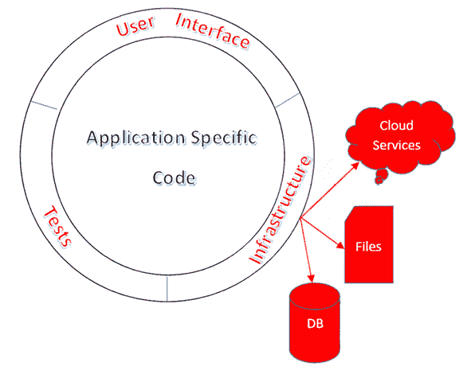

图 3.1：基本洋葱架构

相反，应用特定代码组织成几个更嵌套的层。所有层都必须满足以下约束：

每一层可能只能引用内部层。这种约束的实现方式取决于底层语言和堆栈。例如，层可以实施为包、命名空间或库。我们还将使用 .NET 库项目来实现层，这些项目可以轻松地转换为 NuGet 包。

因此，例如，在先前的图中，最外层可能引用所有应用特定库，以及实现所有所需驱动程序的库。

应用特定代码通过接口引用最外层驱动程序中实现的功能，而最外层的主要功能是提供一个依赖注入引擎，将每个接口与其实现的驱动程序耦合：

```cs
...
builder.Services.AddScoped<IMyFunctionalityInterface1, MyFunctionalityImplementation1>();
builder.Services.AddScoped<IMyFunctionalityInterface2, MyFunctionalityImplementation2>();
... 
```

应用特定层反过来又由至少两个主要层组成：一个包含所有领域实体定义的层，称为**领域层**，以及一个包含所有应用操作定义的层，称为**应用服务层**，如图所示：

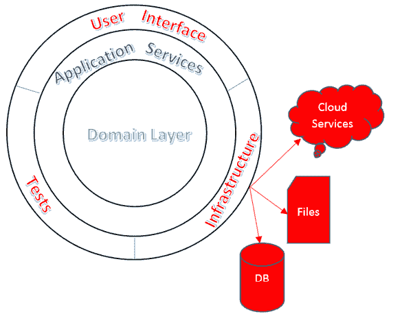

图 3.2：完整的洋葱架构

如果需要，应用服务层可以进一步分为更多子层，并且可以在应用服务和领域层之间放置更多层，但这很少发生。

领域层通常分为两个子层：**模型层**，其中包含实际的领域实体定义，以及**领域服务层**，其中包含更进一步的业务规则。

在本书的整个过程中，我们将仅使用应用服务和领域层。我们将在单独的小节中讨论每个层。

## 领域层

领域层包含每个领域实体的类表示，其行为编码在这些类的公共方法中。

此外，域实体可以通过表示实际域操作的方法进行修改。因此，例如，我们无法直接访问和修改采购订单的所有字段；我们仅限于通过表示实际域操作的方法来操作它，例如添加或删除项目、应用折扣或修改交货日期。

所有公共方法和属性的名称必须使用域专家实际使用的语言构建，即之前提到的**通用语言**。

所有上述约束的目的是优化开发人员与专家之间的通信。这样，域专家和开发人员可以讨论实体的公共接口，因为它使用相同的词汇和实际域操作。

以下是一个假设的`PurchaseOrder`实体的部分：

```cs
 public class PurchaseOrder
    {
      …
      #region private members
      private IList<PurchaseOrderItem> items;
      private DateTime _deliveryTime;
      #endregion
      public PurchaseOrder(DateTime creationTime, DateTime deliveryTime)
        {
          CreationTime = creationTime;
          _deliveryTime = deliveryTime;
          items=new List<PurchaseOrderItem>();
        }
      public DateTime CreationTime {get; init;}
      public DateTime DeliveryTime => _deliveryTime;
      public IEnumerable<PurchaseOrderItem> Items => items;
      public bool DelayDelyveryTime(DateTime newDeliveryTime)
        {
          if(_deliveryTime< newDeliveryTime)
            {
              _deliveryTime = newDeliveryTime;
              return true;
            }
          else return false;
        }
      public void AddItem (PurchaseOrderItem x)
        { items.Add(x); }
      public void RemoveItem(PurchaseOrderItem x)
        { items.Remove(x); }
       …
  } 
```

一旦从构造函数中取出，`CreationTime`就无法再修改，因此它被实现为一个 `{`get; init;`}` 属性。所有项目的列表可以通过`AddItem`和`RemoveItem`方法进行修改，这些方法对所有域专家来说都是可理解的。最后，我们可以延迟交货日期，但不能提前预测。这自动通过强制使用`DelayDeliveryTime`方法来编码域业务规则。

我们可以通过添加一个返回采购总金额的`PurchaseTotal` **获取属性**以及添加一个`ApplyDiscount`方法来改进`PurchaseOrder`实体。

总结起来，我们可以提出以下规则：

域实体状态只能通过编码实际域操作并自动强制执行所有业务规则的方法来更改。

这些实体与我们所习惯的**Entity Framework Core**实体有很大不同，原因如下：

+   Entity Framework Core 实体是类似记录的类，没有方法。也就是说，它们只是一组属性-值对。

+   每个 Entity Framework Core 实体对应一个与其它实体有关联的单个对象，而域实体通常是嵌套对象的树。这就是为什么域实体通常被称为**聚合**。

因此，例如，`PurchaseOrder`聚合包含一个主实体和一个`PurchaseOrderItem`集合。值得注意的是，`PurchaseOrderItem`不能被视为一个独立的域实体，因为没有涉及单个`PurchaseOrderItem`的域操作，但`PurchaseOrderItem`可以像`PurchaseOrder`的一部分一样被操作。

这种现象在扁平的 Entity Framework 实体中不会发生，因为它们缺乏域操作的概念。我们可以得出以下结论：

域实体上的域操作可以迫使它们与依赖实体合并，从而成为一个称为**聚合**的复杂对象树。

在本书的剩余部分，我们将把域实体称为聚合。

到目前为止，我们已经给实体赋予了强大的应用领域语义以及聚合的概念。这些聚合与数据库元组以及 ORMS（如 Entity Framework Core）提供的对象表示有很大不同，因此聚合与用于持久化的结构之间存在不匹配。这种不匹配可以通过几种方式解决，但所有解决方案都必须符合**持久化无知**原则：

聚合不应受其可能如何持久化的影响。它们必须与持久化代码完全解耦，持久化技术不得对聚合设计施加任何约束。

我们现在观察到另一个现象：没有身份的实体！

两个日期和项目完全相同的采购订单仍然是两个不同的实体；实际上，它们必须为每个实体有不同的交货。

然而，对于包含完全相同字段的两个地址会发生什么？如果我们考虑地址的语义，我们能否说它们是两个不同的实体？

每个地址表示一个地点，如果两个地址具有相同的字段，它们表示的地点也完全相同。因此，地址就像数字一样：即使我们可能复制它们多次，每个副本始终表示相同的抽象实体。

因此，我们可以得出结论，具有相同字段的地址是不可区分的。关系数据库使用主键来验证两个元组是否引用相同的抽象实体，因此我们可以得出结论，地址的主键应该是所有字段的集合。

在领域实体理论中，类似于地址的对象被称为值对象，它们在内存中的表示不得包含显式的主键。应用于它们两个实例的相等运算符必须仅在所有字段都相等时返回`true`。此外，它们必须是不可变的——也就是说，一旦创建，它们的属性就不能更改，因此修改值对象的唯一方法是用一些属性值更改创建一个新的对象。

在 C#中，值对象可以用**记录**轻松表示：

```cs
public record Address
{
  public string Country {get; init;}
  public string Town {get; init;}
  public string Street {get; init;}
} 
```

`init`关键字使得记录类型属性不可变，因为它意味着它们只能

初始化。可以创建如下修改后的记录副本：

```cs
var modifiedAddress = myAddress with {Street = "new street"}; 
```

如果我们在构造函数中传递所有属性而不是使用初始化器，则前面的定义可以简化如下：

```cs
public record Address(string Country, string Town, string Street) ; 
```

典型的值对象包括成本（表示为数字和货币符号）、位置（表示为经度和纬度）、地址和联系信息。

在实践中，值对象可以用包含主键（例如，一个自增整数）的常规元组在数据库中表示。然后，可以为每个相同地址的出现创建不同的新元组副本。也可以通过定义复杂的复合键来强制执行唯一的数据库副本。

由于聚合和值对象与所有主要 ORM（如 Entity Framework）使用的实体有很大不同，当我们使用 ORM 与数据库交互时，我们必须在每次与 ORM 交换数据时将 ORM 实体转换为聚合和值对象，反之亦然。

根据通用的洋葱架构规则，领域层通过接口与 ORM 提供的实际实现进行交互。这通常是通过所谓的**仓库模式**来完成的。

根据仓库模式，必须为每个聚合提供一个单独的接口来提供存储服务。

这意味着领域层必须为每个聚合包含一个不同的接口，该接口负责检索、保存和删除整个聚合。仓库模式有助于保持代码模块化，易于搜索和更新，因为我们知道我们必须为每个聚合只有一个仓库接口，因此我们可以将整个聚合相关代码组织在单个文件夹中。

每个仓库的实际实现包含在洋葱架构的基础设施层中的一种数据库（或持久性）驱动程序中，以及各种其他驱动程序，这些驱动程序虚拟化了与基础设施的交互。

每个聚合仓库接口包含返回聚合、删除聚合以及在对聚合执行任何其他持久性相关操作的方法。

在复杂的应用程序中，将领域层拆分为一个仅包含聚合的模型层和一个外部的领域服务层是最佳实践，其中领域服务层包含仓库接口和定义那些不能作为聚合方法实现的领域操作。

特别是，**领域服务**接口处理用于编码查询微服务返回结果的元组。这些元组不是聚合，而是来自不同数据表的数据的混合，因此它们符合完全不同的设计模式。它们作为没有方法、只有与数据库元组字段相对应的属性的记录样对象返回。进一步的**领域服务**接口也在基础设施层持久性驱动程序中实现。

分别处理查询和修改，并使用不同的设计模式，这被称为**命令查询责任分离（CQRS）模式**。

由于本书中描述的微服务相当简单，在我们的代码示例中，我们不会将领域层拆分为模型和领域服务层。因此，仓库和其他领域服务接口将与聚合混合在同一 Visual Studio 项目中。然而，在实现更复杂的应用程序时，你应该使用将领域层拆分为模型和领域服务层的做法。

让我们看看一些仓库接口的示例。`PurchaseOrder`聚合可能有一个相关的仓库接口，看起来如下所示：

```cs
 public interface IPurchaseOrderRepository
    {
      PurchaseOrder New(DateTime creationTime, DateTime deliveryTime);
      Task<PurchaseOrder> GetAsync(long id);
      Task DeleteAsync(long id);
      Task DeleteAsync(PurchaseOrder order);
      Task<IEnumerable<OrderBasicInfoDTO>> GetMany(DateTime? startPeriod,
            DateTime? endPeriod, int? customerId
            );
         ...
    } 
```

没有更新方法，因为更新是通过直接调用聚合体方法实现的。代码中显示的最后一个方法返回一个名为`OrderBasicInfoDTO`的记录样式的 DTO 集合。

值得注意的是，由于值对象被像整数、小数或字符串这样的原始类型一样处理，因此与值对象没有关联的存储库接口。

多个不同聚合体的更改可以通过**工作单元**模式以事务方式处理，该模式将在后面的*命令*子节中描述。

关于 Entity Framework Core 如何支持实现存储库接口以及如何将领域对象与 Entity Framework Core 实体相互绑定和转换的更多细节将在*基于洋葱架构的解决方案模板*部分给出。

理解了领域对象的内存表示后，我们可以继续了解面向微服务的洋葱架构如何表示所有业务事务/操作。

## 应用服务

在*第二章*的*微服务组织*子节[*揭秘微服务应用*]中，我们了解到微服务架构通常使用**CQRS**模式，其中一些微服务专门处理查询，而另一些则专门处理更新。这就是 CQRS 模式的强版本，但还有一个较弱的版本，它只需将查询和更新组织到不同的模块中，这些模块可能属于同一个微服务。

虽然并不总是方便应用 CQRS 的较强形式，但在实现微服务时，其较弱形式是必须的，因为更新涉及聚合体，而查询仅涉及记录样式的 DTO，因此它们需要完全不同类型的处理。

因此，在微服务的应用服务层中定义的操作被分为两种不同类型：**查询**和**命令**。正如我们将看到的，命令的执行可以触发事件，因此与应用服务和查询一起，应用服务还必须处理所谓的**领域事件**。我们将在接下来的专用子节中讨论所有这些不同的操作。

### 查询

查询对象代表一个或多个类似的查询，因此它通常有一个或多个方法，这些方法接受一些输入并返回查询结果。大多数查询方法只是调用一个实现所需查询的单个存储库方法，但在某些情况下，它们可能执行多个存储库方法，然后它们可能会以某种方式合并它们的结果。

在系统测试期间，实际的查询实现必须被模拟实现所替代，因此，通常每个查询都有一个与之关联的接口，该接口与依赖注入引擎中的实际实现耦合。这样，UI 可能只需要在某个构造函数中提供该接口，从而可以使用查询的模拟实现进行测试。

以下是一个可能的查询定义，该查询返回在给定日期之后发出的所有采购订单，以及其关联的接口：

```cs
public interface IPurchaseOrderByStartDateQuery: IQuery
{
  Task<IEnumerable<OrderBasicInfoDTO>> Execute(DateTime startDate);
}
public class PurchaseOrderByStartDateQuery(IPurchaseOrderRepository repo):
  IPurchaseOrderByStartDateQuery
{
  public async Task<IEnumerable<OrderBasicInfoDTO>> Execute(DateTime startDate)
  {
    return await repo.GetMany(startDate, null, null);
  }
} 
```

该接口继承自一个空接口，其唯一目的是标记接口及其实现为查询。这样，所有查询及其相关实现都可以通过反射自动找到并添加到依赖注入引擎中。我们将在“基于洋葱架构的解决方案模板”部分提供发现所有查询的代码，以及一个完整的解决方案模板。

如前所述，实现只是调用存储库方法并传递足够的参数。存储库的实现是通过与将查询本身注入到表示层对象（在 ASP.NET Core 网站上是控制器）的构造函数相同的依赖注入引擎传递到类的主体构造函数中的。

### 命令

命令以略有不同的方式工作，因为为了提高代码的可读性，每个命令代表一个单独的应用程序操作。因此，每个命令实例代表抽象操作及其输入。实际的操作实现包含在命令处理程序对象中。以下是一个假设的命令的代码，该命令将折扣应用于采购订单：

```cs
public record ApplyDiscountCommand(decimal discount, long orderId): ICommand; 
```

命令必须是不可变的；这就是为什么我们将它们实现为记录。实际上，对它们唯一允许的操作是它们的执行。类似于查询，命令也实现了一个空接口，标记它们为命令（在这种情况下，`ICommand`）。

命令处理程序是实现以下接口的实现：

```cs
 public interface ICommandHandler {}
    public interface ICommandHandler<T>: ICommandHandler
        where T: ICommand
    {
      Task HandleAsync(T command);
    } 
```

正如你所看到的，所有命令处理程序都实现了相同的`HandleAsync`方法，该方法接受命令作为其唯一的输入。因此，例如，与`ApplyDiscountCommand`关联的处理程序可能如下所示：

```cs
public class ApplyDiscountCommandHandler(
IPackageRepository repo):ICommandHandler<ApplyDiscountCommand>
  {
    public async Task HandleAsync(ApplyDiscountCommand command)
      {
        var purchaseOrder = await repo.GetAsync(command.OrderId);
 //call adequate aggregate methods to apply the required update
//possibly modify other aggregates by getting them with other
        //injected repositories
        ...
      }
    } 
```

所有处理程序都必须添加到依赖注入引擎中，如下例所示：

```cs
builder.Services.AddScoped<ICommandHandler<ApplyDiscountCommand>,
 ApplyDiscountCommandHandler>(); 
```

这可以通过使用反射扫描应用程序服务程序集来自动完成。我们将在“基于洋葱架构的解决方案模板”部分提供发现所有命令处理程序的代码。

每个命令处理程序都会获取或创建聚合，通过调用它们的方法来修改它们，然后执行一个保存指令以在底层存储中持久化所有修改。

保存操作必须在存储驱动程序（例如，Entity Framework Core）中实现，因此，对于所有洋葱架构驱动程序的常规操作，它通常通过接口进行中介。执行保存操作和其他事务相关操作的接口通常称为**IUnitOfWork**。此接口的可能定义如下：

```cs
public interface IUnitOfWork
  {
    Task<bool> SaveEntitiesAsync();
    Task StartAsync();
    Task CommitAsync();
    Task RollbackAsync();
  } 
```

让我们分解一下：

+   `SaveEntitiesAsync` 在单个事务中保存迄今为止执行的所有更新器。如果存储引擎在保存操作后实际上发生了变化，则返回 `true`，否则返回 `false`。

+   `StartAsync` 开始一个事务。

+   `CommitAsync` 和 `RollbackAsync` 分别提交和回滚一个打开的事务。

所有明确控制事务开始和结束的方法都很有用，可以将获取操作和最终的 `SaveEntitiesAsync` 保存操作封装在同一事务中，如下面的简化航班预订片段所示：

```cs
await unitOfWork.StartAsync();
var flight = await repo.GetFlightAsync(flightId);
flight.Seats--;
if(flight.Seats < 0)
{
  await unitOfWork.RollBackAsync();
  return;
}
...
await unitOfWork.SaveEntitiesAsync();
await unitOfWork.CommitAsync(); 
```

如果没有更多的可用座位，事务将被中止，但如果还有可用座位，我们确信没有其他乘客可以占用这个座位，因为查询和更新都是在同一事务中执行的，从而防止其他预订操作的影响。

当然，如果事务具有足够的隔离级别并且数据库支持该隔离级别，前面的代码是有效的。我们可以为微服务中的所有操作使用足够高的隔离级别；否则，我们被迫将隔离级别作为 `StartAsync` 参数传递。

现在，我们准备解释为什么需要领域事件，以及它们是如何被处理的。

### 领域事件

我们可以这样定义**领域事件**：

**领域事件**是从微服务领域中发生的事情产生的，并且是在微服务本身的边界内被处理的。这意味着它们涉及同一微服务两段代码之间的基于发布者-订阅者模式的通信。

因此，它们不应与涉及不同微服务之间通信的事件混淆，这些事件被称为**集成事件**，以区分领域事件。

为什么要在微服务的边界内使用事件？原因始终相同：为了确保部分之间的更好的解耦。在这里，涉及的部件是聚合。每个聚合的代码必须完全独立于其他聚合，以确保模块化和可修改性，因此聚合之间的关系要么由命令处理器中介，要么由某种发布者-订阅者模式中介。

因此，如果两个聚合之间的交互由命令处理器的代码决定，同一个命令处理器可能会负责处理它们的数据，然后以某种方式更新它们。然而，如果交互与聚合方法内的处理相关联，我们被迫使用事件，因为我们无法让聚合意识到所有需要通知其数据更改的其他聚合。总结一下，我们可以提出以下原则：

领域事件仅在聚合方法内部触发，因为其他类型的交互更适合由命令处理器的代码来处理。

另一个重要的原则是以下内容：

在聚合方法内部触发的事件不应干扰正在进行的方法处理，因为这些可能会破坏聚合与操作它的命令处理器之间的契约。

因此，每个聚合将所有事件存储在其内部的事件列表中，然后命令处理器决定何时执行这些处理器。通常，命令处理器处理的所有聚合的事件都在处理器通过调用`unitOfWork.SaveEntitiesAsync()`保存所有更改之前执行。然而，这并不是一个普遍的规则。

事件的处理方式与命令类似，唯一的区别是每个命令只有一个关联的处理程序，而每个事件可能有多个订阅附加到它。幸运的是，这种困难可以通过.NET 依赖注入引擎的一些高级功能轻松解决。

更具体地说，事件是带有空`IEventNotification`接口的类，而事件处理器是实现以下接口的：

```cs
public interface IEventHandler
{
}
public interface IEventHandler<T>: IEventHandler
    where T: IEventNotification
  {
    Task HandleAsync(T ev);
  } 
```

所有的数据结构都与处理命令所需的数据结构完全类似。然而，现在我们必须添加一些增强功能，以将每个事件与其所有处理器关联起来。以下泛型类就做到了这一点：

```cs
public class EventTrigger<T>
        where T: IEventNotification
  {
    private readonly IEnumerable<IEventHandler<T>> _handlers;
    public EventTrigger(IEnumerable<IEventHandler<T>> handlers)
      {
        _handlers = handlers;
      }
      public async Task Trigger(T ev)
      {
        foreach (var handler in _handlers)
          await handler.HandleAsync(ev);
      }
  } 
```

在这里，`IEventNotification`是一个空接口，仅用于标记一个类表示事件。

如果我们使用`service.AddScoped(typeof(EventTrigger<>))`将前面的泛型类添加到依赖注入引擎中，那么每次我们需要这个类的特定实例（比如，对于`MyEvent`事件泛型参数）时，依赖注入引擎将自动检索所有`IEventHandler<MyEvent>`实现，并将它们传递给返回的`EventTrigger<MyEvent>`实例的构造函数。之后，我们可以使用类似以下的方式启动所有已订阅的处理程序：

```cs
public class MyCommandHandler(EventTrigger<MyEvent> myEventHandlers): …
{
  public async Task HandleAsync(MytCommand command)
  {
    …
    await myEventHandlers.Trigger(myEvent)
    …
   }
} 
```

值得注意的是，`IEventNotification`接口必须在领域层中定义，因为它必须使用聚合，而所有其他与事件相关的接口和类都定义在应用程序服务 DLL 中。

作为事件的一个例子，让我们考虑一个电子商务应用程序的采购订单聚合。当通过调用其`Finalize`方法最终确定采购订单时，如果采购金额超过一个给定的阈值，那么必须创建一个事件来为用户添加一些分数到用户资料中，用户可以用这些分数在后续采购中获得折扣。

下图展示了发生的情况：

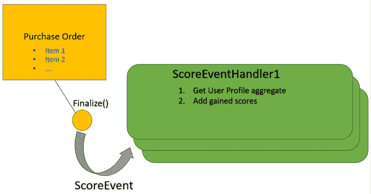

图 3.3：领域事件示例

就像命令处理器的情况一样，在应用程序服务 DLL 中定义的所有事件处理器都可以通过反射自动发现并添加到依赖注入引擎中。我们将在下一节中展示如何实现，该节将提出一个用于洋葱架构的通用.NET 解决方案模板。

# 基于洋葱架构的解决方案模板

在本节中，我们描述了一个基于洋葱架构的解决方案模板，我们将在本书的其余部分使用该模板，您可以在书的 GitHub 仓库的 `ch03` 文件夹中找到它（[`github.com/PacktPublishing/Practical-Serverless-and-Microservices-with-Csharp`](https://github.com/PacktPublishing/Practical-Serverless-and-Microservices-with-Csharp)）。此模板展示了如何将您所学的洋葱架构知识付诸实践。

该解决方案包含两个 .NET 库项目，分别称为 `ApplicationServices` 和 `DomainLayer`，它们分别实现了洋葱架构的应用服务和领域层：

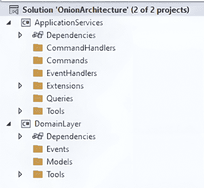

图 3.4：基于洋葱架构的解决方案模板

根据洋葱架构的规定，`ApplicationServices` 项目引用了 `DomainLayer` 架构项目。

在 `ApplicationServices` 中，我们添加了以下文件夹：

+   `Queries` 用于放置所有查询和查询接口

+   `Commands` 用于放置所有命令类

+   `CommandHandlers` 用于放置所有命令处理程序

+   `EventHandlers` 用于放置所有事件处理程序

+   `Tools` 包含了我们在上一节描述的应用服务所使用的所有洋葱架构相关的接口

+   `Extensions` 包含了 `HandlersDIExtensions.AddApplicationServices()` 扩展方法，该方法将项目中定义的所有查询、事件处理程序和命令处理程序添加到依赖注入引擎中

所有的前述文件夹都可以组织成子文件夹，以增加代码的可读性。

在 `DomainLayer` 项目中，我们添加了以下文件夹：

+   `Models` 用于放置所有聚合和值对象

+   `Events` 用于放置所有可能由聚合引发的事件

+   `Tools` 包含了我们在上一节描述的领域所使用的所有洋葱架构相关的接口，以及一些额外的实用类

`ApplicationServices` 项目的 `Extensions` 文件夹中只包含一个文件：


图 3.5：ApplicationServices 扩展

`HandlersDIExtensions` 静态类包含一个扩展方法的两个重载，该扩展方法将所有查询、命令处理程序、事件处理程序和 `EventMediator` 类添加到依赖注入引擎中：

```cs
public static IServiceCollection AddApplicationServices
  (this IServiceCollection services, Assembly assembly)
{
  AddAllQueries(services, assembly);
  AddAllCommandHandlers(services, assembly);
  AddAllEventHandlers(services, assembly);
  services.AddScoped<EventMediator>();
  return services;
}
public static IServiceCollection AddApplicationServices
  (this IServiceCollection services)
{
  return AddApplicationServices(services,
    typeof(HandlersDIExtensions).Assembly);
} 
```

它使用三个不同的私有方法通过反射扫描程序集，分别查找查询、命令处理程序和事件处理程序。完整的代码可以在与本书相关的 GitHub 仓库的 `ch03` 文件夹中找到。在这里，我们仅分析 `AddAllCommandHandlers` 以展示所有三种方法所利用的基本思想：

```cs
private static IServiceCollection AddAllCommandHandlers
  (this IServiceCollection services, Assembly assembly)
{
  var handlers = assembly.GetTypes()
    .Where(x => !x.IsAbstract && x.IsClass
      && typeof(ICommandHandler).IsAssignableFrom(x));
  … 
```

首先，我们收集所有实现 `ICommandHandler` 空接口的非抽象类。这个接口被特别添加到所有命令处理器中，以便通过反射检索所有这些处理器。然后，对于每个处理器，我们检索它实现的 `ICommandHandler<T>`：

```cs
foreach (var handler in handlers)
{
  var handlerInterface = handler.GetInterfaces()
    .Where(i => i.IsGenericType &&typeof(
      ICommandHandler).IsAssignableFrom(i))
    .SingleOrDefault(); 
```

最后，如果我们找到这样的接口，我们将该对添加到依赖注入引擎中：

```cs
foreach (var handler in handlers)
{
  …
  if (handlerInterface != null)
  {
    services.AddScoped(handlerInterface, handler);
  }
} 
```

`ApplicationServices` 项目的 `Tools` 文件夹包含以下文件：

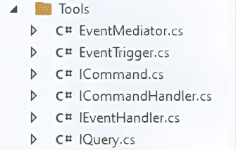

图 3.6：ApplicationServices 工具

我们已经分析了前面 `Tools` 文件夹中包含的所有接口和类，除了上一节中的 `EventMediator`。让我们回顾一下它们：

+   `IQuery` 和 `ICommand` 是空接口，分别标记查询和命令

+   `ICommandHandler<T>` 和 `IEventHandler<T>` 是必须分别由命令处理器和事件处理器实现的接口

+   `EventTrigger<T>` 是一个收集与同一事件 `T` 相关的所有事件处理器的类

`EventMediator` 是一个实用类，用于解决实际问题。需要触发与事件 `T` 相关的所有事件处理器的命令处理器必须在构造函数中注入 `EventTrigger<T>`。然而，关键点是命令发现它需要触发 `T` 事件，正是在它找到聚合体的事件列表中的 `T` 事件时，因此它应该在构造函数中注入所有可能的 `EventTrigger<T>`。

为了克服这个问题，`EventMediator` 类使用 `IServiceProvider` 在其 `TriggerEvents(IEnumerable<IEventNotification> events)` 方法中要求传递给它的与事件列表相关的事件处理器。

因此，只需在每个命令处理器的构造函数中注入 `EventMediator`，这样每当它在一个聚合体中找到一个非空的事件列表 `L` 时，它就可以简单地调用以下操作：

```cs
await eventMediator.TriggerEvents(L); 
```

一旦 `EventMediator` 收到前面的调用，它将扫描事件列表以发现其中包含的所有事件，然后对于每个事件，它要求相应的 `EventTrigger<T>` 获取所有相关的事件处理器，最后，它执行所有检索到的处理器，并将相应的事件传递给它们。

为了执行其工作，`EventMediator` 类在其构造函数中需要 `IServiceProvider`：

```cs
public class EventMediator
{
  readonly IServiceProvider services;
  public EventMediator(IServiceProvider services)
  {
    this.services = services;
  }
  ... 
```

然后，它使用这个服务提供者来要求每个需要的 `EventTrigger<T>`：

```cs
public async Task TriggerEvents(IEnumerable<IEventNotification> events)
  {
    if (events == null) return;
    foreach(var ev in events)
    {
      var triggerType = typeof(EventTrigger<>).MakeGenericType(
        ev.GetType());
      var trigger = services.GetService(triggerType); 
```

最后，它通过反射调用 `EventTrigger<T>.Trigger` 方法：

```cs
var task = (Task)triggerType.GetMethod(nameof(
  EventTrigger<IEventNotification>.Trigger))
  .Invoke(trigger, new object[] { ev });
await task.ConfigureAwait(false); 
```

以下是 `EventMediator` 类的完整代码：

```cs
public class EventMediator
{
  readonly IServiceProvider services;
  public EventMediator(IServiceProvider services)
  {
    this.services = services;
  }
  public async Task TriggerEvents(IEnumerable<IEventNotification> events)
  {
    if (events == null) return;
    foreach(var ev in events)
    {
      var triggerType = typeof(EventTrigger<>).MakeGenericType(
        ev.GetType());
      var trigger = services.GetService(triggerType);
      var task = (Task)triggerType.GetMethod(nameof(
        EventTrigger<IEventNotification>.Trigger))
        .Invoke(trigger, new object[] { ev });
      await task;
    }
  }
} 
```

`DomainLayer` 项目的 `Tools` 文件夹包含以下文件：

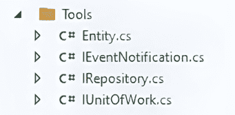

图 3.7：DomainLayer 工具

`IEventNotification` 和 `IRepository` 是空接口，分别标记事件和存储库接口。我们已经在上一节中讨论了它们。我们也已经讨论了 `IUnitOfWork`，这是命令处理器需要用来持久化更改和处理事务的接口。

`Entity<T>` 是所有聚合必须继承的类：

```cs
public abstract class Entity<K>
    where K: IEquatable<K>
{
  public virtual K Id {get; protected set; } = default!;
  public bool IsTransient()
  {
    return Object.Equals(Id, default(K));
  }
  >Domain events handling region
  >Override Equal region
} 
```

前一个类包含两个最小化代码区域。泛型参数 `K` 是聚合的 `Id` 主键的类型。

`IsTransient()` 方法返回 `true` 如果聚合尚未分配主键。

`Override Equal region` 包含覆盖 `Equal` 方法并定义相等和不等运算符的代码。重新定义的 `Equal` 方法认为两个实例相等当且仅当它们具有相同的主键。

`Domain events handling region` 处理在调用聚合方法期间触发的事件列表。展开的代码如下所示：

```cs
#region domain events handling
public List<IEventNotification> DomainEvents { get; private set; } = null!;
public void AddDomainEvent(IEventNotification evt)
{
  DomainEvents ??= new List<IEventNotification>();
  DomainEvents.Add(evt);
}
public void RemoveDomainEvent(IEventNotification evt)
{
  DomainEvents?.Remove(evt);
}
#endregion 
```

我们不需要为值对象提供一个抽象类，因为，如前所述，.NET 的 `record` 类型完美地代表了所有值类型特性。

在更详细地讨论如何将模板的两个库项目与实际的存储驱动程序和实际的 UI 连接之前，我们需要了解如何处理聚合和类似记录的 ORM 类之间的不匹配。我们将在下面的专用子节中这样做。

## 匹配聚合和 ORM 实体

有几种技术可以将 ORM 实体和聚合匹配起来。最简单的一种是使用 ORM 实体本身实现聚合。这种方法的主要困难是聚合不公开必须与数据库字段匹配的属性作为公共属性。然而，由于它们通常将它们作为私有字段公开，如果选择的 ORM 支持使用私有属性进行映射，我们可以尝试使用这些私有字段进行数据库字段映射。

Entity Framework Core 支持使用私有字段进行映射，但如果我们正在寻找完全独立于数据库驱动程序，我们不能依赖于 Entity Framework Core 的这一特性。此外，这种方法迫使我们定义 ORM 实体在域层中，因为它们也是聚合。这意味着我们不能在定义每个聚合时用 ORM 特定的属性装饰类成员，并且我们需要担心 ORM 如何使用该类，从而破坏了对特定存储驱动程序的独立性。

更好的方法是 **状态对象** 方法：

1.  我们将每个聚合与一个接口关联，该接口将其状态存储在其属性中。这样，而不是使用私有支持字段，聚合使用该接口的属性。

1.  状态接口传递给聚合的构造函数，然后存储在一个私有的 `readonly` 属性中。

1.  与聚合关联的 ORM 实体实现了此接口。这样，数据库驱动器适应聚合，而不是反过来，从而实现了领域层对数据库驱动器的所需独立性。

1.  当领域层需要通过存储库接口方法获取一个新的聚合或已存储在数据库中的聚合时，存储库方法的数据库实现创建或检索相应的 ORM 实体，然后创建一个新的聚合，将其作为状态对象传递给其构造函数。

1.  当聚合被修改时，所有修改都会反映在其状态对象上，这些对象作为 ORM 实体被 ORM 跟踪。因此，当我们指示 ORM 保存所有更改时，所有聚合的更改会自动传递到底层数据库，因为这些更改存储在跟踪对象中。

以下图显示了前面的流程：

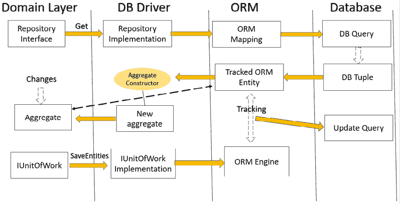

图 3.8：聚合生命周期

让我们尝试使用以下状态接口修改我们之前的 `PurchaseOrder` 聚合：

```cs
public interface IPurchaseOrderState
{
  public DateTime CreationTime { get; set; }
  public DateTime DeliveryTime { get; set; }
  public ICollection<PurchaseOrderItem> Items { get; set; }
  …
} 
```

修改很简单，不会增加代码的复杂性：

```cs
public class PurchaseOrder
{
  private readonly IPurchaseOrderState _state;
  public PurchaseOrder(IPurchaseOrderState state)
  {
    _state = state;
  }
  public DateTime CreationTime => _state.CreationTime;
  public DateTime DeliveryTime => _state.DeliveryTime;
  public IEnumerable<PurchaseOrderItem> Items => _state.Items;
  public bool DelayDelyveryTime(DateTime newDeliveryTime)
  {
    if(_state.DeliveryTime < newDeliveryTime)
    {
      _state.DeliveryTime = newDeliveryTime;
      return true;
    }
    else return false;
    }
    public void AddItem (PurchaseOrderItem x)
    { _state.Items.Add(x); }
    public void RemoveItem(PurchaseOrderItem x)
    { _state.Items.Remove(x); }
} 
```

现在，我们准备好了解如何将模板中的两个项目与实际的数据库驱动器和实际的 UI 连接起来。

## 基于洋葱架构的完整解决方案

书籍 GitHub 仓库的 *ch03* 文件夹（[`github.com/PacktPublishing/Practical-Serverless-and-Microservices-with-Csharp`](https://github.com/PacktPublishing/Practical-Serverless-and-Microservices-with-Csharp)）包含一个完整的解决方案，该解决方案与应用程序服务和领域层库一起，还包含基于 Entity Framework Core 的数据库驱动器和基于 ASP.NET Core Web API 项目的表示层。

此项目的目的是展示如何在实际解决方案中使用本节中描述的通用洋葱架构模板。

以下图显示了完整的解决方案：

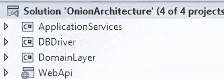

图 3.9：基于洋葱架构的完整解决方案

`DBDrive`r 项目是一个 .NET 库项目，我们在其中添加了对以下 Nuget 包的依赖：

+   `Microsoft.EntityFrameworkCore.SqlServer`：此包加载了 Entity Framework Core 和其 SQL Server 提供程序

+   `Microsoft.EntityFrameworkCore.Tools`：此包提供了所有用于生成和处理数据库迁移的工具

由于 `DBDriver` 项目必须提供存储驱动器，它也依赖于领域库项目。

`WebApi` 项目是一个 ASP.NET Core Web API 项目。它作为洋葱架构的最外层。

洋葱架构的最外层（在我们的例子中，`WebApi`）必须依赖于应用程序服务目录和所有驱动器项目（在我们的例子中，仅为 `DBDrive`r）。

我们向 `DBDriver` 项目添加了一些文件夹和类，这些文件夹和类应该用于所有基于 Entity Framework Core 的驱动程序。以下图显示了项目结构：

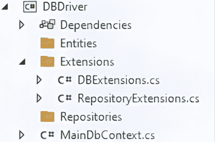

图 3.10：DBDriver 项目结构

下面是所有文件夹的描述：

+   `Entities`：将所有你的 Entity Framework Core 实体放在这里，可能组织在子文件夹中。

+   `Repositories`：将所有仓库实现放在这里，可能组织在子文件夹中。

+   `MainDbContext`：这是项目实体框架数据库上下文的骨架，同时也包含了 `IUnitOfWork` 接口的实现。

+   `Extensions`：这个文件夹包含两个扩展类。`RepositoryExtensions` 只提供 `AddAllRepositories` 扩展方法，该方法发现所有仓库实现并将它们添加到依赖注入引擎中。它的代码类似于我们在前一小节中描述的 `AddAllCommandHandlers` 扩展方法之一，所以我们在这里不会描述它。`DBExtension` 只包含 `AddDbDriver` 扩展方法，该方法将 `DBDriver` 提供的所有实现添加到依赖注入引擎中。

`AddDbDriver` 扩展方法的实现很简单：

```cs
public static IServiceCollection AddDbDriver(
  this IServiceCollection services,
  string connectionString)
{
  services.AddDbContext<IUnitOfWork, MainDbContext>(options =>
    options.UseSqlServer(connectionString,
      b => b.MigrationsAssembly("DBDriver")));
  services.AddAllRepositories(typeof(DBExtensions).Assembly);
  return services;
} 
```

它接受数据库连接字符串作为其唯一输入，并使用常规的 `AddDbContext` Entity Framework Core 扩展方法将 `MainDbContext` 实体框架上下文作为 `IUnitOfWork` 接口的实现。然后，它调用 `AddAllRepositories` 方法来添加 `DBDriver` 提供的所有仓库实现。

下面是 `MainDbContext` 类：

```cs
internal class MainDbContext : DbContext, IUnitOfWork
{
  public MainDbContext(DbContextOptions options)
    : base(options)
    {
    }
  protected override void OnModelCreating(ModelBuilder builder)
   {
  }
  region IUnitOfWork Implementation
} 
```

该类被定义为内部定义，因为它必须在数据库驱动程序外部不可见。所有实体配置都必须像往常一样放在 `OnModelCreating` 方法内部。

`IUnitOfWork` 的实现被最小化了。展开的代码如下所示：

```cs
#region IUnitOfWork Implementation
public async Task<bool> SaveEntitiesAsync()
{
  return await SaveChangesAsync() > 0; ;
}
public async Task StartAsync()
{
  await Database.BeginTransactionAsync();
}
public Task CommitAsync()
{
  return Database.CommitTransactionAsync();
}
public Task RollbackAsync()
{
  return Database.RollbackTransactionAsync();
}
#endregion 
```

`IUnitOfWork` 的实现很简单，因为它与 `DBContext` 方法具有一对一的耦合。

由于我们在依赖注入引擎中仅公开 `IUnitOfWork`，因此所有需要 `MainDbContext` 来完成其工作的仓库必须在它们的构造函数中要求 `IUnitOfWork`，然后它们必须将其转换为 `MainDbContext`。

在讨论了关于 `DBDriver` 我们需要了解的内容之后，让我们转向 Web API 项目。

连接到洋葱架构的最外层项目很容易。我们只需要调用应用程序服务公开的扩展方法，该方法将所有应用程序服务实现注入到依赖注入引擎中，并且我们需要调用所有驱动程序的扩展方法。

在我们的情况下，我们只需要在 `Program.cs` 中添加两个调用：

```cs
..
builder.Services.AddControllers();
builder.Services.AddEndpointsApiExplorer();
builder.Services.AddSwaggerGen();
builder.Services.AddApplicationServices();
builder.Services.AddDbDriver(
  builder.Configuration?.GetConnectionString(
    "DefaultConnection") ?? string.Empty);
.. 
```

在这一点上，对于 ASP.NET Core 项目来说，剩下的只是获取我们控制器构造函数中需要的命令处理器。之后，每个操作方法只需使用它接收到的输入来构建适当的命令，然后必须调用与每个命令关联的处理程序。

对洋葱架构最外层的处理方法的简要描述完成了我们对这种架构的简要介绍，但我们将在整个书籍的其余部分找到示例，因为我们将在大多数代码示例中使用它们。

让我们继续探讨微服务架构的另一个重要构建块：容器！

# 容器和 Docker

我们已经讨论了拥有不依赖于运行环境的微服务的优势；微服务可以在没有限制的情况下从繁忙的节点移动到空闲节点，从而实现更好的负载均衡，并因此更好地利用可用硬件。

然而，如果我们需要将遗留软件与较新的模块混合使用，或者如果我们希望为每个模块使用最佳的堆栈，并且能够混合几种开发堆栈实现，我们将面临每个不同的堆栈都有不同的硬件/软件先决条件的问题。在这些情况下，可以通过在每个微服务上部署每个微服务及其所有依赖项来恢复每个微服务与托管环境的独立性。

然而，启动带有其操作系统私有副本的虚拟机需要花费很多时间，而微服务必须快速启动和停止以减少负载均衡和故障恢复成本。幸运的是，微服务可以依赖一种更轻量级的虚拟化技术：容器。容器提供了一种轻量级且高效的虚拟化形式。与传统虚拟机不同，虚拟机虚拟化整个机器，包括操作系统，容器在操作系统的文件系统级别进行虚拟化，位于宿主操作系统内核之上。它们使用宿主机的操作系统（内核、DLL 和驱动程序），并使用操作系统的本地功能来隔离进程和资源，为它们运行的镜像创建一个隔离的环境。

以下图展示了容器的工作原理：

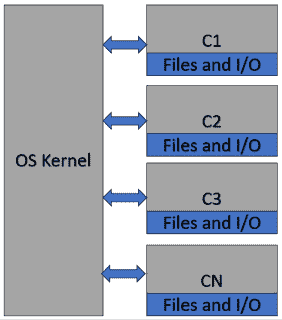

图 3.11：容器基本原理

容器由容器运行时从**镜像**中运行，这些镜像编码了它们的内容。相同的镜像可以创建多个相同的容器。镜像存储在**镜像仓库**中，通过镜像名称和版本来识别它们。反过来，镜像是通过文本文件中的命令创建的，这些命令指定了容器的内容和属性。

更具体地说，名称是 URL，其域名部分是注册表域，路径部分由一个包含相关图像的命名空间和存储库名组成。版本附加到该 URL 上，并用冒号分隔，称为 `tag`，因为它可以是任何字符串。总结来说，名称和版本编码如下所示：

```cs
<registry domain>/<namespace>/<repository name>:<tag> 
```

因此，例如，ASP.NET CORE 9.0 运行时 Docker 镜像的完整 URL 如下所示：

```cs
mcr.microsoft.com/dotnet/aspnet:9.0 
```

在这里，`mcr.microsoft.com` 是注册表域，`dotnet` 是命名空间，`asp.net` 是存储库名，`9.0` 是标签。

任何需要创建容器的运行时都会从注册表中下载其图像，可能提供凭证，然后使用下载的图像来创建容器。以下图显示了容器创建的整个过程：

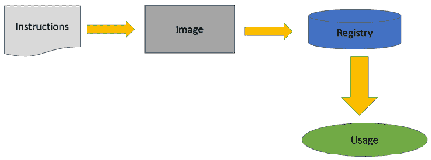

图 3.12：容器/镜像生命周期

在本书的剩余部分，我们将使用 Docker 容器作为事实上的标准。每个 Docker 镜像都是通过指定对另一个现有图像的更改来生成的，这些更改使用 **Docker 容器描述语言**。创建 Docker 镜像的指令包含在一个必须命名为 **Dockerfile**（不带任何文件扩展名）的文件中。

每个 **Dockerfile** 通常以一个 `FROM` 指令开始，该指令指定要修改的现有图像，如下所示：

```cs
FROM mcr.microsoft.com/dotnet/aspnet:9.0
... 
```

在图像 URL 之后指定要使用的 ASP.NET CORE 版本的标签，前面有一个冒号，如前述代码所示。从私有仓库获取的图像必须指定其完整的 URL，该 URL 以注册表的域开始。没有完整 URL 的图像只有在它们托管在 Docker 免费公共注册表 `hub.docker.com/r/` 上时才允许。

下图显示了 Docker 镜像的层次组织结构：

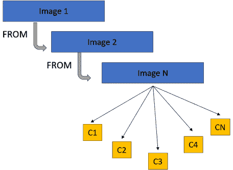

图 3.13：图像和容器的层次结构

`FROM` 语句指定了您所在的环境，称为 **构建阶段**。之后，您可以像处理文件系统一样处理图像，通过将文件从您的计算机复制到其中并执行 shell 命令：

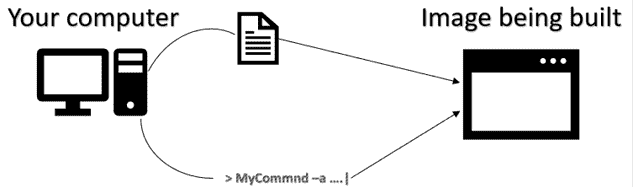

图 3.14：构建镜像

在所有复制操作中，您可以在计算机上使用相对路径。它们被认为是相对于包含 `Dockerfile` 文件的目录的相对路径。

这里列出了主要的 `Dockerfile` 命令：

+   WORKDIR <镜像文件系统中的路径>

    此指令定义了图像文件系统中的当前目录。如果目录不存在，则创建它。之后，您也可以在图像文件系统中使用相对路径。

+   COPY <计算机中的路径> <镜像中的路径>

    将一个或多个文件复制到图像文件系统中。如果源路径表示一个文件夹，则整个文件夹将被递归复制；否则，将复制单个文件。在任何情况下，复制的目录或文件都采用图像路径中指定的名称。

+   复制 <path1> <path2> … ./（或 [<path1>, <path2>, …, ./]

    所有源路径指定的内容都将复制到图像的当前目录。源文件名不会更改。

+   复制 –-from=<image name or url>:<version> …

    这与之前的复制命令类似，但文件是从`from=`之后指定的名称/URL 指定的图像中获取的。只有当图像包含在您的计算机或 Docker 公共仓库中时，才能指定名称而不是 URL。如果没有指定版本，则默认假设为`latest`版本名称。

+   RUN <command> <arg1> <arg2> ...

    这将在图像的当前目录中执行指定的 shell 命令及其参数。

+   CMD [<command>, <arg1>, <arg2>, ...]

    ```cs
    ENTRYPOINT [<command>, <arg1>, <arg2>, ...] 
    ```

    这指定了容器执行时会发生什么。更具体地说，它声明了在容器执行时要运行的命令和参数。

+   EXPOSE <port1> <port2>

    这声明了容器支持的所有端口。网络流量应仅通过此处声明的端口重定向到容器，但不会阻止重定向到其他端口的流量。

Dockerfile 也可以作为定义最终图像的步骤来构建中间图像。例如，可以创建包含整个.NET SDK 的图像，其唯一目的是编译.NET 解决方案。然后，最终二进制文件将通过`Copy –-from=…`指令复制到最终图像中，该图像仅包含.NET 运行时。当讨论 Visual Studio 对 Docker 的支持时，我们将更详细地分析这种可能性。

让我们继续一个非常简单的例子，以便熟悉 Dockerfile 指令以及操作 Docker 图像和容器的 shell 命令。

## Docker Desktop：一个简单示例

为了在客户端计算机上使用 Docker，您需要安装**Doker Desktop**。请参阅*技术要求*部分中的安装说明。正如*技术要求*部分所述，所有示例都假设有一个安装了 WSL 并配置了 Linux 容器的 Windows 机器。

安装 Docker Desktop 后，您将拥有以下内容：

+   Docker 运行时，您可以从图像实例化容器，并在您的计算机上运行它们。

+   Docker 客户端，您可以使用它将 Dockerfile 编译成图像，并执行其他与 Docker 相关的 shell 命令。

+   Docker 本地仓库。您在计算机上编译的所有图像都将放置在这里。从这里，您可以将其移动到其他仓库。此外，在您的机器上创建容器之前，您需要在这里下载它们的图像。

为了展示 Docker 的强大功能，我们将从一个简单的 Java 示例开始。你会看到，你不需要 Java 运行时或 Java SDK 来编译和运行一个简单的 Java 程序，因为所有需要的都下载到了正在构建的镜像中。

让我们先创建一个文件夹来放置构建镜像所需的所有文件。让我们称它为 `SimpleExample`。

在这个文件夹中，放置一个包含以下简单代码的 `Hello.java` 文件：

```cs
class Hello{
  public static void main(String[] args){
    System.out.println("This program runs in a  Docker container");
  }
} 
```

现在，在同一个文件夹中，我们只需要一个包含以下内容的 Dockerfile：

```cs
FROM eclipse-temurin:11
COPY . /var/www/java
WORKDIR /var/www/java
RUN javac Hello.java
CMD ["java", "Hello"] 
```

`eclipse-temurin` 是一个 Java SDK。这将使我们能够在我们的镜像和容器中编译和执行 Java 代码。然后，代码将我们的文件夹中的所有内容复制到正在构建的镜像中的新创建的 `/var/www/java` 路径。请记住，源中的相对路径是根据 Dockerfile 的位置评估的。

最后，我们移动到 `var/www/java` 文件夹并运行 Java 编译器，它将在同一文件夹中创建一个 `.jar` 文件。`CMD` 指令指定在基于此镜像的容器执行时调用之前创建的 `.jar` 文件中的 Java 命令。

现在，我们需要在 `SimpleExample` 文件夹中打开一个 Linux shell 来执行 Docker 命令。同时按住 *shift* 键，右键单击 `SimpleExample` 文件夹的图标，并从出现的菜单中选择打开 Linux shell 的选项。

作为第一步，我们需要 *构建* 我们的 `Dockerfile` 指令来创建一个镜像。这通过 `build` 命令完成，如下所示：

```cs
docker build ./ -t simpleexample 
```

第一个参数指定 Dockerfile 的位置，而 `-t` 选项指定要附加到镜像的标签（镜像 URL），在我们的例子中是 `simpleexample`。由于镜像将被放置在我们的本地 Docker Desktop 注册表中，指定 URL 的存储库部分就足够了，但如果你有多个本地镜像，你也可以添加一个命名空间来更好地分类你的镜像。通常，在这个阶段，不会添加版本标签，Docker 假设 `latest` 默认标签。

记住：所有镜像名称必须是小写！

编译可能需要几秒钟。如果你在编译时查看控制台，你可以看到其他镜像正在递归下载，因为每个镜像都是建立在其他镜像之上的，依此类推。

现在，运行 `docker images` 命令以查看本地注册表上定义的所有镜像。你应该在其中看到 `simpleexample`。镜像也列在当你双击桌面上的 Docker Desktop 图标时出现的 UI 中。

现在，让我们基于新创建的镜像创建一个容器。`run` 命令基于给定的镜像创建一个容器并立即执行它：

```cs
docker run --name myfirstcontainer simpleexample 
```

`--name` 选项指定容器的名称，而其他参数是我们想要用来创建容器的镜像名称。容器打印出我们放在 Java 类中的字符串，然后快速退出。

让我们使用`docker ps`列出所有正在运行的容器。自从我们的容器完成执行后，没有列出任何容器。然而，我们也可以使用`--all`选项看到所有非运行容器：

```cs
docker ps --all 
```

让我们重新执行我们的容器。如果我们重新执行`run`命令，我们将创建另一个容器，所以重新执行休眠容器的正确方法是以下这样：

```cs
docker restart myfirstcontainer 
```

然而，在这种情况下，控制台没有打印任何字符串，因为`restart`将容器运行到另一个进程中。你可能觉得这很奇怪，但并不奇怪，因为容器通常运行一个永不结束的循环，这可能会阻塞你的 shell。

永无止境的容器可以用类似以下的方法停止：

```cs
docker stop myfirstcontainer 
```

当你完成你的容器后，你可以使用以下命令删除它：

```cs
docker rm myfirstcontainer 
```

现在，你也可以使用以下命令删除创建容器时使用的镜像：

```cs
docker rmi simpleexample 
```

你已经学到了很多有用的 Docker shell 命令。下一节将专门介绍一些更高级的有用命令。

## 一些更多的 Docker 命令和选项

在微服务操作期间，Docker 容器会在不同的硬件节点之间移动以平衡负载。不幸的是，当容器被移除以在其他地方创建时，其文件系统中保存的所有文件都会丢失。因此，容器文件系统的一部分被映射到外部存储，通常由网络磁盘单元提供。

这是因为`run`命令有一个选项可以将主机机器上的目录（比如`S`）映射到容器内部存储空间中的目录（比如`D`），这样写入`D`的文件实际上保存在`S`中，并且在容器删除后仍然安全。这个操作称为**绑定挂载**，将其添加到`run`命令的选项如下：

```cs
docker run -v <host machine path>:<container path> ... 
```

另一个选项允许将容器公开的每个端口映射到主机计算机的实际端口：

```cs
docker run -p <host machine port>:<container port> ... 
```

此选项可以重复多次以映射多个端口。没有此选项，将无法将网络流量重定向到容器内部。

`-e`选项将操作系统环境变量传递给容器。容器中运行的代码可以轻松地向操作系统询问这些变量的值，因此它们是配置应用程序的首选方式：

```cs
docker run -e mayvariable1=mayvalue1  -e mayvariable2=mayvalue2\. .. 
```

`run`命令的另一个有用选项是`-d`选项（*d*代表*detached*）：

```cs
docker run -d ... 
```

当提供此选项时，容器将从当前 shell 提示符分离启动，即在不同的进程中。这样，托管永不结束程序（如 Web 服务器）的容器不会阻塞 shell 提示符。

每个镜像都可以附加到无限数量的标签，这些标签可以用作替代名称：

```cs
docker tag <image name> <tag> 
```

标记是将本地镜像推送到公共仓库的第一步。假设我们有一个名为 `myimage` 的镜像，我们希望将其推送到我们在 Azure 上的私有仓库，例如 `myregistry.azurecr.io/`。假设我们希望将此镜像放置在仓库的 `mypath/mymage` 路径中，即 `myregistry.azurecr.io/mypath/mymage`。

作为第一步，我们使用以下方式对我们的镜像进行标记：

```cs
docker tag myimage myregistry.azurecr.io/mypath/mymage 
```

然后，执行一个使用附加到镜像的新标记的 `push` 操作就足够了：

```cs
docker push myregistry.azurecr.io/mypath/mymage:<version> 
```

将公共仓库镜像拉取到我们的本地仓库是直接的：

```cs
docker pull myregistry.azurecr.io/mypath/myotherimage:<version> 
```

在与需要登录的仓库交互之前，我们必须执行登录操作。每个仓库都有自己的登录过程。

使用 Azure CLI 登录 Azure 仓库是最简单的方式。您可以从这里下载其安装程序：[`aka.ms/installazurecliwindows`](https://aka.ms/installazurecliwindows)。

作为第一步，使用以下方式登录到您的 Azure 账户：

```cs
az login 
```

此命令应启动您的默认浏览器，并引导您通过 Azure 账户的手动登录过程。一旦登录到 Azure 账户，您可以通过输入以下命令登录到您的私有仓库：

```cs
az acr login --name <registryname> 
```

在这里，`<registryname>` 是您 Azure 仓库的唯一名称，而不是其完整 URL。登录后，您可以自由地使用您的 Azure 仓库。

Visual Studio 对 Docker 有原生支持。让我们分析这种支持提供的所有可能性。

## Visual Studio 对 Docker 的支持

通过在适当的 Visual Studio 项目选项中简单地选择 **启用容器支持** 复选框，可以启用 Docker 对 Visual Studio 的支持。让我们用 ASP.NET Core MVC 项目进行实验。在项目选择之后，并在选择了项目名称，例如 `DockerTest` 之后，你应该到达以下选项页面：

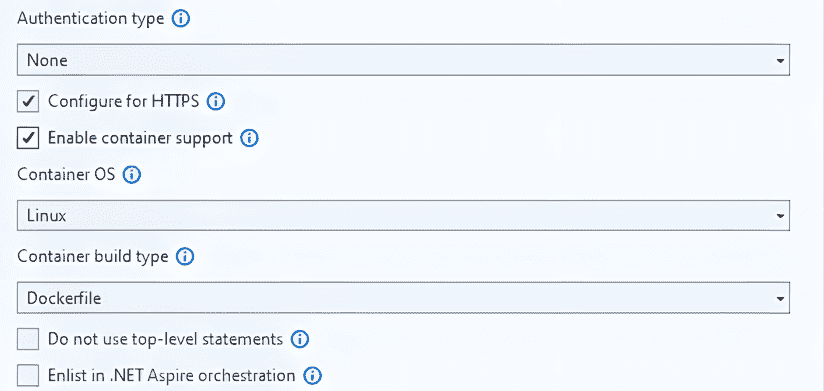

图 3.15：启用 Docker 支持

请检查 **启用容器支持** 复选框。

如果您在这里忘记了启用 Docker 支持，您始终可以在 Visual Studio 解决方案资源管理器中的项目图标上右键单击，然后选择 **添加** -> **Docker 支持**。

项目包含一个 Dockerfile：

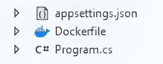

图 3.16：Visual Studio Dockerfile

点击 Dockerfile；它应该包含四个镜像的定义。实际上，最终镜像是在四个阶段中构建的。

第一阶段定义了最终镜像中应用程序使用的 .NET 运行时和端口：

```cs
FROM mcr.microsoft.com/dotnet/aspnet:8.0 AS base
WORKDIR /app
EXPOSE 8080
EXPOSE 8081 
```

在同一文件中，`AS` 后面的 `base` 名称将被其他 `FROM` 指令调用。第二阶段通过使用 `dotnet` SDK 执行项目构建：

```cs
FROM mcr.microsoft.com/dotnet/sdk:8.0 AS build
ARG BUILD_CONFIGURATION=Release
WORKDIR /src
COPY ["DockerTest/DockerTest.csproj", "DockerTest/"]
RUN dotnet restore "./DockerTest/DockerTest.csproj"
COPY . .
WORKDIR "/src/DockerTest"
RUN dotnet build "./DockerTest.csproj" -c $BUILD_CONFIGURATION -o /app/build 
```

`ARG` 指令定义了一个变量，可以在其他指令中以 `$BUILD_CONFIGURATION` 的形式调用。在这里，它被用来定义构建时选择的配置。您可以用 `Debug` 替换其值以在调试模式下编译。

第一条`Copy`指令仅将图像`/src/DockerTest`目录中的项目文件复制。然后，Nuget 包被还原，并将包含 Dockerfile 的目录中的所有源文件复制到当前图像目录`/src`。最后，我们进入`/src/DockerTest`并执行构建。构建输出文件放置在图像中的`/app/build`目录。

第三阶段是在`build`图像之上构建的，并且简单地发布`/app/publish`文件夹中的项目文件：

```cs
FROM build AS publish
ARG BUILD_CONFIGURATION=Release
RUN dotnet publish "./DockerTest.csproj" -c $BUILD_CONFIGURATION -o /app/publish /p:UseAppHost=false 
```

我们可以将阶段 2 和 3 合并为一个阶段，但将阶段拆分成更小的阶段更方便，因为中间图像被缓存，所以在后续构建中，当图像输入没有变化时，将使用缓存图像而不是重新计算它们。

最后，第四个也是最后一个阶段是在第一个阶段之上构建的，因为它只需要.NET 运行时，并且简单地从第三阶段创建的图像中复制已发布的文件：

```cs
FROM base AS final
WORKDIR /app
COPY --from=publish /app/publish .
ENTRYPOINT ["dotnet", "DockerTest.dll"] 
```

现在，在`HomeController.cs`文件的`Index`方法中设置一个断点并运行解决方案。Visual Studio 会自动构建 Dockerfile 并运行图像。

由于 Visual Studio 能够在容器图像内执行调试，因此断点将被触发！

当应用程序运行时，对于每个容器，Visual Studio 会显示日志、环境变量、绑定挂载以及其他信息：

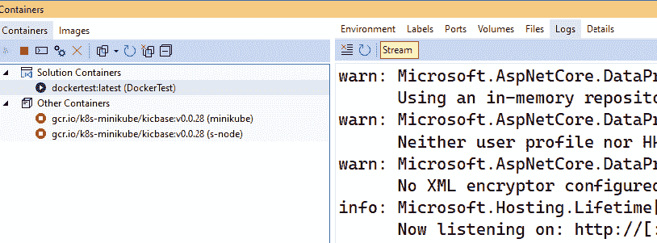

图 3.17：Visual Studio 容器控制台

你也可以在容器内部获得一个交互式 shell，你可以在其中探索容器的文件系统，执行 shell 命令，并执行诊断和性能测量操作，只需打开一个 Linux shell 并输入以下命令：

```cs
docker exec -it <container-name-or-id> /bin/bash 
```

在我们的案例中，让我们使用`docker ps`列出所有正在运行的容器以获取我们的容器 ID：

```cs
CONTAINER ID   IMAGE        COMMAND                  CREATED          STATUS          PORTS                                              NAMES
f6ca4537e060   dockertest   "dotnet --roll-forwa…"   17 minutes ago   Up 17 minutes   0.0.0.0:49154->8080/tcp, 0.0.0.0:49153->8081/tcp   DockerTest 
```

然后，运行以下命令：

```cs
docker exec -it DockerTest /bin/bash 
```

现在，你已经进入了容器文件系统！让我们尝试一些 shell 命令，例如`Is`，例如。当你完成容器操作后，只需运行`exit`命令即可返回到你的主机计算机控制台。

# 摘要

本章描述了微服务架构的两个重要构建块：洋葱架构和 Docker 容器。本章描述了洋葱架构的基本原则以及应用程序服务和领域层的组织方式。更具体地说，我们描述了命令、查询、事件及其处理程序，以及聚合和值对象。

此外，由于 Visual Studio 提供的解决方案模板，你学会了如何在 Visual Studio 解决方案中使用上述概念。

本章解释了容器的重要性、如何构建 Dockerfile 以及如何在实践中使用 Docker shell 命令。最后，本章描述了 Visual Studio 对 Docker 的支持。

下一章将重点介绍 Azure 函数及其主要触发器。

# 问题

1.  域层项目必须引用数据库驱动程序项目，这是真的吗？

不，这是错误的。必须将驱动程序的引用添加到基础设施层。

1.  哪些解决方案项目包含在应用服务的引用中？

只有那些属于域层的项目。

1.  哪些解决方案项目包含在洋葱架构最外层项目的引用中？

应用服务、数据库驱动程序以及所有基础设施驱动程序。

1.  一个聚合体总是对应一个唯一的数据库表，这是真的吗？

不，这是错误的。

1.  为什么需要域事件？

它们被需要来解耦不同聚合的代码。

1.  `WORKDIR` Dockerfile 指令的目的是什么？

设置镜像当前目录。

1.  如何将环境变量传递给容器？

通过 docker run 命令的 -e 选项。

1.  什么是持久化存储 Docker 容器的正确方法？

卷绑定是持久化存储 Docker 容器的方式。

# 进一步阅读

+   更多关于查询、命令和域层的信息可以在这里找到：[`udidahan.com/2009/12/09/clarified-cqrs/`](https://udidahan.com/2009/12/09/clarified-cqrs/)

+   更多关于 Docker 的信息可以在 Docker 的官方网站找到：[`docs.docker.com/`](https://docs.docker.com/)

# 加入我们的 Discord 社区。

加入我们社区的 Discord 空间，与作者和其他读者进行讨论：

[`packt.link/PSMCSharp`](https://packt.link/PSMCSharp)


