# 第四章：可用的 Azure Functions 和触发器

本书的前三章涵盖了无服务器和微服务背景，重点介绍了如何使用这些技术来设计一个与基于微服务架构的应用程序。本章和接下来的章节将深入探讨您编写代码的选项，使用在*第二章*“揭秘微服务应用程序”中提出的共享汽车示例。

要做到这一点，在本章中，我们将介绍 Azure Functions 中可用的不同触发器。这里的重点不仅仅是写关于它，还要测试每个触发器。在*第一章*，“揭秘无服务器应用程序”，我们介绍了其基础知识，但当时没有机会实现它们。

在本章中，我们将重点关注在实现 Azure Functions 时可以使用的三个重要触发器——HTTP、SQL 和 Cosmos DB 触发器。我们将讨论它们的优缺点以及何时是使用它们的良好方法。我们还将通过共享汽车示例来了解每个触发器的目的。让我们开始吧！

# 技术要求

本章需要免费版的 *Visual Studio 2022 社区版* 或 Visual Studio Code。您还需要一个 Azure 账户来创建示例环境。您可以在 [`github.com/PacktPublishing/Practical-Serverless-and-Microservices-with-Csharp`](https://github.com/PacktPublishing/Practical-Serverless-and-Microservices-with-Csharp) 找到本章的示例代码。

# HTTP 触发器

在 Azure Functions 中，最常用的触发器无疑是 HTTP 触发器。此选项的基础是允许您拥有 HTTP 请求，因此您可以非常快速地构建 API、webhooks 和集成。其理念是 Azure Functions 中的方法在收到 HTTP 请求时立即触发，使适当的函数返回相应的响应。

# 优势、劣势以及何时使用 HTTP 触发器

HTTP 触发器的最大优势是它的易用性。实现起来简单直接，可以快速设置。因此，即使您是 Azure Functions 的初学者，也可以快速开始使用它。

此外，它支持多种 HTTP 方法，如 `GET`、`POST`、`PUT` 和 `DELETE`，允许您处理各种网络请求和操作。您还可以在同一个应用程序上运行多个函数，因此这是一种交付微服务的绝佳方式。

HTTP 触发器的另一个巨大优势是它们可以与其他 Azure 服务和第三方 API 集成，因此您可以处理复杂的逻辑。所有这些好处都建立在 Azure Functions 提供的可扩展性和成本效益之上，因此您的应用程序在高流量下将保持响应，并且您只需为执行的代码付费。

当谈到安全性时，HTTP 触发器使我们能够实现不同级别的授权。这些级别从匿名访问到 `AuthorizationLevel` 枚举中描述的管理员级别不等。

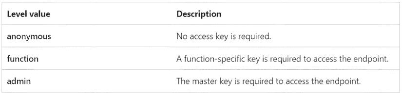

图 4.1：授权级别 – 来源：Microsoft Learn

值得注意的是，这些密钥在 Azure Functions 应用程序内部管理，正如我们在以下图中可以看到的。

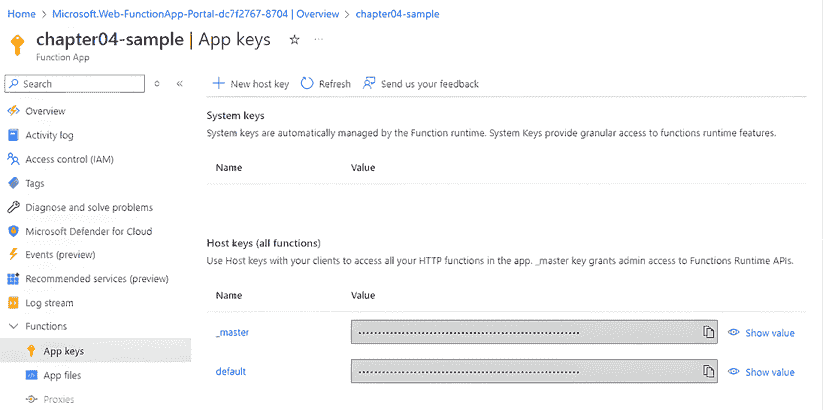

图 4.2：Azure Functions – 应用密钥

当谈到 HTTP 触发器的缺点时，有一个被称为**冷启动延迟**的现象，即在一段时间的不活跃后第一次调用函数时必须有一个延迟。此外，你必须考虑到这种应用程序的理念是提供无状态解决方案，因此仅使用 HTTP 触发器处理有状态操作或长时间运行的过程可能会更具挑战性。为此，你可能考虑使用 Azure Durable Functions。

你可能还会遇到一些资源限制，例如执行超时和使用的内存，但这些限制通常意味着你遇到了设计问题。

考虑到提供的信息，HTTP 触发器最适合在需要创建轻量级、无状态函数以响应用户 Web 请求的场景中使用。这可能包括暴露应用程序功能或微服务的 RESTful API、处理实时通知的 webhooks，甚至驱动集成。HTTP 触发器也可以用于快速测试场景，将其用作原型。

## 共享汽车 HTTP 触发器示例

正如我们在*第二章*中讨论的，《揭秘微服务应用程序》，车主的请求可以在 CRUD 操作中被用户调用。本章提供的示例代码将为你提供一个包含四个 HTTP 触发器函数的 Azure Functions 项目，这些函数代表这些 CRUD 操作。此外，重要的是要提到，今天将带有 OpenAPI 文档的 API 交付视为一种良好的实践。为此，此示例将使用 **Azure Functions 的 OpenAPI 扩展**。结果可以在以下图中看到，其中我们描述了创建的每个 Azure Functions HTTP 触发器。

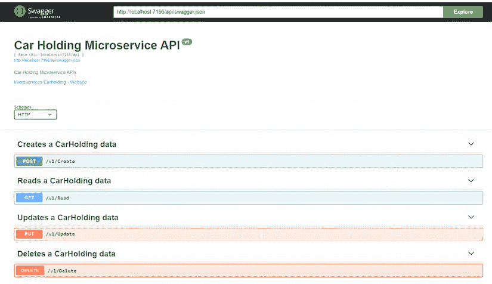

图 4.3：汽车持有 API 示例

使用这种模式交付 API 的好处是，你将遵循当前行业请求的最常见 API 场景。此外，交付版本化 API 被认为是一种很好的实践，这样你可以确保与其他系统的兼容性。

# Azure SQL 触发的优点、缺点以及何时使用

想象一下，当 Azure SQL 数据库发生更改时，立即触发一个函数的可能性。这就是 Azure SQL 触发器能帮助您的地方。有了监控插入、更新或删除的行的可能性，这个函数在事件发生时立即被调用，从而实现实时数据处理和集成。

重要的是要提到，此触发器仅在您的数据库和定义要监控的表中启用了 SQL Server 更改跟踪时才可用。

考虑到这种可能性，使用此功能进行实时处理是一个巨大的优势。由于 Azure Functions 通常只在需要时才是一种实现可伸缩性的好方法，因此此功能也为我们提供了具有高成本效益的出色架构，使我们能够将其与不同的场景和应用集成。

另一方面，您需要注意设置这些触发器的复杂性。您必须考虑什么更容易设计，是一个监控数据的计时器触发器，还是这种触发器提供的选项。延迟也可能成为一个问题，所以请小心。

当然，Azure SQL 触发器在实时数据处理中非常适用，因为数据库的更改可能对某些操作至关重要。如果您想同步、审计甚至转换数据，这也会很有用。

## Car-sharing SQL 触发器示例

对于这个演示，创建了一个名为`CarShareDB`的 Azure SQL 数据库。此外，还创建了一个名为`Carholder`的表，数据库和表都启用了更改跟踪，如下面的脚本所示：

```cs
ALTER DATABASE [CarShareDB]
SET CHANGE_TRACKING = ON
(CHANGE_RETENTION = 2 DAYS, AUTO_CLEANUP = ON);
CREATE TABLE [dbo].Carholder NOT NULL,
  CONSTRAINT [PK_Carholder] PRIMARY KEY CLUSTERED
(
  [Id] ASC
)WITH (STATISTICS_NORECOMPUTE = OFF, IGNORE_DUP_KEY = OFF, OPTIMIZE_FOR_SEQUENTIAL_KEY = OFF) ON [PRIMARY]
) ON [PRIMARY]
GO
ALTER TABLE [dbo].[Carholder]
ENABLE CHANGE_TRACKING; 
```

这种 Azure 函数背后的想法是能够审计正在跟踪的表中做出的更改。因此，创建了一个具有 SQL 触发的 Azure 函数。

```cs
using Microsoft.Azure.Functions.Worker;
using Microsoft.Azure.Functions.Worker.Extensions.Sql;
using Microsoft.Extensions.Logging;
using Newtonsoft.Json;
namespace AuditService
{
  public class Audit
  {
    private readonly ILogger _logger;
    public Audit(ILoggerFactory loggerFactory)
    {
      _logger = loggerFactory.CreateLogger<Audit>();
    }
    [Function(“Audit”)]
    public void Run(
      [SqlTrigger(“[dbo].[Carholder]”, “CarShareConnectionString”)] IReadOnlyList<SqlChange<Carholder>> changes,
                FunctionContext context)
        {
          _logger.LogInformation(“SQL Changes: “ + JsonConvert.SerializeObject(changes));
        }
    }
    public class Carholder
    {
      public int Id { get; set; }
      public string Name { get; set; }
    }
} 
```

在此代码中，有三件重要的事情需要注意。第一点是，这个 Functions 应用需要一个名为`WEBSITE_SITE_NAME`的变量。这个变量需要放置在`local.settings.json`文件中用于本地调试，并在发布时存储在应用的环镜变量中。下面显示的代码块是我们提到的`json`文件的内容，定义了`WEBSITE_SITE_NAME`变量：

```cs
{
“IsEncrypted”: false,
“Values”: {
“AzureWebJobsStorage”: “UseDevelopmentStorage=true”,
“FUNCTIONS_WORKER_RUNTIME”: “dotnet-isolated”,
“WEBSITE_SITE_NAME”: “AuditApp”
}
} 
```

第二，代码和 SQL Server 之间通过`CarShareConnectionString`变量建立了连接，该变量存储在本地用户密钥中，如下面的图所示。

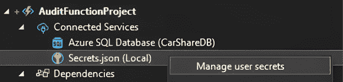

图 4.4：本地管理用户密钥

最后要注意的是，您需要定义表示被监控实体的类，以便表中的每个更改都会触发，并且与更改相关的数据将可用于使用。在我们提供的示例中，这个类被命名为`Carholder`。

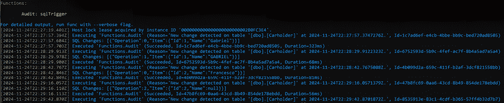

图 4.5：函数触发器

每个触发器的结果都可以在上面检查。请注意，插入和更新操作会发送完全填充的对象，而删除操作只返回对象的 ID。

# Cosmos DB 触发器的优势、劣势以及何时使用

正如我们讨论了使用 Azure SQL 触发器时的好处和缺点一样，我们也可以讨论 Cosmos DB 触发器。这是一个强大的功能，允许你在 Cosmos DB 数据发生变化时执行无服务器函数。无论在 Cosmos DB 集合中添加、更新还是删除项目，触发器都会自动调用你的函数，从而实现实时数据处理和集成。

考虑到这个场景，重要的是要提到 Azure Cosmos DB 为你提供了处理数据的更多灵活性，因为它支持非结构化数据。例如，假设你想处理共享汽车发送的遥测数据。这种数据在 Azure SQL 数据库中处理可能会有些奇怪。另一方面，在 Cosmos DB 中使用这些数据可能是一个好的方法。

这些显著优势可以与你在使用 Cosmos DB 触发器开发解决方案时可能产生的某些担忧一起分析。其中最重要的一个考虑因素是成本，因为 Cosmos DB 应用程序的成本可能会非常高，具体取决于所开发的解决方案。

## 汽车共享 Cosmos DB 触发器示例

对于高性能和全球分布式的数据存储，假设汽车共享应用程序使用 Cosmos DB 存储实时汽车遥测数据，以及用户活动日志和位置信息。

下图显示了如何创建一个 Azure Functions 应用程序，以实现与 Azure Cosmos DB 的连接。

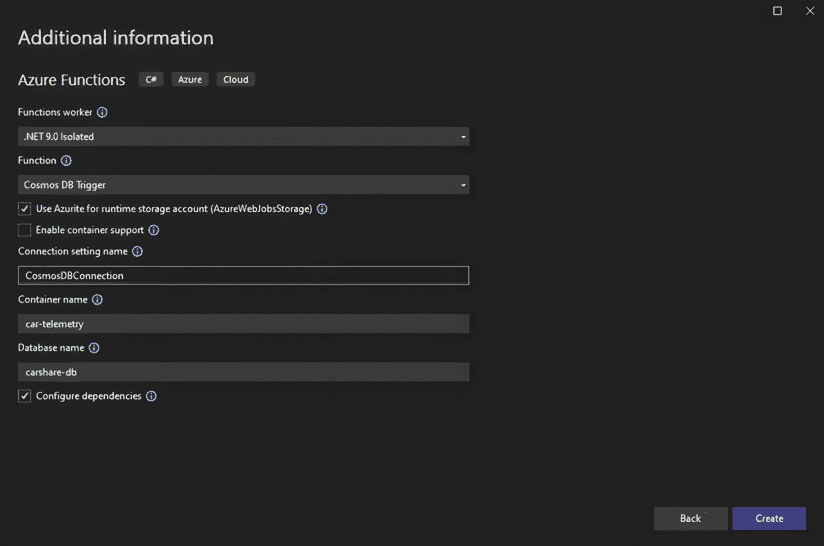

图 4.6：创建 Azure Cosmos DB 触发器函数

提到这一点很棒，因为有一个 Azure Cosmos DB 模拟器，你可以用它来测试和调试你的解决方案，从而节省开发这一步骤的成本。为此，你需要安装 Docker。重要的是要记住，这仅是测试的替代方案；生产环境必须使用 Azure Cosmos DB 本身。

然而，也应指出，Visual Studio 也可以帮助你创建 Azure Cosmos DB。正如你在以下图中可以看到的，有一个向导，你可以设置在 Visual Studio 环境中创建 Azure 账户中资源的常用变量。

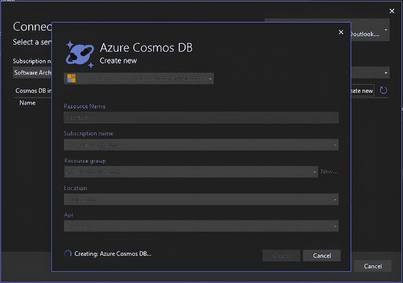

图 4.7：创建 Azure Cosmos DB

创建 Azure Cosmos DB 需要一些时间。一旦完成这一步，就需要分析函数触发器的工作方式。请注意，它也是基于数据库的连接字符串和你要监控的信息来工作的。在示例中，正在监控 `car-telemetry`：

```cs
using Microsoft.Azure.Functions.Worker;
using Microsoft.Extensions.Logging;
namespace TemeletryService
{
  public class Telemetry
  {
    private readonly ILogger _logger;
    public Telemetry(ILoggerFactory loggerFactory)
    {
      _logger = loggerFactory.CreateLogger<Telemetry>();
    }
    [Function(“Telemetry”)]
    public void Run([CosmosDBTrigger(
      databaseName: “carshare-db”,
      containerName: “car-telemetry”,
      Connection = “CosmosDBConnection”,
      LeaseContainerName = “leases”,
      CreateLeaseContainerIfNotExists = true)] IReadOnlyList<CarTelemetry> 
          input)
      {
        if (input != null && input.Count > 0)
        {
          _logger.LogInformation(“Documents modified: “ + input.Count);
          _logger.LogInformation(“First document Id: “ + input[0].carid);
        }
      }
    }
    public class CarTelemetry
    {
      public string carid { get; set; }
      public DateTime Date { get; set; }
      public string Data { get; set; }
    }
} 
```

要测试该函数，你可以使用 Azure 门户中提供的 Azure Cosmos DB 用户界面。

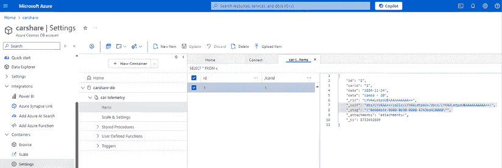

图 4.8：向 Azure Cosmos DB 插入数据

结果可以通过在 Azure 函数的代码中插入断点来检查，我们可以检查发送的数据是否可以在代码中看到。

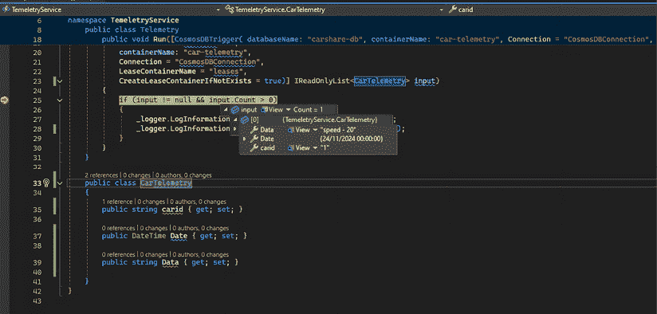

图 4.9：Azure Cosmos DB 触发器

尽管 Azure Cosmos DB 触发器与 Azure SQL 触发器非常相似，但重要的是要提到，Azure Cosmos DB 触发器仅监控 Cosmos DB 中的插入和更新操作。因此，如果您需要监控删除操作，这种触发器类型将不会提供此选项。

# Azure Service Bus 触发器

在微服务解决方案中，最重要的组件之一是用于在微服务之间启用通信的服务总线。Azure Service Bus 是市场上提供的选项之一。

Azure Functions 提供了两种连接到 Azure Service Bus 的方式。您可以监控特定的队列或通用的主题。Azure Service Bus 队列服务的概念是提供一个解决方案，该解决方案能够确保分布式应用程序和服务之间可靠的通信。它基于**先进先出**（**FIFO**）的原则运行，确保消息按照发送的顺序进行处理。如果您需要通过在高峰负载期间缓冲消息来解耦应用程序、增强可伸缩性和保持高可用性，您可能决定使用它。重要的是要记住，发送到队列的消息将被存储，直到它们被接收应用程序检索和处理，即使在短暂故障的情况下也能保证交付。值得提及的是，Service Bus 队列支持诸如按顺序处理的消息会话、处理消息失败时的死信队列以及防止处理重复消息的重复检测等功能。

另一方面，Azure Service Bus 主题是为需要发布/订阅模型的情况而设计的。这个特性使得多个订阅者可以接收相同消息的副本，从而在您的消息基础设施中提供更大的灵活性和可伸缩性。使用主题，您可以基于特定标准过滤消息，确保每个订阅者只接收与他们相关的消息。这在复杂的流程中特别有用，其中不同的组件或服务需要响应不同类型的事件。

Azure Service Bus 触发器同样可以为您的解决方案提供可伸缩性、可靠性、集成和灵活性，因为这是任何 Azure 函数默认提供的服务。作为一个需要注意的点，再次强调，成本必须被考虑。值得注意的是，队列比主题便宜，因此您可能需要分析是否真的需要主题。此外，别忘了检查您所需的应用程序性能不会因为所选的服务总线而降低。

当你在开发事件驱动的解决方案，并希望处理消息或设计工作流自动化时，可以使用 Azure 服务总线触发器。例如，在共享汽车的例子中，我们将使用触发器来表示有人正在寻找汽车。

## 与 Kafka 触发器和 RabbitMQ 触发器的比较

Azure Functions 服务总线触发器、Kafka 触发器和 RabbitMQ 触发器都服务于类似的目的。然而，根据你正在处理的场景，你可能决定选择不同的总线。

例如，Kafka 因其在需要分布式流处理和实时数据处理的高吞吐量场景中而闻名。

另一方面，RabbitMQ 更易于使用，对于轻量级和灵活的消息来说更好，特别是如果你需要与多个消息协议兼容的话。

Azure 服务总线与 Azure 服务集成良好，尽管它支持各种消息模式。如果你需要可靠的交付和处理，这可能是最佳选择。

如你所见，每个总线都有其优势，适合不同类型的应用。Azure Functions 中为它们提供的触发器非常相似，因此选择正确的触发器更多地取决于你正在设计的应用程序的具体要求。

## 使用 Azure 服务总线触发器的共享汽车示例

在我们的例子中，Azure 服务总线触发器用于订阅表示寻找汽车请求的消息。在这里使用主题的想法是，解决方案的许多微服务可能都想知道正在发起寻找汽车的请求。我们模拟的示例服务是启动所需汽车路线规划器的服务，如下面的图所示。

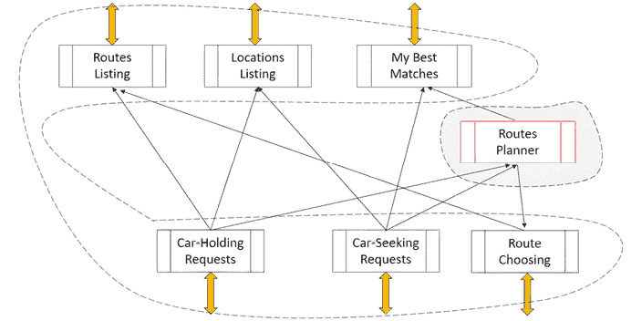

图 4.10：共享汽车应用的路由处理子系统

为了做到这一点，创建了一个用于监控主题 `car-seeking-requests` 中服务总线触发器的 Azure 函数。从这个主题订阅的消息被命名为 `routes`：

```cs
using Azure.Messaging.ServiceBus;
using Microsoft.Azure.Functions.Worker;
using Microsoft.Extensions.Logging;
namespace RoutesPlanner
{
  public class CarSeeking
  {
    private readonly ILogger<CarSeeking> _logger;
    public CarSeeking(ILogger<CarSeeking> logger)
    {
      _logger = logger;
    }
    [Function(nameof(CarSeeking))]
    public async Task Run(
      [ServiceBusTrigger(“car-seeking-requests”, “routes”,
                          Connection = “car-share-bus”)]
       ServiceBusReceivedMessage message,
       ServiceBusMessageActions messageActions)
       {
         _logger.LogInformation(“Message ID: {id}”, message.MessageId);
         _logger.LogInformation(“Message Body: {body}”, message.Body);
         _logger.LogInformation(“Message Content-Type: {contentType}”,
                                 message.ContentType);
         // Complete the message
await messageActions.CompleteMessageAsync(message);
       }
    }
  }
} 
```

一旦发送了路线消息，函数会自动触发，消息体中呈现的所有信息，以及关于消息内容类型和其 ID 的信息，都可在 Azure 函数中获取。

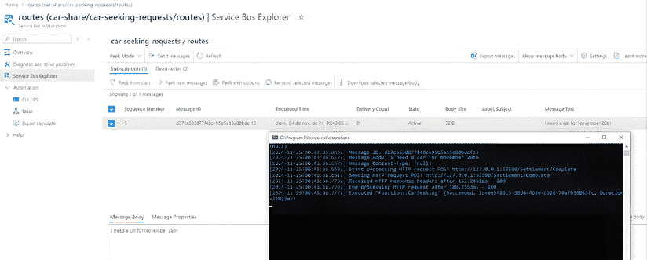

图 4.11：Azure 服务总线接收到内容后触发的消息

重要的是要注意，一旦消息被 Azure 函数处理，由于没有其他订阅者，消息将从总线上清除。还需要记住，如果函数没有运行，总线服务将根据在 Azure 服务总线中配置的设置保留它们。

# 摘要

本章提供了 Azure Functions 中各种触发器的全面概述，重点关注它们的优缺点和实际用例。然后深入探讨了特定的触发器，从易于使用且在处理网络请求方面具有灵活性的 HTTP 触发器开始。本章还提到了支持多种 HTTP 方法以及与其他 Azure 服务集成的优势。

本章还涵盖了 Azure SQL 触发器，强调了它们的实时数据处理能力以及 SQL Server 变更跟踪的要求。同样，Cosmos DB 触发器也得到了解释，其处理非结构化数据和实时处理的优势也得到了展示。

最后，本章比较了 Azure 服务总线、Kafka 和 RabbitMQ 服务，展示了使用 Azure 服务总线触发器为书中提到的拼车应用程序进行演示。

# 问题

1.  在 Azure Functions 中使用 HTTP 触发器的主要优势是什么？

HTTP 触发器提供了一个简单且标准化的方式来将你的函数作为网络端点公开，这使得创建 API 和 webhook 变得容易。它们允许快速开发和与其他网络服务及客户端应用程序的集成，利用熟悉的 HTTP 方法和状态码进行通信。

此外，HTTP 触发器还支持自动扩展，因此你的函数可以高效地处理变化的负载。这有助于确保在流量波动的情况下，你的应用程序保持响应，同时从优化成本的按需付费定价模型中受益。

1.  使用 HTTP 触发器的潜在缺点有哪些，以及如何减轻这些缺点？

一个潜在的缺点是冷启动的发生，尤其是在消耗计划中，这可能导致在初始 HTTP 请求期间出现延迟。此外，通过 HTTP 公开函数需要仔细关注安全性，因为配置错误的端点可能会变得容易受到未经授权的访问或滥用。

通过实施策略，如使用高级或专用计划以减少冷启动延迟，添加预热触发器，或强制执行强大的身份验证和授权策略，可以减轻这些担忧。利用 API 管理或其他网关解决方案也可以有效地帮助保护和管理工作通过 HTTP 触发的函数。

1.  Azure SQL 触发器如何实现实时数据处理，以及它的要求是什么？

尽管 Azure Functions 不包含本机 SQL 触发器，但通过结合数据库变更检测（使用 SQL 变更跟踪或变更数据捕获）与轮询或监听变更的函数，可以实现实时数据处理。这种方法使系统能够几乎立即对数据修改做出反应，一旦检测到变更就触发处理工作流。

为了实现这一点，您的 Azure SQL 数据库必须启用更改跟踪或 CDC，并且您需要配置一个可靠的机制，以便定期查询更改。适当的连接性、高效的查询设计以及处理潜在的延迟问题是确保实时处理既准确又高效的关键要求。

1.  使用 Azure Functions 中的 Cosmos DB 触发器有哪些好处和担忧？

Cosmos DB 触发器通过利用 Cosmos DB 变更流提供近实时数据处理。这种集成允许您的函数自动响应新或更新的文档，从而实现事件驱动的流程和可扩展的数据处理，无需手动轮询。

然而，如果吞吐量没有得到适当管理，可能会出现潜在的节流和成本影响。此外，确保数据一致性和处理高容量变更流可能具有挑战性。这些问题可以通过仔细规划请求单位（RUs）、分区策略以及监控 Cosmos DB 账户的性能和负载来解决。

1.  Azure 服务总线触发器与 Kafka 和 RabbitMQ 触发器相比如何，它们在哪些场景下使用最佳？

Azure 服务总线触发器是完整托管消息服务的一部分，它提供可靠的消息传递、死信队列、会话和自动扩展等功能。它们与 Azure 生态系统无缝集成，使它们成为需要强大、安全和管理消息处理的企业的理想选择。

与之相反，Kafka 和 RabbitMQ 通常因其高吞吐量（Kafka）或轻量级、灵活的消息传递（RabbitMQ）而被选择，在可能需要更多基础设施控制的环境中。Azure 服务总线触发器最适合那些从与 Azure 深度集成的托管服务中受益的场景，尤其是当应用程序需要企业级消息可靠性和可扩展性而不需要管理消息基础设施的开销时。

# 进一步阅读

+   Azure Function HTTP 触发器：[`learn.microsoft.com/en-us/azure/azure-functions/functions-bindings-http-webhook-trigger`](https://learn.microsoft.com/en-us/azure/azure-functions/functions-bindings-http-webhook-trigger)

+   Azure Function SQL 触发器：[`learn.microsoft.com/en-us/azure/azure-functions/functions-bindings-azure-sql`](https://learn.microsoft.com/en-us/azure/azure-functions/functions-bindings-azure-sql)

+   SQL Server 更改跟踪：[`learn.microsoft.com/en-us/sql/relational-databases/track-changes/about-change-tracking-sql-server`](https://learn.microsoft.com/en-us/sql/relational-databases/track-changes/about-change-tracking-sql-server)

+   Azure Functions Cosmos DB 触发器：[`learn.microsoft.com/en-us/azure/azure-functions/functions-bindings-cosmosdb`](https://learn.microsoft.com/en-us/azure/azure-functions/functions-bindings-cosmosdb)

+   Azure Functions 服务总线触发器：[`learn.microsoft.com/en-us/azure/azure-functions/functions-bindings-service-bus`](https://learn.microsoft.com/en-us/azure/azure-functions/functions-bindings-service-bus)

+   队列设计模式：[`learn.microsoft.com/en-us/azure/architecture/patterns/queue-based-load-leveling`](https://learn.microsoft.com/en-us/azure/architecture/patterns/queue-based-load-leveling)

+   发布者-订阅者设计模式：[`learn.microsoft.com/en-us/azure/architecture/patterns/publisher-subscriber`](https://learn.microsoft.com/en-us/azure/architecture/patterns/publisher-subscriber)

+   存储机密：[`learn.microsoft.com/en-us/aspnet/core/security/app-secrets`](https://learn.microsoft.com/en-us/aspnet/core/security/app-secrets)

# 加入我们的 Discord 社区

加入我们社区的 Discord 空间，与作者和其他读者进行讨论：

[`packt.link/PSMCSharp`](https://packt.link/PSMCSharp)


