# 实践中的后台函数

当你开始使用云计算时，尤其是在使用**平台即服务**（**PaaS**）时，你可能会遇到的一个挑战是如何在基于需要请求处理实例的解决方案中启用后台工作。解决这个问题的一个答案就是使用无服务器来处理这个后台任务。在 Azure 中，你会发现 Azure Functions 触发器可以帮助你完成这项工作。

在本章中，我们将讨论其中三个：定时触发器、Blob 存储触发器和队列存储触发器。重要的是要提到，我们在*第一章**，揭秘无服务器应用程序*中介绍了它们的基础知识，但现在我们将开始实施它们。

我们将介绍 Azure Functions 在 Visual Studio 内部发布的替代方案，同时也会检查如何监控这些函数。在章节中，我们将讨论这些函数的优点和缺点，以及何时使用这些函数是一个好的方法。我们还将使用拼车示例来展示它们的工作情况，以便更好地理解每个触发器的目的。让我们开始吧！

# 技术要求

本章需要 Visual Studio 2022 免费**社区版**或 Visual Studio Code。你还需要一个 Azure 账户来创建示例环境。你可以在这个章节的[`github.com/PacktPublishing/Practical-Serverless-and-Microservices-with-Csharp`](https://github.com/PacktPublishing/Practical-Serverless-and-Microservices-with-Csharp)找到示例代码。

# 定时触发器

有时需要不时地在一天中的特定时刻处理一个任务，这是很常见的。定时触发器肯定会帮助你完成这项工作。这个函数基于`NCRONTAB`表达式，类似于`CRON`表达式：

`{second} {minute} {hour} {day} {month} {day-of-week}`

如果你考虑这个表达式，你将能够安排不同的时刻来触发函数。让我们查看以下表格以更好地理解它：

| **秒** | **分** | **时** | **日** | **月** | **星期** | **结果** | **含义** |
| --- | --- | --- | --- | --- | --- | --- | --- |
| * | * | * | * | * | * | * * * * * * | 每秒 |
| 0 | * | * | * | * | * | 0 * * * * * | 每分钟 |
| */5 | * | * | * | * | * | */5 * * * * * | 每五秒 |
| 0 | 0 | 1 | * | * | 1-5 | 0 0 1 * * 1-5 | 在周一至周五的凌晨 1 点 |
| 5,10,20 | * | * | * | * | * | 5,10,20 * * * * * | 在每分钟的 5、10 和 20 秒 |

与`NCRONTAB`表达式相关的一些重要提示。首先，你可以考虑从星期日（`0`）到星期六（`6`）的星期几。`*`运算符代表在当前定义的所有值，而`-`是范围运算符。如果你想表示一个间隔，你可以使用`/`运算符，而如果你想定义一组值，则必须使用`,`运算符。

以下代码是一个定时器触发示例以及定义其计划的方式：

```cs
public class SampleFunction
{
  private readonly ILogger _logger;
  public SampleFunction(ILoggerFactory loggerFactory)
  {
    _logger = loggerFactory.CreateLogger<SampleFunction>();
  }
  [Function(“SampleFunction”)]
  public void Run([TimerTrigger(“*/5 * * * * *”)] TimerInfo myTimer)
  {
    _logger.LogInformation($”C# Timer trigger function executed at:
                             {DateTime.Now}”);

    if (myTimer.ScheduleStatus is not null)
    {
      _logger.LogInformation($”Next timer schedule at:
                              {myTimer.ScheduleStatus.Next}”);
    }
  }
} 
```

有一些网站可以帮助你解释你设计的`NCRONTAB`表达式。你可以在 https://crontab.cronhub.io/ 上查看。

以下图显示了前面定时器触发代码的结果。


图 5.1：执行中的定时器触发功能

这种灵活性使你能够定义一个稳固的工作结构来运行你的微服务。另一方面，如果你想调试特定的函数，你可以使用设置为`true`的`RunOnStartup`参数。不过，重要的是要提到，这个参数在生产环境中不应使用。

有可能手动触发非 HTTP 函数。请查看此链接以进行操作：[`learn.microsoft.com/en-us/azure/azure-functions/functions-manually-run-non-http`](https://learn.microsoft.com/en-us/azure/azure-functions/functions-manually-run-non-http)。

现在你已经了解了定时器触发功能的工作原理，让我们看看如何使用 Visual Studio 发布它们。

# 发布你的函数

当你在 Visual Studio 中开发 Azure 函数时，了解 IDE 允许你分步骤将代码发布到 Azure 是有用的。让我们看看如何做到这一点。

第一步是右键单击你想要发布的项目。一旦这样做，你将找到**发布…**操作来启动此过程。

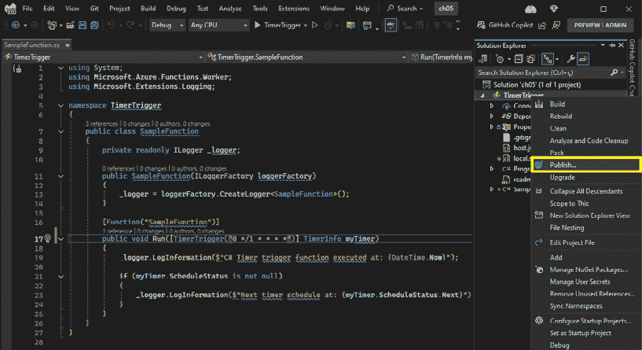

图 5.2：发布 Azure 函数项目

一旦你决定发布，你将需要决定将函数发布到何处。除了 Azure，你可能还希望将函数发布到 Docker 容器注册库或文件夹中。你可能还希望使用预制的配置文件，因此还有一个选项可以导入配置文件。对于这个演示，将选择**Azure**选项。


图 5.3：在 Azure 上发布

在选择**Azure**之后，你需要决定你的函数将在 Azure 的哪个位置运行。正如我们在*第一章**，揭秘无服务器应用程序*中看到的，Azure 函数可以在不同的操作系统和不同的容器解决方案中运行。对于这个演示，我们将选择 Windows 操作系统。


图 5.4：选择 Windows 的 Azure 函数应用

在将 Visual Studio 连接到你的 Azure 账户后，所有可用于部署的函数实例都将呈现在你面前。然而，如果你没有任何实例，你也将有机会通过选择**创建新实例**按钮来创建一个新的实例。


图 5.5：在 Visual Studio 界面上创建 Azure 函数应用

创建过程需要几分钟，然后您的 Azure 函数就可以在 Azure 上发布了。

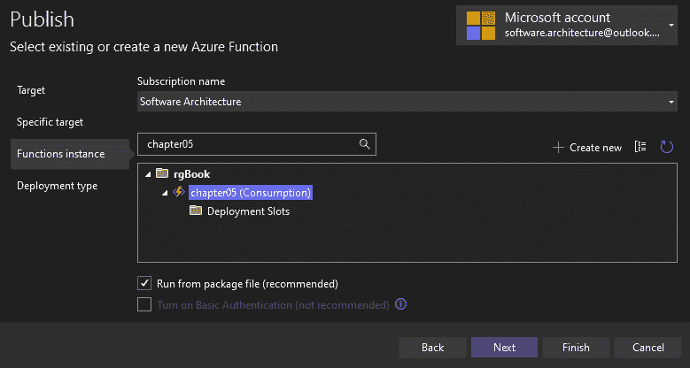

图 5.6：准备就绪的 Azure Function App

Visual Studio 中当前可用的向导非常有用。它不仅可以帮助您一步完成发布，还会为您创建一个 YML 文件，以便与 GitHub Actions 一起使用。对于这个演示，我们将使用生成 `.pubxml` 文件的基本选项，但您可以考虑 GitHub Actions 作为现实场景中的最佳选择。

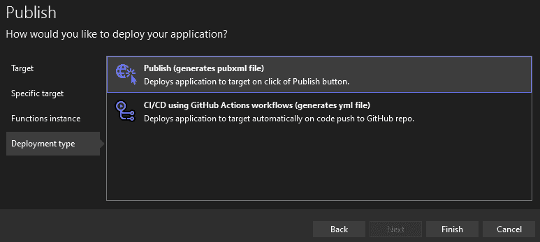

图 5.7：可用的发布方法

一旦完成向导，您将拥有准备就绪的发布配置文件，可以开始发布应用程序。

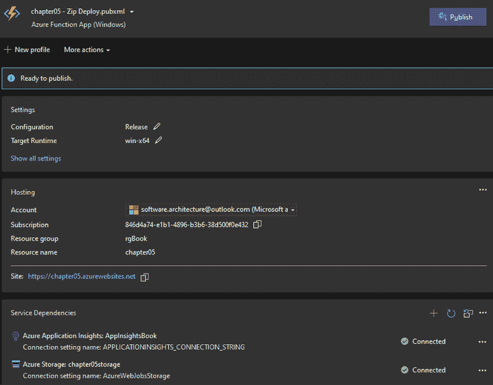

图 5.8：发布分析器

通过点击 **发布** 按钮，过程将开始运行，几分钟后，您的 Azure Function App 将被发布。


图 5.9：Function App 已发布

重要的是要提到，您只需要完成这个完整过程一次。之后，所需的新部署将会容易得多。

# 监控您的函数

上节中介绍的部署函数的过程不仅限于定时器触发函数。在监控您的函数时也是如此。在 Azure 中，有一些其他方法可以检查您的 Azure 函数是否正常运行。让我们来探索一下。

监控函数是否正常运行的最简单方法是通过检查其调用的次数。**调用次数**选项卡在 Function App 中可用，它将为您提供关于执行的基本详细信息。

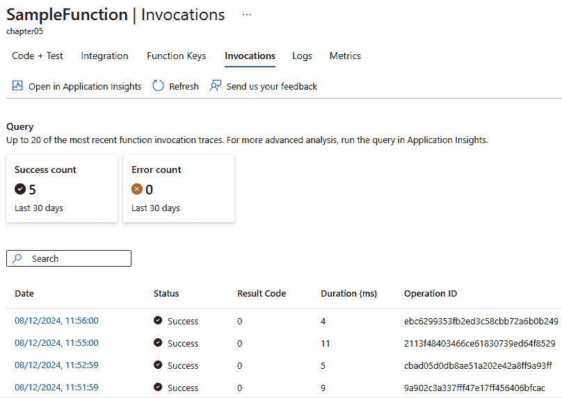

图 5.10：函数调用

然而，您可能希望获取每个执行的详细信息。在这种情况下，获取此类信息的最佳选项是通过访问 Azure Monitor 保留的日志。

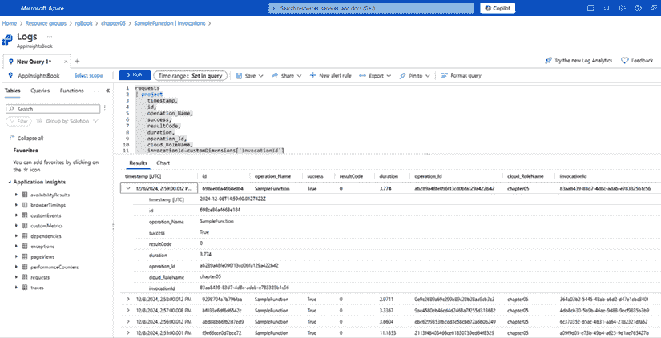

图 5.11：Azure Monitor 日志

使用 Azure Monitor 日志会导致成本增加。请检查在 [`docs.azure.cn/en-us/azure-monitor/logs/cost-logs`](https://docs.azure.cn/en-us/azure-monitor/logs/cost-logs) 存储日志的最佳替代方案。

Azure Monitor 存储的日志也将为您提供另外两个视图。Application Insights 的 **性能** 视图可以帮助您分析您开发的 Azure 函数中可能发生的性能和错误。

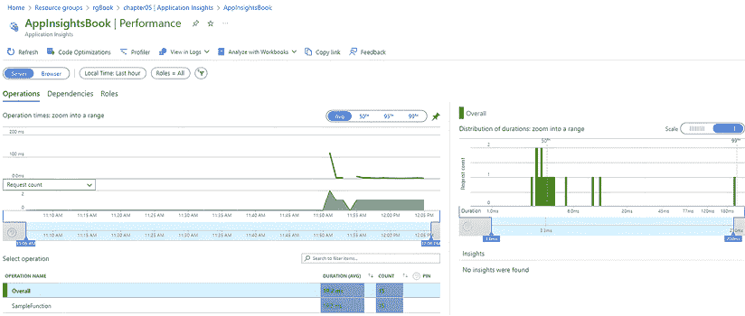

图 5.12：Application Insights 性能视图

函数运行时还有一个 **实时指标** 视图，这可能对调试或了解生产中的行为很有用。


图 5.13：Application Insights 实时指标视图

这些选项使 Azure Functions 成为处理您后台工作的绝佳替代方案，因为它提供的可观察性非常好。

## Azure 定时器触发的优势、劣势以及何时使用

正如我们之前看到的，Azure 定时器触发器提供了一种在无需人工干预的情况下定期执行函数的绝佳方式。它们在设置和配置上的简单性有助于您创建定期运行的函数，例如数据同步、清理操作和计划报告。

然而，由于函数将在您计划的时间运行，如果那时没有工作要做，这种执行将导致资源浪费，这基本上意味着不必要地花钱。因此，您必须正确定义定时器触发函数的执行。

根据前面的信息，不能依赖人工手动干预的预定操作，如备份、常规维护任务和定期数据处理，是这类函数的绝佳用例。尽管定义一种监控和报告这些执行的方法很重要，但您仍然可以充分利用这个选项。

## 汽车共享定时器触发示例

汽车共享解决方案是一个事件驱动型应用。这意味着在处理其基本工作流程时，不需要为该应用设置定时器触发器。然而，让我们想象一个处理账单的常规流程。考虑到这家公司的业务规则，周日无法处理账单，而考虑到其他日子现金流的情况，账单可以每小时处理一次。

基于这个场景，定时器触发函数可以是一个很好的选择来解决这个问题，如下所示：

```cs
public class ProcessBilling
{
  private readonly ILogger _logger;
  public ProcessBilling(ILoggerFactory loggerFactory)
  {
    _logger = loggerFactory.CreateLogger<ProcessBilling>();
  }
  /// <summary>
/// Every hour, between 08:00 AM and 05:59 PM, Monday through Saturday
/// </summary>
/// <param name=”myTimer”></param>
  [Function(“ProcessBilling”)]
  public void Run([TimerTrigger(“0 0 8-17 * * 1-6”)] TimerInfo myTimer)
  {
    _logger.LogInformation($”Time to process billing!”);
    _logger.LogInformation($”Execution started at: {DateTime.Now}.”);
    // TODO - Code for processing billing
    _logger.LogInformation($”Process billing done: {DateTime.Now}.”);
  }
} 
```

注意，无论是否有账单要处理，函数的执行将在每天早上 8:00 至下午 5:59 之间，从周一到周六每小时发生一次。重要的是要提到，Azure Functions 将尊重协调世界时（UTC），因此在定义正确的 `CRON` 表达式时，您应该考虑您的位置。

# Blob 触发器

Azure Blob Storage 是由 Microsoft Azure 提供的一种服务，用于存储大量非结构化数据，如图像、视频、日志和备份。它优化了以高度可扩展和成本效益的方式存储二进制数据。**Blob** 代表 **Binary Large Object**，突出了其高效处理大量数据的能力，使其成为需要耐用、可扩展存储的应用的理想解决方案。

这个服务的优点是它具有高度的可扩展性、安全性和全球任何地方通过 HTTP 或 HTTPS 访问的便捷性。此外，它还支持与其他 Azure 服务，如 Azure Functions 的集成。这个连接器通过为特定 Blob 存储中每个更改执行函数，实现了各种可能的自动化流程解决方案。

本书重点不在于深入探讨 Blob 存储选项，但了解该服务提供不同的访问层级是有用的，例如热、冷和存档，这些层级根据访问需求而变化，每个层级都有自己的定价。

当您开始创建 Blob 存储触发函数时，您将被要求定义存储将运行的位置。对于调试，您将有机会使用 **Storage Azurite 模拟器**，这是一个 Azure 存储的本地模拟器。Azurite 与 Visual Studio 一起提供。根据您的 Visual Studio 版本，它将被放置在特定的文件夹中。找到可执行文件后，您可以使用管理员权限运行它。


图 5.14：Azurite 执行

在创建 Blob 存储触发函数时，另一个重要的工具是 Microsoft Azure Storage Explorer。有了这两个工具，创建 Blob 存储触发函数的过程将会非常简单。以下图示展示了 Visual Studio 如何使您能够将 Azurite 设置为项目的默认模拟器。


图 5.15：将 Blob 存储触发器连接到 Azure

## Blob 存储触发器的优缺点及适用场景

当谈到 Blob 存储触发器的使用优势时，能够高效处理大量数据的能力当然可以提及。除此之外，无论传入触发器的数量如何，都有可能进行处理的扩展性也是您应该考虑此类触发器来处理数据的好理由。

另一方面，定价可能成为问题，因为在某些情况下，定价模式基于执行次数和数据处理量，所以不要忘记分析分配此类 Azure 函数的最佳方式。

还需要提到的是，根据您为 Azure 函数定义的应用计划，您可能会在文件上传或更新与函数处理之间经历一些延迟。为了避免这种情况，您可以考虑启用 Always On 的 App Service 计划，尽管这显然会增加解决方案的成本。

最后，重要的是要提到，最初的 Blob 存储触发函数实现是基于池化的。池化指的是对整个容器进行周期性扫描，通常每批处理高达 10,000 个 Blob。在此方法中，每个文件默认有最多五次重试尝试。如果所有重试都失败，函数将创建一个毒丸消息并将其移动到 `webjobs-blobtrigger-poison` 队列。为了避免此类场景并提高可靠性，您可以使用 Event Grid 实现一个 Blob 存储触发器。我们将在下一节中介绍这一点。

基于这些信息，您可以在需要图像处理、数据分析、实时或批量处理等软件要求的应用程序中使用 Blob 存储触发器。在这种类型的应用中，通常需要快速且自动地对新或更新的 Blob 做出反应。在这些情况下，Azure Functions 的可扩展性和适应性将帮助您满足您的需求。

# 使用事件网格实现的 Blob 触发实现

使用事件网格实现 Blob 触发事件背后的想法是减少延迟。此外，如果您决定使用 Flex 消费计划来定义您的函数，这将是你唯一的选择。

要做到这一点，在创建函数时，选择 **Blob 触发（使用事件网格）** 选项。使用此选项，Visual Studio 将为 Azure 函数创建不同的代码。

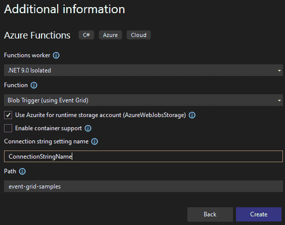

图 5.16：使用事件网格创建 Blob 触发函数

重要的是要提到，此函数在 Azure 上的运行效果会比本地更好。为此，您需要创建一个 **通用 v2** 存储账户，这对于事件订阅是强制性的。

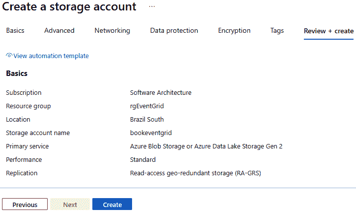

图 5.17：存储账户创建的回顾

正如我们在 Azure 存储中有所要求，运行此类触发的函数应用应考虑使用 Flex 消费计划，正如以下图所示。根据微软的说法，这种消费计划的优势在于它通过始终准备好的实例减少了冷启动，支持虚拟网络，并在高负载期间自动扩展。另一方面，在撰写本书时，此选项并非在所有地区都可用。

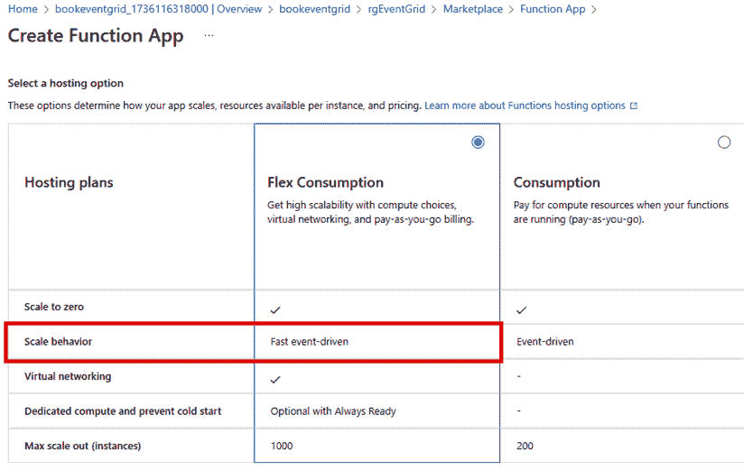

图 5.18：Flex 消费计划

在创建 Azure 函数应用之后，您可以使用之前提供的步骤来发布该函数。本例中用于函数应用的名称为 `flexfunction`。值得注意的是，Flex 消费计划适用于基于 Linux 的操作系统。

以下代码显示了已发布的函数。请注意，在此示例中，`Connection` 参数是 `"ConnectionStringName"`。同时，请注意函数的名称是 `SampleFunction`：

```cs
public class SampleFunction
{
  private readonly ILogger<SampleFunction> _logger;
  public SampleFunction(ILogger<SampleFunction> logger)
  {
    _logger = logger;
  }
  [Function(nameof(SampleFunction))]
  public async Task Run([BlobTrigger(“event-grid-samples/{name}”,
    Source = BlobTriggerSource.EventGrid,
    Connection = “ConnectionStringName”)] Stream stream, string name)
  {
    using var blobStreamReader = new StreamReader(stream);
    var content = await blobStreamReader.ReadToEndAsync();
    _logger.LogInformation($”C# Blob Trigger (using Event Grid) processed
                             blob\n Name: {name} \n Data: {content}”);
  }
} 
```

您需要此信息来设置 Azure 函数。`"ConnectionStringName"` 需要在函数应用的设置中定义为环境变量，如图所示。此配置的内容是创建的存储账户的连接字符串。


图 5.19：定义函数应用和存储账户之间的连接

之后，您将拥有定义函数应用中将要触发的事件所需的所有信息。请注意，事件发生在存储账户中，Event Grid 触发函数。为此，创建了一个 webhook。webhook URL 的定义可以在此处查看：

| **部分** | **模板** |
| --- | --- |
| 基础函数应用 URL | https://<FUNCTION_APP_NAME>.azurewebsites.net |
| Blob 特定路径 | /runtime/webhooks/blobs |
| 函数查询字符串 | ?functionName=Host.Functions.<FUNCTION_NAME> |
| Blob 扩展访问密钥 | &code=<BLOB_EXTENSION_KEY> |

Blob 扩展访问密钥可以在函数应用的 **App Keys** 部分找到。对于 `blobs_extension` 有一个特定的系统密钥。一旦您有了密钥，您就可以使用它来在 Azure 存储中创建一个新事件，如图中所示。

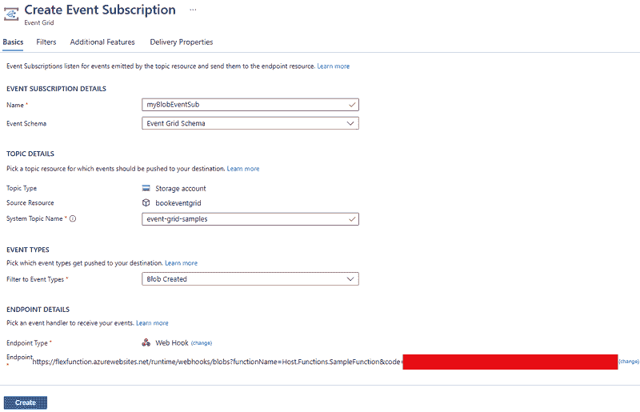

图 5.20: 在 Blob 存储中订阅事件

重要的一点是提到，您的 Azure 订阅可能尚未启用 Event Grid 资源提供者，并且在此禁用的情况下创建订阅时可能会发生错误。要启用资源提供者，您需要转到您的订阅账户并注册它。


在此配置之后，只需简单地将文件上传到定义的容器中，对于每个上传的文件，函数都会被触发，以低延迟模式。您可以使用函数的 **调用** 面板监控每个触发器。请注意，在图中，函数在最后几次调用中在同一秒内触发了四次，显示了触发函数处理大量文件的能力。


值得注意的是，此示例需要不同的组件，可能会产生额外的成本。因此，如果您只是尝试此选项，请务必注意不要让此演示在您的 Azure 账户中运行。另一方面，这将减少文件到达和处理之间的延迟，因此您可以考虑将其作为实际应用的不错方法。

## 共享汽车 Blob 存储触发器示例

考虑到我们在本书中展示的共享汽车用例，值得提到的是，可能包含在此解决方案中的服务之一是分析驾驶执照。为此，在前端应用程序中，将有一个用户界面用于将此重要文件上传到应用程序的业务逻辑。然而，由于此文件很重要，存储此类信息需要精心设计。一个好的选择是仅提取上传图像中所需的信息，然后创建该信息的哈希值，这样您就可以删除用户上传的文件。

要做到这一点，你可以创建一个专门处理驾照照片的函数。使用 Blob 存储触发器来完成这个任务可能是个好主意。

重要的是要提到，这个示例需要更新 `Program.cs` 文件。在这里，我们不会直接使用 `FunctionsApplication` 类，而是使用 `HostBuilder`，通过 `ConfigureFunctionsWebApplication` 方法配置 Azure Functions 应用程序。值得注意的是，在 .NET 8 的 Azure Functions 中，`ConfigureFunctionsWebApplication()` 启用了 ASP.NET Core 集成，而默认的 `ConfigureFunctionsWorkerDefaults()` 用于隔离工作模型，提供了对 .NET 版本和依赖项的更大灵活性和控制：

```cs
using Microsoft.Extensions.Hosting;
using Microsoft.Extensions.Configuration;
using CarShareBackground;
var host = new HostBuilder()
  .ConfigureFunctionsWebApplication()
  .ConfigureAppConfiguration(config =>
  {
    config.AddUserSecrets<ProcessDriversLicensePhoto>(optional: true,
      reloadOnChange: false);
  })
  .Build();
host.Run(); 
```

`AddUserSecrets` 方法将用户密钥添加到配置中，这对于存储敏感信息（如 API 密钥或连接字符串）非常有用。在这种情况下，我们正在存储与 Blob 存储的连接。`ProcessDriversLicensePhoto` 类型用于识别包含用户密钥的程序集。`optional: true` 参数意味着如果找不到用户密钥文件，应用程序不会失败，而 `reloadOnChange: false` 表示如果用户密钥文件发生变化，配置不会自动重新加载。

一旦你定义了 `Program.cs`，你就可以创建一个 Azure 函数来处理 Blob 存储。函数本身定义起来相当简单，如下面的代码所示：

```cs
[Function(nameof(ProcessDriversLicensePhoto))]
public async Task Run([BlobTrigger(“drivers-license/{name}”,
    Connection = “CarShareStorage”)] Stream myBlob, string name)
{
  StreamReader reader = new StreamReader(myBlob);
  var message = reader.ReadToEnd();
  _logger.LogInformation(“File detected”);
} 
```

`BlobTrigger` 属性定义了文件将在 Blob 存储的哪个位置上传，在本例中是在 `drivers-license` 文件夹中，其中 `{name}` 是 blob 名称的占位符，它将被作为字符串传递给 `name` 参数。文件的流将通过 `myBlob` 参数获得。

# 队列存储触发器

队列的原则相当为人所熟知，因为这是一种你想要控制数据以便“先进先出”的数据结构。当我们谈论 Azure Functions 中的队列存储触发器时，我们有机会异步且完全解耦地管理队列，这使得其使用非常强大。

在这个场景中，我们拥有的强大能力是高效处理大量消息的能力。Azure Functions 具有自动扩展的能力，并保证每个任务都将得到可靠和容错的处理。

考虑到这种方法，值得注意的是，无服务器应用程序将始终专注于开发最本质的需求——使该服务工作的业务逻辑。这就是为什么无服务器应用程序是实现微服务的好方法，因为处理基础设施的需求将减少。

## 队列存储触发器的优缺点及适用场景

如果你有一个必须控制数据队列的使用场景，队列存储触发器将是选择的好选项之一。这种方法能够高效地处理大量消息，这确实是一个优势。在这种情况下，你只需要关注将要实施的服务业务逻辑。

然而，定价模型基于执行次数和数据处理量，因此你必须对此有所了解，不要对解决方案相关的成本感到惊讶。还值得注意的是，可能会出现高负载或瞬态错误，作为开发者，你必须实现重试和错误处理机制，以确保你的解决方案得到良好实施。

考虑到我们讨论的所有内容，队列存储触发器可能是当你必须提供一个可靠且高效的解决方案来处理队列任务时的一个好选择。例如，如果你需要进行订单处理、后台作业调度或事件驱动的通知，这种解决方案可以是一个好的方法。现在，让我们检查一个场景，在汽车共享示例中，队列存储触发器可能是一个好的解决方案。

## 汽车共享队列存储触发器示例

考虑到汽车共享用例，可能使用队列存储触发器创建的服务之一是 `My_Best_Matches` 微服务。根据 *第二章* 中描述的汽车共享示例规范，*揭秘微服务应用程序*，所有路线的变化都发送到 `My_Best_Matches` 和 `Route-Choosing` 微服务。

考虑这个场景，假设路线的变化以 JSON 组件的形式排队在 Azure 存储队列中。这个 JSON 将指示有一个新的匹配项需要由 `My_Best_Matches` 微服务进行处理：

```cs
using Azure.Storage.Queues.Models;
using Microsoft.Azure.Functions.Worker;
using Microsoft.Extensions.Logging;
namespace My_Best_Matches
{
  public class NewMatchTrigger
  {
    private readonly ILogger<NewMatchTrigger> _logger;
    public NewMatchTrigger(ILogger<NewMatchTrigger> logger)
    {
      _logger = logger;
    }
    [Function(nameof(NewMatchTrigger))]
    public void Run([QueueTrigger(“new-match”,
      Connection = “CarSharingStorage”)] QueueMessage message)
    {
      _logger.LogInformation($”C# Queue trigger function processed:
        {message.MessageText}”);
    }
  }
} 
```

一旦你运行了这段代码，使用本地存储模拟器，你可以在 `new-match` 队列中放置一个消息。

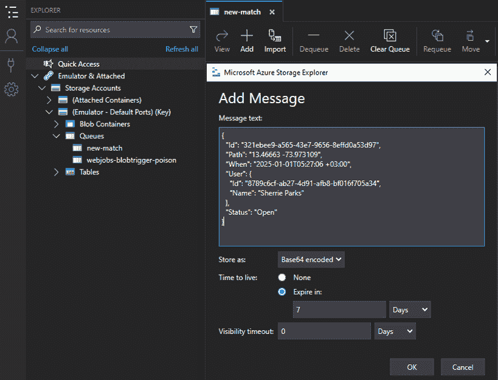

图 5.23：将消息放入队列

放入队列的消息将被函数自动处理，然后从存储中删除。


图 5.24：Azure 函数输出

考虑这个场景，这条消息可以用来向车主和寻车者发送电子邮件，表明他们有一个新的匹配项，并且他们可以与系统交互，以确定是否接受提出的路线。

# 摘要

本章讨论了实现三个重要的 Azure 触发函数以实现后台服务——定时触发器、Blob 存储触发器和队列存储触发器。可以使用这种无服务器技术轻松实现处理例程、图像、数据和订单等任务。

在介绍这些类型的函数时，本章解释了如何发布和监控函数。它还介绍了一种更有效的方法来实现 blob 触发函数，即以 Event Grid 为基础，并减少文件上传和开始处理之间的延迟。

本章还解释了 Azure Functions 如何成为实现微服务的一个很好的方法。为此，它提供了三个与汽车共享用例相关的示例，其中使用此类解决方案将使开发者能够专注于软件开发真正重要的事情——编写正在开发的解决方案的业务逻辑代码。

现在，让我们进入下一章，本章将讨论如何以 Azure Functions 为基础启用 IoT 解决方案。

# 问题

1.  定时触发函数的目的是什么？

定时触发函数旨在根据使用 `NCRONTAB` 表达式定义的计划执行代码。它允许开发者定期运行后台作业，而无需手动启动或 HTTP 请求。

这对于数据同步、清理操作、报告生成和定期计费等场景非常有用。它有助于自动化重复性任务，特别是那些不应依赖于人工交互来执行的任务。

1.  blob 触发函数的目的是什么？

当在特定的 Azure Blob Storage 容器中添加或修改文件时，blob 触发函数会自动响应。它为图像、日志或文档等非结构化数据启用事件驱动处理。

此触发器非常适合自动化涉及数据摄取、文件处理、图像分析或文档转换的工作流。它支持可伸缩性和与 Event Grid 的集成，以减少高性能场景中的延迟。

1.  队列触发函数的目的是什么？

当在 Azure Queue Storage 中添加新消息时，队列触发函数会执行。它使分布式系统中的生产者和消费者能够异步处理任务，解耦生产者和消费者。

这种方法确保了可靠和可伸缩地处理队列任务，如后台处理、订单处理或通知，使开发者能够专注于业务逻辑，同时 Azure Functions 处理基础设施问题。

1.  blob 触发函数和队列触发函数之间有什么区别？

blob 触发函数对 Azure Blob Storage 中的文件更改做出反应，通常处理二进制或非结构化数据。它是事件驱动的，适用于文件上传、媒体处理或文档处理等场景。

相比之下，队列触发函数旨在处理来自 Azure Queue Storage 的基于文本的消息。它更适合于管理工作流、作业调度和基于消息的集成，在这些场景中，您需要显式控制任务顺序和执行。

1.  我们如何减少文件上传和 blob 触发函数开始处理之间的延迟？

为了减少 blob 触发函数的延迟，建议使用基于 Event Grid 的 blob 触发器而不是基于轮询的触发器。Event Grid 通过在事件发生时推送事件，实现了近乎实时的处理。

此外，使用 Flex Consumption 计划或启用 Always On 的 App Service 计划有助于最小化冷启动时间。然而，这些方法可能会增加成本，因此应根据应用需求进行评估。

1.  列出监控 Azure 函数的不同方法。

Azure 函数可以使用几个内置工具进行监控。Azure 门户中的**调用**选项卡提供基本指标，例如执行次数和执行状态。

为了获得更深入的见解，Azure Monitor 日志和 Application Insights（**性能**和**实时指标**视图）提供高级遥测、性能跟踪和实时诊断。这些工具有助于识别错误、分析趋势和有效地调试运行时行为。

# 进一步阅读

+   Azure Functions timer 触发器：[`learn.microsoft.com/en-us/azure/azure-functions/functions-bindings-timer`](https://learn.microsoft.com/en-us/azure/azure-functions/functions-bindings-timer)

+   Azurite：[`learn.microsoft.com/en-us/azure/storage/common/storage-use-azurite`](https://learn.microsoft.com/en-us/azure/storage/common/storage-use-azurite)

+   Microsoft Azure Storage Explorer：[`learn.microsoft.com/en-us/azure/storage/storage-explorer/vs-azure-tools-storage-manage-with-storage-explorer`](https://learn.microsoft.com/en-us/azure/storage/storage-explorer/vs-azure-tools-storage-manage-with-storage-explorer)

+   Azure Functions blob 触发器：[`learn.microsoft.com/en-us/azure/azure-functions/functions-bindings-storage-blob-trigger`](https://learn.microsoft.com/en-us/azure/azure-functions/functions-bindings-storage-blob-trigger)

+   Azure Functions blob 触发器与 Event Grid：[`learn.microsoft.com/en-us/azure/azure-functions/functions-event-grid-blob-trigger`](https://learn.microsoft.com/en-us/azure/azure-functions/functions-event-grid-blob-trigger)

+   Azure Queue 存储触发器：[`learn.microsoft.com/en-us/azure/azure-functions/functions-bindings-storage-queue`](https://learn.microsoft.com/en-us/azure/azure-functions/functions-bindings-storage-queue)

+   Azure 存储注意事项：[`learn.microsoft.com/en-us/azure/azure-functions/storage-considerations`](https://learn.microsoft.com/en-us/azure/azure-functions/storage-considerations)

# 加入我们的 Discord 社区

加入我们的 Discord 空间，与作者和其他读者进行讨论：

[`packt.link/PSMCSharp`](https://packt.link/PSMCSharp)


