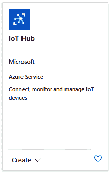
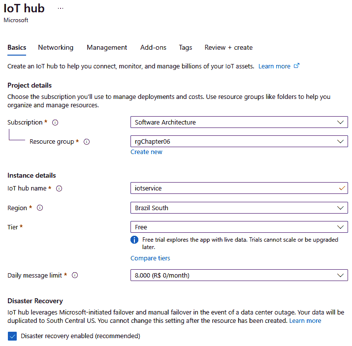
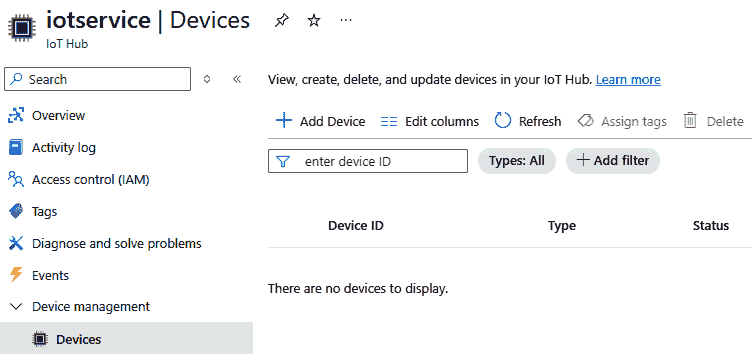
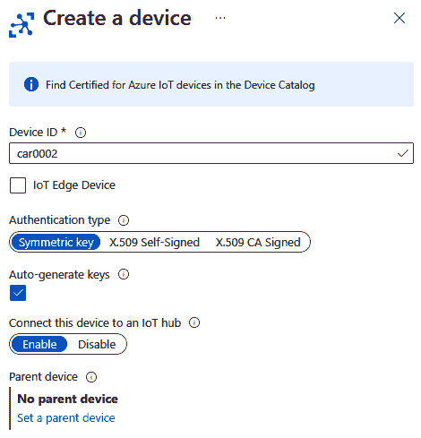
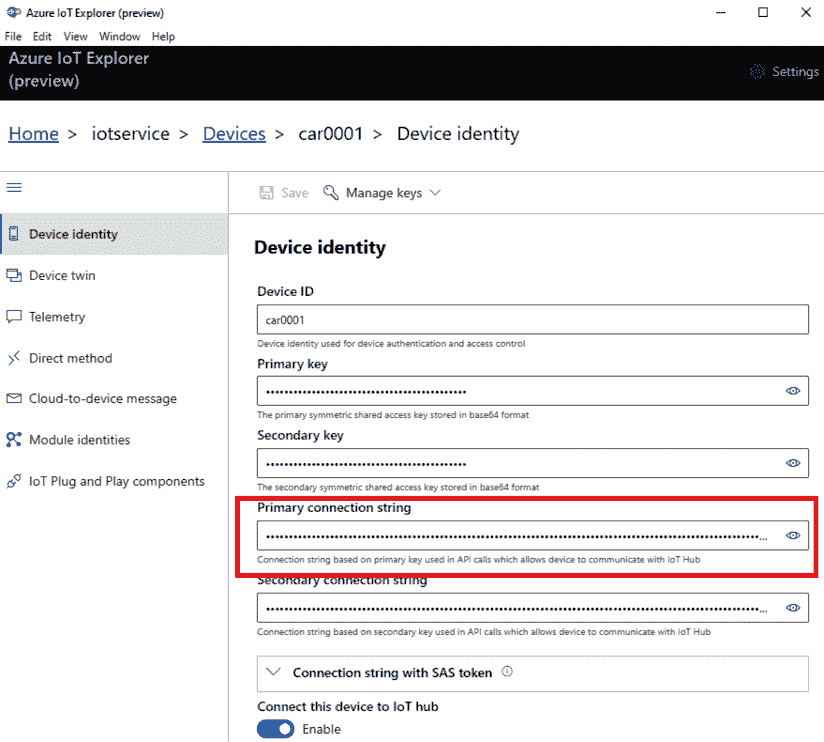
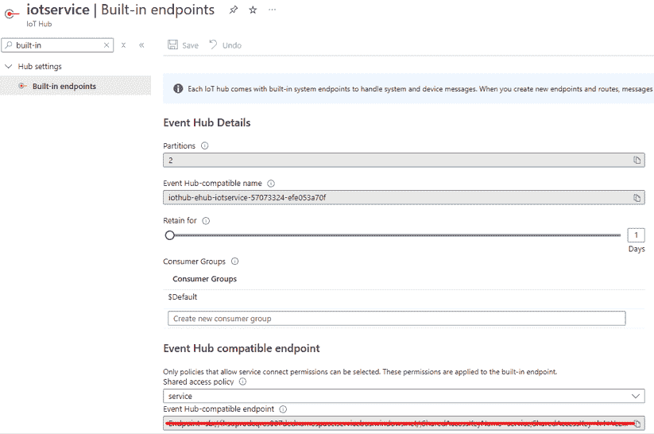
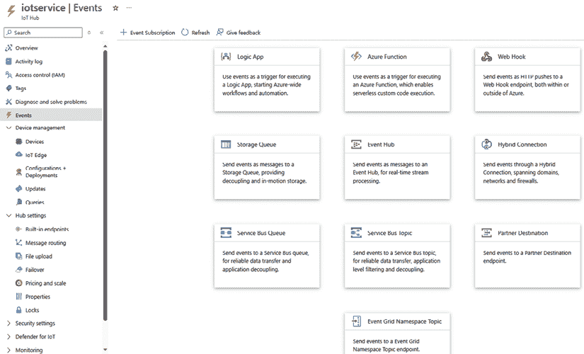
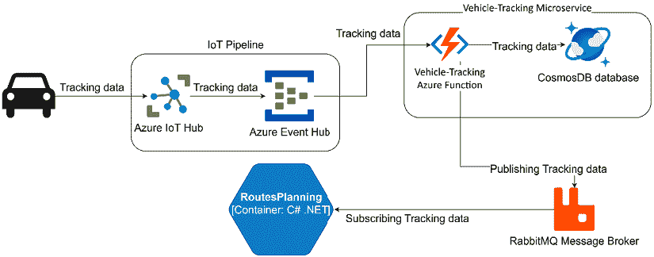

# 实践中的物联网函数

物联网的实施确实正在改变我们与世界互动的方式。尽管我们提供了许多解决方案，但物联网仍然具有挑战性，尤其是如果您想要关注可扩展的解决方案。

本章的目的是介绍 Event Grid、Event Hubs 和物联网中心触发器，这些将是有益于启动连接到设备的微服务的选项。除此之外，我们还将讨论如何使用 Azure 启用物联网。

本章将帮助您使用 Azure 创建物联网环境。除此之外，它将指导您通过 Azure 物联网函数触发器连接此环境。最后，它将展示物联网的汽车共享示例案例。让我们看看如何操作。

# 技术要求

本章需要 Visual Studio 2022 免费**社区版**或 Visual Studio Code。您还需要一个 Azure 账户来创建示例环境。您可以在[`github.com/PacktPublishing/Practical-Serverless-and-Microservices-with-Csharp`](https://github.com/PacktPublishing/Practical-Serverless-and-Microservices-with-Csharp)找到本章的示例代码。

# 在 Azure 中启用物联网

当我们思考物联网时，最大的担忧之一是解决方案的可扩展性。考虑到我们正在设计一个便于与大量设备连接的解决方案，在 Azure 中启用物联网的最佳方式是通过使用物联网中心。物联网中心为连接、监控和管理您的物联网设备提供了一个良好的环境，提供了一个平台即服务（PaaS）解决方案，这将使您专注于您正在开发的应用程序。

Azure 中的物联网中心有两个定价层，以及其免费版。免费版每天允许发送高达 8,000 条 0.5KB 的消息，并且具有与标准层相同的特性。如果您选择基本或标准层，这可以增加到每天高达 30 亿条 4KB 的消息！标准层还提供设备管理、云到设备消息和物联网边缘。除此之外，标准层还有一个由 Defender 管理的安全层，称为 Defender for IoT。这些信息让我们对平台的可扩展性有了概念。

为了本书的目的以及帮助您理解以下示例，我们建议您创建一个免费的物联网中心组件。接下来的主题将讨论如何从该物联网中心获取消息，以便您可以根据它创建一个微服务。

完成此操作的过程相当简单。您必须转到 Azure 中的**创建资源**并输入 Azure Marketplace 中的物联网中心。



图 6.1：使用 Azure Marketplace 创建物联网中心

对于**免费层**，您只需填写与**基本**选项卡相关的信息，然后您就可以继续到**审查 + 创建**选项卡。



图 6.2：Azure 物联网中心免费层设置

资源创建后，您将能够在 Azure IoT Hub 的 **设备管理** 区域创建设备。



图 6.3：Azure IoT Hub 设备管理

首先，设备只需要 **设备 ID** 信息，它代表了将要处理的设备的唯一性。



图 6.4：在 IoT Hub 中创建设备

IoT Hub 还提供了使用 IoT Edge 设备连接边缘设备的可能性。这不是本书的重点，但您将在 *进一步阅读* 部分找到相关信息。对于本书的目的，在 Azure 中创建的设备就绪可以使用。

考虑到我们已经创建了设备，我们需要了解如何模拟它们。下面的代码展示了我们如何使用 .NET `Microsoft.Azure.Devices.Client` 库来实现这一点：

```cs
// <summary>
// Simulates a device by creating a DeviceClient and sending a message.
// </summary>
// <param name=”connectionString”>The connection string of the //device.</param>
// <param name=”message”>The message to be sent by the device.</param>
private static async Task SimulateDeviceAsync(string connectionString, string message)
{
  var deviceClient = DeviceClient.CreateFromConnectionString(
 connectionString, TransportType.Mqtt);
  await SendMessageAsync(deviceClient, message);
}
// <summary>
// Sends a message to the IoT hub using the provided DeviceClient.
// </summary>
// <param name=”deviceClient”>The DeviceClient used to send the //message.</param>
/// <param name=”message”>The message to be sent.</param>
private static async Task SendMessageAsync(DeviceClient deviceClient, string message)
{
  var messageBytes = Encoding.UTF8.GetBytes(message);
  var iotMessage = new Message(messageBytes);
  await deviceClient.SendEventAsync(iotMessage);
} 
```

上面的方法中的 connectionString 参数针对每个 IoT 设备都是特定的。您可以使用 Azure 门户获取它，但值得一提的是，有一个非常实用的工具称为 **Azure IoT Explorer**。

使用 Azure IoT Explorer，我们可以在一个图形工具中管理连接到 IoT Hub 的设备，该工具有助于诊断和测试。例如，要获取特定设备的 **连接字符串**，您可以检查可用的 **设备标识** 信息。



图 6.5：获取设备连接字符串

现在我们已经了解了如何模拟设备，让我们学习如何使用 Azure Functions 从这些设备接收数据。

# 将 IoT Hub 与 Azure Functions 连接

默认情况下，IoT Hub 提供了一个内置服务，该服务将设备到云的消息发送到兼容的 EventHubs 端点，端点为 messages/events。这意味着您可以轻松地将 IoT Hub 设备消息连接到 Event Hubs 触发功能：

```cs
[Function(nameof(IoTFunction))]
public void Run([EventHubTrigger(“messages/events”, Connection = “EventHubConnection”)] EventData[] events)
{
foreach (EventData @event in events)
  {
    _logger.LogInformation(“Event Body: {body}”, @event.EventBody);
  }
} 
```

此选项确实非常有用，因为它可以快速开发一个解决方案，其中使用 IoT Hub 和 Azure Functions 连接不同的设备。因此，这可以被认为是直接集成消息处理的最简单方法。

在上面的代码中，我们只是定义了默认端点 messages/events 并定义了将为我们提供 Event Hub 连接字符串的变量。EventHubConnection 变量可以在 IoT Hub 的 **内置端点** 中找到。这里将只有共享访问策略，使我们能够从设备接收数据（**ServiceConnect** 权限）。考虑到此连接的目的仅仅是读取信息，建议您以最少的访问权限共享策略。



图 6.6：获取从 IoT Hub 接收数据的 Event Hubs 连接字符串

值得注意的是，根据你在 Azure IoT Hub 中选择的层级，这些消息可以保留最多七天。

虽然内置选项非常容易且快速实现，但你可能希望在可以应用其他替代方案的不同的物联网场景中应用。在 Azure IoT Hub 中使用**事件**触发来自设备的数据有几种方法，如下面的截图所示。



图 6.7：Azure IoT Hub 事件从设备接收数据的替代方案

每种方法当然都会给你实现事件驱动和可扩展解决方案的灵活性。除此之外，你需要精确分析你将从设备发送到云的数据，以定义最佳替代方案。值得注意的是，只有 IoT Hub 触发器旨在实现 IoT Hub 和 Azure Functions 之间的直接集成。其他触发器在**事件**选项卡下可见。

| **方法** | **何时使用** |
| --- | --- |
| IoT Hub 触发器 | 简单直接的消息处理集成。 |
| 事件网格触发器 | 适用于事件驱动系统和可扩展架构。 |
| 服务总线触发器 | 当你需要中间缓冲或消息优先级处理时。 |
| Blob 存储触发器 | 当你想要将遥测数据作为文件存储和处理时。 |
| HTTP 触发器（直接） | 当你需要对函数调用有精细控制时。 |
| 逻辑应用 | 用于与 IoT Hub 和函数的无代码/低代码集成。 |
| 流分析输出 | 当你在调用函数之前需要执行实时分析时。 |
| 队列触发器 | 用于轻量级、简单的基于队列的消息处理。 |

我们已经在过去三章中介绍了如何实现这些替代方案中的一些，因此我们不会再次探讨它们。

# 汽车共享物联网示例

我们在书中讨论的汽车共享示例允许寻找车辆和拥有车辆的用户之间进行互动。但是，假设我们有向从我们设计的平台申请特定物联网设备的车辆拥有者提供特殊计划的可能性。另一个选择是将汽车共享应用集成到中央汽车驾驶舱中。在这种情况下，用户可以追踪可用车辆的地理位置、速度和状态。还可以监控车辆健康参数，如电池寿命、轮胎压力和油量。

在之前提出的替代方案中，可以实施一个新的车辆跟踪微服务，其数据可能会与现有的**路线列表**和**路线规划器**微服务共享。对于前者，可以提供有关汽车可用性和预计到达时间的最新信息。对于规划者，这将有助于决定推荐新藏匿点的最佳汽车。

但考虑到上述场景，哪种架构方法会更好？在*第七章*“实践中的微服务”中，我们将介绍 RabbitMQ 消息代理，这对于此场景非常有用，以及 Routes-Planner 微服务的完整示例。下面的图示显示了物联网解决方案和 Vehicle-Tracking 微服务如何连接到主解决方案。

Azure IoT Hub 是负责管理多辆汽车（设备）的组件，它将使用 Azure Event Hubs 消息将每辆汽车接收到的跟踪数据发送到 Vehicle-Tracking 微服务。这个微服务将负责处理车辆健康参数，如上所述，并且这些信息将被存储在 Cosmos DB 数据库中，考虑到接收到的数据量。最后，它将仅使用 RabbitMQ 主总线发布 RoutesPlanning 微服务所需的数据。



图 6.8：连接到微服务解决方案的物联网解决方案

从汽车发送的跟踪数据可能具有以下结构。还值得一提的是，如果您从设备运行.NET 到云，如果您在一个专门用于定义 SharedMessages 的类库中工作，这个结构可以被重用：

```cs
using SharedMessages.BasicTypes;
using System;
namespace SharedMessages.VehicleTracking
{
  public class VehicleTrackingMessage : TimedMessage
  {
    public Guid VehicleId { get; set; }
    public GeoLocalizationMessage? Location { get; set; }
    public double Speed { get; set; }
    public double CarStatus { get; set; }
    public double BatteryLevel { get; set; }
    public double FuelLevel { get; set; }
    public double TirePressure { get; set; }   
  }
} 
```

值得注意的是，Location 属性是由另一个共享类定义的，称为 GeoLocalizationMessage：

```cs
using System;
using System.Collections.Generic;
using System.Text;
namespace SharedMessages.BasicTypes
{
  public class GeoLocalizationMessage
  {
    public double Latitude { get; set; }
    public double Longitude { get; set; }
  }
} 
```

考虑到这个场景，以下代码是使用物联网 Hub 作为前门收集数据并发送数据的汽车模拟：

```cs
using System.Text;
using System.Text.Json;
using Microsoft.Azure.Devices.Client;
using SharedMessages.BasicTypes;
using SharedMessages.VehicleTracking;
// <summary>
// The main class for the Car Simulator program.
// </summary>
class Program
{
  // <summary>
// The connection string for the car device.
// </summary>
  private static string carConnectionString = “[device connection string]”;
  // <summary>
// The main entry point for the program.
// </summary>
static async Task Main()
  {
    while (true)
    {
      // Create a new vehicle tracking message with random data
VehicleTrackingMessage vehicleTrackingMessage = new
        VehicleTrackingMessage
      {
        VehicleId = Guid.NewGuid(),
        Location = new GeoLocalizationMessage
        {
          Latitude = 47.6426,
          Longitude = -122.1301
        },
        Speed = 60 + DateTime.Now.Second,
        CarStatus = 1,
        BatteryLevel = 100 - DateTime.Now.Second,
        FuelLevel = 100,
        TirePressure = 32
      };
      // Simulate sending the device message
await SimulateDeviceAsync(carConnectionString,
 vehicleTrackingMessage);
      Console.WriteLine(“Vehicle tracking sent!”);
      await Task.Delay(new Random().Next(10000, 20000));
    }
  }
  // <summary>
// Simulates sending a device message to the IoT hub.
// </summary>
// <param name=”connectionString”>The connection string for the  
  //device.</param>
// <param name=”message”>The vehicle tracking message to send.</param>
  private static async Task SimulateDeviceAsync(string connectionString,
                                        VehicleTrackingMessage message)
  {
    var deviceClient = DeviceClient.CreateFromConnectionString(
 connectionString, TransportType.Mqtt);
    string jsonMessage = JsonSerializer.Serialize(message);
    await SendMessageAsync(deviceClient, jsonMessage);
  }
  // <summary>
// Sends a message to the IoT hub.
// </summary>
// <param name=”deviceClient”>The device client to use for sending the  
  //message.</param>
// <param name=”message”>The message to send.</param>
  private static async Task SendMessageAsync(DeviceClient deviceClient, 
      string message)
  {
    var messageBytes = Encoding.UTF8.GetBytes(message);
    var iotMessage = new Message(messageBytes);
    await deviceClient.SendEventAsync(iotMessage);
  }
} 
```

值得注意的是，我们在这里只是使用随机信息创建数据。然而，这个过程本身正好代表了从设备到云的数据输出过程。

根据您拥有的设备，您可能需要更改与 Azure IoT Hub 一起使用的协议。您可以查看 https://learn.microsoft.com/en-us/azure/iot-hub/iot-hub-devguide-protocols 以获取更多信息。

另一方面，以下代码表示将处理车辆跟踪消息的功能，将数据存储在 Cosmos DB 中，同时通过 RabbitMQ 向所有微服务发出警报，表明有来自汽车的新的消息，因此其他微服务，如 RoutesPlanning，可以利用它来运行其业务规则：

```cs
using System;
using System.Text.Json;
using Azure.Messaging.EventHubs;
using Microsoft.Azure.Functions.Worker;
using Microsoft.Extensions.Logging;
using SharedMessages.VehicleTracking;
namespace VehicleTrackingFunction
{
  // <summary>
// Azure Function to process vehicle tracking messages from Event Hub.
// </summary>
  public class VehicleTracking
  {
    private readonly ILogger<VehicleTracking> _logger;
    // <summary>
// Initializes a new instance of the <see cref=”VehicleTracking”/>
    //class.
// </summary>
// <param name=”logger”>The logger instance.</param>
    public VehicleTracking(ILogger<VehicleTracking> logger)
    {
      _logger = logger;
    }
    // <summary>
// Function triggered by Event Hub messages.
// </summary>
// <param name=”events”>Array of EventData received from Event
    //Hub.</param>
    [Function(nameof(VehicleTracking))]
    public async Task Run([EventHubTrigger(“messages/events”,
      Connection = “CarSharingIoTEventHub”)] EventData[] events)
    {
      foreach (EventData @event in events)
      {
        var jsonString = @event.EventBody.ToString();
        if (!string.IsNullOrEmpty(jsonString))
        {
          VehicleTrackingMessage? vehicleTrackingMessage = JsonSerializer.Deserialize<VehicleTrackingMessage>(jsonString);
          if (vehicleTrackingMessage != null)
          {
            await SaveDataToDatabase(vehicleTrackingMessage);
            await AlertDataToRabbitMQ(vehicleTrackingMessage);
          }
        }
      }
    }
    // <summary>
// Sends vehicle tracking data to RabbitMQ.
// </summary>
// <param name=”vehicleTrackingMessage”>The vehicle tracking
    //message.</param>
    private async Task AlertDataToRabbitMQ(
      VehicleTrackingMessage vehicleTrackingMessage)
    {
      // Implementation for alerting data to RabbitMQ
Console.WriteLine($”Vehicle tracking data alerted to RabbitMQ: ID =
 {vehicleTrackingMessage.VehicleId};
        Speed = {vehicleTrackingMessage.Speed}”);
    }
    // <summary>
// Saves vehicle tracking data to CosmosDB database.
// </summary>
// <param name=”vehicleTrackingMessage”>The vehicle tracking
    //message.</param>
    private async Task SaveDataToDatabase(VehicleTrackingMessage 
      vehicleTrackingMessage)
    {
      // Implementation for saving data to the database CosmosDB
Console.WriteLine($”Vehicle tracking data saved to database: ID =
 {vehicleTrackingMessage.VehicleId};
        Speed = {vehicleTrackingMessage.Speed}”);
    }
  }
} 
```

关于这种方法的一些优点证明了为什么微服务是处理大型产品的良好方式。首先，物联网解决方案的实施与应用程序其他部分的实施完全解耦，这使得开发者能够定义所使用的技术和部署管道。其次，物联网解决方案提供的信息的使用是可选的，并且可以扩展到所需的每个微服务。此外，需要注意的一个点是 Shared Messages 中定义的合约。您必须小心不要在系统之间创建不兼容性。避免这种情况的一个好方法是版本化消息内容。

# 摘要

本章讨论了如何在 Azure 中处理物联网解决方案，特别是借助 Azure IoT Hub 和 Azure Functions。它还展示了使用物联网服务扩展的汽车共享示例，这展示了微服务架构的实用性。

微服务在大规模应用程序的开发中提供了几个战略优势，尤其是在实施物联网解决方案时。通过将物联网解决方案从应用程序的其他部分解耦，开发者可以独立选择合适的技术和部署管道。这种模块化方法不仅增强了可扩展性和可维护性，还允许不同的团队在没有干扰的情况下共同工作于应用程序的不同部分。

微服务的另一个显著优势是它们可选的分布式信息使用。物联网解决方案提供的数据可以被任何需要它的微服务利用，确保高效的数据处理和加工。然而，通过精心管理合约，保持不同系统间的兼容性至关重要。版本化消息内容是避免不兼容问题的有效策略，确保微服务之间通信的顺畅。在下一章中，我们将开始讨论微服务的实际应用，并更加注重这一点。

# 问题

1.  在物联网应用程序中，从内置端点读取设备到云的消息的目的是什么？

IoT Hub 中的内置端点允许您轻松直接地读取设备到云的消息，使其非常适合设备与后端应用程序之间的快速集成。它简化了将物联网设备连接到如 Azure Functions 等服务使用标准 Event Hub 兼容端点的过程。

这种方法适用于需要快速原型设计或轻量级集成的场景，因为它需要最少的配置并支持可扩展的事件驱动解决方案。

1.  您如何从内置端点读取设备到云的消息？

要从内置端点读取消息，您可以使用 Event Hub 触发器创建一个 Azure 函数，并将其指向 IoT Hub 的默认消息/事件端点。使用具有读取权限的连接字符串（通常来自服务策略）来访问消息。

此方法允许快速直接地实现无服务器消息处理，使 Azure Function 能够在设备向 IoT Hub 发送数据时自动执行。

1.  使用 Azure IoT explorer 管理物联网设备有哪些优势？

Azure IoT explorer 是一个图形工具，它简化了 IoT Hub 中的设备管理。它允许您注册新设备、查看连接字符串、发送测试消息和监控设备状态，而无需编写任何代码。

此工具在开发和测试阶段特别有用，因为它加速了诊断，并为开发者提供了一个用户友好的界面来交互和配置物联网设备。

1.  Queue Trigger 如何促进轻量级、简单的基于队列的消息处理？

Queue triggers 使 Azure Functions 能够响应放置在 Azure 存储队列中的消息。此模式提供了一种轻量级且解耦的方式来异步处理任务，使得实现后台作业处理或消息工作流变得容易。

在需要简单性、可扩展性和容错性，而不需要复杂消息基础设施的情况下，这种方法尤其有效。

1.  IoT Hub 和 Event Hubs 之间有哪些主要区别？

IoT Hub 专门设计用于与物联网设备进行安全且可扩展的通信，提供设备管理、双向消息和与 IoT Edge 的集成。另一方面，Event Hubs 是一个高吞吐量的通用事件摄取服务，主要用于遥测和日志记录。

虽然两者都支持大量数据摄取，但 IoT Hub 提供了以设备为中心的功能，如设备属性、直接方法和每个设备的身份验证凭据，而 Event Hubs 则专注于数据流和集成到分析管道中。

1.  将物联网解决方案与应用程序的其他部分解耦有哪些好处？

解耦物联网解决方案允许独立开发、扩展和部署设备通信层。每个微服务只能处理它需要的数据，从而带来更好的性能、灵活性和可维护性。

此外，这种分离还使团队能够根据需要采用不同的技术或部署策略，同时保持核心应用程序架构的清洁和模块化。

1.  如何通过版本化消息内容帮助防止共享消息中的不兼容性问题？

版本化消息内容确保对数据结构的更改不会破坏消费这些消息的微服务中的功能。每个服务都可以处理它理解的版本，从而实现系统的平稳演进。

通过保持版本间的兼容性，开发者可以独立更新和部署组件，而不会导致集成失败或服务间数据误解。

1.  部署管道在物联网解决方案中微服务实现中扮演什么角色？

一个定义良好的部署管道允许每个微服务，包括与物联网相关的微服务，独立地进行构建、测试和部署。这支持持续集成和交付，缩短上市时间并最小化更新期间的风险。

对于物联网场景，数据摄取和处理至关重要，自动化的管道确保了分布式系统中的可靠性、版本控制和可追溯性，从而增强了整体应用的鲁棒性。

# 进一步阅读

+   Azurite: [`learn.microsoft.com/en-us/azure/storage/common/storage-use-azurite`](https://learn.microsoft.com/en-us/azure/storage/common/storage-use-azurite)

+   Microsoft Azure 存储资源管理器: [`learn.microsoft.com/en-us/azure/storage/storage-explorer/vs-azure-tools-storage-manage-with-storage-explorer`](https://learn.microsoft.com/en-us/azure/storage/storage-explorer/vs-azure-tools-storage-manage-with-storage-explorer)

+   Azure IoT Edge 文档: [`learn.microsoft.com/en-us/azure/iot-edge`](https://learn.microsoft.com/en-us/azure/iot-edge)

+   从内置端点读取设备到云的消息: [`learn.microsoft.com/en-us/azure/iot-hub/iot-hub-devguide-messages-read-builtin`](https://learn.microsoft.com/en-us/azure/iot-hub/iot-hub-devguide-messages-read-builtin)

+   Azure IoT 探索器: [`learn.microsoft.com/en-us/azure/iot/howto-use-iot-explorer`](https://learn.microsoft.com/en-us/azure/iot/howto-use-iot-explorer)

+   物联网中心与事件中心之间的比较: [`learn.microsoft.com/en-us/azure/iot-hub/iot-hub-compare-event-hubs`](https://learn.microsoft.com/en-us/azure/iot-hub/iot-hub-compare-event-hubs)

+   Azure Functions 事件触发器: https://learn.microsoft.com/en-us/azure/azure-functions/functions-bindings-event-iot

+   Azure Functions IoT 触发器: https://learn.microsoft.com/en-us/azure/azure-functions/functions-bindings-event-iot-trigger

+   Azure 流分析: https://azure.microsoft.com/en-us/products/stream-analytics/

# 加入我们的 Discord 社区

加入我们社区的 Discord 空间，与作者和其他读者进行讨论：

[`packt.link/PSMCSharp`](https://packt.link/PSMCSharp)


