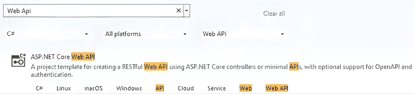
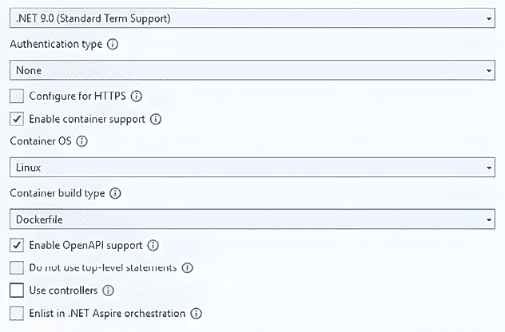
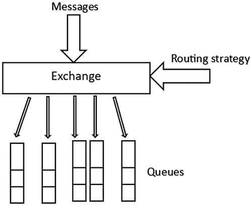
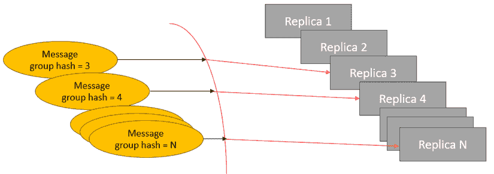

# 实践中的微服务

本章致力于在通用应用架构设计之后以及所有微服务的所有接口都已定义之后，每个微服务的实际实现。本书剩余章节将详细阐述微服务之间的交互和编排。

所有概念将通过从本书案例研究应用中提取的工人微服务示例进行说明，该示例我们在*第二章*的*“汽车共享示例”子节中介绍，即*“揭秘微服务应用”*。

在简要描述示例工人微服务规范后，我们将描述如何设计微服务的输入和输出通信子系统，以及如何组织微服务请求服务逻辑。

最后，我们将讨论如何使用在*第三章*的*“基于洋葱架构的解决方案模板”*部分中介绍的洋葱架构项目模板来实现微服务的细节。

更具体地说，本章涵盖了以下内容：

+   汽车共享应用的路线规划微服务

+   微服务基本设计

+   确保与 Polly 的通信具有弹性

+   从抽象到实现细节

# 技术要求

本章需要以下条件：

1.  至少需要 Visual Studio 2022，尤其是免费的*社区*版。

1.  一个接受 TCP/IP 请求和用户/密码身份验证的 SQL 实例，因为它必须与运行在 Docker 容器内的客户端通信。请注意，Visual Studio 安装附带的支持 TCP/IP 的 SQL 实例，因此您需要安装 SQL Express 或使用云实例。对于本地安装，安装程序和说明都可在以下链接找到：[`www.microsoft.com/en-US/download/details.aspx?id=104781`](https://www.microsoft.com/en-US/download/details.aspx?id=104781)。您还可以使用以下代码将 SQL Server Developer 版作为 Docker 镜像运行：

    ```cs
    docker run -e "ACCEPT_EULA=Y" -e "MSSQL_SA_PASSWORD=yourStrong(!)Password" -p 1433:1433 -d mcr.microsoft.com/mssql/server:2022-latest 
    ```

1.  对应于所选密码的用户名将是`sa`。

1.  Docker Desktop for Windows ([`www.docker.com/products/docker-desktop`](https://www.docker.com/products/docker-desktop)).

1.  Docker Desktop，反过来，需要**Windows Subsystem for Linux (WSL)**，可以通过以下步骤安装：

    1.  在 Windows 10/11 的搜索栏中输入`powershell`。

    1.  当**Windows PowerShell**作为搜索结果出现时，请单击**以管理员身份运行**。

    1.  在出现的 Windows PowerShell 管理控制台中，运行`wsl --install`命令。

您可以在此处找到本章的示例代码：[`github.com/PacktPublishing/Practical-Serverless-and-Microservices-with-Csharp`](https://github.com/PacktPublishing/Practical-Serverless-and-Microservices-with-Csharp)。

# 汽车共享应用的路线规划微服务

在本节中，我们描述了我们的示例微服务、如何处理安全以及如何为其实施准备解决方案，并将它们分为三个独立的子节。

## 微服务规范

路由规划微服务存储和匹配待处理的请求，这些请求需要从一个城镇移动到另一个城镇，并且使用的是仍然对其他参与者开放的路由。

当车主开启的路由被创建时，它会与那些起点和终点城镇靠近车主路线且日期限制相兼容的请求进行匹配。如果找到匹配项，则会创建一个修改路由以包含它们的提案，并将其发送给其他感兴趣的微服务。当插入新的请求时，也会执行对称操作。

当接受扩展路由的提案时，原始路由被扩展。

在初始匹配尝试之后，请求和路由都会被存储起来，以备将来可能的匹配。在以下情况下，请求和路由会被移除或修改：

1.  当路由对新参与者关闭或被取消时，它将从可能的匹配中移除。

1.  当路由与某些请求合并时，它会扩展。此操作不会尝试进行新的匹配。

1.  当请求与路由合并时，请求将从可能的匹配中移除。

1.  当请求合并的路由被取消时，请求再次可用。在此操作之后，将尝试进行新的匹配。

1.  请求和路由在它们的最大旅行日过期后*N*天后被删除，其中*N*是一个需要提供的参数。

当满足以下条件时，进行路由和请求之间的匹配：

1.  路由日期在请求关联的最小和最大日期之间。

1.  请求的起点和终点城镇与路线足够接近。

我们将使用发布者/订阅者模式来实现大多数微服务之间的通信，以最大化微服务的解耦。这个选择也将最小化整体通信相关的代码，因为消息处理程序及其客户端库负责处理大多数异步通信问题。请参阅*第二章*的*基于事件的通信*子节，*揭秘微服务应用程序*，以获取有关基于事件通信的更多详细信息。

此外，为了最大化应用程序的可移植性，我们将使用**RabbitMQ**消息代理，它不受特定平台或云的限制，但可以在任何基于 Kubernetes 的网络中安装，并具有可调整的副本数量。**RabbitMQ**将在下一节的专用子节中描述。

由于共享汽车应用程序不交换大量消息，我们可能避免使用非标准的二进制序列化，如**gRPC Protobuf**，而选择简单的**JSON**消息序列化。

大多数 Web 服务器和通信库都可以配置为自动压缩 JSON 数据。Web 服务器与客户端协商压缩。

最后，由于我们的工作微服务入出通信基于消息代理而不是常规的**HTTP**和**gRPC** ASP.NET Core 协议，我们可能会考虑基于所谓的**托管服务**（**托管服务**将在下一节讨论）的**Worker 服务**项目模板。然而，微服务最佳实践规定每个微服务都应该公开一个 HTTP 端点以验证其健康状态，因此我们将采用基于最小 API 的 ASP.NET Core Web API 项目，因为它也支持我们需要的基于消息代理的通信所需的托管服务。

在明确了微服务职责后，我们可以继续考虑安全因素。

## 处理安全和授权

来自实际用户的请求授权通常使用 ASP.NET Web API 的常规技术处理，即使用 Web 令牌（通常是**JSON 承载令牌**）和`Authorize`属性。Web 令牌由一个充当授权服务器的专用微服务的登录和令牌续订端点提供。

来自其他服务的请求通常使用 mTLS（即基于证书的客户端身份验证）进行安全保护。客户端证书由底层 TCP/IP 协议与用于加密 HTTPS 通信的服务器证书一起处理。然后，客户端证书提取的信息传递给 ASP.NET Core 身份验证中间件以创建一个`ClaimsPrincipal`（通常的 ASP.NET Core **User**对象）。当应用程序在编排器中运行时，也可以使用编排器特定的授权，而当应用程序在云中运行时，可以使用云特定的授权。

幸运的是，如果两个通信微服务都暴露在私有网络中，或者更好，由微服务编排器管理的私有网络中，我们可以用防火墙规则和/或编排器提供的其他通信安全设施来替换用户身份验证。

我们将在*第八章*“使用 Kubernetes 的实用微服务组织”和*第十章*“无服务器和微服务应用程序的安全性和可观察性”中分析 Kubernetes 编排器，以及其通信安全设施。即使在私有网络中，也建议使用 mTLS 或其他加密方法加密内部通信以减轻内部威胁和网络攻击，但为了本书的简洁性，我们只将保护与外部世界的通信。

因此，如果我们充分组织我们的私有网络，我们只需要确保与外部世界的通信安全，即与前端微服务的通信。然而，如*第二章*中“揭秘微服务应用”部分的*接口外部世界*小节所述，基于微服务的应用使用 API 网关与外部世界通信。在最简单的情况下，与外部世界的接口只是一个负载均衡的 Web 服务器，执行 HTTPS 终止，即从外部世界接收 HTTPS 通信。虽然一些架构在 API 网关终止 HTTPS 并在内部使用 HTTP，但建议在私有网络中使用 mTLS 或重新加密来确保微服务生态系统内的安全性。这样，我们可能只需要为整个应用程序使用一个 HTTPS 证书，从而避免所有组成应用程序的微服务的整个证书颁发和更新流程。

总结来说，如果我们使用任何类型的 HTTPS 终止接口来访问微服务应用，我们可能避免在所有微服务中使用 HTTPS 通信。

现在我们已经准备好准备将托管路由规划微服务的 Visual Studio 解决方案了！

## 创建 Visual Studio 解决方案

由于我们决定使用 ASP.NET Core Web API 项目来实现工作微服务的最外层，让我们创建一个包含名为`RoutesPlanning`的 ASP.NET Core Web API 项目的`CarSharing` Visual Studio 解决方案。**ASP.NET Core Web API**项目可以通过从 Visual Studio 项目选择窗口的下拉菜单中选择**C#**、**所有平台**和**Web API**来轻松找到，如图所示：



图 7.1：项目选择

如前所述，我们可能避免 HTTPS 通信，并且工作微服务不需要认证。然而，由于微服务通常容器化，我们需要 Docker 支持。

最后，我们不需要控制器，只需要一个最小的 API，因为我们只需要暴露几个简单的端点进行健康检查：



图 7.2：项目设置

我们将使用洋葱架构，因此我们还需要为应用服务和领域层添加一个项目。因此，让我们添加两个额外的**类库**项目，分别命名为`RoutesPlanningApplicationServices`和`RoutesPlanningDomainLayer`。我们将根据*第三章*中“基于洋葱架构的解决方案模板”部分介绍的洋葱架构模板进行适配。

让我们打开`OnionArchitectureComplete`项目模板，你可以在书的 GitHub 仓库的`ch03`文件夹中找到它。在`RoutesPlanningDomainLayer`项目中，删除**Class1.cs**文件，选择`ch03`项目模板中`DomainLayer`项目的三个文件夹，复制它们，并将它们粘贴到`RoutesPlanningDomainLayer`项目中。如果你安装了最新的 Visual Studio 2022 版本，你应该能够从 Visual Studio 解决方案资源管理器中执行复制操作。此外，将`Microsoft.Extensions.DependencyInjection.Abstractions` Nuget 包的引用添加到`RoutesPlanningDomainLayer`项目中。

然后，在`RoutesPlanningApplicationServices`和`ApplicationServices`项目上执行类似的操作。

现在你已经放置了所有的洋葱架构文件，你只需要在`RoutesPlanningApplicationServices`中添加对`RoutesPlanningDomainLayer`的引用，并在`RoutesPlanning`中添加对`RoutesPlanningApplicationServices`的引用。

在最后一步操作之后，你的解决方案应该可以编译，但我们还没有完成解决方案的准备工作。我们还需要添加一个基于**Entity Framework Core**的库，以便为我们的领域层提供一个实现驱动程序。

让我们添加一个新的类库项目，并将其命名为`RoutesPlanningDBDriver`。添加对`Microsoft.EntityFrameworkCore.SqlServer`和`Microsoft.EntityFrameworkCore.Tools` Nuget 包的引用，以及对`RoutesPlanningDomainLayer`项目的引用。

之后，删除**Class1.cs**文件，并用`ch03`项目模板中`DBDriver`项目的所有代码文件和文件夹替换它。

```cs
RoutesPlanning Program.cs file:
```

```cs
builder.Services.AddOpenApi();
//Code snippet start
builder.Services.AddApplicationServices();
builder.Services.AddDbDriver(
    builder.Configuration?.GetConnectionString("DefaultConnection") ?? string.Empty);
//Code snippet end 
```

`RoutesPlanning`需要引用`RoutesPlanningDBDriver`，因为洋葱架构的最外层必须引用所有特定实现的驱动程序。`AddApplicationServices`将所有查询、命令和事件处理程序添加到依赖注入引擎中，而`AddDbDtiver`将所有存储库实现和`IUnitOfWork`实现添加到依赖注入中。

关于我们用来准备解决方案的洋葱架构项目模板的更多信息，请参阅*第三章*的*基于洋葱架构的解决方案模板*部分，*设置和理论：Docker 和洋葱架构*。

现在，我们的解决方案终于准备好了！我们可以开始设计我们的工作微服务了！

# 微服务基本设计

在本节中，我们将定义所有主要微服务抽象，即整体通信策略、所有洋葱架构命令和事件，以及所需托管服务的顶级循环。我们将从对所选消息代理的描述开始：**RabbitMQ**。

## 消息代理：RabbitMQ

RabbitMQ 本地支持 **AMQP** 异步消息协议，这是最常用的异步协议之一，另一个是 **MQTT**，它具有特定的发布/订阅模式语法。可以通过插件添加对 **MQTT** 的支持，但 RabbitMQ 提供了在 **AMQP** 上轻松实现发布/订阅模式的工具。此外，RabbitMQ 提供了支持可伸缩性、灾难恢复和冗余的几个工具，因此它满足了成为云和微服务环境中一流演员的所有要求。更具体地说，通过定义 RabbitMQ 集群，我们可以实现负载均衡和数据复制，这在大多数 SQL 和 NoSQL 数据库中都是必需的。

在本节中，我们将仅描述 RabbitMQ 的基本操作，而 RabbitMQ 集群在 Kubernetes 中的安装和使用将在 *第八章*，*使用 Kubernetes 的实用微服务组织* 中讨论。您可以在 RabbitMQ 官方网站上的教程和文档中找到更多详细信息：[`www.rabbitmq.com/`](https://www.rabbitmq.com/)。

RabbitMQ 消息必须以二进制格式准备，因为 RabbitMQ 消息必须只是一个字节数组。然而，我们将使用 **EasyNetQ** 客户端，它负责对象序列化和大多数客户端/服务器连接以及错误恢复。**EasyNetQ** 是一个基于 RabbitMQ 的低级 **RabbitMQ.Client** NuGet 客户端的 NuGet 包，它使得 RabbitMQ 的使用变得简单，同时减少了通信代码的开销，并增强了其模块化和可修改性。

一旦消息被发送到 RabbitMQ，它们会被放置在 **队列** 中。更具体地说，它们通过其他实体（称为 **交换**）传递时，会被放置在一个或多个 **队列** 中。交换使用依赖于 **交换** 类型的路由策略将消息路由到 **队列**。交换是 **AMQP** 特有的概念，它们是 RabbitMQ 配置复杂通信协议（如发布/订阅协议）的方式，如下面的图所示：



图 7.3：RabbitMQ 交换

通过适当地定义交换路由策略，我们可以实现几种模式。更具体地说，以下适用：

+   当我们使用 **默认交换** 时，消息会被发送到单个队列，并且我们可以实现异步直接调用。

+   当我们使用 **fanout 交换** 时，交换会将消息发送到所有订阅该交换的队列。这样，我们可以实现发布/订阅模式。

此外，还有一个 **topic 交换**，它通过允许匹配名为事件子类的主题来增强发布/订阅模式。接收者和主题之间的匹配也支持通配符字符。我们将在 *确保消息按正确顺序处理* 子节中描述其在企业微服务中的实际用法。

当多个接收器连接到同一个队列时，消息将根据轮询模式在它们之间平均分配。这是相同微服务的 *N* 个相同副本的情况。因此，副本由 RabbitMQ 自动负载均衡。

幸运的是，**EasyNetQ** 直接暴露了发布/订阅协议（可能包含主题），直接调用协议，以及请求/响应异步 RPC 协议，负责创建和连接所有需要的队列和交换。在描述我们的路线规划微服务代码时，将提供如何使用 **EasyNetQ** 的详细信息。

安装 RabbitMQ 最简单的方法是使用其 Docker 镜像。我们将采用此选项，因为我们的所有微服务也将被容器化，并且在整体应用程序的最终 Kubernetes 版本中，我们将使用容器化的 RabbitMQ 集群。

我们可以在 Linux shell 中运行以下命令：

```cs
docker run -it --rm --name rabbitmq -p 5672:5672 -p 15672:15672 rabbitmq:4.0-management 
```

由于我们提供了 `-it` 标志，在镜像下载并容器创建并启动后，Linux shell 仍然被阻塞在容器文件系统中。此外，由于我们也添加了 `–-rm` 选项，容器在停止后立即被销毁，如下所示：

```cs
docker stop rabbitmq 
```

为了验证 RabbitMQ 是否正常工作，请导航到 [`localhost:15672`](http://localhost:15672)。RabbitMQ 管理控制台应该出现。您可以使用启动凭证登录，用户名和密码都是 `guest`。

您不需要让容器持续运行；当您需要测试微服务代码时，可以停止它并重新执行 `run` 命令。

RabbitMQ 需要的磁盘空间作为 Docker 卷挂载，以下卷声明直接插入到 `Dockerfile` 镜像中：

```cs
VOLUME /var/lib/rabbitmq 
```

这意味着当容器被销毁并重新运行时，磁盘内容会被重置。因此，如果您想保留磁盘内容，请避免使用带有 `–-rm` 选项的容器运行，这样它在停止时不会被销毁。

如果您需要自定义凭证，请将以下环境变量添加到 `run` 命令中：

```cs
-e RABBITMQ_DEFAULT_USER=my_user_name -e RABBITMQ_DEFAULT_PASS=my_password 
```

这在访问 RabbitMQ 时需要从 `localhost` 外部进行时是必要的，因为在这种情况下，出于安全原因，默认的用户名和密码不被接受。

现在，我们可以继续设计我们的工作微服务的输入和输出消息。

## 输入通信

由于表示微服务内部消息的类必须为客户端和服务器所知，最佳选项是在初始微服务外部接口设计期间定义它们，并将它们放在一个或多个共享库中。由于我们的项目包含相对较少的微服务，我们可以假设所有消息对所有微服务都是可见的，因此我们可以使用单个共享库。

然而，在包含数百或数千个微服务的更复杂场景中，它们的组织必须是分层的，因此我们将有 0 级消息，所有微服务都知道；1 级消息，仅在 1 级微服务组内知道，依此类推。

让我们在解决方案中添加一个新的**类库**项目，命名为`SharedMessages`，并为其选择**标准 2.1**版本。然后，让我们将此新项目添加到`RoutesPlanningApplicationServices`项目中。我们将在这里放置所有应用程序消息。

从路线规划微服务的规范来看，我们只有四条消息：

1.  **新请求**：它将包含一个唯一的请求标识符、可接受的旅行日期间隔以及代表出发地和到达地的两个唯一标识符，它们的显示名称以及它们的纬度和经度。此外，它还将包含一个唯一标识符，代表提出请求的用户及其显示名称。

1.  **新路线**：它将包含一个唯一的路线标识符、旅行日期以及代表出发地和到达地的两个唯一标识符，它们的显示名称以及它们的纬度和经度。此外，它还将包含一个唯一标识符，代表提出路线提案的汽车所有者及其显示名称。

1.  **路线关闭/取消**：它将仅包含唯一的路线标识符和一个标志，指定路线是否成功关闭或取消。

1.  **路线扩展**：它通知汽车所有者已接受扩展路线，包括其他请求的出发地和结束地。它包含与新的路线消息相同的信息，以及新的请求消息。

它还包含一个标志，指定在扩展后，路线是否已对其他参与者关闭。

对于路线规划微服务，消息内容可能显得冗余。例如，路线扩展消息中包含的大部分信息，路线规划微服务已经知道。实际上，路线规划微服务只需要请求和路线的唯一标识符来连接。

然而，使用发布者/订阅者模式发送的消息被几个可能未知订阅者使用，因此它们不能假设订阅者具有特定的先验知识。例如，路线扩展消息也将被处理所有不包含有关所有现有路线提案信息的请求的微服务订阅，因此所有关于合并路线所需的信息都必须通过此消息接收。

相反，路线关闭/取消消息不需要传达整个路线信息，因为任何对事件感兴趣的服务必须已经知道此路线，并且必须已经拥有关于它的所有所需数据。如果它从未与此路线交互，它可能缺少这些数据，但在此情况下，由消息表示的事件不能修改其状态，而必须简单地忽略。

我们必须始终对所有微服务输入提出的一个重要问题是：如果消息到达的顺序错误，即与发送的顺序不同，会发生什么？如果消息顺序很重要，我们要么确保所有消息都按正确顺序到达并被处理，要么使用在*第二章*中“揭秘微服务应用”的*有效处理异步通信*小节中解释的技术重新排序消息。不幸的是，重新排序输入消息是不够的；我们还必须按正确的顺序处理它们。

如果多个相同微服务的副本并发处理这些输入消息，这并不是一个简单任务。幸运的是，没有应用程序需要为所有输入消息固定排序。但是，一些*相关消息*，例如，所有包含相同路由的消息，必须按正确顺序处理。因此，我们可以通过将所有相关消息传递给同一个副本来避免*仅仅*并发处理*相关消息*。我们将在*确保消息按正确顺序处理*部分分析实现类似负载均衡策略的技术。

在我们这个案例中，新路由提供和路由请求到达的顺序并不是问题，因为我们可以通过简单的技巧正确处理乱序消息。我们只需要添加一个更新版本号来检测过去的更新。更新版本号必须是唯一的，并且必须与对给定实体应用更新的实际顺序相对应。当实体被创建时，它从版本 0 开始，然后每次新更新都会增加这个数字。

作为一般规则，如果所有修改和创建消息都包含整个实体数据，并且如果所有删除都是逻辑的，即实体只是被标记为已删除，那么消息不需要排序。

事实上，我们只能识别并应用比已应用的更新更近的修改。此外，我们总是可以验证修改消息中提到的实体是否已经被删除，并丢弃该修改。最后，如果修改中提到的实体尚未创建，我们可以始终使用修改消息中包含的数据创建它，因为每个修改都包含整个实体数据。

在我们这个案例中，路由扩展消息的顺序并不重要，因为合并到路由中的请求只是简单相加，并且只需要选择存储在路由中的城镇列表和消息中包含的较新列表。

路由扩展和路由关闭/中止消息的倒置也不会引起问题，因为忽略中止路由的扩展，并合并关闭后到达的先前请求就足够了。

路由创建和扩展的逆操作永远不会发生，因为只有成功创建的路由才能引起请求-路由匹配，进而导致路由扩展。

已删除的路由不会引起问题，因为路线中止和关闭消息实际上是逻辑删除。我们可以在旅行日过去后 *N* 天内删除它们，因为到那时，之前的延迟消息无法到达（在严重故障的情况下，消息可能会延迟数小时甚至一天）。这可以通过 cron 作业完成。

由于超时和重发导致的消息重复也不会引起问题，因为它们总是可以被识别并忽略。作为一个练习，你可以详细分析所有可能性。

所有必需的消息都可以通过一些基本类型轻松定义，我们将它们放置在 `SharedMessages` 项目的 `BasicTypes` 文件夹中。具体如下：

```cs
public class GeoLocalizationMessage
{
    public double Latitude { get; set; }
    public double Longitude { get; set; }
}
public class TimeIntervalMessage
{
    public DateTime Start {  get; set; }
    public DateTime End { get; set; }
}
public class UserBasicInfoMessage
{
    public Guid Id { get; set; }
    public string? DisplayName { get; set; }
}
public class TownBasicInfoMessage
{
    public Guid Id { get; set; }
    public string? Name { get; set; }
    public GeoLocalizationMessage? Location { get; set; }
} 
```

此外，由于所有消息都必须包含一个更新时间，我们可以让它们都继承以下类：

```cs
public class TimedMessage
{
    public long TimeStamp { get; set; }
} 
```

让我们将这个类也放置在 `BasicTypes` 文件夹中。

现在，所有消息都可以定义为以下内容：

1.  **新请求**：

    ```cs
    public class RouteRequestMessage: TimedMessage
    {
        public Guid Id { get; set; }
        public TownBasicInfoMessage? Source { get; set; }
        public TownBasicInfoMessage? Destination { get; set; }
        public TimeIntervalMessage? When { get; set; }
        public UserBasicInfoMessage? User { get; set; }
    } 
    ```

1.  **新路由**：

    ```cs
    public class RouteOfferMessage: TimedMessage
    {
        public Guid Id { get; set; }
        public IList<TownBasicInfoMessage>? Path { get; set; }
        public DateTime? When { get; set; }
        public UserBasicInfoMessage? User { get; set; }
    } 
    ```

1.  **路由关闭/中止**：

    ```cs
    public class RouteClosedAbortedMessage: TimedMessage
    {
        public Guid RouteId { get; set; }
        public bool IsAborted { get; set; }
    } 
    ```

1.  **路由扩展**：

    ```cs
    public class RouteExtendedMessage: TimedMessage
    {
        public RouteOfferMessage? ExtendedRoute {  get; set; }
        public IList<RouteRequestMessage>? AddedRequests { get; set; }
        public bool Closed { get; set; }
    } 
    ```

将它们放置在名为 `RouteNegotiation` 的 `SharedMessages` 项目文件夹中。

我们刚刚完成了微服务输入设计！让我们继续进行输出设计。

## 输出通信

路线规划微服务的输出包括增加匹配请求以增强路线的建议。这些建议必须由拥有这些路线的用户接受。一个单独的路由扩展消息包含路线的唯一标识符以及所有新发现的匹配请求：

```cs
public class RouteExtensionProposalsMessage: TimedMessage
{
    public Guid RouteId { get; set; }
    public IList<RouteRequestMessage>? Proposals { get; set; }
} 
```

让我们将这个类放置在 `SharedMessages` 项目的 `RouteNegotiation` 文件夹中。

请注意，与此消息相关的时间戳是此工作微服务接收的路由的最新时间戳。实际上，这个微服务并不执行实际的路线更新，而只是计算更新建议，这些建议可能由另一个微服务转换为实际更新。

作为一条经验法则，对实体的所有更新都必须在一个数据库副本上执行。这样，计算实体版本就变成了一项可行的任务，只需要简单的数据库事务即可完成。否则，每个更新都应该在 *N* 个不同的微服务之间进行协调，这需要复杂的分布式事务。因此，如果几个微服务在其数据库中具有相同概念实体的不同视图，它们中的每一个都可以更改其使用的实体私有数据，而无需对其进行版本控制。但应该有一个微服务负责更新实体的所有共享属性，对其进行版本控制，并将它们发送给所有感兴趣的微服务。

不幸的是，有时分布式事务是不可避免的，但即使在这些情况下，单个微服务副本也会提出一个新版本号，如果事务成功，所有参与事务的微服务都将接受这个版本号。

输出消息可以在其创建后立即放置在由永久存储实现的内部队列中，如*第二章*“揭秘微服务应用”中“有效处理异步通信”部分所述。然而，如果我们使用代理，该策略需要稍作修改。在那里，我们应用了指数重试策略，在指数增长的时间后重试失败的消息，同时继续从内部队列发送其他消息。当消息不由消息代理中介时，这种策略是有意义的，因为失败与目的地或源和目的地之间路径上的某些组件有关。因此，如果下一个消息有不同的目的地，它可能会成功。

如果我们使用消息代理，失败取决于消息代理本身，因为确认只是表明消息代理成功接收了消息，而不是消息被接收和确认。因此，立即尝试新的消息传输可能会再次导致失败。

我们可以得出结论，当通信由消息代理中介时，我们不需要延迟单个错误消息；相反，我们必须停止向消息代理发送消息，并应用指数重试和断路器策略。此外，由于保持太多线程等待确认可能会使系统拥塞，我们还必须应用舱壁隔离策略来限制挂起任务的数量。

在这一点上，你可能会问：如果我们已经有了外部队列的消息代理，为什么还需要内部队列？有两个原因；尤其是第一个原因相当有说服力：

1.  内部队列是通过数据库表实现的，因此它在触发输出事件的数据库更新同一事务中被填充。因此，如果出现问题，整个事务将被中止，从而为稍后重试提供了可能性。

1.  直接使用消息代理队列实现相同结果的性能成本更高：我们应该保持数据库事务打开，直到我们从消息传输到消息代理那里收到确认、错误或超时。如果我们使用指数重试，这个时间会高几个数量级。

1.  一旦消息进入内部队列，在出现故障的情况下，我们不需要撤销数据库更新，但需要简单地稍后重试消息传输。

1.  由于数据库和消息代理的不同实现方式，以及数据库仅由微服务副本共享的事实，整个数据库事务（所需更新加在内部队列中注册输出消息）的成功执行确认比消息代理确认要快。

现在我们已经明确了如何处理输入和输出消息，无论是总体上还是针对我们的路由规划微服务，我们可以讨论如何恢复和维护正确的消息处理顺序。

## 确保消息按正确顺序处理

如前一小节所述，我们的路由规划微服务不需要强制执行正确的消息处理顺序。然而，在某些情况下，不可避免地需要按正确顺序处理所有消息，因此在本小节中，我们将讨论它们通常是如何处理的。

值得指出的是，强制执行正确消息处理顺序的策略对性能和可扩展性有不可忽视的影响，因此任何避免使用它们的技巧都受欢迎。

通常，顺序约束必须在同一相关消息组内强制执行，因此只需确保以下内容：

1.  所有属于同一相关消息组的消息都由同一微服务副本处理，因此副本之间的并发不会打乱消息处理顺序。

1.  每个副本仅在所有之前的消息都成功处理后才会处理消息。

正确操作上述技术需要每个消息在其组中包含其序列号。

通常，组与数据库实体相对应，或者更好，与数据库聚合相对应。也就是说，如果两个消息代表对同一实体的不同操作，则它们属于同一个组。因此，在我们的路由规划服务中，我们可能为每个请求和每条路由都有一个组。

现在假设有 *N* 个微服务副本，由整数 1 到 *N* 索引。我们可以定义一个哈希函数，它给定一个组标识符，返回一个介于 1 和 *N* 之间的数字。这样，如果我们将每个消息路由到由哈希函数应用于消息组的索引的副本，则同一组中的所有消息都将由同一副本处理。以下图例说明了消息路由策略：



图 7.4：消息分片

这种技术称为**分片**，如果哈希函数是公平的，每个副本将接收相同的*平均*负载。

因此，如果没有顺序约束，我们可以通过轮询策略实现精确的负载均衡，而在顺序约束的情况下，我们只能通过分片实现*平均*负载均衡。这意味着概率平衡波动肯定会引起暂时性拥塞。

分片还会导致在扩展副本数量时失去灵活性。实际上，更改副本数量会同时改变哈希函数和每个副本接收的消息组。因此，扩展操作的成本会更高，因此可以更频繁地执行。在实践中，大多数编排器会根据可定制的标准自动扩展非索引副本，但不会为需要索引的副本提供相同的服务。我们将在*第八章*“使用 Kubernetes 的实用微服务组织”中更详细地分析这些不同副本集之间的差异以及自动扩展。

可以使用单副本微服务来实现分片，该微服务接收来自消息代理的所有消息，并通过将它们发送到特定副本的消息代理队列将它们路由到适当的副本。这种技术更复杂，需要更多的编码，但更灵活。实际上，例如，如果它根据副本数量的变化而得知，它可以动态地根据副本数量调整其行为。

使用 RabbitMQ 主题也可以实现分片。基本上，主题是附加到消息上的一个字符串，并且可以为某些主题启用事件订阅者。因此，如果我们将哈希函数的结果作为主题附加到每条消息上，那么每个副本只需订阅与其索引相等的主题，从而无需额外组件即可实现分片。

基于主题的分片技术的缺点是副本的数量必须为所有发送者所知，并且只能通过重启整个应用程序来更改。此外，由于分配给每条消息的主题既取决于目标微服务如何定义消息组，也取决于目标微服务，因此副本数量技术不能用于消息由多个异构微服务接收的发布/订阅模式。

RabbitMQ 还有一个分片插件([`github.com/rabbitmq/rabbitmq-server/tree/main/deps/rabbitmq_sharding`](https://github.com/rabbitmq/rabbitmq-server/tree/main/deps/rabbitmq_sharding))，它计算一个模*N*散列。此插件定义了一种基于分片的路由策略的新类型交换，我们可以在每个单独的订阅者队列之前立即附加。此外，该插件负责将唯一的订阅者队列分割成*N*个不同的分片队列，并将所有订阅者分配到*N*个分片队列中。这种技术与单副本路由微服务技术完全类似，但集成在消息代理中需要以降低灵活性换取更好的性能。这种技术解决了基于主题技术的所有问题，但不支持高级**EasyNetQ**接口，因此增加了代码复杂性和可维护性。此外，它需要一个依赖于所有订阅者确切拓扑结构的代理配置，从而损害了应用程序的可扩展性。

总结来说，当使用发布者/订阅者通信时，最佳选择几乎总是单副本路由微服务技术。

在讨论了微服务的输入和输出之后，我们现在可以继续讨论微服务容器输入参数的设计。

## 设计 Docker 镜像环境参数

如同在*第三章*的*更多 Docker 命令和选项*子节中已经暗示的那样，*设置和理论：Docker 和洋葱架构*，容器通常通过作为容器虚拟文件系统的环境变量来适应其部署环境。在.NET 环境中，参数可以通过`IConfiguration`接口获得，以及所有在.NET 配置文件中定义的参数，例如`appsettings.json`。嵌套的 JSON 路径通过在所有段之间用冒号分隔来表示`IConfiguration`字典参数，例如`IConfiguration[`ConnectionStrings:DefaultConnection`]`，它表示通常的默认数据库连接字符串。当嵌套路径由环境变量表示时，冒号被替换为双下划线，以便得到有效的环境变量名称。因此，`ConnectionStrings:DefaultConnection`必须使用名为`ConnectionStrings__DefaultConnection`的环境变量来定义。如果环境变量名称以`ASPNETCORE_`或`DOTNET_`为前缀，则这些前缀将被移除；因此，可以使用`IConfiguration[“ENVIRONMENT”]`来访问`ASPNETCORE_ENVIRONMENT`。这些前缀用于传递 ASP.NET Core 和.NET 特定的设置，例如预发布、生产或开发环境，并且`ASPNETCORE_HTTP_PORTS`也被使用，它包含 Kestrel 必须监听的所有端口的分号分隔列表。

您还可以定义自己的自定义前缀，并将其应用于所有环境变量以避免名称冲突。然而，由于每个微服务都有一个私有容器，因此不同应用程序使用的环境变量之间的冲突是不可能的。无论如何，可以在应用程序服务定义部分中使用类似于以下代码的代码定义新环境变量的自定义前缀：

```cs
builder.Configuration.AddEnvironmentVariables(prefix: "MyCustomPrefix_"); 
```

正如我们将在*第八章*“使用 Kubernetes 的实用微服务组织”中看到的那样，使用环境变量定义配置设置允许轻松地在所选协调器的代码文件中指定它们的值。

在开发过程中，可以在 Onion 架构顶层项目的`Properties -> launchSettings.json`文件中指定环境变量值，在我们的案例中，是`RoutesPlanning`项目。以下代码片段显示了放置您的环境变量值的位置：

```cs
"Container (Dockerfile)": {
"commandName": "Docker",
"launchUrl": "{Scheme}://{ServiceHost}:{ServicePort}",
"environmentVariables": {
"ASPNETCORE_HTTP_PORTS": "8080"
//place here your application specific environment variables
}, 
```

在我们的案例中，我们需要以下内容：

1.  数据库连接字符串

1.  RabbitMQ 的连接字符串。

1.  提出请求与路由之间匹配的最大距离，以及从数据库中检索的最佳匹配数量的最大值。

1.  我们所有微服务副本的订阅 ID 前缀。此字符串用作我们微服务副本中所有订阅队列名称的前缀。

您在这个阶段不需要发现所有需要的设置，只需那些在您的微服务中起基本作用的设置即可。进一步的设置可以在稍后轻松添加。

因此，让我们将所有设置定义在`launchSettings.json`文件中，如下所示：

```cs
"environmentVariables": {
"ASPNETCORE_HTTP_PORTS": "8080",
//place here your environment variables
"ConnectionStrings__DefaultConnection": "",
"ConnectionStrings__RabbitMQConnection":
"host=localhost:5672;username=guest;password=guest;publisherConfirms=true;
timeout=10",
"Messages__SubscriptionIdPrefix": "routesPlanning",
"Topology__MaxDistanceKm": "50",
"Topology__MaxMatches": "5"
}, 
```

我们将数据库连接字符串留空。一旦我们定义了 SQL Server 开发数据库，我们就会填充它。

RabbitMQ 的连接字符串包含服务器 URL 和默认凭证。请注意，默认凭证仅在从`localhost`访问 RabbitMQ 时被接受，因此一旦您安装了服务器，就鼓励您更改它们。`publisherConfirms=true`通知 RabbitMQ 它必须确认消息已被安全接收，而`timeout=10`指定了连接超时时间（秒）。

## 微服务主服务

所有基于主机的现代.NET 应用程序都允许定义所谓的**托管服务**，这些服务类似于在整个应用程序生命周期中运行的 Windows 服务。它们可以通过实现`IHostedService`接口并将它们添加到应用程序的服务定义部分来定义，如下面的代码所示：

```cs
builder.Services.AddHostedService<MyHostedService>(); 
```

实际上，托管服务是通过从`BackgroundService`继承来定义的，它包含服务的一部分实现并公开了一个必须重写的`ExecuteAsync`方法。

我们的微服务需要三个托管服务。主要的一个监听来自消息代理的所有输入消息并处理它们。另一个托管服务从输出内部队列中提取消息并发送到消息代理。最后，第三个托管服务执行一些维护工作，例如删除过期的请求和路由。

本小节描述了主要托管服务。这个托管服务的任务相当简单，它监听我们定义的所有四个输入消息，一旦收到消息，它将为该消息创建一个特定的命令并调用与该命令关联的命令处理器。命令和命令处理器是 Onion 架构的构建块，这在*第三章*的*命令*小节中讨论过，*设置和理论：Docker 和 Onion 架构*。

让我们在 `RoutesPlanning` 项目中创建一个 `HostedServices` 文件夹。然后，向其中添加一个名为 `MainService` 的类，该类继承自 `BackgroundService`：

```cs
public class MainService() : BackgroundService
{
    protected override Task ExecuteAsync(CancellationToken stoppingToken)
    {
        throw new NotImplementedException();
    }
} 
```

类名后面跟着一对括号，因为它是我们将添加参数的主要构造函数。实际上，托管服务构造函数的所有参数都自动从依赖引擎容器中获取，因此我们可以将其所有需要执行其工作的服务放在那里：一个 `IConfiguration` 参数，以及一个我们将用于获取作用域服务的 `IServiceProvider` 接口。实际上，命令处理器是作用域服务，因此我们需要在要求它们之前创建一个请求作用域。

总结我们的主要构造函数，它看起来如下：

```cs
public class MainService(IConfiguration configuration, IServiceProvider services) : BackgroundService 
```

在继续之前，让我们将此托管服务添加到依赖注入容器中，以便它在程序开始时立即执行。我们只需要将以下指令添加到 `Program.cs`：

```cs
builder.Services.AddHostedService<MainService>(); 
```

在工作微服务的情况下，消息和命令之间存在一对一的映射，命令所需的所有输入都包含在消息中，因此一个名为 `MessageCommand<T>` 的唯一泛型命令就足够了。让我们在 `RoutesPlanningApplicationServices` 项目的 `Commands` 文件夹中定义它：

```cs
public class MessageCommand<T>(T message): ICommand
{
    public T Message => message;
} 
```

现在，让我们定义一种方法，该方法给定一个类型为 `T` 的消息，创建一个作用域，要求适当的命令处理器，并执行它：

```cs
protected async Task ProcessMessage<T>(T message)
{
    using (var scope = services.CreateScope()) 
    {
    var handler=scope.ServiceProvider.GetRequiredService<ICommandHandler<
                                                    MessageCommand<T>>>();
        await handler.HandleAsync(new MessageCommand<T>(message));
    }
} 
```

错误，即在 `ProcessMessage<T>` 执行期间抛出的异常，通过计算连续错误的数量然后重新抛出异常来处理。正如我们将看到的，重新抛出异常基本上是撤销从消息代理队列中提取消息的操作，以便它可以再次被处理。

错误计数可以使用线程安全的临界区来执行，如下所示：

```cs
private readonly Lock _countErrorsLock = new();
private static int _errorCount = 0;
public static int ErrorsCount => _errorCount;
private void DeclareSuccessFailure(bool isFailure=false)
{
    using (_countErrorsLock.EnterScope())
    {
        if (isFailure) _errorCount++;
        else _errorCount = 0;
    }
} 
```

连续错误计数可以用来定义微服务的健康状态。现在，我们可以定义 `ProcessMessage<T>` 的错误保护包装器：

```cs
protected async Task SafeProcessMessage<T>(T message)
{
    try
    {
        await ProcessMessage(message);
        DeclareSuccessFailure();
    }
    catch 
    {
        DeclareSuccessFailure(true);
        throw;
    }
} 
```

让我们再定义一个小方法，用于计算每个消息要使用的订阅 ID：

```cs
string SubscriptionId<T>()
{
    return string.Format("{0}_{1}",
        configuration["Messages__SubscriptionIdPrefix"],
        typeof(T).Name);
} 
```

现在，我们准备定义我们的主要 `ExecuteAsync` 方法；但在做之前，我们必须添加对 EasyNetQ NuGet 包的引用。请选择一个大于或等于 8 的版本，如果是预发布版本也行。一旦我们安装了这个包，我们需要通过调用 `AddEasyNetQ` 扩展方法并将其 RabbitMQ 连接字符串传递给它，将其服务添加到 `Program.cs` 中的依赖注入：

```cs
builder.Services.AddEasyNetQ(
    builder.Configuration?.GetConnectionString(
"RabbitMQConnection")??string.Empty)
    .UseAlwaysNackWithRequeueConsumerErrorStrategy();; 
```

连接调用定义了如何在接收消息处理程序中处理错误。我们决定重新排队有问题的消息，以便它们可以重试。如果一个微服务副本有问题并且对所有消息都产生错误，那么消息最终将由一个健康的副本处理，而不健康的副本最终将由于我们将暴露在健康端点上的连续错误计数而被发现。所有微服务编排器都会杀死并重新创建不健康的副本。

重排队策略通常是企业微服务最好的错误处理策略。无论如何，还有其他策略可用。如果没有指定策略，有问题的消息，即处理程序抛出异常的消息，将被排队在一个特殊的错误队列中，在那里可以使用管理工具手动处理（见[`github.com/EasyNetQ/EasyNetQ/wiki/Re-Submitting-Error-Messages-With-EasyNetQ.Hosepipe`](https://github.com/EasyNetQ/EasyNetQ/wiki/Re-Submitting-Error-Messages-With-EasyNetQ.Hosepipe))）。

通过 `IBus` 接口访问所有 EasyNetQ 通信设施。让我们将其添加到我们的托管服务主构造函数中：

```cs
public class MainService(IConfiguration configuration, IBus bus,  
IServiceProvider services): BackgroundService 
```

`IBus` 接口处理与三个属性的所有通信：

+   `PubSub`：这包含使用发布/订阅模式发送和接收消息的所有方法

+   `SendReceive`：这包含使用直接通信发送和接收消息的所有方法

+   `Rpc`：这包含发出异步远程过程调用并返回其响应的所有方法

在这里，我们将描述 `PubSub`，但 `SendReceive` 完全类似。唯一的区别是 `Send` 方法明确指定了目标队列的名称，而 `Publish` 则没有。`Publish` RabbitMQ 交换机的名称通过消息的类型隐式定义。

以下是一些发布方法：

```cs
Task PublishAsync(T message, CancelationToken cancel = default)
Task PublishAsync(T message, string topic, 
    CancelationToken cancel = default)
Task PublishAsync(T message, Action<IPublishConfiguration > configuration, 
    CancelationToken cancel = default) 
```

第二个重载允许您指定消息主题，而第三个允许您指定可能包括消息主题的各种配置设置。

以下是一些订阅方法：

```cs
SubscriptionResult Subscribe<T>(string subscriptionId,  
Func<T, Task> messageHandler, CancelationToken cancel = default)
SubscriptionResult Subscribe<T>(string subscriptionId,  
Func<T, CancelationToken , Task> messageHandler, 
Action<IsubscriptionConfiguration> configuration, 
    CancelationToken cancel = default) 
```

返回的值必须被销毁以取消订阅。第二个重载接受消息处理程序中的 `CancelationToken`，并且也接受配置操作。接收器的配置包含更多有用的设置，其中以下是一些：

+   `conf => conf.WithTopic(“mytopic”).WithTopic(“anothertopic”)`：消费者将只接收标记为所选主题之一的消息。

+   `conf => conf.WithPrefetchCount(N)`：`N`是消费者从队列中提取的最大消息数，并等待处理。*N*默认为 20。

+   `Conf => conf.WithDurable(durable)`：如果`durable`为`true`，所有消费者队列消息都将由 RabbitMQ 记录在磁盘上。默认为`true`。

如果必须按照它们在队列中插入的顺序处理消息，则必须将预取计数设置为`1`，并且我们还必须应用在*确保消息按正确顺序处理*子节中描述的一种策略。

如果我们使用`Subscribe`，所有预取的消息都会放入一个内部内存队列，并在一个独特的线程中处理。然而，也存在一个完全类似的`SubscribeAsync`，它创建几个并行线程。此外，`SubscribeAsync`，像往常一样，返回`Task<SubscriptionResult>`。

我们将使用`SubscribeAsync`来更好地利用处理器核心，以及磁盘/数据库操作和处理器操作之间的并行性，但使用几个微服务副本的事实已经利用了并行性。使用多个线程的优势在于创建线程的成本低于创建另一个副本，因此每个副本应该使用多个线程来优化性能。

当消息处理程序成功完成任务时，将自动向 RabbitMQ 发送确认，从队列中删除消息。

相反，如果消息处理程序抛出一个未处理的异常，将应用配置的消费者错误策略。在我们的例子中，我们将消息重新入队。

现在，我们终于准备好编写主要的`ExecuteAsync`方法。在我们的配置和准备方法之后，它变得非常直接：

```cs
protected override async Task ExecuteAsync(CancellationToken stoppingToken)
{
    var routeOfferSubscription = await bus.PubSub.
        SubscribeAsync<RouteOfferMessage>(
        SubscriptionId<RouteOfferMessage>(),SafeProcessMessage, 
        stoppingToken);
    var routeClosedAbortedSubscription = await bus.PubSub.SubscribeAsync<
        RouteClosedAbortedMessage>(
        SubscriptionId<RouteClosedAbortedMessage>(), SafeProcessMessage, 
            stoppingToken);
    var routeExtendedSubscription = 
    await bus.PubSub.SubscribeAsync<RouteExtendedMessage>(
        SubscriptionId<RouteExtendedMessage>(), SafeProcessMessage, 
           stoppingToken);
    var routeRequestSubscription = await bus.PubSub.
        SubscribeAsync<RouteRequestMessage>(
        SubscriptionId<RouteRequestMessage>(), SafeProcessMessage, 
           stoppingToken);

    stoppingToken.WaitHandle.WaitOne();
    routeRequestSubscription.Dispose();
    routeExtendedSubscription.Dispose();
    routeClosedAbortedSubscription.Dispose();
    routeOfferSubscription.Dispose();
} 
```

我们仅使用我们独特的泛型消息处理程序订阅所有消息，然后等待等待句柄`stoppingToken.WaitHandle`上的副本终止。一旦我们通过`WaitOne()`收到副本正在终止的通知，等待句柄将被解除阻塞，我们通过调用所有`SubscriptionResult`的`Dispose`方法来取消订阅所有消息。

在继续实现剩余的两个托管服务之前，为了完整性，我们还将描述 EasyNetQ 的 RPC 功能。

## EasyNetQ 的 RPC 功能

可以使用以下方法发出 RPC 请求：

```cs
Task<TResponse> bus.Rpc.RequestAsync<TRequest, TResponse>(
TRequest request, CancelationToken cancel = default)
Task<TResponse> bus.Rpc.RequestAsync<TRequest, TResponse>(
TRequest request,  Action<IRequestConfiguration> configuration, 
CancelationToken cancel = default) 
```

一旦发出请求，返回的任务最终将提供响应。我们可以使用`await`等待它，或者通过调用`Task<T>.ContinueWith`指定一个回调。

接收者可以使用以下方式监听请求并提供响应：

```cs
Task<IDisposable> bus.Rpc.RequestAsync<TRequest, TResponse>(
    Func<TRequest, Task< TResponse >> handler, 
    CancelationToken cancel = default);
Task<IDisposable> bus.Rpc.RequestAsync<TRequest, TResponse>(
    Func<TRequest, Task< TResponse >> handler, 
    Action<IResponderConfiguration> configuration,
    CancelationToken cancel = default); 
```

接收者可以通过处置前面方法返回的`IDisposable`来停止处理请求。

现在，让我们继续处理剩余的托管服务。

## 其他必需的托管服务

我们将从家务托管服务开始。让我们称它为`HouseKeepingService`，并将其与`MainService`一起放在`HostedServices`文件夹中：

```cs
public class HouseKeepingService(IConfiguration configuration, IBus bus, 
    IServiceProvider services): BackgroundService
{
    protected override Task ExecuteAsync(CancellationToken stoppingToken)
    {
        throw new NotImplementedException();
    }
} 
```

在继续之前，让我们将新的托管服务添加到依赖注入容器中，这样它将在程序启动时立即执行。我们只需要将以下指令添加到`Program.cs`中：

```cs
builder.Services.AddHostedService<HouseKeepingService>(); 
```

我们需要一个构造函数指定在删除路由或请求过期后等待多少天才能删除的`HouseKeepingCommand`。像往常一样，让我们在`RoutesPlanningApplicationServices`的`Commands`文件夹中定义它：

```cs
public record HouseKeepingCommand(int DeleteDelay): ICommand; 
```

我们还需要在`launchSettings.json`中定义`Timing__HousekeepingIntervalHours`和`Timing__HousekeepingDelayDays`环境变量：

```cs
"Topology__MaxDistanceKm": "50",
//new environment variables
"Timing__HousekeepingIntervalHours": "4",
"Timing__HousekeepingDelayDays": "10" 
```

`ExecuteAsync`方法必须执行一个循环，直到应用程序发出终止信号。在这个循环内部，它执行处理器然后休眠由`Timing__HousekeepingIntervalHours`指定的时长，或者直到副本终止：

```cs
protected override async Task ExecuteAsync(CancellationToken stoppingToken)
{
    //update interval in milliseconds
    int updateInterval = configuration.GetValue<int>(
        "Timing:HousekeepingIntervalHours")*3600000;
    int deleteDelayDays = configuration.GetValue<int>(
        "Timing:HousekeepingDelayDays");
    while (!stoppingToken.IsCancellationRequested)
    {
        try
        {
            using (var scope = services.CreateScope())
            {
                var handler = scope.ServiceProvider
                    .GetRequiredService<
                        ICommandHandler<HouseKeepingCommand>>();
                await handler.HandleAsync(new HouseKeepingCommand(
                    deleteDelayDays));
            }
        }
        catch { 
          // actual production application should log the error
        }
        await Task.Delay(updateInterval, stoppingToken);
    }
} 
```

在出现错误的情况下，我们简单地什么也不做，并在下一次迭代中重复操作。迭代末尾的`Task.Delay`指令使线程休眠，直到配置的间隔到期或`stoppingToken`发出副本终止信号。

让我们继续到最后一个托管服务。让我们重复相同的步骤来创建它并命名为`OutputSendingService`：

```cs
public class OutputSendingService(IConfiguration configuration, IBus bus,
    IServiceProvider services) : BackgroundService
{
    protected override Task ExecuteAsync(CancellationToken stoppingToken)
    {
        throw new NotImplementedException();
    }
} 
```

像往常一样，让我们将新的托管服务添加到依赖注入容器中：

```cs
builder.Services.AddHostedService<OutputSendingService>(); 
```

这次，我们需要一个命令，它接受`Func<RouteExtensionProposalsMessage,Task>`作为输入。这个输入操作封装了将`RouteExtensionProposalsMessage`发送到 RabbitMQ 的代码，因为命令可以包含依赖于特定驱动程序的代码，在我们的例子中是 RabbitMQ 客户端。它还需要一个`batchCount`参数，该参数指定从输出队列中同时提取多少条输出消息，以及一个`requeueDelay`参数，该参数指定在消息未成功被消息代理接收后，消息重新入队的整体超时时间。

我们可以定义一个泛型命令，它只接收`Func<T,Task>`，这样我们就可以将其与其他输出消息一起重用；让我们称它为`OutputSendingCommand`：

```cs
public class OutputSendingCommand<T>(Func<T, Task> sender, 
int batchCount, TimeSpan requeueDelay): ICommand
{
    public Func<T, Task> Sender => sender;
    public int BatchCount => batchCount;
    public TimeSpan RequeueDelay => requeueDelay;
    public bool OutPutEmpty { get; set; } = false;
} 
```

命令中包含一个标志，其处理器将指示输出队列是否为空。我们将使用这个标志将托管服务线程休眠一段时间，以避免资源浪费。

再次，我们需要一个`Timing__OutputEmptyDelayMS`环境变量来配置输出队列为空时等待的时间。让我们将它添加到`launchSettings.json`中：

```cs
"Timing__OutputEmptyDelayMS": "500" 
```

我们还需要传递给命令的`batchCount`和`requeueDelay`值：

```cs
"Timing__OutputBatchCount": "10",
"Timing__OutputRequeueDelayMin": "5" 
```

假设我们需要实现一个`SafeInvokeCommand`，它也返回输出队列是否为空：

```cs
protected Task<bool> SafeInvokeCommand()
{
    throw new NotImplementedException();
} 
```

然后，可以实现`ExetuteAsync`方法如下：

```cs
readonly int updateBatchCount =
        configuration.GetValue<int>("Timing:OutputBatchCount");
readonly TimeSpan requeueDelay = TimeSpan.FromMinutes(
        configuration.GetValue<int>("Timing:OutputRequeueDelayMin"));
protected override async Task ExecuteAsync(CancellationToken stoppingToken)
{
    //update interval in milliseconds
    int updateInterval =
        configuration.GetValue<int>("Timing:HousekeepingIntervalHours") ;
    bool queueEmpty = false;
    while (!stoppingToken.IsCancellationRequested)
    {
        while (!queueEmpty && !stoppingToken.IsCancellationRequested)
        {
            queueEmpty=await SafeInvokeCommand();
        }
        await Task.Delay(updateInterval, stoppingToken);
        queueEmpty = false;
    }
} 
```

一个外层循环仅在副本即将终止时退出，一个内层循环读取内部输出队列并将消息发送到消息代理，直到输出队列为空。当输出队列为空时，服务休眠以等待新消息被插入到内部输出队列中。

在实现`SafeInvokeCommand`之前，我们必须编写`Func<T,Task>`包装器以传递给命令：

```cs
protected  Task SendMessage(RouteExtensionProposalsMessage message)
{
    return bus.PubSub.PublishAsync<
        RouteExtensionProposalsMessage>(message);
} 
```

现在，实现与`MainService`的命令调用者类似：

```cs
protected async Task<bool> InvokeCommand()
{
    using (var scope = services.CreateScope())
    {
        var handler = scope.ServiceProvider.GetRequiredService<
            ICommandHandler<OutputSendingCommand<
                RouteExtensionProposalsMessage>>>();
        var command = new OutputSendingCommand<
            RouteExtensionProposalsMessage>(
                SendMessage,updateBatchCount, requeueDelay);
        await handler.HandleAsync(command);
        return command.OutPutEmpty;
    }
}
protected async Task<bool> SafeInvokeCommand()
{
    try
    {
        return await InvokeCommand();
    }
    catch
    {
        return true;
    };
} 
```

在发生异常的情况下，我们简单地返回`true`以使线程休眠一段时间。在下一节中，我们将使用 Polly 库定义重试策略。

# 使用 Polly 确保弹性任务执行

消息发送应该始终使用至少指数重试和我们在*第二章*的*弹性任务执行*子节中分析的电路断开策略进行保护，该章节是《揭秘微服务应用》。在本节中，我们将首先描述 Polly 库，它已成为处理弹性任务执行的一种标准，然后我们将将其应用于`OutputSendingService`的`SendMessage`方法。

## Polly 库

使用名为**Polly**的.NET 库可以轻松实现弹性通信和一般弹性任务执行，该库的项目是.NET 基金会的成员。Polly 可以通过`Polly` NuGet 包获得。

在 Polly 中，你首先定义策略，然后在策略的上下文中执行任务，如下所示：

```cs
var myPolicy = Policy
  .Handle<HttpRequestException>()
  .Or<OperationCanceledException>()
  .RetryAsync(3);
....
....
await myPolicy.ExecuteAsync(()=>{
//your code here
}); 
```

每个策略的第一部分指定了必须处理的异常。然后，你指定当捕获到这些异常之一时应该做什么。在上面的代码中，如果报告失败是由`HttpRequestException`异常或`OperationCanceledException`异常引起的，则`Execute`方法会重试最多三次。

以下是实现指数重试策略的代码：

```cs
var retryPolicy= Policy
...
//Exceptions to handle here
.WaitAndRetryAsync(6,retryAttempt => TimeSpan.FromSeconds(Math.Pow(2, retryAttempt))); 
```

`WaitAndRetryAsync`的第一个参数指定在失败的情况下执行最多六次重试。作为第二个参数传递的 lambda 函数指定在下次尝试之前等待的时间。在这个特定的例子中，这个时间随着尝试次数的增加而指数增长，以 2 的幂次（第一次重试为两秒，第二次重试为四秒，依此类推）。以下是一个简单的电路断开策略：

```cs
var breakerPolicy =Policy
.Handle<SomeExceptionType>()
.CircuitBreakerAsync (6, TimeSpan.FromMinutes(1)); 
```

经过六次失败后，任务由于返回异常而无法执行一分钟。

以下是实现隔离舱隔离策略的代码：

```cs
Policy
.BulkheadAsync(10, 15) 
```

在`Execute`方法中允许最多 10 个并行执行。进一步的任务将被插入到执行队列中。该队列的容量为 15 个任务。如果队列容量超过限制，将抛出异常。为了使 Bulkhead Isolation 策略正常工作，以及在一般情况下，为了使每个策略正常工作，任务执行必须通过相同的策略实例触发；否则，Polly 无法计算特定任务的活跃执行次数。

策略可以通过`Wrap`方法结合：

```cs
var combinedPolicy = Policy
.WrapAsync(retryPolicy, breakerPolicy); 
```

Polly 提供了更多选项，例如为返回特定类型的任务提供通用方法、超时策略、任务结果缓存、定义自定义策略的能力等等。它还允许在 ASP. NET Core 和.NET 应用程序的依赖注入部分的`HttpClient`定义中将 Polly 配置为一部分。这样，定义健壮的 HTTP 客户端就变得相当直接。最后，版本 8 还引入了一个基于创建策略管道的新 API。

Polly 的官方文档可以在其 GitHub 存储库中找到：[`github.com/App-vNext/Polly`](https://github.com/App-vNext/Polly)。

在下一小节中，我们将安装和使用 Polly 来对微服务输出消息进行健壮传输到消息代理。

## 将 Polly 添加到我们的项目中

在我们的项目中使用 Polly 很简单。首先，您必须在`RoutesPlanning`项目中添加对 Polly 最新版本的 NuGet 包的引用。然后，您必须修改`OutputSendingService`类的`SendMessage`方法，如下所示：

```cs
protected  Task SendMessage(RouteExtensionProposalsMessage message)
{
    var retryPolicy = Policy
            .Handle<Exception>()
            .WaitAndRetryAsync(4,
               retryAttempt => TimeSpan.FromSeconds(Math.Pow(1,
                retryAttempt)));
    var circuitBreakerPolicy = Policy
        .Handle<Exception>()
        .CircuitBreakerAsync(4, circuitBreakDelay);
    var combinedPolicy = Policy
        .WrapAsync(retryPolicy, circuitBreakerPolicy);
    return combinedPolicy.ExecuteAsync(
        async () => await bus.PubSub.PublishAsync<
RouteExtensionProposalsMessage>(message));

} 
```

我们首先定义一个指数重试策略，然后是一个断路器策略，最后在`combinedPolicy.ExecuteAsync`中结合它们并执行消息发送。

所有策略的参数都可以通过环境变量指定，但为了简单起见，我们除了`circuitBreakDelay`之外的所有值都保持为常量，即断路器应该持续的时间。实际上，这是唯一可能需要调整的关键参数。

`circuitBreakDelay`可以在`launchSettings.json`环境变量中配置，如下所示：

```cs
"Timing:OutputCircuitBreakMin": "4" 
```

然后，它可以定义为`OutputSendingService`字段，如下所示：

```cs
readonly TimeSpan circuitBreakDelay = TimeSpan.FromMinutes(
        configuration.GetValue<int>("Timing:OutputCircuitBreakMin")); 
```

# 从抽象到实现细节

在前面的章节中，我们定义了路线规划微服务的整体组织结构。在本节的最后，我们将通过首先定义领域层和数据库驱动程序，然后定义所有命令来填充所有细节。

## 领域层

我们将在单独的文件夹中定义每个聚合，该文件夹将包含聚合、定义聚合状态的接口以及与聚合关联的存储库接口。

然而，在开始定义所有聚合之前，我们需要添加一个用于处理几何和 GIS 计算的著名库：`NetTopologySuite`。它既适用于 Java 也适用于.NET，并且所有类型都符合所有主要数据库认可的标准。

.NET 版本可通过 `NetTopologySuite` NuGet 包获得。因此，让我们将此包添加到 `RoutesPlanningDomainLayer` 项目中。GIS 对象坐标的含义在称为**空间参考标识符**（**SRIDs**）的整数分类文档中定义。每个文档指定了 *x* 和 *y* 坐标的含义，如何计算两点之间的距离，以及它适用的地球表面部分。每个 GIS 对象必须指定其坐标使用的 SRID，并且只有具有相同 SRID 的对象才能在同一计算中使用。

我们将使用 SRID 4326，它适用于地球的整个表面。`X` 是经度（以度为单位），`Y` 是纬度（以度为单位）；距离通过将地球表面近似为椭球体来计算。使用适用于地球表面较小部分的 SRID 可以获得更精确的结果，但 SRID 4326 被所有主要数据库支持。

让我们在 `RoutesPlanningDomainLayer` 项目的根目录中定义的静态类中定义我们的整体默认 SRID：

```cs
namespace RoutesPlanningDomainLayer
{
    public static class GeometryConstants
    {
        public static int DefaultSRID => 4326;
    }
} 
```

就像在消息的情况下，我们需要中间类型。让我们在 `RoutesPlanningDomainLayer -> Models -> BasicTypes` 文件夹中定义它们：

+   **路线状态**：

    ```cs
    public enum RouteStatus { Open=0, Closed=1, Aborted=2 }; 
    ```

+   **时间间隔**：

    ```cs
    public record TimeInterval
    {
        public DateTime Start { get; init; }
        public DateTime End { get; init; }   
    } 
    ```

+   城市信息：

    ```cs
    public record TownBasicInfo
    {
        public Guid Id { get; init; }
        public string Name { get; init; } = null!;
        public Point Location { get; init; } = null!;
    } 
    ```

+   用户信息：

    ```cs
    public record UserBasicInfo()
    {
        public Guid Id { get; init; }
        public string DisplayName { get; init; } = null!;
    } 
    ```

`Point` 是一个 `NetTopologySuite` 类型，它指定了地球表面上的一个点。请注意，所有前面的类型都是我们在*第三章*的*域层*小节中称为值对象的内容，*设置和理论：Docker 和洋葱架构*。因此，正如那里所建议的，我们将它们定义为 .NET 记录类型。

现在，我们可以开始定义我们的聚合。对于每一个，我们首先定义其状态接口，然后是聚合，最后是相关的存储库接口。通常，所有这些数据类型的定义是迭代的；也就是说，我们从一个初步草案开始，然后，当我们意识到我们需要另一个属性或方法时，我们添加它。

### 路线请求聚合

让我们为所有与用户请求相关的类型创建一个 `Models -> Request` 文件夹。用户请求的状态可以表示如下：

```cs
public interface IRouteRequestState
{
    Guid Id { get; }
    TownBasicInfo Source { get; }
    TownBasicInfo Destination { get;  }
    DateTime WhenStart { get; }
    DateTime WhenEnd { get; }
    UserBasicInfo User { get; }
    Guid? RouteId { get; set; }
    public long TimeStamp { get; set; }
} 
```

所有不能由聚合更改的属性都已定义为只读属性。`Id` 在整个应用程序中唯一标识每个请求。`Source` 和 `Destination` 分别是期望出发和到达的城市，而 `WhenStart` 和 `WhenEnd` 定义了可接受的旅行日期。然后，我们有关于发起请求的用户和与请求相关联的当前时间戳的信息。最后，`RouteId` 是请求已添加到的路线的唯一标识符（如果有的话）。如果请求仍然开放，此属性为 `null`。

聚合可以定义为以下内容：

```cs
public class RouteRequestAggregate(IRouteRequestState state): 
    Entity<Guid>
{
    public override Guid Id => state.Id;
    public TownBasicInfo Source => state.Source;
    public TownBasicInfo Destination => state.Destination;
    TimeInterval _When = null!;
    public TimeInterval When => _When ?? 
        (_When=new TimeInterval {Start = state.WhenStart, End = state.
                                 WhenEnd });    
    public UserBasicInfo User => state.User;
    public bool Open => state.RouteId == null; 
    public long TimeStamp => state.TimeStamp;
    public void DetachFromRoute() => state.RouteId = null;
    public void AttachToRoute(Guid routeId) => state.RouteId = routeId;
} 
```

值得注意的是，一旦请求被创建，只有其 `state.RouteId` 可以更改。这是因为一旦发出，每个请求都不能修改，只能与现有路由匹配。

仓库接口如下：

```cs
public interface IRouteRequestRepository : IRepository
{
    RouteRequestAggregate New(
        Guid id,
        TownBasicInfo source, 
        TownBasicInfo destination,
        TimeInterval when,
        UserBasicInfo user
        );
    Task<RouteRequestAggregate?> Get(Guid id);
    Task<IList<RouteRequestAggregate>> Get(Guid[] ids);
    Task<IList<RouteRequestAggregate>> GetInRoute(Guid routeId);
    Task<IList<RouteRequestAggregate>> GetMatch(IEnumerable<Coordinate> 
        geometry, 
       DateTime when, double distance, int maxResults);
    Task DeleteBefore(DateTime milestone);
} 
```

`New` 方法创建聚合的新实例及其数据库附加状态。然后，我们有方法从它们的 `Id` 获取单个或多个现有聚合，以及由同一路由提供的所有聚合。

`GetMatch` 方法返回所有与路由最佳匹配的聚合。路由由它通过的城镇的坐标（`geometry`）和日期（`When`）指定。`Coordinate` 是一个 `NetTopologySuite` 类型，它只包含位置的 *X* 和 *Y* 坐标，没有其 SRID（之前定义的默认 SRID 是隐含的）。`distance` 指定请求和路由之间的最大距离，以便发生匹配。所有结果都根据它们与路由的距离排序，并且返回最多 `maxResults` 个请求。

`DeleteBefore` 方法用于通过删除旧的和过期的请求来执行一些维护工作。

### 路线报价聚合

让我们为所有与用户路线报价相关的类型创建一个 `Models -> Route` 文件夹。用户请求的状态可以表示如下：

```cs
public interface IRouteOfferState
{
    Guid Id { get; }
    LineString Path { get; set; }
    DateTime When { get; }
    UserBasicInfo User { get; }
    RouteStatus Status { get; set; }
    public long TimeStamp { get; set; }
} 
```

`LineString` 是一个 `NetTopologySuite` 类型，它表示由地球表面上的连续段组成的路径。基本上，它是一系列带有附加 SRID 的坐标。`Status` 是路由的状态（对其他参与者开放、关闭或已取消）。

聚合可以定义如下：

```cs
public class RouteOfferAggregate
    (IRouteOfferState state): Entity<Guid>
{
    public override Guid Id => state.Id;
    IReadOnlyList<Coordinate>? _Path=null;
    public IReadOnlyList<Coordinate> Path => _Path != null ? _Path : (
        _Path = state.Path.Coordinates.ToImmutableList());
    public DateTime When => state.When;
    public UserBasicInfo User => state.User;
    public RouteStatus Status => state.Status;
    public long TimeStamp => state.TimeStamp;
    …
    …
} 
```

在这里，我们已经添加了点代替我们很快将要分析的方法。聚合状态中包含的 `LineString` 路径被公开为一个不可变的坐标列表，这样就不能直接修改它，也不能更改其 SRID。

它包含一个在接收到需要扩展路由的消息时被调用的 `Extend` 方法。消息中包含的数据作为其参数传递：

```cs
public void Extend(long timestamp, 
IEnumerable<Guid> addedRequests, 
Coordinate[] newRoute, bool closed)
{
    if (timestamp > TimeStamp)
    {
        state.Path = new LineString(newRoute)
            { SRID = GeometryConstants.DefaultSRID };
        _Path = null;
        state.TimeStamp = timestamp;
    }
    if(state.Status != RouteStatus.Aborted)
        AddDomainEvent(new AttachedRequestEvent { 
            AddedRequests = addedRequests,
            RouteOffer = Id
        });
    Close();
} 
```

只有当路径比聚合中存储的路径更新时，路径才会更新，而扩展消息中包含的请求始终附加到路线报价，因为每个消息都不包含所有匹配的请求，而只是新添加的请求，所以如果收到旧消息，它们也必须被添加。唯一不需要添加请求的情况是当路线已被取消时，因为已取消的路线会释放所有附加的请求。

将请求附加到聚合的任务留给事件处理器以实现更好的模块化。因此，`Extend` 方法向聚合事件列表中添加一个 `AttachedRequestEvent` 事件。事件定义必须放在 `Events` 文件夹中，并定义如下：

```cs
public class AttachedRequestEvent : IEventNotification
{
    public IEnumerable<Guid> AddedRequests { get; set; } = new List<Guid>();
    public Guid RouteOffer { get; set; } 
} 
```

最后，如果扩展消息声明路由已关闭，`Extend` 方法通过调用以下定义的 `Close()` 方法来关闭它：

```cs
public void Close()
{
    state.Status = RouteStatus.Closed;
} 
```

此外，还有一个 `Abort` 方法，它声明路由已中止：

```cs
public void Abort()
{
    state.Status = RouteStatus.Aborted;
    AddDomainEvent(new ReleasedRequestsEvent
    {
        AbortedRoute = Id
    });
} 
```

它将聚合状态设置为已中止，然后通过 `ReleasedRequestsEvent` 事件将释放所有附加请求的任务留给事件处理器，以实现更好的模块化：

```cs
public class ReleasedRequestsEvent:IEventNotification
{
    public Guid AbortedRoute {  get; set; }
} 
```

让我们继续到仓储接口：

```cs
public interface IRouteOfferRepository : IRepository
{
    RouteOfferAggregate New(Guid id, Coordinate[] path, UserBasicInfo 
        user, DateTime When);
    Task<RouteOfferAggregate?> Get(Guid id);
    Task<IList<RouteOfferAggregate>> GetMatch(
        Point source, Point destination, TimeInterval when, 
        double distance, int maxResults);
    Task DeleteBefore(DateTime milestone);
} 
```

`New` 方法创建一个新的聚合，然后我们有一个方法可以从其唯一标识符获取聚合。`GetMatch` 和 `DeleteBefore` 方法与请求的类似，但在这个情况下，`GetMatch` 返回所有与给定请求匹配的路由报价。

### 输出队列项聚合

这个聚合表示一个通用的输出队列项。文件将被放置在 `Models -> OutputQueue` 文件夹中。聚合状态可以定义如下：

```cs
public  interface IQueueItemState
{
    Guid Id { get; }
    int MessageCode { get; }
    public string MessageContent { get; }
} 
```

每个队列项都有一个唯一的 ID 和一个消息代码，指定存储在项中的消息类型。而消息内容是输出消息的 JSON 表示。聚合是简单的：

```cs
public class QueueItem(IQueueItemState state): Entity<Guid>
{
    public override Guid Id => state.Id;
    public int MessageCode => state.MessageCode;
    public T? GetMessage<T>() 
    {
        if (string.IsNullOrWhiteSpace(state.MessageContent)) 
        return default;
        return JsonSerializer.Deserialize<T>(state.MessageContent);
    }
} 
```

`GetMessage` 方法反序列化项中包含的消息。

最后，仓储接口如下：

```cs
public interface IOutputQueueRepository: IRepository
{
    Task<IList<QueueItem>> Take(int N, TimeSpan requeueAfter);
    void Confirm(Guid[] ids);
    QueueItem New<T>(T item, int messageCode);
} 
```

每个队列项都附有时间，并且只有在时间过期后，队列项才能被队列提取。此外，队列项按时间顺序提取。

`Take` 方法从队列中提取前 `N` 个项，然后立即通过将它们的提取时间替换为提取时间加上 `requeueAfter` `TimeSpan` 来重新排队。这样，如果消息在 `requeueAfter` 之前成功发送，它们将从队列中删除；否则，它们将再次可用于从队列中提取，并且它们的传输将重试。

`Confirm` 方法删除所有成功发送的消息，而 `New` 方法将新项添加到输出队列。

现在，我们可以继续使用 Entity Framework 实体实现所有聚合状态，以及实现所有仓储。

## 数据库驱动

在开始实现 `RoutesPlanningDBDriver` 驱动之前，我们必须添加对 `Microsoft.EntityFrameworkCore.SqlServer.NetTopologySuite` NuGet 包的引用，该包为 Entity Framework Core 添加了对所有 `NetTopolgySuite` 类型的支持。然后，我们必须在 `Extensions -> DBExtensions.cs` 文件中声明对 `NetTopolgySuite` 的使用：

```cs
options.UseSqlServer(connectionString, 
    b => {
        b.MigrationsAssembly("DBDriver");
       // added code
        b.UseNetTopologySuite();
     })); 
```

现在，我们可以在 `Entities` 文件夹中定义我们需要的所有实体：

+   路由报价：

    ```cs
    internal class RouteOffer: IRouteOfferState
    {
        public Guid Id { get; set; }
        public LineString Path { get; set; } = null!;
        public DateTime When { get; set; }
        public UserBasicInfo User { get; set; } = null!;
        public RouteStatus Status { get; set; }
        public ICollection<RouteRequest> Requests { get; set; } = null!;
        public long TimeStamp { get; set; }
    } 
    ```

+   路由请求：

    ```cs
    internal class RouteRequest: IRouteRequestState
    {
        public Guid Id { get; set; }
        public TownBasicInfo Source { get; set; }=null!;
        public TownBasicInfo Destination { get; set; } = null!;
        public DateTime WhenStart { get; set; }
        public DateTime WhenEnd { get; set; }
        public long TimeStamp { get; set; }
        public UserBasicInfo User { get; set; } = null!;
        public Guid? RouteId { get; set; }
        public RouteOffer? Route { get; set; }

    } 
    ```

+   队列项：

    ```cs
    internal class OutputQueueItem: IQueueItemState
    {
        public Guid Id { get; set; }
        public int MessageCode { get; set; }
        public string MessageContent { get; set; } = null!;
        public DateTime ReadyTime { get; set; }
    } 
    ```

然后，在 `MainDBContext.cs` 文件中，我们必须添加相应的集合：

```cs
public DbSet<RouteRequest> RouteRequests { get; set; } = null!;
public DbSet<RouteOffer> RouteOffers { get; set; } = null!;
public DbSet<OutputQueueItem> OutputQueueItems { get; set; } = null!; 
```

最后，在同一个文件的 `OnModelCreating` 方法中，我们必须声明 `RouteOffer` 和 `RouteRequest` 之间的关系：

```cs
builder.Entity<RouteOffer>().HasMany(m => m.Requests)
    .WithOne(m => m.Route)
    .HasForeignKey(m => m.RouteId)
    .OnDelete(DeleteBehavior.Cascade); 
```

我们还必须使用 `OwnsOne` 声明一些索引和值对象（及其索引）的使用：

```cs
builder.Entity<RouteRequest>().OwnsOne(m => m.Source);
builder.Entity<RouteRequest>().OwnsOne(m => m.Destination);
builder.Entity<RouteRequest>().OwnsOne(m => m.User);
builder.Entity<RouteRequest>().HasIndex(m => m.WhenStart);
builder.Entity<RouteRequest>().HasIndex(m => m.WhenEnd);
builder.Entity<RouteOffer>().OwnsOne(m => m.User);
builder.Entity<RouteOffer>().HasIndex(m => m.When);
builder.Entity<RouteOffer>().HasIndex(m => m.Status);
builder.Entity<OutputQueueItem>().HasIndex(m => m.ReadyTime); 
```

现在让我们继续实现所有仓储。

### IOutputQueueRepository 实现

所有仓储实现遵循相同的基本模式：

```cs
internal class OutputQueueRepository(IUnitOfWork uow) : IOutputQueueRepository
{
    readonly MainDbContext ctx = (uow as MainDbContext)!;
    public void Confirm(Guid[] ids)
    …
    public QueueItem New<T>(T item, int messageCode)
    …
    public async Task<IList<QueueItem>> Take(int N, TimeSpan requeueAfter)
    …
    }
} 
```

它们从主构造函数中获取 `IUnitOfWork` 并将其转换为数据库上下文。

`New` 方法的实现如下：

```cs
public QueueItem New<T>(T item, int messageCode)
{
    var entity = new OutputQueueItem()
    {
        Id = Guid.NewGuid(),
        MessageCode = messageCode,
        MessageContent = JsonSerializer.Serialize(item)
    };
    var res = new QueueItem(entity);
    ctx.OutputQueueItems.Add(entity);
    return res;
} 
```

`Confirm` 的实现同样简单直接：

```cs
public void Confirm(Guid[] ids)
{
    var entities = ctx.ChangeTracker.Entries<OutputQueueItem>()
        .Where(m => ids.Contains(m.Entity.Id)).Select(m => m.Entity);
    ctx.OutputQueueItems.RemoveRange(entities);
} 
```

它使用更改跟踪器获取所有已加载的具有给定 ID 的实体。

`Take` 的实现稍微复杂一些，因为它需要事务来处理各种微服务副本之间的竞争，因为它们都使用相同的数据库：

```cs
public async Task<IList<QueueItem>> Take(int N, TimeSpan requeueAfter)
{
    List<OutputQueueItem> entities;
    using (var tx = 
        await ctx.Database.BeginTransactionAsync(IsolationLevel.
            Serializable))
    {
        var now = DateTime.Now;
        entities = await ctx.OutputQueueItems.Where(m => m.ReadyTime <= 
                                                    now)
            .OrderBy(m => m.ReadyTime)
            .Take(N)
            .ToListAsync();
        if (entities.Count > 0)
        {
            foreach (var entity in entities) 
                { entity.ReadyTime = now + requeueAfter; }
            await ctx.SaveChangesAsync();
            await tx.CommitAsync();
        }
        return entities.Select(m => new QueueItem(m)).ToList();
    }
} 
```

一旦所有实体都被提取出来，`ReadyTime` 就会被移动到未来时间，以防止在其他副本中使用，直到 `requeueAfter` 过期，如果它们没有被 `Confirm` 移除，它们将再次变得可用。这样，如果在获取成功传输的过程中所有重试和断路器策略都失败了，可以在 `requeueAfter` 之后重试相同的操作。读取和更新必须作为同一可序列化事务的一部分，以防止来自其他副本的干扰。

### `IRouteRequestRepository` 的实现

仓库结构与之前仓库的结构完全相同：

```cs
internal class RouteRequestRepository(IUnitOfWork uow) : IRouteRequestRepository
{
    readonly MainDbContext ctx = (uow as MainDbContext)!;
    public async Task DeleteBefore(DateTime milestone)
    …
    public async Task<RouteRequestAggregate?> Get(Guid id)
    …
    public async Task<IList<RouteRequestAggregate>> GetInRoute(Guid 
        routeId)
    …
    public async Task<IList<RouteRequestAggregate>> GetMatch(
        IEnumerable<Coordinate> geometry, DateTime when, 
        double distance, int maxResults)
    …
    public RouteRequestAggregate New(Guid id, 
        TownBasicInfo source, TownBasicInfo destination, 
        TimeInterval when, UserBasicInfo user)
    …
} 
```

使用最近的 `ExecuteDeleteAsync` Entity Framework Core 扩展，`DeleteBefore` 方法很容易实现：

```cs
public async Task DeleteBefore(DateTime milestone)
{
    await ctx.RouteRequests.Where(m => m.WhenEnd < milestone).ExecuteDeleteAsync(); 
} 
```

在以下代码块中，我们可以看到 `New` 方法：

```cs
public RouteRequestAggregate New(Guid id, TownBasicInfo source, 
TownBasicInfo destination, TimeInterval when, UserBasicInfo user)
{
    var entity = new RouteRequest()
    {
        Id = id,
        Source = source,
        Destination = destination,
        WhenStart = when.Start,
        WhenEnd = when.End,
        User = user
    };
    var res = new RouteRequestAggregate(entity);
    res.AddDomainEvent(new NewMatchCandidateEvent<RouteRequestAggregate>(res));
    ctx.RouteRequests.Add(entity);
    return res;
} 
```

它创建一个 Entity Framework Core 实体，将其添加到 `ctx.RouteRequests` 中，并使用它作为状态来创建 `RouteRequestAggregate`。它还向聚合添加了一个 `NewMatchCandidateEvent<RouteRequestAggregate>` 事件。关联的事件处理程序将负责找到所有与请求匹配的路由并为每个创建一个输出消息。`NewMatchCandidateEvent<T>` 在 `RoutesPlanningDomainLayer` 项目的 `Events` 文件夹中定义，如下所示：

```cs
public class NewMatchCandidateEvent<T>(T matchCandidate):
    IEventNotification
{
    public T MatchCandidate => matchCandidate;
} 
```

所有其他方法都包含相当标准的 Entity Framework Core 代码，因此我们在这里只描述 `GetMatch` 方法，因为它使用了 Entity Framework 特殊查询扩展。所有其他方法的代码可以在书籍 GitHub 仓库的 `ch07` 文件夹中找到 ([`github.com/PacktPublishing/Practical-Serverless-and-Microservices-with-Csharp`](https://github.com/PacktPublishing/Practical-Serverless-and-Microservices-with-Csharp))：

```cs
public async Task<IList<RouteRequestAggregate>> GetMatch(
    IEnumerable<Coordinate> geometry, DateTime when, 
    double distance, int maxResults)
{
    var lineString = new LineString(geometry.ToArray())
        { SRID = GeometryConstants.DefaultSRID };
    var entities = await ctx.RouteRequests.Where(m =>
        m.RouteId == null &&
        when <= m.WhenEnd && when >= m.WhenStart &&
        lineString.Distance(m.Source.Location) < distance &&
        lineString.Distance(m.Destination.Location) < distance)
        .Select(m => new
        {
            Distance = lineString.Distance(m.Source.Location),
            Entity = m
        })
        .OrderBy(m => m.Distance)
        .Take(maxResults).ToListAsync();
    return entities
       .Select(m => new RouteRequestAggregate(m.Entity))
       .ToList();
} 
```

首先，我们从路线路径创建一个 `LineString` 几何对象，然后开始查询。`Where` 子句首先将搜索限制为尚未附加到其他路线的请求。然后，它通过使用 `LineString.Distance` 方法验证时间兼容性和距离兼容性。所有几何对象都有一个 `Distance` 方法，因此我们可以执行涉及任何类型几何对象的几何查询。

最后，我们返回一个包含距离和检索到的实体的匿名对象。这样，我们可以按距离排序数据并提取最佳 `maxResults` 匹配项。

### `IRouteOfferRepository` 的实现

再次，仓库结构与前一个仓库的结构相同：

```cs
internal class RouteOfferRepository(IUnitOfWork uow) : IRouteOfferRepository
{
    readonly MainDbContext ctx = (uow as MainDbContext)!;
    public async Task DeleteBefore(DateTime milestone)
    …
    public async Task<RouteOfferAggregate?> Get(Guid id)
    …
    public async Task<IList<RouteOfferAggregate>> GetMatch(
        Point source, Point destination, TimeInterval when, 
 double distance, int maxResults)
    …
    public RouteOfferAggregate New(Guid id, Coordinate[] path, 
        UserBasicInfo user, DateTime When)
    …   
} 
```

`DeleteBefore` 方法与先前存储库中的方法类似：

```cs
public async Task DeleteBefore(DateTime milestone)
{
    await ctx.RouteOffers.Where(m => m.When < milestone).ExecuteDeleteAsync();
} 
```

`New` 方法也与请求存储库中的方法相同，但它生成 `NewMatchCandidateEvent<` `RouteOfferAggregate>` 事件，其处理器寻找匹配的请求。

再次强调，我们只描述了 `GetMatch` 方法，因为所有其他方法都非常标准：

```cs
public async Task<IList<RouteOfferAggregate>> GetMatch(
    Point source, Point destination, 
    TimeInterval when, double distance, int maxResults)
{
    var entities = await ctx.RouteOffers.Where(m => 
         m.Status == RouteStatus.Open &&
        m.When <= when.End && m.When >= when.Start &&
        source.Distance(m.Path) < distance)
        .Select(m => new
        {
            Distance = source.Distance(m.Path),
            Entity = m
        })
        .OrderBy(m => m.Distance)
        .Take(maxResults).ToListAsync();
            return entities
        .Select(m => new RouteOfferAggregate(m.Entity))
        .ToList();
} 
```

`Where` 子句首先将搜索限制为所有开放路线。然后，它验证时间和距离约束，就像在先前存储库的相同 `GetMatch` 方法中一样。排序方式也与先前存储库相同。

定义好一切之后，我们现在可以继续进行迁移。

### 创建迁移和数据库

在生成数据库迁移之前，我们必须在数据库驱动程序内部实现 `IDesignTimeDbContextFactory<MainDbContext>` 接口。所有迁移工具都会寻找这个实现来创建 `MainDbContext` 的实例，以便获取数据库配置和数据库连接字符串的信息。因此，让我们向 `RoutesPlanningDBDriver` 项目的根目录添加一个 `LibraryDesignTimeDbContextFactory` 类：

```cs
internal class LibraryDesignTimeDbContextFactory : 
    IDesignTimeDbContextFactory<MainDbContext>
{
    private const string connectionString =
        @"Server=<your sql server instance name>;Database=RoutesPlanning;
        User Id=sa;Password=<your password>;Trust Server Certificate=True;
        MultipleActiveResultSets=true ";
    public MainDbContext CreateDbContext(string[] args)
    {
        var builder = new DbContextOptionsBuilder<MainDbContext>();
        builder.UseSqlServer(
            connectionString, 
            x => x.UseNetTopologySuite());
        return new MainDbContext(builder.Options);
    }
} 
```

请将我留下的字符串中的占位符替换为您的 SQL Server 实例名称和密码。获取连接字符串的最简单方法是从 Visual Studio 内连接到数据库，然后从属性选项卡中复制连接字符串。请记住，您不能使用与 Visual Studio 一起安装的 SQL 数据库，因为它无法监听 TCP/IP 连接，因此无法从 Docker 镜像内部访问。

现在，我们也可以添加在 `launchSettings.json` 中留空的 SQL Server 连接字符串：

```cs
"ConnectionStrings__DefaultConnection":
 "Server=host.docker.internal;Database=RoutesPlanning;User Id=sa;
    Password=<our password>;Trust Server Certificate=True;MultipleActiveResultSets=true" 
```

再次提醒，请添加您的密码。`host.docker.internal` 是您的开发计算机的网络名称，该计算机运行 Docker 或本地 Kubernetes 模拟器。如果您在您的机器上直接安装了它，或者如果您在您的计算机上运行了 SQL Server Docker 镜像，请使用它。如果您使用云或其他网络实例，请将其替换为适当的名称。

现在，让我们将 `RoutesPlanningDBDriver` 设置为我们的 Visual Studio 启动项目，并在 Visual Studio 的 **Package Manager Console** 中选择它：


图 7.5：在 Package Manager Console 中选择项目

我们现在可以开始在 **Package Manager Console** 中发布我们的第一个迁移：

```cs
Add-Migration initial 
```

请注意，如果您从与本书相关的 GitHub 存储库中复制了项目，您不需要执行前面的命令，因为那里已经创建了迁移。您只需要使用以下命令创建数据库。

如果前一个命令成功，您可以使用以下命令创建数据库：

```cs
Update-Database 
```

完成！我们现在可以继续实现所有命令和事件处理器。

## 应用程序服务：定义所有命令和事件处理器

在本节中，我们将定义所有必需的命令和事件处理器。在开始之前，我们需要在`RoutesPlanningApplicationServices`项目中添加对`Microsoft.Extensions.Configuration.Abstractions`和`Microsoft.Extensions.Configuration.Binder` NuGet 包的引用。这样，我们就可以通过`IConfiguration`接口使所有处理器能够从依赖注入引擎接收配置数据。

所有命令处理器构造函数都需要一些存储库接口，`IUnitofWork`用于最终化修改和处理事务，以及一个`EventMediator`实例用于触发添加到聚合体的所有事件。

我们不会描述所有处理器，只描述那些具有教学附加值的处理器。你可以在书籍 GitHub 存储库的`ch07`文件夹中找到完整的代码([`github.com/PacktPublishing/Practical-Serverless-and-Microservices-with-Csharp`](https://github.com/PacktPublishing/Practical-Serverless-and-Microservices-with-Csharp))。

我们将所有处理消息的命令处理器放置在`CommandHandlers -> Messages`文件夹中。

让我们从`RouterOfferMessage`处理器开始：

```cs
internal class RouterOfferMessageHandler(
    IRouteOfferRepository repo,
    IUnitOfWork uow,
    EventMediator mediator
    ) : ICommandHandler<MessageCommand<RouteOfferMessage>>
{
    public async Task HandleAsync(MessageCommand<RouteOfferMessage> 
        command)
    {
        var message = command.Message;
        var toCreate = repo.New(message.Id,
          message.Path!.Select(m =>
new Coordinate(m.Location!.Longitude, m.Location.Latitude)).
                           ToArray(),
            new UserBasicInfo { Id = message.User!.Id, 
                DisplayName = message.User.DisplayName! },
            message.When!.Value
           );
        if (toCreate.DomainEvents != null && toCreate.DomainEvents.Count > 
 0)
            await mediator.TriggerEvents(toCreate.DomainEvents);
        try
        {
            await uow.SaveEntitiesAsync();
        }
        catch (ConstraintViolationException) { }
    }
} 
```

处理程序从消息中提取创建新聚合体所需的所有数据，然后将它传递给`New`存储库方法。然后，它验证创建的聚合体是否包含事件，并使用`EventMediator`实例来触发所有相关的事件处理器。在发生唯一键违反的情况下，`ConstraintViolationException`由`IUnitOdWork`实现创建。在我们的情况下，这个异常仅在我们收到重复的`RouterOfferMessage`时才会抛出。因此，我们只需捕获它并什么都不做，因为重复的消息必须被忽略。

`RouteRequestMessageHandler`与之完全类似，因此我们不会对其进行描述。

让我们继续到`RouteClosedAbortedMessage`处理器：

```cs
 public async Task HandleAsync(MessageCommand<RouteClosedAbortedMessage> command)
    {
        var message = command.Message;
        await uow.StartAsync(System.Data.IsolationLevel.Serializable);
        try
        {
            var route = await repo.Get(message.RouteId);
            if (route is not null)
            {
                if(!message.IsAborted)
                {
                    if(route.Status != RouteStatus.Open)
                    {
                        await uow.RollbackAsync();
                        return;
                    }
                    else route.Close();
                }
                else
                {
                    if(route.Status == RouteStatus.Aborted)
                    {
                        await uow.RollbackAsync();
                        return;
                    }
                    else route.Abort();
                }
                if (route.DomainEvents != null && route.DomainEvents.Count 
                    > 0)
                    mediator.Equals(route.DomainEvents);
                await uow.SaveEntitiesAsync();
                await uow.CommitAsync();
            }
            else
            {
                await uow.RollbackAsync();
                return;
            }
        }
        catch
        {
            await uow.RollbackAsync();
            throw;
        }

    }
} 
```

整个操作都封装在一个可序列化的事务中，以避免与其他可能接收到有关同一路由报价的较旧或未来消息的微服务副本之间的干扰。实际上，它们可能在读取之后但在修改之前修改相同的实体。可序列化事务防止了这种可能性。

如果我们没有找到实体，我们将不采取任何行动，并简单地终止事务。实际上，这种情况可能只会在路由过期并被删除时发生。然而，如果实体在它们过期后的一段时间内被删除，这应该是一个几乎不可能发生的事件。

如果消息指定路由必须关闭，只有当聚合体仍然处于开启状态时，我们才会通过调用`Close()`方法将聚合体置于关闭状态。实际上，如果它已经关闭或终止，这将是一条旧消息或重复消息，必须被忽略。

类似地，如果消息指定路由应该被终止，只有在聚合体尚未处于终止状态时才会进行处理。

最后，在出现错误的情况下，我们中止事务并重新抛出异常，这样消息就不会被确认，并且消息将在稍后时间再次被处理，可能由不同的副本处理。

现在，让我们继续到 `RouteExtendedMessage` 处理器：

```cs
internal class RouteExtendedMessageHandler(
    IRouteOfferRepository repo,
    IUnitOfWork uow,
    EventMediator mediator
    ) : ICommandHandler<MessageCommand<RouteExtendedMessage>>
{
    public async Task HandleAsync(MessageCommand<RouteExtendedMessage> command)
    {
        var message = command.Message;
        await uow.StartAsync(System.Data.IsolationLevel.Serializable);
        try
        {
            var route = await repo.Get(message.ExtendedRoute!.Id);
            if (route is not null && route.TimeStamp != message.TimeStamp)
            {
                route.Extend(message.TimeStamp,
                    message.AddedRequests!.Select(m => m.Id),
                    message.ExtendedRoute.Path!
                        .Select(m => new Coordinate(m.Location!.Longitude,
                            m.Location.Latitude)).ToArray(),message.
                              Closed);
                if (route.DomainEvents != null && route.DomainEvents.Count 
                    > 0)
                    mediator.Equals(route.DomainEvents);
                await uow.SaveEntitiesAsync();
                await uow.CommitAsync();
            }
            else
            {
                await uow.RollbackAsync();
                return;
            }
        }
        catch
        {
            await uow.RollbackAsync();
            throw;
        }
    }
} 
```

此外，在这种情况下，由于命令处理器既执行了读取又执行了修改，我们需要显式的事务。

再次强调，如果没有找到实体，我们将不采取任何行动，原因与之前处理器的解释相同。如果消息的时间戳与实体中包含的时间戳相同，我们也不会采取任何行动，因为在这种情况下，消息是重复的。否则，我们只需调用聚合的 `Extend` 方法，然后触发 `Extend` 方法生成的可能事件。

现在让我们继续到与消息无关的处理器。它们被放置在 `CommandHandlers` 文件夹的根目录下。

让我们从 `HouseKeepingCommandHandler` 开始，该处理器删除旧的过期请求和路由：

```cs
internal class HouseKeepingCommandHandler(
    IRouteRequestRepository requestRepo,
    IRouteOfferRepository offerRepo
    ) : ICommandHandler<HouseKeepingCommand>
{
    public async Task HandleAsync(HouseKeepingCommand command)
    {
        var deleteTrigger = DateTime.Now.AddDays( -command.DeleteDelay );
        await offerRepo.DeleteBefore(deleteTrigger);
        await requestRepo.DeleteBefore(deleteTrigger);
    }
} 
```

它非常简单，因为它只是从当前时间减去延迟或删除所有过期实体的时间，然后调用删除路由和请求的存储库方法。它不需要保存更改，因为每个这些方法已经与数据库进行了交互。

处理输出队列的 `OutputSendingCommandHandler` 要复杂一些：

```cs
internal class OutputSendingCommandHandler(
    IOutputQueueRepository repo,
    IUnitOfWork uow
    ): ICommandHandler<
        OutputSendingCommand<RouteExtensionProposalsMessage>>
{
    public async Task HandleAsync(OutputSendingCommand<
        RouteExtensionProposalsMessage> command)
    {
        var aggregates =await repo.Take
            (command.BatchCount, command.RequeueDelay);
        if(aggregates.Count==0)
        {
            command.OutPutEmpty = true;
            return;
        }
        var allTasks = aggregates.Select(
            m => (m, command.Sender(m.GetMessage<
                RouteExtensionProposalsMessage>()!)))
            .ToDictionary(m => m.Item1!, m => m.Item2 );
        try
        {
            await Task.WhenAll(allTasks.Values.ToArray());
        }
        catch
        {
        }
        repo.Confirm(aggregates
            .Where(m =>!allTasks[m].IsFaulted && !allTasks[m].IsFaulted)
            .Select(m => m.Id).ToArray());
        await uow.SaveEntitiesAsync();
    } 
```

它尝试从输出队列中取出 `command.BatchCount` 个项目。如果没有找到项目，它通知命令队列已为空，这反过来又通知队列处理托管服务它可以稍微休息一下。

然后，它反序列化所有消息并将它们传递给 `Sender` 委托。然而，它不会等待此方法返回的每个任务，而是收集所有任务，将它们放入一个数组中，并使用 `Task.WhenAll` 等待整个数组。这样，所有消息都并发发送，从而提高了性能。在出现异常的情况下，它什么也不做，因为未发送的消息在 `repo.Confirm` 内部的 LINQ 指令中被检测到，并且它们相关的队列项被排除在所有要确认的项目数组之外，因此它们将在稍后时间重试。

我们已经完成了所有命令处理器。让我们继续到事件处理器。

### 编写所有事件处理器

通常，事件处理器不会创建事务，也不会尝试将修改存储在数据库中，因为它们是由命令处理器调用的，这些处理器会完成这项任务；因此，它们的代码通常要简单一些。我们有四个事件处理器，它们都放置在 `EventHandlers` 文件夹的根目录下。

让我们从 `AttachedRequestEvent` 处理器开始：

```cs
internal class AttachedRequestEventHandler(
    IRouteRequestRepository repo
    ) : IEventHandler<AttachedRequestEvent>
{
    public async Task HandleAsync(AttachedRequestEvent ev)
    {
        var requests = await repo.Get(ev.AddedRequests.ToArray());
        foreach (var request in requests) request.AttachToRoute(
            ev.RouteOffer);
    }
} 
```

此处理器负责将请求附加到路由上。其代码很简单：它只是检索所有聚合体及其键，然后将它们附加到事件中引用的路由。

`ReleasedRequestsEvent` 处理器负责释放附加到已中止路由的所有请求。其代码也很简单：

```cs
internal class ReleasedRequestsEventHandler(
    IRouteRequestRepository repo
    ) : IEventHandler<ReleasedRequestsEvent>
{
    public async Task HandleAsync(ReleasedRequestsEvent ev)
    {
        var requests=await repo.GetInRoute(ev.AbortedRoute);
        foreach(var request in requests) request.DetachFromRoute();
    }
} 
```

它检索所有附加到路由的请求，并简单地断开每个请求的连接。

最后，我们有两个事件处理器，用于发现路由请求匹配项并将它们添加到微服务输出队列。第一个在添加新请求时触发，而第二个在添加新报价时触发。由于它们非常相似，我们只描述第一个：

```cs
internal class RequestMatchCandidateEventHandler(
    IRouteOfferRepository offerRepo,
    IOutputQueueRepository queueRepo,
    IConfiguration configuration) : 
        IEventHandler<NewMatchCandidateEvent<RouteRequestAggregate>>
{
    private RouteRequestMessage PrepareMessage(RouteRequestAggregate m)
        => new RouteRequestMessage
        …
         …
    public async Task HandleAsync(
NewMatchCandidateEvent<RouteRequestAggregate> ev)
    {
        double maxDistance = configuration
            .GetValue<double>("Topology:MaxDistanceKm") * 1000d;
        int maxResults = configuration
            .GetValue<int>("Topology:MaxMatches");
        var offers = await offerRepo.GetMatch(
            ev.MatchCandidate.Source.Location, 
            ev.MatchCandidate.Destination.Location,
            ev.MatchCandidate.When, maxDistance, maxResults);
        var proposals = Enumerable.Repeat(ev.MatchCandidate, 1)
            .Select(m => PrepareMessage(m)).ToList();
        foreach (var offer in offers)
        {
            var message = new RouteExtensionProposalsMessage
            {
                RouteId = offer.Id,
                Proposals = proposals,
            };
            queueRepo.New<RouteExtensionProposalsMessage>(message, 1);
        }
    }
} 
```

`PrepareMessage` 方法只是使用对应 `RouteRequest\regate` 中包含的数据填充一个 `RouteRequestMessage`。我们不会对其进行描述，因为它非常简单。

`HandleAsync` 方法首先从配置数据中提取搜索所需的参数。然后，它调用存储库的 `GetMatch` 方法来查找所有匹配项。最后，对于检索到的每个路由，它创建一个输出消息并将其添加到内部队列。由于输出消息需要一个列表，因此请求被转换为一个单例列表。

我们的微服务代码已经完成！在将其与消息源和消息接收者连接后，我们将在下一章对其进行测试。在那里，我们还将实现微服务的健康检查端点并将它们连接到编排器。

# 摘要

本章详细介绍了如何设计和编码一个**容器化**的微服务。特别是，它描述了如何设计其输入和输出消息以及端点，以及如何使用消息代理来实现基于事件的通信。它还描述了如何处理乱序和重复的消息，多个微服务副本的并发输出生产，以及使用数据库内部队列的事务性输出。

然后，它描述了工作型服务组织的结构是基于托管服务，以及在这种情况下，命令与所有输入消息一一对应执行。最后，它描述了如何为任何微服务的洋葱架构的所有层级进行编码。

所有概念都是通过书中案例研究应用的路线规划工作型微服务的实际示例进行解释的。你现在应该理解了 RabbitMQ 消息代理和 `NetTopologySuite` 库在实现空间计算和查询中的实际应用。

下一章将描述编排器，特别关注 Kubernetes。在那里，我们将通过将其与其他微服务连接以及使用编排器来管理所有微服务来测试本章编写的微服务。

# 问题

1.  工作型微服务通常需要身份验证和授权吗？加密通信协议又是如何的呢？

由于它们的处理过程不与特定应用程序用户相关联，因此不需要身份验证。建议使用加密通信，但由于它们在隔离环境中运行，因此并非总是必需。

1.  应该在哪里放置所有微服务的输入和输出消息？

在某些类型的队列中。

1.  在使用多个微服务副本的同时保持消息正确处理顺序的技术叫什么？

分片。

1.  如果修改消息包含整个更新后的实体，并且删除是逻辑的，那么消息的顺序是否真的不重要？

这是真的。

1.  在 .NET 中通常使用哪个库来处理具有重试策略的失败？

Polly 在 .NET 中用于处理具有重试策略的失败。

1.  领域事件是在哪里创建的？在它们的处理器被触发之前它们在哪里？

在创建它们的聚合体包含的列表中。

1.  为什么事件处理器通常不使用事务和 `IUnitOfWork.SaveEntitiesAsync`？

因为事务是由引起事件的命令处理器创建和处理的。

1.  在发送多个并发输出消息时，我们如何发现哪些成功了，哪些失败了，哪些被取消了？

通过确认。

1.  SRID 是什么？

空间参考标识符。它们命名地理坐标系。

1.  所有 `NetTopologySuite` 几何对象的 `Distance` 方法能否在 SQL Server 数据库的 LINQ 查询中使用？

是的。

# 进一步阅读

+   RabbitMQ 官方文档：[`www.rabbitmq.com/`](https://www.rabbitmq.com/).

+   EasyNetQ 官方文档：[`github.com/EasyNetQ/EasyNetQ/wiki/Introduction`](https://github.com/EasyNetQ/EasyNetQ/wiki/Introduction).

+   Polly 文档：[`github.com/App-vNext/Polly`](https://github.com/App-vNext/Polly).

+   RabbitMQ 分片插件：[`github.com/rabbitmq/rabbitmq-server/tree/main/deps/rabbitmq_sharding`](https://github.com/rabbitmq/rabbitmq-server/tree/main/deps/rabbitmq_sharding).

+   Entity Framework Core 的空间数据扩展：[`learn.microsoft.com/en-us/ef/core/modeling/spatial`](https://learn.microsoft.com/en-us/ef/core/modeling/spatial).

+   NetTopologySuite：[`nettopologysuite.github.io/NetTopologySuite/`](https://nettopologysuite.github.io/NetTopologySuite/).

# 加入我们的 Discord 社区

加入我们的社区 Discord 空间，与作者和其他读者进行讨论：

[`packt.link/PSMCSharp`](https://packt.link/PSMCSharp)


