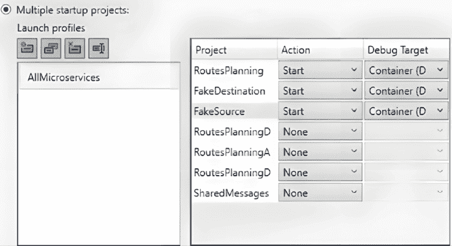

# 使用 Kubernetes 实践微服务组织

本章致力于微服务应用程序的基本构建块：编排器！重点是 **Kubernetes**，但在这里学到的概念对于理解其他编排选项也是基本的。特别是，**Azure Container Apps** 是 Kubernetes 的无服务器替代方案，它本身是用 Kubernetes 实现的，并使用简化的配置选项，但配置的对象和涉及的概念完全相同。Azure Container Apps 在 *第九章* *简化容器和 Kubernetes：Azure Container Apps* *和其他工具* 中进行描述。

所有概念将通过小型示例和汽车共享案例研究应用程序进行说明。在一般描述编排器的角色和功能之后，我们将描述如何在实际中配置和与 Kubernetes 集群交互。本章将使用 **Minikube**，这是一个 Kubernetes 集群的本地模拟器。然而，我们也会解释如何创建和使用 Kubernetes Azure 集群。

我们将首先描述如何在开发过程中使用 **Docker** 测试和调试一些微服务的交互，然后是运行在 Kubernetes 集群中的完整应用程序。在开发阶段测试微服务应用程序的 .NET 特定替代方案是 **.NET Aspire**，它将在 *第十二章* *使用 .NET Aspire 简化微服务* 中进行描述。

更具体地说，本章涵盖：

+   编排器及其配置的介绍

+   Kubernetes 基础

+   与 Kubernetes 交互：Kubectl 和 Minikube

+   在 Kubernetes 中配置您的应用程序

+   在 Kubernetes 上运行您的微服务

+   高级 Kubernetes 配置

# 技术要求

本章需要：

1.  至少 Visual Studio 2022 的免费 *社区版*。

1.  一个接受 TCP/IP 请求和用户/密码认证的 SQL 实例，以及 Windows 的 **Docker Desktop**，其安装已在 *第七章* *实践中的微服务* 的 *技术要求* 部分中解释。

1.  **如果您想与 Azure 上的 Kubernetes 集群交互，则需要 Azure CLI。以下页面包含 32 位和 64 位 Windows 安装程序的链接**：[`learn.microsoft.com/bs-latn-ba/cli/azure/install-azure-cli-windows?tabs=azure-cli`](https://learn.microsoft.com/bs-latn-ba/cli/azure/install-azure-cli-windows?tabs=azure-cli)。

1.  **Minikube**：安装 Minikube 的最简单方法是使用您可以在官方安装页面找到的 Windows 安装程序：[`minikube.sigs.k8s.io/docs/start/`](https://minikube.sigs.k8s.io/docs/start/)。在安装过程中，您将收到提示选择要使用的虚拟化工具 – 请指定 Docker。前面的链接还提供了一个将`minicube.exe`添加到 Windows 路径的 PowerShell 命令。

1.  **Kubectl**：首先，通过打开 Windows 控制台并执行此命令来验证它是否已安装：`Kubectl -h`。如果响应是所有 Kubectl 命令的列表，则已安装。否则，安装它的最简单方法是通过**Chocolatey**包安装程序：

    ```cs
    choco install kubernetes-cli 
    ```

1.  如果 Chocolatey 尚未安装，您可以通过以管理员模式启动**PowerShell**并执行官方 Chocolatey 页面上的建议命令来安装它：[`chocolatey.org/install#individual`](https://chocolatey.org/install#individual)。您可以通过以下方式以管理员模式启动 PowerShell：

    1.  在 Windows 搜索框中搜索**PowerShell**。

    1.  右键单击**PowerShell**链接，并选择以管理员身份执行。

您可以在[`github.com/PacktPublishing/Practical-Serverless-and-Microservices-with-Csharp`](https://github.com/PacktPublishing/Practical-Serverless-and-Microservices-with-Csharp)找到本章的示例代码。

# 编排器和它们的配置简介

编排器主要是为了平衡微服务的负载而设计的。因此，有人可能会问，它们对所有应用程序都是必要的吗？我无法说它们是必要的，但肯定的是，放弃它们并不意味着只是手动配置每个微服务的每个副本的位置。我们还应该找到有效的解决方案来动态重新配置副本的数量和位置，以平衡分配在不同服务器上的多个副本之间的负载，以及平衡每个微服务的各个副本之间的流量。

上述简单考虑表明，一个有效的编排器至少应提供以下服务：

1.  接受高级规格并将其转换为在给定集群的不同服务器上实际分配微服务副本。

1.  为同一微服务的所有副本提供一个唯一的虚拟地址，并自动在它们之间分配流量。这样，每个微服务的代码只需引用这个唯一的虚拟地址，而无需关心每个副本的位置。

1.  识别故障副本，终止它们，并用新创建的副本替换它们。

1.  从容器注册表中下载微服务容器镜像。

此外，由于微服务副本是短暂的，可以被销毁并从一个服务器移动到另一个服务器，因此它们不能使用托管它们的服务器的磁盘存储。相反，它们必须使用网络存储。编排器还必须提供简单的方法来分配磁盘存储并在运行微服务的容器内挂载它。一般来说，它们必须提供简单的方法来投影容器内可以投影的所有内容，即：

1.  磁盘存储

1.  环境变量

1.  通信端口

实际上，每个编排器还提供其他服务，但上面列出的七个服务是学习和评估任何编排器的起点。

编排器的行为由来自各种来源的树形设置控制：配置文件、命令参数等。在幕后，所有来源都由一个与编排器 Web API 通信的客户端打包。

所有可能的编排器设置都像 .NET 配置设置一样组织在树形数据结构中。因此，类似于 .NET 设置，它们可以以 JSON 格式或其他等效格式提供。实际上，所有编排器都接受 JSON 或另一种称为 `.yaml` 的等效格式的设置。一些编排器接受这两种格式；其他可能只接受其中之一。`.yaml` 格式将在下一小节中描述。

## .yaml 文件

与 JSON 文件一样，`.yaml` 文件可以用来以可读的方式描述嵌套对象和集合，但它们使用不同的语法。您有对象和列表，但对象属性不被 `{}` 包围，列表也不被 `[]` 包围。相反，通过简单地使用空格缩进其内容来声明嵌套对象。空格的数量可以自由选择，但一旦选择，就必须始终一致地使用。

列表项可以通过在它们前面加上破折号 (-) 来与对象属性区分开来。下面是一个涉及嵌套对象和集合的示例：

```cs
Name: John
Surname: Smith
Spouse:
Name: Mary
Surname: Smith
Addresses:
- Type: home
Country: England # I am a comment
Town: London
Street: My home street
- Type: office
Country: England
Town: London
Street: My home street 
```

在每一行中，所有跟随 `#` 字符的字符都被认为是注释。

之前的 `Person` 对象有一个嵌套的 `Spouse` 对象和一个嵌套的地址集合。在 JSON 中的相同示例将是：

```cs
{
Name: John
Surname: Smith
Spouse:
{
  Name: Mary
  Surname: Smith
}
Addresses:
[
{
  Type: home
  Country: England
  Town: London
  Street: My home street
 },
{
  Type: office
  Country: England
  Town: London
  Street: My home street
 }
]
} 
```

如您所见，`.yaml` 语法更易读，因为它避免了括号的冗余。

`.yaml` 文件可以包含多个部分，每个部分定义不同的对象，它们通过包含 `---` 字符串的行进行分隔。注释由 # 符号开头，每个注释行都必须重复该符号。

由于空格/制表符有助于对象语义，YAML 对空格/制表符敏感，因此必须注意添加正确数量的空格。

小集合或小对象也可以使用通常的 `[]` 和 `{}` 语法内联指定，即在属性值的同一行的冒号之后。

在了解了编排器和`.yaml`文件的基础知识后，我们就可以学习最广泛使用的编排器：**Kubernetes**。目前，它也是最完整的。因此，一旦你了解了它，学习其他编排器应该非常容易。

# Kubernetes 基础知识

Kubernetes 编排器是分布式软件，必须在网络的每个虚拟服务器上安装。大多数 Kubernetes 软件仅安装在称为**主节点**的一些机器上，而所有其他机器仅运行称为**Kubelet**的接口软件，该软件与主节点上的软件连接，并在本地执行由主节点决定的任务。Kubernetes 集群中的所有机器都称为**节点**。

实际上，所有节点还必须运行容器运行时，以便能够运行容器。正如我们稍后将会看到的，所有节点还运行处理虚拟地址的软件。

Kubernetes 配置单元是具有属性、子部分和其他对象引用的抽象对象。它们被称为**Kubernetes 资源**。我们有描述单个微服务副本的资源，以及其他描述一组副本的资源。资源描述通信设置、磁盘存储、用户、角色以及各种安全约束。

集群节点以及它们所承载的所有资源都由主节点管理，主节点通过 API 服务器与人类集群管理员进行通信，如下所示：


图 8.1：Kubernetes 集群

Kubectl 是通常用于向 API 服务器发送命令和配置数据的客户端。调度器根据管理员的约束将资源分配给节点，而控制器管理器将多个守护进程分组，这些守护进程监控集群的实际状态，并尝试将其移动到通过 API 服务器声明的期望状态。有几个控制器用于 Kubernetes 资源，从微服务副本到通信设施。实际上，每个资源在应用程序运行期间都有一些需要保持的目标目标，控制器会验证这些目标是否真正实现，可能触发纠正操作，例如将运行速度过慢的一些 Pod 移动到更少拥挤的节点上。

部署单元，即可以部署在服务器上、启动、终止和/或移动到另一个服务器的单元，不是一个单独的容器，而是一组称为**Pod**的容器。

Pod 是一组被限制在同一个服务器上一起运行的容器。

Pod 的概念是基本的，因为它能够实现非常有用且强大的协作模式。例如，我们可能将另一个容器附加到我们的主容器上，该容器的唯一目的是读取主容器创建的日志文件并将它们发送到集中的日志服务。

**侧边栏**模式由增强主容器并在同一 Pod 上部署的次要容器组成，其唯一目的是为主容器提供一些服务。

通常，当我们需要容器通过它们的节点文件系统进行通信，或者需要每个容器副本与特定副本的其他容器相关联时，我们会将多个容器放在一起同一个 Pod 中。

在 Kubernetes 中，**Pod**之间的通信由称为**服务**的资源处理，这些服务由 Kubernetes 基础设施分配虚拟地址，并将它们的通信转发到满足某些约束的一组 Pod。简而言之，服务是 Kubernetes 为 Pod 集合分配固定虚拟地址的方式。

所有 Kubernetes 资源都可以分配名为**标签**的键值对，这些标签用于通过模式匹配机制引用它们。因此，例如，所有从同一**服务**接收流量的**Pod**都可以通过指定它们必须在**服务**定义中具有的标签来选择。

Kubernetes 集群可以是本地部署的，也就是说，Kubernetes 可以安装在任何私有网络上。但更常见的是，它们作为云服务提供。例如，Azure 提供**Azure Kubernetes Service (AKS)**。

在本书的剩余部分，我们将使用运行在您的开发机器上的**Minikube** Kubernetes 模拟器，因为实际的 AKS 服务可能会迅速耗尽您的所有 Azure 免费额度。然而，我们示例中的所有操作都可以在实际集群上复制，并且当存在差异时，我们还将描述如何在 AKS 上执行操作。

让我们从与 Kubernetes 集群交互开始。

# 与 Kubernetes 交互：kubectl，Minikube，和 AKS

在使用 Kubectl 客户端与 Kubernetes 集群交互之前，我们必须配置 Kubectl 并向其提供集群 URL 和必要的凭据。

安装完成后，kubectl 将为每个计算机用户创建不同的 JSON 配置文件，其中将包含所有 Kubernetes 集群及其用户的配置信息。kubectl 有命令用于插入新的 Kubernetes 集群配置，以及将集群配置设置为当前配置。

由 Kubernetes 集群 API URL 和用户凭据组成的每一对称为**上下文**。上下文、凭据和集群连接可以使用各种`kubectl config`子命令定义。以下是最有用的几个：

1.  查看整体配置文件：

    ```cs
    kubectl config view 
    ```

1.  添加新的 Kubernetes 集群：

    ```cs
    kubectl config set-cluster my-cluster --server=https://<your cluster API server URL> 
    ```

1.  用户凭据基于客户端证书。可以通过创建证书请求并将其提交到 Kubernetes 集群来获得有效的证书，Kubernetes 集群将创建一个批准的证书。详细步骤将在*第十章**，无服务器和微服务应用程序的安全性和可观察性*中展示。一旦获得批准的证书，就可以使用以下方式创建用户：

    ```cs
    Kubectl config set-credentials newusername --client-key= newusername.key --client-certificate=poweruser.crt --embed-certs=true 
    ```

其中 `newusername.key` 是你用于创建证书请求的私钥的完整路径，而 `newusername.crt` 是已批准的证书文件的完整路径。

1.  一旦你有了服务器和用户，你可以使用以下命令为该用户到该服务器的连接创建一个上下文：

    ```cs
    kubectl config set-context newcontext --cluster= my-cluster --user= newusername 
    ```

1.  一旦所有需要的上下文都已被正确定义，你可以使用以下命令切换到指定的上下文：

    ```cs
    kubectl config use-context newcontext 
    ```

1.  设置了新的当前上下文后，所有 Kubectl 命令都将使用在该上下文中定义的集群和用户。

如果你已经是集群管理员，你的用户已经在系统中存在，因此你不需要创建它。然而，你需要获取管理员用户凭据并将它们添加到配置文件中。每个云服务都有一个登录过程来完成这项工作。例如，在 AKS 的情况下，过程如下：

1.  使用 Azure CLI 登录到 Azure：

    ```cs
    az login 
    ```

1.  默认浏览器应该会打开，并提示你输入你的 Azure 凭据。

1.  如果尚未安装，请安装用于与 AKS 交互的包：

    ```cs
    az aks install-cli 
    ```

1.  请求将你的 AKS 凭据添加到你的 Kubectl 配置文件中：

    ```cs
    az aks get-credentials --resource-group <your AKS resource group name> --name <your AKS name> 
    ```

1.  如果命令成功，新的集群、新的用户和新的上下文将被添加到你的 Kubectl 配置中，并且新的上下文将成为当前上下文。请运行 `kubectl config view` 来查看所有配置文件修改。

Minikube 默认包含一个用户、一个默认集群名称和一个默认上下文，它们都被称为 `minikube`。当你使用 `minikube start` 启动你的 Minikube 集群时，如果尚未定义，上述所有实体都将添加到你的 Kubectl 配置文件中。此外，`minikube` 上下文将自动成为当前上下文，因此启动集群后无需额外操作。当然，你也可以定义其他用户和其他上下文。

可以使用 `minikube stop` 停止 Minikube，使用 `minikube pause` 暂停。停止和暂停都不会删除集群数据和配置。其他有用的命令将在使用 Minikube 的示例中稍后展示。

让我们在 Minikube 上尝试一些 Kubectl 命令（确保 Minikube 已经启动）：

```cs
kubectl get nodes 
```

它应该显示所有虚拟网络 Kubernetes 节点。默认情况下，Minikube 创建一个名为 `minikube` 的单节点集群，因此你应该看到类似以下内容：

```cs
NAME       STATUS            ROLES               AGE   VERSION
minikube   Ready    control-plane,master   35m   v1.22.3 
```

由于我们指定了 Docker 作为虚拟化工具，整个集群都将嵌入到一个 Docker 容器中，你可以通过使用 `docker ps` 列出所有正在运行的容器来验证（记住，所有 Docker 命令都必须在 Linux shell 中执行）。

默认情况下，这个独特的节点包含 2 个 CPU 和 4 GB 的 RAM，但我们可以修改所有这些参数，我们也可以通过传递一些选项给 `minikube start` 来创建具有多个节点的集群：

+   `--nodes <n>`: 指定集群中的节点数量。请考虑节点是同时运行的虚拟机，因此只有具有多个核心和 32-64 GB RAM 的强大工作站才能设置大量节点。默认为 1。

+   `--cpus <n or no-limits>`: 分配给 Kubernetes 的 CPU 数量，或 `no-limits` 以让 Minikube 分配所需的 CPU 数量。默认为 2。

+   `--memory <string>`: 分配给 Kubernetes 的 RAM 量（格式：<number>[<unit>]，其中 unit = b, k, m 或 g）。使用“max”以使用最大内存量。使用“no-limit”以不指定限制。

+   `--profile <string>`: Minikube 虚拟机的名称（默认为 `minikube`）。对于拥有多个 Minikube 虚拟机很有用——例如，一个节点和一个有两个节点的另一个。

+   `--disk-size <string>`: 分配给 Minikube VM 的磁盘大小（格式：<number>[<unit>]，其中 unit = b, k, m 或 g）。默认为“20000mb”。

如果您在创建 Minikube 容器后（使用第一个 `minikube start`）想要更改上述设置之一，您需要使用 `minikube delete` 删除之前的容器，或者使用 `--profile` 选项创建一个具有自定义名称的新 Minikube 容器。

在这个简短的括号之后，让我们回到 Kubectl！让我们输入：

```cs
kubectl get all 
```

它列出了所有 Kubernetes 资源。如果您尚未创建任何资源，则集群应仅包含一个类型为 ClusterIP 的单个资源，如下所示：

```cs
NAME                        TYPE     CLUSTER-IP   EXTERNAL-IP   PORT(S)   AGE
service/kubernetes   ClusterIP   10.96.0.1    <none>        443/TCP   87m 
```

它是 Kubernetes 基础设施的一部分。

通常，`kubectl get <resource type>` 列出给定类型的所有资源。例如，`kubectl get pods` 列出所有 Pod，`kubectl get services` 列出所有服务。

如果我们需要有关特定对象的更详细信息，我们可以使用 `kubectl describe <object type> <object name>`。例如，如果我们需要有关名为 `minikube` 的 Minikube 单节点更多信息，我们可以执行以下命令：

```cs
kubectl describe node minikube 
```

请尝试一下！

在学习如何在本章的其他部分定义 Pod、服务和其他 Kubernetes 资源时，您将看到其他 Kubectl 命令。下一个小节解释了如何创建 Azure Kubernetes 集群，所以如果您目前不打算使用 Azure Kubernetes，请随意跳过。当您需要创建一个时，您可以返回。

## 创建 Azure Kubernetes 集群

要创建 AKS 集群，请执行以下操作：

1.  在 Azure 搜索框中输入 `AKS`。

1.  选择 **Kubernetes 服务**。

1.  然后点击 **创建** 按钮。

1.  选择 **Kubernetes 集群**。

之后，将出现以下形式：


图 8.2：AKS 创建第一个表单

这里，像往常一样，您可以选择您的 Azure 订阅、现有的资源组，或者您可以创建一个新的。让我们继续到 AKS 特定配置：

1.  **集群预设配置**：在这里，您可以从各种预配置设置中选择，这些设置是各种情况的良好起点。在前面的屏幕截图中，我选择了**开发/测试**，这是专门针对开发和学习的，因此它提出了最经济的选项。然而，您也可以选择标准生产或经济生产初始设置。

1.  **Kubernetes 集群名称**：在这里，您必须为您的集群选择一个唯一的名称。

1.  对于所有其他设置，您可以选择建议的默认值。特别是，**区域**字段应建议最适合您的区域。**AKS 定价层**应设置为**免费**，这意味着您只需为构成集群的虚拟机付费。然而，您也可以选择包括支持和超级大集群（最多 5,000 个节点）在内的付费选项。**可用区**字段可在最多 3 个不同的地理区域中启用地理冗余。

如果您选择了**开发/测试**，则集群将包括 2 到 5 个节点，并具有自动扩展功能。也就是说，起始节点数为 2，但如果工作负载增加，它可以自动增加到 5。让我们转到**节点池**选项卡来自定义节点数量和类型：


图 8.3：AKS 节点池配置

如果您选择了**开发/测试**，则应该有一个独特的节点池，它将用于 Kubernetes 主节点和标准节点。请注意，**开发/测试**服务器类型（D4ds-v5）的月费用很高，因此在选择之前，请使用价格计算器（[`azure.microsoft.com/en-us/pricing/details/virtual-machines/linux/#pricing`](https://azure.microsoft.com/en-us/pricing/details/virtual-machines/linux/#pricing)）验证机器的成本。

相反，标准生产选择将创建两个节点池——一个用于主节点，另一个用于标准节点。

无论如何，您都可以更改节点池并编辑每个节点池。在前面屏幕截图中，让我们点击**agentpool**。将打开一个新的表单。在这里，您可以更改机器类型和最大节点数。在没有浪费太多信用的情况下进行实验的好选项是选择 3 个节点和一个`A`系列机器。当您完成这些操作之一后，请点击更新或取消以返回到上一个表单。

最后，您可以通过转到**集成**选项卡将 Azure 容器注册表与集群关联：


图 8.4：将您的集群连接到 ACR

如果您已经在*第三章**的*一些更多 Docker 命令和选项*子节中为实验定义了 Azure 容器注册表，请选择该注册表；否则，您可以在新浏览器窗口中创建一个新的注册表并选择它，或者您可以在稍后时间将注册表与您的集群关联。

当你将注册表关联到你的集群时，你使集群能够访问和下载所有其 Docker 镜像。

当你完成时，选择 **Review + Create**。

一旦你创建了你的集群，你可以使用本节之前解释的登录程序连接到它。

现在你已经学会了如何连接到 Minikube 和 AKS，让我们继续实验 Kubernetes 资源。

# 在 Kubernetes 中配置你的应用程序

如前所述，最简单的 Kubernetes 资源是 Pod。我们不会创建单个 Pod，因为我们总是要为每个微服务创建多个副本，但能够配置 Pod 对于创建更复杂的资源也是基础性的，所以让我们开始创建一个单个 Pod。

Pod 可以通过以下内容的 `.yaml` 文件进行定义：

```cs
apiVersion: v1
kind: Pod
metadata:
name: my-podname
namespace: mypodnamespace
labels:
labenname1: labelvalue1
labelname2: labelvalue2
spec:
restartPolicy: Always #Optional. Possible values: Always (default), OnFailure. Never.
containers:
…
initContainers:
… 
```

所有 Kubernetes 配置文件都以配置的资源定义的 API 名称及其版本开头。对于 Pod 来说，我们只有版本，因为它们是在 **核心 API** 中定义的。然后，`kind` 定义了要配置的资源类型 – 在我们的例子中，是一个 Pod。

与 C# 中的类型一样，Kubernetes 资源也是按命名空间组织的。因此，除了任何资源名称外，我们还必须指定一个命名空间。如果没有指定命名空间，则假定命名空间为 `default`。

注意！虽然 Kubernetes 和 C# 命名空间的目的相同，但它们之间存在重大差异。具体来说，C# 命名空间是分层的，而 Kubernetes 命名空间不是。此外，命名空间并不适用于所有 Kubernetes 资源，因为有一些集群范围内的资源不属于任何特定的命名空间。

如果在资源定义中使用的命名空间尚不存在，则必须使用以下片段进行定义：

```cs
apiVersion: v1
kind: Namespace
metadata:
name: my-namespace 
--- row.
```

名称和命名空间作为 `metadata` 的子属性指定，以及可选的标签。标签是我们可以用来自分类对象的自由名称值对。通常，它们指定有关资源在应用程序中的作用以及它所属的层或模块的信息。

如前所述，在上一节中，其他资源可以使用标签来选择一组资源。

`spec` 属性指定了 Pod 的实际内容，即其容器及其重启策略 (`restartPolicy`)。重启策略指定何时重启 Pod：

+   `restartPolicy: Always`：这是默认值。当所有容器终止或容器以失败状态终止时，Pod 将被重启。

+   `restartPolicy: OnFailure`：当至少有一个容器以失败状态退出时，Pod 将被重启。

+   `restartPolicy: Never`：Pod 从不会被重启。

容器被分为两个列表：`containers` 和 `initContainers`。`containers` 列表中的容器仅在 `initContainers` 列表中的所有容器都 **成功** 后启动，并且 `initContainers` 列表中的每个容器仅在之前的容器 **成功** 后启动。反过来，`initContainers` 列表中的容器在以下两种情况下被认为是 **成功** 的：

1.  如果容器配置的 `restartPolicy` 属性设置为 `Always`，则容器被认为是成功的，如果它已成功启动。此选项对于实现 **sidecar** 容器很有用。这样，我们确保在增强容器的容器启动之前，**sidecars** 已经就绪。请参阅 *Kubernetes 基础知识* 部分开头的 Pod 定义，以了解 **sidecar** 是什么。

1.  如果容器配置没有将 `restartPolicy` 属性设置为 `Always`，则容器被认为是成功的，如果它已成功终止。此选项对于执行一些启动初始化很有用——例如，等待数据库或消息代理就绪。在类似的情况下，容器代码是一个循环，持续尝试与数据库/消息代理建立连接，并在成功后终止。

失败的 `initContainers` 不会导致整个 Pod 重新启动。相反，它会在导致整个 Pod 失败之前进行指数重试几次。因此，它们应该设计为幂等的，因为它们的行为可能会执行多次。

上述两个列表中的每个容器都类似于：

```cs
 - name: <container name>
image: <container image URL>
command: […] # square bracket contains all strings that compose the OS command
resources:
requests:
cpu: 100m
memory: 128Mi
limits:
cpu: 250m
memory: 256Mi
ports:
- containerPort: 80
- containerPort: …
…
env:
-name: env-name1
value: env-value1
…
volumeMounts:
- name: data
mountPath: /mypath/mysubpath….
subPath: /vsubpath #optional. If provided the path of data mounted in mountPath
… 
```

我们在容器注册库中指定容器的名称和其镜像的 URL，这符合任何编排器应提供的最小服务中的第 4 点（参见 *编排器和其配置简介* 部分的开头）。这两个属性是必需的，而所有其他属性都是可选的。当提供 `command` 属性时，它将覆盖 Docker 文件中的 `CMD` 指令。

然后，我们还考虑了任何编排器应提供的最小服务中的第 5、6 和 7 点，即磁盘存储、环境变量和通信端口。更具体地说，我们有：

+   `volumeMount` 指定由 `name` 指定的虚拟存储卷如何映射到容器文件系统中由 `mountPath` 指定的路径。如果提供了可选的 `subPath`，则仅挂载由 `name` 指定的卷的该 `subpath`。虚拟存储卷将在本章后面的部分（在 *永久磁盘空间的动态分配* 子部分中）进行描述，以及其他 `volumeMounts` 属性。

+   `env` 指定所有容器的环境变量，以 `name-value` 对的形式列出。

+   `ports`指定了我们希望在应用程序中使用的容器暴露的所有端口的列表。这些端口可能映射到 Pod 之间实际通信中的其他端口。然而，端口映射是在其他资源中指定的，这些资源被称为`services`，它们提供虚拟 Pod 地址和其他通信相关选项。

最后，`resource`s 部分指定了启动容器所需的最低计算资源（`requests`）以及它可以浪费的最高计算资源（`limits`）。

`requests`属性中的约束用于选择放置 Pod 的虚拟机。相反，`limits`是由操作系统内核强制执行的，如下所示：

+   CPU 限制通过节流来强制执行。也就是说，超过 CPU 限制的容器会被延迟，使它们进入睡眠模式足够长的时间。

+   当内存限制被超过时，会抛出一个异常来强制执行内存限制。反过来，这个异常会导致 Pod 的重启策略被应用，这通常会导致 Pod 重启。

关于度量单位，典型的内存度量单位是`Ti`（千兆字节）、`Gi`（兆字节）、`Mi`（兆字节）和`Ki`（千字节）。而 CPU 时间，则可以以毫核（`mi`）或作为核心数的分数（值后没有单位）来衡量。

让我们尝试一个带有侧边容器 Pod 的例子，这展示了描述的语法的实际用法以及侧边容器如何帮助构建应用级监控。主容器将是一个基于 Alpine Linux 发行版 Docker 镜像的虚构微服务，它只是将日志消息放入与侧边容器共享的目录中的文件。在实际应用中，日志会被组织在几个文件中（例如，每个文件对应一天），旧文件会定期删除。此外，侧边容器会读取这些文件并将它们的内容发送到日志 API。我们的教学侧边容器，相反，只是定期读取文件的最后 10 行，并在其控制台中显示它们。

代码相当简单。首先，我们定义一个命名空间来包围我们的示例：

```cs
apiVersion: v1
kind: Namespace
metadata:
name: basic-examples 
```

然后，在`---`行之后，我们放置实际的 Pod 定义：

```cs
---
apiVersion: v1
kind: Pod
metadata:
name: pod-demo
namespace: basic-examples
labels:
app: myapp
spec:
containers:
- name: myapp
image: alpine:latest
command: ['sh', '-c', 'while true; do echo $(date) >> /opt/logs.txt; sleep 1; done']
    volumeMounts:
- name: data
mountPath: /opt
initContainers:
- name: logshipper
image: alpine:latest
restartPolicy: Always
command: ['sh', '-c', 'tail -F /opt/logs.txt']
    volumeMounts:
- name: data
mountPath: /opt
volumes:
- name: data
emptyDir: {} 
```

两个容器都使用简单的 Alpine Linux 发行版的 Docker 镜像，并将应用程序特定的代码限制在`command`中，这是一个 Linux 脚本。这种技术用于适应现有的镜像或执行非常简单的任务，例如侧边容器经常执行的任务。我们也为主要的容器使用了同样的技术，因为主要的容器什么都不做，具有纯粹的教学目的。

因此，使用之前暴露的语法，侧边容器在`initContainers`列表中定义为`restartPolicy: Always`。

主容器命令执行一个无限循环，它只是在`/opt/logs.txt`文件中写入当前日期和时间，然后休眠一秒钟。

边车容器命令使用 `sh -c` 来执行单个 shell 命令，即带有 `-f` 选项的 `tail` 命令，针对 `/opt/logs.txt` 文件。此命令显示容器控制台中文件的最后 10 行，并在添加新行时更新它们，因此控制台始终包含文件的当前最后 10 行。

两个容器处理的是相同的文件，因为两个容器都在它们的文件系统上的相同 `/opt` 目录中挂载了相同的数据卷：

```cs
volumeMounts:
- name: data
mountPath: /opt 
```

数据卷是在 `volumes` 列表中定义的，它是 `spec` 属性的直接后代，如下所示：

```cs
- name: data
emptyDir: {} 
```

`emptyDir` 定义并分配了一个特定于其定义的 Pod 的卷。这意味着它不能被任何其他 Pod 访问。该卷使用托管 Pod 的节点的磁盘内存实现。这意味着如果 Pod 被删除或移动到不同的节点，该卷将被销毁，其内容将丢失。`EmptyDir` 是提供用于 Pod 计算中某种方式使用的临时磁盘存储的首选方式。它有一个可选的 `sizeLimit` 属性，用于指定 Pod 可以使用的最大磁盘空间。例如，我们可以设置 `sizeLimit: 500Mi` 以指定 500 兆的最大磁盘空间。

由于我们没有指定任何大小限制，`emptyDir` 对象没有属性，因此我们被迫添加空对象值 `{}` 以获得正确的 `.yaml` 语法（我们不能有冒号后跟空格）。

让我们在 Minikube 中创建一个用于实验 `.yaml` 文件的文件夹，并将整个示例代码放在该文件夹中名为 `SimplePOD.yaml` 的文件中。此文件也位于书籍 GitHub 存储库的 `ch08` 文件夹中。

现在，右键单击新创建的文件夹，在该目录中打开一个 Windows 控制台。在通过执行 `kubectl get all` 命令确认 Minikube 已启动后，我们可以使用 `kubectl apply` 命令应用所有定义：

```cs
kubectl apply -f SimplePOD.yaml 
```

现在，如果我们执行 `kubectl get pods` 命令，我们看不到新的 Pod！这是正确的，因为该命令仅列出 `default` 命名空间中定义的资源，而我们的 Pod 已定义在名为 `basic-examples` 的新命名空间中，因此如果我们想操作该命名空间中的资源，我们必须在我们的命令中添加 `-n basic-examples` 选项：

```cs
kubectl get pods -n basic-examples 
```

为了访问我们的边车控制台，我们可以使用 Kubectl 的 `logs` 命令。实际上，所有容器 Pod 的控制台输出都会自动由 Kubernetes 收集，并可以使用此命令进行检查。该命令需要 Pod 名称以及如果不同于 `default` 的命名空间。此外，如果 Pod 包含多个容器，还需要我们想要检查的容器的名称，这可以通过 `-c` 选项提供。总结起来，我们的命令是：

```cs
kubectl logs -n basic-examples  pod-demo -c logshipper 
```

上述命令将仅显示当前控制台内容，然后退出。如果我们希望内容自动更新，以匹配控制台内容的变化，我们必须添加 `-f` 选项：

```cs
kubectl logs -f -n basic-examples  pod-demo -c logshipper 
```

这样，我们的窗口会冻结在命令上并自动更新。可以使用 `ctrl-c` 退出命令。

我们还可以使用 Kubectl 的 `exec` 命令进入 `logshipper` 容器的控制台。这需要指定命名空间、Pod 和容器名称，并在 `–` 字符之后，指定在容器文件系统中要执行的 Linux 命令。如果您需要一个控制台，Linux 命令是 `sh`，如果我们想与该控制台交互，我们还需要指定 `-it` 选项，代表“交互式 tty”。总结一下，我们有：

```cs
kubectl exec -it -n basic-examples pod-demo -c logshipper -- sh 
```

进入容器后，我们可以使用 `cd /opt` 命令进入 `/opt` 目录，并使用 `ls` 命令验证 `logs.txt` 文件是否存在。

完成后，您可以通过发出 `exit` 命令退出容器控制台。

`kubectl exec` 命令对于调试应用程序非常有用，尤其是在它们已经处于生产或预发布阶段时。

当您完成所有由 `.yaml` 文件创建的资源后，可以使用 `kubectl deleted <file name>.yaml` 删除所有这些资源。因此，在我们的例子中，我们可以销毁所有示例实体：

```cs
kubectl delete -f SimplePOD.yaml 
```

`kubectl apply` 也可以用来修改之前创建的资源。只需编辑创建资源时使用的 `.yaml` 文件，然后重复对该文件执行 `apply` 命令即可。

我们已经看到了如何使用 `emptyDir` 创建临时磁盘空间。现在让我们看看分配永久网络磁盘空间并在各种 Pods 之间共享的典型方法。

## 永久磁盘空间的动态分配

类似于 `emptyDir` 的卷定义称为树内定义，因为创建卷的指令直接插入到 Pod 定义中。无法将树内定义与其他 Pod 定义共享，因此在不同 Pods 之间共享树内卷并不容易。

实际上，通过适当配置提供磁盘空间的设备，也可以使用树内定义来实现磁盘空间共享。例如，假设我们正在使用连接到我们的 Kubernetes 集群的 NFS 服务器来提供网络磁盘空间。我们可以使用以下指令将 Pod 连接到它：

```cs
volumes
- nfs:
server: my-nfs-server.example.com
path: /my-nfs-volume
readOnly: true # optional. If provided the volume is accessible as read-only 
```

其中 `server` 是服务器名称或 IP 地址，path 是要共享的目录。为了在 Pods 之间共享相同的磁盘空间，它们只需指定相同的服务器和路径即可。

然而，这种技术有两个缺点：

+   共享并未明确声明，但它是间接的，因此它损害了代码的可维护性和可读性。

+   Kubernetes 并不知道使用共享的 Pods，因此无法指示在不再需要时释放共享。

因此，对于不共享 Pod 的临时磁盘空间，树内定义更为合适。幸运的是，问题不在于 NFS 协议本身，而只是树内语法。因此，Kubernetes 还提供了一个基于两个独立对象的树外语法：**持久卷声明**（**PVC**），它代表磁盘空间需求，以及**持久卷**（**PV**），它代表实际的磁盘空间。

整个技术工作方式如下：

1.  我们在 PVC 中定义磁盘空间规范。

1.  所有需要共享相同磁盘空间的 Pod 都引用相同的 PVC。

1.  Kubernetes，不知何故，试图为每个 PVC 提供一个兼容的 PV，然后将其挂载在所有共享该 PVC 的 Pod 上。

当所有共享相同 PV 的 Pod 都被销毁时，我们可以指示 Kubernetes 保留分配的磁盘空间或删除它。

PVC 获取所需磁盘并返回 PV 的方式取决于为 PVC 提供服务的驱动程序。驱动程序必须安装在 Kubernetes 集群中，但所有云提供商都提供预定义的驱动程序。

驱动程序名称和相关设置组织在称为**存储类**的资源中（`kind: StorageClass`）。与预定义的驱动程序一起，所有云提供商也提供基于这些驱动程序的预定义存储类。然而，您可以根据相同的驱动程序定义新的存储类，但具有不同的设置。

您还可以在本地 Kubernetes 集群上安装基于这些驱动程序的驱动程序和存储类（有许多开源驱动程序）。Minikube 也有安装各种存储驱动程序和相关存储类的插件。

仅将 PVC 与用户手动预定义的 PV 匹配的驱动程序称为静态。而动态创建 PV 资源，从可用的磁盘空间池中获取所需磁盘空间的驱动程序称为动态。

在本节中，我们将仅关注动态存储分配，因为它在实际微服务应用中最为相关。您可以在官方 Kubernetes 文档中找到有关存储类及其定义的更多详细信息：[`kubernetes.io/docs/concepts/storage/storage-classes/`](https://kubernetes.io/docs/concepts/storage/storage-classes/)。

创建 PVC 的第一步是验证可用的存储类：

```cs
Kubectl get storageclasses 
```

然后，可以使用`kubectl describe`获取特定类的详细信息。在 Minikube 中，我们得到：

```cs
NAME               PROVISIONER            RECLAIMPOLICY   VOLUMEBINDINGMODE ...  
standard (default) k8s.io/minikube-hostpath   Delete          Immediate      ... 
```

类名后面的“默认”告诉我们`standard`类是默认存储类，即在未指定存储类时使用的类。

在使用动态预配时，PVC 只需指定：

+   所需的存储

+   存储类

+   访问模式：`ReadWriteOnce`（只有单个节点可以在存储上读写），`ReadOnlyMany`（多个节点可以读取），`ReadWriteMany`（多个节点可以读写），`ReadWriteOncePod`（只有单个 Pod 可以在存储上读写）

实际上，获取 PV 所需的所有信息都包含在存储类中。由于 PVC 描述的是 Pod 需求而不是特定的 PV，因此预配的存储将提供至少所需的访问模式，但也可能支持更多的访问。

如果存储类使用的驱动程序不支持所需的模式，操作将失败。因此，在使用存储类之前，您必须验证其驱动程序支持的操作。`ReadOnlyMany` 与动态预配不搭配，因为分配的存储总是干净的，所以没有东西可以读取。

实际上，支持动态预配的驱动程序总是支持 `ReadWriteOnce`，其中一些也支持 `ReadWriteMany`。因此，如果您需要一个在多个 Pod 之间共享的卷，您必须验证所选驱动程序是否支持 `ReadWriteMany`；否则，所有共享该卷的 Pod 都将分配在同一个节点上，以确保它们都能访问所声明的 `ReadWriteOnce` 存储空间。

PVC 的定义如下：

```cs
apiVersion: v1
kind: PersistentVolumeClaim
metadata:
name: myclaim
namespace: a-namespace
spec:
accessModes:
- ReadWriteOnce # ReadWriteOnce, ReadOnlyMany, ReadWriteMany, ReadWriteOncePod
resources:
requests:
storage: 8Gi
storageClassName: <my storage classname> 
```

需要的存储使用与容器所需的 RAM 相同的语法指定。如果没有提供存储类，Kubernetes 将使用标记为默认存储类的存储类（如果有的话）。

一旦定义了 PVC，Pod 的卷属性需要引用它：

```cs
volumes:
- name: myvolume
   persistentVolumeClaim:
     claimName: myclaim 
```

然而，PVC 和 Pod 必须属于同一个命名空间；否则，操作将失败。

现在我们有了所有构建块，我们可以继续构建更复杂的资源，这些资源建立在这些块之上。单个 Pod 没有用，因为我们总是需要每个微服务的多个副本，但幸运的是，Kubernetes 已经内置了处理不可区分副本和索引副本的资源，后者对于实现分片策略非常有用。

## ReplicaSets、Deployments 及其服务

**ReplicaSets** 是一种资源，它会自动创建 Pod 的 N 个副本。然而，它们很少被使用，因为使用 **Deployments** 更方便，Deployments 是建立在 ReplicaSets 之上的，并且可以自动处理副本数量或其他参数修改时的平滑过渡。

Deployment 的定义如下：

```cs
apiVersion: apps/v1
kind: Deployment
metadata:
name: my-deployment-name
namespace: my-namespace
labels:
app: my-app
spec:
replicas: 3
selector:
matchLabels:
my-pod-label-name: my-pod-label-value
...
template: 
```

Deployments 不包含在 API 核心中，因此必须指定它们的 API 名称（`apps`）。元数据部分与 Pod 的元数据部分相同。`spec` 部分包含所需的副本数量（`replicas`）和一个选择器，该选择器指定了 Pod 属于部署的条件：它必须具有所有指定的标签值。

`template` 指定了为 Deployment 创建 Pod 的方式。如果集群已经包含一些满足选择器条件的 Pod，那么模板将用于创建达到 `replicas` 目标数量所需的 Pod。

模板是一个完整的 Pod 定义，其语法与我们用于指定单个 Pod 的语法相同。唯一的区别是：

+   Pod 定义没有先前的任何 API 规范

+   Pod 元数据部分不包含 Pod 名称，因为我们提供的是一个用于创建`replica` Pod 的模板。Pod 名称由 Deployment 自动创建。

+   Pod 元数据部分不包含 Pod 命名空间，因为 Pod 继承与 Deployment 相同的命名空间。

不言而喻，Pod 模板必须指定与`selector`条件匹配的标签。下面是一个完整的示例：

```cs
apiVersion: apps/v1
kind: Deployment
metadata:
name: nginx
namespace: basic-examples
labels:
app: webservers
spec:
selector:
matchLabels:
app: webservers
replicas: 2
template:
metadata:
labels:
app: webservers
spec:
containers:
- image: nginx
name: nginx
ports:
- containerPort: 80
name: web
volumeMounts:
- mountPath: /usr/share/nginx/html
name: website
volumes:
- name: website
persistentVolumeClaim:
claimName: website 
```

Deployment 创建了两个**nginx**网络服务器的副本，它们共享一个共同的磁盘空间。更具体地说，它们共享映射到共同 PVC 的`/usr/share/nginx/html`路径。`/usr/share/nginx/html`是**nginx**查找静态 Web 内容的文件夹，因此如果我们将其中的`index.html`文件放置在那里，它应该可以通过两个 Web 服务器访问。

上面的代码实现了两个负载均衡的 Web 服务器，它们提供相同的内容。让我们将 Deployment 放在一个`WebServers.yaml`文件中。我们将在添加了缺失的代码（即 PVC 定义和将流量从 Kubernetes 集群外部转发并负载均衡到副本的服务）之后不久使用它。

Deployment 可以连接到三种类型的服务：

+   **ClusterIP**，它将网络内部的流量转发到 Deployment

+   **LoadBalancer**，它将集群外部的流量转发到 Deployment

+   **NodePort**，对于应用程序开发者不是基本的，因此将不会进行描述

**ClusterIP**的定义是：

```cs
apiVersion: v1
kind: Service
metadata:
name: my-service
namespace: my-namespace
spec:
selector:
my-selector-label: my-selector-value
...
ports:
- name: http
protocol: TCP
port: 80
targetPort: 80
- name: https
protocol: TCP
port: 443
targetPort: 443 
```

`selector`定义了将接收服务流量的 Pod。Pod 必须属于与服务相同的命名空间。`ports`列表定义了从外部端口（`port`）到 Pod 容器内部端口（`targetPort`）的映射。每个映射还可以指定一个可选的名称和一个可选的协议。如果没有指定协议，所有协议都将转发到 Pod。

被分配了`<service name>.<namespace>.svc.cluster.local`域名的一个**ClusterIP**服务，但它也可以通过`<service name>.<namespace>`（如果命名空间是`default`，则可以简单地使用`<service name>`）访问。

总结来说，所有发送到`<service name>.<namespace>.svc.cluster.local`或`<service name>.<namespace>`的流量都将转发到由`selector`选择的 Pod。

**LoadBalance**服务与它完全类似，唯一的区别是下面`spec`的两个子属性：

```cs
spec:
type: LoadBalancer
loadBalancerIP: <yourpublic ip>
selector:
… 
```

如果你指定了一个 IP 地址，那么这个 IP 地址必须是某种方式购买的静态 IP 地址；否则，在云 Kubernetes 集群的情况下，你可以省略`loadBalancerIP`属性，服务将由基础设施自动分配一个动态 IP 地址。在 AKS 中，你还必须在注释中指定 IP 地址已分配的资源组：

```cs
apiVersion: v1
kind: Service
metadata:
annotations:
service.beta.kubernetes.io/azure-load-balancer-resource-group: <IP resource group name> 
```

此外，您必须将“网络贡献者”角色分配给您定义静态 IP 地址的资源组，并将其分配给与 AKS 集群关联的管理身份（默认情况下，任何新创建的 AKS 集群都会自动分配一个管理身份）。有关执行此操作的详细步骤，请参阅此处：[`learn.microsoft.com/en-us/azure/aks/static-ip`](https://learn.microsoft.com/en-us/azure/aks/static-ip)。

您还可以使用标签指定注释：

```cs
service.beta.kubernetes.io/azure-dns-label-name: <label > 
```

在这种情况下，Azure 将自动将 `<label>.<location>.cloudapp.azure.com` 域名与 LoadBalancer 关联。

如果您想在一个自定义域名上发布服务，您需要购买一个域名，然后您需要创建一个带有适当 DNS 记录的 Azure DNS 区域。然而，在这种情况下，使用 Ingress 而不是简单的 LoadBalancer 会更好（见 *Ingresses* 子节）。

`loadBalancerIP` 属性已被弃用，将在未来的 Kubernetes 版本中删除。它应该由平台相关的注释替换。在 AKS 的情况下，注释是：`service.beta.kubernetes.io/azure-pip-name: <your static IP address>`

让我们回到我们的 nginx 示例，并创建一个 LoadBalancer 服务来在互联网上公开我们的负载均衡的 Web 服务器：

```cs
apiVersion: v1
kind: Service
metadata:
name: webservers-service
namespace: basic-examples
spec:
type: LoadBalancer
selector:
app: webservers
ports:
- name: http
protocol: TCP
port: 80
targetPort: 80 
```

我们没有指定 IP 地址，因为我们将在 Minikube 中测试此示例，Minikube 是一个模拟器，它使用特定的程序来公开 LoadBalancer 服务。

让我们将服务定义放置在名为 `WebServersService.yaml` 的文件中。

在 `WebServersPVC.yaml` 文件中，我们也要放置缺失的 PVC：

```cs
apiVersion: v1
kind: PersistentVolumeClaim
metadata:
name: website
namespace: basic-examples
spec:
accessModes:
- ReadWriteMany
resources:
requests:
storage: 1Gi 
```

我们没有指定存储类，因为我们将使用默认的存储类。

让我们再创建一个 `BasicExamples.yaml` 文件来定义 `basic-examples` 命名空间：

```cs
apiVersion: v1
kind: Namespace
metadata:
name: basic-examples 
```

现在，让我们复制书籍 GitHub 存储库中 `ch08` 文件夹中包含的 `index.html` 文件，或者任何其他在同一文件夹中包含所有上述 `.yaml` 文件的独立 HTML 页面，没有对其他图像/内容的引用。我们将使用该页面作为实验内容，由 Web 服务器显示。

让我们开始我们的实验：

1.  在包含所有 `.yaml` 文件的文件夹上打开控制台（右键单击文件夹并选择控制台选项）。

1.  确保 Minikube 正在运行，如果不是，请使用 `minikube start` 启动它。

1.  按正确的顺序部署所有文件，即确保文件中引用的所有资源都已创建。

    ```cs
    kubectl apply -f BasicExamples.yaml
    kubectl apply -f WebServersPVC.yaml
    kubectl apply -f WebServers.yaml
    kubectl apply -f WebServersService.yaml 
    ```

1.  现在，我们需要复制两个创建的 Pod 中的任意一个的 `/usr/share/nginx/html` 文件夹中的 `index.html` 文件。由于它们共享相同的磁盘存储，它也将被另一个 Pod 所见。为此操作，我们需要一个 Pod 名称。让我们用以下命令获取它：

    ```cs
    kubectl get pods -n Basic-Examples 
    ```

1.  可以使用 `kubectl cp` 命令在 Kubernetes Pod 中复制文件：

    ```cs
    kubectl cp  <source path> <namesapace>/<pod name>:<destination folder> 
    ```

1.  在我们的情况下，`cp` 命令变为：

    ```cs
    kubectl cp Index.html basic-examples/<pod name>:/usr/share/nginx/html 
    ```

1.  在 Minikube 中，您可以通过创建隧道来通过 LoadBalancer 服务访问集群。请执行以下操作：

    1.  打开一个新的控制台窗口

    1.  在这个新窗口中，执行`minikube tunnel`命令

    1.  窗口会在命令执行时冻结。只要窗口保持打开状态，`LoadBalancer`就可通过`localhost`访问。无论如何，你可以在上一个窗口中通过执行`kubectl get services -n Basic-Examples`来验证分配给`LoadBalancer`的外部 IP。

1.  打开你喜欢的浏览器并访问`http://localhost`。你应该能看到`index.html`页面的内容。

一旦你完成实验，让我们按相反的顺序（与创建它们的顺序相反）销毁所有资源：

```cs
kubectl delete -f WebServersService.yaml
kubectl delete -f WebServers.yaml
kubectl delete -f WebServersPVC.yaml 
```

你可以保留命名空间定义，因为我们将在下一个示例中使用它。

所有的 Deployment 副本都是相同的；它们没有身份，因此无法从你的代码中引用特定的副本。例如，如果一个副本因为节点崩溃而宕机，系统可能会出现轻微的性能问题，但由于副本只是提高性能的一种方式，所以没有副本是不可或缺的。

值得注意的是，一旦 Kubernetes 检测到节点故障，它就会在其他地方重新创建该节点上托管的所有 Pod。然而，由于故障可能不会立即被检测到，此操作可能需要一些时间。在此期间，如果由故障节点托管的 Pod 是不可或缺的，应用程序可能会出现故障，这就是为什么在可能的情况下应优先选择 Deployments。

不幸的是，在某些情况下，相同的副本无法达到所需的并行度，但我们需要非相同的分片副本。如果你不记得什么是分片以及为什么在某些情况下它是必要的，请参阅*第七章**，实践中的微服务*中的*确保消息按正确顺序处理*部分。**StatefulSets**提供了进行分片所需的复制类型。

## 有状态集和 Headless 服务

一个`StatefulSet`的所有副本都被分配了从 0 到 N-1 的索引，其中 N 是副本的数量。它们的 Pod 名称也是可预测的，因为它们被构建为`<StatefulSet name>-<replica index>`。它们的域名也包含 Pod 名称，这样每个 Pod 都有自己的域名：`<POD name>.<service name>.<namespace>.svc.cluster.local`，或者简单地`<POD name>.<service name>.<namespace>`。

当创建一个有状态集（StatefulSet）时，所有副本会按照递增的索引顺序创建；而当它被销毁时，所有副本会按照递减的索引顺序销毁。当副本数量发生变化时，情况也是如此。

每个`StatefulSet`都必须有一个关联的服务，该服务必须在`StatefulSet`的`serviceName`属性中声明。`StatefulSet`的定义几乎与`Deployment`相同；唯一的区别是`kind`是`StatefulSet`，并且在`spec`部分下面立即有`serviceName:”<service name>“`属性。

与 `StatefulSet` 关联的服务必须是一个所谓的 `Headless` 服务，它被定义为 ClusterIP 服务，但在 `spec` 下具有 `ClusterIP: None` 属性：

```cs
...
spec:
clusterIP: None
selector:
... 
```

值得指出的是，通常每个副本都有自己的私有存储，因此通常 StatefulSet 定义不引用 PVC，而是使用 PVC 模板，将不同的 PVC 绑定到每个创建的 Pod：

```cs
volumeClaimTemplates:
- metadata
...
spec:
... 
```

其中 `metadata` 和 `spec` 属性与 PVC 资源中的属性相同。

下面是一个带有其关联的无头服务的 StatefulSet 的示例。Pod 名称通过环境变量传递给每个容器，这样代码就能知道其索引及其在分片算法中可能的角色：

```cs
apiVersion: v1
kind: Service
metadata:
name: podname
namespace: basic-examples
labels:
app: podname
spec:
ports:
- port: 80
clusterIP: None
selector:
app: podname
---
apiVersion: apps/v1
kind: StatefulSet
metadata:
name: podname
namespace: basic-examples
spec:
selector:
matchLabels:
app: podname
serviceName: "podname"
replicas: 3
template:
metadata:
labels:
app: podname
spec:
containers:
- name: test
image: alpine:latest
command: ['sh', '-c', 'while true; do echo $(MY_POD_NAME); sleep 3; done']
        ports:
- containerPort: 80
env:
- name: MY_POD_NAME
valueFrom:
fieldRef:
fieldPath: metadata.name
volumeClaimTemplates:
- metadata:
name: volumetest
spec:
accessModes: [ "ReadWriteOnce" ]
      resources:
requests:
storage: 1Gi 
```

每个 Pod 只包含 Alpine Linux 发行版，实际的代码在 `command` 中提供，它只是无限循环地打印 `MY_POD_NAME` 环境变量。反过来，`MY_POD_NAME` 环境变量设置为：

```cs
- name: MY_POD_NAME
valueFrom:
fieldRef:
fieldPath: metadata.name 
```

此代码从 Pod 的 `metadata.name` 字段获取值。实际上，如果我们没有在 Pod 模板元数据部分指定名称，StatefulSet 会自动创建一个名称并将其添加到 Pod 资源内部表示中。使 Pod 字段可用于环境变量定义的 Kubernetes 组件称为 **向下 API**。

上面的 StatefulSet 没有做任何有用的事情，只是展示了如何将 Pod 名称传递给容器。

将上述代码放入 `StateFulSetExample.yaml` 文件并应用它！

如果你发出 `kubectl get pods -n basic-examples` 命令，你可以验证所有 3 个副本都是根据 StatefulSet 名称和你的索引创建的正确的名称。现在让我们通过显示其日志来验证 `podname-1` 是否正确接收到了其名称：

```cs
kubectl logs podname-1 -n basic-examples 
```

你应该会看到几行带有正确 Pod 名称的行。太棒了！

现在让我们验证我们的代码创建了 3 个不同的 PVC：

```cs
kubectl get persistentvolume -n basic-examples 
```

你应该会看到三个不同的声明。

当你完成对示例的实验后，你可以使用 `kubectl delete -f StateFulSetExample.yaml` 删除所有内容。不幸的是，删除所有内容并不会删除由模板创建的 PVC，正如你现在可以验证的那样。删除它们的最简单方法是删除 `basic-examples` 命名空间：

```cs
kubectl delete namespace basic-exampleswhole 
```

然后，如果你想，你可以通过以下方式重新创建它：

```cs
kubectl create namespace basic-examples 
```

Statefulsets 用于在 Kubernetes 中部署 RabbitMQ 集群和数据库集群。如果需要主节点，则具有特定索引（通常是 0）的节点会选举自己为主节点。每个副本使用自己的磁盘存储，以便可以强制执行数据分片和数据复制策略。你可能不需要自己这样做，因为最著名的消息代理和数据库集群的集群部署代码已经在网上可用。

在学习了如何创建和维护微服务的多个副本之后，我们必须学习如何设置和更新副本数量，即如何扩展我们的微服务。

## 扩展和自动扩展

扩展对于应用程序性能调整是基本的。我们必须区分扩展每个微服务的副本数量和扩展整个 Kubernetes 集群的节点数量。

节点数量通常根据平均 CPU 繁忙百分比进行调整。例如，当初始应用程序流量较低时，可能从 50%的百分比开始。然后，随着应用程序流量的增加，我们保持相同的节点数量，直到我们能够保持良好的响应时间，可能调整微服务副本的数量。假设当 CPU 繁忙百分比为 80%时性能开始下降。然后，我们可以将目标设置为 75%的 CPU 繁忙时间。

仅使用云集群即可实现自动集群扩展，每个云服务提供商都提供某种形式的自动扩展。

关于 AKS，在*创建 Azure Kubernetes 集群*部分，我们看到了我们可以指定最小和最大节点数，并且 AKS 试图为我们优化性能。你还可以微调 AKS 如何决定节点数量。更多关于这种定制的详细信息可以在*进一步阅读*部分的参考中找到。

此外，还有与各种云提供商集成的自动自动扩展器([`kubernetes.io/docs/concepts/cluster-administration/cluster-autoscaling/`](https://kubernetes.io/docs/concepts/cluster-administration/cluster-autoscaling/))。默认情况下，自动扩展器在 Kubernetes 无法满足 Pod 所需资源时增加节点数量，这是所有 Pod 容器`resource->request`字段的总和。

相反，扩展微服务副本是一个更困难的任务。你可以通过测量平均副本响应时间然后计算：

```cs
<number of replicas> = <target throughput (requests per second)><average response time in seconds> 
```

目标吞吐量应该是一个通过简单计算得出的粗略估计。对于前端微服务，它只是你期望应用程序为每个 API 调用接收的请求数量。对于 Worker 服务，它可能取决于预期在几个前端服务上的请求数量，但没有标准的方式来计算它。相反，你需要推理应用程序的工作方式以及指向该 Worker 微服务的请求是如何创建的。

然后，你应该根据以下程序监控系统性能，寻找瓶颈：

1.  寻找瓶颈微服务

1.  将其副本数量增加到它不再成为瓶颈

1.  重复第 1 点，直到没有明显的瓶颈

1.  然后优化集群节点数量以实现良好的性能

1.  存储所有 Deployments 和 StatefulSets 的平均 CPU 利用率内存占用，以及整个应用程序接收到的平均请求数量。你可以使用这些数据来设置自动扩展器。

虽然 StatefulSets 难以自动扩展，但 Deployments 可以自动扩展而不会引起问题。因此，您可以使用 Kubernetes Pod 自动扩展器自动扩展它们。

Pod 自动扩展目标可以是每个 Pod 的平均资源消耗或与流量相关的度量指标。在第一种情况下，自动扩展器选择使资源消耗最接近指定目标的副本数量。在第二种情况下，副本数量设置为流量度量指标的实际值除以度量指标的目标值，即流量目标被解释为每个 Deployment Pod 持续的目标流量。

如果指定了多个目标类型，则取每个目标类型提出的最大副本数量。

自动扩展器可以定义如下：

```cs
apiVersion: autoscaling/v2
kind: HorizontalPodAutoscaler
metadata:
  name: myautoscalername
  namespace: mynamespace
spec:
  scaleTargetRef:
    apiVersion: apps/v1
    kind: Deployment
name: mydeploymentname
  minReplicas: 1
maxReplicas: 10
metrics:
  - type: <resource or pod or object>
    … 
```

我们指定要控制的资源类型及其定义的 API，以及其名称。受控资源和自动扩展器必须在同一命名空间中定义。您还可以将`scaleTargetRef->kind`设置为`StatefulSet`，但您需要验证副本数量的变化不会破坏您的分片算法，无论是长期还是在不同副本数量之间的转换过程中。

然后，我们指定副本的最大和最小数量。如果计算出的副本数量超出此范围，则将其裁剪为`minReplicas`或`maxReplicas`。

最后，我们有标准列表，其中每个标准可能涉及三种类型的**度量指标**：`resource`、`pod`或`object`。我们将在单独的小节中描述每个标准。

### 资源度量指标

资源度量指标基于每个 Pod 浪费的平均内存和 CPU 资源。目标消耗可能是一个绝对值，例如 100Mb 或 20mi（毫核），在这种情况下，副本数量的计算方式为`<实际平均消耗>/<目标消耗>`。基于绝对值的资源度量指标声明如下：

```cs
- type: Resource
resource:
name: <memory or cpu>
target:
type: AverageValue
averageValue: <target memory or cpu> 
```

目标也可以指定为总 Pod `resource->request`声明的百分比（所有 Pod 容器的总和）。在这种情况下，Kubernetes 首先计算：

```cs
<utilization> = 100*<actual average consumption>/<declared resource request> 
```

然后，副本数量计算为`<利用率>/<目标利用率>`。例如，如果目标 CPU 利用率平均为 50%，则每个 Pod 必须浪费请求中声明的 CPU 毫核的 50%。因此，如果 Deployment 中所有 Pod 的平均 CPU 浪费为 30Mi，而每个 Pod 所需的 CPU 为 20mi，我们计算利用率为 100*30/20= 150。因此，副本数量为 150/50 = 3。

在这种情况下，代码如下：

```cs
- type: Resource
resource:
name: <memory or cpu>
target:
type: Utilization
averageUtilization: <target memory or cpu utilization> 
```

### Pod 度量指标

Pod 度量指标并非标准化，而是依赖于每个特定云平台或本地安装实际计算的度量指标。Pod 度量指标约束声明如下：

```cs
- type: Pods
pods:
metric:
name: packets-per-second
target:
type: AverageValue
averageValue: 1k 
```

假设平台中存在 `packets-per-second` 指标，并计算每个 Pod 每秒接收的平均通信数据包。副本数量的计算与资源指标中的 `averageValue` 情况相同。

### 对象指标

对象指标是指计算在受控 Pod 外部但位于 Kubernetes 集群内部的对象上的指标。像 Pod 指标一样，对象指标也不是标准的，而是取决于每个特定平台实际计算的指标。

在 *高级 Kubernetes 配置* 部分，我们将描述称为 **Ingress** 的 Kubernetes 资源，它们将 Kubernetes 集群与外部世界接口。通常，所有 Kubernetes 输入流量都通过单个 Ingress 转移，因此我们可以通过测量该 Ingress 内部的流量来测量总输入流量。一旦集群经过经验优化，并且我们只需要适应临时峰值，最简单的方法是将每个前端微服务和一些 Worker 微服务的副本数量与总应用程序输入流量连接起来。这可以通过引用唯一应用程序 Ingress 的对象指标约束来实现：

```cs
- type: Object
object:
metric:
name: requests-per-second
describedObject:
apiVersion: networking.k8s.io/v1
kind: Ingress
name: application-ingress
target:
type: Value
value: 10k 
```

在这种情况下，我们有一个 `value`，因为我们不是在多个对象上取平均值，但副本数量是按照 Pod 指标的方式计算的。此外，在这种情况下，我们必须确保 `requests-per-second` 指标实际上是由基础设施在所有 Ingress 上计算的。

个人来说，我总是使用 CPU 和内存指标，因为它们在所有平台上都可用，并且自从使用本小节中概述的流程以来，找到它们的良好目标值相对容易。

虽然所有云服务提供商都提供了有用的 Kubernetes 指标，但也有一些开源的指标服务器可以通过 `.yaml` 文件安装到本地 Kubernetes 集群中。请参阅 *进一步阅读* 部分，以获取示例。

Minikube 有一个名为 metrics-server 的指标服务器插件，可以通过 `minikube addons enable metrics-server` 安装。您还需要它来使用标准资源指标，如 CPU 和内存。

在下一节中，我们将分析如何测试和部署微服务应用程序，并通过在 Minikube 上运行和调试我们在 *第七章**，实践中的微服务* 中实现的 Worker 微服务来将这些概念付诸实践。

# 在 Kubernetes 上运行微服务

在本节中，我们将测试 Minikube 中的 routes-matching 工作微服务，但也会描述如何组织微服务应用程序将要部署的各种环境：开发、测试和生产。每个环境都有其独特的特点，例如在开发中轻松测试每个更改，以及在生产中最大化性能。

## 组织所有部署环境

值得注意的是，Minikube 中最简单的测试也需要相当长的设置时间。因此，大多数开发工作简单地使用 Docker，即几个容器化的微服务组织成一个独特的 Visual Studio 解决方案，当您启动解决方案时，它会启动所有这些服务。

在这个阶段，我们不会测试整个应用程序，而只是测试几个紧密交互的微服务，可能使用存根模拟应用程序的其余部分。如果通信是通过消息代理处理的，那么启动所有微服务和消息代理来测试一切就足够了；否则，如果我们依赖于微服务之间的直接通信，我们必须在虚拟网络中连接所有微服务。

Docker 提供了创建虚拟网络并将运行中的容器连接到它的可能性。Docker 创建的虚拟网络也包括您的开发机器，该机器获得**host.docker.internal**主机名。因此，所有微服务都可以使用开发机上运行的各种服务，例如 RabbitMQ、SQL Server 和 Redis。

您可以使用以下命令在 Docker 中创建一个测试虚拟网络：

```cs
docker network create myvirtualnet 
```

然后，将所有运行的微服务附加到这个网络非常简单。只需修改它们的项目文件如下：

```cs
<PropertyGroup>
<TargetFramework>net9.0</TargetFramework>
…
<DockerfileRunArguments>--net myvirtualnet --name myhostname</DockerfileRunArguments>
</PropertyGroup> 
```

然后，您还可以添加其他`docker run`参数，例如卷挂载。

您可以在工作日的末尾或简单地在一个功能的完整实现之后在 Minikube 上进行测试。

在接下来的小节中，我们将从以下轴向上比较所有部署环境：

1.  数据库引擎和数据库安装

1.  容器注册库

1.  消息代理安装

1.  调试技术

### 数据库引擎和数据库安装

使用 Docker 或 Minikube 进行开发测试可能都会使用直接在开发机上运行的数据库引擎。您可以使用实际安装或作为 Docker 容器运行的引擎。其优势在于数据库也可以从 Visual Studio 访问，因此您可以在开发它们的同时传递所有迁移。

您还可以使用运行数据库引擎的新鲜 Docker 容器从头开始启动数据库并执行单元测试，或者测试整体迁移集。

如果您使用 Docker 驱动程序安装了 Minikube，您可以通过使用**host.minikube.internal**或**host.docker.internal**主机名从您的 Minikube 容器内部访问开发机上的数据库。因此，如果您使用**host.docker.internal**，您将能够从 Minikube 以及直接由 Visual Studio 启动的容器化应用程序直接访问主机机。

在 staging 和 production 上，您可以使用确保良好性能、可扩展性，并提供集群、复制、地理冗余等功能的数据库云服务。也有可能将数据库部署在您的 Kubernetes 集群内部，但在此情况下，您必须购买许可证，您应该为数据库分配专用的 Kubernetes 节点（确保最佳数据库性能的虚拟机），并且您应该微调数据库配置。因此，如果没有充分的理由选择不同的方案，选择云服务会更方便。

此外，无论是在生产还是在 staging，您都不能配置您的 Deployments 在启动时自动应用迁移；否则，所有副本都将尝试应用它们。更好的做法是从您的迁移中提取数据库脚本，并使用数据库 DBO 用户权限应用它，同时让微服务副本拥有更低的数据库用户权限。

可以使用以下迁移命令从所有迁移中提取数据库脚本：

```cs
Script-Migration -From <initial migration> -To <final migration> -Output <name
of output file> 
```

让我们继续讨论容器注册库。

### 容器注册库

就 staging 和 production 而言，它们都可以使用相同的容器注册库，因为容器是分版本的。例如，生产可以使用 `v1.0`，而 staging 可以使用 `v2.0-beta1`。如果注册库属于 Kubernetes 集群的同一云订阅，则可以简化凭证处理。例如，在 AKS 的情况下，只需将注册库与 AKS 集群关联一次，即可授予注册库对集群的访问权限（参见本章的 *创建 Azure Kubernetes 集群* 小节）。

就开发而言，每个开发者可以使用 staging 环境中用于他们不工作的容器的相同注册库，但每个开发者应该有一个私有注册库用于他们正在工作的容器，这样他们就可以无风险地实验，而不会污染“官方镜像”注册库。因此，最简单的解决方案是在您的 Docker Desktop 中安装一个本地注册库。您可以使用以下方法完成此操作：

```cs
docker run -d -p 5000:5000 --name registry registry:2 
```

一旦使用上述指令创建了容器，您就可以从 Docker Desktop 图形用户界面停止和重新启动它。

不幸的是，默认情况下，Docker 和 Minikube 都不接受与不安全的注册库交互，也就是说，与不支持由公共机构签发的证书的 HTTPS 的注册库交互，因此我们必须指导 Docker 和 Minikube 接受与本地注册库的不安全交互。

让我们打开 Docker Desktop 的图形用户界面，并点击右上角的设置图标：


图 8.5：Docker 设置

然后，从左侧菜单中选择 **Docker Engine**，并编辑包含 Docker 配置信息的文本框，并将以下条目添加到现有的 JSON 内容中：

```cs
 …….,
"insecure-registries": 
    "host.docker.internal:5000",
    "host.minikube.internal:5000" 
```

上述设置将指向你的主机计算机的 5000 个端口的两个主机名添加到允许的不安全注册表中。结果应该类似于：

![图 8.6：将本地注册表添加到 Docker 允许不安全的注册表

图 8.6：将本地注册表添加到 Docker 允许不安全的注册表

就 Minikube 而言，你必须使用以下命令销毁当前的 Minikube VM：

```cs
minikube delete 
```

然后，你需要创建一个新的 VM 镜像，并带有正确的非安全注册表设置：

```cs
minikube start --insecure-registry="host.docker.internal:5000" --insecure-registry="host.minikube.internal:5000" 
```

请执行所有上述步骤，因为我们需要本地注册表来测试路由规划微服务。

如果 Minikube 还需要访问其他受密码保护的注册表，你必须配置并启用 **registry-creds** 插件：

```cs
minikube addons configure registry-creds 
```

一旦执行上述命令，系统将要求你配置 Google、AWS、Azure 或 Docker 私有注册表并输入你的凭证。

在成功配置之后，你可以通过以下方式启用凭证使用：

```cs
minikube addons enable registry-creds 
```

让我们继续到消息代理部分。

### 消息代理安装

RabbitMQ 可以在本地和云端安装，并且支持所有云平台，因此它确实是一个不错的选择。你可以运行单个 RabbitMQ 服务器或服务器集群。RabbitMQ 集群也可以安装在 Kubernetes 集群本身上。在开发过程中，你可能需要在 Minikube 上安装它，但将其运行在 Minikube 之外更为方便，这样它也可以被 Minikube 之外运行的应用程序轻松访问，从而便于应用程序调试，正如我们将在下一小节中看到的。

在测试和生成环境中，安装 RabbitMQ 集群最简单的方法是使用所谓的 **RabbitMQ Cluster Operator** 进行安装：

```cs
kubectl apply -f https://raw.githubusercontent.com/rabbitmq/cluster-operator/main/docs/examples/hello-world/rabbitmq.yaml 
```

RabbitMQ 操作符定义了一个代表 RabbitMQ 集群的 **RabbitmqCluster** 自定义资源。你可以像配置任何其他 Kubernetes 资源一样创建和配置 **RabbitmqCluster**：

```cs
apiVersion: rabbitmq.com/v1beta1
kind: RabbitmqCluster
metadata:
name: <cluster name>
namespace: <cluster namespace>
spec:
replicas: 3 # default is 1\. Replicas should be odd.
persistence:
storageClassName: <storage class name> # default is the default storage class
storage: 20Gi # default 10Gi 
```

持久化部分指定了在持久存储上持久化队列的选项。如果你省略它，将采用所有默认值。如果你省略副本数量，将创建一个包含单个服务器的集群。更多选项可以在官方文档中找到：[`www.rabbitmq.com/kubernetes/operator/using-operator`](https://www.rabbitmq.com/kubernetes/operator/using-operator)。

你可以通过打印存储它们的 `<cluster name>-default-user` 机密来获取 RabbitMQ 集群默认用户的用户名和密码，如下所示：

```cs
kubectl get secret <cluster name>-default-user -n <cluster namespace> -o yaml 
```

用户名和密码都是 base64 编码的。最简单的方法是将它们从控制台输出中复制出来，打开 Linux 控制台，并使用 `base64` 命令进行解码：

```cs
echo <string to decode> | base64 -d 
```

如果你愿意，你还可以在 Minikube 中安装 RabbitMQ 集群操作符，但在此情况下，最好以至少 4 个 CPU 和 6-8 GB 的运行内存启动 Minikube。

如果你需要从 Kubernetes 集群外部连接到 RabbitMQ 集群进行调试，可以使用 `kubectl port-forward` 命令：

```cs
kubectl port-forward service/<cluster name> 5672:5672 
```

上述指令冻结了控制台并将 RabbitMQ 集群中 `service/<cluster name>` ClusterIP 服务的 5672 端口转发到 localhost 的 5672 端口。端口转发在控制台窗口打开或发出 `ctrl-c` 以中止指令时保持活动状态。

通用 `kubectl port-forward` 语法是：

```cs
kubectl port-forward service/<service name> <local host port>:<service port> 
```

在我们的案例中，服务名称等于集群名称。

服务 `<cluster name>` 是您必须使用的 ClusterIP 服务，以便从 Kubernetes 集群内部访问 RabbitMQ 集群。因此，在连接中指定的 RabbitMQ 主机名为 `<cluster name>.<cluster namespace>`。

您还可以通过转发 15672 端口使用浏览器访问 RabbitMQ 管理界面：

```cs
kubectl port-forward service/<cluster name> 15672:15672 
```

然后，UI 将在 `localhost:15672` 上可用。在那里，您必须使用您之前从 `cluster name>-default-user` 机密中提取的凭据。

端口转发是安全的，并且不会将 RabbitMQ 暴露给外部世界，因为 localhost 和服务之间的连接由 Kubernetes API 服务器介导。它可以安全地用于将运行在开发机器上的测试代码与 RabbitMQ 集群连接起来，我们将在下一小节中更详细地看到这一点。

### 调试技术

当您从 Visual Studio 启动所有容器时，您可以在不进行任何进一步配置的情况下调试您的代码。但是，如果您需要调试在 Minikube、预发布或生产环境中运行的某些微服务，您需要一些补充配置。

而不是尝试在您的 Kubernetes 集群内部附加调试器，一个更简单的方法是使用所谓的桥接：您选择一个特定的微服务进行调试，而不是在 Kubernetes 中调试它，而是将其流量重定向到在 Visual Studio 中运行的微服务副本，然后再次在集群内部重定向所有本地微服务输出流量。这样，您只需调试一个已编译为调试模式的本地副本，从而克服了需要用调试代码替换发布代码的需求，以及在内部 Kubernetes 集群中附加调试器的困难。

下面的图像展示了桥接的概念：


图 8.7：桥接

如果输入和输出都由消息代理处理，桥接就很简单了：只需将本地副本连接到集群内副本相同的 RabbitMQ 队列即可。这样，部分流量将自动转发到本地副本。如果 RabbitMQ 集群运行在 Kubernetes 集群内部，您需要按照前一个部分所述转发其 localhost 上的端口。

此外，如果微服务连接到数据库，我们还必须将本地副本连接到相同的数据库。如果您在生产环境中，这可能需要定义防火墙规则以允许您的开发机器访问数据库。

如果某些输入和输出由服务而不是消息代理处理，则桥接变得更加复杂。更具体地说，将输出转发到 Kubernetes 集群内的服务相当简单，因为它只需要在本地主机上使用`kubectl port-forward`将目标服务端口转发。然而，将流量从服务转发到本地微服务副本需要对该服务进行某种形式的黑客攻击。

服务计算它们必须路由流量的 Pods，然后创建名为`EndpointSlice`的资源，其中包含它们必须路由流量的 IP 地址。因此，为了将所有服务流量路由到您的本地机器，您需要覆盖该服务的`EndpointSlices`。这可以通过移除目标服务的选择器来实现，这样所有`EndpointSlices`都将被删除，然后手动添加一个指向您的开发机器的`EndpointSlice`。

您可以按照以下步骤操作：

1.  使用以下命令获取目标服务定义：

    ```cs
    kubectl get service <service name> -n <service namespace> -o yaml 
    ```

1.  移除选择器，并应用新的定义。

1.  如果您在一个远程集群上工作，请添加以下`EndpointSlice`：

    ```cs
    apiVersion: discovery.k8s.io/v1
    kind: EndpointSlice
    metadata:
    name: <service name>-1
    namespaces: <service namespace>
    labels:
    kubernetes.io/service-name: <service name>
    addressType: IPv4
    ports:
    - name: http # should match with the name of the service port
    appProtocol: http
    protocol: TCP
    port: <target port>
    endpoints:
    - addresses:
    - "<your development machine IP address>" 
    ```

1.  如果您在一个 Minikube 本地集群上工作，请添加以下`EndpointSlice`：

    ```cs
    apiVersion: discovery.k8s.io/v1
    kind: EndpointSlice
    metadata:
    name: <service name>-1
    namespaces: <service namespace>
    labels:
    kubernetes.io/service-name: <service name>
    addressType: FQDN
    ports:
    - name: http # should match with the name of the service port
    appProtocol: http
    protocol: TCP
    port: <target port>
    endpoints:
    - addresses:
    - "host.minikube.local" 
    ```

1.  当您完成调试后，重新应用原始服务定义。您的自定义`EndpointSlice`将被自动销毁。

如您所见，使用消息代理简化了大量的调试工作。在实现应用程序时，这是建议的选项。当实现工具时，例如数据库集群或运行在您集群内的消息代理，服务是一个更好的选择。

有一些工具可以自动处理所有需要的服务黑客攻击，例如**桥接到 Kubernetes** ([`learn.microsoft.com/en-us/visualstudio/bridge/bridge-to-kubernetes-vs`](https://learn.microsoft.com/en-us/visualstudio/bridge/bridge-to-kubernetes-vs))，但不幸的是，微软宣布将停止支持它。微软将建议一个有效的替代方案。

现在我们终于准备好在 Minikube 上测试实际的微服务了。

## 测试路由匹配工作微服务

我们将测试在*第七章**实践中的微服务*中实现的路线匹配工作微服务，以及两个存根微服务。第一个将发送测试输入给它，而另一个将收集所有输出并将其写入其控制台，这样我们就可以使用`kubectl logs`命令访问这些输出。这是一种典型的初步测试方法。然后，更复杂的测试也可能涉及其他应用服务。

让我们创建我们路线匹配工作微服务解决方案的副本，然后添加两个额外的**工作服务**项目，分别命名为`FakeSource`和`FakeDestination`。对于每个项目，如图所示启用 Linux 容器支持：


图 8.8：工作服务项目设置

然后，让我们也添加所有需要的 EasyNetQ 包，以便两个服务能够与 RabbitMQ 集群交互：

1.  `EasyNetQ`

1.  `EasyNetQ.Serialization.NewtonsoftJson`

1.  `EasyNetQ.Serialization.SystemTextJson`

选择至少版本 8，即使它仍然是预发布版本。

然后你必须将 RabbitMQ 添加到两个项目的 `Program.cs` 文件中的服务列表中：

```cs
builder.Services.AddEasyNetQ(
    builder.Configuration?.GetConnectionString("RabbitMQConnection") ?? 
        string.Empty); 
```

RabbitMQ 连接字符串必须添加到在 `Properties->launchSettings.json` 中定义的环境变量中，如下所示：

```cs
"Container (Dockerfile)": {
"commandName": "Docker",
"environmentVariables": {
"ConnectionStrings__RabbitMQConnection":
        "host=host.docker.internal:5672;username=guest;password=_myguest;
        publisherConfirms=true;timeout=10"
} 
```

最后，从 `FakeSource` 和 `FakeDestination` 两个项目中引用 `SharedMessages` 项目，这样它们就可以使用所有应用程序通信消息。

到目前为止，我们已经准备好编写我们的存根服务。在 `FakeDestination` 项目中由 Visual Studio 生成的 `Worker.cs` 文件中，用以下内容替换现有的类：

```cs
public class Worker: BackgroundService
{
    private readonly ILogger<Worker> _logger;
    private readonly IBus _bus;
    public Worker(ILogger<Worker> logger, IBus bus)
    {
        _logger = logger;
        _bus= bus;
    }
    protected override async Task ExecuteAsync(CancellationToken 
        stoppingToken)
    {
        var routeExtensionProposalSubscription = await _bus.PubSub.
        SubscribeAsync<
            RouteExtensionProposalsMessage>(
               "FakeDestination",
                m =>
                {
                    var toPrint=JsonSerializer.Serialize(m);
                    _logger.LogInformation("Message received: {0}", 
                                            toPrint);
                },
            stoppingToken);
        await Task.Delay(Timeout.Infinite, stoppingToken);
        routeExtensionProposalSubscription.Dispose();
    }
} 
```

托管服务向 `RouteExtensionProposalsMessage` 事件添加了一个名为 `FakeDestination` 的订阅。这样，它接收所有现有路线和某些请求之间的匹配提案。一旦订阅处理程序收到一个提案，它只是以 JSON 格式记录消息，这样我们就可以通过检查 `FakeDestination` 的日志来验证是否生成了正确的匹配提案事件。

在 `FakeSource` 项目中由 Visual Studio 生成的 `Worker.cs` 文件中，我们将用以下简单代码替换现有的类，执行以下操作：

1.  创建三个城镇消息：凤凰城、圣菲和切伊恩。

1.  从凤凰城发送到圣菲的请求。

1.  从凤凰城、圣菲和切伊恩发送一条路线出价。一旦这个消息被路线规划工作微服务接收，它应该创建一个提案来匹配这个出价与之前的请求。这个提案应该被 `FakeDestination` 接收并记录。

1.  从圣菲发送到切伊恩的请求。一旦这个消息被路线规划工作微服务接收，它应该创建一个提案来匹配这个请求与之前的出价。这个提案应该被 `FakeDestination` 接收并记录。

1.  10 秒后，它模拟前两个提案已被接受，并基于之前的出价创建一个路线扩展事件，包含两个匹配的请求。一旦这个消息被路线规划工作微服务接收，它应该更新出价，并将两个请求添加到出价中。结果，两个请求的 `RouteId` 字段都应该指向出价的 `Id`。

`Worker.cs` 类的代码如下：

```cs
public class Worker : BackgroundService
{
    private readonly ILogger<Worker> _logger;
    private readonly IBus _bus;
    public Worker(ILogger<Worker> logger, IBus bus)
 {
        _logger = logger;
        _bus = bus;
    }
    protected override async Task ExecuteAsync(CancellationToken 
        stoppingToken)
 {
        …
        …
        /* The code that defines all messages has been omitted */
        var delayInterval = 5000;
        await Task.Delay(delayInterval, stoppingToken);
        await _bus.PubSub.PublishAsync<RouteRequestMessage>(request1);
        await Task.Delay(delayInterval, stoppingToken);
        await _bus.PubSub.PublishAsync<RouteOfferMessage>(offerMessage);
        await Task.Delay(delayInterval, stoppingToken);
        await _bus.PubSub.PublishAsync<RouteRequestMessage>(request2);
        await Task.Delay(2*delayInterval, stoppingToken);
        await _bus.PubSub.PublishAsync<
RouteExtendedMessage>(extendedMessage);
        await Task.Delay(Timeout.Infinite, stoppingToken);
    } 
```

定义所有消息的代码已被省略。你可以在与本书相关的 GitHub 仓库中的 `ch08->CarSharing->FakeSource->Worker.cs` 文件中找到完整的代码。

现在，让我们通过执行以下步骤来准备在 Docker 中执行所有微服务：

1.  在 Visual Studio 解决方案资源管理器中的解决方案行上右键单击，并选择 **配置启动项目…**。

1.  然后选择 **多个启动项目**，并将启动选项的名称更改为 **AllMicroservices**。

1.  然后，选择所有三个 `FakeDestination`、`FakeSource` 和 `RoutesPlanning` 项目，并为每个项目选择 **操作** 下的 **启动** 和 **容器（Docker 文件）** 作为 **调试目标**，如下所示：



图 8.9：启动设置

现在，你可以通过在 Visual Studio 调试启动器中选择 **AllMicroservices** 来同时启动所有项目。

确保应用程序的 SQL Server 和 RabbitMQ 服务器都在运行。然后，构建项目并启动它。

在出现的容器选项卡中，选择 `FakeDestination`，这样你就可以检查其日志。几秒钟后，你应该看到以下所示的两个匹配提案消息：


图 8.10：FakeDestination 日志

然后，在 SQL Server 对象资源管理器窗格中，选择应用程序数据库，如果已经存在，否则连接到它，然后显示其表：


图 8.11：应用程序数据库

右键单击 **dbo.RouteOffers** 和 **dbo.RouteRequests**，然后选择 **查看数据** 以查看它们的所有数据。你应该看到出价的 `Timestamp` 已更改为 2，因为一旦接受两个匹配的提案，出价就被更新了一次：


图 8.12：更新后的出价

此外，你应该看到这两个请求已经与出价相关联：


图 8.13：更新后的请求

现在让我们停止调试并删除 **dbo.RouteOffers** 和 **dbo.RouteRequests** 表中的所有记录。

是时候在 Minikube 中部署我们的微服务了！

我们将在开发机上使用相同的 RabbitMQ 和 SQL 服务器。然而，在我们开始在 Minikube 中部署 `.yaml` 文件之前，有一些初步步骤需要执行：

1.  我们必须创建足够的 Docker 映像，因为 Visual Studio 创建的调试映像不能在 Visual Studio 之外运行。它们都有 `dev` 版本。转到 Visual Studio 探索器中三个 `FakeDestination`、`FakeSource` 和 `RoutesPlanning` 项目的 Docker 文件，右键单击它们，然后选择 **构建 Docker 映像**。这些操作将创建三个具有最新版本的 Docker 映像。

1.  从 Docker UI 内启动本地注册表容器。如果你还没有创建注册表容器，请参阅 *容器注册表* 子部分以获取安装说明。

1.  将我们在此注册表中创建的新映像推送到 Minikube，以便 Minikube 可以下载它们（记住，你需要一个 Linux 控制台来执行以下命令）：

    ```cs
    docker tag fakesource:latest localhost:5000/fakesource:latest
    docker push localhost:5000/fakesource:latest
    docker tag fakedestination:latest localhost:5000/fakedestination:latest
    docker push localhost:5000/fakedestination:latest
    docker tag routesplanning:latest localhost:5000/routesplanning:latest
    docker push localhost:5000/routesplanning:latest 
    ```

我们需要为我们的三个微服务中的每一个创建 3 个部署。让我们在 `CarSharing` 解决方案文件夹中创建一个 `Kubernetes` 文件夹。我们将把我们的部署定义放在那里。

在 `FakeSource.yaml` 下方：

```cs
apiVersion: apps/v1
kind: Deployment
metadata:
name: fakesource
namespace: car-sharing
labels:
app: car-sharing
classification: stub
role: fake-source
spec:
selector:
matchLabels:
app: car-sharing
role: fake-source
replicas: 1
template:
metadata:
labels:
app: car-sharing
classification: stub
role: fake-source
spec:
containers:
- image: host.docker.internal:5000/fakesource:latest
name: fakesource
resources:
requests:
cpu: 10m
memory: 10Mi
env:
- name: ConnectionStrings__RabbitMQConnection
value:
  "host=host.docker.internal:5672;username=guest;password=_myguest;
              publisherConfirms=true;timeout=10" 
```

它只包含一个用于 RabbitMQ 连接字符串的环境变量——与我们在 `launchSettings.json` 中定义的相同。资源请求是最小的。标签也是一个文档工具，因此它们定义了应用程序名称、应用程序中的角色以及这个微服务是一个占位符的事实。

我们设计了 `car-sharing` 命名空间来托管整个应用程序。

`host.docker.internal:5000` 是从 Minikube 内部看到的本地仓库的主机名。

我们的部署不需要服务，因为它们通过 RabbitMQ 进行通信。

`FakeDestination.yaml` 完全类似：

```cs
apiVersion: apps/v1
kind: Deployment
metadata:
name: fakedestination
namespace: car-sharing
labels:
app: car-sharing
classification: stub
role: fake-destination
spec:
selector:
matchLabels:
app: car-sharing
role: fake-destination
replicas: 1
template:
metadata:
labels:
app: car-sharing
classification: stub
role: fake-destination
spec:
containers:
- image: host.docker.internal:5000/fakedestination:latest
name: fakedestination
resources:
requests:
cpu: 10m
memory: 10Mi
env:
- name: ConnectionStrings__RabbitMQConnection
value: "host=host.docker.internal:5672;username=guest;password=_myguest;publisherConfirms=true;timeout=10" 
```

`RoutesPlanning.yaml` 与其他文件的不同之处在于它包含更多的环境变量，并且它暴露了 `8080` 端口，我们可以利用这个端口来检查服务的健康状态（参见下一节中的 *就绪性、活跃性和启动探针* 子节）。

```cs
apiVersion: apps/v1
kind: Deployment
metadata:
name: routesplanning
namespace: car-sharing
labels:
app: car-sharing
classification: worker
role: routes-planning
spec:
selector:
matchLabels:
app: car-sharing
role: routes-planning
replicas: 1
template:
metadata:
labels:
app: car-sharing
classification: worker
role: routes-planning
spec:
containers:
- image: host.docker.internal:5000/routesplanning:latest
name: routesplanning
ports:
- containerPort: 8080
resources:
requests:
cpu: 10m
memory: 10Mi
env:
- name: ASPNETCORE_HTTP_PORTS
value: "8080"
- name: ConnectionStrings__DefaultConnection
value: "Server=host.docker.internal;Database=RoutesPlanning;User 
                  Id=sa;Password=Passw0rd_;Trust Server 
                  Certificate=True;MultipleActiveResultSets=true"
- name: ConnectionStrings__RabbitMQConnection
value: "host=host.docker.internal:5672;username=guest;password=_
                  myguest;publisherConfirms=true;timeout=10"
- name: Messages__SubscriptionIdPrefix
value: "routesPlanning"
- name: Topology__MaxDistanceKm
value: "50"
- name: Topology__MaxMatches
value: "5"
- name: Timing__HousekeepingIntervalHours
value: "48"
- name: Timing__HousekeepingDelayDays
value: "10"
- name: Timing__OutputEmptyDelayMS
value: "500"
- name: Timing__OutputBatchCount
value: "10"
- name: Timing__OutputRequeueDelayMin
value: "5"
- name: Timing__OutputCircuitBreakMin
value: "4" 
```

让我们在 `Kubernetes` 文件夹上打开一个 Windows 控制台，并开始部署我们的应用程序：

1.  让我们启动 Minikube：`minikube start`。

1.  让我们使用 `kubectl create namespace car-sharing` 创建 `car-sharing` 命名空间。

1.  让我们先部署 `FakeDestination.yaml`：`kubectl apply -f FakeDestination.yaml`。

1.  现在，让我们使用 `kubectl get all -n car-sharing` 验证所有 Pod 都正常且已就绪。如果它们没有就绪，请重复该命令，直到它们就绪。

1.  让我们复制创建的 Pod 的名称。我们需要它来访问其日志。

1.  然后，让我们部署 `RoutesPlanning.yaml`：`kubectl apply -f RoutesPlanning.yaml`。

1.  再次，让我们使用 `kubectl get all -n car-sharing` 验证所有 Pod 都正常且已就绪。

1.  然后，让我们部署 `FakeSource.yaml`：`kubectl apply -f FakeSource.yaml`。

1.  再次，让我们使用 `kubectl get all -n car-sharing` 验证所有 Pod 都正常且已就绪。

1.  现在，让我们检查 `FakeDestination` 的日志以验证它是否收到了匹配建议：`kubectl logs <FakeDestination POD name> -n car-sharing`。其中 `<FakeDestination POD name>` 是我们在 *步骤 5* 中获得的名称。

1.  还需检查数据库表以验证应用程序是否正常工作。

1.  当你完成实验后，只需删除 `car-sharing` 命名空间即可删除所有内容：`kubectl delete namespace car-sharing`。

1.  还需删除 **dbo.RouteOffers** 和 **dbo.RouteRequests** 数据库表中的记录。

1.  使用以下命令停止 Minikube：`minikube stop`。

现在，如果你想使用网桥技术进行调试实验，重复上述步骤，但将第 6 和第 7 点中部署 `RoutePlanning` 微服务的步骤替换为在 Visual Studio 中启动单个 `RoutePlanning` 项目（只需在 Visual Studio 调试窗口中将 `AllMicroservices` 替换为 `RoutePlanning`，然后启动调试器）。

由于所有容器都连接到同一个 RabbitMQ 服务器，因此在 Visual Studio 中运行的容器将接收来自 Minikube 内部创建的所有输入消息，并且所有输出消息都将路由在 Minikube 内部。让我们在继续 Kubernetes 部署之前，在任何您想要分析代码的地方放置一个断点。在部署`FakeSource.yaml`文件几秒钟后，应该会触发断点！

# 高级 Kubernetes 配置

本节描述了在应用程序设计中起基本作用的高级 Kubernetes 资源。其他与安全和可观察性相关的特定高级资源和配置将在*第十章**，无服务器和微服务应用的安全和可观察性*中描述。

让我们从 Secrets 开始。

## Secrets

Kubernetes 允许各种类型的 Secret。在这里，我们将仅描述`generic`和`tls`类型的 Secret，这些是在基于微服务应用的实际开发中使用的。

每个通用的 Secret 包含一组条目名称/条目值对。Secret 可以用`.yaml`文件定义，但由于将敏感信息与代码混合并不谨慎，它们通常使用`kubectl`命令定义。

下面是如何定义 Secret，从文件内容中获取条目值：

```cs
kubectl create secret generic credentials --from-file=username.txt --from-file=password.txt 
```

文件名成为条目名称（只是文件名及其扩展名——路径信息被移除），而文件内容成为相关的条目值。每个条目使用不同的`--from-file=…`选项定义。

在目录中创建两个具有上述名称的文件，向其中添加一些内容，然后在该目录上打开控制台，最后尝试上述命令。一旦创建，您可以用以下方式看到它以`.yaml`格式：

```cs
kubectl get secret credentials -o yaml 
```

在数据部分，您将看到两个条目，但条目值看起来是加密的。实际上，它们并没有加密，只是进行了 base64 编码。不用说，您可以通过某些方式防止一些 Kubernetes 用户访问 Secret 资源。我们将在*第十章**，无服务器和微服务应用的安全和可观察性*中看到如何做。

可以使用以下方式删除 Secret：

```cs
kubectl delete secret credentials 
```

代替使用文件，可以在一行中指定条目值：

```cs
kubectl create secret generic credentials --from-literal=username=devuser --from-literal=password='$dsd_weew1' 
```

如往常一样，我们可以使用`-n`选项指定 Secret 命名空间。

一旦定义，通用的 Secret 可以作为卷挂载在 Pod 上：

```cs
volumes:
- name: credentialsvolume
  secret:
secretName: credentials 
```

每个条目被视为一个文件，其名称是条目名称，其内容是条目值。

不要忘记条目值是 base64 编码的，因此在使用之前必须解码。

Secrets 也可以作为环境变量传递：

env:

```cs
- name: USERNAME
valueFrom:
secretKeyRef:
name: credentials
key: username
- name: PASSWORD
valueFrom:
secretKeyRef:
name: credentials
key: password 
```

在这种情况下，Secret 值在作为环境变量传递之前会自动进行 base64 解码。

`让我们尝试在路由匹配工作微服务上使用 Secrets。让我们创建一个包含 RabbitMQ 连接字符串以及正确的 FakeDestination.yaml、FakeSource.yaml 和 RoutesPlanning.yaml 的 Kubernetes Secret，以便使用此 Secret。`

`tls` Secrets 是为存储 Web 服务器的证书而设计的。我们将在*Ingresses*子节中看到如何使用它们。`tls` secrets 接受输入私钥证书（.key）和经过批准的公钥证书（.crt）：

```cs
kubectl create secret tls test-tls --key="tls.key" --cert="tls.crt" 
```

下一个重要的话题是，我们的容器代码如何帮助 Kubernetes 验证每个容器是否准备好与应用程序的其余部分交互，以及它是否处于良好状态。

## 就绪、存活和启动探测

存活探测通知 Kubernetes 容器处于不可恢复的故障状态，因此 Kubernetes 必须杀死并重新启动它们。如果一个容器没有为其定义存活探测，Kubernetes 会重新启动它，以防它因某些不可预测的异常或超出其内存限制而崩溃。存活探测必须精心设计，以便检测实际不可恢复的错误情况；否则，容器可能会陷入无限重启的循环。

相反，临时故障与就绪探测相关联。当就绪探测失败时，它通知 Kubernetes 容器无法接收流量。相应地，Kubernetes 将失败的容器从所有可能向其发送流量的匹配服务列表中移除。这样，流量只分配给就绪的容器。故障容器不会被重新启动，一旦就绪探测再次成功，它就会被重新插入服务列表。

最后，一个启动探测通知 Kubernetes 容器已完成其启动过程。它的唯一目的是避免在启动期间由于存活探测失败而导致 Kubernetes 杀死并重新启动容器。实际上，类似的情况可能会使容器陷入无限重启的循环。

简而言之，Kubernetes 仅在启动探测成功后才会启动存活和就绪探测。由于存活和就绪探测已经具有初始延迟，因此启动探测仅在启动过程非常长的情况下才是必要的。

所有探测都有一个**探测操作**，它可能失败或成功，以下参数：

1.  `failureThreshold`: 探测操作必须连续失败多少次才被视为失败。如果没有提供，则默认为 3。

1.  `successThreshold`: 仅用于就绪探测。这是探测在失败后被认为是成功的最小连续成功次数。默认值是 1。

1.  `initialDelaySeconds`: Kubernetes 在尝试第一次探测之前必须等待容器启动后的时间（以秒为单位）。默认值是 0。

1.  `periodSeconds`: 两次连续探测之间的时间（以秒为单位）。默认值为 10 秒。

1.  `timeoutSeconds`: 探测超时的秒数。默认是 1 秒。

通常，存活和就绪探测使用相同的探测操作，但存活探测有更高的失败阈值。

探针是容器级别的属性，即它们与容器端口和 `name` 处于同一级别。

探针操作可能基于 shell 命令、HTTP 请求或 TCP/IP 连接尝试。

基于 shell 命令的探针定义为：

```cs
livenessProbe/readinessProbe/startupProbe:
exec:
command:
- cat
- /tmp/healthy
initialDelaySeconds: 10
periodSeconds: 5
... 
```

`command` 列表包含命令及其所有参数。如果操作以 `0` 状态码完成，即命令无错误完成，则操作成功。在上面的例子中，如果 `/tmp/healthy` 文件存在，则命令成功。

基于 TCP/IP 连接的探针定义为：

```cs
livenessProbe/readinessProbe/startupProbe:
tcpSocket:
port: 8080
initialDelaySeconds: 10
periodSeconds: 5 
```

如果成功建立 TCP 连接，则操作成功。

最后，基于 HTTP 请求的探针定义为：

```cs
livenessProbe/readinessProbe/startupProbe:
httpGet:
path: /healthz
port: 8080
httpHeaders:
-name: Custom-Health-Header
value: Kubernetes-probe
initialDelaySeconds: 10
periodSeconds: 5 
```

`path` 和 `port` 指定了端点路径和端口。可选的 `httpHeaders` 部分列出了 Kubernetes 在其请求中必须提供的所有 HTTP 头。如果响应返回的状态码满足：`200<=status<400`，则操作成功。

让我们在 *测试路由匹配工作微服务* 部分的 `RoutesPlanning.yaml` 部署中添加一个存活探针。我们不需要就绪探针，因为就绪探针仅影响服务，而我们不使用服务，因为所有通信都由 RabbitMQ 处理。

首先，让我们在 `RoutesPlanning` 项目的 `Program.cs` 文件中定义以下 API：

```cs
app.MapGet("/liveness", () =>
{
    if (MainService.ErrorsCount < 6) return Results.Ok();
    else return Results.InternalServerError();
})
.WithName("GetLiveness"); 
```

如果至少有 6 次连续尝试与 RabbitMQ 通信失败，则代码返回错误状态。

在 `RoutesPlanning.yaml` 部署中，我们必须添加以下代码：

```cs
livenessProbe:
httpGet:
path: /liveness
port: 8080
initialDelaySeconds: 10
periodSeconds: 5 
```

在此更改之后，如果您愿意，可以从 *测试路由匹配工作微服务* 部分重新尝试整个 Minikube 测试。

下一个部分描述了一种结构化、模块化和高效的方式来处理我们的集群与外部世界的交互。

## 入口

大多数微服务应用程序都有几个前端微服务，因此使用 LoadBalancer 服务公开它们将需要为每个微服务分配不同的 IP 地址。此外，在我们的 Kubernetes 集群内部，我们不需要为每个微服务承担 HTTPS 和证书的负担，因此最佳解决方案是整个集群具有唯一入口点和一个唯一 IP 地址，该地址负责与外部世界的 HTTPS 通信，同时将 HTTP 通信转发到集群内部的服务。这两种功能都是 Web 服务器的典型特性。

通常，每个 IP 地址都附有几个域名，并且 Web 服务器根据每个域内的域名和请求路径将流量分配给几个应用程序。这种 Web 服务器功能称为 **虚拟主机**。

HTTPS 和 HTTP 之间的转换也是 Web 服务器的特性之一。这被称为 **HTTPS 终止**。

最后，Web 服务器提供进一步的服务，例如请求过滤以防止各种类型的攻击。更普遍地说，它们理解 HTTP 协议，并提供与 HTTP 相关的服务，例如对静态文件的访问，以及与客户端的各种协议和内容协商。

另一方面，LoadBalancer 服务仅处理底层的 TCP/IP 协议并执行一些负载均衡。因此，使用实际的 Web 服务器来将我们的 Kubernetes 集群与外部世界接口，而不是使用多个 LoadBalancer 服务，将是非常好的。

Kubernetes 提供了在名为 **Ingress** 的资源中运行实际 Web 服务器的可能性。Ingress 作为实际 Web 服务器和 Kubernetes API 之间的接口，并允许我们使用一个通用的接口来配置大多数 Web 服务器服务，该接口不依赖于 Ingress 后面的特定 Web 服务器。

以下图例说明了 Ingress 如何在 Kubernetes 集群内部的所有前端微服务之间分割流量：


图 8.14：Ingress

只有在集群中安装了 **Ingress 控制器** 之后，才能在集群中创建 Ingress。每个 Ingress 控制器安装都提供特定的 Web 服务器，例如 NGINX，以及与 Kubernetes API 交互的代码。

Ingress 控制器和其设置的详细信息包含在一个名为 `IngressClass` 的资源中，该资源在实际的 Ingress 定义中被引用。然而，通常情况下，Ingress 控制器安装已经定义了一个默认的 `IngressClass` 类，因此无需在 ingress 定义内部指定其名称。

下面是如何定义 IngressClass：

```cs
apiVersion: networking.k8s.io/v1
kind: IngressClass
metadata:
labels:
app.kubernetes.io/component: controller
name: nginx-example
annotations:
ingressclass.kubernetes.io/is-default-class: "true"
spec:
controller: k8s.io/ingress-nginx
parameters: # optional parameters that depend on the installed controller 
```

每个类仅指定控制器的名称（`controller`），如果是默认类（`…/is-default-class` 注解），以及一些依赖于特定控制器的可选参数。

下面是如何定义一个 Ingress：

```cs
apiVersion: networking.k8s.io/v1
kind: Ingress
metadata:
name: my-example-ingress
namespace: my-namespace
# annotations used to configure the ingress
spec:
ingressClassName: <IngressClass name> # Sometimes it is not needed
tls: # HTTPS termination data
...
rules: # virtual hosting rules
... 
```

一些控制器，如基于 NGINX 的控制器，使用放置在元数据部分的注解来配置 Web 服务器。

HTTPS 终止规则（`tls`）是由域名集合和与其关联的 HTTPS 证书组成的对，其中每个证书都必须打包为一个 `tls` 机密（见 *Secrets* 子节）：

```cs
tls:
- hosts:
- www.mydomain.com
secretName: my-certificate1
- hosts:
- my-subdomain.anotherdomain.com
secretName: my-certificate2 
```

在上面的例子中，每个证书仅适用于单个域名，但如果该域名有由相同证书保护的所有子域名，我们可能可以将它们添加到同一个证书列表中。

每个域名都有一个虚拟主机规则，每个规则都有针对各种路径的子规则：

```cs
rules:
- host: *.mydomain.com # leave this field empty to catch all domains
http:
paths:
- path: /
pathType: Prefix # or Exact
backend:
service:
name: my-service-name
port:
number: 80
- host: my-subdomain.anotherdomain.com
... 
```

域段可以用通配符（`*`）替换。每个 `path` 子规则指定一个服务名称，所有匹配该规则的流量都将被发送到该服务，在规则中指定的端口。该服务反过来将流量转发到所有匹配的 Pods。

如果`pathType`是前缀，则它将匹配所有具有指定路径作为子段的路由请求。否则，需要完全匹配。在上面的例子中，第一个规则匹配所有路径，因为所有路径都有空段`/`作为子段。

如果一个输入请求匹配多个路径，则更具体的路径（包含更多段落的路径）会被优先考虑。

在下一个子节中，我们将通过 Minikube 中的一个非常简单的示例来实践我们关于 Ingress 的知识。

### 使用 Minikube 测试 Ingress

在 Minikube 中安装基于 NGINX 的 Ingress 控制器最简单的方法是启用`ingress`插件。因此，在启动 Minikube 之后，让我们启用这个插件：

```cs
minikube addons enable ingress 
```

因此，在`ingress-nginx`命名空间中创建了一些 Pod。让我们使用`kubectl get pods -n ingress-nginx`来检查它！

该插件安装了大多数 Kubernetes 环境使用的相同基于 NGINX 的 Ingress 控制器（[`github.com/kubernetes/ingress-nginx?tab=readme-ov-file`](https://github.com/kubernetes/ingress-nginx?tab=readme-ov-file)）。安装还会自动创建一个名为`nginx`的`IngressClass`。此控制器支持的注释在此列出：[`kubernetes.github.io/ingress-nginx/user-guide/nginx-configuration/annotations/`](https://kubernetes.github.io/ingress-nginx/user-guide/nginx-configuration/annotations/)。

GitHub 书籍仓库的`ch08`文件夹包含`IngressExampleDeployment.yaml`和`IngressExampleDeployment2.yaml`文件。它们定义了两个部署及其关联的 ClusterIP 服务。它们部署了两个不同版本的非常简单的 Web 应用程序，该应用程序创建了一个简单的 HTML 页面。

像往常一样，让我们将两个`.yaml`文件复制到一个文件夹中，并在该文件夹上打开一个控制台。作为第一步，让我们应用这些文件：

```cs
kubectl apply -f IngressExampleDeployment.yaml
kubectl apply -f IngressExampleDeployment2.yaml 
```

现在我们将创建一个 Ingress，将应用程序的第一个版本连接到`/`，第二个版本连接到`/v2`。两个部署的 ClusterIP 服务的名称分别是`helloworldingress-service`和`helloworldingress2-service`，并且它们都监听在`8080`端口。因此，我们需要将`helloworldingress-service`的`8080`端口绑定到`/`，将`helloworldingress2-service`的`8080`端口绑定到`/v2`：

```cs
apiVersion: networking.k8s.io/v1
kind: Ingress
metadata:
name: example-ingress
namespace: basic-examples
spec:
ingressClassName: nginx
rules:
- host:
http:
paths:
- path: /
pathType: Prefix
backend:
service:
name: helloworldingress-service
port:
number: 8080
- path: /v2
pathType: Prefix
backend:
service:
name: helloworldingress2-service
port:
number: 8080 
```

值得注意的是，主机属性为空，因此 Ingress 不会根据域名进行任何选择，但微服务选择仅基于路径。这是一个强制选择，因为我们在一个没有 DNS 支持的隔离开发机器上进行实验，所以我们不能将域名关联到 IP 地址。

让我们将上面的代码放入一个名为`IngressConfiguration.yaml`的文件中，并应用它：

```cs
kubectl apply -f IngressConfiguration.yaml 
```

为了与 Ingress 连接，我们需要通过 Minikube 虚拟机打开一个隧道。像往常一样，打开另一个控制台并在其中运行`minikube tunnel`命令。记住，只要这个窗口保持打开，隧道就会工作。

现在打开浏览器并访问`http://localhost`。你应该会看到类似的内容：

**你好，世界！**

**版本：1.0.0**

**主机名：……**

然后转到`http://localhost/v2`。你应该会看到类似的内容：

**你好，世界！**

**版本：2.0.0**

**主机名：……**

我们能够根据请求路径在两个应用程序之间分割流量！

当你完成实验后，让我们用以下命令清理环境：

```cs
kubectl delete -f IngressConfiguration.yaml
kubectl delete -f IngressExampleDeployment2.yaml
kubectl delete -f IngressExampleDeployment.yaml 
```

最后，让我们用以下命令停止 Minikube：`minikube stop`。

下一个子节将解释如何在 AKS 上安装相同的 Ingress 控制器。

### 在 AKS 中使用基于 NGNIX 的 Ingress

你可以在 AKS 上手动安装基于 NGNIX 的 Ingress，使用`.yaml`文件或使用名为 Helm 的包管理器。然而，然后，你应该处理与权限相关的复杂配置，将静态 IP 和 Azure DNS 区域关联到你的 AKS 集群。感兴趣的读者可以在此处找到完整步骤：[`medium.com/@anilbidary/domain-name-based-routing-on-aks-azure-kubernetes-service-using-ingress-cert-manager-and-9b4028d762ed`](https://medium.com/@anilbidary/domain-name-based-routing-on-aks-azure-kubernetes-service-using-ingress-cert-manager-and-9b4028d762ed)。

幸运的是，你可以让 Azure 为你完成所有这些工作，因为 Azure 有一个 AKS 应用程序路由插件，它会自动为你安装 Ingress，并简化所有权限配置。此插件可以在现有集群上启用：

```cs
az aks approuting enable --resource-group <ResourceGroupName> --name <ClusterName> 
```

该插件创建`webapprouting.kubernetes.azure.com` `IngressClass`，你必须在所有 Ingress 中引用它。

每次创建新的 Ingress 时，都会创建一个 IP 地址，并且在整个 Ingress 生命周期内保持分配。此外，如果你创建一个 Azure DNS 区域并将其关联到插件，该插件将自动添加所有需要的记录，以覆盖你的 Ingress 规则中定义的所有域名。

你只需要创建一个 Azure DNS 区域，使用以下命令：

```cs
az network dns zone create --resource-group <ResourceGroupName> --name <ZoneName> 
```

为了将此区域与插件关联，你需要该区域的唯一 ID，你可以通过以下方式获取：

```cs
ZONEID=$(az network dns zone show --resource-group <ResourceGroupName> --name <ZoneName> --query "id" --output tsv) 
```

现在你可以使用以下命令将区域附加上：

```cs
az aks approuting zone add --resource-group <ResourceGroupName> --name <ClusterName> --ids=${ZONEID} --attach-zones 
```

执行此命令后，你 Ingress 规则中使用的所有域名将自动添加到区域中，并带有足够的记录。显然，你必须更新你在购买域名时购买的域名提供商中的域名数据。更具体地说，你必须强制它们指向处理你的区域的 Azure DNS 服务器名称。你可以在 Azure 门户中访问新创建的 DNS 区域，轻松获取这些 DNS 服务器名称。

我们已经完成了我们精彩的 Kubernetes 之旅。我们将在剩余的大部分章节中回顾在这里学到的许多概念，特别是在*第十一章**，*共享汽车应用程序*。

下一章将展示如何借助 Azure Container Apps 以低廉的成本顺利启动新的微服务应用程序。

# 摘要

在本章中，你学习了编排器的基础知识，然后学习了如何安装和配置 Kubernetes 集群。更具体地说，你学习了如何通过 Kubectl 和 Kubectl 的主要命令与 Kubernetes 集群交互。然后你学习了如何部署和维护微服务应用程序，以及如何借助 Docker 和 Minikube 在本地进行测试。

你还学习了如何将你的 Kubernetes 集群与 LoadBalancer 和 Ingress 进行接口，以及如何微调以优化性能。

所有概念都通过简单的示例和从汽车共享案例研究中取出的更完整的示例进行了实践。

# 问题

1.  为什么 Kubernetes 应用需要网络磁盘存储？

因为 POD 不能依赖于它们运行的节点上的磁盘存储，因为它们可能会被移动到不同的节点。

1.  如果一个包含 10 个副本的 Deployment 的 Pod 所在的节点崩溃，你的应用程序是否会继续正常运行？

是的。

1.  如果一个包含 10 个副本的 StatefulSet 的 Pod 所在的节点崩溃，你的应用程序是否会继续正常运行？

不一定。

1.  如果 Pod 崩溃，它是否总是自动重启？

是的。

1.  为什么 StatefulSet 需要持久卷声明模板而不是持久卷声明？

因为每个 StatefulSet 的 POD 需要不同的卷。

1.  持久卷声明的效用是什么？

它们使 Kubernetes 用户能够动态地请求和管理存储资源，将存储配置与应用程序部署解耦。

1.  对于与三个不同的前端服务接口的应用程序，LoadBalancer 或 Ingress 哪个更合适？

一个 Ingress。当只有一个唯一的 Frontend 服务时，LoadBalancers 是足够的。

1.  将连接字符串传递给在 Kubernetes 集群的 Pod 中运行的容器的最合适方式是什么？

通过使用 Kubernetes Secret，因为它包含敏感信息。

1.  HTTPS 证书是如何安装在 Ingress 中的？

通过一种特定的秘密类型。

1.  标准的 Kubernetes 语法是否允许在 LoadBalancer 服务上安装 HTTPS 证书？

不。

# 进一步阅读

+   Kubernetes 官方文档：[`kubernetes.io/docs/home/`](https://kubernetes.io/docs/home/).

+   AKS 官方文档：[`learn.microsoft.com/en-us/azure/aks/`](https://learn.microsoft.com/en-us/azure/aks/).

+   Minikube 官方文档：[`minikube.sigs.k8s.io/docs/`](https://minikube.sigs.k8s.io/docs/).

+   AKS 自动扩展：[`learn.microsoft.com/en-us/azure/aks/cluster-autoscaler?tabs=azure-cli`](https://learn.microsoft.com/en-us/azure/aks/cluster-autoscaler?tabs=azure-cli )

+   云无关的集群自动扩展器：[`kubernetes.io/docs/concepts/cluster-administration/cluster-autoscaling/`](https://kubernetes.io/docs/concepts/cluster-administration/cluster-autoscaling/)

+   存储类: [`kubernetes.io/docs/concepts/storage/storage-classes/`](https://kubernetes.io/docs/concepts/storage/storage-classes/).

+   将静态 Azure IP 地址分配给 LoadBalancer: [`learn.microsoft.com/en-us/azure/aks/static-ip`](https://learn.microsoft.com/en-us/azure/aks/static-ip)

+   示例指标服务器: [`github.com/kubernetes-sigs/metrics-server`](https://github.com/kubernetes-sigs/metrics-server).

+   基于 NGINX 的 Ingress 控制器: [`github.com/kubernetes/ingress-nginx?tab=readme-ov-file`](https://github.com/kubernetes/ingress-nginx?tab=readme-ov-file) .

+   手动安装基于 NGINX 的 AKS Ingress: [`medium.com/@anilbidary/`](https://www.medium.com/@anilbidary/domain-name-based-routing-on-aks-azure-kubernetes-service-using-ingresscert-manager-and-9b4028d762ed)

+   [基于域名路由的 AKS Azure Kubernetes 服务使用 ingresscert-manager 和 9b4028d762ed](https://www.medium.com/@anilbidary/domain-name-based-routing-on-aks-azure-kubernetes-service-using-ingresscert-manager-and-9b4028d762ed)

+   使用 RabbitMQ 集群操作符: [`www.rabbitmq.com/kubernetes/operator/using-operator`](https://www.rabbitmq.com/kubernetes/operator/using-operator)

+   在 Kubernetes 上安装 RabbitMQ 集群: [`www.rabbitmq.com/kubernetes/operator/install-operator`](https://www.rabbitmq.com/kubernetes/operator/install-operator).

# 加入我们的 Discord 社区

加入我们社区的 Discord 空间，与作者和其他读者进行讨论：

[`packt.link/PSMCSharp`](https://packt.link/PSMCSharp)


