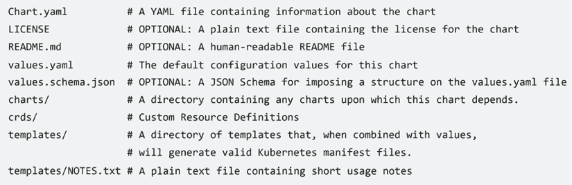
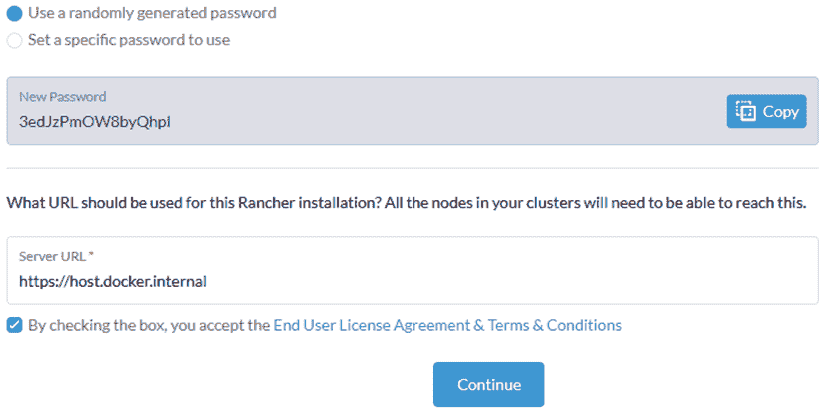
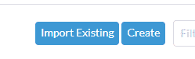
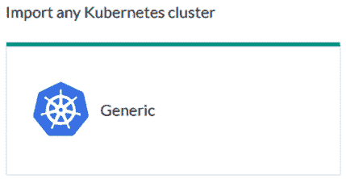
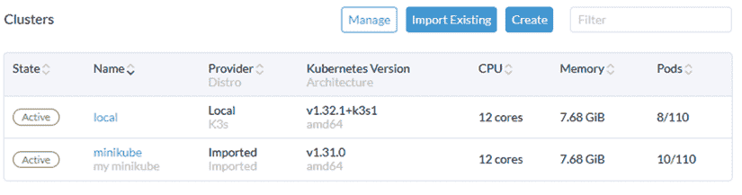
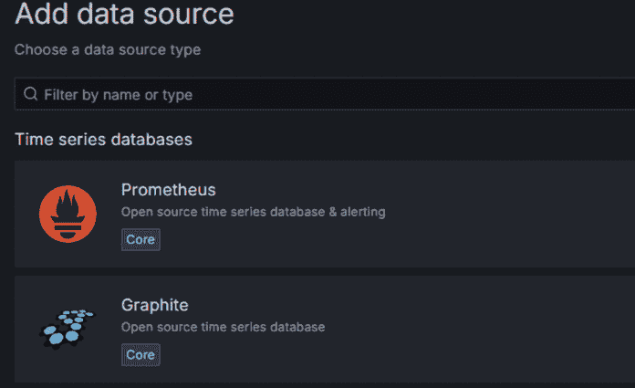
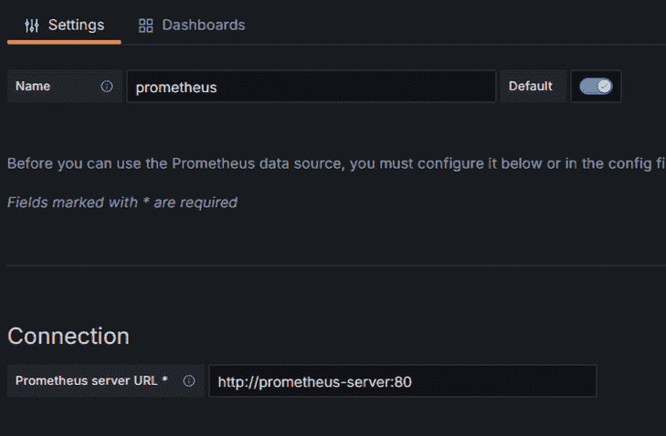
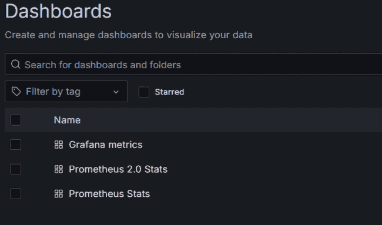
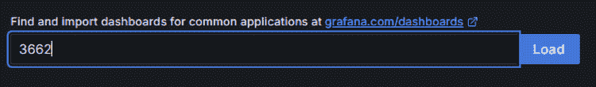
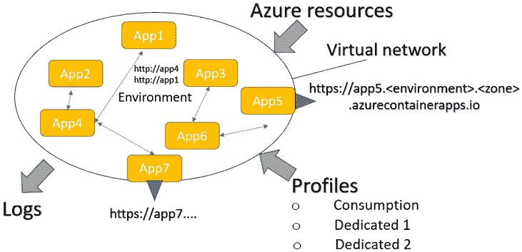

# 9

# 简化容器和 Kubernetes：Azure Container Apps 和其他工具

虽然 Kubernetes 可能是最完整的编排器，但从单体开发到 Kubernetes 上的微服务的任何过渡都面临两个难题。

第一个困难是 Kubernetes 集群的成本往往不能由应用的初始低流量所证明。事实上，一个生产级的 Kubernetes 集群通常需要多个节点来实现冗余和可靠性。虽然自管理的集群可能至少需要两个主节点和三个工作节点，但像**Amazon Elastic Kubernetes Service**（**Amazon EKS**）、**Azure Kubernetes Service**（**AKS**）或**Google Kubernetes Engine**（**GKE**）这样的托管 Kubernetes 服务通常以较低的成本处理控制平面冗余（Amazon EKS 控制平面成本约为每月 72 美元）。团队可以从较小的实例类型开始，并根据需要扩展，从而减少初始负担。

另一个困难是 Kubernetes 本身的学习曲线。将整个团队转移到离散的 Kubernetes 知识/专业知识可能需要我们没有的时间。此外，如果我们正在过渡现有的单体应用程序，在过渡的开始——当微服务数量仍然很少，它们的组织仍然类似于单体应用程序的组织——我们根本不需要 Kubernetes 提供的所有机会和选项。

前面的考虑导致了**Azure Container Apps**的概念，它是一种无服务器的 Kubernetes 替代方案。作为一个无服务器选项，你只需为所使用的服务付费，并克服了初始集群大小阈值的问题。**Azure Container Apps**还通过以下功能降低了学习曲线：

1.  虽然 Kubernetes 提供了构建工具和微服务的所有构建块，但**Azure Container Apps**的构建块本身就是微服务，因此开发者可以专注于业务逻辑，而无需花费太多时间在技术细节上。存储解决方案、消息代理和其他性能和安全工具都是从托管平台——即 Azure——获取的。

1.  对于所有内容都有可接受的默认值，因此部署应用程序可能变得像决定要部署的 Docker 镜像一样简单。也可以在以后指定自定义设置。

在简要描述了用于简化 Kubernetes 集群使用和管理的各种工具之后，本章详细介绍了**Azure Container Apps**及其在实际中的应用。本章依赖于对 Kubernetes 的现有知识，因此请在学习过*第八章*，*使用 Kubernetes 进行实践微服务组织*之后阅读。

更具体地说，本章涵盖了以下内容：

+   简化 Kubernetes 集群使用和管理的工具

+   **Azure Container Apps**的基础和计划

+   使用**Azure Container Apps**部署您的微服务应用

# 技术要求

本章需要以下内容：

1.  至少是 Visual Studio 2022 的免费*社区版*。

1.  Azure CLI。32 位和 64 位 Windows 安装程序的链接可以在[`learn.microsoft.com/bs-latn-ba/cli/azure/install-azure-cli-windows?tabs=azure-cli`](https://learn.microsoft.com/bs-latn-ba/cli/azure/install-azure-cli-windows?tabs=azure-cli)找到**。**

1.  一个 Azure 订阅。

1.  minikube 和 kubectl。请参阅*第八章*，“使用 Kubernetes 的实用微服务组织”的*技术要求*部分，*Practical Microservices Organization with Kubernetes*。

# 简化 Kubernetes 集群使用和管理的工具

在 Kubernetes 成功之后，出现了许多与之相关的产品、服务和开源项目。在本节中，我们将对它们进行分类并提供一些相关示例。与 Kubernetes 相关的整个产品组合可以按以下方式分类：

1.  打包库和应用的工具。

1.  Kubernetes 图形用户界面。

1.  用于收集和展示各种集群指标、处理警报和执行管理操作的行政工具。

1.  处理基于微服务应用（包括 Kubernetes 作为目标部署平台）的整个开发和部署的工具。

1.  建立在 Kubernetes 之上的编程环境。这包括垂直应用，如机器学习和大数据工具，以及通用编程环境，如 Azure Container Apps。

当涉及到打包工具时，最相关的是**Helm**，它已成为打包 Kubernetes 应用程序和库的事实标准。我们将在下一节中分析它。

## Helm 和 Helm 图表

**Helm**是一个包管理器，它管理的包被称为**Helm 图表**。Helm 图表是组织包含多个`.yaml`文件的复杂 Kubernetes 应用程序的一种方式。Helm 图表是一组组织到文件夹和子文件夹中的`.yaml`文件。以下是从官方文档中摘取的一个典型的 Helm 图表文件夹结构：



图 9.1：Helm 图表的文件夹结构

特定于应用的`.yaml`文件放置在顶层的`templates`目录中，而`charts`目录可能包含其他用作辅助库的 Helm 图表。顶层的`Chart.yaml`文件包含有关包的一般信息（名称和描述），以及应用版本和 Helm 图表版本。以下是一个典型的示例：

```cs
apiVersion: v2
name: myhelmdemo
description: My Helm chart
type: application
version: 1.3.0
appVersion: 1.2.0 
```

在这里，`type`可以是`application`或`library`。只有`application`图表可以部署，而`library`图表是用于开发其他图表的实用工具。`library`图表放置在其他 Helm 图表的`charts`文件夹中。

为了配置每个特定的应用程序安装，Helm 图表`.yaml`文件包含在安装 Helm 图表时指定的变量。此外，Helm 图表还提供了一种简单的模板语言，允许在某些条件满足的情况下包含一些声明，这些条件取决于输入变量。顶层`values.yaml`文件声明了输入变量的默认值，这意味着开发者只需指定几个需要不同值的变量。我们不会描述 Helm 图表模板语言，因为它过于广泛，但您可以在*进一步阅读*部分中找到官方 Helm 文档。

Helm 图表通常以类似于 Docker 镜像的方式组织在公共或私有仓库中。有一个 Helm 客户端，您可以使用它从远程仓库下载软件包并在 Kubernetes 集群中安装图表。Helm 客户端可以通过 Chocolatey 软件包管理器安装在安装了 kubectl 的任何机器上，如下所示：

```cs
choco install kubernetes-helm 
```

相应地，您可以在*第八章*的*技术要求*部分找到关于 Chocolatey 安装程序的说明，即《使用 Kubernetes 的实用微服务组织》。Helm 与当前的 kubectl Kubernetes 集群和用户一起运行。

在使用其软件包之前，必须先添加远程仓库，如下所示：

```cs
helm repo add <my-repo-local-name> https://mycharts.helm.sh/stable 
```

之前的命令使远程仓库的软件包信息在本地可用，并为该远程仓库赋予一个本地名称。可以使用以下命令刷新一个或多个仓库中所有可用图表的信息：

```cs
helm repo update <my-repo-local-name 1> <my-repo-local-name 2>… 
```

如果未指定仓库名称，则所有本地仓库都将更新。

之后，可以使用以下类似命令安装远程仓库中的任何软件包：

```cs
helm install <instance name> <my-repo-local-name>/<package name> -n <namespace> 
```

在这里，`<namespace>`是要安装应用程序的 Kubernetes 命名空间。通常，如果没有提供，则假定使用`default`命名空间。`<package name>`是要安装的软件包的名称，最后，`<instance name>`是您为安装的应用程序提供的名称。您需要这个名称来使用以下命令获取有关已安装应用程序的信息：

```cs
helm status <instance name> 
```

您还可以使用以下命令获取有关使用 Helm 安装的所有应用程序的信息：

```cs
helm ls 
```

删除集群中的应用程序也需要应用程序名称，如下所示：

```cs
helm delete <instance name> 
```

当我们安装应用程序时，我们还可以提供一个包含所有要覆盖的默认变量值的`.yaml`文件。我们还可以指定 Helm 图表的特定版本；否则，将使用最新版本。以下是一个同时覆盖版本和值的示例：

```cs
helm install <instance name> <my-repo-local-name>/<package name> -f values.yaml --version <version> 
```

最后，也可以按照`--set`选项提供默认值覆盖，如下所示：

```cs
...--set <variable1>=<value1>,<variable2>=<value2>... 
```

我们也可以使用`upgrade`命令升级现有安装，如下所示：

```cs
helm upgrade <instance name> <my-repo-local-name>/<package name>... 
```

`upgrade`命令可以使用`-f`选项或`--set`选项指定新的值覆盖，也可以使用`--version`指定要安装的新版本。如果没有指定版本，将安装最新版本。

更多关于 Helm 的详细信息可以在官方文档[`helm.sh/`](https://helm.sh/)中找到。我们将在关于 Kubernetes 管理工具的后续小节中展示如何实际使用 Helm。

## Kubernetes 图形 UI

还有工具可以帮助通过用户友好的图形界面定义和部署 Kubernetes 资源。其中，值得提及的是 ArgoCD 和 Rancher UI。

**ArgoCD**管理一个 Kubernetes 资源数据库，并在定义资源的代码更改时自动更新 Kubernetes 集群。ArgoCD 简化了大量的 Kubernetes 集群管理，但资源的自动重新部署可能会在生产环境中导致需要零停机时间的问题。我们在此处不会描述 ArgoCD，但感兴趣的读者可以在*进一步阅读*部分找到更多详细信息。

**Rancher UI**允许用户通过基于 Web 的 UI 与多个 Kubernetes 集群交互。它还提供处理整个开发过程（如项目定义）的工具。

Rancher UI Web 应用程序必须可以从它必须处理的每个 Kubernetes 集群内部访问，并且需要在它必须处理的每个 Kubernetes 集群内部安装软件。

Rancher UI 也可以安装在开发者的本地机器上，在那里它可以用来与 minikube 交互。进行本地安装的最简单方法是使用 Docker。打开 Linux shell 并输入以下代码：

```cs
docker run -d \
  --restart unless-stopped \
  -p 80:80 \
  -p 443:443 \
  --privileged \
  --name rancher \
  rancher/rancher:stable 
```

安装完成后几分钟，Rancher UI 在`https://localhost`可用。如果你无法访问它，请等待一分钟然后重试。

第一次出现 Web 界面时，你需要一个临时密码。你可以使用以下 Linux 命令获取此密码：

```cs
docker logs rancher 2>&1 | grep "Bootstrap Password:" 
```

在 Rancher UI 初始页面复制临时密码，然后按**继续**。出现的新页面应该建议为管理员用户提供一个新的最终密码，以及 minikube 访问 Rancher UI 要使用的 URL。按照以下方式填写此页面：



图 9.2：Rancher 初始设置

接受建议的密码，复制它，并将其保存在安全的地方。`host.docker.internal`主机名使 minikube 能够连接到我们的机器 localhost。

在仪表板上，点击**导入现有**按钮以开始使用 Rancher UI 连接现有集群的过程：



图 9.3：导入现有集群

在出现的新页面上，选择[通用](https://www.Generic.com)集群选项：



图 9.4：通用集群选项

只需在出现的页面上填写集群名称和描述，如图所示：

![img/B31916_09_5.png]

图 9.5：填写集群信息

然后，点击**创建**按钮。应该会显示一个包含在您的集群中运行的代码的页面。你应该选择第二个代码选项，因为本地 Rancher 安装使用的是自签名证书，应该类似于以下内容：

```cs
curl --insecure -sfL https://host.docker.internal/v3/import/6rd2jg4nntmkkw9z9mjhttrjfjj64cz9vl8zr6pr6tskbt6cc98zfz_c-2p47w.yaml | kubectl apply -f - 
```

然而，此代码必须在 Linux shell 中执行，并且`kubectl`仅在 Windows 上安装。因此，将前面的指令替换为以下指令：

```cs
curl --insecure -sfL https://host.docker.internal/v3/import/6rd2jg4nntmkkw9z9mjhttrjfjj64cz9vl8zr6pr6tskbt6cc98zfz_c-2p47w.yaml > install.yaml 
```

然后，在 Linux shell 中执行它。它将创建包含我们的 Kubernetes 代码的`install.yaml`文件。

现在，我们可以在 minikube 上安装 Rancher。确保 minikube 正在运行，打开 Windows 控制台，并执行以下命令：

```cs
kubectl apply -f install.yaml 
```

当安装完成后，返回仪表板；你应该看到新导入的 minikube 集群：



图 9.6：Minikube 集群已连接

点击`minikube`链接，享受通过图形 UI 与 Minikube 交互的强大功能！在这里，你可以看到节点、Pods、命名空间以及所有类型的 Kubernetes 资源，还可以定义新的资源。

当你完成实验后，在 Docker UI 中停止 minikube 和 Rancher 容器。如果你不再需要通过 Rancher 与 minikube 交互，只需执行以下操作：

```cs
kubectl delete -f install.yaml 
```

## Kubernetes 行政工具

每个云服务提供商都提供了与 Kubernetes 服务一起的行政 UI。这些 UI 包括对集群执行操作的可能性，例如检查 Kubernetes 资源、收集各种指标，以及查询和绘制这些指标。我们将在*第十章*中更详细地分析 Azure 提供的行政工具，*无服务器和微服务应用程序的安全性和可观察性*。

然而，还有第三方提供的几个工具以及几个开源项目。在开源项目中，值得提及的是名为**Prometheus**的指标收集器，以及名为**Grafana**的基于 UI 的行政控制台。通常，它们一起安装，Prometheus 作为 Grafana 的指标源。它们可以安装在任何 Kubernetes 集群上，包括 minikube。

这些工具的详细描述超出了本书的目的，但鉴于它们非常常见，也是其他工具的先决条件，我们将描述如何安装它们。

如果你想在 minikube 上测试这些工具，你需要一个具有更多内存的配置和一些其他自定义设置，因此最佳选项是在启动 minikube 时定义一个新的配置文件，如下所示：

```cs
minikube start --memory=6g --extra-config=kubelet.authentication-token-webhook=true --extra-config=kubelet.authorization-mode=Webhook --extra-config=scheduler.bind-address=0.0.0.0 --extra-config=controller-manager.bind-address=0.0.0.0 -p <your profile name> 
```

这里，`--extra-config`选项允许配置各种 Kubernetes 安装选项。如果您不使用 minikube，您必须确保 Kubernetes 集群已配置为使用前一个指令中通过`--extra-config`传递的选项。这些设置在 Prometheus 使用的控制器管理器上启用 Webhooks，并强制控制器和调度器在主节点上暴露的 IP 地址与 Prometheus 兼容。

一旦所有这些设置都确定，我们就可以使用 Helm 安装 Prometheus 和 Grafana：

```cs
helm repo add prometheus-community https://prometheus-community.github.io/helm-charts
helm repo add grafana https://grafana.github.io/helm-charts
helm repo update
helm install prometheus prometheus-community/prometheus --namespace monitoring --create-namespace
helm install grafana grafana/grafana --namespace monitoring 
```

前两个指令添加了包含 Prometheus 和 Grafana 的存储库，第三个指令更新了所有本地存储库目录。第三个指令在创建该命名空间后，在`monitoring`命名空间中安装 Prometheus，最后，最后一个指令在相同的命名空间中安装 Grafana。

安装完成后，我们可以检查`monitoring`命名空间以验证所有资源是否就绪：

```cs
kubectl get all -n monitoring 
```

最后，可以通过端口转发适当的服务来访问 Prometheus 和 Grafana 的 UI。请记住，为每个端口转发服务使用不同的控制台窗口，因为在端口转发时控制台会冻结：

```cs
kubectl --namespace monitoring port-forward service/prometheus-server 9090:80
kubectl --namespace monitoring port-forward service/grafana 3000:80 
```

之后，Prometheus 将在[`localhost:9090`](http://localhost:9090)可用，Grafana 在 http://localhost:3000。虽然 Prometheus 不需要登录，但 Grafana 的默认用户是`admin`，密码必须从 Kubernetes 机密中提取，如下所示：

```cs
kubectl get secret --namespace monitoring grafana -o jsonpath="{.data.admin-password}" 
```

复制前一个命令返回的字符串；我们需要将其 Base64 解码以获取实际密码。通常，Base64 解码可以通过打开 Linux 控制台并使用`base64`命令来完成：

```cs
echo -n <string to decode> | base64 -d 
```

登录到 Grafana 后，我们必须声明 Prometheus 为其指标数据源。在 Grafana 左侧菜单中，转到**连接 -> 数据源**，然后选择**添加新数据源**。在出现的页面上，选择**Prometheus**，如图下所示：



图 9.7：选择 Prometheus 作为数据源

我们需要将 Prometheus 配置为默认数据源，并将检索所有指标的 URL 设置为[`prometheus-server:80`](http://prometheus-server:80)，这对应于我们已端口转发的相同 Prometheus 服务的地址和端口，如图所示：



图 9.8：Prometheus 设置

您可以保留所有其他默认设置；只需点击**保存并测试**按钮。之后，点击**仪表板**选项卡并导入所有建议的仪表板。

然后，转到 Grafana 左侧菜单中的**仪表板**并点击链接检查所有导入的仪表板：



图 9.9：可用的仪表板

如果你点击 **新建** 然后点击 **导入**，你可以从 grafana.com 导入仪表板。只需遵循 `grafana.com/dashboards` 链接，选择一个仪表板，获取其 ID，并复制它，如下所示：



图 9.10：从 grafana.com 导入仪表板

你可能需要订阅以获取仪表板 ID。订阅是免费的。仪表板选择页面包含你可能感兴趣的文档链接。

如果你使用 `minikube stop -p <profle name>` 停止 minikube，minikube 将会停止，但所有数据都将被保存，因此你可以继续使用 Grafana 进行实验。如果你想卸载 Grafana 和 Prometheus，你可以使用 Helm 来完成，如下所示：

```cs
helm delete grafana
helm delete prometheus 
```

让我们以剩余的工具结束本节。

## 基于 Kubernetes 的开发环境

在基于 Kubernetes 的完整开发平台中，值得提及的是 **OpenShift** ([`www.redhat.com/en/technologies/cloud-computing/openshift`](https://www.redhat.com/en/technologies/cloud-computing/openshift))，它包括整个开发过程所需的工具，包括 DevOps 自动化和云服务。

OpenShift 可以安装在本地，也可以作为主云服务（包括 Azure）中可用的 PaaS 服务使用 ([`azure.microsoft.com/it-it/products/openshift`](https://azure.microsoft.com/it-it/products/openshift))。

大数据和机器学习框架使用 Kubernetes，但我们将不会讨论它们，因为它们完全超出了本书的目的。

还值得一提的是一些初创公司提供的简单代码生成器，它们通过图形界面将容器与 Kubernetes 应用程序结合来创建应用程序。不用说，类似的工具只是针对创建低成本应用程序的。我们不会描述它们，因为本书的重点是企业级高质量应用程序，目前既没有出现普遍的模式，也没有出现特定的框架。

相反，当涉及到基于 Kubernetes 的高级抽象替代方案时，在本书编写时，最相关的选项是 **Azure Container Apps**，本章的剩余部分将对其进行描述。

# Azure Container Apps 基本和计划

Azure Container Apps 以无服务器产品形式提供，有 **消费** 计划，但也提供基于虚拟机水平扩展的 **专用** 计划，称为 **工作负载配置文件**。一些高级功能仅适用于 **工作负载配置文件**。我们将在本节稍后详细讨论计划。

虽然 Kubernetes 提供了多种独立的构建块，但 Azure Container Apps 仅基于两种类型的构建块：**应用程序/作业**和**环境**。

应用程序与微服务一一对应，而作业对于长时间运行的任务很有用，本章节将不会对其进行讨论。

应用程序自动处理副本——也就是说，每个应用程序可能有几个完全相同的副本，就像 Kubernetes Deployment 一样。应用程序支持与 Kubernetes Deployments 相同的配置选项，如下所示：

+   环境变量

+   体积增加

+   健康检查

+   CPU 和内存资源配置

+   自动日志收集

它们也支持通信配置、密钥和自动扩展，但它们不是作为单独的对象定义，而是在应用程序配置内部。此外，没有 StatefulSets 的等效物——也就是说，没有实现分片算法的方法。

这些选择背后的逻辑是，开发者必须将每个微服务映射到单个资源，而不是几个协调资源，这样他们就可以主要集中精力在业务逻辑上，而不会被编排特定的配置所淹没。

像 StatefulSets 这样的协调工具被简单地省略了，因为它们不包括业务逻辑，只是用于解决协调和并行更新问题。实际上，StatefulSets 主要用于实现存储引擎和消息代理等工具，所以基本思想是开发者应该使用云中已有的资源，而不是实现定制化解决方案，这样他们就可以将所有精力集中在业务逻辑上。

其他资源，如权限、用户和角色，也来自 Azure。这样，您的微服务应用程序可以顺利地集成到托管云中，而不是成为一个与托管云松散耦合的自包含部署环境，例如 Kubernetes。

总结来说，我们可以这样说，Azure Container Apps 以降低其可移植性的代价简化了微服务应用程序的实现。一旦您将应用程序实现为在 Azure Container Apps 中运行并使用 Azure 云资源，迁移到另一个云的唯一选项就是重写整个编排相关代码。

不言而喻，如果容器被精心设计，在迁移的情况下它们不会丢失，但围绕它们的整个逻辑会丢失。

如果您的应用程序很小，只包含几个微服务，这并不是一个大问题，但对于由数百或数千个微服务组成的大型应用程序，迁移可能意味着在时间和金钱方面都不可接受的成本。

因此，Azure Container Apps 对于小型应用程序或当您计划在单个云（Azure）上部署应用程序且不需要太多定制（定制工具、高度定制的工具、复杂的定制分布式算法等）时是一个不错的选择。这使得它成为您开始将单体应用程序转换为分布式计算世界时的一个良好切入点。

微服务应用程序的边界由一个**环境**定义。在每一个环境中，所有应用程序都可以自由交互，但你也可以决定将一些端点暴露给**外部世界**。如果你使用消费计划，外部世界必然是互联网，但使用工作负载配置文件时，你可以通过将现有 Azure 虚拟网络的子网关联到你的环境来绕过这种限制。实际上，在这种情况下，外部世界将是虚拟网络的其余部分。

从单个环境入口点路由通信到环境内部所有前端微服务的 Kubernetes 入口等价物不存在，但你可以通过使用应用程序作为 API 网关来实现类似的功能（参见*第二章*，*揭秘微服务应用程序*）。对于 HTTP 和 HTTPS 终止，你可以配置任何应用程序使用 HTTPS，而无需创建和处理 HTTPS 证书，因为 Azure 会为你处理这些。

以下图示说明了我们关于应用程序和环境的说法：



图 9.11：Azure Container Apps 组织

注意以下事项：

+   每个环境可以定义为仅消费或工作负载配置文件。

+   每个环境都可以添加配置文件。仅消费环境只能有默认消费配置文件。工作负载配置文件环境有默认消费配置文件，但也可以添加可定制的 workload 配置文件。配置文件将在本节稍后进行讨论。

+   与环境关联的每个应用程序都可以指定在环境中运行哪个与该环境关联的配置文件。

+   每个应用程序都可以通过`http://<application name>` URL 从环境中访问。我们还可以决定在消息代理中使用时，应用程序不通过直接链接访问。

+   一些应用程序可以配置为从环境外部访问，在这种情况下，它们将接收`https://<application name>.<environment name>.<zone>.azurecontainerapps.io` URL。在这里，`<zone>`是你定义环境所在的 Azure 地理区域。*HTTP 流量必须通过常规的 80 和 443 端口转发*。对于纯 TCP 流量，开发者可以指定不同的端口。

+   每个环境都关联一个虚拟网络。只有当环境有一个工作负载配置文件时，你才能为其分配虚拟网络的自定义子网。

+   如果授予了必要的权限或凭据，环境和应用程序可以访问任何 Azure 资源。

本节的其余部分组织成子节，描述以下主题：

1.  仅消费和工作负载配置文件

1.  应用程序版本控制

1.  与 Azure Container Apps 交互

## 仅消费和工作负载配置文件

在消耗型配置文件中运行的应用程序的计费方式如下：

```cs
Kcpu*<virtual CPU seconds> + Kmem*<Gigabytes seconds> + Kreq*<requests per seconds> 
```

简而言之，应用程序的计费是按其内存、CPU 和请求消耗的比例进行的。各种国家的实际常数可以在以下链接中找到：[`azure.microsoft.com/en-us/pricing/details/container-apps/`](https://azure.microsoft.com/en-us/pricing/details/container-apps/)。

使用作业配置文件时，你将根据使用的每个虚拟机的 CPU 和 GB 数计费，而不是根据分配给应用程序的 CPU 和内存计费。例如，尽管你只使用了配置文件虚拟机的 10%，但你仍需为整个虚拟机的 CPU 和内存付费。然而，对于作业配置文件，没有与应用程序请求相对应的计费配额。还需要将每小时配置文件处理成本添加到每个配置文件的总成本中。各种国家的实际常数可以在以下链接中找到：[`azure.microsoft.com/en-us/pricing/details/container-apps/`](https://azure.microsoft.com/en-us/pricing/details/container-apps/)。

每个配置文件都可以被多个应用程序使用，分配给每个配置文件的虚拟机数量是根据在该配置文件中运行的所有应用程序请求的 CPU 和内存来计算的。也就是说，当所有应用程序请求的总 CPU 或内存超过已分配机器的总 CPU 和内存时，就会分配一个新的虚拟机。

不言而喻，可以为每个配置文件指定最大和最小分配的机器数量。由于分配新的虚拟机需要时间，建议将最小实例数设置为至少 1；否则，在一段时间的不活跃之后，第一次请求可能会遇到无法接受的反应时间。

作业配置文件的每小时 CPU 和内存成本低于仅消耗型配置文件的，但作业配置文件有每小时的管理成本。当平均负载超过 3-4 个 CPU 和 16GB 内存时，作业配置文件变得方便。然而，某些功能仅适用于作业配置文件。例如，如果你想通过添加防火墙或使用另一个虚拟网络的子网来自定义环境下的虚拟网络，你需要一个作业配置文件。

所有可用的作业配置文件类型都列在此页面上：[`learn.microsoft.com/en-us/azure/container-apps/workload-profiles-overview`](https://learn.microsoft.com/en-us/azure/container-apps/workload-profiles-overview)。

让我们继续探讨 Azure Container Apps 的一个有用功能：自动版本支持。

## 应用程序版本控制

Azure Container Apps 会自动为你的应用程序进行版本控制。每次你修改应用程序的容器或扩展配置时，都会自动创建一个新的版本。

每个版本都有一个名称，被称为应用程序的 **版本**。默认情况下，只有最后一个版本是活动状态且可以通过应用程序链接访问。

然而，任何应用程序都可以设置为 **多版本** 模式，在这种情况下，您可以手动决定哪些版本是 **活动** 的，哪些版本与应用程序链接相关联。

如果多个版本连接到应用程序链接，您必须指定如何在这之间分割流量。如果只有一个版本连接到应用程序链接，但存在多个活动版本，您可以通过以下方式通过版本名称访问每个未连接到应用程序 URL 的活动版本：

```cs
<application name>-<revision name>.<environment>.<zone>.azurecontainerapps.io 
```

由于版本名称是自动生成的，且不友好，每个版本都可以附加友好的标签，这些标签可以用于通过以下链接等方式访问版本：

```cs
<application name>--<revision label>.<environment>.<zone>.azurecontainerapps.io 
```

Azure 容器应用版本逻辑支持以下几种部署模型：

+   *预发布/生产*：较新的版本未连接到应用程序链接，但可以通过其版本链接访问，因此可以在预发布中进行测试。一旦新版本获得批准，它将被连接到应用程序链接，而之前的版本将被停用。

+   *新功能预览*：流量在最后两个版本之间分割。最初，新版本只分配到一小部分总体流量，这样用户就可以尝试新功能。然后，逐渐地，新版本接收更多的流量，直到达到 100%，而之前的版本将被停用。

+   在流量分割过程中，**会话亲和性** 被启用，这样如果用户请求由版本 `r` 服务，那么所有后续请求将继续由相同的 `r` 版本服务。这样，我们避免了用户在两个版本之间随机游走。

版本主要用于前端服务，尤其是如果内部通信依赖于消息代理。测试工作微服务的新版本需要一个完全独立的预发布环境。

我们将在 *使用 Azure 容器应用部署您的微服务应用程序* 部分的末尾提供关于版本实际使用的更多详细信息。下一小节将解释如何在 Azure 容器应用中与您的微服务应用程序交互。

## 与 Azure 容器应用交互

在 Azure 容器应用环境中与应用程序交互没有与 kubectl 等效的工具。您可以通过 Azure 门户或使用 **Azure CLI** 来与它们交互。

应用程序和环境设置可以通过命令选项或 `.yaml` 或 JSON 文件来指定。我们将专注于命令选项和 `.yaml` 文件，仅描述最实用的选项。

与 Azure 容器应用交互需要安装 **containerapp Azure CLI** 扩展。在您使用 `az login` 登录后，可以使用以下命令进行安装：

```cs
az upgrade
az extension add --name containerapp --upgrade 
```

第一个`upgrade`命令确保您拥有最新的 Azure CLI 版本，而第二个命令中的`upgrade`选项将扩展更新到最新版本。前面的命令只需要执行一次，或者每次您想要更新到新版本时。

在开始任何新的会话之前，您必须注册几个命名空间。命名空间注册与 C#中的`using`语句具有相同的语义。以下是所需的注册命令：

```cs
az provider register --namespace Microsoft.App
az provider register --namespace Microsoft.OperationalInsights 
```

现在，我们已经准备好与 Azure Container Apps 进行交互。下一节将详细解释如何在 Azure Container Apps 上部署和配置您的微服务应用程序。

# 使用 Azure Container Apps 部署您的微服务应用程序

在本节中，我们将了解如何在 Azure Container Apps 中定义和配置您的应用程序。在第一个子节中，我们将描述基本命令和操作性，而所有配置选项和`.yaml`文件配置格式将在后面的子节中描述。

## 基本命令和操作性

所有 Azure Container Apps 命令都以`az containerapp`开头。然后是主要命令和各种配置选项。配置选项可以通过不同的命令选项传递，或者组织在`.yaml`或 JSON 文件中。

在 PowerShell 控制台中，您可以使用反引号字符（`）将命令拆分为多行，就像本节中所有命令所示。

`up`命令是定义应用程序和新的环境的最简单方法。这对于快速测试容器很有用。唯一必需的参数是应用程序名称和容器镜像 URL。对于所有其他选项，将假定合理的默认值。如果您没有指定资源组和环境，则命令将创建新的：

```cs
az containerapp up '
  --name <CONTAINER_APP_NAME> '
  --image <REGISTRY_SERVER>/<IMAGE_NAME>:<IMAGE TAG> '
  --ingress external '
  --target-port <PORT NUMBER> '
  --registry-server <REGISTRY SERVER URL> '
  --registry-username <REGISTRY USERNAME> '
  --registry-password <REGISTRY PASSWORD> 
```

让我们分解一下：

+   `name`是应用程序名称。这是必需的。

+   `image`是容器镜像 URL。这是必需的。通常，`image`标签用于镜像版本控制，如果省略，则默认为`latest`。

+   `ingress`可以是`internal`或`external`。在前一种情况下，应用程序只能从其环境中访问，而在第二种情况下，应用程序将暴露给外部世界。如果省略此参数，则应用程序将无法通过直接链接访问（当内部通信依赖于消息代理时很有用）。

+   `target-port`指定容器暴露的目标端口（如果有）。应用程序流量将被重定向到这个容器端口。如果有多个容器，应该只有一个接收应用程序流量，并且您必须指定其端口。应用程序 HTTP/S 流量必须发送到常规的`80`和`443`端口。

+   `registry-server`、`registry-username`和`registry-password`是参数，用于指定与特定镜像注册表服务器关联的凭据，这些凭据应与`image`参数中使用的相同。如果指定了这些参数，它们将被添加到应用程序配置中，并在后续的应用程序更新中使用。稍后，我们将看到如何将 Azure 身份分配给应用程序，允许它通过仅授予足够的权限给此身份而无需提供密码来访问 Azure 资源。

可以使用`--environment`和`--resource-group`选项指定现有的环境和资源组。

`up`命令可以用来更新应用程序配置或应用程序容器镜像，但在此情况下，你必须始终使用现有应用程序的值传递`--name`、`--environment`和`--resource-group`参数。

你可以使用我们在*第八章*的*使用 minikube 测试入口*小节中使用的简单`gcr.io/google-samples/hello-app:1.0`镜像来测试`up`命令。由于仓库是公开的，你不需要指定注册表凭据。容器端口是`8080`：

```cs
az group create '
  --name <resource group name> '
  --location centralus
az containerapp up --name <CONTAINER_APP_NAME> --image gcr.io/google-samples/hello-app:1.0 '
  --resource-group <resource group name> '
  --location centralus '
  --environment <environment name> '
  --ingress external --target-port 8080 '
  --query properties.configuration.ingress.fqdn 
```

我们之前创建了一个资源组来决定其名称。我们还指定了要创建的环境的名称。`--query properties.configuration.ingress.fqdn`选项允许命令返回应用程序 URL，你也可以使用我们在上一节中给出的 URL 格式手动计算。一旦通过你喜欢的浏览器访问应用程序 URL 测试了这个简单的单页 HTML 应用程序，你还可以检查在 Azure 门户主页上创建的所有 Azure 资源。

你可以使用以下命令获取应用程序创建的整个`.yaml`配置：

```cs
az containerapp show '
  --name <CONTAINER_APP_NAME> '
  --resource-group <RESOURCE_GROUP_NAME> '
  -o yaml 
```

一个好的方法是先从默认配置开始，然后使用前面的命令获取`.yaml`应用程序配置，修改这个`.yaml`文件，最后，使用`update`命令提交修改后的`.yaml`文件，如下所示：

```cs
az containerapp update '
  --name <CONTAINER_APP_NAME> '
  --resource-group <RESOURCE_GROUP_NAME> '
  --yaml mymodified.yaml 
```

每个应用程序都通过其名称和资源组唯一标识，因此每个`update`或`delete`命令都必须指定这两个信息。

清理实验后所有资源的最简单方法是通过删除整个资源组，如下所示：

```cs
az group delete --name <resource group name> 
```

当你需要在同一环境中部署多个应用程序时，最好的做法是首先使用以下命令创建环境：

```cs
az containerapp env create '
  --name <CONTAINERAPPS_ENVIRONMENT> '
  --resource-group <RESOURCE_GROUP> '
  --location "<AZURE LOCATION NAME>" 
```

如果你希望在该环境中启用工作负载配置文件，你还必须添加`--enable-workload-profiles`选项。

如果你希望将你整个微服务应用程序中涉及的所有资源放置在一个新的资源组中，你需要在创建环境之前创建它，如下所示：

```cs
az group create '
  --name <RESOURCE_GROUP> '
  --location "<AZURE LOCATION NAME>" 
```

可以使用以下指令将工作负载配置文件添加到环境中：

```cs
az containerapp env workload-profile add '
  --resource-group <RESOURCE_GROUP> '
  --name <ENVIRONMENT_NAME> '
  --workload-profile-type <WORKLOAD_PROFILE_TYPE> '
  --workload-profile-name <WORKLOAD_PROFILE_NAME> '
  --min-nodes <MIN_INSTANCES> '
  --max-nodes <MAX_INSTANCES> 
```

在这里，`--workload-profile-name` 是您为工作负载配置文件指定的名称，而 `--workload-profile-type` 是配置文件类型——即您可以从以下列表中选择的一种虚拟机类型：[`learn.microsoft.com/en-us/azure/container-apps/workload-profiles-overview`](https://learn.microsoft.com/en-us/azure/container-apps/workload-profiles-overview)。`--min-nodes` 和 `--max-nodes` 分别是可创建的虚拟机的最小和最大实例数。

可以在稍后使用以下命令删除工作负载配置文件：

```cs
az containerapp env workload-profile delete '
  --resource-group "<RESOURCE_GROUP>" '
  --name <ENVIRONMENT_NAME> '
  --workload-profile-name <WORKLOAD_PROFILE_NAME> 
```

当环境设置完成后，您可以在公共注册表中部署所有容器镜像，然后您可以使用以下命令开始创建每个应用程序：

```cs
az containerapp create '
  --name <CONTAINER_APP_NAME> '
  --image <REGISTRY_SERVER>/<IMAGE_NAME>:<TAG> '
  --resource-group <RESOURCE_GROUP_NAME> '
  --environment <ENVIRONMENT_NAME> '
  --ingress <external or internal or omit this option> '
  --target-port <PORT_NUMBER> '
  --registry-server <REGISTRY SERVER URL> '
  --registry-username <REGISTRY USERNAME> '
  --registry-password <REGISTRY PASSWORD> 
```

前面的命令使用默认配置创建应用程序。如果您希望应用程序在工作负载配置文件中而不是默认消费配置文件中运行，您必须添加 `--workload-profile-name <WORKLOAD_PROFILE_NAME>` 选项。

然后，您可以使用以下命令提取其 `.yaml` 文件并进行修改：

```cs
 az containerapp show '
  --name <CONTAINER_APP_NAME> '
  --resource-group <RESOURCE_GROUP_NAME> '
  -o yaml 
```

您还需要使用前面的代码与以下代码一起使用：

```cs
az containerapp update '
  --name <CONTAINER_APP_NAME> '
  --resource-group <RESOURCE_GROUP_NAME> '
  --yaml mymodified.yaml 
```

您还可以在创建应用程序时立即指定 `.yaml` 文件，如下所示：

```cs
az containerapp create '
  --name <CONTAINER_APP_NAME> '
  --environment <ENVIRONMENT_NAME> '
  --resource-group <RESOURCE_GROUP_NAME> '
  --yaml myapp.yaml 
```

您可以使用以下命令获取所有应用程序修订版本的列表：

```cs
az containerapp revision list '
  --name <CONTAINER_APP_NAME> '
  --resource-group <RESOURCE_GROUP> 
```

您可以使用以下命令获取每个修订版本的每个副本：

```cs
az containerapp replica list '
  --name <CONTAINER_APP_NAME> '
  --resource-group <RESOURCE_GROUP> '
  --revision <REVISIONNAME> 
```

您还可以在特定修订版本的特定副本的容器中获得交互式控制台，类似于 Kubernetes 的 `exec` 命令：

```cs
az containerapp exec `
  --name <CONTAINER_APP_NAME> `
  --resource-group <RESOURCE_GROUP> `
  --revision <REVISION_NAME> `
  --replica <REPLICA_NAME> 
```

如果有多个容器，您可以使用 `--container` 选项指定容器名称。

您可以使用以下命令删除应用程序：

```cs
az containerapp delete '
  --name <CONTAINER_APP_NAME> '
  --resource-group <RESOURCE_GROUP_NAME> 
```

您可以使用以下命令删除整个环境和其中包含的所有应用程序：

```cs
az containerapp env delete '
  --name <ENVIRONMENT_NAME> '
  --resource-group <RESOURCE_GROUP_NAME> 
```

这些命令涵盖了大多数实际使用场景。其他选项和命令可以在官方命令参考中找到，链接为[`learn.microsoft.com/it-it/cli/azure/containerapp?view=azure-cli-latest`](https://learn.microsoft.com/it-it/cli/azure/containerapp?view=azure-cli-latest)。在下一小节中，我们将描述如何使用 `.yaml` 文件配置您的应用程序。

## 应用程序配置选项和 .yaml 格式

修改应用程序配置的最简单方法是使用传递给以下命令的 `.yaml` 文件：

```cs
az containerapp update '
  --name <CONTAINER_APP_NAME> '
  --resource-group <RESOURCE_GROUP_NAME> '
  --yaml myappconfiguration.yaml 
```

应用程序 `.yaml` 文件的组织结构如下所示：

```cs
identity:
...
properties:
environmentId: "/subscriptions/<subscription_id>/resourceGroups/….."
workloadProfileName: My-GP-01
configuration:
ingress:
…
maxInactiveRevisions: 10
secrets:
- name: <nome>
value: <valore>
registries:
- server: <server URL>
username: <user name>
passwordSecretRef: <name of the secret that contains the password>
- server: <server URL>
identity: <application identity resource id>
template:
containers:
- …
initContainers:
- ...
scale:
minReplicas: 1
maxReplicas: 5
rules:
- ...
volumes:
- ... 
```

让我们分解一下：

+   只有当应用程序已连接到 Azure 身份以处理其无密码访问其他资源时，`identity` 部分才会存在。

+   `environmentId` 是应用程序所在环境的 Azure 唯一标识符（不要将其与环境名称混淆）。获取此和其他值的最简单方法是创建具有默认值的应用程序，然后显示其 `.yaml` 文件。

+   `workloadProfileName` 仅在应用程序与工作负载配置文件相关联时存在，并包含工作负载配置文件名称。

+   `ingress` 部分仅在应用程序必须通过直接链接从其环境内部或外部访问时存在。它包含所有直接通信相关的属性、CORS 设置以及版本之间的流量分割。

+   `maxInactiveRevisions` 表示保存并可激活的先前修订次数。默认值为 100。

+   `registries` 部分包含有关必须使用凭据访问的注册表的信息。不需要凭据且不是私有的注册表不应在此列出。每个条目指定注册表的用户名和密码或具有访问注册表权限的 Azure 身份。该身份必须在 `identity` 部分中列出。有关更多详细信息，请参阅 *将 Azure 身份关联到您的应用程序* 部分。

+   `secrets` 是存储在安全位置中的名称-值对。它们相当于 Kubernetes 通用密钥。

+   与 Kubernetes 一样，我们有 `containers` 和 `initContainers`。`initContainers` 的工作方式与 Kubernetes 中相同，但无法声明 `sidecar` 容器，因此 `sidecar` 容器必须包含在标准容器中。

+   `scale` 部分包含应用程序副本的最小和最大数量以及决定确切副本数量的规则。最常见的规则是尝试维持每个副本的目标 HTTP 请求或 TCP/IP 连接数：

    ```cs
    - name: my-http-rule,
      http:
          metadata:
                concurrentRequests: 100
    - name: my-tcp-rule,
      tcp:
          metadata:
                concurrentConnections: 100 
    ```

+   最后，我们有一个 `volumes` 部分声明了容器挂载的所有卷。与 Kubernetes 一样，它们在容器定义中的 `volumeMounts` 部分中引用。

所有在先前的 `.yaml` 文件中没有完全指定的属性将在单独的子部分中描述。让我们从容器开始。

### 容器配置

每个容器的配置与 Kubernetes 中的类似，但有一些简化。架构在此处显示：

```cs
 - image: <IMAGE URL>:<TAG>
name: <CONTAINER NAME>
env:
- name: <variable name>
value: <variable name>
- name: <variable name>
secretRef: <secret name>
resources:
cpu: 0.2
memory: 100Mi
probes:
- type: liveness
…
- type: readiness
…
- type: startup
…
volumeMounts:
- mountPath: /mypath
volumeName: myvolume 
```

`image` 和 `name` 与 Kubernetes 配置相同。

环境变量可以定义为名称-值对或 `name`-`secretRef` 对，其中 `secretRef` 包含在 `secrets` 部分中定义的密钥的名称。在第二种情况下，变量值是密钥的值。

`volumeMounts` 也类似于 Kubernetes。唯一的区别是，在 Kubernetes 中，卷名称称为 `name`，而在这里，它被称为 `volumeName`。

Kubernetes 的 `resources` 属性有两个属性，`requests` 和 `limits`，而在这里，我们只有几个与 Kubernetes `requests` 属性相对应的值。这意味着我们无法像 Kubernetes 那样指定 `resources` 限制。这种选择背后的原因可能与 Azure Container Apps 的无服务器特性有关。`cpu` 和 `memory` 的含义和度量单位与 Kubernetes 相同。

如您所见，活跃性、就绪性和启动探测以略不同的方式定义，但它们的含义与 Kubernetes 中相同。`type: liveness/readiness/startup` 之后属性的语法和含义与相应的 Kubernetes 配置相同。

让我们继续到 `ingress` 配置。

### 入口配置

`ingress` 配置将一些 Kubernetes `Service` 和 `Ingress` 设置与各种修订版之间的流量分割混合在一起，如下所示：

```cs
 ingress:
external: true
targetPort: 3000
# only for TCP communication. HTTP/S always use 80 and 443 ports
exposedPort: 5000
allowInsecure: false # false or true
clientCertificateMode: accept # accept required or ignore
corsPolicy:
allowCredentials: true
maxAge: 5000 (pre-flight caching time in seconds)
allowedOrigins:
- "https://example.com"
allowedMethods:
- "GET"
- "POST"
…
allowedHeaders: []
        exposeHeaders: []
      traffic:
- weight: 100
revisionName: testcontainerApp0-ab1234
label: production
stickySessions:
affinity: sticky 
```

让我们分解一下：

+   `external` 必须设置为 `true` 以将应用程序暴露给外部世界，否则设置为 `false`。

+   `targetPort` 是要路由应用程序流量的容器端口。

+   仅在非 HTTP/S 流量的情况下使用 `exposedPort`。它设置应用程序监听端口。所有接收在此端口的流量都将路由到 `targetPort`。暴露给外部世界的应用程序的 `exposedPort` 端口必须在环境中是唯一的。

+   相反，HTTP/S 流量始终使用常规的 `80` 和 `443` 端口，没有定制可能性。

+   如果 `allowInsecure` 设置为 `false`，HTTP 流量将自动重定向到 HTTPS。默认值为 `true`。

+   `clientCertificateMode` 指定是否接受 TCP/IP 客户端证书进行身份验证。此设置与 Kestrel 提供的类似设置完全类似。如果设置为 `accept`，则接受并处理客户端证书。如果设置为 `required`，则客户端证书是必需的，如果没有提供，则拒绝连接。如果设置为 `ignore`，则完全忽略客户端证书。

+   `corsPolicy` 包含标准的网络服务器 CORS 设置，与 ASP.NET Core 支持的设置相同。为了完整性，我们在这里描述所有 CORS 设置：

    +   如果 `allowCredentials` 设置为 `false`，则拒绝包含凭证的 CORS 请求。默认值为 `false`。

    +   `maxAge` 指定了预检请求的缓存时间。预检请求的唯一目的是在发送实际数据之前验证 CORS 请求是否会被接受。

    +   `allowedOrigins` 和 `allowedMethods` 分别指定接受 CORS 请求的源域和接受的 HTTP 动词。

    +   关于 `allowedHeaders`，默认情况下，仅允许一些安全的 `requests` 头部。此设置添加了额外的 `requests` 头部到已接受的那些。

    +   关于 `exposeHeaders`，默认情况下，仅在某些安全的 `response` 头部中暴露 CORS 请求的响应。此设置添加了额外的头部到允许的那些。

+   `traffic` 指定了各种修订版之间的流量分割。如果一个修订版列出了 `0` 分割，它将不会收到任何应用程序流量，但它将被设置为活动状态——也就是说，可以通过其特定修订版的链接访问它。所有添加到活动修订版的标签都必须在这里指定。

虽然可以通过修改 `traffic` 部分来处理修订版处理，但使用临时命令处理它更为实用。

可以使用以下命令获取给定应用程序的所有修订版的表格列表：

```cs
az containerapp revision list '
  --name <APPLICATION_NAME> '
  --resource-group <RESOURCE_GROUP_NAME> '
  -o table 
```

可以使用以下方式获取特定修订版的详细信息：

```cs
az containerapp revision show '
  --name <APPLICATION_NAME> '
  --revision <REVISION_NAME> '
  --resource-group <RESOURCE_GROUP_NAME> 
```

可以使用以下命令将标签附加或从特定修订版中分离：

```cs
az containerapp revision label <add or remove> '
  --revision <REVISION_NAME> '
  --resource-group <RESOURCE_GROUP_NAME> '
  --label <LABEL_NAME> 
```

可以使用以下命令将应用程序从单修订版模式切换到多修订版模式，反之亦然：

```cs
az containerapp revision set-mode '
  --name <APPLICATION_NAME> '
  --resource-group <RESOURCE_GROUP_NAME> '
  --mode <single or multiple> 
```

可以使用以下命令激活、停用或重启给定修订版：

```cs
az containerapp revision <activate or deactivate or restart> '
  --revision <REVISION_NAME> '
  --resource-group <RESOURCE_GROUP_NAME> 
```

最后，可以使用以下命令更改修订版之间的流量分配：

```cs
az containerapp ingress traffic set \
    --name <APP_NAME> \
    --resource-group <RESOURCE_GROUP> \
    --label-weight <LABEL_1>=80 <LABEL_2>=20 … 
```

下一个部分将重点介绍如何在`volumes`部分中定义卷。

### 卷定义和分配

卷可以是`EmptyDir`（与 Kubernetes 的`EmptyDir`以相同的方式工作）或从 Azure Files 获取的文件共享，如下所示：

```cs
 volumes:
- name: myempty
storageType: EmptyDir
- name: my-azure-files-volume
storageType: AzureFile
storageName: mystorage 
```

在这里，`mystorage`是您创建并附加到环境的文件共享的名称。因此，您必须执行以下步骤来获取`mystorage`：

1.  如果您还没有，请定义存储帐户：

    ```cs
    az storage account create '
      --resource-group <RESOURCE GROUP > '
      --name <STORAGE ACCOUNT NAME> '
      --location <AZURE LOCATION > '
      --kind StorageV2 ' 🡨 type (generic usage type)
      --sku Standard_LRS ' 🡨 performance level (this is a standard level)
      --enable-large-file-share '
      --query provisioningState 🡨 returns the provisioning state 
    ```

1.  定义一个文件共享：

    ```cs
    az storage share-rm create '
      --resource-group <RESOURCE GROUP> '
      --storage-account <STORAGE ACCOUNT NAME>'
      --name <STORAGE SHARE NAME> '
      --quota 1024 ' 🡨 megabyte to share
      --enabled-protocols SMB ' 🡨 SMB or NFS, SMB is usually better
      --output table 🡨 return information on the created share in table format 
    ```

1.  获取访问存储帐户的凭据：

    ```cs
    STORAGE_ACCOUNT_KEY='az storage account keys list -n <STORAGE ACCOUNT NAME> --query "[0].value" -o tsv' 
    ```

1.  将文件共享名称添加到环境中：

    ```cs
    az containerapp env storage set '
      --access-mode ReadWrite '
      --azure-file-account-name <STORAGE ACCOUNT NAME> '
      --azure-file-account-key $STORAGE_ACCOUNT_KEY '
      --azure-file-share-name <STORAGE SHARE NAME> '
      --storage-name <STORAGE_MOUNT_NAME> '
      --name <ENVIRONMENT NAME> '
      --resource-group <RESOURCE GROUP> '
      --output table 🡨 return details in table format 
    ```

现在，您可以使用传递给最后一个命令的`--storage-name`值在您的应用程序中定义卷，如下所示：

```cs
 - name: my-azure-files-volume
storageType: AzureFile
storageName: <STORAGE MOUNT NAME> 
```

下一个子节解释了如何将 Azure 标识符关联到应用程序，从而使其能够访问 Azure 资源。

## 将 Azure 标识符关联到您的应用程序

要与应用程序关联的 Azure 标识符可以由 Azure 自动生成和处理，也可以手动定义。使用用户定义的标识符的主要优势是您可以将其添加到多个应用程序中。

将系统分配的标识符添加到应用程序中非常简单：

```cs
az containerapp identity assign '
--name my-container-app '
--resource-group my-container-app-rg '
--system-assigned 
```

前一个命令返回创建的标识符的 Azure 资源 ID。可以通过将`type: SystemAssigned`添加到应用程序的`.yaml`文件中的`identity`部分来将系统分配的标识符与应用程序关联，如下所示：

```cs
identity:
type: SystemAssigned 
```

用户定义的标识符必须首先创建，然后分配给应用程序，因此添加用户定义的标识符需要两个步骤。

可以使用以下简单命令创建标识符：

```cs
az identity create --resource-group <GROUP_NAME> --name <IDENTITY_NAME> --output json 
```

`--output json`选项强制命令以 JSON 格式返回有关创建的标识符的信息。返回的 JSON 对象包含创建的标识符的 Azure 资源 ID。您需要它来使用以下命令将标识符与您的应用程序关联：

```cs
Az containerapp identity assign --resource-group <GROUP_NAME> --name <APP_NAME> '
--user-assigned <IDENTITY RESOURCE ID> 
```

最后一步可以通过将一个或多个标识符的资源 ID 直接添加到应用程序的`.yaml`文件中的`identity`部分来完成，如下所示：

```cs
identity:
type: UserAssigned
userAssignedIdentities:
<IDENTITY1_RESOURCE_ID>: {}
        <IDENTITY2_RESOURCE_ID>: {} 
```

例如，让我们看看如何使创建的标识符能够访问 Azure 容器注册表。这样，我们可以避免在应用程序的`.yaml`文件中存储注册表凭据。

首先，我们需要容器注册表资源 ID。我们可以使用以下命令获取它：

```cs
az acr show --name <REGISTRY NAME> --query id --output tsv 
```

然后，我们可以使用以下命令在我们的容器注册表中为我们的身份分配 `AcrPull` 角色：

```cs
az role assignment create '
--assignee <IDENTITY RESOURCE ID> '
--role AcrPull '
--scope <ACR_RESOURCE_ID> 
```

最后，我们必须通知应用程序它可以使用其系统分配或用户分配的身份来访问注册表：

```cs
az containerapp registry set '
--name my-container-app '
--resource-group my-container-app-rg '
--server <ACR_NAME>.azurecr.io '
--identity system 🡨 system if system assigned or the id of the user defined identity 
```

最后一步也可以通过向应用程序的 `.yaml` 文件中的 `registries` 部分添加条目来完成，如下所示：

```cs
- server: <server URL>
identity: <application identity resource id> 
```

我们已经完成了 Azure 容器应用的旅程。我们将在 *第十二章*，*使用 .NET Aspire 简化微服务* 中返回 Azure 容器应用，我们将看到如何自动创建所有指令以将整个微服务应用程序部署到 Azure 容器应用，并将使用本书案例研究应用程序作为示例。

我们对 Azure 容器应用的描述是根本性的完整，并涵盖了 95% 的实际 Azure 容器应用操作。更多详细信息可以在官方文档中找到，链接为 [`learn.microsoft.com/en-us/azure/container-apps/`](https://learn.microsoft.com/en-us/azure/container-apps/)。

下一章将重点介绍微服务应用程序的安全性和可观察性。

# 摘要

本章描述了与 Kubernetes 相关的工具，这些工具有助于分布式应用程序的管理和编码，然后重点介绍了 Azure 容器应用。

我们描述了 Azure 容器应用提供的基本理念，包括其基本概念和原则。然后，我们描述了可用的计划以及如何通过 Azure 门户与 Azure 容器应用交互。

尤其是我们描述了主要命令以及定义整个应用的 `.yaml` 格式。我们展示了如何在 Azure 容器应用中实现 Kubernetes 中的所有资源，并比较了两种方法。

# 问题

1.  环境是否等同于 Kubernetes 命名空间？

它们相似但不等价。

1.  Helm 如何简化 Kubernetes 应用程序和工具的部署？

因为它允许同时部署多个 yaml 文件，这些文件可以根据选定的选项和参数进行配置。

1.  Prometheus 和 Grafana 是什么？

它们是管理工具，用于收集指标和其他信息，并将它们呈现给用户。

1.  您能否描述一个暴露给外部世界的 Azure 容器应用 URL 的组成？

`<application name>.<Environment name>.<zone>.azurecontainerapps.io`

1.  环境是否提供对其底层网络的所有属性的访问？

不。

1.  哪些类型的 Azure 身份可以与 Azure 容器应用关联？

用户定义和系统分配。

1.  在 Azure 容器应用中，Azure 文件存储分配是否自动（如 Kubernetes 所示）并且只需要在应用程序 `.yaml` 文件的 `volumes` 部分声明卷？

不。

1.  是否可以使用单个 Azure 控制台命令部署 Azure 容器应用应用程序，而无需填写任何配置文件？

是的，有几种方式。

1.  在 Azure Container Apps 的 `.yaml` 文件中，你可以在哪个部分定义修订版之间的流量分割？

`ingress->traffic`

1.  Azure Container Apps 应用程序监听 HTTP/S 请求的端口可以自定义吗？

不。

# 进一步阅读

+   更多关于 Helm 和 Helm 图表的信息可以在官方文档中找到。这是一篇写得非常好的文章，包含了一些很好的教程：[`helm.sh/`](https://helm.sh/).

+   Grafana 仪表板：[`grafana.com/grafana/dashboards/`](https://grafana.com/grafana/dashboards/).

+   ArgoCD：[`argo-cd.readthedocs.io/en/stable/`](https://argo-cd.readthedocs.io/en/stable/)

+   Rancher UI：[`ranchermanager.docs.rancher.com/`](https://ranchermanager.docs.rancher.com/ )

+   OpenShift：[`www.redhat.com/en/technologies/cloud-computing/openshift`](https://www.redhat.com/en/technologies/cloud-computing/openshift).

+   Azure OpenShift：[`azure.microsoft.com/it-it/products/openshift`](https://azure.microsoft.com/it-it/products/openshift).

+   Azure Container Apps 定价：[`azure.microsoft.com/en-us/pricing/details/container-apps/`](https://azure.microsoft.com/en-us/pricing/details/container-apps/).

+   Azure Container Apps 自定义配置文件：[`learn.microsoft.com/en-us/azure/container-apps/workload-profiles-overview`](https://learn.microsoft.com/en-us/azure/container-apps/workload-profiles-overview)

+   Azure Container Apps 官方文档：[`learn.microsoft.com/en-us/azure/container-apps/`](https://learn.microsoft.com/en-us/azure/container-apps/).

+   Azure Container Apps 命令参考：[`learn.microsoft.com/it-it/cli/azure/containerapp?view=azure-cli-latest`](https://learn.microsoft.com/it-it/cli/azure/containerapp?view=azure-cli-latest).

# 加入我们的 Discord 社区

加入我们社区的 Discord 空间，与作者和其他读者进行讨论：

[`packt.link/PSMCSharp`](https://packt.link/PSMCSharp)


