# 第十章：无服务器和微服务应用程序的安全和可观察性

有研究表明，网络犯罪可以被认为是世界上第三大经济体。除此之外，许多公司在网络安全上的投资在过去几年里大幅增加。当我们谈论无服务器和微服务时，我们不能忽视这个话题。事实上，分布式系统的攻击面比简单的单体应用程序要大。

考虑到这个具有挑战性的场景，安全和可观察性不能在开发过程的某个时刻单独讨论。安全性和隐私设计的方法表明，只有在你开始考虑解决方案之后立即开始考虑它时，你才能在网络安全中取得成功并降低风险。

本章的目标是讨论如何确保应用程序的安全，启用性能和安全的监控，并改进事件响应，考虑到我们目前拥有的工具和技术。

# 应用程序安全最佳实践

在应用程序中考虑安全性的一个良好方法是将其定义为洋葱——具有不同的保护层。任何应用程序最重要的东西就是它存储和处理的**数据**。考虑到这一点，应用程序的数据库必须设计成具有正确的访问和保护。然而，仅仅保护数据库还不足以提供良好的解决方案，因此你还必须考虑应用程序本身的安全性，为任何将访问它的用户定义身份验证和授权。除此之外，你需要理解你的应用程序可能会使用必须得到保护的第三方组件。基础设施也需要被监控和确保安全，如今有复杂的方法来实现这一点。最后，但同样重要的是，有替代解决方案可以通过拦截到达应用程序的流量来监控我们的应用程序，从而保证另一层安全。让我们详细检查每一层的安全。

## 网络安全

对于开发者来说，思考在云中管理网络可能会有些困惑，因为你可能会想象任何提供的资源都必须是公开的。重点是正好如此——当我们使用公共云提供商时，我们不能将任何组件视为公开的。为了做到这一点，你必须设计一个能够保护应用程序的适当网络。为此，必须提供**虚拟专用云（VPC）**。

VPC（虚拟专用云）在公共云中提供了一个逻辑上隔离的部分，你可以在你定义的虚拟网络中启动资源。这种隔离确保了你的资源免受外部威胁和未经授权的访问。重点是减少攻击面。

使用 VPC 配置，您将拥有细粒度的网络控制。通过定义子网、路由表和网络网关，您可以控制流量流向和离开您的无服务器函数和微服务。这样，只有受信任的来源才能访问您的资源，并且只有您希望公开的内容才会暴露给公共互联网。

当您考虑微服务时，没有直接将它们暴露给互联网的需求。因此，这种保护对于敏感数据和关键应用至关重要，最大限度地降低外部攻击的风险。

在 Azure 中，有两个出色的服务可以帮助您设置子系统的私有架构，确保只有真正需要暴露的表面。第一个是 Azure 虚拟网络，这是将使您能够根据您决定的配置设计 VPC 的组件。第二个是 Azure 私有链接，它将使您的服务能够通过虚拟网络中的私有端点进行连接。这将为您提供一个机会，减少将服务暴露给公共互联网的需求，同时使用微软骨干网络来实现这一点。

显然，如果您有一个更好的网络设计，您将能够更有效地监控和保护您的解决方案。例如，您可以通过启用虚拟网络流日志来定义根据组定义的特定规则。您可以选择通过启用 Azure 网络安全组来监控网络流量。您还可以使用 Azure 防火墙定义入站和出站流量以及禁止。总之，Azure 虚拟网络及其组件是确保云中服务之间通信安全的强大工具，确保数据机密性、完整性和可用性。

## 数据安全

到达数据库的数据通常来自用户或系统。这意味着需要保证这些数据的传输，我们必须考虑保护数据被拦截和最终更改的方法。这样做最好的方式是从客户端到服务器加密数据。**超文本传输协议安全（HTTPS）**是所有网络服务器通常使用的替代方案来执行此操作。与**传输层安全性（TLS）**协议一起，我们启用了一个安全通道来传输数据。

例如，在函数应用中，HTTPS 是默认接受的唯一协议。这意味着任何 HTTP（不安全）请求都将被重定向到 HTTPS，从而为数据传输提供更好的安全性。您可以在 App Service 的配置中检查它。

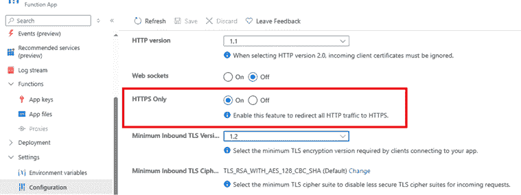

此外，您还可能希望通过为您的服务定义一个特定的证书来提高此传输层的安全性。在 Azure 中，您可以通过为您的应用程序定义一个域来实现这一点。

默认情况下，Azure 会向您提供一个由 Microsoft 创建的证书，其中使用的域是 azurewebsites.net。然而，您可以在 Azure 外部购买一个自定义域名，甚至在其内部，这将更容易管理。

自定义域名将代表您 Azure 账户的成本。您可以在[`learn.microsoft.com/en-us/azure/app-service/tutorial-secure-domain-certificate`](https://learn.microsoft.com/en-us/azure/app-service/tutorial-secure-domain-certificate)了解更多关于自定义域的详细信息。

与您需要保护传输层一样，您必须保护您的环境变量和机密。Azure 提供了三个服务来做到这一点。第一个被称为**Azure 管理标识**，它将允许您无需凭证即可访问 Azure SQL、Cosmos DB、Azure Storage 等数据。另一方面，如果您需要管理变量和机密，**Azure 密钥保管库**是存储客户端应用程序机密、连接字符串、密码、共享访问密钥和 SSH 密钥的正确服务。然而，访问 Azure 密钥保管库可能会对应用程序的启动造成性能问题。这就是为什么您应该使用**Azure 应用配置**来存储非机密，例如客户端 ID、端点和应用程序参数。

在保护数据时，您必须考虑数据库服务中数据加密的选项。例如，在 SQL 数据库中，可以使用**透明数据加密**设置。

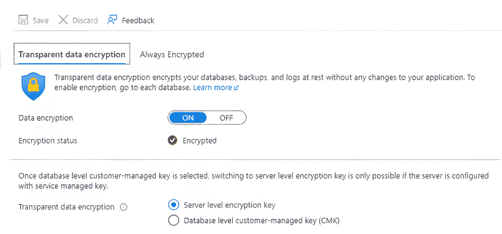

图 10.2：透明数据加密设置

使用此设置，您将防止被盗数据库文件在您的不同服务器上恢复的情况。除此之外，通常数据库服务器也有**防火墙规则**，这将限制对它们的直接访问，这是防止数据库服务器暴露在公共云中的非常重要的方法。

## 认证和授权

在创建应用程序时，了解将访问它的角色至关重要。为此，您必须提供一个**认证**方法，即验证用户或系统身份的过程，确保请求访问的实体确实是其所声称的身份。为此，您必须使用密码、令牌或生物识别数据等凭证。

一旦您识别了用户或系统，还有一个过程将允许这个角色访问您正在设计的系统中的资源或执行活动。使这成为可能的过程被称为**授权**。

有一些替代方案可以提供认证和授权。我们将在这个主题中讨论其中的三个：**JSON Web Tokens (JWTs**)、OAuth 2.0 和 OpenID Connect。它们是提供对网站和 API 访问的有用技术，为您的系统设计提供安全保障。

### JSON Web Tokens

JSON Web Token (JWT)通过使用一个编码的 JSON 对象（称为令牌），以紧凑和无状态的方式在 HTTP 头中传输，从而在客户端和服务器之间实现安全性。令牌由服务器在验证请求者的身份时创建。授权是为了确保请求者可以访问资源。JWT 符合行业标准 RFC 7519。

本章提供的代码将向您展示如何使用.NET 实现 JWT。值得注意的是，此代码尚未准备好使用，因为认证方法尚未解决。

```cs
public class JWT
{
  // Private field to store the JWT token
  private JwtSecurityToken token;
  // Internal constructor to initialize the JWT with a given token
  internal JWT(JwtSecurityToken token)
  {
    this.token = token;
  }
  // Property to get the expiration date and time of the token
  public DateTime ValidTo => token.ValidTo;
  // Property to get the string representation of the token
  public string Value => 
    new JwtSecurityTokenHandler().WriteToken(this.token);
}
internal class JWTBuilder 
{
  public JWT  Build() // Method to build the JWT. JWT is an object 
{
    var claims = new List<Claim> // Creating a list of claims
    {
       new Claim(JwtRegisteredClaimNames.Sub,this.subject), 
       new Claim(JwtRegisteredClaimNames.Jti, Guid.NewGuid().ToString()) 
    }.Union(this.claims.Select(item => new Claim(item.Key, item.Value))); 
    var token = new JwtSecurityToken( 
      issuer: this.issuer, 
      audience: this.audience, 
      claims: claims, 
      expires: DateTime.UtcNow.AddMinutes(expiryInMinutes), 
      signingCredentials: new SigningCredentials( 
        this.securityKey, 
        SecurityAlgorithms.HmacSha256) 
    );
    return new JWT(token);
  }
} 
```

`JWTBuilder`类中的`Build`方法负责根据在构建器中配置的属性和声明构建 JWT。一个`List<Claim>`初始化为两个默认声明：（1）`sub`（主题），代表令牌的主题；（2）`jti`（JWT ID），令牌的唯一标识符，使用`Guid.NewGuid()`生成。使用**Union**将声明字典中的额外声明附加。字典中的每个键值对都转换为 Claim 对象。使用以下参数创建一个`JwtSecurityToken`对象：

+   **发行者**: 发行令牌的实体。

+   **受众**: 令牌的预期接收者。

+   **声明**: 之前创建的声明列表。

+   **过期时间**: 过期时间，计算方式为当前 UTC 时间加上配置的`expiryInMinutes`。

+   **签名凭证**: 指定如何签名令牌。它使用提供的`securityKey`和`HmacSha256`算法。

该方法将`JwtSecurityToken`封装在一个自定义的`JWT`对象中，并返回它。`JWT`类提供了额外的属性，如`ValidTo`（过期时间）和`Value`（令牌的字符串表示）。

一旦客户端请求者收到令牌，它就可以封装在以下对服务器的请求中，作为使用前缀**Bearer**的授权头信息。当服务器接收到此头信息时，它实现中间件软件来分析请求是否适合请求者。它的好处是，如果请求路径受到 JWT 过程的保护，并且发送的请求没有适当的令牌，则请求不会到达服务器进行处理，只会被中间件处理。

在本章展示的示例中，您将找到两个 API。第一个 API 为您提供令牌用于使用。第二个 API 是当您使用.NET 创建 API 应用时通常可用的 WeatherForecast API。为了更好地使用示例，实现了 Swagger 文档。

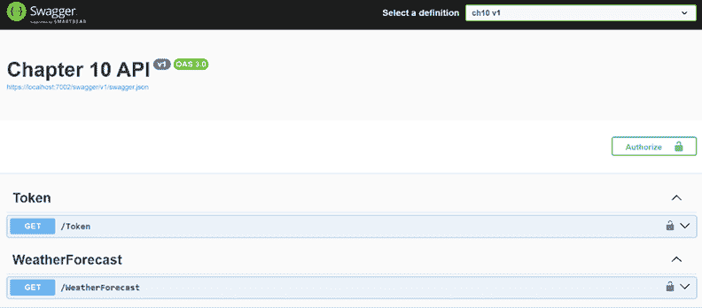

图 10.3：JWT Swagger 实现

如果你尝试在没有提供 Bearer 令牌的情况下运行 WeatherForecast API，响应将被拒绝，返回 401 错误代码，这意味着未授权。另一方面，如果你使用 Token API 生成所需的令牌，并使用 Swagger 界面中可用的锁形图标进行授权，API 的结果将被正确地交付。

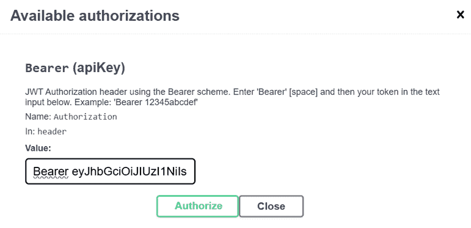

图 10.4：定义 Bearer 令牌

注意提供的令牌遵守 JWT 标准，可以在 jwt.io 网页上检查，确认你在解决方案中定义的内容。

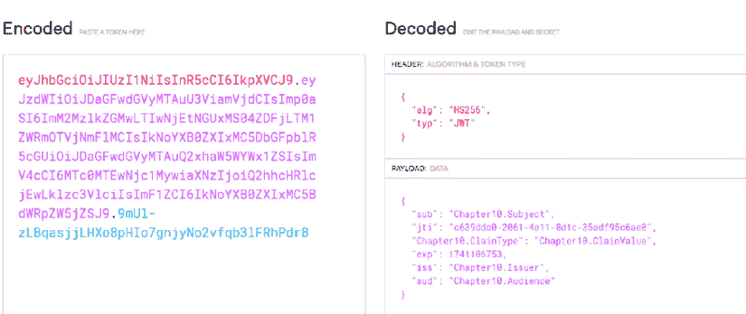

图 10.5：在 jwt.io 网页上解码 JWT

根据提供的示例，你可以考虑 JWT 作为实现**授权**标准方法的良好方式。

### OAuth 2.0 和 OpenID Connect (OIDC)

OAuth 2.0 是一个开放标准，允许第三方提供者授予应用程序访问用户资源的**授权**，而不暴露其凭证。有许多优秀的提供者允许你使用这项技术，例如 Google、Microsoft、Facebook 和 GitHub。

现在对于企业来说，使用密码进行登录认证被认为风险太大。除此之外，通过 API 传输这类数据也非常危险，考虑到我们目前需要应对的潜在网络攻击。因此，**OpenID Connect (OIDC)** 是一个很好的认证选项，因为它允许确认用户的存在而不暴露密码。

要做到这一点，有三个重要的事情需要考虑。首先，这也是一个开放标准，这意味着我们有很多服务器提供这项服务。其次，你需要考虑第三方服务的使用，因此必须考虑良好提供商的定义。第三，虽然不是最重要的，但 OIDC 是在 OAuth 2.0 之上实现的，这意味着，有了它，你将有一个完整的解决方案来认证和授权你的用户。

在.NET 中，我们有使用基于**Microsoft 身份验证库（MSAL）**的 OAuth 2.0 和 OIDC 的可能性。要使用 Azure 实现这一点，你首先需要在 Microsoft Entra ID 中注册一个应用。

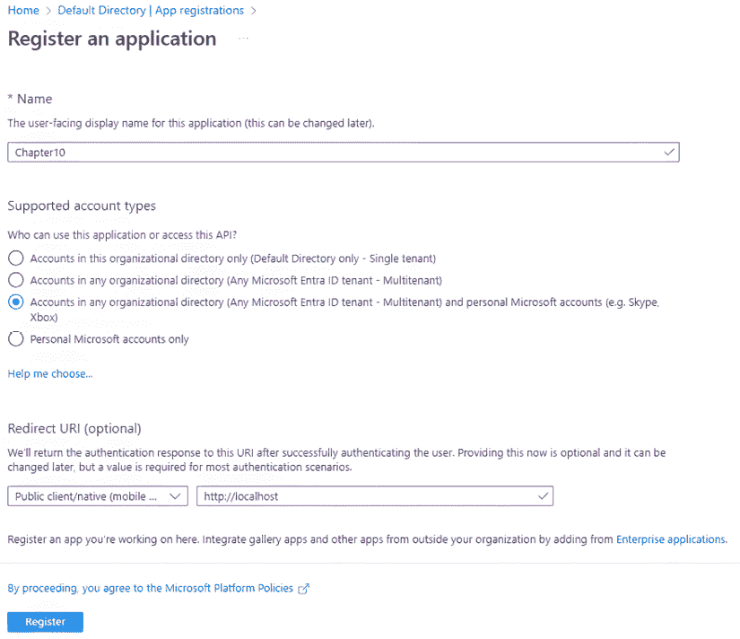

图 10.6：在 Microsoft Entra ID 中注册应用

根据你正在开发的项目类型，你将会有不同的方式来获取你想要的用户的认证。以下代码在一个控制台应用程序中根据一个将用户重定向到浏览器的提示获取用户配置文件。

```cs
private static async Task GetUserProfile()
{
  IPublicClientApplication clientApp = PublicClientApplicationBuilder
    .Create(clientId)
    .WithRedirectUri(redirectUri)
    .WithAuthority(AzureCloudInstance.AzurePublic, "common")
    .Build();
  var resultadoAzureAd = await clientApp.AcquireTokenInteractive(scopes)
    .WithPrompt(Prompt.SelectAccount)
    .ExecuteAsync();
  if (resultadoAzureAd != null)
  {
    // Print the username of the authenticated user
    Console.WriteLine("User: " + resultadoAzureAd.Account.Username);
  }
} 
```

结果将是需要使用 Microsoft 进行登录。在这种情况下，OIDC 使用 Microsoft Entra ID 作为提供者来识别用户。

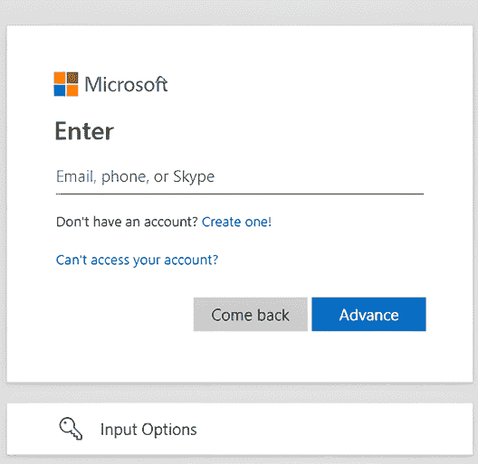

图 10.7：使用 Microsoft Entra ID 登录

一旦您登录，Microsoft 会询问您是否允许它与应用程序共享您的账户信息。

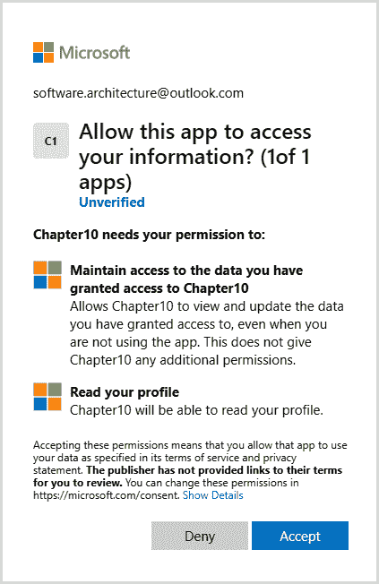

图 10.8：授权应用读取您的数据

使用这种方法有两个优点。第一个优点是您无需担心用户管理。这项管理将由 Microsoft Entra ID 负责，这意味着它将采用提供者的专业知识和经验进行集中和定制，甚至在不同的认证方式方面，如多因素认证。第二个优点，也是更重要的一点，是用户无需记住另一个账户，因为他们将使用他们在日常工作中已经使用的账户，这使得 OIDC 成为创建安全且用户友好的认证机制的热门选择。

## 保护依赖项

**开放式网络应用安全项目（OWASP）**是一个以非营利方式致力于提高软件安全性的基金会。他们最著名的倡议之一是“十大风险”列表，该列表展示了与您的软件相关的风险最高的情况。该列表指出了诸如注入攻击、认证失败、敏感数据泄露和安全配置错误等情况。

在开发解决方案时，使用有漏洞和过时的组件被认为是十大风险之一。库、框架和 API 在现代 Web 应用程序开发中发挥着重要作用，但如果管理不当，这些组件也可能将漏洞引入应用程序。使用第三方组件的决定可能会为攻击者提供利用应用程序的途径，可能导致数据泄露、未经授权的访问和其他安全事件。

考虑到.NET 环境，组件的使用总是与 NuGet 相关联。由于 NuGet 是包提供者，在 Visual Studio 中，检查您是否正在使用过时的库相当简单。

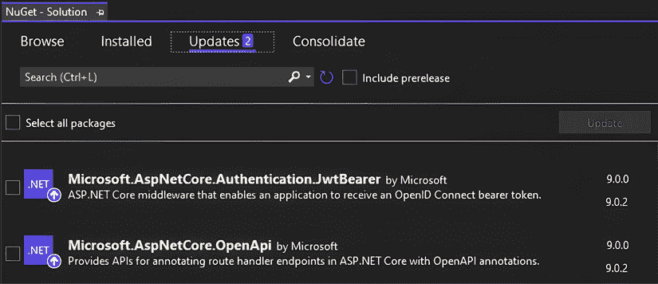

图 10.9：使用 NuGet 检查过时的库

另一方面，您必须意识到，在解决方案中不仅需要更新.NET 包。当涉及到微服务时，根据决定实施的方法，您将需要处理可能位于容器中或甚至位于管理解决方案容器的基础设施中的组件，并且这些应用程序的部分也必须持续检查，评估是否存在可能损害您的解决方案的漏洞。

如果你使用 GitHub 作为代码仓库，你可以考虑使用 **GitHub Dependabot** 作为工具，自动扫描你的 GitHub 项目中的过时依赖和已知漏洞，然后打开 PR 来更新它们。**Sonar** 和 **Sync** 是你可以在你的管道中考虑的其他工具，以防止第三方安全问题的发生。

CVE 程序（[`www.cve.org/`](https://www.cve.org/））的目的就是帮助我们。CVE 代表通用漏洞和暴露，它是一份公开披露的计算机安全问题列表。

# Kubernetes 和 Azure 容器应用安全

编排器的安全有两层含义：一方面，我们有用户访问安全，另一方面，我们有网络安全。在这里，我们指的是编排器的用户，而不是编排器托管的应用程序的用户，即开发者、管理员和其他维护编排器安装及其应用程序的操作员。

应用程序用户的安全由应用程序本身通过通常的 Web 应用程序工具来保障，这些工具并非专为微服务定制，即安全令牌，如认证 cookies 和携带令牌，用户声明，角色和授权策略。

编排器网络安全是指用于隔离同一集群中运行的不同应用程序以及同一应用程序的不同部分的编排器工具。

本节讨论了 Kubernetes 和 Azure 容器应用的编排器用户访问安全和网络安全，每个都在专门的子节中。让我们从 Kubernetes 网络安全开始。

## Kubernetes 网络安全

Kubernetes 网络安全通过在更高层次的软件实体（如 Kubernetes Pods 和命名空间）上施加约束，丰富了基于 IP 的防火墙规则。

因此，例如，我们可以通过将它们放置在两个不同的命名空间中并禁止这两个命名空间之间的任何通信，来隔离同一 Kubernetes 集群中运行的两个应用程序。

我们还可以在作为命名空间实现的“军事化区域”中运行敏感的微服务，该命名空间仅暴露少量 **过滤 Pods** 以进行外部通信。这样，**过滤 Pods** 可以在将传入通信路由到必须处理它们的微服务之前查找适当的凭证和潜在威胁。

基于 Pods 和命名空间的网络规则比基于 IP 地址的规则更模块化和灵活，因为它们直接约束应用层实体，而不是与硬件相关的实体。

网络安全规则是通过以下 `.yaml` 定义的 **NetworkPolicy** 资源来定义的：

```cs
apiVersion: networking.k8s.io/v1
kind: NetworkPolicy
metadata:
  name: example-network-policy
  namespace: example-namespace
spec:
  podSelector:
    matchLabels:
      myLabel: matValue
      myLabel1: matValue1
  policyTypes: # may be either Ingress, or Egress or both
  - Ingress 
  - Egress
  ingress:
  - from:
      ….
  egress:
  - to:
    ---- 
```

该策略适用于由 `podSelector` 选定的所有与 **NetworkPolicy** 资源处于同一命名空间的 Pods。

如果`policyType`包含`Ingress`项，则策略通过必须在`ingress`部分列出的规则来约束输入通信。如果`Ingress`未列在`policyType`中，则必须省略`ingress`部分。

如果`policyType`包含`Egress`项，则策略通过必须在`egress`部分列出的规则来约束输出通信。如果`Egress`未列在`policyType`中，则必须省略`egress`部分。

从/到每个 Pod 的通信必须满足所有选择它的**NetworkPolicy**资源通过其`podSelector`指定的约束。

每个`from`部分选择可能的通信源，这些源的总和等于所有其他`from`部分选择的通信源。类似地，每个`to`部分选择可能的通信目的地，这些目的地的总和等于所有其他`to`部分选择的通信目的地。

每个`from`和每个`to`包含一个必须由允许的源或目的地**全部**满足的约束列表。可以添加三种类型的约束：

+   IP 地址的约束：

    ```cs
    - ipBlock:
            cidr: 172.17.0.0/16
            except:
            - 172.17.1.0/24 
    ```

+   选择**NetworkPolicy**资源相同命名空间 Pod 的选择器表达式：

    ```cs
    - podSelector:
          matchLabels:
          podlabel1: podvalue1 
          … 
    ```

+   选择器表达式，用于选择其他允许的命名空间：

    ```cs
    - namespaceSelector:
          matchLabels:
            namespacelabel1: namespacevalue1
            … 
    ```

如果您只想与所选命名空间的一些 Pod 进行通信，您也可以在`namespaceSelector`基于的项内部嵌套一个`podSelector`，如下所示：

```cs
- namespaceSelector:
    matchLabels:
      namespacelabel1: namespacevalue1
  podSelector:
    matchLabels:
      podlabel1: podvalue1 
```

每个`from`和`to`也可以限制允许的通信到一个端口列表和端口范围，如下所示：

```cs
ports:
  - protocol: TCP
    port: 6379
   …
  - protocol: TCP
    port: 8000
    endPort: 9000 
```

如果项包含`port`和`endPort`，则指定一个端口范围。否则，如果只包含`port`，则指定单个端口。

这里是一个策略，它选择`mysample`命名空间的所有 Pod，并接受来自同一命名空间的所有 Pod 以及来自`mysafe`命名空间的所有 Pod 的流量：

```cs
apiVersion: networking.k8s.io/v1
kind: NetworkPolicy
metadata:
  name: example-network-policy
  namespace: mysample
spec:
  podSelector: {}
  policyTypes: 
  - Ingress 
  ingress:
  - from:
    - podSelector:{}
    - namespaceSelector:
      matchExpressions:
      - key: namespace
        operator: In
        values: ["mysafe"] 
```

这里是一个策略，它选择`mysample`命名空间的所有 Pod，并接受来自同一命名空间的所有 Pod 以及来自`mysafe`命名空间的所有 Pod 的流量，但仅限于端口 80：

```cs
apiVersion: networking.k8s.io/v1
kind: NetworkPolicy
metadata:
  name: example-network-policy
  namespace: mysample
spec:
  podSelector: {}
  policyTypes: 
  - Ingress 
  ingress:
  - from:
    - podSelector:{}
    - namespaceSelector:
      matchExpressions:
      - key: namespace
        operator: In
        values: ["mysafe"]
    ports:
    - protocol: TCP
      port: 80 
```

这里是一个策略，它允许`militarized-zone`命名空间的所有输入流量通过标记为`role: access-control`的 Pod：

```cs
apiVersion: networking.k8s.io/v1
kind: NetworkPolicy
metadata:
  name: access-control
  namespace: militarized-zone
spec:
  podSelector: 
    matchLabels:
      role: access-control
  policyTypes: 
  - Ingress 
  ingress:
  - from:
    - podSelector:{}
    - namespaceSelector:{} 
```

我们可以通过添加另一条规则，防止外部命名空间的所有流量到达其他所有 Pod，来强制所有流量仅通过带有`role: access-control`的 Pod：

```cs
apiVersion: networking.k8s.io/v1
kind: NetworkPolicy
metadata:
  name: access-control
  namespace: militarized-zone
spec:
  podSelector: 
    matchExpression:
    - key: role
      operator: NotIn
      values: ["access-control"]
  policyTypes: 
  - Ingress 
  ingress:
  - from:
    - podSelector:{} 
```

`NetworkPolicy`实体约束 Pod 之间的直接通信，即基于 Kubernetes 服务的通信。然而，由消息代理介导的通信会发生什么？

我们可以为每个我们想要隔离的命名空间使用不同的代理，这样我们就可以使用 `NetworkPolicy` 实体来限制对各种消息代理的访问。如果消息代理服务器运行在 Kubernetes 集群之外，我们可以使用 `NetworkPolicy` 规则来过滤消息代理的 IP 地址。否则，我们可以在它服务的相同命名空间中部署每个消息代理，这样它的 Pods 也受到相同的 `NetworkPolicy` 实体的约束，这些实体限制了微服务之间的直接通信。

如果我们使用单个消息代理集群，我们就被迫使用消息代理的内部授权策略来过滤对各种消息队列的访问。

Azure 容器应用具有更简单但功能较弱的网络安全。

## Azure 容器应用网络安全

要在 Azure 容器应用中配置网络安全，您必须使用自定义的 Azure **虚拟网络 (VNET)**。这一需求引入了特定的配置和配置文件的需求。设置通常遵循以下步骤：

1.  定义一个自定义的 Azure **VNet**。

1.  将 VNet 中的 **专用子网** 与每个 **容器应用环境** 相关联。

1.  将每个环境的 **子网** 分配给相应的 **应用程序**。

1.  在 VNet 子网上以 **防火墙规则** 的形式表达环境与应用之间的通信约束。

有关将自定义子网与环境和应用程序关联的详细指南，请参阅官方文档：[`learn.microsoft.com/en-us/azure/container-apps/networking?tabs=workload-profiles-env%2Cazure-cli`](https://learn.microsoft.com/en-us/azure/container-apps/networking?tabs=workload-profiles-env%2Cazure-cli)。

然而，这种方法有一些局限性。因为网络规则是使用基于 **IP 地址的约束** 定义的，而不是显式的软件级策略，结果是 **模块化程度降低** 和 **可扩展性有限**。这种模式可能适用于具有少量通信限制的小规模应用程序，但随着您的微服务生态系统的发展，这种方法可能会变得过于复杂。

如果您的系统通信是通过 **外部消息代理** 处理的，那么通过 **代理的授权策略** 管理访问将是一个更简单且更可扩展的解决方案，它可以控制哪些服务可以访问特定的消息队列。

## Kubernetes 用户安全

Kubernetes 用户安全基于四个概念：

1.  **用户**：这代表使用 Kubectl 登录的用户。每个用户都有一个唯一的用户名，并使用客户端证书进行身份验证。证书和用户名都必须添加到用户的 Kubectl 配置文件中，具体操作请参阅 *第八章* “与 Kubernetes 交互：Kubectl、Minikube 和 AKS” 部分的说明，*《使用 Kubernetes 的实用微服务组织》*。

1.  **用户组**: 每个用户组只是一个名称——一个可能与每个用户关联并插入其客户端证书的字符串。用户组简化了权限分配给用户的过程，因为每个特权可以分配给单个用户或整个用户组。

1.  **角色**: 每个角色代表一组权限。

1.  **角色绑定**: 每个角色绑定将一个角色（即一组权限）关联到多个用户和用户组。简单来说，角色绑定编码了角色与用户和用户组之间的一对多关系。

权限可以作用域到单个命名空间或整个 Kubernetes 集群。表示命名空间作用域权限的角色和角色绑定分别编码在 `Role` 和 `RoleBinding` Kubernetes 资源中，而表示集群作用域权限的角色和角色绑定分别编码在 `ClusterRole` 和 `ClusterRoleBinding` Kubernetes 资源中。

一个 `RoleBinding` 只能引用一个 `Role`，而一个 `ClusterRoleBinding` 只能引用一个 `ClusterRole`。以下是 `Role` 的定义：

```cs
apiVersion: rbac.authorization.k8s.io/v1
kind: Role
metadata:
  namespace: <namespace name> 
  name: <role name>
rules:
- apiGroups: [""] # "" indicates the core API group
  resources: ["pods"]
  verbs: ["get", "watch", "list"] # also "create", "update", "patch", "delete" 
```

每个 **Role** 都通过其名称和它应用的命名空间来识别。权限通过规则列表指定，其中每个规则包含：

+   `apiGroups`: 包含操作和涉及权限的资源 API。例如，Deployments 的 API 组是 “apps”，而 Pods 的 API 组是表示为空字符串的核心 API。API 组字符串对应于每个资源 `apiVersion` 属性中包含的 API 名称。每个规则可以指定多个 API 组。

+   `resources`: 可以用权限操作的资源名称（Pods、Deployments、Services 等）。

+   `verbs`: 允许在资源上执行的操作：

    +   `get`: 获取特定资源实例的信息。

    +   `watch`: 观察资源实例属性随时间变化。也就是说，在资源上使用 `–watch` 标志执行 `Kubectl get` 或 `Kubectl describe`。

    +   `list`: 在任何结果列表中列出资源。

    +   `create`: 创建资源的实例。

    +   `delete`: 删除资源的实例。

    +   `update`: 通过提供一个表示实例的新对象来更新资源实例。这是资源通过 `Kubectl apply` 更新的一个例子。

    +   `patch`: 使用 `Kubectl patch` 更新资源实例。在这种情况下，我们指定一个现有的资源，然后用 `-p` 选项中包含的值替换其属性。该属性也可以是一个复杂对象，在这种情况下，对象树中指定的属性将递归地替换现有值，而未在对象树中指定的属性将保持不变。以下是一个示例：

        ```cs
        kubectl patch pod <pod name> -p '{"spec":{"containers":[{"name":"kubernetes-serve-hostname","image":"new image"}]}}' 
        ```

这里有一个可能适合在 `my-app` 命名空间中运行的应用程序的开发者的角色示例：

```cs
apiVersion: rbac.authorization.k8s.io/v1
kind: Role
metadata:
  namespace: my-app
  name: developer-user-role
rules:
- apiGroups: ["", "apps"]
  resources: ["pods", "services", "configmaps", "secrets", "deployments", "replicasets"]
  verbs: ["get", "list", "watch", "create", "update", "delete"] 
```

所有 `apiGroups`、`resources` 和 `verbs` 都接受通配符字符串 “*”，它可以匹配所有内容。

`ClusterRole` 定义完全类似，唯一的区别是无需指定命名空间，并且将 `type: Role` 替换为 `type: ClusterRole`。

这里是 `RoleBinding` 的定义：

```cs
apiVersion: rbac.authorization.k8s.io/v1
kind: RoleBinding
metadata:
  name: <role binding name>
  namespace: <reference namespace>
subjects:
- kind: User # specific user
  name: jane # "name" is case sensitive
  apiGroup: rbac.authorization.k8s.io
- kind: Group #user group
  name: namespace:administrators  # "name" is case sensitive
  apiGroup: rbac.authorization.k8s.io
…
roleRef:
  # "roleRef" specifies the binding to a Role 
  kind: Role #this must be Role 
  name: <role-name> # this must match the name of the Role you wish to bind to
  apiGroup: rbac.authorization.k8s.io 
```

`RoleBinding` 包含一个名称和引用命名空间，并在其 `roleRef` 属性中指定它所绑定到的 `Role`。`subjects` 属性包含用户和用户组的列表，其中每个项目指定用户或组名称和主体类型。

这里是一个与之前看到的示例 `developer-user-role` `Role` 匹配的 `RoleBinding`，其中所有属于 `developers` 组的用户：

```cs
apiVersion: rbac.authorization.k8s.io/v1
kind: RoleBinding
metadata:
  name: developers-binding
  namespace: my-app
subjects:
- kind: Group
  name: developers
  apiGroup: rbac.authorization.k8s.io
roleRef:
  kind: Role
  name: developer-user-role
  apiGroup: rbac.authorization.k8s.io 
```

`ClusterBindingRole` 定义完全类似，唯一的区别是无需指定命名空间，`roleRef` 必须引用 `ClusterRole`，并且将 `type: BindingRole` 替换为 `type: ClusterBindingRole`。

客户端证书不需要由公共认证机构颁发，只需经过 Kubernetes 集群的批准。以下是创建批准证书的完整流程：

1.  作为第一步，你必须创建证书密钥。这可以通过打开 Linux 控制台并使用 **openssl** 来完成：

    ```cs
     openssl genrsa -out mynewuser.key 2048 
    ```

1.  你必须存储包含证书密钥的 `mynewuser.key` 文件，因为配置 Kubectl 配置文件需要它。

1.  现在，让我们提取证书批准请求中的公钥部分 `mynewuser.key`。同样，我们可以使用 **openssl** 来完成：

    ```cs
    openssl req -new -key mynewuser.key -out mynewuser.csr -subj "/CN= mynewuser /O=example:mygroup" 
    ```

1.  上述指令生成了 `mynewuser.csr` 文件，其中包含证书批准请求。`mynewuser` 必须替换为实际的用户名，而 `example:mygroup` 必须替换为你希望添加用户的用户组名称。

1.  现在，你必须将证书请求编码为 base 64：

    ```cs
    cat mynewuser.csr | base64 | tr -d "\n" 
    ```

1.  上述命令在 Linux 控制台中返回 base-64 编码的证书。请选择并复制它。你必须将其插入一个 `.yaml` 文件中，该文件编码了 Kubernetes 集群的批准请求：

    ```cs
    apiVersion: certificates.k8s.io/v1
    kind: CertificateSigningRequest
    metadata:
      name: mynewuserrequest
    spec:
      request: <base64 encoded csr>
      signerName: kubernetes.io/kube-apiserver-client
      expirationSeconds: <duration in seconds>
      usages:
      - client: auth 
    ```

1.  你必须更改的唯一字段是 `name`，即批准请求名称，以及 `expirationSeconds`，它包含证书有效期的秒数。

1.  现在让我们打开 Windows 控制台以与 Minikube 交互。如果 Minikube 尚未启动，请先启动它，然后使用以下命令传递之前的 .yaml 文件：

    ```cs
    Kubectl apply -f mynewuserrequest.yaml. 
    ```

1.  现在，我们可以使用以下命令批准证书：

    ```cs
    kubectl certificate approve mynewuserrequest 
    ```

1.  批准后，我们可以获取最终的 base 64 格式证书：

    ```cs
    kubectl get csr mynewuserrequest -o jsonpath='{.status.certificate}'> mytempfile.txt 
    ```

1.  最后，我们必须对 `mytempfile.txt` 进行 base 64 解码以获取二进制格式的证书。我们可以在包含 `mytempfile.txt` 的文件夹中打开 Linux 控制台，然后执行以下操作：

    ```cs
    cat mytempfile.txt | base64 -d > mynewuser.crt 
    ```

1.  现在，你可以使用 `mynewuser.key` 和 `mynewuser.crt` 来更新新用户的 Kubectl 配置文件，正如在 *第八章* “使用 Kubernetes 的实际微服务组织”部分的 *与 Kubernetes 交互：Kubectl、Minikube 和 AKS* 部分中所述。

作为练习，您可以使用上述过程定义一个属于`developers`用户组的新的 Minikube 用户，然后您可以使用我们之前定义的示例`developer-user-role Role`和`developers-binding RoleBinding`在`myapp`命名空间中分配开发权限。

就这些了！让我们继续讨论 Azure 容器应用的用户安全。

## Azure 容器应用用户安全

Azure 容器应用没有像 Kubernetes 那样的专用用户安全，而是使用 Azure 安全。可以通过 Azure 门户或使用 Azure CLI 通过以下命令将角色分配给特定用户：

```cs
az role assignment create `
--assignee <USER IDENTITY RESOURCE ID> `
--role <ROLE NAME> `
--scope <ENVIRONMENT OR APPLICATION_RESOURCE_ID> 
```

所有可用的角色都可以在 Azure 门户的环境和应用程序页面上进行检查。应用程序/环境资源 ID 和用户身份资源 ID 分别可在各自的页面上找到。

# 威胁检测和缓解

我们需要在应用程序中处理的大量威胁，OWASP，如前所述，帮助我们处理这些威胁。应用程序将需要处理许多常见的攻击，而仅仅保护其网络、数据、入口和依赖关系是不够的，以应对这些攻击。

## 威胁

在这种场景中最困难的一点是在应用程序运行时即时检测威胁。但为了检测它们，我们需要基本了解它们是什么，所以让我们在以下主题中检查一些常见的攻击。

### 事件注入

当攻击者操纵输入数据以在应用程序内执行未经授权的操作，导致数据泄露、服务中断或未经授权的访问时，我们面临事件注入攻击。

有几种缓解策略，包括验证和清理输入，确保严格的输入数据；使用强验证库，以定义已建立的库和框架连接；以及将用户权限限制在最低必要范围内。

### 权限提升

在具有不同访问级别的应用程序中，当攻击者获得超出其所需访问权限时，就会发生权限提升，访问他们未经授权使用的资源或功能。结果可能是灾难性的，可能导致未经授权的数据访问、完全的系统控制以及应用程序的进一步利用。

精细访问控制以限制用户必须得到良好实施。此外，还有可能使用**身份和访问管理（IAM）**解决方案，这将强制执行用户权限。定期的审计和**多因素认证（MFA）**也将有助于减轻可能出现的未经授权用户访问相关数据的情况。

### 拒绝服务（DoS）攻击

假设你的应用程序因攻击者想要破坏你解决方案的可用性，导致网站简单地停止响应，从而造成了大量且过度的流量。这就是我们所说的**拒绝服务（DoS）攻击**。DoS 攻击通常由单个攻击者从单一地点发起。如果你观察到攻击来源有多个，那么你可能正在经历 DDoS 攻击，这意味着攻击是分布式的。

显然，减轻此类攻击的主要方式是阻止其来源产生的流量，因此流量过滤可能是最佳选择。也有可能限制特定客户端在一定时间内的访问速率，以最小化 DDoS 攻击的影响。

此外，如果你有一个具有高度可用性的解决方案，专注于提供高水平的请求，你可以减少这种攻击的影响，尤其是如果我们谈论 DoS 攻击。因此，自动扩展策略，根据当前负载自动调整服务的活动实例数量，是一种很好的方法。**内容分发网络（CDN）**的实施，通过在多个地理位置分散的服务器上实现内容，将内容近似到使用它的人，也可以是保护此类攻击的好方法。

### 中间人（MitM）攻击

当你在系统的两个部分之间拦截通信，篡改数据时，就会发生**中间人（MitM）攻击**，这可能导致你提供的解决方案中信息不一致。

正如我们之前检查的那样，实施安全的通信通道，使用加密协议来保护传输中的数据，无疑是降低此类威胁风险的最佳方式。认证机制也可以在这方面提供帮助，特别是如果有一种方法可以验证通信方的身份。

### 代码注入

软件代码当然是在应用程序中造成攻击的一种方式，尤其是如果代码允许注入恶意代码。恶意代码可以添加到 SQL 命令中，这些命令没有正确限制在数据库中执行的内容，从而可能导致泄露、更改或甚至数据排除。在应用程序允许执行脚本的情况下，风险也很高，由于这个原因可能会发生未经授权的操作。你也可能遇到攻击者将代码注入到其他用户查看的网页中的情况。这被称为**跨站脚本（XSS）**。

在软件对业务至关重要的企业中，实施严格的代码审查流程，应用安全的编码实践是强制性的。为了帮助实现这一点，必须考虑使用静态分析工具，这取决于公司每天生成的代码量。

## 使用 Web 应用程序防火墙进行检测和缓解

既然您现在了解了可用的威胁数量，那么可以说，没有一种工具可以监控整个流量、根据不同的已知威胁进行检查并在您发现可疑内容时提醒您采取行动，您就无法完全免受这些威胁的保护。这正是**Web 应用防火墙（WAF）**所做的事情。

SQL 注入、XSS 和其他常见的 Web 攻击可以通过 WAF 处理，因此您必须考虑它们的使用对于确保无服务器和微服务应用程序的安全性至关重要。这仅因为 WAF 通常监控 HTTP/HTTPS 流量，让您有机会阻止来自特定客户端的恶意请求，甚至在它们到达您的应用程序之前。

他们还提供了一个用于监控流量和日志记录的集中式面板，这确实简化了管理并增加了您对所遭受攻击的了解。重要的是要提到，如果您正在运行公共云解决方案，您将不断受到攻击。

微软提供的作为 WAF（Web 应用防火墙）的服务称为 Azure Web 应用防火墙。值得注意的是，Azure WAF 在 OSI 模型第 7 层（应用层）工作，并分析 HTTP(S)流量。为此，需要检查通过通道传输的请求和响应。这个通道的替代方案之一被称为 Azure 应用网关。该组件是一个工作在 OSI 第 7 层的网络流量负载均衡器。它使您能够管理您的 Web 应用的流量。所有被检查的表明存在威胁的流量都会作为警报发送到 Azure Monitor，以便应用程序管理员可以分析它并采取行动。

如您所想象，一个监控您应用程序全部流量的解决方案在预算方面显然是一个问题。因此，这当然是一个关于投资和必须分析的权衡点的讨论。

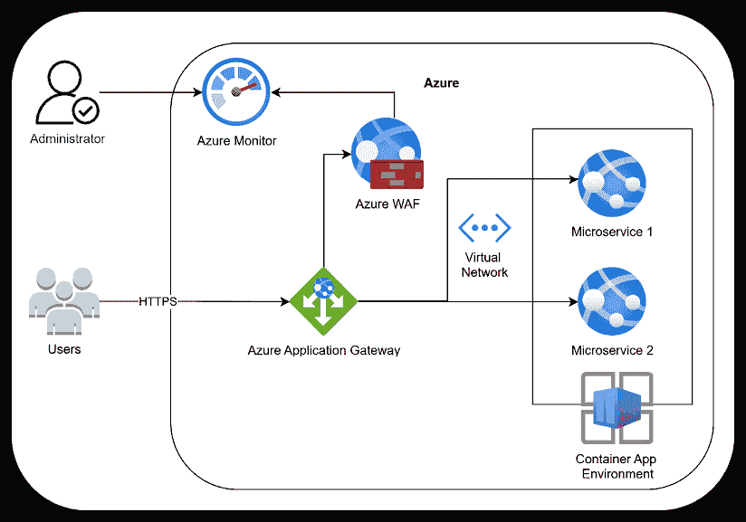

图 10.10：启用 WAF 的示例解决方案架构

上述图表示的是使用本主题中描述的组件的解决方案架构。如您所见，普通用户通过 HTTPS 访问系统，Azure 应用网关处理流量路由，Azure WAF 保护解决方案免受 Web 威胁。还有使用容器进行工作负载扩展的容器应用环境实现，微服务运行在虚拟网络内部。Azure Monitor 用于系统的日志记录和可观察性，因此管理员访问 Azure Monitor 用于洞察。可观察性正是我们将要讨论的下一个主题。让我们看看它。

# 无服务器和微服务的可观察性

就像我们在本书的这一部分所看到的那样，分布式系统包含的复杂性带来了一些你无法忽视的问题。单个微服务的实现，使用如无服务器或容器化等技术，通常相当简单，但观察整个解决方案是一项困难的任务，这无疑是这些关注点之一。采用可观测性概念是解决这个问题的好方法。

可观测性由三个主要信号定义：日志、指标和跟踪。日志是一个事件不可变、带时间戳的记录。指标是系统性能随时间变化的数值表示。跟踪代表请求在分布式系统中跨越服务的旅程。这三个信号共同提供了对系统行为的洞察，使得主动维护和快速故障排除成为可能。

与传统的监控方式不同，传统的监控通常关注预定义的指标和系统健康指标，并且通常是反应式的，而可观测性则主张一种主动的方法，监控是持续的，以避免关键问题，快速定位根本原因是目标。

有几种工具可以帮助在分布式系统中实现可观测性。对于日志，Seq 和 ELK Stack 等工具提供了强大的日志聚合和可视化功能。对于指标，Prometheus 是一个广泛使用的开源监控解决方案，通常与 Grafana 配合使用进行可视化。对于分布式跟踪，Jaeger 和 Zipkin 是流行的开源选项。

然而，应用程序性能监控（APM）工具，如 Azure Monitor、Datadog 和 New Relic，允许你将日志、指标和跟踪集中在一个地方，提供系统行为的全面视图。选择它们取决于你的基础设施、云提供商和集成需求。

让我们详细了解可观测性的每个信号，以便更容易理解。

## 日志

丰富的上下文数据对于理解在分布式系统中问题监控开始的确切位置和时间至关重要。例如，了解服务调用的顺序以及它们之间传递的数据可以揭示错误是否来自特定的服务或来自服务之间的交互。这种详细程度对于有效的调试和确保分布式系统的弹性和可靠性至关重要。

因此，为了提高日志的可使用性，采用一种易于查询和处理的格式至关重要。最常见的方法之一是使用 JSON 作为日志条目的格式，因为它提供了可读性和跨系统的广泛兼容性。然而，结构化日志不仅仅使用结构化格式。它需要有意定义每个日志字段的含义（语义）。这确保了一致性，提高了可观测性，并使得日志之间的过滤、索引和关联更加有效。

此外，有效的日志记录需要使用不同的日志类别来定义日志条目的严重性和重要性。

+   调试：用于技术内部目的的详细信息。

+   信息：关于应用程序的一般信息。

+   警告：可能表明潜在问题，但并未导致应用程序停止的警报。

+   错误：影响应用程序运行并需要分析的问题。

+   致命：导致应用程序终止的严重错误。

正确使用日志级别可以最小化分析问题的努力，以有效和高效的方法关注关键问题。

## 指标

当涉及到需要监控和评估的无服务器和微服务架构的指标时，有一些特定的指标可以监控。

例如，Azure Functions 测量一个函数从开始到结束的执行时间。这被称为**函数执行时间**。较短的执行时间通常表明更好的性能。

Azure Functions 还会测量无服务器函数被触发到函数实际上开始运行之间的延迟。这被称为**冷启动**，减少它会导致用户体验的改善。

**调用次数**和**错误次数**也说明了函数的工作情况，有助于性能分析和可能存在问题的代码的分析。

另一方面，当你有容器化环境时，**CPU**和**内存使用**可能是需要监控的良好指标。第一个如果过高可能会影响性能，可能需要考虑扩展。第二个也可能影响性能，并且可以解决内存泄漏的原因。

**网络流量**在容器化环境中也可能是一个关注点，并可能表明与微服务之间通信相关的问题。**Pod 健康**有助于识别失败的或不健康的 Pod。

这些以及其他指标不仅可以被监控，还可以使用基于**阈值**的算法和警报进行警报。今天，在 Azure 中，我们也有一些由机器模型执行的**异常检测**，通常检测某些情况下的行为偏差，如时间响应。

一旦设置了适当的警报，制定一个明确的响应这些警报的协议也很重要。这通常被称为**事件响应流程**。该流程需要确定如何处理事件（警报），如何沟通，以及如何发现根本原因，以确保事件不再发生。

## 跟踪

当你有一个分布式应用程序时，理解从请求到其结束的完整路径对于有效地诊断跨链式微服务的情况非常重要。这就是为什么跟踪如此重要的原因，而.NET 应用程序与 Azure 一起提供了一套非常好的库来帮助你完成这项工作。

在这里使用 Azure Monitor 对于成功至关重要。当然，还有其他 APM 系统可以用来观察应用程序的可追溯性，但 Azure Monitor 为我们提供了您可能考虑使用的设施。除此之外，`OpenTelemetry`库将为您提供企业解决方案所需的灵活性。OpenTelemetry（OTel）是一个跨平台、开放标准，用于收集和发射遥测数据。

在.NET 中，OpenTelemetry 实现使用众所周知的平台 API 进行仪表化：

+   `Microsoft.Extensions.Logging.ILogger<TCategoryName>` 用于日志记录

+   `System.Diagnostics.Metrics.Meter` 用于指标

+   `System.Diagnostics.ActivitySource` 和 `System.Diagnostics.Activity` 用于分布式跟踪

这些 API 由 OTel 用于收集遥测数据并将这些数据导出到开发者选择的 APM 服务。

还要注意，使用 OTel 为.NET 和 Azure Monitor 实现跟踪传播是全自动的，这加速了在 Azure Monitor 中观察应用程序行为的进程。

## 使用 Azure Monitor 实现集中可观察性

以下示例将向您展示 Azure Monitor 作为 APM 系统在集中日志记录、指标和跟踪方面的强大功能，作为一个专业的可观察性工具，加速诊断并允许快速故障排除，实现主动管理。

在启动程序中提供的代码使用 Azure Monitor 来注册由`OpenTelemetry`库收集的遥测数据，正如我们在这里所看到的：

```cs
var builder = WebApplication.CreateBuilder(args);
// Retrieve Application Insights connection string from configuration
string appInsightsConnectionString = builder.Configuration[
  "AzureMonitor:ConnectionString"];
builder.Services.AddOpenTelemetry()
  .WithTracing(tracerProviderBuilder =>
  {
    tracerProviderBuilder
      // Set resource builder with application name
      .SetResourceBuilder(
        ResourceBuilder.CreateDefault().AddService(
          builder.Environment.ApplicationName))
      // Add ASP.NET Core instrumentation
      .AddAspNetCoreInstrumentation()
      // Add HTTP client instrumentation
      .AddHttpClientInstrumentation()
      // Add Azure Monitor Trace Exporter with connection string
      .AddAzureMonitorTraceExporter(options =>
      {
        options.ConnectionString = appInsightsConnectionString;
      });
  });
// Add Application Insights only for logging & metrics 
// (without re-adding tracing)
builder.Services.AddApplicationInsightsTelemetry(options =>
{
  options.ConnectionString = appInsightsConnectionString;
  // Disable AI's automatic trace sampling
  options.EnableAdaptiveSampling = false; 
  // Prevents duplicate dependency tracking
  options.EnableDependencyTrackingTelemetryModule = false; 
  // Prevents duplicate HTTP request tracking
  options.EnableRequestTrackingTelemetryModule = false; 
});
var app = builder.Build(); 
```

同一段代码有两个 API。这些 API 将通过另一条路径获取数据，但其中之一将尝试访问一个未知的 URL。

```cs
// Map GET request to /error endpoint
app.MapGet("/error", async (HttpContext context) =>
{
  var httpClient = new HttpClient();
  var response = await httpClient.GetAsync(
    "https://anyhost.sample.com/data");
  return "Hello Trace!";
}); 
```

注意，与成功端点一起工作的 API 将尝试访问 Packt 网站。

```cs
// Map GET request to /success endpoint
app.MapGet("/success", async (HttpContext context) =>
{
  var httpClient = new HttpClient();
  var response = await httpClient.GetAsync("https://www.packtpub.com/");
  return "Hello Trace!";
}); 
```

两个结果都令人印象深刻。第一个结果表示带有错误的端点可以在 Azure Monitor 端到端事务视图中完全跟踪。

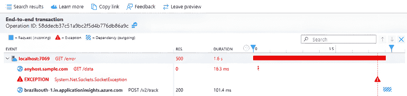

图 10.11：Azure Monitor 端到端事务视图中带有错误的端点

这种监控对于检测此端点错误，便于修复此错误非常有用。

第二个结果也很有趣，因为它检测到一个可以改善请求性能的重定向。

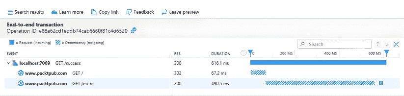

图 10.12：Azure Monitor 端到端事务视图中成功结果的端点

这里的问题是每个调用只需 67.2 毫秒就能重定向到所需的页面。也许一个替代方案是直接访问正确的 URL。我们需要将这个例子视为一个假设情况，但在现实世界中，这可以提高应用程序的性能。

# 摘要

在本章中，我们有机会讨论无服务器和微服务应用程序的安全和可观察性策略。我们需要理解，网络犯罪带来的威胁增加促使我们在产品开发的初始阶段就整合安全。为此，我们必须在我们的安全设计方法中应用数据库的安全最佳实践，实施如**JSON Web Tokens (JWTs)**、OAuth 2.0 和**OpenID Connect (OIDC)**等身份验证和授权机制，并使用如**虚拟私有云 (VPCs)**和 Azure Private Link 等网络保护方法。加密、强制 HTTPS 和使用 Azure Key Vault 管理密钥对于现代应用程序开发也很重要。

本章的另一个重点是网络安全，尤其是在 Kubernetes 和 Azure Container Apps 环境中。因此，本章解释了 Kubernetes 网络策略如何通过使用命名空间和基于 Pod 的网络规则来隔离应用程序和服务，从而增强安全性。Azure 的网络安全策略涉及虚拟网络、防火墙和私有链接，以限制对公共威胁的暴露。本章还讨论了用户安全，强调了 Kubernetes 和 Azure 的角色分配中的基于角色的访问控制（RBAC）。它还通过确保第三方组件、库和容器定期更新以防止漏洞来讨论保护依赖项。

本章还强调了威胁检测的重要性，使用网络应用防火墙（WAFs）和主动安全策略来减轻注入攻击、拒绝服务（DoS）攻击和权限提升等威胁。

最后，可观察性是本章提出的另一个关键主题，它通过三个主要信号来定义：日志、指标和跟踪。本章解释了如何通过按严重程度分类的结构化日志来有效地诊断问题。它还涵盖了无服务器函数和容器化应用程序的关键性能指标，例如执行时间、资源消耗和错误率。包括 OpenTelemetry 和 Azure Monitor 在内的跟踪技术被提出作为跟踪分布式事务和增强系统监控的解决方案。

# 问题

1.  **为什么与单体应用程序相比，安全在无服务器和微服务架构中是一个关键关注点？**

在无服务器和微服务架构中，安全更为关键，因为它们显著扩大了攻击面。与单体应用程序不同，分布式系统涉及多个独立服务通过网络进行通信，这增加了网络攻击的潜在入口点。每个微服务、API 或功能可能会暴露漏洞，而管理它们之间的安全性的复杂性需要更全面和分层的方法。

1.  **应用程序中的关键安全层有哪些，为什么“洋葱模型”是一个有用的类比？**

安全的关键层包括：

+   数据安全（例如，加密、安全数据库访问）

+   应用程序安全（例如，认证和授权）

+   第三方组件（例如，库更新）

+   基础设施和网络安全（例如，VPCs、防火墙）

+   流量拦截和监控（例如，WAFs）

“洋葱模型”之所以有用，是因为它强调安全必须在多个同心层中实现。每一层都加强了其他层，减少了单点故障的可能性。

1.  **虚拟私有云（VPC）如何提高云环境中的安全性，以及它的主要好处是什么？**

VPC 在公共云中创建一个逻辑上隔离的网络，允许您定义自定义子网、路由规则和网关。主要好处包括：

+   减少对公共威胁的暴露

+   精细流量控制

+   与 Azure Private Link 等服务集成

+   通过网络安全组和流量日志增强监控和保护

1.  **认证和授权之间的区别是什么，以及一些常用的认证机制有哪些？**

    +   **认证**是验证用户或系统身份的过程。

    +   **授权**决定了经过身份验证的用户可以执行的操作。

    +   常见的机制包括：

        +   JSON Web Tokens (JWTs)

        +   OAuth 2.0

        +   OpenID Connect (OIDC)

1.  **JSON Web Token (JWT)如何确保客户端和服务器之间的安全通信？**

JWT 通过 HTTP 头部传输一个签名 JSON 对象来编码用户声明。在身份验证成功后，服务器发放一个令牌。然后客户端在后续请求中包含这个令牌。服务器端的中间件在允许访问之前验证令牌。JWT 的无状态和签名特性有助于确保消息完整性和安全的访问控制。

1.  **Kubernetes 中用于处理网络安全的资源有哪些？**

Kubernetes 使用以下方式处理网络安全：

+   用于隔离应用程序的命名空间

+   具有特定标签和规则的 Pod

+   根据以下内容定义入站/出站规则的 NetworkPolicy 资源：

    +   IP 块

    +   Pod 选择器

    +   命名空间选择器

    +   端口和协议

这些策略以模块化、以应用程序为中心的方式约束服务之间的通信。

1.  **Kubernetes 中用于处理用户安全性的资源有哪些？**

Kubernetes 中的用户安全通过以下方式管理：

+   用户和组

+   角色和角色绑定（命名空间范围）

+   集群角色和集群角色绑定（集群范围）

通过动词（获取、列出、创建、删除等）定义权限，并通过角色绑定绑定到用户/组。认证通常使用客户端证书。

1.  **Azure 容器应用是否有针对用户和网络安全的特定设施？**

是的：

+   网络安全通过 Azure 虚拟网络和子网来处理。

+   用户访问通过 Azure 基于角色的访问控制（RBAC）进行管理，其中角色通过 Azure 门户或 CLI 分配给用户。

+   Azure 没有像 Kubernetes 那样的专用用户安全模型，而是依赖于更广泛的 Azure 身份平台。

1.  **常见的网络威胁有哪些，例如权限提升和拒绝服务攻击，以及可以用来减轻它们的影响的策略有哪些？**

常见威胁：

+   **事件注入**: 通过输入验证/清理来缓解。

+   **权限提升**: 通过细粒度访问控制、IAM 解决方案、审计和多因素认证来缓解。

+   **DoS/DDoS 攻击**: 通过速率限制、流量过滤、自动扩展和 CDNs 来缓解。

+   **中间人攻击**: 通过 HTTPS/TLS 加密和身份验证来缓解。

+   **代码注入**（例如，SQL 注入，XSS）：通过安全编码实践、静态分析和 WAFs 来缓解。

1.  **Web 应用防火墙（WAFs）在保护微服务应用中扮演什么角色，它们的主要优势是什么？**

WAFs 监控和过滤 HTTP/HTTPS 流量，在恶意请求到达应用程序之前将其阻止。优势包括：

+   防御已知的网络漏洞（例如，SQL 注入，XSS）

+   集中式日志记录和警报（例如，通过 Azure Monitor）

+   能够阻止特定客户端

+   简化的安全管理

Azure 的 WAF 与 Application Gateway 集成，并在 OSI 第 7 层运行。

1.  **可观测性的三个主要信号是什么，它们如何有助于维护一个安全且高效的系统？**

三个主要信号是：

+   **日志**: 不可变的事件记录，有助于调试和审计。

+   **指标**: 定量性能指标（例如，执行时间，内存使用）。

+   **追踪**: 可视化服务间的请求路径，以进行根本原因分析。

它们共同允许主动监控，帮助检测异常，并支持快速事件响应——这对于安全且弹性的系统至关重要。

# 进一步阅读

+   Azure 容器应用网络: [`learn.microsoft.com/en-us/azure/container-apps/networking?tabs=workload-profiles-env%2Cazure-cli`](https://learn.microsoft.com/en-us/azure/container-apps/networking?tabs=workload-profiles-env%2Cazure-cli).

+   购买自定义域名: [`learn.microsoft.com/en-us/azure/app-service/manage-custom-dns-buy-domain`](https://learn.microsoft.com/en-us/azure/app-service/manage-custom-dns-buy-domain)

+   存储应用程序密钥: [`learn.microsoft.com/en-us/samples/azure/azure-sdk-for-net/app-secrets-configuration/`](https://learn.microsoft.com/en-us/samples/azure/azure-sdk-for-net/app-secrets-configuration/)

+   透明数据加密: [`learn.microsoft.com/en-us/sql/relational-databases/security/encryption/transparent-data-encryption`](https://learn.microsoft.com/en-us/sql/relational-databases/security/encryption/transparent-data-encryption)

+   JSON Web Tokens: [`jwt.io/`](https://jwt.io/)

+   OAuth 2.0: [`oauth.net/`](https://oauth.net/)

+   MSAL: [`learn.microsoft.com/en-us/entra/identity-platform/msal-overview`](https://learn.microsoft.com/en-us/entra/identity-platform/msal-overview)

+   什么是 OIDC？: [`www.microsoft.com/en-us/security/business/security-101/what-is-openid-connect-oidc`](https://www.microsoft.com/en-us/security/business/security-101/what-is-openid-connect-oidc)

+   OIDC: [`openid.net/`](https://openid.net/)

+   OWASP: [`owasp.org/`](https://owasp.org/)

+   Azure Private Link: [`learn.microsoft.com/en-us/azure/private-link/private-link-overview`](https://learn.microsoft.com/en-us/azure/private-link/private-link-overview)

+   网络安全组: [`learn.microsoft.com/en-us/azure/virtual-network/network-security-groups-overview`](https://learn.microsoft.com/en-us/azure/virtual-network/network-security-groups-overview)

+   虚拟网络流量日志: [`learn.microsoft.com/en-us/azure/network-watcher/vnet-flow-logs-overview`](https://learn.microsoft.com/en-us/azure/network-watcher/vnet-flow-logs-overview)

+   Azure 虚拟网络: [`learn.microsoft.com/en-us/azure/virtual-network/virtual-networks-overview`](https://learn.microsoft.com/en-us/azure/virtual-network/virtual-networks-overview)

+   Azure 管理标识: [`learn.microsoft.com/en-us/entra/identity/managed-identities-azure-resources/overview`](https://learn.microsoft.com/en-us/entra/identity/managed-identities-azure-resources/overview)

+   Azure 防火墙: [`learn.microsoft.com/en-us/azure/firewall/overview`](https://learn.microsoft.com/en-us/azure/firewall/overview)

+   Azure Web 应用程序防火墙: [`azure.microsoft.com/en-us/products/web-application-firewall`](https://azure.microsoft.com/en-us/products/web-application-firewall)

+   Azure 应用网关: [`learn.microsoft.com/en-us/azure/application-gateway/`](https://learn.microsoft.com/en-us/azure/application-gateway/)

+   OpenTelemetry: [`learn.microsoft.com/en-us/dotnet/core/diagnostics/observability-with-otel`](https://learn.microsoft.com/en-us/dotnet/core/diagnostics/observability-with-otel)

+   GitHub Dependabot: [`github.com/dependabot`](https://github.com/dependabot)

+   Sonar: [`www.sonarsource.com/`](https://www.sonarsource.com/)

+   Synk: [`snyk.io/`](https://snyk.io/)

+   Seq: [`datalust.co/seq`](https://datalust.co/seq)

+   ELK Stack: [`www.elastic.co/elastic-stack/`](https://www.elastic.co/elastic-stack/)

+   Prometheus: [`prometheus.io/`](https://prometheus.io/)

+   Grafana: [`grafana.com/`](https://grafana.com/)

+   Jaeger: [`www.jaegertracing.io/`](https://www.jaegertracing.io/)

+   Zipkin: [`zipkin.io/`](https://zipkin.io/)

+   Datadog: [`www.datadoghq.com/`](https://www.datadoghq.com/)

+   New Relic: [`newrelic.com/`](https://newrelic.com/)

# 加入我们的 Discord 社区

加入我们社区的 Discord 空间，与作者和其他读者进行讨论：

[`packt.link/PSMCSharp`](https://packt.link/PSMCSharp)


