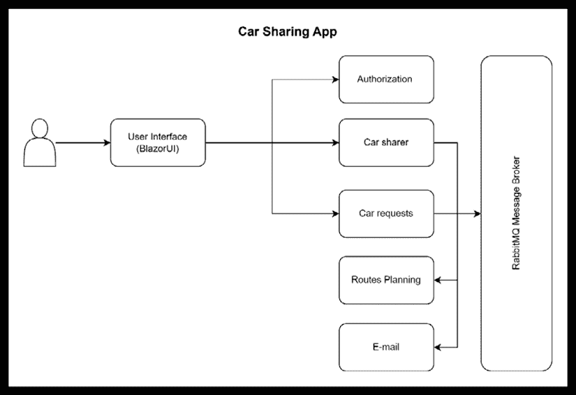
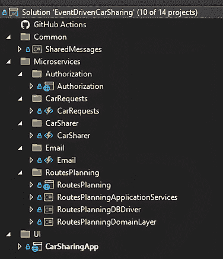

# 11

# 汽车共享应用

汽车共享应用在*第二章*，“揭秘微服务应用”中介绍。无论使用什么技术实现，任何微服务要么处理用户界面请求，要么处理来自其他微服务的消息，或者将结果流式传输到为解决方案定义的通信总线。因此，我们决定用一章来提供更多关于它的详细信息。将整个解决方案的描述放入一章的目的是帮助您更好地理解我们在整本书中涵盖的原则。现在让我们了解应用的一般架构。

# 一般架构描述

在本章中，我们将更详细地描述的应用是汽车共享应用。以下图展示了整个解决方案以及实现该解决方案所涉及的微服务：



图 11.1：汽车共享应用

在*第七章*，“微服务实践”中，我们描述了此演示中微服务之间交换的一些消息。实现这些消息的所有类都包含在演示代码中展示的 `SharedMessages` 库项目中。重要的是要提到，所有微服务都必须添加此库以方便服务之间的通信。还值得注意的是，RabbitMQ 是为此次演示定义的消息代理，这已在书中介绍过。

## 涉及的微服务

如前图所示，有五个微服务旨在演示该解决方案。还有一个服务仅使用 Blazor 作为基础（Blazor UI）部署用户界面。其目的是托管与以下微服务通过 HTTP 和 RabbitMQ（如有适用）交互的用户界面。

### 授权微服务

在*第十章*，“无服务器和微服务应用的安全和可观察性”，我们讨论了实施具有不同保护层的安全性的重要性。**授权**微服务是这些层之一，它处理用户登录和承载令牌的发放。它还包含用户信息。它拦截每个汽车共享者的路由扩展-接受消息，并允许请求被接受的用户访问汽车共享者资料。需要汽车共享的用户可以通过提供接受该请求的路由 ID 来访问接受其请求的汽车共享者的用户资料。

为了实现这一点，使用了 ASP.NET Core Web API。所有端点都需要相同的承载令牌。以下是为此微服务提出的端点：

+   **登录** – 接受凭据并返回 JWT

+   **续订** – 接受令牌并返回更新的 JWT

+   **更改密码** – 接受当前密码和新密码以更新用户凭据

+   **重置密码** – 向用户的电子邮件发送临时密码

+   **添加用户** – 注册新用户

+   **用户资料** – 为匹配的共享汽车行程提供用户的电子邮件和姓名

管理用户登录、密码更新和令牌生成的目的是所有应用程序的共同点。值得注意的是，在现实世界中，许多解决方案将决定由 Microsoft、Google 或 Meta 的身份提供者来完成这项服务。

### CarSharer 微服务

**CarSharer** 微服务与 Blazor UI 交互，并包含实现所有共享汽车操作的 Web API。共享汽车者插入一个包含他们的出发地和目的地城镇以及可能的中间城镇的初始路线。

然后，他们通过 `RoutesPlanning` 微服务接收可能的共享汽车请求匹配。相应地，它显示了所有可能的扩展，共享汽车者可以拒绝或接受每个扩展。他们还可以关闭路线，这意味着他们达到了可接受的旅行人数。在这里，您可以看到为这个示例场景想象的路线：

+   **创建路线** – 使用日期和所有城镇的里程碑创建新的路线

+   **删除路线** – 删除特定的路线

+   **关闭路线** – 关闭路线以防止进一步的匹配

+   **扩展路线** – 接受对现有路线的用户请求

+   **获取建议的扩展** – 列出与路线兼容的行程请求

+   **获取活跃路线** – 列出特定用户的全部活跃（未过期或删除）路线

考虑到这本质上是一个 CRUD 操作，这个微服务可以使用 Azure Functions 实现，正如我们在 *第四章* 中讨论的，*可用的 Azure Functions 和触发器*。

### CarRequests 微服务

**CarRequests** 微服务也与 Blazor UI 交互。它包含实现所有汽车行程请求操作的 Web API。用户插入从起点到目的地的请求。然后，用户可以验证共享汽车者是否在他们的请求中插入了请求。当共享汽车者接受请求时，其他共享汽车者无法选择它，因此只处理一个选项。我们假设用户自动接受共享汽车者的提议。在这里，我们有这个实现的端点：

+   **添加新请求** – 插入一个包含起点、目的地和日期的行程请求。确认请求是否已注册非常重要。

+   **获取我的请求** – 列出带有匹配共享汽车选项的活跃请求。匹配的路线还包含车主的详细信息，可用于从身份验证服务器获取用户信息。

在这里，Azure Functions 技术再次是一个不错的选择。

### RoutesPlanning 微服务

**RoutesPlanning** 微服务根据最小化距离标准将拼车者的路线与车辆请求相匹配。其行为在 *第七章* 的 *实践中的微服务* 中完全描述，这里使用的技术是 ASP.NET Core Web API。为了便于理解，实现它的代码也包含在本章中。

### 电子邮件微服务

最后，**Email** 微服务拦截由拼车者发出的路线扩展接受事件，并通过电子邮件通知路线中包含的所有用户。它作为后台工作，正如我们在 *第五章* 中检查的一些实现，*实践中的后台函数*。发出的路线扩展接受事件包含 `UserBasicInfoMessage`，其中示例中的用户 `DisplayName` 应该是电子邮件。这些是在此微服务中将要执行的功能：

监听 `RouteExtensionAccepted` 事件并将请求入队以发送电子邮件

处理电子邮件，这是将请求出队并发送电子邮件的常规操作

Azure Functions 技术也将用于此案例。微服务的理念不是将电子邮件处理直接附加到监听事件上。这就是为什么使用队列的原因。

# 演示代码

您可以在此章节的示例代码在 [`github.com/PacktPublishing/Practical-Serverless-and-Microservices-with-Csharp/tree/main/ch11`](https://github.com/PacktPublishing/Practical-Serverless-and-Microservices-with-Csharp/tree/main/ch11)。此章节至少需要 Visual Studio 2022 的免费 *Community Edition*。

请注意，提供的代码并非完全功能。作为读者的您被鼓励进一步开发它。其主要目的是为在特定用例中实现不同的微服务方法提供一个基础。

以下表格总结了提出的微服务列表：

| **微服务** | **技术** | **主要责任** | **API/事件亮点** |
| --- | --- | --- | --- |
| `Authorization` | ASP.NET Core Web API | 管理用户认证和配置文件 | `Login`, `Renew`, `AddUser`, `GetProfile` |
| `CarSharer` | Azure Functions | 管理车主路线 | `CreateRoute`, `ExtendRoute`, `GetSuggestions` |
| `CarRequest` | Azure Functions | 管理用户出行请求 | `AddRequest`, `GetRequests` |
| `RoutesPlanning` | ASP.NET Core Web API | 建议最佳路线请求匹配 | 事件驱动逻辑，见 *第七章* |
| `Email` | Azure Functions | 通过电子邮件通知用户 | `RouteExtensionAccepted` → 队列 → 电子邮件 |

由于 SQL 实例必须与运行在 Docker 容器内的客户端进行通信，因此它接受 TCP/IP 请求和用户/密码认证。请注意，随 Visual Studio 安装提供的 SQL 实例不支持 TCP/IP，因此您需要安装 SQL Server Express 或使用云实例。对于本地安装，安装程序和说明文档都可在以下链接找到：[`www.microsoft.com/en-US/download/details.aspx?id=104781`](https://www.microsoft.com/en-US/download/details.aspx?id=104781)。您还可以使用以下命令将 SQL Server 开发版作为 Docker 镜像运行：

```cs
docker run -e "ACCEPT_EULA=Y" -e "MSSQL_SA_PASSWORD=yourStrong(!)Password" -p 1433:1433 -d mcr.microsoft.com/mssql/server:2022-latest 
```

1.  对应于所选密码的用户名将是 `sa`。

1.  要运行 Docker，请使用 Windows 的 **Docker Desktop** ([`www.docker.com/products/docker-desktop`](https://www.docker.com/products/docker-desktop))。

1.  **Docker Desktop** 又需要 **Windows Subsystem for Linux** (**WSL**)，可以通过以下步骤安装：

1.  在 Windows 10/11 的搜索栏中输入 `powershell`。

1.  当 Windows PowerShell 作为搜索结果出现时，点击 **以管理员身份运行**。

1.  在出现的 Windows PowerShell 管理控制台中，运行 `wsl --install` 命令。

下图显示了代码结构的组织方式：



图 11.2：汽车共享应用代码结构

如您所见，存在一个 `Common` 库，它将共享将在微服务之间传输的消息。`Authorization` 和 `RoutesPlanning` 是使用 Web API 微服务编写的，而 `CarRequests`、`CarSharer` 和 `Email` 是基于 Azure Functions 编写的。这就是为什么我们在本书的演示中展示了这两种可能性。根据我们所展示的，根据微服务的复杂性和业务规则的实际需求，我们可以选择以下这些替代方案之一来创建分布式应用程序。

# 摘要

在本章中，我们详细演示了使用微服务作为连接从前端到后端传输的每条消息的基础的事件驱动应用程序。我们希望这个演示能帮助您更好地理解本书中提出的所有原则。

# 进一步阅读

+   云设计模式：[`learn.microsoft.com/en-us/azure/architecture/patterns/`](https://learn.microsoft.com/en-us/azure/architecture/patterns/)

+   事件驱动应用程序：[`learn.microsoft.com/en-us/azure/architecture/guide/architecture-styles/event-driven`](https://learn.microsoft.com/en-us/azure/architecture/guide/architecture-styles/event-driven)

# 加入我们的 Discord 社区

加入我们社区的 Discord 空间，与作者和其他读者进行讨论：

[`packt.link/PSMCSharp`](https://packt.link/PSMCSharp)


