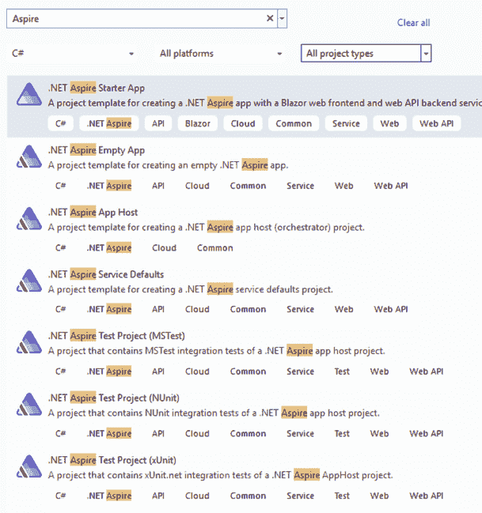
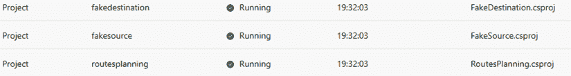
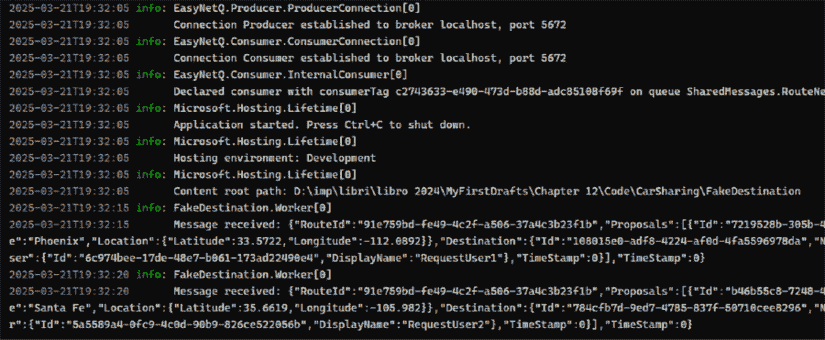

# 12

# 使用 .NET Aspire 简化微服务

.NET Aspire 是为了简化在开发机器上测试交互式微服务而设计的。在*第八章*“使用 Kubernetes 实践微服务组织”的“在 Kubernetes 上运行您的微服务”部分中，我们列出了我们可以在开发机器上采用的两个测试技术：

+   在调试每个单个微服务的同时，使用桥接技术测试与 minikube 交互的微服务

+   利用 Visual Studio 对 Docker 的原生支持来调试和测试我们通过 Docker 虚拟网络交互的微服务

虽然 minikube 技术完整且更真实，但它耗时较长，因此大多数测试/调试工作都是使用 Docker 虚拟网络完成的。

.NET Aspire 提供了一种更简单的替代方案，可以直接使用 Docker 网络。此外，它还提供了一种简单的方式来配置微服务之间的交互以及每个微服务与其他资源之间的交互。最后，.NET Aspire 项目可以编译生成指令，用于在 Azure 容器应用上部署所有微服务，以及创建它们在 Azure 上使用的某些资源。然而，其主要用途在于开发和测试环境，不应用于自动设置实际的生产环境，因为它不处理所有部署选项。

在本章中，我们将介绍 .NET Aspire 的基础知识，以及它提供的所有服务和机会。具体来说，本章涵盖了以下内容：

+   .NET Aspire 功能和服务

+   配置微服务和资源

+   在实践中使用 .NET Aspire

+   部署 .NET Aspire 项目

# 技术要求

本章需要以下条件：

1.  至少需要 Visual Studio 2022 免费社区版。

1.  **Docker Desktop** for Windows ([`www.docker.com/products/docker-desktop`](https://www.docker.com/products/docker-desktop))，它反过来又需要 Windows Subsystem for Linux (WSL)，可以通过以下步骤安装：

1.  在 Windows 10/11 的搜索栏中输入 `powershell`。

1.  当 Windows PowerShell 作为搜索结果出现时，点击**以管理员身份运行**。

1.  在出现的 Windows PowerShell 管理控制台中，运行 `wsl --install` 命令。

您可以在[`github.com/PacktPublishing/Practical-Serverless-and-Microservices-with-Csharp`](https://github.com/PacktPublishing/Practical-Serverless-and-Microservices-with-Csharp)找到本章的示例代码。

# .NET Aspire 功能和服务

.NET Aspire 负责微服务之间的交互，并提供以下其他服务：

+   它以非常简单的方式处理与环境资源（如数据库和消息代理）的交互。您不需要指定可能在微服务部署时更改的连接字符串；只需声明微服务与资源之间的交互以及一些通用配置即可。这是通过.NET 功能**本地服务发现**完成的，将在*服务发现及其在.NET Aspire 中的作用*子节中详细讨论。

+   它提供了云服务的模拟器，以及常见的磁盘和内存数据库以及消息代理。

+   微服务与其他资源的交互在专用的.NET 项目中声明性配置，从而避免了在微服务代码中使用虚拟地址和连接字符串。

+   一旦运行.NET Aspire 项目，所有微服务和资源都会运行，微服务与资源之间的交互将自动处理。

+   当微服务在开发环境中运行时，日志和统计信息都会被收集。

+   一旦运行.NET Aspire 项目，浏览器中就会出现一个智能控制台，显示所有收集的统计信息和日志，以及访问所有微服务端点的链接。

微服务之间的交互以及微服务与其他资源之间的交互在称为应用程序主机的特殊类型的项目中声明。您可以通过在 Visual Studio 搜索框中键入`Aspire`来找到应用程序主机项目和其他所有 Aspire 模板，如图所示：



图 12.1：Aspire 项目和解决方案模板

另一种 Aspire 特定的项目类型是.NET Aspire 服务默认项目，它提供了扩展方法来配置各种服务。为了确保某些基本服务在所有微服务中以相同的方式配置，我们在该项目中定义它们，然后在所有微服务项目的`Program.cs`配置中调用它们的扩展方法。因此，所有微服务都必须添加对这个项目的引用。

默认情况下，所有 Aspire 模板配置以下服务默认值：

+   `HttpClient`服务发现：在应用程序主机配置中，微服务和资源被赋予名称，多亏了这种配置，`HttpClient`可以使用基于这些名称的虚拟 URL，而不是实际资源 URL，这些 URL 可能取决于资源在各个环境（开发、预发布、生产等）中的部署位置。

+   `HttpClient` 弹性：每个 `HttpClient` 调用都会自动应用于所有策略，如*第二章*中的*弹性任务执行*小节所述，*揭秘微服务应用*。更具体地说，重试、断路器、超时和速率限制（舱壁隔离）策略会自动应用，并且可以在**.NET Aspire 服务默认值**项目中一次性配置完成。

+   将在专用小节中讨论 OpenTelemetry。

+   公开端点用于暴露微服务的健康状态。健康检查既由 App Host 调度器使用，也由 Kubernetes 等预演和生产调度器使用（见*第八章*中的*就绪性、活跃性和启动探测*小节，*使用 Kubernetes 的实用微服务组织*）。提供了两个默认端点：`/health`，如果微服务健康，则返回 `200` HTTP 状态码和“健康”测试响应，以及 `/alive` 端点，如果微服务正在运行且未崩溃，则返回 `200` HTTP 状态码和“健康”测试响应。

+   默认情况下，出于安全原因，这两个端点仅在开发期间公开。但是，如果微服务对外部用户不可访问，它也可以在生产中安全公开。您只需在 .NET Aspire 服务默认值项目中定义的 `MapDefaultEndpoints()` 扩展中移除对环境的条件即可。

+   如果微服务是前端，则只有当它们同时受到身份验证和防止拒绝服务攻击的节流策略的保护时，这些端点才能公开。

由于这些配置在项目创建时自动添加，因此您无需手动添加所有这些配置。大多数情况下，您只需更改一些参数，例如各种弹性策略的参数。

每个微服务只需要调用 `builder.AddServiceDefaults()` 和 `app.MapDefaultEndpoints()` 即可应用所有配置的默认值，如下所示：

```cs
var builder = WebApplication.CreateBuilder(args);
// Add service defaults & Aspire client integrations.
**builder.****AddServiceDefaults****();**
// Add application specific services
builder.Services…..
…
// Build application host
var app = builder.Build();
//Configure application
app….
…
//Add default endpoints
**app.****MapDefaultEndpoints****();**
app.Run(); 
```

此外，还有基于 xUnit、NUnit 和 MSTest 的 Aspire 特定测试项目。它们都包含创建应用程序宿主、启动应用程序以及通过基于其名称的 URL（服务发现）与微服务通信所需的所有引用。

一旦添加测试项目，它就包含一个初始示例测试，其中包含创建 App Host 和调用微服务的整个代码。此代码已注释，因此您只需将您的 App Host 项目引用添加到代码中，并将假的 App Host 项目名称和微服务名称替换为您的 App Host 项目名称和微服务名称即可：

```cs
 // Arrange
//    var appHost = await DistributedApplicationTestingBuilder
.CreateAsync<Projects.**MyAspireApp_AppHost**>();
    //    appHost.Services.ConfigureHttpClientDefaults(clientBuilder =>
//    {
//        clientBuilder.AddStandardResilienceHandler();
//    });        //
//    await using var app = await appHost.BuildAsync();
//    var resourceNotificationService = app.Services.
    //    GetRequiredService<ResourceNotificationService>();
//    await app.StartAsync();
//    // Act
//    var httpClient = app.CreateHttpClient("**webfrontend**");
//    await resourceNotificationService
//    .WaitForResourceAsync("**webfrontend**",
//    KnownResourceStates.Running).WaitAsync(TimeSpan.FromSeconds(30));
//    var response = await httpClient.GetAsync("/"); 
```

在前面的代码中，必须替换的假名称被突出显示。

还有一个名为 **.NET Aspire Empty App** 的模板可用，它创建 App Host 和 Service Defaults 项目，以及一个 **.NET Aspire Starter App** 模板，该模板添加了一些示例微服务和资源，以及它们的 App Host 配置。

**.NET Aspire Starter App** 模板具有很高的教学价值，因为它立即显示了基本配置，以及如何使用服务发现配置和使用 `HttpClient`。此外，它是探索当应用启动时在浏览器中出现的控制台（包括其统计信息和日志，以及访问所有微服务端点的链接）的好方法。鼓励您创建、探索和运行此项目。

服务发现不是 Aspire 特有的功能，而是 .NET 的一般功能。它依赖于各种提供者将服务名称映射到实际的 URL。我们将在下一小节中更详细地讨论它。

## 服务发现及其在 .NET Aspire 中的作用。

服务发现是通过 `Microsoft.Extensions.ServiceDiscovery` NuGet 包中定义的扩展方法提供的 `HttpClient` 功能。

服务名称通过提供者定义的映射映射到实际的 URL。默认情况下，仅将 .NET 配置提供者添加到提供者列表中。

此提供者尝试从项目配置的 `Service` 部分读取这些映射，其中它们必须如下定义：

```cs
"Services": {
    "myservice": {
      "https": [
        "10.46.24.91:80"
      ],
       "http": [
        "10.46.24.91:443"
      ]
    }
  } 
```

当使用 `http://myservice` 调用服务时，选择 `http` 子节中指定的端点；否则，如果使用 `https://myservice` 调用，则选择 `https` 子节中的端点。

以下是基于配置的提供者添加的内容：

```cs
builder.Services.AddServiceDiscovery(); 
```

之前的代码还添加了透传提供者，该提供者简单地解析每个服务名称到服务名称本身。换句话说，透传提供者什么都不做！在部署到 Kubernetes 时必须使用它，因为在 Kubernetes 中，名称是通过服务解析的。

因此，当部署到 Kubernetes 时，每个微服务都必须有一个与之关联的服务，其名称与微服务名称相同。

例如，如果我们有一个名为 `routes_planning` 的微服务，它部署在 Kubernetes 的 `routes_planning` Deployment 中，那么对 `routes_planning` 的通信必须通过名为 `routes-planning` 的 Kubernetes 服务进行。

如果服务名称无法通过基于配置的提供者解析，它将被传递到下一个提供者，即透传提供者。

假设我们想在 Kubernetes 上部署应用，但首先我们需要使用 .NET Aspire 测试我们的应用。对于这两个环境，我们需要设置两种不同的服务发现配置吗？

答案是否定的！实际上，.NET Aspire 不使用配置文件来定义服务映射。相反，当 App Host 项目启动微服务时，它会将所有所需的服务解析规则注入到环境变量中，然后这些变量与其他所有微服务配置信息合并。

当应用程序发布到 Kubernetes 集群时，将没有 App Host，因此不会在配置中注入服务解析映射，所有解析都传递给透传提供程序。

也可以使用 `AddServiceDiscoveryCore()`，它不添加任何默认提供程序，而不是 `AddServiceDiscovery()`。在这种情况下，必须通过调用

`AddPassThroughServiceEndpointProvider()` 和 `AddConfigurationServiceEndpointProvider()`。

例如，如果我们只想添加基于配置的提供程序，我们可以简单地编写以下代码：

```cs
builder.Services.AddServiceDiscovery()
    .AddConfigurationServiceEndpointProvider(); 
```

通过设置 `ConfigurationServiceEndPointResolverOptions` 选项对象的属性，也可以自定义服务发现：

```cs
builder.Services.Configure<ConfigurationServiceEndPointResolverOptions>(
    static options =>
    {
        options.SectionName = "MyCustomResolverSection"
    }); 
```

一旦我们添加并配置了服务发现，我们必须指定必须使用它的 HTTP 客户端。以下代码将服务发现应用于所有 HTTP 客户端：

```cs
builder.Services.ConfigureHttpClientDefaults(http =>
{
    http.AddServiceDiscovery();
}); 
```

`ConfigureHttpClientDefaults` 也可以用来为所有 HTTP 客户端添加和配置各种弹性策略：

```cs
builder.Services.ConfigureHttpClientDefaults(http =>
{
    http.AddStandardResilienceHandler();
    http.AddServiceDiscovery();
}); 
```

上述代码是所有 **.NET Aspire Service Defaults** 项目中添加的默认 `HttpClient` 配置。

服务发现也可以添加到特定的 `HttpClient`，如下所示：

```cs
builder.Services.AddHttpClient("myclient", static client =>
{
    client.BaseAddress = new("https://routes_planning");
})
.AddServiceDiscovery(); 
```

当服务发现就绪时，我们还可以编写如 `"https+http://routes_planning"` 或 `"http+https://routes_planning"` 这样的 URI。在这种情况下，服务发现将尝试使用第一个协议（`https` 或 `http`）解析 URI，如果失败，将尝试第二个协议。

这在我们开发时使用 `http`，在预发布和生成环境中使用 `https` 时很有用。为此，只需在所有微服务项目的启动设置中定义 `http` 端点就足够了。实际上，App Host 使用每个微服务的启动设置来创建它注入到环境变量中的服务发现映射。因此，在开发期间只会生成 `http` 映射，所以 `https` 解析将失败。相反，部署后，仅透传提供程序将工作，因此 `https` 解析将成功。

到目前为止，我们假设每个微服务只有一个端点，但有时，一些服务可能有多个端点，每个端点位于不同的端口上。当一个微服务有多个端点时，我们必须为除了一个（默认端点）之外的所有端点命名。端点名称在 App Host 中的服务定义和配置中给出。以下是一个具有默认端点和名为 `"aux"` 的命名端点的微服务定义：

```cs
var routesPlanning = builder.AddProject<Projects.RoutesPlanningService>("routes_planning ")
    .WithHttpsEndpoint(hostPort: 9999, name: "aux"); 
```

在这种情况下，生成的配置映射将把两个 URL 关联到服务名称，一个用于默认端点，另一个用于命名端点，如下所示：

```cs
"Services": {
    "routes_planning": {
      "https": ["https://localhost:8080"],
      "aux": ["https://localhost:8090"]   
    }
  } 
```

默认端点可以通过 `"https://routes_planning"` 访问，而对于命名端点，我们必须将端点名称也添加到 URI 中，如下所示：

```cs
https://_aux.routes_planning 
```

当使用 Aspire App Host 时，前面的配置会自动创建并注入到所有需要它的服务中，所以我们不需要担心它。

然而，如果我们部署在 Kubernetes 上，我们必须定义一个正确解析 `"https://routes_planning"` 和 `"https://_aux.routes_planning"` 的 Kubernetes 服务。这个结果可以通过命名端口轻松实现，如下所示：

```cs
apiVersion: v1
kind: Service
metadata:
  name: routes_planning
spec:
  selector:
    name: routes_planning
  ports:
  - name: default
port: 8080
  - name: aux
    port: 8090 
```

与默认端点关联的端口必须命名为 `default`，而与所有命名端点关联的端口必须与端点名称相同。

现在我们已经了解了实际服务 URL 发现背后的魔法，让我们继续了解资源集成和自动连接字符串处理的魔法。

## 资源集成和自动资源配置

当解决方案运行时，可以模拟各种微服务项目所需的资源。只需添加相应的 Aspire NuGet 包，并在 App Host 中声明和配置资源即可。对于声明主数据库、Redis 和主要消息代理（如 RabbitMQ、Kafka）以及 Azure Service Bus 模拟器的扩展方法。有关可以添加到 Aspire 项目并在其 App Host 中配置的所有资源的完整列表，请参阅官方文档中的集成概述 [`learn.microsoft.com/en-us/dotnet/aspire/fundamentals/integrations-overview`](https://learn.microsoft.com/en-us/dotnet/aspire/fundamentals/integrations-overview)。

在幕后，所有这些资源都是通过 Docker 镜像实现的，因此大多数扩展方法也允许您选择特定的 Docker 镜像和特定版本。此外，由于 App Host 支持通用 Docker 镜像，因此可以为尚未支持的自定义资源实现扩展方法。然而，支持的资源列表正在迅速增长，因此您应该能够找到所有需要的资源已经实现。

在本章的 *使用 .NET Aspire 实践* 部分，您将详细了解如何集成和配置 SQL Server 和 RabbitMQ，而在 *配置微服务和资源* 部分，我们将解释如何在 App Host 中声明和配置微服务和资源。

当您配置资源时，您给它一个名称，如果资源支持连接字符串，则该名称假定是连接字符串的名称。相应地，当 App Host 创建资源时，它会计算其连接字符串，并将其传递给使用该资源的所有微服务的配置中的 `ConnectionStrings` 部分。这是通过将配置字符串放置在名为 `ConnectionStrings__<name>` 的环境变量中完成的，其中 `<name>` 是我们赋予资源的名称。

例如，假设我们的应用程序需要一个包含名为 `"mydatabase"` 的数据库的 SQL Server 实例。在 App Host 中，我们可能用以下方式声明这些资源：

```cs
var builder = DistributedApplication.CreateBuilder(args);
var sql = builder.AddSqlServer("sql");
var db = sql.AddDatabase("mydatabase "); 
```

现在，如果 `MyExampleProject` 项目中定义的微服务必须使用 `"mydatabase"` 数据库，它必须声明如下：

```cs
builder.AddProject<Projects.MyExampleProject>()
       .**WithReference****(db);** 
```

`WithReference(db)` 调用将导致访问 SQL Server 实例中 `"mydatabase"` 的连接字符串注入到 `MyExampleProject` 微服务的 `ConnectionStrings__mydatabase` 环境变量中。

显然，当我们配置资源时，我们也可以指定访问它的凭据，而不是使用由扩展方法创建的默认凭据。

在下一节中，我们将详细介绍如何在 App Host 中配置资源和微服务。

通常，与连接字符串一起，App Host 会传递一个包含更多资源详细信息的整个配置部分，例如用户名和密码。此辅助数据的格式取决于特定的资源类型。在本章的 *使用 .NET Aspire 实践* 部分，我们将看到 RabbitMQ 辅助信息格式。所有受支持资源的辅助信息格式可在官方文档中找到。

如果我们想使用已经存在的资源，我们不需要在 App Host 中声明它，但我们需要使用 `builder.AddConnectionString` 声明其连接字符串，以便 App Host 可以将其注入所有需要的微服务。例如，如果上一个示例中的 SQL Server 数据库在开发环境和部署环境中都已存在，则代码必须按以下方式修改：

```cs
var builder = DistributedApplication.CreateBuilder(args);
var db = builder.AddConnectionString("parameterName", "database"); 
```

在这里，`parameterName` 是在 App Host 配置文件中的 `"Parameters"` 部分包含连接字符串的参数名称，如图所示：

```cs
{
    "Parameters": {
        " parameterName ": " SERVER=XXX.XXX.X.XX;DATABASE=DATABASENAME ……"
    }
} 
```

不言而喻，我们可以使用 .NET 环境在不同的环境中提供不同的配置。

代码的其余部分保持不变：

```cs
builder.AddProject<Projects.MyExampleProject>()
       .WithReference(db); 
```

当应用程序在生产或预发布环境中部署时，所有连接字符串和辅助资源数据将发生什么？

如果部署是手动的，App Host 插入的相同环境变量必须在目标协调器的配置中定义。例如，如果目标协调器是 Kubernetes，则必须在 Deployment 的 `env` 部分中定义。正如我们将在 *部署 .NET Aspire 项目* 部分中更详细地看到，当我们使用自动工具配置目标协调器时，有两种可能性：

+   如果自动工具能够配置所需的资源，它也将自动配置所有环境变量，从创建的资源中获取所有必要的信息。

+   如果自动工具没有生成所需资源，而只是生成配置所有微服务的代码，它将要求用户输入环境变量值

下一个子节详细说明了如何在开发期间以及应用部署时处理遥测。

## 应用遥测

通过连接不同微服务中发生的适当相关事件，遥测使整个微服务应用程序的监控成为可能。更具体地说，它收集以下数据：

+   日志记录：所有微服务和资源的单个日志被收集并按其生成时间和来源进行分类。

+   跟踪：跟踪关联了属于同一逻辑活动的日志事件（例如，处理单个请求），即使它们分布在多个机器或进程上。跟踪是诊断和调试故障的起点。

+   指标：每个正在执行的微服务收集各种微服务指标，并将这些指标发送到收集点。

当应用在开发环境中运行并使用 App Host 作为编排器时，每个微服务的遥测通过在 **.NET Aspire Service Defaults** 项目中配置的 `ConfigureOpenTelemetry()` 调用启用。此调用启用指标的收集以及将这些指标与微服务日志一起传输到实现 **OpenTelemetry Protocol (OTLP)** 的 **OpenTelemetry** 端点。

在开发期间，当解决方案运行时打开的 Aspire 控制台作为 OpenTelemetry 端点工作，与该端点连接的数据由 App Host 注入为所有微服务的环境变量。因此，我们可以在该控制台中看到的所有数据都来自遥测。

当应用部署时，相同的环境变量必须包含部署环境中可用的 OpenTelemetry 端点的数据。Azure 支持 OTLP，因此，例如，如果应用部署到 Azure Kubernetes，我们必须传递与 Azure Kubernetes 集群一起创建的遥测端点的数据。也可以将 OpenTelemetry 数据传递到 Grafana 等工具，这在 *第九章* 的 *Kubernetes 管理工具* 子节中已有描述，即 *简化容器和 Kubernetes：Azure 容器应用* 以及其他工具。

由 App Host 自动注入到每个微服务中的环境变量，我们必须在部署环境中手动注入的变量如下：

+   `OTEL_EXPORTER_OTLP_ENDPOINT`，其中包含 OTLP 端点的 URL。

+   `OTEL_SERVICE_NAME`，其中包含微服务必须添加到其发送的数据中的服务名称。您应使用在 App Host 配置中给定的与微服务相同的名称。

+   `OTEL_RESOURCE_ATTRIBUTES`，它包含一个唯一 ID，唯一地标识每个服务实例。它必须添加到所有数据中，并且必须具有以下格式：`service.instance.id=<unique name>`。通常，GUID 用作唯一服务名称。

一旦你明确了 Aspire 提供的服务，你需要学习如何配置 App Host。

# 配置微服务和资源

App Host 按照以下方式处理服务：

1.  .NET 项目：这些可以通过以下方式配置 `var myService = builder.AddProject<Projects.MyProjectName>("myservicename");`

1.  存储在某些注册表中的容器：这些可以通过以下方式配置 `var myService = builder.AddContainer("myservicename", "ContainerNameOrUri");`

1.  可执行文件：这些可以通过以下方式配置 `var myService = builder.AddExecutable("myservicename", "<shell command>", "<executable working directory>");`

1.  需要构建的 Dockerfile：这些可以通过以下方式配置 `var myService = builder.AddDockerfile(`

    ```cs
     `"myservicename ", "relative/context/path");` 
    ```

其中 `"relative/context/path"` 是包含 Dockerfile 以及构建 Dockerfile 所需的所有文件的文件夹。此路径必须相对于包含 App Host 项目文件的目录。

前面的每个命令都可以跟随着几个配置选项，通过流畅的接口传递，如本例所示：

```cs
var cache = builder.AddProject<Projects……
var apiService = builder.AddProject<Projects……
builder.AddProject<Projects.MyAspireProject>("webfrontend")   
   .WithReference(cache)
    .WaitFor(cache)
    .WithReference(apiService)
    .WaitFor(apiService); 
```

`WithReference` 声明服务与作为参数传递的资源或服务进行通信。它会导致注入所有包含服务发现所需数据、连接字符串或其他辅助资源信息的环境变量。

`WaitFor` 声明微服务必须在作为参数传递的服务或资源运行之后启动。

`WithReplicas(int n)` 是流畅接口配置的重要方法之一。它声明微服务必须复制 *n* 次。如果我们计划使用自动工具将 App Host 配置编译成 Kubernetes 或 Azure Container Apps 配置代码，那么这一点很重要。

不幸的是，在开发模式下，我们开发机的有限性能通常不允许我们像在生产环境中那样需要相同数量的副本。因此，在这些情况下，我们应该执行不同的配置指令。

当我们在开发机上运行应用程序以及使用 App Host 配置为其他平台生成代码时，都会执行 App Host 配置。在后一种情况下，我们说我们处于发布模式而不是运行模式。幸运的是，`builder` 对象在 `builder.ExecutionContext` 属性中包含有关执行环境的信息。特别是，我们可以使用 `builder.ExecutionContext.IsPublishMode` 和 `builder.ExecutionContext.IsRunMode` 属性来区分运行模式下的配置和发布模式下的配置。

如前所述，在 *服务发现及其在 .NET Aspire 中的作用* 子节中，我们还可以使用 `WithEndpoint` 流式接口方法来声明在其他端口上可用的辅助端点：

```cs
var routesPlanning = builder.AddProject<Projects.RoutesPlanningService>("routes_planning ")
    .WithEndpoint(hostPort: 9999, name: "aux"); 
```

`WithEndpoint` 可以替换为 `WithHttpsEndpoint` 和 `WithHttpEndpoint`，分别声明仅 HTTPS 和仅 HTTP 端点。

`WithExternalHttpEndpoints()` 流式接口方法声明微服务端点必须在应用程序外部对应用程序客户端可用。当在 Kubernetes 上发布应用程序时，这些端点将通过 `Ingress` 或 `LoadBalancer` 服务公开，而在 Azure Container Apps 上发布应用程序时，将通过外部入口公开。

微服务使用的资源可以使用相同的流式接口进行声明和配置。每种资源类型都需要一个专门的 NuGet 包，该包为流式接口提供所需的扩展方法。所有这些扩展方法都是基于 `builder.AddContainer` 方法构建的，因为它们使用 Docker 镜像来实现资源。因此，如果所需的资源尚未可用，我们可以自己编写所需的扩展方法。然而，如前所述，所有主要数据库、Redis、所有主要消息代理以及大多数 Azure 服务都有资源。一些 Azure 资源配置器提供并使用实际的 Azure 资源，而另一些则使用本地模拟器。Azure 存储和 Azure Service Bus 都有模拟器。

请参阅官方文档以获取所有可用资源集成的列表：[`learn.microsoft.com/en-us/dotnet/aspire/fundamentals/integrations-overview`](https://learn.microsoft.com/en-us/dotnet/aspire/fundamentals/integrations-overview)。

默认情况下，当 App Host 关闭时，由于所有 Docker 镜像都使用临时存储，所有数据库数据都会丢失。然而，我们可以使用 `WithDataVolume()` 流式接口方法强制使用永久的 Docker 卷存储：

```cs
var sql = builder.AddSqlServer("sql")
                 .WithDataVolume();
var db = sql.AddDatabase("database"); 
```

当调用此方法时，会创建一个具有自动生成名称的 Docker 卷。为了对卷名称和容器内挂载的目录有更多控制，可以使用 `WithBindMount`：

```cs
var sql = builder.AddSqlServer("sql")
                 .WithBindMount("MyVolumeName", "/var/opt/mssql");
var db = sql.AddDatabase("database"); 
```

大多数资源使用默认用户名，例如 `sa`，以及自动生成的密码。这两个凭据都可通过 App Host 浏览器控制台的资源信息链接获取。然而，如果数据没有与卷持久化，这个密码可能会在每次运行时更改。

幸运的是，所有资源都提供了指定一些参数的可能性，而 `username` 和 `password` 总是其中之一。

无需多言，参数不会直接在代码中插入，这是显而易见的原因。它们来自 App Host 配置的“参数”部分。因此，它们可以插入到 App Host 配置文件中，这样我们也可以通过使用传统的 .NET 环境基于配置文件覆盖来为每个环境提供不同的值。

第一步是定义一个参数对象，其名称为 `"Parameters"` 属性，包含实际值：

```cs
var password = builder.AddParameter("sqlpassword", secret: true); 
```

通过将 `secret` 设置为 `true`，我们在发布模式下运行 Aspire 时启用生成提示以将参数存储在安全位置。

然后，参数被放置在资源扩展方法的正确位置，这是特定于资源的：

```cs
var sql = builder.AddSqlServer("sql", password)
                 .WithBindMount("MyVolumeName", "/var/opt/mssql");
var db = sql.AddDatabase("database"); 
```

实际值必须放置在 App Host 项目配置文件中，如下所示：

```cs
{ 
  "Parameters": {
    "sqlpassword": "my_password_value",
   …
  },
  …
} 
```

下一个子节描述了如何在 .NET Aspire 解决方案中集成 Azure Functions 项目。

## Azure Functions 集成

在撰写本书时，.NET Aspire 解决方案中 Azure Functions 项目的集成处于预览阶段。然而，我们将简要描述它，因为它提供了巨大的机会。

目前，仅支持以下触发器的 Azure Functions：Azure Event Hubs、Azure Service Bus、Azure Blob 存储、Azure Queue 存储、Azure CosmosDB、HTTP 和 Timer。

为了配置 Azure Functions 项目，App Host 必须引用 `Aspire.Hosting.Azure.Functions` NuGet 包。一旦添加了此引用，就可以配置 Azure Functions 项目，如下所示：

```cs
var myFunction = builder.AddAzureFunctionsProject<Projects.MyFunctionsProject>(
 " MyFunction "); 
```

`AddAzureFunctionsProject` 调用可以与其他所有项目类型的常规配置方法链式调用，例如 `WithExternalHttpEndpoints()`。

以这种方式定义后，`myFunction` 可以通过常规方法被其他项目引用：

```cs
builder.AddProject<Projects.MyOtherProject>()
       .WithReference(myFunction)
       .WaitFor(myFunction); 
```

可以按如下方式添加 Azure 存储账户的本地模拟器：

```cs
var storage = builder.AddAzureStorage("storage")
                     .RunAsEmulator();
var myFunction = builder.AddAzureFunctionsProject<Projects.MyFunctionsProject>(
    " MyFunction ")
.WithHostStorage(storage) 
```

模拟器依赖于 `Aspire.Hosting.Azure.Storage` NuGet 包，必须将其添加到 App Host 项目中。

可以使用 `WithReference` 添加对其他 Azure 资源的引用，就像往常一样。例如，一个具有在模拟 blob 上的 Blob 存储触发器的 Azure 函数可以定义如下：

```cs
var storage = builder.AddAzureStorage("storage")
                     .RunAsEmulator();
var blob = storage.AddBlobs("blob");
var myFunction = builder.AddAzureFunctionsProject<Projects.MyFunctionsProject>(
    " MyFunction ")
.WithHostStorage(storage)
.WithReference(blob); 
```

这就结束了我们对 .NET Aspire 的描述。在下一节中，我们将看到如何将 *第八章* 的 Kubernetes 示例，*使用 Kubernetes 的实用微服务组织*，转换为与 Aspire 一起运行。最后，*部署 .NET Aspire 项目* 节将讨论如何使用 Aspire 为我们的目标编排器生成代码，无论是手动还是使用自动代码生成工具。

# 在实践中使用 .NET Aspire

在本节中，我们将将 *第八章* 的 Kubernetes 示例，*使用 Kubernetes 的实用微服务组织*，适配为与 Aspire 一起运行。作为第一步，让我们将整个解决方案文件夹复制到另一个不同位置，这样我们就可以修改它而不会破坏之前的版本。

然后，让我们执行以下步骤来准备整体解决方案：

1.  向解决方案添加一个新的 App Host 项目，并将其命名为 `CarSharingAppHost`。

1.  向解决方案添加一个新的 .NET Aspire Service Defaults 项目，并将其命名为 `CarSharingServiceDefaults`。

1.  将`FakeSource`、`FakeDestination`和`RoutesPlanning`项目添加到`CarSharingAppHost`项目中。

1.  将`CarSharingServiceDefaults`项目添加到`FakeSource`、`FakeDestination`和`RoutesPlanning`项目中。

1.  右键单击`CarSharingAppHost`项目，然后在出现的菜单中选择**设置为启动项目**。

上述步骤为.NET Aspire 解决方案做好了准备。现在，让我们开始修改代码。作为第一步，我们必须向所有微服务添加服务默认值。因此，让我们将`builder.AddServiceDefaults();`添加到`FakeSource`、`FakeDestination`和`RoutesPlanning`项目的`program.cs`文件中。然后，我们必须添加`app.MapDefaultEndpoints()`，它仅将健康端点添加到`RoutesPlanning`项目的`program.cs`文件中，因为它是我们微服务中唯一的 Web 项目。它必须放置如下所示：

```cs
var app = builder.Build();
**app.****MapDefaultEndpoints****();** 
```

现在，让我们记住，我们已经将所有微服务参数作为环境变量添加到它们的`Properties/launchSettings.json`文件中。我们将它们放置在 Docker 启动设置中。现在，由于这些项目在 Aspire 中运行时将不再使用 Docker，我们必须将这些定义复制到其他启动设置配置文件中。

这是更改后的`RoutesPlanning`项目的启动设置代码：

```cs
{
  "profiles": {
    "http": {
      "commandName": "Project",
      "environmentVariables": {

        //place here your environment variables
"ConnectionStrings__DefaultConnection": "Server=localhost;
            Database=RoutesPlanning;User Id=sa;Password=Passw0rd_;
            Trust Server Certificate=True;MultipleActiveResultSets=true",
        "ConnectionStrings__RabbitMQConnection": "host=localhost:5672;
 username=guest;password=_myguest;
publisherConfirms=true;timeout=10”,
        "Messages__SubscriptionIdPrefix": "routesPlanning",
        "Topology__MaxDistanceKm": "50",
        "Topology__MaxMatches": "5",
        "Timing__HousekeepingIntervalHours": "48",
        "Timing__HousekeepingDelayDays": "10",
        "Timing__OutputEmptyDelayMS": "500",
        "Timing__OutputBatchCount": "10",
        "Timing__OutputRequeueDelayMin": "5",
        "Timing__OutputCircuitBreakMin": "4"
      },
      "dotnetRunMessages": true,
      "applicationUrl": "http://localhost:5212"
    },
    "Container (Dockerfile)": {
…
… 
```

我们将所有连接字符串中的`host.docker.internal`替换为`localhost`，因为在 Aspire 中运行时，我们的微服务将不会从 Docker 容器镜像内部访问 SQL 数据库和 RabbitMQ 消息代理，而是直接从开发机器访问。

同样，`FakeSource`的启动设置变为以下内容：

```cs
{
  "profiles": {
    "FakeSource": {
      "commandName": "Project",
      "environmentVariables": {
        "DOTNET_ENVIRONMENT": "Development",
        "ConnectionStrings__RabbitMQConnection":
"host=localhost:5672;username=guest;
            password=_myguest;publisherConfirms=true;timeout=10"
      },
      "dotnetRunMessages": true
    },
    "Container (Dockerfile)": {
      "commandName": "Docker",
      "environmentVariables": {
        "ConnectionStrings__RabbitMQConnection":
 “host=host.docker.internal:5672;
 username=guest;password=_myguest;
            publisherConfirms=true;timeout=10”
      }
    }
  },
  "$schema": "https://json.schemastore.org/launchsettings.json"
} 
```

最后，`FakeDestination`的启动设置变为以下内容：

```cs
{
  "profiles": {
    "FakeDestination": {
      "commandName": "Project",
      "environmentVariables": {
        "DOTNET_ENVIRONMENT": "Development",
        "ConnectionStrings__RabbitMQConnection":
"host=localhost:5672;username=guest;
            password=_myguest;publisherConfirms=true;timeout=10"
      },
      "dotnetRunMessages": true
    },
    "Container (Dockerfile)": {
      "commandName": "Docker",
      "environmentVariables": {
        "ConnectionStrings__RabbitMQConnection":
 “host=host.docker.internal:5672;
 username=guest;password=_myguest;
 publisherConfirms=true;timeout=10"
      }
    }
  },
  "$schema": "https://json.schemastore.org/launchsettings.json"
} 
```

RabbitMQ 和 SQL Server 连接字符串的内容显示，我们决定使用运行在 Aspire 之外的现有 RabbitMQ 和 SQL 实例。这是此解决方案中最简单的选择，因为整个代码已经组织成这种方式运行。然而，当我们从头开始构建解决方案时，通常这也是最佳选择，因为当 App Host 未运行时存在的实例在开发期间更容易处理。

事实上，当我们处理迁移时，我们可以将数据库迁移传递给数据库，而无需启动 App Host。同样，当 App Host 未运行时，我们可以从其浏览器控制台检查 RabbitMQ。

另一个替代方案是将整个 App Host 配置代码分成两个代码区域。第一个代码区域包含我们在应用程序未运行时需要操作的数据库和消息代理，第二个代码区域包含所有其他资源和微服务配置。

当我们需要操作第一代码区定义的资源时，我们注释掉整个第二代码区代码并运行应用主机。完成与迁移的工作和检查 RabbitMQ 队列后，我们取消注释定义和配置所有其他资源和微服务的第二代码区，并运行整个应用程序。

可以通过定义一个布尔型应用主机环境变量来选择第二个配置区，并通过`if`语句来细化前面的方法。

在这个前提之后，我们可以在应用主机的`program.cs`文件中编写我们的配置代码。

由于在我们的案例中，每个微服务都有多个启动设置配置文件，我们必须在`AddProject`流畅接口方法中指定每个微服务要使用的正确配置文件。

此外，由于`FakeSource`向`RoutesPlanning`微服务发送数据，而`RoutesPlanning`微服务向`FakeDestination`服务发送数据，我们必须确保`RoutesPlanning`在`FakeDestination`启动后启动，并且`FakeSource`只在`RoutesPlanning`启动后启动。我们不需要`WithReference`，因为并非所有微服务都是直接通信，而是通过 RabbitMQ 实例进行通信，而`WithReference`仅用于注入与资源直接通信的信息。我们也不需要声明对 RabbitMQ 的引用，因为我们使用的是运行在应用主机之外的外部 RabbitMQ 实例，所以我们已经有了其连接字符串。

使用以下配置代码很容易满足所有约束：

```cs
var builder = DistributedApplication.CreateBuilder(args);
var fakeDestination=builder.AddProject<Projects.FakeDestination>("fakedestination",
 "FakeDestination");
var routesPlanning = builder.AddProject<Projects.RoutesPlanning>("routesplanning", "http")
    .WaitFor(fakeDestination);
builder.AddProject<Projects.FakeSource>("fakesource", "FakeSource")
    .WaitFor(routesPlanning);
builder.Build().Run(); 
```

这里，每个`AddProject`调用的第二个参数是用于每个微服务的启动配置文件名称。

让我们确保 RabbitMQ 和 SQL Server 外部 Docker 容器都在运行，然后启动我们的解决方案。

如果一切运行正常，你应该在 Aspire 浏览器控制台中看到如下所示的图：



图 12.2：应用主机资源列表

让我们点击左侧菜单中的**控制台**图标来检查所有微服务日志。让我们选择**fakedestination**；你应该看到如下所示的图：



图 12.3：伪造的目标控制台

日志应包含通过 EasyNetQ 与 RabbitMQ 的连接信息以及工作服务启动信息。最后，你应该看到来自`RoutesPlanning`微服务的两条消息，声明找到了两个匹配项。

由于所有微服务都使用相同的 RabbitMQ 连接字符串，我们可以通过从每个微服务的启动设置中移除它，并借助`AddConnectionString`将其提取到应用主机的配置中，从而改进整个代码组织，如下所示：

```cs
builder.AddConnectionString("RabbitMQParameterName", "RabbitMQConnection"); 
```

这里，`RabbitMQParameterName`是包含实际连接字符串的应用主机配置参数名称：

```cs
{
  "Parameters": {
    "RabbitMQParameterName": "host=localhost:5672;username=guest;
            password=_myguest;
        publisherConfirms=true;timeout=10"
    }
} 
```

在下一小节中，我们将描述如何修改代码以在 App Host 内运行 RabbitMQ。

## RabbitMQ 集成

RabbitMQ 由 Aspire 集成支持，因此我们也可以在 App Host 内运行它。为此，第一步是添加 `Aspire.Hosting.RabbitMQ` NuGet 包。

然后，我们需要配置 RabbitMQ 实例：

```cs
var username = builder.AddParameter("rabbitmqusername", secret: true);
var password = builder.AddParameter("rabbitmqpassword", secret: true);
var rabbitmq = builder.AddRabbitMQ("RabbitMQConnection", username, password)
       .WithManagementPlugin()
       .WithDataVolume(isReadOnly: false); 
```

在这里，我们在 App Host 关闭后添加了一个卷以持久化数据，并要求安装浏览器管理控制台，这样我们就可以检查所有队列，也可以配置实例。实际的用户名和密码必须在 App Host 配置文件的 `"Parameters"` 部分提供：

```cs
{
  "Parameters": {
    "rabbitmqusername": "<username>",
    "rabbitmqpassword": "<password>"
    }
} 
```

之后，我们必须在所有微服务中使用 `WithReference(rabbitmq)` 声明对 RabbitMQ 实例的引用。

到这一点，我们需要从我们微服务的所有启动设置中删除 RabbitMQ 连接字符串，因为相同的连接字符串现在将由 App Host 注入。

不幸的是，注入的连接字符串的格式不符合 EasyNetQ 所需的格式，而是以下格式：

```cs
`amqp://username:password@<host url>:5672`. 
```

解决这个问题的最简单方法是为这个字符串编写一个字符串操作方法，将其转换为字符串并添加所有其他辅助信息。我们可以在 Service Defaults 项目中定义此方法，这样它将对所有微服务可用。

我们只需要提取 URL、用户名和密码，然后我们可以使用它们来构建 EasyNetQ 所需格式的连接字符串。这可以通过在 `//` 上拆分字符串，然后在 `@` 上拆分，最后在 `:` 上拆分以获取用户名和密码来完成。

在最后一节中，我们将描述如何获取 Aspire 项目所需的目标编排器的配置。

# 部署 .NET Aspire 项目

.NET Aspire 可以用于在开发机器上测试应用程序或复杂微服务应用程序的小部分，从而取代 minikube 和 Docker 网络。

然而，小型应用程序可以完全在 Aspire 中实现，然后可以使用 Aspire 代码生成目标编排器的配置。这种生成可以是手动的，也可以基于自动工具。

手动生成和自动工具都依赖于一个 JSON 清单，该清单可以自动创建，并描述应用程序配置。可以通过向 App Host 项目的 `launchSettings.json` 文件添加以下启动配置文件来生成 JSON 清单：

```cs
"profiles": {
"generate-manifest": {
"commandName": "Project",
"launchBrowser": false,
"dotnetRunMessages": true,
"commandLineArgs": "--publisher manifest --output-path aspire-
                        manifest.json"
}
… 
```

一旦添加到 `launchSettings.json`，此配置文件就会出现在 Visual Studio 配置文件选择组合框中，位于 **运行** 按钮旁边。只需选择 `"generate-manifest"` 配置文件并运行解决方案。当解决方案运行时，应用程序会被编译，但不会运行，而是在 App Host 项目的文件夹中创建 JSON 清单。

您可以手动读取此清单并使用其中包含的信息来配置您的编排器，或者您可以使用自动工具生成清单，并使用它来自动配置编排器。

Visual Studio 本地支持 Azure Container Apps 的部署。发布到 Azure Container Apps 非常简单。只需在解决方案的 App Host 项目上右键单击并选择**发布**。之后，你可以选择 Azure Container Apps 发布目标。该过程将引导你连接到你的 Azure 订阅并提供发布应用程序所需的所有信息，

**发布**向导将发布所有微服务作为 Azure Container Apps 应用程序，并将 App Host 中定义的所有其他资源（如数据库和其他 Azure 资源）在 Azure 中进行配置。

还有一个名为 Aspir8 的外部工具（[`prom3theu5.github.io/aspirational-manifests/getting-started.html`](https://prom3theu5.github.io/aspirational-manifests/getting-started.html)），它能够将应用程序部署到 Kubernetes 集群。然而，在这种情况下，它只会创建 Kubernetes Deployments 和 Services。

安装完成后，Aspir8 支持以下命令：

+   `aspirate init`: 在当前目录中初始化 Aspir8 项目

+   `aspirate generate`: 根据 .NET Aspire 应用程序主机清单生成 Kubernetes 清单

+   `aspirate apply`: 将生成的 Kubernetes 清单应用到 Kubernetes 集群

+   `aspirate destroy`: 删除由 `apply` 命令创建的资源

对于简单的应用程序，你可以直接在 Kubernetes 集群上部署，而对于更复杂的应用程序，你可以使用 Kubernetes 清单作为设计所需 Kubernetes 配置的起点。

`apply` 和 `destroy` 命令需要一个 `kubectl` 安装，并且所有操作都是使用当前的 `kubectl` 上下文执行的。请参阅*第八章*中“与 Kubernetes 交互：kubectl、minikube 和 AKS”部分，了解 `kubectl` 上下文的定义。

如果你想要手动检查 App Host 生成的清单，请参阅其官方格式文档[`learn.microsoft.com/en-us/dotnet/aspire/deployment/manifest-format`](https://learn.microsoft.com/en-us/dotnet/aspire/deployment/manifest-format)。

# 摘要

在本章中，我们描述了 .NET Aspire 提供的机会和服务。我们讨论了如何在 App Host 项目中配置由微服务和其它资源组成的复杂应用程序，并详细讨论了服务发现如何在一般情况和特定于 .NET Aspire 的情况下工作。

我们描述了环境变量包含所有微服务和资源之间交互所需的所有信息，这些变量由 App Host 自动注入到所有微服务中。

最后，我们讨论了 Aspire 如何借助遥测实现可观察性，以及如何使用 App Host 配置为目标编排器生成自动配置。

本章结束了我们在现代分布式计算概念和技术中的精彩旅程。我们希望您阅读这本书的乐趣与我们写作的乐趣一样。

# 问题

1.  Aspire 特有的 .NET SDK 项目是什么？

.NET Aspire Starter 项目，.NET Aspire Empty 项目，.NET Aspire 应用程序主机，.NET Aspire 服务默认值，以及各种 .NET Aspire 测试项目。

1.  服务发现是 Aspire 特有的功能吗？

不，这是一个通用的 .NET 功能。

1.  默认设置中包含多少个服务发现提供程序？

只有两个。

1.  如何处理未使用应用程序主机定义但由多个微服务共享的现有资源？

`AddConnectionString` 的用法。

1.  Aspir8 也提供 Azure 资源吗？

不，目前它只提供 Kubernetes 资源。

1.  `WithReference` 流畅接口方法的目的是什么？

声明一个资源依赖于另一个资源，这意味着它需要该资源的信息，如 URL 和连接字符串。

# 进一步阅读

+   官方 Aspire 文档：[`learn.microsoft.com/en-us/dotnet/aspire/get-started/aspire-overview`](https://learn.microsoft.com/en-us/dotnet/aspire/get-started/aspire-overview)

+   所有可用的 Aspire 集成：[`learn.microsoft.com/en-us/dotnet/aspire/fundamentals/integrations-overview`](https://learn.microsoft.com/en-us/dotnet/aspire/fundamentals/integrations-overview)

+   应用程序主机配置清单格式：[`learn.microsoft.com/en-us/dotnet/aspire/deployment/manifest-format`](https://learn.microsoft.com/en-us/dotnet/aspire/deployment/manifest-format)

+   Aspir8：[`prom3theu5.github.io/aspirational-manifests/getting-started.html`](https://prom3theu5.github.io/aspirational-manifests/getting-started.html)

# 加入我们的 Discord 社区

加入我们社区的 Discord 空间，与作者和其他读者进行讨论：

[`packt.link/PSMCSharp`](https://packt.link/PSMCSharp)


[packtpub.com](http://packtpub.com)

订阅我们的在线数字图书馆，全面访问超过 7,000 本书和视频，以及领先的行业工具，帮助您规划个人发展并推进您的职业生涯。更多信息，请访问我们的网站。

# 为什么订阅？

+   使用来自 4,000 多位行业专业人士的实用电子书和视频，花更少的时间学习，更多的时间编码。

+   通过为您量身定制的技能计划提高您的学习效果

+   每月免费获得一本电子书或视频

+   完全可搜索，方便快速访问关键信息

+   复制粘贴，打印和收藏内容

在 [www.packtpub.com](http://www.packtpub.com)，您还可以阅读一系列免费的技术文章，订阅各种免费通讯，并享受 Packt 书籍和电子书的独家折扣和优惠。

# 您可能还喜欢的其他书籍

如果你喜欢这本书，你可能对 Packt 出版的以下其他书籍感兴趣：


**C# 13 和 .NET 9 – 现代跨平台开发基础**

Mark J. Price

ISBN: 978-1-83588-123-1

+   发现 .NET 9 的新功能，包括更灵活的 params 和新的 LINQ 功能，如 CountBy 和 Index

+   利用新的 ASP.NET Core 9 功能以优化静态资产、OpenAPI 文档生成和 HybridCache

+   利用原生的 AOT 发布功能以实现更快的启动速度和更小的内存占用

+   使用 Blazor 在 ASP.NET Core 9 中构建丰富的网络用户界面体验

+   使用 Entity Framework Core 9 模型在应用程序中集成和更新数据库

+   使用 LINQ 查询和操作数据

+   使用 Minimal APIs 构建强大的服务


**C# 12 和 .NET 8 软件架构**

Gabriel Baptista, Francesco Abbruzzese

ISBN: 978-1-80512-245-6

+   编程和维护 Azure DevOps 并探索 GitHub 项目

+   管理软件需求以设计功能和非功能需求

+   应用分层架构和领域驱动设计等架构方法

+   在基于云的数据存储解决方案之间做出有效的选择

+   实现健壮的前端微服务、工作微服务和分布式事务

+   理解何时使用测试驱动开发 (TDD) 和其他替代方法

+   从 IaaS 到无服务器选择最佳的云开发选项

# Packt 正在寻找像你这样的作者

如果你有兴趣成为 Packt 的作者，请访问 [authors.packtpub.com](http://authors.packtpub.com) 并今天申请。我们已与成千上万的开发者和技术专业人士合作，就像你一样，帮助他们将见解分享给全球技术社区。你可以提交一般申请，申请我们正在招募作者的特定热门话题，或者提交你自己的想法。

# 分享你的想法

一旦你阅读了 *Practical Serverless and Microservices with C#*，我们很乐意听听你的想法！请[点击此处直接进入此书的亚马逊评论页面](https://packt.link/r/1836642016)并分享你的反馈。

你的评论对我们和整个技术社区都很重要，并将帮助我们确保我们提供高质量的内容。
