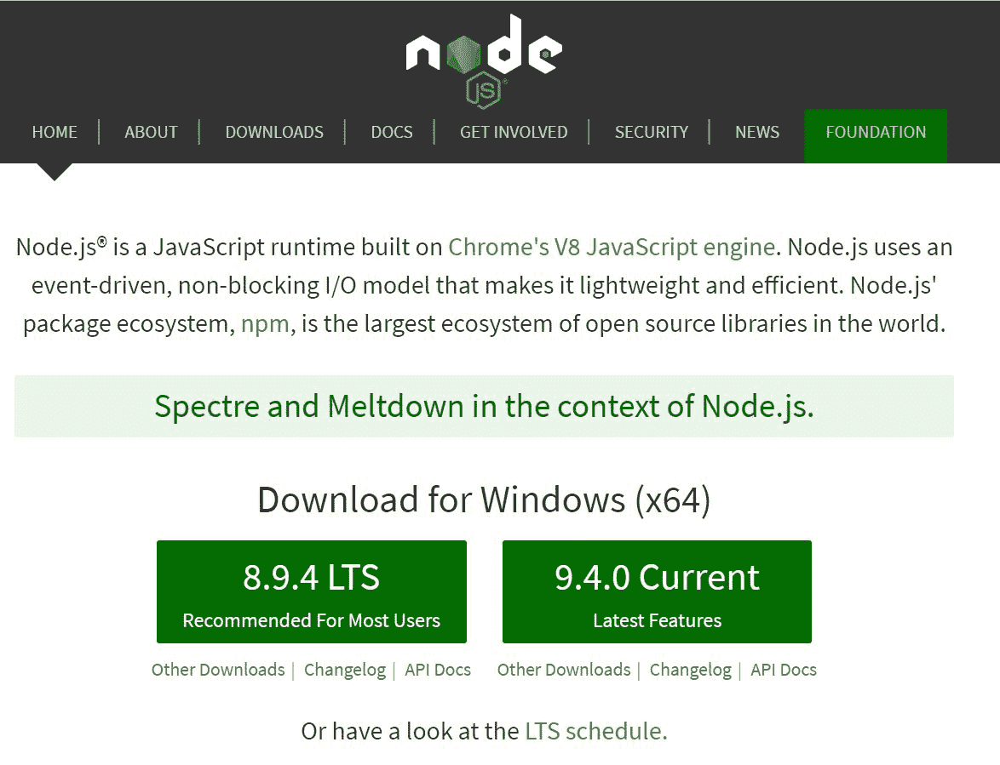
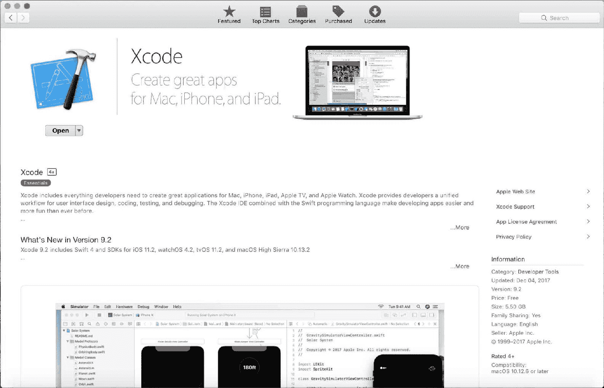
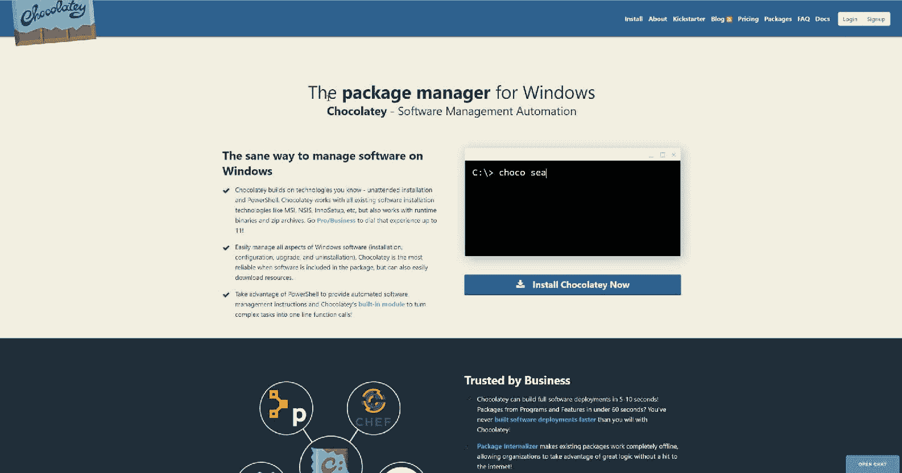

# 设置 JavaScript 环境

在本章中，我们将通过纯 JavaScript 和 React 的示例来探索设置你的 JavaScript 开发环境。

在本章中，你将了解：

+   安装你的 IDE

+   如何设置你的测试框架

+   在 JavaScript 中编写你的第一个测试

# Node.js

Node.js，通常称为 Node，实际上对于现代 Web 应用程序开发是必需的。在本节中，我们将讨论 Node 究竟是什么，提供你需要 Node 的原因，并最终讨论你可以在哪里找到 Node 安装说明。

如果你已经熟悉这些主题，那么请随意跳转到下一节，在那里我们将以类似的方式讨论 NPM。

# 什么是 Node？

Node 是在 2009 年底由 Ryan Dahl 创建的。基于 Chrome 的 V8 引擎，Node 提供了一个为提供事件驱动的、非阻塞的 I/O（输入/输出）而构建的 JavaScript 运行时，用于服务 Web 应用程序。

当时，Chrome 已经创建了最快的 JavaScript 引擎。同时，他们决定开源其代码。出于这两个极其有说服力的原因，Node 决定使用 V8 引擎。

Ryan Dahl 对当时非常流行的 Apache HTTP 服务器的性能感到不满。Apache 处理并发连接的方式中存在的问题之一是它为每个连接创建了一个新线程。在这些线程之间创建任务和任务切换都是 CPU 和内存密集型的。出于这些原因，Dahl 决定用事件循环和回调模式编写 Node，而不是使用线程进行并发连接。

# 我们为什么需要 Node？

要在现代 Web 应用程序中进行 TDD（测试驱动开发）JavaScript，我们绝对需要 Node。在编写现代 Web 应用程序时，你很可能正在使用以下流行的框架之一：ReactJS、Angular、Ember.js、Vue.js 或 Polymer。这些应用程序中的大多数都需要在 Node 中进行编译步骤。

使用 Node 的另一个原因是我们要利用 JavaScript 中的新特性。Node 本身不支持这些特性，但已经编写了库，可以将 JavaScript 的新版本（ECMAScript 2015+）转换为你的目标浏览器所支持的 JavaScript 版本。

最后，为了这本书的目的，我们需要 Node 来运行我们的测试。稍后，我们将讨论我们如何在编写代码的同时持续运行我们的测试。这被称为持续测试，对于快速开发是必不可少的。

# 安装 Node

在你的机器上安装 Node 有多种选择。我们将涵盖手动安装和从软件包管理仓库安装。

使用软件包管理仓库的好处有很多。你想要这样安装的主要原因可能是版本管理的便利。Node 经常更新版本，使用软件包管理器可以帮助你通知可用的更新。它还可以帮助以简单高效的方式安装这些更新。我们将从手动安装开始，然后是使用 Linux 软件包管理器、Mac OSX 软件包管理器，最后是 Windows 软件包管理器安装。

要手动安装 Node，打开你喜欢的浏览器并访问 [`nodejs.org`](http://nodejs.org)。你应该会看到以下截图类似的内容。无论你的操作系统是什么，Node 网站都会有当前和**长期支持**（**LTS**）版本的 Node 安装文件的下载链接。对于 Windows 和 Mac，Node 网站提供安装程序。对于 Linux，Node 提供二进制文件和源代码。假设你熟悉你的操作系统，安装过程相当直接，不应该有任何问题。



软件包管理器极大地简化了许多应用程序的安装。如果你对软件包管理器不熟悉，它们基于有一个应用程序和工具仓库的概念，这些应用程序和工具可用于在软件包管理器针对的系统上安装。现在几乎每个可用的系统都有相应的软件包管理器。Linux 有许多发行版的不同的软件包管理器。Mac 使用名为 *Homebrew* 的系统，而 Windows 有一个名为 *Chocolatey* 的软件包管理器。

# Linux

首先，我们将介绍如何使用 Ubuntu 软件包管理器 `apt`，因为 Ubuntu 是最受欢迎的 Linux 系统之一。如果你使用的是不同的发行版，过程应该非常相似。唯一的区别是软件包管理器的名称。打开终端窗口并输入以下命令来为 Ubuntu 安装 Node：

```cs
$ sudo apt-get update
$ sudo apt-get install nodejs
```

这很简单；现在最新的 Node 版本已经安装好了，你可以开始使用了。这些相同的命令会在有新版本可用时更新 Node。

# Mac OSX

Mac 默认没有预装软件包管理器。要安装 Homebrew，你必须打开终端并执行以下命令：

```cs
ruby -e "$(curl -fsSL https://raw.githubusercontent.com/Homebrew/install/master/install)"
```

现在你已经安装了 Homebrew，你还需要满足另一个要求。你必须安装苹果的 Xcode，你可以在 App Store 中搜索到它。就像 Mac 上的任何其他应用程序一样，一旦找到它，只需点击安装应用程序按钮，Xcode 就会下载并安装：



现在我们已经在系统上安装了 Node 的所有先决条件，安装过程非常简单。从终端窗口，执行以下命令：

```cs
$ brew install node
```

更新 Node 同样很简单。偶尔，当你想要更新时，执行以下命令：

```cs
$ brew update
$ brew upgrade node
```

现在，你的 Mac 上已经安装了最新版本的 Node。

# Windows

Windows 也有包管理器。就像 Mac 一样，Windows 的包管理器不是预安装的。Windows 的包管理器名为 Chocolatey，可以在 [`chocolatey.org`](https://chocolatey.org) 找到：



要安装 Chocolatey，以管理员身份打开命令提示符 (`cmd.exe`) 并执行以下命令：

```cs
@"%SystemRoot%\System32\WindowsPowerShell\v1.0\powershell.exe" -NoProfile -ExecutionPolicy Bypass -Command "iex ((New-Object System.Net.WebClient).DownloadString('https://chocolatey.org/install.ps1'))" && SET "PATH=%PATH%;%ALLUSERSPROFILE%\chocolatey\bin"
```

在 Chocolatey 安装完成后，您可能需要在能够使用它之前重启命令窗口。以管理员身份重启命令提示符，然后执行以下命令，使用 Chocolatey 包管理器在 Windows 上安装 Node：

```cs
C:\>choco install nodejs
C:\>refreshenv
```

执行第一个命令后，您将被提示执行一个脚本。您需要同意运行脚本以安装 Node。

要使用 Chocolatey 升级 Node，执行以下命令：

```cs
C:\>choco upgrade nodejs
```

您可能需要同意运行安装脚本。如果提示，只需按下 *Y* 键并按 *Enter*。现在您已经拥有了最新的 Node 版本。

# NPM

NPM 是 Node 环境和社区的一个关键部分。没有 NPM，Node 就不会像现在这样蓬勃发展。在本节中，我们将讨论 NPM 是什么，NPM 不是什么，为什么您需要 NPM 来进行 Node 开发，以及最后，您可以从哪里获取 NPM 以及如何安装它。

# 什么是 NPM？

**NPM**（**Node Package Manager**）最初于 2010 年初发布。NPM 由 Isaac Z. Schlueter 编写，现在由一个开发团队维护。尽管 NPM 的缩写中有 Node，但它也可以用来管理浏览器包。

在过去几年中，许多包管理器是专门为浏览器包创建的。其中最突出的是 *Bower*。这些二级包管理器之所以被创建，是因为人们认为 NPM 是最适合，或者可能仅适合管理 Node 包的包管理器。这种看法已经减弱；然而，Bower 的官方网站现在建议不要使用它。

# 我们为什么需要 NPM？

虽然您需要安装 NPM，但您不一定必须使用它。在 2016 年晚些时候，Facebook 发布了一个名为 *Yarn* 的替代包管理器，它使用 NPM 注册表，因此您可以使用所有喜欢的包。

很可能还有其他 NPM 的包管理替代方案。这些替代包管理器很重要，因为它们推动了 NPM 的改进，但最终，它们可能会逐渐消失，NPM 仍将是 Node 以及 JavaScript 的一般首选包管理器。如果您决定使用 Yarn 等替代包管理器，您将需要使用 NPM 来安装它。

# 如何安装 NPM？

好消息；如果您已经完成了 Node 的安装过程，那么您已经安装了 NPM。您可能偶尔想要在 Node 的发布周期之外升级 NPM。要尝试升级，只需打开您操作系统首选的控制台或终端窗口，并执行以下命令：

```cs
>npm install -g npm
```

NPM 只是你电脑上的另一个可执行文件。它接受一系列参数或参数。在这种情况下，我们要求 NPM 安装一个包。第二个参数`-g`告诉 NPM 我们想要全局安装请求的包。最后，我们要求 NPM 安装的包是 NPM。

# 对 JavaScript IDE 的简要介绍

虽然你不需要一个真正的**IDE**（**集成开发环境**），但你将需要一个文本编辑器。为什么不选择一个能为你做些重活的文本编辑器呢？实际上，对于 JavaScript 开发，有两种类型的 IDE 可用。第一种实际上更像是一个文本编辑器，而第二种则是一个功能齐全的编辑器，内置编译和源代码控制。

虽然你可以只用简单的文本编辑器和控制台/终端窗口来处理 JavaScript，但我们建议使用功能更强大的工具。

# Visual Studio Code

如 C#部分所述，Visual Studio Code 是一个基于 Electron 框架的轻量级编辑器，使用 TypeScript 开发，这是一种由微软设计来扩展 JavaScript 的静态类型语言。TypeScript 编译成 JavaScript，所以最终 Visual Studio Code 是一个 JavaScript 应用程序。

# 为什么选择 Visual Studio Code？

对于使用 JavaScript，你可能选择 Visual Studio Code 或其他基于 Electron 的编辑器有几个原因。VSCode 轻量级，拥有广泛的插件架构，与源代码控制集成，并且非常容易设置和使用。

# 安装 Visual Studio Code

安装 VSCode 极其简单。如果你已经跟随了*C#*部分，那么你很可能已经安装了 VSCode。如果没有，这里有一些未讨论的替代安装方法。

# Linux

要在 Linux 上安装（再次提醒，这是一个针对 Ubuntu 的示例），只需执行以下命令：

```cs
sudo apt-get update
sudo apt-get install code # or code-insiders
```

# Mac

很遗憾，我没有一个花哨的命令行方法在 Mac 上安装 VSCode。相反，请访问 Visual Studio Code 的主页[`code.visualstudio.com`](https://code.visualstudio.com)，并遵循那里的安装说明。

# Windows

对于 Windows 系统，就像 Node 一样，我们可以使用 Chocolatey 来安装 VSCode。要使用 Chocolatey（[`chocolatey.org/install`](https://chocolatey.org/install)）安装，请在控制台窗口中执行以下命令。记住，你可能需要以管理员身份运行控制台：

```cs
C:\> choco install visualstudiocode
```

# 安装所需的插件

我们推荐安装的两个插件是`npm`和`npm-intellisense`，因为它们将有助于流程并提供提示，当你不确定是否使用了正确的包名时。

# 配置测试环境

Visual Studio Code 提供了内置的测试运行功能。然而，我们不会选择这些选项进行 JavaScript 开发。为了测试驱动我们的应用程序并展示我们的测试方法，我们认为使用 VSCode 内可用的终端将更加合适，并且更适合将要使用的流程。

# WebStorm

WebStorm 是由 JetBrains 用 Java 编写的完整 IDE。

# 为什么选择 WebStorm？

WebStorm 基本上包含了您开发基于 JavaScript 的应用程序所需的一切。它还支持许多 JavaScript 生态系统中的 JavaScript 替代品，如 TypeScript、Flow 和 React JSX。WebStorm 还与许多代码质量工具无缝集成，如 ESLine、TSLint 和 JSHint。

WebStorm 的唯一缺点是它确实需要付费。但是，当你这么看的时候，付费产品实际上是一件好事。制作付费产品的公司有很好的理由继续维护它。JetBrains 提供通过单次购买或订阅购买 WebStorm。我们建议选择订阅，因为您的前期成本最小化，并且 JetBrains 有更多的动力让您保持满意。

# 安装 WebStorm

要安装 WebStorm，我们将使用 JetBrains 创建的新程序，称为*The JetBrains Toolbox App*。Toolbox App 旨在跟踪版本更新并为所有 JetBrains 产品提供一个共同的启动点。一旦安装，安装任何 JetBrains 工具都变得非常容易。

# Linux

在撰写本文时，似乎没有从`apt-get`安装 ToolBox 或 WebStorm 的方法。因此，我们只能采取困难的方式。请访问 ToolBox 下载页面[`www.jetbrains.com/toolbox/app/`](https://www.jetbrains.com/toolbox/app/)并下载 Linux tarball。然后，打开一个终端到您的下载目录。一旦到达那里，执行以下命令：

```cs
mv jetbrains-toolbox-<version>.tar.gz <application directory root>/jetbrains-toolbox-<version>.tar.gz
cd <application directory root>
tar –xj jetbrains-toolbox-<version>.tar.gz
chmod –R 777 jetbrains-toolbox-<version>
cd jetbrains-toolbox-<version>
./jetbrains-toolbox 
```

# Mac

在 Mac 上，我们还可以再次使用 Homebrew 进行安装。只需执行以下命令：

```cs
brew cask install jetbrains-toolbox
```

# Windows

在 Windows 上，我们能够使用 Chocolatey 安装 Toolbox。执行以下命令然后启动应用程序：

```cs
choco install jetbrainstoolbox
```

我们安装 ToolBox 的最终目标是安装 WebStorm。因此，当 ToolBox 打开时，如果您购买了任何 JetBrains 产品，请登录；如果您只是想试用，请跳过登录。接下来，在产品列表中找到 WebStorm 并点击安装按钮。安装完成后，您将能够点击一个启动按钮，该按钮将替换安装按钮。

# 安装您需要的插件

我们为使用 WebStorm 的插件带来了好消息。WebStorm 提供了一个庞大的插件社区，你几乎可以找到你想要的任何插件，这些插件都可以通过应用程序内置的插件管理系统访问。然而，对于本书的目的而言，你实际上并不需要任何插件。因此，我们已经完成了插件的安装！实际上，WebStorm 内置的功能太多了，我们将忽略或甚至关闭其中的一些功能，以便我们可以按照自己的方式工作。

# 配置测试环境

就像在 Visual Studio Code 中一样，对于 WebStorm，我们不会介绍如何设置内置的测试运行能力。WebStorm 提供了一个可以开启的终端显示，并支持同时打开多个上下文。

# Create React App

现在你已经安装了最新版本的 Node 和 NPM，请将注意力转向你想要测试的应用程序。由于其不断增长的流行度，我们选择通过测试一个 React 应用程序来解释和演示测试驱动开发。

根据 React 网站，React 是*一个用于构建用户界面的 JavaScript 库*。我们将专注于使用它来构建前端浏览器应用程序，但它也可以用来创建移动和桌面应用程序。

React 是由 Facebook 创建和维护的。React 是为了解决 Facebook 在其用户界面中遇到的问题而创建的，现在它正在互联网上掀起一场风暴。Facebook 还创建了一个名为 Create React App 的库，以便快速启动 React 应用程序。

# Create React App 是什么？

Create React App 是由 Facebook 创建的一个 NPM 包，旨在提供一种零配置的方式来创建 React 应用程序。React 需要相当多的设置才能开始，手动配置一个 React 应用程序可能需要几天时间。Create React App 可以将这个时间缩短到一分钟以内。

# 安装全局模块

在你能够使用命令行工具实际创建 React 应用程序之前，必须安装 Create React App 的全局 NPM 包。要在控制台或终端窗口中安装最新版本的 Create React App 全局脚本，请执行以下命令：

```cs
>npm install -g create-react-app
```

# 创建 React 应用程序

一旦全局模块安装完成，你就可以开始使用 Create React App 了。创建一个 React 应用程序的过程非常流畅和简单。在我的系统中，我有一个名为`\projects`的目录，用于存放所有我的前端应用程序项目。在你的机器上打开一个具有相同目的的目录的命令行/终端窗口，并执行以下命令来创建一个新的 React 应用程序：

```cs
\projects>create-react-app <projectName>
```

在我们的案例中，我们的测试用例名称是 Speaker Meet，所以作为一个例子，我的命令如下所示：

```cs
\projects>create-react-app speakermeet-spa
```

如同在 C#部分提到的，SpeakerMeet 既有后端（RESTful Web API），也有前端（基于 React 的**SPA**（**单页应用程序**））。

# 运行 Create React App 脚本

当 `create-react-app` 脚本运行完成后，会显示一个可用命令列表。您需要确保一切创建成功。您可以通过执行以下命令来启动应用程序：

```cs
>npm start
```

如果一切安装正确，您的默认浏览器将打开，并运行一个新的 React 应用程序。

# Mocha 和 Chai

Create React App 支持开箱即用的测试。最初，Create React App 使用名为 Jest 的测试库。我们想使用 Mocha 和 Chai，因为它们在 JavaScript 社区中非常受欢迎。

# Jest

Jest 是由 Facebook 编写的测试框架。就像 Create React App 一样，Jest 设计为无配置工具。Jest 还支持持续测试和代码覆盖率分析。

Jest 是设计在常见的 **BDD**（**行为驱动开发**）范式下工作的，许多其他 JavaScript 测试框架也是如此。因此，测试函数 `describe` 和 `it` 都可以用来编写测试。

# Mocha

Mocha 是另一个 JavaScript 测试框架，是我们想使用的框架。至于库交互差异，基础交互方面似乎没有太多不同。差异主要体现在断言库和模拟库上。

模拟，将在第四章 Chapter 4“开始之前需要了解的内容”中详细说明，本质上是一种提供对象、类和函数的替代实现的方法，特别是为了帮助测试过程。

Mocha 本身不包含断言库，因此必须提供。断言库是控制测试结果以及如何验证代码是否正确执行的关键。大多数使用 Mocha 的开发者依赖于 Chai 进行断言。

如前所述，另一个考虑因素是您想使用哪个模拟库。对于许多 Mocha 用户来说，这个库无疑是 **Sinon**。

我们将解释本书中使用的 Mocha 的任何和所有部分的目的。如果您想了解更多信息或想在开发时快速参考文档，您可以去 Mocha 主页[`mochajs.org`](https://mochajs.org)。

Mocha 可以使用以下命令安装到 JavaScript 应用程序中：

```cs
>npm install mocha
```

# Chai

Chai 是一个 BDD 断言库。Chai 使用流畅的 API 来允许极其灵活的断言。Chai 最受欢迎的两种使用方式是通过提供的 **should** 和 **expect** 接口。Chai 的工作方式，以及实际上每个测试框架断言的工作方式，是在断言的检查失败时抛出异常。

例如，如果您有一个名为 `foo` 的变量，其值为 **3**，并且当测试运行时您的断言是 `expect(foo).to.equal(5)`，那么这个断言将抛出一个包含消息“预期 3 等于 5”的异常。

要将 Chai 安装到您的项目中，请运行以下命令：

```cs
>npm install chai
```

在您安装 Chai 之后，还需要进行一个步骤才能在您的项目中使用它。您必须在应用程序中每个测试文件的顶部包含以下导入：

```cs
import { expect } from ‘chai’;
```

如果您想使用 should 断言，您可以将 `expect` 替换为 `should`，或者在大括号内添加 `should`，用逗号将其与 `expect` 分隔。

更多信息或查阅文档，请访问 Chai 主页 [`chaijs.com`](https://chaijs.com)。

# Sinon

我们不会在 第四章 “开始之前需要了解的内容” 中介绍模拟，但 Sinon 是 Mocha + Chai 用户中普遍首选的模拟库。一些测试框架，如 Jest 和 Jasmine，自带模拟库功能，但 Mocha 没有自带，而 Sinon 提供了出色的模拟体验。

要将 Sinon 安装到您的项目中，请执行以下命令：

```cs
>npm install sinon
```

安装完成后，您在使用 Sinon 之前需要导入它。使用以下导入语句来启用 Sinon 的使用：

```cs
import sinon from ‘sinon’;
```

# Enzyme

Enzyme 是一个旨在帮助测试 React 组件的库。

要将 Enzyme 安装到您的项目中，请执行以下命令：

```cs
>npm install enzyme react-test-renderer react-dom
```

列出的额外库 `react-test-renderer` 和 `react-dom` 是 Enzyme 正确运行所需的依赖项。

与本节中提到的其他测试实用工具一样，我们将根据需要讨论使用方法，同时讨论本书涵盖的主题。但这里有一个使用 Enzyme 的快速示例，该示例来自 Enzyme 文档 [`github.com/airbnb/enzyme`](https://github.com/airbnb/enzyme)：

```cs
import React from 'react';
import { expect } from 'chai';
import { render } from 'enzyme';
import Foo from './Foo';

describe('<Foo />', () => {
  it('renders three `.foo-bar`s', () => {
    const wrapper = render(<Foo />);

    expect(wrapper.find('.foo-bar').length).to.equal(3);
   });

   it('renders the title', () => {
      const wrapper = render(<Foo title="unique" />);

      expect(wrapper.text()).to.contain('unique');
   });}); 
```

# 退出 React 应用

不幸的是，这就是我们与 Create React App 分道扬镳的地方。为了使用 Mocha，我们需要找到一种替代方法来与应用程序一起工作。由于 Create React App 的零配置设置，我们无法简单地更新正在使用的测试框架，这对我们来说是个问题。

幸运的是，Create React App 以退出应用的形式为我们提供了一个出路。退出 React 应用程序会将所有必要的配置文件和实用工具安装到我们的项目中，并移除 Create React App。一旦退出过程完成，我们将能够访问所有配置文件，并将能够切换到使用 Mocha。

要退出 Create React App，请执行以下命令：

```cs
>npm run eject
```

如果您查看项目根目录下的 `package.json`，您将看到添加了很多信息和配置。

在对 `package.json` 进行任何重大修改后，删除 `node_modules` 和 `package-lock.json`，然后重新运行 `npm install` 是一个好主意。

# 配置以使用 Mocha 和 Chai

在您退出 React 应用之后，在您进行任何进一步的修改之前，您应该确保一切仍然正常工作。在做出任何进一步的修改之前，请执行以下命令：

```cs
>npm start
```

现在检查是否启动了浏览器，并且应用程序正在正确运行。你将需要按 *Ctrl* + *C* 退出运行进程：

```cs
>npm run build
```

在此命令之后，检查是否在项目根目录中创建了一个构建文件夹，并且控制台没有显示错误：

```cs
>npm test
```

尽管你即将更改测试配置，但你将使用一些 Create React App 提供的库。你想要确保当你退出时，这些先决条件已经正确过渡。与 `npm start` 一样，你将需要按 *Ctrl* + *C* 退出此进程。

假设所有命令都无问题执行，你现在可以开始将测试环境切换到 Mocha 的过程。执行以下命令以确保安装必要的依赖项：

```cs
>npm install mocha chai sinon enzyme
```

打开 `package.json` 并更新以下行：

```cs
"babel": {
   "presets": [
     "react-app"
   ]
 },
```

将前面的代码更改为：

```cs
"babel": {
   "presets": [
     "react",
     "es2015"
   ]
 },
```

你还需要安装 BabelJS 预设 ES2015：

```cs
>npm install babel-preset-es2015
```

接下来，找到并删除 `package.json` 中的 `jest` 设置。你现在可以更改 `test` 脚本来执行 Mocha 而不是 Jest。找到 NPM 脚本并更新测试脚本如下：

```cs
"test": "node scripts/test.js --env=jsdom"
```

将前面的代码更改为：

```cs
"test": "mocha --require babel-core/register ./scripts/test.js --require babel-core/register ./src/**/*.spec.js"
```

你刚才所做的更改将导致 Mocha 执行所有测试。不过，它只会执行一次。你想要一个在工作的同时持续运行测试的方法，所以你需要添加一个额外的脚本。在你修改的行末尾添加一个逗号，然后在其下方添加以下脚本：

```cs
"test:watch": "npm test -- -w"
```

现在，你需要更新当你退出时提供的 `test.js` 文件。打开 `<项目根目录>/scripts/test.js` 并将里面的所有代码替换为以下内容：

```cs
'use strict';

import jsdom from 'jsdom';

global.document = jsdom.jsdom('<html><body></body></html>');
global.window = document.defaultView;
global.navigator = window.navigator;

function noop() {
  return {};
}

// prevent mocha tests from breaking when trying to require a css file
require.extensions['.css'] = noop;
require.extensions['.svg'] = noop;
```

此文件只是为测试设置基础环境，以便测试在内部执行。注意 `noop` 函数及其用法。目前，当你进行测试时，你正在忽略生产代码所需的 `css` 和 `svg` 扩展。在测试过程中，如果你在需要不同扩展时遇到问题，你可能需要回到此文件并将有问题的扩展添加到列表中。

你几乎完成了；在你正式切换到 Mocha 之前，你只需要进行一个修改。在你的 `src` 目录中找到 `App.test.js` 文件，并将其重命名为 `App.spec.js`，然后更新内容如下：

```cs
import React from 'react';
import ReactDOM from 'react-dom';
import { expect } from 'chai';

import App from './App';

describe('(Component) App', () => {
  it('renders without crashing', () => {
    const div = document.createElement('div');
    ReactDOM.render(<App />, div);
  });
});
```

你在这里真正做的只是导入 Chai 并添加一个 `describe` 块。其余的测试代码保持不变，是 Create React App 提供的默认测试。

# 一个快速 kata 来检查我们的测试设置

对于这个设置测试，你需要执行回文代码 kata。这个 kata 可能会变得复杂，但你只需要关注最基本的形式。

# 要求

这个 kata 的要求如下：

```cs
Given a string value
 And Given the provided string is not a palindrome
 When checked
 Then return false

Given a string value
 And Given the provided string is a palindrome
 When checked
 Then return true
```

# 执行

正如你一直应该做的，你将从一个模板化的测试文件开始，用于验证单元测试框架是否配置正确：

```cs
import { expect } from 'chai';

describe('Test Framework', () =>  {
  it('is configured correctly', () => {
    expect(1).to.equal(0);
  }
}
```

我们已经展示了这个模板的失败版本。在你开始编写实际的 kata 测试之前，运行`test:watch` NPM 脚本来验证测试失败。同时，验证它是否因为预期的*1*但实际结果是*0*而失败。在测试正确失败后，将零改为一，并验证测试现在是否通过。只要这两个验证都正确工作，我们就会继续，并开始处理代码 kata。

# 开始 kata

对于这个 kata，你将要做的是编写一个`ItExists`测试。同样，这些类型的测试有助于推动工作并防止写作障碍。你将用以下代码替换检查框架的代码。

*红色阶段*；编写一个失败的测试，期望存在一个`isPalindrome`函数：

```cs
describe('Is Palindrome', () => {
  it('exists', () => {
    expect(isPalindrome).to.exist;
  });
});
```

验证这个测试是否失败。在继续使测试通过之前看到失败是很重要的。这将有助于确认你的测试设置是否正常工作。

现在是*绿色阶段*；让测试通过。定义一个`isPalindrome`函数，并再次运行测试以查看它是否通过。

```cs
function isPalindrome() {
}
```

对于下一个测试，我们想要考虑一个会产生结果的简单测试用例。同样，我们正在跳过不良数据问题。我们可以想到的最简单的会产生结果的测试用例是一个单个字母。对于你将在这些测试中使用的回文定义，单个字母是一个回文。在之前的测试下添加以下测试：

```cs
it('a single letter is a palindrome', () => {
  // arrange
  const value = 'a';

  // act
  const result = isPalindrome(value);

```

```cs
  // assert
  expect(result).to.be.true;
});
```

现在，为了让它通过：

```cs
function isPalindrome() {
  return true;
}
```

现在你有一个通过测试，但你总是返回 true。当你编写下一个测试时，你希望它失败。所以，你应该编写一个测试，当传入的值不是回文时。最简单的非回文就是两个不相同的字母：

```cs
it('two non-matching letters is not a palindrome', () => {
  // arrange
  const value = 'at';

  // act
  const result = isPalindrome(value);

  // assert
  expect(result).to.be.false;
});
```

现在，让它通过：

```cs
function isPalindrome(value) {
  if(value.length === 1) {
    return true;
  }

  return false;
}
```

好吧，所以现在你只返回单个字母的 true。这为我们打开了下一个测试，回到一个回文；为相同的两个字母编写一个测试：

```cs
it('two matching letters are a palindrome', () => {
  // arrange
  const value = 'oo';

  // act
  const result = isPalindrome(value);

  // assert
  expect(result).to.be.true;
});
```

现在，让它通过：

```cs
function isPalindrome(value) {
  if(value.length === 1) {
    return true;
  }

  if(value.length === 2 && value[0] === value[1]) {
    return true;
  }

  return false;
}
```

下一个测试是要有一个三个字母的回文单词。目前，这个应该失败：

```cs
it('three letter palindrome', () => {
  // arrange
  const value = 'mom';

  // act
  const result = isPalindrome(value);

  // assert
  expect(result).to.be.true;
});
```

为了让这个测试通过，想想你到目前为止学到的东西。检查回文的一个算法就是从两端开始，检查最外层的两个字母。如果这两个字母匹配，那么就分别在两边各移动一个字母。重复这个检查，直到你到达单词或短语的中心。如果中心是一个字母，那么它就是一个回文；否则，检查中间的两个字母是否匹配。让我们通过使用递归来尝试这个概念，以便让最新的测试通过：

```cs
function isPalindrome(value) {
  if(value.length === 1) {
    return true;
  }

  if(value.length === 2 && value[0] === value[1]) {
    return true;
  }

  if(value[0] === value[value.length -1]) {
    return isPalindrome(value.substring(1, value.length - 1));
  }

  return false;
}
```

现在，我们需要检查一个四字母回文是否通过：

```cs
it('four letter palindrome', () => {
  // arrange
  const value = 'abba';

  // act
  const result = isPalindrome(value);

  // assert
  expect(result).to.be.true;
});
```

它通过了；太棒了！我们将以两个练习结束这个代码 kata。第一个练习是添加一个测试来检查“a man a plan a canal panama”，并让它通过。第二个练习是重构`isPalindrome`的代码。虽然这是一个小的函数，但它仍然可以进行一些整理，并且可能需要进行一些优化。

# 摘要

您现在应该已经安装了 Node，并且配置好了您的 JavaScript 开发环境。本书余下的 JavaScript 示例将假设您使用 WebStorm。

但是，在深入之前，第四章，*开始之前需要了解的内容*，将专注于在开始之前您还需要了解什么。
