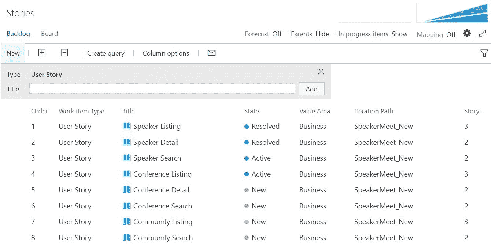
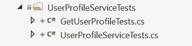

# 接近问题

在第五章，“Tabula Rasa – 以 TDD 的心态接近应用程序”，讨论了演讲者遇到应用程序的细节。需求已经在非常高的层面上被定义。用非常、非常宽的笔触描绘了一幅画面。许多应用程序的概念通常就是这样开始的，有一个高级描述和一个重要的关键功能被定义。它可能始于一张吧台纸或白板草图，但无论如何，某个地方、某种方式形成了一个想法。

在本章中，我们将涵盖：

+   定义演讲者遇到的应用程序

+   架构选择

+   测试方向

# 定义问题

要定义问题，首先必须定义愿景。应该描述并概述清晰的目标。演讲者遇到问题的出现是由于技术演讲者寻找一个单一、集中的地方来寻找演讲机会和场所。确定用户群体和会议组织者同样需要寻求和找到为他们的会议提供演讲者的解决方案。

因此，演讲者遇到的想法产生了。但是，应用程序将如何工作？它应该是一个移动应用程序还是网站？数据将如何收集和管理？用户是否允许创建自己的个人资料？用户能否提交演讲者、社区和会议信息？应用程序将驻留在何处以及如何托管？而且我们在世界的哪个角落开始？

# 消化问题

应用程序将被设计用来解决的问题已经被定义。演讲者遇到将把技术演讲者、社区和会议聚集在一起。现在目的已经定义，必须消化。

如前一章所建议的，从所有方向攻击新的应用程序是不明智的。试图通过一次性实现每个期望的功能来接近新的软件项目是一项相当艰巨的任务。定义系统的每个愿望和需求也可能是一项庞大的工作。

最好定义小的、可管理的应用程序块，以便可以快速交付以评估其正确性和有效性。问题是，一个人如何定义可以分离成小块的内容，并确定这个小块具有足够的价值？

# 历史故事、特性和故事；哦，我的天啊！

许多软件开发项目将维护所谓的*产品待办事项列表*。这是系统可能被要求执行的所有事情被汇编的地方。产品待办事项列表可能包含从最大的想法到最微小的细节。重要的是这些想法被记录下来。

应定期整理和维护待办事项列表。应根据其重要性评估项目，并适当排序。如果确定某个项目是下一个需要工作的最重要的事情，则应将其拆分成适合团队及时有效交付的适当大小的故事。

# 史诗

较大、较广泛的想法被定义为**史诗**。这些可能具有相当重要的范围和规模。演讲者可能被定义为史诗。演讲者史诗是应用程序中用于与技术演讲者相关的一切和任何事物的部分。

术语“史诗”用于表示史诗中包含的功能和故事都围绕一个单一、中心的思想。这些本质上最初是一个单一的大型用户故事，然后被拆分成更小的功能和故事。史诗可能需要几个迭代才能完成。

# 功能

功能通常比史诗小，并且包含在史诗中。一个功能通常包含许多与它负责的主题相关的用户故事。将功能视为与史诗相同的方式，它们只是更小的分组。

一个功能可能包括一个**演讲者目录**或**演讲者详情**。演讲者目录可能包含与在系统中显示、排序、过滤和搜索演讲者相关的一切。演讲者详情功能可能定义有关单个、个别演讲者信息及其在应用程序中显示的详细信息和功能。

# 用户故事

根据团队偏好，一个故事可能小到在查看其详情时看到演讲者的名字。提醒一下：故事可能太小。最好是将其拆分成足够小，以便开始工作，而不是在细节上浪费时间。如果做得正确，细节将在开发周期中自然出现。

确定足够小的事情应该留给团队决定。一个很好的经验法则是，故事应该需要半天到三天的时间来完成。少于半天的工作量，故事很可能会被拆分成过小的部分。多于三天的工作量，可能有机会将故事拆分成两个或更多个故事。

故事可能太小。

不要陷入将故事拆分成过小部分的陷阱。试图编写越来越小的故事可能会浪费精力。如果你在实践 Scrum，记得在每个迭代的结束时可以并且应该提出小的改进建议。在回顾会议期间，应讨论故事大小及其有效性。如果决定大小不合适，无论是太大还是太小，应在下一个迭代开始之前进行调整。

# 维护您的待办事项列表

那么，为什么保持产品待办事项列表如此重要呢？一个维护良好的待办事项列表将定义团队应该做什么工作，并帮助他们规划已知和即将到来的任务。这也有助于团队制定预测，以便规划特定功能可能完成的时机。



如果捕获了适当的指标，一个纪律严明的团队可以在每个冲刺中交付可靠的速率。通过合理大小和估计的故事，可以预测待办事项中即将到来的项目的合理时间表。例如，如果一个团队在每个冲刺中可靠地交付了 20 个点，而下一个五个故事被估计为每个 8 个点，那么预计这五个故事将在大约两个冲刺内完成是合理的。当然，这并不是承诺，而只是一个估计。

# 演讲者会议问题

记住，应用程序的范围最初将保持小而有限。一些特性现在可能被识别为未来的项目，但最小可行产品的有限范围仍需要更好地定义。如果确定这些特性对首次发布不是必需的，将继续向产品待办事项中添加更多特性，并将它们的优先级设定得相当低。然而，考虑到最小可行产品仍需要提供一些价值。一个什么也不做的软件应用对任何人都没有多少价值。

花时间优先考虑特性和故事的潜在价值，将有助于决定应该包含在初始发布中的内容，以及可以等待的内容。通过确定提供特定功能所需的工作量，并将这些信息与提议的价值相结合，可以做出关于哪些特性将首先交付的明智决定。

# 有意义的分离

对应用程序提出的特性的头脑风暴有助于描述系统。找到有意义的、逻辑上的分离将有助于定义软件解决方案特定部分的范围。逻辑边界可能包括产品待办事项中定义的史诗和特性。它们也可能由技术划分决定。

# 演讲者

演讲史诗将由围绕应用程序演讲部分的全部特性和故事组成。这包括演讲者目录和演讲者详细信息。本节还将包含未来可能添加的任何增强功能和特性。未来的功能可能包括演讲者评分和评论、幻灯片、演示文稿、YouTube 或 Vimeo 视频，等等。这些尚未确定，可以在稍后评估，届时可以权衡提议的价值。

并非所有功能都需要一开始就决定。记住，朝着最小可行产品努力，并在需要时构建功能。

以下是演讲史诗的基本特性故事：

```cs
As user group organizer
 I want to see a listing of all speakers
 So that I can find speakers for my user group.

As conference organizer
 I want to see details of a particular speaker
 So that I might view more information about them.
```

我们使用故事格式来描述应用的所有级别的细节。也就是说，史诗以故事的形式呈现，主题或特性以故事的形式呈现，具体需求也以故事的形式呈现。在层次结构中，只有具体需求被称为用户故事。给它们所有故事格式的原因很简单。我们希望能够编写一个需求，并能够以最小的麻烦将其从用户故事转换为特性或甚至史诗。因此，我们使用相同的格式来编写需求，无论该需求抽象级别如何。

这些特性故事是一个良好的开端。这将给企业提供机会在确定首先应该做什么之前对特性进行评分和优先排序。当向团队展示时，这些特性故事很可能会被分解成更小、更详细的用户故事，并带有验收标准。

良好的验收标准将帮助团队确定何时可以标记故事为完成。如果所有条件都已满足，则故事完成并可交付。如果在某个时候，决定需要更多的工作才能交付所需的功能，则应包括额外的标准或向待办事项列表中添加新的故事。

```cs
As user group organizer
 I want to see a listing of all speakers
 So that I can find speakers for my user group.
```

```cs
Given system contains speakers
 When viewing speaker catalog
 Then a listing of all speaker summaries is returned.
```

```cs
As conference organizer
 I want to see details of a particular speaker
 So that I might view more information about them.
```

```cs
Given specified speaker exists
 When speaker selected
 Then speaker details are returned.
```

```cs
Given specified speaker does not exists
 When speaker selected
 Then a friendly error message should be returned.
```

# 社区

用户组和聚会构成了应用中的社区部分。此应用部分的主要目的是为演讲者、潜在成员和参会者提供一个地方，以便他们可以找到和发现他们所在地区的技术社区。任何前往特定城市的旅行者也可能对了解哪些用户组或聚会可供他们参加感兴趣，无论是为了演讲还是一般参加。应用中的社区部分将包括社区目录和用户组详情。如果将来提出任何增强建议，它们可以作为新的特性或用户故事添加到社区史诗中。

在不久的将来，系统中的社区部分将增加位置搜索功能。这将使用户能够根据距离搜索社区，也许允许演讲者确定他们可能感兴趣的、半径为 200 英里的社区。这个功能被确定为 Speaker Meet 应用程序初始版本中不必要的功能。

一份社区特性故事的简短列表可以在这里找到：

```cs
As a speaker
 I want to see a listing of all communities
 So that I can find potential user groups at which to speak.
```

```cs
As a speaker
 I want to see details of a particular community
 So that I can learn more about the user group.
```

与演讲者特性故事类似，社区特性故事将帮助产品所有者优先考虑要开发的功能。这些特性故事也可能会被分解成更小、更详细的用户故事，并带有验收标准。请查看这里的故事：

```cs
As a speaker
 I want to see a listing of all communities
 So that I can find potential user groups at which to speak.
```

```cs
Given system contains communities
 When viewing community catalog
 Then a listing of all user groups is returned.
```

```cs
As a speaker
 I want to see details of a particular community
 So that I can learn more about the user group.
```

```cs
Given community selected
 When specified community exists
 Then community detail returned.
```

```cs
Given community selected
 When specified community does not exists
 Then a friendly error message should be returned.
```

# 会议

应用中关于会议的细节和功能在会议史诗中定义和描述。这包括会议目录和会议详情。未来在稍后日期提出的增强功能和特性可能被添加到会议史诗中。

会议也可能利用位置搜索。有各种各样的第三方服务可用，并且它们可以被评估以包含在未来的版本中。像所有第三方代码一样，这些将被从主应用程序中抽象出来，以便系统免受潜在变化的影响。

```cs
As a speaker
 I want to see a listing of all conferences
 So that I can find conferences at which to speak.
```

```cs
As a speaker
 I want to see details of a particular conference
 So that I can learn more about the conference.
```

会议与社区不同，因为它们每年只举行一次，通常有众多演讲者和会议。会议功能故事将帮助产品负责人优先考虑要开发的功能。这些也可能需要被分解成更小、更详细的用户故事，并带有验收标准。请查看这里的故事：

```cs
As a speaker
 I want to see a listing of all conferences
 So that I can find conferences at which to speak.
```

```cs
Given system contains conferences
 When viewing conference catalog
 Then a listing of all conferences is returned.
```

```cs
As a speaker
 I want to see details of a particular community
 So that I can learn more about the user group.
```

```cs
Given specified conference exists
 When conference selected
 Then conference detail returned.
```

```cs
Given specified conference does not exists
 When conference selected
 Then a friendly error message should be returned.
```

# 按团队功能分离

许多自我组织的团队会根据专业知识进行划分。这可能意味着成员将自己划分为前端开发者、后端开发者、QA 等。同样，故事和任务可以根据功能进行分离。

最好由团队自己决定如何有效地组织自己和他们的工作。例如，萨莉可能是.NET 框架方面最知识渊博的开发者，而史蒂夫可能在 React 方面有更多的专业知识。可能更好的是让萨莉承担大部分后端故事，让史蒂夫专注于前端功能。

注意，以这种方式优先考虑故事，让每个团队成员都有最适合他们的工作，这是一个容易陷入的陷阱。这将是高效的，但不是有效的。相反，优先级应该集中在交付的价值上，并在之后进行优化。当需要例如大型 UI 设计变更时，让某人（例如，萨莉）与史蒂夫一起工作在 UI 功能上，例如，并没有什么不好。

# 技术分离

可能会有这样的情况，你必须执行一些之前定义史诗中无法整齐划入的工作。非功能性需求可能包括与系统部分选择的技术相关的项目。故事可能仅包括纯 Web 或前端功能，例如打包 JavaScript 文件。或者，后端或服务器端功能可能需要定义在之前的史诗之外。

很可能还会有一系列非功能性或系统规范需要评估。这些要求的例子可能包括响应时间、吞吐量或内存消耗。这些通常被添加到“完成定义”清单中，以便每个故事都应该确认非功能性要求。

许多现代的 Web 启用应用程序都是使用 JavaScript 构建的**单页应用程序**（SPA）。这些应用程序由 Web 服务器托管，并在请求时发送到 Web 浏览器。整个应用程序，或者更确切地说，应用程序的大块内容，一次全部发送。当客户端浏览器发起请求时，SPA 将更新屏幕上的数据或模拟页面转换。在 SPA 中不使用全页回发和页面重新加载。这为最终用户提供了可感知的性能提升和响应速度增加。同时，这也允许将应用程序的一些处理工作分配到客户端机器上。

通过对 SPA 的这种划分，大部分功能可以被分为*Web*和*非 Web*的标识。一个团队可能会选择以这种方式编写他们的故事。同样，一个团队可能会选择指定 Web 专家主要工作在 Web 相关功能上。这种划分的一个问题是，只有前端或后端的一个单一故事并不是可能发布的软件。它们没有单独提供价值。相反，故事可以通过去除特殊案例处理、只提供单一目的、保持 UI 更简单等方式进行拆分。

与 Web 标识类似，一个团队可能会决定将故事分为服务器端或后端功能。这可能涵盖从 API 到数据库以及所有中间的功能。Speaker Meet 应用程序的后端是用.NET、C#和 Entity Framework Core 以及 SQL Server 数据库编写的。这些技术为创建技术分离提供了极好的机会。

定义一致的 API，例如，是一个很好的起点。后端可能如何进一步细分将在本章后面讨论。

# 技术要求

Speaker Meet 应用程序有一系列的技术要求。语言选择和平台决策可以对应用程序产生巨大影响。这些决策将决定应用程序如何交付给客户端以及预期应用程序的哪些部分应该表现如何。

技术规范可以对应用程序产生重大影响。无论是**LAMP**（Linux, Apache, MySQL, PHP/Perl/Python），**MEAN**（MongoDB, Express, Angular, Node），还是 Speaker Meet 中的.NET 和 React，编程语言和框架在软件系统中可以发挥重要作用。

# React Web 用户界面

Speaker Meet 应用程序的第一个*用户界面*定义为使用 React 的 SPA，React 是一个 JavaScript 库。React 是由 Facebook 团队编写的，用于开发现代 Web 应用程序。这相当于传统*模型-视图-控制器*模板中的视图。通过使用单向数据流模型以及*虚拟 DOM*，React 是一个功能强大、性能出色且可扩展性良好的库。

将使用 JavaScript 包管理器 NPM 包含许多额外的库。额外的库包括 webpack，一个用于 JavaScript、CSS 和其他类似文件的打包器。更多内容将在后续章节中介绍。

# .NET Core

服务器端应用程序的主要语言将是.NET Core 中的 C#。随着最新版本的.NET Framework 的重构发布，开发者可以选择将框架的哪些部分包含在他们的应用程序中，并将核心级库保持到最小。

# .NET Web API

将内部信息和行为暴露给外部系统的方式，SPA 被视为外部系统，是通过提供一个**应用程序编程接口**（**API**）。API 层向外界暴露数据功能。应用程序的主要入口是一个由.NET Web API 组成的 API 集合。

# 实体框架

对于演讲者见面应用，使用了**对象关系映射器**（**ORM**）将数据库对象转换为 C#对象。有众多这样的 ORM 适用于各种不同的语言和平台。仅.NET 就有 NHibernate、LLBLGen、Dapper 等许多 ORM。对于演讲者见面应用，选择了**Entity Framework**（**EF**）Core。

选择一个如 EF Core 这样的 ORM 映射器本身就是一个要求，它将影响应用程序的架构选择。团队可能需要确定他们可用的 ORM 选项的优缺点，以及是否需要使用 ORM。

# Azure

演讲者见面应用使用 Microsoft Azure 进行托管。选择 Azure 允许团队根据需求增加或减少应用程序的部分。当然，必须做出一些架构决策，以有效地利用 Azure 提供的可用功能。

了解即将到来或期望的未来功能，可以使团队在开发应用程序的部分时做出明智的决定。

计划未来的增强功能以利用 Azure Search 的力量。核心搜索功能是以一种方式编写的，切换到 Azure Search 将对系统其他部分的影响最小。当然，实现 Azure Search 将使用 TDD（测试驱动开发）。

# 数据库

使用 Microsoft SQL Azure 来持久化演讲者信息、用户群体和社区细节、会议信息以及用户登录详情。SQL Azure 与在本地使用 SQL Server 非常相似，但有几点需要注意。例如，SQL Azure 要求每个表都有聚集索引。了解可用数据库选项的要求和差异，使团队能够就他们的数据存储选择做出明智的决定。

# N 层六边形架构

在前一章中，我们讨论了 N 层架构，其中软件应用程序被划分为多个层次。N 层应用程序通常像蛋糕的层次一样，从*A*层到*B*层再到*C*层，依此类推。以这种方式定义应用程序存在风险，因为有时功能组件并不能干净利落地归入某一层。只要层次之间保持松散耦合，功能不跨越边界，您的应用程序应该保持良好的结构和组织。

# 六边形架构

六边形架构最早由 Alistair Cockburn 在 2000 年代提出。六边形架构也被称为端口和适配器，其中端口是抽象，适配器是实现。这种设计应用程序的方法改变了层级的概念，将其转变为应用程序的内部和外部组件。 

有些人可能会争论，六边形架构和 N 层架构是相同的。虽然可以使用 N 层线性分层方法实现六边形架构，但主要区别在于层与层之间的交互方式——线性或通过特定的端口和适配器：两个不同的区域，内部和外部部分。用最简单的话说，六边形方法可以在某些东西无法整齐地放入一系列连续层次时为您提供帮助，并有助于防止层之间的紧密耦合。

需要记住的主要是，有一些东西需要分离——数据源、用户界面、第三方库、框架——基本上是任何不是由您的团队编写的组件，甚至可能包括层次本身。通过使用在前一章中讨论的*依赖倒置原则*和*仓储模式*，可以将耦合度降至最低。这提供了更大的灵活性、可维护性和可测试性。

通过最小化组件之间的耦合，可以提供更大的灵活性。新功能可以插入到现有应用程序中。现有应用程序的部分可以被替换为其他完全不同的东西。如果现有应用程序的部分与其他部分紧密耦合，这是无法做到的。

如果应用程序被正确分割，维护起来会容易得多。通过严格遵循在前几章中概述的 SOLID 原则，这几乎变得轻而易举。通过严格遵循六边形设计和保持内部逻辑不受外部依赖的影响，可以轻松地进行修改，而不会影响系统的其他部分。

测试松散耦合的系统比其他方法要容易得多。通过限制依赖关系，测试可以限制在测试的方法、函数或系统功能上。

# 基本而有效的 N 层划分

三层应用程序中的典型层包括表示层、业务逻辑和数据访问。这些可以进一步细分，但这对于许多应用程序来说是一个基本的起点。

通过以这种方式划分应用程序，产生了第一个关注点的分离。业务逻辑不应出现在表示层。数据访问代码不应出现在业务逻辑层。

一切都有其位，一切都在其位。

-玛丽·波平斯

# 服务层

业务层，或称为*服务层*，是应用程序业务逻辑所在的地方。无论你选择使用单个服务、管理器还是领域对象的概念，其本质上是相同的。应用程序的逻辑应该位于与表示信息和数据访问代码分开的地方。

# 微服务

在你的开发生涯中，你可能在某个时刻听说过*微服务*这个术语。这些通常是极小、独立的应用程序，为系统中的其他部分服务一个且仅有一个目的。无论是作为独立 API 还是部署到 Azure Service Fabric 的可执行文件，它们都可以独立于应用程序的其他部分进行开发和部署。微服务通常是小型、可重用的函数，通常被多个不同的应用程序或部署的用户界面所消费。

# 数据访问层

为了避免在应用程序的其他部分散布数据持久化代码，许多应用程序依赖于某种类型的数据访问层。这允许所有数据检索和存储过程集中在一个地方。

由于 Speaker Meet 应用程序依赖于 EF Core，数据访问层将是这些信息存储的主要地方。

# 仓库模式

仓库模式允许在领域层和数据访问层之间进行抽象。这允许应用程序的其他部分对数据持久化或检索的方式保持无知。这提高了测试性，并在仓库本身中实现了代码重用。

# 通用仓库

由于大部分数据访问功能在数据库模型之间是相同的，因此使用通用仓库来最小化代码重复。许多标准的**CRUD**（**创建、读取、更新、删除**）操作被用于所有数据库对象。这为创建一个可用于所有模型的通用仓库提供了机会，这将在第七章，“测试驱动 C#应用程序”中介绍。

就像生活中一样，往往不是所有情况都适用单一模式。虽然通用仓库适用于大多数情况，但可能有时你需要创建一个特定的仓库或扩展通用仓库。这些情况应该仔细评估，并为他们制定适当的解决方案。

# 用户界面适配层

用户界面适配层是用户界面可以“插入”到应用程序其余部分的地方。演讲者见面应用程序提供了一系列网络 API，以向外部系统提供数据和功能。第一个这样的外部系统是 React SPA。利用用户界面适配层允许替换或添加新的 UI 应用程序。这可能是一种原生移动应用程序、Facebook 应用程序，或者与另一个外部网站（如 Meetup）的集成。

# 用户界面层

现代应用程序在前后端都有双 N 层架构。这意味着在服务器端所做的尽可能多的规划和分离，同样多的努力也可以用于架构 UI 应用程序。

由于整个系统的许多功能都交付给了客户端，在演讲者见面系统中，SPA 可以被视为一个完全独立的应用程序。它也必须有自己的应用程序架构规范。

# 前端业务层

使用 Redux 动作创建者可以将前端业务逻辑包含在单个层或位置中。在动作创建者中，行为可以被封装，关注点可以被分离。可重用函数可以被公开，从而最小化代码重复。

# 前端用户界面层

React 组件和容器为最终用户提供展示。应该创建可重用组件并保持它们小巧，且没有外部依赖。

# 前端数据源层

使用 React 和 Redux，数据将通过 reducer 存储在客户端机器的状态中。数据存储的形状应该仔细规划和评估。如果某个东西不是由多个组件共享的，那么它很可能不应该放在状态中。如果你需要相同的数据以多种形状出现，可以考虑使用像 React Reselect 这样的工具，它提供了一种在整个应用程序中使用转换或计算派生数据的方法。

# 测试方向

现在你已经为你的架构制定了一个基本的计划，你必须考虑你应该从哪里开始测试。有几个选择来确定开始的地方：

+   你可以选择从数据访问层或数据源层开始测试，然后逐步向上到用户界面层。这种方法是测试的从后向前的方法。

+   你可以从用户界面层开始，然后逐步到数据访问层。以这种方式进行测试是一种从前往后的测试方法。

+   最后，你可以从业务层开始测试，然后逐步扩展到系统的六边形边界。这种方法是内部到外部的测试方法。

作为要检查的三种测试方向的演示，将使用相同的用户登录场景。

# 从后向前

大多数后端开发者都接受过以数据库优先的方式进行思考的教育。这种思考方式会让他们发现，从后往前的方式进行测试更有意义。如前所述，在后往前测试中，你从数据访问层开始。在心理上，你实际上是通过想象数据源内的数据结构来开始的。一旦定义了数据源，你就可以向上移动一层，开始考虑业务层的设计。最后，你可以将创建的模型和功能应用到用户界面。

# 定义数据源

通过从数据层开始，你可以尽早定义你的数据模型。对于这个应用程序和收到的需求，我们建议你使用 SQL 数据库，并使用实体框架进行数据连接。由于你在一个关系型数据库中工作，你需要某种类型的主键。这些键是针对关系型数据库的关注点，通常在系统需求中不会提及。在这种情况下，你可能会得到一个看起来像这样的表。

| 用户资料 |  |  |
| --- | --- | --- |
| **ID** | **Integer** | **主键，自增** |
| 用户名 | `Varchar(255)` | 唯一，非空 |
| 密码散列 | `Binary(64)` | 非空 |
| 首名 | `Varchar(255)` | 非空 |

现在你已经定义了一个表，你可以看到，由于安全原因，你不仅需要一个简单的密码字段，还必须使用密码散列。下一步是创建与该表交互的数据访问层代码。

从测试开始，正确地定义模型。这些测试将提供一些在需求中定义的验证，并为你定义实体框架模型构建器关系提供一个良好的起点。

```cs
public class UserProfileDtoTests
{
  [Fact]  
  public void ItExists()
  {
    var dto = new UserProfileDto();
  }

  [Fact]
  public void ItHasAnId()
  {
    // Arrange
    var dto = new UserProfileDto();
    dto.Id = 1;

    // Act
    // Assert
    Assert.Equal(1, dto.Id);
  }
}
```

这些测试将帮助你开始测试模型，其余的作为练习由你自己来完成。在完成之后，你应该有一个看起来与这个类似的模型。

```cs
public class UserProfileDto
{ 
  public int Id { get; set; }
  public string Username { get; set; }
  public string FirstName {get; set;}
  public byte[] PasswordHash { get; set; }
}
```

如你所见，这个模型并不复杂，但如果需要扩展的数据库字段数量增加，它可能会很快变得复杂。这只是一个用户资料可能看起来的部分示例。在继续之前，考虑一下还需要哪些其他字段，以及它们可能需要如何进行测试。

现在你已经有一个数据传输对象，你需要能够从数据库中将该模型读入应用程序。如第三章中所述，“在开始之前需要了解的内容”部分，我们更倾向于使用仓库模式。作为一个快速回顾，仓库模式是一个简单的模式，帮助我们处理数据源上的创建、读取、更新和删除操作。

我们只会使用`FakeRepository`中所需的部分。目前这意味着我们只会实现`Get`和`GetAll`。

```cs
public class FakeRepository<T> : IRepository<T> where T : class
{
    public IList<T> DataSet { get; set; } = new List<T>(); 
    public T Get(Func<T, bool> predicate)
    { 
        return GetAll().Where(predicate).FirstOrDefault(); 
    }

    public IQueryable<T> GetAll() 
    { 
        return DataSet.AsQueryable(); 
    } 
} 
```

现在我们正在使用`FakeRepository`，我们可以继续到业务层集成。

# 创建业务层

使用之前定义的 `UserProfileDto`，你现在可以专注于登录所需的服务。由于你将处理 `UserProfileDto` 和存储库，将其称为 `UserProfileService`。它将包含应用中与用户资料对象的所有交互。

目前，你只需要关注系统的登录功能。你将创建一个 `GetUser` 方法，它将接受一个用户名并返回一个 `UserProfile`。然后你将使用 `UserProfile` 和密码进行认证。

首先，这是创建 `UserProfileService` 的起始测试。

```cs
public class UserProfileServiceTests
{
  [Fact]
  public void ItExists()
  {
    var service = new UserProfileService();
  }
}
```

```cs
public class UserProfileService
{
  public UserProfileService()
  {
  }
}
```

我们通常在这个阶段创建一个新的类和文件夹结构来支持与 `UserProfileService` 相关的测试。我们的下一个测试类将是用于测试 `GetUserProfile` 方法的，因此我们将创建文件夹结构并添加该测试类。

文件夹结构：



现在编写 `GetUserProfile` 方法的测试。

```cs
public class GetUserProfileTests
{
  [Fact]
  public void ItReturnsNullForNonExistentUsers()
  {
    // Arrange
    var repository = new FakeRepository<UserProfileDto>();
    var service = new UserProfileService(repository);

    // Act
    var profile = service.GetUserProfile("NonExistantUser@email.com");

    // Assert
    Assert.Null(profile);
  }

  [Fact]
  public void ItReturnsUserProfileForUsersThatExist()
  {
    // Arrange
    var repository = new FakeRepository<UserProfileDto>();
    var service = new UserProfileService(repository);

    repository.DataSet.Add(new UserProfileDto
    {
      Username = "ExistingUser@email.com"
    });

    // Act
    var profile = service.GetUserProfile("ExistingUser@email.com");

    // Assert
    Assert.NotNull(profile);
    Assert.IsAssignableFrom<UserProfileDto>(profile);
  }
}
```

在这种情况下，我们将让你实现一个类方法，该方法将通过这些测试。记住，我们只想编写足够少的代码来通过测试。你还将想要创建测试来验证不区分大小写，如果你认为系统需要的话。

现在你已经有一个用户资料，你需要验证用户提供的密码是否正确。在这本书的部分内容中，我们不会过多涉及安全问题，但你应该知道密码应该是一个单向散列。现在，在你继续创建登录用户界面之前，先编写测试来检查密码。

```cs
public class IsUserPasswordValid
{
  private readonly UserProfileService _service;
  private readonly UserProfileDto _profile;

  public IsUserPasswordValid()
  {
    // Arrange
    var repository = new FakeRepository<UserProfileDto>();
    _service = new UserProfileService(repository);
    _profile = new UserProfileDto
    {
      Username = "ValidUser@email.com",
      // This should be an encryption helper utility. Try to write and 
         test a utility to replace this code.
      PasswordHash = SHA512.Create().ComputeHash(Encoding.ASCII.GetBytes("ValidPassword"))
    };

    repository.DataSet.Add(_profile);
  }

  [Fact]
  public void ItReturnsFalseForInvalidPasswords()
  {
    // Act
    var result = _service.IsUserPasswordValid(_profile, "InvalidPassword");

    // Assert
    Assert.False(result);
  }

  [Fact]
  public void ItReturnsTrueForValidPasswords()
  {
    // Act
    var result = _service.IsUserPasswordValid(_profile, "ValidPassword");

    // Assert
    Assert.True(result);
  }
}
```

```cs
public class UserProfileService
{
  private readonly IRepository<UserProfileDto> _repository;

  public UserProfileService(IRepository<UserProfileDto> repository)
  {
    _repository = repository;
  }

  public object GetUserProfile(string username)
  {
    return _repository.GetAll().FirstOrDefault(u => u.Username == username);
  }

  public bool IsUserPasswordValid(UserProfileDto profile, string password)
  {
    // Now we have the same code in production code as we do in our tests.
    var hash = SHA512.Create().ComputeHash(Encoding.ASCII.GetBytes(password));

    return profile.PasswordHash.SequenceEqual(hash);
  }
}
```

# 构建用户界面

现在已经有了足够的功能，你可以开始着手用户界面了。在 C# Web API 中，用户界面是一个 API 控制器。API 控制器所需的基本测试是它存在并且正确地从控制器类继承。

```cs
public class UserProfileControllerTests
{
  [Fact]
  public void ItExists()
  {
    var controller = new UserProfileController();
  }

  [Fact]
  public void ItIsAController()
  {
    var controller = new UserProfileController();

    Assert.IsAssignableFrom<Controller>(controller);
  }
}
```

```cs
public class UserProfileController : Controller
{
}
```

接下来，你需要确保它有一个接受用户名和密码的登录方法。该方法必须根据用户信息的有效性返回 200 OK 或 401 NOT AUTHORIZED：

```cs
public class UserLogon
{
  private readonly UserProfileController _controller;

  public UserLogon()
  {
    // Arrange
    var repository = new FakeRepository<UserProfileDto>();
    var service = new UserProfileService(repository);
    _controller = new UserProfileController(service);

    repository.DataSet.Add(new UserProfileDto
    {
      Username = "TestUser@email.com",
      PasswordHash = SHA512.Create().ComputeHash(Encoding.UTF8.GetBytes("ValidPassword"))
    });
  }

  [Fact]
  public void ItExists()
  {
    // Act
    var response = _controller.LogonUser("TestUser@email.com", "Password");
  }

  [Fact]
  public void ItReturnsAnActionResult()
  {
    // Act
    var response = _controller.LogonUser("TestUser@email.com", "Password");

    // Assert
    Assert.IsAssignableFrom<IActionResult>(response);
  }

  [Fact]
  public void ItReturnsNotAuthorizedForBadUsername()
  {
    // Act
    var response = (StatusCodeResult) _controller.LogonUser("BadUser@email.com", "ValidPassword");

    // Assert
    Assert.Equal(HttpStatusCode.Unauthorized, (HttpStatusCode)response.StatusCode);
  }

  [Fact]
  public void ItReturnsOkForValidUsernameAndPassword()
  {
    // Act
    var response = (StatusCodeResult)_controller.LogonUser("TestUser@email.com", "ValidPassword");

    // Assert
    Assert.Equal(HttpStatusCode.OK, (HttpStatusCode)response.StatusCode);
  }

  [Fact]
  public void ItReturnsUnauthorizedForInvlalidPassword()
  {
    // Act
    var response = (StatusCodeResult)_controller.LogonUser("TestUser@email.com", "InvalidPassword");

    // Assert
    Assert.Equal(HttpStatusCode.Unauthorized, (HttpStatusCode)response.StatusCode);
  }
}
```

```cs
public class UserProfileController : Controller
{
  private readonly UserProfileService _service;

  public UserProfileController(UserProfileService service)
  {
    _service = service;
  }

  public IActionResult LogonUser(string username, string password)
  {
    var user = _service.GetUserProfile(username);

    if (user != null && _service.IsUserPasswordValid(user, password))
    {
      return Ok();
    }

    return Unauthorized();
  }
}
```

以这种方式处理应用程序的一个缺点是，现在我们几乎所有的层都关注于几乎与数据库完全相同的对象。通常，这并不是真正的问题。但是数据库表确实会发生变化，那么如果我们的用户资料表在未来需要一些调整怎么办？此时，我们的整个应用程序都需要更新。你是否注意到了以反向方式思考应用程序的一些副作用？如果没有，那没关系，但在你探索其他两种方向方法时，请保持警觉。

# 前后端

一些开发者选择从用户体验的角度来处理应用程序设计和实现。首先，思考用户如何希望与系统交互，然后围绕这个概念设计系统。

# 定义用户界面

以这种方式攻击应用程序，首先你必须确定你认为最好的用户体验是什么。如果用户不仅得到登录是否被接受的通知，而且还收到解释当前状态的消息，那可能最好。

从这个方向测试时，你会称我们的控制器叫什么？用户想要登录，所以，你应该称它为登录控制器。

和之前一样，你需要测试你的控制器是否存在。然后测试它是否正确地继承自控制器。

```cs
public class LogonControllerTests
{
  [Fact]
  public void ItExists()
  {
    var controller = new LogonController();
  }

  [Fact]
  public void ItIsAnIActionResult()
  {
    // Act
    var controller = new LogonController();

    // Assert
    Assert.IsAssignableFrom<Controller>(controller);
  }
}
```

```cs
public class LogonController : Controller
{
}
```

现在，你可以测试你的 API 方法。它应该叫什么？再想想用户。他们正在尝试登录，所以，我们可能应该坚持与登录相关的简单名称。这个控制器的默认 POST 操作可能应该是激活登录的方法。

```cs
public class Post
{
  [Fact]
  public void ItExists()
  {
    // Arrange
    var controller = new LogonController();

    // Act
    var response = controller.Post(null);
  }

  [Fact]
  public void ItReturnsAnIActionResult()
  {
    // Arrange
    var controller = new LogonController();

    // Act
    var response = controller.Post(null);

    // Assert
    Assert.IsAssignableFrom<IActionResult>(response);
  }

  [Fact]
  public void ItReturnsUnauthorizedForInvalidUser()
  {
    // Arrange
    var controller = new LogonController();
    var attempt = new LoginAttempt
    {
      Username = "InvalidUser@email.com",
      Password = "BadPassword"
    };

    // Act
    var response = (ObjectResult)controller.Post(attempt);

    // Assert
    Assert.NotNull(response.StatusCode);
    Assert.Equal(HttpStatusCode.Unauthorized, (HttpStatusCode)response.StatusCode);
  }

  [Fact]
  public void ItReturnsOkForValidUser()
  {
    // Arrange
    var controller = new LogonController();
    var attempt = new LoginAttempt
    {
      Username = "ValidUser@email.com",
      Password = "ValidPassword"
    };

    // Act
    var response = (ObjectResult)controller.Post(attempt);

    // Assert
    Assert.NotNull(response.StatusCode);
    Assert.Equal(HttpStatusCode.OK, (HttpStatusCode)response.StatusCode);
  }

  [Fact]
  public void ItReturnsUnauthorizedForInvalidPassword()
  {
    // Arrange
    var controller = new LogonController();
    var attempt = new LoginAttempt
    {
      Username = "ValidUser@email.com",
      Password = "InvalidPassword"
    };

    // Act
    var response = (ObjectResult)controller.Post(attempt);

    // Assert
    Assert.NotNull(response.StatusCode);
    Assert.Equal(HttpStatusCode.Unauthorized, (HttpStatusCode)response.StatusCode);
  }

  [Fact]
  public void ItReturnsSuccessfulLogonMessageWhenSuccessful()
  {
    // Arrange
    var controller = new LogonController();
    var attempt = new LoginAttempt
    {
      Username = "ValidUser@email.com",
      Password = "ValidPassword"
    };

    // Act
    var response = (ObjectResult)controller.Post(attempt);

    // Assert
    Assert.Equal("Logon Successful", response.Value);
  }

  [Fact]
  public void ItReturnsUnauthorizedLogonMessageWhenUnauthorized()
  {
    // Arrange
    var controller = new LogonController();
    var attempt = new LoginAttempt
    {
      Username = "InvalidUser@email.com",
      Password = "Password"
    };

    // Act
    var response = (ObjectResult)controller.Post(attempt);

    // Assert
    Assert.Equal("Username or Password invalid", response.Value);
  }
}
```

```cs
public class LoginAttempt
{
  public string Username { get; set; }
  public string Password { get; set; }
}
```

```cs
public class LogonController : Controller
{
  [HttpPost]
  public IActionResult Post(LoginAttempt attempt)
  {
    if (attempt != null && attempt.Username == "ValidUser@email.com" && attempt.Password == "ValidPassword")
    {
      return Ok("Logon Successful");
    }

    return new ObjectResult("Username or Password invalid") {
      StatusCode = (int?)HttpStatusCode.Unauthorized
    };
  }
}
```

使用从前往后的方向性方法，你还没有定义任何依赖项，所以你别无选择，只能硬编码决策。尽管如此，你可以稍微将这些决策推后。

# 创建业务层

创建一个接口，并将有效的用户登录移动到该接口的模拟登录服务中。

```cs
public class LogonController : Controller
{
  private readonly ILogonService _service;

  public LogonController(ILogonService service)
  {
    _service = service;
  }

  public IActionResult Post(LoginAttempt attempt)
  {
    return _service.IsLogonValid(attempt) ? 
      Ok("Logon Successful") :
      new ObjectResult("Username or Password invalid") {
        StatusCode = (int?)HttpStatusCode.Unauthorized
      };
  }
}
```

```cs
public interface ILogonService
{
  bool IsLogonValid(LoginAttempt attempt);
}
```

```cs
class FakeLogonService : ILogonService
{
  public bool IsLogonValid(LoginAttempt attempt)
  {
    return attempt != null &&
      attempt.Username == "ValidUser@email.com" &&
      attempt.Password == "ValidPassword";
  }
}
```

如果你正在跟随，你需要在测试中更新所有控制器引用以使用这个新的模拟登录服务。

既然你已经定义了接口，你可以编写测试来创建服务层。

```cs
public class IsValidLogon
{
  private readonly LogonService _service;

  public IsValidLogon()
  {
    var repository = new FakeRepository<UserLogonDto>();
    _service = new LogonService(repository);
    var userLogon = new UserLogonDto
    {
      Username = "ValidUser@email.com",
      PasswordHash =  SHA512.Create().ComputeHash(Encoding.ASCII.GetBytes("ValidPassword"))
    };

    repository.DataSet.Add(userLogon);
  }

  [Fact]
  public void ItExists()
  {
    var repository = new FakeRepository<UserLogonDto>();
    var service = new LogonService(repository);
    var attempt = new LoginAttempt();

    service.IsLogonValid(attempt);
  }

  [Fact]
  public void ItReturnsTrueForValidAttempt()
  {
    // Arrange
    var attempt = new LoginAttempt
    {
      Username = "ValidUser@email.com",
      Password = "ValidPassword"
    };

    // Act
    var result = _service.IsLogonValid(attempt);

    // Assert
    Assert.True(result);
  }

  [Fact]
  public void ItReturnsFalseForInvalidUsername()
  {
    // Arrange
    var attempt = new LoginAttempt
    {
      Username = "InvalidUser@email.com",
      Password = "ValidPassword"
    };

    // Act
    var result = _service.IsLogonValid(attempt);

    // Assert
    Assert.False(result);
  }

  [Fact]
  public void ItReturnsFalseForInvalidPassword()
  {
    // Arrange
    var attempt = new LoginAttempt
    {
      Username = "ValidUser@email.com",
      Password = "InvalidPassword"
    };

    // Act
    var result = _service.IsLogonValid(attempt);

    // Assert
    Assert.False(result);
  }
}
```

```cs
public class LogonService : ILogonService
{
  private readonly IRepository<UserLogonDto> _repository;

  public LogonService(IRepository<UserLogonDto> repository)
  {
    _repository = repository;
  }

  public bool IsLogonValid(LoginAttempt attempt)
  {
    attempt = attempt ?? new LoginAttempt();

    var user = _repository.GetAll().FirstOrDefault(u => u.Username == attempt.Username);

    var hash = SHA512.Create().ComputeHash(Encoding.ASCII.GetBytes(attempt.Password ?? ""));

    return user != null && user.PasswordHash.SequenceEqual(hash);
  }
}
```

```cs
public class UserLogonDto : IIdentity
{
  public int Id { get; set; }
  public string Username { get; set; }
  public byte[] PasswordHash { get; set; }
}
```

# 构建数据源

现在你有了服务，你可以专注于数据层。信不信由你，这部分实际上与我们之前在从后到前的方法中做的没有太大区别。

我们已经成功地做了一件事不同。我们为我们的数据交互创建了一个合约。如果我们使用关系型数据存储，表的其余部分可以是任何东西，我们不在乎。我们只关心用户名和密码散列。我们只有 ID，因为`FakeRepository`需要它。

有一些编程存储库的方法不需要这个功能。我们不会从上一个示例中重新创建表。它是一样的表。

# 内外结合

在本章中，我们将要介绍的最后一个方向性方法是“内外结合”方法。使用内外结合方法，你开始时不是从 UI 或数据源开始，而是从需求中定义的业务规则开始。

# 定义业务层

回顾我们的需求，我们可以构建与我们的需求一对一匹配的测试和逻辑，例如：

+   给定一个已注册的演讲者

+   给定一个无效的用户名

+   尝试登录时

+   然后发生 INVALID_USERNAME_OR_PASSWORD 错误

```cs
public class LoginTests
{
  [Fact]
  public void GivenAnInvalidUsername()
  {
    // Arrange/Given
    var username = "InvalidUser@email.com";

    // Act/When
    var exception = Record.Exception(() => Account.Logon(username));

    // Assert/Then
    Assert.IsAssignableFrom<InvalidUsernameOrPasswordException>(exception);
    Assert.Equal("Invalid Username or Password", exception.Message);
  }
}
```

```cs
public class InvalidUsernameOrPasswordException: Exception
{
  public InvalidUsernameOrPasswordException() : base("Invalid Username or Password")
  {
  }
}
```

```cs
public class Account
{
  public object Logon(string username)
  {
    throw new InvalidUsernameOrPasswordException();
  }
}
```

下一个需求为了提供一些前进的空间，做了一些重大改变。

+   给定一个已注册的演讲者

+   给定一个有效的用户名

+   给定一个有效的密码

+   尝试登录时

+   然后用户被授予访问应用程序的权限

```cs
public class LoginTests
{
  private readonly string _accessKey;
  private readonly Account _account;

  public LoginTests()
  {
    _accessKey = "GrantedAccessKey";
    var repository = new FakeRepository<UserCredentials>();
    _account = new AccountTestDouble(repository);

    repository.DataSet.Add(new UserCredentials {
      Username = "ValidUser@email.com"
    });
  }

  [Fact]
  public void GivenAnInvalidUsername()
  {
    // Arrange/Given
    var username = "InvalidUser@email.com";
    var password = "UnimportantPassword";

    // Act/When
    var exception = Record.Exception(() => _account.Logon(username, password));

    // Assert/Then
    Assert.IsAssignableFrom<InvalidUsernameOrPasswordException>(exception);
    Assert.Equal("Invalid Username or Password", exception.Message);
  }

  [Fact]
  public void GivenAValidUsernameAndPassword()
  {
    // Arrange/Given
    var username = "ValidUser@email.com";
    var password = "ValidPassword";

    // Act/When
    var result = _account.Logon(username, password);

    // Assert/Then
    Assert.IsAssignableFrom<string>(result);
    Assert.Equal(_accessKey, result);
  }
}
```

```cs
public class InvalidUsernameOrPasswordException : Exception
{
  public InvalidUsernameOrPasswordException() : base("Invalid Username or Password")
  {
  }
}
```

```cs
public class Account
{
  private readonly IRepository<UserCredentials> _repository;

  public Account(IRepository<UserCredentials> repository)
  {
    _repository = repository;
  }

  public string Logon(string username, string password)
  {
    var uc =_repository.GetAll().FirstOrDefault(u => u.Username == username);

    if (uc == null)
    {
      throw new InvalidUsernameOrPasswordException();
    }

    return GenerateAccessKey(uc);
  }

  protected virtual string GenerateAccessKey(UserCredentials userCredentials)
  {
    // Here we would need to actually generate an access token
    return "DefaultKey";
  }
}
```

```cs
public class AccountTestDouble : Account
{
  public AccountTestDouble(IRepository<UserCredentials> repository) : base(repository) { }

  protected override string GenerateAccessKey(UserCredentials userCredentials)
  {
    return "GrantedAccessKey";
  }
}
```

```cs
public class UserCredentials : IIdentity
{
  public int Id { get; set; }
  public string Username { get; set; }
}
```

现在是最后一个我们提供的需求：

+   给定一个已注册的演讲者

+   给定一个有效的用户名

+   给定一个无效的密码

+   尝试登录时

+   然后发生了一个 INVALID_USERNAME_OR_PASSWORD 错误

```cs
[Fact]
public void GivenAnInvalidPassword()
{
  // Arrange/Given
  var username = "ValidUser@email.com";
  var password = "InvalidPassword";

  // Act/When
  var exception = Record.Exception(() => _account.Logon(username, password));

  // Assert/Then
  Assert.IsAssignableFrom<InvalidUsernameOrPasswordException>(exception);
  Assert.Equal("Invalid Username or Password", exception.Message);
}
```

最后这个测试相当简单，与我们在内部开发中编写的第一个测试非常相似。有一点需要注意，但在这里我们没有展示，那就是我们必须扩展我们的`UserCredentials`类以包含密码哈希属性。

从这个点开始创建用户界面和数据层几乎与我们在早期示例中展示的完全一样，所以这里我们不会展示它们。

对于这个示例，剩余的任务是将业务层抽象化到接口后面，在 UI 中使用业务对象，并为数据层创建适当的数据配置。

# 摘要

在本章中，我们更详细地定义了演讲者见面应用。讨论了架构选择，并设定了路径。史诗、功能和用户故事已经足够详细，我们现在可以准备与演讲者见面应用迈出下一步。

在第七章，“测试驱动 C#应用程序”，我们将专注于测试驱动 C# API。将介绍诸如**模拟**、**存根**和**模拟对象**等主题，以帮助您在测试世界中导航。
