# 编写你的第一个 TDD 实现

我一直喜欢那些在深入细节之前，先快速演示一下所提议主题的书籍。这让我对将要学习的内容有一个大致的了解。我希望通过以一个小型应用程序开始这本书，与你分享同样的体验。

在这里，我们将模拟最小化的业务需求，并在实现它们的过程中，会涉及到**单元测试**和**测试驱动开发**（**TDD**）的概念。如果某个概念不清楚或需要进一步解释，请不要担心，因为这一章故意略过了这些主题，以便给你一个大致的了解。到书的结尾，我们将涵盖所有被略过的话题。

此外，请注意，我们将互换使用*单元测试*和*TDD*这两个术语，几乎不加区分。区别将在*第五章*“测试驱动开发解释”中变得更加清晰。

在本章中，你将涵盖以下主题：

+   选择你的**集成开发环境**（**IDE**）

+   使用单元测试构建解决方案框架

+   使用 TDD 实现需求

到本章结束时，你将能够熟练地使用**xUnit**编写基本的单元测试，并对 TDD 有一个公正的理解。

# 技术要求

本章的代码可以在以下 GitHub 仓库中找到：

[`github.com/PacktPublishing/Pragmatic-Test-Driven-Development-in-C-Sharp-and-.NET/tree/main/ch01`](https://github.com/PacktPublishing/Pragmatic-Test-Driven-Development-in-C-Sharp-and-.NET/tree/main/ch01)

# 选择你的 IDE

从 TDD 的角度来看，不同的 IDE 会影响你的生产力。具有丰富代码重构和代码生成功能的 IDE 可以提升 TDD 的实现，选择正确的一个将减少重复——甚至可能令人厌烦——的任务。

在接下来的几节中，我介绍了三个支持 C#的流行 IDE：**Visual Studio**（**VS**）、**VS Code**和**JetBrains Rider**。

## 微软 VS

本章以及本书的其余部分将使用*VS 2022 社区版*——这也应该适用于*专业版*和*企业版*。个人开发者可以免费使用*VS 社区版*来创建自己的免费或付费应用程序。组织也可以在一定的限制下使用它。有关完整的许可证和产品详细信息，请访问[`visualstudio.microsoft.com/vs/community/`](https://visualstudio.microsoft.com/vs/community/)。

如果你有一个更早版本的 VS 并且不想升级，那么你可以将*VS 2022 社区版*与之前的版本并行安装。

*VS 2022*的*Windows*和*Mac*版本都包含了构建我们的代码和运行测试所需的工具。我在这本书中所有的项目、截图和说明都是使用*Windows*版本完成的。你可以从[`visualstudio.microsoft.com/downloads/`](https://visualstudio.microsoft.com/downloads/)下载 VS。

在安装 VS 时，您至少需要选择 **ASP.NET 和 Web 开发**选项，才能按照以下截图进行操作：

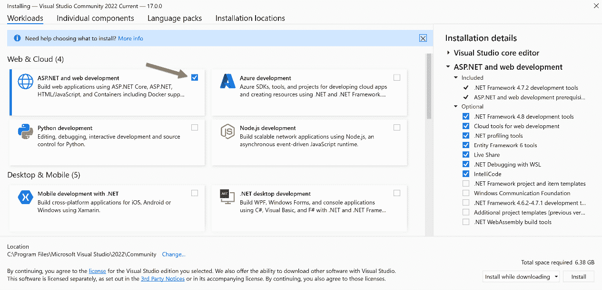

图 1.1 – VS 安装对话框

如果您之前已经安装了 VS，可以通过以下步骤检查是否已安装 **ASP.NET 和 Web 开发**：

1.  前往 Windows **设置** | **应用** | **应用和功能**。

1.  在 **应用列表** 中搜索 **Visual Studio**。

1.  选择垂直省略号（三个垂直点）。

1.  选择如图所示的操作 **修改**：

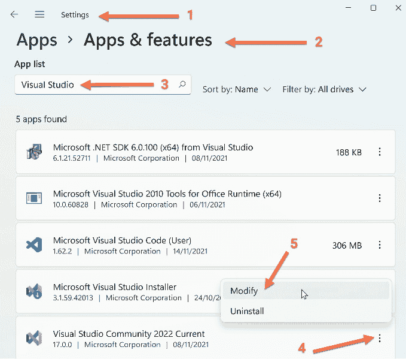

图 1.2 – 修改 VS 安装

VS 很大，因为它包含许多需要安装的组件。此外，与 *Rider* 和 *VS Code* 相比，安装后它加载速度最慢。

### ReSharper

**JetBrains ReSharper** 是 VS 的一个流行的商业插件。ReSharper 为 VS 添加了多个功能；然而，从 TDD 的角度来看，我们感兴趣的是以下方面：

+   **重构**：ReSharper 添加了许多在 TDD 的重构阶段非常有用的重构功能。

+   **代码生成**：使用 ReSharper 生成代码特别有用，尤其是在首先创建单元测试然后生成代码的情况下。

+   **单元测试**：ReSharper 加强了 VS 的单元测试工具，并支持更多的单元测试框架。

ReSharper 是一款基于订阅的产品，提供 30 天的试用期。我建议您首先使用不带 ReSharper 的 VS，然后在熟悉 VS 的功能后再添加它，这样您就能认识到添加 ReSharper 的好处。

注意

VS 的每个新版本都会添加额外的代码重构和代码生成功能，类似于 ReSharper 的功能。然而，截至目前，ReSharper 拥有更先进的功能。

在本书中，关于 ReSharper 的讨论将仅限于本节。您可以从这里下载 ReSharper：[`www.jetbrains.com/resharper/`](https://www.jetbrains.com/resharper/)。

## JetBrains Rider

*JetBrains*，*Rider* 背后的公司，也是流行的 *ReSharper* VS 插件的背后公司。如果您选择了 *JetBrains Rider* 进行 .NET 开发，那么您将拥有本书中所需的所有功能。Rider 具有以下特点：

+   一个强大的 **单元测试运行器**，与 VS 的 **测试资源管理器**相媲美

+   丰富的代码重构和代码生成功能，比 VS 2022 的功能更先进

上述要点对于以 *TDD 风格* 构建系统至关重要；然而，我选择在本书中使用 VS 而不是 Rider。尽管本书中的说明是针对 VS 2022 的，但考虑到 Rider 拥有不同的菜单系统和快捷键，它们也可以应用于 Rider。

注意

**VS .NET**（带有 .NET 支持的 VS 版本）于 2002 年 2 月发布，而 Rider 更新，于 2017 年 8 月发布；因此，VS 在 .NET 开发者中更为成熟。我之所以选择 VS 而不是 Rider 来编写这本书，是因为这个原因。

您可以在此处下载 Rider：[`www.jetbrains.com/rider/`](https://www.jetbrains.com/rider/).

## VS Code

如果你喜欢 VS Code，你将很高兴地知道，微软在 2021 年 7 月的版本 1.59 发布中添加了对可视化单元测试的原生支持（这对于 TDD 是必不可少的）。

VS Code 是一个轻量级 IDE——它具有良好的原生重构选项和一系列第三方重构插件。VS Code 的简洁和优雅吸引了众多 TDD 实践者，但其 C# 功能——尤其是在 TDD 中使用的功能——并不像 VS 或 Rider 那样先进。

我将在这本书中使用 *VS*，但你可以将示例适应到相关的 VS Code 中。要下载 VS Code，你可以访问 [`visualstudio.microsoft.com/downloads/`](https://visualstudio.microsoft.com/downloads/).

## .NET 和 C# 版本

VS 2022 支持 **.NET 6** 和 **C# 10**。这是我们将在本章和本书其余部分使用的内容。

我在我的 LinkedIn 群组中发起了一项小调查，以收集一些公众意见——你可以在这里看到结果：

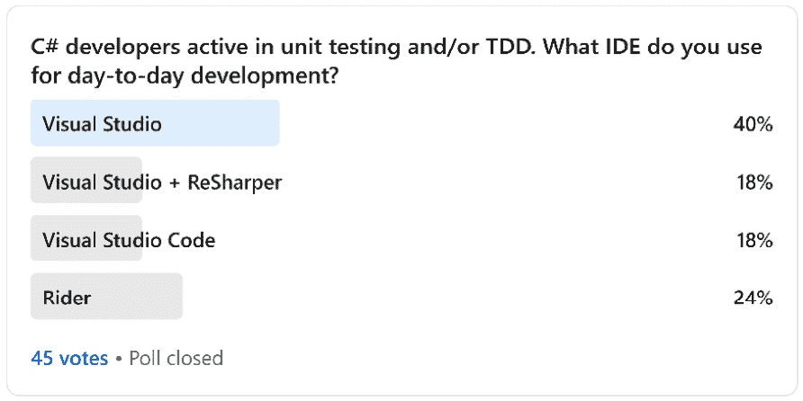

图 1.3 – LinkedIn IDE 投票结果

如你所见，VS 的使用率最高，为 58%，其次是使用 VS 和 ReSharper 插件的 18%，然后是排名第二的 Rider，占 24%，第三名是 VS Code，占 18%。然而，鉴于这只有 45 票，这只是为了给你一个指示，肯定不会反映市场情况。

选择合适的 IDE 是开发者之间有争议的话题。我知道每次我询问实践 TDD 的开发者他们选择的 IDE 时，他们都会发誓他们的 IDE 多么好！总之，使用能让你更高效的 IDE。

# 使用单元测试构建解决方案框架

现在我们已经解决了技术要求，是时候构建我们的第一个实现了。为了本章，并保持对 TDD 概念的关注，让我们从简单的业务需求开始。

假设你是一名开发者，在一家名为 **Unicorn Quality Solutions Inc.**（**UQS**）的虚构公司工作，该公司生产高质量的软件。

## 需求

**UQS** 中的软件团队采用敏捷方法，并以 **用户故事** 的形式描述业务需求。

你正在开发一个打包供其他开发者使用的数学库。你可以将其视为在 **NuGet 库** 中构建一个功能，以便其他应用程序使用。你已经选择了一个用户故事来实现，如下所述：

**故事标题：**

*整数除法*

**故事描述：**

*作为数学库客户端，我希望有一个方法来除以两个整数*

**验收标准：**

*支持 Int32 输入和十进制输出*

*支持高精度返回，无/最小舍入*

*支持除以可除和不可除的整数*

*当除以 0 时抛出 DivideByZeroException 异常*

## 创建项目骨架

对于这个故事，你需要两个 C#项目。一个是包含生产代码的**类库**，另一个是用于对类库进行单元测试的库。

注意

类库使您能够模块化可以被多个应用程序使用的功能。编译后，它们将生成**动态链接库（DLL**）文件。类库不能独立运行，但它可以作为应用程序的一部分运行。

如果您之前没有使用过类库，为了本书的目的，您可以将其视为控制台应用程序或 Web 应用程序。

### 创建类库项目

我们将以两种方式创建相同的项目设置——通过**图形用户界面（GUI**）和通过.NET **命令行界面（CLI**）。选择您喜欢的或您熟悉的方式。

#### 通过图形用户界面（GUI）

要创建类库，运行 VS，然后按照以下步骤操作：

1.  从菜单中选择**文件** | **新建** | **项目**。

1.  查找`Class Library (C#)`。

1.  选择包含**类库（C#）**的矩形 | 点击**下一步**。将显示**添加新项目**对话框，如下所示：

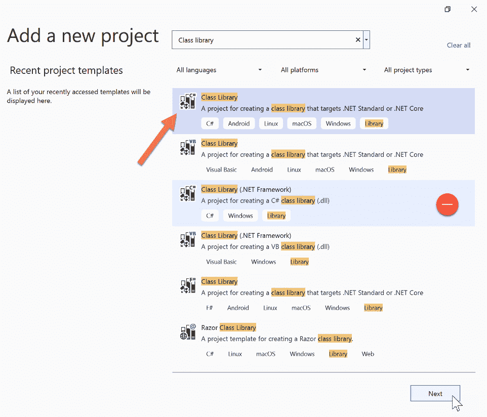

图 1.4 – 查找类库（C#）项目模板

重要提示

确保您可以看到框中的**C#**标签，并且不要选择**类库 (.NET Framework)**项。我们使用.NET（而不是经典的.NET Framework）。

1.  在`UqsMathLib`中的`Uqs.Arithmetic`的**解决方案名称**字段中，然后点击**下一步**。过程如图下所示：

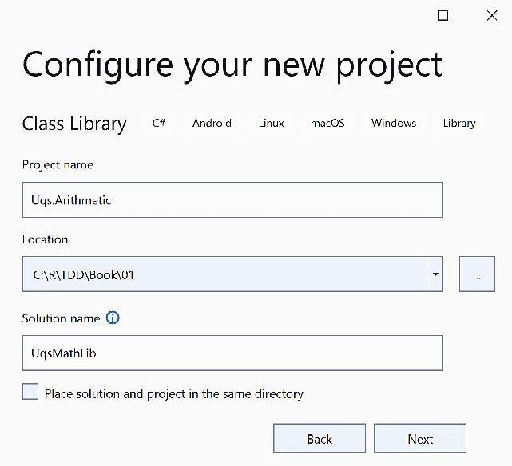

图 1.5 – 配置新项目对话框

1.  在`.NET 6.0 (长期支持)`中点击**创建**。过程如图下所示：

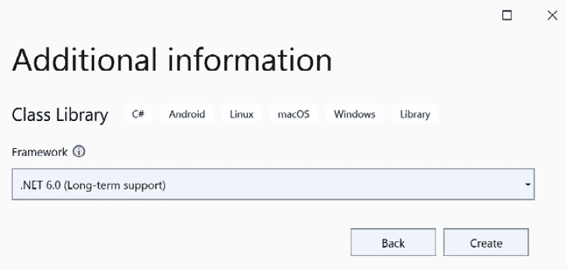

图 1.6 – 其他信息

我们现在在解决方案中有一个类库项目，使用的是*VS GUI*。

#### 通过命令行界面（CLI）

如果您更喜欢通过命令行界面（CLI）创建项目，以下是所需的命令：

1.  创建一个名为`UqsMathLib`的目录（`md UqsMathLib`）。

1.  通过您的终端（`cd UqsMathLib`）导航到该目录，如图下所示：

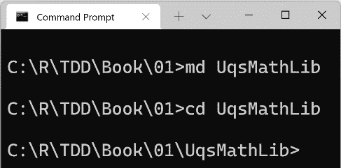

图 1.7 – 命令提示符显示命令

1.  通过运行以下命令创建一个与目录同名的解决方案文件（`.sln`），即`UqsMathLib.sln`：

    ```cs
    dotnet new sln
    ```

1.  在同名的目录中创建一个名为`Uqs.Arithmetic`的新类库，并使用*.NET 6.0*。以下是您需要执行的代码：

    ```cs
    dotnet new classlib -o Uqs.Arithmetic -f net6.0 
    ```

1.  通过运行以下命令将新创建的项目添加到解决方案文件中：

    ```cs
    dotnet sln add Uqs.Arithmetic 
    ```

现在我们解决方案中有一个类库项目，使用的是 *CLI*。

### 创建单元测试项目

目前，我们有一个包含一个类库项目的解决方案。接下来，我们想要将单元测试库添加到我们的解决方案中。为此，我们将使用**xUnit 测试项目**。

xUnit.net 是一个免费的、开源的 .NET 单元测试工具。它根据 Apache 2 许可。VS 本地支持添加和运行 xUnit 项目，因此不需要特殊工具或插件来使用 xUnit。

我们将在*第三章*“开始单元测试”中更详细地介绍 xUnit。

我们将遵循命名单元测试项目的通用约定：`[ProjectName].Tests.Unit`。因此，我们的项目将被称为`Uqs.Arithmetic.Tests.Unit`。

我们将以两种方式创建单元测试项目，这样您可以选择最适合您的方法。

#### 通过 GUI

要创建单元测试项目，请转到 VS 中的**解决方案资源管理器**，然后按照以下步骤操作：

1.  右键单击解决方案文件（`UqsMathLib`）。

1.  前往**添加** | **新建项目…**，如图所示：

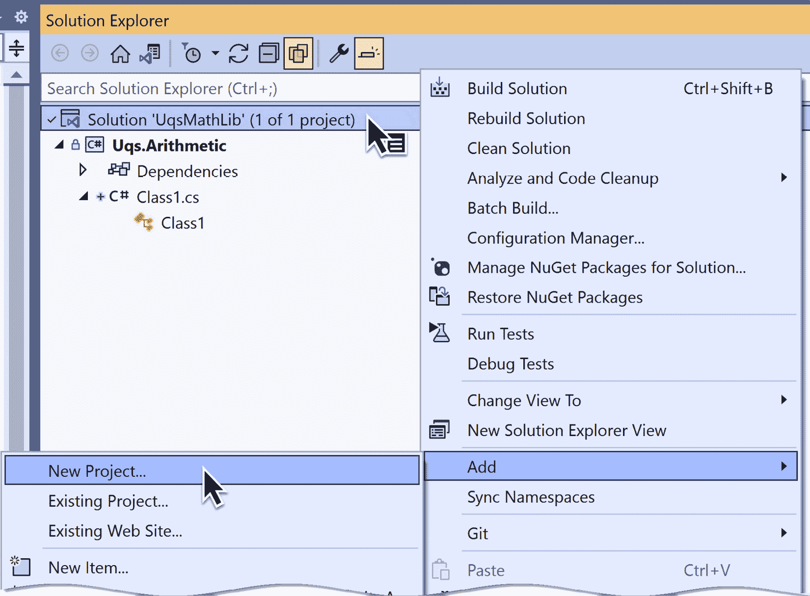

图 1.8 – 在解决方案中创建新项目

1.  查找**xUnit 测试项目** | 点击**下一步**。

1.  设置`Uqs.Arithmetic.Tests.Unit`。

1.  点击**下一步** | 选择**.NET 6.0** | 点击**创建**。

您已通过 VS GUI 创建了一个项目，但我们仍然需要设置单元测试项目以对类库有引用。为此，请按照以下步骤操作：

1.  在 VS 解决方案资源管理器中，右键单击`Uqs.Arithmetic.Tests.Unit`。

1.  选择**添加项目引用…**。

1.  选择`Uqs.Arithmetic`并点击**确定**。

现在我们已经通过 VS 图形用户界面（GUI）完全构建了解决方案。您可以选择在 CLI 中执行相同的 GUI 步骤。在下一节中，我们将做 exactly that。

#### 通过 CLI

目前，我们有一个包含一个类库项目的解决方案。现在，我们想要将单元测试库添加到我们的解决方案中。

在具有相同名称的目录中创建一个新的 xUnit 项目，名为 `Uqs.Arithmetic.Tests.Unit`，并使用 .NET 6.0。以下是您需要执行的代码：

```cs
dotnet new xunit -o Uqs.Arithmetic.Tests.Unit -f net6.0
```

通过运行以下命令将新创建的项目添加到解决方案文件中：

```cs
dotnet sln add Uqs.Arithmetic.Tests.Unit
```

现在我们解决方案中有两个项目。由于单元测试项目将测试类库，因此项目应该有对类库的引用。

您已通过命令行界面（CLI）创建了一个项目，但我们仍然需要将单元测试项目设置为对类库有引用。为此，从`Uqs.Arithmetic.Tests.Unit`添加一个项目引用到`Uqs.Arithmetic`，如下所示：

```cs
dotnet add Uqs.Arithmetic.Tests.Unit reference 
   Uqs.Arithmetic
```

现在我们已经通过 CLI 完全构建了解决方案。

### 最终解决方案

无论您使用哪种方法创建解决方案——无论是 VS GUI 还是 CLI——您现在都应该有相同的文件创建。现在，您可以在 VS 中打开解决方案，您会看到以下内容：

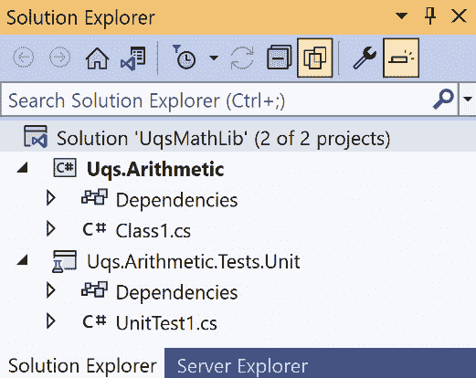

图 1.9 – 最终创建的解决方案结构

为了从零开始，删除 `Class1.cs`，因为我们不会使用它——它是模板自动添加的。

我们两个项目的逻辑结构如下所示：

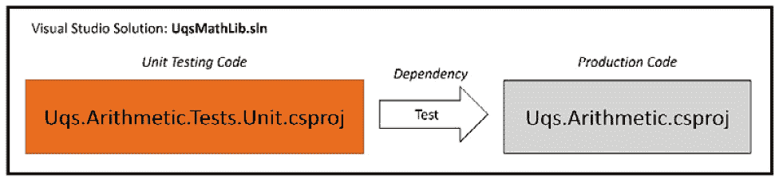

图 1.10 – 项目的逻辑结构

我们到目前为止创建了两个项目：一个将在某个阶段发布到生产环境（`Uqs.Arithmetic`）和一个用于测试此项目（`Uqs.Arithmetic.Tests.Unit`）。解决方案文件将这两个项目链接在一起。

现在我们已经完成了构建项目骨架和设置依赖项不那么有趣的部分，现在我们可以开始更有趣的部分，即与单元测试直接相关的内容。

## 熟悉内置测试工具

我们已经到达了需要了解如何发现和执行测试的阶段，为此，我们需要了解哪些工具可供我们使用。

我们已经有了由 xUnit 模板生成的代码——看看这里显示的 `UnitTest1.cs` 内的代码：

```cs
using Xunit;
namespace Uqs.Arithmetic.Tests.Unit;
public class UnitTest1
{
    [Fact]
    public void Test1()
    {
    }
}
```

这是一个正常的 C# 类。`Fact` 是来自 xUnit 的一个属性。它只是告诉任何与 xUnit 兼容的工具，被 `Fact` 装饰的方法是一个 **单元测试方法**。与 xUnit 兼容的工具，如 **测试资源管理器** 和 **.NET CLI 测试命令** 应该能够在您的解决方案中找到此方法并运行它。

沿着前几节的趋势，我们将以两种方式利用可用的测试工具——通过 VS GUI 和通过 CLI。

### 通过 GUI

VS 内置了一个 GUI 作为测试运行器来发现和执行测试——它被称为**测试资源管理器**。要查看测试运行器如何发现测试方法，从菜单中选择**测试** | **测试资源管理器**。您将看到以下屏幕：

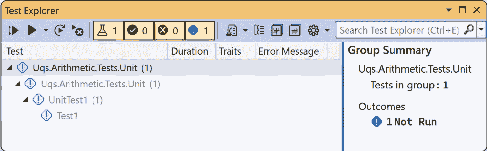

图 1.11 – 测试资源管理器显示未执行的测试

如您所见，它检测到了我们解决方案中的所有测试，以 *项目名称 > 命名空间 > 类 > 方法* 的层次结构显示测试。您还可以看到测试层次结构被灰色显示，并带有感叹号。这是一个标志，表明测试从未运行过。您可以点击左上角的 `Fact`。结果如下所示：

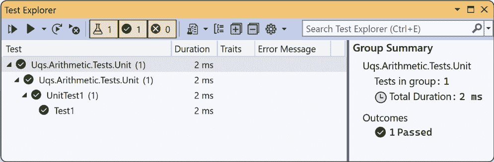

图 1.12 – 测试资源管理器显示已执行的测试结果

由于我们有一个空壳，所以不要期望任何花哨的功能，但至少测试会变成 *绿色*，您将知道您的设置正在工作。您可以使用类似的方式使用 CLI 发现和执行测试。

### 通过 CLI

您也可以通过使用命令提示符，进入解决方案目录，并执行以下命令来执行相同的测试：

```cs
dotnet test
```

这就是您将要得到的结果：

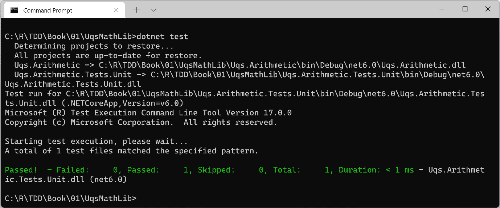

图 1.13 – .NET 测试命令发现和执行测试

运行此类命令将在我们想要自动化测试运行时派上用场。

# 使用 TDD 实现需求

在编写任何代码之前，理解一些术语和约定来调整我们的思维，关注单元测试相关的关键词是有意义的。因此，我们将简要介绍**系统测试对象**（**SUT**）、**红/绿测试**和**安排-行动-断言**（**AAA**）。这些术语的更多细节将在后面的章节中介绍，但现在我们将介绍运行几个测试所需的最小内容。

当我们学习术语和约定时，我们将逐步进入实现。你可能发现的一个新或不寻常的地方是先编写单元测试，然后编写生产代码。这是 TDD 的一个主要方面，你将在本节中首次体验它。

## SUT

我们通常编写的用于构建产品的代码称为**生产代码**。典型的**面向对象**（**OO**）生产代码看起来像这样：

```cs
public class ClassName
{
    public Type MethodName(…)
    {
        // Code that does something useful
    }
    // more code
}
```

当我们测试这段代码时，单元测试将调用`MethodName`并评估该方法的性能。当`MethodName`执行时，它可能会调用类的其他部分，并可能使用/调用其他类。由`MethodName`执行的代码被称为 SUT 或**待测试代码**（**CUT**）。然而，*SUT*这个术语使用得更频繁。

SUT 将有一个入口点，该入口点将由单元测试执行。入口点通常是我们在单元测试中调用的方法。以下截图应该可以阐明 SUT 和 SUT 入口点的概念：

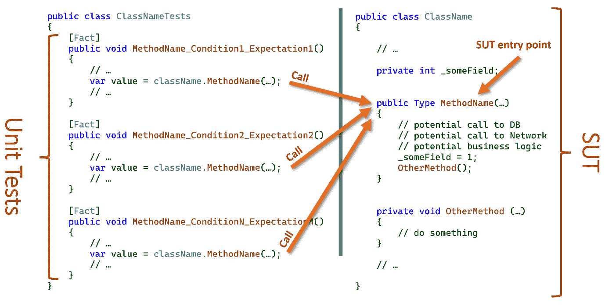

图 1.14 – 在 SUT 上运行的单元测试

在上一张截图，你可以看到多个单元测试调用相同的 SUT 入口点。关于 SUT 的详细讨论可以在*第三章*，*开始单元测试*中找到。

## 测试类

典型的单元测试类使用来自 SUT 的相同名称，这是约定俗成的。典型的单元测试类看起来是这样的：

```cs
public class ClassNameTests
{
    [Fact]
    public void MethodName_Condition1_Expectation1()
    {
        // Unit Testing Code that will call MethodName
    }
    // Other tests…
    [Fact]
    public void MethodName_ConditionN_ExpectationN()
    {
        // Unit Testing Code that will call MethodName
    }
    …
}
```

注意到在前两个代码片段中的`ClassName`和`MethodName`方法并不是巧合。我们希望它们通过约定保持一致。为了开始构建我们的测试类，我们需要设计类名和方法名。

#### 类名

从需求中，我们需要一个包含所有我们的除法方法的类，所以我们可以简单地将其命名为`Division`；如果我们创建一个用于测试`Division`类的单元测试类，我们的单元测试名称将是`DivisionTests`。接下来，我们将`UnitTest1`类重命名为`DivisionTests`，并将文件名也相应地更改为`DivisionTests.cs`。

小贴士

你可以在源代码中的类名（在上一个例子中是`UnitTest1`）的任何位置设置你的文本光标，然后按*Ctrl* + *R*，*R*（按住*Ctrl*然后快速连续按两次*R*）。输入新名称`DivisionTests`并按*Enter*。如果勾选了**重命名符号的文件**复选框，这也会重命名文件。

#### 方法名

幸运的是，要求很简单，所以我们的方法名将简单地是 `Divide`。根据要求，`Divide` 将接受两个整数（`int32`）参数，并返回一个 `decimal` 值。我们将继续重构我们的现有单元测试，从 `Test1` 更改为 `Divide_Condition1_Expectation1`。

注意

**算术术语命名提示**：如果我们有 10 / 5 = 2，那么 10 是被除数，5 是除数，2 是商。

## 条件和期望

当我们测试时，我们设置一个条件并定义当这个条件满足时我们期望什么。我们首先从 *核心情况* 开始，也称为 *正向路径* 或 *快乐路径*。在处理其他情况之前，我们首先完成所有正向路径。我们的单元测试任务归结为确定条件和它的期望，并为每一种组合编写一个单元测试。

为了展示我们正在测试的方法（我们的系统单元中的方法）与相关条件和期望之间的关系，我们将采用一个常用的约定，如下面的代码片段所示：

```cs
[Fact]
public void MethodName_Condition_Expectation()
{
…
```

这里有一些单元测试方法名的随机示例，以帮助您熟悉之前的约定：

+   `SaveUserDetails_MissingEmailAddress_EmailIsMissing`

+   `ValidateUserCredentials_HashedPasswordDoesntMatch_False`

+   `GetUserById_IdDoesntExist_UserNotFoundException`

在设计我们的单元测试时，我们将看到更多示例。

核心要求是除以两个整数。最直接和最简单的实现是除以可除整数并得到一个整数。我们的条件是 *可除整数*，我们期望得到一个 *整数*。现在，我们应该更新单元测试的签名为 `Divide_DivisibleIntegers_WholeNumber` 并编写测试方法的主体，如下所示：

```cs
[Fact]
public void Divide_DivisibleIntegers_WholeNumber()
{
    int dividend = 10;
    int divisor = 5;
    decimal expectedQuotient = 2;
    decimal actualQuotient = Division.Divide(dividend, 
        divisor);
    Assert.Equal(expectedQuotient, actualQuotient);
}
```

这段代码无法编译，因为在这个阶段 `Division` 类不存在，我们已知这一点，因为我们在 `Division` 下有一个波浪线。这是少数几个由于缺少类而无法编译的情况之一，这种情况是好的。这表明我们的 *测试失败了*，这也是好的！

虽然测试失败看起来很愚蠢，因为代码无法编译，因为 `Division` 系统单元类缺失，但这意味着还没有 SUT 代码。在 *第五章*，*测试驱动开发解释* 中，我们将了解考虑无编译情况的原因。

`Assert` 是 xUnit 库中的一个类。`Equal` 静态方法有很多重载，其中之一我们在这里使用：

```cs
public static void Equal<T>(T expected, T actual) 
```

当运行此方法时，如果我们所期望的和实际得到的是相等的，它将向 xUnit 框架标记。当我们运行这个测试时，如果这个断言的结果是 `true`，那么测试就通过了。

## 红色/绿色

失败正是我们所寻求的。在后续章节中，我们将讨论其原因。目前，只需知道我们需要从一个失败的构建（编译）或失败的测试（失败的断言）开始，然后将其更改为通过的状态。失败/通过也被称为**红/绿重构技术**，它模仿了**坏/好**和**停止/继续**的概念。

我们需要添加 `Division` 类和 `Divide` 方法，并编写最小化代码以使测试通过。在 `Uqs.Arithmetic` 项目中创建一个名为 `Division.cs` 的新文件，如下所示：

```cs
namespace Uqs.Arithmetic;
public class Division
{
    public static decimal Divide(int dividend, int divisor)
    {
        decimal quotient = dividend / divisor;
        return quotient;
    }
}
```

小贴士

你可以通过将文本光标放在类名（在之前的例子中是 `Division`）内的任何位置，然后按 *Ctrl* + *.*（按住 *Ctrl* 键然后按 *.*）来创建一个类。选择 `Uqs.Arithmetic`，然后按 `Divide` 并按 *Ctrl* + *.*，选择 `Division` 准备编写你的代码。

重要的是要记住，在 C# 中，**除以两个整数将返回一个整数**。我见过一些资深开发者忘记这一点，这导致了不良后果。在我们实现的代码中，我们只涵盖了会产生整数商的整数除法。这应该能满足我们的测试。

现在我们已经准备好使用测试资源管理器运行我们的测试，所以按 *Ctrl* + *R*，*A*，这将构建你的项目，然后运行所有测试（目前有一个测试）。你会注意到测试资源管理器指示绿色，并且在测试名称和 `Fact` 属性之间有一个带有勾号的绿色项目符号。点击它将显示一些与测试相关的选项，如下面的截图所示：

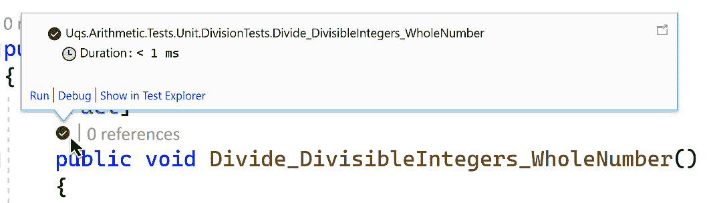

图 1.15 – VS 单元测试气球

为了完整起见，完整的概念名称是 **红/绿/重构**，但在这里我们不会解释 **重构** 部分，并将这部分内容留到 *第五章*，“测试驱动开发解释”中。

## AAA 模式

单元测试实践者注意到测试代码格式符合某种结构模式。首先，我们声明一些变量并做一些准备工作。这个阶段被称为 **Arrange**。

第二阶段是我们调用 SUT（系统单元）。在前面的测试中，这是调用 `Divide` 方法的行。这个阶段被称为 **Act**。

第三阶段是我们验证我们的假设——这是使用 `Assert` 类的地方。不出所料，这个阶段被称为 **Assert**。

开发者通常用注释将每个单元测试分成三个阶段，所以如果我们将这一点应用到我们之前的单元测试中，方法看起来会是这样：

```cs
[Fact]
public void Divide_DivisibleIntegers_WholeNumber()
{
    // Arrange
    int dividend = 10;
    int divisor = 5;
    decimal expectedQuotient = 2;
    // Act
    decimal actualQuotient = Division.Divide(dividend,
       divisor);
    // Assert
    Assert.Equal(expectedQuotient, actualQuotient);
}
```

你可以在*第三章*，“开始单元测试”中了解更多关于 **AAA** 模式的信息。

## 更多测试

我们还没有完成需求的实现。我们需要通过迭代地添加新测试、检查它失败、实现它、然后使其通过，并重复这一过程来添加它们！

我们将在下一节中添加更多测试以覆盖所有要求，并且我们还将添加一些其他测试以提高质量。

### 除以不可除的数

我们需要覆盖一个情况，即两个数不能整除，所以我们就在第一个测试方法下添加另一个单元测试方法，如下所示：

```cs
[Fact]
public void Divide_IndivisibleIntegers_DecimalNumber()
{
    // Arrange
    int dividend = 10;
    int divisor = 4;
    decimal expectedQuotient = 2.5m;
    …
}
```

这个单元测试方法与上一个类似，但方法名已更改以反映新的条件和期望。此外，数字也已更改以适应新的条件和期望。

通过以下任何一种方法运行测试：

+   点击出现在 `Fact` 下方蓝色的子弹，然后点击 **运行**

+   打开 `测试名称` 代码，并点击 **运行** 按钮

+   按下 *Ctrl* + *R*, *A*，这将运行所有测试

你会发现测试会失败——这是好事！我们还没有实现会产生小数的除法。现在我们可以继续这样做，如下所示：

```cs
decimal quotient = (decimal)dividend / divisor;
```

注意

在 C# 中，除以两个整数将返回一个整数，但除以一个整数将返回一个小数，因此你几乎总是必须将除数或被除数（或两者）转换为小数。

再次运行测试，这次应该会通过。

### 除以零测试

是的——除以零会发生坏事。让我们检查我们的代码是否可以处理这种情况，如下所示：

```cs
[Fact]
public void Divide_ZeroDivisor_DivideByZeroException()
{
    // Arrange
    int dividend = 10;
    int divisor = 0;

    // Act
    Exception e = Record.Exception(() => 
        Division.Divide(dividend, divisor));
    // Assert
    Assert.IsType<DivideByZeroException>(e);
}
```

`Record` 类是 xUnit 框架的另一个成员。`Exception` 方法记录 SUT 是否抛出了任何 `Exception` 对象，如果没有，则返回 `null`。这是该方法签名：

```cs
public static Exception Exception(Func<object> testCode)
```

`IsType` 是一个方法，它比较尖括号内的类类型与作为参数传递的对象的类类型，如下面的代码片段所示：

```cs
public static T IsType<T>(object @object)
```

当你运行这个测试时，它会通过！我的第一印象可能是怀疑。问题是，在没有编写显式代码的情况下通过，我们还不知道这是否是一个真正的或偶然的通过——一个假阳性。有许多方法可以验证这个通过是否是偶然的；目前最快的方法是调试 `Divide_ZeroDivisor_DivideByZeroException` 的代码。

点击 **测试子弹**，然后点击 **调试** 链接，如下面的截图所示：

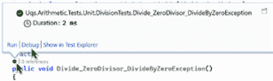

图 1.16 – 单元测试气球中的调试选项

你将直接遇到异常，如下面的截图所示：

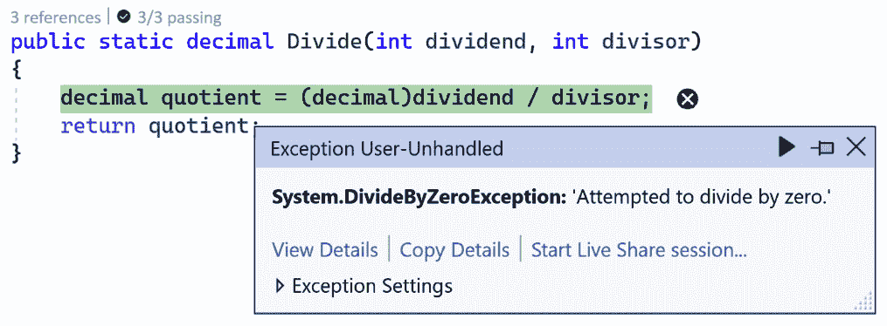

图 1.17 – 异常对话框

你会注意到异常确实发生在除法线上，这正是我们想要的。虽然这种方法违反了我们最初的红色/绿色尝试，但立即通过仍然是一个你在日常编码中会遇到的真实案例。

### 测试极端情况

故事中没有提到测试极端情况，但作为一个开发者，你知道大多数软件错误都来自**边缘情况**。

你希望对自己的现有代码更有信心，并确保它能够很好地处理极端情况，正如你所期望的那样。

`int`数据类型的极端值可以通过`int`的这两个常量字段获得：

+   `int.MaxValue` = 

+   `int.MinValue` = 

我们需要测试以下情况（请注意，我们只测试到 12 位小数）：

+   `int.MaxValue / int.MinValue = -0.999999999534  `

+   `(-int.MaxValue) / int.MinValue = 0.999999999534`

+   `int.MinValue / int.MaxValue = -1.000000000466`

+   `int.MinValue / (-int.MaxValue) = 1.000000000466`

因此，我们需要四个单元测试来覆盖每个情况。然而，大多数单元测试框架，包括 xUnit，都有一个技巧。我们不必编写四个单元测试——我们可以这样做：

```cs
[Theory]
[InlineData( int.MaxValue,  int.MinValue, -0.999999999534)]
[InlineData(-int.MaxValue,  int.MinValue,  0.999999999534)]
[InlineData( int.MinValue,  int.MaxValue, -1.000000000466)]
[InlineData( int.MinValue, -int.MaxValue,  1.000000000466)]
public void Divide_ExtremeInput_CorrectCalculation(
    int dividend, int divisor, decimal expectedQuotient)
{
    // Arrange
    // Act
    decimal actualQuotient = Division.Divide(dividend, 
        divisor);
    // Assert
    Assert.Equal(expectedQuotient, actualQuotient, 12);
}
```

注意现在我们有`Theory`而不是`Fact`。这是 xUnit 声明单元测试方法是参数化的方式。此外，注意我们有四个`InlineData`属性；正如你可能会已经想到的，每个属性都对应一个测试用例。

我们的单元测试方法和`InlineData`属性有三个参数。在运行单元测试时，每个参数将映射到相同顺序的单元测试方法的参数。以下截图显示了`InlineData`属性中的每个参数如何对应到`Divide_ExtremeInput_CorrectCalculation`方法中的参数：

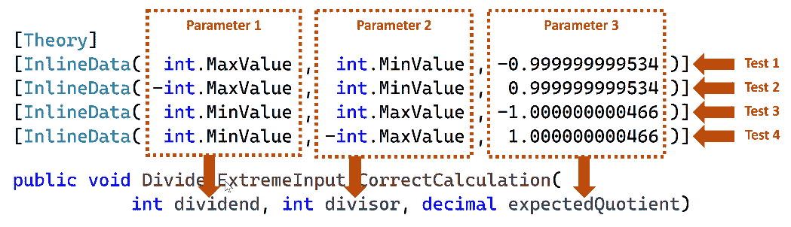

图 1.18 – InlineData 参数映射到装饰方法参数

对于断言，我们使用支持十进制**精度**的`Equal`方法的重载，如下面的代码片段所示：

```cs
static void Equal(decimal expected, decimal actual, 
    int precision)
```

运行测试，你会注意到测试资源管理器将这四个属性视为单独的测试，如下面的截图所示：

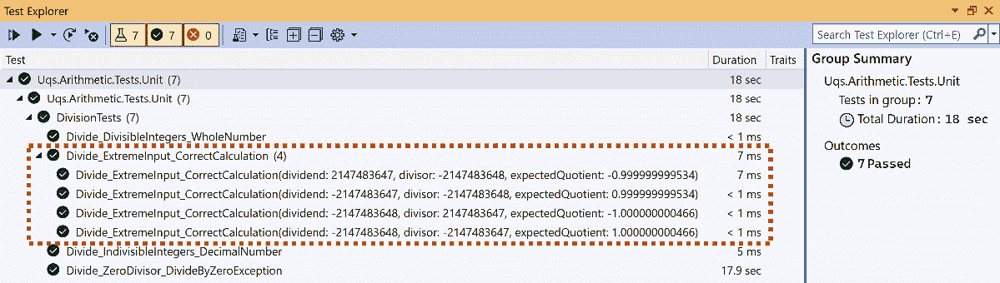

图 1.19 – VS 测试资源管理器显示分组测试

更多测试

为了简洁起见，鉴于本章是一个有限的介绍，我们没有探索所有可能的测试场景——例如，`int.MaxValue/int.MaxValue`、`int.MinValue/int.MinValue`、`0/number` 和 `0/0`。

所需测试的范围将在后面的章节中讨论，包括它们的优缺点。

在编写代码之前编写测试并不是每个开发者的喜好，并且一开始可能看起来不太直观，但你有完整的一本书来让你自己做出决定。在*第五章*《测试驱动开发详解》中，你将更深入地了解实现和最佳实践。

# 摘要

虽然本章旨在快速实现，但我相信你已经尝到了 TDD 的滋味，并掌握了一些技能，例如*xUnit*、*测试资源管理器*、*先测试后编码*、*红/绿*和一些约定。

首先，我们选择了简单的例子——当然——因此，我们没有涉及**依赖注入**（**DI**），也没有模拟或其他复杂的东西，因为刺激的内容将在下一章出现。所以，我希望这一章已经让你对本书的其余部分感到兴奋。

如果你像我第一次遇到 TDD 时一样，可能会想知道以下问题：*为什么先进行测试？* *这不是单元测试代码太多吗？* *单元测试有效吗？* *单元测试和 TDD 有什么区别？* *我应该写多少个测试？* 你可能还有其他问题——这些问题的答案将在你阅读本书的过程中逐渐揭晓，我保证我会尽可能清晰地给出答案。

在下一章中，我们将涉及一个名为 DI 的设计模式，这是使用 TDD（测试驱动开发）的必要要求。

# 进一步阅读

为了了解更多关于本章讨论的主题，你可以参考以下链接：

+   类库: [`docs.microsoft.com/en-us/dotnet/standard/class-libraries`](https://docs.microsoft.com/en-us/dotnet/standard/class-libraries)

+   xUnit: [`xunit.net/`](https://xunit.net/)
