# 通过示例理解依赖注入

**依赖注入**（**DI**）是一种存在于每个现代架构中的软件设计模式。然而，你可能想知道这种模式是如何进入一本以**测试驱动开发**（**TDD**）为重点的书的第二章的。

DI 是一种具有几个我们在整本书中将要发现的优点的设计模式，但其核心优点是**DI 为单元测试打开了应用程序**。没有对这个模式有坚实的理解，我们就无法进行单元测试，而如果不能进行单元测试，那么根据定义，我们就无法实践 TDD。考虑到这一点，DI 的理解构成了*第一部分*，“开始和基础知识”以及*第二部分*，“使用 TDD 构建应用程序”的基础，这解释了早期引入的原因。

我们将构建一个应用程序，然后在学习概念的同时修改它以支持 DI，但本章中的思想将在整本书中重复和练习。

在本章中，您将探索以下主题：

+   **天气预报应用程序**（**WFA**）

+   理解依赖

+   介绍 DI

+   使用 DI 容器

到本章结束时，应用程序将通过实施必要的 DI 更改而准备好进行单元测试。您将对依赖关系有一个公平的理解，并将对重构代码以支持 DI 充满信心。您也将完成了编写第一个正确单元测试的一半。

# 技术要求

本章的代码可以在以下 GitHub 仓库中找到：

[`github.com/PacktPublishing/Pragmatic-Test-Driven-Development-in-C-Sharp-and-.NET/tree/main/ch02`](https://github.com/PacktPublishing/Pragmatic-Test-Driven-Development-in-C-Sharp-and-.NET/tree/main/ch02)

在那里，您将找到四个目录。每个目录都将是我们进展的快照。

# WFA

在本章的整个过程中，我们将使用一个**ASP.NET Web API**应用程序作为我们的学习过程。我们将重构该应用程序中的所有代码以启用 DI。然后，在*第三章*，“开始单元测试”，我们将对重构后的应用程序应用单元测试。

当创建一个新的 ASP.NET Web API 应用程序时，它自带一个示例随机天气预报器。本章中的应用程序将基于原始的天气示例，并添加一个真实的天气预报功能到现有的随机功能中。我们将我们的应用程序称为 WFA。

第一步将是创建一个 WFA 应用程序并确保它正在运行。

## 创建一个示例天气预报

要创建一个示例应用程序，请将您的控制台导航到您想要创建此应用程序的目录，并执行以下命令：

```cs
md UqsWeather
cd UqsWeather
dotnet new sln
dotnet new webapi -o Uqs.Weather -f net6.0
dotnet sln add Uqs.Weather
```

以下代码将创建一个`UqsWeather`并将一个 ASP.NET Web API 项目添加到其中。这将产生与这个控制台窗口类似的输出：

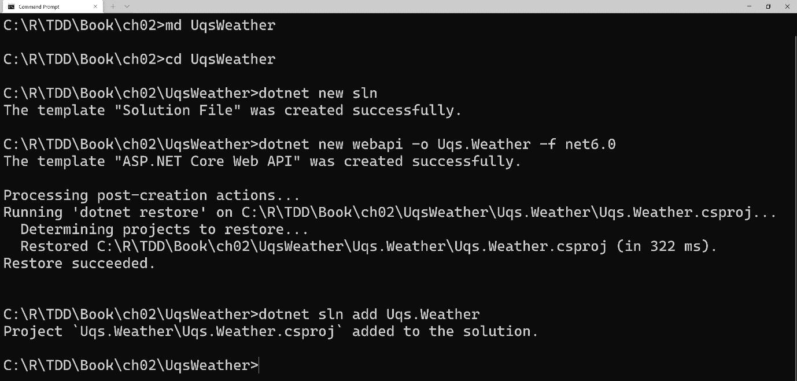

图 2.1 – 通过命令行界面 (CLI) 创建天气应用程序的输出

要检查我们创建的内容，请转到目录并使用 VS 打开解决方案，你将看到以下内容：

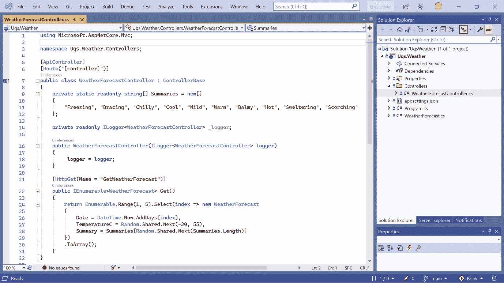

图 2.2 – 在 VS 中打开的新创建的项目

这里有趣的是自动生成的示例文件：`WeatherForecast Controller.cs` 和 `WeatherForecast.cs`。

这是默认模板；我们还没有进行任何修改。检查到目前为止应用程序是否正确加载是有意义的。你可以运行应用程序，它将启动你的默认浏览器并显示 Swagger UI 界面。我们可以看到唯一的可用 `GET` `WeatherForecast`，如下面的截图所示：

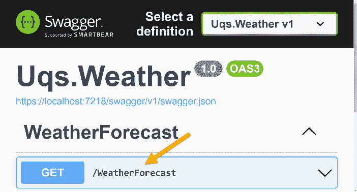

图 2.3 – Swagger UI 显示可用的 GET API

要手动调用此 API 并检查它是否生成输出，从 Swagger UI 页面，展开 **/WeatherForecast** 右侧的下箭头。点击 **Try it out**。然后，点击 **Execute**。你将得到如下所示的响应：

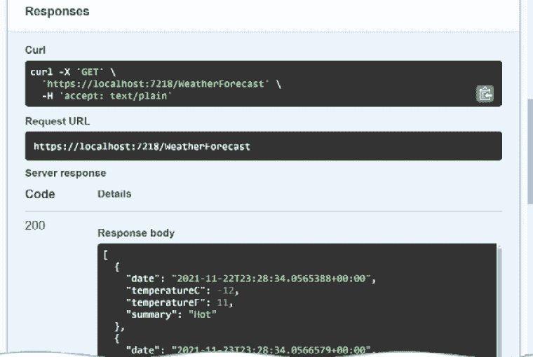

图 2.4 – Swagger API 调用响应

你可以在 GitHub 章节目录下的 `01-UqsWeather` 目录中找到这个示例。现在，是时候通过添加真实预报功能使应用程序更加真实了。

## 添加真实天气预报

模板应用程序包含一个示例随机天气生成器。我决定给这个应用程序添加一些真实天气预报的功能。为此，我将使用一个名为 *OpenWeather* 的天气服务。*OpenWeather* 提供了一个免费的 RESTful API 天气服务（其中 **REST** 代表 **REpresentational State Transfer**），并将作为一个更真实的示例。

我还创建了一个公共 NuGet 包，用于提供本章内容，并作为 *OpenWeather* RESTful API 的客户端。因此，你不需要处理 REST API 调用，而是调用一个 C# 方法，它会在后台执行 RESTful API 调用。在接下来的章节中，我们将获取一个 API 密钥并编写 `GetReal` API。

### 获取 API 密钥

要能够从配套源代码运行应用程序或自己创建一个，你需要一个 API 密钥。你可以在 [`openweathermap.org`](https://openweathermap.org) 上注册并获取一个 API 密钥。注册后，你可以通过访问 **My API keys** 并点击 **Generate** 来生成密钥，类似于以下示例：

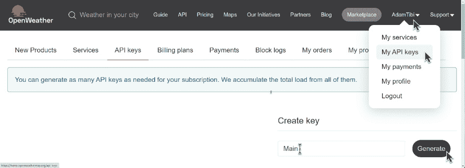

图 2.5 – 生成 API 密钥

一旦你获得了密钥，将其保存在你的 `appsettings.json` 文件中，如下所示：

```cs
{
  "OpenWeather": {
    "Key": "yourapikeygoeshere"
  },
  "Logging": {
  …
```

API 密钥已生成。让我们获取一个客户端库来访问 API。

### 获取客户端 NuGet 包

有许多 OpenWeather API 客户端库；然而，我选择创建一个专门符合本章要求的库。包的代码及其测试方法在*附录 2*中讨论，*高级模拟场景*。如果你好奇并想查看源代码，你可以访问其 GitHub 仓库[`github.com/AdamTibi/OpenWeatherClient`](https://github.com/AdamTibi/OpenWeatherClient)。

你可以通过 VS 中的`AdamTibi.OpenWeather`或通过.NET CLI 安装 NuGet 包，方法是进入项目目录并编写以下内容：

```cs
dotnet add package AdamTibi.OpenWeather
```

配置已完成，因此现在我们可以修改代码。

### 将感觉映射到温度

这里有一个简单的方法，将°C 的温度映射到一个描述它的单个单词：

```cs
private static readonly string[] Summaries = new[]
{
    "Freezing", "Bracing", "Chilly", "Cool", "Mild",
    "Warm", "Balmy", "Hot", "Sweltering", "Scorching"
};
private string MapFeelToTemp(int temperatureC)
{
    if (temperatureC <= 0) return Summaries.First();
    int summariesIndex = (temperatureC / 5) + 1;
    if (summariesIndex >= Summaries.Length) return 
       Summaries.Last();
    return Summaries[summariesIndex];
}
```

对于`0`或更低的输出是`Freezing`，在`0`到`5`之间是`Bracing`，然后每`5`度就会改变一次。从`45`度开始，就是`Scorching`。不要只相信我的输出——我们将进行单元测试。想象一下如果我们没有这样做会怎样！

### 随机天气 API

我保留了随机天气 API，但我让它使用前面的`MapFeelToTemp`字符串，如下所示：

```cs
[HttpGet("GetRandomWeatherForecast")]
public IEnumerable<WeatherForecast> GetRandom()
{
    WeatherForecast[] wfs = new 
        WeatherForecast[FORECAST_DAYS];
    for(int i = 0;i < wfs.Length;i++)
    {
        var wf = wfs[i] = new WeatherForecast();
        wf.Date = DateTime.Now.AddDays(i + 1);
        wf.TemperatureC = Random.Shared.Next(-20, 55);
        wf.Summary = MapFeelToTemp(wf.TemperatureC);
    }
    return wfs;
}
```

这是一个生成随机温度并对其做出总结的简单 API。我们正在生成`FORECAST_DAYS = 5`天的预测，从第二天开始。

运行此项目并点击 Swagger UI 输出将给我们以下结果：

```cs
[
  {
    "date": "2021-11-26T22:23:38.6987801+00:00",
    "temperatureC": 30,
    "temperatureF": 85,
    "summary": "Hot"
  },
  {
    "date": "2021-11-27T22:23:38.7001358+00:00",
    "temperatureC": -15,
    "temperatureF": 6,
    "summary": "Freezing"
  },
…
```

你可以看到输出是多么随机，因为第二天很热，但第三天就非常冷。

### 真实天气 API

真实天气 API 应该更有意义。这是新添加的 API：

```cs
[HttpGet("GetRealWeatherForecast")]
public async Task<IEnumerable<WeatherForecast>> GetReal()
{
    …
    string apiKey = _config["OpenWeather:Key"];
    HttpClient httpClient = new HttpClient();
    Client openWeatherClient = 
       new Client(apiKey, httpClient);
    OneCallResponse res = await 
      openWeatherClient.OneCallAsync
        (GREENWICH_LAT, GREENWICH_LON, new [] {
            Excludes.Current, Excludes.Minutely,
            Excludes.Hourly, Excludes.Alerts }, 
            Units.Metric);
    …
}
```

此方法创建一个`HttpClient`类，以便将其传递给*OpenWeather*的`Client`类。然后它获取 API 密钥并创建一个*OpenWeather*的`Client`类。为了限制我们的范围，这将只为格林威治，伦敦进行预测。

重要提示

之前的代码不够整洁，将在本章中稍后进行清理。如果你现在真的想了解原因，那就是在控制器中实例化（新建）`HttpClient`和`Client`类，这不是一个好的做法。

我们正在调用名为*OpenWeather*的 RESTful API 的**OneCall**。此 API 返回今天的天气并预测接下来的 6 天；这对于我们只需要接下来的 5 天来说很好。此 API 的 Swagger UI 输出如下所示：

```cs
[
  {
    "date": "2021-11-26T11:00:00Z",
    "temperatureC": 8,
    "temperatureF": 46,
    "summary": "Chilly"
  },
  {
    "date": "2021-11-27T11:00:00Z",
    "temperatureC": 4,
    "temperatureF": 39,
    "summary": "Bracing"
  },
…
```

通过例子解释概念是最好的方法，所以考虑这个测试问题，它将给你一个亲身体验 DI（依赖注入）的机会。

### C 到 F 转换 API

为了让全世界团结起来并让每个人都开心，我们将添加另一个方法将°C 转换为°F。我们将在控制器上有一个名为`ConvertCToF`的 API，它看起来像这样：

```cs
[HttpGet("ConvertCToF")]
public double ConvertCToF(double c)
{
    double f = c * (9d / 5d) + 32;
    _logger.LogInformation("conversion requested");
    return f;
}
```

此 API 将温度从°C 转换为°F，并记录每次请求此 API 的情况，用于统计目的。你可以像以前一样从 Swagger UI 调用此 API，或者从浏览器中这样调用它：

```cs
https://localhost:7218/WeatherForecast/ConvertCToF?c=27
```

输出将看起来像这样：

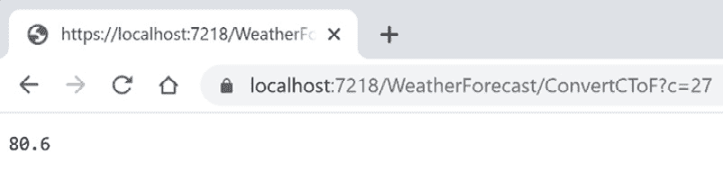

图 2.6 – 从浏览器执行 ConvertCToF API 的结果

这是一个**统一建模语言**（**UML**）图，显示了到目前为止我们所拥有的内容：

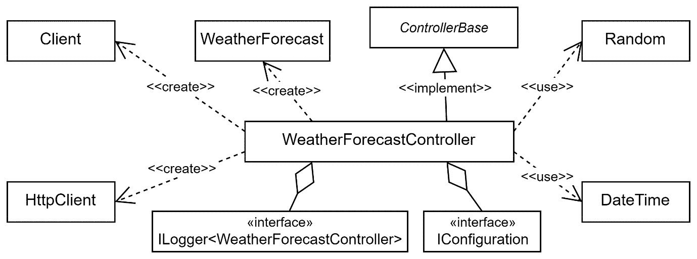

图 2.7 – 显示 WFA 应用的 UML 图

你可以在`WeatherForecastController.cs`中看到所有更改；它始终位于 GitHub 上的`Ch02`源代码中，在名为`02-UqsWeather`的目录下。

应用程序已准备好接受批评，现在我可以告诉你，你刚刚看到的代码是不可进行单元测试的。我们可以执行其他测试类别，但不能进行单元测试，尽管到本章结束时它将是可进行单元测试的。我邀请你打开项目在 VS 中跟随，因为我们将实现令人兴奋且重要的概念。

现在项目已准备好，我们需要做一些基本设置，列表中的第一项是理解依赖项。

# 理解依赖项

如果你的代码做了些有用的事情，那么你的代码很可能依赖于其他代码或另一个组件，而这个组件反过来又依赖于另一个组件。对**依赖项**术语的清晰理解应该会帮助你更好地掌握单元测试，并肯定有助于与同事进行更清晰的交流。

本节中的计划是使你熟悉依赖项的概念，这应该会使理解 DI 模式更容易。理解依赖项和 DI 是编写任何严肃单元测试的先决条件。接下来，我们将探讨依赖项是什么，尽管在单元测试方面，我们并不关心所有依赖项，因此我们将定义相关依赖项是什么。

在我们深入依赖项之前，让我们首先定义抽象类型和具体类型。

## 抽象类型和具体类型

为了让我们处于同一频道，我将定义将要使用的术语。

一个具体类是可以实例化的类；它可能像这样：

```cs
FileStream fileStream = new FileStream(…)
```

`FileStream`是一个具体类型，可以在代码中直接实例化和使用。

抽象类型可以是抽象类或接口。抽象类的例子有`Stream`、`ControllerBase`和`HttpContext`。接口的例子有`IEnumerable`、`IDisposable`和`ILogger`。

我将在书中过度使用这些术语，所以值得定义它们。

## 什么是依赖项？

首先，它不是什么：它不等于在 UML 中使用的相同术语。

在本书的上下文中，以及与其他开发者在单元测试边界内交谈时，可以这样定义：如果类 A *使用* 类型 B，其中 B 是抽象类型或具体类，那么 A 依赖于 B。

术语 *使用* 可以缩小到以下内容：

+   B 被传递给 A 的构造函数。WFA 中的例子：记录器被传递给控制器的构造函数，这使得`ILogger<WeatherForecastController>`成为一个依赖关系，如下所示：

    ```cs
    public WeatherForecastController(
      ILogger<WeatherForecastController> logger, …)
    ```

+   B 被传递给 A 中的方法，如下所示：

    ```cs
    public void DoSomething(B b) { …
    ```

+   B 有一个静态方法，该方法从 A 的方法中调用。WFA 中的例子：`DateTime.Now`在`GetRandom`中被调用，这使得`DateTime`成为一个依赖关系，如下所示：

    ```cs
    wf.Date = DateTime.Now.AddDays(i + 1);
    ```

+   B 在任何 A 内部的地方被实例化，无论是在方法中、字段中还是在属性中。在以下示例中，`HttpClient`在代码中被实例化：

    ```cs
    HttpClient httpClient = new HttpClient();
    ```

根据这个定义，以下所有内容都是`WeatherForecast Controller`的依赖关系：

+   `Random`

+   `DateTime`

+   `Client`

+   `HttpClient`

+   `ILogger<WeatherForecastController>`

+   `IConfiguration`

+   `WeatherForecast`

**数据传输对象**（**DTOs**）不被视为依赖关系，尽管它们看起来像具体的类，但它们充当从一地到另一地传输数据的载体。我们将在*WeatherForecast 类依赖关系*部分展示一个 DTO 的例子。

注意，`record`、`record struct`和`struct`通常遵循与 DTO 相同的概念。

我们将对跨越第一部分*入门和基础*和第二部分*使用 TDD 构建应用程序*的依赖关系进行更多分析。对于有经验的 TDD 实践者来说，发现依赖关系是第二本能。

## 依赖关系相关性

依赖关系使我们的类与代码外部的组件进行交互。在单元测试的上下文中，如果依赖关系有一个在触发时或导致其他与被测试类不太相关的行为时可能引起副作用的方法或属性，则该依赖关系与 DI 相关。

这是一个过载的定义，并不打算在这个阶段完全清晰。从现在开始直到第二部分的结束，我们将提供一些例子来展示何时依赖关系是相关的。

如果我们想要在测试时改变其行为，我们会关注定位依赖关系。如果`_logger.LogInformation`正在写入磁盘，我们有时会改变这种行为，尤其是在测试时。像往常一样，用例子来说明是最好的，因此在本节中，我们将展示多个示例并解释为什么它们是相关的。

### 记录依赖关系

考虑这个`_logger`字段：

```cs
private readonly ILogger<WeatherForecastController> 
    _logger;
```

在应用程序的生命周期中，`_logger`字段可能会被触发以写入日志。根据记录器的配置，它可能会在内存中、调试时的控制台、磁盘上的日志文件、数据库或云服务（例如在`ConvertCToF`方法中记录`_logger`字段时）中写入日志，如下所示：

```cs
_logger.LogInformation("conversion requested");
```

*它是相关的*，因为我们有一个副作用会扩展到系统中的其他组件，并且在稍后的单元测试阶段，我们希望消除这个副作用。

### 配置依赖关系

类中还有一个字段，即`_config`字段，如下所示：

```cs
private readonly IConfiguration _config;
```

`_config` 字段是必需的，用于从配置中获取 API 密钥。它通过控制器类的构造函数传递，类似于 `_logger` 字段。

在运行时 `_config` 可以根据配置加载配置；这不是字面意义上的双关语。您的配置可以位于云端、`appsettings` 或自定义格式中。我们可以在以下示例中看到这个依赖项的使用：

```cs
string apiKey = _config["OpenWeather:Key"];
```

*这是相关的*，因为我们需要通过配置来读取 API 密钥。访问配置也会产生副作用。

### HTTP 依赖

在代码中深入挖掘，你会发现我们实例化了 `HttpClient` 并在代码中使用它：

```cs
HttpClient httpClient = new HttpClient();
```

很明显，我们依赖于 `GetReal` API，它被调用，它发出 HTTP 请求。

与日志和配置依赖项不同，其中依赖项是对抽象（`IConfiguration` 和 `ILogging<>`）的构建，`httpClient` 在代码中被实例化——这被称为**硬**或**具体依赖**。

我们确实关心在代码中实例化依赖项或从外部通过构造函数传递依赖项之间的区别。稍后我们会清楚为什么。

*这是相关的*，因为我们不希望在测试时依赖网络。

### OpenWeather 客户端依赖

OpenWeather 客户端是一个依赖项的依赖项。它本身也是一个依赖项，并且它依赖于由 `httpClient` 表示的 HTTP 依赖项。您可以在以下代码片段中看到这一点：

```cs
Client openWeatherClient = new Client(apiKey, httpClient);
```

此外，这也是另一个具体的依赖项的例子，因为它是在行内实例化的。

*这是相关的*，因为我们不希望在测试时依赖 HTTP（或网络）。

### 时间依赖

考虑以下代码行：

```cs
wf.Date = DateTime.Now.AddDays(i + 1);
```

这里重要的是 `Now` 属性。`Now` 有代码会调用 `Now` 属性是静态的，正如我们在这里可以看到的：

```cs
public static DateTime Now { get; }
```

由于这是静态的，它将使 DI（依赖注入）的处理稍微困难一些，正如我们很快就会看到的。

*这是相关的*，因为我们希望在测试时有一个可预测的时间。获取当前时间不会导致一致的结果，因为时间是在变化的。

### 随机性依赖

这是一个依赖于算法生成随机性的例子：

```cs
wf.TemperatureC = Random.Shared.Next(-20, 55);
```

`Next` 方法也是一个静态方法，它在后台调用时间来生成种子；它还依赖于一个*随机化算法*。我们希望控制结果，以便我们可以对其进行测试。

*这是相关的*，因为我们希望输出是可预测的。

### 天气预报类依赖

我们将这个类实例化为 DTO，因为我们想将数据从我们的方法传输到客户端。这个数据结构将被序列化为**JavaScript 对象表示法**（**JSON**）。代码如下所示：

```cs
WeatherForecast[] wfs = new WeatherForecast[FORECAST_DAYS];
```

*这不相关*，因为这个对象不会产生副作用，它只是携带数据。

如果代码依赖于抽象并且对象没有在类中实例化（如前例中的控制器），那么这通常是好的。如果代码依赖于在类中实例化的具体类，那么我们就不是遵循最佳实践，因为我们违反了一个好的**面向对象编程**（**OOP**）实践：*依赖抽象，而非具体*。这将是我们的下一个主题。

## 依赖抽象，而非具体

这个标题是面向对象编程最佳实践中的流行建议。这个建议适用于两种情况：方法签名和方法内部的代码。我们将在本节中探讨这两种情况。

### 方法签名中的抽象参数

在设计方法，包括类构造函数时，建议检查你是否可以接受一个抽象类型而不是一个具体类型。像往常一样，让我们用例子来解释这一点。

以一个抽象类的例子来说明，我们可以从.NET 中著名的`Stream`类，如下代码片段所示：

```cs
public abstract class Stream : …
```

`Stream`对象代表一系列字节，但该类不关心字节物理来源——无论是来自文件还是来自内存或其他。这就是将其作为抽象类的原因。

我们以`FileStream`为例，它继承自`Stream`，作为一个具体类的示例，如下所示：

```cs
public class FileStream : Stream
```

`FileStream`理解从磁盘文件读取字节流的要求。

我们还有`MemoryStream`，它继承自`Stream`，作为另一个具体类的示例，如下所示：

```cs
public class MemoryStream : Stream
```

下面是一个 UML 图来总结这些关系：

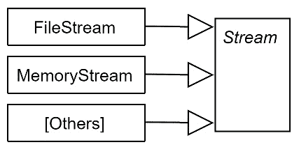

图 2.8 – 流及其子类

将`Stream`作为抽象类打开了`System.Text.Json.JsonSerializer`类接受类型为`Stream`的参数的道路：

```cs
public static void Serialize (Stream utf8Json, object? 
    value, …);
```

此方法将提供的值转换为`Stream`类。

因为这个方法不关心`Stream`类如何处理底层的物理持久性，所以它接受`Stream`父抽象类作为参数。如果没有抽象，那么你将会有**多个**相同方法的过载。每个过载都接受不同的流类型，如下所示（这些过载不存在；它们是假设的）：

```cs
public static void Serialize (FileStream utf8Json, …);
public static void Serialize (MemoryStream utf8Json, …);
public static void Serialize (SqlFileStream utf8Json, …);
public static void Serialize (BufferedStream utf8Json, …);
More Stream overloads…
```

这是一个接受抽象类型作为方法参数的好处示例。这里还有另一个例子。考虑以下代码：

```cs
public static int Sum(int[] elements) 
{
    int sum = 0;
    foreach (int e in elements) sum += e;
    return sum;
}
```

此方法接收一个数组并返回其元素的总和。乍一看，方法的签名看起来不错，但如果你仔细想想，这个方法强制调用者在使用方法之前将任何集合转换为数组，这是一个不必要的转换，并且由于此方法不依赖于数组的特定功能，所以是一种性能浪费。它只是在执行一个`foreach`结构，这意味着它按顺序访问数组元素。它真的需要接受一个数组吗？

将签名参数转换为`IEnumerable<int>`这种抽象类型，将允许此方法接受相当数量的具体类，如下所示：

```cs
public static int Sum(IEnumerable<int> elements)
```

你最初只能用`int[]`数组调用此方法；现在，它可以传递给实现`IEnumerable<int>`的任何对象，而且有很多。以下是一些例子：

```cs
int[] array = new int[] { 1, 2 };
List<int> list = new List<int> { 1, 2 };
Queue<int> queue = new Queue<int>();
queue.Enqueue(1);
queue.Enqueue(2);
// More collections
Sum(array);
Sum(list); // new benefit
Sum(queue); // new benefit
```

回到 WFA 应用程序，我们的控制器构造函数已经做得很好，因为它依赖于抽象，如下面的代码片段所示：

```cs
public WeatherForecastController(
  ILogger<WeatherForecastController> logger, 
    IConfiguration config)
```

总是考虑满足尽可能使你的方法开放的公共分母抽象类型。

### 直接实例化依赖项

我们刚刚讨论了在可能的情况下在我们的方法签名中使用抽象，这减少了耦合并增加了方法的可用性。本节将此建议扩展到代码中。

如果我们在代码中直接实例化类，我们就依赖于具体对象。如果我们依赖于具体对象，那么我们无法在运行时改变它们的行为。让我们以我们的 WFA 应用程序为例，我们在方法中实例化`Client`类，就像以下代码行所示：

```cs
Client openWeatherClient = new Client(apiKey, httpClient); 
```

然后，每次我们使用`openWeatherClient`对象，例如调用`OneCallAsync`方法时，我们都会在网络上向*OpenWeather*端的 RESTful API 发送 HTTP 请求。这对于生产代码来说是好的，但不适合测试代码；当我们测试时，我们希望消除这种行为。

隔离

在这种情况下，我们可以避免 HTTP 调用，并在测试期间使用*隔离框架*来解决这个问题。然而，这只是一个最后的手段。我们将在*第三章*，“开始单元测试”中解释隔离框架是什么。

在测试代码时，我们不希望它出于许多原因触发 HTTP 请求，包括以下原因：

+   我们每段时间可以进行的调用次数有限——有一个配额。

+   我们的测试环境位于防火墙后面，该防火墙禁止出站流量。

+   网络另一端的 REST 服务暂时关闭，因此我们将得到一个假阴性结果，即我们的测试失败了。

+   通过互联网调用服务比处理 CPU 和内存要慢。

你能看出我们的方向吗？代码是可行的，但它不能在独立于 HTTP 调用的环境中进行测试。

重要提示

一些测试类别应该触发 HTTP 请求并到达另一端，例如集成测试。在先前的上下文中，我指的是验证业务逻辑而不测试连接性的测试——其中之一是单元测试。

如果我们要对某个功能进行单元测试，实例化具体类将不起作用。我们在单元测试期间想要做的是检查是否进行了 *虚假尝试* 来触发调用，但实际上并没有执行，这就足够了。到目前为止，我们得到的结论是，在代码中创建具体类与 DI 不兼容，因此也与单元测试不兼容。

避免在业务逻辑中实例化类的根本解决方案是依赖注入（DI），我们很快就会看到。

### 最佳实践回顾

我们在“依赖抽象，而非具体”部分的讨论归结为以下两个 *应该做* 和 *不应该做* 的例子。让我们从不好的或 *不应该做* 的例子开始，如下所示：

```cs
public class BadClass 
{
    public BadClass() {}
    public void DoSometing()
    {
      MyConcreteType t = new MyConcreteType();
      t.UseADependency();
    }
}
```

这里是一个等效的好类示例：

```cs
public class GoodClass 
{
    private readonly IMyClass _myClass; 
    public GoodClass(IMyClass myClass) 
        { _myClass = myClass; }
    public void DoSometing()
    {
      _myClass.UseADependency();
    }
    public void DoSometingElse(SecondClass second)
    {
      second.UseAnotherDependency();
    }
}
```

这里有一些好的实践：

+   将抽象作为参数鼓励解耦，并使方法能够接受更多类型。

+   依赖抽象允许在不更改类中的代码的情况下更改对象的行为。

你可能会问一个问题：*如果我在运行时没有实例化传递给构造函数或方法的对象，那么是谁实例化的呢？肯定在某个环节，某个进程已经实例化了我的依赖并将它们传递给我的类。* 这个问题的答案可以在下一节找到。

# 介绍依赖注入

当我第一次学习如何在代码中实现依赖注入时，我感到一种狂喜，就像我发现了软件工程中的秘密一样；它就像 *代码魔法*。在前面的章节中，我们已经探讨了依赖关系，现在，我们即将发现将这些依赖注入到我们的类中。下一步是解释什么是 DI，并使用 WFA 应用程序的实际示例来确保你在各种场景中进行实验。介绍 DI 的最好方式是通过一个熟悉的例子。

## 依赖注入的第一个例子

依赖注入（DI）在现代 .NET 代码中无处不在。实际上，我们就在 ASP.NET 模板代码中找到了一个例子：

```cs
public WeatherForecastController(
    ILogger<WeatherForecastController> logger) 
{
    _logger = logger;
```

当创建控制器的新实例时，将依赖项 `logger` 对象注入到控制器中。在控制器中没有任何地方是实例化 `logger` 类的。它已经被注入到控制器的构造函数中。

在这个上下文中，“注入”意味着 ASP.NET 框架发现了一个需要实例化这个控制器的传入请求。框架意识到要创建 `WeatherForecastController` 的新实例，它需要创建一个实现了 `ILogger<WeatherForecastController>` 的具体类的实例，以执行类似以下操作：

```cs
ILogger<WeatherForecastController> logger = new 
    Logger<WeatherForecastController>(…); 
var controller = new WeatherForecastController(logger);
```

控制器的构造函数需要一个实现了 `ILogger<WeatherForecastController>` 的具体类的实例，并且框架解析出 `Logger<>` 实现了 `ILogger<>`，因此它可以作为控制器构造的参数使用。

它是如何解决的？我们将在 DI 容器中学习这一点；现在重要的是，它知道如何实例化控制器类。

现在是时候给我们的剧本中的每一个主题起一个与 DI 相关的名字，如下所示：

+   **DI 容器**：管理注入的软件库

+   `ILogger<>`派生对象）

+   **客户端**：请求服务的类（在上一个例子中的控制器）

+   **激活**：实例化客户端的过程

+   **解决方案**：DI 容器找到激活客户端所需的服务

## 测试一个 API

让我们通过一个例子更深入地了解 DI。考虑这个测试问题，它将给你亲身体验 DI 是什么的第一手经验。考虑我们在 WFA 应用程序中之前创建的`ConvertCToF`方法。

我们想对这个方法进行一些测试，以验证温度转换是否准确完成。我们得到了一些°C 和相应的°F 的例子，如下所示：

1.  -1.0 C = 30.20 F

1.  1.2 C = 34.16 F

为了满足测试，我们想使用一个老式的控制台应用程序，如果转换不匹配示例，它将抛出异常。

你可以通过 VS GUI 添加控制台应用程序，或者你可以从解决方案目录执行以下行：

```cs
dotnet new console -o Uqs.Weather.TestRunner
dotnet sln add Uqs.Weather.TestRunner
dotnet add Uqs.Weather.TestRunner reference Uqs.Weather
```

这将在现有解决方案中添加一个新的控制台应用程序`Uqs.Weather.TestRunner`，并引用现有的 ASP.NET Web API 应用程序。在 VS 中，将以下代码添加到控制台应用程序的`Program.cs`文件中：

```cs
using Microsoft.Extensions.Logging;
using Uqs.Weather.Controllers;
var logger = new Logger<WeatherForecastController>(null); 
//fails
var controller = new WeatherForecastController(logger, 
    null!);
double f1 = controller.ConvertCToF(-1.0);
if (f1 != 30.20d) throw new Exception("Invalid");
double f2 = controller.ConvertCToF(1.2);
if (f2 != 34.16d) throw new Exception("Invalid");
Console.WriteLine("Test Passed");
```

当前格式的代码无法运行，因为它在`var logger`行失败。我们稍后会修复这个问题，但首先让我们分析一下代码。代码以我们实例化任何.NET 中的类的方式实例化了一个控制器，然后调用`ConvertCToF`方法并尝试不同的值。如果所有值都通过，它将打印**测试通过**；否则，它将抛出一个异常。

要实例化一个`Logger<>`对象，我们需要将其构造函数传递一个`ILoggerFactory`类型的对象。如果你传递`null`，它将在运行时失败。此外，`ILoggerFactory`的具体实现实例不应该手动实例化，除非你正在集成日志记录框架或处理特殊情况，而测试不是特殊情况！简而言之，我们无法轻易做到这一点。

如果我们尝试向控制器的构造函数传递两个 null 值，并且忽略创建一个`Logger<>`对象，就像这样：

```cs
var controller = new WeatherForecastController(null, null);
```

问题在于，如果你传递一个`null`值，控制器中的`_logger`对象将是 null，你的代码将在这一行失败，并出现著名的`NullReferenceException`异常，如下所示：

```cs
_logger.LogInformation("conversion requested");
```

我们真正想要的是只是实例化控制器。我们不是在测试记录器；我们希望传递给构造函数任何可以创建控制器对象的东西，但记录器挡在了我们的路上。结果发现，Microsoft 有一个名为`NullLogger<>`的类，它正是这样做的——让路！Microsoft 的文档中这样描述：“*最小化记录器，什么都不做*”。

在这个类的启发下，代码的前几行将看起来像这样：

```cs
var logger = NullLogger<WeatherForecastController>
    .Instance;
var controller = new WeatherForecastController(logger, …);
```

我们通过`Instance`字段获取到`NullLogger<>`的引用。当我们调用`_logger.LogInformation`时，不会发生任何事，这符合我们的需求。如果我们现在运行这个控制台应用程序，我们将得到一个**测试通过**的消息。

重要提示

通过控制台应用程序进行测试并不是最佳实践。同样，抛出异常和写入消息也不是报告通过和失败的测试的理想方式。正确的方法将在下一章中介绍。

控制器的构造函数接受一个`ILogger<>`对象，这给了我们传递一个`NullLogger<>`对象作为后者的灵活性，因为它实现了`ILogger<>`接口，如下所示：

```cs
public class NullLogger<T> : Microsoft.Extensions.Logging
    .ILogger<T>
```

日志类的 UML 图看起来如下：

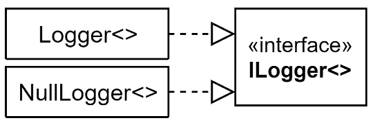

图 2.9 – Logger<>, NullLogger<>, 和 ILogger<> 的 UML 图

到目前为止，分析我们所做的是值得的。这是我们取得的成绩：

1.  在运行时（当 API 启动时），`Logger<>`被注入到控制器中，并应该按预期写入日志。

1.  在测试时，我们对日志活动不感兴趣；我们正在测试另一个场景，所以我们传递了`NullLogger<>`。

1.  我们被允许向`ILogger<>`注入不同的类型，因为`ILogger<>`是一个接口，它是一个抽象。如果我们的构造函数期望一个`Logger<>`类型（没有`I`的具体类型），我们就无法做到这一点。

在第一种情况下，是**DI 容器**在运行时注入了对象。在第二种情况下，这是我们手动注入一个不同的记录器进行测试。以下截图中的注释代码展示了本节内容的总结：

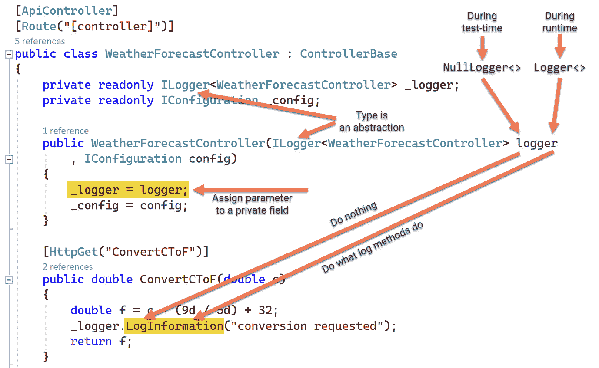

图 2.10 – 显示测试时间和运行时 DI 的注释代码

结论是，如果我们的参数使用抽象类型，如接口、`ILogger<>`类型接口或抽象类，我们可以使我们的类更具可重用性，从而可以利用 DI。

`LogInformation`方法根据注入的对象改变行为，因此它充当了一个接口。这自然地引导我们进入下一节关于接口的内容。

## 什么是接口？

作为英语中的一个术语，*接口*是两块布料缝合在一起的地方。在 DI 上下文中，这个术语类似于代码中我们可以*改变*行为而不显式更改代码的区域。我们可以指向我们之前转换方法中的例子，如下所示：

```cs
public double ConvertCToF(double c)
{
    double f = c * (9d / 5d) + 32;
    _logger.LogInformation("conversion requested");
    return f;
}
```

以`LogInformation`方法为例。我们希望这个方法能够写入某个生产工具，但在测试时，我们希望它什么都不做（如果我们的测试场景不是关于日志记录）。我们想要测试其他功能，但`_logger.LogInformation`挡在了我们的路上，试图写入某个地方，因此我们希望改变它的行为。

`LogInformation`是一个接口，因为行为可以在这里改变。从上一节中，如果我们向类注入一个`Logger<>`对象，那么`LogInformation`将按一种方式表现，如果我们注入`NullLogger<>`，它将按另一种方式表现。

## 控制反转

你经常会听到**控制反转**（IoC）这个术语用来表示 DI。你也可能会听到 IoC 容器，这也意味着 DI 容器。从实用主义的角度来看，你不需要担心这些术语在意义上的差异。实践者对 IoC 和它与 DI 的关系有不同的定义。只需搜索其中一个术语与另一个术语，你会在论坛上找到充满矛盾的定义。

这里是实践者普遍认同的要点：

+   IoC 是将事件流从软件到用户界面（UI）或相反方向反转。

+   DI 是 IoC 的一种形式。

*DI* 是最流行且最现代的术语。术语 *IoC* 来自不同的时代，更通用，并且实用性较低，所以我建议使用术语 *DI*。

在所有这些例子、最佳实践和定义之后，我把最好的留到了最后，这就是本章的实践部分。这是你可以如何利用所有前面的文献来编写有用代码的方法。

# 使用 DI 容器

**DI 容器**是一个库，它将服务注入客户端。DI 容器提供了除了注入依赖项之外的其他功能，例如以下内容：

+   注册需要注入的类（注册服务）

+   实现服务需要如何实例化

+   实例化已经注册的内容

+   管理创建的服务生命周期

让我们用一个来自上一段代码的例子来明确 DI 容器的角色。我们有`logger`服务被注入，但谁负责这个？

有一个名为`Microsoft.Extensions.DependencyInjection`的 DI 容器，它将注入`_logger`。这发生在`Program.cs`的第一行，如图所示：

```cs
var builder = WebApplication.CreateBuilder(args);
```

上一个方法调用注册了一个默认的日志记录器。不幸的是，虽然我们可以在 .NET 源代码中看到代码，但在我们的 `Program.cs` 源代码中并不明显。事实上，上一行注册了许多其他服务。

通过在`Program.cs`的上一行之后添加一行用于实验，我们可以看到创建了多少注册的服务：

```cs
int servicesCount = builder.Services.Count;
```

这将给我们 82 个服务。其中一些服务与日志相关活动有关。所以，如果你想查看它们，你可以在上一行之后直接添加这一行：

```cs
var logServices = builder.Services.Where(_ => 
    x.ServiceType.Name.Contains("Log")).ToArray();
```

你可以看到这里我们正在筛选任何名称中包含`Log`字样的服务。如果你在这行代码后设置断点并转到 VS 的`logServices`，你可以看到所有注册的日志相关服务的快照，如下面的截图所示：

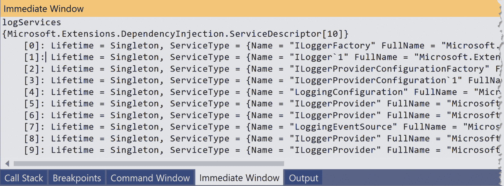

图 2.11 – 显示已注册日志相关服务的即时窗口

截图显示我们有 10 个注册的日志相关服务。在运行时为我们注入的是第二个（索引号 1）。

注意

根据你的 ASP.NET 版本，你可能会得到一个不同的预注册服务列表。

我们将更改控制器中的实现，将所有内容移动到依赖注入，并尝试编写 DI-ready 代码的各种场景。

## 容器角色

容器活动是由 DI 容器在后台执行的。容器参与启动你的应用程序中的类，如下面的截图所示：

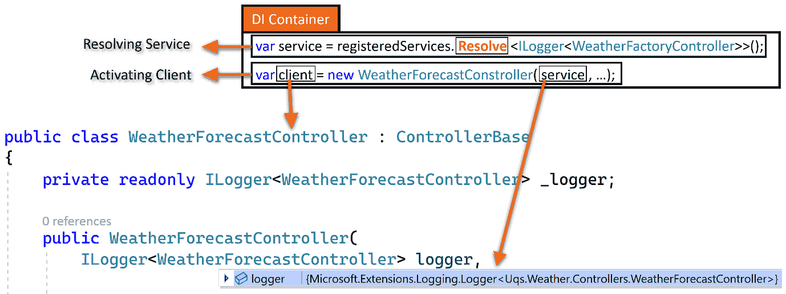

图 2.12 – 容器在行动（伪代码）

**DI 容器**框的代码是伪代码。它试图总结 DI 如何从已注册的服务列表中*解析*客户端所需的*服务*。然后，DI 激活客户端并将其传递给服务。所有这些都是在运行时发生的。

注册是我们将在许多示例中探索的活动。在这个场景中，有一个指令说明每当客户端请求一个`ILogger<>`对象时，就用`Logger<>`类型的具体类来替换它。

重要的是要注意，虽然客户端正在请求一个接口，但 DI 之前已经指示了如何为这个抽象构造一个具体的类；DI 容器之前就知道要构造一个`Ilogger<>`对象，它需要初始化一个`Logger<>`对象。

## 第三方容器

到目前为止，我们一直在使用一个*内置*的 DI 容器，它与新的 ASP.NET 项目自动连接，这就是`Microsoft.Extensions.DependencyInjection` Microsoft DI 容器，但这并不是.NET 6 可用的唯一 DI 容器——还有其他第三方选项。

近年来，微软开发了一个 DI 容器。第三方容器逐渐失去了人气，转而使用.NET 自带的一个。此外，一些框架在.NET 5 的引入时并未跃进。如今，随着.NET 6 的推出，剩下的强大容器是**Autofac**和**StructureMap**。还有其他支持.NET 6 的容器，但它们并不那么受欢迎。

如果你熟悉单元测试并且想要更多在`Microsoft.Extensions.DependencyInjection`中不支持的功能，那么可以看看其他框架，如 Autofac。但对于非单体、中等规模的项目，我建议坚持使用微软的，因为它得到了很好的支持，并且有大量的第三方插件组件。你总是可以在以后阶段切换到另一个框架。我的建议是不要浪费宝贵的时间选择 DI 容器。从微软的版本开始，直到你的需求超过它。

## 服务生命周期

当一个服务注册为传递给客户端时，DI 容器必须决定服务的生命周期。生命周期是从服务创建到释放以进行垃圾回收或销毁的时间间隔。

微软 DI 容器在注册服务时可以指定三个主要生命周期：**临时**、**单例**和**作用域生命周期作用域**。

注意，如果服务实现了`IDisposable`接口，当服务释放时将调用`Dispose`方法。当服务释放时，如果它有依赖项，它们也会被释放和销毁。接下来，我们将探讨三个主要生命周期。

### 临时生命周期

临时服务每次注入或请求时都会创建。容器为每个请求简单地创建一个新的实例。

这在不需要担心线程安全或服务状态修改（由另一个请求对象引起）方面是好的。但是，为每个请求创建一个对象会有不良的性能影响，尤其是在服务需求高的时候，激活它可能并不便宜。

你将在稍后的*重构 DI*部分看到一个临时服务的例子。

### 单例生命周期

单例服务在第一个客户端请求时创建一次，并在应用程序终止时释放。相同的激活服务将被传递给所有请求者。

这是最有效率的生命周期，因为对象只创建一次，但这也是最危险的，因为单例服务应该允许并发访问，这意味着它需要是线程安全的。

你将在稍后的*重构 DI*部分看到一个单例服务的例子。

### 作用域生命周期

作用域服务在每个 HTTP 请求中创建一次。它们从 HTTP 请求的开始活到 HTTP 响应的结束，并且它们将在客户端之间共享。

如果你想让一个服务被几个客户端使用，并且服务只适用于单个请求，这是好的。

与瞬态和单例生命周期相比，这种生命周期最不受欢迎。在性能方面，它位于瞬态和单例生命周期之间。在给定时间内，只有一个线程执行每个客户端请求，并且因为每个请求都得到一个单独的 DI 范围，所以你不必担心线程安全。

使用范围服务的流行例子是使用**Entity Framework 的**（**EF 的**）DB 上下文对象作为范围，这允许请求共享相同的数据，并在需要时在客户端之间缓存数据。

这里还有一个例子。假设你有一个允许客户端记录日志的服务，但它只会在 HTTP 请求结束后将数据从内存刷新到目标媒体（例如，保存到数据库）。忽略其他条件，这可能是范围生命周期的候选者。

我们将在*第九章*中看到一个范围生命周期的示例，*使用 Entity Framework 和关系型数据库构建预约预订应用*。

### 选择生命周期

如果你的关注点是性能，那么考虑单例。然后，下一步是检查服务是否线程安全，无论是通过阅读其文档还是进行其他类型的调查。

然后，如果相关，就降到范围级别，然后降到瞬态。始终选择瞬态是最安全的选项——如果有疑问，那么就选择瞬态！

重要提示

任何被注入到单例中的类都将成为单例，无论注入对象的生命周期如何。

### 容器工作流程

在我们查看服务注册和生命周期的示例之前，这是一个很好的时机来概括我们对 DI 容器的理解，并查看 DI 激活过程的流程图：

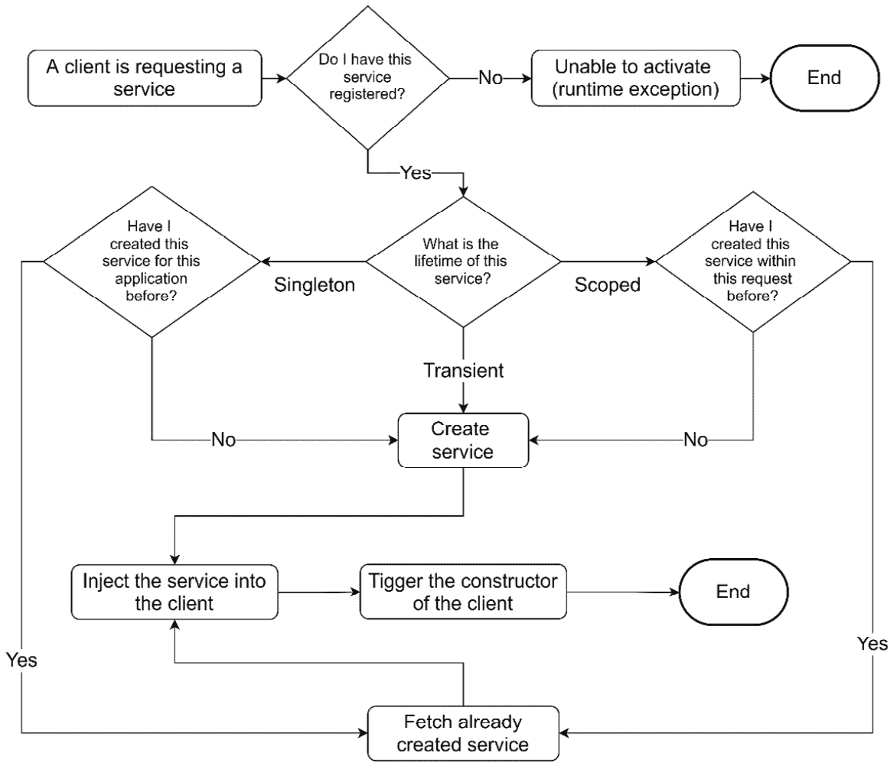

图 2.13 – DI 容器的流程

在这个图中，很明显，当激活一个类时，DI 容器有两个主要关注点，即注册和生命周期。

## 为 DI 重构

如果你正确地做了 DI，那么在实现单元测试方面你已经完成了一半。在编写单元测试时，你会考虑如何使一切准备好 DI。

有一些因素将决定你的服务应该如何注入，具体如下所述：

1.  我的接口是否属于一个抽象方法？换句话说，问题中的方法是否存在于一个抽象中？这是我们在前面看到的`ILogger.LogInformation`方法的情况，但我们将在这个*注入 OpenWeather 客户端*部分更详细地介绍这个场景。

1.  我的接口是否是一个静态方法？这将在*注入 DateTime*和*注入随机生成器*部分中介绍。

### 注入 OpenWeather 客户端

一个有问题的行是`WeatherForecastController.cs`中的`Client`类实例化，如图所示：

```cs
string apiKey = _config["OpenWeather:Key"];
HttpClient httpClient = new HttpClient();
Client openWeatherClient = new Client(apiKey, httpClient);
OneCallResponse res = 
   await openWeatherClient.OneCallAsync(…)
```

访问`_config`的唯一目的是获取`Client`的 API 密钥，实例化`HttpClient`的唯一目的是将其传递给`Client`的构造函数。因此，如果我们注入`openWeatherClient`，则前两行将不再需要。

我们从待注入的类中使用哪种方法或属性？通过查看代码，答案是`OneCallAsync`。那么，在`Client`的层次结构中，具有此成员的最高类型（一个类、一个抽象类或一个接口）是什么？要做到这一点，请按住*Ctrl*按钮并点击 VS 中的类名，你将发现`Client`实现了`IClient`，如图所示：

```cs
public class Client : IClient
```

然后，按住*Ctrl*并点击`IClient`，你将找到以下接口：

```cs
public interface IClient
{
    Task<OneCallResponse> OneCallAsync(decimal latitude, 
       decimal longitude, IEnumerable<Excludes> excludes,
       Units unit);
}
```

显然，我的实现可以依赖于`IClient`而不是`Client`。

在控制器构造函数中，添加`IClient`并添加`_client`作为字段，如下所示：

```cs
private readonly IClient _client;
public WeatherForecastController(IClient client, …
{
    _client = client;
    …
```

最后一步是对这两行进行以下修改：

```cs
Client openWeatherClient = new Client(apiKey, httpClient);
OneCallResponse res = 
    await openWeatherClient.OneCallAsync(…);
```

删除第一行，因为我们不再实例化`Client`，并将你的第二行修改为使用`_client`而不是之前的`openWeatherClient`。这将导致以下代码：

```cs
OneCallResponse res = await _client.OneCallAsync(…);
```

我们已经对控制器进行了所有修改。剩下的是在 DI 容器中注册如何为控制器构造函数注入匹配`IClient`的对象。让我们以当前状态运行项目，我们将得到以下错误：

```cs
System.InvalidOperationException: Unable to resolve service 
  for type IClient' while attempting to activate 
    'WeatherForecastController'
```

DI 容器试图寻找一个实现`IClient`的具体类，以便它可以创建它并将其传递给`WeatherForecastController`的构造函数。我们知道有一个名为`Client`的具体类实现了`IClient`，但我们还没有告诉 DI 容器。

为了使 DI 容器注册一个服务，它需要两个信息位，如下所示：

1.  如何创建所需的服务？

1.  创建的服务生命周期是什么？

*第 1 点*的答案是，每当请求`IClient`时，我们需要创建一个`Client`实例。

*第 2 点*比较复杂。`Client`是一个在线有文档的第三方类。第一步是查看文档以查看它是否有推荐的寿命，在这种情况下，`Client`的文档指定`Singleton`为推荐的。在其他没有文档的情况下，我们必须以其他方式找出它。我们稍后会提供更多示例。

要注册我们的依赖项，在`Program.cs`文件中，查找由`Add services to the container`模板提供的注释，并在其下方添加你的代码，如下所示：

```cs
// Add services to the container.
builder.Services.AddSingleton<IClient>(_ => {
    string apiKey = 
        builder.Configuration["OpenWeather:Key"];
    HttpClient httpClient = new HttpClient();
    return new Client(apiKey, httpClient);
});
```

在这里，我们以与之前相同的方式构造`Client`。一旦`Client`首次请求，每个应用程序将只创建一个实例，并且所有客户端在请求时将提供相同的实例。

现在，我们已经完成了`GetReal`方法所需的所有依赖项的 DI，让我们解决`GetRandom`方法中的`Now`依赖项。

### 注入 DateTime

在我们的`GetRandom`方法中，我们使用`DateTime`，并且注入它有些棘手。让我们看看代码中`DateTime`类的使用情况。我们使用以下内容：

+   `AddDays`方法

+   `Now`属性，它返回一个`DateTime`对象

所有这些都在一行代码中清晰地展示出来，如下所示：

```cs
wf.Date = DateTime.Now.AddDays(i + 1);
```

`AddDays`方法是一个依赖于天数算术计算的方法，可以通过查看 GitHub 上的`DateTime`源代码来验证，在[`github.com/microsoft/referencesource/blob/master/mscorlib/system/datetime.cs`](https://github.com/microsoft/referencesource/blob/master/mscorlib/system/datetime.cs)。

我们不必担心注入它，因为它没有达到外部依赖；它只是执行一些 C#代码，或者我们可能想要注入它来控制`AddDays`方法是如何计算的。在我们的例子中，注入`AddDays`不是必需的。

第二点是`Now`属性。如果我们编写一个涉及测试`Now`值的单元测试，我们希望将其冻结到一个常量值以便测试。在这个阶段，冻结它的画面可能还不清楚，但在下一章单元测试`GetRandom`时会更清晰。

我们需要提供一个注入的`Now`属性，但`Now`是一个**静态属性**，正如我们在这里看到的：

```cs
public static DateTime Now
```

静态属性（和方法）不遵循与实例属性相同的多态原则。因此，我们需要找出一种不同于之前的方法来注入`Now`。

下面的代码展示了如何以适合多态工作的方式准备`Now`。创建一个如下所示的接口作为抽象：

```cs
public interface INowWrapper
{
    DateTime Now { get; }
}
```

我们将使我们的代码依赖于这个抽象类型。此外，我们还需要提供一个具体`NowWrapper`类的实现，所以我们的代码看起来就像这样：

```cs
public class NowWrapper : INowWrapper
{
    public DateTime Now => DateTime.Now;
}
```

我在项目中的一个名为`Wrappers`的目录下添加了两个文件。我在其中添加了`INowWrapper.cs`和`NowWrapper.cs`。

Wrapper 和 Provider

一些开发者喜欢为这类类型添加`Wrapper`后缀，而其他人则喜欢使用`Provider`后缀，例如`NowProvider`。我不喜欢使用`Provider`这个名字，因为它已经是一个设计模式，可能会造成误导。我的建议是选择一种约定并保持一致性。

通常，当我们为注入注册一个非具体类型时，我们需要考虑两个要点，如下所示：

1.  如何创建所需的服务？

1.  创建的服务生命周期是什么？

第一点很容易——我们只需实例化`NowWrapper`类。第二点取决于`DateTime.Now`原始属性。由于我知道这是一个可能同时有多个请求击中我的静态属性的 Web 环境，我会首先检查流行的.NET 线程安全主题。换句话说，如果这个属性被多个线程同时访问，会不会导致不确定的行为？

`DateTime`的静态成员，包括`Now`属性，都是考虑到线程安全性而编写的，因此同时调用`Now`不应导致不确定的行为。

在这种情况下，我可以将我的 DI 作为单例。让我们注册`INowWrapper`以进行注入。与之前的例子一样，将`INowWrapper`添加到控制器构造函数中，如下所示：

```cs
public WeatherForecastController(, INowWrapper nowWrapper, )
{
    _nowWrapper = nowWrapper;
…
```

将`DateTime.Now`替换为`_nowWrapper.Now`，如下所示：

```cs
wf.Date = _nowWrapper.Now.AddDays(i + 1);
```

最后，在`Program.cs`文件中注册您的依赖项，使用以下代码：

```cs
builder.Services.AddSingleton<INowWrapper>(_ => 
    new NowWrapper());
```

这意味着当第一次请求`INowWrapper`实例时，DI 容器将实例化它，并保留其整个应用程序的生命周期。

### 注入随机生成器

随机数生成器的设计就是不可预测的；否则，它就不会是随机的！如果它没有 DI 注入，那么在单元测试中就会有问题，因为单元测试应该针对一个固定的（确定的）值进行测试。让我们看看这里的问题行：

```cs
wf.TemperatureC = Random.Shared.Next(-20, 55);
```

`Shared`是一个静态方法，所以我们有与之前任务中`Now`相同的问题。首先，我们需要确定线程安全性。在`Next`文档中没有明确提到它是否是线程安全的；相反，网上的一些说法称它不是线程安全的。因此，这里最安全的选项是假设它不是线程安全的。在这里，我们可以包装整个类或特定方法。我将选择包装整个类，以防我们以后需要使用`Random`类中的另一个方法。让我们编写我们的接口，如下所示：

```cs
public interface IRandomWrapper
{
    int Next(int minValue, int maxValue);
}
```

在这里，我们有具体实现它的类：

```cs
public class RandomWrapper : IRandomWrapper
{
    private readonly Random _random = Random.Shared;
    public int Next(int minValue, int maxValue)
        => _random.Next(minValue, maxValue);
}
```

按照惯例将其添加到控制器构造函数中，并用此代码替换`GetRandom`中的代码：

```cs
wf.TemperatureC = _randomWrapper.Next(-20, 55);
```

我在类中稍微改变了行为；最初，每次我们调用`Next`时都会创建一个新的`Random`实例，但现在它为每个请求的类创建一个`_randomWrapper`。

由于我们的`Next`类实现依赖于线程不安全的`_random.Next`，因此我们的类也不是线程安全的。因此，在注入时，我们不能将其作为单例注入；我们必须将其作为瞬态注入，因此我们的`Program.cs`代码如下所示：

```cs
builder.Services.AddTransient<IRandomWrapper>(_ => 
    new RandomWrapper());
```

这可能作为一个`AddScoped`注册方法有效，但文档不足，我无法做出决定，而瞬态总是最安全的。

现在，您可以运行应用程序，并通过 Swagger UI 执行两个 API，以确保一切按预期工作。

我们所做的 DI 更改都在 GitHub 上的`Ch02`源代码中，位于名为`03-UqsWeather`的目录下。

## 逼真的 DI 场景

使用依赖注入（DI）最常见的情况是与单元测试结合使用，尽管我也见过它在其他地方被用来在运行时改变某个组件的行为。考虑以下两种情况：一种是基于配置更改系统功能，另一种是针对不同的托管环境更改系统行为。让我们考虑下一个例子，即**负载测试**我们的 WFA 应用程序。

### 使用 DI 作为负载测试示例

对于关键系统，一个常见的**非功能性需求**（**NFR**）是负载测试。负载测试是对系统进行人工调用模拟以测量其处理高并发调用量的能力。对于我们的 WFA，负载测试看起来会是这样：

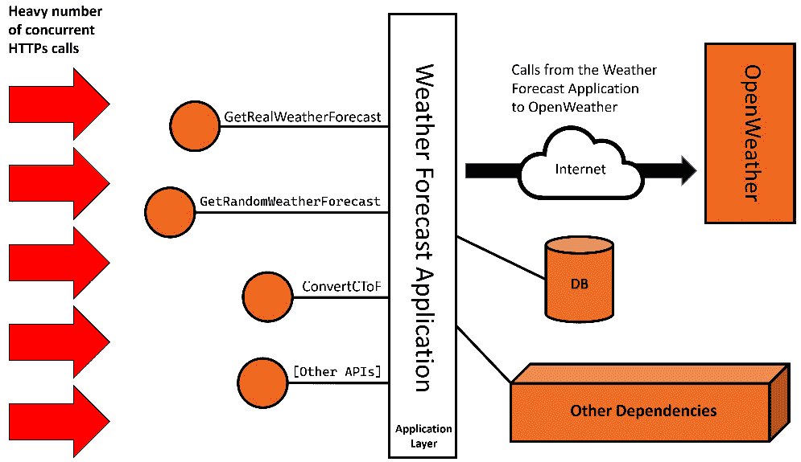

图 2.14 – 负载测试下的 WFA

负载测试框架将通过向 API 发出预定的调用数量来启动测试，并测量响应时间和失败次数。反过来，API 将对它们的依赖项施加负载。

完整的 WFA 可能有多重依赖项，但在这个例子中，我们特别感兴趣的是我们在后台调用的*OpenWeather* API。如果我们要对 WFA 应用程序进行负载测试，我们将设计性地向*OpenWeather*发出大量的调用，这*不应该*是情况，有很多原因。以下是一些：

+   消耗分配的调用配额数量

+   通过你的系统对他们的系统进行负载测试的合同协议

+   在短时间内因调用过多而被禁止

+   伦理原因，因为这可能会影响他们的整体服务质量

除非你的系统需要与第三方连接进行负载测试，并且你已经与第三方达成协议这样做，否则我不会这样做。

我们能做些什么来绕过这个问题，并在不调用*OpenWeather*的情况下进行负载测试？

一种解决方案是在 WFA 中添加一个配置键。当这个键为`true`时，我们希望所有应用程序中对*OpenWeather*的调用都返回一个存根响应（预定义响应）。关于模拟、存根、存根和伪造的更多内容将在下一章讨论。现在，我们将这种类型的响应称为存根响应。

#### 启用 OpenWeather 存根响应

让我们启用一个代表 OpenWeather 的存根响应。我们从哪里开始？我会直接寻找导致调用 OpenWeather 的*缝隙*。正如这里所示，它在我们的`WeatherForecastController`类中：

```cs
OneCallResponse res = await _client.OneCallAsync(…)
```

我们需要做的是保持之前的代码不变，但通过不通过网络而是返回一些保存的值来改变这个方法的行为，当处于负载测试之下。以下是实现这一目标的计划：

1.  添加一个配置来表示负载测试。

1.  添加一个存根响应类。

1.  注册一个基于配置的响应交换条件。

#### 添加配置

我们希望默认情况下配置是关闭的，除非我们明确将其设置为*开启*。在你的`appsettings.json`文件中，添加以下代码：

```cs
"LoadTest": {
  "IsActive" : false 
}, …
```

在我们的`appsettings.Development.json`文件中，添加相同的配置，但将其设置为`true`。当你本地加载应用程序时，这应该会显示为`true`。

#### 添加存根类

`OneCallAsync` 是 `IClient` 接口上的一个方法。如果您查看代码，我们会将 `client` 对象，即 `_client`，作为参数传递给构造函数。在这里我们可以做一些魔法——我们需要将我们的 `IClient` 模拟实现传递给构造函数，然后找出一种方法通过构造函数传递它。

在您的项目根目录下添加一个名为 `ClientStub` 的类，以保存我们模拟的 `IClient` 接口实现，如下所示：

```cs
public class ClientStub : IClient
{
    public Task<OneCallResponse> OneCallAsync(
        decimal latitude, decimal longitude, 
        IEnumerable<Excludes> excludes, Units unit) 
    {
        const int DAYS = 7;
        OneCallResponse res = new OneCallResponse();
        res.Daily = new Daily[DAYS];
        DateTime now = DateTime.Now;
        for (int i = 0; i < DAYS; i++)
        {
            res.Daily[i] = new Daily();
            res.Daily[i].Dt = now.AddDays(i);
            res.Daily[i].Temp = new Temp();
            res.Daily[i].Temp.Day = 
                Random.Shared.Next(-20, 55);
        }
        return Task.FromResult(res);
    }
}
```

`IClient` 定义在 *OpenWeather* 客户端的 NuGet 包中。它有一个实现 `OneCallAsync` 的方法。我查找了使用的属性并生成了一个 7 天的虚假预报。请注意，您可能需要在其他场景中制作一个完整的模拟。

现在，`Client` 和 `ClientStub` 都实现了 `IClient`，正如这个图所示：

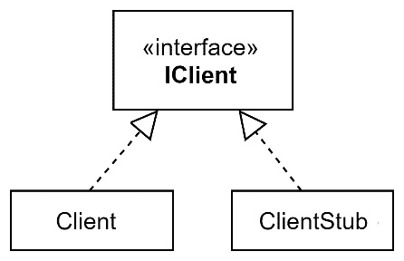

图 2.15 – IClient、Client 和 ClientStub 的关系

现在是开发者经常忘记做的步骤：注册服务。请记住，每次您忘记注册服务时，您并不孤单。

#### 更新 IClient 注册

我们将使用我们的 DI 容器来决定何时注入 `Client` 的实例，何时注入 `ClientStub` 的实例。在 `Program.cs` 中，修改 `IClient` 的初始注册，使其看起来像这样：

```cs
builder.Services.AddSingleton<IClient>(_ => {
    bool isLoad =      
    bool.Parse(builder.Configuration["LoadTest:IsActive"]);
    if (isLoad) return new ClientStub();
    else
    {
        string apiKey = 
            builder.Configuration["OpenWeather:Key"];
        HttpClient httpClient = new HttpClient();
        return new Client(apiKey, httpClient);
    }
});
```

每当请求 `IClient` 的实例时，DI 容器将根据配置决定注入 `ClientStub` 或 `Client`。

现在我们已经完成了模拟实现并准备运行。当您运行项目时，查看 `GetReal` 方法的输出。如果您已启用负载测试，您将注意到您得到的是模拟版本。

### 注意事项

我们已经看到了，我敢说这是一种美丽的方式来交换实现。虽然这个例子很小且有限，但在更大的项目中，实现方式将更加出色。考虑以下这些要点：

+   **关注点分离**，将加载不同版本代码的任务从控制器类移至注册部分。

+   当将 `IClient` 传递给新的控制器时，开发者无需担心或记住执行额外的实现。

与此场景类似，在满足某些条件下需要交换实现时，你可以使用依赖注入（DI）。

此场景位于 GitHub 上 `Ch02` 源代码的 `04-UqsWeather` 目录中。

## 方法注入

在本章中，您已经看到我们一直在通过构造函数注入参数。还有一种不太流行的注入形式，称为 **方法注入**。这是一个来自 WFA 控制器的例子：

```cs
public double ConvertCToF(double c,
    [FromServices] ILogger<WeatherForecastController>
       logger)
{
    double f = c * (9d / 5d) + 32;
    logger.LogInformation("conversion requested");
    return f;
}
```

注意到 `FromServices` 属性。这指示 DI 容器以与构造函数中相同的方式将依赖项注入到方法中。显然，在构造函数中不需要这样做。

当你在类中有多个方法时，你会使用方法注入。其中一个使用特殊的服务。这里的优点是更干净的类构造函数，以及一点性能提升，因为类——例如，控制器——可能会被实例化，但注入服务可能不会被使用。所以，注入但不使用它会有性能浪费。

在这个示例案例中，日志记录器仅在 `ConvertCToF` 方法中使用，因此它可以从构造函数移动到方法。它只需要在 `ConvertCToF` 而不是控制器被实例化时注入，以服务于任何其他方法。

最佳实践推荐具有单一职责的类。这导致相关的方法与相关的服务相关联，所以你不会找到方法注入作为一个流行的模式，但如果需要，方法注入是存在的。

## 属性注入

**属性注入**是将服务注入到类上的属性。微软容器不支持这种做法，但第三方容器支持。

我见过这种方法在遗留系统中使用，其中 DI 容器正在逐步引入，代码更改最小。然而，我从未在绿色场应用中见过或使用过这种方法。

我相信它没有被添加到微软容器中，因为它不受欢迎，也不被鼓励。

## 服务定位器

每个容器都自带或集成了一个 **服务定位器**。服务定位器查找并激活已注册的服务。所以，DI 容器注册一个服务，服务定位器解析已注册的内容。这里是一个使用服务定位器的典型模式：

```cs
public class SampleClass
{
    private readonly IServiceProvider _serviceProvider;
    public SampleClass(IServiceProvider serviceProvider)
    {
        _serviceProvider = serviceProvider;
    }
    public void Method()
    {
        MyClass myClass = 
            _serviceProvider.GetService<IMyClass>();
        myClass.DoSomething();
    }
}
```

`IServiceProvider` 是一个支持服务定位的抽象。它可以像任何其他服务一样注入到类中。注意当我们调用 `GetService` 方法时，它给我们 whatever 是注册了 `IMyClass` 的。

显然，你可以通过将 `IMyClass` 注入构造函数来完成同样的事情，这样做甚至更好。你可以在这里看到它是如何被完成的：

```cs
public SampleClass(IMyClass myClass) 
```

但有些情况下，你会想要避免注入，而更愿意使用服务定位器。这通常在 DI 没有完全实现的遗留应用程序中使用。

在代码中使用服务定位器会复杂化你的单元测试，所以最好避免使用，一些从业者甚至会将其视为反模式。

# 摘要

我承认这是一个很长的章节，但我的辩护是它有大量的例子来涵盖许多现实生活中的 DI 场景。此外，DI 自动鼓励良好的软件工程实践，所以我们不得不包括相关的实践。如果你要开发 TDD 风格，你大约会花费 10% 的编码时间来做 DI 相关的任务，我希望这一章节做得正确，并增加了你的知识。

DI 主要与单元测试一起使用，所以没有它，DI 可能感觉不那么有趣。下一章，*单元测试入门*，将使用我们在这里重构的 WFA 应用程序，希望你能进一步欣赏这种设计模式。

# 进一步阅读

要了解更多关于本章讨论的主题，你可以参考以下链接：

+   *控制反转（IoC）*: [`martinfowler.com/bliki/InversionOfControl.xhtml`](https://martinfowler.com/bliki/InversionOfControl.xhtml)

+   *ASP.NET Core 中的依赖注入（DI）*: [`docs.microsoft.com/en-us/aspnet/core/fundamentals/dependency-injection`](https://docs.microsoft.com/en-us/aspnet/core/fundamentals/dependency-injection)
