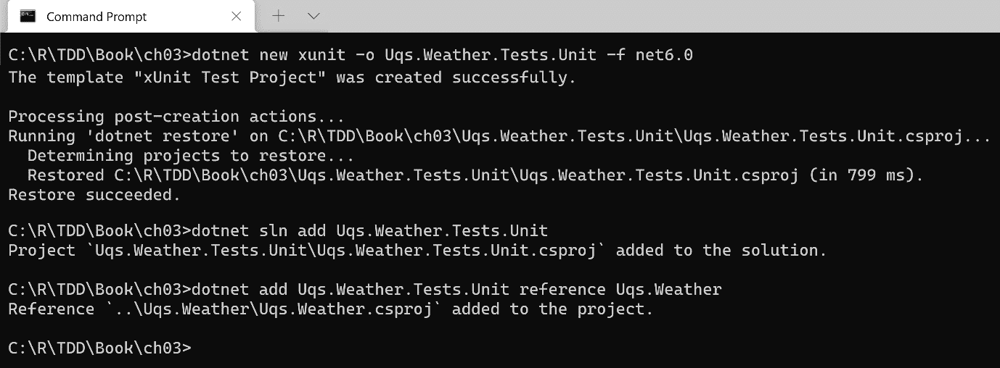
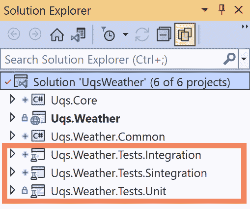
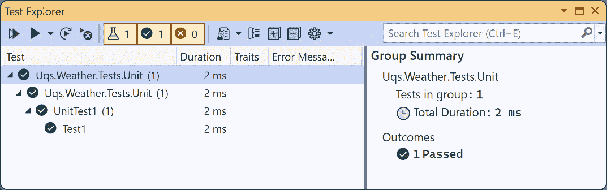
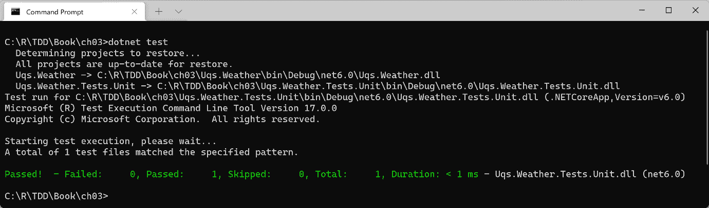
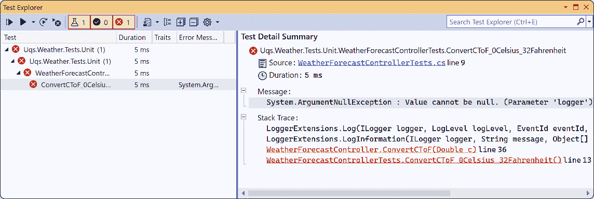
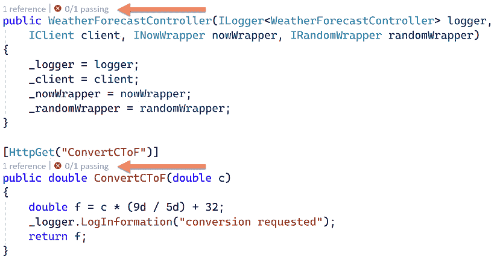
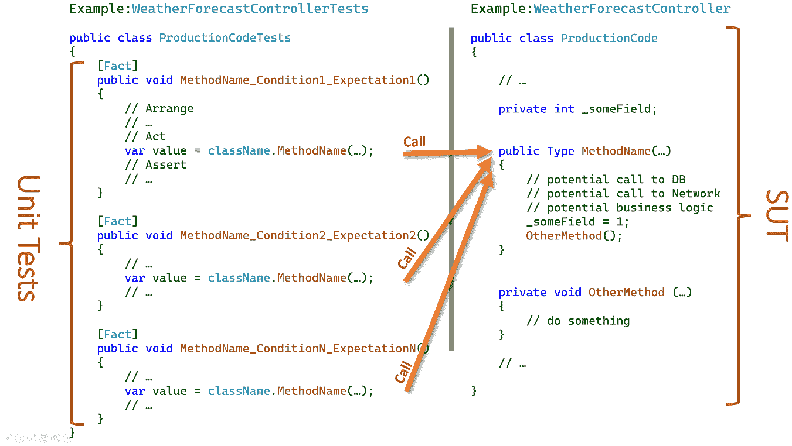
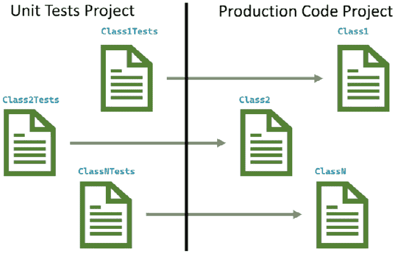
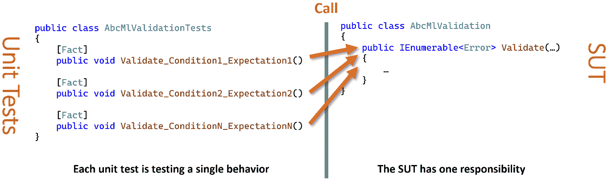

# 3

# 开始单元测试

**单元测试**是 TDD 的核心，也是实践 TDD 的先决条件。我想简要地介绍必要的最小理论，并更多地熟悉您日常代码中单元测试实践者使用的工具和技术。

在这里，你将学习如何编写覆盖适度编码场景的单元测试。在这本书的*第二部分*，*使用 TDD 构建应用程序*中，我们将把本章学到的知识提升到更高水平，并以更真实的方式使用它。

在上一章中，我们构建了**天气预报应用程序**（**WFA**）并将其转换为**依赖注入**（**DI**）就绪。我们将在这个章节中使用这个应用程序作为学习单元测试的基础。如果你不熟悉 DI 和 DI 容器，我建议首先从*第二章*，*通过示例理解依赖注入*开始。

在本章中，我们将做以下几件事：

+   介绍单元测试

+   解释单元测试项目的结构

+   分析单元测试类的结构

+   讨论 xUnit 的基本知识

+   展示 SOLID 原则和单元测试之间的关系

到本章结束时，你将能够编写基本的单元测试。

## 技术要求

本章的代码可以在以下 GitHub 仓库中找到：

[`github.com/PacktPublishing/Pragmatic-Test-Driven-Development-in-C-Sharp-and-.NET/tree/main/ch03`](https://github.com/PacktPublishing/Pragmatic-Test-Driven-Development-in-C-Sharp-and-.NET/tree/main/ch03)

# 介绍单元测试

作为 TDD 实践者，你将编写的单元测试代码比生产代码（常规应用程序代码）要多得多。与其他测试类别不同，单元测试将指导你的应用程序的一些架构决策并强制执行依赖注入。

我们不会过多地停留在长定义上。相反，我们将通过大量的示例来展示单元测试。在本节中，我们将讨论 xUnit 单元测试框架和单元测试结构。

## 什么是单元测试？

**单元测试是在交换真实依赖项与测试替身的同时测试一个行为**。让我用一个来自 WFA 的`WeatherForecastController`的例子来支持这个定义。

```cs
private readonly ILogger<WeatherForecastController> 
    _logger;
public double ConvertCToF(double c)
{
    double f = c * (9d / 5d) + 32;
    _logger.LogInformation("conversion requested");
    return f;
}
```

这个方法将摄氏度转换为华氏度并记录每次调用。在这里，日志不是关注点，因为这个方法关注的是转换。

这个方法的*行为*是将输入的摄氏度转换为华氏度，这里的日志*依赖项*是通过`_logger`对象访问的。在运行时，我们正在注入一个`Logger<>`，它将写入物理介质，但在测试时我们可能希望消除写入的副作用。

根据前面的定义，我们需要在运行时将`_logger`使用的真实依赖项与其测试替身交换，并测试转换行为。我们将在本章后面展示如何做这件事。

从同一个类中再举一个例子：

```cs
private readonly IClient _client;
public async Task<IEnumerable<WeatherForecast>> GetReal()
{
    …
    OneCallResponse res = await _client.OneCallAsync(…
    …
}
```

这个方法的行为是获取实际的天气预报并将其传递给调用者。这里的 `_client` 对象代表 OpenWeather 依赖项。这个方法的行为 *不是* 与 OpenWeather API 的 RESTful 协议或 HTTP 协议的细节进行交互。这由 `_client` 处理。我们需要在运行时交换 `_client` 使用的真实依赖项 `Client`，并用一个适合测试的依赖项替换它（我们称之为 **测试替身**）。我将在 *第四章*，*使用测试替身的真实单元测试* 中展示如何做到这一点。

在这个阶段，这个概念可能仍然很晦涩，我知道；请耐心等待，我们将开始逐步展开。在下一节中，我们将讨论单元测试框架。我们需要这些来对前面的示例和 WFA 进行单元测试。

## 单元测试框架

.NET 6 有三个主要的单元测试框架。最受欢迎的是 **xUnit**，我们将在这本书中使用它。其他两个是 **NUnit** 和 **MSTest**：

+   *NUnit* 是一个开源库。它最初是从 Java 的 JUnit 框架移植过来的，后来被完全重写。你仍然会在遗留项目中遇到它，但今天的大多数项目都是从 xUnit 开始的。

+   *MSTest* 是微软的单元测试框架，因其曾随 Visual Studio 一起提供而受到欢迎，当时无需额外努力即可安装它，尤其是在 NuGet 还不存在的时候。它从版本 2 开始开源，并且在功能上一直落后于 NUnit 和 xUnit。

+   *xUnit* 是一个由 NUnit 开发者发起的开源项目。它功能丰富，并且处于持续开发中。

注意

**XUnit** 这个术语是一个涵盖不同语言单元测试框架的总称，例如 **JUnit**（**Java**）、**NUnit**（**.NET**）、**xUnit**（**.NET**）和 **CUnit**（**C 语言**）。这个术语不应与库名称 *xUnit* 混淆，*xUnit* 是一个 .NET 单元测试库，其创始人选择了一个已被占用且容易混淆的名字。

学习一个框架然后切换到另一个框架应该不会花费太多时间，因为它们很相似，你只需要了解特定框架使用的术语。接下来，我们将向解决方案中添加一个 xUnit 项目来对 WFA 进行单元测试。

# 理解测试项目

xUnit 模板是 VS 的一部分。我们将展示如何使用 **.NET CLI** 方法添加 xUnit 项目。在这个阶段，如果你还没有打开从 *第二章*，*通过示例理解依赖注入* 转移到这一章的配套源代码，我鼓励你这样做。

## 通过 CLI 添加 xUnit

目前，我们有一个包含一个 ASP.NET Core 项目的解决方案。现在，我们想要将单元测试库添加到我们的解决方案中。为此，在同名目录下创建一个新的 xUnit 项目，命名为 `Uqs.Weather.Tests.Unit`，并使用 .NET 6.0：

```cs
dotnet new xunit -o Uqs.Weather.Tests.Unit -f net6.0
```

将新创建的项目添加到解决方案文件中：

```cs
dotnet sln add Uqs.Weather.Tests.Unit
```

现在，我们的解决方案中有两个项目。由于单元测试项目将测试 ASP.NET Core 项目，单元测试项目应引用 ASP.NET Core 项目。

从`Uqs.Weather.Tests.Unit`在`Uqs.Weather`上添加项目引用：

```cs
dotnet add Uqs.Weather.Tests.Unit reference Uqs.Weather
```

我们现在已通过 CLI 完全构建了解决方案。你可以在这里看到完整的交互：



图 3.1 – 通过 CLI 在解决方案中创建新的 xUnit 项目

现在我们有一个项目来存放我们的单元测试。

## 测试项目命名约定

你已经注意到我们将`.Tests.Unit`附加到原始项目名称上，因此单元测试项目变为`Uqs.Weather.Tests.Unit`。这是命名测试项目的常见约定。

此约定也适用于其他测试项目，例如集成测试和 S 集成测试，将在*第四章*“更多测试类别”部分中讨论。你可能还会有以下情况：

+   `Uqs.Weather.Tests.Integration`

+   `Uqs.Weather.Tests.Sintegration`

此约定的智慧在于，你可以查看你的项目列表，并快速找到与一个生产代码项目相关的测试项目，它们按顺序排列，如下所示：



图 3.2 – 有序单元测试项目

此约定还有助于在持续集成中针对所有测试项目，这将在*第十一章*“使用 GitHub Actions 实现持续集成”中介绍，如果你想要运行所有测试类别。以下是一个示例：`Uqs.Weather.Tests.*`。

## 运行示例单元测试

xUnit 模板附带一个名为`UnitTest1.cs`的示例单元测试类，其中包含以下内容的示例单元测试方法：

```cs
using Xunit;
namespace Uqs.Weather.Tests.Unit;
public class UnitTest1
{
    [Fact]
    public void Test1()
    {
    }
}
```

这有一个名为`Test1`的单个单元测试，目前它是空的，不做任何事情。为了检查 xUnit 框架和与 VS 的集成是否正常工作，你可以尝试执行此单个测试。

从 VS 菜单中选择**测试**|**运行所有测试**或使用类似的方法，通过*Ctrl* + *R*, *A*键盘快捷键执行。这将执行项目中的所有测试（目前只有一个测试），你将拥有以下工具，称为**测试资源管理器**。



图 3.3 – 测试资源管理器

这里显示的层次结构是**项目名称**|**测试类命名空间**|**测试类名称**|**测试方法名称**。

如果你喜欢 CLI，你可以使用命令提示符进入解决方案目录并执行以下操作：

```cs
dotnet test
```

这可能就是你得到的结果：



图 3.4 – CLI dotnet 测试结果

我看到**测试资源管理器**在日常 TDD 风格开发中比 CLI（命令行界面）使用得更多。CLI 对于运行整个解决方案或进行持续集成和自动化运行很有用。

## 测试资源管理器

测试资源管理器是 VS 的一部分。此外，xUnit 添加了一些库，允许测试资源管理器和 VS 与 xUnit 测试交互。还有一些第三方提供程序具有更高级的测试运行器。其中之一是*JetBrains ReSharper Unit Test Explorer*。我们已经准备好开始编写单元测试代码。

# 单元测试类结构

当我们进行单元测试时，我们倾向于编写一个针对并行生成类的**单元测试类**——一个测试类对应一个生成类。

将此概念应用于我们的 WFA 项目，我们的生成类是`WeatherForecastController`，单元测试类将被命名为`WeatherForecastControllerTests`。因此，将`UnitTest1`示例类重命名为`WeatherForecastControllerTests`。

小贴士

你可以在源代码中类的名称内的任何位置设置你的文本光标（在前一个例子中，它是`UnitTest1`）并按*Ctrl* + *R*，*R*（按住*Ctrl*然后快速连续按两次*R*）。输入新名称`WeatherForecastControllerTests`并按*Enter*。如果勾选了**重命名符号的文件**复选框，这也会重命名文件。

接下来，我们将了解如何组织我们的单元测试类及其方法。

## 类命名约定

我发现最常用的约定是将单元测试类的名称与生成代码类的名称相同，并附加`Tests`后缀。例如，`MyProductionCode`测试类的对应项将是`MyProductionCodeTests`。

在实践 TDD（测试驱动开发）时，你需要在短时间内多次在测试类及其对应的生成代码类之间切换。使用这种模式命名可以使你轻松找到测试及其相关对应项，反之亦然。这也有助于阐明两个类之间的关系。

## 测试方法

每个测试类包含测试生产代码类中功能片段的方法，这些片段被称为单元。以测试`ConvertCToF`方法为例。

### 测试示例 1

我们的部分要求是测试具有单个小数点精度的转换。因此，让我们考虑一个测试案例，取一个零度（0.0 C）并测试方法是否返回 32.0 F。为此，我们可以在单元测试类中删除`Test1`方法，并用以下内容替换它：

```cs
[Fact]
public void ConvertCToF_0Celsius_32Fahrenheit()
{
    const double expected = 32d;
    var controller = new WeatherForecastController(
        null!, null!, null!, null!);
    double actual = controller.ConvertCToF(0);
    Assert.Equal(expected, actual);
}
```

此代码初始化生成代码类，调用测试中的方法，然后评估测试结果与我们的预期。

`Fact`是一个属性，它使方法成为单元测试。`Assert`是一个静态类，它包含用于比较预期结果与实际结果的有用方法。`Fact`和`Assert`都是 xUnit 框架的一部分。

使用*Ctrl* + *R*，*A*通过测试资源管理器运行此测试，测试将显示以下屏幕：



图 3.5 – 测试资源管理器中的失败输出

如果我们查看控制器内部，我们会发现 VS 有一个红色标志来映射导致此失败的路径：



图 3.6 – VS 显示失败的测试路径

从错误信息中可以明显看出导致`ArgumentNullException`的原因：

```cs
_logger.LogInformation("conversion requested");
```

这是预期的，因为我们已经将`logger`参数从单元测试中作为`null`传递。我们希望`_logger.LogInformation`不执行任何操作，为此，我们将使用官方文档中指示的`NullLogger<>`，它不执行任何操作。我们的单元测试代码需要更改为以下内容，以便我们可以用模拟器替换真实日志记录器：

```cs
var logger = 
    NullLogger<WeatherForecastController>.Instance;
var controller = new WeatherForecastController(
    logger, null!, null!, null!);
```

如果您再次运行测试，所有红色都将变为绿色，测试将通过。

### 测试示例 2

要测试方法的其他输入和输出，我们可以在类中添加更多单元测试，并遵循相同的测试方法名称模式。我们可以有以下几种：

```cs
public void ConvertCToF_1Celsius_33p8Fahrenheit() {…}
…
public void ConvertCToF_Minus1Celsius_30p2Fahrenheit() {…}
```

但是，有一个简洁的解决方案可以避免为每个值组合编写类似的单元测试，如下所示：

```cs
[Theory]
[InlineData(-100 , -148)]
[InlineData(-10.1,  13.8)]
[InlineData(10   ,  50)]
public void ConvertCToF_Cel_CorrectFah(double c, double f)
{
    var logger = 
        NullLogger<WeatherForecastController>.Instance;
    var controller = new WeatherForecastController(
        logger, null!, null!, null!);
    double actual = controller.ConvertCToF(c);
    Assert.Equal(f, actual, 1);
}
```

注意，我们使用的是`Theory`而不是`Fact`。每个`InlineData`都将作为一个单独的单元测试。您甚至可以消除*示例 1*并将其作为`InlineData`属性。无需说明`Theory`和`InlineData`是来自 xUnit 的属性。

您可以继续运行测试。

其他示例在*第一章*《编写您的第一个 TDD 实现》中有所介绍，与本章中前面的示例类似，因此您可以查看以获得更多清晰度。

*示例 1*和*示例 2*针对一个简单的方法`ConvertCToF`，它有一个单一的依赖项`_logger`。在学习了*第四章*《使用测试替身进行真实单元测试》中的测试替身后，我们将涵盖更复杂的测试场景。实际上，您的生产代码将比简单的转换方法更复杂，并将包含多个依赖项，但万事开头难。

### 命名约定

单元测试方法名称遵循一个流行的约定：`待测试方法 _ 条件 _ 预期`。我们之前已经看到了这个约定的使用。以下是一些假设的示例：

+   `SaveData_CannotConnectToDB_InvalidOperationException`

+   `OrderShoppingBasket_EmptyBasket_NoAction`

本书还包含许多其他示例，这些示例应进一步阐明此约定。

## 安排-行动-断言模式

之前的测试方法和一般所有的单元测试方法都遵循类似的模式：

1.  创建一个状态，声明一些变量，并进行一些准备工作。

1.  调用待测试的方法。

1.  将实际结果与预期进行断言。

实践者决定给这三个阶段以下名称：

**安排**、**行动**和**断言**（**AAA**）。

他们通过注释标记代码以显示阶段并强调分隔。根据这一点，我们可以将之前的测试方法写成如下：

```cs
[Fact]
public void ConvertCToF_0Celsius_32Fahrenheit()
{
    // Arrange
    const double expected = 32d;
    var controller = new WeatherForecastController(…);
    // Act
    double actual = controller.ConvertCToF(0);

    // Assert
    Assert.Equal(expected, actual);
}
```

注意代码中添加的注释。

重要提示

有些团队不喜欢通过注释来分隔，相反，他们选择不同的方式来标记 AAA，例如，在每一部分之间留一个空行。

AAA 实践不仅仅是一种约定。它使得方法在即时阅读时更容易理解。它还强调单元测试方法中应该只有一个 *操作*。因此，根据最佳实践，单元测试不应该有超过一个 AAA 结构。

### 使用 VS 代码片段

每个单元测试都将具有相同的结构。VS 允许你通过本章源代码中的 `CodeSnippets` 目录来减少编写相同结构的代码。它被称为 `aaa.snippet`。你可以通过常规文本编辑器（而不是文字处理器）打开它并查看/编辑其内容。

要在 Windows 上使用此片段，请将 `aaa.snippet` 复制到该目录（选择正确的 VS 版本）：

```cs
%USERPROFILE%\Documents\Visual Studio 2022\Code Snippets\Visual 
C#\My Code Snippets
```

一旦复制完成，在你的单元测试类中输入 `aaa`，然后按 *Tab* 键，你将得到以下生成的代码：

```cs
[Fact]
public void Method_Condition_Expectation()
{
    // Arrange
    // Act
    // Assert
}
```

而不是在单元测试中过多地谈论只有一个 AAA，我们将在这本书中通过示例来展示资深开发者编写单元测试时所使用的风格。

现在我们已经对类的结构和单元测试方法的结构有了概述，我们将探讨单元测试类的对应物：系统测试对象。

## 系统测试对象

单元测试旨在测试生产代码的一个单一功能。每个单元测试类都有一个正在被测试的生产代码对应物。我们将被测试的生产代码称为 **系统测试对象**（**SUT**）。你可以在这里看到 SUT 的一个示意图：



图 3.7 – 对 SUT 执行的单元测试

SUT 这个术语是最常用的，但你可能会发现其他人将其称为 **测试类**（**CUT**）、**测试代码**（**CUT** – 是的，它是同一个缩写），或者 **测试方法**（**MUT**）。

*SUT* 这个术语在开发者的对话中使用，也常在代码中使用，以明确指出正在测试的内容，如下所示：

```cs
var sut = new ProductionCode(…);
```

理解你的单元测试类的 SUT 非常重要。随着你的项目逐渐增长，你将逐渐注意到形成了一种模式，如下所示：



图 3.8 – 单元测试项目与生产代码项目对比

每个单元测试类都与一个 SUT 对应物配对。

现在我们已经在这里和 *第一章* 中看到了 xUnit 的几个特性，现在是时候更深入地了解 xUnit 了。

# xUnit 的基础知识

xUnit 为你的测试提供托管环境。xUnit 的一个重要特性是它对 AAA 约定友好。它还与 VS IDE 及其测试资源管理器集成。

本书自然地出现了大量使用 xUnit 的示例。然而，值得专门用几个部分来讨论这个框架的主要特性。

## Fact 和理论属性

在你的测试项目中，任何被`Fact`或`Theory`装饰的方法都将成为测试方法。`Fact`用于非参数化单元测试，而`Theory`用于参数化测试。使用`Theory`，你可以添加其他属性，例如`InlineData`，用于参数化。

注意

VS 会在方法名上方给出一个视觉指示，表明你可以运行带有这些属性的装饰方法，但有时直到你运行所有测试才会出现。

## 运行测试

每个单元测试将**独立运行**并实例化该类。单元测试**不共享**彼此的状态。因此，单元测试类与普通类的运行方式不同。让我用一个示例代码来详细说明，如下所示：

```cs
public class SampleTests
{
    private int _instanceField = 0;
    private static int _staticField = 0;
    [Fact]
    public void UnitTest1()
    {
        _instanceField++;
        _staticField++;
        Assert.Equal(1, _instanceField);
        Assert.Equal(1, _staticField);
    }
    [Fact]
    public void UnitTest2()
    {
        _instanceField++;
        _staticField++;
        Assert.Equal(1, _instanceField);
        Assert.Equal(2, _staticField);
    }
}
```

之前的单元测试是可以通过的。注意，虽然我在两个测试方法中都增加了`_instanceField`的值，但`_instanceField`的值在这两个方法之间并不共享，每次 xUnit 实例化一个方法时，我的整个类都会再次实例化。这就是为什么每次方法执行之前都会将值重置为`0`的原因。xUnit 的这个特性促进了单元测试原则中的一种称为**无依赖性**的原则，这将在*第六章*，*TDD 的 FIRSTHAND 指南*中讨论。

另一方面，静态字段在两个方法之间共享，其值已更改。

重要提示

虽然我已经使用实例和静态字段来展示单元测试类的独特行为，但我想要强调，在单元测试中使用静态的`read-write`字段是一种反模式，因为这打破了**无依赖性**原则。一般来说，你应该在单元测试类中没有公共的`write`字段，字段最好用`readonly`关键字标记。

相反，如果相同的方法是常规代码类（不是单元测试类）的一部分，并且都被调用，我们期望找到`_instanceField`的值增加到`2`，但这里并非如此。

## Assert 类

`Assert`是一个静态类，它是 xUnit 的一部分。这是官方文档对`Assert`类的定义：

包含各种静态方法，用于验证条件是否满足。

让我们快速概述一下`Assert`的一些方法：

+   `Equal(expected, actual)`: 这是一系列重载，将比较期望值与实际值。你已经在*第一章*，*编写你的第一个 TDD 实现*和本章中看到了一些`Equal`的例子。

+   `True(actual)`: 与使用`Equal`比较两个对象相比，在相关的地方可以使用这个方法来提高可读性。让我们用一个例子来澄清这一点：

    ```cs
    Assert.Equal(true, isPositive);
    // or
    Assert.True(isPositive);
    ```

+   `False(actual)`: 之前方法的相反。

+   `Contains(expected, collection)`: 一组重载，用于检查集合中是否存在单个元素。

+   `DoesNotContain(expected, collection)`: 之前方法的相反。

+   `Empty(collection)`: 这验证了一个集合是否为空。

+   `Assert.IsType<Type>(actual)`: 这验证了一个对象是否为特定类型。

由于有更多方法，我鼓励你访问官方 xUnit 网站查看，或者像大多数开发者一样：在一个单元测试类中编写`Assert`，并在其后输入一个*点*来触发 IntelliSense 并查看显示的方法。

`Assert`方法将与测试运行器（如测试资源管理器）通信，以报告断言的结果。

### 记录类

`Record`类是一个静态类，用于记录异常，以便你可以测试你的方法是否抛出了正确的异常。这是其静态方法之一，称为`Exception()`的示例：

`public static System.Exception Exception(Action testCode)`

之前的代码返回`Action`抛出的异常。让我们以这个例子为例：

```cs
[Fact]
public void Load_InvalidJson_FormatException()
{
    // Arrange
    string input = "{not a valid JSON";
    // Act
    var exception = Record.Exception(() => 
        JsonParser.Load(input));

    // Assert
    Assert.IsType<FormatException>(exception);
}
```

在这里，我们正在检查当`Load`方法遇到无效的 JSON 输入时，是否会抛出`FormatException`。

这是对 xUnit 功能的一个总结，这应该能帮助你开始编写基本的单元测试。

# 将 SOLID 原则应用于单元测试

SOLID 原则在网络上和书籍中被广泛覆盖和宣传。很可能这不是你第一次听说或读到它们。它们也是流行的面试问题。SOLID 原则代表以下内容：

+   *单一职责原则*：

+   *开放封闭原则*：

+   *里氏替换原则*：

+   *接口隔离原则*：

+   *依赖倒置*：

在本节中，我们主要关注 SOLID 原则与单元测试之间的关系。虽然并非所有原则都与单元测试有很强的联系，但我们将涵盖所有原则以完成。

## 单一职责原则

**单一职责原则**（**SRP**）是关于每个类只具有一个职责。这将导致它只有一个变更的理由。这种方法的优点如下：

+   **更容易阅读和理解的类**：

类将拥有更少的方法，这应该会导致更少的代码。其接口也将拥有更少的方法。

+   **更改功能时的涟漪效应更小**：

有更少的类需要更改，这将导致更改更容易。

+   **更小的变更概率，这意味着更少的潜在错误**：

代码越多，潜在的错误就越多，更改代码也会导致潜在的错误。一开始就有更少的代码意味着更少的代码更改。

### 示例

SRP（单一职责原则）不是一门精确的科学，挑战在于能够决定什么是 *职责*。每个开发者都有自己的看法。下一个例子将说明这个想法。

假设你创建了自己的文件格式称为 *ABCML* 来解决特定问题，因为现有的文件格式（如 JSON、XML 等）不能满足你的特定需求。一组具有单一职责的类可能如下所示：

+   一个用于验证文件内容是否具有正确结构的类

+   一个用于将 ABCML 导出为通用格式的类

+   一个继承通用 ABCML 导出以支持导出到 JSON 的类，以及一个支持导出到 XML 的类

+   一个表示 ABCML 中的节点的类

+   更多类

你可以看到我是如何将职责分割成单个类的，尽管没有单一的设计来确保单一职责。

### SRP 和单元测试

自然地，在进行单元测试时，你会考虑一个类的单一职责，并且你将你的单元测试类命名为与 `tests` 后缀相同的名称。所以，如果你正在考虑测试 ABCML 文件格式的验证，你可能有 `ABCMLValidationTests`。

在你的单元测试类中，每个单元测试都针对你的 SUT（系统单元）中的单一行为。这些行为结合起来导致一个单一职责。



图 3.9 – 针对一个单一职责的多个单一行为测试

上一图显示了多个测试，每个测试都专注于单一行为，并且它们针对一个职责：*验证*。在右侧，有一个方法，但这只是为了说明，因为你可能有多个公共方法，你仍然可以有一个单一职责。

在 *第六章* 的 *TDD 的 FIRSTHAND 指南* 中，我们将介绍一个称为 *单一行为指南* 的指南。这个指南与 TDD 和单元测试一起工作，以鼓励 SRP。

## 开放封闭原则

**开放封闭原则**（**OCP**）是关于准备你的类以便它可以被继承（使其开放），这样任何新功能的添加都可以直接继承这个类而不需要修改它（使其封闭）。

这个原则的本质是在每次添加新功能时最小化不必要的更改。

### 示例

让我们用一个例子来说明这一点更清楚。假设我们创建了一个用于进行算术计算的库。让我们首先 *不遵守 OCP*，如下所示：

```cs
public interface IArithmeticOperation {}
public class Addition : IArithmeticOperation
{
    public double Add(double left, double right) => 
        left + right;
}
public class Subtraction : IArithmeticOperation { … }
public class Calculation
{
    public double Calculate(IArithmeticOperation op, 
        double left, double right) => 
        op switch
        {
          Addition addition => addition.Add(left, right),
          Subtraction sub => sub.Subtract(left, right),
          //Multiplication mul => mul.Multiply(left,right),
          _ => throw new NotImplementedException()
        };
}
```

上一段代码中的 `Calculate` 方法每次添加新的 `ArithmeticOperation` 时都需要更改。如果我们想在稍后阶段添加乘法操作作为功能，根据注释行，`Calculate` 方法需要更改以适应新功能。

我们可以通过消除每次添加新操作时更改`Calculate`方法的需求来使实现更符合 OCP。让我们看看如何做到这一点：

```cs
public interface IArithmeticOperation 
{
    public double Operate(double left, double right);
}
public class Addition : IArithmeticOperation
{
    public double Operate(double left, double right) => 
        left + right;
}
public class Subtraction : IArithmeticOperation { … }
// public class Multiplication : IArithmeticOperation { … }
public class Calculation
{
    public double Calculate(IArithmeticOperation op, 
        double left, double right) => 
            op.Operate(left, right);
}
```

之前的示例利用多态来阻止每次添加新操作时更改`Calculation`方法。你可以从注释行中看到如何添加新的乘法操作。这是一个更符合 OCP 的方法。

注意

当我把所有类和接口在这里和 GitHub 代码中一起列出时，我这样做是为了说明，因为它们通常被分到自己的文件中。所以，使用 OCP，你也可以减少更改文件的机会，并在源代码控制级别更容易理解更改的内容。

### OCP 和单元测试

单元测试通过确保更改不会意外地破坏现有功能来保护任何类的更改。OCP 和单元测试是相辅相成的。因此，虽然 OCP 减少了可避免更改的机会，但单元测试在更改时通过验证业务规则增加了额外的保护层。

## Liskov 替换原则

**Liskov 替换原则**（**LSP**）指出，子类的一个实例必须替换父类的一个实例，而不会影响我们从基类实例本身得到的结果。子类应该是其父类的真实表示。

### 示例

我们将使用一种学术类型的例子来使概念更容易理解。让我们看看以下例子：

```cs
public abstract class Bird
{
    public abstract void Fly();
    public abstract void Walk();
}
public class Robin : Bird
{
    public override void Fly() => Console.WriteLine("fly");
    public override void Walk() => 
        Console.WriteLine("walk");
}
public class Ostrich : Bird 
{
    public override void Fly() => 
        throw new InvalidOperationException();
    public override void Walk() =>
        Console.WriteLine("walk");
}
```

在之前的代码中，根据 LSP，`Ostrich`不应该继承`Bird`。让我们修正代码以符合 LSP：

```cs
public abstract class Bird
{
    public abstract void Walk();
}
public abstract class FlyingBird : Bird
{
    public abstract void Fly();
}
public class Robin : FlyingBird
{
    public override void Fly() => Console.WriteLine("fly");
    public override void Walk() => 
        Console.WriteLine("walk");
}
public class Ostrich : Bird 
{
    public override void Walk() => 
        Console.WriteLine("walk");
}
```

我们通过引入一个名为`FlyingBird`的新中间类来改变继承层次结构，以符合 LSP。

### LSP 和单元测试

单元测试对 LSP 没有直接影响，但在这里提及 LSP 是为了完整性。

## 接口隔离原则

**接口隔离原则**（**ISP**）指出，子类不应该被迫依赖于它们不使用的接口。接口应该更小，以便实现它们的任何人都可以混合和匹配。

### 示例

我总是认为.NET 中集合的实现是解释这个原则的最佳例子。让我们看看`List<T>`是如何声明的：

```cs
public class List<T> : ICollection<T>, IEnumerable<T>,  
  IList<T>, IReadOnlyCollection<T>, IReadOnlyList<T>, IList
```

它实现了六个接口。每个接口包含有限数量的方法。`List<T>`提供了大量的方法，但它这样做是通过选择多个接口，每个接口添加几个方法。

`List<T>`公开的一个方法是`GetEnumerator()`。此方法来自`IEnumerable<T>`接口；实际上，它是`IEnumerable<T>`上的唯一方法。

通过拥有小的接口（如本例中的接口，包含少量相关方法），`List<T>`能够选择它需要实现的内容，不多也不少。

### ISP 和单元测试

单元测试对 ISP 没有直接影响，但在这里提及 ISP 是为了完整性。

## 依赖倒置原则

**依赖倒置原则**（**DIP**）指出，高级模块不应该依赖于低级模块。两者都应依赖于抽象。抽象不应该依赖于细节。细节应该依赖于抽象。换句话说，DIP 是一个通过使用抽象和 DI 来促进类之间松耦合的原则。

### 示例

*第二章*，*通过示例理解依赖注入*，专注于这个主题，并富含将代码修改为启用 DI 的示例。

### DIP 和单元测试

DIP 和单元测试之间存在紧密的关系。没有 DI，真正的单元测试无法运行。事实上，花费在使一切可注入并为没有接口的类提供适当接口设计上的努力，作为副产品促进了 DIP。

您可以看到，SRP 和 DIP 都是由单元测试所促进的。因此，当您提高生产质量的同时，设计质量也在提高。单元测试需要付出努力，这是毫无疑问的，但其中一部分努力已经投入到您的代码设计质量和可读性中。

# 摘要

在本章中，我们简要介绍了基本的单元测试相关主题，并探讨了几个示例。

如果我要将单元测试经验从 1 到 5 进行分类，其中 1 级是初学者，5 级是专家，那么本章应该能帮助您达到 2 级。别担心！在阅读完本书的其余部分，其中将包含更多现实世界的示例后，您将达到 4 级，所以我很高兴您已经走这么远了。继续前进！

*这本书会带我达到 5 级水平吗？* 我听到您在问。嗯，单元测试不是短跑，而是一场马拉松；要达到那个水平需要多年的实践，只有真正动手做单元测试才能达到那个水平。

我们还涵盖了 SOLID 原则与单元测试之间的关系，以展示整体图景以及所有内容是如何完美结合在一起的。

在本章中，我故意避免了需要深入了解测试替身的示例，以便以温和的方式向您介绍单元测试。然而，在现实中，大多数单元测试都将需要测试替身。让我们向前迈进到一个更现实的范围，并在下一章深入探讨这个概念。

# 进一步阅读

要了解更多关于本章讨论的主题，您可以参考以下链接：

+   *代码片段创建流程：* [`docs.microsoft.com/en-us/visualstudio/ide/walkthrough-creating-a-code-snippet`](https://docs.microsoft.com/en-us/visualstudio/ide/walkthrough-creating-a-code-snippet)

+   *xUnit*: [`xunit.net`](https://xunit.net)
