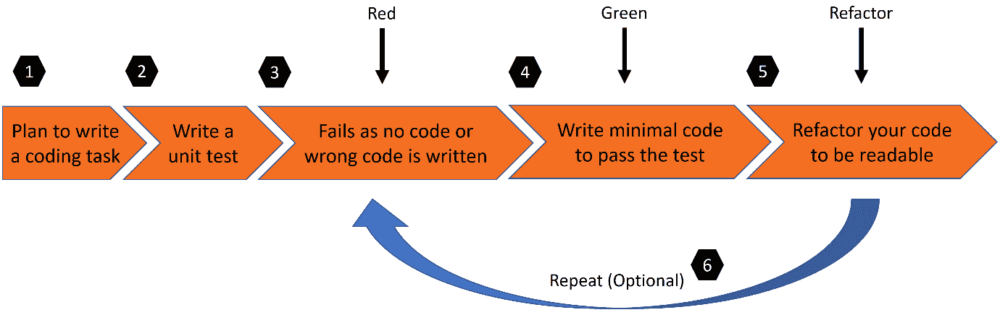
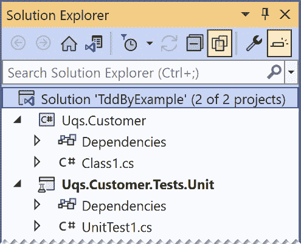
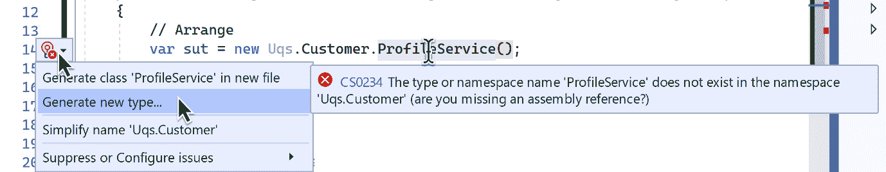
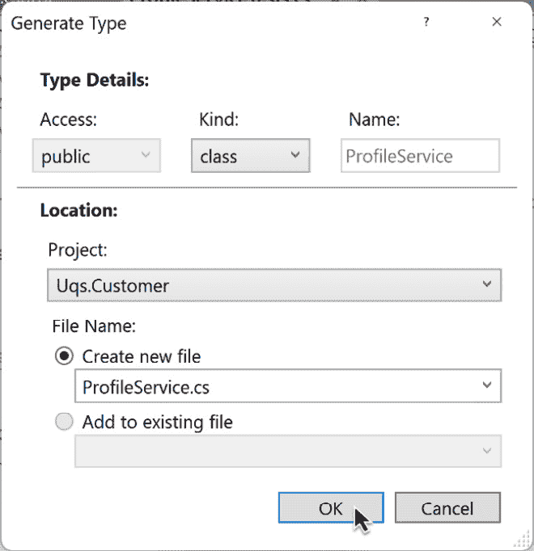
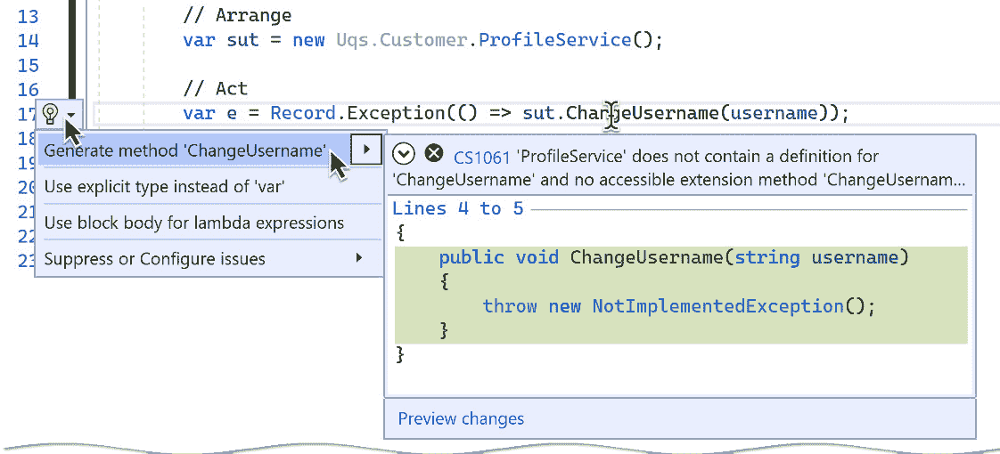
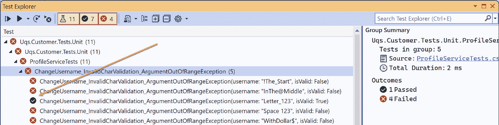
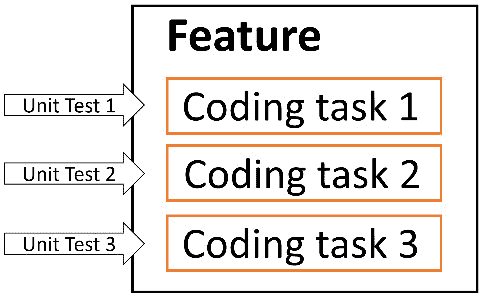
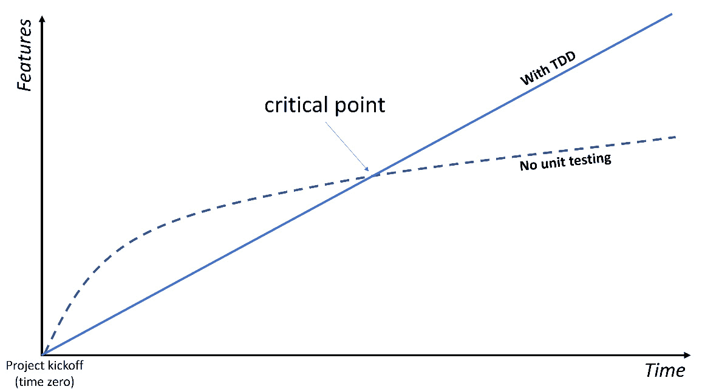
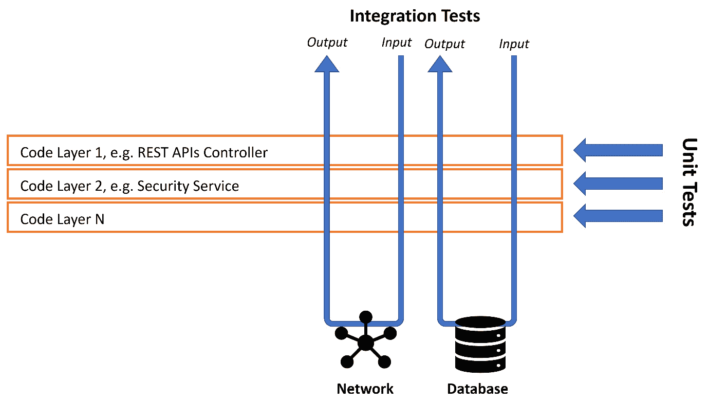
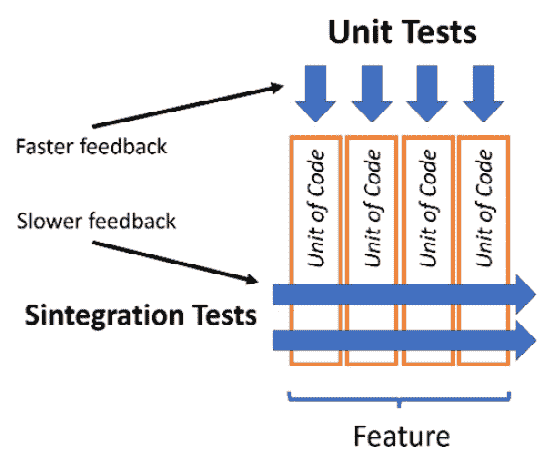

# 测试驱动开发解释

**测试驱动开发**（**TDD**）是一组在单元测试之上的实践。它们改变了你设计代码和编写单元测试的方式。基本上，这是一种与传统的编写代码然后测试它不同的编写代码的方法。

说 TDD 不仅仅是先做测试是一种陈词滥调，但与其让我告诉你相反，你将在阅读*第五章*和*第六章*之后自己做出决定。

在本章中，我们将：

+   通过 TDD 支柱

+   按照 TDD 风格实现软件功能

+   转换关于该主题的常见问题解答和批评

+   讨论 TDD 与 Sintegration 测试的结合

到本章结束时，你将能够使用 TDD 来编写基本的编码任务，并理解该主题的相关内容以及 TDD 在软件生态系统中的位置。

# 技术要求

本章的代码可以在以下 GitHub 仓库中找到：

https://github.com/PacktPublishing/Pragmatic-Test-Driven-Development-in-C-Sharp-and-.NET/tree/main/ch05

# TDD 支柱

TDD 是一组实践，它指定了何时以及如何编写单元测试。你可以不使用 TDD 编写单元测试，但 TDD 必须与某种类型的测试相关联。有时，你可以听到 TDD 和单元测试被用作似乎它们意味着同一件事，但实际上它们不是。

虽然围绕 TDD 的生态系统非常复杂，因为它涉及到许多软件工程方面，但作为一个独立的概念，TDD 很容易解释和理解。我们可以将 TDD 总结为以下两个支柱：

+   **测试先行**

+   **红色、绿色、重构**（**RGR**）

让我们讨论这些支柱。

## 测试先行

这里的想法是在开始编写生产代码之前先编写测试。这实际上意味着测试尚未存在的代码！

测试先行改变了我们编写代码的方式，因为现在你需要在实现之前先考虑你的类的结构和公共方法。这鼓励开发者从客户端的角度（客户端是调用你的代码的外部代码，也称为调用者）来反思设计。

我们将通过几个示例来展示如何从测试开始，让你熟悉这个概念，并了解它是如何进行的。然后，在*第六章*的第一节中，我们将详细介绍这种方法的益处，即*TDD 的 FIRSTHAND 指南*。

## 红色、绿色、重构

RGR 过程是在 TDD 风格的代码编写中使用的。这个过程与测试先行的指南协同工作。以下是具体步骤：

1.  你计划编写一个编码任务，这是你想要添加到代码中的功能的一部分。

1.  当生产代码不存在（因为你还没有编写它）时，你编写这个生产代码的单元测试。也许你计划更新现有的生产代码，所以你先编写一个单元测试，假设最终的生产代码已经到位。

1.  你运行单元测试，它将失败（红色），原因之一：

    +   代码无法编译，因为尚未编写生产代码。

    +   测试将失败，因为在编译过程中，实现新编码任务的逻辑是错误的，因为现有的生产代码尚未更新以反映新功能。

1.  编写最快且最少的代码以使测试通过（绿色）。在这个阶段不要完善代码；你也可以从互联网上复制预期的代码。想法只是继续前进。

1.  现在，我们知道我们的编码任务已经就绪并且正在工作；然而，如果你认为生产代码存在以下问题之一，你可能需要重构它：

    +   可读性

    +   性能

    +   不符合其余代码的设计

1.  在重构时运行你的单元测试以确保你没有破坏任何东西。如果它被破坏（红色），那么你自然会回到 *步骤 3*。

你可以理解为什么选择了这些颜色名称：

+   **红色**：表示失败的测试，在测试运行器（如 VS 测试资源管理器）中显示为红色

+   **绿色**：表示通过的测试，在测试运行器中显示为绿色



图 5.1 – 红色、绿色、重构过程

之前的图示突出了我们在 RGR 过程中刚刚讨论的步骤。

我们可以绘制图表并进一步讨论 TDD，或者我们可以通过示例进行演示，这就是我们接下来要做的。

# 通过示例进行 TDD

通过查看示例，我们可以更好地理解 TDD，所以让我们拿一个故事并以 TDD 风格编写它。我们将致力于这个故事描述的功能：

故事标题：

*更改用户名*

**故事描述：**

*作为一个客户*

*给定我已经有一个账户*

*当我导航到我的个人资料页面*

*然后我可以更新我的用户名*

**验收标准：**

*用户名只能包含 8 到 12 个字符，包括：*

*- 有效：AnameOf8, NameOfChar12*

*- 无效：AnameOfChar13, NameOf7*

*只允许使用字母数字和下划线：*

*- 有效：Letter_123*

*- 无效：!The_Start, InThe@Middle, WithDollar$, Space 123*

*如果用户名已存在，则生成错误*

让我们不要浪费时间，实现这个故事。

## 创建解决方案外壳

我们将创建一个名为 `Uqs.Customer` 的类库，添加一个名为 `Uqs.Customer.Tests.Unit` 的单元测试项目来测试它，并将它们添加到名为 `TddByExample.sln` 的解决方案中。所以，让我们开始：

1.  在名为 `TddByExample` 的目录中创建 `lib` 类和以下 xUnit 项目：

    ```cs
    dotnet new classlib -o Uqs.Customer -f net6.0
    dotnet new xunit -o Uqs.Customer.Tests.Unit -f net6.0
    ```

1.  创建一个解决方案文件并将项目添加到其中。解决方案名称将是目录名称。因此，在这种情况下，它将自动命名为 `TddByExample.sln`：

    ```cs
    dotnet new sln
    dotnet sln add Uqs.Customer
    dotnet sln add Uqs.Customer.Tests.Unit
    ```

1.  从单元测试项目引用生产代码项目：

    ```cs
    dotnet add Uqs.Customer.Tests.Unit reference Uqs.Customer
    ```

1.  当你打开解决方案时，你会看到以下内容：



图 5.2 – 显示新创建项目的解决方案资源管理器

现在，进入编码阶段。

## 添加编码任务

请求的功能包括更小的编码任务（挑战），因此你将添加多个单元测试，每个编码挑战至少有一个单元测试。

我从提供最短反馈的挑战开始，逐步进行。这将帮助我构建初始结构，而无需同时担心所有事情。它还将帮助我避免从开始就处理诸如数据库连接和数据库中用户名可用性（用户名已被占用）等任务。然后，按复杂度顺序添加更复杂的挑战。让我们看看我们如何实现这一点。 

### 编码任务一 - 验证空用户名

我通常花很少的时间分析最短代码挑战，并依靠直觉。我觉得最短的路径是检查用户名的空值。现在，将模板测试类从`UnitTest1.cs`重命名为`ProfileServiceTests.cs`，并用以下代码替换内容：

```cs
namespace Uqs.Customer.Tests.Unit;
public class ProfileServiceTests
{
    [Fact]
    public void
       ChangeUsername_NullUsername_ArgumentNullException()
    {
        // Arrange
        var sut = new ProfileService();
        // Act
        var e = Record.Exception(() => 
            sut.ChangeUsername(null!));
        // Assert
        var ex = Assert.IsType<ArgumentNullException>(e);
        Assert.Equal("username", ex.ParamName);
        Assert.StartsWith("Null", ex.Message);
    }
}
```

之前的代码为将`null`传递给我们的目标方法做了准备。它执行了方法并记录了由方法生成的`Exception`。

最后，我们检查是否得到了一个具有`username`作为参数且消息以`Null`开头的`ArgumentNullException`类型的异常。

在执行此操作之前，让我们回顾一下到目前为止发生的事情。

#### 命名你的测试类

立刻，我必须做出的决定是思考我的生产代码类名，因为我需要它来附加`Tests`后缀并创建我的测试类名（记住约定：`ProductionCodeClass`**Tests**）。我在我的架构中遵循**领域驱动设计**（**DDD**），所以我直接将其视为一个服务类。现在不必担心 DDD 术语以及它与 TDD 的匹配，因为 DDD 将有一个专门的章节，*第七章*，*领域驱动设计的实用视角*。

我没有对我的类命名进行深入思考，因为我总是可以轻松地重命名我的类。我选择了`ProfileService`，因此我可以将我的单元测试类命名为`ProfileServiceTests`。请注意，在此阶段我尚未创建`ProfileService`。

注意

一些开发者编写了没有意义的测试类名，然后在完成第一个单元测试后将其重命名。做让你更有效率的事情。这不是一个僵化的过程。

#### 单元测试方法命名

当我想编写测试时，我需要思考我在测试什么以及我应该期待什么，遵循`MethodName_Condition_Expectation`方法。因此，我选择了方法名为`ChangeUsername`，条件为检查`null`。

#### 提前决定你的期望

期望需要稍作停顿和思考。我期望调用此方法的任何人都没有发送`null`，因为他们已经在 UI 或其他方式上检查了它。所以，如果它不符合我的期望，我会无情地抛出异常，让客户端处理它。

这里的关键是，我直接从客户端的角度出发，并关注我打算方法的对外行为。

#### 确保测试失败

在这个阶段，您可以看到 VS 使用波浪线突出显示您的代码，因此不需要天才就能得出结论，代码将无法编译，因为还没有编写任何生产代码。

您已经迈出了 RGR 的第一步，因为您已经得到了红色提示。

#### 创建生产代码类壳

至少让我们能够编译以从 VS 获取一些智能感知帮助。因此，在您的 `Uqs.Customer` 项目中，将 `Class1.cs` 修改为 `ProfileService.cs`，内容将类似于以下这样：

```cs
namespace Uqs.Customer;
public class ProfileService
{
}
```

然而，鉴于您将经常这样做，这里有一些快捷方式。例如，如果您有 ReSharper，那么它将为您提供根据您的单元测试生成生产代码的选项。在 VS 中，而不是像上一步那样将 `Class1.cs` 重命名为 `ProfileService.cs`，只需删除它，然后按照以下步骤执行相同操作：

+   将鼠标悬停在带有波浪线的 `ProfileService()` 上，VS 将显示一个灯泡图标。展开灯泡并选择如图所示的 **生成新类型…**：



图 5.3 – 选择重构灯泡

注意

有时灯泡需要一段时间才会出现；您始终可以使用 *Ctrl* + *.* 快捷键强制其出现。

+   当对话框出现时，您可以按照以下方式更改其设置：



图 5.4 – 生成类型对话框

这样，您将得到与之前相同的 `ProfileService.cs` 类。

注意

从灯泡菜单中选择第一个选项，**在新的文件中生成类‘ProfileService’**，并不能完成这项工作，因为 VS 将在单元测试项目中生成文件，而您打算在生成代码项目中生成它。

现在我们已经创建了类壳，让我们继续我们的生产代码编写过程。

#### 创建生产代码方法壳

要创建 `ChangeUsername` 方法，将鼠标悬停在它上面，并按照以下方式选择灯泡：



图 5.5 – 生成方法

它将在显示窗口中显示将要生成的内容。这正是我们想要的，因此选择 `ProfileService` 类：

```cs
public void ChangeUsername(string username)
{
    throw new NotImplementedException();
}
```

这就是生成的代码。或者，您也可以自己编写代码。

注意

这是在使用 C# 10，因此没有 `string?`（在 *string* 后面有一个问号）作为参数会警告调用者该方法不期望 `null`。但是，调用者仍然可以强制 `null`。注意，单元测试在 `Act` 部分通过在 `null` 后面加感叹号来强制 `null`：`sut.ChangeUsername(null``)`。

注意，生成的代码已经为您添加了 `NotImplementedException`。

注意

使用`NotImplementedException`是一个好习惯，可以向读者突出显示代码尚未编写，并在不小心调用时抛出异常，以防你忘记了它并将其推送到源代码控制。

现在到了有趣的部分，实现。

#### 编写空值检查逻辑

所有这些都是为了编写以下逻辑：

```cs
public void ChangeUsername(string username)
{
    if (username is null)
    {
       throw new ArgumentNullException("username", "Null");
    }
}
```

异常的第一个参数表示参数名，第二个表示错误信息。

从测试资源管理器运行单元测试（*Ctrl* + *R*, *A*），你应该能看到代码编译并且所有测试都通过了（绿色）。

#### 重构

我在写完代码后看了看，觉得可以用以下方式改进：

在代码中使用魔法字符串来匹配我的参数名不是一种好习惯，因为每次我更改参数名时，字符串并不一定会随之改变。我将使用`nameof`关键字。

我重构的代码看起来如下：

```cs
throw new ArgumentNullException(nameof(username), "Null");
```

现在我已经做了这些更改，我再次运行了测试，并且它们通过了。

尽管重构的大小很小，并且通常在更简洁的示例中重构会更复杂，但这个示例很好地展示了你可以如何实现可选的重构。

我们已经完成了第一个编码任务！第一个任务通常比其他任务长，因为在第一个任务中，你将构建外壳并决定一些名称。我们的第二个任务将会更短。

### 编码任务二 – 验证最小和最大长度

再次，没有花太多时间思考第二个要测试的内容，我想到了长度验证，根据故事中用户名长度应在 8 到 12 个字符之间（包括 8 和 12），所以这是我的第二个单元测试，针对这个场景：

```cs
[Theory]
[InlineData("AnameOf8", true)]
[InlineData("NameOfChar12", true)]
[InlineData("AnameOfChar13", false)]
[InlineData("NameOf7", false)]
[InlineData("", false)]
public void ChangeUsername_VariousLengthUsernames_
    ArgumentOutOfRangeExceptionIfInvalid
   (string username, bool isValid)
{
    // Arrange
    var sut = new ProfileService();
    // Act
    var e = Record.Exception(() =>
        sut.ChangeUsernam(username));
    // Assert
    if (isValid)
    {
        Assert.NullI;
    }
    else
    {
        var ex =    
        Assert.IsType<ArgumentOutOfRangeException>(e);
        Assert.Equal("username", ex.ParamName);
        Assert.StartsWith("Length", ex.Message);
    }
}
```

之前的代码为有效和无效长度的用户名准备了多个测试场景。它使用`Theory`属性将多个场景传递给单元测试。最后，我们检查是否得到了`ArgumentOutOfRangeException`类型的异常。我们使用`if`语句进行分支，因为有效的用户名不会产生异常，所以我们将会得到`null`。

备注

一些实践者反对在单元测试中包含任何逻辑，例如`if`语句。我属于另一所学校，认为在单元测试中包含清晰易读的轻量级逻辑可以减少重复。做对你和你的团队来说可读性最好的事情。

这个示例测试数据可能来自编写故事的人（例如，产品所有者、业务分析师或产品经理），也可能是你，或者两者的组合。

#### 红色阶段

运行单元测试，这个新添加的单元测试应该会失败，因为我们还没有编写任何实现。

#### 绿色阶段

将以下逻辑添加到你的方法中：

```cs
if (username.Length < 8 || username.Length > 12) 
{
    throw new ArgumentOutOfRangeException
        ("username","Length");
}
```

从测试资源管理器运行单元测试（*Ctrl* + *R*, *A*），你应该能看到代码编译并且所有测试都通过了。我们已经达到了绿色状态。

#### 重构阶段

我在写完代码后看了代码，觉得可以用以下方式改进：

我将长度比较了两次。幸运的是，C# 8 引入了模式匹配，这将导致更易读的语法（可以说是）。此外，C# 可能会进行一些优化魔法，以防止`Length`属性被执行两次。

我重构的代码看起来如下：

```cs
if (username.Length is < 8 or > 12)
{
  throw new ArgumentOutOfRangeException(
    nameof(username), "Length");
}
```

现在我做了这些更改，再次运行了测试，并且它们通过了。

### 编码任务三 – 确保只包含字母数字和下划线

根据要求，我们只允许字母数字和下划线，所以让我们为这个编写测试：

```cs
[Theory]
[InlineData("Letter_123", true)]
[InlineData("!The_Start", false)]
[InlineData("InThe@Middle", false)]
[InlineData("WithDollar$", false)]
[InlineData("Space 123", false)]
public void
    ChangeUsername_InvalidCharValidation_
        ArgumentOutOfRangeException
       (string username, bool isValid)
{
    // Arrange
    var sut = new ProfileService();
    // Act
    var e = Record.Exception(() => 
        sut.ChangeUsername(username));
    // Assert
    if (isValid)
    {
        Assert.Null(e);
    }
    else
    {
        var ex = 
            Assert.IsType<ArgumentOutOfRangeException>(e);
        Assert.Equal("username", ex.ParamName);
        Assert.StartsWith("InvalidChar", ex.Message);
    }
}
```

运行测试，除了`Letter_123`的第一个测试是有效测试外，其他都应该失败。我们希望一切失败以确保我们没有犯错误。这是测试资源管理器的输出：



图 5.6 – 对有效字母测试的测试资源管理器输出

你可以通过以下两种解决方案之一使测试失败：

1.  前往生产代码并编写将使此测试失败的代码。我个人不喜欢这种方法，因为它感觉是一种纯粹的方法，但其中并没有什么错误。

1.  调试代码并查看为什么它没有实现却通过了。这是我采取的方法，而且看起来这确实是一个有效场景，所以它应该通过。我可以忽略通过测试并假设一切都已经失败。

那么，让我们编写正确的实现。

注意

你可以看到在我们的所有测试中，我们不仅断言是否有异常，还断言异常的类型和两个异常字段。这种方法将帮助我们捕获我们正在寻找的特定异常，并避免捕获由其他原因引起的其他异常。

最快的方法是使用一个只允许字母数字和下划线的正则表达式。最快的方法是在网上搜索`alphanumeric and underscore only C# regex`。我在 StackOverflow 上找到了这个正则表达式，看起来是这样的：`^[a-zA-Z0-9_]+$`。

记住，我的意图是尽可能快地使这个通过，而不太考虑代码或对其进行润色。这是新代码：

```cs
if (!Regex.Match(username, @"^[a-zA-Z0-9_]+$").Success)
{
    throw new ArgumentOutOfRangeException(nameof(username),
        "InvalidChar");
}
```

再次运行测试，它应该会通过。

然而，代码存在性能问题，因为内联正则表达式很慢。让我优化性能并提高可读性。这是重构后的整个类：

```cs
using System.Text.RegularExpressions;
namespace Uqs.Customer;
public class ProfileService
{
    private const string ALPHANUMERIC_UNDERSCORE_REGEX = 
        @"^[a-zA-Z0-9_]+$";
    private static readonly Regex _formatRegex = new
    (ALPHANUMERIC_UNDERSCORE_REGEX, RegexOptions.Compiled);

    public void ChangeUsername(string username)
    {
        if (username is null)
        {
          throw new ArgumentNullException(nameof(username),
          "Null");
        }
        if (username.Length is < 8 or > 12) 
        {
          throw new ArgumentOutOfRangeException(
            nameof(username), "Length");
        }
        if (!_formatRegex.Match(username).Success)
        {
          throw new ArgumentOutOfRangeException(
            nameof(username), "InvalidChar");
        }
    }
}
```

重构后再次运行。坦白说，我的测试失败了，因为我重构时遗漏了复制正则表达式中的一个字母。再次运行测试显示我的重构不正确，所以我修复了代码并再次尝试。

### 编码任务四 – 检查用户名是否已被使用

显然，检查用户名是否已被使用将需要访问数据库，并且为此进行测试将需要测试替身。此外，由于你正在进行 IO 操作（通过访问数据库），所有的方法都将遵循`async` `await`模式。

这个编码任务以及为完成这个功能而留下的其他编码任务将需要数据库访问，而我故意避免了这一点。我想让这一章让你熟悉 TDD，而不必通过测试替身和更高级的主题。在这本书的第二部分，*使用 TDD 构建应用程序*中，你将会有专门的章节，涉及 TDD、领域驱动设计（DDD）、测试替身和数据库的混合。所以，现在我们就到这里为止。否则，如果我解释了所有这些，我怎么能鼓励你继续阅读呢？

这就结束了本章的编码任务，我希望到目前为止你已经掌握了 TDD 的节奏。

## 概述

当开始一个新功能时，你需要把这个功能视为一系列编码挑战。每一个编码挑战都将从一个单元测试开始，类似于以下图示：



图 5.7 – 由任务组成的功能，每个任务都有一个针对该任务的单元测试

有时候，你可能还没有创建单元测试项目，所以你看到了如何创建一个。有时候，你将单元测试添加到现有的单元测试项目中，然后你可以立即开始添加测试。

你必须提前考虑你的客户端将如何与你的生产代码交互，并且你根据客户端的期望来设计一切。

你在添加每个编码任务时遵循了 RGR 模式，并且你已经看到了多个例子。

更高级的场景将在*第二部分*，*使用 TDD 构建应用程序*中介绍。

# 常见问题解答和批评

TDD 是现代软件开发中最具争议性的话题之一。你会发现一些开发者对其深信不疑，而另一些则声称它毫无用处。

我会尽量客观地回答问题，并在相关的地方展示两种观点。

## 为什么我需要做测试驱动开发（TDD）？难道我不能只做单元测试吗？

如你从本章的开头所了解的，TDD 是一种编写单元测试的风格。所以，是的，你可以在不遵循 TDD 风格的情况下编写单元测试。在下一章中，你将找到来自 FIRSTHAND 指南的第一条指导原则，它将专注于遵循 TDD 风格的好处。

我发现一些团队由于各种原因不愿意做 TDD。我的建议是，如果你的团队不愿意遵循 TDD，不要放弃单元测试。也许如果你从单元测试开始，那么下一个发展阶段就是 TDD。这可能会减缓某些团队的变化速度。

我之前说过吗？即使你不遵循 TDD，也不要放弃单元测试。

## TDD 对软件开发过程来说感觉很不自然！

我相信当你第一次学习编程时，你的担忧是理解基本的编程结构，例如`for`循环、函数和面向对象编程（OOP）。你的担忧，或者你导师的担忧，并不是生产可扩展的高质量软件，因为你只是想要一个能工作的程序，其中可能存在一些错误。

当你在学习时，这行得通，这可能是你所说的*自然*，因为你从第一天开始就是这样做的。

在现实世界中，对软件的现代期望是：

+   **可扩展性**：基于云的解决方案成为常态，微服务接管了控制权。

+   **自动化**：手动测试过程最终变得过时。*测试开发者*成为了一个流行的职位，自动化测试成为现代趋势。

+   **DDD**：让对象以复杂的方式相互交互。

+   **发布管道准备就绪（CI/CD）**：CI 在本书中有一个专门的章节。简而言之，你的软件应该允许增量功能添加并定期推送到生产环境。

上述场景是当今软件开发者的担忧，因此，你必须改变你的工作策略以适应新的现实生活规范。这需要你在编写代码的方式上发生范式转变，因此，TDD 成为开发规范。

## 进行 TDD 会让我们放慢速度！

在开始一个项目时，不进行任何形式的测试在短期内可能会带来更快的结果。考虑以下图表，它描述了这个概念：



图 5.8 – 关于时间和功能的 TDD 与无测试的比较

如果你从头开始构建没有依赖项和功能的软件，那么不进行测试很容易，甚至可能有人手动进行。项目规模小，易于管理，并且易于更改和部署。

在早期阶段，没有测试的软件开发会很快，直到你开始有一系列依赖的功能，其中更改一个功能会导致另一个功能出错！这就是测试支持的软件开始发光的地方，添加新功能引入现有功能错误的可能性更小，因为这将通过良好实现的测试来捕捉。我多次从产品负责人那里听到这个说法：*当我们添加一个新功能时，另一个无关的区域会出错!* 他们通常责怪让这个错误通过的开发商或测试员。对于非开发者来说，很容易认为功能之间没有关系，但你和我都知道情况并非如此。

显然，在*临界点*之后，未经测试的软件速度变慢的原因是功能不再易于管理。功能正在迅速变化，开发者正在转向不同的区域，甚至离开项目，新开发者正在取代他们。

所以，是的，TDD 可能会放慢你的速度，但这取决于你在开发过程中的位置。如果你已经通过了前面图表中的临界点，那么你将开始收获你的投资带来的好处。

## TDD 对于初创公司来说相关吗？

参与初创企业的开发者通常压力很大，并且被功能请求淹没。公司的生存和资金可能取决于下一组功能。很少产品所有者会关心长期战略，因为如果初创企业的命运是危险的，为什么要费心呢？我们以后再担心明天吧。

如果初创企业在临界点之前失败，那么投资 TDD 是否有意义？但如果他们通过了这个临界点并且没有单元测试呢？也许当公司有资金和客户时，他们可能会重写代码库。他们将添加单元测试，或者也许他们不会，并且他们可能会在添加新功能时遇到困难。

启动情况很复杂；你可以从前面的论点中看出这一点。对这个问题的答案取决于具体情况。

## 我不喜欢做 TDD，我喜欢先做我的代码设计！

如果你在编写测试之前创建了类的结构，*你仍然在进行 TDD*。记住，TDD 是一套最佳实践，拥有自己的风格并不排除你。

## 单元测试并不测试真实的东西！

这是 TDD 社区试图积极改进的批评。这主要与测试替身的用法有关。

测试替身试图模仿真实对象的行为，问题在于“尝试”这个词。模仿真实对象的问题在于它依赖于开发者最好地预测真实对象的行为。这可以通过三种方式来完成：

1.  阅读真实对象的文档并尝试在测试替身中编写类似的东西

1.  如果有源代码，则阅读源代码并提取其精华来构建测试替身

1.  进行一个概念验证样本以调用真实对象并检查其行为

这些方法需要研究和经验。有时，测试替身对象并不反映真实对象，这可能会导致错误的测试，甚至可能引发错误。让我们以第三方方法的这个例子为例：

```cs
public string LoadTextFile(string path){…}
```

上述方法加载一个文本文件并将其作为字符串返回。如果我们创建一个涉及此方法的测试替身，问题是如果指定的`path`中不存在文件会发生什么？

+   它会返回 null 吗？

+   它会返回一个空字符串吗？

+   它会抛出异常吗？如果是，异常是什么？

开发者编写测试替身时将进行必要的尽职调查以确定这些问题的答案，但他们可能会出错。前面的例子很简单，但随着方法的复杂度增加，测试替身和真实对象之间的差异也会增加。减少这种问题的方法是创建测试替身时进行适当的尽职调查。

## 我听说过伦敦学派 TDD 和经典学派 TDD。它们是什么？

在互联网上有一个关于我们应该使用什么以及哪个更好的争论。伦敦学派的 TDD 侧重于测试替身，更适合商业应用程序。商业应用程序是处理数据库和用户界面的应用程序。经典学派的 TDD 更适合算法类型的编码。

在这本书中，我们只讨论伦敦学派的 TDD，因为我们正在开发商业应用程序。

## 为什么有些开发者不喜欢单元测试和 TDD？

单元测试给产品开发增加了时间和复杂性，显然有很好的理由，尽管如此，它仍然是额外的开销。单元测试有四个主要缺点：

1.  **开发时间**：添加单元测试会将开发时间增加数倍。那些急于尽快交付功能的开发者会发现单元测试令人难以承受。

1.  **修改现有功能**：这需要更新单元测试。这可以通过最小化来实现，但如果没有从单元测试到 S 集成测试的重大转变，很难完全消除。这将在下一节中讨论。

1.  **测试替身的使用**：一些开发者强烈反对使用测试替身，因为如果测试替身没有正确编码，它们往往会产生不太真实的测试。

1.  **单元测试具有挑战性**：它需要高级编码技能和团队成员之间的协调，这需要协同作用。

单元测试不适合胆小的人。我理解这些观点，但与此同时，我知道那些寻求高质量产品的公司应该为单元测试分配更多的时间。*缺点 2*和*缺点 3*可以通过更好的编码实践来解决，这也需要更多的努力。

## TDD 和敏捷 XP 之间有什么关系？

有许多敏捷工作流程的变种，最受欢迎的是**敏捷 Scrum**和**敏捷 Kanban**。然而，还有一个不那么受欢迎的，它是面向软件工程的。它被称为**敏捷 XP**，其中**XP**代表**极限编程**。

XP 将单元测试（尤其是 TDD）置于其实践的前沿，而其他流行的敏捷实践并没有达到这种技术细节的水平。XP 还试图解决常见的软件工程问题，如项目管理、文档和知识共享。

### 通过单元测试进行代码文档

XP 认为，最好的代码文档方式是将单元测试附加到代码上，而不是在其他地方编写一些会很快与代码脱节的文档。另一方面，单元测试反映了系统的当前状态，因为它们会定期检查和更新。

开发者可以通过查看单元测试来了解任何业务规则的细节，而不是阅读可能不会达到这种详细程度的文档。

## 一个系统没有 TDD 能生存吗？

我会把这个问题抛给开发者，问他们是否需要 TDD 带来的额外质量？你是否同意这样一个事实：随着软件的增长和团队的变动，你需要一个质量守门人？

是的，没有 TDD 和单元测试你也能生存，但质量可能会受到影响。

有一些没有单元测试的成功软件系统在企业中被实施。这是一个事实。然而，这些系统背后的团队有更高的维护成本，可能发布速度较慢，可能他们有专门的员工进行错误修复，可能遵循瀑布式 SDLC。只要组织对质量和成本满意，并将系统视为*成功*，这就可以了。

# 与 S 集成测试的 TDD

单元测试的一个批评是单元测试代码将与实现紧密耦合。更改生产代码将产生连锁反应，迫使更新、添加和删除多个单元测试。

这些是减少与单元测试耦合的方法，这些方法在第*第六章*中讨论，即*《TDD 的 FIRSTHAND 指南》*中的*单一行为指南*部分。然而，提供的解决方案确实减少了耦合，但并没有完全消除它们。

另一方面，集成测试依赖于被测试功能的输入和输出。如果我们对一个 API 进行集成测试，那么我们关注的是我们传递给 API 的参数以及我们得到的结果，即输入和输出。这创造了与代码的松散耦合。以下是对集成测试和单元测试如何操作的提醒：



图 5.9 – 集成测试与单元测试对比

如您所见，单元测试必须了解一些层的细节，而集成测试则关注输入和输出。这就是为什么单元测试与实现细节有更多的耦合。

集成测试有其自身的缺点，但 S 集成测试解决了我们已在*第四章*中讨论的一些缺点，即*使用测试替身进行真实单元测试*。

## 作为 TDD 的替代方案，S 集成测试

近年来，S 集成测试开始与单元测试竞争，作为解决单元测试这两个问题的方法：

+   从最终用户的角度进行测试（用户可能是软件客户端，不一定是人类）。这也被称为**自外向内测试**。

+   与代码保持松散耦合。

将 TDD 原则应用于 S 集成测试可以以下列方式工作：

+   与单元测试相同的方式应用测试优先。

+   红色、绿色、重构的方法可以与单元测试类似地工作。

+   从测试角度进行的设计与单元测试中的方式相同。

+   S 集成测试可以使用相同的模拟框架来构建伪造对象。

+   S 集成测试可以使用相同的 AAA 和方法命名约定。

主要的缺点是，虽然单元测试由于专注于小的 SUT（系统单元）而提供快速的反馈，但 S 集成测试不会给开发者提供同样快速的反馈。原因是它们需要在 S 集成测试通过之前构建整个功能的多个组件。



图 5.10 – 更快和更慢的反馈

在前面的图中，你可以看到单元测试仅在小块代码单元上操作，在构建这些单元的同时，你可以立即得到单元测试的结果。另一方面，S 集成测试的反馈将在整个功能实现后出现。

考虑这个例子。假设你正在编写一个更新用户名的功能。这个功能将包括但不限于以下代码单元：

+   检查用户名长度

+   检查用户名是否包含非法字符

+   检查用户是否有权更改用户名

+   检查用户名是否已被使用

+   如果用户提供了已使用的用户名，则提供用户的一个替代视图

+   将用户名保存到数据库中

+   向用户确认他们的用户名已更改

虽然，从理论上讲，每个代码单元都可以有多个单元测试，并且在编码每个单元时你都会得到反馈，但 S 集成测试需要等待直到功能的末尾，这样你才能得到反馈。

## S 集成测试的挑战

S 集成测试仍然依赖于模拟，这些模拟是测试替身。模拟比进行模拟或存根更难构建和维护。掌握构建模拟的方法需要构建模拟和存根的经验，因为模拟通常更复杂，需要高级编码。

此外，创建模拟会有时间开销，并将延迟项目的开始，因为在你可以编写第一个 S 集成测试之前，所有相关的模拟都应该准备好。例如，如果你的 S 集成测试涉及访问文档数据库和云存储，你可能需要首先为这些组件创建模拟，然后再进行任何有用的 S 集成测试。

使用 S 集成测试进行 TDD 的实践比使用单元测试的实践需要更多的经验。然而，好消息是，遵循这本书的内容将帮助你进步，所以当时机到来，你和你的团队决定专注于 S 集成测试时，你将已经获得了必要的经验来这样做。

# 摘要

我们已经了解了 TDD 的基本原理，因此，我相信在这个阶段，你能够自信地向同事描述这个过程。然而，这一章节是学习 TDD 的开始，因为随着你的学习，这本书将继续为你增加知识。

我抑制了自己写下更多高级示例的冲动，并在这里停下来，以便更平滑地引入。我希望我已经以清晰的方式解释了这个概念，并鼓励你继续阅读这本书，因为接下来的章节将包含更多实用的示例，这些示例将帮助你将 TDD 应用到自己的项目中。

在下一章中，我们将讨论 TDD 指南以及我所说的 FIRSTHAND 指南。你将了解为什么先测试很重要以及它为你提供了什么价值。

# 进一步阅读

要了解更多关于本章讨论的主题，你可以参考以下链接：

+   *马丁·福勒关于测试驱动开发*：[`martinfowler.com/bliki/TestDrivenDevelopment.xhtml`](https://martinfowler.com/bliki/TestDrivenDevelopment.xhtml)

+   *极限编程*：[`www.agilealliance.org/glossary/xp`](https://www.agilealliance.org/glossary/xp)

+   *经典 TDD 或“伦敦学派”？*：[`codemanship.co.uk/parlezuml/blog/?postid=987`](http://codemanship.co.uk/parlezuml/blog/?postid=987)
