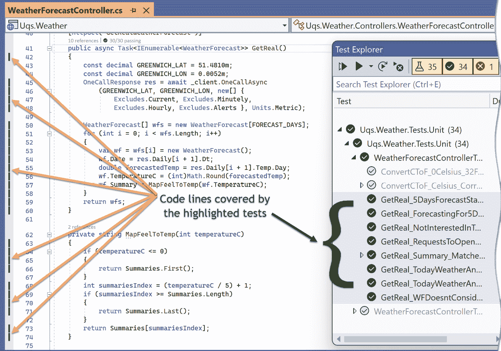
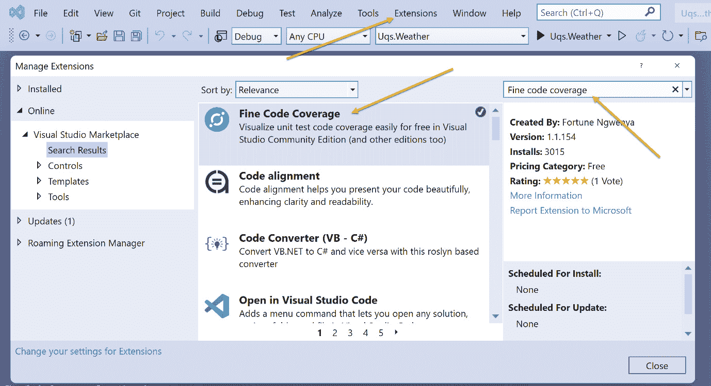
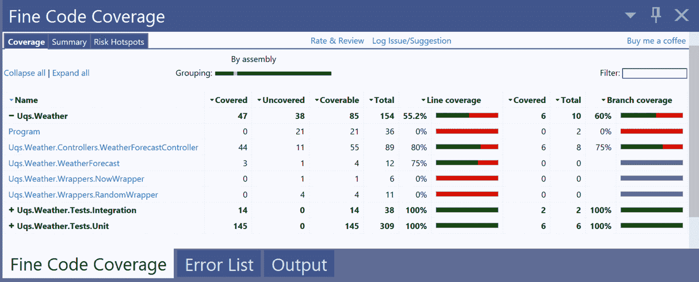
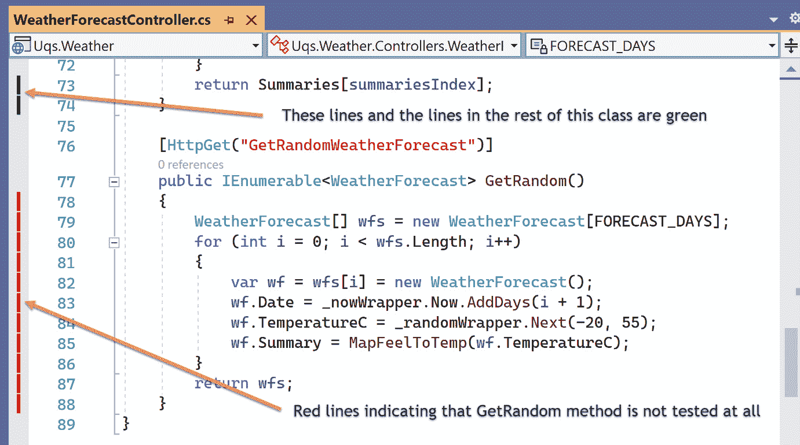
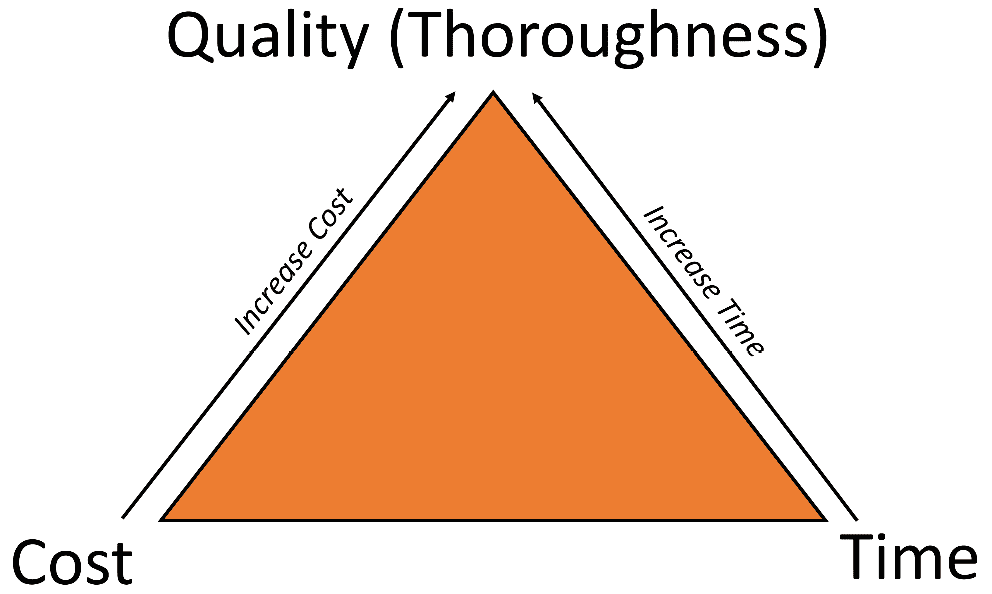

# 6

# TDD 的 FIRSTHAND 指导原则

TDD 不仅仅是先测试单元测试或红-绿-重构的方法。TDD 包括最佳实践和指导原则，这些原则指导你如何使用单元测试进行工作。

我想根据我的经验，列出最有用的单元测试和 TDD 指导原则的难忘列表。因此，以下是我简称为**FIRSTHAND**的九项经过验证的最佳实践。FIRSTHAND 代表：

+   *第一*

+   *意图*

+   *可读性*

+   *单一行为*

+   *彻底性*

+   *高性能*

+   *自动化*

+   *无依赖性*

+   *确定性*

在本章中，我们将逐一介绍这九项指导原则，并通过相关的实际案例来支持它们。到本章结束时，你应该对 TDD 的生态系统及其指导原则有一个公正的理解。

# 技术要求

本章的代码可以在以下 GitHub 仓库中找到：

[`github.com/PacktPublishing/Pragmatic-Test-Driven-Development-in-C-Sharp-and-.NET/tree/main/ch06`](https://github.com/PacktPublishing/Pragmatic-Test-Driven-Development-in-C-Sharp-and-.NET/tree/main/ch06)

# 第一条指导原则

单元测试应该首先编写。一开始这可能看起来很奇怪或不直观，但这个选择有合理的理由。

## 晚了就是永远

你听过多少次“我们稍后再测试”的说法？我从未见过一个团队完成项目并发布到生产环境中后，再分配时间来对代码进行单元测试。

此外，在最后添加单元测试将需要代码重构，这可能会破坏产品，并且很难向非技术人员解释一个正在运行的系统被破坏是因为团队正在添加单元测试。实际上，说“我们因为添加单元测试而破坏了生产”听起来很讽刺。是的，你可以在其他类型的测试（如 S 集成测试和验收测试）的覆盖下重构一个正在运行的系统，但很难想象一个之前没有时间进行单元测试的团队能有时间构建其他完全覆盖系统的测试。

*先测试*确保单元测试和功能是同步开发的，测试不会被遗漏。

## 准备好依赖注入

当你习惯了现代软件开发风格，即先创建服务然后注入它，你就不会回头了。软件框架已经发展到使 DI 成为一等公民。以下是一些例子：

+   **Angular Web 框架**：你只能通过依赖注入（DI）在 Angular 中获取服务，而其他方式则难以实现。

+   **Microsoft MAUI**：MAUI 是 Xamarin.Forms 的改进版，其中一个主要变化是将 DI 作为一等公民。

+   **.NET Core 控制台**：传统的.NET Framework 控制台应用程序不支持 DI，但现在在 Core 中原生支持，这为在控制台应用程序之上构建支持 DI 的其他库铺平了道路，例如 ASP.NET Core。

+   **ASP.NET Core**：经典 ASP.NET 和 ASP.NET Core 之间的一大区别是将依赖注入（DI）作为一等公民。

这些都是强烈的信号，告诉你无法逃避使用依赖注入（DI）。在软件实现后添加 DI 将需要重大的重构和重新思考一切。

*从单元测试开始将强制从第一刻起进行依赖注入（DI）*。

## 从客户端的角度进行设计

TDD 鼓励你从客户端（调用者）的需求出发思考，而不是陷入实现细节。你被鼓励在考虑实现细节之前，先考虑面向对象设计，如类名、抽象、决定方法签名和返回类型。

如果你有一个被其他系统或库使用的公共接口（类和方法的组合），那么与改变你代码的实现相比，改变这个接口会更困难，因为它可能已经被其他系统使用。

*TDD 强制从客户端的角度设计代码*。

## 促进行为测试

单元测试应该关注**系统在测试**（**SUT**）**做什么**，而不是**它是如何做的**。在单元测试中，你想要推送一定的输入，检查依赖项是如何受影响的，并检查输出。你不应该检查的是 SUT 内部是如何完成所有这些工作的。

如果你决定检查 SUT 的内部，你的单元测试将与实现细节紧密耦合。这意味着方法中的任何更改都会对相关的单元测试产生连锁反应。这将导致更多的单元测试和脆弱的测试。这里值得迭代的是，*测试既是资产也是负债*。拥有更多的测试，这些测试往往是多余的，意味着更多的维护。

测试先行会让你自然地考虑输入、输出和副作用，而不是 SUT 实现的细节。在实现之后进行测试会导致我所说的*欺骗*，即开发者查看 SUT 实现代码并相应地编写测试。这可能会无意中导致测试实现细节。

*TDD 提倡单元测试的口号：测试行为，而不是实现细节*。

## 消除误报

误报是指测试因为错误的原因通过。这种情况并不常见，但一旦发生，就很难捕捉。

*TDD 使用红-绿方法来消除误报*。

## 消除投机性代码

我们都曾写过代码，心想，“也许我们将来会用得上”，或者“让我把它留在这里，因为其他” *同事* *可能会觉得它有用*。这种方法的缺点是，这段代码可能永远不会被使用，但需要维护。更糟糕的是，如果将来被使用，它可能会给人一种已经测试过的错觉，而实际上它只是在等待未来的开发者来测试它。

*TDD 通过编写仅用于生产的代码来消除投机性代码*。

# 意图指南

当你的系统增长时，它将驱动更多的单元测试，这些测试将自然覆盖系统行为和文档。随着测试数量的增加，责任也更大：**可读性**和**维护性**。

测试的数量将增长到一定程度，以至于团队将无法记住编写它们的原因。你将看到失败的测试，并挠头寻找关于测试意图的线索。

你的单元测试应该以最短的时间和精力来理解；否则，它们将更多地成为负担而不是资产。敏捷软件开发团队应该提前准备好这样的测试失败场景。意图可以通过清晰的方法签名和良好的方法结构来体现。

从方法签名开始，这里有两个流行的约定，应该可以阐明单元测试的意图。

## 方法 _ 条件 _ 期望

我一直在本书中用这个约定命名单元测试方法：`Method_``Condition_Expectation`。这是一个简洁的命名约定，不允许创新的方法名，在我看来，它为其他任务保留了创新。这导致了一个更无聊但标准的方法名。以下是一个例子：

`LoginUser_UsernameDoesntExist_ThrowsInvalidOperationException`

这仍然不是一个精确的约定，但已经足够好了。例如，一些开发者可能会反对使用`Throws`这个词，因为它很明显，因为使用了`Exception`这个词。

重要的是在短时间内，从前面方法名中看到的三部分，确定这个测试的意图。

注意

我看到过一些团队省略了`Method`部分，只使用`Condition_Expectation`，特别是如果整个单元测试类只针对一个方法。

## 方法 _Should_When

另一个流行的约定，允许使用更自然语言的是使用`Method_Should_When`。这个约定更接近流畅编码，代码的流动就像一个英文句子。以下是一个例子：

`LoginUser_Should_Throw_InvalidOperationException_When_UsernameDoesntExist`

有时，这个约定的倡导者喜欢也使用**流畅断言**来进行断言：

```cs
// Assert
IsSaved.Should().BeTrue();
```

如你所注意到的，前面的代码与书中使用的 xUnit 风格不同：

```cs
// Assert
Assert(true, IsSaved);
```

如果你感兴趣于使用流畅断言，你可以看看一个名为**Shouldly**的.NET 库（[`github.com/shouldly/shouldly`](https://github.com/shouldly/shouldly)）。在*附录 1*中，*常用单元测试库*，我们讨论了一个类似的库，名为*流畅断言*。

下一步明确意图是明确方法体。

## 单元测试结构

结构化单元测试主体的主导方法是流行的**安排-行动-断言**（**AAA**）。让我们更深入地了解每个部分应该做什么的意图。

### Arrange

`Arrange`旨在实现两个目标：

+   初始化变量

+   创建 SUT 状态

`Arrange`部分可能与单元测试类的构造函数共享，因为构造函数可能在进行一些准备以减少每个单元测试中的`Arrange`代码。换句话说，可能有一些*安排*发生在这个部分之外。我们将在本书的*第二部分*，*使用 TDD 构建应用程序*中看到这个例子。

初始化对象和初始化期望发生在`Arrange`部分，这是显而易见的。不那么明显的是，这个部分设置了一个*状态*。以下是一个澄清状态含义的例子：

`LoginUser_UsernameDoesntExist_ThrowsInvalidOperationException`

`Arrange`将创建一个用户在系统中不存在的状态，在大多数情况下，这段代码将与`Method_Condition_Expectation`中的`Condition`紧密相关。在这种情况下，安排应该与`UsernameDoesntExist`相关联。

### 行动

`Act`主要是一行代码，调用方法名第一部分指定的相同方法。在先前的例子中，我期望`act`看起来像这样：

```cs
// Act
var exception = Record.Exception(() => sut.LoginUser(…));
```

此方法重申了方法签名中指定的意图，并提供了干净的代码。

### 断言

`Assert`正在断言方法签名最后部分的条件：`Expectation`。

签名约定和主体结构共同作用，提供清晰的意图。请记住，无论你使用了什么约定，关键是保持一致性和清晰性。

*清晰的意图单元测试将促进更易于维护和更准确的文档*。

# 可读性指南

这个方法可读吗？你需要运行它并开始调试来理解它做什么吗？`Arrange`部分让你的眼睛感到不适吗？这可能会违反可读性原则。

建立意图指南是极好的，但这还不够。与你的生产代码相比，你的单元测试中至少会有 10 倍多的代码行。所有这些都需要维护并随着你的系统一起增长。

为了提高可读性而对单元测试进行整理遵循与生产代码相同的实践。然而，在单元测试中，有一些场景更为突出，我们将在这里解决这些问题。

## SUT 构造函数初始化

初始化你的 SUT 将需要你准备所有依赖项并将它们传递给 SUT，类似于这样：

```cs
// Arrange
const double NEXT_T = 3.3;
const double DAY5_T = 7.7;
var today = new DateTime(2022, 1, 1);
var realWeatherTemps = new[] 
    {2, NEXT_T, 4, 5.5, 6, DAY5_T, 8};
var loggerMock = 
    Substitute.For<ILogger<WeatherController>>();
var nowWrapperMock = Substitute.For<INowWrapper>();
var randomWrapperMock = Substitute.For<IRandomWrapper>();
var clientMock = Substitute.For<IClient>();
clientMock.OneCallAsync(Arg.Any<decimal>(), Arg.Any<decimal>(), 
    Arg.Any<IEnumerable<Excludes>>(), Arg.Any<Units>())
    .Returns(x => 
    {
        const int DAYS = 7;
        OneCallResponse res = new OneCallResponse();
        res.Daily = new Daily[DAYS];
        for (int i = 0; i < DAYS; i++)
        {
            res.Daily[i] = new Daily();
            res.Daily[i].Dt = today.AddDays(i);
            res.Daily[i].Temp = new Temp();
            res.Daily[i].Temp.Day = 
                realWeatherTemps.ElementAt(i);
        }
        return Task.FromResult(res);
    });
var controller = new WeatherController(loggerMock, 
    clientMock, nowWrapperMock, randomWrapperMock);
…
```

现在我们已经完成了所有的编码准备工作，我们可以初始化 SUT（在本例中为控制器）并传递给它正确的参数。这在大多数与 SUT 相同的测试中都会重复，这将使它成为一个阅读噩梦。这段代码可以轻松地移动到单元测试类的构造函数中，变成这样：

```cs
private const double NEXT_T = 3.3;
private const double DAY5_T = 7.7;
private readonly DateTime _today = new(2022, 1, 1);
private readonly double[] _realWeatherTemps = new[]
    { 2, NEXT_T, 4, 5.5, 6, DAY5_T, 8 };
private readonly ILogger<WeatherForecastController> _loggerMock 
  = Substitute.For<ILogger<WeatherForecastController>>();
private readonly INowWrapper _nowWrapperMock = 
    Substitute.For<INowWrapper>();
private readonly IRandomWrapper _randomWrapperMock = 
    Substitute.For<IRandomWrapper>();
private readonly IClient _clientMock = 
    Substitute.For<IClient>();
private readonly WeatherForecastController _sut;
public WeatherTests()
{
   _sut = new WeatherForecastController(_loggerMock,
       _clientMock,_nowWrapperMock, _randomWrapperMock);
}
```

之前代码的美丽之处在于它对所有同一类的单元测试都是可重用的。你的单元测试中的代码变成了这样：

```cs
// Arrange
_clientMock.OneCallAsync(Arg.Any<decimal>(), 
    Arg.Any<decimal>(),
    Arg.Any<IEnumerable<Excludes>>(), Arg.Any<Units>())
    .Returns(x =>
    {
        const int DAYS = 7;
        OneCallResponse res = new OneCallResponse();
        res.Daily = new Daily[DAYS];
        for (int i = 0; i < DAYS; i++)
        {
            res.Daily[i] = new Daily();
            res.Daily[i].Dt = _today.AddDays(i);
            res.Daily[i].Temp = new Temp();
            res.Daily[i].Temp.Day = 
                _realWeatherTemps.ElementAt(i);
        }
        return Task.FromResult(res);
    });
…
```

这个类中单元测试的`Arrange`大小已经降低。记住，你在这里看到的是一个单元测试方法，但你可能有多个针对同一 SUT 的单元测试。

你可能会争辩说，虽然我们在`Arrange`中清除了一些重复的代码，但它仍然很忙。让我们用构建器设计模式来解救。

## 构建器模式

对于同一 SUT，每个单元测试的安排与其他单元测试略有不同。当创建具有许多可能配置选项的对象时，**构建器设计模式**很有用，这在这种情况下很有帮助。

注意

这与**四人帮**（**GoF**）构建器设计模式不同。

对于前面的例子，构建器类看起来像这样：

```cs
public class OneCallResponseBuilder
{
    private int _days = 7;
    private DateTime _today = new (2022, 1, 1);
    private double[] _temps = {2, 3.3, 4, 5.5, 6, 7.7, 8};
    public OneCallResponseBuilder SetDays(int days)
    {
        _days = days;
        return this;
    }
    public OneCallResponseBuilder SetToday(DateTime today)
    {
        _today = today;
        return this;
    }
    public OneCallResponseBuilder SetTemps(double[] temps)
    {
        _temps = temps;
        return this;
    }
    public OneCallResponse Build()
    {
        var res = new OneCallResponse();
        res.Daily = new Daily[_days];
        for (int i = 0; i < _days; i++)
        {
            res.Daily[i] = new Daily();
            res.Daily[i].Dt = _today.AddDays(i);
            res.Daily[i].Temp = new Temp();
            res.Daily[i].Temp.Day = _temps.ElementAt(i);
        }
        return res;
    }
}
```

在这个类中值得注意的是：

1.  每个方法都返回类实例。这有助于像这样链式调用方法：

    ```cs
    OneCallResponse res = new OneCallResponseBuilder()
        .SetDays(7)
        .SetTemps(new []{ 0, 3.3, 0, 0, 0, 0, 0 })
        .Build();
    ```

1.  `Build()`方法将所有配置组合在一起，以返回一个可用的对象。

之前单元测试的重构`Arrange`看起来像这样：

```cs
// Arrange
OneCallResponse res = new OneCallResponseBuilder()
    .SetTemps(new []{ 0, 3.3, 0, 0, 0, 0, 0 })
    .Build();
_clientMock.OneCallAsync(Arg.Any<decimal>(),  
    Arg.Any<decimal>(), Arg.Any<IEnumerable<Excludes>>(),
    Arg.Any<Units>())
    .Returns(res);
```

上一段代码利用了我们之前创建的构建器类。你可以清楚地看到代码将第二天温度设置为 3.3 度。

使用 SUT 构造函数初始化和构建器模式只是使你的单元测试可读性的几个例子。

你可以在配套源代码中的`WeatherForecastTestsReadable.cs`找到重构后的类，以及在`WeatherForecastTestsLessReadable.cs`中找到原始类。

*可读性促进了你的单元测试代码库的健康成长。从第一天开始就要保持其可控性。*

# 单一行为指南

每个单元测试都应该测试一个且仅有一个行为。在整个书中，这个概念通过以下方式自然地得到了强化：

+   单元测试方法签名的命名，它反映了一个条件和一个期望

+   一个单一的 AAA 结构强制执行单一的`Act`

在进一步挖掘之前，我想定义一下单词*行为*。

## 什么是行为？

行为的定义在行业中有所不同，因此对于本书的上下文来说，设置一个准确的行为定义很重要。每个 SUT 都应该做某件事。SUT 通过以下方式来完成*这件事*：

+   **与依赖项通信**：通信可以通过在依赖项上调用方法或设置字段或属性来完成——这被称为*外部行为*。

+   `Exception`或返回值（如果方法不是`void`或`Task`方法）——这通常被称为*外部行为*。

+   **整体规划**：在接收输入、准备输出（返回值）或准备与依赖项通信之前执行各种命令——这被称为 SUT 的*内部*或*内部行为*。

外部行为在系统中传播，因为它正在接触其他依赖项，而内部行为被封装在 SUT 中，不会展示给外界。

当我们单独使用“行为”这个词时，我们指的是“外部行为”，因此单一行为指南指的是单一外部行为。通常，定义似乎比实际要复杂，所以让我们用一个例子来加强这个定义。

## 行为的例子

让我们从**天气预报应用**（**WFA**）中取出这段代码，该应用在*第二章*，*通过例子理解依赖注入*中介绍过：

```cs
public async Task<IEnumerable<WeatherForecast>> GetReal()
{
    const decimal GREENWICH_LAT = 51.4810m;
    const decimal GREENWICH_LON = 0.0052m;
    OneCallResponse res = await _client.OneCallAsync
     (GREENWICH_LAT, GREENWICH_LON, new[]{Excludes.Current,   
     Excludes.Minutely, Excludes.Hourly, Excludes.Alerts},
     Units.Metric);
    WeatherForecast[] wfs = new 
        WeatherForecast[FORECAST_DAYS];
    for (int i = 0; i < wfs.Length; i++)
    {
        var wf = wfs[i] = new WeatherForecast();
        wf.Date = res.Daily[i + 1].Dt;
        double forecastedTemp = res.Daily[i + 1].Temp.Day;
        wf.TemperatureC = (int)Math.Round(forecastedTemp);
        wf.Summary = MapFeelToTemp(wf.TemperatureC);
    }
    return wfs;
}
private string MapFeelToTemp(int temperatureC)
{
    …
}
```

在前面的代码中，所有外部行为都在 `_client.OneCallAsync` 调用和 `return` 语句中。其余的代码都是内部的。你可以将内部代码的作用视为准备触发 `_client` 依赖项并返回一个值。

一旦触发这两个外部行为，内部行为就不再相关；它们被执行并遗忘，而外部行为则传播到其他服务。

## 仅测试外部行为

如果内部代码的作用仅仅是准备外部行为，那么测试外部行为将涵盖测试整个代码。你可以将其视为测试内部代码是测试外部行为的副产品。

这里有一些单元测试行为的例子（外部行为）。这些例子在源代码的*第三章*，*开始单元测试*中得到了完全实现（**WF**代表**天气预报**）：

```cs
GetReal_NotInterestedInTodayWeather_WFStartsFromNextDay
GetReal_5DaysForecastStartingNextDay_
    WF5ThDayIsRealWeather6ThDay
GetReal_ForecastingFor5DaysOnly_WFHas5Days
GetReal_WFDoesntConsiderDecimal_RealWeatherTempRoundedProperly
GetReal_TodayWeatherAnd6DaysForecastReceived_
    RealDateMatchesLastDay
GetReal_TodayWeatherAnd6DaysForecastReceived_
    RealDateMatchesNextDay
GetReal_RequestsToOpenWeather_MetricUnitIsUsed
GetReal_Summary_MatchesTemp(string summary, double temp)
```

在执行仅针对外部行为的测试之后，代码覆盖率工具将显示所有在先前的例子中展示的代码都被我们的测试覆盖了。这包括`GetReal()`公共方法中的代码和`MapFeelToTemp()`私有方法中的代码。让我们看看代码覆盖率的一个例子：



图 5.1 – 由行为测试覆盖的行

在前面的图中，我使用了一个名为**Fine Code Coverage**（**FCC**）的 VS 插件来显示所选测试覆盖的行。它显示所有 SUT 中的代码行都被这些测试覆盖了。我们将在*彻底性指南*部分更详细地讨论覆盖率和这个插件工具。

## 为什么不测试内部代码？

单元测试中的一个常见错误是当开发者试图测试 SUT 的内部代码。以下是测试内部代码的一些问题：

+   当测试外部行为时，SUT 已经得到覆盖，因此不需要增加单元测试的数量，这将增加维护（责任）。

+   测试内部代码将在 SUT 和测试之间创建紧密耦合，这将创建脆弱的测试，这些测试将不得不经常更改。

+   内部代码通常隐藏在非公共方法后面；要测试它们，代码需要更改以公开，这违反了面向对象封装的原则。

## 每个测试一个行为

现在行为定义已经明确，我们可以澄清测试单个行为意味着什么。测试单个行为与意图指南并行工作。如果我们针对单个行为，我们的测试将促进更好的意图和可读性，当它失败时，我们应迅速找出原因。

单个行为测试由一个 SUT（系统单元）、一个条件、一个期望和最小断言组成。前述列表（章节：*仅测试外部行为*）中的单元测试签名是针对单个行为的例子。此外，本书中的所有示例都遵循相同的指南。

*单元测试方法应该测试单个行为，而永远不应该测试内部结构*。

# 完整性指南

当进行单元测试时，以下是一些自然出现的问题：

+   需要进行多少测试才算足够？

+   我们是否有测试覆盖率指标？

+   我们是否应该测试第三方组件？

+   我们应该对哪些系统组件进行单元测试，以及我们应该留下哪些？

完整性指南试图为这些问题的答案设定标准。

## 依赖项测试的单元测试

当你遇到依赖项时，无论这个依赖项是否是系统的一部分还是第三方依赖项，你都会为它创建一个测试替身，并将其隔离以测试你的 SUT。

在单元测试中，你不会直接调用第三方依赖项；否则，你的代码将变成集成测试，这样你就失去了单元测试的所有好处。例如，在单元测试中，你不会调用以下内容：

`_someZipLibrary.Zip(fileSource, fileDestination);`

为了测试这一点，你为`.zip`库创建一个测试替身，以避免调用真实的东西。

这是一个单元测试不覆盖且不应该覆盖的领域，这导致我们面临覆盖率问题，因为代码的某些部分无法进行单元测试。

为了测试与依赖项的交互并解决之前无法对某些代码进行单元测试的问题，可以采用其他类型的测试，例如 S 集成测试、集成测试和验收测试。

我们开始讨论*覆盖率*；现在我们可以更深入地探讨这个话题。

## 代码覆盖率是什么？

理解完整性的第一步是理解代码覆盖率。**代码覆盖率**是您的测试（单元、S 集成、集成等）从总系统行中执行的系统代码行的百分比。假设我们有一个返回整数是否为偶数的方法：

```cs
public bool IsEven(int number)
{
    if(number % 2 == 0) return true;
    else return false;
}
```

让我们编写一个单元测试来测试一个数字是否为偶数：

`public void IsEven_EvenNumber_ReturnsTrue() {…}`

这个单元测试会覆盖`if`行，但不会执行`else`行。这构成了 50%的代码覆盖率。显然，如果有另一个测试来测试奇数，就会达到 100%的覆盖率。

重要的是要认识到代码覆盖率并不一定是单元测试覆盖率，它可能是单元测试、集成测试和集成测试的组合。然而，在所有测试中，单元测试通常覆盖了代码的最大部分，因为它们比其他测试更容易编写。此外，在使用 TDD 风格时，一旦实现了功能，您就会获得高覆盖率，因为所有相关的单元测试已经提供。

### 覆盖率测量工具

要测量您的代码被测试覆盖了多少，通常您会在 **持续集成**（**CI**）（将在本书的 *第十一章*，*使用 GitHub Actions 实现持续集成* 中讨论）和/或开发机器上测量。有大量的商业选项用于运行测试覆盖率，以及有限的免费选项。以下是一些示例：

+   NCover – 商业版

+   dotCover – 商业版

+   NCrunch – 商业版

+   VS Enterprise 代码覆盖率 – 商业版

+   SonarQube – 商业版和社区版

+   AltCover – 免费版

+   FCC – VS 的免费插件

如果您想了解代码覆盖率是如何工作的，可以按照以下步骤安装 FCC：

1.  从菜单中选择 **扩展** | **管理扩展**，将打开 **管理扩展** 对话框。

1.  选择 **在线** | **Visual Studio Marketplace**。

1.  搜索 `细粒度代码覆盖率` 并选择 **下载**。



图 5.2 – 安装 FCC 对话框

1.  重新启动 VS。

安装后，您可以从 *第三章*，*开始单元测试* 中打开项目并执行所有单元测试（**测试** | **运行所有测试**）。在执行测试几秒钟后，此工具将自动触发。要查看结果，将出现如下面板，显示在 VS 底部：



图 5.3 – FCC 分析结果

如果您看不到此面板，您可能需要从菜单中转到 **查看** | **其他窗口** | **细粒度代码覆盖率**。

我只对生产代码覆盖率感兴趣，在这个例子中是 `Uqs.Weather`。我可以看到我的总覆盖率是 55.2%。

我们将在接下来的几节中进一步讨论之前的代码覆盖率结果。

### 单元测试覆盖率范围

单元测试非常适合测试以下内容：

+   业务逻辑

+   验证逻辑

+   算法

+   组件之间的交互（不要与组件之间的集成混淆）

另一方面，单元测试并不适用于以下方面的测试：

+   组件之间的集成 – 从组件 A 通过到组件 B 的调用，例如从数据库获取信息并分析数据

+   服务启动组件，例如 `Program.cs`

+   直接调用依赖项（如前所述的依赖项测试）

+   封装真实组件的封装器 – 例如以下示例中的`RandomWrapper`：

    ```cs
    public interface IRandomWrapper
    {
        int Next(int minValue, int maxValue);
    }
    public class RandomWrapper : IRandomWrapper
    {
        private readonly Random _random = Random.Shared;
        public int Next(int minValue, int maxValue)
        {
            return _random.Next(minValue, maxValue);
        }
    }
    ```

单元测试不应该对这个类中的任何内容感兴趣进行测试，因为这个类直接封装了真实组件。

现在，如果我们回到代码覆盖率的成果，很明显为什么`Program.cs`、`NowWrapper.cs`和`RandomWrapper.cs`的覆盖率是 0%。最好这些文件中的代码不要通过单元测试进行测试，而我们还没有这样做。

`WeatherForecastController`的覆盖率是 80%。你可以打开文件查看 FCC 的突出显示。



图 5.4 – FCC 的突出显示

看起来`GetRandom`中的每一行都没有被测试，因为它们都是红色的。我可能在我的任何测试中都没有针对这个方法。显然，如果没有使用 TDD，一个完整的方法没有被测试是不会发生的；然而，这是一个随 VS 示例代码一起提供的 ASP.NET 项目的示例方法。

现在我们已经了解了代码覆盖率是什么以及什么可以被覆盖，我们可以描述一下在测试中要全面是什么意思。

## 要全面

显然，最佳的覆盖率水平是 100%；或者至少这应该是目标，但它并不容易实现，有时，达到它并不值得付出成本和努力。

首先，正如讨论的那样，单元测试的目的不是提供 100%的覆盖率，因此它们需要由其他测试类别的测试来补充。如果我们想通过单元测试实现 100%的覆盖率，我们将不得不强行将单元测试用于不适合单元测试的事情。

要全面就是结合单元测试、S 集成测试、集成测试和用户验收测试。

### 成本、时间和质量三角

这可能不是你第一次听到这个概念。这是一个项目管理概念，并不特定于软件工程。以下是流行的三角：



图 5.5 – 成本、时间和质量三角

**质量**在我们的三角中代表我们希望多么全面。它显然是**时间**和**成本**的函数。

通常来说，测试是一个耗时的过程，单元测试所需的时间与编写生产代码所需的时间相当，甚至更多。单元测试是由编写生产代码的同一开发者编写的，它们通常不是并行完成的事情；它们是按顺序完成的。TDD 的红色-绿色-重构流程是由编写代码的同一个人或团队完成的，而不是由一个单独的测试人员在并行中进行。

### 多么全面？

目标超过 80%的覆盖率是好的。95%的覆盖率是在合理努力下可以达到的最大值。这仅适用于单元测试与 S 集成测试或单元测试与集成测试的组合。验收测试通常不计入覆盖率。

更加彻底并追求更高的覆盖率是更多时间和成本的问题。因此，覆盖率多少的问题是一个项目管理以及你团队的问题。

*追求彻底是使用单元测试与 S 集成测试或单元测试与集成测试的组合来达到高覆盖率。这是在考虑时间、成本和质量三角关系。*

# 高性能指南

在今天的硬件上，你的单元测试运行时间不应超过 5 秒，理想情况下，在测试加载后不超过几秒钟。但为什么会有这么多麻烦？我们难道不能让他们以所需的时间运行，而不必为此烦恼吗？

首先，你的单元测试将在一天中多次运行。TDD 是关于每次更改时运行你的一部分单元测试或所有单元测试；因此，你不想浪费时间等待，从而失去本可以更有效地利用的时间。

第二，你的单元测试需要为你的 CI 管道提供快速的反馈。你希望你的源代码控制分支始终保持绿色，这样其他开发者就可以在任何时候拉取绿色代码，当然，这也意味着它已经准备好可以部署到生产环境中。这对大型团队来说尤为重要。

那么，你如何保持你的单元测试尽可能快地执行？我们将在下一节尝试回答这个问题。

## 集成作为伪装的单位

我在许多项目中都见过这种情况，开发者只是因为他们的集成测试是由 NUnit 或 xUnit 执行的，就将它们称为单元测试。

集成测试由于进行 IO 操作（如写入或读取磁盘、访问数据库和通过网络）而本身较慢。这些操作消耗时间，导致测试运行需要几分钟或更长时间。

单元测试使用测试替身，并依赖于内存和 CPU 来运行。在项目加载后运行 10K 个单元测试应该只需几秒钟，所以*请确保你并没有执行集成测试*。

## CPU 和内存密集型单元测试

你可能在进行依赖数学库的单元测试，而这些库没有被当作测试替身，或者你可能有一些涉及复杂逻辑的代码。

你可以有多个可以在不同时间执行的单元测试类别。xUnit 将此功能称为**特性**。你可以有一个特性来指示慢速测试。

*你可以在 TDD 期间执行更快的测试，并在将代码推送到* *代码库（源代码控制）* *之前执行所有测试。*

## 测试过多

假设你已经成为 TDD 大师并达到了 10K 个测试，你开始遇到运行时间超过 5 秒的测试。

我会直接问：

+   *你的项目是不是那种臃肿的单一类型？*

+   *你的问题是什么：慢速测试还是应该拆分为微服务的项目？*

对于这个问题的一个临时解决方案是拥有多个 VS 解决方案，并找出如何将相关项目划分到不同的解决方案中。

*过多的测试是架构薄弱的迹象。可以考虑采用替代架构，如微服务，这可能自动解决单元测试问题。*

*高性能单元测试是你从第一天开始就追求的，并在构建项目时保持检查的。*

# 自动化指南

当我们说自动化时，我们指的是持续集成（CI）。这本书中有一章专门介绍 CI，即第十一章*第十一章*，*使用 GitHub Actions 实现持续集成*，所以我们在这里不会深入细节。

这个指南是关于意识到单元测试将在除本地开发机器以外的其他平台上运行。那么，你如何确保你的单元测试为自动化做好准备？

## 从第一天开始进行 CI 自动化

敏捷团队将第一个冲刺用于设置环境，包括 CI 管道。这通常被称为冲刺或零迭代。如果从第一天开始设置 CI 以监听源代码控制，那么它被省略或引入了不兼容 CI 的测试的可能性就会更小。

*从项目开始就实施 CI。*

## 平台无关性

.NET 是多平台的，现在的趋势是使用 Linux 服务器来运行 CI 管道。此外，开发者的开发机器可以是 Windows、macOS 或 Linux。

*确保你的代码不依赖于任何特定于 OS 的功能，如果不是真的需要，这样你就可以自由选择用于 CI 管道的操作系统。*

## CI 上的高性能

现在，CI 管道通常是来自 Azure DevOps 或 GitHub Actions 等 CI 提供商的租赁服务。这些租赁服务资源有限（CPU 和内存），并在多个项目之间共享。

如果你有不错的开发机器，并且没有为 CI 资源支付巨额费用，那么可以公平地说，测试的运行时间将是本地机器的两倍，甚至更多。

这重申了高性能测试是必要的这一事实。

*确保你在开发机器上编写的任何测试都准备好在 CI 上运行。*

# 无依赖性指南

首先，我想把这个从指南提升为一个原则。这个原则确保单元测试不会永久更改状态；换句话说，执行单元测试不应持久化数据。基于这个原则，我们有以下规则：

+   测试 A 不应该影响测试 B。

+   测试 A 是否在测试 B 之前运行无关紧要。

+   我们是否并行运行测试 A 和测试 B 无关紧要。

如果你仔细想想，单元测试就是在创建测试替身并在内存中执行其操作，一旦执行完成，所有的更改都会丢失，除了测试报告。因为所有这些依赖项都作为测试替身提供的，所以数据库、文件或任何地方都没有保存任何内容。

有了这个原则，也确保测试运行器，如测试资源管理器，可以并行运行测试，并在需要时使用多线程。

确保这一原则是单元测试框架和开发者之间的共同责任。

## 单元测试框架的责任

单元测试框架应确保在执行每个单元测试方法后重新初始化单元测试类。单元测试类不应以与普通类维护状态相同的方式维护状态。让我用一个例子来演示：

```cs
public class SampleTests 
{
    private int _instanceField = 0;
    [Fact]
    public void UnitTest1()
    {
        _instanceField += 1;
        Assert.Equal(1, _instanceField);
    }
    [Fact]
    public void UnitTest2()
    {
        _instanceField += 5;
        Assert.Equal(5, _instanceField);
    }
}
```

当单元测试框架运行`UnitTest1`和`UnitTest2`时，它不应该从同一个对象中运行它们；它为每个方法运行创建一个新的对象。这意味着它们不共享实例字段。否则，如果`UnitTest1`在`UnitTest2`之前运行，那么我们应该断言`6`。

重要提示

在方法中修改实例字段，然后在同一方法中对其断言，这不是好的单元测试实践，但为了演示目的，已经这样做了。

xUnit 遵循确保状态不共享的原则。然而，可以通过使用静态成员来指示它做相反的事情。

## 开发者的责任

作为开发者，你知道你不应该在单元测试期间持久化数据。否则，这从定义上讲，就不再是单元测试。

如果开发者使用测试替身来替换数据库、网络和其他依赖项，他们通过这种方式遵守了这一规则。然而，如果开发者决定使用静态字段，问题就出现了。静态字段将在独立方法调用之间保留状态。让我们来看一个例子：

```cs
public class SampleTests 
{
    private static int _staticField = 0;
    [Fact]
    public void UnitTest1()
    {
        _staticField += 1;
        Assert.Equal(1, _staticField);
    }
    [Fact]
    public void UnitTest2()
    {
        _staticField += 5;
        Assert.Equal(6, _staticField);
    }
}
```

之前的代码违反了这一规则，因为在运行`UnitTest1`之前运行`UnitTest2`将导致测试失败。实际上，根据它们在类中的顺序，无法保证第二个方法会在第一个方法之后运行。

有一些情况下使用静态字段可以提升性能。比如说，我们有一个需要用于所有测试的内存中只读数据库。假设初始化这个数据库需要很长时间，比如 100 毫秒：

```cs
private readonly static InMemoryTerritoriesDB = 
   GetTerritories();
```

字段是只读的，类的内容也是只读的，例如`readonly record`。尽管如此，对于这种情况，我争论如果你需要所有领土，或者你能创建一个适合单元测试的简化版本吗？这可能加快加载速度，并可以消除对静态字段的需求。

作为开发者，你应该小心不要在多个单元测试之间创建状态。如果你是单元测试领域的初学者，这很容易忽略。

*没有相互依赖导致代码更容易维护，并减少了单元测试中的错误。*

# 确定性指南

单元测试应该具有确定性行为，并应导致相同的结果。这应该不受以下因素的影响：

+   **时间**：这包括时区变化和在不同时间进行测试。

+   **环境**：例如本地机器或 CI/CD 服务器。

让我们讨论一些可能导致非确定性单元测试的情况。

## 非确定性情况

有一些情况可能导致非确定性单元测试。以下是一些例子：

+   拥有相互依赖的单元测试，例如写入静态字段的测试。

+   在开发机器上将具有绝对路径的文件作为文件位置加载的文件将不会与自动化机器上的匹配。

+   访问需要更高权限的资源。例如，当以管理员身份运行 VS 时，这可能有效，但可能从 CI 管道运行时失败。

+   使用随机化方法而不将其视为依赖项。

+   依赖于系统时间而不将其视为依赖项。

接下来，我们将看到一个不依赖于变化时间的案例，以使我们的单元测试具有确定性。

## 冻结时间的示例

如果你的测试依赖于时间，你应该使用测试替身来冻结时间，以确保测试具有确定性。以下是一个示例：

```cs
public interface INowWrapper
{
    DateTime Now { get; }
}
public class NowWrapper : INowWrapper
{
    public DateTime Now => DateTime.Now;
}
```

这是一个包装器，允许将当前时间作为依赖项注入。要在 `Program.cs` 中注册包装器：

```cs
builder.Services.AddSingleton<INowWrapper>(_ => new 
    NowWrapper());
```

您的服务可以看起来像这样：

```cs
private readonly INowWrapper _nowWrapper;
public MyService(INowWrapper nowWrapper) 
{
    _nowWrapper = nowWrapper;
}    
public DateTime GetTomorrow() =>
    _nowWrapper.Now.AddDays(1).Date;
```

上一段代码中的计算仅用于演示目的，并未考虑夏令时。要从单元测试中注入当前时间：

```cs
public void GetTomorrow_NormalDay_TomorrowIsRight()
{
    // Arrange
    var today = new DateTime(2022, 1, 1);
    var expected = new DateTime(2022, 1, 2);
    var nowWrapper = Substitute.For<INowWrapper>();
    nowWrapper.Now.Returns(today);
    var myService = new MyService(nowWrapper);
    // Act
    var actual = myService.GetTomorrow();
    // Assert
    Assert.Equal(expected, actual);
}
```

之前的单元测试已将当前时间冻结到指定的值。这使得代码独立于操作系统的时钟，从而使其具有确定性。

*运行单元测试应始终产生相同的结果，无论时间或环境因素如何。*

# 摘要

FIRSTHAND 在行业中积累了宝贵的指南和最佳实践。我相信这一章补充了前几章的学习，帮助你理解 TDD 和其生态系统。我也希望它使这些指南记忆深刻，因为 TDD 经常出现在开发者讨论中，并且它肯定是一个面试话题。

本章标志着本节的结束，我们在这里探讨了依赖注入、单元测试和 TDD。本节只是对 TDD 的一个介绍，包含了一些零散的小型和中等示例。如果你已经到达这个位置，那么恭喜你，你已经掌握了 TDD 的基础知识。

下一节将把所有基础知识应用到更贴近现实场景中。为了确保你为这个应用程序做好准备，并模仿使用 TDD 的现实应用程序，我们的下一章将关于 **领域驱动设计** (**DDD**)，因为你将在后面的章节中使用 DDD 概念。

# 第二部分：使用 TDD 构建应用程序

TDD 通常与 **领域驱动设计** (**DDD**) 架构结合使用。在本部分中，我们将结合我们在 *第一部分* 中学到的知识，使用 TDD 和 DDD 构建一个完整的应用程序；在一个实例中，我们将使用关系型数据库 (*第九章*)，在另一个实例中使用文档数据库 (*第十章*) 来展示这将对我们的单元测试实现产生什么影响。

到本部分结束时，你应该能够从头开始使用 TDD 和 DDD 构建应用程序。本部分包括以下章节：

+   *第七章*，*对领域驱动设计的实用观点*

+   *第八章*, *设计预约应用*

+   *第九章*, *使用 Entity Framework 和关系型数据库构建预约应用*

+   *第十章*, *使用仓储和文档数据库构建应用*
