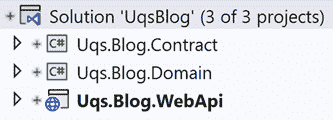
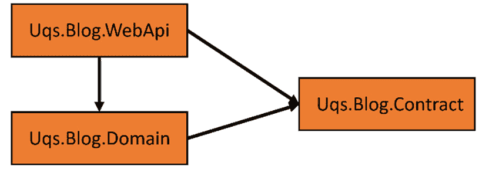
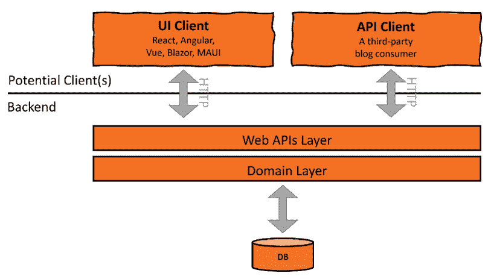
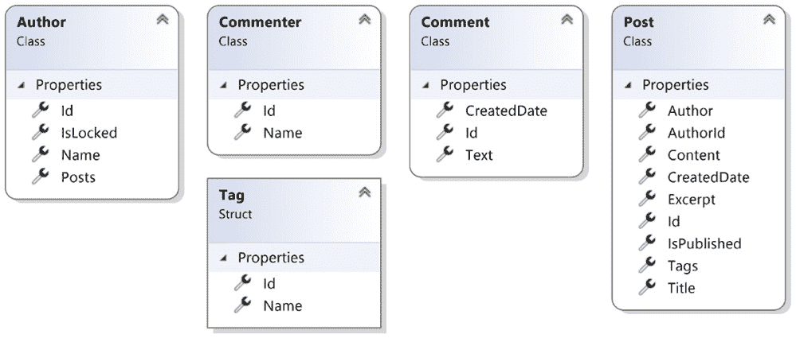
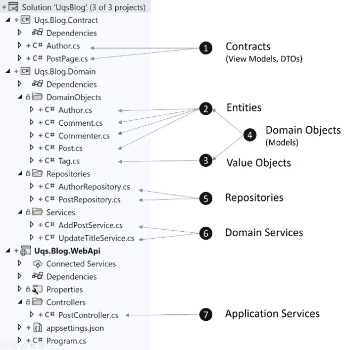
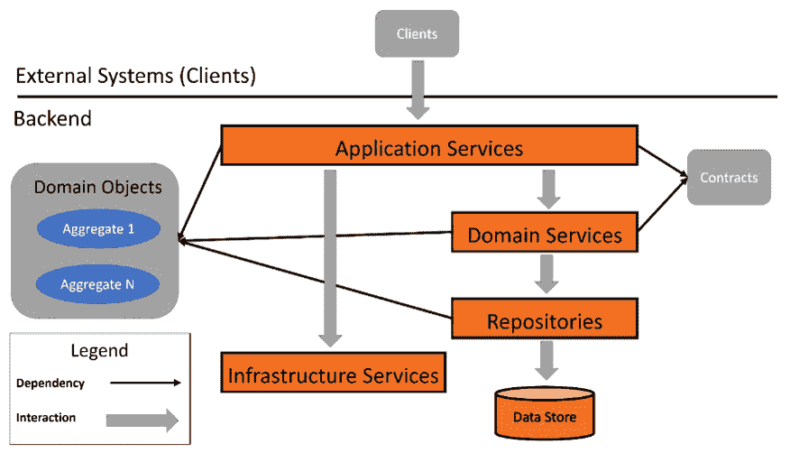

# 7

# 一种对领域驱动设计的实用观点

**领域驱动设计**（**DDD**）是一组在现代企业应用程序中广泛使用的软件设计原则。它们在 2003 年由 Eric Evans 在其著作 *领域驱动设计* 中捆绑并推广。

您可能会想知道这与**测试驱动开发**（**TDD**）有什么关系。是因为它们有相似的缩写吗？现实是 TDD 和 DDD 在一起工作，其中 TDD 从客户端的角度覆盖设计和质量，而 DDD 补充了其余的设计。您将在对话和职位说明中听到这两个术语一起使用，到 *第二部分*，*使用 TDD 构建应用* 的结束时，原因将变得清晰。

本章旨在作为 DDD 的入门指南，因此您将获得构建一个完整应用所需的基础，该应用结合了 TDD 和 DDD。

DDD 是一个技术和哲学话题。鉴于本书的实用主义和本章的长度，我们的重点将限于与我们在以下章节中实施的应用相关的 DDD 的实用方面。

在本章中，我们将涵盖以下主题：

+   使用示例应用进行工作

+   探索领域

+   探索服务

+   探索存储库

+   整合一切

到本章结束时，您将了解基本的 DDD 术语，并能够向同事解释它。

# 技术要求

本章的代码可以在以下 GitHub 仓库中找到：

[`github.com/PacktPublishing/Pragmatic-Test-Driven-Development-in-C-Sharp-and-.NET/tree/main/ch07`](https://github.com/PacktPublishing/Pragmatic-Test-Driven-Development-in-C-Sharp-and-.NET/tree/main/ch07)

# 使用示例应用进行工作

我们需要一个示例应用来展示 DDD 概念。在您的项目中，“应用”这个词可能有多种含义。它可以是以下之一：

+   一个**单一微服务**，它是更大应用的一部分

+   一个**单体应用**，它是一个独立的应用

本章将使用单体应用，因为它更容易解释概念，并且上下文将更清晰。因此，我们将专注于 DDD 的具体细节，而不是深入更复杂的架构。

让我们以一个博客应用为例。一个 DDD 风格的博客应用在 Microsoft **Visual Studio**（**VS**）中可能看起来像这样：



图 7.1 – VS 中的博客应用

**UQS** 是我们虚构公司的缩写，代表 **Unicorn Quality Solutions**。这些项目之间有以下依赖关系：



图 7.2 – 项目依赖关系

这里没有什么特别的：这是一组常规的项目依赖关系。让我们深入了解每个项目角色。

## 应用项目

我们的项目与外界、客户端以及`Uqs.Blog.WebApi`项目进行通信。这个解决方案正在使用 RESTful Web API 与 UI 层通信。这应该使得基于浏览器的 UI 层，如**React**、**Angular**、**Vue**或**Blazor**，交换数据（以合同的形式）变得容易。

此外，它还可以作为一个独立的 API 项目，可以被称为*无头*博客，这是一个术语，意思是这只是一个没有 UI 的后端平台。多个 UI 可以与之交互，因此它不耦合于一个 UI。

这可能是一个标准的 ASP.NET Core Web API，类似于我们在前面的章节中使用过的。

在*第二章* *通过示例理解依赖注入* 和 *第三章* *开始单元测试* 中，你已经看到了`WeatherForecastingController`的示例。在 DDD 术语中，控制器充当了**应用服务**的角色。

## 合同对象项目

要与外界通信，您的数据应该有一个定义的结构。这个定义的结构包括类，它位于`Uqs.Blog.Contract`项目中。

如果这是一个 UI 项目，这些合同可能被称为**视图模型**，因为它们是直接绑定到 UI（视图）的模型。它们也可能被称为**数据传输对象**（**DTOs**），因为它们将数据从服务器传输到客户端。在 API 项目中，它们通常被称为**合同**。

简而言之，如果 RESTful API 有一个请求帖子完整信息的 API，其 URL 如下：

```cs
https://api.uqsblog/posts/1
```

然后，合同可能看起来像这样：

```cs
public record Author(int Id, string Name);
public record Post(int Id, string Content, Author Author, 
    DateTime CreatedDate, int NumberOfComments
    , int NumberOfViews, …);
```

这通常以 JSON 的形式传输。这是前面 C#合同序列化为 JSON 的示例：

```cs
{
  "id": 1,
  "content": "Some content",
  "author": {
    "id": 100,
    "name": "John Smith"
  },
  "createdDate": "2022-01-01T01:01:01",
  "numberOfComments": 5,
  "numberOfViews": 486,
  …
}
```

合同不属于 DDD 哲学的一部分，但在这里需要它们来构建一个完整的应用程序。

## 领域层项目

这一层的组件位于`Uqs.Blog.Domain`中。这是所有与领域设计相关的类型所在的地方。

重要提示

分层、命名项目和根据层来安排它们是一个高度主观的过程。没有广泛认可的行业标准来定义最佳方法。因此，请将我这里的方法视为*一个例子*，而不是*做事的方式*。

这一层包含以下内容：

+   商业逻辑

+   数据库持久化

我们的项目与这个类似的设计：



图 7.3 – 应用程序的设计图

这个图表示我们的应用程序；然而，值得注意的是，DDD 关注的是后端，而不是客户端。

接下来，我们将探讨 DDD 的组成部分，并从领域开始。

# 探索领域

DDD 是一系列软件开发哲学和最佳实践。有几本书是专门关于 DDD 的，而且大多数都超过 500 页。因此，我们可以大谈 DDD，但本书不是关于 DDD 的，所以我们将简要介绍。

DDD 专注于业务逻辑以及与数据库和外部世界的交互，并采用一系列实践来确保软件设计的健壮性。DDD 中的*领域*一词指的是*业务领域*，可以是汽车保险、会计、账单、银行、电子商务等。DDD 强调业务领域，正如术语*领域驱动*所表示的。

接下来，我们将探讨构成 DDD 实际方面的架构组件。

## 领域对象

**领域对象**是现实生活商业实体的表示。在探索我们的博客项目时，领域对象可能如下所示：



图 7.4 – 贡献于博客领域的类和结构

你可以看到这些类型和属性的名称如何反映博客业务。这些实体通常直接映射到关系数据库表，因此你有帖子、作者、标签等数据库表。

在文档数据库中，领域对象可能直接持久化到您的集合中，也可能不是。

重要提示

DDD 没有规定领域对象应该映射到关系数据库表，但在实践中，这是实际的做法，尤其是在使用**对象关系映射器**（**ORMs**）如**Hibernate**（**Java**）和**Entity Framework**（**.NET**）的情况下。

你经常会发现诸如*模型*、*业务对象*和*领域对象*等词语被互换使用，意思相同。

并非所有领域对象都是平等的。DDD 区分两种类型的领域对象：实体和值对象。

## 实体和值对象

DDD 区分具有自身身份的对象，这些对象被称为`Id`属性，但它代表的是*身份*的普通英语含义。

### 值对象

**值对象**代表没有概念身份的已类型化值。最常见的值对象例子是货币。£5 纸币（钞票）没有身份，如果它被另一张£5 纸币所替换，那么什么都没有改变。换句话说，如果两个人交换了£5 纸币，那么他们具有相同的值，我们不必担心或追踪这些纸币。

重要提示

£5 纸币是一个值对象，除非纸币的序列号很重要。这可能是在英格兰银行发行货币项目的一部分。但在大多数情况下，这是一个值对象。

有许多例子可以说明什么是值对象。以下是一些例子：

+   日期

+   名字，因为单独的名字本身并不构成身份

+   地址

值对象在`Tag`结构体中建模。

博客标签，如 .NET、DDD 和 TDD，不需要 ID。但为了数据库存储，有一个标识符可能更实用，因为它允许更好地管理标签。

重要提示

从纯 DDD 方法来看，一个标签应该是 `Post` 中的一个属性，而不是一个独立的企业对象。然而，如果出现拼写错误，你想修正它怎么办？如果你想向用户显示一个现有标签列表以实现自动完成，将其作为一个独立的领域对象并存储在单独的表或容器中可能会带来更好的性能和管理。

在实践中，.NET 开发者很少使用结构体，除非他们正在构建一些底层的东西，例如性能优化，以及与未管理资源交互。通常，值对象是用类建模的，这并不非常符合 DDD。

### 实体

主要由其身份定义的对象称为 **实体**。它是一种需要随时间跟踪的领域模型，其属性可能随时间而变化。一个完美的例子就是人员实体，它有一个可变的电子邮件和家庭地址，但有一个固定的身份，即本人。

在我们之前的博客示例中，`Post`、`Author`、`Comment` 和 `Commenter` 都是实体。

`Comment` 是一个特殊的情况，因为有人可能会认为它是一个值类型！但如果它是可编辑的，那么它的身份就变得很重要。

实体以类和记录的形式表示，并且它们肯定有一个 **标识符**（**ID**）。

### 实体与值对象

在设计你的领域时，理解这些差异非常重要，这样你才能选择正确的设计。以下是主要的区分方面：

+   **生命周期**：实体存在于连续体中，而值对象可以轻松创建和销毁。

+   **不可变性**：如果一个对象在创建后其值不能改变，则称该对象为不可变。实体是可变的，而值对象是不可变的。

+   **标识符**：实体对象需要一个标识符，而值对象不需要。

+   **类或结构体**：实体使用类并遵循 .NET 引用类型原则（存储在堆中，通过引用传递等），而值类型是结构体（至少 DDD 推荐如此），它们遵循 .NET 值类型原则（存储在栈中，通过值传递等）。

总结来说，当我们设计我们的领域对象时，它们可以是实体或值对象，这取决于它们是否代表一个身份。

## 聚合

**聚合**是一组形成单一业务目标的类。之前的博客类设置了一个显著的业务目标，即管理博客文章。这些类形成一个聚合。

重要提示

在 **面向对象编程**（**OOP**）和 **统一建模语言**（**UML**）中使用的 *聚合* 术语与 DDD 聚合的概念并不相同。

一个 `Post` 领域对象。

## 贫血模型

当我们学习面向对象编程时，我们了解到对象处理自己的数据和自己的行为。因此，如果我们有一个名为`Person`的类，那么在这个类中可能有一个只读属性`Email`。此外，要设置电子邮件地址，你可能会有一个可能被称为`void ChangeEmail(string email)`的方法，该方法在设置电子邮件之前执行一些业务逻辑和验证。根据 DDD，我们的类将看起来像这样：

```cs
public class Person 
{
    public string Email { get; private set; }
    public void ChangeEmail(string email) 
    {
        …
    }
    // other properties and methods
}
```

这个类存储了自己的数据。例如，`Email`属性存储电子邮件值，并且有一个行为，由`ChangeEmail`方法表示，该方法是更改存储的`Email`。

之前的一个`Person`类到贫血版本的例子：

```cs
public class Person 
{
    public string Email { get; set; }
    // other properties
}
```

现在电子邮件有了设置器，但如果它不在类内部，如何实现验证和其他业务逻辑？答案是，另一个类将负责，如下所示：

```cs
public class PersonService
{
    public void ChangeEmail(int personId, string email)
    {
      Person person = …; // get the object some how
      // validate email format
      // check that no other person is using the email
      person.Email = email;
    }
}
```

在这种情况下，另一个类`PersonService`处理`Person`类的行为，`Person`类的行为越外包给其他类，`Person`类就越贫血。

在贫血模型中，客户端解释领域对象的目的和使用，而业务逻辑最终在其他类中实现，类似于前面的例子。贫血模型被认为是一种**反模式**，因为它与面向对象编程的理论相悖。

然而，在领域对象中使用贫血模型的**反模式**在开发者之间非常普遍，因为设置 ORM（如**Entity Framework**（EF））和其他实际操作与 DDD 最佳实践相冲突。

本书剩余部分采用贫血模型方法，因为它在市场上占主导地位。它更实用，并且与 ORM（对象关系映射）配合良好。

## 普遍语言

词语**普遍存在**（ubiquitous），发音为**yu-bikwitus**，根据剑桥词典的定义，意味着**无处不在**。

从 DDD 的角度来看，这意味着在命名领域对象时使用众所周知的术语，类似于业务人员所使用的术语。换句话说，不要发明自己的术语，而是遵循现有的语言：业务语言。

这种方法有几个明显的优点：

+   业务利益相关者和开发者之间的对话更加流畅

+   新的开发者可以快速处理业务逻辑和代码。

我在博客示例中确实使用了这种方法，其中我使用了博客中使用的术语。同样的概念也适用于更大规模的项目。

到目前为止，你对 DDD 中的领域对象和聚合体已经有了大致的了解。在下一节中，我们将深入探讨一个主要的 DDD 主题，我们将在本书的**第二部分**，即**使用 TDD 构建应用程序**中广泛使用这个主题。

# 探索服务

**服务**在领域驱动设计（DDD）中分为三种类型，但我们将目前专注于**领域服务**，稍后我们将讨论其他两种：**基础设施服务**和**应用服务**。

域服务是 DDD 生态系统中包含业务逻辑的单元。域服务有以下职责：

+   通过仓库的帮助加载域对象

+   应用业务逻辑

+   在仓库的帮助下持久化域对象

理解域服务不知道数据是如何从存储介质加载的以及如何存储的非常重要。它们只知道如何通过数据仓库请求数据加载或持久化操作。仓库将在本章后面介绍。

让我们为我们的博客项目添加一些服务，以帮助我们发布帖子、检索和更新它们。

## 帖子管理

如果你曾经发布过博客文章或在线文章，你将熟悉这个过程。如果你打开文本编辑器来撰写博客文章，你必须填写标题、内容和其他字段，但你也可以在不完成所有内容的情况下保存。在编辑时，不填写必填字段是可以的，但当你想要发布时，一切都应该完成。

让我们开始实现管理帖子所需的域服务。

### 添加帖子服务

添加新帖子将需要作者的 ID 但不需要其他字段。此服务的代码可以看起来像这样：

```cs
public class AddPostService
{
    private readonly IPostRepository _postRepository;
    private readonly IAuthorRepository _authorRepository;
    public AddPostService(IPostRepository postRepository,
         IAuthorRepository authorRepository)
    {
        _postRepository = postRepository;
        _authorRepository = authorRepository;
    }

    public int AddPost(int authorId)
    {
        var author = _authorRepository.GetById(authorId);
        if (author is null)
        {
            throw new ArgumentException(
              "Author Id not found",nameof(authorId));
        }
        if (author.IsLocked)
        {
            throw new InvalidOperationException( 
              "Author is locked");
        }
        var newPostId = _postRepository.CreatePost
          (authorId);
        return newPostId;
    }
}
```

首先，你会注意到我专门创建了一个包含单个方法 `AddPost` 的类 `AddPostService`。一些设计创建了一个单一的 `PostService` 服务类，并在其中添加了多个业务逻辑方法。我选择了在单个类中只有一个公共方法的方法，以尊重 **SOLID** 的单一职责原则。

我已将两个仓库注入到类中，这些仓库对于业务逻辑是必需的：`author` 和 `post` 仓库。关于依赖注入的提醒，请参阅 *第二章*，*通过示例理解依赖注入*。

我实现了一个业务逻辑，用于检查是否将不存在的作者传递给方法。如果作者被锁定以发布，则创建一个帖子并返回创建的 ID。我本可以使用 `Guid`，但 UI 会想要一个整数。

这里值得注意的是，服务并不知道如何加载 `Author`。它可能来自关系型数据库、文档数据库、内存数据库，甚至是一个文本文件！服务将这种知识委托给了仓库。

此处的服务专注于单一职责，即添加新帖子的业务逻辑。这是一个关注点分离的例子。

### 更新标题服务

博客的标题可以长达 90 个字符，并且可以随时更新。以下是一个实现此功能的示例代码：

```cs
public class UpdateTitleService
{
    private readonly IPostRepository _postRepository;
    private const int TITLE_MAX_LENGTH = 90;
    public UpdateTitleService(IPostRepository postRepo)
    {
        _postRepository = postRepo;
    }
    public void UpdateTitle(int postId, string title)
    {
        if (title is null) title = string.Empty;
        title = title.Trim();
        if (title.Length > TITLE_MAX_LENGTH)
        {
            throw new
               ArgumentOutOfRangeException(nameof(title), 
               $"Title max is {TITLE_MAX_LENGTH} letters");
        }
        var post = _postRepository.GetById(postId);
        if (post is null)
        {
            throw new ArgumentException(
                $"Unable to find a post of Id {postId}", 
                nameof(post));
        }
        post.Title = title;
        _postRepository.Update(post);
    }
}
```

上述逻辑很简单。这里的新颖之处在于服务加载实体、修改其属性之一，然后请求仓库管理更新操作的方式。

在这两个服务中，涉及的业务逻辑对数据平台没有任何了解。这可能包括 SQL Server、Cosmos DB、MongoDB 等等。DDD 将这些工具的库称为 *基础设施*，因此服务对基础设施没有任何了解。

## 应用程序服务

之前，我们描述了领域服务。应用程序服务提供与外部世界的交互或粘合剂，允许客户端从你的系统中请求某些内容。

应用程序服务的完美例子是一个 **ASP.NET** 控制器，其中控制器可以使用领域服务来响应 **RESTful** 请求。应用程序服务通常使用领域服务和仓库来处理外部请求。

## 基础设施服务

这些用于抽象技术问题（云存储、服务总线、电子邮件提供者等等）。

我们将在本书的 *第二部分*，*使用 TDD 构建应用程序* 中广泛使用服务。所以我希望你对它们有了概念。稍后，我们将有一个涉及多个服务的端到端项目。

## 服务特征

关于如何在 DDD 中构建服务有一些指导原则。我们在这里将讨论其中的一些。然而，如果你想了解更多，我建议阅读本章末尾的 *进一步阅读* 部分。

我们将讨论无状态服务、通用语言以及使用领域对象而不是服务。

### 无状态

服务不应该持有状态。持有状态类似于记住数据，也就是说，用简单的话说，在服务类的字段或属性中持久化一些业务数据。

避免在服务中维护状态，因为这会复杂化你的架构，如果你认为你需要状态，那么这就是仓库的作用所在。

### 使用通用语言

像往常一样，使用通用语言。在之前的例子中，我们按照业务操作命名服务和方法。

### 在相关的地方使用领域对象

DDD 反对贫血模型，因此它鼓励用户检查领域模型是否可以执行操作，而不是在服务中执行此操作。

在我们的例子中，DDD 会鼓励我们在 `Post` 中有行为（公共方法）。如果我们遵循 DDD 的建议，我们的 `Post` 类将看起来像这样：

```cs
public class Post
{
    public int Id { get; private set; }
    public string? Title { get; private set; }
    // more properties…
    private readonly IPostRepository _postRepository;
    private const int TITLE_MAX_LENGTH = 90;
    public Post(IPostRepository postRepository)
    {
        _postRepository = postRepository;
    }
    public void UpdateTitle(string title)
    {
        …
    }
}
```

注意，属性的设置器现在是私有的，因为只有类内的方法可以设置属性。第二个要注意的是，`UpdateTitle` 方法不需要获取 `Id` 作为参数，因为它可以从类内部访问 `Id`。它只需要新的标题。

这种做法的好处是，你的类不是贫血的，并且遵循 OOP 原则。显然，我们没有遵循 DDD 的建议，在服务类中编写了 `UpdateTitle` 方法。

我这样做不是为了惹恼 DDD 实践者，而是出于实用目的！让我列出在使用 EF（主要的 .NET ORM）时，采用这种方法可能遇到的一些潜在问题。

+   在运行时，`Post` 类。这不是一个常见的做法，我甚至不确定这是否可能通过非黑客代码实现。

+   从数据库中获取 `Post`，它将无法设置属性，这使得 EF 无用。

+   **业务逻辑的分布**：如果领域类包含业务逻辑，有时你的业务逻辑会在服务中，有时会在领域对象中，而不是在两者之一中。换句话说，它将在多个类中分布。

有方法可以使这行得通，但它们不值得付出努力。在这里，实用性不符合 DDD 理论，这就是我选择使用贫血领域对象的原因。得到的启示是，你知道 DDD 是什么，为什么会有这样的倡导，以及为什么我们要从这种做法转变。

服务不关心数据是如何加载和持久化的，因为这由仓储负责，这自然引出了下一个话题。

# 探索仓储

**仓储**是属于基础设施的类。它们理解底层存储平台并与数据存储系统的具体细节交互。

它们不应该包含业务逻辑，而应该只关注加载数据和保存数据。

仓储是一种通过让服务和领域负责业务逻辑但不负责数据持久性来实现单一责任（如 SOLID 的单一责任原则）的方法。DDD 将数据持久性责任赋予仓储。

## 仓储的一个例子

你之前在 `UpdateTitleService` 类中见过这一行代码：

```cs
var post = _postRepository.GetById(postId);
```

这里，我们将向你展示 `GetById` 的一个潜在实现。

### 使用 Dapper 与 SQL Server

**Dapper** 是一个被归类为 *微 ORM* 的 .NET 库。它非常受欢迎，并在 **StackOverflow** 上使用。

Dapper 可以用来访问 SQL Server 数据库，所以假设我们的博客数据库是 SQL Server 类型，我们将使用 Dapper 实现 `PostRepository` 的 `GetById`。

要在任何项目中使用 `Dapper`，您可以通过 `System.Data.SqlClient` NuGet 进行安装：

```cs
using Dapper;
using System.Data.SqlClient;
…
public interface IPostRepository
{
    int CreatePost(int authorId);
    Post? GetById(int postId);
    void Update(Post post);
}
public class PostRepository : IPostRepository
{
    public Post? GetById(int postId)
    {
        var connectionString = … // Get con string from config
        using var connection = new SqlConnection
          (connectionString);
        connection.Open();
        var post = connection.Query<Post>(
            "SELECT * FROM Post WHERE Id = @Id", new {Id = 
                 postId}).SingleOrDefault();           
        connection.Close();
        return post;
    }
    … 
}
```

通常，仓储类有一个接口对应物，以便它们可以被注入到服务中。注意，在我们的上一个 `PostService` 中，我们已经注入了 `IPostRepository`。代码展示了仓储的工作方式，但它不符合 DI 规范，然而，在下一节中将会。

`SqlConnection` 类是一个 **ADO.NET** 类，它允许你管理与 SQL Server 数据库的连接。

`Query()` 是 Dapper 提供的一个扩展方法。它允许你发出一个常规的 **T-SQL** 查询并将结果映射到对象。

### 使用 Dapper 与 SQL Server 和 DI

如你所注意到的，我们没有注入 `SqlConnection`，而是直接在代码中实例化了它。显然，这不是最佳实践！以下是一个利用注入连接对象的实现：

```cs
public class PostRepository : IPostRepository
{
    private readonly IDbConnection _dbConnection;
    public PostRepository(IDbConnection dbConnection)
    {
        _dbConnection = dbConnection;
    }
    public Post? GetById(int postId)
    {
        _dbConnection.Open();
        var post = _dbConnection.Query<Post>(
            "SELECT * FROM Post WHERE Id = @Id", new {Id = 
                 postId}).SingleOrDefault();
        _dbConnection.Close();
        return post;
    }
    …
}
```

`SqlConnection` 实现 `IDbConnection`，我们可以在启动时的 DI 部分将其连接起来，以在运行时注入正确的对象（*此处未显示，因为这只是一个虚构的示例*）。DI 将负责实例化连接对象，所以我们在这里不需要做。

`GetById` 方法使用 Dapper 的 ADO.NET 扩展方法将查询结果映射到 C# 对象。有更干净的方法可以实现这一点，但在这个例子中，我选择了最易读的一种。

### 使用其他数据库

在前面的例子中，我们使用了 SQL Server 数据库；然而，任何其他数据库都可以。唯一会改变的是 `PostRepository` 类内部的实现。`IPostRepository` 的消费者不会改变。

在接下来的章节中，我们将演示使用 SQL Server（与 EF）和 Cosmos DB 的端到端实现。

## EF 和仓储

**EF** 是 .NET 的主要 ORM。*ORM* 是一个术语，表示它将关系型数据库记录加载到对象中。

EF 提供了高级抽象，体现了多个 DDD 模式，最显著的是仓储模式。当使用 EF 时，仓储模式消失，取而代之的是 EF，代码设计变得更简单。

在本章中，了解这一点就足够了。在 *第九章*，“使用 Entity Framework 和关系型数据库构建预约应用”，我们将有一个完整的实现，包括 EF 和一个完全工作的源代码，这将阐明从端到端是如何完成的。

# 将一切整合在一起

这是我最喜欢的一部分。我一直在这里那里提供一些小片段，希望现在你能看到从 DDD 视角看一切是如何相互关联的。我已经将这些片段包含在源代码目录中。

## 解决方案资源管理器视图

在这个项目中，我们所做的是一系列片段的集合。让我们看看它们：



图 7.5 – 从 DDD 视角看 VS 解决方案文件

让我们回顾一下每个项目：

1.  **契约**：这是外部世界看到的内容。这些契约代表了将在后端和客户端之间交换的数据的形状。客户端应该知道契约的数据元素，以便知道从你的无头博客中可以期待什么。

1.  **实体**：它们是有身份的领域对象。

1.  **值对象**：它们是不需要身份的领域对象。

1.  **领域对象**：这是系统中实体和值对象的集合。

1.  **仓储**：这些是保存和加载数据到数据存储（关系型数据库、文档数据库、文件系统、博客存储等）的类。

1.  **领域服务**：这是业务逻辑将驻留的地方，它将与存储库进行 CRUD 操作的交互。这些服务不会暴露给外界。

1.  `REST` 请求。应用服务暴露给外界。

偶然的是，我们只有一个聚合，那就是我们所有的领域对象。一个领域可能包含多个聚合。我们还有 `Post` 作为我们的聚合根。

## 架构视图

我们已经看到了我们 DDD 项目的潜在项目和文件结构，现在，让我们从软件设计的角度来审视它：



图 7.6 – DDD 的简化软件设计视图

让我们讨论这个 DDD 风格的系统：

+   **应用服务**：它们与客户端和领域服务交互。根据合同，它们将数据传递给客户端，并直接处理领域服务。

+   **领域服务**：它们为 **应用服务** 提供服务。

+   **基础设施服务**：它们提供不属于领域的服务，例如获取 ZIP 码/邮编城市。

+   **聚合**：每个聚合包含多个领域对象，并有一个聚合根。

+   **领域对象**：它们是所有聚合中的所有实体和值对象。

我希望我能够从编码和项目结构以及从架构的角度展示 DDD 设计的基础，尽管冒着重复概念两次的风险。

# 摘要

在 DDD 中有一些我没有涉及的主题，因为它们没有直接贡献于本书的其余部分，例如边界上下文、领域事件、工作单元等。我在 *进一步阅读* 部分提供了额外的资源，帮助你进一步探索这些概念。

我们已经讨论了 DDD 的基础知识，并期待这一章能让你熟悉这个概念，这样我们就可以在后续章节中自由使用诸如 *领域对象*、*领域服务* 和 *存储库* 等术语，而无需你皱眉。我们还看到了 DDD 不同组成部分的示例代码。

我们还看到了在什么情况下我们可以从 DDD 指南中做出调整，使其更加实用，并解释了原因。

在下一章中，我们将为利用你迄今为止所学的一切知识（包括 DDD）的完整项目打下基础。

# 进一步阅读

要了解更多关于本章讨论的主题，你可以参考以下资源：

+   *《领域驱动设计》*，作者：Eric Evans，Addison-Wesley（2003）

+   *《实现领域驱动设计》*，作者：Vaughn Vernon，Addison-Wesley（2013）

+   *《.NET Core 实战领域驱动设计》*，作者：Alexey Zimarev，Packt Publishing（2019）

+   *设计面向 DDD 的微服务*: [`docs.microsoft.com/en-us/dotnet/architecture/microservices/microservice-ddd-cqrs-patterns/ddd-oriented-microservice`](https://docs.microsoft.com/en-us/dotnet/architecture/microservices/microservice-ddd-cqrs-patterns/ddd-oriented-microservice)

+   *马丁·福勒关于 DDD*: [`martinfowler.com/bliki/DomainDrivenDesign.xhtml`](https://martinfowler.com/bliki/DomainDrivenDesign.xhtml)

+   *快速入门：使用 .NET V4 SDK 构建 console 应用程序以管理 Azure Cosmos DB SQL API 资源*: [`docs.microsoft.com/en-us/azure/cosmos-db/sql/create-sql-api-dotnet-v4`](https://docs.microsoft.com/en-us/azure/cosmos-db/sql/create-sql-api-dotnet-v4)

+   *GitHub 上的 Dapper*: [`github.com/DapperLib/Dapper`](https://github.com/DapperLib/Dapper)
