# 8

# 设计预约应用程序

在前面的章节中，我们看到了范围有限的示例实现，因为在每个涵盖的主题上都有完整的应用程序是不切实际的。

本章涵盖了理发预约应用程序的设计，它将结合我们从前面章节中学到的内容：

+   依赖注入

+   单元测试

+   使用模拟和伪造的测试替身

+   DDD

+   应用 TDD

*第九章* 和第十章将涵盖本章的实现。本章是关于业务需求和设计决策，而不是关于实现（代码）。

在继续本章和第二部分的其他内容之前，我强烈建议您熟悉我列出的上述主题。它们都在 *第二章* 到 *第七章* 中有所涉及。

在本章中，我们将涵盖以下内容：

+   构建预约系统的业务需求

+   系统的 DDD 风格设计

+   该系统的实现路线

到本章结束时，您将更好地理解基于真实问题的 DDD 分析。

# 技术要求

本章的代码可以在以下 GitHub 仓库中找到：

[`github.com/PacktPublishing/Pragmatic-Test-Driven-Development-in-C-Sharp-and-.NET/tree/main/ch08`](https://github.com/PacktPublishing/Pragmatic-Test-Driven-Development-in-C-Sharp-and-.NET/tree/main/ch08)

# 收集业务需求

您为名为 **Unicorn Quality Solutions**（**UQS**）的软件咨询公司工作，该公司正在为拥有许多员工的现代理发店 Heads Up Barbers 实施预约应用程序。

必需的应用程序将包括三个应用程序：

+   **预约预约网站**：客户将在这里预约理发。

+   **预约预约移动应用程序**：与网站相同，但是一个原生移动应用程序（而不是移动网络浏览器上的网站）。

+   **后台网站**：这是一个供企业主使用的内部应用程序。它为理发师（员工）分配班次，取消预约，计算理发师的佣金等。

*第一阶段* 的交付仅是第一个应用程序（预约网站），因为它具有最高的商业价值，因为它允许用户通过桌面和他们的移动网络浏览器进行预约。

*这是我们关注本书第二部分其余部分的内容*。以下是一个显示项目三个阶段的图表：

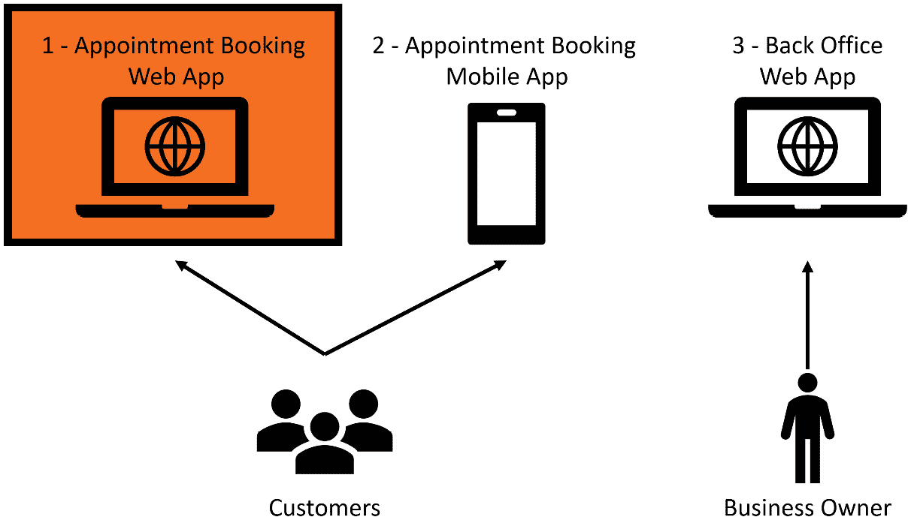

图 8.1 – 必需的三个应用程序

虽然我们只关注构建 *第一阶段*，但我们需要在设计时考虑我们的架构将在后期阶段包括对移动应用程序的支持。

## 业务目标

在这个时代，大多数客户喜欢在线预约，尤其是在 COVID-19 之后，商店试图通过预约来减少空间中的人流集中。

Heads Up Barbers 希望有一个预订解决方案，旨在做到以下几方面：

+   推广可用的理发服务。

+   允许客户预约特定或随机的理发师。

+   在预约之间给理发师休息时间，通常是 5 分钟。

+   理发师在商店有不同的班次，他们在不同的日子休息，因此解决方案应该根据理发师的可用性来选择空闲时段。

+   通过不必在电话或亲自安排预约来节省时间。

## Stories

在分析了业务目标后，UQS 提出了更详细的需求，以用户故事和原型形式呈现。我们将在下面进行介绍。

### Story 1 – 服务选择

作为一位客户：

我希望有一个所有可用服务及其费用的列表。

这样我就可以选择一个进行预订。

并被转到预订页面。

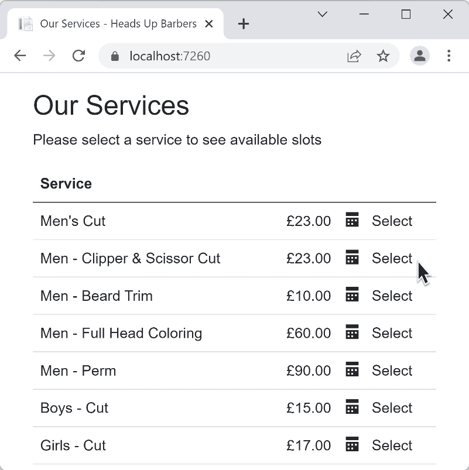

图 8.2 – 可用服务及其价格的列表

这个原型展示了所有可用的服务及其价格，以及**选择**超链接，将用户带到所选服务的预订页面。

### Story 2 – 默认选项

作为一位客户：

我想有一个预订页面，默认选中**[任何员工]**和今天的日期。

这样我就可以节省点击时间，更快地完成预订。

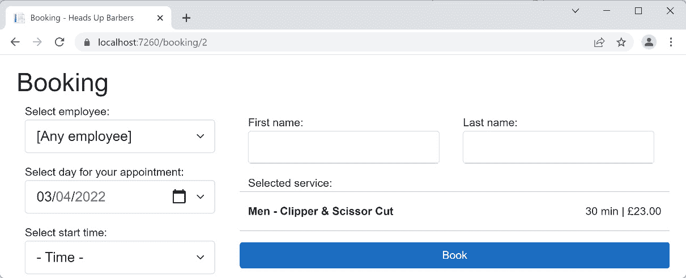

图 8.3 – 默认选项已选的预订页面

注意到**[任何员工]**和当前日期，**2022-04-03**，默认选中。

### Story 3 – 选择员工

作为一位客户：

我希望为我的预约选择任何员工或特定员工。

这样我就可以选择我喜欢的理发师，如果有的话。

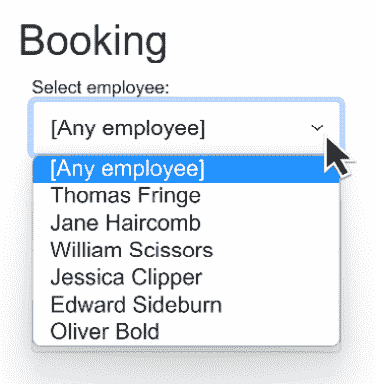

图 8.4 – 选择特定员工

客户将有一份来自 Heads Up Barbers 的理发师名单，他们可以从中选择他们最喜欢的一位。

### Story 4 – 预约日期

作为一家企业：

我们希望向客户展示最多 7 天的窗口，包括当前日期，以便选择预约。

如果所选员工不完全可用，我们希望减少这个窗口。

这样我们可以保证我们的员工在预订时的可用性。

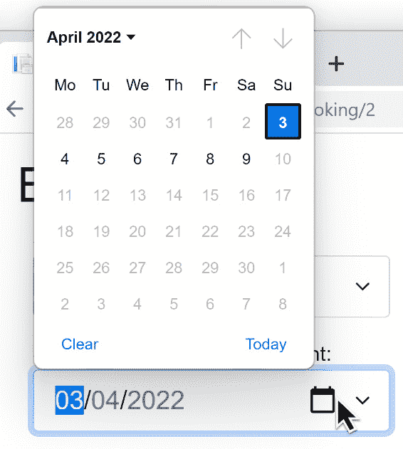

图 8.5 – 显示从 2022-04-03 开始的 7 天窗口的日历

原型将考虑所选员工日程的变化，并仅显示所选员工的可用时间窗口。

### Story 5 – 时间选择

作为一家企业：

我希望向客户展示所选日期所选员工可用的时段。

并考虑现有员工的预约和员工的班次。

将任何预约向上取整到最近的 5 分钟。

并考虑预约之间的 5 分钟休息时间。

因此，我确保客户正在选择一个已经可用的员工。

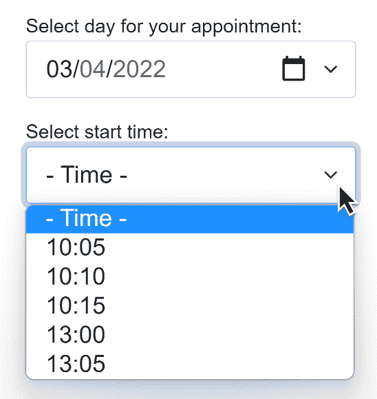

图 8.6 – 为所选日期的员工可用的时段

让我们举几个例子来澄清要求。

注意所有分钟数都是 5 的倍数。

#### 第 1 个示例 – 没有可用的班次

如果员工在所选日期没有分配的班次，列表将为空，客户将无法预订。

#### 第 2 个示例 – 没有预约

员工汤姆在 2022-10-03 日 9:00 至 11:10 有班次，并且没有已预订的预约。客户想要预订一个 30 分钟的服务。所选的起始时间将有以下值：09:00，09:05，09:10，……，10:35，和 10:40。

#### 第 3 个示例 – 在班次结束时预订多个预约

员工汤姆在 2022-10-03 日 9:00 至 11:10 有班次，但他已经从 09:35 至 11:10 预订了预约。客户想要预订一个 30 分钟的服务。所选的起始时间将有以下值：09:00。以下图示说明了时间段：

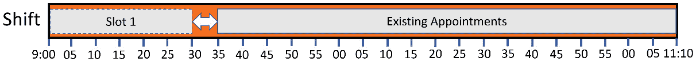

图 8.7 – 一个带有休息间隔的时段

#### 第 4 个示例 – 在班次结束时预订多个预约

汤姆在 2022-10-03 日 9:00 至 11:10 有班次，但他已经从 09:40 至 11:10 预订了预约。客户想要预订一个 30 分钟的服务。所选的起始时间将有以下值：09:00 和 09:05。

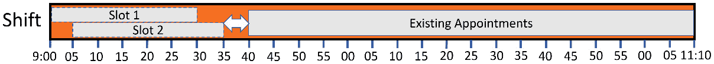

图 8.8 – 两个带有休息间隔的时段

#### 第 5 个示例 – 在班次中间预订预约

汤姆在 2022-10-03 日 9:00 至 11:10 有班次，但他已经从 09:40 至 10:35 预订了预约。客户想要预订一个 30 分钟的服务。所选的起始时间将有以下值：09:00，09:05 和 10:40。

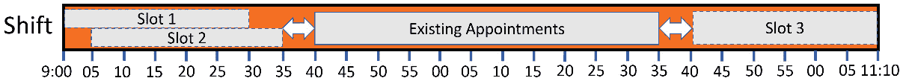

图 8.9 – 三个带有两个休息间隔的时段

### 第 6 个故事 – 填写名字

作为客户：

当我出现在理发店时，我必须填写我的名字和姓氏以作为我的身份证明。

因此，我是唯一识别的。

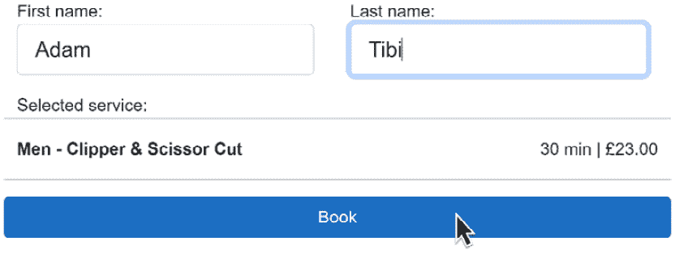

图 8.10 – 姓氏和名字字段

### 第 7 个故事 – 服务显示

作为客户：

我想要提醒我选择的服务名称、价格和所需时间。

因此，在点击**预订**按钮之前，我可以回顾我的选择。

### 第 8 个故事 – 所有字段都是必填验证

作为客户：

在预订之前，我必须选择并填写所有字段。

因此，我不会得到验证错误。

### 第 9 个故事 – 随机选择任何员工

作为一家企业：

当**[任何员工**]被选中时。

并且在所选时间段内有多名员工空闲。

然后我点击**预订**。

随机选择一名空闲员工。

因此，我确保我们的员工在预约中公平分配。

#### 示例 1 – 在一个时间段内有三名员工空闲

如果客户选择**[任何员工**]并得到三名空闲的员工（托马斯、简和威廉），并且客户选择**09:00**并点击**预订**，托马斯、简或威廉将被随机分配到预约，不考虑任何其他因素，并从中选择一个。

### 故事 10 – 确认页面

作为客户：

我想查看我的预约是否已预订。

因此，我可以放心，它正在进行中。

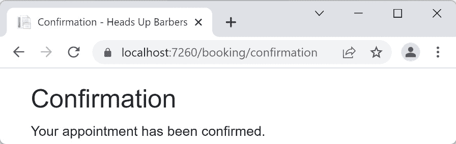

图 8.11 – 确认页面

上面的确认页面是一个简单的静态页面。

你可能已经感觉到，从业务逻辑的角度来看，*故事 5* 是最具有挑战性的，这将是我们的单元测试的重点。

如您所见，实现的范围是有限的。在未来，我们可以通过以下方式进一步扩展：

+   在线支付

+   用户登录

+   邮件确认

+   更多…

然而，到目前为止的故事描述了一个健壮的、逼真的系统。有些人可能会称之为**最小可行产品**（MVP）；然而，我不会这样称呼它，因为这可能会错误地暗示系统质量较低。

现在是时候从业务需求转向设计我们系统的通用指南了。

# 以 DDD 精神进行设计

在上一章中，我们学习了 DDD 的概述。在我们的实现中，我们将遵循 DDD 的精神来设计业务类。

## 领域对象

如果我们阅读所有故事并思考领域模型，我们可能会得出以下类：

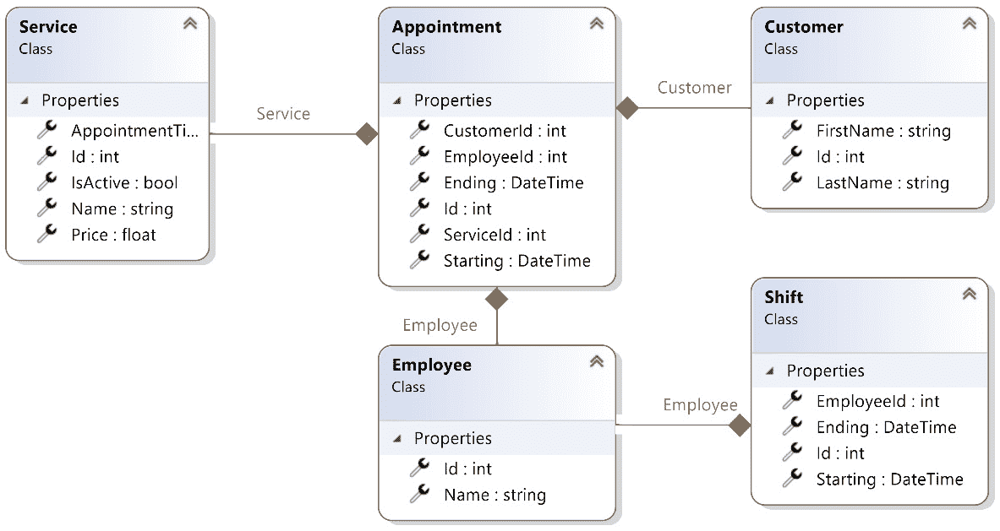

图 8.12 – 领域类的图示

+   `AppointmentTimeSpanInMin`代表服务的持续时间，`IsActive`为真以向客户端提供。

+   **客户**：表示客户。我们目前只关注他们的名字。

+   **员工**：这个类将在稍后阶段扩展以包含更多信息，但到目前为止，我们只需要名字。

+   **班次**：代表理发师独特的可用时间。后台应用程序（不在范围内）将允许业务所有者每天为员工添加班次，以覆盖至少 7 天。因此，无论何时向客户展示日期选择，我们都有至少 7 天的未来日期。

+   **预约**：很明显，预约将一项服务与员工和客户联系起来。它还指定了预约的开始和结束时间。

在我们的实现中，我们有一个包含所有先前类的单一*聚合体*，我们的*聚合根*显然是`Appointment`类。

## 领域服务

领域服务包含控制系统行为的业务逻辑。我们的系统将处理四类业务逻辑，这可能导致四个领域服务：

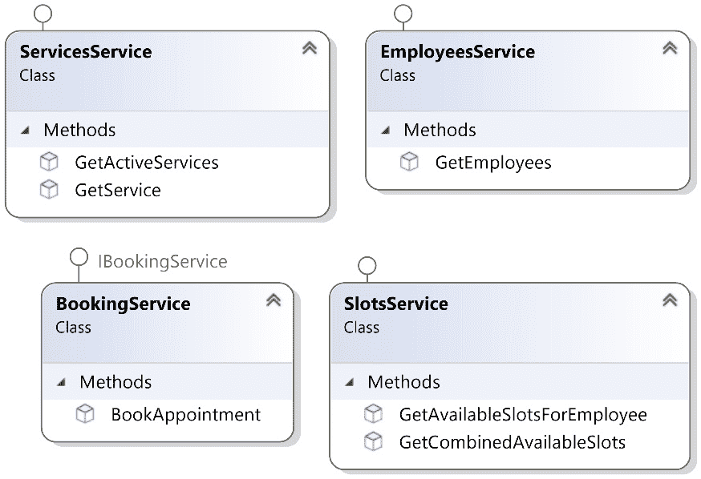

图 8.13 – 领域服务初步设计

目前阶段的服务只是一个初步设计。你通常是通过 TDD（测试驱动开发）过程来驱动服务设计，而不是预先设计服务，这通常是一个接一个的顺序进行。

## 系统架构

虽然我们现在只进行系统的*第一阶段*，但考虑到下一个阶段将实现使用与预订网站相同逻辑的移动应用，我们的架构应该为未来的阶段做好准备。考虑到这一点，下一个图中的架构可以支持所有阶段：

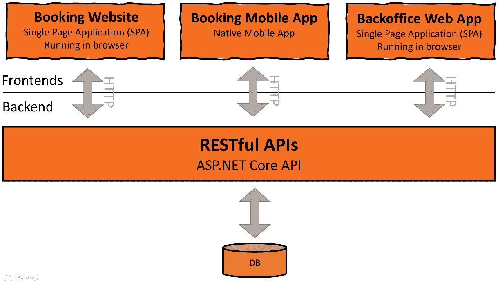

图 8.14 – 架构设计

使用一个后端来支持所有客户端将嵌入一个业务逻辑来支持所有客户端，因此我们所有的业务逻辑都将位于我们的 RESTful API 应用程序后面。

此外，这会使我们的后端作为一个由一个项目中的 API 集合和一个单一数据库组成的单体应用程序。这是可以接受的，因为这个项目范围有限，走微服务路线将是过度设计。

这是一个众所周知的架构模型，其中你将业务逻辑隐藏在 Web API 后面以支持多个客户端，并使逻辑集中化。在未来的阶段添加预订移动应用和后台 Web 应用时，不应重构架构。

# 实施路线

我们将以不同的方式实现后端。每种实现都将产生相同的 API 结果，但这样做的目的是在每个实现中体验多个单元测试和测试替身场景。

您的团队可能正在使用这些架构路线之一，因为他们可能正在使用文档数据库或关系数据库，正如大多数现代应用的情况一样。

## 前端

在这本书中，我们更关注后端，因此，前端上的 TDD 实现没有涵盖。

重要注意事项

有一些单元测试框架可以测试前端。Blazor 的一个流行库，我们在这里将使用它，是**bUnit**，它与 xUnit 并行工作。

在所有流行的 JavaScript**单页应用**（**SPA**）平台，如 React、Angular 和 Vue 中，我决定使用微软的**Blazor**来实现前端。

Blazor 是一个基于 C#而不是 JavaScript 的 Web 框架。简单来说，Blazor 将 C#转换为浏览器理解的底层语言**WebAssembly**（**Wasm**）。

我选择 Blazor，因为我假设对于没有 SPA（单页应用）经验或 JavaScript/TypeScript 经验的 C#开发者来说，它会更简单。

前端实现是最简的，*故事*部分之前的模拟截图来自 Blazor 应用程序。你可以在本章的 GitHub 上的`Uqs.AppointmentBooking.Website`找到它。

重要提示

前端实现旨在可读性和简约，而不是网页设计、用户体验、健壮性和最佳实践。

要启动网站：

1.  在 VS 中打开`UqsAppointmentBooking.sln`。

1.  右键单击`Uqs.AppointmentBooking.Website`并选择**设置为启动项目**。

1.  从 VS 运行。

随意运行网站并四处点击。你会注意到它是模拟的，因此它不依赖于真实数据库，而是依赖于示例数据。关于前端的内容仅限于本节，因为本书的重点是 TDD 和后端。

## 关系型数据库后端

通常，使用 SQL Server 和 Oracle 等关系型数据库会邀请**Entity Framework**（**EF**）。后端依赖于 EF 会影响你组织测试和将要使用的测试替身类型的方式。

*第九章*, *使用 Entity Framework 和关系型数据库构建预约预订应用程序*，将致力于使用关系型数据库（SQL Server）和 EF 来实现需求。

## 文档数据库后端

当使用 Cosmos DB、DynamoDB 和 MongoDB 等文档数据库时，你不会使用 EF。这意味着你将实现更多的 DDD 模式，如*存储库模式*。这将使使用文档数据库的实现与使用 EF 的实现相比，在测试替身和**依赖注入**（**DI**）方面相当不同。

*第十章*, *使用存储库和文档数据库构建应用程序*，将重复第九章*第九章*的实现，但大约有 50%的代码不同，因为它将使用文档数据库。

展示这两个版本将让你看到实现之间的差异，并希望促进你对测试替身和 DI 的理解。然而，如果你只对特定类型的数据库感兴趣，那么你可以选择*第九章*或*第十章*。

好消息是，这两章之间有重复，你将能够轻松地发现它们并专注于独特的实现。

## 使用中介者模式

当使用中介者模式时，你所有的设计更改、测试和测试替身都会相应地进行。中介者模式是一把双刃剑；它有一个陡峭的学习曲线，但一旦学习和实施，它提供了更高层次的组件关注分离。它还会改变你的单元测试结构。中介者模式超出了本书的范围，这里提到它是为了指导你发现影响你的 DI 实现和单元测试的相关模式。

希望到 *第二部分* 的结尾，你能够真正地感受到如何在更现实的环境中实施 TDD。

# 摘要

我们看到了相当合理的需求，我们也看到了系统的潜在设计。本章是 *将所有内容整合在一起* 的开始。

你也看到了一个基于 DDD 的设计，这个设计将在后面的章节中转化为代码。我们还讨论了会影响我们测试和测试替身方式的实现路线。

复杂和现代的项目使用 DDD 的概念。到目前为止，在分析完一个完整的项目后，我希望 DDD 的术语开始听起来熟悉，并帮助你构建你的下一个项目，以及帮助你与专家开发者进行沟通。

下一章是对本章内容的实现，但重点在于 SQL Server 和 EF。

## 进一步阅读

要了解更多关于本章讨论的主题，你可以参考以下链接：

+   *Mediator 是 .NET 中流行的 NuGet 库*：[`github.com/jbogard/MediatR`](https://github.com/jbogard/MediatR)
