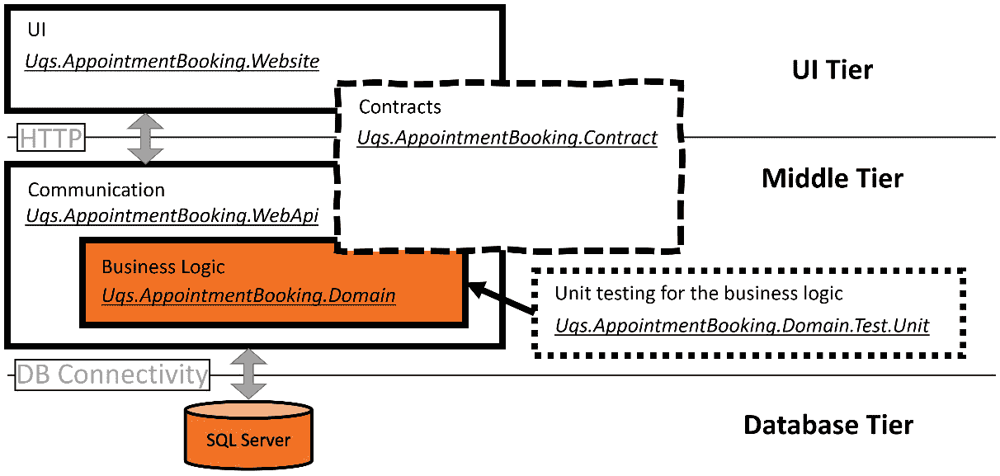
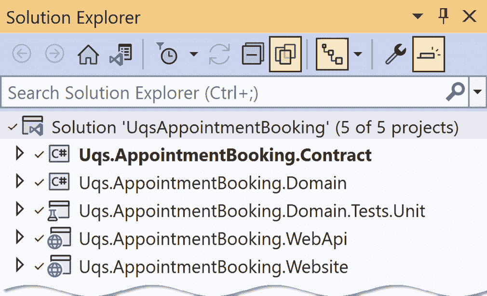
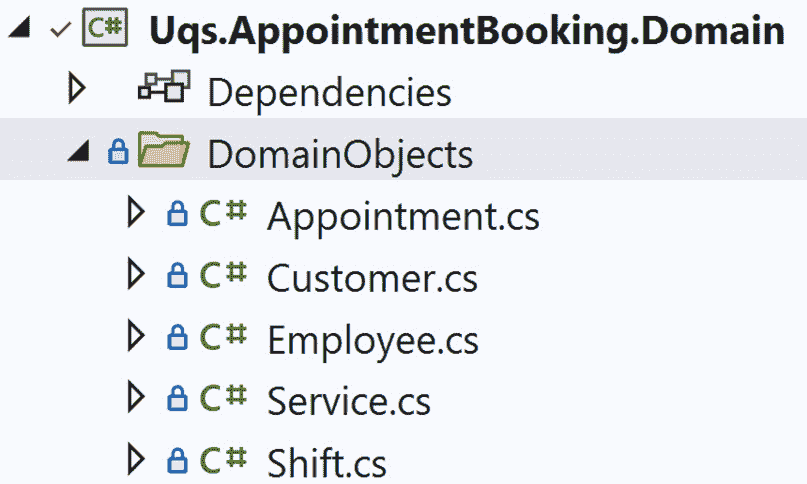
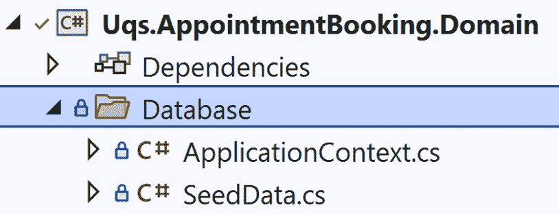
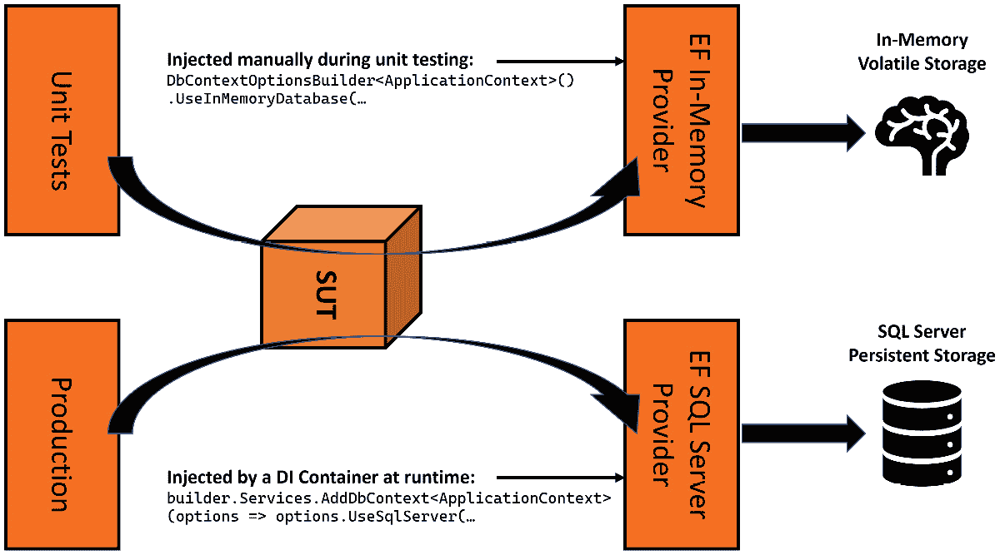
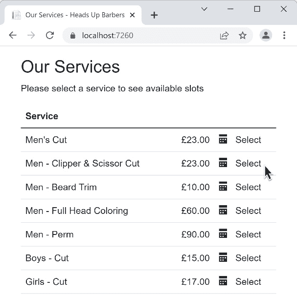

# 9

# 使用 Entity Framework 和关系型数据库构建预约预订应用

在上一章中，我们概述了为名为 Heads Up Barbers 的理发店构建预约预订系统的技术规范和设计决策。本章是*第八章*，*设计预约预订应用*的延续，因此我强烈建议您首先熟悉那章的内容。

本章将采用 TDD 风格实现需求，并使用**Entity Framework**（**EF**）和 SQL Server。实现将适用于其他**关系型数据库管理系统**（**RDBMSs**）如 Oracle DB、MySQL、PostgreSQL 等。

如果您是关系型数据库的粉丝或者在您的工作中使用关系型数据库，那么这一章就是为您准备的，而如果您使用的是文档数据库，那么您可能想要跳过这一章，直接进入下一章。第九章*Chapter 9*和第十章*Chapter 10*都有相同的成果，但它们使用不同类型的后端数据库。

我假设您熟悉 EF 以及它的配置和使用。然而，如果您不熟悉，我鼓励您首先熟悉它。

在本章中，我们将涵盖：

+   规划代码和项目结构

+   使用 TDD 实现 WebApis

+   回答常见问题

到本章结束时，您将体验使用模拟和伪造进行 TDD 的端到端应用程序的实现。同时，您还将见证编写单元测试之前的分析过程。

## 技术要求

本章的代码可以在以下 GitHub 仓库中找到：

[`github.com/PacktPublishing/Pragmatic-Test-Driven-Development-in-C-Sharp-and-.NET/tree/main/ch09`](https://github.com/PacktPublishing/Pragmatic-Test-Driven-Development-in-C-Sharp-and-.NET/tree/main/ch09)

要运行项目，您需要安装 SQL Server 的一个版本。这可以是 Azure SQL、SQL Server Express LocalDB 或任何其他 SQL Server 版本。

实现过程中没有使用任何高级 SQL Server 功能，因此您可以自由使用任何功能。我已经使用 SQL Server Express LocalDB 测试了应用程序。您可以在以下链接中了解更多信息：

[`docs.microsoft.com/en-us/sql/database-engine/configure-windows/sql-server-express-localdb`](https://docs.microsoft.com/en-us/sql/database-engine/configure-windows/sql-server-express-localdb)

您也可以使用任何其他 RDBMS，但您需要在代码中将数据库提供者更改为使用特定的.NET 数据库提供者。

要运行项目，您必须修改`Uqs.AppointmentBooking.WebApi/AppSettings.json`中的连接字符串以指向您的特定数据库实例。目前，它设置为：

```cs
"ConnectionStrings": {
  "AppointmentBooking": "Data 
    Source=(localdb)\\ProjectModels;Initial     
    Catalog=AppointmentBooking;Integrated Security=True;…"
},
```

连接字符串指向`LocalMachine`，并将连接到名为`AppointmentBooking`的数据库。

如果你决定使用替代的关系型数据库管理系统（RDBMS），那么你将不得不在`Uqs.AppointmentBooking.WebApi`中安装相关的 NuGet 包，并将同一项目中`Program.cs`的以下代码更改为你的特定 RDBMS：

```cs
builder.Services
    .AddDbContext<ApplicationContext>(options =>
    options.UseSqlServer(
        builder.Configuration
          .GetConnectionString("AppointmentBooking")
    ));
```

之前的数据库配置步骤是可选的。你可以不使用数据库来实现本章的要求，但你将无法运行项目并在浏览器中与之交互。

# 规划代码和项目结构

在*第八章*“设计预约预订应用”中，我们规划了领域并分析了我们需要做什么。项目架构将遵循客户端应用（网站）、业务逻辑（Web API）和数据库（SQL Server）的经典三层应用。让我们将其转换为 VS 解决方案和项目。

在本节中，我们将创建解决方案，创建项目，并连接组件。

## 分析项目结构

让一组资深开发者提出一个项目结构，你最终会得到多个结构！在本节中，我们将讨论一种我多年来开发的项目结构组织方法。

由于我们首先将构建一个面向用户的网站，然后是一个移动应用（本书未涵盖），因此将业务逻辑隔离到一个可以被网站和移动应用共享的 WebApi 项目中是有意义的。因此，我们将基于 Blazor WebAssembly 构建一个名为`Uqs.AppointmentBooking.Website`的网站项目。

领域逻辑将以 API 的形式公开，因此我们将创建一个名为`Uqs.AppointmentBooking.WebApi`的 ASP.NET API 项目用于 API。

前两个项目需要在一个称为`Uqs.AppointmentBooking.Contracts`的约定结构中交换数据。此项目将由网站和 WebApi 项目引用。

WebApi 项目将网络请求转换为我们可以用 C#理解的内容。从技术角度来说，这将管理基于 RESTful 风格的 API 的 HTTP 通信层。因此，WebApi 项目将不包含业务逻辑。业务逻辑将位于我们的领域项目中。我们将创建一个名为`Uqs.AppointmentBooking.Domain`的领域项目。

你的业务逻辑将存在于两个地方——UI 和领域层。UI 业务逻辑将管理 UI 功能，如切换下拉菜单、锁定日历日、响应拖放操作以及启用/禁用按钮等。这种逻辑将存在于网站项目中。编写代码使用的语言取决于所使用的 UI 框架，例如 Angular、React 和 Blazor。通常，你不会使用 TDD 来实现 UI 项目的功能，但你可以使用单元测试。在我们的实现中，UI 层将包含少量代码，因此我们不会进行任何 UI 单元测试。

复杂的业务逻辑将存在于域层，我们将遵循 TDD 的概念来编写它。因此，我们将创建一个项目来保存我们的域单元测试，并将其命名为 `Uqs.AppointmentBooking.Domain.Tests.Unit`。

为了将这些项目置于正确的视角并将它们映射到我们的三层架构，我们可以有以下图示：



图 9.1 – 项目与应用设计之间的关系

之前的图示显示了每个项目提供的功能，以形成三层应用程序。让我们首先创建 VS 解决方案结构。

## 创建项目和配置依赖关系

这是不可避免的枯燥部分，创建解决方案和项目并将它们链接在一起。在下一节中，我们将采用命令行方法而不是 UI 方法。

注意

我已经将一个名为 `create-projects.bat` 的文本文件添加到项目源代码控制中，其中包含所有命令行，因此您不必手动编写它们。您可以将此文件复制并粘贴到您想要的目录中，然后从您的命令行执行该文件。

以下是需要创建您的 VS 解决方案及其项目的命令列表：

+   从您的操作系统控制台导航到您想要创建新解决方案的目录，并执行以下命令以创建解决方案文件：

    ```cs
    md UqsAppointmentBooking
    cd UqsAppointmentBooking
    dotnet new sln
    ```

+   执行此操作以创建项目，并注意我们为每个项目使用不同的模板：

    ```cs
    dotnet new blazorwasm -n Uqs.AppointmentBooking.Website
    dotnet new webapi -n Uqs.AppointmentBooking.WebApi
    dotnet new classlib -n Uqs.AppointmentBooking.Contract
    dotnet new classlib -n Uqs.AppointmentBooking.Domain
    dotnet new xunit -n 
      Uqs.AppointmentBooking.Domain.Tests.Unit
    ```

+   将项目添加到解决方案中：

    ```cs
    dotnet sln add Uqs.AppointmentBooking.Website
    dotnet sln add Uqs.AppointmentBooking.WebApi
    dotnet sln add Uqs.AppointmentBooking.Contract
    dotnet sln add Uqs.AppointmentBooking.Domain
    dotnet sln add Uqs.AppointmentBooking.Domain.Tests.Unit
    ```

+   现在，让我们设置项目之间的依赖关系：

    ```cs
    dotnet add Uqs.AppointmentBooking.Website reference
      Uqs.AppointmentBooking.Contract
    dotnet add Uqs.AppointmentBooking.WebApi reference
      Uqs.AppointmentBooking.Contract
    dotnet add Uqs.AppointmentBooking.Domain reference
      Uqs.AppointmentBooking.Contract
    dotnet add Uqs.AppointmentBooking.WebApi reference
      Uqs.AppointmentBooking.Domain
    dotnet add Uqs.AppointmentBooking.Domain.Tests.Unit 
      reference Uqs.AppointmentBooking.Domain
    ```

最后一点是向项目添加所需的 NuGet 包。域项目将使用 EF 与 SQL Server 数据库通信。`Microsoft.EntityFrameworkCore.SqlServer` 包允许所需的库连接到 SQL Server。要将此库添加到 `Domain` 项目中，请使用以下命令：

```cs
dotnet add Uqs.AppointmentBooking.Domain package 
    Microsoft.EntityFrameworkCore.SqlServer
```

+   单元测试项目将需要 *NSubstitute* 进行模拟，因此让我们添加其 NuGet：

    ```cs
    dotnet add Uqs.AppointmentBooking.Domain.Tests.Unit 
        package NSubstitute
    ```

+   我们将使用模拟来测试 EF 的双倍。这个模拟将创建一个内存数据库，这将使我们的测试编写更容易。我们将在本章后面详细讨论这个问题，但现在，让我们添加这个模拟库：

    ```cs
    dotnet add Uqs.AppointmentBooking.Domain.Tests.Unit
        package Microsoft.EntityFrameworkCore.InMemory
    ```

为了视觉检查，您可以使用 VS 打开解决方案文件，它应该看起来像这样：



图 9.2 – VS 解决方案资源管理器视图

在这个阶段，您的解决方案结构应该看起来类似。

现在项目结构已经就绪，我们将修改代码。

## 设置域项目

从 *第八章* 的域分析，*设计预约应用程序*，我们已经创建了一个域对象的列表。我将不会再次过目它们；我将在 `Domain` 项目下的 `DomainObjects` 中创建并添加它们：



图 9.3 – 添加了领域对象

这些只是没有业务逻辑的数据结构。以下是其中之一，`Customer`领域对象的源代码：

```cs
namespace Uqs.AppointmentBooking.Domain.DomainObjects;
public class Customer
{
    public int Id { get; set; }
    public string? FirstName { get; set; }
    public string? LastName { get; set; }
}
```

您可以在线查看本章 GitHub 仓库中的其余文件。

接下来是连接本章的重点，EF。

## 连接 Entity Framework

我们将使用 EF 将每个领域对象存储在具有相同名称但复数的数据库表中，这是 EF 的默认行为。因此，`Customer`领域对象在数据库中将有一个对应的`Customers`表。

在本章中，我们不会在 EF 中进行太多自定义，因为我们的目的是专注于 TDD，在这里做的小设置只是琐事，你可以在配套代码中找到它们。

在`Domain`项目中，我添加了一个名为`Database`的目录来包含我们的 EF 相关类。我们需要两个类，`ApplicationContext`类和`SeedData`类：



图 9.4 – 添加了 EF 文件

在下一节中，我们将讨论它们的作用。

### 添加上下文类

使用 EF，您添加一个上下文类来引用所有领域对象。我把我上下文类命名为`ApplicationContext`，并遵循基本的 EF 实践。以下是我的类：

```cs
public class ApplicationContext : DbContext
{
    public ApplicationContext(
      DbContextOptions<ApplicationContext> options) :      
      base(options){}
    public DbSet<Appointment>? Appointments { get; set; }
    public DbSet<Customer>? Customers { get; set; }
    public DbSet<Employee>? Employees { get; set; }
    public DbSet<Service>? Services { get; set; }
    public DbSet<Shift>? Shifts { get; set; }
}
```

这是 EF 的最基本设置，没有任何自定义，每个属性都映射到数据库表名。

从现在开始，我们将使用`ApplicationContext`来执行对数据库的操作。

让我们继续我们的过程，在 WebApi 中设置 EF。

### 将 EF 与 WebApi 项目连接起来

WebApi 将 EF 连接到正确的数据库提供程序，在这种情况下是 SQL Server，并在运行时将连接字符串传递给 EF。

因此，第一步是将连接字符串添加到 WebApi 的`AppSettings.js`中：

```cs
"ConnectionStrings": {
  "AppointmentBooking": "Data   
    Source=(localdb)\\ProjectModels;Initial    
    Catalog=AppointmentBooking;(…)"
},
```

显然，连接字符串可能根据您的数据库位置和配置而有所不同。

注意

在本章中，我并不关心设置多个环境，但您可能希望为不同的环境创建多个`AppSettings`，并相应地更改连接字符串。

下一步是将 WebApi 与 EF 连接起来，并为其提供连接字符串。这应该在`Program.cs`中完成，最好是在第一行`var CreateBuilder(args)`之后：

```cs
var builder = WebApplication.CreateBuilder(args);
builder.Services.AddDbContext<ApplicationContext>(o =>   
  o.UseSqlServer(builder.Configuration.GetConnectionString
    ("AppointmentBooking")));
```

这是我们连接 EF 所需的内容。然而，出于开发目的，我们可能需要一些测试数据来填充页面，使其包含一些有意义的数据。我们将在下一步做这件事。

### 添加种子数据

新创建的数据库具有空表，`seed`类旨在用示例数据预先填充表。

我不会在这里列出代码，因为这不属于本章的范围，但您可以在`Domain`项目的`Database/SeedData.cs`中查看代码。

我们刚刚完成了 WebApi 项目的设置，该项目将被网站使用，所以让我们接下来创建网站。

## 设置网站项目

本实施的第一阶段包括创建一个网站来访问 API，为用户提供 UI，这是我们在这章之前通过命令行完成的。然而，网站实现超出了本章的范围，也超出了本书的范围，因为它与 TDD 无关，所以我不打算展示代码。

虽然，我们只对一个方面感兴趣——网站对 Web APIs 有什么要求？我们需要理解这一点，以便以 TDD 的方式在`WebApis`中构建所需的功能。

我们将在本章下一节逐步回答这个问题。

在本节中，我们涵盖了项目的设置和配置方面，我们没有做任何受 TDD 影响的事情。你可能已经注意到，我多次提到了配套源代码；否则，我们就没有地方放置本章的核心，即 TDD 部分，我们将在下一部分进行。

# 以 TDD 方式实现 WebApis

要构建 WebApi 项目，我们将查看第八章中提到的每个要求，*设计一个预约预订应用*，并使用 TDD 风格提供满足这些要求的实现。

所有的要求都是以网站及其功能为依据提出的，并且它们并没有规定我们如何构建我们的 API。网站将不得不调用 WebApis 来执行任何业务逻辑，因为它无法访问数据库，并且只处理与 UI 相关的业务逻辑。

本章专门介绍 EF，原因是我们希望你们欣赏*模拟*，它不像*模拟*那样受欢迎，它们都属于测试替身家族。它还将是一个典型的.NET 解决方案示例，包括 ASP.NET Core 和关系型数据库实现。

本节中，我们将涵盖在 TDD 模式下工作，同时考虑到我们的持久化提供者 EF。

## 使用 EF 内存提供者

为了使我们在单元测试系统时生活更轻松，我们希望以优雅的方式抽象数据库。当我说优雅时，我的意思是代码更少，可读性更高。

然而，当我们测试一个具有数据库的系统时，我们面临的挑战是我们不希望在单元测试中击中真实的数据库，因为这会违背单元测试的全部目的，使其成为一种集成或 S 集成测试。相反，我们使用测试替身来抽象它。模拟是一个测试替身，它在单元测试期间用一个更适合测试目的的等效组件替换组件，我们将使用模拟来替换我们的数据库进行单元测试。

EF 有一个提供者可以访问 SQL 服务器，这是我们希望在系统运行期间在生产中使用的东西，但在单元测试中，我们无法这样做。幸运的是，EF 有一个称为内存提供者的东西，它可以在每次单元测试运行期间构建和销毁内存数据库。

在单元测试期间构建和销毁内存数据库的成本与对物理数据库进行相同操作的成本相比非常低，更不用说尝试频繁创建和删除真实数据库的成本和随机错误的可能性了（每个单元测试执行一次）。正如你可能已经猜到的，EF 内存提供程序充当了一个模拟。

在运行时，我们使用 SQL Server 提供程序，而在单元测试时，我们使用内存提供程序，我们通过依赖注入来实现这种切换：



图 9.5 – 与 EF 提供程序相关的运行时间和测试时间

之前的图示说明了在不同项目阶段注入不同的提供程序。单元测试阶段将使用 EF 内存提供程序，而在生产运行阶段，将使用适当的实际生产提供程序，即 EF SQL Server 提供程序。

### 配置内存提供程序

为了利用内存提供程序的优势，我在单元测试项目中创建了一个名为`ApplicationContextFake.cs`的文件，以下是代码：

```cs
public class ApplicationContextFake : ApplicationContext
{
    public ApplicationContextFake() : base(new 
        DbContextOptionsBuilder<ApplicationContext>()
        .UseInMemoryDatabase(databaseName:
        $"AppointmentBookingTest-{Guid.NewGuid()}")
        .Options) {}
}
```

注意，我们正在继承主要的 EF 对象`ApplicationContext`，并配置了使其成为内存选项。`ApplicationContextFake`旨在在需要`ApplicationContext`时注入到我们的单元测试中。

我们通过每次实例化模拟时附加一个 GUID 来创建一个唯一的数据库名称，`AppointmentBookingTest-{Guid.NewGuid()}`。这样做的原因是我们不希望内存提供程序具有相同的数据库名称，以避免在单元测试调用之间缓存任何数据。

从现在开始，每次我们需要在我们的单元测试中注入`ApplicationContext`时，我们将注入`ApplicationContextFake`。

### 使用构建器模式添加样本测试数据

我们将要实现的每个测试都将有一个状态。例如，我们可能有一个单独的空闲理发师或一组具有不同日程的理发师，如果我们不小心，为每个测试创建样本数据可能会变得混乱。有一种巧妙的方式来组织我们的测试样本数据。

我们可以通过一种称为构建器模式的模式来完成这项工作（不要与 GoF 构建器设计模式混淆）。构建器模式将允许我们以干净和可读的方式混合和匹配样本数据。我已经添加了一个名为`ApplicationContextFakeBuilder.cs`的文件来包含使用构建器模式的样本状态数据。为了简洁起见，我在这里包含了这个类的一部分，但你可以通过配套源代码查看完整的类：

```cs
public class ApplicationContextFakeBuilder
{
    private readonly ApplicationContextFake _ctx = new();
    private EntityEntry<Employee> _tomEmp;
    private EntityEntry<Employee> _janeEmp;
    …
    private EntityEntry<Customer> _paulCust;
    private EntityEntry<Service> _mensCut;
    private EntityEntry<Appointment> _aptPaulWithTom;
    …
    public ApplicationContextFakeBuilder WithSingleEmpTom()
    {
        _tomEmp = _ctx.Add(new Employee { 
            Name = "Thomas Fringe" });
        return this;
    }
    …
    public ApplicationContextFake Build()
    {
        _ctx.SaveChanges();
        return _ctx;
    }
}
```

这个类将准备内存样本数据。将使用这个类的单元测试将调用它的不同方法来设置正确的数据状态。这个类中有趣的是以下内容：

+   使用`With`约定来表示我们正在添加样本数据。你将在后面看到`With`方法的使用示例。

+   `With`方法返回`this`，乍一看可能有点奇怪。这里的想法是实现一种称为链式编写的编码约定，这样您就可以编写如下代码：`_ctxBldr.WithSingleService(30).WithSingleEmpTom()`。

+   `Build()`方法将把一切保存到持久化媒体（在这种情况下是内存）并返回上下文。

构建者模式在尝试设置某个组件的状态时被大量使用。您可以自由地查看配套代码以获取完整代码。*第六章*，《TDD 的 FIRSTHAND 指南》中有一个构建类的示例；您可能想看看它以加深您的理解。

## 实现第一个故事

我们需求中的第一个故事非常简单。网站将显示我们拥有的所有可用服务。由于网站将通过 RESTful API 调用从 WebApi 请求这些数据，因此领域层将有一个返回此列表的服务。让我们假设这将是我们 UI 的输出：



图 9.6 – 故事 1 需求的一个 UI

UI 层，托管在浏览器中，将需要向 WebApi 发出 RESTful 调用，这可能看起来如下：

```cs
GET https://webapidomain/services
```

这个 UI 将需要一些数据属性，这些属性应由这个 API 返回。因此，获取的 JSON 可以看起来像这样一个数组：

```cs
{    
    "ServiceId": 2,
    "Name": "Men - Clipper & Scissor Cut",
    "Duration": 30,
    "Price": 23.0
}
```

您可以看到每个部分在页面上的使用位置，但也许`ServiceId`不是很清楚。它将被用来构造`select`超链接的 URL。因此，我们现在可以设计一个合约类型来渲染这个 JSON，它可能看起来像这样：

```cs
namespace Uqs.AppointmentBooking.Contract;
public record Service(int ServiceId, string Name, 
    int Duration, float Price);
```

这个`record`合约将渲染之前的 JSON 代码。完整的返回数组合约可能看起来像这样：

```cs
namespace Uqs.AppointmentBooking.Contract;
public record AvailableServices(Service[] Services);
```

您可以在页面上找到这些合约类型和所有其他合约，在`Contract`项目中。

### 通过 TDD 添加第一个单元测试

沿着 DDD 的思路，我们将有一个名为`ServicesService`的领域服务，它将处理检索所有可用服务。因此，让我们看看这个服务的结构。我们将在`Domain`项目下的`Services`中创建它。以下是代码：

```cs
public class ServicesService
{
}
```

这里没有什么特别之处。我只是帮助 VS 理解，当我输入`ServicesService`时，它应该引导我到这个类。

注意

我已经手动添加了之前的`ServicesService`类。一些 TDD 实践者喜欢在编写单元测试时进行代码生成，而不是先编写它。只要您更有效率，任何方法都可以。我选择先创建文件，因为有时 VS 会创建这个文件在我打算放置的不同目录中。

我将创建一个名为`ServicesServiceTests`的单元测试类，代码如下：

```cs
public class ServicesServiceTests : IDisposable
{
    private readonly ApplicationContextFakeBuilder _ctxBldr
        = new();
    private ServicesService? _sut;
    public void Dispose()
    {
        _ctxBldr.Dispose();
    }
}
```

我立即添加了`ApplicationContextFakeBuilder`，因为我知道我将在单元测试中处理样本数据。

现在，我需要考虑我需要从我的服务中得到什么，并据此构建一个单元测试。最直接的方法是选择最简单的情况。如果没有理发师服务，则不会返回任何服务：

```cs
[Fact]
public async Task
GetActiveServices_NoServiceInTheSystem_NoServices()
{
    // Arrange
    var ctx = _ctxBldr.Build();
    _sut = new ServicesService(ctx);
    // Act
    var actual = await _sut.GetActiveServices();
    // Assert
    Assert.True(!actual.Any());
}
```

我在测试中决定将有一个名为`GetActiveServices`的方法，当调用此方法时，它将返回一个活跃服务的集合。在这个阶段，代码无法编译；因此，不存在该方法。我们已经得到了 TDD 的失败！

现在，我们可以指示 VS 生成这个方法，然后我们可以编写实现：

```cs
public class ServicesService
{
    private readonly ApplicationContext _context;
    public ServicesService(ApplicationContext context)
    {
        _context = context;
    }
    public async Task<IEnumerable<Service>> 
        GetActiveServices()
          => await _context.Services!.ToArrayAsync();
}
```

这是通过 EF 获取所有可用服务，因为我们没有在样本数据中存储任何服务，所以没有返回任何服务。

如果你再次运行测试，它将通过。这是我们 TDD 的测试通过。由于这是一个简单的实现，不需要重构阶段。恭喜你，你已经完成了你的第一个测试！

注意

这个测试很简单，看起来像是在浪费时间。然而，这是一个有效的测试用例，它还帮助我们创建我们的领域类并注入正确的依赖项。从一个简单的测试开始，有助于稳步推进。

### 通过 TDD 添加第二个单元测试

我们需要添加的第二个功能是只获取活跃的服务，而不是那些不再活跃的服务，因为理发师不再提供它们。所以，让我们从这个单元测试开始：

```cs
[Fact]
public async Task 
  GetActiveServices_TwoActiveOneInactiveService_TwoServices()
{
    // Arrange
    var ctx = _ctxBldr
        .WithSingleService(true)
        .WithSingleService(true)
        .WithSingleService(false)
        .Build();
    _sut = new ServicesService(ctx);
    var expected = 2;
    // Act
    var actual = await _sut.GetActiveServices();
    // Assert
    Assert.Equal(expected, actual.Count());
}
```

我们的`Arrange`将添加三个服务——两个活跃和一个不活跃。看看`WithSingleService`的代码很有趣：

```cs
public ApplicationContextFakeBuilder WithSingleService
    (bool isActive)
{
    _context.Add(new Service{ IsActive = isActive });
    return this;
}
```

如果我们运行测试，当然会失败，因为我们没有为我们的服务添加任何过滤功能。让我们继续为服务添加过滤功能：

```cs
public async Task<IEnumerable<Service>> GetActiveServices()
    => await _context.Services!.Where(x => x.IsActive)
                               .ToArrayAsync();
```

我们添加了一个`Where` LINQ 语句，这将解决问题。再次运行测试，这个测试应该会通过。

这是一个简单的需求。实际上，所有故事都很直接，除了第 5 个故事。我们不会在这里列出其他故事，因为它们很相似，但你可以从配套源代码中找到它们。相反，我们将专注于第 5 个故事，因为它的复杂性符合现实生活中的生产代码，并揭示了 TDD 的主要好处。

## 实现第 5 个故事（时间管理）

这个故事是关于一个时间管理系统。它试图公平地管理理发师的时间，考虑到休息时间。如果你花点时间思考这个故事，它很复杂，有很多边缘情况。

这个故事揭示了 TDD 的力量，因为它将帮助你找到一个起点，并添加少量增量步骤来构建需求。当你完成时，你会注意到你已经在单元测试中自动记录了故事。

在接下来的章节中，我们将找到一种从更容易实现的情况开始，逐步过渡到更复杂的测试情况的方法。

### 检查记录

一种温和的开始实现的方法是检查方法的签名，这会让我们思考。

从逻辑上讲，为了确定员工的可用性，我们需要通过使用`employeeId`和所需的时间长度来知道这位员工是谁。长度可以通过`serviceId`从服务中获取。方法的一个合理名称可以是`GetAvailableSlotsForEmployee`。我们的第一个单元测试就是这个：

```cs
[Fact]
public async Task 
  GetAvailableSlotsForEmployee_ServiceIdNoFound_
    ArgumentException()
{
    // Arrange
    var ctx = _contextBuilder
        .Build();
    _sut = new SlotsService(ctx, _nowService, _settings);
    // Act
    var exception = await 
        Assert.ThrowsAsync<ArgumentException>(
        () => _sut.GetAvailableSlotsForEmployee(-1));
    // Assert
    Assert.IsType<ArgumentException>(exception);
}
```

它无法编译；这是一个失败。因此，在`SlotsService`中创建方法：

```cs
public async Task<Slots> GetAvailableSlotsForEmployee(
    int serviceId)
{
    var service = await _context.Services!
        .SingleOrDefaultAsync(x => x.Id == serviceId);
    if (service is null)
    {
        throw new ArgumentException("Record not found",
        nameof(serviceId));
    }
    return null;
}
```

现在你已经有了实现，再次运行测试，它们将会通过。你也可以对`employeeId`做同样的事情，就像我们对`serviceId`所做的那样。

### 从最简单的场景开始

让我们从添加最简单的业务逻辑开始。假设系统有一个名叫 Tom 的员工。Tom 在系统中没有可用的班次。此外，系统中只有一个服务：

```cs
[Fact]
public async Task GetAvailableSlotsForEmployee_
  NoShiftsForTomAndNoAppointmentsInSystem_NoSlots()
{
    // Arrange
    var appointmentFrom = 
        new DateTime(2022, 10, 3, 7, 0, 0);
    _nowService.Now.Returns(appointmentFrom);
    var ctx = _contextBuilder
        .WithSingleService(30)
        .WithSingleEmployeeTom()
        .Build();
    _sut = new SlotsService(ctx, _nowService, _settings);
    var tom = context.Employees!.Single();
    var mensCut30Min = context.Services!.Single();
    // Act
    var slots = await 
        _sut.GetAvailableSlotsForEmployee(
        mensCut30Min.Id, tom.Id);
    // Assert
    var times = slots.DaysSlots.SelectMany(x => x.Times);
    Assert.Empty(times);
}
```

这将失败，因为无论输入是什么，该方法都会返回`null`。我们需要继续向解决方案中添加代码片段。我们可以从以下代码开始：

```cs
…
var shifts = _context.Shifts!.Where(
    x => x.EmployeeId == employeeId);
if (!shifts.Any())
{
    return new Slots(Array.Empty<DaySlots>());
}
return null;
```

之前的代码正是通过测试所必需的。现在测试是绿色的。

### 提高场景的复杂性

其余的单元测试遵循略微提高测试场景复杂性的相同方式。以下是一些你可能想要添加的其他场景：

```cs
[Theory]
[InlineData(5, 0)]
[InlineData(25, 0)]
[InlineData(30, 1, "2022-10-03 09:00:00")]
[InlineData(35, 2, "2022-10-03 09:00:00", 
  "2022-10-03 09:05:00")]
public async Task GetAvailableSlotsForEmployee_
OneShiftAndNoExistingAppointments_VaryingSlots(
    int serviceDuration, int totalSlots, 
      params string[] expectedTimes)
{
…
```

之前的测试实际上是多个测试（因为我们使用了`Theory`），每个`InlineData`都提高了复杂性。像往常一样，先做红色，再做绿色，以便在添加另一套测试之前通过：

```cs
public async Task GetAvailableSlotsForEmployee_
  OneShiftWithVaryingAppointments_VaryingSlots(
    string appointmentStartStr, string appointmentEndStr, 
    int totalSlots, params string[] expectedTimes)
{
…
```

这也是一个带有多个`InlineData`的测试。显然，我们无法在这里放入所有代码，所以请查看`SlotsServiceTests.cs`以获取完整的单元测试。

当你开始添加更多的测试用例时，无论是使用带有`InlineData`的`Theory`还是使用`Fact`，你都会注意到实现中的代码复杂性正在上升。这是完全可以的！但是，你是否觉得可读性正在下降？那么，是时候重构了。

现在你有了单元测试的优势，它们可以保护代码不被破坏。当方法做你想让它做的事情时进行重构是红-绿-重构咒语的一部分。实际上，如果你查看`SlotsService.cs`，我确实重构了，通过创建多个私有方法来提高可读性。

这个故事很复杂，我必须承认。我本可以选择一个更容易的例子，大家都会很高兴，但现实生活中的代码有起有落，复杂性各异，所以我想要包含一个符合书籍实用主义主题的复杂场景。

在本节之后，你可能会有一些问题。我希望我能在下面回答一些。

# 回答常见问题

现在我们已经编写了单元测试和相关的实现，让我解释一下这个过程。

## 这些单元测试足够吗？

这个问题的答案取决于你的目标覆盖率以及你对所有情况都被覆盖的信心。有时，添加更多的单元测试会增加未来的维护开销，所以随着经验的积累，你会找到正确的平衡点。

## 为什么我们没有对控制器进行单元测试？

控制器不应该包含业务逻辑。我们将所有逻辑推送到服务中，然后测试服务。控制器中剩下的只是将不同类型映射到彼此的最小代码。查看`Uqs.AppointmentBooking.WebApi/Controllers`中的控制器，以了解我的意思。

单元测试在测试业务逻辑或存在条件和分支的区域方面表现出色。我们选择编码风格中的控制器没有这些。

控制器应该被测试，但通过不同类型的测试。

## 我们测试系统足够了吗？

不，我们没有！我们完成了单元测试部分。我们没有测试控制器或系统的启动（`Program.cs`的内容）以及其他一些小的代码。

我们没有通过单元测试测试它们，因为它们不是业务逻辑。然而，它们需要测试，但单元测试不是检查这些区域质量的最佳测试类型。你可以通过其他类型的测试来覆盖这些区域，例如集成测试、S 集成测试和系统测试。

## 我们省略了一些区域的测试，如何实现高覆盖率？

代码的一些区域没有进行单元测试，例如`Program.cs`和控制器。如果你目标是实现高代码覆盖率，例如 90%，你可能无法仅通过单元测试实现，因为这里有很多代码，在这一章中。

仅通过单元测试实现覆盖率是不公平的，因为你需要额外的测试类型来实现更多的覆盖率，否则开发者可能会通过添加无意义的测试来提高覆盖率。这些测试弊大于利，因为它们将增加维护负担。

覆盖率计算应包括其他类型的测试，而不仅仅是依赖单元测试。如果是这样，90%是一个现实的目标，并且可以导致高质量的产品。

有时候很难配置覆盖率测量工具来测量多种测试类型的总和，因此在这种情况下，将你的代码覆盖率目标降低到大约 80%左右是有意义的。

# 摘要

我们通过使用 EF 和 SQL Server 设置系统，然后通过逐步添加单元测试并随着每个额外单元测试的增加复杂性来逐步构建，实现了实现真实故事的实现。

我们看到了一个现实中的模拟测试双例和一个具体的构建器来构建我们的样本数据。

我们不得不选择多个重要场景来鼓励你检查完整的源代码，否则页面将会充满代码。

如果你已经阅读并理解了代码，那么我向你保证，这是复杂性的顶峰，因为其他章节应该更容易阅读和遵循。所以恭喜你，你已经通过了这本书的难点部分！我相信你现在可以继续使用 EF 和关系型数据库开始你的基于 TDD 的项目。

希望这一章能为你开启基于 EF 和 SQL Server 的新项目提供指导。下一章将进行相同的实现，但专注于文档数据库，并且与这一章的模式不同。
