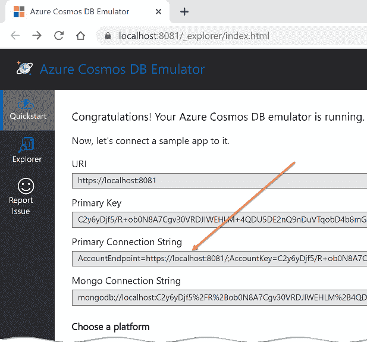
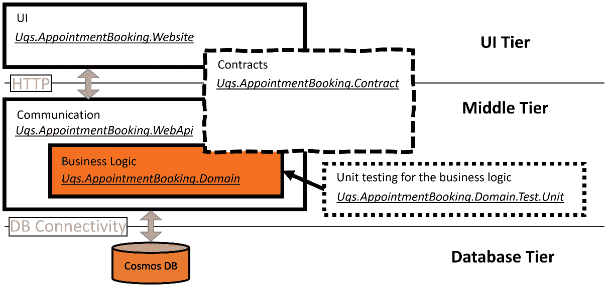
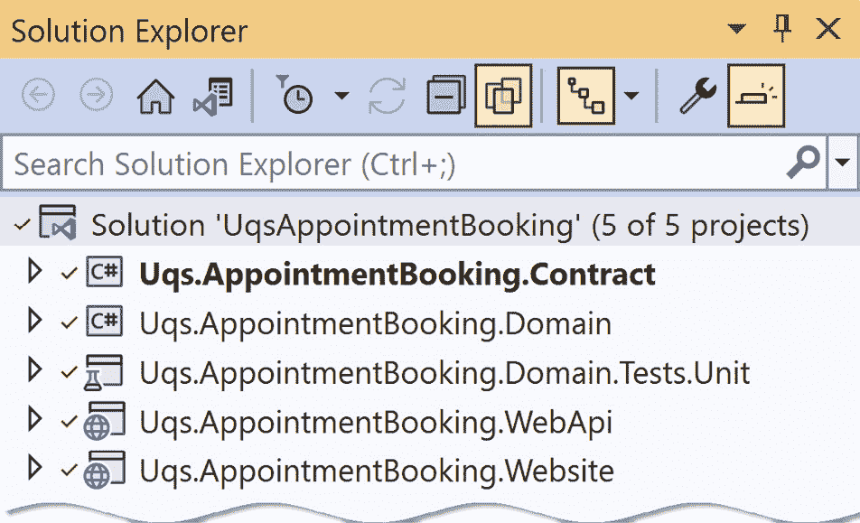
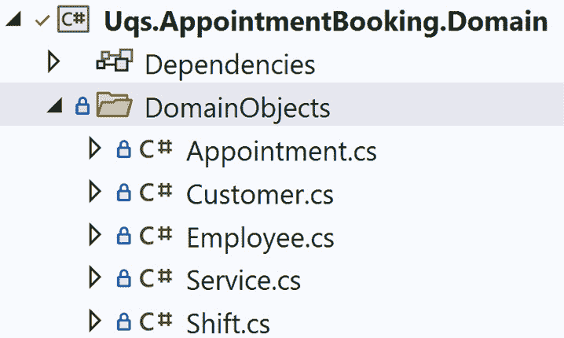
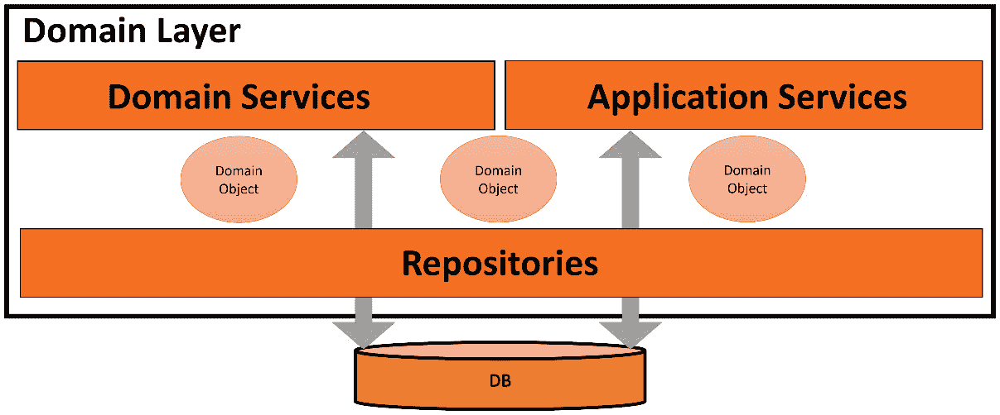
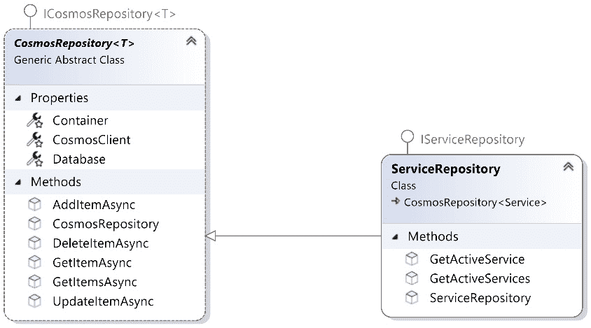
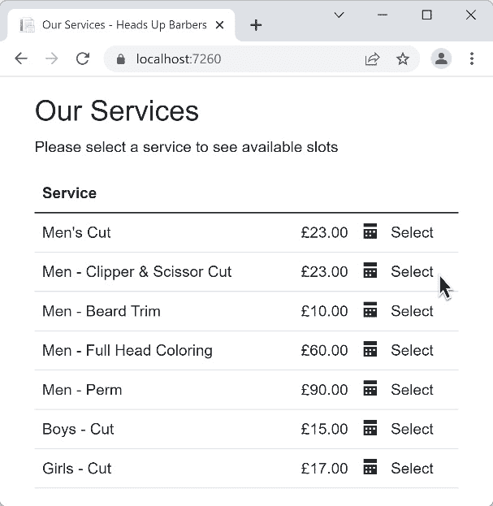

# 使用存储库和文档数据库构建应用程序

在*第八章*中，*设计预约预订应用程序*，我们制定了为名为 Heads Up Barbers 的理发店构建预约预订系统的技术规范和设计决策。本章是*第八章*的延续，因此我强烈建议您首先熟悉它。

本章将按照 TDD 风格实现需求，并使用存储库模式与**Azure Cosmos DB**一起使用。实现将适用于其他**文档数据库**，即**NoSQL**，如**MongoDB**、**Amazon DynamoDB**、**GCP Firestore**和其他数据库。

如果您是文档数据库的粉丝或者在工作中正在使用它，那么这一章就是为您准备的，而如果您正在使用关系数据库，那么您可能想要跳过这一章，回到上一章，*第九章*。这两章，*第九章*和*第十章*具有相同的结果，但它们使用不同的后端数据库类别。

本章假设您熟悉文档数据库服务以及文档数据库背后的理念，不一定是 Cosmos DB，因为从 TDD 的角度来看，不同数据库产品之间的实现几乎相同。

在本章中，我们将涵盖以下内容：

+   规划代码和项目结构

+   使用 TDD 实现 Web API

+   回答常见问题

到本章结束时，您将体验使用 TDD 和模拟以及文档数据库后端实现端到端应用程序的过程。您还将见证在编写单元测试之前进行的分析过程。

## 技术要求

本章的代码可以在以下 GitHub 存储库中找到：

[`github.com/PacktPublishing/Pragmatic-Test-Driven-Development-in-C-Sharp-and-.NET/tree/main/ch10`](https://github.com/PacktPublishing/Pragmatic-Test-Driven-Development-in-C-Sharp-and-.NET/tree/main/ch10)

要运行此项目，您需要安装一个 Cosmos DB 实例。这可以是以下之一：

+   在 Azure 账户下的云中运行的 Azure Cosmos DB

+   **Azure Cosmos DB 模拟器**，可以在 Windows、Linux 和 macOS 上本地安装，并可以从 Docker 运行

实现不使用任何高级 Cosmos 功能，因此您可以自由使用任何 Cosmos 版本。我已经在 Windows 本地使用 Azure Cosmos DB 模拟器测试了应用程序。您可以在以下链接中了解更多信息：

[`docs.microsoft.com/en-us/azure/cosmos-db/local-emulator`](https://docs.microsoft.com/en-us/azure/cosmos-db/local-emulator%0D)

安装本地模拟器后，您需要获取连接字符串，您可以通过浏览到`https://localhost:8081/_explorer/index.xhtml`并从**主连接字符串**字段复制连接字符串来完成此操作：



图 10.1 – 查找 Cosmos DB 连接字符串

要运行项目，你必须将连接字符串设置为 `Uqs.AppointmentBooking.WebApi/AppSettings.json` 中的特定数据库实例，如下所示：

```cs
"ConnectionStrings": {
  "AppointmentBooking": "[The primary connection string]"
},
```

连接字符串指向 `LocalMachine` 并连接到名为 `AppointmentBooking` 的数据库。

注意

在本章中，我并不关心设置多个环境，但你可能希望为不同的环境创建多个 `AppSettings` 并相应地更改连接字符串。

之前的数据库配置步骤是可选的。你可以不使用数据库来实现本章的要求，但你将无法运行项目并在浏览器中与之交互。

# 规划代码和项目结构

在*第八章*，*设计预约应用*，我们规划了我们的领域并分析了我们需要做什么。项目架构将遵循经典的客户端应用（网站）、业务逻辑（Web API）和数据库（Cosmos DB）的三层应用。让我们将其转换为 VS 解决方案和项目。

在本节中，我们将创建解决方案和项目，并连接组件。

## 分析项目结构

让一组高级开发者就一个项目结构达成一致，最终你可能会得到多个结构！在本节中，我们将讨论一种我多年来开发的项目结构组织方式。

由于我们首先将构建一个用户网站，然后是移动应用（本书未涵盖），因此将业务逻辑隔离到一个可以被网站和移动应用共享的 Web API 项目中是有意义的。因此，我们将基于 Blazor WebAssembly 构建一个名为 `Uqs.AppointmentBooking.Website` 的网站项目。

领域逻辑将以 API 的形式公开，因此我们将为这个项目创建一个名为 `Uqs.AppointmentBooking.WebApi` 的 ASP.NET API 项目。

之前两个项目需要在一个称为 `Uqs.AppointmentBooking.Contracts` 的约定结构中交换数据。此项目将由网站和 Web API 项目引用。

Web API 项目将 Web 请求转换为我们可以用 C# 理解的内容。从技术角度来说，这将管理我们的 HTTP 通信层，采用 RESTful 风格的 API。因此，WebApi 项目将不包含业务逻辑。业务逻辑将在我们的领域项目中。我们将创建一个名为 `Uqs.AppointmentBooking.Domain` 的领域项目。

你的业务逻辑将存在于两个地方 – UI 和领域层。UI 业务逻辑将管理 UI 功能，如切换下拉菜单、锁定日历日、响应拖放操作以及启用/禁用按钮等。这种逻辑将存在于网站项目中。

重要提示

UI 框架如 Blazor 和 Angular 作为独立应用程序。这些框架通过设计使用名为 **模型-视图-视图模型**（**MVVM**）的设计模式，这使得依赖注入和单元测试变得容易。然而，对 UI 特定元素（Blazor 中的 razor 文件）进行单元测试需要更专业的框架，如 **bUnit**。

编写代码所使用的语言取决于所使用的 UI 框架，例如 Angular、React 和 Blazor。在我们的实现中，UI 层将包含很少的代码，因此我们不会进行任何 UI 单元测试。

复杂的业务逻辑将存在于领域层，我们将按照 TDD 的概念来编写它。因此，我们将创建一个项目来保存我们的领域单元测试，并将其命名为 `Uqs.AppointmentBooking.Domain.Tests.Unit`。

为了将这些项目置于正确的视角并将它们映射到我们的三层架构，我们可以有以下的图示：



图 10.2 – 项目与应用设计之间的关系

之前的图示显示了每个项目提供的功能，以形成三层应用程序。让我们先创建 VS 解决方案结构。

## 创建项目和配置依赖项

这是无聊但不可避免的步骤，创建解决方案和项目，然后将它们链接在一起。在下一节中，我们将采用命令行方法而不是用户界面。

注意

我已经将包含所有命令行的文本文件 `create-projects.bat` 添加到项目源代码控制中，这样你就不必手动编写它们。你可以将此文件复制并粘贴到你的目标目录，然后从你的命令行执行该文件。

以下是将创建你的 VS 解决方案及其项目的命令列表：

1.  从你的操作系统控制台，导航到你想要创建新解决方案的目录，并执行以下操作以创建解决方案文件：

    ```cs
    md UqsAppointmentBooking
    cd UqsAppointmentBooking
    dotnet new sln
    ```

1.  执行此操作以创建项目，并注意我们为每个项目使用了不同的模板：

    ```cs
    dotnet new blazorwasm -n 
      Uqs.AppointmentBooking.Website
    dotnet new webapi -n Uqs.AppointmentBooking.WebApi
    dotnet new classlib -n Uqs.AppointmentBooking.Contract
    dotnet new classlib -n Uqs.AppointmentBooking.Domain
    dotnet new xunit -n
      Uqs.AppointmentBooking.Domain.Tests.Unit
    ```

1.  将项目添加到解决方案中：

    ```cs
    dotnet sln add Uqs.AppointmentBooking.Website
    dotnet sln add Uqs.AppointmentBooking.WebApi
    dotnet sln add Uqs.AppointmentBooking.Contract
    dotnet sln add Uqs.AppointmentBooking.Domain
    dotnet sln add Uqs.AppointmentBooking.Domain
      .Tests.Unit
    ```

1.  现在让我们设置项目之间的依赖关系：

    ```cs
    dotnet add Uqs.AppointmentBooking.Website reference
      Uqs.AppointmentBooking.Contract
    dotnet add Uqs.AppointmentBooking.WebApi reference
      Uqs.AppointmentBooking.Contract
    dotnet add Uqs.AppointmentBooking.Domain reference
      Uqs.AppointmentBooking.Contract
    dotnet add Uqs.AppointmentBooking.WebApi reference
      Uqs.AppointmentBooking.Domain
    dotnet add Uqs.AppointmentBooking.Domain.Tests.Unit 
      reference Uqs.AppointmentBooking.Domain
    ```

最后一步是向项目添加所需的 NuGet 包。领域项目将使用 `Microsoft.Azure.Cosmos` 包中的 Cosmos SDK 与 Cosmos DB 进行通信。将此库添加到 `Domain` 项目中，如下所示：

```cs
dotnet add Uqs.AppointmentBooking.Domain package 
  Microsoft.Azure.Cosmos
```

1.  单元测试项目将需要 `NSubstitute` 进行模拟，因此让我们添加它的 NuGet：

    ```cs
    dotnet add Uqs.AppointmentBooking.Domain.Tests.Unit 
      package NSubstitute
    ```

为了视觉检查，你可以用 VS 打开解决方案文件，它应该看起来像这样：



图 10.3 – VS 解决方案资源管理器视图

在这个阶段，你的解决方案结构应该看起来类似。

现在项目结构已经就绪，我们将修改代码。

## 设置领域项目

从 *第八章* 的领域分析，“设计预约应用”，我们已经创建了一个领域对象的列表。我不会再次过目它们；我只会创建并将它们添加到 `Domain` 项目下的 `DomainObjects`：



图 10.4 – 添加了领域对象

这些只是没有业务逻辑的数据结构。以下是其中之一，即 `Customer` 领域对象的源代码：

```cs
namespace Uqs.AppointmentBooking.Domain.DomainObjects;
public class Customer : IEntity
{
    public string? Id { get; set; }
    public string? FirstName { get; set; }
    public string? LastName { get; set; }
}
```

你可以在该章节的 GitHub 存储库中在线查看其余的文件。这是上一个类的接口：

```cs
public interface IEntity
{
    public string? Id { get; set; }
}
```

`IEntity` 是一个接口，确保所有将要持久化到文档容器的领域对象都有一个 `Id`。

注释

`Id` 是一个字符串，因为这是文档数据库所期望的，通常情况下，但并非必然，这个字符串是一个 `GUID`。

我们的文档容器和领域对象之间的关系是什么？

### 设计你的容器

我假设你已经熟悉文档数据库的基础知识，所以不会过多深入。让我首先定义一下什么是 **容器**，以便我们在本章中有一个共同的理解。容器是一个存储单元，用于存储类似类型的文档。文档数据库中的容器与关系数据库中的表具有相似的特征。

在设计容器和需要考虑的因素方面，有许多学校和观点，但本书的重点是 TDD，所以我们将保持简明扼要。显然，在 DDD 中设计，尽管有一些指导原则，但仍然是一个主观的过程。感觉我们的聚合路由 `Service`、`Employee`、`Customer` 和 `Appointment` 是成为容器的直接竞争者，所以我们将它们设置为容器。

接下来，我们需要一种方式让我们的领域服务与数据库交互。这是通过存储库模式来实现的。

## 探索存储库模式

我们现在已经定义了容器。我们只需要这些容器交互的机制。DDD 使用存储库模式来实现这一目的。让我们来了解一下模式的作用以及它在我们的应用程序中的位置。

### 理解存储库模式

存储库层是知道如何与数据库交互的代码，无论底层是什么类型的数据库（无论是 Cosmos、SQL Server、文本文件还是其他），文档、关系型或其他。这一层旨在隔离领域层，使其不必要了解数据库的具体细节。相反，领域服务将只关注要持久化的数据，而不是它们将如何被持久化。

下一个图显示了存储库作为领域层的底层：



图 10.5 – DDD 中的存储库

从图中可以看出，任何要持久化到数据库的域对象都会通过存储库层。

创建存储库的常见做法是每个容器创建一个存储库。因此，对于我们的应用程序，我们将有四个存储库：

+   `ServiceRepository`

+   `CustomerRepository`

+   `AppointmentRepository`

+   `EmployeeRepository`

由于我们必须要对实现进行单元测试，因此我们的存储库需要是单元测试就绪的。

#### 存储库和单元测试

我们突然在关于 TDD 的章节中开始讨论存储库。原因是当你想到单元测试时，首先想到的是依赖项以及如何隔离数据库。

存储库是解决这个问题的答案，因为它们应该提供将数据库转换为可注入依赖项所需的抽象。你将在本章后面清楚地看到这一点。

注意

如果你使用过像 **Entity Framework** 或 **NHibernate** 这样的对象关系映射器（ORM）与关系数据库一起工作，那么你可能没有直接使用存储库模式，因为 ORM 框架消除了使用它的需要。

你会看到我们的存储库将具有接口，这将使它们能够进行注入就绪。理论就到这里，让我给你展示一些代码。

### 实现存储库模式

现在你已经对存储库有了概念，让我们从一个例子开始。所需的存储库之一是 `ServiceRepository`，它将与服务存储库交互：



图 10.6 – 服务存储库

`ServiceRepository` 类包含添加服务、删除服务和搜索特定服务等方法。让我们从 `GetActiveService` 存储库类中随机选择一个方法：

```cs
public async Task<Service?> GetActiveService(string id)
{
  var queryDefinition = new QueryDefinition(
  "SELECT * FROM c WHERE c.id = @id AND c.isActive = true")
            .WithParameter("@id", id);
  return (await GetItemsAsync(queryDefinition))
   .SingleOrDefault();
}
```

上面的方法使用针对 Cosmos DB 的特定代码来访问数据库，并通过其 ID 返回一个服务。

注意到存储库正在实现 `IServiceRepository` 接口，这在单元测试期间会很有用。

存储库与容器交互的方式有很多重复。它存储文档，读取文档，删除文档，搜索文档，等等。因此，我们可以创建一个小的框架来嵌入这些行为，并减少重复的代码。

### 利用存储库模式框架

每次我看到一个项目访问文档数据库时，我都会注意到开发者提前创建了一个小的存储库框架来简化代码。以下是我创建的一个用于访问 Cosmos DB 的框架的摘录，即 `CosmosRepository<T>` 类，它是所有存储库的基类：

```cs
using Microsoft.Azure.Cosmos;
using Microsoft.Extensions.Options;
using System.Net;
namespace Uqs.AppointmentBooking.Domain.Repository;
public abstract class CosmosRepository<T> : 
    ICosmosRepository<T> where T : IEntity
{
    protected CosmosClient CosmosClient { get; }
    protected Database Database { get; }
    protected Container Container { get; }
    public CosmosRepository(string containerId,
    CosmosClient cosmosClient,
    IOptions<ApplicationSettings> settings)
    {
        CosmosClient = cosmosClient;
        Database = cosmosClient.GetDatabase(
            settings.Value.DatabaseId);
        Container = Database.GetContainer(containerId);
    }
    public Task AddItemAsync(T item)
    {
        return Container.CreateItemAsync(item, 
            new PartitionKey(item.Id));
    }
…
```

上面的代码为存储库提供了与数据库交互所需的基本方法，例如 `AddItemAsync`。

详细介绍 Cosmos DB 的具体细节超出了本书的范围，但代码易于阅读，你可以在源代码的 `Uqs.AppointmentBooking.Domain/Repository` 目录中找到完整的实现。

现在我们已经创建了仓库，为了开发目的，我们可能需要一些测试数据来填充页面，使其包含一些有意义的数据。我们将在下一步做这件事。

### 添加种子数据

新创建的数据库具有空容器，`seed` 类旨在预先填充表中的示例数据。

我不会在这里列出代码，因为它超出了本章的范围，但你可以在 `Database/SeedData.cs` 中的 `Domain` 项目的代码中查看。

我们刚刚完成了 `WebApi` 项目的设置，该项目将被网站使用，所以让我们创建网站。

## 设置网站项目

本实施的第一阶段包括创建一个网站来访问 API，为用户提供 UI，这是我们之前在本章中通过命令行完成的。然而，网站实现超出了本章的范围，也超出了本书的范围，因为它与 TDD 无关，所以我不打算展示代码。

尽管如此，我们感兴趣的是一方面——`网站` 需要什么 `WebApis`？我们需要理解这一点，以便以 TDD 的方式在 `WebApis` 中构建所需的功能。

我们将在本章的下一节逐步回答这个问题。

在本节中，我们完成了项目的设置和配置方面，我们没有做任何受 TDD 影响的事情。你可能已经注意到，我多次提到了配套源代码，因为我想要保持对下一节的关注，同时仍然提供源代码。

# 使用 TDD 实现 WebApis

为了构建 WebApi 项目，我们将查看来自 *第八章*，*设计预约预订应用* 的每个需求，并使用 TDD 风格提供满足这些需求的实现。

需求都是用 `网站` 和其功能来表述的，并没有规定如何构建我们的 API。`网站` 将必须调用 `WebApis` 来执行任何业务逻辑，因为它无法访问数据库，并且只处理与 UI 相关的业务逻辑。

在本节中，我们将通过 TDD 模式进行工作，考虑到我们的持久化提供者，即仓库。

## 实现第一个故事

我们需求中的第一个故事非常简单。网站将展示我们拥有的所有可用服务。由于网站将通过 RESTful API 调用从 `WebApi` 请求这些数据，因此域层将有一个服务来返回这个列表。如果网站要显示这些内容，让我们进一步挖掘：



图 10.7 – 故事 1 的需求 UI

它将需要向 WebApi 发出 RESTful 调用，这可能看起来如下所示：

```cs
GET https://webapidomain/services
```

这个 UI 将需要一些应该由这个 API 返回的数据属性。所以，获取的 JSON 可以看起来像这样一个数组：

```cs
{    
    "ServiceId": "e4c9d508-89d7-49cd-86c2-835cde94472a",
    "Name": "Men - Clipper & Scissor Cut",
    "Duration": 30,
    "Price": 23.0
}
```

你可以在页面上看到每个部分的使用情况，但也许`ServiceId`不是很清楚。它将被用来构造*Select*超链接的 URL。因此，我们现在可以设计一个将渲染此 JSON 的合约类型，它可能看起来像这样：

```cs
namespace Uqs.AppointmentBooking.Contract;
public record Service(string ServiceId, string Name, 
    int Duration, float Price);
```

这个`record`合约将渲染之前的 JSON 代码，完整的返回数组合约可能看起来像这样：

```cs
namespace Uqs.AppointmentBooking.Contract;
  public record AvailableServices(Service[] Services);
```

你可以在`Contract`项目中找到这些合约类型和所有其他合约。

### 通过 TDD 添加第一个单元测试

沿着 DDD 的思路，我们将有一个名为`ServicesService`的领域服务，它将处理检索所有可用服务。所以，让我们看看这个服务的结构。我们将在`Services`下的`Domain`项目中创建它。以下是代码：

```cs
public class ServicesService
{
}
```

这里没有什么特别的。我只是帮助 VS 理解，当我输入`ServicesService`时，它会引导我到这个类。

注意

我已经手动添加了之前的`ServicesService`类。一些 TDD 实践者喜欢在编写单元测试时生成这个文件，而不是先编写它。只要你能更高效，任何方法都可以。我选择先创建文件，因为有时候 VS 会创建这个文件在不同的目录下，而不是我想要的目录。

我将创建我的单元测试类，命名为`ServicesServiceTests`，以下代码：

```cs
public class ServicesServiceTests
{
    private readonly IServiceRepository _serviceRepository
        = Substitute.For<IServiceRepository>();
    private ServicesService? _sut;
}
```

我立即添加了`IServiceRepository`，因为我知道我将在单元测试中处理数据库，这个接口将是我模拟的依赖。

现在，我需要考虑我需要从我的服务中获取什么，并据此构建一个单元测试。最直接的方法是从最简单的情况开始。如果我们没有理发服务，则不会返回任何服务：

```cs
[Fact]
public async Task
  GetActiveServices_NoServiceInTheSystem_NoServices()
{
    // Arrange
    _sut = new ServicesService(_serviceRepository);
    // Act
    var actual = await _sut.GetActiveServices();
    // Assert
    Assert.True(!actual.Any());
}
```

我在测试中决定将有一个名为`GetActiveServices`的方法，当这个方法被调用时，它将返回一个活动服务的集合。在这个阶段，代码无法编译；因此，不存在该方法。我们已经得到了我们的 TDD 失败！

现在，我们可以指示 VS 生成这个方法，然后我们可以编写实现：

```cs
public class ServicesService
{
    private readonly IServiceRepository _serviceRepository;
    public ServicesService(
        IServiceRepository serviceRepository)
    {
        _serviceRepository = serviceRepository;
    }
    public async Task<IEnumerable<Service>> 
        GetActiveServices() => 
        await _serviceRepository.GetActiveServices();
}
```

这是通过仓库获取所有可用服务，由于仓库没有模拟返回任何服务，所以会返回一个空集合。

如果你再次运行测试，它将通过。这是我们 TDD 测试通过。由于这是一个简单的实现，不需要重构阶段，恭喜你，你已经完成了第一个测试！

注意

这个测试很简单，看起来像是在浪费时间。然而，这是一个有效的测试用例，它还帮助我们创建领域类并注入正确的依赖。从一个简单的测试开始可以帮助我们稳步前进。

### 通过 TDD 添加第二个单元测试

我们需要添加的第二个功能是获取活动服务的功能。所以，让我们从这个单元测试开始：

```cs
[Fact]
public async Task 
  GetActiveServices_TwoActiveServices_TwoServices()
{
    // Arrange
    _serviceRepository.GetActiveServices()
        .Returns(new Service[] {
            new Service{IsActive = true},
            new Service{IsActive = true},
        });
    _sut = new ServicesService(_serviceRepository);
    var expected = 2;
    // Act
    var actual = await _sut.GetActiveServices();
    // Assert
    Assert.Equal(expected, actual.Count());
}
```

这里有趣的是我们模拟`GetActiveServices`存储库方法的方式。当服务调用它时，该方法被模拟以返回一个`Service`数组。这就是我们用数据库替换了相关存储库的方式。

如果您运行这个程序，它应该一次通过而不会失败，所以它不会先失败再通过。这只是一个偶然。在这种情况下，我会调试我的代码，看看为什么单元测试在没有我实现代码的情况下通过了，很明显，第一个单元测试的实现代码已经足够覆盖第二个场景。

这是一个简单的要求。实际上，除了第五个故事之外，所有故事都很直接。我们不会在这里列出其他故事，因为它们很相似，但您可以在配套源代码中找到它们。相反，我们将专注于第五个故事，因为它的复杂性符合现实生活中的生产代码，并且会揭示 TDD 的主要好处。

## 实现第五个故事（时间管理）

这个故事是关于一个时间管理系统。它试图公平地管理理发师的时间，考虑到休息时间。如果您花点时间思考这个故事，它很复杂，有很多边缘情况。

这个故事揭示了 TDD 的力量，因为它将帮助您找到一个起点，并添加少量增量步骤来构建需求。当您完成时，您会注意到您已经自动在单元测试中记录了故事。

在接下来的章节中，我们将找到一种方法，从更容易实现的情况开始，逐步过渡到更复杂的测试场景。

### 检查记录

一种温和的开始实现的方法是检查参数，这样我们会考虑方法的签名。

从逻辑上讲，为了确定员工的可用性，我们需要通过`employeeId`和所需时间的长度来知道这位员工是谁。长度可以通过`serviceId`从服务中获取。这个方法的一个合理的名字可以是`GetAvailableSlotsForEmployee`。我们的第一个单元测试就是这个：

```cs
[Fact]
public async Task 
  GetAvailableSlotsForEmployee_ServiceIdNoFound_
    ArgumentException()
{
    // Arrange
    // Act
    var exception = await 
        Assert.ThrowsAsync<ArgumentException>(() =>
        _sut.GetAvailableSlotsForEmployee("AServiceId"));
    // Assert
    Assert.IsType<ArgumentException>(exception);
}
```

它无法编译；这是一个失败。现在在`SlotsService`中创建方法：

```cs
public async Task<Slots> GetAvailableSlotsForEmployee(
    string serviceId)
{
    var service = await 
        _serviceRepository.GetItemAsync(serviceId);
    if (service is null)
    {
        throw new ArgumentException("Record not found", 
        nameof(serviceId));
    }
    return null;
}
```

现在您已经有了实现，再次运行测试，它们将通过。您可以为`employeeId`做同样的事情，并遵循我们对`serviceId`所做的一切。

### 从最简单的情况开始

让我们添加最简单的可能业务逻辑来开始。让我们假设系统有一个名为 Tom 的员工。Tom 在系统中没有可用的班次。此外，系统只有一个服务：

```cs
[Fact]
public async Task GetAvailableSlotsForEmployee_
  NoShiftsForTomAndNoAppointmentsInSystem_NoSlots()
{
    // Arrange
    var appointmentFrom = new DateTime(
      2022, 10, 3, 7, 0, 0);
    _nowService.Now.Returns(appointmentFrom);
    var tom = new Employee { Id = "Tom", Name = 
      "Thomas Fringe", Shifts = Array.Empty<Shift>() };
    var mensCut30Min = new Service { Id = "MensCut30Min",
      AppointmentTimeSpanInMin = 30 };
    _serviceRepository.GetItemAsync(Arg.Any<string>())
        .Returns(Task.FromResult((Service?)mensCut30Min));
    _employeeRepository.GetItemAsync(Arg.Any<string>())
        .Returns(Task.FromResult((Employee?)tom));
    // Act
    var slots = await    
      _sut.GetAvailableSlotsForEmployee(mensCut30Min.Id, 
      tom.Id);
    // Assert
    var times = slots.DaysSlots.SelectMany(x => x.Times);
    Assert.Empty(times);
}
```

您可以通过模拟来查看如何填充存储库。这就是我们设置数据库和进行依赖注入的方式。我们之所以能够这样做，是因为`SlotsService`通过存储库访问数据库，如果存储库被模拟，那么我们就替换了我们的数据库。

注意

用模拟仓库替换数据库是一个热门的面试问题，其内容类似于*如何在每次单元测试后清理数据库？* 这是一个陷阱问题，因为在单元测试期间你并不与数据库交互，而是模拟你的仓库。这个问题有多种变体。

这将失败，因为我们无论输入什么，方法都会返回`null`。我们需要继续添加代码片段来完善解决方案。我们可以从以下代码开始：

```cs
…
if (!employee.Shifts.Any())
{
    return new Slots(Array.Empty<DaySlots>());
}
return null;
```

之前的代码正是通过测试所必需的。现在测试是绿色的。

### 提高场景的复杂性

其余的单元测试以相同的方式略微提高测试场景的复杂性。以下是一些你可能想要添加的场景：

```cs
[Theory]
[InlineData(5, 0)]
[InlineData(25, 0)]
[InlineData(30, 1, "2022-10-03 09:00:00")]
[InlineData(35, 2, "2022-10-03 09:00:00", 
  "2022-10-03 09:05:00")]
public async Task GetAvailableSlotsForEmployee_
  OneShiftAndNoExistingAppointments_VaryingSlots(  
    int serviceDuration, int totalSlots, 
      params string[] expectedTimes)
{
…
```

之前的测试实际上是多个测试（因为我们使用了`Theory`），每个`InlineData`都提高了复杂性。像往常一样，先做红色测试，再做绿色测试，以便在添加另一套测试之前通过：

```cs
public async Task GetAvailableSlotsForEmployee_
  OneShiftWithVaryingAppointments_VaryingSlots(
    string appointmentStartStr, string appointmentEndStr, 
      int totalSlots, params string[] expectedTimes)
{
…
```

这也是一个包含多个`InlineData`的测试。显然，我们无法在这里放入所有代码，所以请查看`SlotsServiceTests.cs`以获取完整的单元测试。

当你开始添加更多的测试用例时，无论是使用`Theory`和`InlineData`，还是使用`Fact`，你都会注意到实现中的代码复杂性正在增加。这是正常的！你感觉可读性变差了吗？那么是时候重构了。

现在你有了单元测试保护代码不被破坏的优势。当方法做你想要它做的事情时进行重构是*红-绿-重构*格言的一部分。实际上，如果你查看`SlotsService.cs`，我确实重构了，通过创建多个私有方法来提高可读性。

这个故事很复杂，我承认。我本可以选择一个更容易的例子，大家都会很高兴，但现实生活中的代码有起有落，复杂性各异，所以我想要包含一个复杂的场景，遵循书籍的实用主义主题。

在本节之后，你可能会有一些问题。我希望我能在下面回答一些。

# 回答常见问题

现在我们已经编写了单元测试和相关的实现，让我解释一下这个过程。

## 这些单元测试足够了吗？

这个问题的答案取决于你的目标覆盖率以及你对所有情况都被覆盖的信心。有时，添加更多的单元测试会增加未来的维护开销，所以随着经验的积累，你会找到正确的平衡点。

## 为什么我们没有对控制器进行单元测试？

控制器不应该包含业务逻辑。我们将所有逻辑推送到服务中，然后测试服务。控制器中剩下的只是将不同类型映射到彼此的最小代码。查看`Uqs.AppointmentBooking.WebApi/Controllers`中的控制器，看看我的意思。

单元测试在测试业务逻辑或存在条件和分支的区域方面表现卓越。我们选择的编码风格中的控制器没有这些。

控制器应该被测试，但通过不同类型的测试。

## 为什么我们没有对代码库的实现进行单元测试？

代码库包含针对 Cosmos DB 的特定代码，其中包含最小或没有业务逻辑。那里的代码直接与 SDK 交互，测试它并不能证明任何问题，因为你将通过测试替身对框架的行为做出假设。

有时一个代码库包含一些业务逻辑，例如 `ServiceRepository` 仅选择活动服务，而不是所有服务。这个逻辑仍然很难测试，因为它嵌入在类似 SQL 的语法中，这使得单元测试变得困难。

相反，测试你的代码库以负面的方式扩大了单元测试的范围，这使得你的代码更加脆弱。

一些开发者仍然为了代码覆盖率的目的对他们的代码库进行单元测试，但这里的错误是代码覆盖率是所有类型测试的组合，而不仅仅是单元测试。你的代码库应该由不同类型的测试，如 S 集成测试来覆盖。

## 我们是否测试了系统足够？

不，我们没有！我们完成了单元测试部分。我们没有测试控制器或系统的启动（`Program.cs` 的内容）以及其他一些小的代码片段。

我们没有通过单元测试测试它们，因为它们不是业务逻辑。然而，它们需要测试，但单元测试并不是检查这些区域质量的最佳测试类型。你可以通过其他类型的测试来覆盖这些区域，例如集成测试、S 集成测试和系统测试，正如我们在 *第四章*，*使用测试替身的真实单元测试* 中讨论的那样。

## 我们省略了一些区域的测试，我们如何实现高覆盖率？

代码的一些区域没有进行单元测试，例如 `Program.cs` 和控制器。如果你目标是高代码覆盖率，例如 90%，你可能无法仅通过单元测试实现，因为这里有很多代码。

仅通过单元测试实现覆盖率是不公平的，否则开发者会通过添加无意义的测试来提高覆盖率进行作弊。这些测试弊大于利，因为它们将产生维护负担。

覆盖率计算应包括其他类型的测试，而不仅仅是依赖单元测试。如果是这样，90% 是一个现实的目标，并且可以导致高质量的产品。

有时很难配置覆盖率测量工具来测量多种测试类型的总和，因此在这种情况下，将你的编码覆盖率目标降低到大约 80% 是有意义的。因为并非所有测试都在本地运行，本地测试覆盖率工具（例如前面讨论过的 *Fine Code Coverage*），只能计算本地执行的测试覆盖率。

所以简短的回答是，你的覆盖率应该包括所有测试类型，这需要一些努力。或者你可以将覆盖率降低到仅单元测试，并追求较低的覆盖率。

# 概述

我们已经看到了通过设置具有存储库和 Cosmos DB 的系统来实现现实故事的实施，然后通过逐步添加单元测试并随着每个额外单元测试的增加复杂性来逐步构建它。

我们不得不选择多个重要场景来鼓励你检查完整的源代码。否则，页面将被代码填满。

如果你已经阅读并理解了代码，那么我向你保证，这已经是复杂性的顶峰，因为其他章节应该更容易阅读和跟随。所以恭喜你，你已经通过了这本书的难点部分！我相信你现在可以继续前进，并开始使用文档数据库进行基于 TDD 的项目。

本章以基于 TDD 的现实项目实施结束。希望通过理解这本书的这一部分，你将能够使用关系数据库或文档数据库编写你的基于 TDD 的项目。

书的下一部分将介绍如何将单元测试引入你的项目和组织，处理现有的遗留代码，并构建一个持续集成系统。我称之为有趣的部分，在那里你将你的 TDD 知识扩展。

# 第三部分：将 TDD 应用于你的项目

现在我们知道了如何使用 TDD 构建应用程序，我们想要迈出下一步。在这一部分，我们将介绍如何将单元测试与持续集成相结合，如何处理遗留项目，以及如何在你的组织中实施 TDD。以下章节包含在这一部分：

+   *第十一章*, *使用 GitHub Actions 实现持续集成*

+   *第十二章*, *处理遗留项目*

+   *第十三章*, *实施 TDD 的复杂性*
