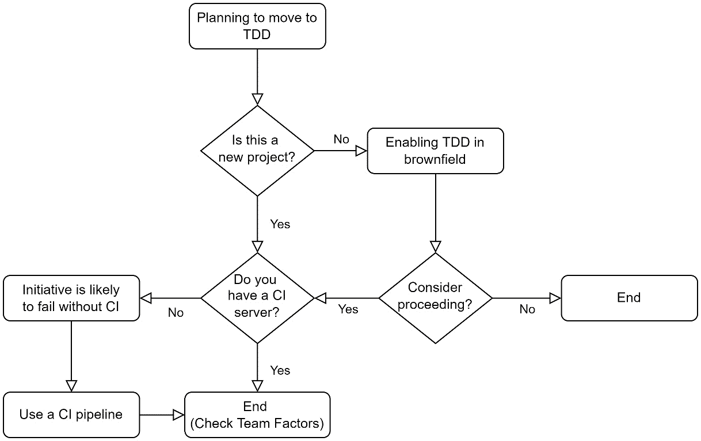
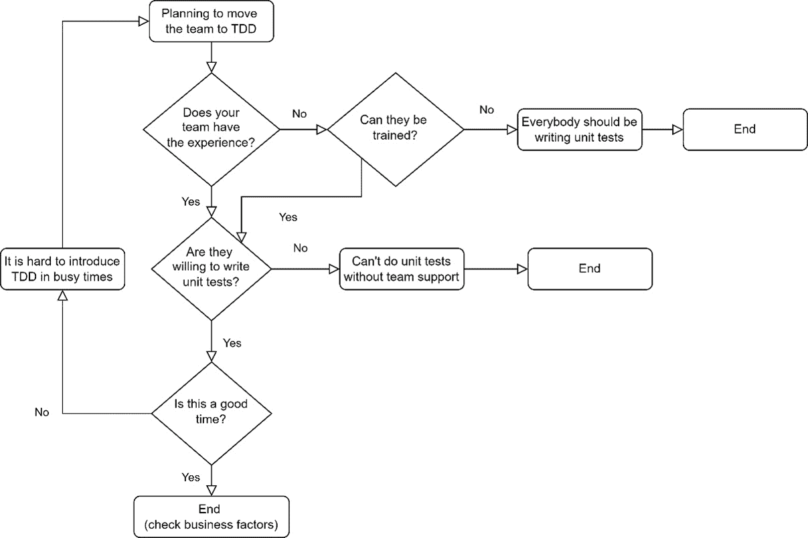
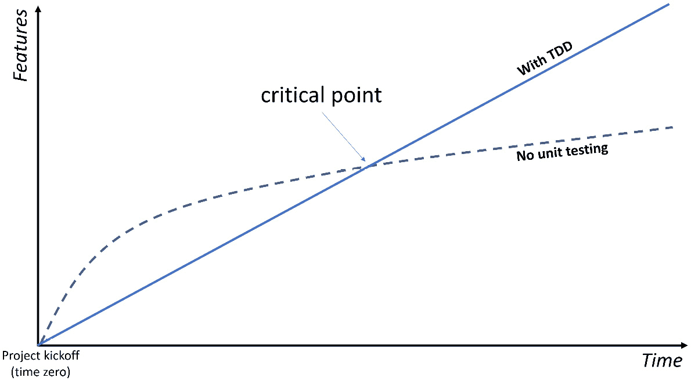
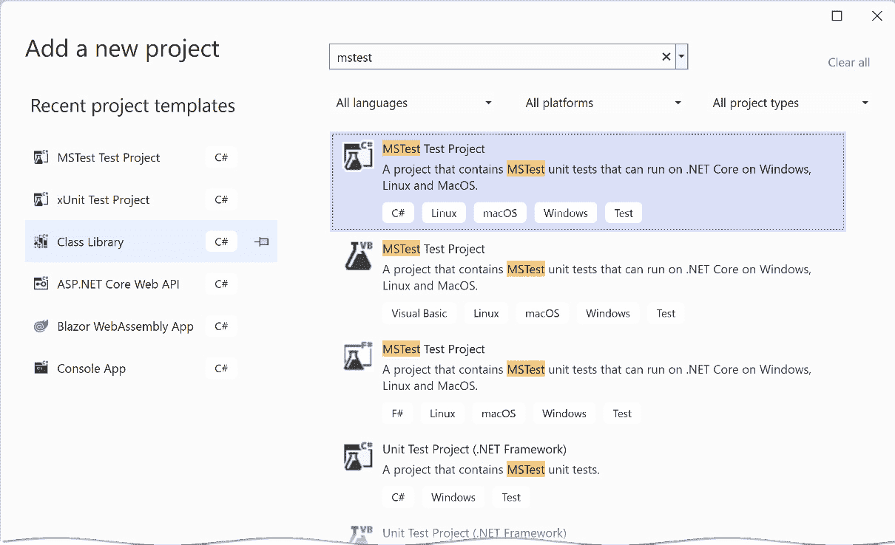
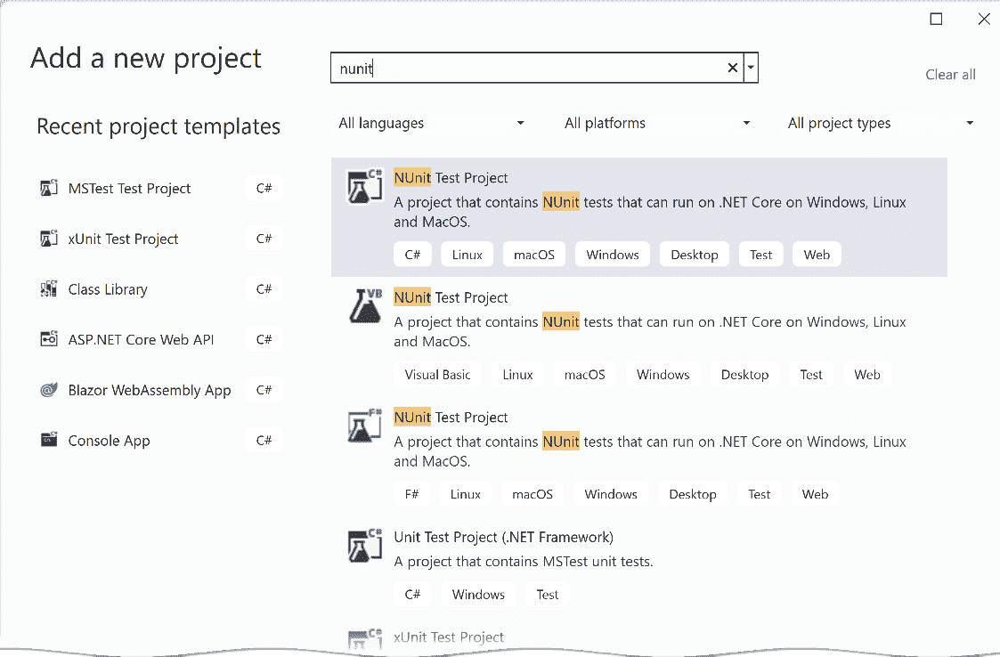
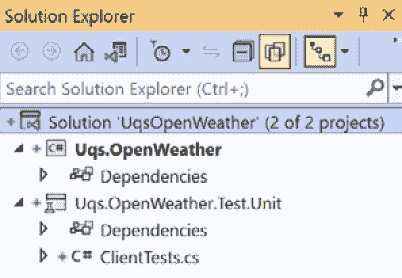

# 推广 TDD 的复杂性

我经常看到开发者投入精力试图说服业务遵循 TDD 或采用单元测试。实际上，这是我经常遇到的情况，因此我想在本章中与你分享我的经验。

在阅读这本书之后，你可能会强烈地想要在你的直接团队或大型组织中实施 TDD 以获得质量效益。到目前为止，一切顺利。第二阶段是以一种结构化的方式进行，并准备好应对业务的反对和拒绝。

我们将突出挑战，并指导你通过说服你的业务和团队采用 TDD 方法的过程。在本章中，我们将讨论以下主题：

+   技术挑战

+   团队挑战

+   业务挑战

+   TDD 论点和误解

在阅读本章之后，你将准备好向你的团队和/或业务展示一个计划，以继续实施 TDD。

# 技术挑战

在采用 TDD 之前，组织必须克服一系列技术和业务挑战。在这里，我们将涵盖技术挑战，在下一节中，我们将考虑团队挑战，然后是更广泛的组织挑战（业务挑战）。我们将从一个图表开始，以解释在你的组织中推广 TDD 的工作流程：



图 13.1 – 计划迁移到 TDD 时的技术挑战

我们将在下一小节中逐步分析这个图表，所以让我们开始吧。

## 绿色地带或棕色地带？

如果你正在从事一个棕色地带项目，前一章已经很好地介绍了技术挑战，所以我就不再深入这些挑战了。为了引入 TDD，你需要考虑努力程度、适用性和替代方案。

如果你正在启动一个新项目（一个绿色地带项目），那么你很幸运。你可以继续你的计划。

## 工具和基础设施

现在，随着云服务的可用性，拥有运行你的**持续集成**（**CI**）管道的基础设施既容易又便宜。然而，一些组织对使用云有限制，你可能会发现很难获得 CI 服务器。

如果你还没有设置 CI 服务器，那么听起来可能有些悲观，但进行 TDD 注定会失败。这是因为开发者可能会破坏单元测试，导致测试被禁用或失败。

一些开发者也喜欢投资于像**JetBrains ReSharper**这样的工具，因为它有一个高质量的测试运行器和重构功能，但这不是必需的。此外，你可能还想考虑 JetBrains Rider，因为它具有 ReSharper 的所有功能，正如本书*第一章*中讨论的那样。

然而，如果你正在使用 MS Visual Studio Professional 2022 或更高版本，你已经有了一个适合 TDD 过程的良好工具。

技术挑战并不是你需要考虑的全部。还要考虑你的团队是否准备好接受 TDD，以及你的业务挑战。让我们继续讨论团队挑战。

# 团队挑战

如果你是一个独立开发者，正在处理一个项目，那么不用担心，你可以做任何你想做的事情。然而，大多数商业项目都是由团队实施的，因此努力使用 TDD 是一个团队的决定。再次强调，让我们从一个工作流程图开始：



图 13.2 – 计划迁移到 TDD 时的团队挑战

我们将在下一节中详细讨论这个图表。让我们回顾一下在计划让你的团队迁移时需要注意的要点——无论你是希望影响团队的开发者，还是处于可以强制执行技术标准的职位。

## 团队经验

单元测试需要依赖 DI（依赖注入），而这又反过来需要 OOP（面向对象编程）的经验。你的团队成员可能对单元测试不熟悉，或者可能会将单元测试与集成测试混淆。

重要注意事项

xUnit 和 NUnit 库被广泛用于实现集成测试。因为它们有后缀**Unit**，开发者有时会错误地假设编写的测试是单元测试。我见过一些团队声称他们有单元测试，但当我检查代码时，我发现并非如此。

如果你的团队需要 TDD（测试驱动开发）的培训，那么他们需要了解 TDD 是什么，如何进行，以及 TDD 的价值。我心中有一本推荐的书，但我会让你来猜测是哪一本。

重要注意事项

我通常会在团队进行关于某个主题的会议或几场会议之前，要求他们自己阅读某些材料。培训一个团队可以通过许多方式完成，这更多与你的公司和团队文化相关。我还会在 Confluence 或其他组织用于文档的工具上记录约定和协议。

在团队中有一个理解单元测试、善于解释并能抽出时间（这可能就是你）的合格开发者是很重要的。这将是有帮助的，因为当你的团队开始进行 TDD 时，他们会有问题。

但由于许多原因，培训团队可能不是一个选择。让团队中的一些成员进行单元测试，而其他人不，将不会产生效益，因为每个人都将操作相同的代码库，所以让每个人都接受培训并准备好进行 TDD 是一个先决条件。

## 愿意

一些团队不愿意进行单元测试，无论他们觉得这很困难，还是认为这会增加开发时间，或者他们没有意识到其价值。

重要注意事项

我看到过组织强制执行单元测试，但团队不愿意编写测试，他们只是创建了一个包含无意义测试的单元测试项目，只是为了勾选“你是否实现了单元测试？”这个问题。

让团队与目标保持一致，并为了一个共同的目标进行协作，这对提高产品质量是有价值的。

如果你的团队因为任何原因不愿意采用 TDD，但单元测试是可以接受的，那么就采用它！你可以在不久之后温和地引入 TDD。它不需要全有或全无。也值得注意，一些成员可以进行 TDD，而其他人可以进行单元测试。

### 单元测试无用

我已经从许多开发者那里听到过这个论点。他们可能对单元测试的糟糕实现形成了自己的看法，或者有其他原因。当然，单元测试有一些缺点，但大多数技术也是如此。

你最好的办法是了解这种误解背后的原因，看看你是否可以解决它们。

### TDD 无用，我会做单元测试

TDD 是有争议的，有时开发者有自己的经验告诉他们 TDD 是不可用的。这是可以接受的，只要他们对单元测试感到满意，因为并非所有团队成员都必须进行 TDD。

如果不相信单元测试的开发者是在看到不良实践时构建他们的论点，那么你的工作可能就是推广良好的实践。

团队愿意遵循 TDD 对项目的成功有重要影响，因此确保每个人都站在同一条线上是很重要的。

## 时间

TDD 需要一些准备和额外的努力来获得基本的质量，遵循“没有痛苦，就没有收获”的格言。正确的时间很重要，它绝对不应该在发布时间或团队压力大的时候。

最好的时机是在项目开始时引入，但稍后引入也无妨。

一旦你通过了第一和第二次挑战，你将面临商业挑战，这可能是最困难的。

# 商业挑战

这里的商业意味着团队外的更高技术权威，他们可以执行规则。它也可以是项目经理或产品负责人。

我相信，TDD 或单元测试的成功推广是从上到下的，从管理层来说。执行可以来自：

+   开发部门负责人

+   开发经理

+   团队领导

+   技术负责人

+   IT 审计

如果这是一个个人倡议或团队倡议，在交付压力下，团队可能会考虑放弃它。然而，如果他们负责提供作为交付一部分的单元测试，包括覆盖率水平，那么它不能被忽视。

让我们从商业的角度来思考 TDD，这样我们就能更好地准备和表达我们的观点。

## TDD 的商业效益

我们很清楚从技术角度来看 TDD 的好处。但企业会更愿意从商业角度看待这些好处，所以让我们深入探讨。

### 错误更少

这显然是最大的卖点，因为没有人喜欢错误。一些企业在他们的产品中遭受了大量的缺陷，而拥有更少的缺陷无疑是受欢迎的承诺。

唯一的问题是，很难通过统计数据证明更少的错误数量——项目将从第一天开始就有单元测试，所以我们无法比较之前和之后。

### 项目的实时文档

商业界担忧的一件事是文档，它与开发人员的流动率紧密相关。风险是如果开发人员离职，一些商业知识就会丢失。为了防止这种情况，重要的是要稳健地记录商业规则，而且，坦白说，我想不出有任何工具比单元测试更适合这项工作。

项目文档包含无法由单元测试覆盖的文档，例如项目架构。然而，几个月后没有人会记住的详细业务规则将由单元测试覆盖，并且随着每个开发人员的源代码提交进行监控。

将单元测试作为文档工具来推广是非常强大的，并且会让商业界倾听你的意见。

### 测试资源较少

在过去，手动测试占据了软件开发生命周期（SDLC）的大部分。今天，随着单元测试和其他自动化测试的出现，手动测试的规模和所需手动测试人员数量都减少了。一些组织甚至完全取消了手动测试，转而采用自动化测试（包括单元测试）。

因此，单元测试的承诺是使用较少的测试人员几乎不需要回归测试时间来覆盖大量的边缘情况和业务规则。

重要提示

**回归测试**是通过现有功能来确保其仍然正常工作。这通常发生在新版本发布之前。

显然，测试资源较少意味着成本较低，而时间较少意味着更快地发布功能，这自然引出了下一个话题。

### 短周期发布的能力

今天，在更敏捷的组织中，开发模型已经转变为时不时地发布一些功能。

每次更改时都有单元测试回退代码，并且有一个 CI/CD 系统，这意味着你的软件随时可以发布。

没有哪个聪明的商人会相信上述所有好处都是免费的，所以接下来，我们将讨论单元测试的缺点。

## 从商业角度的缺点

通常，额外的质量需要更多的努力，TDD 也不例外，但幸运的是，缺点很小。

### 首次发布的轻微延迟

我们之前讨论过，不使用 TDD 的团队在初期往往交付得更快；我们曾在*第五章*，*测试驱动开发解释*中提到过这一点。这里有一个快速提醒：



图 13.3 – TDD 与无单元测试的比较

这里的想法是，编写单元测试的努力在短期内会增加开发时间，但在中期和长期内速度会更快。

这是为了质量而付出的微小代价，但请记住这一点。

### 首次发布的延迟是不可接受的

在某些情况下，企业希望尽快得到第一个版本，并且他们对此以外的内容不感兴趣。以下是一些场景：

+   产品经理希望尽快推出第一个版本，因为这可以让他们获得更高的奖金或晋升。

+   尽快发布并且不担心未来的竞争优势。这是初创公司试图生存的心态。

+   这个项目是为第三方完成的，商业方面不会因为确保额外的质量而获得额外报酬。但尽可能快地完成这是意图。

如果商业人士不感兴趣，这将很清楚，如果你了解公司使用的商业模式，你可以在事先感觉到这一点。这并不是对 TDD 的批评，但如果与这种场景混合，它将变成一个劣势。

现在我们已经讨论了 TDD 的所有挑战和优点，让我们制定一个引入 TDD 的计划。

# TDD 的论点和误解

这里有一些提示和技巧——来自我自己的经验——这些在商业人士或你的同事的对话中会反复出现。

## 单元测试，而非 TDD

在与商业人士讨论时，为了减少对话的复杂性，特别是如果商业人士不太懂技术，请使用单元测试而不是 TDD。TDD 是一个个人会自己执行的技术流程，它与商业没有直接关系，所以为什么要在讨论中增加复杂性呢？有时商业人士已经听说过 TDD 这个术语，并且对此很兴奋，所以在这种情况下使用 TDD 是正确的术语！

我的建议是，除非企业对 TDD 这个术语有偏好，否则在对话中使用单元测试。

## 单元测试不是由测试员实现的

单元测试中的“测试”一词对非技术人员来说具有误导性，因为它暗示了一个进行手动测试的测试员。我与许多商业人士都有过这样的对话。

需要明确的是，单元测试除了测试之外还有更多功能，如下所示：

+   构建项目的代码设计架构

+   在开发过程中实时记录代码

+   在违反业务规则时开发过程中的即时反馈

此外，单元测试是用 C#（或你正在使用的任何其他语言）编写的，并且是由编写代码的同一开发者实现的。一个手动测试员，很可能不会有编写这些测试的意愿或专业知识。

当企业想知道为什么你想让工程师花费宝贵的时间进行单元测试，而此时有测试员可以（正如他们最初所想）进行单元测试时，可能会引发这种论点。

## 编写和维护文档的方式

我相信有经验的商业人士会理解缺乏文档或文档过时的情况。

正如您所知，使用单元测试来记录代码提供了比基于文本的陈旧文档更新的文档，后者是编写后就被遗忘或只覆盖系统的一部分（有中也有不中）。这里的重点是最新、新鲜或实时。显然，我们是在谈论文档的一部分，您可能需要明确这一点。这是详细业务规则的部分。

## 我们有不胜任的开发者

企业有时认为他们有不胜任的开发者，这就是为什么他们会产生大量错误。我多次听到业务在谈论他们的团队时低声说出这个论点。

当我听到这个论点时，我会迅速深入挖掘，发现业务没有建立敏捷流程的结构，并且开发者因快速完成开发功能而受到奖励。我们都知道那个人，他们总是选择最短的路来完成他们的功能并向业务炫耀！

开发者是非常逻辑性的人，他们喜欢结构化和秩序。拥有 TDD 的开发流程肯定会减少错误并将事情引上正轨。

您的挑战是展示 TDD 过程和测试将如何对问题产生积极影响。

# 摘要

本章利用了本书中提供的所有知识，展示了将 TDD（测试驱动开发）推广到组织中的挑战。我希望我已经提供了足够的论据来说服团队和业务接受 TDD 的观点。

除了本章内容外，在计划推广 TDD 时，您的演讲技巧和对主题的熟悉程度将非常有用。

在这本书中，我努力提供了我实际使用过的真实框架和工具的实用示例，而不是使用抽象和过于简化的示例。我出于对这一主题的热爱和激情而写这本书，并试图保持务实，我希望我已经实现了我的目标。

尽管这本书的标题提到了 TDD，但本书包含了面向对象和良好编程实践的实用示例，我相信您在完成这本书后已经进入了高级软件工程的领域。

祝你好运，并且我很乐意了解这本书是如何帮助您或您的团队采用 TDD 的。

# 附录 1：带有单元测试的常用库

我们在整本书中使用了两个主要的单元测试库：

+   xUnit

+   NSubstitute

您的团队可能已经在使用这些库了。或者您可能已经对单元测试进行了一些实验，并希望扩大视野到更多的库。虽然这些库很受欢迎，但其他库可以替代它们或与它们并行工作。本附录将简要介绍以下库：

+   MSTest

+   NUnit

+   Moq

+   流畅断言

+   AutoFixture

所有这些库都使用 MIT 许可证，这是最宽松的许可证，您可以通过 NuGet 安装它们中的任何一个。

到本附录结束时，您将熟悉构成.NET 单元测试生态系统的库。

# 技术要求

本章的代码可以在以下 GitHub 仓库中找到：

[`github.com/PacktPublishing/Pragmatic-Test-Driven-Development-in-C-Sharp-and-.NET/tree/main/appendix1`](https://github.com/PacktPublishing/Pragmatic-Test-Driven-Development-in-C-Sharp-and-.NET/tree/main/appendix1)

# 单元测试框架

我们已经看到了 xUnit，我们也简要地讨论了 MSTest 和 NUnit。本节将让您了解这些其他框架的内容。

## MSTest

**MSTest** 以前很受欢迎，因为它在 VS 的旧版本中作为 **Visual Studio** （**VS**） 的一部分安装。在 NuGet 存在之前，使用一个 *内置* 库可以减少配置和部署时间，与添加和使用另一个框架（如 NUnit）相比。

在 NuGet 之前，安装一个新的库涉及到手动复制 DLL 文件，将它们放在正确的位置，更改一些配置，并将它们推送到源代码控制，以便团队共享相同的文件。因此，拥有预先安装的库且不需要配置的库，如 MSTest，是一种祝福。从那时起，我们已经走了很长的路。

要将 MSTest 项目添加到您的解决方案中，您也可以通过 UI 来完成：



图 A1.1 – 通过 UI 添加 MSTest

注意，有两个 C# 版本的副本。下面一个是用于经典 .NET Framework 的，上面一个是我们在 .NET Core 中使用的。

您可以通过 `dotnet` CLI 添加 MSTest：

```cs
dotnet new mstest
```

MSTest 和 xUnit 有类似的语法，所以让我向您展示 xUnit 的代码及其在 MSTest 中的等效代码。我将从 xUnit 开始：

```cs
public class WeatherAnalysisServiceTests
{
    …
    public WeatherAnalysisServiceTests()
    {
        _sut = new (_openWeatherServiceMock);
    }
    [Fact]
    public async Task GetForecastWeatherAnalysis_
        LatAndLonPassed_ReceivedByOpenWeatherAccurately()
        …
        // Assert
        Assert.Equal(LAT, actualLat);
        Assert.Equal(LON, actualLon);
    }
    …
```

MSTest 中的对应代码如下：

```cs
[TestClass]
public class WeatherAnalysisServiceTests
{
    …
    [TestInitialize]
    public void TestInitialize()
    {
        _sut = new(_openWeatherServiceMock);
    }
    [TestMethod]
    public async Task GetForecastWeatherAnalysis_
      LatAndLonPassed_ReceivedByOpenWeatherAccurately()
    {
        …
        // Assert
        Assert.AreEqual(LAT, actualLat);
        Assert.AreEqual(LON, actualLon);
    }
    …
```

您可以直接看到这两个代码片段之间的一些差异：

+   MSTest 中的单元测试类必须用 `TestClass` 装饰。

+   MSTest 中的构造函数可以工作，但标准的初始化方式是用 `TestInitialize` 装饰一个方法。

+   两个库都使用 `Assert` 类名，但类中的方法名不同；例如，xUnit 使用 `Equal` 和 `True`，而 MSTest 使用 `AreEqual` 和 `IsTrue`。

在进行多个测试时，xUnit 和 MSTest 使用不同的属性。以下是在 xUnit 中的代码：

```cs
[Theory]
[InlineData("Freezing", -1)]
[InlineData("Scorching", 46)]
public async Task GetForecastWeatherAnalysis_
   Summary_MatchesTemp(string summary, double temp)
{
…
```

在 MSTest 中，相应的代码将看起来像这样：

```cs
[DataTestMethod]
[DataRow("Freezing", -1)]
[DataRow("Scorching", 46)]
public async Task GetForecastWeatherAnalysis_
   Summary_MatchesTemp(string summary, double temp)
{
…
```

在这里，您可以注意到两个差异：

+   `Theory` 变成了 `DataTestMethod`。

+   `InlineData` 变成了 `DataRow`。

如您所见，这两个库之间没有太大的区别。此外，执行测试运行、运行测试资源管理器和其他测试活动（除了代码之外）都保持不变。

## NUnit

**NUnit** 在两千年代的前十年中曾经是主导库；它至今仍在使用，而 xUnit 正变得越来越普遍。

要将 NUnit 项目添加到您的解决方案中，您可以通过 UI 来完成：



图 A1.2 – 通过 UI 添加 NUnit

就像 MSTest 一样，NUnit 有两个.NET 版本。下面一个是用于经典.NET Framework 的，上面一个是我们在.NET Core 中使用的。

你可以通过`dotnet` CLI 添加 NUnit：

```cs
dotnet new nunit
```

NUnit 和 xUnit 有相似的语法，所以让我给你展示 NUnit 的代码及其在 MSTest 中的等效代码。我将从 xUnit 开始：

```cs
public class WeatherAnalysisServiceTests
{
    …
    public WeatherAnalysisServiceTests()
    {
        _sut = new (_openWeatherServiceMock);
    }
    [Fact]
    public async Task GetForecastWeatherAnalysis_
        LatAndLonPassed_ReceivedByOpenWeatherAccurately()
        …
        // Assert
        Assert.Equal(LAT, actualLat);
        Assert.Equal(LON, actualLon);
    }
    …
```

在 MSTest 中的等效代码如下：

```cs
public class WeatherAnalysisServiceTests
{
    …
    [Setup]
    public void Setup()
    {
        _sut = new(_openWeatherServiceMock);
    }
    [Test]
    public async Task GetForecastWeatherAnalysis_
      LatAndLonPassed_ReceivedByOpenWeatherAccurately()
    {
        …
        // Assert
        Assert.That(actualLat, Is.EqualTo(LAT));
        Assert.That(actualLon, Is.EqualTo(LON));
    }
    …
```

你可以直接在这两个代码片段中找出一些不同之处：

+   在 NUnit 中，构造函数可以工作，但标准的初始化方式是用`Setup`装饰一个方法。

+   两个库都使用`Assert`类名，但类中的方法名不同；例如，xUnit 使用`Equal`，而 NUnit 使用`AreEqual`。

+   NUnit 的风格使用流畅的接口设计，推荐测试相等的方法是使用`That`和`Is.EqualTo`。

在进行多个测试时，xUnit 和 NUnit 使用不同的类名。这段代码在 xUnit 中：

```cs
[Theory]
[InlineData("Freezing", -1)]
[InlineData("Scorching", 46)]
public async Task GetForecastWeatherAnalysis_
   Summary_MatchesTemp(string summary, double temp)
{
…
```

在 NUnit 中，等效的代码将如下所示：

```cs
[Theory]
[TestCase("Freezing", -1)]
[TestCase("Scorching", 46)]
public async Task GetForecastWeatherAnalysis_
   Summary_MatchesTemp(string summary, double temp)
{
…
```

在这里，你可以注意到`InlineData`变成了`TestCase`。除此之外，这两个库之间没有太大的区别，它们的模板包含在 VS 2022 的默认安装中。

这三个库可以互换使用，并且语法变化很小。一旦你习惯了其中一个，切换到另一个将花费极短的时间。

# 模拟库

.NET 中不缺少模拟库；然而，使用最多的两个库是 NSubstitute 和 Moq。在这本书中我们已经涵盖了大量的 NSubstitute 示例，所以让我们看看 Moq 是如何工作的。

## Moq

**Moq** 与 NSubstitute 在角色和功能上大致相同。鉴于这本书使用的是 NSubstitute，最快的方式是通过比较这两个库来引入 Moq。让我们从一个 NSubstitute 的片段开始：

```cs
private IOpenWeatherService _openWeatherServiceMock = 
    Substitute.For<IOpenWeatherService>();
private WeatherAnalysisService _sut;
private const decimal LAT = 2.2m;
private const decimal LON = 1.1m;
public WeatherAnalysisServiceTests()
{
    _sut = new (_openWeatherServiceMock);
}
[Fact]
public async Task GetForecastWeatherAnalysis_
    LatAndLonPassed_ReceivedByOpenWeatherAccurately()
{
    // Arrange
    decimal actualLat = 0;
    decimal actualLon = 0;
    _openWeatherServiceMock.OneCallAsync(
        Arg.Do<decimal>(x => actualLat = x),
        Arg.Do<decimal>(x => actualLon = x),
        Arg.Any<IEnumerable<Excludes>>(), 
        Arg.Any<Units>())
       .Returns(Task.FromResult(GetSample(_defaultTemps)));
    // Act
    await _sut.GetForecastWeatherAnalysis(LAT, LON);
    // Assert
    Assert.Equal(LAT, actualLat);
    Assert.Equal(LON, actualLon);
}
```

这个片段实例化并创建了一个从`IOpenWeatherService`生成的模拟对象，并监视了`OneCallAsync`的`lat`和`lon`输入参数。目的是确保传递给`GetForecastWeatherAnalysis`的两个参数未经修改地传递给`OneCallAsync`方法。

让我们看看使用 Moq 的相同代码：

```cs
private IOpenWeatherService _openWeatherServiceMock = 
    Mock.Of<IOpenWeatherService>();
private WeatherAnalysisService _sut;
private const decimal LAT = 2.2m;
private const decimal LON = 1.1m;
public WeatherAnalysisServiceTests()
{
    _sut = new (_openWeatherServiceMock);
}
[Fact]
public async Task GetForecastWeatherAnalysis_
    LatAndLonPassed_ReceivedByOpenWeatherAccurately()
{
    // Arrange
    decimal actualLat = 0;
    decimal actualLon = 0;
    Mock.Get(_openWeatherServiceMock)
        .Setup(x => x.OneCallAsync(It.IsAny<decimal>(),
        It.IsAny<decimal>(), 
        It.IsAny<IEnumerable<Excludes>>(),
        It.IsAny<Units>()))
        .Callback<decimal, decimal, 
        IEnumerable<Excludes>, Units>((lat, lon, _, _) => {
            actualLat = lat; actualLon = lon; })
       .Returns(Task.FromResult(GetSample(_defaultTemps)));
    // Act
    await _sut.GetForecastWeatherAnalysis(LAT, LON);
    // Assert
    Assert.Equal(LAT, actualLat);
    Assert.Equal(LON, actualLon);
}
```

这个 Moq 代码与它的 NSubstitute 竞争对手看起来并没有太大的区别。让我们分析一下它们之间的差异：

+   NSubstitute 使用`Substitute.For`方法实例化模拟对象，而 Moq 则使用`Mock.Of`。

+   NSubstitute 使用扩展方法，如`Returns`来配置模拟对象，而 Moq 则不使用扩展。

+   NSubstitute 使用`Args.Any`来传递参数，而 Moq 使用`It.IsAny`。

通常，虽然 Moq 倾向于使用 lambda 表达式语法，但 NSubstitute 则走另一条路，使用扩展方法。NSubstitute 试图让代码看起来尽可能自然，并通过减少语法来让代码更简洁，而 Moq 则依赖于 lambda 表达式的力量。

重要提示

Moq 有另一种创建模拟的方法。我选择展示现代版本。

在我看来，使用一个库还是另一个库是一个关于风格和语法偏好的问题。

# 单元测试辅助库

我看到一些开发者将这两个库添加到他们的单元测试中，以增强语法和可读性：**Fluent Assertions**和**AutoFixture**。

## Fluent Assertions

流畅实现，也称为流畅接口，试图使代码读起来像英语句子。以这个例子为例：

```cs
Is.Equal.To(…);
```

一些开发者喜欢以这种方式编写测试，因为它支持更自然的测试阅读方式。有些人有自己的原因喜欢它。

`FluentAssertions`是一个流行的库，它集成了 MSTest、Nunit 和 xUnit 等所有流行的测试框架，以启用流畅接口。您可以通过 NuGet 在单元测试项目中添加它，名称为`FluentAssertions`。

让我们看看没有和有这个库时我们的代码会怎样：

```cs
// Without
Assert.Equal(LAT, actualLat);
// With
actualLat.Should().Be(LAT);
```

但之前的代码片段并没有展示库的真实力量，所以让我们看看其他一些例子：

```cs
// Arrange
string actual = "Hi Madam, I am Adam";
// Assert actual.Should().StartWith("Hi")
    .And.EndWith("Adam")
    .And.Contain("Madam")
    .And.HaveLength(19);
```

之前的代码片段是一个流畅语法的例子，代码不言自明。要测试此代码，你需要几行标准的`Assert`语法。

这里还有一个例子：

```cs
// Arrange
var integers = new int[] { 1, 2, 3 };
// Assert
integers.Should().OnlyContain(x => x >= 0);
integers.Should().HaveCount(10, 
  "The set does not contain the right number of elements");
```

之前的代码也是不言自明的。

重要提示

虽然这些代码片段展示了`FluentAssertions`的强大功能，但在单元测试中断言过多不相关的元素并不推荐。这些示例仅用于说明，并不专注于最佳单元测试实践。

这两个代码片段足以说明为什么一些开发者喜欢这种语法风格。现在你了解了它，使用这种语法的选择权在你。

## AutoFixture

有时候，你必须生成数据来填充一个对象。这个对象可能与你的单元测试直接相关。或者你可能只是想填充它以便单元测试执行，但它不是测试的主题。这就是**AutoFixture**发挥作用的时候。

你可以编写生成对象的繁琐代码，或者你可以使用`AutoFixture`。让我们用一个例子来说明这一点。考虑以下`record`类：

```cs
public record OneCallResponse
{
    public double Lat { get; set; }
    public double Lon { get; set; }
    …
    public Daily[] Daily { get; set; }
}
public record Daily
{
    public DateTime Dt { get; set; }
    public Temp Temp { get; set; }
    …
}
// More classes
```

在单元测试的`Arrange`部分填充这些内容将会增加单元测试的大小，并使测试偏离其真正意图。

AutoFixture 可以使用最少的代码创建此类的一个实例：

```cs
var oneCallResponse = _fixture.Create<OneCallResponse>();
```

这将创建一个此类对象，并用随机值填充它。以下是一些值：

```cs
{OneCallResponse { Lat = 186, Lon = 231, Timezone = Timezone9d27503a-a90d-40a6-a9ac-99873284edef, TimezoneOffset = 177, Daily = Uqs.WeatherForecaster.Daily[] }}
    Daily: {Uqs.WeatherForecaster.Daily[3]}
    EqualityContract: {Name = "OneCallResponse" FullName = 
        "Uqs.WeatherForecaster.OneCallResponse"}
    Lat: 186
    Lon: 231
    Timezone: "Timezone9d27503a-a90d-40a6-a9ac-99873284edef"
    TimezoneOffset: 177
```

之前的输出是`OneCallResponse`类的第一级，但所有后续级别也都已填充。

但如果你想要对生成数据进行精细控制呢？比如说，我们想要生成一个类，但`Daily`属性具有`8`个数组元素而不是随机大小：

```cs
var oneCallResponse = _fixture.Build<OneCallResponse>()
  .With(x => x.Daily,_fixture.CreateMany<Daily>(8).ToArray())
  .Create(); 
```

这将随机生成一切，但`Daily`属性将包含八个具有随机值的数组元素。

这个库有大量的方法和自定义选项；本节仅触及表面。

本附录简要介绍了用于或与单元测试结合使用的几个库。这里的目的是告诉你这些库的存在，并在需要时激发你进一步探索。

# 进一步阅读

要了解更多关于本章讨论的主题，你可以参考以下链接：

+   *xUnit*: [`xunit.net`](https://xunit.net)

+   *MSTest*: [`docs.microsoft.com/en-us/dotnet/core/testing/unit-testing-with-mstest`](https://docs.microsoft.com/en-us/dotnet/core/testing/unit-testing-with-mstest)

+   *NUnit*: [`nunit.org`](https://nunit.org)

+   *Moq*: [`github.com/moq/moq4`](https://github.com/moq/moq4%0D)

+   *Fluent Assertions*: [`fluentassertions.com`](https://fluentassertions.com%0D)

+   *AutoFixture*: [`github.com/AutoFixture`](https://github.com/AutoFixture)

# 附录 2：高级模拟场景

本书有大量直接的模拟场景示例。好消息是，在一个干净的代码环境中，实现大多数模拟需求将会很容易。

然而，有时你必须*创新*一点，才能模拟你想要的类。我不想在没有给你一个场景的情况下结束这本书，所以，这里就是。

在这个附录中，我们将体验如何将一个模拟与一个伪造结合使用来处理一个名为`HttpMessageHandler`的.NET 类。在本附录结束时，你将熟悉更多 NSubstitute 功能，并准备好处理更高级的模拟案例。

# 技术要求

本章的代码可以在以下 GitHub 仓库找到：

[`github.com/PacktPublishing/Pragmatic-Test-Driven-Development-in-C-Sharp-and-.NET/tree/main/appendix2`](https://github.com/PacktPublishing/Pragmatic-Test-Driven-Development-in-C-Sharp-and-.NET/tree/main/appendix2)

# 编写 OpenWeather 客户端库

本书频繁使用了 OpenWeather 服务，所以我会给你一个快速提醒——OpenWeather 提供了一套 RESTful API，可以为你提供天气和预报。

要从 C#应用程序中消费服务，有一个将 RESTful API 调用转换为 C#并保护开发者免受 HTTP 细节困扰的库会很好。我们称这种类型的库为**RESTful 客户端库**，有时也称为**软件开发工具包**（**SDK**）。

我们将使用 TDD（当然！）来构建这个服务的 SDK，在这个过程中，我们将遇到更多高级的模拟需求。

## 单一调用 API

OpenWeather 有一个名为**One Call**的 API，可以获取今天的天气信息和未来几天的预报。最好的说明方法是通过一个示例来获取伦敦格林威治的天气和预报。

首先，发起一个 RESTful `GET`请求。你可以使用浏览器来做这件事：

```cs
https://api.openweathermap.org/data/2.5/onecall?
  lat=51.4810&lon=0.0052&appid=[yourapikey]
```

注意，前两个查询字符串参数是格林威治的纬度和经度，最后一个是你的 API 密钥（此处省略）。您将获得类似以下响应：

```cs
{
   "lat":51.481,
   "lon":0.0052,
   "timezone":"Europe/London",
   "timezone_offset":3600,
   "current":{
      "dt":1660732533,
      "sunrise":1660711716,
      "sunset":1660763992,
      "temp":295.63,
      "feels_like":295.76,
      "pressure":1011,
      "humidity":70,
…
```

这是一个非常长的 JSON 输出；大约有 21,129 个字符。

## 创建解决方案骨架

我们已经创建了一个库并频繁测试它，所以在这里我们也将这样做：

1.  创建一个库项目，命名为`Uqs.OpenWeather`，并删除示例类。

1.  创建一个 xUnit 项目，并将其命名为`Uqs.OpenWeather.Test.Unit`。

1.  从测试项目添加对库的引用。

1.  将 NSubstitute 从 NuGet 添加到测试项目中。

1.  将单元测试中的类和文件名重命名为`ClientTests.cs`。

您的 VS 解决方案将看起来像这样：



图 A2.1 – 项目骨架的解决方案资源管理器

我们现在准备好使用 TDD 编写第一个单元测试。

## 以 TDD 开始实现

在此刻，您可以打开您的`ClientTests.cs`并开始您的第一个测试，这将驱动库的架构。

我们希望将两个必需的参数`lat`和`lon`传递给一个 C#方法，我们将称之为`OneCallAsync`。这将生成一个带有正确查询字符串的 URL。因此，我们的单元测试类和第一个单元测试代码将开始成形，如下所示：

```cs
public class ClientTests
{
    private const string ONECALL_BASE_URL = 
      "https://api.openweathermap.org/data/2.5/onecall";
    private const string FAKE_KEY = "thisisafakeapikey";
    private const decimal GREENWICH_LATITUDE = 51.4769m;
    private const decimal GREENWICH_LONGITUDE = 0.0005m;
    [Fact]
    public async Task 
    OneCallAsync_LatAndLonPassed_UrlIsFormattedAsExpected()
    {
        // Arrange
        var httpClient = new HttpClient();
        var client = new Client(FAKE_KEY, httpClient);
        // Act
        var oneCallResponse = await
            client.OneCallAsync(GREENWICH_LATITUDE,   
            GREENWICH_LONGITUDE);
        // Assert
        // will need access to the generated URL
    }
}
```

由于 API 密钥需要与每个 API 调用一起发送，因此 API 密钥应在构造函数中，而不是方法参数的一部分。

重要提示

将 API 密钥放在构造函数中，将使类的消费者无需获取 API 密钥并将其传递给方法调用。相反，这将成为依赖注入设置的职责，以获取密钥，这更有意义。

我们肯定需要`HttpClient`类，因为您的客户端将使用 REST，这是您在.NET Core 中通常用于 RESTful 调用的。然而，在使用此类时，我们可能会面临以下挑战：

+   `HttpClient`是一个具体类，对其调用任何方法都会导致`HttpClient`向目标发出调用——这是默认行为，但可以进行微调。

+   `HttpClient`不提供对生成的 URL 的访问，这是我们当前测试想要的。

我们需要找出一种方法，在`HttpClient`调用目标（即实际的第三方服务）之前拦截电话，并获取生成的 URL 以进行检查。当然，我们还想消除出站调用，因为这是一个单元测试，我们不想真正调用第三方。

`HttpClient`可以在构造函数中传递一个`HttpMessageHandler`的实例，然后从`HttpMessageHandler`通过监视`HttpMessageHandler.SendAsync`获取生成的 URL，并消除真实调用。但是`HttpMessageHandler`是一个抽象类，所以我们不能实例化它；我们需要从它继承。

因此，让我们在您的单元测试项目中从 `HttpMessageHandler` 创建一个子类，并将其命名为 `FakeHttpMessageHandler`，如下所示：

```cs
public class FakeHttpMessageHandler : HttpMessageHandler
{
    private HttpResponseMessage _fakeHttpResponseMessage;
    public FakeHttpMessageHandler(
        HttpResponseMessage responseMessage)
    {
        _fakeHttpResponseMessage = responseMessage;
    }
    protected override Task<HttpResponseMessage> 
        SendAsync(HttpRequestMessage request, 
        CancellationToken cancellationToken)
    => SendSpyAsync(request, cancellationToken);

    public virtual Task<HttpResponseMessage> 
        SendSpyAsync(HttpRequestMessage request,
        CancellationToken cancellationToken)
    => Task.FromResult(_fakeHttpResponseMessage);
}
```

我们创建了一个模拟类，这将使我们能够访问 `HttpRequestMessage`。现在，我们的 `Arrange` 将看起来像这样：

```cs
// Arrange
var httpResponseMessage = new HttpResponseMessage()
{
    StatusCode = HttpStatusCode.OK,
    Content = new StringContent("{}")
};
var fakeHttpMessageHandler = Substitute.ForPartsOf
    <FakeHttpMessageHandler>(httpResponseMessage);
HttpRequestMessage? actualReqMessage = null;
fakeHttpMessageHandler.SendSpyAsync(
    Arg.Do<HttpRequestMessage>(x => actualReqMessage = x), 
    Arg.Any<CancellationToken>())
    .Returns(Task.FromResult(httpResponseMessage));
var fakeHttpClient = new 
  HttpClient(fakeHttpMessageHandler);
var client = new Client(FAKE_KEY, fakeHttpClient);
```

我们首先创建了一个响应消息，因此任何方法调用都将返回这个空对象。当我们运行实际代码时，这个对象将包含第三方响应。

重要提示

我们为 `HttpMessageHandler` 创建了一个模拟；我们也可以模拟它。两者都有效，这取决于个人偏好，哪个更易读。在这里，我觉得有一个模拟 `HttpMessageHandler` 更容易阅读。

此外，请注意，前面的实现可以被称为存根（而不是模拟），但我选择将其称为模拟，因为它包含了一些实际实现。有时存根和模拟之间只有一条细线。

注意，我们使用 NSubstitute 创建了对模拟的模拟。这样做的原因是我们想访问 `HttpRequestMessage`，它包含我们的最终 URL。

在这本书中，我们第一次使用 `Substitute.ForPartsOf` 而不是 `Substitute.For`，因为 `For` 不适用于具体类；代码可以编译，但您将得到运行时错误。

重要提示

我们一直使用 `Substitute.For<ISomeInterface>`，在 95%的情况下，您也会这样做。我们没有创建具体类的实例。对于没有接口的具体类，您将使用 `ForPartsOf<SomeClass>`。

我们的 `Assert` 部分变成了这样：

```cs
string actualUrl = actualHttpRequestMessage!.RequestUri!
    .AbsoluteUri.ToString();
Assert.Contains(ONECALL_BASE_URL, actualUrl);
Assert.Contains($"lat={GREENWICH_LATITUDE}", actualUrl);
Assert.Contains($"lon={GREENWICH_LONGITUDE}", actualUrl);
```

现在，我们已经准备好编写生产代码了。

## 失败然后通过

由于我们没有创建生产代码，代码甚至无法编译，这将给我们想要的 TDD 失败。现在，我们将进行最小实现，以便通过测试：

```cs
public class Client
{
    …
    public async Task<OneCallResponse> OneCallAsync(
        decimal latitude, decimal longitude)
    {
        const string ONECALL_URL_TEMPLATE = "/onecall";
        var uriBuilder = new UriBuilder(
          BASE_URL + ONECALL_URL_TEMPLATE);
        var query = HttpUtility.ParseQueryString("");
        query["lat"] = latitude.ToString();
        query["lon"] = longitude.ToString();
        query["appid"] = _apiKey;
        uriBuilder.Query = query.ToString();
        var _ = await _httpClient
            .GetStringAsync(uriBuilder.Uri.AbsoluteUri);
        return new OneCallResponse();
    }
}
```

再次运行您的测试，它将通过。

我们为这个测试做了很多工作，但其他测试将很容易进行，因为它们将使用我们创建的相同模拟。让我们回顾一下我们所做的一切。

## 回顾

这里是所有重要活动的回顾，我们做了这些活动以使第一个测试通过：

+   我们想编写一个测试来检查 URL 是否正确形成。

+   我们不得不进入 `HttpClient` 的内部以获取 URL。

+   `HttpClient` 没有正确的方法来监视生成的 URL。

+   我们创建了一个继承自 `HttpMessageHandler` 的模拟 `FakeHttpMessageHandler`，并将其传递给 `HttpClient`，这样我们就可以访问 `HttpClient` 的内部。

+   我们模拟了我们的模拟 `FakeHttpMessageHandler` 并监视了 URL。

+   我们利用了 NSubstitute 的一个较少使用的方法来创建模拟，即 `Substitute.ForPartsOf`，这使得我们可以模拟一个具体类。

+   我们遵循了标准的 TDD 路线，即先失败后通过来实现我们的生产代码。

希望这使活动更加清晰。如果您对此有疑问，您可以查看完整的源代码。

在未来，您将遇到类似的复杂模拟场景，那么您将如何应对它们呢？

## 调查复杂的模拟场景

就像开发者生活中的一切一样，您总会找到其他人遇到过与您所面临的类似模拟场景。在网上搜索 `access url HttpClient NSubstitute` 就会为您提供快速解决问题的线索。

好消息是，大多数复杂的模拟问题已经得到解决，解决方案也已发布（感谢所有开发者的辛勤工作）。您只需要理解这个概念并将其融入您的解决方案中。

在本附录中，我们讨论了一个更高级但不太常见的模拟场景。这需要更多的调整和额外的工作，但有了模拟经验，您将熟悉这些场景，并且能够迅速解决它们。

# 进一步阅读

要了解更多关于本章讨论的主题，您可以参考 *OpenWeather 的* 官方网站：[`openweathermap.org`](https://openweathermap.org)
