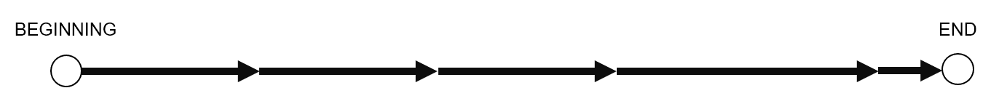
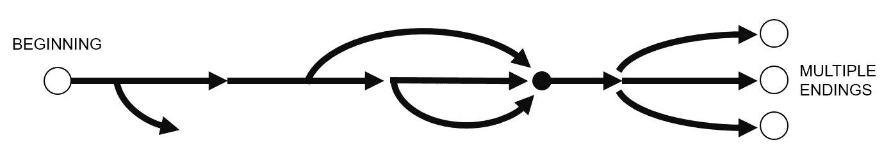
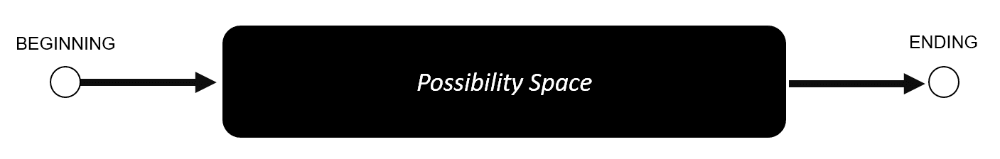
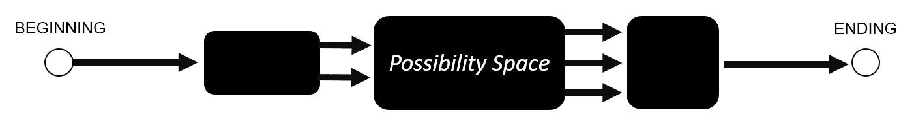
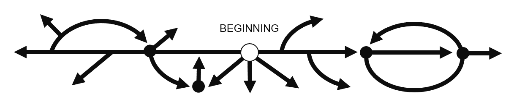
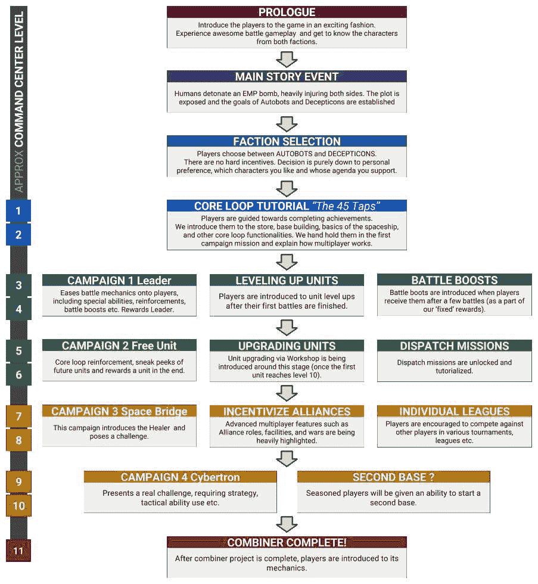
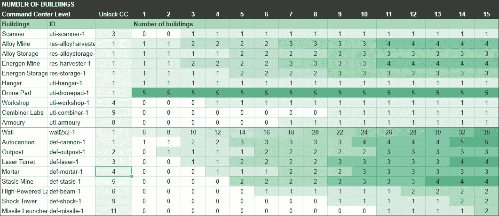
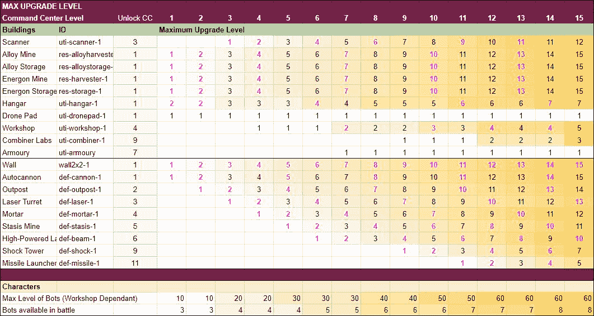
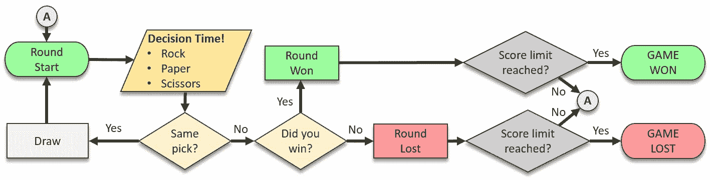
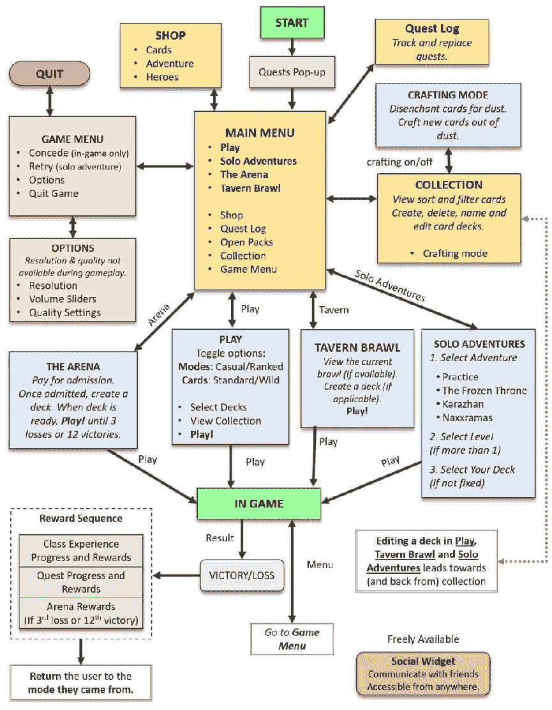

# 第四章

游戏项目范围规划

在本章中，我们将向您介绍游戏的整体范围、其结构和其内容之间的概念和关系。我们将探讨现实世界的例子，并帮助您了解如何更好地记录游戏的大小、复杂性和依赖关系，以及帮助您估算任务。

游戏的范围是一个术语，用于定义项目的感知大小和复杂性。在事先不知道范围的情况下，任何生产调度、成本估算和人员配置几乎都是不可能的。通常，在完成游戏设计文档的第一个版本时，范围就已经得到了很好的定义。

作为一名负责确定初始范围的游戏设计师，你的责任是列出游戏的所有功能、功能性和系统，以及估算游戏内容的整体。这包括游戏玩法机制的数量和复杂性、可玩关卡、任务、过场动画、故事线和对话、音效和音乐、可玩和不可玩角色、武器、升级、物品等等。

一旦项目进入生产阶段，你很可能会在处理新的功能提案或设计修订时继续使用你的范围专业知识。

> > > 总是确保你的想法不会过于昂贵或超出技术或团队的可能性（约束可以引导和提升你的创造力），但不要过早地过度思考范围！只有在结构和核心游戏想法得到很好的定义之后，写下范围才有意义。

小心功能蔓延！有时候少即是多；决定删除什么比梦想新功能更难但更重要。当描述我们试图通过添加更多功能和内容来解决我们的问题并使游戏更具吸引力，而不是解决深植于基础游戏系统和机制中的问题的情况时，经常使用功能蔓延这个术语。知道保留什么和删除什么是任何游戏设计师的基本技能。在纸上和原型制作期间进行更改是最容易且最便宜的。不要害怕在早期提出削减建议，因为后期可能会太晚。

在完成游戏设计文档（GDD）和技术设计文档（TDD，通常由主开发者维护）的第一稿后，你团队和工作室各个领域的代表将能够估算完成项目所需的时间。这反过来又允许制作人创建并同意日程安排和预算。

由于游戏开发高度不可预测，你可以预期范围和估算会经常修订，并且每个估算都会增加 20-40%的不确定性缓冲（有些人甚至将他们的初始估算翻倍）。

顺便提一下，重要的是要承认，在某些项目中，你可能需要处理连续的迭代。这意味着你的范围将在整个项目期间相对不确定和灵活。这种情况很少见，需要明确的短期和中期目标，并且不应成为为自己或他人产生不可持续工作量借口。毕竟，即使时间和资源不是问题，你也很少希望在一个单一的游戏上花费十年时间，结果整个行业却朝着不同的方向、发行平台和技术发展。

游戏结构

要准确界定和评估你的游戏，首先需要定义其结构。在本书中，结构指的是游戏的不同部分如何相互连接以及玩家在游戏过程中所经历的旅程。

结构确定后，将游戏划分为独立的章节并评估游戏各个部分的规模、复杂性和依赖关系变得容易得多。

> > > 作为一名设计师，你需要决定玩家的旅程和你要提供的体验。你是否预见玩家在游戏中有一条预定的路径？是分支的吗？或者你可能只想为玩家提供各种工具，让他们自行发展？体验是否设计成高度可重玩的，或者它仅仅是一个需要解决或讲述和体验的固定故事？回答这些问题将告诉你很多关于你正在制作的游戏结构的信息。

游戏的结构不仅取决于期望的游戏体验，还取决于所采用的业务模式。

虽然电子游戏在街机中找到了流行，但它们很快进入了我们的家中——填满了专用游戏机，并增加了拥有个人电脑的理由。大多数游戏逐渐从以得分驱动的挑战和类似体育的竞赛中脱离出来，转向更明确的经验，讲述故事或提出可以解决、掌握和耗尽挑战。有限的再玩价值不一定是由基本游戏机制产生的结果，而是出于提高游戏质量、通过预定义的挑战控制难度以及充分利用所有资产和可玩内容的愿望。

控制台和 PC 游戏提供的有限体验不仅使游戏更加平衡，而且与可用的商业模式完美同步：

1.  购买新游戏

1.  完成游戏

1.  购买另一款游戏

在这样一个世界中，拥有极高重玩价值的游戏产品可能曾经被用来产生口碑推荐，但对长期业务并不特别有利。如今，得益于高度竞争的市场、改进的数字交付方法和客户重复盈利的可能性，我们有了高度互联的游戏，它们通常提供无限重玩体验、深入的多玩家互动和大量用户生成的内容。有些人认为，游戏在旧时代更好；我认为它们确实更容易制作...

分解和分类视频游戏的方法有很多。许多产品通过其广泛的游戏模式和复杂结构模糊了界限。在我们深入探讨一些例子之前，我们需要了解一下在规划游戏结构、其与内容的关系以及个人决策对最终产品范围和寿命的影响时常用的最常见术语和工具。

游戏内容

在范围和结构的背景下，游戏内容指的是设计来体验（或消费）的游戏。这包括游戏关卡、物品、角色、能力、车辆、成就、武器、任务和剧情线。由于主要游戏机制和规则是构建一切的基础，你通常不会将它们视为游戏内容的一部分。相反，你专注于任何建立在你的基础之上、增加价值并延长游戏寿命的内容。

在简单的赛车游戏标题中，内容将包括所有赛道、汽车和汽车部件（包括可以涂装在汽车上的如油漆颜色和贴纸等外观物品），以及可用的游戏模式范围（如计时赛、单场赛事、锦标赛、多人对战等）。声音、音乐和故事也会包含在内，但诚然，这些组件不太可能决定产品的成败。毕竟，我们可以合理假设，一旦玩家掌握了游戏机制并熟悉了所有赛道、汽车和模式，无论我们投入多少故事和音乐，他们很快就会失去兴趣。

游戏设计师经常面临关于规则和内容之间关系的重要决策。尽量提前考虑，预测可能发生变化和扩展的领域。仔细思考以下问题：

+   是由开发团队手工制作所有内容吗？还是将使用随机化和/或程序生成？

+   你计划在游戏发布后扩展游戏内容吗？哪些部分？多久一次以及到什么程度？

+   你计划使用用户生成的内容吗？你将如何确保其质量？你将如何进行监管？

这需要考虑很多，所以让我们来解释一下与内容相关的术语，并帮助你回答这些问题！

> > > 总是在每个游戏功能的规格说明中披露你的意图。比如说，你正在制作一个收集功能。不知道最初 10 个可收集物品最终会扩展到 100 个，可能会产生非常危险的后果。围绕该功能的整个用户界面可能需要重新制作，创建、存储和显示这些物品的代码也需要重写。在一个只有 10 个物品的示例场景中，你的用户界面设计师可能会选择使用大型的、动态的对象，但一旦数量增长到 100，库存就难以导航，游戏性能也会受到影响，所有这一切都是因为团队的其他成员没有准备好支持你的最终意图。一旦知道大量物品的愿望，艺术资产甚至可能经历一个完全不同（且更系统）的流程。你甚至可能最终使用艺术外包商或自动化创建和实施过程的大部分工作！

内容消耗

当玩家与你的游戏互动时，他们不仅会掌握游戏机制和系统，还会更加熟悉游戏内容。人类喜欢学习，良好的学习机会会带来成就感与满足感。我们对任何新鲜事物都容易感到兴奋——一个全新的挑战、一个未讲述的故事、一个未发现的土地。虽然人类条件中的这部分会导致我们的玩家寻找并享受我们的游戏，但它也会导致他们对重复且无挑战性的任务或熟悉的故事感到无聊。无聊是我们试图避免的，不幸的是，对于设计师来说，人们在学习上和发现模式上一样擅长。正是那个能够从云朵的形状中识别动物，或者在火星岩石的图片中识别人类面孔的大脑，会长时间地接触到你的游戏。仅仅是对同一组 3D 道具和艺术作品的暴露，这些被用来创建看似独特的地牢，就会导致疲劳和无聊的感觉。任何玩家反复接触的内容都会遭遇同样的命运，包括那些似乎没有秘密和潜在学习机会的机制和系统。所有这些都意味着，我们的玩家不仅享受我们游戏的内容，他们还会消耗它，永久性地降低其价值。

避免内容熔炉

当描述那些高度依赖新鲜内容来维持玩家兴趣的游戏时，经常使用“内容熔炉”这个术语。

创造高度专注、手工制作的故事内容并没有什么不妥，但除非你是有意识地想要提供具有高度有限重玩价值的体验，否则你将不得不计划让游戏保持新鲜感更长时间。有几种方法可以限制内容消耗（或增加消耗的内容量），并希望你的玩家对游戏保持更长时间的兴趣。

深度和可能性空间

你可能听说过一些游戏被描述为“深度的”。在这个语境中，“深度”意味着一款游戏在表面之下隐藏着许多复杂的系统和有趣的选择。你还记得那些容易学习但难以精通的游戏吗？这个陈词滥调指的是一个理想化的场景，在这个场景中，一款游戏既易于接触又易于理解，但充满了需要多年练习的复杂性和几乎无限的再玩价值。

要创建一个可能性空间广阔的游戏，就是创建一个拥有无数有趣和独特场景组合的游戏。这样的游戏存在吗？它们不会一开始就需要大量的内容吗？答案是：是，也不是。

想想像国际象棋或围棋这样的经典游戏，这些游戏完全依赖于它们优雅的规则集。这些规则使得一套极其深度的游戏场景成为可能，可以娱乐玩家数年。有 20 种方式可以开始一局国际象棋。当你的对手回应时，可能的棋盘状态数量激增至 400——每个状态或多或少都是一个有效且有意义的变化。这些游戏不依赖于提供新内容，而是依赖于有趣的走法集合和挑战对手（你可以与人工智能下棋，但没有人类对手可能乐趣较少）。可以说，通过规则提供的广阔可能性空间，这些游戏避免了成为内容熔炉。

这是否适用于现代电子游戏？是的，它确实适用！在撰写这本书的时候，我在 Valve 公司著名的 MOBA（多人在线战斗竞技场）DOTA2 中积累了超过 2,000 小时的游玩时间，更不用说之前花在《英雄联盟》上的几年时间了。在这些游戏中，关卡设计基本上保持不变。它成为了一条不变的途径，用于展示技能、短期决策和长期策略。这些游戏通过深入的选择和广阔的可能性空间实现了可玩性，这是以下因素的产物：

+   互联的内容，创造出数百万种组合：

    +   大量具有独特能力的可玩角色。鉴于这些游戏是以五人团队进行，可能的团队组合数量是巨大的。

    +   游戏中可以购买的大量物品，这些物品可以对你的角色（以及你的团队）的表现产生重大影响。

+   测试各种技能的规则和机制：

    +   如计时、瞄准和反应时间等体能技能测试

    +   战术和短期决策，包括环境意识、物品和技能发展决策以及敌方移动预测

    +   长期策略，通常基于发现游戏模式并预测敌方团队的行为

    +   交流、协调和领导能力

+   与人类对手对抗的挑战和满足感。如果这些游戏是对抗人工智能对手，它们就不会那么吸引人和受欢迎。创建有效但看似自然的 AI 对手非常困难，更不用说让他们协同工作并做出有趣的选择了。

+   持续变化的元游戏——社区玩游戏的方式随着游戏本身的发展而演变。如果某种策略变得占主导地位，社区自然会通过学习预期和对抗它来演变。

我只是触及了让这两款游戏可重玩的部分，尽管现在你可能想知道我是否需要 100 个物品和 100 个角色来创建一个可重玩的游戏？简短的答案是，不需要！稍微长一点的答案是，看看像火箭联盟这样的游戏——一款可以用汽车踢足球的游戏。规则和胜利条件简单而优雅：用你的汽车击球，将球送入敌方球门。为了使这种游戏玩法有效，所需的内容量令人印象深刻——一个竞技场，一辆汽车，一个加速垫和一个球。游戏以小队形式进行（每队 2 到 4 名玩家），每个玩家控制一辆汽车，以熟悉的方式驾驶，但玩家也可以在空中跳跃和操控汽车，并使用火箭推进力来推动自己。用你的汽车击球，并尝试将球送入对手的球门……就这样！简单，对吧？然而，对于许多人来说，可重玩性极高！火箭联盟实现其难以捉摸的易于学习、难以精通的地位，完全归功于规则的简单性以及精确控制汽车相对于球和周围每个玩家的动作的极高技能上限。这是一款高度动态的游戏，精准的时机和团队协作至关重要。

尽管人类因素可以在提供新鲜挑战、深度和广阔的可能性空间方面发挥巨大作用，但这些并非仅限于多人竞技场游戏。想想像席德·梅尔（Sid Meier）的文明和全面战争系列这样的策略游戏，或者像模拟城市和矮人要塞这样的模拟游戏。可以争论说，即使移除大部分视觉资产并减少内容量，玩家与游戏背后系统之间的交互效果仍然可以提供数十小时的乐趣，充满了有趣的决策和引人入胜的结果。

创建深度的游戏是一项非常困难的技艺，可能需要更多的时间和专业知识，比围绕更浅显的机制制作大量内容要花费更多。随着你在核心游戏机制中增加组合和可能性的数量，你将你的系统暴露于一系列极端（并且可能破坏游戏）的情景中。在你希望延长游戏寿命/深度/复杂性的希望中添加任何新规则或功能之前，你的团队需要做出一系列重要的决定。拓宽可能性空间可能会（并且几乎肯定会的）带来目前无法预见的结果。你是否有时间探索这些新选项？你对新增加的内容是否会带来积极影响并使游戏更具趣味性有几分把握？你是否应该将时间花在简单地向现有系统中添加更多可消耗内容上？

在本书的后续章节中，我们将深入探讨创造引人入胜的机制和拓宽你的可能性空间的方法；现在，让我们看看限制内容消耗的其他方法！

随机化和程序生成

随机化和程序生成是两个相互关联的术语。虽然随机化主要关注基于机会的机制的应用（例如洗牌、暴击几率和随机掉落物品），但程序生成则侧重于根据精心制定的规则创建新内容。

让我们先关注一下随机化带来的影响！

要有效地延长游戏寿命，随机化必须受到限制，并以谨慎、深思熟虑的方式进行应用。如果做得正确，它可以增加刺激感，使游戏略少可预测性，而不会削弱玩家提前规划的能力。如果做得不好，你最终会得到一个无法玩的游戏混乱，其中玩家的行动似乎对最终结果影响甚微，而且无法预测和准备接下来会发生什么。

任何变得随机化的内容都有可能使游戏规则变得难以理解，并打破游戏的平衡（使得游戏要么过于简单，要么无法获胜）。此外，由于负面偏见，大多数人更关注随机化的负面结果，而不是正面结果。这意味着完全随机的效果可能导致玩家感觉被游戏欺骗，并失去自主感。

> > > 同事设计师基思·伯格恩（Keith Burgun）对随机性的有趣观点值得分享，请参阅[`www.youtube.com/watch?v=2qfFEP_-LkI`](https://www.youtube.com/watch?v=2qfFEP_-LkI)。基思区分了两种类型的随机性：输入随机性和输出随机性。输入随机性被描述为一种可以告知玩家决策的随机性，例如地图生成。玩家无法事先影响或预测它，但将能够根据他们所获得的信息做出决策。另一方面，我们有输出随机性，它定义了玩家行动的结果，例如掷骰子来决定你已承诺的行动是否成功。在向你的游戏中注入输出随机性时要非常小心！玩家对行动的反馈可能会变得混乱，并可能限制从良好决策中获得满足感的机会，以及从错误中学习的机会。一个有效的移动可能会遇到失败的结果，而玩家的错误可能会带来积极的结果。

使用随机化的例子有很多。有些游戏使用它来延长游戏内容的寿命；其他游戏将其置于其游戏机制的核心。像《万智牌》或《炉石传说》这样的卡牌游戏，如果牌组总是按照预定义的顺序产生卡片，就会失去大部分吸引力。至于《炉石传说》本身，设计师们增加了一大批卡片，这些卡片在玩过之后会提供随机效果——这是使用上述输出随机性的一个绝佳例子。这是一套具有争议的卡片，它可以导致既令人兴奋（哦我的，我真是太幸运了！）的时刻，也可以导致令人沮丧（这？真的？我放弃了！）的时刻。除非你能向你的玩家提供对风险和不确定性的明确指示，否则你应该避免在游戏的关键区域使用输出随机性。

随机化在奖励系统中的另一个伟大用途。在诸如《魔兽世界》这样的游戏中，玩家组通常会多次重玩同一个地下城，以获得获得期望物品的机会。在一种基于 Gacha（Gacha，源自日语单词 gachapon，指在自动售货机中出售并包含随机玩具的胶囊）商业模式的游戏中，可以找到奖励随机化的极端版本。在这样的游戏中，游戏中最重要的物品，那些阻碍玩家进步的物品，都被藏在了随机宝箱中。重要的是要知道，并非所有 Gacha 奖励的实现方式都相同（因此总是完全随机）。所谓的箱式 Gacha 指的是具有随机概率但没有重复奖励的奖励集。想象一个严格定义了 10 个物品的盒子。即使其中一件物品有极小的 0.1%的掉落概率，你也可以确信你将在 10 次尝试内得到这件物品。最坏的情况是你需要先抽出 9 件其他物品。

> > > 如果你依赖于奖励随机化，确保你仔细准备处理填充内容和重复奖励——没有什么比得到一个无用的奖励或根本得不到奖励更令人泄气的了。在独特物品重复的情况下，也许你可以将它们转换成有用的资源？更多关于这种奖励和基于 Gacha 的商业模式的内容，可以在第十五章《游戏即服务》中找到。

在 Valve 的 2008 年第一人称射击游戏《求生之路》中，我们可以观察到巧妙利用随机化的杰出例子。在《求生之路》中，四名玩家在几个战役中的一个中进行合作。战役是一系列预定义的水平，每个水平都有一条主要线性的路径，有固定的入口和出口。游戏只提供少量武器和物品，几种特殊的敌人类型，以及角色之间没有差异。乍一看，这似乎不是一个可以大量重玩的游戏。然而，游戏的制作者做出了一些非常明智的设计决策……

《求生之路》有一个 AI 导演。导演的角色是为幸存者（玩家）提供与所选难度级别相匹配的多样化和令人兴奋的体验。为此，导演将跟踪每个玩家的各种属性，如健康、状态、技能水平（准确度、击杀数等）和位置（他们是在一组中还是单独一人，是领先还是落后）。基于这些信息，AI 导演能够通过各种游戏调整使每次游玩都独一无二，其中最突出的是：

+   产生大量常见的感染者（想象一下快速移动的僵尸）。导演选择一个可用的生成区域。数量和频率都在设定的限制范围内，由导演决定。

+   生成特殊敌人。类型和位置各不相同，同时存在一次最多能有多少特殊敌人存活的时间限制。一些非常难对付的敌人被设置为在地图上仅生成一定次数，在几个预定义的位置之一，无论幸存者的状态如何。

+   在几个预定义的位置之一生成武器、健康和弹药。同样，存在上限和下限，但如果你的团队受伤，他们更有可能找到救命的医疗包，而不是临时止痛药。

导演还负责许多更微妙的功能，例如触发天气效果或在幸存者之间的动态对话（这些通常涉及他们的当前位置或面对的敌人）。

由于 AI 导演在游戏开始前计划了一些关卡元素，所以可以说它在程序生成方面有所涉猎，但使用程序生成来创建新内容的真正力量远远超出了这一点！

我们可以深入研究《我的世界》、《泰拉瑞亚》以及《无人深空》的完全程序化世界，后者不仅组装了一个充满行星的完整宇宙，而且还充满了生物！重要的是要承认，如此广泛的过程生成本身就是一种艺术形式，需要巨大的技术专长。

在不那么极端（且更可控）的一端，我们有 cult 动作角色扮演游戏《暗黑破坏神》，一款角色扮演射击游戏《边境之地》，以及无数现代的《地牢探险》游戏示例（例如《地牢入侵者》、《核塔》和《 rogue legacy》等）。更仔细地看看《暗黑破坏神》，它使用程序生成来创建其特殊怪物、魔法物品，甚至组装地牢布局，但设计师选择在游戏最重要的方面保持更高的控制水平。在《暗黑破坏神》中，最好的装备、所有的 Boss、整体故事、目标和地牢及环境的顺序都是手工制作和预先计划的。

> > > 在设计你的游戏时，尝试找到其中自然受益于随机化和程序生成的部分，但请记住，这是有代价的！编写好的程序生成代码需要大量时间（测试和微调它将花费更长的时间），这将对游戏的范围产生巨大影响。此外，程序生成的世界/物品/故事很少像手工制作的那样特别。通过简单地随机化几个元素，而不是从头开始创建，你可以做很多事情。如果你的游戏需要大量内容并且你需要依赖程序生成，那么考虑一下你如何保持对其关键部分的控制。

用户生成内容

你想要大量内容，但又不想这些内容来自一个无情的算法？鼓励你的玩家相互创建和提供新的内容！

有许多方法可以实现这一点。在过去，PC 游戏通常附带一套地图编辑器和内容创建工具，一些游戏中最好的地图，如《星际争霸》和《魔法门之英雄无敌》都是由粉丝制作的。赋予并支持一个活跃的模组社区也可以是延长你的游戏寿命和吸引力的有效解决方案。然而，运营、支持和监管它可能也非常耗时且昂贵。因此，对于像《辐射》和《上古卷轴》这样的大型、高端游戏来说，这最有意义。

现在，在线架构可以使玩家生成的内容立即无缝地集成到核心体验中。我们有了拥有数千张优秀地图的《超级马里奥制造者》，还有像《小小大星球》这样的游戏，让玩家能够创建和分享全新的游戏体验，这些体验与主游戏截然不同。然而，这种自由流动的玩家创作的质量往往令人怀疑。如果没有适当的监管工具以及推广优质内容的方法，事情可能会很快变得糟糕。尽管你希望事情自行运转，但这样的功能无疑将需要持续的监督，并显著扩大你的游戏范围。

地图和模组很棒！不幸的是，并不是每个玩家都愿意花几个小时为他人制作内容。幸运的是，有方法可以让你的玩家无意中制作出高质量的内容！你只需要将内容创作变成你游戏的一个重要部分。在像《部落冲突》这样的移动游戏爆款中，玩家生成的地图被用于所有主要功能（除了相对较短且不重要的单人战役）。这款游戏主导了我们现在所说的建筑和战斗类型，它结合了即时战略和塔防游戏。在这些游戏中，玩家建造和升级他们的基地（精心放置防御以保护自己），招募部队，攻击其他玩家以夺取他们的资源。激励玩家保护他们的资源驱使每个玩家为其他人创建一个全新的、高度可玩的新地图。对开发者来说，监管影响微乎其微，并且由于玩家被排名并对阵，难度得到了适当的维持。

内容管理跑酷

在实时游戏中工作的团队往往不得不添加新内容，以保持当前观众的关注。我们有时将这种情况称为陷入内容管理跑酷——如果你停止发布新内容，那么你就有失去玩家的风险。

有许多方法可以应对这种情况，通常需要整个团队共同提出解决方案，以简化生产流程或减少对新内容的依赖。尽管如此，这是一本实用的书，我们旨在提供一些实用的想法，例如：

1.  重混音：内容不必完全新颖，仍然可以感觉新鲜。赛车游戏中的镜像赛道就是一个很好的例子。另一个例子是使用旧 Boss 作为后期敌人——玩家只战斗过一次，为什么不给他们第二次生命呢？重新着色和调整你的资产也可以是一个非常强大的工具！

1.  重新游玩：如声望等级（以徽章或精英状态象征物换取重置进度）和“新游戏+”系统（在更高难度下重新游玩游戏但保留进度）都是让玩家在到达游戏终点后继续游玩的好方法！

1.  重现：为什么不鼓励玩家使用他们早已厌倦的内容进行游戏呢？特殊目标和挑战或游戏模式/自定义规则集可以做到这一点！

1.  增加深度或改变规则：满足内容需求的另一种方式是在内容之外提供更多变化，通过限制主要游戏循环的重复性来赋予其新的生命力。以《炉石传说》中的竞技场模式为例；它使用与主游戏完全相同的卡牌，但允许玩家抽取随机卡牌并创建始终感觉新鲜独特的自定义牌组。对于许多玩家来说，这种模式大大延长了游戏的生命周期！

1.  优化你的流程：有时候，只要你能够识别瓶颈并投资于工具或外包，让团队的生活更加愉快，那么陷入困境也是可以接受的。

常见游戏结构

游戏是互动和叙事的媒介。虽然这两个元素通常相互配合，但有时开发者构建的故事和玩家的个人故事（通过他们的行动和经历讲述）会有很大的差异。我们的媒介擅长创造交互式系统并让玩家在其中自由探索，但我们游戏中的故事往往依赖于书籍或电影中发现的陈词滥调、传统和静态结构。

虽然可以实施具有数十个分支路径的密集交互式剧情，甚至可以创建和组装故事的程序化系统，但同样的开发努力最好放在核心游戏玩法机制上。毕竟，每个人都会与游戏系统互动，但只有少数人将探索所有故事分支。这就是为什么在大多数情况下，我们的游戏在游戏玩法上可以提供比在叙事上更多的自由度。

让我们来看看我们游戏可能的架构，需要注意的是，在许多情况下，游戏玩法和叙事可以相互配合，也可以广泛分歧。在这种情况下，通常最好首先专注于游戏更互动的元素（因为它们通常是迭代和重新设计最困难的），

线性

线性游戏可能是我们媒介能够接近传统、非交互式媒体（如书籍或电影）的最接近方式。体验是预先计划的，节奏控制得很好，以固定的顺序交付，几乎没有进行重大决策或分支路径的空间：



线性游戏中玩家旅程的简化描述

将你的游戏设计成线性游戏的最大和最明显的益处是能够对结合叙事和游戏体验拥有最高程度的控制。如果你知道如何行使这种控制，你就能抓住你的观众，并带领他们经历一段他们永远不会忘记的体验。

现在，完全线性的游戏和故事很难找到。即使是限制性最强的游戏，通常也会提供一些决策点、替代解决方案、可选路径、多个结局，以及至少在一定程度上自由地接近游戏场景。我考虑的非常线性的游戏（跨越多年、平台和类型）的例子包括超级马里奥兄弟、无主之地、暴雨、传送门和 Inside。

> > > 如果你正在制作线性游戏，你需要在整个游戏过程中保持最高的质量标准，可能需要反复重做游戏的部分内容。在线性游戏中，节奏和平衡更容易控制，但也更加重要。你的玩家不能忽视他们不喜欢的地方，或者通过执行支线任务或探索游戏的其它部分来轻易地分散注意力——如果你无法保持他们的兴趣（或让他们陷入困境），你将使他们面临极大的风险，可能会永久离开。

结构化非线性

非线性游戏将玩家从固定轨道上拉离，并利用游戏的交互性——玩家不再必须从开始到结束遵循一个单一的预定义路径。在这样的游戏中，玩家被要求做出有意义的抉择，并在游戏玩法、故事情节或两者之间拥有一种自主感。然而，结构化非线性游戏的设计师仍然保留对游戏体验的一定程度的监督和控制。他们为一系列可能的游戏或叙事场景做好准备，并准备解决方案和结局。最终结果是精心平衡和结构化的体验，为玩家提供了一定程度的自由度，增加了可玩性，并允许玩家以他们最喜欢的方式玩游戏：



经过精心规划的分支、支线路径和多个结局的非线性游戏

非线性游戏显然存在明显的缺点和挑战。替代路径应该和主线一样有趣和有回报，因为当你鼓励某些玩法风格时，你就是在剥夺选择权，并迫使许多玩家以最优（但可能不那么有趣）的方式玩游戏。你的范围也会大幅增加，特别是如果手工制作的故事在多个方向上分支。你还会创建大量可能耗时耗力的内容，而大多数玩家可能永远不会探索，所以如果你计划将游戏中最酷的部分放在不太可能的分支后面，请考虑这一点。

> > > 在保持故事大致方向的同时，在游戏中提供一定程度的表达是更加可控的。然后你可以依靠玩家的游戏风格和选择，在游戏结束或游戏过程中（但不是以偏离故事主线的方式）反映出来。

在《杀手》、《盗贼》、《德军总部》或《黑暗之魂》等游戏中，玩家在处理游戏情境的方式上拥有很大的自由度，但最终的结构遵循一个可以预测和计划的模式。

开放非线性

一些非线性游戏开放其结构，让玩家自由探索。它们提供了一个非常广阔的可能性空间，几乎不可能预测玩家将如何达到结局。这些游戏仍然包含一套明确的胜利和失败状态，以及通常精心制作的主线剧情，但任何试图规划玩家旅程的尝试都是徒劳的。

在这类游戏中，玩家被赋予自由探索内容和游戏玩法系统的权利，使得每一次游戏体验都是独一无二的。一些系列，如《辐射》、《上古卷轴》、《正当防卫》或《侠盗猎车手》，通过提供一个开放世界并充满可选活动和任务来实现，这些活动和任务可以让玩家沉浸数百小时。另一些，如《文明》和《全面战争》系列，通过提供深入、互联的系统以及包含无数动态部分的模拟，让玩家熬夜。另一个值得注意的例子是互动小说《80 天环游世界》，它以一种独特的方式对开放非线性游戏进行了诠释，拥有惊人的、高度适应性的叙事和明确的结局：



有明确的开始和结束，但可能性空间广阔且不可预测

游戏设计没有绝对的东西；完全有可能在保持对游戏结构和故事的控制的同时，仍然允许自由探索。大多数开放世界游戏都采用混合形式。它们不希望玩家感到不知所措或过早地冒险。为了做到这一点，你可以创建一套玩家必须满足的、以获取游戏额外部分的人工要求。这种解锁机制将让你更好地控制体验，并让你的玩家专注于更易于管理的游戏内容：



而不是完全开放你的游戏结构，你可以将游戏划分为一系列中心区域，玩家以可控的方式在这些区域之间前进。

开放世界游戏的范围影响可能很大，因此内容创作和测试的工具至关重要。你需要创造大量内容来让世界显得有趣，往往在修改和打磨游戏玩法机制的过程中，不得不冒着全部放弃的风险。而且，始终如一，没有坚实的秒对秒游戏体验，再多的内容也无法拯救你的游戏！

总是通过游戏深度的探索，去追求广泛的可能空间。在这种情况下，你需要无数小时的原型制作、测试和错误修复，以确保系统有趣并按预期运行。深层次的系统和模拟可能非常难以创建，尤其是难以平衡，因为任何单一的改变都可能在整个长期游玩过程中产生不可预见的后果。

无尽与沙盒

一些游戏没有定义的结束或胜利状态，可以被认为是无限的。这不仅仅局限于无限跑酷游戏类型（几年前非常流行，包括《神庙逃亡》、《地铁跑酷》和《神偷奶爸：小黄人快跑》）。还有一些多人游戏，如《魔兽世界》、《模拟人生》或《部落冲突》，它们的内容有限，但永远不会真正结束。在这些游戏中，你可以赢得一场战斗，但你永远无法结束战争...

沙盒游戏不仅无限，而且通常没有目标。许多设计师认为，由于其无限和无方向的本质，Minecraft 更像是一个玩具而不是游戏（这是在 Minecraft 通过冒险模式添加了一些结构和目标之前）。

容易将支持沙盒玩法的游戏，如《侠盗猎车手》或《辐射》，误认为是沙盒游戏。确实，GTA 允许极大的自由度，并支持无方向的探索性玩法，但始终存在一个故事线、进度关卡和潜在的胜利状态。即使玩家可以自由选择自己的路径，他们通常也会被游戏的故事所限制和锁定在特定的状态中。真正的沙盒游戏是自由形式的，通常是无限的；它是玩家表达的工具，是一个虚拟世界，是一个迷失其中的模拟。这种结构随着《泰拉瑞亚》、《DayZ》和《Rust》（当然还有《我的世界》）等游戏卖出数百万份而流行起来：



呃……规划玩家的旅程？哦，算了...可能会有进度里程碑和技术树，但你无法真正预测玩家接下来会做什么。

沙盒游戏不易创建，测试起来更难。然而，通过添加多人游戏功能，只要玩家可以通过相互互动来表达和娱乐自己，就可以让看似简单的游戏得以存在。只需确保有目标可追求，有梦想可追求——玩家可以花费数小时试图实现的幻想。

结构笔记

与任何分类一样，现实往往是将事物放在一个滑动比例上，一个产品可以拥有属于截然不同类别的游戏模式或章节。玩家也可能完全忽略结构，走出我们设定的路径，甚至自己设定目标。例如，在《侠盗猎车手 5》中的一些玩家可能会完全忽略与主要角色相关的紧凑的故事任务，而是探索世界，打破最长的汽车跳跃记录，并尽可能多地吸引警察的注意，然后逃脱。

在游戏的任何部分选择特定的游戏结构风格是设计过程中的重要部分。你需要考虑：

+   你拥有实现这种体验所需的专长吗？开放可能性伴随着风险，并且可能会增加你的预算。

+   你从一开始就知道你正在制作什么类型的游戏，以及你将支持哪些类型的游戏玩法吗？

+   在游戏的结构上是否有需要满足的预期？这些可以是内部的（团队）或外部的（你的受众）。

范围实践

接近范围的最佳方式是从游戏顶层开始分解，并定义玩家的关键进步路径。想想你想要提供的最终体验或想要讲述的故事。考虑等级或其他玩家进步的单位，你能定义最小、最优和理想的数量吗？你需要在关键路径的每一部分需要多少新内容（障碍、NPC、游戏机制等）以保持趣味性？通过将玩家体验分成块，你将能够轻松估计所有相互依赖元素的数量。

内容生命周期

内容生命周期是一个文档，列出了每一项重要的内容，并将其与玩家在游戏中的旅程相对应。它允许人们规划生产，估算首先需要哪些元素，并确定哪些区域有太多或太少的新元素。

除非你正在制作一个非常开放的游戏或沙盒体验，否则应该能够定义玩家的进步向量。这个向量将在生命周期文档中作为参考点。举几个例子：在一个开放世界的 RPG 中，进步向量可能是玩家的经验等级；在一个线性解谜平台游戏中，它将是关卡本身；在一个冒险游戏中，这可能会归结为故事情节中的位置。

内容生命周期文档可用于：

+   检查进步路径：如果你专注于改进游戏的前一小时，你将希望只关注相关部分

+   调整最终用户体验：这可能是确保新内容和游戏机制得到适当分散的最简单方法

+   规划内容交付：你总是希望艺术家和程序员专注于你接下来需要的事情

+   识别依赖关系：如果该新升级的游戏玩法机制还需要半年才能完成，就没有必要工作在这个新升级上！

现实世界案例

通常，我的内容生命周期文档会以一个长表格的形式呈现，每一行代表游戏中的一个元素（它包括建筑物、障碍物、可玩和非可玩角色、交互对象、预告片、武器、技能、风景、关卡设计等等）。然后我会添加包含以下内容的列：简短描述、元素首次使用的时间、优先级和依赖性（显然，需要特殊装置的障碍物必须在该装置创建之后才能创建）。

游戏的结构各不相同，它们与内容的关系也大相径庭，因此每个游戏都应该以合适的方式进行对待。

在《Transformers: Earth Wars》中，我们已经有了一份艺术制作电子表格和机器人以及建筑物的清单；再次列出所有资产意义不大。因此，我选择了一个简化的图表，随后是一个更复杂且集成的进度矩阵，我将在后面进一步演示。

这款游戏是一款移动、多人、建设和战斗类游戏。对于关键进度向量，我选择了最重要的建筑，玩家的指挥中心。与玩家的机器人收藏（这是游戏中最重要的东西，但变化很大）不同，建筑物遵循一条线性路径，并且严格与指挥中心等级相关联。升级指挥中心成为对基地的重大投资，并且是一个明显的里程碑。将其视为主要进度向量也意味着我们将所有游戏功能和科技直接分配并锁定到它上面。

玩家进度流程

首先，我将游戏中的已知功能和里程碑与指挥中心等级进行了对应。这个图表是在我们的游戏设计文档（GDD 本身是一个 Google Docs 文本文件）中创建的绘图。一旦我们对其满意，我就打印了几份副本，将其中一份贴在墙上，其余的则分给了负责生产计划的人（制作人兼艺术总监），以及团队中的每一位程序员。

有趣的是，我们都知道这款游戏将超越指挥中心 11 级（我们实际上为 16 个指挥中心等级制作了数据，并保留了一些，在游戏发布时发布了前 14 个），但我们也知道，在那个阶段不会有新的功能被锁定或计划：



简化的玩家进度流程允许规划功能交付并控制增加的复杂性，确保我们不会让我们的观众感到不知所措

解锁矩阵

遵循进度图，创建了解锁矩阵；这个表格也被打印出来，在办公室里分发。它可能看起来有点混乱，难以阅读，但这并不是因为它只是一个参考点。它还承担了一个更大的作用…

我们已经将解锁矩阵整合到我们的经济电子表格中。通过多个查找和匹配公式，我们最终得到了一个单张表格，它直接修改并影响了我们整个经济的数据。在解锁矩阵中做出更改会导致资源成本、建筑时间和解锁要求自动填写到所有其他表格中，这种方法使得平衡和重构玩家进度变得容易得多（关于如何设置事物的更多提示可以在书籍的平衡章节中找到）。



矩阵的第一部分列出了每种类型可以建造的最大建筑数量

在前一个截图给出的矩阵中，从 0 到 1 的变化表示解锁了一种新的建筑类型。数据看起来有点难以阅读，但可以用电子表格公式轻松处理。你可以查看整个流程，也可以单独查看每个指挥中心等级。例如，我能够为每个建筑的占地面积添加一列，并使用它来计算适合基地的建筑大小。这在尝试确定应该在地图上放置多少可移除的障碍物（岩石、树木等）时非常有帮助：



矩阵的第二部分显示了每个指挥中心等级的最大升级级别

当谈到升级级别时，大多数防御和生产建筑在指挥中心每个等级上仅增加 1 级。但并非所有事物都是如此；像车间（一个限制你的机器人最大经验等级的研究中心）和攻击穿梭机（控制你在战斗中可以部署的机器人总数）等事物都是经过精心设计的。

顺便说一下，当我实施建筑 3D 模型时，添加了那些令人困惑的粉红色数字。我们只为每种建筑创建了六个视觉上不同的版本（除了墙壁，因为它们组合在一起会在基地上留下非常大的视觉足迹）。所以为了使我的生活更轻松，我将视觉上不同的级别用粉红色标出，以帮助数据输入。我确保从 1 级到 2 级（第一次升级某物时）始终有视觉升级，但我还确保我们不会过早地用完所有建筑升级（一些最先进建筑的升级留给了未来）。

> > > 我可能在这里详细描述了很多可能并不必要的细节，但从中我们可以吸取一个重要的教训。作为一名设计师，你需要定义你想要控制和调整的数据类型，如果你是在开辟新的领域，这可能会很困难。一旦你定义了你的参数，使用电子表格、图表、便利贴——任何能帮助你从新角度可视化和操作数据的东西。

游戏流程

流程图和图表是每个设计师都必须学会利用的非常强大的工具。它们可以用于解释游戏经济和游戏机制的内幕，以及描绘技术和技能树。

除非您的游戏非常简单（或几乎是现有事物的直接复制），否则您需要创建某种类型的流程图来解释各种选项和功能如何适合以及它们是如何连接的。即使是简单的剪刀石头布游戏，其流程也可以用图表表示：



多轮剪刀石头布游戏的流程图。

在前面的例子中，我们可以看到游戏的架构以及一些决定回合结果的规则。对于那些不熟悉符号的人来说：

+   圆角矩形代表终端块（过程的开始和结束）

+   平行四边形用于用户输入/输出

+   菱形表示决策。使用这些来表示简单的是/否或真/假分支

+   矩形用于过程和操作

+   箭头连接线用于连接图表的各个部分，并描绘转换的方向

+   页面内的连接器（带有字母的圆形）使我们能够通过连接两个远程部分来避免长而混乱的箭头

虽然可能需要很多时间来理解，但对于有经验的人来说，阅读这样的图表比阅读纸质规则集要容易得多。

尽管如此，不要过度思考流程图——我们不是在创建工厂流程的蓝图，我们是在制作游戏！您使用多少不同的形状和连接器无关紧要。只要您不让人困惑，您可以选择一组简单的箭头和框。

将菱形决策框和分支结果用于每一件事，很可能会浪费您的时间，并可能使您的团队感到不知所措（没有人愿意阅读包含数百个节点的流程）。

最终，游戏流程会随着时间的推移而发展和变化；初始图表的目的是帮助您可视化游戏的架构——通过任何必要的手段来完成。您可以注入参考游戏或早期原型的截图、注释、线框（用户界面和内容的粗略草图）——只要它有助于您有效地沟通即可。如果您真的需要一个带有分支路径的菱形决策框——使用它！但是，如果您无论如何都要详细说明游戏的那部分（可能还有它自己的流程图），请选择简单，并将其全部放入一个简单的框中。

> > > 这些天，您很少需要安装像 Microsoft Visio 或 Inkscape 这样的专业软件。有无数在线解决方案，如 draw.io 或 Lucidchart，而且您总是可以退而求其次；除非您正在做大型且复杂的事情，否则 Google Slides 和 Powerpoint 可以轻松满足您的需求。有些人甚至使用白板或便利贴的图片。

菜单流程示例

例如，我选择为暴雪的数字卡牌游戏《炉石传说》的 PC 版本创建一个简单的菜单流程。为了适应单页内容，游戏的一些细节被简化了，但它应该仍然是一个有用的例子！

我没有选择使用保守的流程图图标，而是选择了一种非常宽松且易于访问的方法。每个游戏区域都由一个矩形表示，解释了可用的选项。

即使是如此简化的菜单流程，结合 GDD 中包含的信息，也能很好地描绘出游戏是如何组合起来的，帮助整个团队看到游戏不同区域之间的联系，并赋予用户界面艺术家开始工作于线框图、各种选项的可视化以及完善最终用户体验的权力：



请记住，在现代协作团队中，你创建的任何流程和文档都不应该是游戏制作的最终指令。相反，将它们视为展示你愿景的绝佳方式，一个坚实的起点，使团队能够尽早发现缺陷，并允许进行更明智的讨论。不要过早地过度解释，并准备好编辑和重新工作一切。再次强调，你在纸上做出的更改越多，你的团队就能越高效！

规划设计工作

在游戏行业中，通常是由项目经理创建和执行生产计划。为此，根据设计文档编制一个待生产任务和资产列表。然后，这些任务与来自将实际完成这些任务的人的估计相匹配（在最佳情况下）。如果项目极具创新性且/或团队成员缺乏经验，可能需要更多资深员工参与帮助制定初始计划。

不幸的是，正如战略家赫尔穆特·冯·莫尔特克所说：“任何战斗计划在与敌人接触后都不会幸存。”最初的生产计划很可能非常错误。一开始，事情通常会花费比预期更长的时间，许多未知的问题、方向的变化和遗漏的任务会出现。幸运的是，随着时间的推移，团队对产品的经验增长，你的工具可能也会改进，使得未来游戏内容的创建比最初预期的要快得多。好的开发工作室和发行商承认游戏很难准确规划，并准备在合理范围内灵活应对。

> > > 在敏捷游戏开发中，在规划和任务准备方面，你可能会遇到不同层次的细节。长期计划往往比较松散，基于粗略的估算；游戏可能从一开始就有发货日期，但实际日期非常不可能与之相符。中期计划（下几个月），通常关注团队努力实现的具体目标，例如：使第一个关卡可玩，完成角色定制系统，测试网络代码。短期计划（下两个冲刺，即开发周期）是最详细的，最不可能改变，因为它们包含按优先级排序的详细任务列表，这些任务要么目前正在处理，要么将评估是否包含在下一个开发周期中。

无论计划多么脆弱和多变，在游戏进入生产期之前，都需要制定计划。作为设计团队的代表（或至少是受重视的成员），你可能会参与这个过程。虽然艺术家（如角色模型、动画、环境等）的可交付任务相对容易量化并估算，但设计任务往往更具挑战性。我们将介绍一些可能有助于你解决这个问题的技巧！

估算技术

在一开始就估算整个项目可能会是一项令人畏惧的任务，但当你面对任何大问题时，你可以使用一种技术——将其分解成许多小问题！

你的第一步是查看所有功能和内容的列表。想想任何可能出现在该列表上的设计任务。例如，如果你正在制作一款第一人称射击游戏，你不会将关卡设计、武器设计和敌人设计视为仅仅三个巨大的任务；相反，武器设计可以分解并估算为一系列更小、更易于管理的任务：

+   所有武器的整体设计（数量，何时解锁）：2 天

+   每件武器的设计和实现任务：3-4 天（每件武器）

    +   思考和原型设计（期望的角色和感觉）：4 小时

    +   艺术简报和参考资料：1 小时

    +   初始游戏实现：2-4 小时

    +   初始平衡测试：2-3 小时

    +   艺术实现和声音简报：2-4 小时

    +   游戏测试和打磨时间：6-8 小时

    +   错误修复：2-8 小时

+   所有武器的游戏测试：5 天

+   所有武器的最终平衡：3 天

+   所有武器的最终打磨：5 天

一旦将事情分解，看看总耗时，看看是否有任何明显的失误，然后添加一些应急预算（通常至少 20%），并确保根据获得的经验在未来重新评估任务。

你会惊讶于这种分解的有效性，尤其是如果你以著名核物理学家恩里科·费米的方式处理未知量...

费米以其用非常少或没有实际数据做出非常好的近似计算的能力而闻名。相反，他依赖于做出合理的猜测，在这些猜测中，他用可能的较低和较高值的平均值替换任何未知量。这如何转化为实践？费米问题的一个著名例子是“芝加哥有多少名钢琴调音师？”为了回答这个问题，我们需要将问题分解成更小的部分，提出以下问题：

+   芝加哥有多少人居住？让我们假设我们不知道，但我们知道它是一个大城市，超过 400 万但不到 1500 万。这两个值的平均值是 950 万。

+   每个家庭平均有多少人？肯定不止 1 人，但可能不到 3 人。让我们取 2 人。

+   有多少家庭需要定期调音的钢琴？可能比 1/35 多，但比 1/5 少。让我们假设是 1/20！

+   我们也可以猜测，定期调音的钢琴大约每年需要一次。

+   去客户那里调音需要多长时间？超过一小时，但可能不到 4 小时。我们说 2.5 小时怎么样？

+   每个调音师每天工作 8 小时，每周 5 天。一年 50 周。

基于这些假设，我们可以进行以下计算：

(芝加哥有 950 万人) ÷ (每户 2 人) × (每 20 户有 1 架钢琴) × (每年调音 1 次) = 芝加哥每年有 237,500 次钢琴调音任务。

现在，一年中调音师能进行多少次钢琴调音？

(每年 50 周) × (每周 5 天) × (每天 8 小时) ÷ (调音钢琴需要 2.5 小时) = 每年 800 次钢琴调音。

现在进行最终的计算！

(芝加哥每年 237,500 次钢琴调音) ÷ (每个调音师每年 800 次钢琴调音) = 芝加哥有 297 名调音师。

```cs
However, there's another more important reason. Have you ever played through an expansion pack or a piece of post-release downloadable content, which felt much better than the base game? As with many things in life, practice makes perfect!
```

几乎在所有游戏中，你最后完成的工作都是基于对产品广泛经验的工作。游戏的中间部分就像一本书或一部电影的中间部分一样，无论它有多好，如果开头不好，没有人会看到它，如果结尾糟糕，那将是他们唯一记住的事情。几乎所有游戏都从玩家旅程的中间部分开始开发，尽管长时间不能玩游戏可能会很烦人，但这样做确实有益。如果你要制作一个有 10 个阶段的平台游戏，可以从第 3 或第 4 个阶段开始，然后对中间部分进行更多的工作，最后再完成开始和结束部分。

如果由于某种原因你不能从中间开始（比如说你想进行核心机制的游戏测试），确保留出一些时间来回顾、迭代，并在以后可能重建初始区域。

记住，从中间开始的技术在任何规模上都适用，并且适用于单个功能。例如，你正在处理多个战役，但你必须按顺序交付它们，也许你可以从每个战役的中间开始？当你从中间开始时，你获得的额外参考框架也有帮助。目标是中等难度级别，然后根据需要调整上下，比从简单开始并不断升级更容易。

> > > 本章中使用的截图仅用于说明目的。我们不推荐你以任何方式误用这些截图。有关更多信息，请参阅本书免责声明部分中提到的出版商的条款和条件。

摘要

这真是一个精彩的章节！到目前为止，你应该对如何分析游戏结构以及更好地预测其范围有了更好的理解。我们详细讨论了游戏内容以及你在帮助定义它方面的作用。我们已经习惯了内容 treadmill（以及如何避免它），并探讨了依赖于内容 burn 的游戏和旨在提供深度可能性空间的游戏的区别。我们还分析了流行的游戏结构，并探讨了你可以记录你工作范围和计划的方法。

拥有所有这些知识，我们应该准备好你期待（或害怕）最多的部分。是时候深入探讨编写设计文档的艺术和技巧了！
