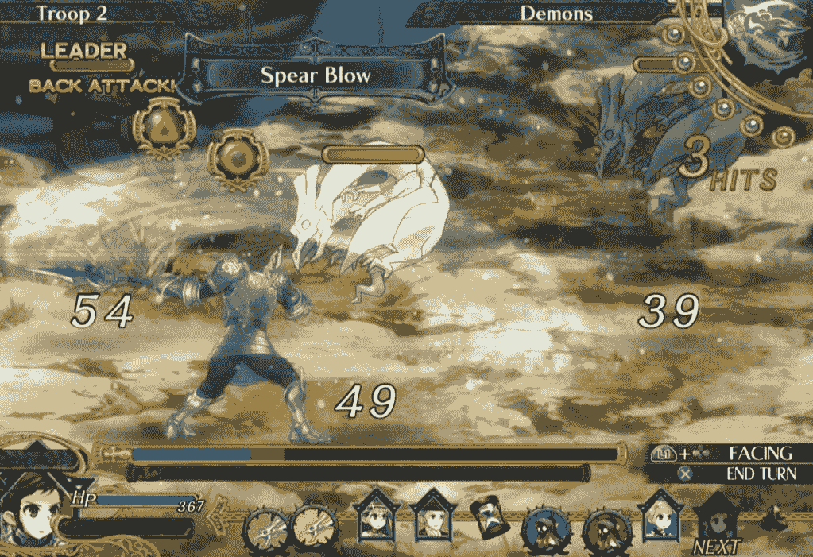
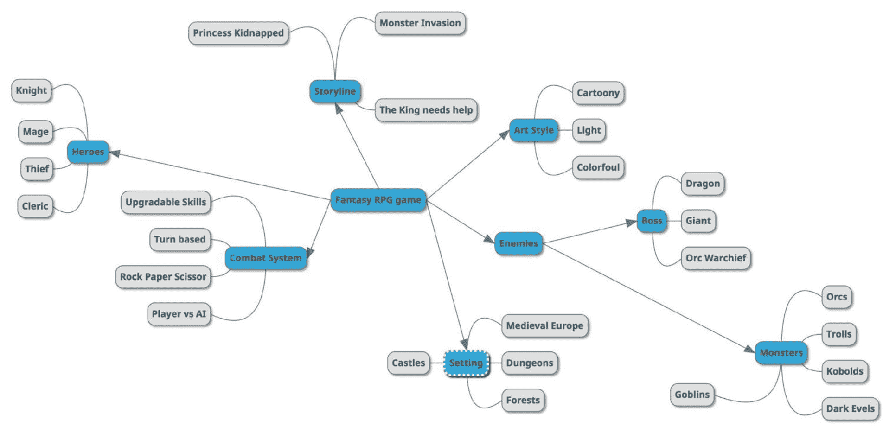
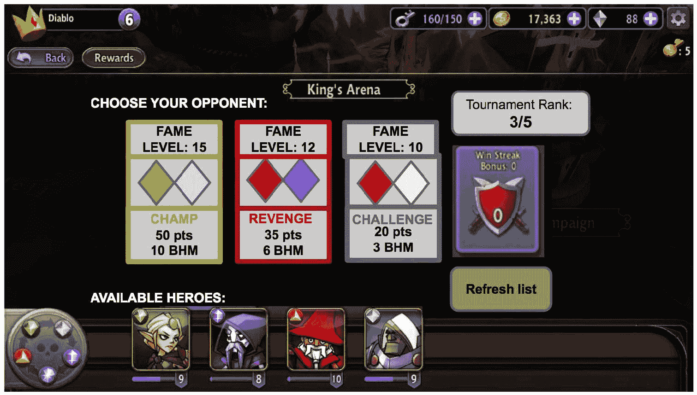
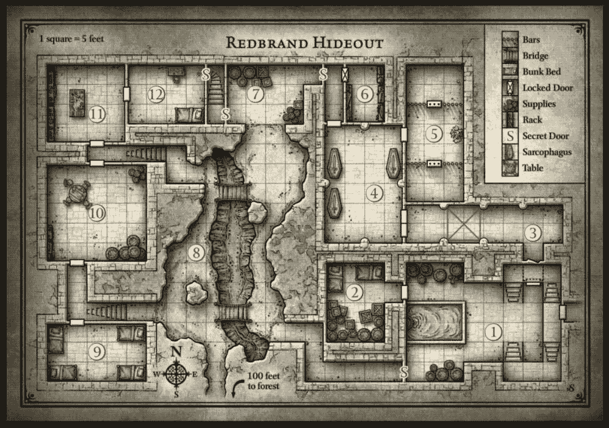
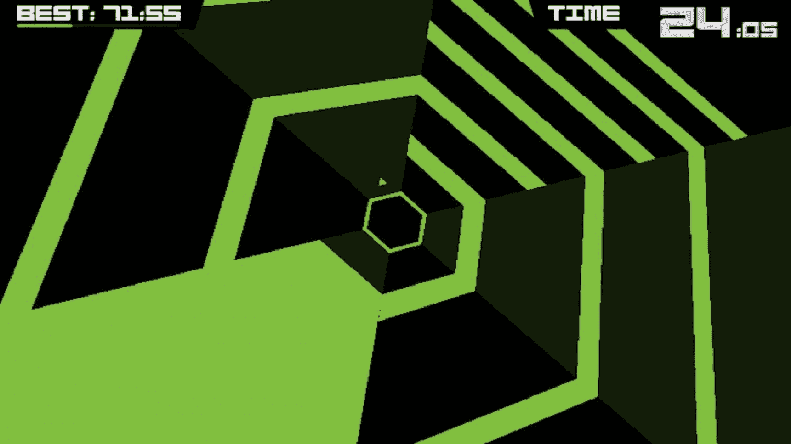

设计文档

编写游戏设计文档（GDD）是每个游戏设计师的主要职责之一。在团队中拥有游戏设计师的全部目的就是确保有人负责将有关游戏的全部内容用黑白色呈现出来——有人能够定义和传达想法、机制以及团队可能需要了解的任何其他信息，以便开发游戏。

许多新手游戏设计师（以及一般的游戏开发者）在网上寻找或向行业中的朋友询问他们可以使用的游戏设计文档模板，作为他们自己编写文档的起点。普遍的误解是，如果它对别人有效，那么对我也会有效。

与游戏概念文档不同，游戏概念文档中存在一些必须以特定方式包含的既定规则和信息（由于文档的销售目的性质），GDD 不遵循确定的架构或格式，它包含的信息可以根据游戏、工作方法以及团队规模和动态而大大不同。

如果你在网上搜索 GDD 模板，你很可能会找到的是一个经典的标准化模板。可能它是用 Word 制作的，可能是在 10 到 20 年前。这个模板通常包含一个大纲，游戏设计师应该用他们的内容来填充，一旦填写完毕，这份文档很可能会达到至少 100 页，甚至更多。这是一本包含所有可能信息的单一圣经。没有人会去读它，甚至你自己也不会。它包含诸如角色描述、输入控制、对话和艺术资产列表等章节。

自从那种文档模板发布以来，游戏开发已经发生了很大的变化。如果你的游戏没有任何对话呢？或者根本没有任何角色？如果输入控制只能与特定的机制相关联来描述（例如，在《糖果传奇》中滑动匹配糖果）呢？如果你正在制作一款大型游戏，填写所有这些信息需要几个月的时间，而你却没有那么多时间呢？或者你可能是一个设计师团队的一员，每个人都需要同时开始处理游戏的各个方面？如果你甚至不知道关卡设计师打算在他的或她的关卡中包含什么，你如何制作艺术资产列表呢？

所有这些疑问都导致了现代游戏开发中 GDD 的某种危机，因为许多开发者质疑了制作此类文档的实际效用。

幸运的是，我们可以这样说，危机现在已经解决了。答案是，没有人再需要那种游戏设计文档了。但当然，GDD 对于任何旨在成功发布的项目都是必不可少的。秘密在于没有任何模板适合你的游戏。每个 GDD 都是独特的，格式、工具和技术只是那些对你、你的团队和项目有效的东西。阅读那些旧模板，甚至开发者发布的 GDD 示例，仍然是一项有用的练习，我真诚地推荐。但当你要写你的 GDD 时，使用你从那些模板中学到的知识，确保你正在构建一个服务于你目的的文档，而不是一个覆盖了其他人为了完全不同的项目所做的所有要点点的文档。

如你所猜到的，在本章中，我们不会专注于游戏设计文档中应该写什么。相反，我将提供一系列你可以用来编写你自己的文档的工具和技术，这些工具和技术对你、你的团队和项目都是有效的。

本章将涵盖以下主题：

+   GDD 的目的

+   一个好的 GDD 的特征

+   可用于创建 GDD 的工具及其优缺点

+   一系列有用的写作技巧

+   游戏设计的优雅

+   维护 GDD

GDD 的目的是什么？

文档有两个作用：

+   为团队提供需要完成的详细描述（沟通）

+   就像游戏的一个百科全书，团队可以跟踪已经完成的工作以及如何完成的，以及有什么变化（记忆）

这意味着游戏设计师的工作不仅仅是将游戏在纸上详细说明，在编写任何软件之前，还要确保所有编写的内容都必须是最新的。当后续有任何变化，或者没有按照文档精确实现时，更新文档是非常重要的。一个好的做法是添加关于为什么（以及如何）最终实现与初始设计不同的注释。这类事情在游戏开发中经常发生。事实上，没有哪个游戏设计师在没有被要求修改或删除可以以更好方式实现或根本无法实现的内容的情况下将他的文档交给团队的其他成员。正如我们所说，游戏设计是一个迭代的过程，编写文档也是如此。

一个好的 GDD 的特征

让我们来了解一下什么是一个好的游戏设计文档。

在接下来的段落中我们将要描述的特征是任何游戏 GDD 都应该具备的。

每次你需要编写一个 GDD 时，回到这个列表并确保你写的每一项都符合它。

每次你完成一个 GDD 的写作后，再次回到这个列表，问问自己你的工作是否具备这些特征，如果不是，是否是因为你的特殊情况不需要这些特征，或者你需要调整一些东西。

一个好的 GDD：

+   是模块化的

+   有目标和需求

+   是讨论的结果

+   清晰、简洁、精炼

+   是多媒体的

+   留有创造性和辩论的空间

+   不一定是纯文本文件

+   是在线的

它是模块化的

一般而言，文档的目标是将游戏设计传达给所有参与游戏开发的相关方。但整个设计不太可能被一个单独的文档所涵盖。游戏的一些部分可能需要尽快设计，而其他部分可能需要等待更晚的阶段，甚至可能需要在某些功能实现后进行设计。

在 AAA 级制作中，一个开发团队可能超过 200 人，许多人将扮演非常具体的角色。想象一下，如果负责开发多人网络游戏的程序员被迫阅读 1000 页的文档来了解他们所需的信息，他们会得到关于关卡、角色、剧情或战斗系统平衡的信息……所有这些信息他们实际上并不需要去理解才能着手了解他们所需知道的内容。

理想情况下，应该有一章专门介绍他，称为多人游戏。更好的是，应该有一个完全独立的文档，称为多人游戏文档。如果这个，比如说，50 页的文档包含了程序员所需的所有信息，并且对其他功能或文档的依赖性更少，我们就可以称其为 GDD 本身或一个模块。

游戏文档应该始终是模块化的。

模块化意味着什么？让我们更深入地探讨一下维基百科对软件开发中模块化定义的说明：

“模块化编程是一种软件设计技术，强调将程序的功能分离成独立的、可互换的模块，使得每个模块只包含执行所需功能一个方面的所有必要内容。”

就像模块化软件一样，一个模块化的 GDD 应该由尽可能独立和可互换的不同模块组成。记住，视频游戏是软件，因此它们可以在每个级别上充分利用软件开发技术，而不仅仅是编码。然而，与软件不同的是，一个视频游戏完全由相互独立的部分组成的情况是非常不可能的。移除游戏的一部分或改变其设计，将对其他部分产生影响，而且如果没有这一部分，整个游戏可能会崩溃，无法按预期工作。然而，这正是你需要将 GDD 组织成模块的原因。如果需要做出改变，你需要有信心知道哪个部分需要重做，以及它在文档中的确切引用位置。

这里有一个非常简单的例子：你在一款动作游戏中设计了一个战斗系统。遵循模块化的实践，你为这个特性创建了一个单独的文档，称为“战斗系统”，其中所有细节都经过精心设计。在 GDD 的其他模块中，每次你需要参考战斗系统中的特定机制时，你只需指向该主题的具体文档。假设在制作过程中，战斗系统中的某个部分必须进行大幅度的改变。如果你的参考非常少，并且总是以“详见战斗系统文档”的形式出现，那么你只需在该模块中做出必要的更改，所有引用都将保持相关。

正如我们讨论的，GDD 按定义是一个活文档，因此它需要不断的更新和变化，有时整个部分可能被删除或添加。模块化确保移除或更改一个模块并不意味着要回过头来更新整个文档。最重要的是，它保证了某个功能的更改不会影响游戏的其余部分，或者如果确实影响了，它提供了控制依赖项位置的能力。模块化确保了从软件开发中继承的另一个重要概念：可重用性。模块化的 GDD 是可重用的，因为每个模块都可以用于不同的项目（如果方便的话）。编写模块化的 GDD 意味着对你，游戏设计师来说，创建一个设计库，用于各种游戏特性和机制，在整个职业生涯中易于查阅、检查和改进。

> > > 不要过于担心每次都创建一个看起来很棒的 GDD。目标是最好、最有效地进行沟通，而不是展示你的文档有多漂亮。重用以前的工作（不违反任何版权）意味着不浪费时间重新发明轮子，更多地关注新或不同的内容。

这一切始于目标和要求

你即将要写的目的是什么？你需要实现什么，以及有哪些要求？整个游戏的一些要求和目标已经在游戏概念中指定，但通过游戏设计文档（GDD），我们正在更深入地了解游戏。因此，我们需要为每个不同的模块定义目标和要求。

让我们看看一个实际例子。

炉石传说是一款著名的收集卡牌游戏（CCG）。当它在 2014 年 3 月首次发布时，游戏是严格的多玩家模式，只有 PvP 比赛可用（以及一个浅显的单人模式来测试卡牌组合）。几个月后，冒险模式发布，为炉石传说的玩家提供了单人游戏体验。

为它设定哪些目标和要求？

如果你了解这款游戏，请在阅读进一步内容之前尝试列出清单，然后比较你的想法与我们的清单。

设定的目标可能看起来像这样：

+   为炉石传说的玩家提供单人游戏体验

+   介绍新的卡片和游戏板

+   保持非竞技玩家的游戏参与度

+   通过讲故事来扩展设定

需求可能包括：

+   保持游戏的可访问性（避免引入太多新内容/太多新机制）

+   适应性强的系统定期引入新的冒险

+   保持旧卡片与新卡片的平衡

+   遵循《魔兽世界》的设定指南

当然，这些不是暴雪为第一款炉石传说冒险《纳克萨玛斯的诅咒》的开发设定的官方目标和需求，但这是我如何设定它们的方式。

我们已经提到，需求和限制对创造力的重要性。在不知道可以做什么的情况下写游戏

> > > 将目标和需求写下来也是一种实际开始写作的好方法！所有游戏设计师都深知“空白页综合症”。在纸上整理想法，用文字解释设计，并不是一件容易的事情。有一个固定的结构来遵循始终是一个很好的开始！

是讨论的结果

一旦目标和需求被定义，一些想法出现在你的脑海中，就是时候与其他设计师或负责开发该功能的团队的其他成员进行早期对抗了。

分享想法永远不会太早！你开始头脑风暴和分享得越早，就越早能够发现设计中的陷阱或使你的想法更有效。

不要认为这部分属于你。你所想的可能由于你不知道的技术原因而不可行。让整个团队参与进来！

游戏程序员是目前最重要的对话者。他们将是实施你设计的人。你希望他们参与到创作过程中，并确保在给他们最终文件之前，他们知道将要做什么。

> > > 头脑风暴是一种你需要掌握的无价技术。在头脑风暴期间没有太疯狂的想法；你必须对别人的批评保持开放，但避免对自己或任何出现在脑海中的东西做同样的事情。在会议之后，对它们进行合理化并决定是否使用。

只有在你向他人询问过你的想法和设计之后，你才能最终决定要写什么。记住，你将要写下的每一件事都将转化为软件，并将需要许多不同的人进行大量工作。你不想出错。小的错误和不精确可能会引发连锁反应，最终可能导致团队后续的大量工作浪费。再次强调，这并不意味着一切都必须像使用手册那样写，但无论你决定写什么，都需要减少混淆和歧义，而不是增加！如果在这个阶段某事无法精确定义，不要害怕将其写入文档！

清晰、简洁

游戏设计师可以制作大量的文档，深入到最细微的细节，并探索所有可能的场景，但如果没有人阅读这些文档，那么这些文档就毫无用处。而且，一个非常长、过于具体的文档，需要花费数小时去研究和阅读，很可能是适得其反的。

清晰意味着读者不需要付出太多努力去阅读和理解你所说的话。这意味着直接切入主题，只写必要的部分。这也意味着它是全面的，涵盖了所有必要的细节。游戏文档既不是论文，也不是使用手册。

列表项，例如待办事项列表，可能过于简略（尽管，对于非常简单的游戏来说可能适用），但另一方面，如果文本过长，详细描述过多无关或过于技术性的细节，也不会有任何好处。如果描述一个功能需要超过十几页，你可能需要将这个功能拆分成子功能，并在不同的文档中描述它们。

也许你正在设计一个 MMO（大型多人在线游戏）的公会系统，这听起来可能像是一个单一的功能，但它最终会变得非常庞大，因为它通常包括社交互动、公会任务、公会对抗公会系统，以及可能还有公会大厅。你绝对不应该在一个文档中处理所有这些内容。

使用弱陈述，或者像“可能”、“或许”、“应该”这样的词汇，会在读者中造成困惑感，因此应避免使用这些词汇！

多媒体化

GDD（游戏设计文档）不仅仅是文字。一张图片胜过千言万语，包括草图、概念艺术、参考图片，甚至其他电子游戏中的示例（这些可以很容易地以视频格式呈现）。这些都是传达关于特定系统应该如何工作的信息的好方法。特别是，使用现有的电子游戏作为参考是完全可行的。

它是明确的，并且可以节省设计师和读者大量的时间。没有必要详细描述已经存在的东西。这被称为不重复造轮子。如果有人已经做了你试图做的事情，并且你可以重用已经完成的工作……那就去做吧！

正如我们之前所说的，你不必在每一个方面都具有创新性。相反，在需要的地方使用熟悉的机制与创造新的突破性功能一样重要。在新的机制方面，GDD 可以包含一个可玩原型的链接或原型游戏画面的片段。记住，作为设计师，你应该始终清楚地描述你在任何媒体中展示的内容。仅仅展示一个特定游戏战斗系统的视频，并声称“我们的游戏战斗系统与视频中展示的相同”显然是一种非常糟糕的编写文档方式。

另一方面，如果你正在制作一款使用行动条来显示玩家攻击顺序的回合制 RPG 游戏，你当然可以使用现有游戏中的视频或图片：

在《大王国》中，就像许多回合制 JRPG 游戏一样，行动条显示了战斗顺序。这张图片是一个完美的例子，可以用作你行动条机制的参考。

它为创造力和辩论留出了空间。

一个游戏开发团队通常由一些非常有才华的专业人士组成。创建不留给这些人通过他们的工作表达自己的文档，最肯定意味着团队潜力将无法得到发挥。

这意味着如果你在写关于游戏角色的内容，例如，你应该将你的工作限制在设计师所需的内容上。例如，角色的着装、动作、伴随她的声音/配乐等细节可能不需要正式的规范，可以留给艺术家去解释（除非这些细节在游戏玩法方面有某种作用并需要游戏设计的指导）。同样，即使你是一位技术高超的游戏设计师，尽管你可能能够自己编写代码，但你也不希望告诉游戏程序员如何实现特定功能的代码。

目的是传达意图而不是实现方式。不要告诉团队中的其他人如何做他们的工作！团队中的每个人都应该能够自由地以他们认为最好的方式应对开发挑战。高度可能的是，同样的 GDD 交给两位不同的专业人士，最终将以非常不同的方式实现相同的结果。

这是一个相互信任的问题；每个人都相信你的文档是为玩家设计的一个引人入胜的功能，因此你必须相信团队会尽其所能来实现它。出于同样的原因，不要期望写完 GDD 后只是把它交给团队然后继续做下一件事。

有人在阅读你所写的文档时可能会提出疑问或问题，这些问题必须得到解决，并且最终可能需要对文档进行迭代，修复不工作的问题或考虑新的、更巧妙的解决方案。

更可能的是，这些问题可能直到实际开发阶段才会出现，这意味着需要及时解决问题。这非常符合游戏设计的工作方式。

> > > 有时候，实际情况可能与 GDD 中写的内容有所偏差。永远不要将 GDD 视为一种关于如何开发游戏的教条性指导手册。如果实际实施达到了游戏愿景，甚至比原始设计做得更好，那么需要改变的是 GDD，而不是已经实施的内容！

它有不同的格式和大小

这点应该已经很明确了。GDD 并不一定是用文字处理软件编写的文本文件。有许多类型的软件可以用来编写 GDD，我们将在下一段中探讨这些软件。不同规模的游戏需要不同类型的 GDD。

通常需要整个 Office 套件或 Google Drive 套件（Excel、PowerPoint 和 Word 及其等效产品），但 Word 和 PowerPoint 可以由 Wikia 在线替代，例如。有些游戏可以完全在蓝图上记录，如文档，这是一个巨大的画布，可以在其中安排文本和图像的混合，以传达游戏设计。

在这方面没有固定规则。如果你愿意，甚至可以发明自己的格式。唯一的规则是使用最适合你写作需求的工具。

关于这种多样性的好消息是，大多数情况下，Office/Google Drive 套件就足够了，尤其是如果你刚开始的话。尽可能多地学习和掌握工具，你将能够判断出哪些最适合你的需求。

它是在线的

这在现代游戏开发中不是一个选择。如果你使用的工具不在网上，或者你没有仓库来上传你的工作并在路上与团队成员分享，那么你只是在错误地做事。

做个好事，充分利用现在可用的令人难以置信的技术！甚至一本素描本也应该始终扫描或用相机捕捉并存档为数字格式。现在就做，几年后你会为自己所做的一切而感激。

离线文档的常见问题包括文件丢失、通过电子邮件共享的文档只在一边更新、难以跟踪文档版本和变更历史、难以从不同位置访问文件，等等。

总要确保你的文档是在线的，并且可以从任何地方访问。并且定期备份！

GDD 编写工具

我们已经看到，游戏设计师可以使用各种工具来制作游戏文档；选择不仅仅是在使用一个而不是另一个，而且还关乎为任何特定功能选择哪个。

> > > 根据你游戏的范围，你需要创建的文档和资源数量会有所不同。最重要的是始终有一个索引文件，其中跟踪和引用所有不同的文档和资源。保持其更新并始终保持组织！在开发过程中，游戏设计师是关于游戏任何问题的首选人员；他是专家。对不存在的事物成为专家可能是一个巨大的挑战，但这是你的工作，你对这项任务越投入，你的团队将从你的贡献中受益越多。

正如我们讨论模块化时提到的，没有必要将所有文档都放在单一格式中。对于 RPG 游戏的背景故事，可能需要一个文本文件，但这并不意味着同一游戏的另一个功能不能在幻灯片演示中编写，或者所有游戏物品都可以在电子表格中描述。

现在我们将查看编写 GDD 所需的一些重要工具。记住，始终选择适合你想要传达内容的正确工具！

文字处理器

一个常见的误解是每个 GDD 都是从 Word、Google Drive 文档或另一个文字处理器开始的。我在很多项目中工作过，其中根本就没有使用过文字处理器。

当需要叙述性方法时，文本文件是一个不错的选择。

一些例子包括：

+   定义游戏的故事情节或描述其背景故事

+   描述角色或环境

+   定义对话或电影剧本

在选择文字处理器作为你的 GDD 时，这里有一些优缺点。

优点：

+   索引简单，因为可以通过页码轻松找到特定的论点或功能

+   搜索特定内容或关键词总是可用且容易

+   简单的格式化意味着维护文档既容易又快

+   最小化设置时间使得这对于单开发者或小型团队来说是一个很好的起点

+   使用相同的版本控制软件对文档和代码/资源进行版本控制意味着可以从文档中直接链接变更日志

+   很难跟踪修订版本

+   离线工作很容易，稍后可以更新在线版本

缺点：

+   协作工作可能很困难；非基于云的文字处理器不能被多个用户有效使用

+   使用多媒体链接或链接其他文档可能会很快变得混乱

+   文字处理器的页面格式不适合图像、视频或表格

+   在不同机器上可视化特定格式的文档可能会产生兼容性问题

非常流行的文字处理器包括 Microsoft Word、Apple Pages 和 Google Documents

演示文稿

基于幻灯片的演示文稿可能是编写文档最通用的工具。

它允许你轻松集成图片、图表和多媒体文件。幻灯片格式的空间限制是保持文本简短和直接的一种好方法。模块化再次是工具的内在特性。你可以交换幻灯片位置，在其他文档中复制它们，通过论点对幻灯片进行颜色编码，并标记一个幻灯片为具有依赖性的幻灯片，这意味着如果引用它的文档发生变化，它就需要被审查和更新。

演示文稿也可以用来制作 UI 原型；使用超链接和集成绘图工具，可以轻松创建菜单或屏幕流程。

优点：

+   通用性

+   由于已经处于演示文稿格式，GDD（游戏设计文档）易于展示或讨论

+   幻灯片格式有助于保持其简短和关键性

+   容易打印

+   模块化格式

+   适合 UI 原型和屏幕流程

+   可以使用有趣的格式进行个性化

缺点：

+   协作工作可能比较困难

+   不适合展示表格或大型图表（空间限制）

+   基于云端的演示文稿如果文件大小过大（例如幻灯片和图片过多）

+   可以使用有趣的格式进行个性化（是的，这也是一个缺点；如果你做得太过分，或者不知道如何制作看起来好的演示文稿，你可能会得到非常丑陋的东西！）

苹果 Keynote、微软 PowerPoint 和谷歌演示文稿都是编写演示文稿的优秀工具。

思维导图

思维导图是用于视觉组织信息的图表。思维导图可能不会出现在最终的 GDD 中，但无论如何，它是一种组织思想和草拟将要更详细写下的内容的绝佳方式。游戏设计是关于解决问题的，思维导图在许多学科中已被证明是一个非常有效的工具。每个游戏设计师都应该尝试在感觉简单的写作或头脑风暴无法帮助他在纸上可视化他的想法和思考时使用它们。

有时，在最终的 GDD 中包含思维导图证明是传达决策背后的理由的一种极好的方式。这在处理协作文档或激发读者的创造力时特别有用：

思维导图可以用来描述一个通用的幻想 RPG 游戏的高级想法

编写思维导图很简单：

+   从一个中心思想或概念开始，并将其写下（可能位于你页面的中心）；这就是你的种子。

+   写下一个与你的种子相关联的想法或概念，并从种子向外画一条粗线，指向这个新想法。这就像一个生长的树枝。

+   对于每个新写下的概念，重新开始，随着向外移动使用更细的线条。

+   如果你喜欢，可以使用图片和不同的颜色。

+   遵循辐射式层次结构。

你不应该过多地思考你正在写或画的内容；只需保持工作，扩展你的种子想法 10-15 分钟，然后回顾你的作品。通常，这个过程的结果会消除你的疑惑，或激发新的想法或解决方案。这是启动你的写作工作的另一个绝佳技巧。

一些好的思维导图写作软件有 XMind、Freemind 或 Visio。

> > > 如果你更喜欢笔、颜色和一张纸，那就去做吧！对于一个设计师来说，在可能的情况下，与物理对象互动并使用双手，远离屏幕、鼠标和键盘，总是好的。顺便说一句，如果你选择这样做，永远不要忘记扫描或拍照你的作品，并将其以数字格式组织起来！

电子表格

电子表格可能是游戏设计中最重要的工具。虽然文字和图像可以用来描述游戏，但电子表格可以用数字表示整个游戏，并在编写任何代码之前模拟其规则。某些游戏，在一定的抽象层次上，基本上就是电子表格。

想象一下像《帝国时代》或另一个即时战略（RTS）游戏。每个单位、建筑和资源不过是一组数字，这些数字决定了游戏中的所有事件。凭借一些技巧和大量的耐心，仅使用 Excel 就可以编程和玩一个简单的 RTS 或 RPG。还有更多：视频游戏可以包含难以置信的大量数据以及非常复杂的经济体系。电子表格是组织、可视化和管理这些数据的唯一方式。

当我们谈到平衡时，我们将在后面深入讨论电子表格；现在只需记住，这是一项在任何一组值或对象需要被描述时都应该使用的必备工具。然而，平衡是文档的一个独立阶段，通常在项目开发初期就完成了。尽管如此，电子表格从一开始就必须使用。

为了给你一个实际的例子，让我们考虑一个像《巫师 3》这样的 RPG 游戏。游戏中提供了数百种物品，每种物品都属于一个特定的类别，并具有特定的特征。这些物品需要成为初始设计的一部分，而电子表格是列出和组织它们的最佳工具。初始列表可以只包括几个列，例如类别和名称，但在开发后期，同一个电子表格可以通过添加数值来改进，例如武器的伤害或制作所需物品。

不仅电子表格提供的功能使其成为游戏设计师的伟大工具。电子表格还可以轻松直接导入到游戏引擎中，允许游戏设计师直接从电子表格中与游戏变量交互。

优点：

+   强大的模拟和描述游戏工具

+   原型和平衡模拟

+   可搜索和可组织

+   适用于对象列表的完美工具

+   可以直接导入到游戏中

缺点：

+   复杂性增加会降低可读性。

+   复杂的系统难以维护。

+   不太支持图像。

+   基于云的电子表格可能会变慢。

微软 Excel 和谷歌表格是每个游戏设计师都应该了解的标准电子表格。

项目管理（PM）工具。

这些工具旨在规划、组织和管理工作，包括游戏设计在内的不同性质的项目。对于大型游戏，GDD 应与生产文档和工具分开，以跟踪进度和日程安排，这些通常将由不同的人（制作人或项目经理）创建和维护。

因此，使用项目管理工具可能会导致游戏设计师只使用整个软件功能的一小部分——这是一个完全过度使用。然而，对于小型项目或敏捷团队来说，游戏设计功能可以作为项目管理工具中的票据、问题或任务来描述，这将同时作为 GDD 和跟踪工具。

Trello 是项目管理软件的一个很好的例子，可以用于小型游戏的 GDD。

优点：

+   跟踪每个设计的开发进度。

+   集成环境用于错误和问题跟踪。

+   允许您将设计分配给团队中的特定人员。

+   时间跟踪。

缺点：

+   不像文本文件或演示文稿那样容易使用。

+   整个软件包的使用不足。

+   多媒体集成较弱。

+   很难以不同格式导出或打印。

对于游戏设计文档（GDD）来说，最有趣的项目管理工具是 Trello，但其他软件还包括 Jira、Hansoft 和 Evernote。

Wiki。

维基已经确认自己在近年来成为游戏设计中最强大的工具之一。设计文档中所需的信息量不断增加和变化，在在线文档中找到了完美的匹配，这些在线文档旨在编写、存储和组织来自互联网上许多人的复杂信息。

维基已经成为玩家社区存储他们最喜欢的游戏信息的首选工具。这些基于粉丝的游戏百科全书对开发者来说也是非常有用的工具，因为开发者很难区分开发团队和玩家对游戏的知识。

优点：

+   通过浏览器访问。

+   内置分类和索引。

+   搜索容易。

+   容易跟踪更改。

+   超链接到网络资源允许浏览器导航。

+   内嵌多媒体文件。

+   可以直接从内部错误报告和其他通信中链接到维基页面，这使得错误验证非常容易。

+   通常内置版本历史和修订控制。

+   高度可定制。

缺点：

+   页面可能会变得孤立且无法访问。

+   不像文本文件或演示文稿那样容易使用。

+   维基不是按顺序排列的，因此从头到尾阅读可能会有点困难。

+   很难评论或注释。

+   很难打印。

一些优秀的 Wiki 创建软件包括 Confluence、TWiki 和 Wikia。

插图工具。

大多数设计师使用绘图工具来绘制图表，但一些设计师也从事用户界面（UI）和用户体验（UX）设计（尤其是移动和浏览器游戏）。有时，甚至更复杂的绘图工具也可以用来绘制信息图表或为 GDD（游戏设计文档）提供特定的格式。

绘图工具也用于解释需要视觉解释的一些机制。设计一个角色可以在动作游戏中执行的动作是一个很好的例子；始终将文本描述与图像配对总是一个好主意。

创建线框和点击原型是编写 GDD（游戏设计文档）的另一重要部分。线框本质上是对 UI 布局的草图，仅使用框和基本的线条/形状制作，而不必担心最终的外观。点击原型是玩家可以在特定屏幕或游戏部分的交互原型。

当可以简单地用工作原型展示时，浪费时间编写按钮如何工作以及它们会导向哪里可能是一个坏主意：

使用线框设计 UI 并补充游戏设计是一种传达机制以及玩家应该如何与之互动的绝佳方式

绘图工具的另一重要用途是绘制地图和设计关卡。在您的职业生涯中（如果您将成为关卡设计师，那将是一直如此）您将不得不在开始实际关卡构建（使用游戏引擎或关卡编辑工具）之前绘制地图和关卡草图。我个人认为这是游戏设计中最有趣的部分之一。我从孩提时代就开始做地图设计，那时我玩的游戏有《龙与地下城》和《英雄传说》。

为我的朋友们创建探索地下城和解谜是我对游戏设计和游戏文档的第一种方法，那时我只有 12 岁！如果您还没有玩过这些游戏（笔和纸 RPG 或地下城爬行桌面游戏），我强烈推荐您尝试。它们将为您提供一些关于游戏设计和玩家行为的宝贵见解。此外，它们非常有趣，开始永远不会太晚：

《龙与地下城》是地图和有趣的地下城/关卡设计的终极来源。这个例子来自第五版的入门套件

如果这听起来很有趣，本书后面还有更多关于关卡设计和地图的内容！

常用的绘图软件有 Microsoft Visio 和 Dia。

创建（UI）线框和点击原型的流行工具包括 Adobe Experience Design、PowerPoint 和 Balsamiq。

允许创建实际绘图的全面绘图工具包括 Adobe Photoshop、Illustrator 和 GIMP。

写作技巧

这些是从创意写作、演示设计、技术文档写作以及游戏设计师在数千个游戏项目中使用和改进的最佳实践中借鉴的技术。

下面是一个有效编写 GDD（游戏设计文档）的有用技巧列表。

风格的使用

你写作的风格很重要；就像任何其他文档一样，你需要确保你的游戏设计文档（GDD）易于阅读且具有吸引力：

+   +   使用大量的空白并分隔论点段落

    +   使用衬线字体作为正文，粗体或大写字母作为标题

    +   避免使用任何花哨或装饰性的字体

    +   使用简短的句子

    +   使用层次结构

层次化细节

当你描述某事时，你应该始终使用自上而下的方法来层次化复杂性。第一层应该已经给出了关于你所谈论内容的良好总体印象，后续层次应该更深入地探讨细节。

考虑记者为报纸撰写文章的方式。在阅读文章时，你通常可以通过阅读标题来大致了解故事的大意，然后第一句话会支持它并提供一些解释。文章的其余部分将提供所有需要的细节。

优先排序

如果你正在描述一个将在不同阶段开发或需要一些迭代的复杂系统，始终按阶段描述系统设计：功能的基本部分可以首先描述并标记为特定颜色（用于初始开发的原型或 MVP），其他部分的功能可以稍后描述并标记为后续迭代或理想情况。

关键词的使用

使用关键词可以使你的文档更易于阅读并吸引读者的注意。使用粗体或斜体来强调关键词和重要声明。GDD 将被多次阅读，虽然第一次希望是彻底的阅读，但任何随后的查阅都需要关注更少的细节。显然，使用过多关键词的问题是关键词会失去其重要性，所以在标记任何内容为更重要之前要三思。记住，你的文档应该已经足够精简和本质。

目录

总是使用目录（总是！）作为 GDD 的参考工具！即使是较短的文档，带有指向不同部分的超链接的目录对于快速访问所需信息也是至关重要的。

如果一个文档经过多次修订，你可能还想要考虑集成版本历史。

列表项

列表项既有效又简洁。它们可以作为读者的待办事项列表，并减少许多无用和冗长的写作。如果你按层次编写它们，它们也能传达优先级。确保不要创建一堵列表项的墙。如果你最终得到一个包含超过十个元素的列表，你可能没有专注于本质，或者没有将特性分解成足够小的部分，以便可以在单独的部分或文档中处理。

带有标题的图片

在编写清晰的游戏设计文档（GDD）时，使用图像几乎是强制性的，但真正有效的是将图像与有意义的标题关联起来。也许你展示的概念在一段文字中已经详细描述，但总是用图像来强化你所展示的内容。更好的是，在可能的情况下，尽量只用标题来描述图像，或者与一个图像关联一个简短的要点列表，没有任何其他文本。

图表

许多游戏设计的概念根本无法用语言描述。使用流程图来展示屏幕流程或用户体验；使用状态机来描述场景或玩家行为；使用图表来表示数据。不要使用过于复杂的图表，没有人会理解，最重要的是不要使用图表来告诉程序员如何工作（甚至更好的是，永远不要告诉任何人如何工作！）。

变量

避免指定数字、数字范围或任何可能在开发过程中多次更改的固定值。使用变量代替，这些名称将代表那些值，无论它们将是什么。这也是编写一些文档的有效方法，其中某些细节尚未定义，并且自动回答典型的疑问，例如“我们将有多少这样的？”或“这将持续多长时间？”在你的设计中加入变量，让每个人都知道某个值必须保持灵活并开放于变化。

冗余

删除不必要的词语和冗余内容。删除任何感觉像是漫无边际的写作或已经提及或解释过的内容。

超链接

使用超链接。你正在写的不是一本印刷书。利用超文本的优势，但确保其风格是可识别的。

通过起草逐步编写

起草以理解问题，写作以解决问题。尽快开始编写你的游戏设计文档（GDD），不要过分关注细节。列出要点和提纲以识别问题，并使用思维导图。有时，即使在你心中清晰的东西，只有在白纸上写下来时，才能显示出其陷阱和模糊点。如果解决问题是写作的一部分，那么解决方案会很容易出现，尤其是当你只是在大脑中试图解决一个问题的时候。

游戏设计中的优雅

优秀的游戏设计最重要的原则之一是优雅。我们将在整本书中讨论游戏设计中的优雅，希望你在每一章中都能吸收这个概念。在你的游戏设计师职业生涯中，你将经常听到：我们需要一个优雅的解决方案，看看这个教程是多么的优雅，这个功能设计中的这种优雅。他们在谈论什么呢？

如果你查看“优雅”这个词的含义，有两个关键词被广泛用来解释它是什么：效率和简洁。

游戏是极其复杂的系统，因此设计上的优雅并非奢侈品，正如这个词语可能暗示的那样，而是一个严格的要求。优雅的设计意味着简单易学且难以精通的特征和游戏机制。这意味着尽管系统的内在复杂性，几乎每个人都应该能够与之互动。优雅允许易用性。

游戏设计中的优雅典范是国际象棋，这是一款简单却深不可测的游戏，已经玩了几个世纪，至今仍然引人入胜和激动人心。尽管如此，现代游戏设计中也有许多优雅的例子。Supercell 的 Clash Royale 无疑是其中之一。这款卡牌游戏（CCG）卡牌数量不多，拥有简单的实时 PVP 竞技场，是电子游戏历史上最受欢迎的竞技游戏之一。它极其简单，却提供了如此之多的深度和如此巧妙的元游戏设计。

重要的是要注意，优雅并不意味着质量。一些 AAA 游戏因完全缺乏优雅而闻名。这些游戏往往为了满足要求严格的硬核玩家而设计得极其复杂，但复杂性越大，实现优雅解决方案的机会就越低。

保持简洁和简单（KISS）

这个原则也被称为“保持简单，傻瓜！”

这是一个非常流行的设计原则，它是在 1960 年由美国海军提出的。这个原则简单地说，一个系统如果设计得简单，则工作得最好。虽然听起来可能很平凡，但提出这个原则的首席工程师凯利·约翰逊给出了一个非常有效的例子，提醒我们它有多么重要。它的大致内容是这样的：

考虑一下，一架喷气式飞机应该在战斗条件下，由现场的平均机械师使用少量基本工具进行维修。

电子游戏是复杂的系统，充满了运动部件，并且使用了先进的技术。与约翰逊的格言相比，我们谈论的是只有实验室里的科学家可能能够修复的未来飞船。

作为一名游戏设计师使用 KISS 原则意味着确保这种复杂性得到管理，而不是过度使用。为了去除多余的元素，为开发团队和玩家带来好处，需要有一个更简单的系统。

正如我们之前提到的，迭代是成功游戏开发的一个基本部分。为了有效地迭代和改进，在开发的任何阶段，你的游戏都需要与约翰逊的飞机完全一样。

“少即是多”原则

另一个游戏设计的基本原则被称为“少即是多”。它是对简约设计的呼吁，与我们之前所说的内容一致。

但如何在实践中应用这个原则呢？

答案相当直接：在设计或原型制作游戏时，而不是在你已有的基础上添加功能或机制，尝试去掉一些东西。

这尤其适用于某些事情并不完全按预期工作的情况。通常，每个人都倾向于向系统中添加一些东西，使其最终能够工作。大多数情况下，这并不是一个好主意，因为向一个核心有问题的东西添加功能永远不会解决原始问题，最多只是将其隐藏起来。在这种情况下，花时间去深入了解已经存在的东西，找出最初导致问题的原因，然后尝试将其移除，这会是一个更好的主意！

如果你考虑像**《超级六边形》**和**《托马斯独自一人》**这样的游戏，你立刻就能理解极简主义设计如何使游戏艺术变得更加简单，而不会影响游戏玩法或降低其可玩性：

**《超级六边形》**是极简主义设计的经典例子。玩家控制一个小三角形，游戏世界由一个中央六边形组成，它吸引着几何形状。

极简主义设计不仅仅是关于艺术。**《最后生还者**》是一个极简主义设计的优秀例子，它是一款外观令人难以置信的游戏。在这里，“少即是多”的原则应用于敌人遭遇。游戏中没有小型的敌人战斗；整个游戏只有 16 个敌人，而且他们都是 Boss。这种独特的视频游戏敌人处理方式使这款游戏在当时（甚至现在）的任何其他游戏中都脱颖而出！

我们将在以下章节中更多地讨论这一原则，并看看它在创建游戏机制方面的应用。

> > > 本章中使用的截图仅用于说明目的。我们不推荐你以任何方式滥用这些截图。如需更多信息，请参阅本书免责声明部分提到的出版商的条款和条件。

摘要

编写和维护 GDD 是游戏设计师日常职责的重要组成部分。

我们已经讨论了编写游戏文档的不同工具，以及它们的优缺点，并定义了优秀 GDD（游戏设计文档）的特征。

尤其是模块化，这是使 GDD 在以快速迭代和敏捷方法为特征的现代游戏开发世界中仍然相关的原因。

我们还探讨了游戏设计师用来有效且按时写作的一些实用写作技巧。

现在我们已经学会了如何编写和传达游戏设计，我们准备深入到本书的下一部分：设计游戏玩法。

我们将学习如何创建游戏机制以及它们的交互如何创造出我们所说的游戏玩法。
