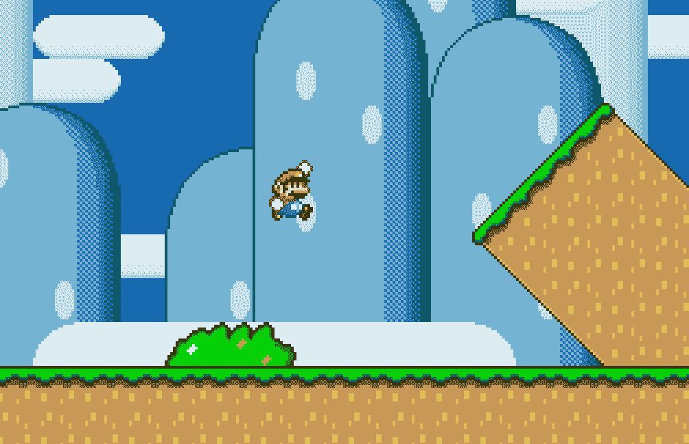
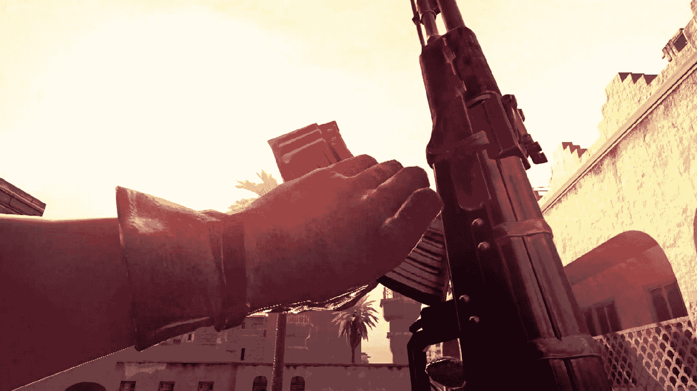
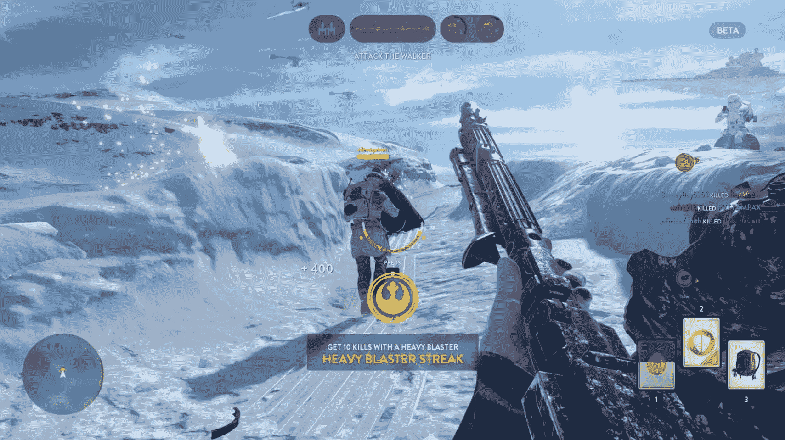
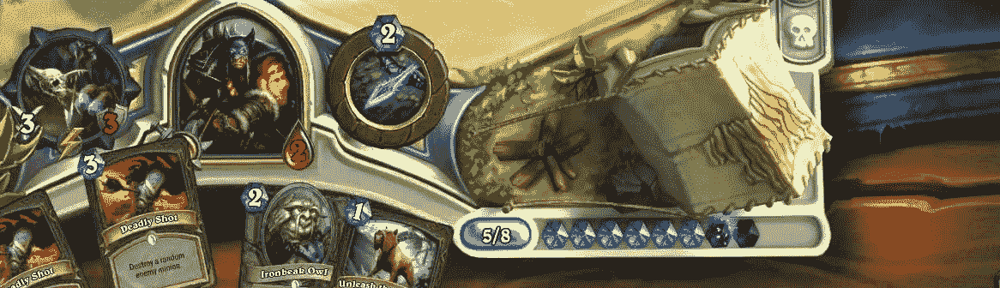
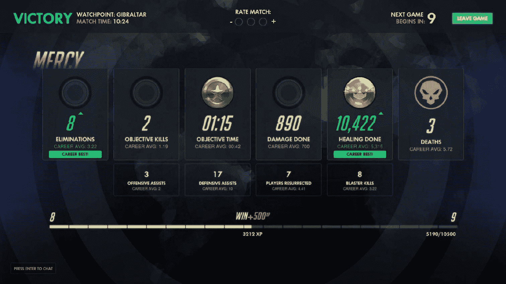
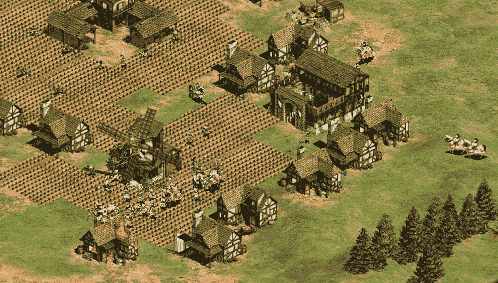
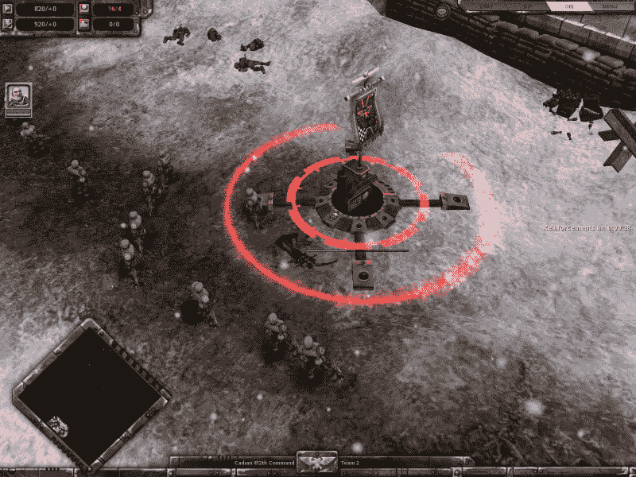
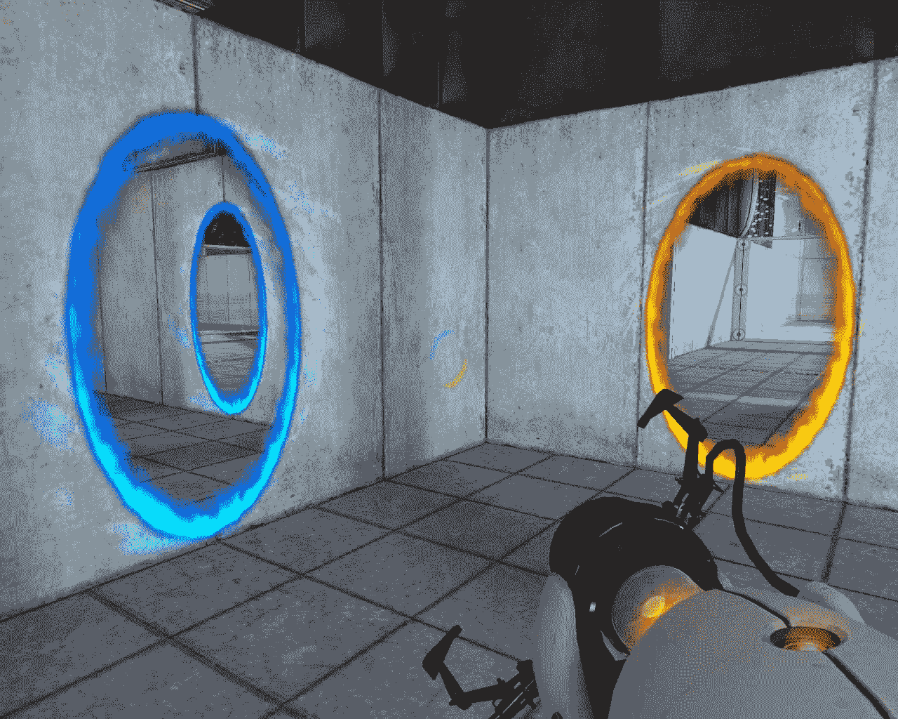

# 第六章

机制改编

我们终于准备好学习游戏设计师最激动人心的创造性挑战：创造游戏玩法。

关于游戏玩法是什么以及它的含义有许多正式的定义，关于机制也是如此。我们这本书的目标不是试图给出新的定义。我们希望保持实用，因此我们将采用最直观的定义，并留给你去发现所有这些词的研究和含义。为了简单起见，我们所说的游戏玩法是指你游戏中所有机制如何共同创造玩家最终体验的方式。

在本章的后面，我们将快速查看游戏机制的具体定义。再次强调，我们将从已经在这方面做得非常出色的其他游戏设计师和学者那里学习，而不试图重新制定我们自己的定义。

在学习如何创建全新的游戏机制之前，我们将专注于如何使用现有的机制，并改变和进化它们以适应你的游戏和所构想的游戏玩法。我们已经讨论过，创造一个新游戏并不总是意味着创造全新的、前所未有的游戏机制。理解现有游戏及其机制，并知道如何解构它们并使它们为你自己的游戏服务，是简单化的关键。

在本章中，我们将学习如何利用熟悉的游戏机制作为起点来创建自己的游戏，并且我们将开发一个有用的框架，一旦掌握，将使你能够应对基于熟悉游戏玩法模式创造新颖事物的新挑战。

什么是游戏机制？

我知道，这是一本关于实用游戏设计的书，但当我们谈到游戏机制和游戏玩法的核心要素时，我们必须通过一些理论。

正式定义任何事物都是一项艰巨的任务；我总是更喜欢引用不同作者的定义。它们都是同样正确的，不同的观点相互补充。我们这本书的目标不是给出一个全面的定义，重要的是通过阅读它们，一个清晰的想法可以留在你的设计师脑海中！

机制是在游戏环境中提供给玩家的各种动作、行为和控制机制。

–《MDA：机制、动态、美学框架》由 Hunicke, M. LeBlanc, R. Zubek 著

游戏机制是基于规则的系统/模拟，通过反馈机制促进并鼓励用户探索和学习其可能性空间的各种属性。

> > > > > > > > > > > –《乐趣理论》由拉夫·科斯特著

它是在所有美学、技术和故事都被剥离后剩下的交互和关系。

> > > > > > > > > > > –《游戏设计艺术》由杰西·谢尔著

明白了？太好了！

这听起来可能很简单，但这些定义需要付出辛勤的努力和深思熟虑才能写成黑白色。再次强调，我们不会深入探讨这些内容，因为这本书更多地关注知识的实际应用，而不是知识本身。请确保阅读我们从其中提取这些定义的原始文章和书籍；它们是每个有志于成为游戏设计师的人必读的。

游戏机制示例

现在我们对理论上的游戏机制有了更好的理解，让我们看看一些来自著名游戏的实际例子，以消除可能存在的任何疑问！

我们将从极其简单的机制开始，不会过多地停留于它们是如何工作的。以下是一个示例列表，以给您提供一个关于游戏中游戏机制的实际概念。

跳跃！

可能是所有机械中最著名的。超级马里奥兄弟（1983）只包含两种主要机制：奔跑和跳跃。

通过按按钮，马里奥可以跳入空中，这样他就能踩在敌人身上或到达不同层级的平台。这种跳跃机制在无数游戏中得到了复制，并催生了一个全新的游戏类型：平台游戏。在下面的图片中，我们可以看到马里奥在行动：

超级马里奥世界中的马里奥跳跃

射击和装弹

这里有两个机制：

+   射击是开火武器的动作。

+   装弹是玩家时不时地需要装弹以保持射击的机制。

早期的射击游戏没有涉及任何装弹，但现代射击游戏可能具有相当复杂的装弹机制，每种机制都有其独特的游戏玩法影响。

例如，想象一下一个经典的 FPS 游戏，如《使命召唤》（CoD）。每种武器都有一个弹夹，一旦弹药耗尽，就必须重新装弹。这使玩家暴露在攻击之下，创造了一个需要策略的时刻，以及装弹时的危险感：一个出色的游戏机制！以下是如何在游戏中看到它的实际应用：

在《使命召唤》中，玩家可以在任何时候按下装弹按钮，开始装弹武器的动作。

《星球大战：前线》采用不同的方法。长时间快速射击武器会导致过热。一旦过热，武器在几秒钟内无法使用。最终效果（动态）与我们拥有的《使命召唤》中的效果非常相似——过热的武器使玩家暴露在攻击之下，并创造了一种危险的情况，但策略不同。与《使命召唤》不同，在《星球大战：前线》中，玩家可以调整射击节奏，这样武器就不会过热，但代价是射速会降低：

在《星球大战：前线》中，武器不需要装弹。然而，如果玩家连续射击时间过长，武器会过热，必须通过在正确的时间按下冷却（装弹）按钮来冷却。

行动点

典型的回合制游戏，行动点是广泛使用的机制。玩家有一笔可以用于执行动作的点数（每个动作都是一个单独的机制，如移动、使用能力、攻击敌人等等）。通常，这些点数也会随时间或每轮恢复：

在炉石传说中，玩家每回合都有一些称为法力的行动点。他可以玩每张牌都有法力消耗。

常见游戏机制列表

这里是一个游戏机制的实际列表，这些机制在电子游戏中很常见。这绝对不是一个详尽的列表，但它将帮助您更好地理解在电子游戏背景下“机制”一词的含义：

+   轮次

+   不同类型的移动（奔跑、爬行、飞行）

+   抽牌

+   时间限制

+   资源收集/收集

+   射击

+   切换武器

+   推动力

+   拉扯

+   拖动

+   射击

+   胜利条件

+   失败条件

+   石头剪刀布

+   随机生成的数字

+   瞄准

+   快速时间事件

+   得分

+   经验值

有数百种。值得注意的是，正如我们所见，一个机制可以是玩家可以执行的动作，也可以是游戏更抽象的规则。

游戏机制相互作用以发展动态

当所有机制协同工作以创造体验时，游戏真正变得生动并触发玩家的真实情感的时刻。通常，这些交互被称为动态，如上述 MDA 框架的案例。

机制和动态之间最显著的区别是，游戏设计师对前者有完全的控制权，但对后者的控制权要小得多。只有玩家才能从机制中产生动态，而游戏设计师的职责就是确保它们以他们设想的方式发生。

控制力较弱并不意味着仅仅设计机制并希望它们能起作用就足够了。电子游戏的乐趣最终在于动态，因此正确地设计它们甚至比设计核心机制更重要。

机制和动态是功能的一部分

我们知道机制是我们游戏的基础。我们已经了解到我们机制之间的相互作用创造了动态，现在我们终于可以解释一下“功能”这个术语了。

一个游戏功能是一整套机制，设计一个功能不仅意味着描述每个机制，还意味着它们在游戏中的动态生成和交互。

一些功能示例包括战斗、多人排行榜、制作、武器升级、世界地图、在线模式、公会、锦标赛和程序生成内容；这个列表仅受设计师想象力的限制。

这里有一些常见功能及其在流行游戏中的示例列表：

| |   角色创建   |   天际，永恒之柱，魔兽世界 |
| --- | --- | --- |
| |   战斗系统   |   黑魂，使命召唤，国际象棋 |
| |   公会战争   |   部落冲突， lineage II |
| |   制作   |   我的世界，巫师 |
| |   比赛   |   Overwatch, FIFA |
| |   世界地图   |   Far Cry, Fallout |

重要的是要知道，一些功能可以由许多其他更小的功能组成——在开放世界游戏中，开放世界通常被描述为一个功能，但开放世界包括如世界地图、旅行、天气和时间、遭遇等许多更小的功能。

接近机制设计

现在我们已经对游戏机制和动态背后的理论以及它们是如何成为游戏功能构建块有了基本的了解，让我们来看看如何着手处理它们。

正如我们在第四章《设计文档》中讨论的那样，每个设计过程都应该从定义一些目标和需求开始。

在创建你的机制时，你应该始终牢记以下问题：

+   该机制的目标是什么？

+   目标是否对玩家来说清晰可见？

+   哪些规则会影响机制？

+   玩家会得到什么反馈？

你正在开发的游戏类型及其愿景应该指导你找到答案。比如说，你正在制作一款以近战战斗为核心动作中世纪奇幻游戏。你将首先关注的机制可能就是攻击敌人的动作。

战斗系统的目的是什么？

无论你的游戏主题和愿景是什么，我们正在讨论的是一款动作游戏，这本身就已经提供了一些见解。

以动作为导向的战斗游戏挑战玩家的身体技能，并利用他们对可用游戏动作的了解。因此，一个要求肯定就是使用玩家的手眼协调技能。它还应该使用记忆技能，通过按键组合来拉出连招或特殊攻击。这类机制的目标通常是给玩家提供一个基于技能的系统，易于学习但难以精通，以便使用不同的武器和战术与不同的敌人作战。

规则和游戏机制

规则对任何游戏都极其重要。根据不同的游戏机制定义，它们可能不被定义为机制本身，而是作为它们的一部分。例如，我们战斗系统的规则可能是玩家每秒可以执行的攻击次数。规则可以定义对行动或必须遵守的条件（例如胜利条件）的限制。规则使游戏变得有趣，因为它们决定了游戏行动可以发生的空间。

想象一个捉迷藏游戏，寻找者不需要在其他人藏匿时闭上眼睛。那将是史上最无聊的捉迷藏游戏！规定寻找者必须闭上眼睛并数到一个预定的数字，是为了强制一个使游戏变得有趣挑战——对寻找者来说，他们不能看到玩家藏匿的地方，对藏匿者来说，他们有有限的时间来藏匿。

我们可以说，这个规则本身并不是一个机制。在捉迷藏中，有两个主要的机制：寻找者寻找和隐藏者隐藏。规则是寻找机制的一部分，但无论如何，它是游戏的基本部分。

区分机制和规则可能有些困难；再次强调，这将是理论上的努力，我们不想在本书中探讨这一点。

重要的是你要理解，在游戏设计时，机制和规则需要结合起来，同时考虑。

机制和动态产生反馈

最后，是反馈，这可能是电子游戏中游戏机制最重要的部分。

维基百科给出了以下关于电子游戏的定义：

"电子游戏是一种涉及与用户界面交互以在视频设备上生成视觉反馈的电子游戏"。

"反馈"这个词本身就是电子游戏定义的一部分。

我们可以争论维基百科的定义并不完整（或已过时），因为这种反馈不一定是视觉的。它可以是音频的，甚至是触觉的（最传统的触觉反馈是游戏控制器的震动，但随着虚拟现实的发展，触觉反馈和设备正以惊人的速度发展）。

在电子游戏中，反馈无处不在，并且是任何游戏机制的核心。对于每个玩家的动作，游戏必须有一个立即可感知的变化与之对应。

当你在控制器上按下特定的按钮时，马里奥在屏幕上跳跃，以及他发出的标志性弹跳声，这些都是反馈。

反馈不仅限于玩家的即时动作。经验值（XP）进度条是一种视觉反馈，它为玩家提供了关于他们需要多少 XP 点才能达到下一级的重要信息。更重要的是，每当玩家完成一次奖励 XP 的动作时，XP 条会闪烁并稍微前进。这是一种教授玩家游戏中的因果关系关系的绝佳方式：

在《守望先锋》每一场比赛结束时，结果屏幕充满了视觉反馈。它出色地提供了关于玩家表现、进度以及比赛结束后即将发生的事情的信息。

反馈对于理解游戏世界和逻辑同样至关重要。想象一下，如果在相同的情况下执行相同的动作每次都不产生相同的结果（和反馈），这对玩家来说将是非常令人沮丧的，并会削弱游戏的乐趣。例如，你知道在射击游戏中你可以通过按下特定的按钮来开火，比如在 PlayStation 控制器上的 R2 按钮。每次你按下这个按钮，你都期望你的武器开火。如果偶尔，同样的按钮会产生不同的效果，比如例如将武器扔向敌人而不是射击，我们就会有一个愤怒的玩家。出于同样的原因，如果武器卡住了或者必须重新装填才能射击，我们期望游戏以某种方式告诉我们射击不可用，我们需要重新装填。在这种情况下，按下相同按钮的结果实际上会不同（如果武器已装填则射击，如果没有则不射击），但提供给玩家的反馈必须尽可能详细地描述正在发生的事情。

寻找合适的参考

你如何基于现有的游戏机制创建一个新机制？你如何找到合适的参考来开始创建自己的？

第一步是寻找包含与你为游戏设想的功能和机制类似的游戏。你的游戏概念应该给你一个明确的想法，你应该查看哪些游戏。

到目前为止，你应该已经清楚地知道你的竞争对手是谁（如我们在第二章中看到的，游戏概念），并且仔细观察你的竞争对手的游戏机制非常重要。这是两个原因：

+   在这里，你将找到你游戏的基本机制

+   这将给你一个清晰的想法，了解类似你游戏的游戏是如何玩的。你的目标是最终做出一些不同的事情，而不仅仅是复制粘贴已经完成的事情！

让我们举一些实际的例子。

假设你正在开发一款即时战略游戏，需要定义资源的收集和管理方式：

在《帝国时代》中，玩家需要通过分配工人到各种资源（如农作物、森林、矿山和农场）来收集资源

你可以选择采用经典的《帝国时代》方法，其中资源散布在地图上，你必须派遣特定的单位去收集它们，或者尝试一种现代方法，比如在《战争黎明》中，你的资源是通过占领和维护战略点来获得的：

在《战争黎明》中，玩家通过控制战略点来生成资源点

这两个都是很好的参考，你可以分析它们来决定哪种方法更适合你的游戏。

> > > 在这里记住独特卖点（USP）的概念是很重要的。你的游戏不太可能有多个 USP，这是完全可以接受的！如果资源收集不是你游戏真正关注的事情，但仍然需要资源收集机制，只需拿已经建立好的东西即可！
> > > 
> > > 从现有游戏中提取对你游戏有效的机制，如果你不想浪费时间在相关联的事情上，专注于你的真正独特卖点（USP）的话，这正是你所需要的。

也许你正在制作一款经典的 2D 平台游戏，其中跳跃是它的核心机制之一。你需要查阅的参考资料可能相当多：超级马里奥、恶魔城、索尼克、大金刚、雷曼、指挥官 keen……有成百上千个例子。

在这种情况下，你应该专注于你希望玩家体验的用户体验，并将列表缩减到只有那些给你带来类似体验的游戏。

是的，为了做到这一点，你需要玩很多游戏，特别是那些你不会考虑作为玩家去玩的游戏……这是你工作的一部分！在心中对游戏和类型进行分类，并将它们分类为体验，对于任何游戏设计师来说都是必须的。

> > > 保持游戏日志。每次你玩游戏时，记下你的感受和想法。几句话和游戏日期就足够了。这将是宝贵的信息，甚至多年后也是如此。

解构你的参考资料。

一旦我们找到了完美的参考资料，就是将其解构为更小的体验的时候了。我们需要分析这些机制，并理解为什么它们被这样开发。然后我们需要理解我们为了在我们的游戏中实现它们并使它们按照我们的愿景工作需要做什么。

让我们回到我们之前的平台游戏例子。

我们想要分析 2D 平台游戏的跳跃机制。我们将选择一个经典例子：超级马里奥兄弟。

跳跃当然是一个核心机制。但我们还能对它说些什么吗？

+   马里奥能跳多高？

+   他跳跃时能覆盖多少距离？

+   一旦角色在空中，你能控制他吗？

+   有没有直接影响机制的规则？

+   玩家在跳跃动作中面临什么样的挑战？

让我们尝试解决这些问题。

+   玩家按住 JUMP 按钮的时间越长，跳跃的高度就越高。

+   跳跃覆盖的距离取决于角色跳跃时的速度和跳跃的高度。

+   马里奥悬浮在空中，玩家可以使用方向移动来调整下落至目标位置。

+   马里奥的跳跃受到重力的影响——他上升的速度比下降慢。

+   挑战包括：

    +   通过跳跃避开敌人和障碍物。

    +   跳跃击中敌人的头部以杀死他们。

    +   避免掉入陷阱。

    +   通过跳跃到达特定的平台。

这些发现有趣，不是吗？

> > > 有各种方法可以解构游戏和游戏机制。当你想要理解现有游戏中的机制时，了解它是如何制作的一个好方法是询问工程师他们对如何实现它的看法。它在技术层面上是如何工作的？对这类问题的洞察可能会揭示很多关于游戏机制的信息！

既然我们已经分析了超级马里奥（Super Mario）中的跳跃机制，让我们再来看一款明显受到了马里奥启发的流行平台游戏：超级肉男孩（Super Meat Boy）。

在超级肉男孩中，核心机制仍然是跳跃动作。开发者是如何从它制作出一个完全新颖且清新的游戏的呢？

首先，影响马里奥跳跃的重力规则被简化了：超级肉男孩的跳跃是对称的，因为上升的速度和下降的速度相同。

初看这似乎是一个微不足道的小细节，但事实上，这种简化使得肉男孩（Meat Boy）更加反应灵敏和可控，他的跳跃比马里奥（Mario）的跳跃更加可预测。

毫不奇怪，超级肉男孩是一款节奏更快的游戏。

肉男孩跳跃的可预测性还服务于另一个目的：玩家通常需要在序列开始时屏幕外的平台上进行一系列跳跃。因此，他必须在毫秒内做出决定和采取行动——这是用马里奥的重量和物理特性难以轻易做到的。

超级肉男孩跳跃机制中另一个独特的添加是墙壁跳跃。通过在墙上着陆跳跃，可以立即向上和相反方向从墙上再次跳跃。这是一个简单的添加，使得垂直攀爬等动态成为可能，因此创造了一个完全不同且全新的游戏。

增量和减量设计

我们之前的超级肉男孩跳跃例子完美地引出了我们将要讨论的主题：增量和减量设计。

通过移除重力元素，肉男孩的开发者从经典的跳跃机制中减去了一些东西，而另一方面，他们通过允许墙壁跳跃来增加了这个机制。

增量和减量设计是任何游戏机制改编背后的原则。

尤其是增量设计，一直是游戏开发者用来创建新视频游戏的方法。扩展和改进现有的游戏机制，对于游戏设计来说，就像引入具有突破性的新机制一样，是至关重要的。

虽然减量游戏设计可能更为重要。

我们已经讨论了“少即是多”的原则以及它应该如何在整个设计和其文档中得到应用。在游戏机制中应用这个原则不仅关乎优雅，它还能帮助游戏设计师发现（或重新发现）游戏机制核心的乐趣及其易用性。

'减法设计是一个去除不完美和多余部分的过程，以强化核心元素。你可以把设计想象成一件你构建、构建并让其成长的东西，但它是修剪掉多余部分，给设计带来简洁、优雅和力量的。'

– 大卫·西尔林，游戏设计师

游戏设计中减法设计以及它如何将优秀的游戏转变为伟大的游戏的例子在电子游戏的历史中无处不在。

Valve 公司的游戏《传送门》是简约游戏设计的绝佳例子。在《传送门》中，你可以使用传送门枪打开两种不同类型的传送门——橙色传送门和蓝色传送门。核心机制是你可以从橙色传送门进入并从蓝色传送门出来。你没有实际的武器，没有库存屏幕，没有 NPC 或敌人（除了炮塔和最终 Boss）。控制操作极度简化，只有移动、射击两种传送门、跳跃和携带物体的动作按钮：

《传送门》中的传送门机制

《传送门》的水平几乎不包含任何东西，除了作为谜题一部分的元素、作为提示的视觉线索以及与故事相关的元素。这种简约设计将所有重点都放在了传送门机制本身上，这非常有趣。基本上，你能做的只是开枪制造传送门并在它们之间移动来解决谜题。游戏没有其他核心机制，这允许设计师完全探索传送门机制的所有可能性，专注于玩家真正觉得有趣的事情，并远离任何分散注意力或不合时宜的内容。

将所有这些重新组合在一起

一旦你找到了参考，分解了它们，以最重要的元素为基础来开发你的机制，最终添加或删除你需要的东西来实现你的游戏玩法愿景，那么就是最终测试它是否真正有效的时候了！

到目前为止，你可能还没有为团队编写详细的文档。很可能是你处于某种原型阶段。特别是对于核心机制，测试你的假设（即乐趣）的唯一方法就是玩游戏。

我们将在后面讨论如何有效地原型化游戏机制和流程。现在，重要的是你要理解，创建新机制的过程与工作软件是相辅相成的。

要知道你的角色的跳跃是否需要遵循现实物理，执行的速度应该是多少，以及最大高度是多少，唯一的方法是玩游戏并感受你的设计假设是否正确。

或者更准确、更现实地说，看看它们是如何错误的。

在这个从您的机制中添加和删除元素以及调整它们价值的迭代过程中，您最终将找到完美的游戏感觉，并将其最终固定到您的游戏设计文档（GDD）中……或者失败并意识到您的一些假设是错误的——尽管如此，不要害怕失败。失败得越快，您就有更多的时间去纠正错误或决定您是否真的走错了方向。

> > > 本章节中使用的截图仅用于说明目的。我们不推荐您以任何方式滥用这些截图。如需更多信息，请参阅本书免责声明部分提到的出版商的条款和条件。

摘要

在本章中，我们探讨了构成游戏的基本元素以及它们如何相互作用，从而创造动态。我们发现，玩许多不同的游戏并能够回忆起它们的核心理念，对于您自己游戏创作的有用参考至关重要。我们还学习了一些有价值的游戏设计原则，这些原则将帮助我们将现有机制适应成新的、符合我们游戏愿景的东西。

在这个坚实的基础之上，我们准备进入下一章，我们将学习一项更加困难的技艺——新机制的创作和寻找创新的游戏玩法。
