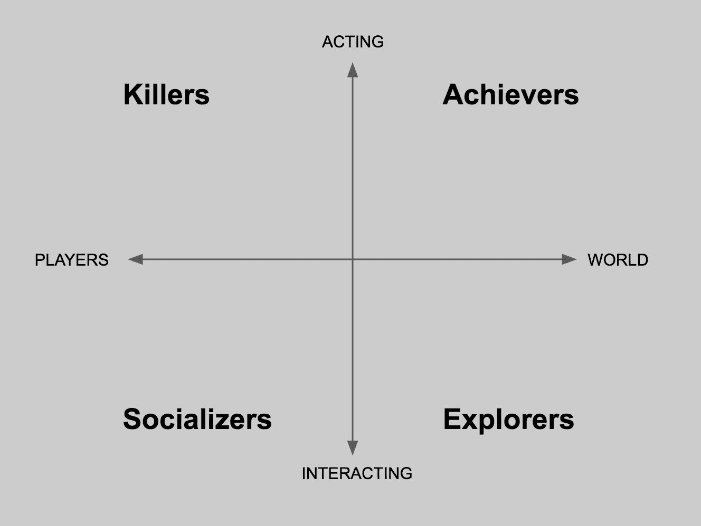
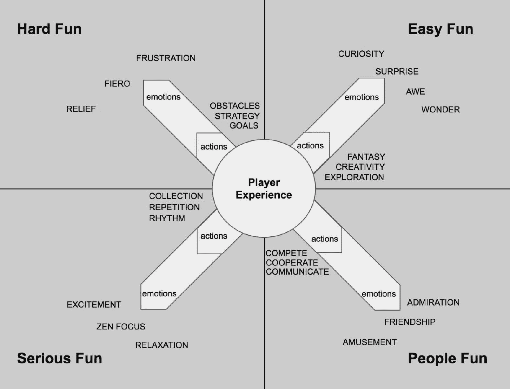
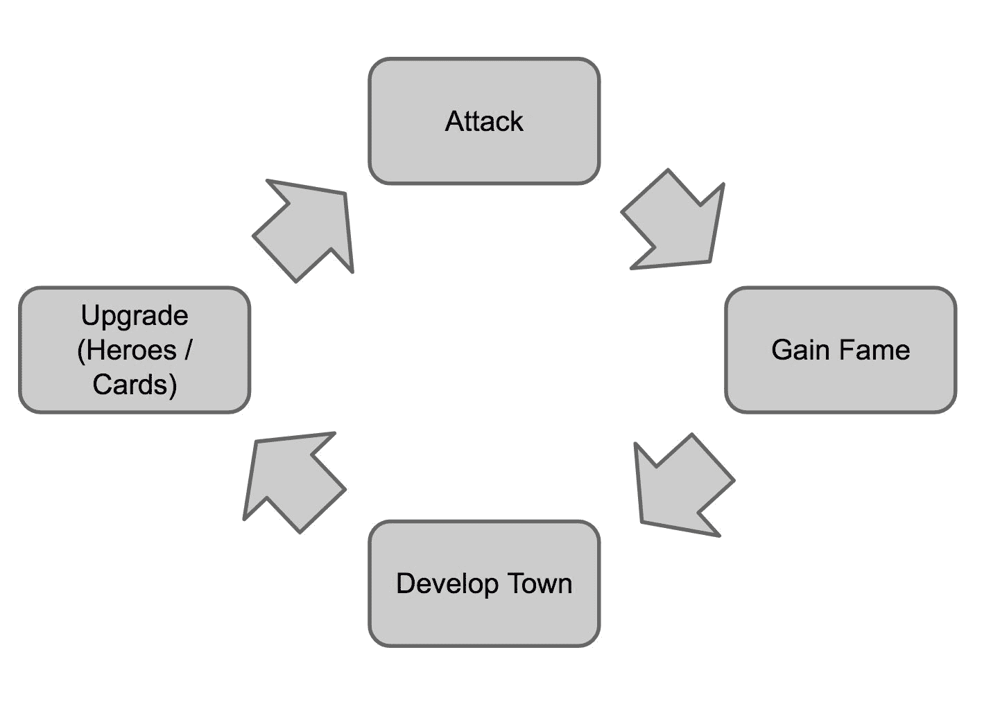

# 第七章

机制发明

现在我们已经知道了如何适应游戏机制以及哪些过程可以做到这一点，是时候专注于游戏设计师最具挑战性和最激动人心的任务之一：想出全新的游戏机制！适应和创建新机制之间的区别很微妙。在本章中，我们将看到新游戏机制不仅可以作为玩家可用的动作，还可以作为由现有核心机制在游戏中产生的不同动态来创建。

我们将讨论一些游戏设计和机制创造背后的理论，以及如何向玩家传授新机制以及游戏核心循环的形成。最后，我们将仔细研究战斗系统的设计以及为什么战斗和冲突是许多电子游戏的重要组成部分。你将了解复杂性和深度以及游戏设计师需要通过它们解决的问题。

这章可能是整本书中最重要的章节。我们需要更广泛地了解游戏设计理论，并暂时不那么实用。尽管如此，这仍然是一个快速概述。因此，我们强烈建议您将其作为基础，从那里您可以继续跟进并深化您的知识。如果您觉得所有这些信息让你感到不知所措，请不要害怕。我们将在本书的参考文献中找到我们引用的每一本书、作者和文章。

准备好了吗？

让我们开始吧。

将一个想法发展成一种体验

创建新游戏机制的主要原因可以描述为给玩家提供一种新颖体验的需求。我们了解到游戏愿景为我们设计师提供了一个清晰的方向，以便我们开发游戏。通过可视化我们希望玩家体验到的体验，我们迈出了构思新游戏机制的第一步。

让我们看看一个实际例子。

现代第一人称射击（FPS）游戏与我们 80 年代和 90 年代所玩的游戏大不相同。当我们沉浸于狂热的射击游戏时，我们需要的只是一些有趣的敌人、几件不同的武器以及一些基本控制，比如移动和射击。

为了更好的沉浸感，游戏设计师开始提出一些问题，例如：“我们如何使 FPS 游戏更真实？”“我们如何使射击更具战术性？”“我们如何让玩家有身临其境的感觉？”

真实的枪战场景与像《狼人杀》和《雷神之锤》这样的视频游戏相去甚远，在这些游戏中，玩家基本上可以冲锋陷阵，向敌人射击大量弹药，并且毫不犹豫地承受重火。想象一下，作为设计师，你的任务是给那些经典的 FPS 游戏增加更多策略，以唤起更真实的射击场景。你会为只有移动和射击机制的游戏添加哪些机制？

这个问题的正确答案有很多，所以在我们继续阅读之前，试着想象其中几个吧！

完成了吗？太好了！

一个常见的答案可能是：增加掩体。

在真实的枪战中，你通常不会看到人们端着枪冲向敌人……这在电子游戏和电影中很典型！现实中，人们通常会寻找掩护！他们试图找到一个可以保护自己免受子弹的地方。只有在安全的情况下，他们才可能稍微探出头，从掩护后面还击。想象一下，如果你按下一个按钮，你的角色可以蹲在障碍物后面并寻找掩护。当然，敌人也可以这样做。你能想象出与最初的基本 FPS 游戏相比，这款游戏会有多么不同吗？

现在你甚至可以更进一步。你的角色能否从掩护后面射击？（在某种程度上，这与只是离开掩护射击是不同的……也许他从那里射击不太精确？或者只能进行压制性射击……）你的角色能否低头从掩护移动到掩护，而不是仅仅在它们之间行走或奔跑？

Naughty Dog 的《未知的 charted》和 Ubisoft 的《全境封锁》是第三人称战术战斗系统的绝佳例子。找到合适的掩护位置并在它们之间移动是赢得战斗的关键。这也给了玩家选择如何应对不同遭遇以及如何利用地形的选择自由。

当然，敌人对玩家行为的反应与可用的机制一样重要。敌人可能会使用不同的武器将玩家逼出掩护，比如手榴弹或能够摧毁这些掩护的重火力。或者，也许会有敌人携带近战武器，在玩家躲在掩护后面时向他冲来。

满足对战术和挑战性游戏体验的需求是创造有趣机制和动态的关键。需要注意的是，现实感并不一定是我们想要提供给玩家的体验。事实上，一些游戏设计师可能恰恰相反。这种情况在像《毁灭战士》（2016 年最新版本）这样的游戏中很常见。战斗系统背后的想法是回到 FPS 类型的根源，提供直观的射击和狂野的动作。如果游戏提供了掩体和潜行动作等机制，你如何获得这种体验呢？

要回到最狂野的 FPS 动作游戏，Doom 的游戏设计师们提出了一个新的游戏机制：荣耀击杀。简而言之，通过用子弹猛击敌人，玩家可以让他踉跄，然后执行一个特殊近战攻击，瞬间（而且相当残忍地）将他杀死。

在执行荣耀击杀时，玩家是无敌的，敌人总是会掉落额外的物品，如弹药和生命值。因此，执行荣耀击杀是一种有回报的战略选择，迫使玩家以非常激进的方式接近战斗，并且始终向前推进。所有这些都是从我们希望玩家体验中创造出的新游戏机制的优秀例子。让我们再举一个例子，一个完全不同类型和机制的例子。

冒险、角色扮演游戏以及基于叙事的游戏通常基于与 NPC 的对话和互动。在这些游戏中，对话与动作一样重要，玩家需要做出关键的选择。一种管理具有多个选项的对话的经典机制被称为分支对话。

不同的线路会开启对话的不同分支，这通常会导致不同的结果和后果。但如果玩家有足够的时间做出选择，如何增加紧张感和压力感？在互联网时代，玩家甚至能在几分钟内暂停游戏，在网上寻找最佳答案。

在 20 世纪 90 年代初，世嘉的《樱花大战》使用实时对话系统来回答这个问题，玩家只有几秒钟的时间来决定选择哪个选项。这个极其简单的机制改变了所有的一切。许多现代冒险游戏都受到了这个机制的启发。Telltale Games 因其基于实时对话的叙事游戏而闻名，在过去的几年里，这种游戏类型重新引起了人们的兴趣。

新机制以解决问题

有时需要新的机制来解决已知的游戏玩法问题。这在实时游戏中是一个典型的场景（例如移动游戏或大型多人在线游戏），游戏会不断更新和调整，以满足其受众不断变化的需求。但这也可能适用于续集、系列作品以及 alpha 或 beta 测试之后的最终发布。

一个很好的例子是《皇室战争》中的宝箱机制，这是移动游戏历史上最有趣的机制之一（并且也是促成 Supercell 实时 PvP 游戏大获成功的原因之一。）

这就是它的运作方式：

在《皇室战争》中，通过赢得一场战斗，玩家可以获得宝箱。宝箱里装有卡片和金币，这两者对玩家的进步至关重要。玩家必须先解锁宝箱，才能获得其中包含的奖励。解锁宝箱需要一定的时间。或者，可以使用宝石（相当于真实货币）来跳过等待时间。每位玩家有四个宝箱槽位，因此他们一次只能有最多四个宝箱等待。即使宝箱槽位已满，玩家仍然可以战斗，但不会赢得任何宝箱，因为所有槽位已被占用。

你认为这个机制解决了哪些问题并得到了解决？

在继续阅读之前，思考几分钟。很明显，Supercell 如何解决了免费游戏移动游戏中的某些主要问题，即如何有机地整合：

+   会话（每次游戏应该持续多长时间以及多久进行一次）

+   留存（为什么玩家应该回到游戏中）

+   货币化（如果玩家迫不及待地想要打开宝箱……他总是可以花费一些硬通货来实现这一点）

+   进度（打开宝箱是获取新卡牌的主要方式，因此也是升级你的牌组并推进游戏进程的主要途径）

在大多数移动游戏中，每个关键问题都通过一套有时感觉脱节且有点人为构建的功能来具体解决。Supercell 如何将所有这些整合到一个单一机制中的优雅，是对他们惊人的才能和巨大成功的证明。

> > > 在主机和 AAA 游戏空间中找到全新的游戏机制相当困难。创新通常意味着风险，而大型项目并不适合承担风险。这就是为什么独立游戏和移动游戏通常会有很多更加创新的功能（有时，它们在其游戏类型中具有颠覆性）。始终关注独立和移动游戏场景，看看设计师们是如何以更高效、更优雅的方式解决常见的游戏设计问题的。

新的机制以进行创新

另一种提出新机制的方法是问自己事情可以如何以不同的方式完成。跳出思维定势是每个游戏设计师的关键技能。如果你知道或熟悉某样东西，然后完全重新发明它，那么“如果……”是一个很好的问题来开始。

就像“如果我们把零重力引入超级马里奥会发生什么？”这样的问题可以开启一片新的可能性，以及未探索的游戏机制和玩法。当试图创新时，少即是多的原则再次派上用场。许多游戏通过从现有游戏中去除某些元素来创新整个游戏类型。

“如果在平台游戏中，角色只能自动向一个方向跑，而玩家唯一可用的动作就是跳跃？”这就是为什么 Canabalt（2009）诞生了，重新发明了平台游戏类型……实际上，发明（或者更准确地说，普及——见以下信息框）了一个新的类型：无尽跑酷。

> > > 虽然在韩国，无尽跑酷的概念早已为人所知，但记者们将 Canabalt 视为那个独自发明了智能手机友好的单按钮跑酷游戏类型的标题，并不仅产生了无数克隆品，还产生了许多依赖该机制的伟大原创游戏，包括任天堂的超级马里奥跑酷。

创新的过程最难跟踪，但通常是提升标准到下一个层次的过程。那些能够做到这一点（以及游戏设计师）的游戏，是那些在游戏和游戏历史中留下印记的游戏。当然，并非所有的新机制都是创新的，因为在这里，我们所说的创新是指某种演变或革命性地改变做事方式的东西。

然而，值得注意的是，创新可以来自上述任何一种方法。不同之处在于，一些游戏设计师制作游戏（或游戏的一部分）的目的是为了创新，这正如你所想象的那样，需要一种特定的方法。

构建新的游戏机制

为了能够发明一种新的游戏机制，我们需要回到一些理论。了解如何分类不同的机制，为什么它们有趣，以及它们吸引哪种类型的玩家，如果我们想要提出一些新的东西，这是极其重要的。我们需要某种种子来将我们的创新想法培养成新的游戏机制。

关于乐趣、玩家类型和游戏机制有许多分类和定义：它们都是有效的（也许有些在客观上比其他更好……）。在你的职业生涯中，你将有很多机会阅读和研究它们，我强烈建议你这样做。就我个人而言，在所有我阅读过的研究中，我更喜欢三位作者，我认为他们对这类理论话题的处理方式最适合关于实用游戏设计的书籍。

这些作者以及他们所涵盖的相应主题是：

+   理查德·巴特利，以及他对玩家类型的分类

+   尼科尔·拉扎罗和她关于四种乐趣类型的研究

+   詹斯·谢尔和他的游戏机制分类法

在接下来的段落中，我们将探讨这些主题。通过理解它们，你将能够设计出更好的游戏机制，最终提供更好的玩家体验。

> > > 在你的职业生涯中，你将多次遇到由你的直觉和设计师敏感性产生的决策和设计。有时，你甚至不知道自己已经应用了游戏设计理论。然而，定义一个优秀的游戏设计师（以及游戏设计）的是你能够捕捉到所有这些直觉，并利用你通过学习和阅读获得的知识来解释它们。每次当你不确定为什么某事是这样的，就回到书本上，确保你真正知道你在做什么！

巴特利的玩家类型

理查德·巴特利是第一个虚拟世界（被称为多人地下城（MUD），1978 年）的创造者，也是我们行业中最重要学者和作家之一。在他的研究中，他将那些喜欢在虚拟世界中游玩的玩家类型进行了分类（这种分类也可以应用于其他类型的游戏，但值得注意的是，作者的本意是仅针对大型多人在线游戏）。

他确定了四种主要的玩家类型：

+   成就者

+   社交者

+   探索者

+   杀手

让我们更深入地看看每个类别，并尝试理解为什么这对于游戏设计师来说如此关键。

成就者是指那些享受在游戏中设定并达成目标玩家。这些目标可能是游戏本身明确设定的（例如胜利条件、要解决的任务、要攀登的排行榜、要完成的收藏），或者他们可能喜欢为自己设定目标（例如在不输的情况下完成游戏或在尽可能短的时间内完成）。成就者希望将游戏玩到极致，这可能是有意为之，也可能并非游戏设计初衷。

社交者从他们在游戏中与其他人的互动中获得乐趣。不言而喻，多人游戏是这种类型玩家的最佳游戏，但不要忘记，社交互动可能以许多方式在游戏世界之外建立。

2008 年左右开始流行的 Facebook 和社交游戏，其惊人的受欢迎程度基本上都要归功于这些玩家。可以肯定地说，整个电子游戏媒介的受欢迎程度也很大程度上归功于那些不仅喜欢玩游戏，还喜欢分享他们体验的玩家。

探险者是指那些喜欢沉浸在游戏提供的每一丝知识中的玩家。这可能是一款角色扮演游戏（如《上古卷轴：天际》）的背景故事，或者是一款可收集交易卡牌游戏（如《万智牌》）的规则和卡片。探险者是游戏世界的专家。他们通常是那些知道游戏甚至比游戏创造者还多的玩家。

杀手最后，是那些被征服竞争刺激欲望驱动的玩家。这些是竞争激烈的玩家，他们将电子游戏视为一项运动，并不断努力提高以统治他人。与成就者不同，杀手的提高欲望是由击败其他玩家的唯一目标驱动的，而不是那么多的进步乐趣：

巴特尔的四种玩家类型以及他们如何与虚拟世界和其他玩家互动

巴特尔的这项研究深入得多，分析了这些类别之间的互动以及它们如何影响游戏设计和虚拟世界的整个存在（巴特尔明确指的是我们定义的大规模多人在线游戏）。再次强调，他的书籍是非常值得阅读的。

关于如何利用玩家类型来创造新的游戏机制，很明显，了解你的受众并以此为设计理念是非常重要的。话虽如此，有两件事永远不能忘记：优秀的游戏为每种类型的玩家提供有趣的游戏机制，而且一些玩家可能有很多方面，有时喜欢作为探险者，有时喜欢作为杀手。

拉扎罗的乐趣类型

尼科尔·拉扎罗提出了与巴特尔斯类似的模型，但她不是关注玩家，而是关注他们的情感以及他们在玩游戏时的乐趣类型。她定义了四个乐趣关键，并指出，一般来说，一个游戏要想有趣，至少在游戏体验中必须存在这四个乐趣关键中的三个。

每个乐趣的关键都对应着一些基本的人类情感：

+   艰难乐趣：挫败与自豪，在克服逆境的个人胜利时刻

+   简易乐趣：好奇，敬畏

+   严肃乐趣：兴奋与放松（舒缓）

+   人际乐趣：娱乐，快乐

你已经可以看到与巴特尔斯模型的联系。但不要犯这样的错误，认为社交者可能会经历的乐趣是“人际乐趣”，或者探险者可能会经历的乐趣是“简易乐趣”。事实并非如此，正如我们所说的，一个好的游戏至少应该为每位玩家提供四种乐趣中的三种：

拉扎罗的四个乐趣关键。游戏中的某些动作会触发玩家的特定情感，从而实现特定类型的乐趣

让我们看看几个流行游戏的实际例子。

以其难度著称的《黑暗之魂》系列，以及对玩家造成的巨大愤怒和挫败感（你是否已经看到了这一点？）那就是，当然，它的艰难乐趣成分。在寻找最佳策略的过程中不断死亡所感受到的挫败感与获胜时所体验到的胜利感成正比。那种获得有意义胜利的感觉是非常强大的。

在《黑暗之魂》中，艰难乐趣和严肃乐趣是相辅相成的；战斗的难度产生了被打败的玩家的挫败感，但这也是使进步、升级、找到合适的装备和制定策略变得有意义的原因。

当开始与 Boss 战斗时肾上腺素的激增是一种只有困难情况才能提供的强大情感。

那么，简易乐趣呢？你可能会认为像《黑暗之魂》这样的游戏并不提供很多简易乐趣的机会...但看看互联网上有多少关于这个游戏的梗！游戏可能并没有考虑到那些有趣的时刻，但仍然，通过为玩家的创造力提供一个游乐场，游戏设计师已经为大量的简易乐趣打开了可能性。

手势功能（玩家获得诸如挥手或欢呼的动作）以及它如何被用来捕捉游戏的有趣截图，是简易乐趣（结合社交乐趣，其中一部分是分享这些截图或视频到互联网）的一个完美例子。

另一个很好的例子是令人信服的控制系统带来的简易乐趣。如果你认为在《黑暗之魂》中只是四处滚动或跳跃到目的地比直接跑得快...那你正在体验简易乐趣！

人们乐趣（或社交乐趣）是最直接的。无论是合作模式还是 PvP，黑暗之魂提供了你所需要的一切来体验人们乐趣。但再次强调，当我们谈论社交乐趣和与真实玩家的互动时，总是要跳出思维定式（在这种情况下是跳出游戏）。视频游戏中的社交乐趣来源于游戏世界之外。仅通过观看就令人愉快的游戏，或者人们观看得和玩得一样多的电子竞技（如《英雄联盟》），提供了难以置信的机会，以及相当真实的感觉和乐趣。在设计你的游戏机制时，请记住这一点。在现代游戏中，可观赏性（Watchability）与可玩性（Playability）一样重要。

Shell 的游戏机制分类法

Jesse Schell（在《游戏设计艺术》中）对游戏机制进行了出色的分类。你几乎可以想到的所有游戏机制几乎都落入以下类别之一：

+   空间

+   物体、属性和状态

+   行动

+   规则

+   技能

+   机会

通过理解这些类别，你将能够清楚地了解如何组合你的新游戏机制，从而实现更自觉的设计。

机制 1 – 空间

空间是游戏发生的空间。根据 Schell 的说法，所有游戏空间都是：

+   离散或连续

+   维度

离散空间（如井字棋的网格）有有限数量的单元格或位置可以填充或移动到，而连续空间（如足球场）则允许在有限空间内进行无限移动。Schell 所说的维度是指游戏是在 2D 还是 3D 空间中进行的。例如，一个改进的 2D 平台游戏的图形重制版，仍然只在二维空间中进行。Schell 借鉴了建筑领域来解释如何设计有效的空间。

他提出了五种游戏空间类型：

+   线性：玩家只能基本上向前和向后移动（Monopoly）

+   网格：移动受到离散、相邻形状的限制（Chess）

+   图形：由离散路径连接的几个点（Talisman）

+   空间中的点：几个没有指定连接路径的点（Final Fantasy）

+   分割空间：分割成不规则部分的区域（Risk）

机制 2 – 物体、属性和状态

一个游戏的空间充满了物体：角色、物品、建筑、道具、岩石、树木以及其他角色。基本上，任何可以在游戏中与之交互的东西。在计算机科学术语中，这些物体具有属性（屏幕上的位置、视觉外观、统计数据...）和状态（死亡或活着、当前速度、最大速度等），这些属性有助于定义它们以及它们如何与其他游戏元素交互。

Shell 将术语名词和形容词与对象和状态相关联。你可以用名字描述你游戏中每个对象，并可以使用形容词来指定其属性和状态。例如，一辆汽车（对象）可能具有以下属性：红色（颜色）、快速（速度）和敞篷（类型）。这些都是形容词，用来描述汽车——其属性。它还可以有一个状态，例如，它是否在移动。

机械 3 - 动作

如果物体及其属性是名词和形容词：动作就是动词。转向、加速、制动。这些动词描述了我们之前讨论的汽车对象可用的动作。

Schell 描述了两种类型的动作：

+   操作动作

+   结果动作

操作动作是游戏中可用的基本动作。例如跳跃、移动、射击、装弹和加速。

结果动作是从操作动作中产生的。在赛车游戏中，在正确的时间加速和制动可能会导致超越前面的车辆。

机械 4 - 规则

我们已经看到规则并不总是被视为合适的游戏机制。根据 Schell 的说法，规则是最基本的机制，因为它定义了空间、对象、动作、动作的后果、动作的约束以及目标。

目标可能是每个游戏中最重要的规则。目标必须始终对设计师和玩家都很清晰。无论你更喜欢将规则视为游戏机制的一部分，还是将其视为控制和决定游戏机制如何相互作用的东西，都不要忘记规则是每个游戏的基本部分。

机械 5 - 技能

为了完成游戏呈现给他们的任务，玩家需要技能。为了创造一个足够具有挑战性的体验，设计师必须平衡玩家的技能和游戏难度，以便玩家保持兴趣并处于心流状态。Schell 描述了游戏中的三种技能类型：

+   体能技能：涉及力量、灵巧、协调和体能耐力。在视频游戏中，这通常包括反应和精细运动技巧。

+   心智技能：涉及记忆、观察和解决谜题。

+   社交技能：包括阅读对手、预测他们的动作和与队友协调动作。

机械 6 - 机会

机会是游戏机制的基本第六类。机会为游戏体验增加了不可预测性，增加了重玩价值和多样化的游戏玩法。包含机会元素的游戏利用了人类的基本情感之一：惊讶。人们喜欢感到惊讶，体验不可预测的事件，并挑战自己预测结果。事实上，Schell 指出，预测结果的能力本身就是一种技能。

游戏循环

在他最近出版的《高级游戏设计：系统方法》一书中，游戏设计师和教授 Michael Sellers 确定了定义视频游戏体验的四个主要循环：

+   游戏模型循环

+   玩家的心理循环

+   交互循环

+   设计师的循环

我们为什么称这些为循环？其理念是游戏不是一个线性的体验，而是一个循环结构，其中玩家的一个动作会产生一个效果（并给出反馈）；这个效果允许玩家采取另一个动作，如此循环往复。

游戏模型和玩家心理循环

游戏模型循环代表游戏的动态世界。它是游戏中所有玩家可以与之交互的系统的组合。另一方面，玩家的循环是玩家创建的游戏世界的心理模型。

玩家根据自己的实际游戏模型循环建立自己的心理循环。他设定目标并执行产生游戏反馈的动作，并继续这样做，直到他的目标实现。

玩家的心理循环的重要之处在于，玩家在游戏中执行的活动可能与游戏模型循环不匹配。玩家可以通过不完成游戏目标，而是设定自己的目标并追求它们来找到乐趣。也许在一个以击败敌方阵营为目标的即时战略游戏中，一些玩家可能会发现建造一个特定形状的城市或收集地图上的所有资源更有趣和刺激。或者，在一个开放世界角色扮演游戏中，他们可能更喜欢四处游荡并与世界上的所有动物交朋友，而不是跟随和完成主线任务。

交互循环

交互循环决定了玩家可以采取哪些行动来与世界互动，以及游戏对这些行动的反馈。

玩家的动作基本上是输入到游戏模型循环中的，游戏反馈有助于创建玩家自己的心理模型循环。交互循环由核心循环和扩展循环组成，我们将在下面详细描述。

核心循环

通过核心循环，我们指的是玩家在游戏中需要执行的基本动作的循环。

正如我们所学的，这些动作是一系列玩家必须与之互动的核心机制。循环发生在玩家反复与机制互动以进入游戏的过程中。

事实上，一些设计师正是这样定义核心机制的：游戏中的核心机制通常是最频繁发生的有目的的交互。在平台游戏中，这通常是跳跃。在射击游戏中，这通常是射击。在赛车游戏中，这将是驾驶。

可能还有其他定义，就像其他任何游戏设计概念一样。正如我们之前多次提到的，你不必坚持一个特定的游戏设计概念的定义。相反，了解得越多，你就越能清晰地了解其他人对于每个概念或原则的观点。我们称它们为核心循环，因为核心机制是一个会产生某些结果的动作，这将触发执行核心机制的新需求……等等：

一个类似于《战斗手》的动作卡牌游戏的核心循环很简单。玩家通过战斗获得货币（在这个例子中是声望）。声望用于发展和升级玩家的城镇。升级城镇解锁英雄和卡牌升级。有了这些升级，就可以进行更具挑战性的战斗。

扩展循环

扩展循环更复杂（并且是对整个游戏的真实反映）。定义你的核心循环是决定你可能需要在你的游戏中添加哪些新机制的一部分。考虑一下《巫师 3：狂猎》和《中土世界：战争阴影》。这两款游戏的核心循环都包括通过战斗敌人获得奖励和经验点数。（你可以争论这是大多数 RPG 游戏的核心循环，这是真的，但并不完全如此。实际上，你如何战斗非常重要，并且与回合制 RPG 有很大不同。）

那么，是什么让《巫师》和《战争阴影》两款游戏（当然，除了它们的背景和传说之外）有所不同？

这是扩展循环，以及所有不同的游戏机制如何相互作用。

在两款游戏中，核心循环（通过战斗敌人获得某物）与游戏进度相关，在两款游戏中，都有一个虚拟技能系统与之相关联。真正不同的是，你可以通过击败敌人并推进游戏来做什么。

吉尔伽（《巫师》系列的主角）可以制作各种药水和炼金术物品，并可以执行任务来狩猎怪物和与各种不可玩角色（NPC）互动（强调很多浪漫情节）。大部分扩展循环都与扩展叙事的不同和新方向有关。

《战争阴影》以不同的方式接近扩展循环：你可以收集和组织你个人的兽人军队，然后使用它来围攻敌人的堡垒或保卫自己的堡垒。当玩家沉浸于扩展循环中时，这一特性完全融入了《黑暗之魂》系列的一个独特卖点：复仇系统。复仇系统的理念是通过允许敌人发展他们自己的个性、竞争关系和特质，这些特质可能会随着时间的推移而增长，这取决于他们参与的战斗或玩家如何击败或被他们击败。

系统的深度以及这些敌人及其发展的意义改变了玩家玩游戏的方式。解决任务以推进剧情并最终完成游戏的核心理念几乎被狩猎这些敌人并编织他们故事的长循环所颠覆。当然，这是由 Monolith 的游戏设计师精心策划的，取得了显著的效果。重要的是要理解，不同的游戏模式可以被视为游戏长循环的一部分（例如，Blizzard 的 Overwatch 中的不同 PvP 模式），但作为设计师，最好将核心循环和长循环视为单个游戏会话中发生的动作。

从设计角度来看，将长循环更多地整合到核心循环和机制中，玩家的体验将更加自然和引人入胜。

设计者的循环

最后，是设计者的循环。这与玩家的心理模型相似，但这是设计师对游戏的心理模型。与玩家心理模型的主要区别在于，设计者的循环是对游戏和玩家在游戏中体验应该是什么的完美模型。

设计者的循环本身就是游戏设计过程。通过设计和测试游戏形式的设计者循环，其中玩家提供的反馈以及玩家反馈与设计师意图之间的差异产生了迭代过程，这已经在之前的讨论中提到过。

游戏作为冲突系统

根据 Katie Salen 和 Eric Zimmerman 在他们著名的书籍《游戏规则》中给出的正式定义，游戏是一个“玩家在其中参与由规则定义的人工冲突的系统，该冲突产生可衡量的结果。”

这是一个有趣的定义，非常适合深入理解游戏机制。人们很容易从战争和通过竞争取得胜利的角度来考虑冲突，这确实是代表战斗和战斗的游戏如此受欢迎的原因之一。但在这里，我们真正指的是游戏设计师为了玩家解决而人为创造的任何类型的问题。那么，为什么这些冲突对玩家如此重要，我们如何创造有趣的解决冲突的方式呢？

冲突可能源于三个方面：

+   对手

+   障碍

+   矛盾

设计游戏时，你必须始终牢记这三件事，因为没有它们，就没有好的游戏。

对手

冲突的最明显原因是对手试图达到与玩家相同的目标，或者简单地阻止玩家达到那里。在像 Dark Souls 这样的单人游戏中，显然游戏中的每个敌人只有一个目的：杀死你的角色并阻止你进一步进入游戏。

多人 PvP 游戏之所以有趣，是因为游戏世界中充满了真实的人类，他们都有共同的目标，那就是以牺牲其他玩家为代价赢得游戏。有些游戏可能有一个更加抽象的对手——时间，例如。例如，一场单人计时赛赛车游戏没有对手（无论是人类还是 AI）。

障碍

障碍在所有类型的游戏中都非常常见。它们可能以某种物理对象的形式出现，阻止玩家达到他们的目标，或者可能涉及心理技能，例如冒险游戏中的谜题。障碍与对手不同，因为它们没有目标，也不受任何动机驱动。尽管如此，它们仍然挑战玩家的心理和身体技能。

困境

困境可能是游戏中最重要的元素，它们产生的冲突类型通常对玩家体验来说最有意义。困境是玩家在玩游戏时必须不断做出的选择。

传奇游戏设计师西德·梅尔（Civilization 系列游戏等）曾经说过：

“游戏是一系列有趣的决策”。这些决策越有意义，玩家的体验和游戏就会越好。游戏中的选择无处不在；在策略游戏中如何投资资源，在足球比赛中选择哪个团队和阵型，在对话中选择哪个选项，在 FPS 游戏中使用哪种武器，在叙事游戏中留下哪个角色...

困境的影响从宏观到微观都有。即使是游戏机制中最小的部分也需要包含一个选择元素。

动作游戏中的现代战斗系统以极大的方式表达了这一原则。如果你现在考虑具有近战战斗系统的动作游戏，你会意识到在设计战斗的基础时投入了多少细节。有时玩家需要在游戏开始时做出选择，比如选择一个阶级，这将影响整个游戏。玩家还必须选择他的装备（即，用哪种武器应对下一场战斗）。在战斗中，可能会有关于冲锋敌人或秘密消灭敌人的战略选择。还有：用盾牌躲避或阻挡？使用缓慢但强大的攻击，还是一系列快速的攻击？

这些游戏中的选择从宏观（我将使用哪个角色和装备）到微观（如何应对这批敌人）再到更微观（如何接近我现在攻击的敌人）。

没有选择意味着对游戏中的事件没有控制权，只是通过重复的事件序列进行按钮敲击。最终，没有选择意味着没有乐趣。

质量胜于数量

重要的是要注意，选择越多，责任就越大。在设计游戏机制时，一个常见的陷阱是追求数量而不是质量。

除非这些选择是有意义的，否则更多的选择并不意味着更好的游戏！如果一个与 NPC 的对话提供了广泛的可能答案，但它们都没有真正影响游戏的不同后果，或者可能 50%的答案会导致后果，而另外 50%则只是另一个……这将是一个相当糟糕的实现。

如果快速攻击和重击产生相同的结果……就好像根本就没有真正的选择一样。

更多选择，而不是最佳选择

是的，对于特定的情况或场景，一个选择可能是最好的。但如果这个选择被设计成总是相同的……那么，游戏将提供的选项将非常有限。如果一个角色在竞技 RPG 游戏中比其他角色强大，为什么玩家会选择其他角色？或者如果一个资源可以访问策略游戏中的最佳单位，那么使用或投资其他资源会有什么乐趣？

有时，一些选择可能是玩家能做出的最佳选择，但选择它们是有代价的。我们将在第十三章《平衡》中看到，每个选择的后果可以通过不同的方式来平衡。例如，如何通过增加风险（例如在上述《战争机器》的重新装填机制中）来减轻明显是最佳选择的选择。

总结理论

在这本书的这一部分，你可能已经理解到设计和创建游戏不能遵循一个始终如一、普遍适用的具体步骤。每个游戏都是不同的，你的平台、受众和范围都会对你的设计产生重大影响。

本书试图传达一种实用的游戏设计和创建游戏的方法，但绝不能低估理论的重要性。在任何最佳实践或优秀设计背后，都有我们所描述的知识和原则的应用。你必须通过学习和应用这些原则来学习和吸收它们。这就是为什么游戏行业如此热衷于经验丰富的游戏设计师，为什么作为初级或实习生游戏设计师进入这个行业如此困难。通过创建游戏来学习和应用你的研究——这是构成游戏设计师不可或缺的部分。

我总是强烈建议你巩固你在上一段中阅读的内容。网上有很多关于这些研究的文章，当然，作者的书是关于游戏设计的教训、知识和想法的无价之源。阅读并学习那些书籍！

战斗系统

冲突隐喻的一个主要典范就是战斗。有无数反对暴力和描绘电子游戏中的战斗和战争的观点，的确，因为电子游戏（以及所有类型的游戏）远不止战斗、战斗和暴力，这些观点通常只是空洞的言辞。这就像因为存在战争电影而谴责电影一样。关于电子游戏（以及所有类型的游戏）中的战斗的现实是，战斗是我们本性的一部分。虽然我们的社会和文化使我们能够在现实生活中避免战斗，但许多人仍然会对战斗的一些特征元素着迷。当然，还有许多人不会。并非所有游戏都需要包含战斗、战斗或暴力，而且有成千上万的玩家对玩任何形式的暴力游戏不感兴趣。

那么，为什么战斗仍然如此受欢迎？

首先，战斗意味着竞争，这是人性中最强大的驱动力之一。战斗还意味着参与一项挑战玩家技能和智力的活动。游戏中的战斗完美体现了 Lazzaro 对“硬核乐趣”的定义，并且与我们的文化中许多幻想息息相关：史诗、英雄主义、指挥军队、间谍故事线等等。

你很可能将面临设计战斗系统的挑战；这就是为什么我们决定在本章中包含一个关于它的整个部分。正如你将要读到的，本节中的许多教学都适用于任何类型游戏的设计，所以即使你对战斗系统的工作不感兴趣，也请继续阅读，看看你能从中学到什么！

如何设计战斗系统

当我们谈论战斗系统时，很容易想到那些具有令人惊叹的战斗动作和令人难以置信的满足感的游戏。例如，《蝙蝠侠：阿卡姆骑士》或《黑暗之魂》为动作游戏中的战斗设计设定了相当高的标准。但说实话，史上最伟大的战斗系统之一仍然属于所有游戏之王（以及王后）：象棋。

象棋中只有一个战斗机制：通过将你的一个棋子移动到敌方棋子上，你就可以将其（从游戏中移除）。空间是象棋战斗机制的唯一元素。那么，为什么这个简单的机制竟然是史上最具竞争性和长寿的游戏的核心呢？象棋的伟大之处，就像我说的任何其他游戏一样，来自于所有机制的相互作用以及它们所开启的可能性空间。

移动机制，加上棋盘规则和不同棋子的可用移动，创造了一种完美的游戏机制和谐，从而产生了极其广泛的可能性。因此，要了解如何创建一个出色的战斗系统，你始终需要考虑所有元素以及你游戏中其他部分的机制。

全面的游戏设计

如艺术、动画和音效等组件对战斗系统的感觉（以及任何其他游戏机制）有巨大影响，你的设计应该始终受到你正在开发的游戏整体愿景的影响和指导。在现代游戏开发中，一个名为全局游戏设计的全新游戏设计概念已经出现；这意味着游戏的机制、美学甚至每个技术方面都不能再作为一个独立的实体存在。这在现代游戏中尤其如此，因为其真实程度极高。有一个 YouTube 视频展示了如果《战地 4》使用 80 年代游戏机时代的 8 位音效将会多么尴尬：[《https://youtu.be/7c1PBufdfcE》](https://youtu.be/7c1PBufdfcE)。

全局游戏设计教给我们，看大局至关重要。Naughty Dog 的安东尼·纽曼有一个非常棒的演讲，他深入探讨了《最后生还者》中的近战战斗系统。特别是，它提供了宝贵的见解，说明了战斗机制的设计与游戏中角色的动画和脚本之间的相互联系。它还让你了解到在 AAA 游戏中创建令人满意的战斗系统所需的工作量以及承担这些挑战的专业人士有多么专业。我真心建议你在读完这一章后立即观看它。你可以在 YouTube 上的这个链接找到它：[《https://youtu.be/Ox2H3kUQByo》](https://youtu.be/Ox2H3kUQByo)。

战斗系统类型

所有在视频游戏中使用过的战斗系统的完整列表会相当长。然而，令人惊讶的是，基本上只有两大类：

+   轮流制

+   实时制

轮流制游戏将游戏中的动作划分为一系列称为回合的独立部分（一个离散的时间-空间）。回合制游戏通常与策略、卡牌和 RPG 游戏中的战斗系统相关联，是桌面游戏（无论是实体还是数字）的核心。典型的例子有《炉石传说》、《XCOM》或《文明》等游戏。

在实时战斗系统中，所有动作都在一个连续的时间-空间内发生，因此角色会以动作准备所需的时间来行动。最突出的例子是动作游戏和 FPS，如《巫师》、《使命召唤》或《星际争霸》。

我们甚至可以添加第三个类别：混合战斗系统，它结合了实时和轮流制的一些特点，但现实是，大多数时候，混合战斗系统之下的系统始终是轮流制，以可能感觉像实时的方式实现。经典的例子是像《 Neverwinter Nights》、《Baldur's Gate》和《星球大战：旧共和国武士》这样的 RPG 游戏。

这些游戏看起来像是在实时运行，但事实上，有一个回合制系统决定谁可以攻击、移动或行动。正如你所知，没有一种系统是普遍优于其他系统的。每个系统和机制都取决于其游戏环境。不过，值得注意的是，回合制系统对角色动画和动作的实现依赖性较小。

这意味着设计师可以通过原型设计和模拟更好地控制它们，这是一个宝贵的优势。关于回合制系统，另一个有趣的事情是，不仅设计师对构建模拟它们的模型感兴趣。对于一些喜欢这类游戏的玩家来说，乐趣的一部分实际上是在构建自己的游戏模型，并分析它们以找到最佳策略。

战斗深度

这对一般游戏都适用，而不仅仅是战斗系统：什么是深度？

这是一个有趣的概念，值得分析，因为深度来自于动态（每个机制的相互作用），而不是机制本身。游戏中的深度来自于玩家可用的有意义选择数量。我通常不寻找游戏设计概念的正式定义，但我非常喜欢这个特定的定义，并且我相信它是最好的之一。

让我们分析一下。

我们已经看到，选择是每个有趣游戏体验的核心。当追求深度时，一个常见的错误是认为可用的选择越多，游戏玩法就会越深入。当然，这并不正确，因为一个选择要具有意义，可用的选项数量有限是至关重要的。

有时候，提供过多的选择与不提供任何选择一样。如果我能用数百种不同的武器攻击敌人，并始终产生击败他们的相同结果……那么我并不是在玩一个深入的游戏。

一个深入的游戏是我需要根据不同场景选择合适的武器。让我们以一个设定在现代战斗环境中的射击游戏为例。在特定场景下，手榴弹或火箭发射器可能产生相同的效果。我可能使用重机枪或放置得当的地雷或爆炸物就成功了……但使用带有消音器的轻机枪或狙击步枪成功的可能性非常低。

如果所有这些武器都足够好，能够实现我的目标……那么最初拥有所有这些差异的意义又在哪里呢？

这就是为什么我们谈论有意义的选择。仅仅选择是不够实现深度的。

如何实现深度

那么，如何设计深度？对于游戏设计师来说，挑战在于设计每个机制时，要有清晰的认识，了解它们在游戏过程中会激发的动态。

特别对于战斗系统，我们需要考虑以下方面：

+   控制方式

+   武器

+   敌人

+   环境

玩家可用的选择从控制开始。这在动作游戏中尤其如此，因为在动作游戏中，控制的设计（哪个按钮做什么）与定义角色的行动、武器和能力一样重要。

氛围游戏

氛围游戏指的是游戏中由相对简单的游戏机制相互作用而产生的复杂情况。它可能是设计师想象中的初始愿景的一部分，也可能是关注于如何实现氛围游戏的设计结果。或者，它可能是设计师甚至没有预料到的事情。通常，设计良好的游戏，如果设计师有明确的愿景，知道氛围游戏可以从核心机制中蓬勃发展，最终会同时拥有这两种类型的大气游戏。

设计相互之间没有联系、没有任何启动涌现愿景的机制，通常会导致混乱的漩涡和无用的机制，没有任何实际交互方式。

氛围游戏的一个很好的例子是《雷神之锤》中的火箭跳跃。在《雷神之锤》中，火箭发射器具有击退效果，玩家发现这有助于增加跳跃的高度。通过牺牲一点健康（由于爆炸），他们能够跳得更高，达到更好的战略位置。设计师可能并没有考虑到这一点就实现了火箭发射器的击退效果。尽管如此，玩家们一直在利用这种技巧来获得优势，并且这种机制本身也影响了随后的多年中许多其他多人射击游戏。

当然，这种涌现机制之所以存在，仅仅是因为《雷神之锤》有一个足够深度的系统，使其得以涌现。火箭发射器是在特定情况下使用的独特武器，与其他武器不同，每次射击都有击退效果。获得良好的射击位置是赢得游戏策略的重要组成部分。跳跃也是一个重要因素，有助于更快地以非线性方式移动。所有这些都为使用武器的新的使用方式奠定了基础。

因此，最终，通过给玩家提供不同的工具以不同的方式解决问题（或与她的敌人战斗），可以实现深度。但是，警告：提供不同的工具意味着即使某个工具在特定场合或场景中可能是最好的，它也永远不应该成为整个游戏或每个战斗实例的最佳策略。

如果火箭发射器显然是造成最大伤害、最佳精度和影响范围的武器，并且它甚至允许我进行火箭跳跃，那我为什么要费心使用其他可用的武器呢？

最佳策略与深度相反。在一个游戏中，如果某件事明显且始终优于其他所有事情，那么这个游戏就没有深度。对于一些玩家来说，找到最佳策略并坚持最好的角色、单位或武器可能很有趣……但你可以打赌，他们不会长时间享受你的游戏。我们这里讨论的是客观上更好的游戏元素，而不是受欢迎的元素。这之间有很大的区别，实际上，玩家很可能会坚持他们喜欢的选项，但由于它们不是最佳策略，他们的偏好将不断受到游戏的挑战。有时难度可能会增加，仅仅是因为他们故意选择使用他们喜欢的工具，而不是最好的工具。有时他们可能会惊讶于游戏玩法可能会如何因更换武器、角色或策略而大幅改变。这些都是非常好的消息。好的游戏赋予玩家选择自己工具的权利，并让他们承担自己选择的结果。

深度与复杂性

我们已经讨论了质量胜过数量，但这一点非常重要，以至于它将占据自己的空间。

深度系统也是复杂的吗？

如果我们思考所有系统中最简单的系统，我们可以说它仅仅由一个基本的核心机制组成。我们也说过，深度是通过两个或更多机制之间的相互作用而产生的。但根据定义，更多的机制会使游戏更加复杂。

事实上，深度和复杂性确实是相关的，但问题是：我们作为游戏设计师的职责是，以最少的复杂性实现最大的深度。

一个非常复杂的游戏可能会提供很大的深度，这就是为什么我们把这些游戏称为硬核游戏。但是，硬核游戏很难学习，即使许多玩家愿意了解如何玩这些游戏并克服其固有的复杂性，所需的努力也太高，他们永远不会去做。

更具挑战性的是，在减少复杂性的同时，创造与硬核游戏相同数量的深度，使其对尽可能多的玩家有吸引力。如果你分析每个 AAA 游戏的历史，这正是发生的事情，并且仍在发生。我们希望我们的游戏被所有玩家玩！不仅仅是那些愿意花几个小时学习基础的人。

减少复杂性

如果复杂性和深度一起增长，我们如何减轻前者并优先考虑后者呢？

游戏系统的隐含复杂性，其规则和核心机制，只能简化到它们不变得微不足道的程度。这是一个事实，我们几乎无能为力，除了尝试以最优雅的方式设计它们。幸运的是，我们可以做些事情来减少复杂性，而不会影响深度：

+   用户界面：我们将在后面的章节中更详细地讨论 UI。目前，请记住，简单而优雅的用户界面是减少复杂性的首要且最重要的方式。没有人喜欢屏幕上充斥着图标和按钮，即使是资深玩家也不希望点击十个屏幕来找到他们想要的东西。没有任何《上古卷轴》的粉丝会期望滚动到一个无限长的文本列表来与他们自己的物品栏互动。我认为，游戏越硬核，其 UI 应该越简化，这样玩家就可以更多地专注于理解游戏而不是其 UI。

+   节奏：游戏的节奏是其复杂性的一个重要因素。玩家必须做出的决策数量（这看起来像是深度）需要与其做出决策的时间合理平衡。时间太少，玩家的头脑就无法一次性处理所有信息，导致复杂性破坏深度。这在玩家被要求做出无知的决策，关于她实际上并不了解或理解的事情的决策尤其如此。一个经典的例子是 RPG 游戏中的角色创建。决定角色的职业和能力将对整个游戏产生深远的影响，因此请小心考虑玩家在创建角色时需要做出的选择数量，以及其中有多少是决定游戏剩余部分的决定性因素。

+   指南：指南对于教授玩家游戏中的机制运作非常重要。它们可以在游戏引入新内容时的任何阶段包含。巧妙的设计或节奏可以让玩家以安全的方式尝试新工具，并引导玩家正确使用。

在下一节中，我们将讨论如何通过指南教授游戏机制并减少游戏固有的复杂性。

教授游戏机制

每个游戏设计师永恒的困境之一是：我该如何教玩家如何玩游戏？

在视频游戏的早期，玩家必须阅读一份物理说明书，才能了解如何玩游戏。当然，其中大多数人从未费心去读，只是直接跳入游戏，自己摸索。这已经成为了多年的标准。

随着视频游戏受众的扩大和该媒介通过更实惠和主流的技术传播，今天的平均视频游戏玩家几乎可以是任何人。因此，不能想当然地认为他仅仅通过沉浸其中就能学会玩游戏。另一方面，视频游戏本身已经成为相当复杂的系统。在 1993 年学习《毁灭战士》这样的游戏是一个简单直接的任务：箭头键移动，Ctrl 键射击，空格键使用物品。有了这些控制方式，你在游戏中所要做的就是射击怪物，通过激活开关或收集钥匙打开一些门。

当然，其他机制也是游戏特有的：捡起新武器，避开放射性陷阱和有毒坑等。这些都不需要向玩家教授新知识。得到了新武器？你仍然可以通过按 Ctrl 键来射击。

让我们跳过 23 年，来到 2016 年由 Bethesda 发布的最近 Doom 游戏。精彩的教程阶段教你如何射击敌人，与物体互动，使用武器的备用射击，执行荣耀击杀，以及访问和使用你的法典和任务日志。然后：访问和导航自动地图，摧毁血腥巢穴，攀爬边缘，跳跃，以及升级你的武器和猎手套装。

这么多东西！而且所有这些都在游戏的头 10 分钟内教授。很自然地，虽然原始的 1993 年 Doom 开发者（向约翰和约翰致敬！）实际上并不需要担心如何教授他们的游戏，但我们的朋友在 id 软件公司肯定在最近的 Doom 游戏中投入了相当大的努力来解释所有这些机制。

如何设计教程

有一个来自古代中国哲学家的著名引言说：

"告诉我，我就忘记了；展示给我，我可能还记得；让我参与，我就学会了。”

这个短语应该是每个正在制作教程来教授游戏机制的游戏设计师的座右铭。你玩过多少只是大量对话和指令的游戏教程？而且有多少次在几天后回到这样的教程游戏后，你需要再次阅读那些对话（或者查看互联网上的指南）？

只由指令和文本组成的教程是一个糟糕的教程，尤其是如果它以快速连续的方式让玩家感到信息量过大。记住，玩家需要阅读的文本越多，他实际上阅读的就越少。

那么当谈到游戏教程时，这句话意味着什么呢？

只是告诉玩家某物是如何工作的永远不够。想象一下在没有盾牌的情况下在《黑暗之魂》中如何使用盾牌的教程。教程信息“按左 Ctrl 键格挡”将非常没有意义，因为没有装备盾牌，按左 Ctrl 实际上什么也不会发生。所以即使玩家知道他需要按哪个键来使用盾牌，当他最终遇到一个时，他可能不会记得如何使用它。

展示游戏机制是另一种经典的教授如何玩的方法。

一个很好的例子是最近的 Far Cry 游戏。在进入一个可以引入新机制的场景之前，游戏会暂停，并展示一系列带有字幕的图片，向玩家解释如何执行新的机制。Far Cry 教程的伟大之处在于，那些教程信息正好在向玩家展示一个完美的实验新机制的场景之前显示。这就是“让我参与”部分开始的地方。

在一个玩家可以安全尝试并实验的环境中解释什么是机械师，意味着玩家在继续下一个项目之前真正地学会了它。你需要为你的游戏设计的教程与你想给你的玩家提供的体验以及他们的行为和期望紧密相关。

有些游戏之所以有趣，是因为它们故意没有教程，所以玩家需要自己弄清楚事物是如何运作的。如果你想让玩家体验这种乐趣，那就去做吧！但请始终记住，不理解是电子游戏中最令人沮丧的体验，所以请小心！我们将在稍后的第十二章“可访问性”中再次讨论教程，并更深入地探讨如何向玩家教授游戏系统。

免费游玩游戏的教程

应特别关注免费游玩游戏。这是你商业模式、游戏类型和目标受众如何深刻影响游戏设计每个方面的绝佳例子。与付费游戏不同，免费游玩游戏是免费下载的，因此玩家最初的承诺非常低。他们可以在决定尝试你的游戏后几秒钟内立即失去兴趣或决定转向下一个免费游戏。

购买付费游戏的玩家已经为这些游戏投入了金钱，因此他们对游戏的承诺和对屏幕上发生的事情的关注远远高于免费游玩游戏。

这并不意味着付费游戏的教程可以设计得不好，但它们确实可以更多地关注各种元素。另一方面，免费游玩游戏的教程需要同时有趣、易于访问、引人入胜和充满希望。完成这项任务对每一位游戏设计师来说都是一个非常困难的任务，也是一个巨大的挑战。在设计过程的每一步都要始终牢记你的受众，并保持设计选择的一致性。

我们将在第十五章“游戏即服务”中讨论免费游玩游戏以及它们对游戏设计师提出的挑战。

> > > 本章中使用的截图仅用于说明目的。我们不推荐你以任何方式滥用这些截图。有关更多信息，请参阅本书免责声明部分中提到的出版商的条款和条件。

摘要

多么精彩的一章！这可能是迄今为止最困难的。我们已经接触了许多概念、原则和例子。我建议你在继续之前反思一下你所阅读的内容。让这一章节沉淀下来，回到你认为可能值得再次阅读的任何部分，这需要吸收很多东西！

我们的旅程始于理解提出新游戏机制以及将愿景转化为可玩体验的重要性。然后我们解释了一些游戏设计背后的基本理论：如何分类游戏机制、玩家类型，以及他们通过玩游戏所享受的乐趣。

我们简要探讨了使用教程教授游戏艺术。我们将游戏视为冲突系统，研究了如何设计战斗系统以及哪些元素对他们来说很重要——特别是深度和复杂性。

已经有很多理论了，但正如亚伯拉罕·林肯曾经说过，“给我六个小时砍倒一棵树，我会花前四个小时磨快斧头”。我们现在已经准备好处理这本书中最实用的章节之一了，所以让我们砍倒这棵树，学习如何通过原型设计来实施我们迄今为止所学到的内容。
