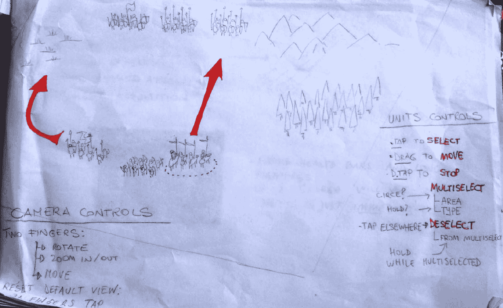
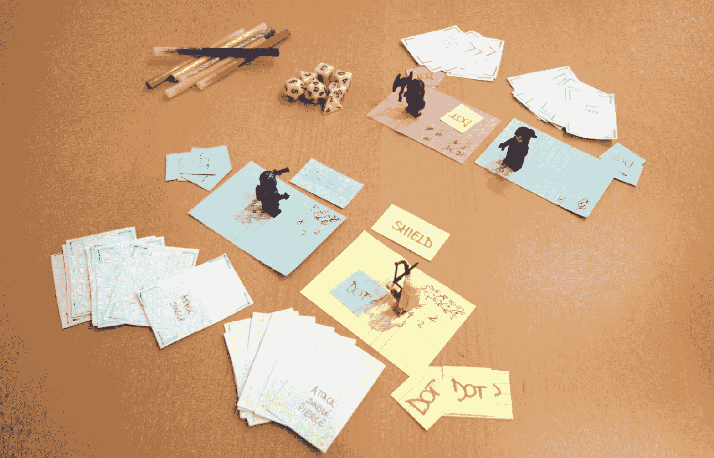
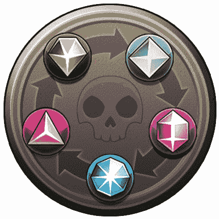
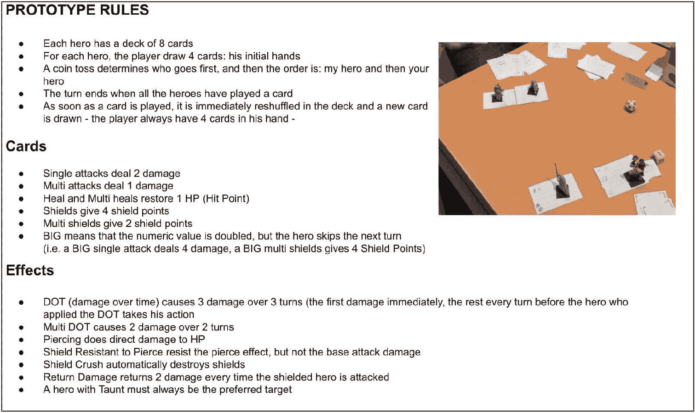
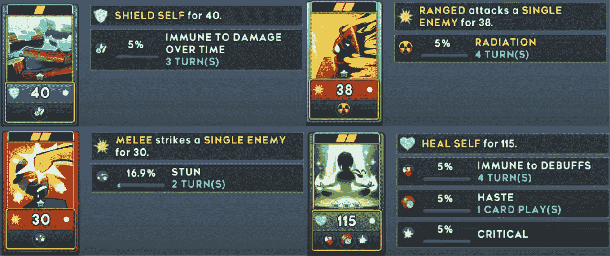
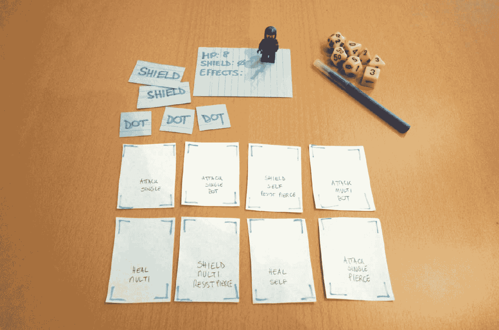
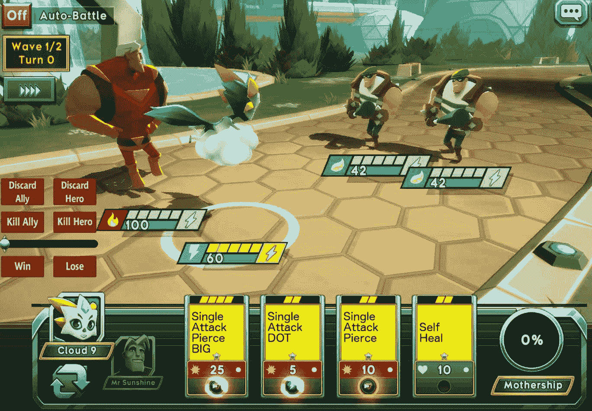
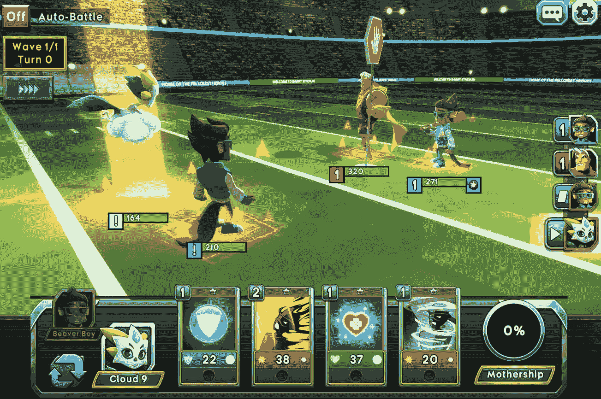
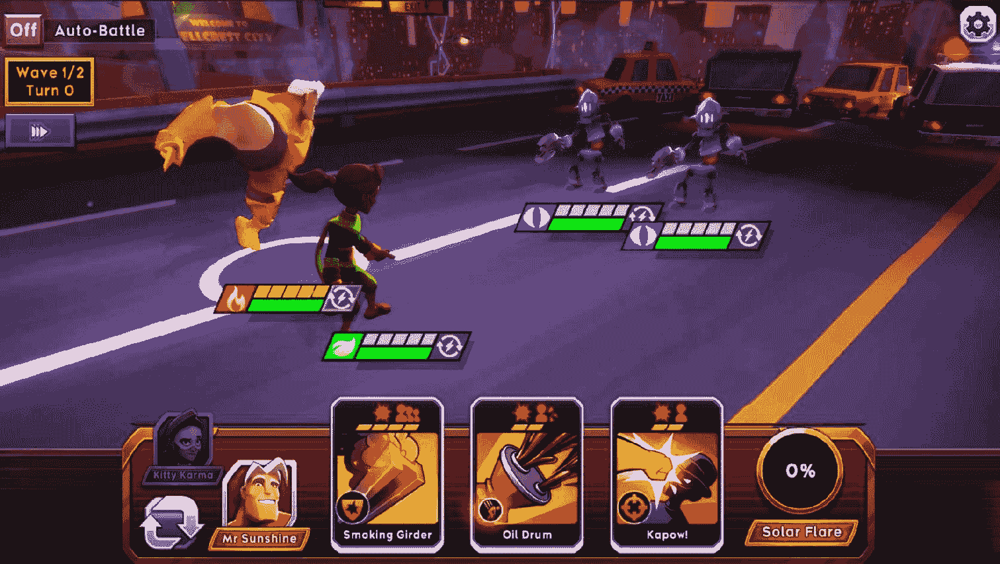

原型制作

在本书的这个阶段，你可能已经意识到，尽管游戏设计在现实中可能很实用，但它首先发生在设计师的头脑中，其次是某种文档，最后才是实现它的第三步。

要真正制作出游戏，设计师必须掌握一个工具，这个工具允许他们创建可工作的软件；编写一些代码。并非所有游戏设计师都是程序员，即使他们知道如何编程，设计和编程是两种不同的工作，都需要一个人全神贯注（而且项目越大，这个真理越不能弯曲）。

有一种活动要求游戏设计师将设计转化为可玩的东西，就像他是唯一一个在制作它的人一样。这是实用游戏设计的精髓。

这就是游戏原型的创建。

什么是原型？

原型是为了证明一个概念而构建的模型。

这个定义实际上适用于任何事物，而不仅仅是游戏。我们每天使用的绝大多数产品，从我现在正在敲打的键盘到可以在地球大气层外飞行并到达其他行星的复杂机器，所有这些事物都是无数设计、原型、迭代和失败的结果。

游戏原型并不旨在代表整个游戏的外观；在这种情况下，我们更多地谈论技术演示或预 alpha 开发版本。如果你已经准备好了预 alpha 版本，这意味着你处于开发的后一个阶段，你很可能已经为了达到预 alpha 阶段而原型化了你的核心机制。尽管如此，即使在后期阶段，你也可能需要解决之前不明显的问题。也许最终感受到你的游戏在测试玩家——甚至你自己——手中的实际玩法，会引发关于你可以做得不同或更好的问题。

原型最终意味着回答这些问题。尽早确定这些问题至关重要。

这些可能是通用问题，比如“这会起作用吗？”，“这会更有趣吗？”，或者“哪一个是最好的？”我们稍后会更加具体，但在此期间，请记住：如果你没有明确的问题，为什么你要进行原型制作？你将如何判断原型是否有效？

为什么需要原型？

原型存在的主要原因是我们需要缩小制作出无效产品的风险。想象一下，如果你有无穷的时间和资源；创建原型的意义何在？为什么不直接创建整个游戏，如果它不起作用，我们就有所有需要的东西来再次尝试？原型存在正是因为我们需要充分利用我们拥有的稀缺时间和资源。

当我们为游戏制作原型时，我们通常关注的是：

+   无论是机械师是否在参与

+   从一系列替代方案中选择最佳想法

+   测试一个想法的技术可行性（这个想法可以是完整游戏、图形技术或 AI 算法等任何东西）

+   如果用户能够有效地直观地导航游戏用户界面

> > > 请注意，我们的第一个要点非常重要！要知道什么是有趣的机制，以及如何判断你的机制是否有趣，你需要掌握我们在第五章【机制改编】和第六章【机制发明】中说的所有内容；确保在需要更多清晰度时回到这些章节！

原型技术

当谈到创建原型时，主要有两种选择：物理和数字。

你可能会惊讶地知道，在视频游戏行业中，物理原型被使用了多少次。许多游戏机制可以通过棋盘游戏、卡牌游戏、微型游戏，或者只是一张纸和一支笔，再加上几支彩色铅笔来重现。

数字原型在组装上稍微复杂一些，但当然，它们对媒介的忠实度以及创建实时环境和处理复杂计算的能力使它们成为首选选择。然而，大多数时候，在纸上非常简单地开始，然后带着更清晰的想法转向数字，总是一个好主意。

纸质原型

纸质原型是我最喜欢的。制作它们就像在纸上写字和剪出一些纸板元素一样快。每次都像是创建一个小型桌面游戏！以下是一个例子：

在一张纸上简单地勾勒出一个草图可能是一个原型的好开始；在这种情况下，重点是 RTS 游戏的触控输入

如果你想知道纸质原型可能是什么样子，请看下面的截图：

Battlehand: Heroes 的替代战斗系统的纸质原型。我们将在本章后面将这个特定的原型作为一个案例研究进行讨论

我相信你想象出的东西要漂亮得多，专业得多。但事实并非如此！

不要相信看起来太好的原型；正如我们所说的，根据定义，原型去除了所有非必要的东西。

> > > 重要的是要注意，UX-UI 纸质原型和游戏纸质原型之间有很大的区别。有时一个游戏原型可能包括 UI 和 UX 元素，但我们通过纸质原型来回答的问题与可用性或界面无关——我们想要调查游戏机制以及它们有多有趣。始终牢记这一点！

纸质原型的优点

让我们来看看纸质原型的主要优点：

+   便宜：纸质原型在时间和资源上都很便宜。

+   不涉及编程：这一点很简单；每个人都可以创建纸质原型。你可以应用你的游戏设计知识，并在不涉及任何程序员或受技术限制的情况下完全控制游戏创作。

+   易于创建且快捷：你可以用铅笔在一张纸上绘制草图来创建纸原型。没有比这更快的创意过程。尽管如此，大多数原型需要做更多的工作，比如切割纸板，打印一些图像或占位符，以及编写卡片。一些纸原型甚至可以使用诸如微型模型（来自其他游戏或易于在线购买）或骰子等元素。无论你可能需要多少东西来创建它们，这总是比在电脑上创建任何东西要快得多且容易。

+   易于尝试和迭代：这是另一个难以置信的优势。你可以在几小时内构建一个纸原型，并尝试给任何人（朋友、家人、同事）使用，而无需构建任何工作软件。任何不起作用的东西都可以立即更改，甚至在测试过程中也是如此。迭代速度可以达到最快。

+   抽象化：在测试原型时，抽象化非常出色。游戏的外观或其他不重要的东西不会产生任何干扰。如果这些纸张变得生动起来，规则产生了有趣的动态，通过在上面添加主题和视觉美学，它们只会变得更好。正如我们将在下一段中看到的那样，抽象化是一把双刃剑，因为它也带来了一些风险。

纸原型的局限性

当然，像任何工具一样，纸原型也带来了一些缺点：

+   抽象化：在虚拟世界之前，在纸上对系统进行抽象化，需要经验。你需要能够提炼出基本要素，并排除其他所有内容。你需要做出妥协，同时创造出能够回答游戏在屏幕上即将出现的问题的东西。经验是掌握抽象化的唯一途径。好消息是，你现在就可以开始原型游戏，无需学习任何编程语言，甚至不需要在电脑前。你甚至不需要发明一款游戏，只需选择一款现有的游戏，想象一下你会如何用纸原型来模拟其核心机制。不要害怕失败。原型设计就是关于在它们没有产生重大影响时犯错误。尽可能多地原型设计和失败，用尽你所能的一切。

+   难以表示复杂和实时场景：这是纸制原型的主要问题。想象一下像街头霸王这样的格斗游戏的纸制原型会是什么样子。这已经让你头疼了，对吧？更困难的是，想象一个 VR 游戏的纸制原型，其中主要机制基于 3D 空间的导航。需要使用物理技能、复杂计算、物理和其他许多游戏的挑战巨大，有时它们根本无法有效地抽象成可以在纸上工作的东西。所以要注意，有时纸制原型根本不是回答你问题的正确工具。这很公平，幸运的是，你有很多其他选择！

+   无法完全替代数字原型：纸制原型的另一个问题是它们最终需要被转换到数字世界。因此，尽管它们很便宜，但确实是一个额外的步骤。纸制原型的价值在于有机会在实施之前捕捉到重大问题；当你的设计在纸上看起来可行，并且最明显的问题已经被排除时，尽快转向数字原型。对于纸制原型来说，便宜和快速是关键词。一旦纸制原型显示出缓慢和复杂的迹象，你就知道这是时候转向数字原型，或者意识到你需要提出一个更具体的问题，并重新从头开始。

数字原型

当你的设计和纸制原型在屏幕上呈现出来时，事情就变得严肃起来。准备好以非常不同的方式看到你所想象的东西——准备好看到不工作的事情。你越快意识到有问题，就越快回到绘图板，你发布有趣游戏的机会就越好。这就是数字原型的理念。尽快组装一个可工作的软件，并在其上尽可能多地迭代，以定义和重新定义你的愿景。与纸制原型不同，数字原型是一个必要的步骤。如果你不做原型，你就是在犯错误。这就是全部。

可能会跳过原型设计阶段，可能是因为没有时间、没有资源，或者团队非常自信，可以直接进入生产阶段。记住，原型设计意味着寻求对特定问题的答案。如果你已经有了这些答案，就不需要原型。但如果答案不明确，跳过原型设计阶段，团队直接进入开发，实际上发生的事情是正在开发一个非常复杂和高保真度的原型，目的是将其作为成品出售。

你可以想象，如果这种方法出了问题会多么灾难性。你会惊讶地发现这种情况发生的频率有多高，即使在最受人尊敬的工作室里也是如此。作为一个游戏行业专业人士，我保证你会听到很多类似“现在改变太晚了”、“它不起作用，但我们不得不忍受”之类的说法。这些话是设计在没有质疑的情况下实施、开发数月而没有早期审查以及简而言之，完全没有原型设计的结果。

常见原型设计错误

开发数字原型的唯一缺点是它需要一些时间，尽管可以保证从长远来看它会节省时间。尽管如此，还有一些其他的陷阱。原型是工具，因此可能会被错误地使用。

让我们来看看原型设计中最常见的错误和陷阱。

永无止境的原型

在制作原型时，很容易沉迷其中，并试图通过反复迭代相同的内容来使其正确。如果某件事不起作用，设计就必须改变。团队越早意识到这一点，原型阶段就越能发挥其作用。快速构建的原型的风险是可能会遗漏一些可能最终对做出最终判断至关重要的元素。作为原型迭代的本质部分，这是可以接受的。原型可以从非常小的地方开始（即，新游戏的核心理念），通过连续迭代（即，核心机制和一些谜题或敌人）扩展到更大。然而，风险是继续在初始问题的范围之外迭代，例如，在核心机制之上构建一个进度系统，因为它感觉薄弱或不完整。每当你觉得原型范围在扩大，开始看起来像整个游戏时，可能就是停止并重新评估那些初始问题是否得到解答的时候了。

花时间创建系统

希望稍后迭代而跳入游戏的最终实现总是一个坏主意。在构建软件时，需要良好的工程实践。软件必须像游戏一样被设计。在真正的游戏玩法之前需要构建系统。想象一下赛车游戏。程序员需要设计一个可以处理不同类型汽车、不同速度、加速度、制动、稳定性等的系统。他必须首先构建这个数据系统，然后设计师才能定义数字并尝试它们。在制作原型时，工程师应该尽快通过任何可能的方式将设计师想要尝试的值硬编码到屏幕上（可能需要一个原始的系统来暴露这些变量并使它们可变，以便设计师可以玩不同的值）。在这里，程序员的角色是尽快将可玩的内容展示在屏幕上。系统实现应该始终推迟到实施阶段。

将原型作为生产项目的代码库使用

一个好、快、切中要点的原型很可能是一个代码混乱，充满了黑客技术和糟糕的代码编写，尤其是如果它是设计师自己编写的。你不想在最终项目中留下这样的代码。当原型工作并且所有问题都得到解答时，就是从头开始的时候了。现在是时候构建那些系统，并让工程师正确地设计代码了。再次强调，将原型代码作为节省时间的基座的想法只是一个幻影。虽然一开始可能会节省一些时间，但请放心，一旦问题出现，最初节省的时间和更多的都会丢失。即使原型工作得非常完美，这也是正确的。

话虽如此，一些经验丰富的工程师可能能够创建出具有完美工程代码的原型，这些代码可以直接投入生产。最终这是他们的决定，当然，肯定有情况是这种情况可行的。然而，当设计师或其他不太技术性的团队成员参与创建时，让工程师做出这种决定总是更好的选择。

花时间添加功能、艺术和效果

在原型上花费的时间，如果与回答初始问题无关，就是浪费时间。不仅如此，添加到原型中的每一件不必要的东西，都是使原型代码演变成最终游戏的一个步骤。要警惕那些在添加了一些好的艺术作品、动画或效果后看起来工作得更好的东西。你可能会被诱惑认为，仅仅因为看起来不错，一个游戏就能隐藏其设计缺陷。

这永远不是真的。

寻求确认

这是原型制作的最大的陷阱。

如果你确信你已经找到了答案，并且不惜一切代价在构建原型来证明它是正确的，那么你错过了一个大好机会。保持开放的心态是至关重要的。你很可能是在基于一个假设来构建原型，以创造一些新的、更好的东西。

每个人都愿意听到他们提供的原型解决方案是多么的精彩，当这种情况发生时，那真是太好了。如果它没有发生，你可能会犯的最大错误就是保护你的工作，而未能看到负面反馈和正面反馈一样有用。一个展示某物不工作的原型，就像一个被证明是正确的原型一样，是一个成功。

记住：目标是得到答案，而不是真正制作游戏。

模型原型制作的逐步指南

下面是一个开发有效原型的逐步过程。这些步骤可以用来制作整个游戏的原型，或者只是单个功能的原型，或者只是评估对现有系统的更改。

第一步：提出正确的问题

无论原型是用来尝试游戏想法、新机制，还是评估和改进游戏中的某个部分，你都需要有一个清晰的问题，以及你想象原型将如何解决它。如果你不知道你需要评估或证明什么，就永远不要开始原型制作。

> > > 什么是一个好问题？什么是一个坏问题？
> > > 
> > > 通常，好问题是具体的。问一个机制是否有趣不是一个好问题。我们所说的“有趣”是什么意思？可能更好的问题会是：这个机制是否为玩家提供了足够的决策？他的选择是否有意义？

第 2 步：选择框架和工具

纸制还是数字原型？如果是纸制，除了笔和纸还需要其他东西吗？也许需要骰子、微型模型、卡片？如果是数字的，是否需要游戏引擎？电子表格？演示文稿？

这些事情中的一些可能在开始时并不非常清楚。在这种情况下，先从某处开始，然后评估你在进行过程中可能还需要什么。如果你意识到某些东西是可行的——比如说你发现你无法在纸上原型化一个系统——那就放弃它，用更好的工具重新开始。

第 3 步：创建规则

这对于纸制原型来说非常重要：规则是什么？你实际上如何玩这个原型？纸制原型的规则看起来很像一个桌面游戏规则手册。确保规则简单明了。此外，数字原型也需要规则。你需要实现什么样的机制？你将如何将复杂的游戏浓缩成其抽象和本质版本？

第 4 步：实现并创建原型

无论这是编写代码还是用剪刀剪掉元素，都要尽快让某个可玩的部分发生。

第 5 步：第一次试玩

一旦你有了可玩的部分，就试试看。没有什么会像你想象的那样工作。原型的第一次试玩至关重要，因为如果你带着偏见去尝试，认为它一定会成功，你就是在犯一个常见的错误。任何原型的第一次迭代都不会成功。所以当你第一次试玩时，要记笔记，然后回到画板上去做出你需要的变化。当我们说试玩时，意味着尽可能多的人来试玩——特别是那些不参与开发的人。在这个阶段，你真正需要的是一个无偏见的意见。

第 6 步：迭代

重新实现上次不正确的东西，调整你的变量，改变规则。做到你找到对初始问题的答案为止。

试玩和迭代应该是快速的过程。如果你在几次迭代后找不到答案，可能是因为你提出了错误的问题，或者你不愿意承认答案只是在证伪你的概念。

如果你的假设被原型所证伪，那就不要继续追求那个解决方案。

只有当你愿意接受后果并丢弃不工作的事物时，原型制作才是一个值得做的事情。

第 7 步：继续前进

从之前的步骤中，只有两种可能的结果：你要么证明要么反驳你的假设。在两种情况下，你的原型的工作就结束了。如果答案不是你希望的那样，不要犯强迫事情按照你的方式发展的错误。如果答案是积极的，不要试图在你的原型上添加功能或游戏。继续前进，从你得到的答案中构建新的东西，而不是从你创建的原型中。

原型制作练习

因此，你知道纸质原型和数字原型的区别。你现在就可以开始使用纸质材料进行工作并获得经验。

事实上，你必须立即开始。

在继续阅读之前，拿一支笔和一张纸，尝试制作一个原型。它必须在不到一个小时之内完成，不用担心尝试一些真正酷的东西或你真正有想法的游戏。尽量做到实际。

这里有一些想法：

+   一款两人玩家 A 和 B 的赛车游戏，例如鹅的游戏

+   一款简单的 1v1 卡牌游戏的战斗系统

+   一款平台游戏如超级肉男孩的解谜关卡

+   一款使用棋盘和网格的 1v1 策略游戏，就像象棋一样

不要担心结果，只尝试一下，看看在一小时内你能想出什么。

动手游戏设计师

如果你尝试创建一些纸质原型，你可能会找到你的问题的答案。如果你做得对，你可能也会有更多的问题。

一个可能的问题是：它真的会这样工作吗？绝对会的。

原型制作是关于发现、尝试和犯错误。如果你不尝试，你就永远不会学到东西。下一步将是尝试在数字世界中创造一些东西。这里事情变得更难，因为你可能没有任何编程技能，甚至可能不知道从哪里开始。记住这些话：通过学习如何使用游戏引擎和编程基本的游戏机制和小型原型，你将比那些没有这种技能的任何有抱负的游戏设计师都要领先。

这是真正的技能，它将始终让你在与其他数千名设计师竞争游戏行业少数设计职位时保持优势。阅读和学习是最基本的，所以不要认为通过阅读这本书和许多其他游戏设计书籍，你将比你的竞争对手更好。他们都已经做了同样的事情！

使你成为一个更好的（更受欢迎的，更准确地说）设计师的另一个因素是你的经验。如果你从未在游戏方面进行过专业工作，你不太可能被认为比那些有经验的设计师更好。当你几乎没有专业经验时，唯一能让你脱颖而出的就是你的个人项目以及设计和实施你想法的能力。我把这个游戏设计师称为“动手游戏设计师”。这是一个稀有品种，因此它在游戏行业的任何地方都需求旺盛。

学习如何实现和编写你的游戏。你不需要学习如何超越原型阶段。你不需要掌握计算机科学或软件工程原则。你只需要知道如何让你的设计在原型中在屏幕上实现。做到这一点，你已经在游戏设计师的第一份工作中迈出了第一步。

不仅如此，随着你在游戏设计方面的经验增加，你会发现你的技术技能是一个令人难以置信的工具，用于传达想法、提出项目、展示你的假设，最重要的是，用于独立工作或让工程师从一些实现工作中解放出来，让他们有更多时间专注于更重要的事情。你自己将会有更多控制权来决定你的设计如何进入游戏。成为一个亲力亲为的设计师。要务实，并从你能实现多少事情的角度来评估你的工作。

论文原型案例研究

我们将详细研究我在 Another Place Productions 的个人工作经验中的一个案例研究。在我们最新游戏 Battlehand Heroes 的开发过程中，某个时刻我们遇到了一个意外的问题。Battlehand IP 的第一个标题中的战斗系统在新游戏中证明是有问题的。

对战斗系统的质疑

Battlehand: Heroes 是一款回合制 RPG，玩家可以组建自己的英雄团队，每个英雄都有独特的牌组来战斗。在第一款游戏 Battlehand 中表现良好的战斗系统，缺乏深度来吸引新一代玩家。第一款游戏于 2015 年发布，玩家的游戏口味和期望总是不断演变，因此游戏也需要如此。玩家们难以理解为什么他们应该玩一张牌而不是另一张，如何选择他们的策略，以及如何正确应对敌人的行动。

> > > 你可能会想知道我们是如何在游戏中发现这些问题的：通过测试！尽快用真实玩家测试你的游戏，并记录下他们体验的每一件事。我们将在本书的后面部分更多地讨论测试和用户研究。

我们讨论了许多不同的解决方案来改进战斗系统的核心，但在将开发团队投入到任何这些方案之前，我们决定在纸上原型化更有希望的想法。

战斗系统基于 2v2 英雄战斗，玩家可以管理他自己的每个英雄和他们自己的 8 张牌组。每个英雄属于一个元素：地球、火、水、空气或精神。它们遵循一个剪刀石头布（RPS）的强弱关系：

Battlehand 元素 RPS 机制：火强于地球，地球强于空气，空气强于精神，精神强于水，水强于火

我的假设是，游戏可以从在元素之上引入一个多层次的 RPS 系统而受益。到目前为止，每个英雄都可以有可以治疗、盾牌和攻击的卡片。所有这些卡片都围绕着它们的力量（伤害、护盾点数或治愈的 HP 越多，卡片越好）进行平衡。想法是尝试为每张卡片分配一个属性，使其无论其数量如何，都能对其他卡片产生强或弱的影响。如果盾牌可以阻挡大部分攻击，但有些攻击可以自动穿透盾牌，这将创造一个有趣的场景，在这个场景中，适合特定情况的正确卡片可能不总是最强大的，这取决于玩家来选择。

解决问题

这是一个高级、现实生活中的场景；因此，事情永远不会完全如预测的那样。事实上，原型需要回答的问题不止一个。但让我们再次回到问题上来。

战斗在深度上缺乏，因为：

+   战斗中最重要的战略选择之一是选择哪个英雄进行特定战斗（以对抗敌人的元素）。这种策略也应该传播到战斗本身，而不仅仅是存在于战斗前。

+   当是时候出牌时，最好的选择总是最强大的牌。选择可能会更有趣。

+   所有英雄都可以使用所有类型的卡片（盾牌、治疗、攻击），因此每个英雄都可以在战斗中扮演所有角色（治疗者、支持者、攻击者、防御者等等）。

明确这些问题后，我们可以提出正确的问题。

提出正确的问题 – 第 1 步

这个原型系统：

+   创建一个场景，在这个场景中，我不总是选择最强大的牌，而是选择对特定情况最有用的牌？

+   让我思考并计划一些卡牌抽取？

+   将注意力从 RPS 机制转移到卡片上？

选择工具 – 第 2 步

明确的问题和要回答的问题很清楚，现在是时候确定我们需要哪种类型的原型了。老式回合制 RPG 和卡牌游戏的一个优点是，使用纸原型对他们来说来得非常自然！如果你考虑其他一些评估和原型化的解决方案，纸原型听起来是最快、最便宜的解决方案。

创建规则 – 第 3 步

纸原型总是你从数字游戏中获得的抽象，所以只包含必要的内容比以往任何时候都更重要。

这是我想出的规则：

如果这些规则对你来说不是很清楚，这个练习的目的是更多地了解原型制作过程，而不是具体的例子！

供您参考，这是在原型创建时期的一些战斗手英雄卡片的截图：

来自《战斗手：英雄》早期版本的 4 张卡片

如您所见，真实游戏机制和原型规则之间存在巨大差异，但核心确实是相同的。我们提出的问题可以通过数字游戏的更简单抽象来回答。

实现 – 第 4 步

这是我最喜欢的一部分。为了创建原型，我简单地为每个英雄剪了 8 张卡片，并在每张卡片上写下了规则。然后我创建了所需的各个标记，并使用 4 个迷你模型来代表英雄。

我还使用了骰子来跟踪游戏中出现的各种数字，并在游戏过程中在彩色的卡纸上记录与英雄相关的各种笔记。

每个英雄的牌组都是为了用几张卡片就能创造一个引人入胜的经验而设计的。我们稍后会了解平衡以及如何在游戏中设置每个数字和变量：

我们的水系英雄，拥有 8 张卡片和玩原型的所有必要部件

第一轮 – 第 5 步

第一轮展示了非常令人期待的经验。玩原型很有趣，很明显整个事情都在正确的轨道上。当然，最初的问题确实非常准确，因为我们对游戏的了解很深入，基于同一 IP 的前一个标题以及一系列众所周知的问题和可能的改进。

真正需要更多思考的是规则。伤害和 HP 的范围太窄：攻击造成 1 到 4 点伤害，英雄的 HP 从 6 到 12 点，有些卡片太强，有些英雄太弱。

另一个缺陷是缺乏卡片操作的组合（COMBO）来获得更大的优势（即，连续两次 DOT 攻击造成额外伤害）。

迭代 – 第 6 步

考虑到第一轮的问题，改进原型的迭代过程开始了：我们调整了数字，添加了组合系统，并更换了一些卡片（例如，我们从原本更专注于攻击的英雄中移除了所有治疗卡片）。

通过继续玩原型，出现了另外两个缺陷。有些战斗拖得太久，陷入了一种僵局，所以我们增加了一定回合数后的伤害递增。我们还发现组合很难排列，有点令人不满意，所以我们决定采取极端措施：排列组合意味着立即杀死目标英雄。这个小改动极大地丰富了整个战斗，为长期规划提供了巨大的回报。当然，在真实游戏中，不会有这么强大的功能被实现，但游戏显然更有趣，更具吸引力。因此，我们将其记录下来，并牢记于心，为我们的最终版本组合系统做准备。

最后一步

所有问题都解答了吗？

我会说，是的，完美：

+   不同的卡片对不同的护盾有强有弱，这使人们的注意力从单纯的数字转移开，所以我发现自己正在寻找一张不那么强大的卡片，它具有正确的效果，可以正确地对抗敌人的布局。这种情况发生得足够频繁，以至于让我开始思考新的有趣类型的卡片和能力，以及如何构建一个更有效的牌组。

+   极端组合系统迫使我总是思考如何拉出一个好的组合，并为下一张牌的抽取增添了无数刺激。

+   元素优势几乎变得无关紧要，整个战斗焦点转向了战斗本身。它甚至对元素轮产生了一些怀疑，因为它清楚地表明，RPS 机制之前在元游戏方面过于突出（将战略选择限制在战斗前的阶段，即决定将哪些元素带入战斗）。

在这些出色的答案的帮助下，我们能够转向数字原型。正如我们提到的，纸张原型的缺点是，如果它们在纸张上工作，在开始实际生产之前，你必须在数字世界中尝试它们。有极少数情况下，答案如此清晰，你可以真正快速地进入生产，但你用纸张原型想要做的更多的是快速失败，而不是真正找到一个可行的解决方案。如果它在纸张上不起作用，它很可能在任何地方都不会起作用。另一方面，如果它在纸张上起作用，你仍然必须确保你能够将这种抽象转化为在视频游戏中起作用的东西。

从纸张到数字

在我们的特定情况下，将原型带到数字游戏中是一项相对简单快捷的工作。

由于游戏已经开发到可玩阶段，主要工作是修改当前的游戏系统以反映新的变化。当然，我们必须将纸张原型的规则适应到数字游戏逻辑中，以最快和最有效的方式实现它们，然后进行游戏和迭代：

纸张原型中的卡片被实现了在数字游戏中

抽象与现实

在我们将原型原则实现到实际游戏中后，我们准备开始新一轮的迭代。

事实上，在纸张上证明的只是对更严肃的原型进行承诺的一种快速方式。它并不是一个明确的答案，即系统将会起作用。将纸张原型视为实际数字原型的一个绿灯。

数字原型很好地复制了我们在纸张上所拥有的体验，但一些改进只有在这一阶段才变得明显和必要：

+   对数字的关注再次变得过于突出。不再是享受将卡片拖到敌人身上并看到其效果的即时行动，而是需要进行大量计算才能理解哪张卡片是最好的选择。

+   卡片的数量（每个英雄的牌组有 8 张，任何给定时间的手中有 4 张）仍然很多；在这么多选择中，感觉没有一个是真正有意义的（有些显然是错误的）。

+   我们需要引入整个卡片效果库。不仅包括持续伤害、穿透护盾和我们在原型中拥有的少数其他效果——战斗手：英雄卡片的效果还包括许多其他效果，如加速、各种免疫、昏迷、冻结等，数十种之多。这些效果的复杂性增加了很多，而且这些效果位于 RPS 机制的中心，认知过载成为一个问题。

接下来

在评估了数字原型的现实情况后，我们一次又一次地迭代，移除了在更现实的数字场景中不太起作用的一切。这个过程大约花费了两周时间，当我们觉得我们有了所有答案时，我们回到了生产环境中的游戏，留下了原型。以下是我们更新之前战斗屏幕的截图：

战斗手：英雄在战斗系统更新之前。注意右边的移动条、手中的卡片数量和卡片布局

我们对原型中真正有效的一切都进行了必要的改变，并且我们对这样做充满信心。在下面的截图中，你可以看到这个过程之后游戏的样子：

战斗手：英雄在战斗系统更新后，每个英雄手中的牌只有三张，它们的布局更加关键。

之前的截图无法传达游戏从一个版本到另一个版本的变化，但你可以看到我们在战斗屏幕和卡片布局中进行的所有改变都反映了我们从原型中得出的发现：

+   每个英雄手中的卡片数量已减少到三张（牌组中的六张）。

+   卡片上的数字已被移除——包括回合计数器（左上角）和卡片中心的伤害/治疗/护盾值。

+   目标图标已经变得更清晰。

+   每张卡片都有一个明确的效果，这可以在卡片左下角的圆形图标上看到。第一张，烟囱，有能力在一击中摧毁目标护盾。第二张，油桶，可以削弱敌人，增加他受到的伤害，最后一张，Kapow，无论目标是否闪避或英雄的准确度有任何其他修改，总是能击中。

+   移动条已被移除，并替换为位于每个角色 HP 条（绿色条，位于每个角色下方）上方的回合条（带有五个凹槽的黄色条）。

所有这些变化都反映了我们需要改变和调整游戏的部分，这些部分在没有原型的情况下根本无法评估。它们是迭代过程的成果，通过后续的变化和评估，我们能够从粗糙的初始模型中塑造出最终产品。

> > > 本章中使用的截图仅用于说明目的。我们不推荐你以任何方式滥用这些截图。如需更多信息，请参阅本书免责声明部分提到的出版商的条款和条件。

摘要

在本章中，我们学习了如何原型化一个游戏以及为什么这样做很重要。我们详细描述了纸面原型化以及如何立即开始进行，无需任何特定的技术知识。本章强调了纸面原型化相对于其数字版本的重要性，因为它确实是你在不学习其他任何东西的情况下，能够为创建游戏和成为一名更好的游戏设计师所做的一切的核心。在这个阶段尝试创建自己的纸面原型并开始尝试一些桌面游戏设计的读者，已经从学习者转变为创造者。

我们转向了数字原型化，以及即使是相当基本的技术技能也能为初出茅庐的游戏设计师带来巨大的竞争优势，并使他们能够进入游戏行业并实现自己的愿景。我们强烈建议你练习你所学到的一切。无论你选择哪个平台，现在就设计和创建一些东西吧！

现在你已经了解了如何创建游戏的基本元素并将它们实现到原型中，我们准备学习如何将它们组合成一个有开始（大多数情况下）也有结束的连贯体验。在下一章中，我们将讨论叙事的使用以及如何调整玩家在整个游戏体验中的进度。
