关卡设计

在本章中，我们将深入探讨关卡设计的过程，这是一个庞大而模糊的话题，本身就可以占据一本书的篇幅。我们不会针对单个工具或专注于单一类型；相反，我们的目标是为您提供对过程不同方面的洞察，以及如何最好地创作游戏内容的实用技巧。

系好安全带；这是一个非常重要的点，因为即使是最优雅的规则和最精致的机制，如果您的关卡设计不够出色，也可能导致糟糕的游戏体验！

什么是关卡设计？

关卡设计是创建可玩内容的过程，它作为向玩家传达游戏玩法和叙事体验的媒介。有些游戏依赖于精心制作和严格规划的关卡/地图/阶段/任务。而有些游戏则留有随机化的空间，但仍需要人工输入来创建谜题、挑战、敌人生成规则、预组装关卡块，甚至高级世界构建规则。

关卡设计的工艺存在于游戏设计、叙事和艺术之间的灵活交叉点上。根据项目需求和团队结构，关卡设计师要么从头到尾负责整个关卡设计，要么从环境艺术家那里获取艺术上的反馈，艺术家将负责处理视觉方面的事情。在小型团队中，一般游戏设计师处理关卡设计任务是很常见的。

根据您正在制作的游戏，您用于创建关卡和任务的工具可能会有很大差异。对于 3D 游戏，您可能会使用专有的内部技术或 Unity 或 Unreal 等引擎中可用的标准工具（强烈建议至少学习这两个编辑器中的基础知识）。对于 2D 游戏，由于内部工具在场景中占主导地位，因此提前规划会更加困难，但话虽如此，这些工具通常要简单得多（顺便说一句，如果您的游戏使用 2D 瓦片和网格，请尝试 Tiled——这是一个老但非常可靠的免费编辑器）。

关卡设计流程

正如我们从开头段落中已经了解到的，关卡设计可以涵盖各种任务，从定义敌人生成模式到创建谜题、雕刻、填充环境，甚至在音乐游戏中定义节奏图。尽管如此，有一些流程和步骤可以应用于几乎任何内容创作任务，无论是部分还是整体。以下是一些步骤：

1.  前提：设定高级愿景

1.  草图：扩展设计

1.  灰盒：实现和迭代游戏玩法

1.  艺术实现：装扮您的创作

1.  最终润色：发布前的错误修复和最终调整

让我们逐一详细探讨它们，并探索一些示例！

前提

将前提想作一个简洁但具有说服力的销售提案，即使你唯一要推销想法的人是你自己。通常，你只需要一段简短的段落来突出目的（从设计师的角度看）以及创建该特定游戏内容的潜在价值（在玩家眼中）。如果你有强有力的参考，不要害怕使用它们；这些可以是电影场景或现有游戏的截图。

前提改变和演变多次是很常见的，尤其是在你实际上着手创建描述的内容之前可能已经写下了很长时间。尽管如此，总是将你的想法写下来并向团队的其他成员展示，以帮助你将设计缩小到真正重要的部分，总是好的。

记住，包含太多想法的前提通常往往无法充分探索其潜力。你也有可能让玩家感到困惑，并创造感觉平淡的内容。如果你无法想到一个能让你的关卡从游戏的其他部分中脱颖而出的特点，那么你刚刚找到了一个很好的排除候选。如果你有很多好主意，将它们作为独立的前提存储；你总是可以丢弃和抢救你能用的东西，或者重新开始。

前提的细节和重点完全取决于你的产品。在一个以故事驱动的游戏中，你的前提可以反映最重要的剧情发展和你计划实现预期结果的方式。另一方面，一个三消益智游戏可以有一个非常简短的前提，例如“新冰块机制介绍，难度普通，尺寸小，高而窄的布局”。

让我们看看几个关卡，并逆向工程潜在的前提：

左 4 死（多人第一人称射击）- 无慈悲战役

游戏的第一个战役设定在病毒爆发后的纽约市，我们的幸存者正在市中心公寓楼的屋顶上等待救援。一架直升机飞过，告诉每个人前往慈悲医院撤离。幸存者们开始一段 4 或 5 部分的冒险，穿越纽约的街道、地铁系统和下水道，最终在慈悲医院的屋顶上达到高潮。

马里奥赛车（超级任天堂，竞速）- 彩虹赛道

外太空深处令人兴奋的多彩路径！充满了 90 度转弯和几段长直道。路径短且握感正常。难度增加是通过移除所有障碍并加入超级巨响（触碰时击倒赛车手的掉落方块）。

> > > 记住，为几乎所有事情写一个前提都有好处，从关卡和任务到武器、升级、小工具、角色类别、敌人类型、谜题、教程部分和 Boss 战。有一个计划总是比盲目地四处游荡要好，即使你在中途改变它。只是不要过于认真对待你的前提；有可能你的创造力会带你偏离既定的路径，把你引向更好的东西。当它发生时，要接受它，但不要寄希望于它！

草图

让我们来测试一下你的想法！草图的目的是在游戏实现之前回顾和扩展你的计划。

对于具有复杂且耗时的内容创建流程的游戏（如家用机 RPG），你可能会发现这个过程中的这一步绝对必要。然而，在风险较低、不需要大量投资的场景中（例如基于物理的益智游戏），你可能想节省时间，直接进入下一阶段（灰盒测试）。

> > > 自从你写下最初的前提以来，可能已经过去了数周甚至数月。赶上团队的其他成员（尤其是任何其他设计师），并确保前提仍然与游戏的其他部分相符。

根据你正在制作的内容类型，草图可以包含：

+   书面设计细节

+   对话或用于叙事目的的详细剧本

+   实际的草图、绘画或潦草的潜在布局草图

+   游戏流程或时间线（主要事件列表以及任何分支路径）

+   艺术参考（视频、截图和照片）

+   游戏参考（可能是另一款游戏的视频）

> > > 为什么我不应该一开始就写一个非常详细的前提，然后再转向执行？项目进行得越晚，你创造的内容就越好、越连贯。如果你刚刚完成另一款游戏特征或关卡的制作，你可能会积累新的知识和专业技能，或者可能有一系列更好的想法可以付诸实践。为游戏内容的每个部分编写详细的设计，然后进行纯粹的执行是很有吸引力的（它让我们感觉一切都在计划之中，处于控制之下），但通常你最终会执行一个次优的设计，仅仅因为你对这个想法产生了依恋。游戏是一种动态工艺的产品，而不是装配线。要灵活！如果修改你的前提（即使是大幅度的修改）不会带来巨大的代价，就不要害怕提出变更。坚持一个糟糕的计划只是为了坚持它是没有意义的，而且你仍然足够早，以至于设计变更的成本很低。

让我们来看看一些潜在的草图示例！

示例 - 书面草图

作为第一个例子，我为《塞尔达传说：时之笛》中的水之庙创建了一个书面草图。不是因为它是关卡设计的杰作，而是因为它可能是系列中最具争议的地下城之一。

素描应该有足够的细节来帮助团队简报和头脑风暴。你也可以开始为艺术家和程序员列出新的资源和功能清单。同时，我们将大部分游戏探索留给了灰盒阶段。这款游戏中的地牢通常是单个房间和挑战的组合，共同实现更大的愿景。

顺便提一下，我想知道原版《时之笛》的制作者是否意识到这个地牢会多么繁琐和令人困惑——主要是由于不断的来回走动，装备/卸下铁靴的繁琐工作，以及错综复杂的迷宫式布局。基于前提，这些问题当然是可以预见的，特别是由于中心布局本身就是为了诱导来回走动（返回之前访问过的地点）而设计的。

现在，不再拖延，让我们来看看水之神殿的书面草图：

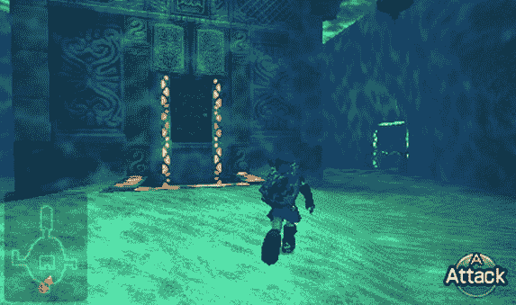

《塞尔达传说：时之笛》（动作冒险）- 水之神殿

+   前提：一个大型、圆形、充满水的中心区域，布局垂直。玩家需要访问各个翼区，并使用奥卡林娜来操纵中心的水位（解锁进入新区域）。这将感觉像真正的迷宫，并测试玩家的导航和解决问题的技能。

+   背景：水之神殿供奉水之精灵，并由祖拉严密守卫。

+   位置和进入方式：神殿位于希露亚湖下。只能使用钩爪和铁靴进入。

+   艺术参考：在这里，你通常会附上在网上找到的一些艺术作品。这些可以分成“可以”和“不可以”两类（有时展示你不希望某物看起来像什么是非常有用的）。艺术家或艺术总监参与或为你处理这个过程是非常常见的。

+   大小：大型，多层。期望游玩时间在 1 到 2 小时之间。

+   需要物品：钩爪、铁靴（水下行走）、祖拉斗篷（水下呼吸）

+   奖励：长射（钩爪范围升级，在小型 Boss 之后）、水之护符（Boss）、和心之容器（Boss）。

+   值得注意的障碍：

    +   5 个金色斯库鲁尔（诅咒家族任务所需的特殊蜘蛛）

    +   新敌人：刺针（蝠鲼）、壳刃（蛤蜊）和刺（漂浮在水中）

    +   新障碍：漩涡（水陷阱，碰撞后会将玩家抛回出生点）、急流（无法逆流而上，将在谜题中使用）

    +   小型 Boss：暗影林克（模仿玩家的动作）

    +   Boss 战：巨型阿米巴（使用长射击败）

示例 - 想象中的游玩过程

素描可以有多种形式！在下面的例子中，我们处理的是一个依赖于精心编排的单人任务的游戏。在这种情况下，编写事件的高级时间线是一个非常有益的练习。计划在实施阶段肯定会修改几次，但至少你会有一个稳固的起点：

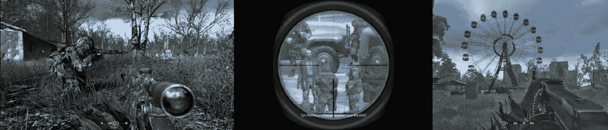

任务有三个明显的部分。接近、刺杀和撤离

召唤：现代战争（FPS）- 普里皮亚特刺杀

背景：一个回顾性的任务，设定在切尔诺贝尔附近的普里皮亚特，讲述了 15 年前主要故事情节发生之前，普莱斯上尉（当时是中尉）的故事。坏蛋伊姆兰·扎卡耶夫正在试图购买从切尔诺贝利核电站收集的核材料。美国批准了一项刺杀任务，试图阻止扎卡耶夫和交易。普莱斯被派到那里，与他的上级麦克米兰上尉一起。

任务本身分为两个部分，这两个部分自然地结合在一起。首先，我们必须悄无声息地进入位置，然后执行目标并尝试逃脱（一切混乱不堪）。

第一部分 – 全副武装

前提：一个安静且氛围浓厚的黑行动任务。玩家需要跟随他们的搭档，保持耐心，潜行，并准确时机进行刺杀以避免被发现。这一部分可以如下划分：

|   名称   |   详情   |   持续时间   |   强度   |
| --- | --- | --- | --- |
|   简介   |   跟随麦克米伦上尉。保持低调，以隐蔽的方式消灭敌人。渗透到附近的教堂。   |   3 min   |   1   |
|   队列   |   你需要悄无声息地穿过开阔地带。敌方的直升机、装甲车和步兵巡逻队都在警戒。   |   3 min   |   3   |
|   废车场   |   使用潜行技巧在满是退役军车和集装箱的废车场附近悄悄通过或消灭敌人。   |   3 min   |   2   |
|   会议   |   进入一个充满步兵和车辆的开放区域。冲刺到掩护处，然后悄悄地钻到敌军卡车下面。   |   4 min   |   3   |
|   普里皮亚特   |   进入荒废且杂草丛生的普里皮亚特镇，穿过混凝土塔楼。   |   3 min   |   2   |
|   酒店   |   这对搭档从酒店进入，从这里可以观察交易并执行刺杀任务。任务的第一部分在这里结束。   |   1 min   |   1   |

第二部分 – 一击必杀

前提：玩家刺杀了目标，之后一切混乱不堪。任务转变为一场全面行动序列，包括敌方直升机、激烈的枪战，以及以普里皮亚特摩天轮为标志的最后抵抗。这一部分可以如下划分：

|   名称   |   详情   |   持续时间   |   强度   |
| --- | --- | --- | --- |
|   交易   |   交易即将进行，目标进入视线。这将是一个非常远的距离射击。你需要调整风（基于附近的旗帜）和子弹下坠。   |   2 min   |   3   |
|   升级   |   目标已被击落，但你的位置已暴露。快跑！你有 15-20 分钟的时间到达撤离区（实际计时器以增加紧张感）。   |   1 min   |   4   |
|   公寓   |   在狭窄的空间内导航，与敌步兵小队交火。   |   3 min   |   3   |
| |   直升机   |   一架攻击直升机出现，击落它！麦克米伦被坠毁的直升机所伤。   |   1 min   |   4   |
| |   附加   |   将麦克米伦带到撤离区。面对成群的敌人步兵。   |   3 min   |   5   |
| |   住宅区   |   小规模、近距离遭遇战。向撤离区靠近。   |   3 min   |   3   |
| |   旋转木马   |   你和麦克米伦准备在标志性的旋转木马旁进行最后的抵抗。设置地雷并找到一个好的狙击点。   |   2 min   |   2   |
| |   最后的抵抗   |   抵抗敌人的浪潮，直到直升机到达。   |   4 min   |   6   |
| |   结尾   |   撤离到安全区。   |   1 min   |   1   |

使用想象中的游戏玩法数据，设计师可以创建高级强度图，这有助于后续规划并执行任务的节奏：

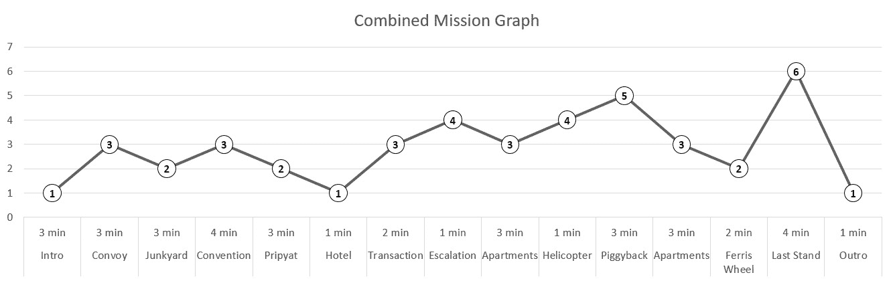

我们将在第十三章【平衡】中详细讨论节奏、强度以及详细时间线的创建。

灰盒

游戏玩法想法很少能如你所想的那样实现，这使得灰盒成为关卡设计过程中最重要的部分之一。

灰盒（也称为粗略布局阶段）指的是将你的想法（或现有原型）转换成简单但可玩的游戏版本的过程。它允许你在投入时间进行装饰之前，对可玩性和基础几何形状进行验证。

标题中的灰盒指的是在 3D 编辑器中快速组装的水平关卡的箱形、大部分未纹理的外观：

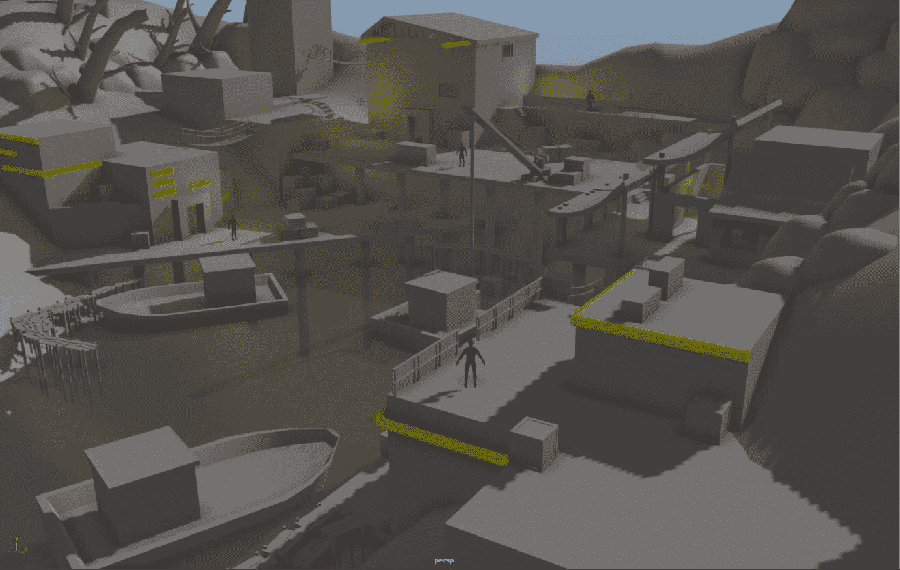

一款未知的游戏关卡灰盒（粗略布局）版本，由关卡设计师迈克尔·巴克莱（Twitter @MotleyGrue）分享。

进入灰盒阶段时，保持灵活性至关重要，要开放你的内容，以便根据测试、反馈和实验迭代的新想法和改进。这通常是进行重大设计更改的最后机会，因为随着你接近关卡设计过程的尾声，这些更改的成本会呈指数级增加。

为什么先从游戏玩法开始？好吧，你最后不希望投入大量时间和资源去制作一个艺术上令人愉悦的东西，结果却发现它根本不好玩，需要完全重新设计。

> > > 无论你的项目中的艺术家多么出色，都不要指望他们的漂亮纹理、视觉效果、声音和动画来弥补其最纯粹形式中不有趣的部分。你希望艺术增强游戏，而不是掩盖其设计的不足。

在游戏玩法方面，灰盒阶段是最佳时机：

+   验证内容的基调和感觉

+   验证几何形状/布局/事件顺序

+   设置基础难度

+   放置和配置各种游戏元素，例如：

    +   敌人、谜题、拾取物和障碍物

    +   触发器、脚本以及任何其他特殊游戏玩法场景

    +   过场动画和故事元素（可能是以原始的、纯粹的功能性形式）

    +   指南（再次强调，仅限于允许你验证游戏玩法的程度）

> > > 有时候，内容的设计根本不是围绕游戏玩法，而是围绕某个特定的艺术杰作。例如，展示你游戏引擎力量的美丽景观，或者在以故事驱动的游戏中发生的一个极其重要的情节发展。在这种情况下，你必须将重点转向不同的目标，但重要的是要承认（并接受）这种转变可能对游戏玩法带来的潜在负面影响。例如，通过选择提供广阔的开放视野，我们可能不得不移除部分几何形状并减少正在进行的演员数量。

艺术实现

在灰色盒子阶段，游戏玩法得到验证和确认后，艺术实现就可以开始了！这包括创建详细的几何形状、放置道具和装饰环境、纹理处理、照明以及创建特殊效果和动画。

游戏设计师是否直接参与这一过程取决于他们的技能组合、项目和团队。一些经验丰富的关卡设计师可以处理创建关卡的每一个方面，而其他人则专注于游戏玩法，将艺术方面留给像专业环境艺术家这样的人。

即使你不能直接参与这一步骤，也要密切关注过程，并确保关键的游戏玩法元素得到正确的处理。

> > > 制作时间表可能很紧张，艺术工作通常在你完成草图（甚至概念）之后立即开始。概念艺术、动画和建模通常与灰色盒子和游戏玩法迭代并行进行。在这种情况下，在投资创建有限再利用价值的场景和专有艺术之前，等待游戏玩法迭代完成是很重要的。

最终润色

如其名所示，最终润色是过程的最后一步，在此之后，内容正式完成并准备好发布。这一步骤通常会在时间上有所推迟，并且可以在所有艺术和游戏玩法方面实现之后很久才进行，在此期间艺术家和设计师可能正在从事其他工作。

为什么我们不能一次性完成所有事情呢？你当然可以尝试，但随着时间的推移，你会提高你的技能并获得新的视角和洞察力。你还将能够将你的创作与游戏的其他部分进行比较，并将其视为更大事物的一部分。你也可能会从游戏的外部和内部测试中获得反馈。

在灰色盒子阶段进行的广泛迭代和测试将有助于减少这一阶段的更改数量和范围。如果一切顺利，最终润色将仅包含对几何形状的微小调整、错误修复、对话、奖励、难度和节奏调整。

关卡设计和叙事

如您从前面的章节中可能记得的那样，游戏是一种互动和叙事媒介。在创建新的可玩内容时，您有多种工具和机会来讲述您的故事。正如我们所看到的，这些故事可以从整体叙事和游戏体验中产生。

有时这两个故事会紧密相连。在侦探游戏《洛杉矶无影》中，大多数游戏动作（如收集证据、审问证人等）不仅由叙事动机和支持，而且对叙事的发展至关重要：

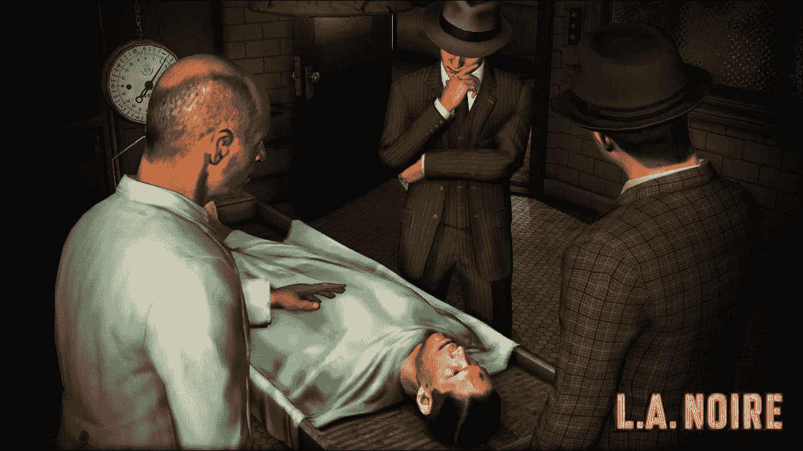

在其他情况下，游戏玩法和叙事可以是独立实体。在《战神挑战》中，球体匹配解谜游戏玩法可以完全互换，而不会影响叙事；另一方面，叙事本身对游戏玩法的影响很小：

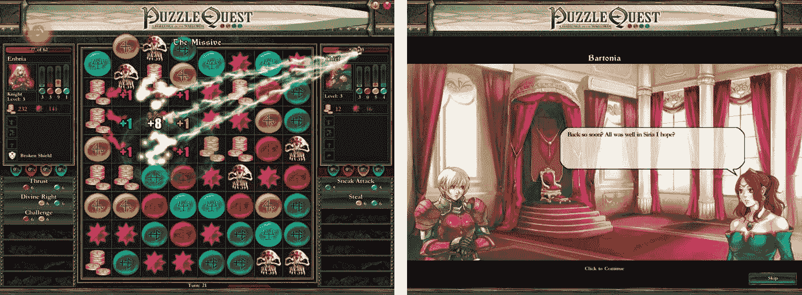

《战神挑战》将 3 匹配解谜游戏玩法与史诗般的角色扮演结构和详细的故事情节结合在一起，形成了一种奇特（但恰到好处）的婚姻。

大多数游戏都位于这个光谱的中间位置，其叙事解释游戏世界，激励和证明玩家的行为，同时，不反对游戏玩法的互动性。它们允许玩家在游戏世界及其规则范围内表达自己。

在将任何叙事整合到关卡设计之前，您需要问自己一系列问题，并建立一套规则来指导内容创作：

+   更重要的是，是叙事还是游戏玩法？如果是前者，您会接受一个不好玩但能很好地传达您故事的片段吗？如果是后者，您准备好为了更优越的游戏体验而牺牲叙事了吗？

+   您是否使用叙事来解释和加强玩家的行为，或者您的叙事与游戏玩法分开？

+   游戏是否可以在不与故事互动的情况下进行，或者与故事的互动是必须的才能前进？

+   叙事是否与您的游戏系统直接对立？例如，想象一个我们扮演 FBI 特工的游戏，但我们允许（甚至可能奖励）伤害无辜平民。

在回答了这些问题之后，您需要从一系列工具中选择来传达叙事。以下列出了最受欢迎的一些：

+   过场动画：玩家控制权被移交给电影式的序列。

+   对话：这些可以是被动或交互式的。交互式对话可以揭示额外信息，同时允许自我表达和分支叙事。

+   游戏玩法：

    +   直接：故事情节的发展取决于玩家执行某些动作。这为整合选择提供了机会，但并不强制执行。

    +   间接：玩家是一个乘客，体验随着游戏世界的变化或其他玩家或 NPC（非玩家角色）的行为而揭露的故事。

+   叙事：Thomas Was Alone 和 Stanley Parable 是两个令人惊叹的例子，说明了叙事如何紧密地融入级别设计，以产生高度吸引人的故事。

+   环境叙事：这是我们曾在第八章“游戏与故事”中讨论的一个大主题。

> > > 当谈到建筑和艺术主题时，BioShock 以其对时尚、艺术装饰风格乌托邦的沉浸式错误处理是一个典型的例子。另一方面，Gone Home 则是一个以探索和环境叙事为中心的短篇故事体验，几乎完全围绕探索和环境叙事构建，注重细节，并且展示得非常有效（尽管微妙）。

级别设计实践

在前面的章节中，我们解释了级别设计是什么，以及如何接近创建新内容的过程。现在，是时候提供一些实用的技巧和窍门，这些技巧和窍门应该会帮助你进行设计过程！

功能级设计与现实主义

游戏世界从高度逼真到完全虚构，大多数都位于光谱的中间。世界不会因为视觉杂乱、高分辨率纹理和详细的几何形状而变得更加可信。如果我们可以想象当我们离开视线时持续进行的生活，它们才会变得可信。即使是最简单的 AI 系统也能产生令人惊讶的结果。人类天生倾向于将随机行为的序列连接成更大、更有意义的叙事，这种现象被称为类聚现象。

> > > 创建更连贯设计的一个简单方法就是想象世界居民与周围环境的互动。不要满足于一套随意放置家具的墙壁，这些家具看起来像是填充物。办公室、房屋或商店都有其特定的用途，里面的物品放置都有其理由。浴室不属于客厅，床也很少放在门口。如果现实世界的规则不适合你的创作，那么就创造你自己的规则，并让你的虚构世界遵守这些规则。

除了使你的布局更具沉浸感之外，现实主义还可以通过允许玩家使用他们自己的非游戏经验和参考来帮助使游戏机制更容易理解。许多现实世界的物理属性，如光、重力、摩擦和浮力，在转化为虚构世界时几乎不需要认知努力。

记住，你正在创造的世界、其居民以及他们的故事都是为了支持你的游戏体验，而不是控制它。除非你正在制作模拟器，否则广泛的现实主义可能会迅速阻碍游戏体验，并变得难以承受地昂贵。玩家不想要现实世界的不同版本，他们想要一个他们可以理解和关心的沉浸式世界。

游戏功能的演变

我们可以应用 Kishōtenketsu 的哲学，这是一种经典的故事结构，通常应用于中国、韩国和日本的叙事。Kishōtenketsu 将故事分为四个部分：

+   介绍（ki）：通过介绍角色、地点和任何相关的历史方面来建立故事的背景。

+   开发（shō）：故事遵循既定的路径，没有重大变化。

+   转折（十）：故事中的意外发展。一个故事中可能有多个转折，但这是最显著的一个。

+   结论（ketsu）：故事以令人满意的方式结束。

类似的哲学可以应用于关卡设计，特别是当你的内容专注于游戏机制和挑战的介绍和演变时。

> > > 感谢 Mark Brown 的深刻视频（[`https://www.youtube.com/watch?v=dBmIkEvEBtA`](https://www.youtube.com/watch?v=dBmIkEvEBtA)），这激发了我在这本书中详细阐述这个主题。在 YouTube 上搜索 Mark Brown 以找到他的频道！

介绍

除非你追求类似《黑暗之魂》那样的达尔文式难度（即，你可能需要从错误中学习，通过自然选择进化）；任何新的游戏机制，无论是工具、障碍、敌人类型还是谜题，都必须首先以最基本（并且尽可能安全）的方式引入。

> > > 你可以使用各种技巧来引入新功能和机制，例如，让另一个角色先执行动作，这样玩家就可以跟随他们的脚步。我们将在【第十二章】中探讨你如何教授玩家【可访问性】的方法。

Kishōtenketsu 的哲学在游戏中已经使用了很长时间，一些最好的近期例子可以在现代马里奥游戏中找到，如《超级马里奥银河 2》、《超级马里奥 3D 世界》和《超级马里奥 3D 大地》。

让我们来看一个例子！在《超级马里奥 3D 世界》的世界 2-4 中，引入了一个新平台，每次跳跃时都会在两个位置之间翻转。当平台首次引入时，失败（平台从我们脚下逃走时坠落）没有后果，玩家必须通过实践来学习。以下是布局的近似图：

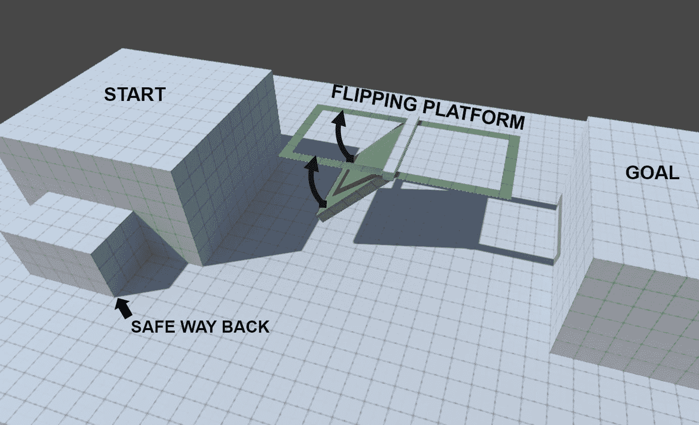

记住，新奇因素本身就让游戏更加刺激和认知上具有挑战性（提高我们对这一段的强度）；将挑战留到后面！

开发

现在玩家已经熟悉了新的游戏元素，是时候引入一个挑战来测试他们对该功能工作原理的理解。

让我们继续我们的例子！随着关卡的发展，挑战也随之增加。现在，坠落会导致死亡，有障碍和敌人会阻碍玩家，并让他们保持警惕：

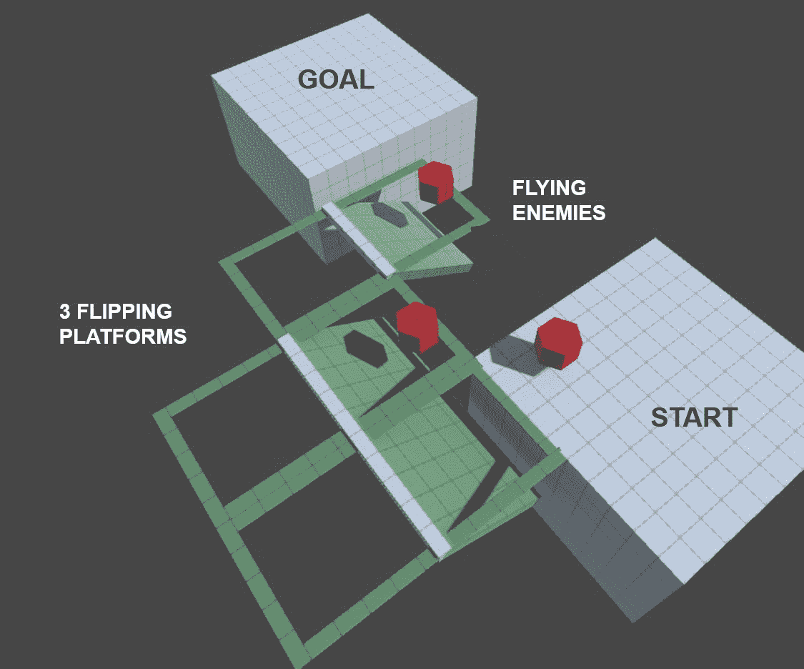

转折

当玩家展示出掌握感后，是时候让他们感到困惑了。转折就是拿玩家开始视为理所当然的东西，并以一种全新的方式扭曲它。这通常是通过将新机制与之前引入的东西混合，或者揭示玩家没有体验或预料到的属性来实现的。例如，在许多《塞尔达传说》游戏中，玩家得到一把弓箭，并使用它来激活远程开关。后来，揭示你通过射击火焰祭坛上的箭来点燃箭矢。这个转折就是发现两个看似不相关的元素的新组合，可以用来展示各种空间谜题。

在我们的案例研究中，其中一个转折部分将翻转平台与旋转尖刺障碍物（在之前的关卡中引入）配对：

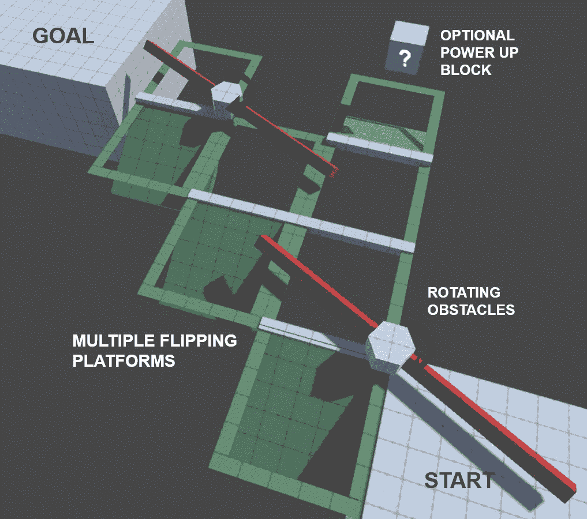

结论

这是我们的 4 节故事中的最后一部分。玩家已经熟悉了一个新的游戏元素，并且已经掌握了它，并看到了它在新颖、出乎意料的方式中被使用。将结局视为你的结束语；它不必很难，但必须令人满意，并提供成就感，或者至少是结束感。新的元素现在可以成为常规，或者被搁置起来，随时可以用来提供多样性或与新的东西混合。

在大多数超级马里奥平台游戏关卡结束时找到的旗杆序列是展示（现在已掌握的）机制的最佳场所。在《超级马里奥 3D 世界》的 2-4 世界中，旗杆部分要求玩家爬上一系列翻转平台，如果他们想要获得加分，这是一个由关卡设计讲述的故事的积极结局。

从第一天开始调整节奏

上文提到的游戏机制缓慢而逐渐的引入是一个节奏练习的例子。游戏节奏通常由你创建的关卡节奏和强度来决定。强度可以来自身体和认知挑战，以及艺术和情感刺激。新颖的内容和困难的部分会增加强度，而重复的段落和低难度会降低强度。长时间的低强度会导致无聊，而长时间、过于强烈的段落可能会让玩家感到疲惫。

紧密控制的单人游戏内容（尤其是如果它是故事驱动的）一旦整合，往往很难进行翻新。因此，从第一天开始考虑节奏是很重要的，可能是在草图阶段（如我们《使命召唤：现代战争》的例子所示）。

我们将在《平衡》的【第十三章】详细讨论分析、规划和交付单人游戏和多玩家游戏节奏的复杂性，链接。

锁和钥匙

锁和钥匙是一种普遍但有些争议的设计实践。基本实现包括对锁和钥匙的直义使用。你限制对某个区域（或奖励）的访问，直到玩家找到钥匙。为此，他们需要去别处完成任务，推进剧情或他们的角色。

让玩家离开并要求他们稍后再回来是一种所谓的回溯。它有其价值，但你必须小心，因为大量的回溯和必须管理未完成的区域列表可能会非常令人沮丧。

一个明显的用途是延长你内容的生命周期。你可能花了很多时间制作一个美丽的场景或高度功能性的区域，使用锁和钥匙可以增加玩家与内容互动的时间。只是确保它不是无意义的四处乱跑；添加新的障碍、一波新的敌人，或者以其他方式扭曲区域，可以帮助你的内容保持新鲜感。

锁和钥匙也可以用来鼓励探索，并使体验不那么线性。创建一个大型区域并在其周围隐藏关键物品，这样你可以让玩家自由活动，同时确保他们访问最重要的部分并完成所有必要的任务。

记住，锁和钥匙不一定是字面上的。宝可梦和塞尔达传说系列游戏中游戏的关卡设计充满了抽象化的锁和钥匙。

在宝可梦游戏中，钥匙是必须解锁并教授给你的生物的能力。教授你的宝可梦切割能力，你现在就可以进入被茂密的灌木丛阻挡的区域。不用说，在试图记住如何应用新获得的关键时，对于一些玩家来说，这可能会是一项既繁琐又压力山大的任务。

在《塞尔达传说》游戏中，既有实际的钥匙（用于解锁门、宝箱和 Boss 房间），也有钥匙物品。后者通常在地下城中解锁，允许玩家访问之前由特定谜题或障碍物阻挡的区域。除了解锁地下城的其余部分和进入外部世界的秘密区域外，钥匙物品通常还有其他用途。一些在战斗中很有用，其他则可以以有趣的方式组合起来解决谜题。

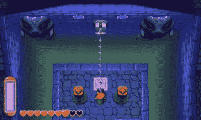

投掷钩是具有多种游戏用途的关键物品的例子，从解谜到战斗。

总结来说，锁和钥匙设计是一种流行且有效的技术，但要注意不要过度使用。过度使用回溯和强迫玩家记住一系列无法访问的区域，肯定会让你关卡变得乏味和混乱。完全依赖模式匹配（在 A 上使用 B，然后在 Y 上使用 X，现在清洗，重复）的内容设计，将你的游戏变成一个满是记忆中反应的购物清单，而不是真正的挑战、选择和表达的载体。

几何和游戏

关卡几何（即布局）和您正在创造的空间的空间属性可以对玩家的情绪产生深远的影响，从而影响游戏玩法。我们将通过首先介绍英国地理学家和诗人杰·阿普尔顿在 1975 年出版的《景观体验》一书中提出的前景-避难理论来探讨这个主题。

在他的作品中，阿普尔顿揭示了某些景观被感知为美丽而另一些则显得荒凉的原因，以及为什么有些空间能吸引我们并让我们感到安全，而有些空间则让我们感到不安和不安全。根据前景-避难理论，人类喜欢占据亲密、隐蔽的空间（避难所），这些空间俯瞰着充满潜力的广阔、开阔地区。

避难所的例子包括：

+   已探索的洞穴、洞穴或洞穴

+   停车场内的汽车内部

+   被树木保护阴影覆盖的长椅

+   一座有围墙的木制瞭望塔

+   山丘上的房子

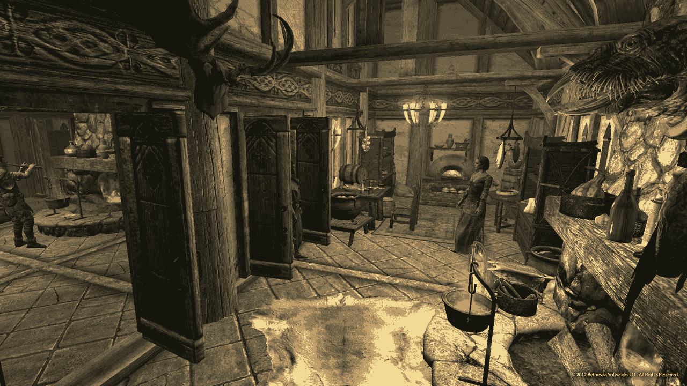

《上古卷轴：天际》中的一个避难区域示例。

前景的例子包括：

+   城市中间的一个开阔广场或公园

+   从山顶看到的缓慢下降的山谷

+   从港口的安全角度观察到的被平静水域环绕的岛屿

+   软软地攀登远处的山丘和丘陵

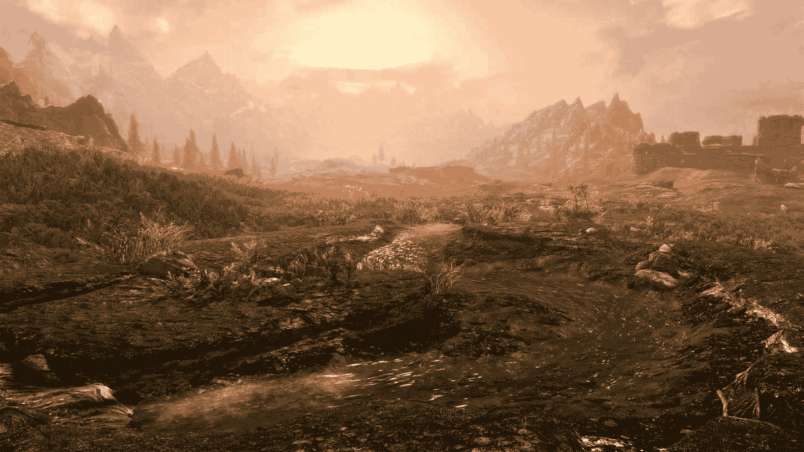

《上古卷轴：天际》中充满前景的全景

了解前景-避难理论的基础，让你能从每个古代狩猎采集者的角度审视你创造的空间，这些狩猎采集者潜伏在我们每个人的内心深处。

> > > 在制作可玩空间时，决定你想引发哪种情绪取决于你。为了满足玩家原始的需求，你必须保护他们免受被看到和伏击，同时允许他们向外窥视并发现敌人和机遇。另一方面，如果你想让玩家感到紧张，让他们感觉自己像一只待宰的鸭子，从多个方向可见且暴露无遗。例如，强迫他们在陡峭山谷中走一条黑暗的小路时携带火炬或手电筒，视野有限，地形困难，伏击机会很多。

空间操纵

前景-避难理论可以帮助我们识别根植于人类心理的需求、欲望和恐惧。这反过来可以帮助我们创造具有情感目的的可玩空间。

根据您玩家的当前状态和游戏机制，世界的物理形态将呈现不同的威胁和机遇。了解您游戏的主题和功能，您应该能够识别出对任何类型空间的潜在情绪反应。预测、分析和收集这些知识，使其在设计关卡时能够应用：

+   封闭区域：在生存恐怖游戏如《寂静岭》的背景下，狭窄的隧道和走廊可以迅速变成一种令人窒息的噩梦，敌人可以轻易地阻挡你的移动并把你困住。此外，在《黑暗之魂》这样的游戏中，狭窄的走廊实际上可能阻止你有效地使用某些咒语和武器（因为墙壁碰撞会阻止你的挥击）。但一个狭窄的地方不一定是坏事！在《求生之路》中，除非你面对的是少数几个特殊敌人（其攻击会在一个区域造成伤害），走廊或一个小房间可以迫使所有敌人进入一个可管理的瓶颈点，有效地将其转变为避难所（一个安全和理想的空间）。

+   可管理区域：这些区域足够大，可以自由活动，同时又足够小，可以轻松探索和掌握。如果空间易于穿越（无论是水平还是垂直），它可能会非常令人安心。特别是如果玩家可以利用其内容（包括墙壁和角落）来保护自己（避难所）。

+   开放区域：开放区域可以是玩家的灵感来源（展望）。为了产生积极的效果，为玩家提供行动自由和对环境的控制，使表面、接近角度、居民和天气条件不具威胁且易于穿越。这样的空间还可以通过激发对地形特征（洞穴、山谷、瀑布）或人造结构的好奇心来促进探索。令人难忘的特征也可以提供有用的地标并简化导航。良好的可见性和低被伏击风险也是使开放空间感觉安全的关键。另一方面，通过减少可见性（通过雾、雨、黑暗）、用充满伏击机会的地形包围玩家或让他们在一个荒凉、难以穿越的世界中感到迷失（没有可见的地标），你可以使开放空间感觉极其具有威胁性和不安。

高度

我们在游戏中对高度的反应可以因多种因素而有很大差异，包括：

+   我们立即周围的区域（封闭或开放，安全或危险）

+   我们在垂直方向上的穿越能力（例如，飞行的能力）

+   掉落的影响

想象一下站在一个狭窄的金属脚手架顶部，没有任何栏杆，高悬在地面之上。你不仅容易被人看到，而且完全意识到任何突然的动作都可能极其危险，因此，令人恐惧。在第二种情况下，将自己置于一个同样高的教堂塔内。这次，你得到了墙壁的掩护（避难所）和一扇窗户，你可以从中观察（展望）任何即将到来的威胁和机会。仅仅在 elevated walkway 上添加或移除障碍物，就可以对玩家如何接近它产生重大影响。

如果游戏允许你自由飞行，开拓垂直空间，那么高度带来的恐惧感可能会完全消失。另一方面，如果你因为看似可控的坠落而受到严厉惩罚，你将非常小心地对待高度。无需依赖坠落伤害和死亡的威胁，就可以产生同样的效果。你所需要做的就是在坠落发生时，强迫你的玩家重复一个困难或耗时的跳跃序列。我并不是说这是一个理想的效果，我只是在强调高度带来的后果和情感反应会根据几何形状、我们穿越它的能力以及坠落的潜在后果而有所不同。

> > > 即使你的游戏不依赖于玩家控制的移动，它也可以在其机制中充分利用高度。例如，在许多策略游戏中，一个比对手有高度优势的单位可以获得攻击范围上的加成（如增加伤害、射程和准确性）。

探索的情感意义

在物理或虚拟空间的情况下，探索是指为了发现新信息或资源而穿越一个区域的行为。你创建的关卡以及游戏本身的架构可以允许不同级别的探索。在发现失落土地和隐藏宝藏的世界中，可以找到巨大的喜悦和满足感。

要了解如何在你的关卡中利用探索，你需要分析旅程每一步背后的内在动机。

1.  规划：玩家将他们的好奇心投射到游戏世界中。他们要么识别出感兴趣的区域（“我想去……那里！”）或者他们想要满足的具体需求（“我需要找到更多的蘑菇”）。为了帮助这个过程，设计师可以提供隐含的目标（地图上被遮蔽的区域本质上是一个大问号）和明确的目标（寻找魔法树的任务）。你还可以在世界上提供视觉上的兴趣点，并通过使资源稀缺和没有它们更难或更不方便来鼓励资源积累。

1.  执行：探索的行为是一种投资行为。我们投入时间和资源，希望我们的努力得到回报。重要的是要让玩家感觉他们正在走的道路是他们自己的；成为一个无拘无束的探险家比被引导手所束缚的游客更有趣。为此，提供分支路径或开放区域，这些区域有不止一个解决方案。你可能还想放宽体验的结构（避免过多的脚本场景，关闭自动路径标记等）。我们希望我们的玩家成为他们故事的主人，即使他们的每一个动作都被设计师预测和鼓励。

1.  收益：如果我们的努力有可能得到回报，那么探索未知将更有意义。为了避免让玩家失望，尽量缩小玩家投入的时间、精力和资源与奖励感知价值之间的差距。然而，要注意不要让回报感觉过于人工化和可预测——如果每个洞穴都保证有宝箱，那么一旦你确定了洞穴，探索的感觉就会消失。只要有机会获得罕见但宝贵的奖励，偶尔让玩家感到失望也是可以的。

照明效果

光与黑暗始终对我们的心理产生强大的影响，作为人类，我们都有一种恐惧黑暗及其所呈现的未知事物的倾向。然而，当涉及到游戏时，照明的影响可以根据上下文完全改变。游戏的情绪、艺术主题和游戏机制都可以影响和扭曲我们的自然倾向。让我们探讨在关卡设计中利用照明的各种方法：

+   帮助导航：光不仅照亮了黑暗的环境，还可以立即吸引我们的注意力。对于任何人类来说，寻找光的热量和庇护是一种自然反应。对比度越强，效果越明显。这种生存特性在《Left 4 Dead》中被充分利用，明亮的灯光从汽车、泛光灯和街灯中发出，形成了一条通往安全的视觉路径。当玩家迷失方向，被成群的敌人包围时，他们高度依赖强光提供的强大且直接的导航线索。这条规则是双向的。你应该避免过度照亮你不希望玩家注意到的区域！

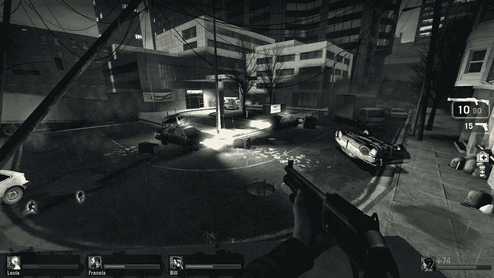

一条光之路在 Valve 的《Left 4 Dead》中引导着玩家前行

+   光是一种商品：便携式照明设备如火炬、手电筒和夜视仪的燃料可以变成一种有价值的商品，并创造一个确保（当光线强烈时）和恐惧（当我们耗尽燃料时）的循环。如果某个区域完全笼罩在黑暗中，玩家将被迫找到一种照亮它的方法。这导致了一个非常自然且不言自明的锁和钥匙进度关卡。

+   用光进行战斗：许多游戏限制并强制使用光源，但很少有游戏像《Alan Wake》那样将光源的重要性提升到战斗中的至高地位。将手电筒的光照在敌人身上会逐渐摧毁他们的黑暗护盾，使他们容易受到你的武器攻击。除非你使用光源，否则你无法反击！强力的泛光灯也分布在各个关卡中，不仅引导玩家，还充当安全区域。

+   好奇的阴影：虽然黑暗可能非常可怕，但阴影则更容易接近。是的，它可能会遮挡一些威胁，但只要保持舒适的可见度水平，我们就可以轻松地穿越阴影区域。如果玩家感到充分装备并准备好冒险，那么一个看似隐藏且未探索的阴影空间肯定会激发好奇心……如果某个区域没有被占用，那么谁知道呢，也许还有值得发现的宝藏？阴影区域也等同于避难空间，可以在不被外界看到的同时，允许看到即将到来的威胁。

+   黑暗作为朋友：在许多强调潜行的游戏中，即使是绝对黑暗也可以成为你的最佳朋友。在《合金装备》、《潜行者》和《细胞分裂》等系列游戏中，站在光线下等同于完全脆弱和暴露。在这些游戏世界中，黑暗的幕布提供了在否则充满敌意的环境中的近乎绝对的安全。但游戏不必专注于潜行机制就可以利用黑暗作为安全空间；一个很好的例子是 2002 年的一款第一人称射击游戏《黑暗》（嗯，我们在这里非常直白）。在《黑暗》中，可玩角色被赋予了在明亮区域无法工作的特殊能力，将光变成了必须避免或处理的威胁。这类游戏中的关卡设计通常更注重光和阴影的使用和放置，而不是实际的几何形状。

根据上述示例，我们知道赋予光和阴影游戏角色定义了玩家对避难空间的理解。有了这些知识，人们可以创建具有精心安排的避难空间的关卡，鼓励玩家规划路径（从避难所，通过前景空间，然后返回避难所）。如果你给你的玩家提供一定程度的自由（考虑多个避难空间），他们肯定会开始在大空间的不同部分之间建立心理路径，使他们感到更有能力和战术性地对待环境。

> > > 使用光的效果通常与对比度水平成正比。如果整个场景亮度相同，那么任何东西都无法从特别突出或隐藏中受益。一个充满明亮光线的屏幕不如一个在黑暗隧道尽头的明亮光线效果强烈。

视觉作为机制

光与黑暗不仅限于环境美学。视觉可以是你的游戏规则的一个重要部分，用于创建和影响信息视界：也就是说，玩家对游戏世界及其参与者的状态了解多少。

通过诸如战争迷雾（许多俯视角策略游戏的标准元素）等机制，你可以奖励和鼓励探索，并且可以完全改变光与黑暗的运用。

在使用这种机制的游戏中，地图上尚未探索的任何区域要么是：

+   完全空白：地图上有黑色区域

+   严重昏暗：展示地形，但表明玩家无法看到该部分关卡的情况

无论初始可见度如何，你必须决定初步探索之后会发生什么。最常见的两个例子是：

+   永久性地从任何已访问区域移除战争迷雾

+   只从玩家目前控制或靠近友军单位或建筑的区域散布战争迷雾：

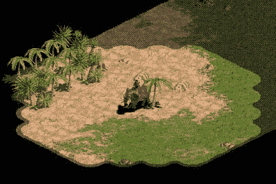

《帝国时代》中战争迷雾的两种状态。

这可能看起来像是一个微不足道、低级的选择，但它可以对游戏玩法产生深远的影响。通过在探索后移除战争迷雾，你永久地赋予了玩家新的信息。这促使玩家冒险远行，并且迅速行动。

另一方面，将战争迷雾重新应用于无人居住的区域保持了一种令人兴奋的不确定性。它要求玩家预测敌人的行动，而不仅仅是简单地做出反应。视觉成为了一种商品，是你可能拥有的任何其他地图控制机制的延伸。它还打开了你的关卡地形可能性。如果一个单位位于敌人上方，它可能能够看到并参与战斗，而无需担心有效的报复。

如果你计划在你的游戏中使用战争迷雾或其他任何以视觉为导向的机制，考虑其作用以及它可能对玩家行为的影响。你是由于其他类似的游戏有这些机制而添加这些机制吗？或者，增加的不确定性和探索感是游戏玩法的一个必要方面吗？你的视觉机制是否加强了你想让玩家表达的行为，或者它们只是简单地减缓了你的游戏节奏？

> > > 当与视觉机制一起工作时，确保实施（或请求）一系列可能帮助你实验游戏视觉的参数。例如，包括乘以视觉半径、在离开位置后保持一段时间视觉、完全移除战争迷雾或使其在初步探索后散开。你可能有一个你认为要遵循的标准，但你的游戏可能因为某个你无法预见的组合而感觉更加有趣。

多人动作游戏关卡设计

多人关卡设计是一个庞大的主题，每个游戏都有其独特的动态。它也是进行广泛测试和用户研究的理想候选者！为了这本书，我结合了一系列可以应用于大多数动作游戏并帮助你设计更好地图的技巧：

+   遵循一个前提：让你的关卡从游戏中脱颖而出的一种好方法是将它构建在一个独特的游戏玩法前提或视觉场景（瀑布、风车，甚至是一艘坠毁的宇宙飞船）周围。利用几何形状、照明、墙壁标志和游戏目标来引导玩家走向一个可识别的空间，从而定义关卡。一个强有力的前提也允许你保持专注，并将关卡的不同部分相互优先排序。

+   避免死胡同：它们会阻止玩家前进并打乱他们的节奏，使他们感到迷茫和愚蠢，因为他们不知道该去哪里。

+   提供侧翼机会：即使是最佳的前哨位置也需要一些弱点。

+   让你的玩家保持移动：通过在人口密集或难以到达的区域隐藏强大的物品来奖励冒险行为是一种经典的做法，但并非唯一！你甚至可以通过重新平衡或分散弹药拾取点以及降低初始弹药容量来让玩家保持移动。

+   使用热图：尽早要求实施死亡位置分析。这将允许你记录每个玩家的死亡位置，然后将它们转置到地图布局上，突出显示高度受欢迎的区域和几乎无人问津的区域。虽然非常热门的区域是可以接受的，只要它们不是局限于一个门框。然而，如果你的地图有一半的区域没有任何活动，你可能需要考虑改变几何形状或为冒险到那里的玩家提供额外的激励（如拾取物品和武器）。

+   垂直思考：我们经常从地图的上方看，这让我们忘记了高度扮演着多么重要的角色。只需确保提供几种在不同高度之间穿行的方法，看到敌人却不知道如何到达他们的位置可能会非常令人沮丧：

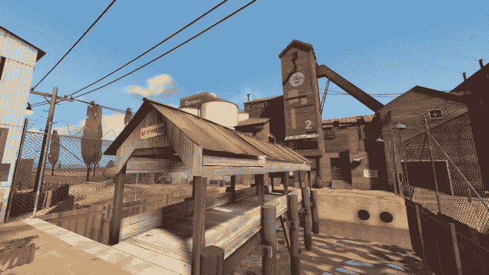

Team Fortress 2 中的 2Fort 地图是一个很好的例子，它有一个强大的前提（两个由河流分隔的堡垒）和垂直设计（阶段有高地狙击平台以及从河流可进入的地下部分）。

> > > 本章中使用的截图仅用于说明目的。我们不推荐你以任何方式滥用这些截图。有关更多信息，请参阅本书免责声明部分中提到的出版商的条款和条件。

摘要

在本章的引言中，我们将关卡设计描述为一个庞大而模糊的主题。尽管主题的复杂性令人难以置信，但希望你在尝试为你的游戏创建关卡时更有信心。

我们首先描述了 5 步设计关卡的方法（从构思到润色），并探讨了关卡设计与叙事之间的相互作用。然后，我们经历了一系列实用技巧和窍门，从现实主义的使用和 Kishōtenketsu（引入、发展、转折、结论）的哲学到光与暗的复杂性、空间的实际应用以及多人关卡设计的技巧。

但不仅如此！在《使命召唤：现代战争》的示例草图期间简要提到的节奏（一个概念）将在第十三章“平衡”中进一步探讨。

现在我们有了我们的游戏世界，我们应该尝试让它们充满活力。下一章将致力于创建游戏角色的艺术和工艺。
