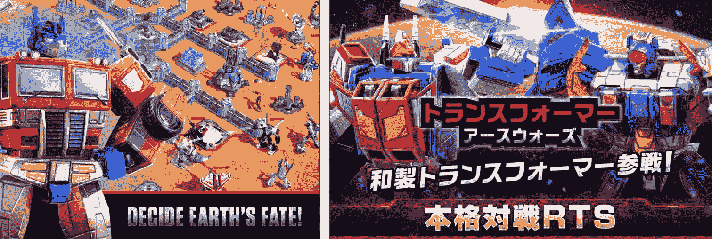

可访问性

在上一章中，我们学习了用户体验和用户界面设计的最佳实践。现在，我们将学习如何使这些，以及游戏的任何其他部分，更具可访问性；也就是说，更容易使用、理解和关联。

首先，我们需要找到方法来创建一个稳定且无摩擦的游戏世界和规则介绍。然后我们必须确保游戏可以为经验较少、技能较低或能力较弱（无论是认知上还是身体上）的玩家提供高度可玩的游戏体验。

最后但同样重要的是，即使是最好的游戏也往往从不好的地方开始，而测试我们的游戏以寻找改进之处没有比这更好的方法了。我们将在本章的最后半部分探讨可用性测试的艺术，并为您提供计划和组织您自己的游戏测试会话所需的技能。

提高可访问性

当考虑使我们的游戏更具可访问性时，我们通常会缩小我们的关注点，集中在游戏挑战的整体节奏和难度上。虽然平衡本身非常重要，足以占据整章内容（我们在这本书中确实这样做了），但我们首先需要确定我们可以使我们的产品核心更加易于接近的方法。

减少认知负荷

需要良好的记忆力、观察力、抽象思维、计划和事实关联的游戏都存在认知负荷过高的风险。

高水平的国际象棋比赛立即成为了一个难以克服的智力挑战的例子。然而，国际象棋的基本规则和机制可以被年幼的孩子理解和记住，这使得国际象棋成为一个易于接触的游戏。

只有当玩家陷入困境或难以学习规则和提升技能时，复杂且对心理要求高的游戏才会变得难以接触。为了使游戏在这方面更具可访问性，可以尝试以下方法。

避免具有二元结果的智力挑战

20 世纪 90 年代的冒险游戏充满了抽象的谜题，这些谜题提供了二元心理挑战——要么找到解决方案，要么独自挣扎。玩家通常会结束于在游戏世界中搜寻，扫描每一个屏幕，并尝试每一种可能的物品组合。如今，具有这种程度摩擦的游戏可能会让玩家感到沮丧，以至于放弃游戏。当可能时，避免具有二元赢/输条件的强制谜题，或者确保包括一个被动或主动的提示系统。

> > > 如果你在寻找灵感，可以尝试《莱顿教授》系列游戏，其中包含了数百个巧妙（而且往往非常困难）的谜题，以及一个实施良好的提示系统。在大多数情况下，一个谜题有三个可以通过每个提示币购买一个提示，还有一个可以购买两个提示币的超级提示（解决方案）。提示币本身是一种有限的资源，通过探索和与环境互动（点击邮箱、花盆、猫等）获得。玩家必须努力寻找提示，这意味着使用它们并不感觉像作弊。

限制初始复杂性和规则之间的相互作用

具有复杂规则集和多层机制的产物通常需要玩家大量的练习。

作为游戏创作者，我们常常渴望设计出优雅的系统，其中多个元素以离散的方式相互影响。这是一个伟大的抱负，但这也可能让我们创造出令人压倒性的体验。

新的机制或规则应该在之前的机制被充分探索和理解之后才进入舞台。为了教学目的，移除或限制游戏的一些方面并无害处。例如，在玩家有机会玩之前，不要要求他们构建一副牌，也不要在他们真正需要之前引入维持有限时间/回合/生命值/弹药/资源等压力。

我们将在本章的后面部分更多地讨论介绍和解释游戏机制的主题。

降低知识断层

一个知识断层的绝佳例子可以在许多多人竞技场游戏中找到，比如《英雄联盟》和《DOTA 2》。这两款游戏都包含数十种物品和数百个角色（每个角色都有多个复杂的能力），玩家需要理解和记忆。数量如此之多，即使只有简单的属性变化作为变量，知识断层也会非常显著。实际上，这些角色和物品还充满了新的机制——这是一个数量和复杂性都令人压倒的完美风暴！难怪它们是市场上最难以接触到的游戏之一。

在这种情况下，限制内容是最简单的解决方案。这就是为什么 Valve 将《DOTA 2》前 25 场比赛中可玩英雄的数量从超过 110 个减少到只有 20 个，新玩家只能相互对战。他们还引入了一种新的快速模式，减少了死亡惩罚，改变了节奏，并取消了一些购买物品的限制性规则。即使有所有这些变化，DOTA 2 仍然是对新手来说最难和最具惩罚性的游戏之一。

记住，像《英雄联盟》和《DOTA》这样的游戏是例外，它们在没有良好的入门教程的情况下幸存下来，并且达到了临界质量，这得益于庞大的忠实玩家基础。同样的策略可以，并且很可能会使大多数其他游戏失败。

限制交互的复杂性

我们已经在《第十一章：用户界面和用户体验》中详细介绍了输入方法和控制。启用完全控制重映射和减少输入复杂性对于提高可访问性大有裨益，同时很少会对游戏机制产生负面影响。

我们可以做得更好！你能想象一种只用一只手就能玩你的游戏的方法吗？或者只用一根手指？这种荒谬的一指限制通常是移动游戏控制的一个基本要求。毕竟，另一只手可能正抓着咖啡杯或公共汽车的手扶杆。当然，并非所有游戏都能满足这样的要求，但尝试在保持目标受众的可玩性的同时满足这些要求，这是我们所有人都应该追求的目标，为了所有玩家的利益。

> > > 经常存在一些方法，可以轻松绕过多个同时输入的必要性。例如，在第一人称射击游戏中，瞄准瞄准镜、冲刺和蹲下都可以是切换动作（按下来打开/关闭），而不是需要持续按住一个键或按钮。

即使你的控制很简单，快速准确地执行它们也可能过于具有挑战性。困难的执行在任何实时游戏中都可能成为问题，从《吉他英雄》中的快速模式匹配到玩《反恐精英》所需的专家级手眼协调和反应速度。确保为经验不足和不太熟练的玩家提供一套节奏较慢、惩罚较轻的挑战。这可以通过难度设置、规则调整和多人匹配来实现。我们将在《第十三章：平衡》中探讨调整难度的方法。

保持视觉清晰度

如果玩家不能轻松地区分、阅读和理解游戏状态和屏幕内容，他们将无法有效地与游戏互动。考虑以下建议来提高你游戏中视觉清晰度：

+   在用户界面中隐藏或降低任何不必要的信息的优先级。

+   将敌人和交互对象与背景分开。无论是通过形状、轮廓、调色板还是材料和着色器。

+   在你的关卡设计中使用清晰和统一的视觉语言。例如，在《古墓丽影》中，任何可攀爬的墙壁都涂有白色油漆。

+   不要用压倒性和持续时间长的视觉效果掩盖关键信息（玩家位置、威胁）。

+   可视化游戏状态。使用文本、图标和符号清楚地指示游戏角色的状态。例如，生命值条、伤害数字、状态符号等。遵循前一章中强调的良好游戏反馈原则。

+   适应色盲玩家，他们占你男性玩家基础的 10%。提供菜单选项以交换重要元素的颜色，例如地图和目标标记、生命条等，并利用不同的形状来区分用户界面的各个部分。例如，UI 标记可以是圆形的用于友军，三角形用于敌军。

使音频可选

除非你的游戏围绕音频设计，无论是对话的口语（例如，《托马斯一个人》，斯坦利的寓言），音乐（吉他英雄，摇滚乐队，Audiosurf）或声音提示（例如，《反恐精英》和《彩虹六号：围攻》中的脚步声和开火声），你应该避免依赖音频提示。除了隔离听力受损的玩家外，你还使那些低音量或静音的玩家处于不利地位。在移动和便携式游戏市场中，后者的可能性极高。

至于支持听力受损的玩家，除了集成字幕外，你还应该考虑提供选项以启用字幕（对音效的文字描述）。例如，门吱嘎声或巨大的爆炸声。

限制负面后果

在检查点重生，重玩关卡，移除装备和角色，以及最后但并非最不重要的是，永久失败状态（即永久死亡）；这些都是最常见的负面后果的例子。

在大多数情况下，剥夺玩家的进度是让你的游戏更不具可访问性的一个可靠方法。如果你将其与技术问题、未能教授游戏系统、缺乏预期和明确的反馈相结合，那就更如此了。你不想让你的观众对负面后果一无所知，并且没有准备好应对它们。

请不要误解，失败可以是好的，可以激励人，我们显然希望我们的玩家接受挑战。但尽管让我们的观众从错误中学习是件好事，通过失败来学习是我们的最后一道防线，也是教玩家最令人沮丧的方式。

我并不是反对将进度损失作为后果的使用，实际上，我非常喜欢的一些游戏惩罚性极强。然而，重要的是要认识到，进度移除和永久失败状态带来的负面影响，这些影响对可访问性有不利影响。这些机制并不适合每个人，除非它们构成了你游戏的基础，否则请考虑使它们成为可选的。

建立在共同知识的基础上

将你的游戏锚定到另一个流行的产品可能会有所帮助，但创建对游戏世界之外的世界的强烈参考可能更有帮助。这包括流行文化、历史、体育、传统、活动、爱好，甚至我们周围世界的物理属性。

冰是滑的，木头会着火，钻石很贵，而火箭联盟有点像用汽车踢足球。越容易在游戏世界和现实世界之间建立平行，你就越不需要将知识直接放入玩家的脑海中。话虽如此，虽然取消规则是可以的，但在意想不到的地方打破规则可能会使事情变得非常混乱。例如，如果你的角色不需要食物来生存是可以的，但创建一把比钢剑更耐用的木剑就不明智了。

教学游戏系统

教学和介绍新的规则和机制往往与创造它们一样困难。第一步，一如既往，是承认和尊重你的观众的不同口味和偏好，不仅是对某些类型的游戏，还包括他们喜欢学习和应对挑战的方式。你还得为接触到类似游戏和相关的生命经历的不同水平做好准备。

我们都有自己的学习偏好，尽管研究人员很难就一个特定的定义和分类达成一致，但他们似乎都同意，每个人都会倾向于特定的学习技巧。有些人喜欢听，有些人更喜欢阅读，而其他人则跳过所有文本，试图通过跟随视觉线索来弄清楚事情。

一种非常成功的策略是将几种教学方法混合在一起，形成一个在故事、游戏结构、目标平台和观众范围内都运作良好的组合。

> > > 记住，书面信息、视频和脚本化的游戏玩法都是有效的教育工具，但游戏是一种互动媒介，最愉快和有效的教学我们的玩家的方式是通过游戏本身。通过为玩家提供即时的目标清晰度、来自游戏和界面交互的明确反馈以及新元素的逐步引入，可以大大减少教程元素的需求。一个优雅且清晰展示的机制有机会在行动中自我解释。

游戏中的教学技巧

有时候，在没有精心制作的教程的严格指导下，向几乎没有先前经验的玩家解释复杂的游戏系统可能是无法实现的。以下是一些直接的教学技巧：

+   初学者训练：游戏开始时的脚本化和封闭式教程可能会被认为是不必要的或令人沮丧，但它们仍然是一个非常有效的工具。首先，你完全控制着游戏状态和关卡设计，可以清楚地阻止任何进度，直到所有指示都遵循并且任务完成。一个熟练且有经验的玩家应该能够快速完成你的教程；确保移除任何不必要的暂停，并将长时间演示和演讲留给真正需要它们的人。没有什么比在一名士官长花 20 秒告诉你如何装弹和拉动扳机时，你被锁在控制之外更令人沮丧的了。

+   上下文相关的教程：精心制作的教程会在你需要的时候出现。尝试将你的教程内容分成更小的部分，并实施一套简单的规则和条件来衡量何时以及是否启动它们。例如，在《变形金刚：地球之战》中，我们关于物品融合机制的教程要求玩家至少有八个未装备的物品，并且没有任何一个是 2 级。这意味着玩家没有自己发现这个功能，但他们有足够的备用物品轻松负担它。虽然预先召唤一个友好的教程精灵来应对新出现的任何事物可能很容易，但识别游戏中的压力点并预测一个处理它们的良好时机则是一门更精细的艺术。在正确的时间启动正确的教程是让玩家接受和感激的秘密。

+   可选训练部分：支线任务、练习任务以及在新获得工具旁边发光的“了解更多”按钮。这些都是你可以在不影响主线剧情的情况下注入知识的方法。毕竟，高级玩家不应该被迫学习他们已经知道的东西，而应该有一个安全跳过这些内容的方法，而不会失去任何东西。但如果他们不小心跳过了呢？如果玩家因为不耐烦或误解了他们即将学习的内容而后来遭受了损失怎么办？这些担忧是合理的，可以通过一系列安全措施来解决。可选训练元素应该清楚地说明它们包含的内容（换句话说，确保暴露你的课程内容），并在玩家决定需要它们时可以访问。

在另一端，我们有间接教学技巧，这些技巧要么不那么侵入性，要么与游戏的结构自然交织在一起：

+   在环境中留下信息：有时环境的状态可以为你提供所有需要的线索。在之前的章节中，我们谈到了环境叙事；在《死亡空间》的情况下，墙上的文字在教授玩家如何与亡灵战斗中发挥了作用。不那么明显的线索需要更多的细节关注，可能会将教学变成一个解谜练习。谁说教程部分不能变成令人愉快的障碍来克服？当你深入到令人毛骨悚然的森林时，你会遇到金属陷阱，其中一些陷阱的嘴部咬着被遗忘很久的骨骼。还有一些陷阱被岩石（你可以捡起）挡住。不久之后，一个未启动的陷阱挡住了你的去路，一块石头就放在你的面前。这种联系很快就变得明显。

+   以身作则的教学：伴随角色（如《半条命 2》中的 Alyx）不需要与玩家交谈就能传授知识。当你通过射击和打击的方式穿越充满外星人的地球时，你会观察并模仿你的伙伴的技能和行为。如果玩家没有可以依赖的友好角色，他们总是可以跟随敌人的脚步。如果你看到敌人角色（或玩家）执行火箭跳跃，你很快就会尝试自己来一次！

+   强化：自从时间开始以来，积极的强化一直是引导人类行为最有效的方法之一。那些因某些行为而获得表扬、资源或纯粹满足感的玩家将继续沿着通向持续和不断升级奖励的道路前进。投入时间和精力学习新的游戏系统应该伴随着明确的奖励，并被视为在未来获得优势的机会。

+   可获取的信息：发光的“了解更多”按钮、鼠标悬停提示、控制提示和按钮上的文本标签只是为玩家提供信息的几个例子，这些信息要么是公开的，要么在他们方便的时候容易获取。这些工具本身可能不足以教授玩家关于复杂游戏系统和交互的知识，但它们确实使游戏更容易理解。

+   失败：仅仅通过试错来教学，这无疑会让玩家感到沮丧，并让游戏看起来不公平。然而，承认惩罚的简单而强大的信息是很重要的。如果玩家正在输掉比赛，至少你应该解释他们为什么失败以及如何改进。无论是通过在多人射击游戏中展示所谓的“击杀摄像头”，还是通过解释导致失败状态的陷阱、敌人或游戏机制的工作原理。

游戏外的教学

许多详细和细微的信息可以在主要游戏体验之外暴露出来。然而，尽管这些技术在覆盖专业知识或深入挖掘统计数据和非关键机制方面很出色，但它们应作为信息的辅助来源——不能依赖或期望玩家从这些来源获得信息。在这个类别中，我们可以放置：

+   加载提示：加载界面是放置对玩家进度不至关重要的提示和线索的好地方。按钮快捷键、高级或隐秘的机制、装备亮点以及重要信息的重复都是可行的选择。你还可以利用这个空间放置快速的故事提醒、当前行动/任务或各种角色和地点的背景故事摘要。当你在制作加载提示系统时，最好确保它考虑到玩家的状态。这样，一个即将面对最后 Boss 的老玩家不会因为一个不必要的跳跃提示而受到轻视，而一个新手也不会面对关于高级结局组合的信息。

+   训练场景和视频：如今，许多仍在进行大量开发的游戏依赖 YouTube 等平台上的叙述性视频教程。这是一种将知识传递给忠实粉丝群体的好方法，但不应依赖于最终产品。如果你最终创建了外部视频内容，确保将其链接或嵌入到你的游戏中。游戏内的场景是教授玩家的一种更可靠的方式，但它们往往成本更高，不应在早期投入。

+   游戏手册和指南：纸质手册和指南在很大程度上已成为过去式，而且很少有用户会去寻找数字版本。除非平台持有者要求你制作手册，或者你正在准备豪华印刷版，否则你应该放弃这项工作，直接将其投入到游戏内的教学之中。

+   游戏内知识库：玩家日志、个人数字助理（PDA）、百科全书和数据库是存储易于访问信息的好方法。一个这样的系统例子是《质量效应》系列中的法典——一个充满故事内容、角色传记、背景故事、游戏技术和当然，我们钟爱的教程的地方。

+   外部维基：官方和非官方的知识数据库（维基）让高度投入的用户可以深入了解你游戏的细节。这样的维基充满了详细的单位和装备统计数据、补丁说明、游戏提示和攻略。你可能不想在创建官方维基上投入时间（尤其是对于单人、以故事驱动的游戏），但无论你做什么，都要确保支持社区，如果他们选择创建自己的知识数据库。至于竞技多人游戏，最新的维基可以成为健康社区的一个支柱。

+   点对点知识共享：积极参与的粉丝基础的力量确实令人瞩目。像《英雄联盟》和《DOTA 2》这样的复杂且解释不清的游戏，其成功很大程度上归功于其社区成员愿意相互引导和教授。除了朋友列表、公会和联盟之外，你可以通过引入依赖于被推荐玩家进步的推荐计划，以及支持回放分享、观众模式和整个游戏通用的聊天系统，来鼓励导师行为。

最佳实践

在本节中，我们汇编了一套可以帮助使你的入门体验更加专注、有组织和有效的提示和指南。

不要因小失大

我们试图教授玩家的努力始终面临让他们感到无聊或不知所措的风险。如果可能的话，你的教程部分应该与游戏的其他部分无缝融合。冗长的训练任务和实践回合都有可能让人感到疲倦（何时才能结束？）甚至可能让听众感到被轻视（我已经知道了！）。后者在老微软办公软件中的 Clippy（回形针）身上表现得尤为明显。Clippy 令人讨厌、侵扰性大且似乎毫无头绪的特性成为了一个持续的笑话。然而，当由一只可爱的黄色小狗提供时，类似的训练变得更加容易接受。导师、方法和跳过前进的能力都在创造一个不那么两极分化的体验中发挥作用。

理解训练模式的影响

通过玩游戏，我们进入安全的模拟环境中，可以在没有任何真实后果的情况下了解世界。因此，将任何游戏的一部分标记为训练，相当于在安全模拟中创建一个更安全的模拟。所以尽管在整个游戏体验中都在学习，但许多玩家仍然认为游戏中的训练部分是浪费时间，并急切地期待真正游戏的开始。如果你发现自己依赖于这样的部分，确保其中的一部分可以跳过，并且明确标记为可选。

你还可以根据玩家选择的难度设置，将某些教程部分和功能打开或关闭。如果有人在噩梦难度设置下玩射击游戏，他们很可能不需要被告知如何移动和四处张望。

专注于创新和晦涩

你的教学策略应该考虑到游戏的复杂性和创新程度。首先关注游戏的实验性部分，知道更熟悉的机制已经在前人成功教授过（因此可能找到并适应的稳固参考）。

随后，留意你的游戏中可能不会妨碍即时进步的部分，但可能会产生长期影响的环节。例如，玩家可能不会意识到特定资源的重要性，将其丢弃，直到 30 小时后才发现这样做导致他们现在缺少升级装备所需的必要材料。

选择合适的时机进行教程制作

你理想中希望在花费大量时间和精力来完善你的入门体验和教程之前，将核心游戏机制尽可能接近最终版本。早期，教程预算最好用于游戏内的文本和视觉反馈。短期内，录制教程视频或亲自解释游戏也是有效的方法。一旦你开始将游戏展示给更多人，并进入外部测试，你可能会发现基础部分已经基本确定，这使得在教程上花费的时间都是值得的。

制定教程计划

接近教程创作可能是一项艰巨的任务。为了使事情变得更容易，你需要制定一个计划。如果你手头有内容生命周期文档或玩家进度流程（如第三章中提到的，在《游戏项目范围》中），请将它们作为基础。否则，制作一个玩家进度的基本时间表和一份重要的游戏机制单独列表。

现在，尝试匹配这两个列表并注意你可以使用的教学技巧。确保你不会一次性向玩家灌输太多无关的概念。在这个阶段，你可能会发现游戏的一部分或其关卡设计需要改变或调整，以便更好地适应。这也是为什么游戏初期区域应该推迟到基础机制和大部分内容完成之后才开发的原因之一。

尝试三步法

当处理需要玩家积极参与的引导式教程时，将其分解为三个步骤有助于：

1.  上下文：向玩家说明他们在做什么以及为什么。例如，使用你的攻击将其他参赛者从竞技场中淘汰！

1.  交互：引导玩家通过执行阶段，如果可能的话，多次进行，并逐步增加难度。例如，按 X 攻击骷髅... <骷髅被击败> “太棒了！但是...看起来还有更多！准备好！”

1.  摘要：巩固知识并突出机制的未来应用，无论是通过文本、图像还是激励目标。例如，尝试解锁新技能和找到新装置以了解它们的功能！摘要也是将玩家迄今为止所学的一切在真实、无指导的情景中立即应用的好地方。

测试和迭代

你创建的任何教程都不可能完美。就像游戏机制一样，你必须从某个地方开始，并在过程中修正异常。如果你在几种不同的方法之间犹豫不决，并且有足够大的测试候选人群，那么最好花额外的时间同时在不同玩家群体中尝试所有这些方法，然后选择最好的。

有些事情最好是留给未解释的

我们详细讨论了如何向普通玩家解释你游戏中复杂的部分，然而，我们必须承认，有些游戏在玩家完全自己尝试解决时表现得最好。深奥、创新的游戏系统如果作为谜题留下，通常会更有趣，而发现事物是如何运作的可以成为体验的关键部分。然而，也有一部分人，尽管人数不多，但对他们来说，一定程度的不可及性是一个很大的吸引力。他们为掌握一个臭名昭著的困难游戏而感到自豪，成为少数能够理解的人。这看起来是一种非常小众的游戏设计方法，很少适合商业市场，但它值得认可。

无论你的游戏有多休闲，一定程度的神秘感和秘密（一扇锁着的门，一个看似无法触及的收集品）都可以在推动玩家和为那些解决问题的人创造真正特别的体验方面走得很远。大多数《超级马里奥兄弟》游戏都非常易于接触，但充满了秘密和可选区域，需要大量的思考和计划才能到达。

一个完全遵循神秘与掌握范式的游戏例子是《The Witness》，这是一款设定在荒岛上、没有教程、除了几个象形文字外没有指导的谜题游戏。使游戏运作（并且运作得非常出色）的唯一三个元素是：

+   在解决谜题时给予积极的强化：岛屿上的事物激活，灯光打开等

+   逻辑：这些谜题是有意义的，可以在不需要言语的情况下解决

+   级别设计和环境艺术：广阔的视野、不同的艺术主题、建筑和物体（如关闭的门）以强化我们自然的好奇心

本地化

术语“本地化”是在第十一章“用户界面和用户体验”中引入的，当时我们讨论了在 UI 元素下放置文本标签并确保它们在翻译成不同语言时不会断裂。

在西方市场，长期以来占主导地位的做法，以及出版商通常提出的要求，是支持 EFIGS 语言组（英语、法语、意大利语、德语和西班牙语）。最近，在数字发行更加全球化的时代，西方出版商经常发现自己正在扩大默认组，包括日语、韩语、中文、俄语和巴西葡萄牙语，这些是最常见的添加。新字母和文本流动方向的加入可能会给那些没有准备的人带来大的 UI 挑战。

除了语言之外，本地化不仅仅是交换文本和配音。新市场解锁了接触不同期望、消费行为、流行文化参考、传统和文化敏感性的新受众。你的最终目标是给你的玩家带来一款感觉像是为他们量身定做的游戏。

处理这个问题最好的方法是和一个了解当地情况的本土人士合作，他们可以阐明这些差异。否则，通过观察该领域的成功游戏公司、研究适用于游戏的当地法律以及研究你新市场的社会经济状况，可以积累大量的知识。

本地化努力的例子包括：

+   多语言网站、论坛和客户支持渠道。

+   定制的营销艺术和销售信息。

+   更包容的角色阵容，尊重地代表不同的种族、国籍、性别，甚至性取向。

+   替换或删除宗教和政治象征。

+   减少或替换血腥和暴力场景——这在德国通常是一个出版要求。

+   不同的定价模式和/或支付方式。例如，短信支付是印度购买数字商品的一种非常流行的支付方式。

+   添加吸引历史或流行文化参考的新角色。例如，中国的孙悟空。

+   国别排行榜。

+   本地化事件和信息，针对特定国家的节假日

为了将事情付诸实践，Transformers Earth Wars 的本地化商店页面不仅包括完全翻译的视频、文本和截图，而且在某些地区还包括一套完全不同的促销资产。英语列表中的第一张截图展示了擎天柱。另一方面，日文版本突出了两个在日式漫画和卡通中担任主角的区域角色的存在：

游戏测试

你可能之前已经遇到过“游戏测试”这个词，无论是在这本书里还是在其他地方。简而言之，游戏测试是将你的游戏暴露给你的目标受众成员的过程，以便发现问题和设计缺陷，并收集可操作的反馈，以帮助改进游戏。

然而，游戏测试不仅仅是让人们玩你的游戏并告诉他们他们的想法。不同的环境需要不同的方法，了解如何应用它们对于获取和分析结果至关重要。

我们现在将为您提供实用的专业知识，这将帮助您决定：

+   应该在何时测试游戏的哪些部分？

+   应该由谁参与？

+   如何进行游戏测试会话？

+   如何收集和分析反馈？

要进行哪些游戏测试？

任何在开发团队范围内无法验证的内容都是潜在的游戏测试候选者。一个准备良好的游戏测试将局限于你团队想要回答的特定问题集，例如：

+   控制是否容易理解和使用？

+   玩家是否喜欢并关心他们的角色？

+   这个区域/机制/敌人/谜题是否太难或太简单？

+   人们是否有动力继续玩游戏？

这类问题和假设通常是生产里程碑的一部分，并决定游戏是否应该继续按原计划进行，改变方向，甚至取消。

在没有重点的情况下测试整个游戏很少是一个好主意。反馈范围越广，捕捉趋势和消除异常意见就越困难。广泛范围的测试最好在人群中进行，或者在游戏的最终开发阶段公开进行。

记住，大的创新需要尽早验证！设计越有风险，它从游戏测试中获得的益处就越大。你游戏的任何基本构建块都需要尽快得到验证。

为了帮助您计划和安排您的游戏测试会话，制作人、设计师、主要程序员以及任何参与领导开发的人之间可以制定一个游戏测试计划。这样的计划肯定会随着游戏的发展而适应和演变，但为即将到来的预测试强度和反馈驱动的不确定性做准备对团队来说很重要。

我们现在将分解一个虚构的 AAA 动作冒险游戏的样本高级游戏测试计划：

> > 前期制作

+   控制和基础游戏机制（移动和摄像头，跳跃和攀爬，瞄准和射击，使用掩护）。通过个别会话内部验证。

> > 生产里程碑 1

+   控制和基础游戏机制（在处理初步反馈后）。新玩家和回归玩家 - 内部。

+   艺术指导和品牌测试。通过针对我们受众的小规模社交媒体广告活动进行。

> > 生产里程碑 2

+   游戏前 30 分钟的游戏体验（入门体验和可用性）。品牌和游戏的初始吸引力。由外部机构针对我们的目标受众进行的个别会话。

+   多人模式与单人内容，3-5 天长的公司试玩，最终在顶尖玩家之间进行一场大型展示赛。

> > 生产里程碑 3

+   与品牌粉丝和/或有影响力的玩家进行个别会话。

+   对入门体验、难度和进步的迭代，为期两周的测试在我们朋友和家人中进行。

+   多人模式和单人内容，3-5 天长的公司试玩，最终在顶尖玩家之间进行一场大型展示比赛。

> > 预测试版

+   封闭测试版构建在选定周末对超级粉丝、有影响力的玩家和媒体开放。

> > 测试版

+   封闭测试，游戏现在全天候 24/7 可访问。额外的关注点放在游戏平衡和玩家进步上。

+   在可用的分发平台上建立并推广开放测试。主要目标围绕压力测试我们的网络、推广游戏和收集反馈（一些建议将影响发布后的内容和时间表）。

> > 发布和发布后

+   公共测试领域（PTR）对每位玩家开放。拥有任何玩家都可以选择加入的测试服务器，使我们能够在游戏更新发布给整个玩家群体之前预先部署游戏更新并收集关于任何更改的反馈。

游戏测试格式

在理想的世界里，你将能够反复接触到一群强大且稳定的玩家，他们代表着你目标受众，并让他们在自然环境中参与你游戏的全部内容。然而，由于“实验室级别”用户测试所需的成本、时间和人力，你通常不得不在玩家的质量或测试的广泛性、稳健性或频率上做出牺牲。

幸运的是，我们测试的是娱乐产品，而不是救命药物。可靠的结果和有用的反馈可以通过多种方式收集，其中一些几乎不需要成本（除了时间）。

在你创建游戏测试计划之前，你需要承认现有解决方案的优点和局限性，并选择最适合你情况的方案。游戏测试会话可以分为三个一般类别：个人、团体和公开。

单个会话

如标题所示，每个玩家都是单独接触游戏的，他们的游戏会话被密切监控，通常还会被记录。

单个会话允许你精确地指出高度具体的可用性问题，采访玩家并对照观察到的行为来面对他们的观点。它们也擅长最小化基于同伴的偏见，因为玩家无法帮助或影响其他测试对象的意见。

频率比规模更重要。每两周对三个用户进行测试比每月对一组十人进行一次测试要好。大型的可用性问题很容易找到，如果它们被多个玩家重复，你就有一个明显的问题需要解决。

个人测试往往耗时较长，因为测试的协调者需要将他们的一部分时间分配给每位玩家。由于玩家池通常较小，不良的筛选也可能损害你的结果。玩家越少，发现就越不可靠。尝试根据测试者与目标受众的重叠程度进行评分，并根据你的发现调整这个评分标准。例如，一个 21 岁的男性《使命召唤》玩家并不是隐藏对象游戏（目标受众主要是女性和 34 岁以上）休闲游戏的最佳反馈来源。不要只看结果，还要看反馈来自谁。

团队测试

有时，测试你的游戏最有效的方法是将它同时交给一群人。

团队测试通常在大型生产里程碑的边缘使用，也可能是验证某些组件（如多人游戏玩法和平衡）的唯一方式。这种格式允许你覆盖更多领域，但代价是引入了同侪偏见，遗漏了小型的可用性问题，并稀释了反馈。

测试用户组通常由单一群体组成，无论是公司员工、粉丝和有影响力的社区成员、招募的测试者、媒体还是朋友和家人。如果可能的话，尝试将你的游戏提供给不同的群体，看看他们的普遍观点如何不同。

监督性测试有一组人在同一时间和同一空间内玩游戏。你可以在你的工作室或外部进行，如会议、展览等。协调和监督的测试使开发团队成员能够观察并做笔记，但也引入了同侪偏见的风险。测试者之间的沟通可能会扭曲结果，因为他们会影响彼此的观点并回答他们自己的问题。此外，同一空间内的多个人会创造一个不那么紧张的氛围，尤其是如果他们在与朋友和同行玩多人游戏的话。

另一方面，非监督性测试允许用户在他们的空闲时间（在测试时间范围内）访问游戏，并通过口头或书面反馈、问卷调查和数据分析返回结果。这些测试容易进行，但会降低发现的数量和质量。它们可能也不是测试入门的最佳选择，因为你无法直接观察问题。尽管如此，非监督性测试可以持续数周，在收集关于剧情、难度和平衡、游戏内进度和元游戏反馈时是一个很好的选择。

公共测试

另一种收集反馈和广泛测试游戏的好方法是有限度地将其投放至野外。

公共测试通常以 alpha 和 beta 测试的形式出现，与它们的里程碑相对应，可以是开放的（对所有人可用）或封闭的（仅授予部分注册候选人的访问权限）。

为了最大限度地利用公共测试，您需要打开并从多个反馈渠道收集反馈，例如：

+   游戏论坛、粉丝页面和社区网站，如 Reddit。

+   问卷调查 - 通过新闻通讯电子邮件发送或从游戏中链接。

+   分析 - 用户留存率、设备使用情况、胜负率、流失点等！

+   内置评级系统 - 完成任务/任务/剧情/挑战？在量表上对其进行评分或回答一系列简短问题的“是/否”。

+   由版主和客户支持成员进行的社区推广。

+   直播 - 您可以与观众互动，并直接从他们那里获取问题/建议。

一旦游戏正式上线，您可以设置一个 PTR。这是一个游戏测试版本，允许您在将新内容或更改公开给所有玩家之前收集反馈。PTR 对于竞技多人游戏来说是一个无价的工具，但伴随着增加的服务器成本和开发工作量。

> > > 在移动开发场景中，您还有软发布的实践，即在本地针对性营销的帮助下，将游戏发布到小型市场（泰国、新西兰、澳大利亚、加拿大、荷兰等）。在这个阶段，运行多个不同的游戏配置设置的不同变体也很常见，以便找到表现最佳的一个。我们将在第十五章“游戏即服务”中更多地讨论 A/B 测试和分析。

远程测试解决方案

在过去几年中，专业的用户测试公司开始更多地关注游戏开发，而高级测试服务现在远远超出了候选人招募的范围。快速网络搜索将至少揭示几家能够代表您进行全面测试的高度专业化的公司。

这些会话将由专家在高度受控的环境中执行，或者外包给候选人本人。在测试期结束时，您将获得现场会话的录音或远程测试员的自我录制证词的访问权限。一些公司也愿意结合一份专家报告，不仅突出最紧迫的问题，还提出解决您问题的潜在方案。

远程测试服务对于缺乏时间、人员和专业知识进行自身测试，但有钱支付的人来说是完美的。但它们的效用不仅限于此！远程会话可以是详细可用性反馈的补充来源，并为进行自身测试的人提供有效的、无偏见的对照组。

招募候选人

在进行游戏测试会话时，人员是单一最重要的资源。每个潜在候选人的群体都带来一系列潜在的优势和劣势。话虽如此，不要执着于寻找最适合玩你游戏的最佳人选，定期进行小规模测试通常比找到完美的测试者团队更有益。

个人和专业网络

如果你在一款游戏公司工作，使用同事作为测试者是其中最受欢迎的做法之一。

优势：

+   快速高效：会话运行成本低，组织容易。

+   经济实惠：使用同事没有代理费用或每玩家/小时固定价格。但要注意，项目投入了多少人力，并在必要时获得经理的批准。

+   可重复性：可以追踪游戏多个版本测试结果的变化。

+   专业反馈无价：你的同事可能充满游戏知识、市场洞察力和行业专业知识。这使他们能够分享现实和可操作的反馈。他们还可以通过产生想法、提出游戏机制和提供改进开发流程的建议来帮助。

+   促进延长游戏会话：利用你的网络可以让你有更多时间与游戏互动，并收集大量内容、故事情节和进度系统的见解。仍然最好亲自观察入门部分，然后让玩家自由游戏，几天后汇报。然后你可以安排另一次访谈，并将新的发现和反馈与同一测试者的初始表现和意见进行比较。

+   保密：无需保密协议（NDA）。这些是最安全的测试之一。

劣势：

+   目标受众不匹配：可能无法挑选出符合你目标受众的用户。游戏模式、年龄、性别和兴趣可能差异很大。

+   缺乏客观性：许多同事在批评时不够客观和坦率，而其他人则过于悲观，或者对游戏有个人利益。这同样适用于你的一般朋友和熟人。

+   培训回报递减：反复对同一个人进行的会话不能用来验证你的教程或首次用户体验。你只能通过新鲜的眼睛来收集关于培训的客观反馈。

+   反馈停滞：某人对你项目的接触越多，收集新鲜和热情的反馈就越困难。重复相同的内容第十次也可能会产生不公平的枯燥和缺乏灵感反应。他们可能没有什么新话可说，但仍然感到有义务找到一些东西，并试图在设计上找漏洞。

+   开发者并不完全是玩家：对游戏开发流程的经验让游戏开发者专业人士获得了不公平的洞察力，并扭曲了他们的看法。如果你在寻找一个没有经验的玩家，你不太可能在游戏公司找到他们。

你的个人和专业网络是一个非常有价值的测试资源，可以在短时间内利用。同事可以提供一双全新的专业眼光，宝贵的批评，以及急需的信心提升。朋友、家庭成员和熟人可以轻松筛选，并且肯定至少部分重叠于你的目标受众。

聪明地利用这一资源，并避免过早地过度暴露给太多人。记住，你的朋友和家人可能会对你有偏见，而游戏行业专业人士很少等同于真正的玩家或你目标受众的平均成员。

招募的测试人员

产品测试是一个庞大的行业！请求当地代理机构提供帮助是卸载自己寻找合适候选人的耗时工作的可靠方式。可能性很大，他们已经有一个强大的潜在测试人员数据库，你可以在短时间内利用。

不幸的是，使用代理机构来处理玩家招募可能会变得过于昂贵。在这种情况下，你总是可以尝试自己寻找测试人员。在线列表只需几点击即可完成，对于那些投入时间管理它们的人来说，提供了很大的覆盖范围。去论坛、Reddit 子组和粉丝网站，这些地方是你的目标受众聚集的地方。

优点：

+   精选受众：一系列的入门要求使得预先筛选和招募代表目标受众的候选人变得容易得多。

+   受控、无偏见、有记录：通过适当的培训和练习，你将能够运行紧密控制的会话，为你提供无偏见的反馈，甚至对游戏各个部分的实际反应的数字记录。

+   时间高效：玩家可以被预订在特定的某一天和时间段。在一周内安排多个测试，并让团队成员见证，所有这些都不必无谓地打乱开发进度。

+   适用于艺术和首次用户体验（FTUE）：这是验证你的艺术方向、品牌和首次用户体验（FTUE）与目标受众成员的完美方式。

+   保密：访问你工作室的人更愿意签署并遵守保密协议（NDA）的规则，而不是在野外遇到的陌生人或粉丝。

缺点：

+   需要预先规划：测试人员、开发者、构建和设备都需要安排在特定的某一天和某个时间。

+   成本高昂：即使你通过在线招募玩家避免了代理费用，你仍然需要为每位玩家预留一定的金钱奖励（通常是小额购物券）。

+   时间有限：招募的玩家很少能帮助你验证长期进展、留存、故事情节或难度。可能可以安排长期或重复的会话，但这样做会增加成本，并产生递减的回报。

陌生人

向陌生人寻求帮助似乎是独立游戏开发者和大学生的常见做法。这可以在街上、公共场所，甚至在展览或会议上进行。

优点：

+   适合移动设备：如果你的项目是移动游戏，你可以随时向潜在玩家展示。无论是在你大学的建筑内设置一个简单的展台，还是请商场的人看看你的原型，机会都是很多的。

+   成本低廉：你绝对需要考虑的唯一时间是协调者花费的时间。尽管如此，时间就是金钱，如果你能向候选人提供一张小商店优惠券作为激励，你会增加你的机会。

+   适合入职测试：简短的测试非常适合评估你的教程、控制、可用性和游戏的一般吸引力。

+   适合艺术测试：你不需要可玩的游戏版本来测试品牌吸引力和游戏的艺术方向。最好的方法是向观众展示几个不同版本的打印品。让这个人挑选他们最喜欢和最不喜欢的，并告诉你原因。这样的测试非常可靠且快速进行。

缺点：

+   扩展性差：不用说，你每天可以接触的人是有限的，而且涉及大量的空闲时间。

+   需要筛选：筛选合适的候选人非常困难，即使是简短的测试前或测试后的问卷也可能考验候选人的注意力，使得确定反馈来自谁变得更加困难。

+   品牌效应更明显：如果你在公共环境中进行测试，人们的注意力会非常短暂。一般来说，品牌越大或金钱激励越多，招募就越容易。招募志愿者尝试新的 FIFA、使命召唤或星球大战游戏比招募来自未知工作室的未知标题的玩家要容易得多，尤其是没有金钱奖励的情况下。

+   缺乏保密性：很少有志愿者愿意阅读和签署保密协议，即使他们做了，你也不太可能处于能够正确执行它们的位置。

+   控制台和 PC 产品的使用限制：不用说，让陌生人访问你的工作室并在屏幕前坐下是件难事！

+   可能的法律障碍：一些国家对未经父母书面同意与未成年人接触有严格的限制。商场和其他准公共空间也对在没有事先授权的情况下可以在其场所做什么和不能做什么有规定。

运行测试会

现在我们将为你提供一套指南和技巧，以运行你自己的测试会。

起初，这种方法可能看起来过于复杂和限制性，但你在准备和进行会话时付出的努力会直接影响到结果的质量。不要因为作为测试协调者的错误而烦恼。经过几次会话后，一切都会变得自然而然！

下面分解的测试场景是两种最常见的排列组合。对于任何其他情况，只需挑选合适的组合，以适应您的测试者、可用设备、人员和设施。

监督个别会话

监督会话最好在会议室或其他隐蔽的地方进行，这样就不会被打扰。在场的人应该是测试者、测试协调者和最多两名观察者。观察者通常是核心开发团队的其他成员——每个人都应该至少见证一次测试，以便欣赏他们的游戏在实际玩家中的表现。指示观察者保持安静，尽量让自己的存在不被注意。

如果您有条件，请记录每个会话！这将允许您将视频内容分发给所有感兴趣的人，并消除观察者的必要性。在最佳情况下，您可以将原始游戏视频与玩家面部和身体分开的视频流结合起来。观察测试者的肢体语言将帮助您识别他们的情绪状态，并更好地评估他们对游戏各个部分的反应。

如果候选人签署了保密协议（NDA），请确保准备好一份。他们一到，就向他们打招呼，提供饮料，并递给他们一份 NDA 阅读和签署。一旦他们准备好，会话就可以开始了。

会话介绍

如果您不认识测试者，首先介绍自己以及房间里其他人。保持与产品的距离是个好主意。如果可能的话，假装您（以及房间里其他人）不是开发团队的一员——我们被公司的一些人要求为他们进行这项测试。这种设置允许候选人开放自己，而不必担心伤害您的感情。

在介绍之后，重要的是解释测试会话的目的，并让玩家准备好表达他们的情绪和意图。这本质上是一个脚本，每个会话开始时都会运行。实际上，您可以在会话开始前写好并打印出来，然后读给每个测试者听。这个脚本是为每个游戏和测试组量身定制的，但它很可能会包括以下陈述和问题：

+   我们将向您展示一个正在开发中的游戏版本。我们希望得到您的反馈和意见，以便改进游戏。

+   可能会有一些错误和未完成区域，但重要的是要得到你个人、未经筛选和诚实的意见。如果有什么非常糟糕的，就说它很糟糕，并解释原因。同样，如果你喜欢什么，告诉我们是什么以及为什么。你不会伤害我们的感情，我们在这里是为了尽可能多地了解什么有效，什么无效。

+   我们在这里是为了评估产品，而不是测试者。如果你做错了什么，那绝对是游戏的错。

+   在玩游戏时，尽量大声思考并解释你在做什么以及为什么。例如，我认为我需要训练更多的军队。我需要更多的金币来做这件事。也许如果我完成这个任务，我会得到更多的金币。

+   提问是个好主意。实际上，你应该问所有突然想到的问题。不过，有一个小警告，我们无法立即回答这些问题。相反，我们会在完成后给你所有想要的答案！

如果你正在测试一个品牌产品，考虑以下一些：

+   你对品牌的熟悉程度如何？

    +   在这个阶段，最好展示角色或其它品牌材料图片，并询问具体是什么。通常玩家会说他们很熟悉，但无法准确指出一个或两个角色的名字。

+   你对品牌的看法是什么？

+   你认为品牌最吸引谁？

+   你对这个品牌基于的游戏有什么期望？

+   你对这个世界的游戏感兴趣吗？

除非你非常了解测试者，或者正在进行会话前后的问卷调查，否则了解你的玩家背景很重要：

+   你玩电子游戏吗？多久一次？在什么设备上？PC、游戏机、移动设备？

+   你最喜欢的游戏有哪些？

+   你最感兴趣的游戏类型是什么？

+   你现在在玩什么？是什么？

+   你每个月在游戏上花费多少钱？

+   你是否曾为可下载内容/应用内购买支付过费用？如果答案是 YES：你花了多少钱？如果答案是 NO：为什么没有？

你是否需要进行任何艺术测试（最可能是不同主题和风格的手绘截图和角色），在这个时候展示它们，并就以下问题获取反馈：

+   哪个对玩家最有吸引力？为什么？

+   哪个对玩家最没有吸引力？为什么？

+   他们认为不同的风格最吸引谁？

测试会话

是时候开始会话了！为了达到最佳效果，尽量遵守以下指南：

+   提供一个舒适的环境：尽量减少干扰，不要回应玩家的动作和问题；坐下来，观察并鼓励玩家继续进行。不要压在玩家身上，坐在他们旁边，尊重他们的个人空间。

+   鼓励测试者发言：当玩家发言时（即使他们错了）提供积极的反馈，并提醒他们如果过于安静，要说出他们的思考和反应。

+   妥善地做笔记：不要紧贴笔记本，因为玩家可能会感到被审视和暴露。对此的一个例外是当玩家在表达他们的观点和想法时——将这些写下来可以起到鼓励作用。记录会议有助于减少对纸笔的依赖，并且在会议结束后你总是可以写下一些东西。

+   不要回答问题：你不在那里帮助测试玩家过得愉快或说服他们玩你的游戏。不要回答问题，但鼓励他们提问。找出他们为什么想知道，并在会议结束后再给出答案。

+   鼓励玩家向你解释游戏：这将帮助比较玩家的游戏心理模型与现实。要求解释每一个细节，就像你是他们从未见过这款游戏的那个朋友——告诉我刚刚发生了什么？你认为这代表什么？这是怎么工作的？这个角色是谁？确保在用户遇到困难时（为了了解他们的推理中有什么问题）以及在测试结束时（为了检查是否一切相符且没有知识差距）都进行这样的提示。

+   询问他们是否会继续玩游戏：大约每 10 分钟，询问测试者他们是否会自愿继续玩游戏。这可以帮助你确定潜在的流失点。找出他们愿意停止/继续玩游戏的原因。

+   避免引导性问题：一个问题可能包含答案或促使玩家以特定方式回答。"你会同意操作简单直观吗？"并不是询问控制方式的好方法！"你对控制有什么看法？"是提出问题的更好方式。

+   不要浪费时间/折磨你的测试玩家：如果你的人在一个屏幕上卡了 20 分钟，你从他们那里学不到任何新东西。记下摩擦点，为混淆道歉，并解释需要做什么才能继续。只解释你需要保持测试进行的内容，并且只有在测试玩家真正卡住的时候才解释。

会话后访谈

在游戏测试会议结束后，是时候询问测试者的整体体验了，收集任何未解决的问题，并回答他们的问题。考虑以下问题：

+   你会在测试之外继续玩这款游戏吗？为什么？

+   你会为这款游戏花钱吗？为什么？

+   你会如何评价你的整体体验？在 1 到 10 的评分尺度上，有多有趣？

+   什么是最难忘的时刻？让你印象深刻的时刻。

+   你最喜欢哪个部分？真正喜欢的东西。

+   你最不喜欢哪个部分？真正讨厌的东西。

+   如果你可以对这款游戏进行修改，你会怎么改以及如何修改？

+   你认为这款游戏最吸引谁？

+   我们如何改进这款游戏并使其更吸引像你这样的玩家，你有什么其他想法？

如果你的游戏让玩家想起了另一个产品：

+   它与那款游戏或该类别的其他游戏相比如何？

+   最大的不同之处是什么？什么更好，什么更差？

> > > 除了访谈之外，你还可以要求测试者填写问卷。我们将在下面的单独部分解释创建和解读测试问卷的最佳实践。

无监督团体测试

无监督的团体会议对每个玩家来说所需的时间和参与度都少得多，但仍有很多需要组织。

首先，你需要确保每个测试者都有合适的设备并完全访问游戏的特定版本。最简单的方法是让每个玩家使用自己的 PC/游戏机/手机，这样你就不需要组织设备了。

确保提供详细的说明，说明如何获取和安装游戏。安装说明还应解释测试背后的意图，任何需要特别关注的区域，反馈渠道以及任何已知的错误和问题（以节省每个人的时间）。

设定目标

无监督测试的成功完全取决于你的玩家是否有时间尝试你的游戏并付出努力分享他们的反馈。不幸的是，对于我们来说，数字提供了保障。没有直接监督和时间安排，许多测试者往往会出人意料地忙于其他事情，而不是玩游戏。

为了提高参与度，你需要为你的参与者设定一个明确、可实现的客观目标。尽量使目标依赖于基于时间的进度，而不是技能。例如：让你的角色达到经验等级 10，到达山脉，完成故事模式的前两章，等等。这个目标将确保在提供反馈之前，测试者充分参与游戏。这也为那些不愿意投入太多个人时间的玩家提供了一个明确的退出（借口）方式。

> > > 当游戏即将达到一个重要的里程碑时，通常会使用无监督的团体会议。如果项目范围很大，就存在稀释结果的风险。大量新的游戏功能和内容可能导致测试非常长或非常混乱。那些将在庞大的游戏中自由漫游的玩家可能会接触到一切，但很少对任何特定区域进行深入分析。为了产生更具体和全面的反馈，你可能需要将测试集中在更小的一组区域或功能上（这次测试完全是关于玩家对玩家战斗机制和平衡），或者将你的测试者分成小组。然后，每个小组将得到自己的指示，例如，A 组专注于故事模式，B 组专注于特殊能力，C 组对公会和社会功能进行反馈。

您还可以通过将其变成一场竞赛并为测试者提供额外激励来提高参与度和反馈质量。例如，每位玩家都有机会在以下类别中赢得奖品：最有用的反馈、最佳新想法、排行榜上的最高分。如果您不想为各个类别挑选赢家，您可以为所有及时提交问卷的人进行一次单独的抽奖。至于奖励，如果购物券不可行，您总是可以带赢家出去吃午餐，用他们最喜欢的甜点（您可以通过问卷了解）来款待他们，或者通过以他们的名字命名游戏中的角色、物品或地点来表彰他们。

目标和竞赛可能一开始看起来很愚蠢，但您会惊讶于它们在促进测试参与和确保高质量反馈方面的有效性！

收集反馈

对于无监督的团体测试，收集反馈的典型方式包括：

+   面对面交谈（确保在收到反馈期间或之后立即做笔记）

+   会后问卷调查

+   电子通信（工作聊天、电子邮件等）

+   游戏内反馈表（对地图投票、对上一轮体验评分等）

+   分析（崩溃报告、胜负比、流失点、每台设备的平均帧数、最受欢迎/最不受欢迎且成功的装备配置等）

测试问卷

优秀的问卷调查应针对您的游戏（当前状态）和测试会话本身量身定制。有时您会采用非常简短且紧凑的表格，只需回答几个关键问题，而有时，您会尝试构建玩家的档案并就游戏的各个方面收集反馈。以下是一些建议：

+   注意问卷长度：您的问卷长度应与测试长度和您覆盖的区域相匹配。包含 25 个问题的表格可能适合为期一周的测试活动，但不太适合专注于入门体验的几个简短的游戏会话。测试可以是乐趣，但填写表格并不总是那么有趣。

+   构建玩家档案：除非您的测试范围非常狭窄且测试者非常知名，否则您应该将前几个问题用于了解您的玩家。这些信息将帮助您添加更多背景并验证反馈。玩家档案归结为三个组成部分：

    +   基本信息：姓名、年龄和性别。

    +   游戏习惯：他们在目标平台上玩游戏吗？频率如何？

    +   根据类型和竞争进行校准：为试玩者创建一个类似类型的列表供他们勾选，并在最后添加一个开放式字段，以便他们如果需要的话可以添加更多。询问他们在这个类型中最喜欢的游戏是什么，并让他们为其评分。现在你了解了他们的身份和他们所玩的游戏，你可以要求他们根据相同的尺度对你的游戏的整体体验进行评分。如果有人给他们的类型展示评分为 5/10，而你能够得到 6 分，那么你知道在你的眼中你的表现相当好——也许无论你做什么，你的游戏都无法完全满足这个玩家。

+   使用基本问题来跟踪进度：在每个测试中重复基本问题允许你跨不同测试和里程碑进行可量化的比较。考虑将以下问题作为你的主要问题：

    +   评估你的整体体验（1-糟糕，10-优秀）。

    +   发布后你会玩这个游戏吗？（1-根本不会，10-绝对会）。

    +   评估默认控制方案（1-糟糕，10-优秀）。

    +   评估用户界面（1-非常难以使用和理解，10-非常容易使用和理解）。

    +   评估游戏挑战的难度（1-过于困难，3-恰到好处，5-过于简单）。由于难度问题的性质，它们通常需要使用不同的尺度；确保它具有视觉上的明显性！（在这种情况下，是五个项目符号而不是 1 到 10 的数字）。

    +   你玩了多久？/你达到了哪个等级？/你的最高分是多少？

+   避免引导性问题：在这里，就像在口头访谈中一样，问题应该避免指向答案。你同意这个游戏非常容易使用吗？这是一个有偏见的问题。“评估交互的难度”是一种更好的表述，这将使你的玩家考虑他们的体验，而不是让他们跟随他们没有强烈意见的一般趋势。

+   使用 10 点尺度：如果一个问题是按数字评分的，那么 1-10 的范围比 1-5 的范围提供更准确的结果。使用 10 点尺度，你可以将分数缩小到一个整洁的数字，同时为中间和绝对值之间提供充足的空间。

+   结合问题：如果你在询问关于 5 个不同组件的相同问题，只需将它们合并成一个单一、整洁的矩阵。

+   保持一致：不要随意改变！将左到右的尺度（左边是坏，右边是好）突然改为相反的方向是得到错误结果的一种可靠方法。

+   使用数字表单：不要麻烦创建你以后需要手动收集、输入和分析的打印表单。像 SurveyMonkey 和 Google Forms 这样的服务是免费且易于使用的。如果你的试玩者附近，你可以通过给他们访问带有调查的平板电脑来确保新鲜和即时的反馈。关于数字表单的另一件酷事，你可以直接在游戏中嵌入它们的链接！

+   组织表格：以逻辑和可重复的方式排列你的问题。如果一个问题在没有大幅改变上下文的情况下流入另一个问题，整个表格填写所需的时间和精力就会减少。首先填写玩家信息，其次是通用问题，接下来是特定于测试的问题，最后是任何开放式问题。尝试根据类别（故事、战斗、社交功能）或上下文（游戏中有 5 个章节，每个章节都有一系列问题）来分组你的问题。

+   跟踪填充率：测试组越大，达到 100%的填充率就越困难。在整个测试期间检查填充率，并提醒玩家填写问卷。如果需要，向落后于其他玩家的玩家发送个别消息。让 50 名玩家达到 75%的填充率是一个巨大的成功。

+   让玩家表达自己：我在表格的末尾尝试包含三个开放式问题：

    +   有哪些你在游戏中非常喜欢的时刻？

    +   有哪些你在游戏中非常讨厌的时刻？

    +   有任何结束语、新想法，或者你希望看到更多或更少的事情吗？

> > > 本章中使用的截图仅用于说明目的。我们不推荐你以任何方式滥用这些截图。有关更多信息，请参阅本书免责声明部分中提到的出版商的条款和条件。

摘要

哦，章节摘要...我们又见面了！感谢这个（相当长的）教程，我们带着如何使我们的游戏更易于接近、如何教导我们的玩家以及如何制作与国际观众产生共鸣的产品等知识而来。但最重要的是，我们知道如何通过游戏测试的力量来验证这一切，这个过程有助于确保你正在制作的游戏至少和你最初设定的目标一样好！

说到质量，无论你的游戏多么易于接近和解释，如果面对令人失望的挑战和压倒性的优势，一切都会失败。现在，我们将探讨游戏平衡的艺术以及如何创造完美节奏的体验。如果一切顺利，你很快就会知道如何控制难度并让玩家坐立不安！
