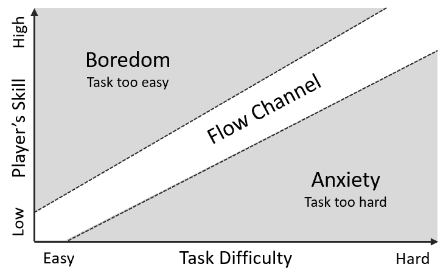
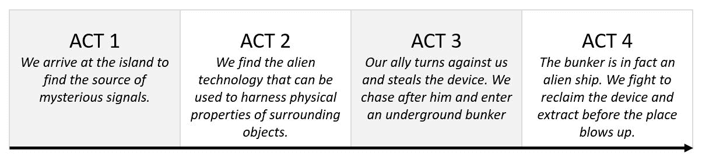
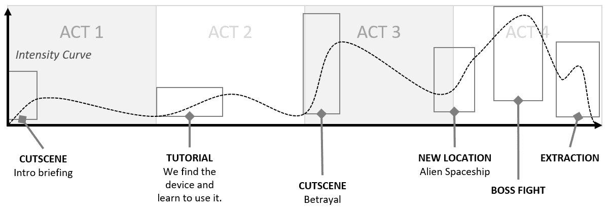
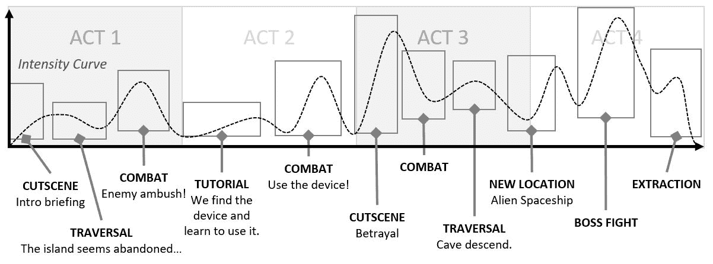
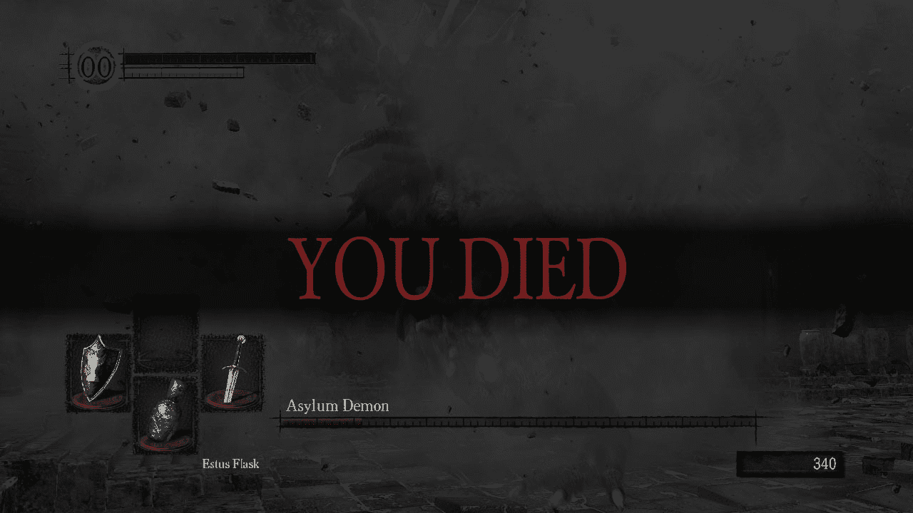

# 第十四章

平衡

收集你的笔记！我们现在将结合之前几章的知识，探讨我们可以如何规划、构建和调整我们游戏的规则和内容，以创造一个能够吸引并保持观众兴趣的体验。

到本章结束时，你将掌握调整游戏难度、设定体验节奏和将游戏平衡调整到完美所使用的实用技术和方法。让我们开始吧！

游戏平衡

游戏平衡的概念远远超出了单个对象和角色的品质，深入到游戏本身的性质。看看经典的缺陷游戏设计例子，井字棋。为什么它有缺陷？先手玩家永远不可能输。他们只需要在中间放上自己的标记。这是规则设计和游戏平衡本身的失败。游戏有一个单一的、占主导地位的战略，一旦你发现了它，你就会被激励去复制它。占主导地位的战略的存在极大地减少了玩家的选择。一旦引入到游戏模式中，游戏就失去了大部分的吸引力。因此，广泛的可能性空间是平衡良好的游戏的一个定义特征。

"如果有机会，玩家会从游戏中优化出乐趣。"

——Soren Johnson，文明四的主设计师，2011 年。

玩家自然会倾向于陷入无意义的重复，比如格斗游戏中的一个动作或连招，RTS 游戏中的一个优化建筑顺序，或者 RPG 游戏中已知的最强角色职业。我们的任务是尽可能让这种选择变得困难。说到选择，你现在为什么不做出一个选择呢？

你被一群强盗拦住了。选择你的武器：一把生锈的匕首还是传说中的剑？

我们不要自欺欺人，这不是一个吸引人的选择；它并没有通过一个有趣的（可行的）策略来扩展你的可能性。而策略就是选择。

问问自己，你是在设计一个谜题还是一个游戏？谜题可以非常有趣，但它们依赖于有限的解决方案集。一旦谜题被解决，它提供的可玩性就很少。依赖于谜题的游戏通常需要不断的新挑战。另一方面，非谜题游戏在几乎不可能解决时表现得最好。为了充分利用你的游戏机制，你希望解决方案是不完美的，并且根据情况而变化。当被问及“哪种武器/装置/汽车/角色是最好的？”时，你应该追求的答案是“视情况而定”。

记住，有一个特定工作的最佳工具是完全合理的，但你应该避免的是每个工作都有完美工具。一个吸引人的选择总是伴随着某种形式的权衡。权衡不一定是成本、时间、可靠性或某种风险，它可能只是无法做同样有趣的事情。

游戏平衡是一场消耗战。它通常归结为数千次小小的变化，无论是关卡设计、机制还是游戏数据。一开始，你所做的一切都将是一个估计，一个大致的范围。在这些早期阶段，设置你数据的结构比实现最佳平衡更重要。只有经过广泛的测试，以及主观玩家反馈和客观分析的帮助，你才能朝着真正的平衡前进。而且，真正的平衡更多的是一种愿望，而不是一个保证的结果。

平衡方法和技巧

以下是一些技巧和提示列表，应该有助于理解如何处理游戏平衡的过程。紧接着，我们将分享一些你可以应用到你的项目中的实际平衡技术！：

+   从某个地方开始

    200 或 2,000 是合适的生命值吗？嗯……这取决于。当涉及到游戏平衡时，一切都是相对的。通过设定一个感觉正确的元素来打下基础，然后将其作为其他所有事物的参考点。

+   窄化你的选择

    避免以小增量迭代。最好是大幅超过目标，以消除那个选项，并在过程中提高变化的分辨率。最初的平衡尝试应该是大胆的；进行微小的 5%调整的时间要晚得多。

+   使用大整数

    如果可能的话，尽量以至少带有几个数字的值为基础。百位和千位的数字比千万或分数更容易阅读和处理。它们还允许游戏中有适当的粒度；你可以造成 25 点伤害，而不是被迫在 2 或 3 之间的大差距中选择。

+   智能地向上/向下取整

    在你的数据上使用乘数通常会创建许多小数点后的数字。除此之外，许多游戏经济中的指数增长很容易将你的起始值从几百变成终局值到几千万。在这些情况下，你需要使用基于数字因子的巧妙取整方法。

> > > 电子表格公式是任何游戏设计师的宝贵工具！为了实现良好的取整，你可以尝试以下公式：= Floor(A1,10^(Floor(log10(A1))-1)))
> > > 
> > > 它将值（A1）向下取整（Floor）到仅两个有效数字，创建一组干净且易于阅读的数字，同时保持适当的细节水平。这样，5,421 就变成了 5,400，而 1,437,938 则变成了 1,400,000。如果你想显示更多的有效数字，只需将末尾的-1 改为-2，依此类推。你也可以使用 Ceiling 代替 Floor 来向上取整。

+   感知很重要

    你熟悉弱攻击步枪的轶事吗？有传言称，在《光环：战斗进化》中，测试玩家像野火一样避开攻击步枪。他们声称即使平衡被极端化，它仍然太弱，使其完全过载。结果证明，所有武器需要的只是一个更大的音效和更多的低音。记住，平衡是主观的！如果玩家认为一个工具很弱并避免使用它，那么它就是弱的，只是不是从数据点的角度来看。如果仅凭数据尝试推广某种策略失败，确保查找感知方面的问题。也许你需要的只是改进包括动画、摄像机、声音、视觉效果和物理属性在内的反馈。

+   自平衡策略和对抗

    剪刀石头布是自平衡系统的经典例子；每个选择都是有效的，但都有明显的优势和劣势。它也是一个建立在硬计数基础上的系统，即保证对特定策略成功的选择。最有趣的力量关系通常要微妙一些，因为它们归结为一系列优势和劣势，而不是绝对的东西。在设计不同单位和策略的动态时，确保力量关系在游戏背景下是有意义的。你的优势和劣势（权衡）越接近现实，越不模糊，学习曲线就越低。

    例如，在中世纪策略游戏中，类似于剪刀石头布（但结果不那么二元）的游戏将是弓箭手、长矛兵和骑兵之间的关系。弓箭手对长矛兵有优势，长矛兵可以对抗骑兵，而骑兵可以轻易击败弓箭手。另一个高度流行的力量关系是对立元素的关系，就像在宝可梦中所见的那样，它从简单的火燃烧草地、草地吸收水分、水分扑灭火焰开始。这种类型的关系可能会有些令人困惑，尤其是如果更模糊的元素加入其中。把金属、生命、死亡、光明、冰、毒素、黑暗和电力放在一起，你手上就会有一个潜在的混乱集群。为了使这样一个高度复杂的系统工作，你需要逐步引入它，并确保有一个良好的可见性水平，以帮助引导玩家（在宝可梦游戏中，每次攻击后都会给出一个清晰的效率报告）。

+   反馈循环

    不平衡的系统往往由于反馈循环而失去控制。那些是什么？让我们从一个虚构的城市管理游戏场景开始分析。

    由于一个不可预见的事件，你们镇的人口减少，导致税收收入下降。这反过来又破坏了你的预算，进一步降低了人民的不满，使他们离开，进一步减少税收收入。不久之后，你的城镇变得荒凉，没有资金来恢复。

    这是一个正反馈循环的例子，其中事件产生连锁反应，进一步扩大其影响。每当失败或成功的惩罚或奖励没有得到妥善管理时，你的游戏平衡就有可能失控。保持警惕，通过密切关注玩家在每个结果中权力增长和缩小的程度，以及是否有阻止他们完全失衡的因素，来调查你创建的系统。一个设计良好的游戏更像是一个恒温器，而不是核反应堆，它将温度保持在期望的范围内。

+   尝试费米估算

    在第三章《定义游戏项目范围》中，我们向您介绍了归功于恩里科·费米（Enrico Fermi）的估算技术。同样的方法可以用于游戏平衡。初始值几乎总是或多或少的有根据的猜测，你可以通过考虑最小和最大可接受值，然后直接瞄准平均值来提高你的结果。当从 49 级升到 50 级时，五百万经验值是合适的吗？我不知道，但我知道，通过以可接受的方式构建这个问题，我们可以更好地理解选择这个数字的含义。分解它！：

    +   49 级玩家在一小时内能获得多少经验？

    +   如果他非常差，如果他是一个专家呢？

    +   人们每天会在游戏上花多少小时？

    +   最小值是多少，最大值是多少？

    +   是时候进行一些划分了！这些数字看起来对吗？

        一旦你对不同类型玩家升级所需的时间感到满意，你就有了很好的起点！

+   统一你的单位

    在涉及许多资源的复杂经济中，一个共同的参考框架使你能够进行更自然的比较和更明智的平衡决策。不要把苹果和橘子比较……只要确保所有东西都按胡萝卜计算！

    首先，确定你的单位！你可以选择游戏中已经存在的资源之一，或者你可以使用一个完全虚构的单位。我通常创建一个新的单位，并简称为 UU。接下来，你需要在平衡电子表格中设置一个成本关系矩阵。这个矩阵说明了其他资源中有多少用于一个统一的单位。例如，1 UU 等于 200 金币，350 木材，100 硫磺，以及五分钟的游玩时间。这种分解立即确定了硫磺的价值是金币的两倍。问题是，获取硫磺是不是也难两倍？这是否是一个有意识的决策还是偶然？统一的单位在帮助你评估和调整多个资源的流入（生产）和流出（消费）方面非常有效。

+   数量和相对力量

    在(A)一个 80 血量和 50 伤害的坦克和(B)两个 50 血量和 25 伤害的坦克之间，谁会赢得战斗？属性的总和有利于(B)，但相对力量并不如此。在这种情况下，当(A)摧毁两个坦克中的一个后，它实际上将敌人的伤害潜力降低了一半，确保了它赢得胜利所需的边际优势。这是一个简单的例子，但它表明平衡不仅仅是原始属性的问题。在游戏中参与的单位数量可以是优势（能够独立移动并同时攻击两个目标，由于过度杀伤，敌人伤害可能会浪费，等等）也可以是劣势（更难操纵或同时与所有敌人交战，需要更多空间或存储，容易被范围效果技能反击）。始终注意这些因素如何影响你的游戏！

+   使用分析工具

    没有分析工具的帮助，你的游戏中的某些部分将几乎无法平衡。一旦游戏进入测试者手中，在测试版或正式版中，你应该能够收集到关于最受欢迎和最不受欢迎的选择和策略的数据，以及与它们相关的胜负比。更多关于分析工具的信息可以在第十五章“游戏即服务”中找到。

+   丧失的机会也是一种成本

    为单个大型单位或物品攒钱？攒资源和抑制行动的过程本身就是成本的一部分。这个成本取决于游戏的机制和个体情况，但可能意味着你无法提前侦察、占领地面或防御即将到来的攻击。确保考虑建造时间、限制、冷却时间和建筑或研究需求，并将它们视为单位成本的一部分，这样你可以更准确地调整其力量。

+   让一切感觉强大

    许多缺乏经验的设计师的一个常见陷阱是过度信任他们的电子表格公式，并将一切推向令人乏味的平庸。最有回报的游戏是那些大多数工具、小工具、能力和武器不仅使用起来有趣，而且在正确的场景下使用时感觉绝对强大。最重要的是，你的游戏应该是令人兴奋的，如果策略之间的差异微乎其微，平衡的结果又平淡无奇，那么很难做到这一点。

+   最小化迭代时间

    只为了看到一些修改后的参数在游戏中生效而不得不重建整个游戏，这不仅是一种巨大的时间浪费，而且也使得平衡任务变得更加困难。毕竟，如果你不得不一次又一次地暂停你的思维过程几分钟或几小时，就很难跟随你的想法。在开始生产之前，确保团队了解你在游戏平衡方面的计划和意图。在一个理想的世界里，基本的调整操作是在游戏编辑器中或在经过调试的游戏界面中完成的，并且会立即反映在游戏中。快速的迭代时间将帮助你进入心流状态，并以更自然的方式应用你的创造力，进行直接针对即时观察的实验性编辑。

+   关注最终用户

    随着你越来越擅长玩自己的游戏（以及解决自己的谜题），你创造的一切开始感觉简单直接。你对游戏的体验越多，创建难以接触的内容的风险就越高。跟踪你的目标受众，确定谁将与你调整的功能或内容互动。在测试你的作品时，你可以尝试给自己设置人为的障碍，例如，限制自己使用不超过几个特殊能力，或者故意做出次优决策，看看游戏玩法场景如何演变。

主战坦克平衡

主战坦克方法源于像命令与征服这样的老实时策略游戏，其中军队的支柱单位（通常是主战坦克，因此称为 MBT）被用作单位平衡的中心。这是一个简单但有效的技术，可以应用于中等数量的内容（25-100 个单位）。

首先，选择一个全面均衡的单位，作为内容的焦点。以实时策略游戏如 CC: 红色警戒为例，它将是主战坦克——大多数军队的支柱。设定你的主战坦克的统计数据，并将游戏中的其他一切与它紧密联系起来。如果你的游戏有多个派系，平衡每个派系的主战坦克就起到了跨派系的锚定作用。

不论最终的游戏数值如何，你希望你的初始主战坦克的统计数据尽可能容易阅读：速度 10，生命值 100，每秒伤害 10，攻击速度 1，射程 10，成本 100。这些简单的、圆形的数字使得游戏中的每个其他单位都能立即与公共分母进行比较。

一旦大多数单位的基线数据被输入到电子表格中，你可以使用简单的公式来计算如下事项：

+   每消耗一种资源所获得的生命值

+   每消耗一种资源所获得的每秒伤害（DPS）

+   杀死主战坦克所需时间（从攻击速度和 DPS 中推导而来）

+   被主战坦克击败所需时间

一旦你对纸上的平衡感到满意，你可以应用乘法和四舍五入到数据中，使数字在游戏中看起来（和看起来）很好。

这种技术可以让你迅速取得很大进展，但随着游戏复杂度的增加，其价值会降低。一旦你引入了特殊攻击、影响范围能力、不同类型的装甲、状态抗性以及全新的类别，如飞行单位或近战单位，MBT 方法在高效且有效地实施上就会变得非常困难。

分层修饰器

标题中的分层修饰器既是平衡方法，也是组织和思考数据的方式。这是一种强大且高度可扩展的方法，可以帮助你管理大量内容和变量。

以我使用这种方法在名为《变形金刚：地球之战》的移动策略游戏中建立和维护超过 20,000 个建筑和角色变体为例。仅就战斗平衡而言，我们的数据电子表格控制着：

+   9 座防御建筑（最高可升级至 15 级）

+   13 座实用和生产建筑（最高可升级至 15 级）

+   6 个组合器（由 5-6 个其他机器人组成的超级单位；每个组合器有 2 个升级版本和 10 到 20 个功率等级）

+   超过 120 个变形金刚角色，平均分配到两个可玩阵营——汽车人和霸天虎：

    +   汽车人和霸天虎角色被配对对抗。一些配对是平等的，一些则略有不对称。一开始我们追求多样性，但在几个月的实时运营后，我们转向每个配对几乎达到 100%的平等，主要是为了维持社区的公平感。

    +   每个角色都被赋予了一个星级评级（从 1 星到 5 星）。评级越高，角色越稀有、越强大。我们通常发布每个角色的 3 到 5 个版本。

    +   所有角色都有 20 到 60 级的经验值（1 星级角色为 20 级，2 星级角色为 40 级，3 星级角色为 50 级，4 星级和 5 星级角色为 60 级）。

    +   每个角色都有一个特殊能力，有 10 个升级等级（大多数能力在您的阵营内是独特的，并且只与对方阵营的机器人对应者共享）。

+   数十种独特（并可升级）的装备，这些装备可以改变角色和防御的统计数据和能力

+   几十个战斗加成（一次性使用增强）

那么，如何处理超过 20,000 个移动部件呢？通过从最高层开始，创建一系列的修饰层，这些修饰层有助于区分、缩放和区分你的单位。

在《变形金刚：地球之战》中，我们能够掌握在 Google Sheets 中的数据，并使用内部插件将数据从表格导入到游戏文件中。让我们分析一下角色数据的组织结构以及不同级别如何进行倍增和继承。请注意，对于建筑、游戏经济和其他数据密集型方面，我们使用了类似（但更简单）的方法。

第 1 级 – 全局表格

全局变量是我们数据结构的最高级别。通过在此处更改值，你可以改变游戏中所有单位的平衡。一旦设定，这些值几乎不会改变。全局变量表包含：

+   基础属性：HP（生命值）、DPS（伤害输出）和移动速度

+   等级提升奖励：设置 HP 和 DPS 的百分比增加

+   星级乘数：根据星级评级基于 HP 和 DPS 的乘法表

+   战后冷却值：角色在每次战斗后都会进入冷却状态，冷却时间随着角色等级的增长而增长

第 2 级 - 角色类别表

这又是另一个高级表，它是在早期建立和迭代的。数据中有 18 个角色类别，这对普通玩家来说太多，难以记住。这就是为什么在导入时，一些类别会被合并，使我们能够维持六个易于区分的游戏角色类别。例如，近战 DPS 作为一个独立的类别存在于表中，但后来被纳入战士类别之下。总的来说，角色类别表包含：

+   基于类别的属性乘数：HP（生命值）、DPS（伤害）和移动速度

+   开始能力：基本和特殊攻击

+   常见被动效果：例如，战士获得对击晕效果的免疫

+   默认武器：例如，枪手通常使用相同的榴弹发射器，除非后来被覆盖

+   基础游戏大小：战士比枪手更大，而小兵则更小

+   以及更多！：有多种额外的参数和标签，用于战斗中区分类别，无论是视觉上还是功能上

第 3 级 - 角色原型表

通过全局变量和角色类别设定的基础，我们现在可以定义单个独特单位的特征。角色原型表是任何希望向游戏中添加新角色的设计师的起点。这是设置最具体品质的地方，包括：

+   角色类别和阵营：从类别表中挑选一个 18 个类别之一，并为你的新机器人选择一个阵营。

+   单个属性修改器：角色可以通过给予各种修改器在每个类别中进行自定义。例如，1.08x HP 和 0.96x DPS 或额外的移动速度。

+   攻击覆盖：许多攻击在角色之间共享，但设计师需要亲自挑选最合适的攻击。例如，使用近战武器的战士将使用剑攻击而不是拳头。额外的攻击和能力也是根据具体情况添加的。

+   特殊能力：一些特殊能力在相同类别的几个机器人之间共享，但大多数角色都会获得由设计师手工定制的独特特殊能力。

+   额外的被动效果：你可以通过包括如免疫击晕等被动效果来进一步自定义角色。

+   武器覆盖和其他外观数据：我们完全有能力为角色提供不同的（或额外的）武器，以及改变其大小和其他外观属性。

第 4 级 – 角色升级路径表

当角色的类别和原型大致确定后，是时候决定哪些星级评级将可用。升级路径表包含少量定制数据，但经常被导入并参考许多其他表格，以构建可用角色及其星级评级的列表。

第 5 级 – 部队等级数据表

有成千上万的角色等级文件，但它们都不需要手动管理。部队等级数据表使用其他表格中的数据和乘数来组装一个长长的列表，包含每个等级的统计数据和参数以及角色的星级评级。你所要做的就是将新参数从表格导入到游戏文件中！

用例摘要

让我们总结我们的多层次设置并提取其关键经验教训：

+   全局是所有事物的基石；它们允许我们从单一位置对整个平衡进行大规模更改。

+   类别使我们能够将相似的内容分组在一起，并平衡不同类别的内容。例如，远程角色与近战角色。

+   原型让我们有机会个性化每一项内容，并保留对细节的控制。

+   升级路径是我们将单个角色克隆成几个变体的地方。它们让我们能够确定游戏中将有哪些角色的变体，以及不同版本之间是否有任何特殊变化。

+   部队等级数据是一个数据表，它使用我们定义的所有内容来自动组装成千上万的角色文件。我们所需做的就是将数据导入到游戏中！

这可能看起来像很多电子表格工作，但我们节省在平衡和设置游戏数据上的时间可能以数百人时计算。分层修饰符允许我们手工制作和个性化每个角色和建筑，同时保留在游戏平衡上做出大规模全面更改的灵活性。每当面对一个拥有数千个移动部件的大型游戏经济时，都可以考虑类似的方法。

> > > 虽然大型电子表格非常适合处理大量游戏数据，但新的机制和能力最好在实时基础上进行调整。在《变形金刚：地球战争》中，我们在 Unity 编辑器内部创建和平衡角色能力，这允许快速迭代，在某些情况下甚至可以即时迭代。至于游戏机制、相机控制和某些游戏规则，我们构建了一个简单的调试菜单，它让我们能够控制默认参数，并允许我们切换（标记）不同功能的组件开和关。这种程度的控制使得对游戏功能进行实时实验成为可能，并且在原型设计新游戏玩法时非常有价值。

游戏难度

游戏和关卡设计师的任务是创建尽可能多玩家都能获得最佳体验的游戏，如果这看起来像是一项简单的任务，那么请相信我们，这并不简单！

如我们在第十二章中已经确立的，关于可访问性，我们的观众在游戏经验、现实世界知识、身体和精神能力，甚至语言能力方面差异很大。从模式识别和记忆到空间导航、反射和手眼协调，有很多技能在发挥作用，在某些部门，玩家之间的差距可能非常大。此外，一些玩家喜欢挑战，而另一些玩家几乎没有时间和耐心进行严肃的斗争，更愿意轻松地通过关卡并相对容易地体验故事。

解决难度差距的方法有很多。一些依赖于预设属性和游戏内容的重新设计，而另一些则是完全自动的，并响应玩家的表现。无论你选择哪种解决方案，重要的是要记住，作为游戏设计师，你肯定对游戏了如指掌。默认情况下，你可能会让游戏对普通玩家来说过于困难。

早期进行并频繁进行游戏测试至关重要，即使这些测试最终变得快速、非正式且没有记录。尽量让你的作品接触到两端玩家。观察低技能和极其熟练的人对新游戏挑战的反应，将帮助你评估哪些是困难的，哪些不是，以及困难来自何处。是变量数量、输入频率、准确性或时机，还是游戏知识和对游戏机制的控制？经过几轮这样的测试后，你将对游戏中主要困难来源有深入了解。你可以用两种方式使用这些知识：

+   制定一套规则来遵守：例如，在一个简单难度的即时战略游戏中，我们不应该在前 6 分钟内让 AI 攻击玩家，因为他们可能还没有准备好。

+   帮助你评分你的遭遇战：尝试为你的游戏挑战中的各个部分分配人工难度点和乘数。例如，一个有护盾的敌人是 5 分，一个霰弹枪部队是 3 分（但近距离战斗时是 7 分），同时至少有两个敌人会增加整体遭遇战难度的 20%，等等。这些计算最初可能非常粗糙，但你可以通过在已知容易或困难的片段上使用它们，并在之后调整评分标准来使它们更加准确。经过几天的迭代，你将能够衡量游戏每个部分是容易还是困难，甚至在它制作出来之前！

静态难度设置

在游戏开始时为玩家提供一组难度设置以供选择是解决初始技能差距的最常见做法之一。如果可能的话，你应该允许在选项屏幕中实时更改此设置。这确保了玩家在发现自己与当前的游戏挑战不匹配时，不会完全受限于他们的初始选择。

难度设置可能一开始看起来像是一个微不足道的系统，但确定要更改的内容以及如何更改它而不会牺牲可玩性是难点（有意为之）。最常见且通常最容易的方法是为基本游戏参数创建倍数，如时间或移动限制、玩家和敌人健康、伤害和准确度、装备成本等。这种做法通常可以让你走得很远，但也可能导致奇怪且破坏沉浸感的场景，例如，敌人具有完美的准确度，需要大量的击打，而玩家自己则在脚部中弹后立即丧命。

> > > 硬难度设置应该挑战所有类型的技能。请注意不要将游戏玩法简化为记忆挑战，让玩家必须忍受不断的失败，直到他们为特定的遭遇开发出定制解决方案，结果在下一次遭遇中又反复失败。同样，即使在简单或休闲模式下，游戏玩法选择和理解基本游戏机制仍然是必要的。

通过修改属性、成本和奖励，你不仅操纵了游戏的难度，还操纵了玩家的行为。例如，通过使健康和弹药拾取变得极其稀缺，你肯定会鼓励过于缓慢和安全的玩法。另一方面，如果这些资源过于丰富，玩家将完全不再关心它们，并求助于最简单、最强大的解决方案（无论多么无聊地重复）。

在简单的倍数之上，可以通过以下方式修改游戏挑战本身：

+   定制挑战变体：在整个游戏中添加、删除和替换敌人可能是一项繁琐的任务。如果可能的话，努力实现一个系统，你可以标记游戏挑战的不同部分（如敌人或障碍物），并根据标记切换它们的开/关。例如，在 7 个可能出现在遭遇中的敌人中，敌人编号#5 仅在硬难度下出现，而在简单模式下，敌人编号#3 将被替换为更弱的一个。在做出重大改变时要小心，因为你可能无意中破坏了性能（屏幕上太多演员），或者创建了一个如此简短以至于感觉重复或如此漫长以至于变得乏味的遭遇。

+   修改起始状态：这包括改变玩家的初始单位/装备/能力/工具等，以及修改世界的默认状态。现在，改变整个地图布局可能看起来有些极端，但根据难度设置使某些陷阱或拾取物品出现/消失是可行的！

+   改变胜负条件：设定不同的得分要求、回合和时间限制，或添加/删除要求通常很容易实现，但需要个别调整和额外的游戏测试。

不言而喻，针对难度特定的内容变化可能会在整个项目中增加大量工作量，这就是为什么在修改你的游戏系统和机制上投入时间通常会得到回报。让我们看看一些例子！

+   调整信息视野：信息就是力量！你可以通过改变战争迷雾的规则或揭露/隐藏有关敌人实力、位置、策略和弱点的信息来影响玩家的决策能力。

+   切换玩家辅助功能：根据难度设置，你可以改变提供给玩家的游戏辅助量。这包括从启用或禁用提示和瞄准辅助到切换用户界面的各种元素，如小地图、目标标记和敌人标记、瞄准十字线等。

+   适应主要游戏系统：游戏玩法远远超出了你的关卡设计和机制的范围。任何可选规则和限制都可以根据难度进行切换。例如，在一个益智游戏中，在简单模式下可以关闭时间限制，而在困难模式下无法使用撤销移动功能。此外，你可以通过限制游戏保存的数量或将其限制在特定的地点或时间点（无论是战斗之外，还是在特殊的神社中）来使游戏中的挑战更加刺激（但也可能令人沮丧）。然而，对基础规则和系统的更改可能会引起争议，并对某些机制和平均游戏会话的结构产生不良影响。请谨慎应用。

+   修改人工智能：寻找可以在难度设置中调整的敌人行为部分，而不会使敌人看起来完全无能或神一般。例如，修改侧翼包抄或积极追击行为的可能性，或使用特殊动作和投掷手榴弹的概率。另一个好办法是给敌人提供低初始准确度，也就是说，前几枪不太可能命中（也许它们甚至会造成降低的伤害），这样玩家就有更多时间反应，同时仍然感到受到威胁。

+   改变失败的结果：降低或提高失败的结果将极大地改变游戏的感觉。为了增加紧张感并使你的游戏玩法更具影响力，你可以尝试进度损失（经验、物品、资源等）或更极端的特性，例如永久死亡——这是现代类似《光速超越》或《遗产》等 rogue-like 游戏的一个标志性特征。然而，负面后果并不适合所有人，因此请非常小心地考虑如何以及何时应用它们。你真的有激怒玩家并将他们投入由失败驱动的反馈循环中的风险，在这种循环中，每一次死亡都会使他们变得更弱，甚至更有可能再次失败。考虑将这些功能作为可选服务提供。在《XCOM2》中，玩家可以在开始新游戏时切换铁人模式。在铁人模式下，玩家被限制使用单个存档文件，每次回合都会被覆盖，使得每个行动和决策都不可逆转（并且由此扩展，更加刺激）。

> > > 记住，对游戏难度进行任何更改都会对游戏平衡（通过促进或削弱某些策略的有效性）和体验节奏（通过鼓励更鲁莽或更谨慎的游戏）产生连锁反应。不要走极端；尝试混合几种解决方案并观察它们的效果。

接受单一难度

多种难度设置是玩家和行业长期接受的做法，但并非每个游戏都需要它们。即使你将你的游戏标准化为针对普通玩家，你仍然可以满足技能谱系的两个极端。

维持单一难度模式的同时，防止玩家陷入困境的一个好方法是在他们满足一定条件时提供帮助。例如，在谜题上卡壳 15 分钟会触发一个提示，或者连续五次未能完成关卡会给你一个增强能力。

许多任天堂产品中都有这种系统（且非常明确）的成功例子。在《超级马里奥 3D 世界》中，你在多次死亡后可以获得一个强大的增强能力，而《新超级马里奥兄弟 U》则有一个超级指南方块——一种自动播放模式，可以为玩家完成令人困扰的区域（甚至整个关卡）。这些系统是可选的（玩家可以忽略提供的帮助）并且通常有一些后果，比如分数降低。

另一方面，为了满足高技能玩家，你需要创造多种方式让他们展示自己的技能并获得认可。最受欢迎的功能包括可选目标（在《超级马里奥 3D 世界》中，那就是收集所有特殊金币）和困难的支线任务、可选 Boss、高分榜、恶意隐藏的秘密、荣誉和成就。到达游戏的终点可能相对容易，但掌握它——完成所有挑战并解锁一个替代结局——应该是一项更加艰巨的任务！

单一难度设置非常适合以故事驱动的体验、解谜或冒险游戏。解谜挑战不仅难以准确评分（对我而言困难的事情可能对你来说微不足道），而且对创建更离散的难度设置也构成挑战——你如何调整你的谜题而不泄露答案？固定难度设置也是适合那些不依赖身体素质或强烈游戏体验的创新机制产品的选择——我们所有人都是从同一个起点开始的。预算和时间限制也是有效的，尽管远不如其他原因那样引人注目。

自动难度调整

无论你的游戏有一个还是六个难度设置，都有方法可以巧妙地调整个别挑战以适应玩家的当前进度或表现。

橡皮筋效应

橡皮筋系统旨在保持参赛者之间的紧密距离，在它们周围缠绕一个想象中的橡皮筋。它们通过创建负反馈循环并在实时调整游戏变量来尝试为每位玩家保持最佳挑战水平。你可以将橡皮筋效应视为罗宾汉的系统等价物；它帮助那些努力的人，同时为那些主导的人提供额外的挑战。这可以在玩家完全意识到这个过程或完全保密的情况下进行。

大多数赛车游戏都尽力掩盖它们的轨迹，创造出一个紧张而公平的赛跑假象。在《燃烧》、《速度与激情》和无数其他游戏中，一个无形的橡皮筋控制着 NPC 驾驶员的速度，将他们的表现与玩家的位置联系起来。领先，对手很快就会跟随来争夺你的位置；落后，整个 AI 驾驶员的队伍会减速，让你有机会赶上并进入战斗范围。

另一方面，任天堂马里奥卡丁车的物品箱机制是几乎明示的橡皮筋效应的一个好例子。游戏中，玩家可以在比赛中捡起箱子，每个箱子都会从几种武器和增强效果中选择一个看似随机的物品。然而，玩家很快就会意识到，排名靠前的玩家收到的物品远不如排名靠后的玩家。第 1 位和第 8 位之间的物品质量差距巨大，游戏从未试图掩盖这一点——一些物品对表现良好的驾驶员来说根本不可用。

马里奥卡丁车的物品箱修改器证明了橡皮筋效应的使用远远超出了赛车游戏类型。基于玩家排名（无论是与 NPC 还是其他玩家）的奖励和惩罚可以引入几乎任何游戏系统。

一旦你确定了要调整的内容，你还需要决定是否要明确地表达出来，或者保持其为秘密。一般来说，任何试图在竞技游戏中保持一定可信度和公平性的游戏都应该清楚地说明占据某个位置的好处和弊端。在单人游戏中，选项更广泛，你可以使用任何你希望使用的技巧。然而，请记住，在所有方面强制执行最佳难度可能会使游戏节奏不佳且高度可预测（我们将在本章后面更详细地讨论节奏）。

多人匹配

多人游戏在平等对手之间进行时效果最佳。这说起来容易做起来难，但当你让玩家相互对抗时，可以考虑到以下几个标准：

1.  缺乏经验：你可能想要保护新手，并让他们在达到一定阶段之前相互对抗。避免将其应用于整个玩家群体。

1.  成长：如果玩家随着时间的推移变得更强大（例如，通过获得经验等级或建立自己的王国），你可能想要计算他们的实力，并用来匹配实力相差不远的玩家。

1.  过去的表现：这通常是通过引入 Elo 评级系统来实现的，该系统为每位玩家分配一个技能评级。这个评级可以直接显示，转换成某种头衔/奖牌/联赛，或者保持不可见（以防止玩家试图操纵系统并降低他们的评级以期待重大事件）。无论如何，在每场比赛后，评级点都会分配给胜者，并从败者的排名中扣除。在不平等的比赛中，评级较高的玩家损失更多，收益更少，反之亦然。

1.  当前表现：在某些情况下，最简单的方法可能是根据玩家最近的排名或连胜记录来匹配玩家。例如，假设玩家总共要玩 10 场比赛；你所需要做的就是将具有相似胜率的玩家匹配在一起。这将使保持不败变得越来越困难，同时给那些表现低于平均水平的玩家随着时间的推移赢得比赛的机会越来越大。这最适合玩家从相似起点开始的情况。

1.  自主匹配：你也可以通过让玩家自己选择对手来减轻匹配的负担。根据玩家的技能或实力将他们分为几个类别，然后让他们选择他们希望对抗的对手类型。确保在提供微不足道的奖励的同时，鼓励他们挑战比自己强大的对手。

驱动成长的难度

某些游戏渴望提供广泛的角色成长系统和看似无限制的广阔世界探索。这种提供方式创造了一个平衡风险，玩家可能会遇到各种遭遇，从微不足道到难以置信的困难。

为了应对这种风险，游戏开发者通常会创建系统，根据特定的指标自动调整游戏难度，例如进度的关键向量（我们在第三章中将其作为一个概念引入）。这可能包括玩家的经验水平、主线故事的状态，甚至是游戏开始以来经过的时间。

上述难度变化通常集中在调整遇到的敌人力量上，甚至完全用不同的敌人来替换。一些奖励也会相应调整以保持其意义，这意味着一旦你的角色有所进步，相同的敌人、任务或宝箱将提供更令人印象深刻的奖励。难度调整不一定是线性的；随着玩家对游戏越来越熟悉并掌握其机制，平均遭遇战可能会逐渐变得更加困难。

> > > 进度驱动的难度调整没有解决不同玩家之间技能和能力差异的问题。你可能仍然需要除了调整之外，还要使用经典的难度设置。

在某些情况下，基于进度的难度管理是一个非常有吸引力和有效的工具，它允许你：

+   打开游戏世界：没有对错之分的地方。探索！想去哪里就去哪里，想什么时候去就什么时候去。

+   避免重复探索：无需逃避一场艰难的战斗，然后又回到同一个地方。

+   减少战斗遭遇中的挫败感：几乎不可能被一个强大的敌人的单一击中而陷入困境或死亡。

+   适当地奖励玩家的时间：不再需要面对单调乏味的推过一群完全低级的敌人和工作，除了无意义的奖励来抵消你的时间。

+   为游戏内容注入生命力：由于挑战和奖励会调整，游戏内容的全部都保持有效，因此，通过提升角色等级超出相关范围，不会存在大量游戏内容贬值的风险。

+   帮助经济平衡：根据玩家的状态和收入膨胀和缩小的成本有助于保持事物在可接受和相关的范围内。

然而，在广泛范围内使用自动平衡系统存在显著的陷阱。通过不断调整挑战难度，你实际上消除了玩家角色力量与面对的障碍之间的参照框架。这种缺乏对比和静态难度空间对游戏有多方面的伤害：

+   减少进步的动力：被强大的敌人击败可能会让人烦恼，但也可以激发玩家自我提升。将目标定为成为能够胜任这个看似不可能的挑战的人是一种惊人的激励。

+   缺乏可见的成长：时不时地停下来欣赏你已经走了多远是最好的。击败曾经是真正挑战的敌人感觉很好。

+   探索的兴奋感降低：一旦你意识到无论你走到哪里都会得到公平的战斗和公平的回报（不多也不少），冒险到遥远土地的动机就会消失。

> > > 这些缺点是 Bethesda 的设计师（《废土》和《上古卷轴》系列游戏的创作者）意识到并试图在其最近的一些游戏中解决的。尽管大多数以任务驱动的挑战似乎会随着玩家等级的提升而提升，但游戏世界中事物可以弯曲的程度似乎有一个极限。这个修改后的系统有助于在外部世界中保持进步感，同时保持体验的核心在玩家的能力范围和舒适区内。

节奏

节奏就是设置你游戏的速度并保持玩家参与度；它是你游戏的脉搏。我们的最终目标是完全吸引我们的观众，让他们暂时相信，并保持他们在心流状态。

心理学家米哈伊·契克森米哈伊在 1975 年提出了“心流”或“状态”这一心理概念，指的是完全沉浸在当前任务中的心理状态，甚至到了失去时间和空间感的地步：

基本流程图表示难度与技能之间的关系。随着玩家经验的增长和能力的提高，他们需要更具挑战性的任务。

然而，节奏的把握不仅仅是匹配玩家的技能和任务难度！正如你可能记得的，在关于关卡设计的章节中，我们提到游戏节奏通常是由你创建的关卡强度所决定的。上述强度不仅来自任务难度，还来自心理和感官刺激。按照这个标准，游戏设计师、关卡设计师、作家和艺术家都应负责在自己的领域内激发并维持流畅状态。

如果你把你的游戏看作是一道菜或一部音乐作品，你拥有的每一部分内容和功能都会成为配料或乐器；它们都在更大的事物中扮演着重要的角色。令人兴奋的剧情转折和全新的星球探索既能刺激你的观众，又能提高你的整体强度，而不会影响游戏难度。

作为一条经验法则，新颖的内容和困难的部分会增加你的强度，而重复的段落和低难度会降低它。长时间的低强度会导致无聊，而长时间的过度紧张部分会耗尽你的玩家。然而，这仅仅是触及表面。在我们了解如何设置和控制节奏之前，让我们先解开在游戏背景下心理和感官刺激的含义。

心理和感官刺激

将节奏的作用仅仅缩减为管理难度会使我们忽视电子游戏更复杂的一系列方面。例如，大多数人类在探索未知领域、尝试新工具和深入迷人的故事中找到极大的乐趣。这些类型体验无疑有助于使我们的游戏更具沉浸感和吸引力，因此应根据节奏相应地安排。

首先，任何鼓励思考和决策的游戏部分都可以被视为认知和心理上刺激的。刺激我们玩家的行为包括（但不限于）：

+   学习和掌握游戏机制与控制

+   分析新和不熟悉的内容，构建世界知识

+   预测故事发展的后果和回忆过去的事件

+   做出有意义的决策

+   计算风险与回报，规划你的行动

另一方面，感官刺激完全关乎居住、观察和聆听游戏世界，以及在与游戏挑战无关的背景下与之互动的直观体验。感官刺激源于：

+   游戏的主题和氛围

+   视觉，如 2D 和 3D 艺术、动画、视觉效果、环境、图形用户界面

+   UI 交互

+   背景演员和 NPC（动物或人们日常活动）

+   世界交互和物理（有些人花了几个小时使用《半条命 2》中的重力枪来扔浴室洗手盆）

+   音频音乐，音效，配音，环境噪音

+   通过文本、过场动画和音频进行被动（非交互式）叙事

上述提到的心理和感官刺激来源通常紧密交织，没有广泛的研究就无法分解，但尝试列出它们可能有助于我们欣赏游戏各个部分在节奏中的作用。

在此背景下有效地使用心理和感官刺激，你需要意识到固有的递减回报。重复接触任何元素（无论是某种谜题、音乐作品、动画还是背景）都会降低其影响力和有效性。过于熟悉的部分会被我们的大脑解析为简单的背景。就像公交车上的陌生人一样，它们很少令人难忘或值得长期关注。熟悉感带来安慰，但过多则会导致停滞不前的感觉。每个游戏世界都需要背景噪音，但确保有足够的活动来维持玩家的兴趣则取决于你。

> > > 记住，增加更多内容和机制并不一定能确保你的游戏更具吸引力。首先，堆积更多的元素将使质量保证、游戏测试和任何游戏玩法迭代变得更加昂贵。即使如此，你尝试丰富体验的努力也可能适得其反。那些用来激发敬畏、期待、好奇和艺术满足感的元素最终可能会让玩家感到不知所措。故事可能会被不必要的情节点稀释，整个游戏可能会变得难以管理，难以平衡，难以完成。准备一份内容生命周期文档，尽早设定你的节奏，只保留有效的内容！

如何处理节奏

充满挑战和刺激的经历是对抗无聊的有力武器，但如何发挥其最佳效果是一门难以掌握的艺术。即使在难度设置固定不变的游戏中，每一刻的游戏强度也很少是恒定的。

相反，我们应该稳步提升身体和心理的难度，同时也要记得给玩家留出喘息的机会，规划他们的下一步行动，投入资源，并开始期待下一件大事。低强度时刻不必是空白的；它们可以由脚本事件、叙事、社交和感官刺激来填充。

> > > 对比在节奏上就像在艺术上一样适用。如果一切都爆炸了，实际上并没有什么真正发生。一个全情投入、强度极高的游戏没有亮点，没有起伏，没有高潮。平淡的节奏游戏和叙事会将一系列容易聚集成无法区分的混合体验。

为了将事物置于更实用的角度，我们将探讨用于调整线性内容节奏的方法，接着介绍更系统的解决方案，并以一些零散的建议作为结尾！

调整线性内容的节奏

线性游戏内容由关卡设计和叙事共同驱动，这使得迭代成本高昂且耗时，但同时也让你能够以非常细粒度、逐刻控制游戏玩法。行使这种控制的最佳方式之一就是使用时间线。

这个时间线是一个跨越即将调整的单个自包含游戏片段整个长度的长图。逐渐地，你的时间线将填充越来越多的精确细节，创建一个稳固的行动计划，并大幅减少迭代时间。最好在早期开始这个过程，在概要或草图阶段，那时在游戏玩法、故事、强度和结构方面仍具有很高的灵活性。

> > > 尽管我们正在专注于单个区域或关卡，但整个游戏的节奏和进度也必须考虑在内。注意你的阶段前后发生的事情，以及你的计划如何适应游戏的整体结构。

由于在信任和有效的叙事结构上工作要容易得多，因此尝试将你的时间线（以及因此，你的阶段）划分为三个或四个不同的部分：

1.  简介

1.  升级

1.  转折（可选）

1.  结论

这些部分将帮助你控制关卡的整体强度流动，并帮助你提供一种进步和结束的感觉。它们也是构建叙事的有用框架。让我们看看一个虚构的例子：

现在，使用内容生命周期、剧本、关卡草图或任何其他设计文档来列出你在关卡上绝对必须拥有的任何元素。这包括诸如剧情转折、谜题想法、新内容以及你计划引入的机制等等。

将这些元素放置在时间线上，并确定在那个时间点所需的强度及其趋势：

这是一个很好的起点，但我们的行动不仅仅是一些关键点！我们可以进一步将它们划分为各种类型或块，例如：

+   游戏玩法块可能包括各种类型，例如：

    +   战斗

    +   解谜

    +   平台跳跃

    +   探索

    +   隐形

+   对于重要的故事元素、预告片、对话部分等的故事块

+   指导和脚本事件

在图中填充各种块，并尝试在游戏任务及其强度内保持一定的多样性。随着进程的推进，不断细化曲线！尽管一开始的强度可能看起来模糊不清，但它将为灰盒和实施阶段提供一个有意义的靶子，并强制实施一定程度的自控：

拥有一个完整的时间线，你可以更有效地规划你的工作，为重大事件做准备，变化任务，并产生情感冲击。不要急于制定时间线；一个稳固的计划可以帮助你在以后节省大量时间！

通过规则和机制进行节奏控制

通过添加和修改规则和机制，你可以高效且可重复地发展你的游戏玩法场景，设定节奏和强度。让我们看看一些使用游戏系统节奏控制的例子：

+   时间

    时间限制通常用于提高节奏并保持玩家专注于当前任务。即使开始时动作缓慢且谨慎，但行动肯定会随着任何犹豫和行动的缓慢积累而变得极其紧张。此外，通过使用诸如加班（游戏在输掉一方的目标被挑战时不结束）等机制，你可以使游戏更加激动人心，并给劣势方一个从之前的错误中恢复的机会。

    另一方面，Warrioware 系列游戏是使用时间进行节奏控制的极端例子。玩家面临一系列快速而愚蠢的微型游戏，简单的任务，测试你的反应时间并要求一些精确的输入。事情开始缓慢，但在一系列几个微型游戏之后，游戏速度加快，通过减少所有任务的时间限制来提高难度。

+   分数

    接近打破高分肯定会增加赌注，但评分系统的使用不仅限于排名或排行榜，对涉及直接竞争的场景中的节奏也有很大的影响。例如，在《彩虹六号：围攻》中，就像许多电子竞技游戏一样，两支队伍在多个、各自计分的回合中进行比赛。随着对方队伍开始得分，输掉比赛的队伍的强度自然会更高。另一方面，领先方的效果正好相反。如果你需要 5 分才能获胜，从 4-0 降到 4-1 仍然是一个低强度场景（毕竟，你还有很大的犯错空间）。像往常一样，保持两队之间引人入胜的节奏的关键是提供让输掉一方的机会，从而延伸到让领先方保持警惕。

+   资源升级

    控制资源生成是游戏设计师提高或降低任何游戏场景强度最有效的方法之一。在这种情况下，资源（矿石、金币、燃料、法力值等）是玩家可以用来向游戏中引入新元素和选项（单位、动作、组合、特殊技能等）的任何东西。资源升级可以是线性的、指数的或分阶段进行的。例如，在《炉石传说》和《万智牌》中，组合的可能性以及每张卡牌的潜在影响随着法力的增加而稳步增长。另一方面，《皇室战争》有 3 分钟的匹配时间，其中资源生产在前 2 分钟保持不变。之后，游戏进入高速运转，将资源生成翻倍，从而增加了游戏速度和强度。这种做法也增加了在 3 分钟内解决比赛并避免加时的可能性。

+   MOBA 游戏的节奏

    类似于《英雄联盟》或《DOTA 2》这样的 MOBA 游戏是使用规则和系统来操纵节奏的绝佳例子。即使你不是粉丝，调查这些游戏也是值得的。在两种情况下，游戏开始得很慢，玩家们大多待在自己的地图区域，有条不紊地积累资源和解锁新技能。随着玩家力量的增长，他们的选择增多，强度也随之增加。几分钟之后，玩家们更能承受敌人的防御并确保击杀。这改变了动态，鼓励玩家组队，加强激烈的团队战斗。

    然而，你的角色等级越高，你需要等待的时间就越长才能重生。这可能会为越来越有压力的游戏提供一个不错的休息，但它也增加了失败的成本。在比赛接近尾声时，每次遭遇的强度都会急剧上升，尤其是由于两支队伍都在不断破坏对方的防御并越来越接近赢得胜利。

节奏技巧

现在我们已经了解了节奏是什么以及如何接近它，让我们看看一些更具体的例子和建议，从演员移除的角色开始。

调查演员移除

策略游戏基于缓慢积累力量和行使它的结果，有自然的节奏。在许多情况下，随着你集结军队，强度逐渐增加，在进入战斗时达到顶峰，要么通过一次失败的遭遇战（当你匆忙恢复并感到暴露时）而上升，要么在胜利（随着威胁的减少）而下降。

此外，玩家可支配的卡片、单位或资源越多，他们需要做出的行动和选择就越多，或者至少需要考虑。没有什么事情可做远比分析数百种组合并在多个演员和可能的地点之间分散注意力要轻松得多。

在基于团队的游戏中，玩家淘汰无疑会给剩余的玩家带来更多压力，尤其是如果还有赢的微弱机会。事实上，增加从失败场景中恢复的机会是让游戏对双方都更有趣的好方法。

这些只是几个简单的例子，但希望你能从你的游戏中看到演员移除和玩家淘汰的应用。分析它们对节奏的影响，并寻找可以改进的地方来应对或增强这些效果。

高强度和叙事

当事情开始失控，节奏加快时，剧情可能需要退居次要位置。大多数好莱坞动作电影都会故意在紧张的动作序列（如汽车追逐、打斗、枪战等）期间暂停主要剧情的发展。这些场景对于轻松的人物塑造可能很好，但在尝试表达复杂动机、深刻情感和交织的故事线时却会受到影响。观众会被所有发生的事情分散注意力，无法关注到叙事的更复杂和微妙方面。

考虑将同样的原则应用到你的游戏中，并避免在游戏非常紧张的部分放置大量涉及故事情节的元素。

多人游戏节奏和关卡设计

你的地图布局是修改节奏的一个很好的工具。你可能还记得从关卡设计章节中，提供有效的掩护会鼓励更谨慎和静态的游戏，而丰富的侧翼机会和拾取将促进移动。然而，为了进一步控制你的节奏，你必须观察游戏玩法随时间如何演变。

以《战地》系列为例，Rush 游戏模式中有一支队伍防守两个目标（无线电发射器或类似设备），而攻击者试图在时间耗尽或重生之前成功引爆它们。当两个目标都被成功摧毁后，新的目标集就会变得可用，整个行动转移到地图的新部分。可能会有多达 5 个不同的目标集，每个集都可能提供新的游戏玩法、车辆和策略。在 Rush 中，不断变化的地图布局不断改变节奏。

在像《星际争霸 2》这样的即时战略游戏中，地图布局同样重要。例如，你可以通过修改起始位置的资源数量来完全改变比赛的节奏，从而改变资源生产率，鼓励或阻止早期扩张的努力。增加地图大小和用可破坏的障碍物或水包围玩家将进一步改变节奏，但可能会使某些策略无效——这些策略是我们通过仔细的游戏平衡努力实现的。

利用威胁和焦虑

在围绕挑战和技能的游戏中，威胁和焦虑在设定强度方面起着主导作用，这种作用往往被管理不当或理解错误。威胁本身并不完全取决于游戏场景的实际难度。相反，它基于对逆境的认知，并由失败的负面后果所推动。

如果赌注很高，相对微不足道的游戏遭遇可以成为巨大威胁的来源。例如，当玩家在《黑暗灵魂》中（以及《灵魂系列》中的其他游戏）死亡时，他们会掉落他们积累但未花费的灵魂。灵魂是与角色整体进步相关的重要资源。如果玩家在下一生中未能收集掉落的灵魂，灵魂将永远消失，随之消失的还有可能数小时的角色和世界进度。

通过提高赌注并利用损失厌恶偏差（我们天生就极度讨厌失去或错过事物），这种机制甚至可以将舞台中最琐碎且之前已经掌握的部分变成一项极具压力的任务。然而，这种不可否认的极端机制也有积极的一面。高难度游戏和重复失败的结果不仅提高了紧张程度并重新激发了已完成的内容；成功收集掉落的灵魂伴随着极大的满足感、自豪感和释然。此外，即使你连续两次失败，灵魂可能永远消失，但围绕尝试恢复它们所建立的压力和紧张感也随之消失。对于一个平均的黑暗灵魂玩家来说，反复的死亡既令人沮丧又具有激励作用：

尽管困难重重，《黑暗灵魂》系列在西方普及了高风险游戏的高潮迭起情感体验

除了《黑暗之魂》之外，一款紧张的游戏不一定要是一个严厉惩罚性的游戏。在《生化奇兵》中，艰难的战斗往往以险胜告终。这并非偶然。根据开发者的说法，游戏被设计成在玩家极度需要时偏向玩家一方。当玩家即将死亡时，游戏反而让他们保留一小部分生命值，并在短时间内变得无敌。玩家通过仅剩一小部分生命值反复逃脱死亡的感觉确实很棒！

游戏开发领域有更多此类诡计的例子。尽管我们期望玩家公平游戏，但这并不意味着我们不能稍微作弊以确保他们玩得开心。如果做得恰当，这些技巧对玩家来说是不可见的，并能将他们保持在游戏流程中，但若处理不当，它们可能会适得其反，破坏我们辛苦建立的游戏沉浸感。

> > > 一个没有失败状态和惩罚的游戏对玩家没有直接威胁，有些人甚至可以争论说这甚至不是一个真正的游戏，而是一种互动体验。在这种情况下，很难通过直接挑战玩家的能力来维持他们的兴趣。相反，游戏必须依靠其他情感，并通过奖励进度、追求的目标（困难的谜题和挑战）、以及心理和感官刺激（新的机制、鼓舞人心的艺术、吸引人的故事等等）来控制节奏。请注意，即使需要重新玩游戏的很小一部分也是一种惩罚——在游戏中重复任务而不取得进展通常很少有趣。
> > > 
> > > 本章节中使用的截图仅用于说明目的。我们不推荐您以任何方式滥用这些截图。如需更多信息，请参阅本书免责声明部分提到的出版商的条款和条件。

摘要

在本章中，我们学习了三个相互关联的主题，它们共同帮助您制作充满多样化和激动人心的游戏场景的游戏。

首先，游戏平衡帮助我们通过解决主导策略、调整机制和改变游戏内容参数来增加可能性空间。随后，我们探索了设置和调整游戏整体难度的方法，帮助我们将其与受众的能力相匹配。最后，我们研究了节奏控制，这使我们能够通过操纵每个游戏会话的结构和相对强度来维持玩家的兴趣并保持他们在游戏流程中。

接下来，我们将深入探讨最后的 10%，这部分内容涵盖了如何提高游戏质量以及将每一次互动转变为愉悦体验的实用技巧和指南。
