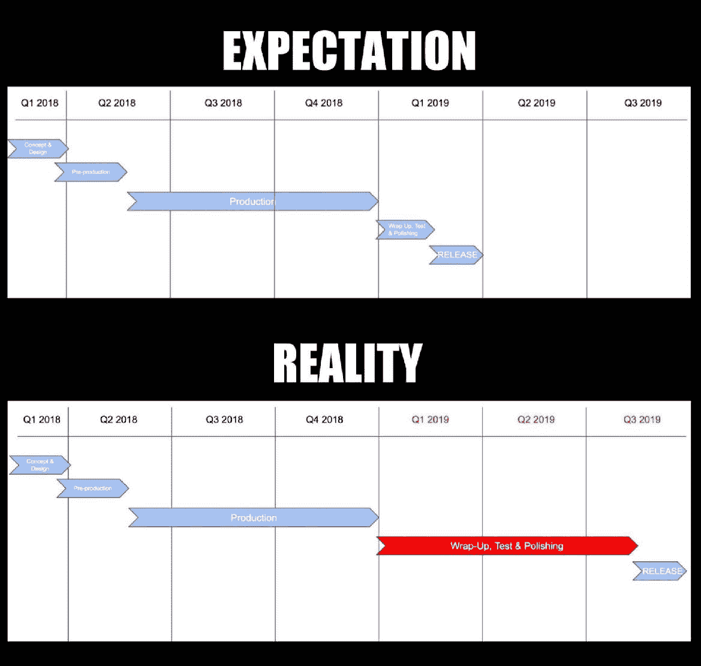
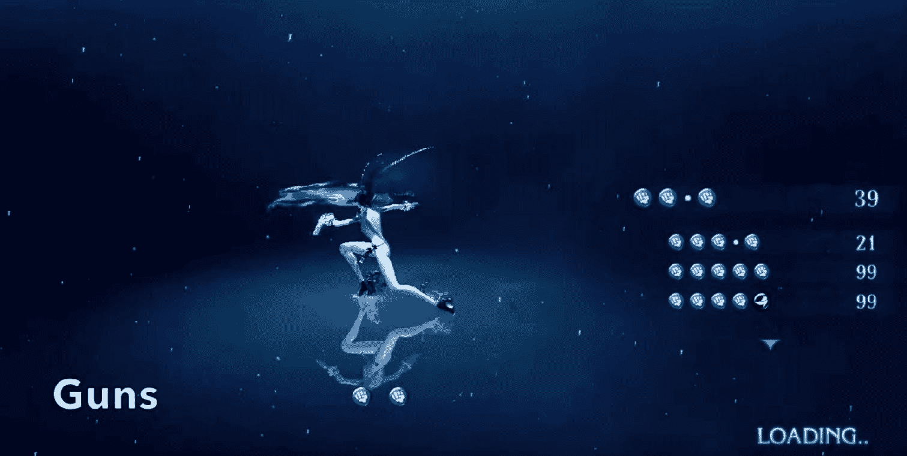
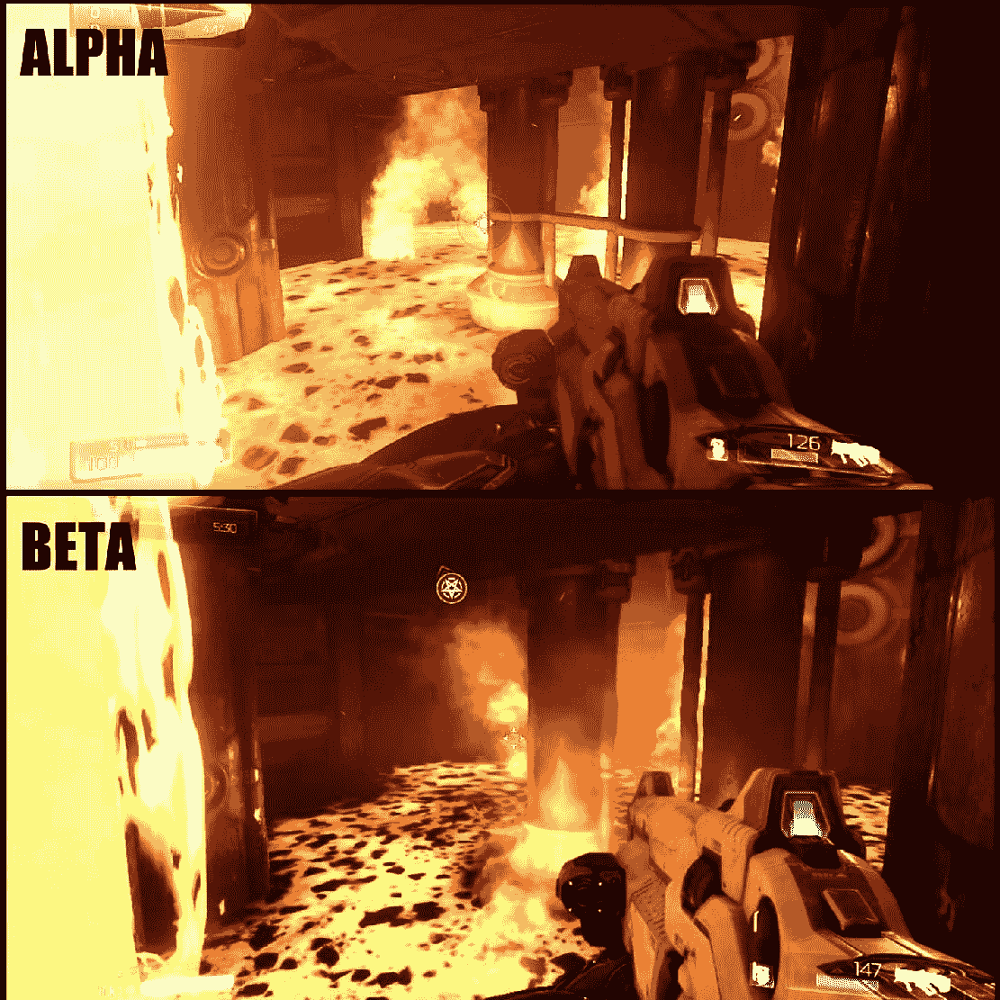

最后的 10%

你听说过 80/20 法则吗？

它表明，大多数效果中的 80%是由仅 20%的可能原因造成的。

这被称为帕累托法则，以意大利科学家维弗雷多·帕累托的名字命名，他提出了一个数学分布来描述许多社会和自然现象。

一些例子：

+   一家公司的 20%的客户占其 80%的收入

+   一家公司的 80%的销售额来自其 20%的产品

+   全球 80%的财富掌握在 20%的人口手中

+   80%的犯罪是由 20%的罪犯犯下的

+   社交网络上 20%的帖子产生了 80%的流量

这显然是一个经验法则，但你会惊讶于它的准确性！

事实上，我们可以安全地说：

"80%的游戏是在最后的 20%的时间内完成的"

我知道，这一章叫做《最后的 10%》。根据我们刚才所说的，它应该被称为《最后的 80%》。但那并不会真正帮助我们在这里想要表达的观点。

所说的最后 10%的问题在于，它通常比预算的开发时间的最后 10%要长得多。当游戏最终完成时，不仅软件中的错误和技术问题不可避免地会出现，而且一些系统可能证明并没有按预期工作。一些设计缺陷可能隐藏在游戏中，只有在这一阶段才会变得明显。

这就是为什么许多游戏的发布日期会推迟，为什么在项目完成之前会有如此多的预算被烧掉。这就是为什么我们行业中有那么可怕的加班时间实践存在。

这也是许多游戏项目失败的原因：

收尾、测试和抛光阶段通常比最初计划的时间长得多，导致最终发布出现重大延误。这个图表的目的就是给你一个关于游戏开发过程中可能出错的想法。

在本章中，我们将讨论那些使最后的 10%如此具有挑战性的活动和问题，重点关注那些将游戏设计师置于行动中心的活动。

这本书不是为项目经理或制作人写的（尽管他们当然会从一些游戏设计知识中受益），因此本章不会专注于如何避免加班时间或满足截止日期。

本章是关于在最后 10%必须完成的活动。作为设计师，你的责任是了解它们，并在发布前的最后阶段自信地进入，准备好最后的冲刺！

> > > 需要记住的是，在现实世界中，没有任何项目进度表会考虑将 80%的时间仅分配给最后阶段。制作人项目经理的能力和挑战是确保最后阶段可以在合理的时间内完成，这通常会比生产时间短。
> > > 
> > > 这是在制作游戏时面临的最大挑战之一，但作为游戏设计师，你应该专注于做好你的部分，并确保你必须完成的每一件事都能按时完成。我们并不生活在一个理想的世界里，所以要做好准备，用不超过 10%的时间来应对最后的 10%……或者更少！

通常，生产的最后阶段始于 Alpha 版本发布。以下是与此最终阶段通常相关的一系列活动列表：

1.  将碎片拼凑在一起

1.  精炼

1.  质量保证

将碎片拼凑在一起

游戏不可能通过线性地从叙事开始到最终结局扩展而最终成型。在开发过程中，游戏的一些部分作为模块开发，所有这些模块在需要某种可玩性时被整合在一起。但也许在 Alpha 版本发布后，还需要进行一些额外的迭代来解决问题，这些碎片需要为 Beta 版本或下一个版本重新排序。再次强调，这项任务可能是在最后一刻才出现。

根据项目的大小，设计师在整合所有内容时可能承担着很大的责任。通常，设计师负责设置整个游戏内容。也许测试版只包含一个关卡或任务，而这个关卡或任务在 Beta 阶段被尽可能好地整合在一起。现在，是时候创建和引入剩余的这些任务、任务、对话、角色和关卡了。

功能蔓延

一旦游戏完成或几乎完成，很容易看出可能缺少什么。团队对半成品有一个更清晰的了解，可能会提出新的想法、不同的解决方案或新内容。感觉是，有了这些补充，游戏会更好。而且，如果你和团队再有点时间，几乎就能完成。或者，在拼凑碎片的过程中，可能会觉得这还不够。它没有你想象中那么有趣。

这可能是项目面临的一个危险问题：功能蔓延，即不断向产品中添加功能和特性。团队不是以最佳方式将已经开发的内容整合在一起并专注于提高其质量，而是集体错误地认为更多的全新功能会使游戏变得更好。

功能蔓延的一个有趣例子是近年来在 Kickstarter 上看到的承诺扩展目标的做法。Kickstarter 是一个众筹平台，创作者可以直接向最终用户推销他们的项目，并请求他们为使这些项目成为现实提供资金。扩展目标背后的想法是在实现初始目标后，达到额外的资金目标时向用户提供更多内容。

因此，一个原始的想法被提出，人们喜欢它，并用他们的钱支持它。资金目标实现了，现在开发者开始向一个已经非常出色的原始设计添加（承诺添加）功能。有一个很大的机会制作一个更大更好的游戏（并且还能筹集更多资金）...但是，添加不必要的功能可能会使游戏偏离原始想法的风险也非常大。当然，对于这些 Kickstarter 项目来说，好消息是项目设计和概念阶段的功能蔓延并不像在游戏几乎完成时想出新事物那样糟糕。

一个经典的现实生活例子是在单人游戏中添加多人模式。许多游戏开发团队几乎被突然改变的原计划摧毁。为了使游戏更具吸引力，宣布了多人模式。也许在一个大型会议或展览会上。游戏几乎完成，多人功能被用来增加炒作或吸引更多投资。或者也许团队本身认为，现在游戏已经完成，多人模式真的可以是点睛之笔。当这种情况发生，而且从一开始就没有计划时，只会发生不好的事情。

游戏设计师可以做什么来避免这种危险呢？那就是找到可以删除的内容，而不是添加更多：少即是多。

我们在讨论游戏初始设计时已经讨论过这个问题了，现在我们将在最终阶段再次使用它。

少即是多

你应该始终留意那些可以从你的游戏中删除的功能。你可以从以下三个主要属性中寻找可能适合从游戏中删除的功能：

+   不直观的机制：不直观的机制始终是一个警告。如果玩家难以理解为什么或如何一个机制工作，可能最好完全移除它，或者将其简化到一个更简单的版本。

+   不吸引受众的机制：不吸引受众的机制是一个常见的错误。在休闲匹配 3 游戏中，一个复杂的制作系统可能不是一个好主意。确保每个机制都将加强并支持你的设计支柱。

+   不必要的功能：在纸上听起来可能是个好主意，但在最终游戏中可能变得不必要地复杂。也许你为角色设计了多个不同的升级路径，但在游戏测试中，其中一些路径简单地证明不足以吸引玩家和激发兴趣。

精炼

什么是精炼？

这也是许多开发者试图用正式定义来解决的问题。正如你所知，我们不喜欢正式的定义，所以请警告，关于精炼的概念可能因开发者而异，但最重要的是因游戏而异！基本上，打磨游戏意味着提高其质量标准。

为什么和如何打磨一双鞋或一块木板？

你不会改变鞋子或板子的形状。打磨一双步行靴不会让它们变成一双搭配燕尾服的漆皮正装鞋。润色的目标是使游戏和体验更加平滑。调整其值并细化其细节，直到它真正感觉很好，并在美学和游戏层面上立即令人愉悦。

那个著名的场景，即游戏设计师最终玩起了游戏的 Alpha 版本，并想出了一个让事情变得更好的绝妙主意……通常并不是在润色。这通常是令人恐惧的“添加这个会不酷吗？”场景。润色不应该涉及添加任何内容。如果一个特性已经完成或应该完成，而团队觉得有必要在其之上添加一些内容以使其真正工作，那么这可能是一个迹象，表明该特性可能在核心上存在缺陷。

如何润色

润色游戏不仅仅是游戏设计的工作。实际上，大部分的润色工作将由艺术家、动画师和程序员来完成。尽管如此，游戏设计师在这个阶段仍然扮演着至关重要的角色。进入游戏制作的最后阶段意味着游戏设计师必须将自己置于玩家的位置，像玩他最喜欢的游戏一样玩游戏。这是游戏设计师必须成为他们自己游戏专家的阶段。

大多数玩家可能会惊讶地发现，在游戏开发中，大多数人玩游戏的时间是多么少。大多数程序员和艺术家通常发布的是他们从未真正从头到尾玩过的游戏，除非是那些他们工作重点的特定时刻或场景。

这对他们来说完全可以接受，但对游戏设计师来说却是不可以接受的。

游戏设计师、游戏导演和 QA 部门是那些必须让工程师和艺术家了解最终产品质量的人，并确定哪些区域迫切需要润色或进一步关注。

让我们来看看润色游戏最常见的任务：

+   稳定性和性能

+   音频和视觉

+   设计润色

在接下来的段落中，我们将简要提及技术任务，并更多地关注游戏设计师特有的任务。

稳定性和性能

稳定性和性能是润色过程中首先要关注的两件事。这涉及到许多可能让工程师忙碌一段时间的程序和技术，但设计师可以找出游戏运行速度略慢或存在故障的时刻或部分。润色稳定性和性能意味着避免崩溃、故障，提高并稳定每秒帧数（FPS），并将功能故障（即使是微小的）减少到零或尽可能接近零。这还包括监控和优化 CPU 和 GPU 的使用以及内存使用。

值得注意的是，尽管这听起来像是一项非常技术性的活动，对于工程师来说，有时可能只需要一个设计师就能解决性能问题。如果一个设计师请求的功能在技术实现范围内，那么设计可能需要重新修改，数值缩减，敌人数量减少，每秒攻击次数改变，视觉效果降低，或者可能需要强制执行多人游戏中玩家数量的限制。

> > > 设计师可以帮助工程师解决性能问题的一种方式是提供上述解决方案。虽然工程师可能一周都在努力敲代码，试图从代码的某个紧绷部分中挤出额外的 5%性能，但可能一个更简单的解决方案只是一个设计师降低一个数字，以减轻引擎的压力。作为一个设计师，保持警惕并了解你为制作内容而使用的引擎的性能瓶颈是值得的；你可以为工程团队节省可能几天的时间，并帮助游戏按时发布。

感知性能

感知性能与实际性能同样重要。我们这里讨论的是一些微小的调整，可以帮助给玩家留下整体性能更好的印象。降低最大帧数是另一个常见的技巧，一个限制在 30 FPS 的游戏可能看起来比一个努力保持 60 FPS 的游戏更加流畅。

提高感知性能的另一种常见方法是增强加载屏幕期间的玩家体验。

加载屏幕显然是游戏技术性能的最明显和直接的反馈之一。游戏越大，图形越好，加载时间越长。同样，对于在线多人游戏来说：寻找匹配或连接到服务器可能需要一段时间——更糟糕的是，这完全取决于玩家的互联网连接，工程师对此几乎无能为力。

在等待时间，有无数种方法可以让玩家感觉到游戏体验没有被加载屏幕所阻塞：提示、游戏背景故事和教程非常常见，为玩家提供了等待时可以阅读的内容。

一些游戏甚至在加载时提供迷你游戏，例如《模拟人生 3》的隐藏物品迷你游戏。

交互式加载屏幕的艺术达到了新的高度，例如《贝奥武夫》或《FIFA》，玩家能够练习游戏机制：

在《贝奥武夫》中，加载屏幕上的教程功能非常出色，以至于许多玩家开始在线上请求是否有办法留在加载屏幕上并继续练习！

音频和视觉

在打磨方面，音频和视觉因素非常重要。稳定性和性能始终是首要任务，因为一个崩溃或冻结的精彩游戏总是比一个始终运行顺畅的平庸游戏更糟糕。然而，音频和视觉是面向玩家的层面，每一次打磨努力都会对玩家的游戏体验和乐趣产生巨大影响。

可以用音频、动画、颜色、环境和角色设计来进行的改进和打磨列表非常庞大，但我们可以用一个简单的词来总结——细节。对细节的关注，尤其是在音频、环境和动画方面，通常是提升游戏质量到下一个层次的关键。

要了解一个打磨过的游戏看起来像什么，只需想想最新的塞尔达或马里奥游戏。图形、音效、动画、对每个玩家输入的反应……它们都是尽可能好的。不仅玩起来是一种乐趣，观看它们也是一种乐趣。或者将最新的使命召唤与预算较低的独立 FPS 游戏，如 Insurgency（我们在这里比较的是两个预算和受众非常不同的游戏，这正是打磨差距如此之大的原因）进行比较。

另一种了解打磨外观的好方法是比较游戏的各个阶段，如 alpha、beta 和发布：

注意细节，如照明、粒子效果、熔岩纹理、屏幕右下角的用户界面，以及屏幕上方的触发器和指示器的 UI 元素。

在移动设备上，像 Supercell 或 Zynga 这样的公司因提供打磨得令人难以置信的游戏而闻名，这无疑是他们成功的原因之一。打磨过的游戏更具吸引力；仅仅外观更好，就能让玩家感觉到游戏体验和游戏玩法将和视觉一样流畅。但要注意，技术和视觉打磨可能足以让玩家尝试游戏，但如果设计和游戏玩法没有达到预期，我怀疑任何玩家都不会留下来！

设计打磨

设计打磨包括大量的活动。游戏设计师可以直接控制的每个游戏方面都可以进行调整和打磨。很可能是关于平衡，这尤其困难。

一旦设计师终于有机会完整地玩这款游戏，就有可能微调那些仅由数据和数值模型预先设定的值。我们在关于平衡的章节中看到，游戏系统也是由数字构成的。现在是时候对这些数字进行测试，并将它们调整到完美状态。

设计师有更多时间来工作并微调所有这些值，玩家的最终体验就会更加流畅。这绝对是在规划阶段需要考虑的事情。

游戏

显然，打磨游戏设计的第一步是玩游戏。设计师需要尽可能多地与人们坐下来一起玩游戏。我们已经说过这一点；这是设计师成为他们自己游戏最热情的玩家的时刻。

> > > 这个阶段可能会被团队忽视。也许每个人在这个时候都筋疲力尽，玩上几个月甚至几年的游戏的想法令人畏惧。保持团队的士气！让团队和你自己玩游戏的体验变得有趣。组织比赛或挑战游戏，并从你所看到的学习！

交谈

与团队或可能正在玩游戏的任何人交谈。比较不同的观点，并记下哪些地方真的不起作用或你感觉可以迅速改进的地方。接受每一项批评，并尽你所能做出每一项调整。

> > > 有些设计师非常擅长接受批评，而有些则不太适应。保持开放的心态至关重要。如果你关闭并变得防御性，你可能会失去反馈渠道，因为你的同事不想伤害你的感情。感谢你收到的所有反馈——即使它很痛苦，也尽量不要表现出来，因为这样你将更容易接受更多意见，并有机会让游戏对所有玩家都变得更好。

制作一个所有这些小事情的清单，然后花大量的日常时间逐一改进它们。对于大型游戏，制作人可能可以帮助你完成这项任务，组织和优先安排每一项活动。

向从未见过这款游戏的人展示游戏，并仔细倾听他们的意见。一些明显的问题可能对你或其他团队成员来说是看不见的。当你长时间致力于一款游戏时，很容易错过这些。

> > > 锻炼
> > > 
> > > 考虑一下你喜欢的游戏，你认为它已经被某种方式打磨过：
> > > 
> > > - 确定至少三个视觉上打磨过的特性，使游戏“感觉”更好，但不会对其核心玩法产生任何影响。
> > > 
> > > - 同样做，但专注于设计打磨，比较不同游戏的类似机制，并关注其中一些为什么比其他更精致。
> > > 
> > > - 你能发现一些技术上的打磨吗？有没有特定的技术可以提升感知的性能？

质量保证

游戏测试有不同的方法，大多数方法论都是由独立的游戏开发者和发行商开发的。方法论会持续改进，并且可能因不同类型的游戏而异（例如，测试 MMORPG 的方法将与测试休闲游戏的方法不同）。许多方法直接借鉴了通用的软件测试技术。以下列出了视频游戏中最重要的一些方法论：

+   功能性测试：通常与游戏测试短语相关联，因为它涉及以某种形式玩游戏。功能性测试不需要广泛的技术知识。功能性测试人员寻找游戏本身或其用户界面中的普遍问题，例如稳定性问题、游戏机制问题和游戏资产完整性。

+   合规性测试：游戏机平台的授权方对授权其平台的游戏有严格的技术要求。例如，索尼发布了一份技术要求清单（TRC），微软发布 Xbox 要求（XR），任天堂发布了一套指南（Lotcheck）。

+   兼容性测试：兼容性测试团队在各种硬件配置上测试游戏的主要功能。这主要针对 PC 或移动游戏，因为游戏机平台更加标准化。

+   本地化测试：确保游戏本地化的准确性和质量。

+   沉浸式测试：涉及在多种操作模式下长时间运行游戏，例如空闲、暂停或标题屏幕。

+   回归测试：QA 检查是否存在回归（即错误仍然存在），然后运行类似的测试以查看修复是否破坏了其他内容。

所有这些测试都是按照测试计划进行的。测试计划记录了用于验证和确保游戏或功能满足其设计规格的策略。它告诉测试者需要测试和查找游戏中的哪些部分。

游戏设计师和 QA

游戏设计师和 QA 之间的关系非常重要。游戏文档可能会（并且将会）被 QA 用作编写和运行测试计划的参考。可能需要一些特定的文档来测试特定的功能。

设计师提供给 QA 的定制化文档越多，QA 的工作就会越容易、越有效。例如，每当我为 Battlehand 设计一批新卡牌时，我都会为 QA 创建一个临时文档，其中包含每张卡牌的渲染图以及卡牌效果描述和预期出现的数字。这个文档与每张卡牌的实际设计文档大不相同，后者由包含游戏中每张卡牌设计的巨大电子表格中的一行组成。通过创建这个临时文档，我确保 QA 部门只了解他们需要查找的内容，以更易于访问的格式呈现，其中包含在设计阶段无关紧要的细节（如卡牌艺术和最终外观）。

记住，作为设计师，QA 是您最后一次机会，以确保内容达到最高质量。犯错误是自然的；你会犯错误。坚实的测试是唯一避免这些错误公之于众的方法，公众会注意到它们，并且可能会非常宽容。

充分利用质量保证（QA）的一个好方法是将你的设计提交给质量保证经理或将被分配到该功能的测试员进行审查。这样，你将在官方质量保证阶段开始之前就获得关于你功能的反馈。在进入最后 10%之前完成这类事情是一种避免在最后阶段积累太多工作的好方法，并且肯定有助于减少积累延误和偏离轨道的风险。

质量保证（QA）可能会为游戏设计师提供一些关于游戏玩法方面的见解，这些见解超出了实际测试的范围。最终，我们谈论的是那些将要玩你的游戏，或其部分，数百次的人，他们通常具有或对整体平衡感有或深的理解，而开发者或设计师在相同的时间窗口内可能无法获得。利用这些知识来不断改进游戏！

游戏项目收尾的技巧

正如我们所看到的，在一个理想的世界里，游戏项目的收尾阶段应该比之前每个阶段的总和花费更多的时间。但在现实世界中，这种情况不太可能发生——相反，你可能会发现自己有比预期少得多的时间来完成所有工作。

这里有一份清单，列出了避免牺牲打磨、适当用户测试，以及在最坏的情况下，推迟游戏发布的技巧和做法：

+   审查游戏概念和游戏设计支柱：删除任何与其不符的内容。这项审查越早进行越好，但不要害怕删除看似与原始概念相矛盾的功能，即使它已经被部分或全部开发。

+   进行用户体验（UX）审查：让专业的用户体验研究员研究你的游戏。用户体验审查将为你提供极其有用的见解和许多可操作的建议，以改善你游戏的质量。

+   将游戏推向市场：让其他专业游戏开发者尝试你的游戏，并听取他们的反馈。如果你能，在消费者展览会上展示你的游戏，并注意他们的反应和反馈。通过观察真实玩家尝试你的游戏，你可以学到很多东西。

+   尽快发布：这并不总是可能的，但如果你可以利用早期访问版本或软启动，那就去做，并使用合理的玩家数量测试游戏。

+   早期测试和迭代。

+   记录你的决策并不要改变它们：如果你，或其他人，做出了删除功能或根据某些妥协调整设计的决策，记下为什么以及何时做出这些决策。几个月后，这些决策可能没有意义，你可能会被诱惑重新审视或重新考虑一些旧决策……结果却陷入几个月前相同的困境。如果你知道并清楚地记得决策背后的推理，你更有可能通过不重新考虑和过度思考来节省时间。

+   严格执行计划：这是一条非常简单但有效的建议。任何不属于原始计划的事情都应该是一个红旗。为什么它没有包含在计划中？你是不是陷入了功能蔓延？

+   不要追求绝对完美：润色很好，但它真的可以无限期地进行下去，没有任何（任何人）是完美的。你应该在有限的时间内尽你所能做好工作。

+   不要拖延：在制作过程中修复错误和开始润色是当项目关闭和发布游戏时节省时间的最佳方式。无论何时你看到错误，如果你有时间处理它，就去做吧！将每个错误推迟到最后的质量保证阶段，即使是你早期就意识到并能修复的错误，也是错误的做法，这会在你几乎没有时间可用时浪费你很多时间。

+   不要对工作过于热情，让项目经理来决定：有时你可能会在设计决策上陷入困境。两个解决方案可能都值得尝试。不要让这些犹豫不决的时刻阻碍开发过程。当有疑问时，尤其是在更大的团队中，询问并信任一个领导、制作人或项目经理。选择一个解决方案而不是另一个的原因可能超出了你的技能范围，只是生产需求的问题。

+   准备接受并拥抱失败：制作游戏并非一门精确的科学；它也是一种艺术。你可能严格按照书本上的步骤去做，完成所有应该做的事情，但仍然会失败。这些时刻对团队和整个游戏公司来说都是沉重的打击，但从中学习到的比成功更多。珍惜这些经历，分析所有出错的地方。这种经历将使你成为一名经验丰富的游戏设计师。

> > > 本章中使用的截图仅用于说明目的。我们不推荐你以任何方式滥用这些截图。有关更多信息，请参阅本书免责声明部分中提到的出版商的条款和条件。

摘要

你现在知道如何成功关闭并发布一款游戏。我们看到了在每款游戏开发的最后阶段，你需要意识到所需的时间。我们学习了将游戏组合起来的风险以及如何避免功能蔓延的危险。我们看到了什么是润色，以及团队和设计师如何润色他们的游戏以提高游戏质量。

我们快速浏览了质量保证过程，并为你列出了一些有用的提示和建议，以便你在项目关闭并最终发布游戏时记住。旅程还没有结束。在下一章中，你将了解游戏作为服务的内容，这是一个我们非常重视的巨大主题。
