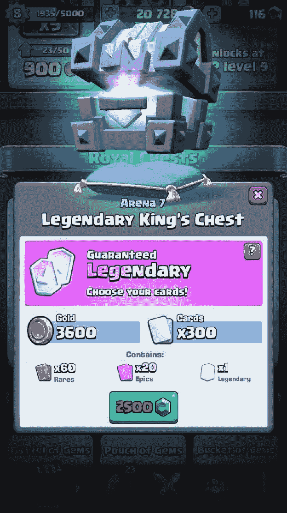
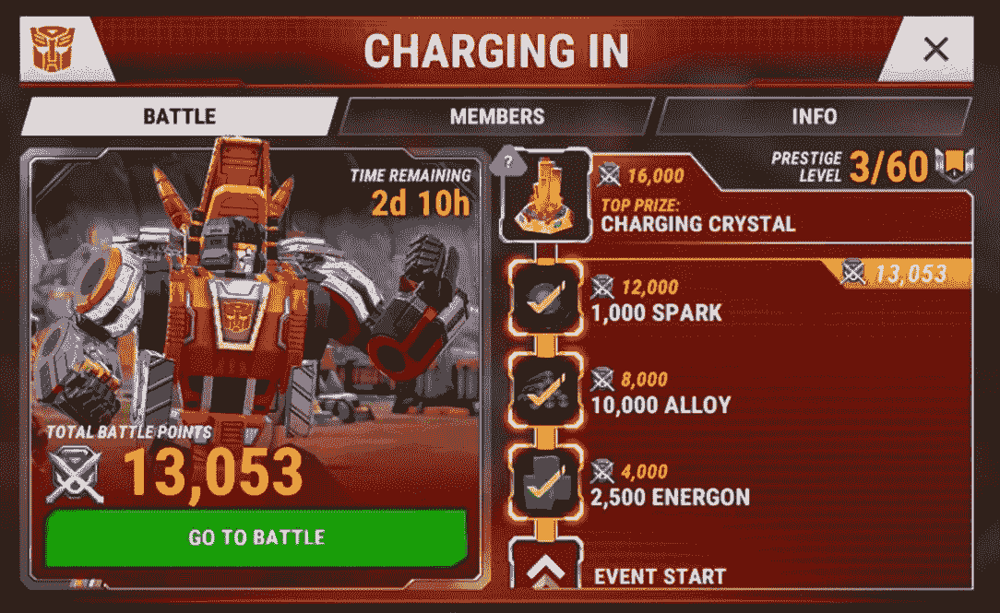
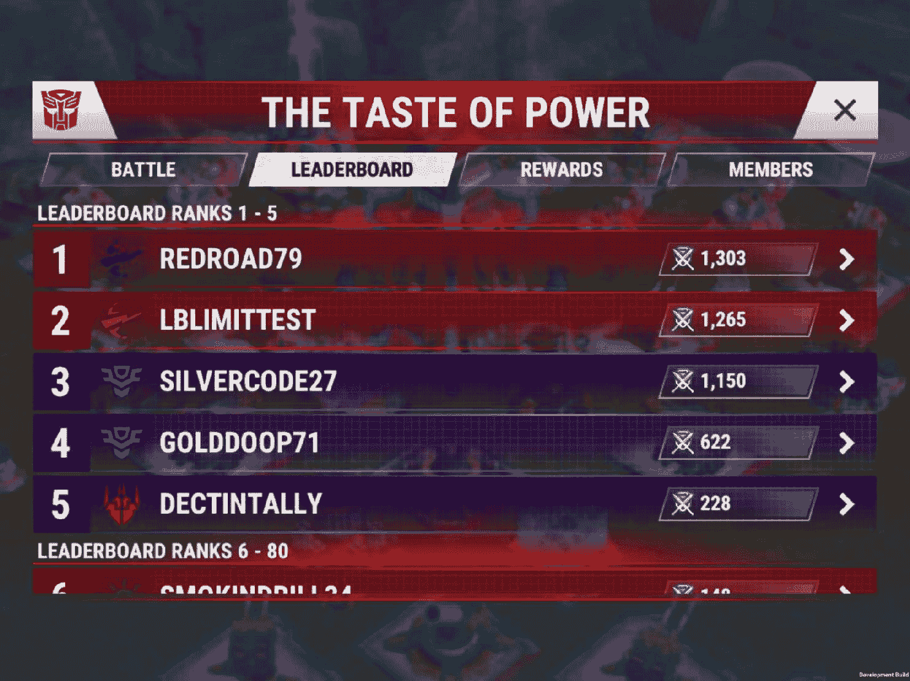
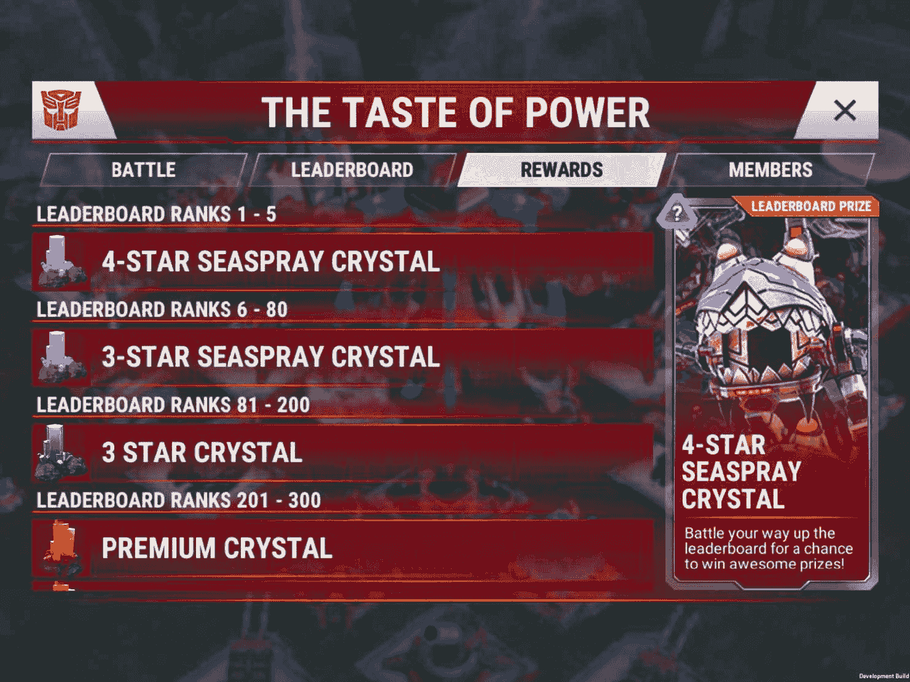
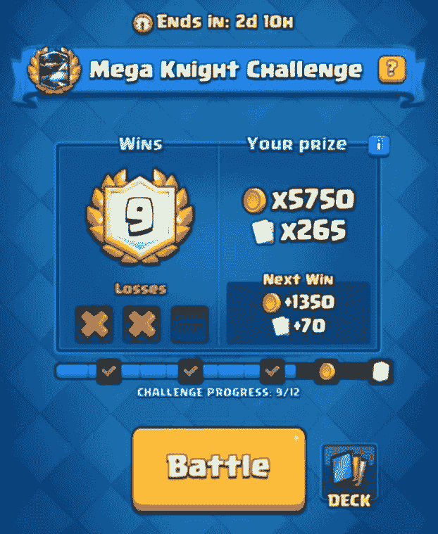
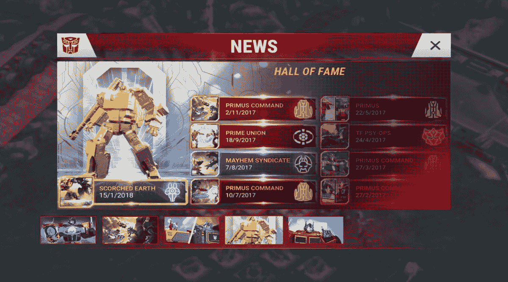

# 第十六章

游戏即服务

对于免费游戏、章节式游戏和订阅制游戏，大规模发布一直是产品创建到服务运营的过渡标志。但对于高级游戏，发布后的支持也是必不可少的，那种发布一个盒子然后立即转向新项目的日子已经过去了。

经营游戏开发业务从来都不容易，如今，我们的行业竞争激烈，成功与否取决于热门游戏。随着游戏开发和营销成本的不断上升，建立、维护和反复货币化一个忠实的粉丝群体已经成为首要任务。另一方面，对于玩家来说，这个环境比以往任何时候都要吸引人！高质量免费游戏的大规模涌现意味着玩家可以尝试尽可能多的游戏，并且可以玩数百小时而不花一分钱。

在本章中，我们将尝试提炼将你的游戏转变为成功服务所需的知识，从货币化技巧和现场运营策略，到解决游戏平衡、理解分析、客户支持和运行游戏的可持续性所需的工具。不断发展的商业模式带来了巨大的（有时是有争议的）设计挑战，但直面挑战可能是你制作世界级热门游戏的唯一机会。

参与条款

在你开始考虑设计、部署和运营现场游戏之前，你应该熟悉大量用于描述业务各个方面的关键词和缩写。起初，这些术语可能显得有些难以驾驭，但在谈论由数十人推动的越来越复杂和精细的产品时，通用语言是必不可少的。

> > > 列表的大部分内容都是关于 KPI（关键绩效指标）。这些是评估游戏性能的指标。KPI 通常围绕财务数据、营销表现，以及玩家基础的当前规模、健康状况和整体趋势。

现在，我们将详细解释几个关键术语，并借此机会提供更多关于构建和运营免费游戏挑战的见解。

基本统计数据

我们将从一些几乎每个游戏团队成员都应该理解和遵循的最关键的 KPI 开始：

保留率

最重要的关键绩效指标之一，也是你整个业务的基础。如果你希望有任何希望收回开发和运营游戏的成本，以及通过付费营销获取用户，你需要让玩家定期回来。毕竟，某人玩得越久，他们重复消费的机会就越多。

保留率统计数据通常报告为安装日后的几天内返回的玩家百分比。最流行的保留率关键绩效指标（KPI）是 D1（安装后一天）、D7、D14、D30（安装后一个月）和 D365（一年后），最后一个指标是衡量游戏寿命的终极证明。保留率会因游戏类型和吸引的受众类型而有很大差异。话虽如此，在移动游戏行业中，有机用户（非付费营销吸引的玩家）的 D1 保留率通常目标是 40-45%，而杰出的游戏可以达到 60%。

有几种计算保留率的方法，其中一些可能有些误导。例如，滚动保留考虑了仅在两次（第 0 天和第 17 天）启动游戏的用户，将其视为保留了两周，从而将其明确地纳入 D14 保留率统计中。

每日活跃用户和每月活跃用户（DAU 和 MAU）

两个用于监控活跃玩家基数大小的关键绩效指标。DAU 汇总了在特定一天登录游戏的用户总数。另一方面，MAU 描绘了月度总数，无论参与频率如何。

并发用户（CCU）

测量当前登录游戏的玩家数量。通过跟踪 CCU 随时间的变化，您可以找到一周中最受欢迎和最不受欢迎的时间。这有助于您确定推出新内容、运行服务器脚本或开始新特别活动最佳的日子和小时。

CCU 是一个密切监控的关键绩效指标，用户数量的急剧下降可能是基础设施错误的明显迹象。您的技术团队也会使用 CCU 来确定最佳的服务器带宽。如今，可以根据您当前和未来的需求以及历史 CCU 数据远程添加和删除服务器实例。这有助于保持运行成本低，同时确保有足够的容量以避免连接问题和服务器错误。

转化率（CVR）

玩家在游戏中花费金钱从非付费用户转换为付费客户的百分比。转化率会因游戏类型、平台、地区和平均玩家年龄（25 岁以上的玩家更有可能进行货币化）而有很大差异。移动免费游戏通常以 1%到 5%的转化率运营。

每位用户平均收入和每位付费用户平均收入（ARPU 和 ARPPU）

这些长缩写描述了平均用户（ARPU）或平均付费客户（ARPPU）产生的月收入。计算很简单：

ARPU = 月收入 ÷ MAU

ARPPU = 月收入 ÷ (MAU ÷ 转化率)

这些关键绩效指标的时间范围可能不同，因为一些公司在计算 ARPU 和 ARPPU 统计数据时，会查看每日或 24 小时滚动数据。

此外，您还可能遇到 ARPDAU，正如您可能从缩写中猜到的，它是指每日收入除以每日活跃用户。

生命周期价值（LTV）

平均用户在整个产品使用期间的总支出是对你商业模式有效性的最终证明。

由于我们没有未来的数据，LTV 将始终基于历史表现进行预测。通过基于 D1 保留用户进行 LTV 计算，你可以减少由定位不良的营销活动和低质量的有机用户（通常与大量商店推荐相关）产生的噪音。

营销和数据分析

在我们的基本统计数据之后，我们有一份与游戏商业表现大多相关的 KPI 和术语列表：

安装

新安装或新用户是关键营销 KPI 之一，通常按日观察。如今，大多数营销活动都可以追踪，使团队能够直接将用户归因于特定的渠道。任何未付费安装都被视为有机。

K 因子和病毒性

在营销中，k 因子代表现有用户的病毒式增长速率，邀请非用户进入服务。这归结为一个简单的计算，即每个平均用户发送的邀请数量乘以邀请的转化率。

k = (邀请数 ÷ 用户) × 转化率

有机提升

有机提升（Organic Uplift）代表了有机（未付费）安装的无归属增长。这可能是由于商店推荐、口碑传播增加、品牌知名度提升（社交媒体帖子、社区工作等）、未追踪的营销（如报纸和街头广告）或者玩家在网络上看到广告，没有与之互动，然后自行搜索产品。

点击通过率（CTR）

点击通过率（CTR），这是与广告（或任何其他可追踪事件）互动的用户数与总观看次数（印象数）的比例。在游戏广告中，CTR 用于评估和比较广告活动的有效性。

安装成本（CPI）

也称为获取成本，这是任何依赖付费营销的游戏的关键 KPI。CPIs 可能非常波动，并且很容易被几家竞争同一用户基础的公司的巨大营销预算所夸大。

尽管如此，在竞争激烈的免费游玩市场中，最佳（通常是唯一）的盈利增长方式是降低 CPI（通过调整每日支出、营销活动和受众定位选项）并在低于其 LTV 的成本下尽可能多地购买用户。

CPIs 可以使你的游戏成功或失败。一个高度吸引人和精准定位的游戏可以获得 2 美元的 CPI，而另一个不那么吸引人的游戏可能需要花费 20 美元才能获得一个保留玩家。如果 20 美元每用户听起来完全疯狂且不可持续，那通常是因为它通常是，除非你的 LTV 舒适地高于 20...

在游戏进入实际生产之前，了解你游戏的平均 CPI 是很重要的。为了验证你的市场潜力，设置一个小规模的测试（500-1000 美元），使用几个不同版本的营销截图，大致代表你的游戏和主题。确保添加竞争性标题以获取一些基准数据。如果你的得分远低于竞争对手，考虑测试不同的主题或前提。

每千次展示成本（CPM）

即使你只关心新用户，实际支付的是展示次数（无论是否转化）。CPM 提供了对在线广告实际成本的深入了解，并在评估未跟踪活动的盈利能力时特别有用，例如印刷、电视和广告牌。

小鱼、海豚、鲸鱼

一种三步分类（起源于博彩业），用于区分不同层级的盈利玩家。虽然每个层级背后的确切数字在行业中往往有所不同，但这种分类在免费游戏（Free to Play）中非常流行。

首先，小鱼是小额消费者（每月 5 美元以下），海豚位于中间（5-24.99 美元/月），而鲸鱼是高消费者（每月 25 美元以上）。偶尔，会在鲸鱼之上增加一个额外的层级，并保留给每月花费超过 50 或 100 美元的玩家。

会话统计数据（数量和长度）

了解每天的平均游戏会话数量及其长度，可以帮助你在调整游戏节奏和平衡时做出更好的决策，例如，通过调整单个回合的长度或游戏中动作产生的资源数量。

经济和平衡

总结一下，让我们深入了解在设计、分析和平衡游戏内经济时使用的术语和实践。

免费增值货币

也称为软货币，是一种相对丰富的游戏内资源，可以通过玩游戏积累，而无需花费金钱。通常用于基本内容和游戏玩法需求。

高级货币

也称为硬货币，是一种稀缺资源，主要通过花费真实货币获得，尽管一小部分高级货币可能会定期或从严格限定的目标中获得。硬货币用于访问高级商品和服务，以及跳过时间和资源需求。

水龙头和下水道

在游戏内经济中，水龙头（或来源）产生资源，而下水道（或消耗点）负责移除它们。为了避免资源通货膨胀和整个经济的贬值，你必须严格控制资源创造，并为玩家提供深入且令人渴望的下水道。

能量

行动点数、能量、燃料、钥匙、耐力、生命值——这些都是为限制你在游戏中有效花费时间的资源的一些类比。通常，能量资源会随着时间的推移自行恢复，达到一定的上限，在某些情况下可能会增加。

尽管你可以花钱来补充能量，但这很少被视为一个重要的货币化途径。能量机制的主要作用是帮助控制玩家的游戏会话和他们的进度率。没有能量，一些玩家不仅会以无法控制的速度耗尽我们的内容，而且在过程中也会感到疲惫。可能每次 10 分钟很有趣，但连续 3 小时可能就不那么有趣了。有一个明确的激励因素来返回（能量满载！）以及一个离开游戏的借口（能量耗尽！）可以帮助维持健康的游戏周期，并在游戏周围建立游戏习惯。

顺便提一下，承认能量和生命之间的关键区别很重要。虽然能量通常用于任何重大行动（如进入战斗），但生命值只有在失败时才会减少。这意味着输掉游戏的玩家会比赢家的退出游戏（或被激励消费）更早。这种差异的长期后果难以预测，并且应该针对每个案例进行测试和评估。

Gacha 宝箱

也称为神秘宝箱、战利品箱或战利品宝箱。Gacha 宝箱以随机方式分配奖励（如资源、物品、角色、虚荣物品和其他商品）。关于设计 Gacha 系统的更多内容将在本章后面介绍！

掉落率

在随机场景中（如敌人战利品掉落、Gacha 宝箱等）玩家获得特定奖励的百分比概率。

突击点

游戏核心进度的任何部分，如果依赖于通过人工增加难度（增加摩擦的一刻）来鼓励消费。大多数基于等级的移动谜题游戏（如糖果传奇）定期推出极其困难的关卡，以促进额外步数和提升的需求。

支付关卡

任何设计为主要通过支付来评估的游戏内容都可以被认为是锁在支付关卡后面。

磨练

重复完成游戏已经掌握的部分以完成特定元目标的过程。例如，积累大量资源来购买昂贵物品，或者在应对特别困难的挑战之前提升经验等级。

留存率和流失点

留存率与流失率相反，它表示在定义的时期或特定时间点（在新的游戏更新或服务器重置后）停止玩游戏的玩家数量（流失）。高玩家流失率会促使寻找流失点，即游戏中的区域和功能，这些区域和功能会促使大量玩家离开并永不回来。为了找到流失点，你需要收集游戏进度统计数据（最后完成的关卡或任务，最后解锁的物品或游戏机制，总游戏时间等），并使用它们来识别（并希望解决）最紧迫的问题。

保留漏斗

漏斗是对你数据的按时间顺序表示。当应用于保留度分析时，它使我们能够轻松地识别最大的流失点。

例如，如果我们想提高我们的 D1 保留率，最简单的方法就是寻找我们首次用户体验（FTUE）关键点的流失点。漏斗看起来会是这样：

+   10,000 首次启动游戏

+   9,500 创建了玩家资料

+   9,300 进入教程战斗

+   8,000 在战斗中部署了单位

+   7,900 完成了战斗

+   6,000 完成了教程

这样的漏斗图立即突显了进入教程战斗（9,300 人）和部署他们的单位（8,000 人）的玩家之间 14%的高流失率。这突显了该教程步骤可能存在的问题，并促使进一步调查和实验。这种漏斗图可以应用于更广泛的范围，但玩家离首次体验（FTUE）越远，数据中的不确定性就越大。

支付获胜（p2w）

一个用来描述玩家可以通过花费真实货币大幅提高获胜机会的游戏或系统的术语。将货币转换为游戏内力量的能力并不自动将你的游戏归类为这种类型。花费的优势必须是可以感知的，并且对于未花费的玩家来说似乎遥不可及。

具有支付获胜动态的多玩家场景在西方市场通常不受欢迎。然而，对于单人体验来说，情况并非如此，尤其是在中国、日本和韩国等东方市场，文化差异（以及免费游玩市场的总体成熟度）在转变这一观点中起着重要作用。事实上，对于许多中国玩家来说，能够负担得起高级游戏内容是一种骄傲的来源。

A/B 测试（也称为拆分测试）

A/B 测试是一种控制实验的形式，其中在两个（因此是 A 和 B）或更多玩家组上同时运行游戏的不同版本或配置。A/B 测试通常允许对从默认控制布局到进度机制和游戏难度等各种理论进行高效且无偏见的验证。

每个测试都会运行一定的时间，之后比较不同组的 KPI，并选择一个获胜的配置。大多数测试至少运行几周是最合适的。高度可能的是，同一个导致教程完成率略有下降的变化也可能导致长期保留率和转化率的显著增加。在大多数情况下，广泛的 A/B 测试局限于测试和软发布阶段，但可以在游戏整个生命周期中利用 A/B 测试来测试非关键功能。

记住，玩家之间相互交流，最好确保你的玩家在测试组分配中不会感到被欺骗。此外，最好避免任何具有明确、真实金钱影响的 A/B 测试，例如尝试相同内容的不同的价格点。这种操纵几乎肯定会激怒社区并侵蚀他们的信任。

免费游玩货币化的基础知识

设置和平衡游戏经济、玩家进步率和货币化模型可能是一项艰巨且耗时的工作。在人员配备齐全的团队中，这些职责通常由一个专门的经济设计师负责。在规模较小、专业化程度较低的团队中，创建成功的游戏经济的重任通常落在一般游戏设计师身上。

在理论上，免费游玩游戏的商业模式很简单。降低进入门槛（免费下载）以吸引大量受众，通过有趣的游戏玩法留住玩家，并为他们提供充足的机会表达自己、节省时间和通过付费来增强游戏体验。

实际上，这是一个巨大的挑战，尤其是在你在一个饱和的市场中运营，并且随着越来越精明的受众，他们经常期望在玩了数月甚至数年后仍然可以免费获得大部分内容。要想在这个困难的市场中取得成功，你需要制定一个强大的货币化策略，以强化已经强大的游戏循环。

虽然免费游玩的商业模式可能会对游戏设计产生重大影响，但你不应让货币化驱动你的原型并剥夺你的创造力。游戏玩法必须放在首位，因为没有它，你将没有用户可以转化。

> > > 不要盲目复制/粘贴其他成功游戏的货币化模型。你可能没有品牌、内容广度和受众规模来使它们生效。例如，英雄联盟的货币化在一个拥有数百万用户的强大用户基础上运行，并且用户保留多年，但鉴于它的 ARPU（平均收入每用户）很小，它可能对你不起作用！

货币化向量

在《反恐精英：全球攻势》中购买刀皮肤和在《糖果传奇》中购买棒棒糖锤是两种完全不同的体验。前者是由欲望驱动的，而后者是由挫折感驱动的。刀皮肤为玩家提供了一种表达自己的方式，并提供了视觉多样性，但它们对游戏玩法没有影响。另一方面，棒棒糖锤的价值几乎完全取决于其对游戏玩法的影响，因为它是一种可用的工具，可以帮助你克服困难情况。你的提供必须与你的游戏和玩家的欲望紧密匹配。

有四种不同的向量用于驱动游戏内货币化模型：

1.  时间

1.  难度

1.  可玩内容

1.  非可玩内容

我们将逐一探讨这些因素，并密切关注它们对游戏玩法、进步、结构和玩家情绪状态的影响。

时间

这种货币化途径通过以下情绪得到加强：期待（积极）和急躁（消极）。

时间和游戏进度紧密相连，免费游玩的游戏通常故意（且逐渐）减缓玩家的进度速度，以期将其货币化。这可以通过两种方式实现：

+   通过计时器明确设置：基于中央服务器的时钟可以支持一系列进度控制机制，从计时器在制作、建造、训练、升级和解锁你的单位、技能和结构，到能量机制（直接限制游戏时间），以及更微妙的每日和每周目标，这些目标为玩家提供重要的奖励（没有这些奖励，进度会显著减慢）。

+   通过资源隐式引入：游戏中内容的价格和提升你的角色等级所需的经验点通常以指数级增长。在这些情况下，玩家可以选择免费继续玩游戏，或者花钱加速资源生成或直接购买物品。

进度基础货币化的有效性取决于游戏平衡以及你维持一系列不断升级的目标以供玩家追求的能力。

然而，不要急于推进玩家的旅程。向初学者突出显示最终游戏内容可能会吓跑他们（工作太多）或贬低其他一切（这些都是我得到真正想要的那一件东西的垫脚石）。

难度

这种货币化途径通过以下情绪得到加强：掌握（积极）和挫败（消极）。通过仔细增加你游戏中任务所提出的挑战（但不是游戏机制的复杂性），你能够创造摩擦，即预先计划减少玩家进度速度，旨在鼓励玩家花钱。

可以通过难度波峰（比周围区域难得多）的形式引入摩擦，或者通过比玩家能力增长速度更快的速率急剧增加整体难度曲线。难度波峰和难度曲线的上升并非互斥，你可以结合这两种解决方案。

一旦你确定了一种引入摩擦的方法，你可以通过以下方式将新发现问题的解决方案货币化：

+   解决暂时性难度波动的临时措施，最可能的形式是消耗品：高级弹药、强大的提升、额外的移动次数、生命值等

+   长期解决方案，帮助玩家成长和进步，以适应不断增长的难度：永久升级、强大的物品和角色等

货币化难度具有风险！在某些情况下，摩擦可以激励玩家并使他们继续（并可能消费），但在其他情况下，它将导致玩家反叛并带着挫败感离开。频繁且明显的难度激增最终会感觉令人震惊和不公平，而不断增长的难度曲线可能会使您的受众感到疲惫，并使他们觉得他们所做的一切都是徒劳的，从而消除了游戏进度中的任何满足感。

货币化摩擦的后果可能因类型和受众而异。软启动您的游戏并监控真实玩家的进度、消费和留存情况是分析和优化摩擦的最佳方式。

可玩内容

以下情绪强化了这一货币化向量：好奇心（正面）、喜悦（正面）和无聊（负面）。新故事、任务、角色、装备、环境以及甚至游戏模式都是可以锁在付费门后的可玩内容的例子。

为了提高这一向量的有效性，您需要增加您商品的需求性、吸引力和感知价值，并且所有这些都不应将非付费用户推出游戏。您可以根据其生命周期对您的可玩内容进行分类：

+   永久性：游戏试玩、高级扩展包和新故事章节已经存在多年。如今，我们更有可能免费获得整个游戏的骨架，并花钱来建立我们的虚拟商品收藏，无论是汽车、武器还是英雄。永久性商品的功效必须密切规划和监控。一方面，满足玩家的需求可以永久消除在该货币化领域的重复销售机会。另一方面，使高级物品在 30 分钟后感觉无用和过时将产生同样负面的结果。

+   消耗品：满足非永久性商品（如物品租赁、游戏订阅或限时访问高级区域）的实现是一种维持健康、持久经济的极好方式。话虽如此，请确保您的提供多样化！您的大部分受众都期望他们的钱能产生持久的影响，并且对非永久性内容的消费表现出内在的负面反应。

非可玩内容

以下情绪强化了这一货币化向量：自豪（正面）、娱乐（正面）、嫉妒（负面）和羞愧（负面）。这一类别包括可能有用、令人向往和有趣的内容和服务，但不会直接影响或扩展玩家的游戏选项和能力。最常见的两个类别是：

1.  美观物品：服装、皮肤、装饰、图标、同伴宠物、视觉效果、音效、动画以及任何其他无实际用途、价值仅基于外观和感觉、稀缺性和主观品味的内容。

1.  可选服务：账户名称更改、服务器迁移、私人聊天频道、额外的角色或装备槽位，甚至自动处理一些家务（例如清理库存空间）。这些都是可能货币化的额外服务和例子，它们对游戏玩法没有明显的影响。

根据其本质，非游戏内容是任何试图在花费者和非花费者之间保持公平竞争的游戏的主要货币化途径。

建立游戏经济

任何免费游玩经济的首要目标应该是以最可持续和最积极的方式最大化平均玩家的生命周期价值（LTV）。这意味着我们需要：

+   调整货币化策略

+   通过管理难度、内容消耗、资源生成和资源移除来控制玩家进步的速度

+   创建和调整真实货币的提供

调整货币化策略

你可能有一个很棒的物品和服务短名单，但在你为它们中的任何一个分配一个数字之前，你需要问自己这些问题：

+   谁会玩游戏？你的游戏能否吸引一个强大、忠诚的粉丝群体，具有高留存率和 LTV，或者它更像是在一个竞争激烈的领域中的休闲活动？平均玩家的年龄是多少？25 岁以上的人比青少年有更多的可支配收入，可能愿意为他们的爱好付费。年轻受众很难转化，我们应该积极尝试防止任何未成年人的购买（例如，通过在他们的第一次启动时创建一个年龄门）。 

+   你能从你的游戏内容中获得多少？一个 D365 玩家的潜在 LTV 是否限制在 100 美元，或者它是 100,000？前者如果你不能获得大量用户，将凸显出一个巨大的问题。后者通常是一个过于乐观或过于吝啬的迹象。

+   受众愿意花钱吗？你的类型或品牌是否有任何先入为主的观念，可能会增加价值或可能损害你的产品？

    +   在移动游戏中使用的 PC 或游戏机品牌可能会吸引那些习惯于为成品支付 60 美元的玩家。小心不要让你的货币化策略激怒他们！

    +   另一方面，像 MARVEL、DC、星球大战或变形金刚这样的品牌适合一个接受为了收集他们最喜欢的角色而花钱的市场，无论是以实体还是虚拟形式。 

+   你准备好提供价值了吗？在《变形金刚：地球之战》中，我们投入了巨大的努力来调整和润色我们的角色模型、动画、预览屏幕和抽卡体验。我们的目标是提供最好的数字玩具，一套忠实（有时甚至有所改进）的角色，这些角色是玩家从他们的童年玩具、卡通和漫画中记住的。多亏了这些努力，我们的游戏成为了一种收集数字变形金刚角色的合法方式，它不需要货架空间，并提供了很多免费内容。

了解基础知识后，你现在可以调整你的目标。例如，一场第二次世界大战策略游戏可能会倾向于成熟玩家群体，并拥有建立健康、持久经济所需的内容。另一方面，一个移动的无限跑酷游戏可能会吸引年轻玩家，但如果没有强大的促销技巧，将玩家转化为收入将非常困难。此外，如果游戏性质使得高 D30 留存率几乎不可能，你不妨尝试快速消耗你的内容并最大化 ARPPU。

记住，总是看看你所在领域的成功游戏是很好的，但并不能保证将那种成功转移到不同受众、品牌或规模的游戏上。

平衡玩家进度

免费游玩游戏的节奏和平衡是一个非常微妙的过程。过早地放慢节奏，玩家可能会感到无聊或因挫败而放弃。保持快速而稳定的节奏，你将消耗掉你的内容，并消除任何基于时间和努力的花费激励。

解决这个难题的唯一方法是让你的经济采用一定程度上的指数增长，但盲目地增加成本和需求很快就会失控。通过使用关键进度向量（在范围和平衡章节中详细描述），你将能够考虑到付费和非付费玩家来建模你的经济，并更好地理解你内容的持久性。

让我们看看这个流程在实际中是如何进行的！我们将以《行星边 2》为例，这是一款针对 PC 和 PS4 的免费游玩 MMO 射击游戏。

示例 – 《行星边 2》

《行星边 2》是一款 MMOFPS（大型多人第一人称射击游戏），一款数千名玩家分成三个阵营，在广阔的开放世界中为领土而战的电子游戏。

《行星边 2》中的关键进度向量是一种称为认证点（CP 或 certs）的资源。认证点主要通过游戏获得，并用于最希望的游戏内容，即解锁和升级武器、车辆以及士兵的能力。

因此，如果我们想要平衡《行星边 2》的经济，我们需要通过以下方式：

1.  建立基准证书点生成。

1.  对不同类型玩家随时间变化的 CP 收入进行近似。

1.  基于期望的进度率对游戏内容的价格进行建模。

首先，让我们解决最大的 CP 来源，那就是经验值！在《行星边 2》中，玩家通过大多数游戏操作积累经验值，例如杀死敌人、支援盟友和占领领土。CP 生成的速率设定为每 250 经验值产生 1 CP。这是我们最强大的变量之一。

了解这一点后，我们可以开始预测不同类型的玩家每天生成的 CP 数量，从非消费型玩家，到轻度消费型玩家（他们订阅了高级程序并增加了他们的 XP 生成），以及高消费型玩家（他们也购买各种 XP 增强器）。为了更好地进行 CP 计算，最好的方法就是使用来自封闭 Alpha 和 Beta 版本的玩家表现和参与度分析，但为了这个示例，让我们使用假设的近似值。毕竟，你通常会没有实际数据开始建模你的经济，并等待更多的最终调整直到软启动：

|      |     Non-Spender |     Low Spender |     High Spender |
| --- | --- | --- | --- |
|     XP and CP per hour |   10,000 XP = 40 CP   |   12,000 XP = 48 CP   |   14,000 XP = 56 CP   |

|     XP Bonus |   0%   |   50% = 24 CP   (premium program bonus) |   100% = 56 CP   (premium program +

XP boosters) |

|     Daily retention bonus |   48 CP/day   |   96 CP/day   |   96 CP/day   |
| --- | --- | --- | --- |

|     Daily totals for average level of engagement |   88 CP (1 h) 128 (2 h)

168 (3 h) |   168 CP (1h)   240 CP (2h)

312 CP (3h) |   208 CP (1h)   320 CP (2h)

432 CP (3h)

在获得来自 XP 和每日保留 CP 奖金（每天最多 96 CP）的证书之上，玩家每提升一个战斗等级（XP 等级），可获得 100 个认证点，最高到 15 级（需要 120,000 XP）。这意味着在游戏的前 10 个小时左右，我们将额外发放 1,500 CP，这是一个有意义的奖励，有助于提高玩家的参与度和 D7 的留存率，而不会牺牲我们经济的长期发展。玩家还可以通过各种表现和参与度相关的奖牌获得额外的 CP，但它们作为 CP 来源的重要性微乎其微。

现在我们知道了每天能生成多少证书，我们可以更好地理解，对于一个非消费型玩家来说，需要超过一周的高度参与游戏才能获得 1,000 CP 的武器，而对于一个高消费型玩家来说，只需要 3 个半参与度的日子。如果我们的软启动数据显示缺乏多样性正在损害留存率，那么我们可能希望玩家在第一周尝试大约 5-10 种武器。这意味着我们需要确保经济中包含几个 100 CP 和 200 CP 的选项。

在《Planetside 2》中，玩家自己控制着玩家的进步。游戏中几乎没有要求，玩家有选择将他们的证书用于什么的自由。免费玩家可以在整个游戏中花费最少的 CP 解锁各种基础武器和实用特性，但由于指数定价策略，经济仍然为那些希望投入数月游戏时间或数百美元购买专用装备和高度升级的能力的人提供了充足的空间。

为了用例子来说明这一点，让我们看看飞行车辆上单个武器的 CP 消耗。M18 Needler 是一种免费武器，可以花费几百 CP 进行装备，但升级成本通常会迅速增加：

| |   光学   |   弹匣容量   |   装填速度   |   最大弹药   |
| --- | --- | --- | --- | --- |
| |   免费 (1.25 倍变焦)   |   100 CP   |   150 CP   |   1 CP   |
| |   50 CP (1.5 倍)   |   200 CP   |   200 CP   |   10 CP   |
| |   150CP (1.75 倍)   |   400 CP   |   400 CP   |   30 CP   |
| |   500 CP (2 倍)   |   1,000 CP   |   500 CP   |   50 CP   |
| |   |   |   1,000 CP   |   100 CP   |
| |   替代光学   |   |   |   150 CP   |
| |   50 CP (夜视仪)   |   |   |   200 CP   |
| |   200 CP (热视仪)   |   |   |   400 CP   |
| |   |   |   |   500 CP   |
| |   |   |   |   1000 CP   |

如您所见，即使是默认武器也能消耗超过 7,300 个证书，并将完全升级的装备排除在非付费客户之外。这种特定车辆的货币化潜力通过次要武器、工具和多种车辆优势进一步得到加强。从所有角度来看，这似乎是一个具有强大、长期潜力的经济。

在 CP 生成和定价保密的情况下，我们可以建立证书和高级货币之间的关系。假设 1,000 CP 相当于大约 6 小时的游玩时间，每小时等于 100 高级货币。通过将高级货币定价为每 100 美元 1 美元，我们可以有效地将 1,000 CP 物品的价值转换为 6 美元。有了这些信息在手，我们可以估算整个经济的美元价值。首先，仅升级 M18 Needler 就需要超过 40 美元！

虽然这种计算几乎不是科学的，并且很少转化为确切的美元价值，但它有助于你建立定价策略和理解你内容的价值。最终，决定玩家如何花费他们的时间和金钱的是玩家自己。大多数人会尝试免费获得他们喜欢的东西，有些人会花几美元购买他们喜欢的武器，而其他人则会花费一百美元来购买一套独家皮肤。在经济的早期设计阶段，你所能期望的最好结果是创造一个持久的经济，它看起来易于接近，但鼓励消费。

> > > 重要的是要注意，在《Planetside 2》中有三个可玩阵营，资深玩家很可能会在他们的账户上有多个角色——每个角色都有自己的等级和证书余额。这种简单的处理方式增加了 CP 消耗和长期吸引力，但以减少每个特定角色的个人投资感为代价。

抽卡

在第三章《游戏项目规划》中，我们描述了抽卡作为一种极端的随机奖励分配方法。我们还提到了抽卡的日本起源，即由各种自动售货机分发的 gachapon 玩具胶囊。

最初起源于东方的这种做法现在在西方市场，尤其是在移动设备上，已成为一种常见的做法。但在你将免费游玩经济建立在宝箱上之前，你必须完全了解此类系统的要求和影响。

> > > 对于抽卡系统的接受度在不同的平台、类型和地区之间各不相同。评估你的受众！他们是否熟悉抽卡的概念，还是你需要教他们如何操作并不断管理他们的期望？将宝箱放入任何高级产品中可能被视为一个非常具有争议性的举动。

就像所有货币化的方面一样，在设计你的抽卡系统时从顶级游戏中汲取灵感是一种良好的实践，但这几乎不能保证成功。每个抽卡模型都需要根据你的游戏和受众进行定制。你可能没有使你的抽卡系统运作所需的受众、内容或品牌。

为了帮助您更好地理解和提高这种货币化模型的有效性，我们将深入探讨抽卡设计的五个支柱，并随后提供更多信息、技巧和窍门。

支柱 1 – 数量和质量

由于包含十个奖励的宝箱不会持续太久，因此在抽卡设计中的第一步是确保你有足够的内容使抽卡成为一种可行的货币化策略。

你可以提供多少独特的内容？你可能不知道最终的数量，但重要的是要考虑悲观和乐观的估计。最好是至少有 100 个独特的奖励，但如果你可以使重复的奖励变得有用（甚至令人渴望），那么可能用更少的数量也能应付。关于重复的内容将在后面详细说明！

将你的内容分为三到五个等级，以表示其质量和稀有度。为什么是三到五？低于三的等级往往过于肤浅，而高于五的等级则往往过于零散和混乱。为这些等级找到合适的名称（如普通、不常见、稀有、史诗等），或者用符号（如星星）或等级（D、C、B、A、S）标记它们。在命名和为内容等级着色时，不要试图重新发明轮子；玩家越熟悉系统的某些部分，效果越好。

说到等级，它们是增加你的内容并扩展你的抽卡提供的一种极好方式。你所需要做的就是创建几个相同角色/武器/车辆的版本（通常具有相同的艺术和游戏玩法），但具有不同的起始统计数据和进步曲线。通过这种方式，40 个独特的元素可以成为你抽卡经济中的 120 个条目。当然，这个过程有局限性，并且回报递减，但我发现坚持三四个变体效果很好，而不会使问题复杂化。

另一种延长奖励的方法是将它们分成几部分，例如要求玩家收集 50 个碎片/碎片/蓝图来解锁一个物品，而不是立即授予。在做这件事时，请务必小心，因为碎片化奖励会延迟回报，本质上逆转了内容解锁的频率，因为玩家需要多次获得相同的抽卡奖励才能从系统中获得任何东西。因此，经验丰富的玩家（在长时间内积累了多个物品的进度）获得新物品的机会比新玩家（在早期几乎没有希望解锁有价值的东西）要高得多。如果你决定使用碎片化奖励，最好在早期就提供大量新内容，保持游戏多样性，并让玩家保持在最佳进步路径上。

在你确定了你需要提供多少内容以及如何分配之后，你必须分析消耗这些内容的速度和价格。首先，将你的内容加总并提取两个数字：解锁所有可用内容所需的最低奖励掉落量，以及解锁和升级所有内容所需的总掉落量。现在，估计不同类型的玩家（非花费者、花费者和重度花费者）每天打开的盒子数量。使用这些数字，你可以估计消耗你的抽卡经济的时长，以及如果你要加速它需要多少资金。

为了获得更现实的估计，尝试将内容限制在能满足大多数玩家的数量。毕竟，游戏中可能有 300 种独特的武器，但你可能一次只积极使用其中几种，而你所有的需求可能只需要一套五件高度升级的武器就能完全满足。带着这个观点，我们过渡到抽卡设计的下一个支柱。

第二个支柱 – 玩家容量

你内容的长久吸引力与玩家装备的规模和扩展收藏的实用性相关联。

想象一个游戏，玩家可以收集各种英雄角色，但只能将一个角色带入战斗。这可能会创造玩家对少数几个高级角色完全满意的情况，从而大大降低未获得内容的吸引力。

为了保持抽卡的相关性，你需要不断鼓励玩家扩展他们的收藏。有几种方法可以做到这一点：

+   引入特殊游戏模式或任务，这些模式或任务需要特定的角色或装备

+   实施单位冷却时间（重复使用的惩罚）或每日奖励（更积极的方式）来鼓励玩家与更广泛的内容进行互动

+   在你的元游戏平衡中创建反策略，并考虑更明确、容量扩展的机制，如元素优势和劣势

+   如果你开始依赖出售装备，将其分解成多个部分（头盔、胸甲、手套、鞋子等等），甚至可以添加一些额外的戒指和饰品

无论你选择哪种解决方案，你的主要目标是保护经济的长期性。确保新抽卡内容的渴望不会因为几次幸运的抽取而得到满足！

第三支柱 – 可取性

你的抽卡内容是否具有吸引力？你能想象花 10 美元购买它吗？或者 10000 美元呢？强大的、可识别的品牌将有助于提升你的虚拟收藏的价值，但最终，你的抽卡成功往往取决于实用性。最好能让你抽卡内容成为玩家进步的必要元素。完成游戏内的收藏应该很难，而将其升级到最大潜力几乎是不可能的。

对于外观内容来说，廉价的纹理交换可能让你走了一半的路，但玩家通常能判断出你是否付出了努力。花时间让高级外观真正出色。不仅要超越纹理和模型，还要包括粒子效果、动画、音效和图标。

第四支柱 – 可持续性

发布含有一定数量抽卡内容的游戏是一回事，但要维持多年不变则是另一回事（尤其是对于规模较小、精简的团队）。如果你需要两个月的时间来制作一个新角色，但为了维持健康的盈利，你每个月至少需要发布一个新角色，那么你将面临麻烦。

这就是为什么你必须定期评估你的内容创作能力，并寻找优化流程的方法，无论是通过工具、流程、培训还是外包。最终目标是使内容创作成为一种愉快且无风险的尝试。

为了进一步减轻现场运营的压力，保留一些你的初始阵容，并尝试建立未发布内容的库存。至少一个月（理想情况下三个月）的安全网对于几乎肯定会出现的不可预见问题将至关重要。

第五支柱 – 重复处理

允许重复奖励通常是维持长期性和扩展内容的关键。不幸的是，反复收到重复物品可能会让花钱成为一种令人愤怒的经历。它还创造了一个负面反馈循环，即花钱降低了获得有价值奖励的机会；这几乎不是一个理想的场景。

为了缓解无意义重复的问题，我们需要创建一套二级奖励，这些奖励是针对重复物品授予的。这些奖励通常以可以交换为更高稀有度奖励的制造材料的形式出现。最终目标是确保抽卡的价值，通过确保每次抽取都是朝着构建个人收藏和获取更受欢迎的内容迈出的一步。让我们看看一些成功的重复处理有趣例子。

首先，我们有炉石传说的尘系统。这款收藏卡牌游戏以七张卡牌一包的方式出售，即使手头有数百张卡牌，重复的情况也非常常见。然而，任何牌组中只能使用两张相同的卡牌（用于传说卡牌）。这使得每张卡的第三张副本实际上毫无用处。幸运的是，任何多余的或不需要的卡牌都可以通过魔法尘进行分解，以换取魔法尘；卡牌的稀有度越高，你得到的尘就越多。一张传说卡牌可以为你带来 400 尘；再收集 1,200 尘，你就可以购买任何你想要的传说卡牌！通过将 5%到 25%的卡牌价值返还给玩家，并允许他们选择他们想要创建的卡牌，炉石传说创造了一个非常有效且对玩家友好的系统。

另一方面，Clash Royale 对其卡牌的处理方式不同。高级宝箱装满了卡牌，一个巨型宝箱中就有超过 300 张卡牌。在撰写本文时，经济中只有大约 70 种独特的卡牌，对于玩家来说，获得新类型的卡牌并不是经常发生的事情。因此，乍一看，似乎存在一个问题，即用大量重复的卡牌淹没玩家。然而，在 Clash Royale 中，解锁新卡牌只是开始！升级卡牌是玩家进步的主要手段，而且只能通过每个单独卡牌的重复副本来完成。而且需要相当多的副本……将史诗卡牌升级到极限需要超过 386 个重复副本，而另一方面，普通卡牌则需要总共 9,586 个相同卡牌的副本！在建立以重复为驱动的经济后，Clash Royale 中的卡牌在数月内保持了其价值：

Clash Royale 的宝箱装满了卡牌堆和有趣的机制。在这种情况下，你可以在打开宝箱时选择不同的卡牌类型！

在处理重复物品方面有更多的例子，但关键教训是保持甚至加强你的抽卡箱的长期有效性。

诚然，第一百次抽取高级抽卡箱的回报永远无法与第一次或第二次相比——充满了新的、令人兴奋的奖励，以及无尽的潜力。但重要的是我们要尽我们所能，尽可能长时间地保持其价值主张！

现在我们已经完成了抽卡设计五要素，让我们来看看关于这个主题的一些更多技巧和见解！

基于重量的掉落表

作为玩家，我们通常将游戏中的概率视为固定的百分比——这个动作有 5%的成功率，那个物品有 20%的掉落率，等等，但为奖励分配实际的百分比值是一个非常有问题且最终徒劳的努力。毕竟，添加一个新奖励可能需要对整个掉落表进行修改。让我们看看一个简单的例子！

在一个包含 5 个物品的奖励表中，我们有 4 个普通奖励和 1 个稀有奖励，我们希望它比获得普通奖励难 10 倍。除非我们使用权重，否则计算我们稀有物品的确切百分比值并不是一件容易的事情，使用权重后，这变得非常简单。

在我们的加权概率系统中，每个物品都被分配一个数字，这个数字代表它与其他物品之间的关系。一个权重为 250 的物品比一个权重为 10 的物品有 25 倍更高的掉落概率。为了得到一个百分比概率，我们只需将一个物品的权重除以整个奖励表的总体权重：

| 物品 | 权重 | 百分比 |
| --- | --- | --- |
| A   | 10   | 10/41 = 0.2439 = 24.4%   |
| B   | 10   | 10/41 = 24.4%   |
| C   | 10   | 10/41 = 24.4%   |
| D   | 10   | 10/41 = 24.4%   |
| E（稀有）   | 1   | 1/41 = 0.024 = 2.4%   |
| 总计   | 41   | 100%   |

通过在表中添加更多物品，我们自动降低了其他物品的概率。一个权重为 500 的空奖励条目会通过降低获得任何物品的概率来使所有奖励变得更加稀缺。

我们还可以将奖励集嵌套在一起。我们的 A、B、C、D 和 E 物品都可以包含具有自己权重的进一步奖励集，这正是大多数 Gacha 奖励表运作的方式。你可能有一个静态的 10%几率获得稀有物品，但稀有奖励集本身可能包含数十个具有不同概率的条目。

包装和开启

Gacha 不仅仅是关于奖励，它关乎接收整个体验。你的包装和开启序列的设计可能会对你的财务表现产生重大影响。

你如何看待你的 Gacha？是玩家面前展开的一副卡片？是一颗在光柱中爆裂的魔法水晶？一个必须打破的蛋？一个充满宝藏的盒子？确保留出足够的时间来实施和打磨 Gacha 的包装和开启体验。

提供良好的 Gacha 开启体验是一个双面挑战。首先，你想要建立期待，通过提高更高奖励等级的顺序来提升期望，并在庆祝性的揭示中达到高潮。另一方面，你需要高效，并构建一个不会在第一百次（或第千次）观看时显得过长和令人厌烦的顺序。

如果你工作做得特别出色，你将会有尝试连续打开 100 个盒子的玩家。确保这样做既不会出现问题也不会令人厌烦。通过为你的奖励箱实现“开启 10 次”选项，你可以简化开启体验，同时又不完全失去其魅力。

> > > 当从单个抽卡中提供多个奖励时，实施某种形式的保证是明智的。例如，炉石传说的 7 张卡牌包中至少包含 1 张稀有或更高级别的卡牌。这样的保证增加了感知价值，并抵消了玩家运气不佳的风险。但请记住，保证的奖励可能会夸大你的价值主张，可能需要你降低剩余奖励的平均质量。

保持一致性

你希望客户仅根据主题和内容就能轻松决定不同类型的奖励箱。不断改变不同奖励层级的百分比概率和引入模糊的价值主张会导致混乱，并阻止玩家消费。

在你的高级抽卡箱内部分配奖励层级时设定规则（例如，传奇/稀有/普通物品之间的 2%/12%/86%分配），并且坚持这些规则！不一致的层级不仅会让你的生活变得更艰难（需要设置和平衡的变量更多），而且还会让客户满意度降低。

通过保持一致的提供，想要一个新战士类角色的玩家可以立即选择战士箱而不是枪手箱，而无需犹豫。毕竟，在每一个高级抽卡箱中获取传奇角色的几率是相同的。决策取决于我想花多少钱，价值本身从未成为问题。

装箱一致性并不意味着你无法在某个稀有层级内拥有稀缺奖励（例如，比其他普通角色更不可能掉落的普通角色），也不禁止具有不同奖励层级的免费箱子，或者保证一定层级的箱子。关键在于确保某种类型的顶级箱子在整个游戏中提供一致的奖励层级，即使装箱表的内容本身有所不同。

Kompu 抽卡

Kompu 或完整抽卡是指将多个随机奖品组合成强大的套装（这可能非常难以完成）的做法。例如，想象一套由 6 件装备组成（3 件普通，2 件稀有，1 件传奇——掉落几率极低）。得益于套装奖励（拥有所有 6 件装备），完整套装的力量远大于其各个部分的总和。

通过降低基础组件的价值，将始终难以捉摸的终极大奖变成花钱的最终目标，这种模式已经将一个已经很受欢迎的抽卡模式转变为更加有利可图的模式，但这种情况不会持续太久...

> > > 2012 年，日本消费者事务局宣布，完全抽卡模式中风险与回报之间的不成比例差距使他们危险地接近赌博，随后禁止在日本使用完全抽卡。至于西方市场上抽卡（无论是完全抽卡还是其他类型）的法律地位，截至 2018 年 4 月，我们没有任何重大限制，但最好跟踪当前立法，避免可以脱离游戏（可能被视为赌博）的随机奖励，并尝试保护未成年人免受付费抽卡内容的接触。

如果你计划创建奖励宝箱的系列，并避免落入“完全抽卡”类别，请尝试遵守以下规则：

+   单个组件本身就有价值，而不仅仅是完整套装的上下文中

+   与其他所有物品相比，单个物品并不具有欺骗性的稀有

+   完整套装被视为一种奖励，而不是整个提供的主要目的

箱式抽卡

正如正常的抽卡一样，箱式抽卡中的奖励来自一个随机的掉落表，但有一个重大的设计变化。箱内内容是有限的，每个奖励只能抽取一次。如果掉落表中列出了 20 个物品，它们将在恰好 20 次抽取中全部分配，即使某个物品掉落的概率极小，只有 0.1%，你也能确定，在最坏的情况下，你只需要抽取其他 19 个物品，就能获得你的大奖。

箱式抽卡的机制为玩家带来了极大的舒适感，使其成为具有固定数量副本的经济部分的完美解决方案，或者在任何副本被认为不合适的地方。例如，想象一下，你的玩家必须花费数百小时和数千美元，才有机会抓取一个包含五个传奇物品之一的宝箱。在这种情况下，副本不仅不合适，还会激怒最有价值的玩家。

捆绑和定位

你在玩家和想要的内容之间设置的步骤越多，他们中途停止的可能性就越高。大多数在线游戏的购买流程是一个多步骤的冒险，根本不友好，因为我们的玩家通常必须：

+   确定他们需要的东西

+   检查所需的货币量

+   导航到高级货币商店

+   在不同的包、捆绑包和优惠之间做出选择

+   完成高级货币的购买

+   返回并使用他们新获得资源购买物品

在这个例子中，我们假设玩家需要购买高级货币，因为很少有用户在没有明确消费目标的情况下囤积高级货币。现在，通过简单地将玩家引导到他们尝试购买物品时所需的精确货币包，就可以大幅改善流程（从而有效地消除步骤 2、3 和 4）。然而，并不是每个人都试图购买他们一开始就负担不起的东西，因此漫长的商店通道（及其许多掉落点）仍然存在。

我们能否使事情更简单？Valve 的聪明人建议开发者在整个游戏经济中使用真实货币购买，也就是说，去除高级货币的代理。这可能是一个解决方案，但许多游戏经济仍然将重要角色赋予高级货币。毕竟，它们非常适合小规模的增量购买（如时间跳过），可以以受控的数量发放，并且是让玩家决定他们想要哪种奖励的一种优雅方式。

如果我们将内容打包并直接（用真正的金钱）卖给愿意接受的用户群体呢？简短的回答是：这行得通。更长的回答是：以可接受的价格点为主题的内容打包是免费游玩视频游戏中最有效的销售技巧之一。

关于你应该在打包中放入什么，没有简单的答案；毕竟，每个游戏经济都是不同的。但有一些指导方针可以遵循：

1.  时间很重要：如果打包是限时并且受到吸引人的事件的曝光，那么它们会更有效。

1.  少即是多：不要骚扰你的玩家或用不同的选项淹没他们。给他们几个不同的打包选项，他们就能在几秒钟内做出决定。如果给他们十五个不同主题和价格点的打包，他们很可能因为选择过多而感到无所适从，以及担心选择了一个次优的产品。

1.  不要在打包和销售中放入过多的高级货币：这样做会导致玩家囤积高级货币，坐等数周，然后一次性花费在新的游戏内容上。这种类型的批量购买往往会让用户感到失望，并进一步缩短你内容的使用寿命。

1.  不要大幅打折并保持稳定的预期价值（EV）：你将在以下部分找到有关使用和计算 EV 的所有信息。至于折扣，像黑色星期五这样的活动可能是一个很好的借口，可以出售大量优质内容，但这并不意味着你需要贬低它们。尽量防止你的产品超过 30-40%的折扣。唯一例外的是，对于极度优惠的交易，只有高度限定的（每个用户一个）起始打包。

1.  需求在前，需要在后：我可能需要更多的燃料，但我真正想要的是一辆新车。查看使用和购买数据，以确定最希望的内容，并将其列入最重要的打包清单。避免在淡季（DAU 较低的日子）交织不太受欢迎的提议，以减少回报，并尽量不在连续使用最佳内容。

1.  目标是关键：得益于机器学习和自动捆绑目标定位，可以根据玩家的消费模式和当前游戏状态，定制针对个别玩家的服务。如果你无法部署此类工具，那么你总是可以退而求其次，手动创建一系列捆绑包，并根据多个配置文件要求（如玩家等级、已解锁内容以及过去的消费等）切换它们（关于这一点稍后详述）。

在捆绑包创建中利用 EV

你的捆绑包是否具有可比的吸引力？你是否以很少的钱提供过多的内容？EV 是一个简单的计算，有助于比较你的高级服务，并了解它们之间价值的百分比增长（或下降）。这最好用一个简单的例子来解释。

假设你的高级货币商店以 4 美元的价格提供 100 高级货币，而一个稀有角色的价值估计为 500 高级货币（20 美元）。因此，一个包含 200 高级货币和 2 个稀有角色的特别捆绑包的价值估计为 48 美元。如果你以 29.99 美元的价格出售这个捆绑包，你将创建一个具有 160%的 EV（48 ÷ 29.99 = 1.6）的服务，与你的基准服务相比，价值增长了 60%。这是一个不错的交易，但这是否过于优惠？这取决于玩家的平均生命周期。如果游戏设计支持一年的玩家进步，你可能希望将 EV 保持在 100%到 160%之间。然而，如果玩家容易获得，但你的游戏本质使得很难让他们在几周后仍然留存，理论上 EV 可以提高到 200%。

仔细关注所有高级商品的价值，不要将 EV 视为一种你可以上下调整以卖出更多商品的东西。最终目标是保持整个游戏生命周期内服务的稳定，为像周年销售或入门捆绑包这样的高度限量商品预留一些例外。稳定的 EV 可以防止你的经济通货膨胀，并节省你的客户不断评估和计算你的优惠以寻找好交易和坏交易的努力（以及焦虑）。

根据个别玩家的消费调整你的服务

如果你有一个愿意花费 10 美元但只被提供 5 美元捆绑包的玩家，你可能会失去 5 美元。同样，如果你的玩家在寻找 1 美元或 2 美元的交易，而你却在他们面前展示 50 美元和 100 美元的优惠，货币化潜力就会减少，你甚至可能会激发他们对你的服务产生怀疑的反应。

我们需要让我们的玩家更容易支持游戏并消费我们为他们精心制作的内容。为了帮助我们满足玩家的偏好，我们需要了解每个用户愿意花费多少钱，以及多少。一开始，你需要撒开大网。展示一些极端的选择，并根据购买模式调整未来的报价。比如说，一个用户在相同捆绑包（即相同内容但数量不同）的$4.99 和$49.99 版本之间做出选择。如果他们选择了$4.99，我们应该尝试在$9.99 和$19.99 之间进行货币化。如果他们选择了$49.99，我们得到一个信号，表明$99.99 的报价可能会受到热情的欢迎。

这种定位是机器学习算法的肥沃土壤，但通过基于最后 5 次购买和最高价格层的简单要求，可以取得巨大的进步。只是确保不要因为用户偶尔为生日做了一次非同寻常的购买，就将他们永久性地置于高消费的角落，并切断他们接触较小提供品的途径。

购买合理化

无论从文化上还是从基因上，我们都倾向于将我们一天中的大部分时间用于收集和保护我们的资源。对于任何欣赏金钱价值和购买力的成年人来说，花钱可能是一种高度复杂的行为。我们的决策最初源于情感和本能的反应，然后在执行之前被合理化。

通过承认和接受消费习惯和模式的不同，你可以有意识地扩大你的产品线，满足更广泛的玩家基础。让我们探讨一下常见的情感背景和内部合理化，这些被用来促进消费：

+   好奇心：我真的很想弄清楚这是怎么工作的，或者接下来会发生什么。

+   必要性：我需要购买这个才能按照我想玩的方式玩游戏。

+   独特性：我现在除了付费外，简直没有其他办法得到这个，所以我还是花点钱吧。

+   机会：我不想错过这个交易。它打五折，没有时间犹豫！

+   长期价值：我想最大化我的收益并最小化我的损失。通过 VIP 计划或高级订阅，我越早开始越好。如果奖励随着我的进步而扩大和增长，这甚至更有吸引力。

+   永久价值：我不想感觉我必须反复花钱，但如果一次购买可以让我获得 50%更多的经验值和终身金币，我就愿意加入！

+   同伴压力：我的朋友们都购买了这种加成，我觉得我应该回馈并贡献一点。

+   消费者行为：很多人似乎都喜欢这个，并且说它很好，我想我也可以试一试！

+   认可：这东西会给我带来尊重和知名度！

+   利他主义：我可以为我的朋友提供好处，并为我所关心的社区做出贡献！

评估你的受众！

消费行为常常受到文化差异的影响。以下是我同事多年经验的例子，美国玩家往往更冲动，缺乏自我控制，但如果他们不满意，会迅速提交客户支持工单。另一方面，德国玩家往往非常分析，他们会做数学计算，内化他们的决定，如果他们对选择不满意，往往会责怪自己。在规划您的货币化策略时，评估目标受众；在一个地区有效的方法不一定能适用于其他地区！

玩家有有限的预算

大多数玩家在特定时间段内愿意在游戏上花费一定的金额（通常是因为工资周期，通常是每月）。如果玩家在整个月份内持续消费，并为每个单独的行为获得小奖励，那就最好了。连续发布大量高度吸引人的内容将迫使玩家迅速耗尽他们的限额，甚至超过它。这两种结果都不会帮助您维持游戏或您的消费者。如果他们在月初就花光他们的心理预算，那么剩下的部分可能会感到非常令人失望和凄凉。同样，如果我们大量降价销售优质内容，我们将迫使一些玩家花费超过他们计划的钱。过度消费的玩家可能会对开发者感到愤怒，而不是对自己的自我控制力感到愤怒。

总结来说，消费者的行为可以从高度逻辑到完全非理性不等。我们需要扩展我们的产品线，以吸引各种消费模式和合理化，并控制发布节奏以防止过度消费。

现场运营

任何企业的关键目标都是建立、保留和货币化其客户群。这意味着发布一个高质量的产品只是开始！

一旦游戏永久对公众开放，您就需要维持一定水平的服务支持。这可能是一个公开测试版、Steam 早期访问，或者所谓的软发布（在几个精心挑选的区域内低调部署，例如澳大利亚、荷兰、加拿大或菲律宾）。

任何实时游戏的成功都取决于出版商加大投资力度并维持一个专门的团队来执行现场运营的关键方面：

+   内容和功能更新：保持游戏感觉新鲜、无错误且相关

+   平衡改进：基于分析和玩家情绪，解决主导和被忽视的策略

+   客户支持：创建和管理游戏内及在线社区，并与游戏团队分享客户情绪、建议和反馈

+   支付营销和社交媒体活动：为了盈利地增长、维持和重新吸引用户基础

+   活动、捆绑包和促销：以可持续的方式增加参与度和盈利

为了提供这种级别的支持，开发团队需要在发布前几周或几个月内计划和准备实时运营。任务清单包括其他事项，例如：

+   规划几个月的活动、内容和功能推出

+   创建和部署实时运营工具以处理销售、活动和客户支持

+   准备游戏代码以进行频繁更新，处理实时配置，资产流式传输

+   保护服务器并测试其随着不断增长的 CCU 扩展的能力

+   实施分析、深度链接和营销跟踪工具

+   制定实时营销策略和社交媒体内容

+   组建和培训客户支持人员

实时支持的时间长度将取决于游戏的成功程度和团队的能力。即使你没有资源在几个月内创建新的内容和功能，你也应该尽力让服务器尽可能长时间地运行。在产品生命周期的几年后，提供最低限度的支持将有助于建立对产品的信任并验证对虚拟世界的任何投资。

人员配备

即使在繁忙的生产周期结束后，游戏准备全面发布，团队规模也不太可能减少。你可能能够释放一些编程、艺术和 QA 人员，但核心开发团队通常需要留下来继续开发新内容和更新。同时，一系列支持角色也进入了画面！

让我们分解一下在准备实时游戏发布和维护实时运营期间涉及的一些关键角色。根据你团队的构成和能力，你可能需要将一些这些责任分配给任何可用的团队成员：

实时运营经理

负责规划、设计和集成特别活动、捆绑包和在游戏内的销售。实时运营经理负责吸引用户，最大化他们游戏的财务表现，同时同时保护他们的经济免受通货膨胀和过度内容贬值的影响。

中型移动游戏通常由 1 到 4 名实时运营人员运行，具体取决于游戏的复杂性和可用工具集的有效性。在没有专门实时运营人员的团队中，游戏设计师很可能会承担这些责任，有时这会以分散时间和注意力来创建和平衡新游戏内容为代价。

数据分析师

在游戏的生产过程中，数据分析师和工程师设计和集成分析解决方案，跟踪各种游戏内事件，从留存、收入和会话数据，到玩家进度、失败率、物品使用、玩家库存大小，甚至是你营销的有效性（通过监控从营销活动中嵌入链接进入游戏的用户留存情况）。

但即使是最全面的用户数据，其价值也取决于您解析它并将其转化为可操作反馈的能力。数据分析师编制仪表板、报告，并对趋势和玩家行为进行详细调查。具有统计相关性和公正性的数据是无价之宝，它有助于告知平衡变化、改善决策并塑造产品的未来。

社区和客户支持主管

您的客户支持团队是开发团队和玩家基础之间的重要桥梁。将 CCS 主管嵌入游戏团队中可以确保重要问题在失控之前得到轻松标记和解决。

营销经理

现场运营需要您的营销人员不断分析、协调和根据其表现调整付费营销活动。他们还帮助管理与广告机构、品牌所有者和平台持有者（如苹果和谷歌）的外部关系。

即使营销团队本身可能由许多同时从事多个职位的人组成，为特定职位指定一个单一的所有者和联系人通常是有帮助的。

社交媒体经理

增长并保持强大的社交媒体存在感既困难又耗时，但通常值得付出努力。社交媒体经理帮助规划、创建和推广引人入胜的内容，包括社区投票、游戏新闻、照片和视频内容，以及至关重要的直播。

高效的现场运营

除非您已经取得了巨大的成功，否则您的管理层可能急于缩减团队规模，让大多数制作人员转移到其他游戏项目和机会上。

这种过渡通常会在游戏成熟后进行（发布后 12-24 个月），此时有稳定的收入，但增长前景有限（只有少数游戏在发布一年后能成为巨大的成功）。

通过高效的内容和事件管理工具（更多内容将在后面介绍）和 T 型培训（培训剩余的员工承担广泛的任务和责任），您应该能够仅用少数几个高度授权的人来运营一个成熟、平均复杂性和规模的标题。

即使没有一名程序员，现场运营团队也可能能够通过活动、游戏平衡甚至基本的内容更新（基于改编或外包的艺术）来维持游戏的活力。至于客户支持人员，他们的数量将取决于需要定期获得帮助的客户数量。

不幸的是，这一切说起来容易做起来难。创建一个高效的现场运营机器需要一定的团队心态和准备，包括：

+   编写可扩展的游戏引擎和设计游戏，使其尽可能以内容驱动。

+   将有创造力的人安排到权力职位（让他们自己运营游戏），并为他们提供他们需要的工具和自主权，以使他们能够茁壮成长。让人们进行实验，将他们的系统推向极限，以便不断地用新的内容、不同的机制和旧公式的变体来取悦玩家。

+   创造对自动化的渴望和期待。你需要识别出最重复的任务，并尽最大努力使它们流程化。使用工具的人不应该期望浪费他们的时间。

> > > 无论您的实时运营团队规模大小，保持组织至关重要！创建要遵循的表格和流程，并始终测试您的内容。在几个月的重复事件和销售之后，停止更新您的计划表、跳过清单、盲目复制/粘贴数据会变得非常有诱惑力。这不可避免地会导致您的实时运营质量逐渐下降，以及您提供的服务的连贯性减弱。改进和简化您的流程以适应不断变化的需求是可以的，但这些事情存在是有原因的；不要将它们抛在后面！

实时游戏平衡

如您从前面的章节中可能记得的那样，游戏平衡过程在发布后肯定会继续。实时产品为您提供了宝贵的资料，但它们也引入了严重的限制，尤其是对于免费游玩的游戏。

对可能影响数百万玩家的更改是一项非常微妙的行为。投入大量时间和金钱到您的游戏中的玩家有理由期待他们的内容保持相关性和保留价值。在同时对抗过于占主导地位的战略的同时维护这一承诺并不容易！

使用软启动和测试环境来验证与真实玩家的平衡

测试版测试和软启动为您提供时间和机会进行广泛的内容平衡，尤其是如果您不太可能允许任何消费，甚至可能实施重置游戏进度的计划。此外，大多数平台持有者（如苹果、谷歌和 Steam）都可以为您提供清晰的“测试版”或“早期访问”徽章，这有助于设定一个预期，即游戏可能会发生变化和进化。

一旦您达到全球发布，您就需要放慢速度。停滞可能对游戏的长期健康不利，但远比在急躁和未校准的更改之间来回奔波，激怒您的客户要好得多。

变化您的数据来源

在您进行任何更改之前，您需要知道首先需要解决什么。记住，游戏平衡是主观的，并不依赖于单一的信息来源。将游戏分析提供的数据与内部反馈、玩家情绪甚至问卷调查结合起来。

批量处理您的平衡工作

即使是最微小的调整也需要广泛的验证和测试。将霰弹枪的射程从 12 改为 11，很少是打乱你的现场运营日程的好理由。每日内容更改耗时且难以跟上，所以除非你正在尝试解决新发布的内容，或者发现一个游戏破坏性问题，否则你应该等到你汇集了一系列潜在问题，并每月一次或两次处理这些问题。

将你的更改批量集成到更大的版本中，这也为你提供了一个机会，通过围绕负面更改（非正式地称为削弱）来管理玩家情绪，并用积极的更改（称为增强）包围它们。

逐步改变，避免过度调整

当一百个人告诉你某件事有多糟糕时，你会本能地想要通过迅速而果断地解决问题来向世界展示你在倾听。然而，一旦游戏上线，你必须尽最大努力抑制这种反应，因为过度反应的风险是巨大的。

在两个月内逐步增强相同的策略三次甚至四次，比让它变得过于强大并随后进行削弱要好得多。

相比之下，削弱

虽然增强较弱的内容和策略通常会得到极大的热情，但在进行负面改变时你必须非常小心。每一次削弱都可能导致你的玩家愤怒，甚至可能引发不满意的客户的大量退款请求。

话虽如此，仅仅因为需要降低一个过于强大的角色的统计数据或削弱一种主导策略，并不意味着你必须明确地这样做。通过引入新的对抗策略或加强现有的策略，你通常可以在不直接降级的情况下恢复平衡。记住，环境因素至关重要；如果你无法降低某事物，那就提高周围的一切！

尽可能早地传达你的意图

信息真空滋生谣言并传播负面情绪。尝试与社区保持双向沟通渠道，并努力在问题升级之前解决任何重大问题。解释你的理由，分享你的思考过程，甚至分享部分分析数据以支持你的决策。利用各种工具与尽可能多的玩家沟通，从游戏内的新闻源、补丁说明和官方维基，到社交媒体和直播。

调整游戏元可以振兴你的经济

你的玩家是任何多人游戏的一个活跃组成部分，他们的决定可以对其他玩家产生重大影响，进而影响整个游戏的平衡。对其他玩家展示的策略（以及所谓的心理战）的反应和战术调整是构建你的游戏元的基础。元层面的重要性和广泛性因游戏而异，通常取决于对某些卡组、武器配置、建筑布局、角色阵容和战术的知识和偏好。

在游戏中，整个社区都在通过重新评估其他玩家的趋势和策略来不断演变游戏元。一些玩家投入大量精力来优化对抗最活跃和最成功的玩家，而另一些玩家则坚持他们喜欢或最擅长的策略。

游戏设计师可以通过引入和激励新的策略，并逐渐淘汰（对抗）主导策略来影响和复兴（转变）游戏元。

除了使游戏更有趣之外，元转变还可以成为增加现有内容价值的一种极好方式，这在旧元中并不受欢迎。通过将欲望和注意力转移到经济中的其他元素，你还可以阻止你的一部分内容过度饱和。

规划

要实现现场运营的承诺，你需要提前做好规划。在游戏全球发布前几个月，你应该能够就以下内容达成一致：

+   游戏发布所需的内容和现场运营功能（如活动）。这包括你的现场运营最小可行产品（MVP），并应包括为现场运营前几周预留的内容。

+   涵盖首几个月的现场运营日历。更多关于日历的内容将在下一节中介绍！

+   首几个月的现场运营内容生产流程。

+   首几个月内所需的现场运营功能和改进。

> > > 全球发布后的前几个月既令人兴奋又充满压力。确定哪些内容重要，哪些几乎不起作用至关重要。避免为了快速赚钱而走捷径。不要根据不明确的数据和冲动行事而陷入麻烦。现场游戏需要时间来稳定，你匆忙做出的任何决定都可能最终损害游戏的未来。

现场运营的前几个月可能会很艰难，但如果一切顺利，你最终会创建一个运转良好的机器，为未来的几年打下成功的基础。你的流程和计划越好，你周日下午不得不灭火的可能性就越小。

将敏捷开发流程扩展到现场运营！如果你使用 Jira 或任何类似的敏捷工具，尝试为现场运营创建一个单独的票务仪表板，并将每次内容更新分解为可执行和可测试的任务。

现场运营日历

现场运营日历跟踪游戏中发生的所有事情，并为你的现场运营的过去和未来提供关键洞察。在《变形金刚：地球之战》中，它以一个长（但整洁）的谷歌表格的形式出现，每天占据一行。这些行填充了以下信息：

+   游戏客户端（玩家实际安装的应用程序）和游戏内容（配置）在不同平台和环境中的版本。确保包含新功能或内容的游戏客户端将为相应的事件做好准备。

+   重大现实世界事件（如假日）和在游戏中的事务（新剧情、游戏功能发布等）。

+   专项活动信息包括活动名称和类型、主要奖励以及开始和结束日期。关于活动的更多内容将在后面介绍！

+   优质捆绑包和内容的销售日期。这使我们能够轻松地找出我们上次销售特定捆绑包或角色的时间。

+   关于游戏经济更新（如新角色进入抽卡池）的重要注意事项。

+   新闻源跟踪，即游戏中哪些新闻是实时发布的以及持续了多久。

当谈到发布新内容时，最好建立一个稳定、可预测的节奏。以变形金刚为例，每月发布一个角色比在几周内发布一组三个角色然后休息两个月要好得多。

一定要小心不要一次性发射所有弹壳！设定一个您无法持续维持的发布计划不仅会增加团队的压力，而且不可避免地会给人留下游戏正在放缓且变得不那么有趣的感觉，从而降低对其未来的信任。

> > > 创建新闻源、准备活动和实施新的捆绑包和内容需要花费大量时间。利用任何空闲资源、外包和安静的时刻来提前进行您的现场运营。在游戏资产上提前几个月，在游戏配置上提前几周，可以给您带来必要的安心，保障您的运营，并允许员工休假。

发布节奏

您的游戏客户端（您安装的应用程序）和内容（通过互联网连接提供的配置文件）的发布周期在不同产品和平台之间有所不同。在 Space Ape Games，我们通常在周三或周四（周末活动之前）发布主要内容更新，也可以选择在周一发布。客户端更新本身至少提前几天发布，新内容和功能关闭。这种分阶段发布的模式给玩家几天时间更新游戏，而不会立即被阻止玩游戏。同时，这也考虑到了我们获取 App Store 批准所需的时间。

无论您选择哪种发布节奏，最好留出整整一天的时间来寻找和应对任何现场问题。避免周五发布可以给您一个很好的机会来保护您的周末。

然而，创建一个值班表并指定人员定期监控游戏仪表板并向团队报告任何问题仍然是必要的。毕竟，如果我们想为玩家提供优质的服务，我们必须努力确保游戏运行顺畅且不受重大中断。

工具和设置

即使是最佳的现场运营团队，在没有高效工具和坚不可摧的基础设施的帮助下，也很难运行他们的游戏。让我们来了解一下基础知识：

CMS（内容管理系统）

CMS 封装了任何赋予设计师、现场运营经理和其他非程序员创建、更改和部署游戏内容的工具。

从游戏和关卡编辑器，到定制配置工具、配置文件和在线电子表格——你的 CMS（内容管理系统）的命运将取决于你的游戏引擎和数据架构。现场运营工具不能是事后考虑的事情，所以请确保尽早沟通你的内容管理意图，并在生产过程中请求你可能需要的任何工具。

使用一个良好的内容管理系统，编辑文件快速、无错误且可视化。此外，部署新的平衡调整、关卡、任务、事件、本地化文件、物品等应该在 CMS 中完成，且不需要新的游戏代码。

新的图形资产可能仍然需要一个更新的游戏客户端（直到你集成了资产流式传输解决方案），但将战斧的伤害值从 18 降低到 15 的平衡调整永远不会需要一个新的游戏版本。如果这种情况不适用于你的游戏，你的迭代时间、错误修复能力和现场运营灵活性将大大受损！

CRM（客户关系管理）

如果你的客户支持团队没有处理这些支持工单的方法，那么记录和跟踪工单就没有意义。拥有一个能够赋予团队权力并允许他们监控，必要时编辑玩家资料的 CRM 门户是至关重要的。

最常见的用例包括发放封禁和警告、恢复丢失的账户、更改游戏中的名称、发送补偿礼物以及解决特定用户的问题。

在太空猿游戏公司，CRM 工具针对每款游戏进行了高度定制，但许多公司将整个客户支持运营整合到一个单一的工具之下，例如 Desk。

仪表板

你的分析能力仅限于你解析数据和快速对问题和异常做出反应的能力。通常的做法是创建一个实时仪表板，显示最重要的 KPI（关键绩效指标），并将它们展示在办公室的可访问区域。毕竟，如果团队应该对游戏负责，他们需要轻松访问关于其当前性能的信息。每隔几个小时查看在线仪表板需要主动兴趣，而每次站起来时都能瞥一眼则要容易得多。

对于那些没有完全融入游戏团队（或负责保持服务在线）的人来说，自动的每日和每周报告应该足够了。

测试环境

测试客户端、服务器和配置更新的最佳方式是将它们部署到有实际玩家的游戏环境中。然而，你不想让付费客户接触到未经测试的代码和可能破坏游戏的潜在问题。为了解决这个难题，你的服务器开发人员和开发运维人员需要建立一系列测试环境。从仅供内部使用的微型服务器，到由真实玩家填充的公共测试领域（PTR）。

在 Space Ape Games，我们通常会将游戏更新提前几天部署到单个、隔离的领土（如泰国或菲律宾），在那里发布游戏的另一个版本。我们测试市场的游戏几乎相同，但不含内购项目（从而消除了伤害付费顾客的风险），并且其玩家与其他世界隔绝。因此，我们内部测试期间未能识别出的问题可以在不损害整个游戏的情况下暴露出来。顺便提一下，一些玩家真的很喜欢在其他人都可以体验之前尝试新功能并提供反馈。

现场运营工具

如果您的现场运营经理大部分时间可以用来设计引人入胜的事件和有效的销售策略，而不是手动输入数据，那就最好不过了。现场运营工具通常以定制在线门户的形式出现，可以轻松设置和安排事件、捆绑包、新闻源和通知。在最佳情况下，您应该能够轻松创建模板，并基于之前使用过的模板创建新条目。

资产流式传输

当涉及到移动平台时，在不更新游戏客户端和通过提交流程的情况下，您可以提供更多内容，这会更好。此外，苹果和谷歌都对通过移动网络交付的应用程序和更新的大小设置了限制（这有助于保护用户的带宽）。

通过实施资产流式传输解决方案，我们可以将游戏的初始下载大小控制在保密范围内，并无需 WiFi 即可交付游戏客户端。尽管在首次加载期间进行长时间的资产下载似乎比在 WiFi 上下载整个游戏要糟糕得多，但根据 Space Ape Games 的一些实验，如果游戏客户端保持小巧，D1 留存率会更高。

顺便提一下，小巧的应用程序大小也意味着潜在玩家可以立即对任何我们游戏的数字广告做出反应。向那些因为不在 WiFi 上而无法下载游戏的用户进行广告可能会造成巨大的金钱浪费。我们可以将我们的活动限制为仅针对 WiFi 用户，但这种策略会减少您的覆盖范围并增加您的成本。

事件

事件是特殊的时间限制活动，旨在提供多样性、增加玩家参与度，并可能鼓励消费。事件形式多样，大小不一，从排行榜竞赛和锦标赛，到双倍经验周末、黑色星期五优惠、特殊地图和游戏模式。

您的事件范围将取决于您的雄心、能力以及所涉时期的重要性。一些事件需要广泛的规划和新内容（在奥运会、圣诞节或万圣节之后，通常会对游戏的大部分资产进行主题化），而其他事件则可以即兴完成，并依赖于既定的活动模式、几个横幅和可选内容。

在设计和实施任何事件系统之前，您必须考虑一些潜在的使用案例。对于您可以想到的每个示例，回答以下问题：

+   事件的主要目标是什么？参与度、休眠用户的重新激活、收入生成等等？

+   谁将与系统互动？它是针对个人还是团体？休闲玩家还是竞技玩家？你期望的参与率是多少？

+   事件将如何交付、展示和推广？

+   玩家是否可以在他们喜欢的时候选择加入事件游戏，还是他们是在和时间以及彼此赛跑？

+   参与的奖励有哪些？

设计良好的事件系统由各种组件（如时间限制、排行榜和得分目标）组成，这些组件可以重复使用并以不同的排列组合方式结合。

事件分类

您的事件规模和影响范围对玩家行为有强烈的影响。一场 24 小时的个人锦标赛与一场为期一个月的派系任务感觉完全不同。让我们看看一些例子以及它们包含的内容：

+   个人事件：这是我与世界对抗的时刻！特别任务、个人锦标赛和排行榜可能非常吸引人，并鼓励玩家在特定时间和以特定方式回归和参与。只需确保保护较弱和经验不足的玩家免受超级竞争精英的冲击。

+   团队对抗团队：在建立玩家之间的联系方面，几乎没有比公会战争、联盟排行榜、Boss 团队副本和团队锦标赛更有效的方法了。一如既往，保持警惕并监控各种事件对您社区的影响。热情的团体之间的互动和团体内部的同侪压力很容易从有趣和吸引人的转变为令人气馁和有毒的。

+   服务器范围事件：在服务器范围内解锁游戏功能或奖励的巨大努力可能非常吸引人，并鼓励休眠玩家回归。然而，由于没有人特别负责或被迫为服务器范围内的结果付出额外努力，您需要确保认可和奖励个人或公会的基础贡献。

+   派系事件：如果您的玩家群体被划分为派系，那么一场全派系事件可以团结陌生人共同对抗一个共同的敌人。

+   联赛事件：将玩家和团体划分为具有定制排行榜和奖励的联赛是吸引参与和竞技玩家的好方法。

事件组件

在基础分类设置到位后，我们需要制定一套事件参与规则。我们列出了一些在事件设计中可以部署的最广泛使用的组件。

总积分器

在总积分事件中，玩家通过以特定方式玩游戏来积累事件积分（或另一种特殊的事件特定资源），例如，通过在特殊赛道上赛车，使用指定的狙击步枪得分，或在特定竞技场中击败怪物。

每个单独的点数贡献都会加到点数计数器（一个累计器）上，这个累计器通常呈现为一条长长的进度条，沿途分布着各种奖励，最终奖励位于条目末端。

一旦达到最高奖励，累计器就完成了，进一步的活动参与就失去了很多意义（除非存在单独的排行榜或高分组件）：

《变形金刚：地球战争》中的累计器活动。玩家通过战斗获得积分，并在向最高奖励攀升的过程中获得各种奖品。

荣誉累计器

荣誉累计本身是一个由《使命召唤：现代战争》普及的概念，玩家在达到最大经验等级后可以重置游戏进度，并换取一个外观代币。在特殊活动和累计器的背景下，荣誉累计允许玩家多次完成相同的累计器，每次游玩都能获得全部奖励。

荣誉累计将重点从简单地完成累计器（如果分数要求很高，可能很难完成）转移到完成更短的累计器尽可能多次。荣誉累计可以用以民主化奖励，使活动对较弱玩家和团体更加容易参与。

在《变形金刚：地球战争》中，我们经常使用非常短的累计器，可以完成多达 60 次，但这需要一群经验丰富且投入的玩家。在我们的案例中，累计器上的最高奖励通常是抽卡水晶，有极小的机会获得新角色。你的联盟对活动进行荣誉累计的次数越多，你积累的水晶就越多，获得角色的机会也就越高。这种荣誉累计奖励了辛勤的工作，同时鼓励弱联盟继续游戏，因为每个完成的累计器都给他们带来获得新角色的微小机会。

结合荣誉累计和抽卡奖励有一个注意事项：处于最顶端的个人和团体常常对失去获得最佳奖励的确定性感到不满。至于其他人，他们享受顶部奖励的较低集中度，并欢迎有机会获得最高奖励。

得分排行榜

排行榜是视频游戏的基本元素，时至今日，它仍然是一个高度有效的组件，能够激发竞争，并认可每个游戏中表现最出色的玩家的杰出表现：

《变形金刚：地球战争》的活动排行榜

在实际运营的背景下，可以使用临时排行榜来追踪团队或个人的活动表现。在活动最后，可以根据每个参与者的最终排名来分配各种奖励。不同奖励等级的数量可能差异很大，这是非常精细的平衡行为的结果。

首先，你需要让玩家关心排行榜上的顶级位置。然后，在排行榜中间放置几个紧密排列且意义重大的等级。这可以帮助增加陷入每个奖励等级边缘的激烈战斗中的玩家数量。坦白说，落在奖励等级的正中心远不如为了爬升（或保持位置）直到最后一刻而激烈战斗有趣：

《变形金刚：地球战争》中的不同奖励等级

在有数百名参与者的比赛中，奖励等级可能如下所示：1-5（顶级奖励）、6-25（优秀奖励）、26-80（良好奖励）、81-150、151-250（平庸奖励）、251-400、400+（表示感激的象征）。对于规模较小的事件，如本地联赛或大约有 100 名玩家的迷你比赛，你可以选择更少的等级：1-3、4-10、11-25、26-50 和 51+。

淘汰赛

在淘汰赛（或淘汰）活动中，玩家开始时拥有有限的生命或尝试次数。然后他们尝试在被淘汰之前设定高分或完成活动。

为了更好地平衡这类系统，尝试在匹配玩家时使用当前的连胜次数或分数。难度的自然提升会使开始时更容易，而在赢得几场胜利后会更加刺激：

《皇室战争》中的挑战是一个很好的例子，它是一个基于自愿参与的淘汰赛。

由于其本质，淘汰赛往往寿命较短，通过限制胜利次数和奖品可以进一步确保。玩家通常欢迎取消磨炼，但这会减少你可以出售的消耗品数量。为了更好地货币化这些类型的事件，尝试使用可以重复出售给提前退出活动的玩家的优质活动入场券。

> > > 重要的是要注意，总分、淘汰赛格式和排行榜不是互斥的。你可以在同一个活动中混合多个活动组件。尝试不同的排列组合、奖励和参与要求，以找到最适合你游戏的格式。

活动奖励

奖牌、奖杯、物品、特权、角色、服装和虚荣内容——活动奖品完全取决于你拥有的资源。与活动本身一样，没有一劳永逸的解决方案。然而，有一些小贴士你可以遵循！

设定标准

总是开始时成本低，并在必要时提高奖励的质量。一开始就提供高额奖励以期望增加活动参与度是一个严重的错误，这会让你陷入一个危险且不断膨胀的模式。

在奖励方面，唯一能让玩家高兴接受的方式是向上。降低奖励质量是一个非常漫长且痛苦的过程。这样做不正确会导致大量不满和长期损害玩家关系。玩家永远不会忘记...

选择一个主题

将奖励类别分开，让活动感觉不同或鼓励更多/更少的参与。不要让活动充斥着 10 种不同类型的内容；专注于一个方向，并使其成为首要目标。一些强有力的主题示例包括 4 星级水晶活动，玩家集中精力在总计器顶部获得珍贵的晶体奖励，或者三倍经验值活动，其中参与的主要驱动力是额外的经验值，而活动奖励本身是有意为之的不太重要。利用你的奖励来确保连续的活动彼此突出。

认可努力

对于像每月或每季度排行榜对决这样的重大活动，建议给予获胜者额外的认可。如果可能的话，避免创建额外的奖励层级；保留最好的奖励给前三名或五名参与者是完全可行的。相反，给获胜者一个独特的装饰物品，或者一个在虚拟名人堂中的永久位置。事实上，顶尖的玩家很少需要更多的资源或更好的内容；他们想要的是其他人无法获得的奖励...

变形金刚：地球战争的战场中的游戏内名人堂非常高效（一个简单的新闻源），但效果显著

活动参与度和参与度

你活动的成功可以通过三个因素来衡量：

1.  活动参与度：通过完成至少一个可衡量的行为，符合资格的玩家参与活动的百分比。通过预测和评估参与度，你可以决定你为准备活动所付出的努力是否带来了足够的结果。为了提供一个可量化的例子，对于一个拥有活跃受众的中核移动游戏，周末活动的参与率在 75%-80%之间会被认为是非常健康的，而低于 50%可能会对活动的吸引力产生严重的怀疑。

1.  参与度：平均玩家在活动中投入的时间和精力有多少。例如，如果玩家需要为了活动积分而与敌人战斗，那么参与度就衡量了完成战斗的数量。参与度统计数据直接影响活动的强度，这是我们稍后将详细描述的一个因素。

1.  销售：活动是货币化你受众的关键机会。每个活动的财务表现可以分为两个不同的途径：直接活动销售（玩家为了玩更多或提高活动表现而消费）和间接销售（玩家接触到不影响力的活动的内容）。

活动强度和玩家消耗

以磨炼为基础的总计器和紧张的排行榜对决可能是你最有效的活动格式，但它们也有代价...

我们的社区在时间、金钱和耐力方面都有有限的储备。长时间以高强度运行游戏甚至会让最忠诚的玩家感到疲惫，使他们觉得自己跟不上，最好是离开竞争（或游戏）。我们必须尽力尊重玩家在我们游戏中的投入的时间和精力。

在 Space Ape Games，我们倾向于将活动强度按 1 到 5 的等级进行排序，其中 1 分配给休闲和轻松的个人活动（其中参与通常被视为可选），而 5 代表基于团队的、竞争激烈且同伴压力大的努力（如联盟排行榜活动）。

由于高强度与更高的参与度相关，并且由此延伸到对我们高级产品的更长时间接触，我们倾向于将高强度活动与高度期望的内容搭配。尽管如此，在许多情况下，中等强度活动（参与和投入率高，但竞技水平低）可能是你一些最期望的销售的好地方。毕竟，决定消费的玩家将有足够的时间尝试并享受他们新的武器/能力/角色，或任何其他可玩内容，而无需牺牲他们在重要竞技活动中的地位。

强度等级可能并不非常科学，起初你可能会经常误判事件参与和投入的水平。然而，带着一定的强度准备活动有助于保持事物的多样性，管理玩家的疲劳，并为每个特定周设定财务预期。

提前很久填充现场运营日历并尽早设定强度是最容易的方式，可以告知活动设计并强制执行健康的事件节奏。看看一个简单的涵盖十周活动的强度曲线：1，2，4，3，2，5，1，3，4，2。

现在，我们可能还不知道每个活动的细节，但我们已经知道最强（4，5）和最弱（1，2）的活动在哪里，我们可以围绕它们规划我们的内容销售。我们还确保曲线在最高强度活动（5）之后保持一段低强度（1）的时期，并在周围为各种活动格式创造空间。

社区和客户支持

整个视频游戏社区并不是最容易互动的。玩家很少意识到你必须处理的现实和你制作和运营游戏时遇到的障碍。赢得玩家的信任需要数月甚至数年，而一次错误或一个糟糕（或沟通不当）的决定就足以失去它。

这就是社区和客户支持团队（CCS）发挥作用的地方。他们培养、维护和监管你的社区，并为你的团队提供对最紧迫问题和一般玩家情绪的深入洞察。

CCS 是您运营中不可或缺的一部分，所以请尽可能充分利用它。实施每日 CCS 报告，将 CCS 纳入您的决策过程，并让代理定期提出社区建议和玩家反馈。

支持玩家

帮助我们的玩家解决各种游戏、社区和账户相关问题是每个 CCS 代理的主要职责。这是一项需要大量同情心、果断和坚韧不拔的工作。有时，事情会非常糟糕，玩家需要得到补偿或退款；有时，玩家可能会尝试破解游戏、进行欺诈或利用您的支持团队。

制定一套明确的规则和指南对于帮助 CCS 领导划清补偿界限、决定在什么情况下以及以何种数量向玩家发放奖励至关重要。绝大多数玩家会公平游戏，但您也会遇到大量操纵行为。将既定规则偏向单个玩家可能会以截图的形式暴露出来，并在以后被用来对付您。

收集反馈

有几个渠道可以用来收集玩家反馈：

+   从游戏中创建的支持票（如果您的游戏支持此类渠道）

+   发送到您的客户支持地址的电子邮件

+   官方聊天组和论坛（由您的 CCS 团队托管和监管）

+   非官方社交媒体页面、帖子、推文和论坛

+   可以放置在游戏测试版本中的突出显示的“发送反馈”按钮（按下按钮将开始发送至您的支持地址的电子邮件）

+   问卷调查和调查（通过游戏内新闻源或电子邮件通讯录分发）

通讯录

每月和每周的通讯录是向大众传达新闻、突出即将发生的事件、发送礼物以及重新吸引流失或即将流失的玩家的好方法。

官方聊天和论坛

设置和监管官方聊天组和论坛是跳出游戏或官方支持票限制与社区互动的好方法。

本地化客户支持

正如我们在关于可访问性的章节中已经强调的那样，本地化工作并不仅限于游戏内文本的翻译。一个拥有大量外国玩家基础的游戏理想上应由能够说他们语言的 CCS 代理来支持。

在太空猿游戏公司，我们已经成功组建了一个由内部员工和外部承包商组成的国际代理网络。这些代理能够为我们提供日语、中文、俄语、德语、西班牙语等多种语言的特定语言客户支持！我们还可以利用他们的技能，以快速周转和低廉的成本帮助我们翻译游戏。

每个代理（无论是内部还是远程）都可以轻松突出和升级直接嵌入在实时运营团队中的 CCS 游戏领导所遇到的问题。

直播

在 Twitch、YouTube 和 Facebook 等平台上运行官方直播是弥合社区和开发团队之间差距的绝佳方式。直播比预先录制的视频和预告片更容易制作（无需编辑），并为你提供了一个独特的机会，以更轻松和即兴的方式与粉丝互动。

为了建立追随者，你应该尝试建立一个常规的节奏（每周一小时效果很好），在游戏中和社会媒体上推广直播，并尝试用有价值（但易于制作）的内容来填充它们，例如问答、团队访谈、新功能和即将推出内容的预览，甚至游戏知识测验。

技巧和窍门

在我们结束这一章之前，让我们深入探讨一些可能有助于你设计和运行你的现场游戏的技巧和窍门：

玩家的花费应该增强你的社区，而不是分裂它

避免根据玩家花费能力来分割你的受众。虽然提前访问新内容是可以的，但引入像高级地图 DLC 这样的东西将会分裂朋友群体，减少匹配机会，并最终伤害付费光谱的两端。

花费应该让人感到愉快，但满足感不应来自获得不公平的优势并惩罚其他人。在西方市场，大多数玩家会迅速反抗一款 100%付费获胜的游戏（其中技能、经验或策略毫无意义，保持竞争力的唯一方法是花费超过对手）。

将付费内容转变为让所有人都能享受到游戏乐趣的东西：

+   每个人都喜欢和看起来酷炫的装备、令人印象深刻的视觉效果和有趣的动画的玩家在一起，这使花费在外观内容上的体验对每个人来说都很好。

+   虽然不公平的优势在面对面场景中可能造成很大损害，但这并不适用于合作努力。与强大的人组队并由他们带头，奖励花费者和非花费者。

尝试在你的社区中拥抱互惠互利，并推动积极的正面强化：

+   通过让他们的 100%经验加成扩展到队友的较小 10%加成，让花费者感到自己是有帮助的。

+   如果游戏的一个区域被付费访问锁定，你可以确保只有一名玩家需要付费，或者为他们提供赞助朋友的方式。

+   花费大额捆绑包的玩家可能会收到一些免费礼物，以分发给他们的同伴。这不仅会让礼物交换的双方都感到愉快，还会增加接收者回报礼物的可能性（互惠互利的力量）。有些人真的很喜欢给予。在《反恐精英 2》中，一个可以奖励服务器上随机玩家（不包括所有者）的礼物箱显然是最受欢迎的物品之一。

失望和遗憾代价高昂！

当你在高端游戏内容中激发欲望和好奇心时，你必须确保回报值得炒作。几周甚至几个月的辛勤工作和期待最终以失望告终，这无疑是破坏你和玩家之间信任的可靠方法。对消费的后悔甚至更有害，并会促使玩家要求退款。

从整体上考虑技术性能

用户是否在初始加载屏幕上花费了很长时间？你是否尊重他们的时间和习惯？确保玩家可以尽可能快地进入游戏，否则你可能会让他们错过与您作为娱乐提供商共度美好时光的短暂机会。

游戏是否只下载它需要的，并且只在需要的时候下载，还是你在向玩家收取高昂的带宽费用？请高效地下载所需的资源，并尊重玩家在设备上借出的空间。如果不这样做，当存储空间不足时，你的游戏可能会是第一个被卸载的。

即使在最为紧张和高潮的时刻，游戏的表现是否仍然稳定和流畅？如果玩家花费大量时间和精力到达游戏的难点，然后游戏突然崩溃或开始抖动，那么他们很可能会对你和你的游戏失去信心。

稀缺性影响价值

随着玩家对游戏内容的经验越来越丰富和熟悉，任何新的发现都肯定会让他们兴奋。一些商品，无论多么平凡，仅凭其稀缺和难以（或甚至可能不可能）获得，其价值就会增加。

有限奖励的价值和声望会随着时间的推移而增长。一个简单的图标或徽章可能最初只是一个无价值的审美奖励，但后来可能演变成一个罕见且强大的尊重标志。然而，这只有在您坚定立场并真正使稀缺奖励稀缺的情况下才成立。为了获得一小部分收入而引入获取内容的途径（为了收入的小幅增长）将永远降低整个内容系列的价值。

专注于每日留存

提高你的粘性并培养游戏习惯，这转化为每周和每月的留存。每日奖励可以是提高留存和进度节奏的强大机制。专注于奖励游戏玩法（例如，通过分配每日任务），而不仅仅是出现（每日登录奖励、日历等）。

优化你的通讯和通知

不要向用户发送垃圾邮件！在电子邮件通讯和社交媒体帖子方面，质量胜过数量。与你的 CCS 和社交及营销团队合作，为玩家提供引人入胜的内容，例如视频、即将推出的功能和活动的预览、社区亮点、调查和问答。尽可能本地化，并根据玩家的时区发送材料（没有人想在凌晨 2 点收到电子邮件通知）。

在移动平台上，你还可以访问推送通知（由服务器发送）和本地通知（从应用程序内部安排）。通常，游戏设计师需要决定这种消息的频率和内容。努力创造一个在离开应用程序 30 分钟内不会产生 5 条通知的智能解决方案。最成功的沟通是情境感知和可操作的，邀请玩家在他们准备好下一场游戏时回来检查游戏。

网络效应可以使你的游戏兴衰

网络效应可以被描述为一个正反馈循环，其中产品或服务的价值随着用户数量的增加而增加。

在当前流行的基础上，你的游戏呈指数级增长是件好事，但所谓的需求侧规模经济的含义并不总是积极的。比如说，一个玩家在像《第二人生》这样的 MMO 游戏中花几个小时为自己的角色制作一顶新帽子。第二天，这让他们从其他玩家那里获得了很多关注。这种积极的强化鼓励玩家在接下来的两天里制作一套完整的吸烟服装。随后，他们自然会倾向于前往人多的地方，希望能获得最多的认可。其他有相同想法的玩家无意中也被鼓励采取同样的行为模式。

因此，地点、地图或服务器越拥挤，它就越受欢迎。如果没有足够的规划，游戏可能会因为帧率问题或服务器故障而变得无法玩，陷入混乱，让成千上万的失望客户成为其成功的受害者。

站在消费者的角度思考

对于我们这些设计师来说，尝试思考我们应该和不应该货币化的单个功能，基于其他类似产品的做法，这是很容易的。但通过多个玩家的视角来看待我们的游戏，并确定他们实际上愿意花钱购买什么以及为什么，这要困难得多。

通过拥抱各种玩家原型、他们的动机和欲望，我们可以希望更好地满足他们的需求。最终，最可持续的社区是在那些愿意花钱的玩家基础上形成的，而不是因为他们不得不这么做。

对于游戏团队的每个成员来说，尝试真正地玩游戏，包括隐藏身份，站在普通玩家旁边，用自己的钱消费，并体验与其他人相同的起起伏伏，这是至关重要的。

严格控制你的奖励

你提供给玩家的任何东西都将被记住，并与其他所有行为进行比较。不一致的政策和随机的慷慨行为最终会导致不健康的经济和不满的玩家。这在实时运营（关于活动奖励、捆绑包和抽卡提供）以及客户支持方面都是如此。

客户支持代表需要有一套连贯的政策来补偿玩家和安抚愤怒的消费者。为一名玩家破例，你将树立一个先例，为普遍的不满播下种子。

警惕资源囤积

过多的资源是任何基于资源的经济中最大的威胁之一。限制玩家可以持有的最大资源量和消耗品数量，并准备好执行这些限制！

开局强劲，将玩家吸引到长期主题上

记住，免费游玩的游戏就像拿起和放下一样容易。由于安装无需投资，玩家可以随时卸载它，没有损失厌恶感阻止他们这样做。毕竟，没有必要合理化你的货币投资并确保物有所值。首次用户体验至关重要，相当于好莱坞动作电影的预告片，你只有几分钟的时间来赢得观众的喜爱。不要担心命名玩家档案，选择服务器或调整难度设置。直接让玩家进入游戏玩法，稍后再处理那些日常琐事。

利用你可能拥有的少量关注（5-15 分钟）来展示一个强大的游戏玩法钩子，并确立一个明确定义的长期主题——一个梦想场景，玩家可以支持的目标，一个让他们回归的理由。这个主题可以是收集所有角色，揭开神秘面纱，建立自己的城市，或探索未知的土地。在某些情况下，你可以使用入门教程来突出显示，甚至让玩家尝试最终游戏内容。例如，如果你的体育游戏拥有世界级明星的名字和形象权，那么给我机会玩一场或两场比赛，欣赏他们的价值，然后给我一套无名之辈，让我走上漫长的道路重建梦想之队。

> > > 在生产深入进行之前，不要担心完善首次用户体验。入门教程部分需要大量的迭代，最好在游戏机制确定且团队在为游戏制作内容方面拥有大量经验时制作。

预览内容以激发欲望

要在内容周围建立价值和欲望，用户需要了解是什么让它变得出色。然而，在某些情况下，文本、图像甚至视频可能不足以充分展示一款新式武器、车辆或角色的独特品质。

有些东西只有亲自尝试后才能欣赏（并评价）。毕竟，没有什么能比亲自品尝更能有效地解释一道菜的口味！

不要害怕预览和展示你的内容。如果整个价值都建立在第一次尝试的新奇感上，这意味着你的内容寿命很短，这是更大问题的症状。

> > > 本章中使用的截图仅用于说明目的。我们不推荐你以任何方式滥用这些截图。如需更多信息，请参阅本书免责声明部分提到的出版商的条款和条件。

摘要

从解码你的关键绩效指标（KPIs），到建立货币化向量、设计宝箱以及维护社区，这一章揭露了许多神秘之处，并突显了越来越多的游戏设计师开始面临的无数新挑战。如今，比以往任何时候都更加，我们应该扩展我们的技能集，并扮演经济学家、销售人员、社区代理和玩家自己的角色。

这是本书的最后一章，一个告别的机会，同时也是对你开放的一个邀请，在你进行下一个视频游戏项目时，可以随时修订和重新阅读本书的各个部分。我们祝愿你一切顺利！
