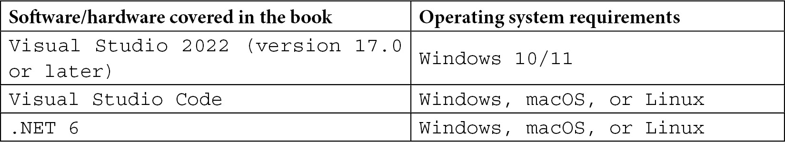

# 前言

并行编程和并发在现代软件开发中变得非常普遍。在本书中，您将学习如何在构建下一个应用程序时利用 .NET 6 中的最新异步、并行和并发功能。我们将探讨多线程 C# 开发模式和最佳实践的强大之处。通过通过简洁的实际示例探索 .NET 中线程的优点和挑战，为您的项目选择正确的选项将变得习以为常。

在向新的或现有的 .NET 应用程序引入多线程时，您有许多选择。本书的目标不仅是教会您如何使用 C# 和 .NET 中的并行编程和并发，还帮助您了解在特定场景下应选择哪种结构。无论您是为桌面、移动、网页还是云应用开发，性能和响应性都是应用程序成功的关键。本书将帮助所有类型的 C# 开发者将他们的应用程序扩展到用户的需求，并避免在多线程开发中经常遇到的陷阱。

# 本书面向对象

本书面向希望在使用 .NET 构建应用程序时采用最新并行和并发特性的初学者到中级水平的 .NET 开发者。您应该对 C# 语言有扎实的理解，并熟悉 .NET Framework 或 .NET Core 的某个版本。

# 本书涵盖内容

*第一章*，*托管线程概念*，涵盖了在 .NET 中使用托管线程的基础知识。我们将讨论如何创建和销毁线程、处理异常、同步数据和 .NET 提供用于处理后台操作的对象。您将获得在 .NET 应用程序中管理线程的基本理解。本章中的实际示例将说明如何在 C# 项目中使用托管线程。

*第二章*，*.NET 中多线程编程的演变*，介绍了将在后续章节中更深入探讨的一些概念和功能，包括 async/await、并发集合和并行性。您将了解在选择如何处理应用程序中的并发时，它们的选项是如何扩展的。

*第三章*，*托管线程的最佳实践*，涵盖了在整合托管线程概念时的一些最佳实践。我们将涵盖静态数据、死锁和耗尽托管资源等重要概念。这些都是可能导致应用程序不稳定和意外行为的问题。您将获得避免这些陷阱的实际建议。

*第四章*，*使用线程池提高用户界面响应性*，解释了如何在 .NET 中使用线程池。本章中的实际示例将为您提供确保 .NET 应用程序中 UI 响应性的宝贵选项。

*第五章*, *使用 C# 进行异步编程*，解释了 C# 中的异步编程，并探讨了在 .NET 中最佳使用任务的方法。

*第六章*, *并行编程概念*，深入探讨了**任务并行库** (**TPL**) 和任务概念。

*第七章*, *任务并行库 (TPL) 和数据流*，介绍了 TPL 数据流库，并通过深入示例说明了其使用的常见模式。

*第八章*, *并行数据结构和并行 LINQ (PLINQ)*，探讨了 .NET 的一些有用功能，包括**并行 LINQ** (**PLINQ**)。通过一些 C# 中 PLINQ 的实际示例来跟随。

*第九章*, *在 .NET 中使用并发集合*，深入探讨了有助于在代码中使用并发和并行时提供数据完整性的某些并发集合。

*第十章*, *使用 Visual Studio 调试多线程应用程序*，教您如何利用 Visual Studio 的功能调试多线程 .NET 应用程序。本章将通过具体示例详细探讨这些工具。

*第十一章*, *取消异步工作*，深入探讨了使用 .NET 取消并发和并行工作的不同方法。您将深入了解如何安全地取消异步工作。

*第十二章*, *单元测试异步、并发和并行代码*，提供了一些具体的建议和现实世界的示例，说明开发者如何对使用多线程结构的代码进行单元测试。这些示例将说明单元测试如何在覆盖执行多线程操作代码的同时仍然可靠。 

# 要充分利用本书

要跟随本书中的示例，建议 Windows 开发者使用以下软件：

+   Visual Studio 2022 版本 17.0 或更高版本

+   .NET 6

虽然推荐使用这些工具，但如果您已安装 .NET 6 SDK，则可以使用您首选的编辑器处理大多数示例。例如，macOS 10.13 或更高版本的 Visual Studio 2022 for Mac、JetBrains Rider 或 Visual Studio Code 都可以正常工作。然而，对于任何 WPF 或 WinForms 项目，都需要 Visual Studio 和 Windows。当 Visual Studio 和 .NET 的新版本发布时，也应与本书中的示例兼容。

预期您对 C# 和 .NET 有基础的了解，并具备对**语言集成查询** (**LINQ**) 的实际操作知识。



最新的 Visual Studio 2022 安装说明和先决条件始终可以在 Microsoft Docs 上找到：[`docs.microsoft.com/visualstudio/install/install-visual-studio?view=vs-2022`](https://docs.microsoft.com/visualstudio/install/install-visual-studio?view=vs-2022)。

**如果您正在使用本书的数字版，我们建议您亲自输入代码或从书的 GitHub 仓库（下一节中有一个链接）获取代码。这样做将帮助您避免与代码复制和粘贴相关的任何潜在错误。**

如果您不熟悉 LINQ，Microsoft Docs 上有一个很好的 C#参考，可以帮助您在学习本书中的示例之前开始：[`docs.microsoft.com/dotnet/csharp/programming-guide/concepts/linq/`](https://docs.microsoft.com/dotnet/csharp/programming-guide/concepts/linq/)。

在阅读本书之后，我还建议探索.NET 并行编程团队博客上的帖子。大多数文章都有几年历史，但它们探讨了在构建暴露并行编程结构的.NET 库时所做的许多决策背后的思考：[`devblogs.microsoft.com/pfxteam/`](https://devblogs.microsoft.com/pfxteam/)。

# 下载示例代码文件

您可以从 GitHub 下载本书的示例代码文件：[`github.com/PacktPublishing/Parallel-Programming-and-Concurrency-with-C-sharp-10-and-.NET-6`](https://github.com/PacktPublishing/Parallel-Programming-and-Concurrency-with-C-sharp-10-and-.NET-6)。如果代码有更新，它将在 GitHub 仓库中更新。

我们还提供了来自我们丰富的图书和视频目录中的其他代码包，可在 GitHub 上找到：[`github.com/PacktPublishing/`](https://github.com/PacktPublishing/)。查看它们吧！

# 下载颜色图像

我们还提供了包含本书中使用的截图和图表的颜色图像的 PDF 文件。您可以从这里下载：[`packt.link/Z4GcQ`](https://packt.link/Z4GcQ)。

# 使用的约定

本书使用了多种文本约定。

`文本中的代码`: 表示文本中的代码单词、数据库表名、文件夹名、文件名、文件扩展名、路径名、虚拟 URL、用户输入和 Twitter 昵称。以下是一个示例：“通过调用`ThreadPool.SetMaxThreads`，你可以更改`workerThreads`和`completionPortThreads`的最大值。”

代码块设置如下：

```cs
public async Task PerformCalculations()
```

```cs
{
```

```cs
    _runningTotal = 3;
```

```cs
    await MultiplyValue().ContinueWith(async (Task) => {
```

```cs
        await AddValue();
```

```cs
        });
```

```cs
    Console.WriteLine($”Running total is {_runningTotal}”);
```

```cs
}
```

当我们希望您注意代码块中的特定部分时，相关的行或项目将以粗体显示：

```cs
    private async Task MultiplyValue()
```

```cs
    {
```

```cs
        await Task.Delay(100);
```

```cs
        var currentTotal = Interlocked.Read(ref 
```

```cs
            _runningTotal);
```

```cs
        Interlocked.Exchange(ref _runningTotal, 
```

```cs
            currentTotal * 10);
```

```cs
    }
```

```cs
}
```

任何命令行输入或输出都应如下编写：

```cs
$ mkdir css
$ cd css
```

**粗体**: 表示新术语、重要单词或屏幕上看到的单词。例如，菜单或对话框中的单词以**粗体**显示。以下是一个示例：“让我们看看如何在我们的**CancellationPatterns**项目中实现这个的快速示例。”

小贴士或重要注意事项

看起来是这样的。

# 联系我们

我们始终欢迎读者的反馈。

**一般反馈**：如果您对本书的任何方面有疑问，请通过电子邮件发送至 customercare@packtpub.com，并在邮件主题中提及书名。

**勘误**：尽管我们已经尽最大努力确保内容的准确性，但错误仍然可能发生。如果您在这本书中发现了错误，我们将非常感激您能向我们报告。请访问[www.packtpub.com/support/errata](http://www.packtpub.com/support/errata)并填写表格。

**盗版**：如果您在互联网上发现我们作品的任何非法副本，我们将非常感激您能提供位置地址或网站名称。请通过 copyright@packt.com 与我们联系，并提供材料的链接。

**如果您有兴趣成为作者**：如果您在某个领域有专业知识，并且您有兴趣撰写或为书籍做出贡献，请访问[authors.packtpub.com](http://authors.packtpub.com)。

# 分享您的想法

一旦您阅读了《使用 C# 10 和 .NET 6 进行并行编程和并发》，我们很乐意听到您的想法！请[点击此处直接访问此书的亚马逊评论页面](https://packt.link/r/1803243678)并分享您的反馈。

您的评论对我们和科技社区都非常重要，并将帮助我们确保我们提供高质量的内容。
