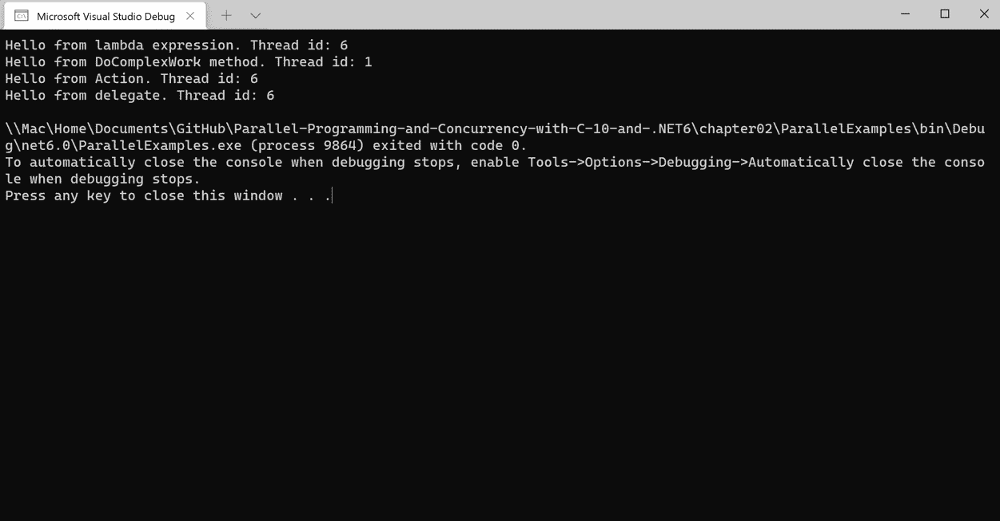
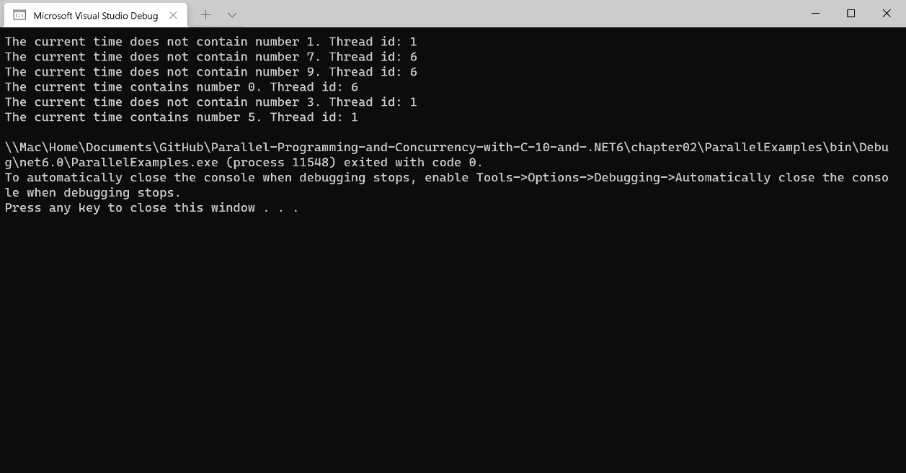
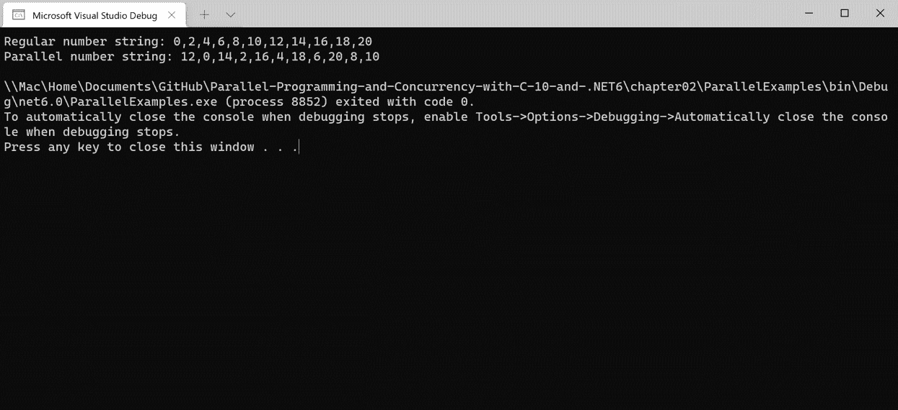
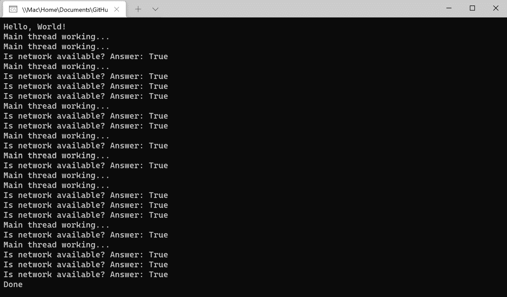

# *第二章*：.NET 中多线程编程的演变

随着 .NET 和 C# 在过去 20 年中的发展，引入了新的和创新的多线程编程方法。C# 添加了新的语言功能来支持异步编程，而 .NET Framework 和 .NET Core 添加了新的类型来支持这些语言。最具影响力的改进是在 C# 5 和 .NET Framework 4.0 中引入的，当时微软添加了 `async` 和 `await` 关键字。

本章将介绍将在后续章节中更深入探讨的概念和功能。这些概念包括 .NET 的 `async` 和 `await`、并发集合和并行。我们将从探讨何时以及为什么在 .NET 和 C# 中添加了线程功能开始。然后，我们将创建一些实际示例来展示如何使用这些新概念。最后，我们将通过讨论在您的项目中何时使用这些新功能是有意义的来结束本章。选择最适合每个实际场景的最佳工具非常重要。

在本章中，您将了解以下内容：

+   .NET 年份的线程

+   超越线程基础

+   并行简介

+   并发简介

+   `async` 和 `await` 的基础知识

+   选择正确的道路

到本章结束时，您将了解在选择如何处理 .NET 应用程序中的并发时，您的选项是如何扩大的。

# 技术要求

要跟随本章中的示例，建议 Windows 用户使用以下软件：

+   Visual Studio 2022 版本 17.0 或更高版本。

+   .NET 6.

+   要使用 WorkingWithTimers 项目，您需要安装 Visual Studio 的 **.NET 桌面开发**工作负载。

虽然这些是推荐使用的，但如果您已安装 .NET 6，您可以使用您喜欢的编辑器。例如，macOS 10.13 或更高版本的 Visual Studio 2022 for Mac、JetBrains Rider 或 Visual Studio Code 都可以正常工作。

本章的所有代码示例都可以在 GitHub 上找到：https://github.com/PacktPublishing/Parallel-Programming-and-Concurrency-with-C-sharp-10-and-.NET-6/tree/main/chapter02。

让我们从 .NET 和 C# 的历史课开始本章。

# .NET 年份的线程

自从 2002 年引入 .NET Framework 1.0 和 C# 1.0 以来，在 .NET 和 C# 中处理线程的工作已经经历了许多演变。在*第一章*中讨论的大部分关于 `System.Threading.Thread` 对象的概念，自那些 .NET 的早期日子起就已经可用。虽然 `Thread` 对象在 .NET 6 中仍然可用，并且对于简单场景可能很有用，但今天有更多优雅和现代的解决方案。

本节将突出显示最具影响力的并行和并发功能何时被添加。我们将首先跳过 8 年，来到 2010 年。

## C# 4 和 .NET Framework 4.0

2010 年，微软发布了 Visual Studio 2010，与 C# 4 和.NET Framework 4.0 一同发布。虽然一些早期的语言和框架特性，如**泛型**、**lambda 表达式**和**匿名方法**有助于促进后来的线程功能，但这些 2010 年的发布自 2002 年以来对线程功能来说是最重要的。.NET Framework 包括了以下特性，将在后续章节中更详细地探讨：

+   `System.Collections.Concurrent` 命名空间提供对多线程代码中数据集合的安全访问。

+   `Parallel.For` 和 `Parallel.ForEach` 以及使用 `Parallel.Invoke` 来调用并行操作。

+   `AsParallel`, `WithCancellation`, 和 `WithDegreeOfParallelism`。

我们将在“并发简介”和“并行简介”部分介绍这些特性。接下来，我们将学习两年后包含在.NET 和 C#中的重要线程功能。

## C# 5 和 6 以及 .NET Framework 4.5.x

2012 年，微软发布了可能是使用.NET 进行现代多线程编程最重要的特性：使用`async`和`await`进行异步编程。`async`和`await`关键字在 C# 5 中添加，当时.NET Framework 4.5 添加了 TPL。TPL 的核心是位于新`System.Threading.Tasks`命名空间中的`Task`类。

`Task`对象从异步操作返回，为开发者提供了检查操作状态或等待其完成的方式。异步任务的工作是在线程池的后台线程上执行的，而不是在主线程上。我们将在“线程基础之外”部分了解更多关于线程池的内容。本章的“async 和 await 基础”部分和第五章将更深入地讨论 TPL 的基本知识。第五章。

在接下来的几年中，添加了一些与异步编程相关的工具和语言特性。2013 年，发布了.NET Framework 4.5.1。这个版本对应于 Visual Studio 2013 的发布，它为异常处理程序的`catch`和`finally`块添加了异步调试功能。

下一个特性是在 2017 年随着微软从.NET Framework 持续转向.NET Core 而出现的。

## C# 7.x 和 .NET Core 2.0

.NET 团队发布的.NET Core 的第二大版本包括了新的`ValueTask`和`ValueTask<TResult>`类型。`ValueTask`类型是一个结构，它封装了一个`Task`或一个`IValueTaskSource`实例，并包含了一些额外的字段。它仅在 C# 7.0 或更高版本中使用时可用。添加`ValueTask`类型是因为在实践中，许多异步操作是同步完成的，但仍然需要分配一个`Task`实例来返回给调用者。在这些情况下，可以通过用`ValueTask`替换`Task`来提高性能，因为`ValueTask`在同步完成其工作时不会产生任何分配。要了解更多关于引入`ValueTask`背后的动机以及何时使用它，你可以阅读.NET 团队 Stephen Toub 的以下博客文章：https://devblogs.microsoft.com/dotnet/understanding-the-whys-whats-and-whens-of-valuetask/。

注意

如果你不太熟悉 Stephen Toub，他是微软的合作伙伴软件工程师，并在.NET 团队担任开发者。他在.NET 团队的工作对于将`async`、`await`和 TPL 带给.NET 开发者社区至关重要。你可以在.NET 并行编程博客上阅读他的其他文章：https://devblogs.microsoft.com/pfxteam/author/toub/。

C# 7.0 还引入了`_`)来替换一个故意未使用的变量。一个由异步调用返回的`Task`实例。通过在这种情况下使用丢弃，向编译器明确表示你想要忽略返回的`Task`实例。丢弃也可以在其他场景中用作变量的占位符。使用丢弃可以使你的代码意图更清晰，在某些情况下，还可以减少内存分配。你可以在 Microsoft Docs 网站上了解更多关于它们的使用方法：https://docs.microsoft.com/dotnet/csharp/fundamentals/functional/discards。

2017 年后期，发布了 C# 7.1 版本，为异步编程添加了一个值得注意的功能：可以将类的`Main`方法声明为异步。这使得从`Main`方法中直接等待其他异步方法成为可能。

下一个值得注意的异步功能是在 2019 年随着 C# 8 的发布一同出现的。

## C# 8 和.NET Core 3.0

当 2019 年发布了 C# 8 和.NET Core 3.0 时，添加了几个语言和.NET 功能来支持新的`IAsyncEnumerable`类型，以提供异步数据的流式源。

让我们检查一个使用`IAsyncEnumerable`的代码片段：

```cs
public async IAsyncEnumerable<Order> 
```

```cs
    GetLargeOrdersForCustomerAsync(int custId)
```

```cs
{
```

```cs
    await foreach (var order in 
```

```cs
        GetOrdersByCustomerAsync(custId))
```

```cs
    {
```

```cs
        if (order.Items.Count > 10) yield return order;
```

```cs
    }
```

```cs
}
```

在这个示例中，使用了新的`await foreach`语言特性来调用一个异步方法以获取客户的全部订单。然后，它使用`yield return`操作，通过`IAsyncEnumerable`类型在处理过程中返回每个包含超过 10 个项目的`order`对象。我们将在*第五章*中介绍更多使用`IAsyncEnumerable`的实际场景。

C# 8 中添加的另一个异步功能是 `System.IAsyncDisposable` 接口。当实现 `IAsyncDisposable` 时，你的类必须实现一个无参数的 `DisposeAsync` 方法。如果你的类消耗实现了 `IAsyncDisposable` 的托管资源，并且它们不能与 `async using` 块一起在线释放，你应该实现 `IAsyncDisposable` 并在受保护的 `DisposeAsyncCore` 方法中清理这些资源。有关同时使用 `IDisposable` 和 `IAsyncDisposable` 的综合示例，你可以查看 Microsoft Docs 上的示例，链接为 https://docs.microsoft.com/dotnet/standard/garbage-collection/implementing-disposeasync#implement-both-dispose-and-async-dispose-patterns。

这带我们来到了 C# 和 .NET 的最新版本。让我们回顾一下在 2021 年的这些版本中，异步开发人员有哪些新功能。

## C# 10 和 .NET 6

.NET 6 与 C# 10 一起在 2021 年 11 月发布。.NET 6 中的新功能之一是 `System.Text.Json` 能够序列化和反序列化 `IAsyncEnumerable` 类型。在 .NET 6 之前，序列化的 `IAsyncEnumerable` 类型将包含一个空的 JSON 对象。这在 .NET 6 中被视为一个破坏性变更，但这是一个改进。变更背后的主要动机是支持 ASP.NET Core MVC 控制器方法中的 `IAsyncEnumerable<T>` 响应。

对于异步开发人员来说，.NET 6 的另一个值得注意的功能是 Visual Studio 2021 中的 C# 项目模板得到了现代化，以利用包括 C# 7.1 及以后的 `async Main` 方法在内的几个最近的语言功能。当 .NET 6 发布候选版 2 在 2021 年 10 月发布时，.NET 团队在其博客上发布了关于这些更新模板的信息：https://devblogs.microsoft.com/dotnet/announcing-net-6-release-candidate-2/#net-sdk-c-project-templates-modernized。

这应该能让你了解每个重要的线程功能是在 C# 和 .NET 中何时添加的，并为本章即将到来的部分设定了舞台，我们将介绍并行编程和并发的一些基础知识。让我们从查看线程的一些更多功能开始，首先是 .NET 线程池。

# 超越线程基础

在我们介绍使用 .NET 和 C# 的并行编程、并发和异步编程之前，我们还有一些线程概念需要覆盖。其中最重要的是 .NET 管理线程池，它被用于在 C# 中异步执行的等待方法调用。

## 管理线程池

`System.Threading`命名空间中的`ThreadPool`类自.NET 开始以来就是其中的一部分。它为开发者提供了一个工作线程池，他们可以利用它来在后台执行任务。实际上，这是线程池线程的一个关键特性。它们是运行在默认优先级的后台线程。当这些线程中的任何一个完成任务时，它将被返回到可用的线程池以等待其下一个任务。您可以将尽可能多的任务排队到线程池中，但活动线程的数量受操作系统根据处理器能力和其他运行进程分配给您的应用程序的数量限制。

如果您要在.NET 6 应用程序中使用`ThreadPool`类，您通常会通过 TPL（Task Parallel Library）来这样做，但让我们探索如何直接使用`ThreadPool.QueueUserWorkItem`。以下代码采用了*第一章*的示例场景，但使用`ThreadPool`线程来执行后台过程：

```cs
Console.WriteLine("Hello, World!");
```

```cs
ThreadPool.QueueUserWorkItem((o) =>
```

```cs
{
```

```cs
    for (int i = 0; i < 20; i++)
```

```cs
    {
```

```cs
        bool isNetworkUp = System.Net.NetworkInformation.
```

```cs
            NetworkInterface.GetIsNetworkAvailable();
```

```cs
        Console.WriteLine($"Is network available? Answer: 
```

```cs
            {isNetworkUp}");
```

```cs
        Thread.Sleep(100);
```

```cs
    }
```

```cs
});
```

```cs
for (int i = 0; i < 10; i++)
```

```cs
{
```

```cs
    Console.WriteLine("Main thread working...");
```

```cs
    Task.Delay(500);
```

```cs
}
```

```cs
Console.WriteLine("Done");
```

```cs
Console.ReadKey();
```

在这里，关键的区别是无需将`IsBackground`设置为`true`，并且您不需要调用`Start()`。进程将在项目被排队到`ThreadPool`上时或当下一个`ThreadPool`可用时启动。虽然您可能不会经常在代码中显式使用`ThreadPool`，但它被.NET 中许多常见的线程功能所利用。因此，了解它是如何工作的是很重要的。

在.NET 中，使用`ThreadPool`的常见功能之一是计时器。

## 线程和计时器

在本节中，我们将检查两个使用`ThreadPool`的计时器类，即`System.Timers.Timer`和`System.Threading.Timer`。这两种类型都适用于托管线程，并且可在.NET 6 支持的每个平台上使用。

注意

一些额外的计时器仅适用于 Web 或 Windows 平台开发。本节将专注于平台无关的计时器。要了解更多关于其他计时器的信息，您可以参考 Microsoft Docs 网站上的文档：https://docs.microsoft.com/dotnet/standard/threading/timers。

### System.Timers.Timer

您可能最熟悉`System.Timers`命名空间中的`Timer`对象。此计时器将在`Interval`属性指定的间隔内在线程池线程上触发一个`Elapsed`事件。可以通过使用布尔`Enabled`属性来停止或启动该机制。如果您需要`Elapsed`事件仅触发一次，可以将`AutoReset`属性设置为`false`。

注意

要跟随本例中的代码，请从本章 GitHub 仓库的**WorkingWithTimers**项目中下载代码：https://github.com/PacktPublishing/Parallel-Programming-and-Concurrency-with-C-sharp-10-and-.NET-6/tree/main/chapter02。

此示例使用`Timer`对象来检查新消息，并在找到任何消息时提醒用户：

1.  首先，声明一个 `Timer` 对象，并在 `InitializeTimer` 方法中设置它：

    ```cs
    private System.Timers.Timer? _timer;
    private void InitializeTimer()
    {
        _timer = new System.Timers.Timer
        {
            Interval = 1000
        };
        _timer.Elapsed += _timer_Elapsed;
    }
    ```

1.  接下来，创建 `_timer_Elapsed` 事件处理程序以检查消息并更新用户：

    ```cs
    private void _timer_Elapsed(object? sender, 
        System.Timers.ElapsedEventArgs e)
    {
        int messageCount = CheckForNewMessageCount();
        if (messageCount > 0)
        {
            AlertUser(messageCount);
        }
    }
    ```

1.  在将 `_timer` 对象的 `Enabled` 属性设置为 `true` 之后，`Elapsed` 事件将每秒触发一次。在 `TimerSample` 类的 `StartTimer()` 和 `StopTimer()` 方法中：

    ```cs
    public void StartTimer()
    {
        if (_timer == null)
        {
            InitializeTimer();
        }
        if (_timer != null && !_timer.Enabled)
        {
            _timer.Enabled = true;
        }
    }
    public void StopTimer()
    {
        if (_timer != null && _timer.Enabled)
        {
            _timer.Enabled = false;
        }
    }
    ```

1.  运行 **WorkingWithTimers** 项目，并尝试使用 **启动定时器** 和 **停止定时器** 按钮。

当定时器启用时，您应该在 Visual Studio 的调试 **输出** 窗口中每秒看到消息。

注意

请记住，定时器事件是在线程池线程上触发的。在这些方法中执行的代码可能无法更新 UI。这些定时器示例是 `InvokeRequired` 在表单或用户控件上的一部分，如果需要，然后使用 `Invoke` 方法更新 UI。有关如何更新 WinForms UI 的更多信息，可以在 Microsoft Docs 网站上找到，网址为 https://docs.microsoft.com/dotnet/desktop/winforms/controls/how-to-make-thread-safe-calls。

在您自己的应用程序中，您将使用 `AlertUser` 方法向用户显示警报消息或在 UI 中更新通知图标。接下来，让我们尝试使用 `System.Threading.Timer` 类。

### System.Threading.Timer

现在，我们将使用 `System.Threading.Timer` 类创建相同的示例。这个 `Timer` 类的初始化方式略有不同：

注意

要跟随本例中的代码，请从本章 GitHub 存储库的 **WorkingWithTimers** 项目中下载代码：https://github.com/PacktPublishing/Parallel-Programming-and-Concurrency-with-C-sharp-10-and-.NET-6/tree/main/chapter02。

1.  首先，创建一个新的 `InitializeTimer` 方法：

    ```cs
    private void InitializeTimer()
    {
        var updater = new MessageUpdater();
        _timer = new System.Threading.Timer(
        callback: new TimerCallback(TimerFired),
        state: updater,
        dueTime: 500,
        period: 1000);
    }
    ```

`Timer` 类的构造函数接受四个参数。`callback` 参数是在定时器周期结束时在线程池上调用的委托。`state` 参数是要传递给回调委托的对象。`dueTime` 参数告诉定时器在第一次触发定时器之前要等待多长时间（以毫秒为单位）。最后，`period` 参数指定每个委托调用之间的间隔（以毫秒为单位）。

1.  实例化定时器后，它将立即开始。没有 `Enabled` 属性来启动或停止这个定时器。当您完成使用后，您应该使用 `Dispose` 方法或 `DisposeAsync` 方法来释放它。这发生在我们的 `DisposeTimerAsync` 方法中：

    ```cs
    public void StartTimer()
    {
        if (_timer == null)
        {
            InitializeTimer();
        }
    }
    public async Task DisposeTimerAsync()
    {
        if (_timer != null)
        {
            await _timer.DisposeAsync();
        }
    }
    ```

1.  `MessageUpdater` 是一个用作 `TimerCallback` 方法提供的 `state` 对象的类。它有一个处理消息计数更新的单方法。通过这个类可以封装更新用户关于新消息的逻辑。在我们的例子中，它将简单地更新调试输出中的新消息数量：

    ```cs
    internal class MessageUpdater
    {
        internal void Update(int messageCount)
        {
            Debug.WriteLine($"You have {messageCount} new 
                messages!");
        }
    }
    ```

1.  需要检查的最后一部分是 `TimerFired` 回调方法：

    ```cs
    private void TimerFired(object? state)
    {
        int messageCount = CheckForNewMessageCount();
        if (messageCount > 0 &&
            state is MessageUpdater updater)
        {
            updater.Update(messageCount);
        }
    }
    ```

与前一个示例中的 `_timer_Elapsed` 方法类似，这个方法只是简单地检查是否有新消息，并触发更新。然而，这次更新是由 `MessageUpdater` 类执行的，在你的应用程序中，这个类可以通过 `IMessageUpdater` 接口进行抽象，并注入到这个类中，以实现关注点的分离和测试性的提高。

1.  通过在应用程序中使用 **启动线程计时器** 和 **停止线程计时器** 按钮尝试这个示例。你应该会在 **输出** 窗口中看到带有新消息计数的调试消息出现，就像在前一个示例中做的那样。

这两个计时器服务于类似的目的；然而，大多数情况下，你将想要使用 `System.Threading.Timer` 来利用其异步特性。但是，如果你需要频繁地停止和启动计时器进程，`System.Timers.Timer` 类是一个更好的选择。

现在我们已经介绍了一些额外的托管线程概念来使你的知识水平一致，现在是时候转换方向，引入使用 C# 进行并行编程的概念。

# 并行简介

在探索 C# 和 .NET 中线程的历史时，我们了解到并行是在 .NET Framework 4.0 中引入给开发者的。在本节中，将通过 `System.Threading.Tasks.Parallel` 类通过 TPL 揭示将要探讨的方面。此外，我们还将通过示例介绍 PLINQ 的基础知识。这些数据并行概念将在 *第六章*、*第七章* 和 *第八章* 中以更详细的方式，通过实际案例进行讲解。

从高层次来看，并行是同时执行多个任务的概念。这些任务可能相互关联，但这不是必需的。实际上，并行运行的相关任务更有可能遇到同步问题或相互阻塞。例如，如果你的应用程序从订单服务加载订单数据，并从 **Azure blob store** 加载用户偏好和应用程序状态，这两个进程可以并行运行，无需担心冲突或数据同步。另一方面，如果应用程序从两个不同的订单服务加载订单数据，并在单个集合中合并结果，你需要一个同步策略。

这种场景将在 *第九章* 中进行更深入的讨论。在本节中，我们将通过学习 `Parallel` 类的一些用法来为这些高级场景做准备。让我们从 `Parallel.Invoke` 开始。

## 使用 Parallel.Invoke

`Parallel.Invoke` 是一个可以执行多个操作的方法，并且它们可以并行执行。它们执行顺序没有保证。每个操作将被排队到线程池中。当所有操作都完成后，`Invoke` 调用将返回。

在这个例子中，`Parallel.Invoke`调用将执行四个操作：`ParallelInvokeExample`类中的另一个方法`DoComplexWork`、一个 lambda 表达式、一个内联声明的`Action`和一个委托。以下是完整的`ParallelInvokeExample`类：

```cs
internal class ParallelInvokeExample
```

```cs
{
```

```cs
    internal void DoWorkInParallel()
```

```cs
    {
```

```cs
        Parallel.Invoke(
```

```cs
            DoComplexWork,
```

```cs
            () => {
```

```cs
                Console.WriteLine($"Hello from lambda 
```

```cs
                expression. Thread id: 
```

```cs
                {Thread.CurrentThread.ManagedThreadId}");
```

```cs
            },
```

```cs
            new Action(() =>
```

```cs
            {
```

```cs
                Console.WriteLine($"Hello from Action. 
```

```cs
                Thread id: {Thread.CurrentThread
```

```cs
                .ManagedThreadId}");
```

```cs
            }),
```

```cs
            delegate ()
```

```cs
            {
```

```cs
                Console.WriteLine($"Hello from delegate. 
```

```cs
                Thread id: {Thread.CurrentThread
```

```cs
                .ManagedThreadId}");
```

```cs
            }
```

```cs
        );
```

```cs
    }
```

```cs
    private void DoComplexWork()
```

```cs
    {
```

```cs
        Console.WriteLine($"Hello from DoComplexWork 
```

```cs
        method. Thread id: {Thread.CurrentThread
```

```cs
       .ManagedThreadId}");
```

```cs
    }
```

```cs
}
```

创建`ParallelInvokeExample`的新实例并从控制台应用程序执行`DoWorkInParallel`将产生类似于以下内容的输出，尽管操作顺序可能不同：



图 2.1 – DoWorkInParallel 方法产生的输出

在下一节中，我们将学习如何实现`Parallel.ForEach`循环，并讨论你可能想要利用它的情况。

## 使用 Parallel.ForEach

`Parallel.ForEach` 可能是.NET 中`Parallel`类中使用最频繁的成员。这是因为，在许多情况下，你可以直接将标准`foreach`循环的主体用于`Parallel.ForEach`循环中。然而，在将任何并行性引入代码库时，你必须确保被调用的代码是线程安全的。如果`Parallel.ForEach`循环的主体修改了任何集合，你可能需要采用*第一章*中讨论的同步方法之一，或者使用.NET 的并发集合之一。我们将在*并发介绍*部分介绍并发集合。

作为使用`Parallel.ForEach`的示例，我们将创建一个接受数字列表的方法，并检查每个数字是否包含在当前时间的字符串表示中：

```cs
internal void ExecuteParallelForEach(IList<int> numbers)
```

```cs
{
```

```cs
    Parallel.ForEach(numbers, number =>
```

```cs
    {
```

```cs
        bool timeContainsNumber = DateTime.Now.
```

```cs
            ToLongTimeString().Contains(number.ToString());
```

```cs
        if (timeContainsNumber)
```

```cs
        {
```

```cs
            Console.WriteLine($"The current time contains 
```

```cs
            number {number}. Thread id: {Thread.
```

```cs
            CurrentThread.ManagedThreadId}");
```

```cs
        }
```

```cs
        else
```

```cs
        {
```

```cs
            Console.WriteLine($"The current time does not 
```

```cs
            contain number {number}. Thread id: 
```

```cs
            {Thread.CurrentThread.ManagedThreadId}");
```

```cs
        }
```

```cs
    });
```

```cs
}
```

下面是从控制台应用程序的`Main`方法调用`ExecuteParallelForEach`的代码：

```cs
var numbers = new List<int> { 1, 3, 5, 7, 9, 0 };
```

```cs
var foreachExample = new ParallelForEachExample();
```

```cs
foreachExample.ExecuteParallelForEach(numbers);
```

执行程序，并检查控制台输出。你应该能看到使用了多个线程来处理循环：



图 2.2 – Parallel.ForEach 循环的控制台输出

接下来，我们将通过介绍 PLINQ 来总结.NET 中的并行性这一章节。

## Parallel LINQ 基础

本节将探讨向你的代码中添加一些并行性的最简单方法之一。通过将`AsParallel`方法添加到你的 LINQ 查询中，你可以将其转换为 PLINQ 查询，`AsParallel`之后的操作在必要时将在线程池上执行。在决定何时使用 PLINQ 时需要考虑许多因素。我们将在*第八章*中深入讨论这些因素。对于这个示例，我们将介绍检查每个给定整数是否为偶数的`Where`子句。为了帮助说明 PLINQ 如何影响序列，还引入了`Task.Delay`。以下是完整的`ParallelLinqExample`类实现：

```cs
internal void ExecuteLinqQuery(IList<int> numbers)
```

```cs
{
```

```cs
    var evenNumbers = numbers.Where(n => n % 2 == 0);
```

```cs
    OutputNumbers(evenNumbers, "Regular");
```

```cs
}
```

```cs
internal void ExecuteParallelLinqQuery(IList<int> numbers)
```

```cs
{
```

```cs
    var evenNumbers = numbers.AsParallel().Where(n => 
```

```cs
        IsEven(n));
```

```cs
    OutputNumbers(evenNumbers, "Parallel");
```

```cs
}
```

```cs
private bool IsEven(int number)
```

```cs
{
```

```cs
    Task.Delay(100);
```

```cs
    return number % 2 == 0;
```

```cs
}
```

```cs
private void OutputNumbers(IEnumerable<int> numbers, string 
```

```cs
    loopType)
```

```cs
{
```

```cs
    var numberString = string.Join(",", numbers);
```

```cs
    Console.WriteLine($"{loopType} number string: 
```

```cs
        {numberString}");
```

```cs
}
```

在你的控制台应用程序的`Main`方法中，添加一些代码将整数列表传递给`ExecuteLinqQuery`和`ExecuteParallelLinqQuery`方法：

```cs
var linqNumbers = new List<int> { 0, 1, 2, 3, 4, 5, 6, 7, 
```

```cs
    8, 9, 10, 11, 12, 13, 14, 15, 16, 17, 18, 19, 20 };
```

```cs
var linqExample = new ParallelLinqExample();
```

```cs
linqExample.ExecuteLinqQuery(linqNumbers);
```

```cs
linqExample.ExecuteParallelLinqQuery(linqNumbers);
```

检查输出，你应该会看到 PLINQ 序列中数字的顺序已改变：



图 2.3 – LINQ 和 PLINQ 查询的控制台输出

我们将在本书的 *第二部分*，*使用 C# 进行并行编程和并发* 中，通过几章来探讨并行性的更多方面。让我们转换一下，学习一些 C# 中的并发模式。

# 并发简介

那么，什么是并发，它与 C# 和 .NET 中的并行性有何关系？这两个术语经常被互换使用，如果你仔细想想，它们确实有相似的含义。当多个线程并行执行时，它们是并发执行的。在这本书中，当我们讨论设计托管线程时应遵循的模式时，我们将使用并发这个术语。此外，我们还将讨论并发集合，这些集合是在 .NET Framework 4.0 中介绍给 .NET 开发者的。让我们先了解 `System.Collections.Concurrent` 命名空间中的并发集合。

.NET 有几个集合是内置线程安全的。这些集合都可以在 `System.Collections.Concurrent` 命名空间中找到。在本节中，我们将介绍五个集合。其余三个是 `Partitioner` 的变体。这些将在 *第九章* 中探讨，我们将通过实际示例与每种集合类型一起工作。

注意

虽然在使用并发集合时，你的代码不需要使用锁，但这些集合内部正在使用不同的同步技术。其中一些使用锁，而另一些则具有重试机制来处理竞争。要了解更多关于并发集合如何处理竞争的信息，请查看 Microsoft 在 .NET 并行编程博客上的这篇博客文章：https://devblogs.microsoft.com/pfxteam/faq-are-all-of-the-new-concurrent-collections-lock-free/.

我们将要介绍的第一个集合是 `ConcurrentBag<T>`。

## ConcurrentBag<T>

`ConcurrentBag<T>` 集合是一个并发集合，旨在存储一组无序对象。允许重复值，当 `T` 是可空类型时，也允许 `null` 值。它是一个出色的线程安全替代品，用于数组、`List<T>` 或其他不需要项目排序的 `IEnumerable<T>` 实例。

在内部，`ConcurrentBag<T>` 为每个添加项目的线程存储一个项目链表。当从集合中取出或查看项目时，将优先考虑由当前线程添加项目的内部列表。假设线程 1 添加了项目 A、B 和 C，线程 2 添加了项目 D、E、F 和 G。如果线程 1 调用 `TryPeek` 或 `TryTake` 四次，`ConcurrentBag<T>` 将首先从 A、B 和 C 列表中获取项目，然后再从包含线程 2 项目链表中获取项目。

以下列表详细说明了您在大多数实现中可能会使用的 `ConcurrentBag<T>` 的属性和方法：

+   `Add(T)`: 这会将一个对象添加到集合中。

+   `TryPeek(out T)`: 这尝试从集合中获取一个值，并通过 `out` 参数返回，但不移除该项。

+   `TryTake(out T)`: 这尝试通过 `out` 参数从集合中获取一个值并移除它。

+   `Clear()`: 这清除集合中的所有对象。

+   `Count`: 这返回集合中的对象数量。

+   `IsEmpty`: 这返回一个 `bool` 值，指示集合是否为空。

+   `ToArray()`: 这返回类型为 `T` 的对象数组。

`ConcurrentBag<T>` 集合有两个构造函数。一个构造函数不接受任何参数，只是简单地创建一个新的空集合。另一个接受一个要复制到新集合中的 `IEnumerable<T>` 类型的对象。

接下来，让我们快速看一下 `ConcurrentQueue<T>` 集合。

## ConcurrentQueue<T>

.NET 的 `ConcurrentQueue<T>` 集合在实现上与它的线程不安全版本 `Queue<T>` 类似。因此，当将线程管理引入现有代码库时，它是一个很好的 `Queue<T>` 替代品。`ConcurrentQueue<T>` 是一个强类型对象列表，它强制执行 **先进先出**（**FIFO**）逻辑，这是 **队列** 的定义。

注意

**FIFO** 逻辑在制造业和仓库管理软件中很常见。当处理易腐货物时，首先使用最老的原料是很重要的。因此，那些首先被放入仓库的货物托盘，在系统请求该类型的托盘时，应该首先被提取。

这些是 `ConcurrentQueue<T>` 类型常用的成员：

+   `Enqueue(T)`: 这将一个新的对象添加到队列中。

+   `TryPeek(out T)`: 这尝试获取队列前面的对象而不移除它。

+   `TryDequeue(out T)`: 这尝试获取队列前面的对象并移除它。

+   `Clear()`: 这清除队列。

+   `Count`: 这返回队列中的对象数量。

+   `IsEmpty`: 这返回一个 `bool` 值，指示队列是否为空。

+   `ToArray()`: 这将队列中的对象作为类型为 `T` 的数组返回。

与`ConcurrentBag<T>`集合类似，`ConcurrentQueue<T>`集合有两个构造函数：一个无参数的和一个接受`Ienumerable<T>`类型以填充新队列的构造函数。接下来，让我们介绍一个类似的集合：`ConcurrentStack<T>`。

## ConcurrentStack<T>

`ConcurrentStack<T>`可以被视为`ConcurrentQueue<T>`，但它使用`Push`方法而不是`Enqueue`，移除项目使用`TryPop`方法而不是`TryDequeue`。`ConcurrentStack<T>`集合的另一个优点是它可以在一个操作中添加或删除多个对象。这些范围操作通过使用`PushRange`和`TryPopRange`方法支持。范围操作接受`T`的数组作为参数。

在.NET 6 中，`ConcurrentStack<T>`和`ConcurrentQueue<T>`都实现了`IReadOnlyCollection<T>`接口。这意味着一旦集合被创建，它就是只读的，不能重新分配或设置为`null`。你只能添加或删除项目或使用`Clear()`来清空集合。

让我们继续介绍最强大的并发集合之一，`BlockingCollection<T>`。

## BlockingCollection<T>

`BlockingCollection<T>`是一个线程安全的对象集合，实现了包括`IProducerConsumerCollection<T>`在内的多个接口。`IProducerConsumerCollection<T>`接口提供了一组成员，旨在支持需要实现**生产者/消费者模式**的应用程序。

注意

生产者/消费者模式是一种并发设计模式，其中一组数据由一个或多个生产者线程并发提供。同时，有一个或多个消费者线程监控和获取正在生产的数据以并发消费和处理。`BlockingCollection<T>`集合是这种生产者/消费者模式中的数据存储。你可以在维基百科上了解更多关于生产者/消费者模式的信息，链接为 https://en.wikipedia.org/wiki/Producer%E2%80%93consumer_problem。

`BlockingCollection<T>`有多个方法和属性，有助于生产者/消费者工作流程。你可以通过调用`CompleteAdding`方法来指示生产者进程已完成向集合添加项目。一旦调用此方法，就不能再使用`Add`或`TryAdd`方法向集合添加更多项目。如果你计划在你的工作流程中使用`CompleteAdding`，最好始终使用`TryAdd`并在向集合添加对象时检查布尔结果。如果集合已被标记为添加完成，调用`Add`将抛出`InvalidOperationException`。此外，你可以检查`IsAddingCompleted`属性以确定`CompleteAdding`是否已被调用。

消费者进程通过`Take`或`TryTake`方法从`BlockingCollection<T>`中移除项目。再次强调，使用`TryTake`更安全，可以避免在集合为空时出现任何异常。如果已调用`CompleteAdding`并且所有对象都已从集合中移除，则`IsCompleted`属性将返回`true`。

我们将探讨一个真实的生产者/消费者实现，位于*第九章* *.NET*。现在，让我们继续本节最后一个并发集合，`ConcurrentDictionary<T>`。

## ConcurrentDictionary<TKey, TValue>

如你所猜，`ConcurrentDictionary<TKey, TValue>` 是在处理托管线程时 `Dictionary<TKey, TValue>` 的优秀替代品。这两个集合都实现了 `IDictionary<TKey, TValue>` 接口。此集合的并发版本增加了以下用于并发处理数据的方法：

+   `TryAdd`: 尝试将新的键/值对添加到字典中，并返回一个布尔值，指示对象是否成功添加到字典中。如果键已存在，则方法将返回 `false`。

+   `TryUpdate`: 此操作传递一个键以及项的现有值和新值。如果它存在于字典中且提供了现有值，则将现有项更新为新值。返回的布尔值指示对象是否在字典中成功更新。

+   `AddOrUpdate`: 此方法将根据键是否存在，在字典中添加或更新项，并使用更新委托来执行基于当前值和新值的任何逻辑。

+   `GetOrAdd`: 如果键不存在，此方法将添加项。如果它已存在，则返回现有值。

这些是 .NET 中最重要的和常见的并发集合，需要理解。我们将涵盖每个集合的一些示例，并在稍后学习 `System.Collections.Concurrent` 中的更多集合，但本节应该为理解接下来要学习的内容提供一个坚实的基础。

在下一节中，我们将介绍添加到 C# 5.0 的 C# `async` 和 `await` 关键字。

# async 和 await 的基础知识

当 TPL 在 .NET Framework 4.5 中引入时，C# 5.0 也添加了对基于任务的异步编程的语言支持，使用了 `async` 和 `await` 关键字。这立即成为在 C# 和 .NET 中实现异步工作流的首选方法。现在，10 年过去了，`async`/`await` 和 TPL 已经成为构建健壮、可扩展 .NET 应用程序不可或缺的一部分。你可能想知道为什么在应用程序中采用异步编程如此重要。

## 理解 async 关键字

编写异步代码有许多原因。如果你在 Web 服务器上编写服务器端代码，使用异步可以让服务器在代码等待长时间运行的操作时处理额外的请求。在客户端应用程序中，使用异步代码释放 UI 线程执行其他操作，可以让你的 UI 对用户保持响应。

在.NET 中采用异步编程的另一个重要原因是许多第三方和开源库都在使用`async`/`await`。即使是.NET 本身，在每次发布中也越来越多地暴露异步 API，尤其是涉及 IO 操作的部分：网络、文件和数据库访问。

让我们尝试用 C#编写你的第一个异步方法。

## 编写异步方法

创建和消费异步方法很容易。让我们用一个新控制台应用程序的简单示例来尝试：

1.  在 Visual Studio 中创建一个新的控制台应用程序，并将其命名为**AsyncConsoleExample**。

1.  向项目中添加一个名为`NetworkHelper`的类，并向该类添加以下方法：

    ```cs
    internal async Task CheckNetworkStatusAsync()
    {
        Task t = NetworkCheckInternalAsync();
        for (int i = 0; i < 8; i++)
        {
            Console.WriteLine("Top level method 
               working...");
            await Task.Delay(500);
        }
        await t;
    }
    private async Task NetworkCheckInternalAsync()
    {
        for (int i = 0; i < 10; i++)
        {
            bool isNetworkUp = System.Net.
               NetworkInformation.NetworkInterface
                   .GetIsNetworkAvailable();
            Console.WriteLine($"Is network available? 
                Answer: {isNetworkUp}");
            await Task.Delay(100);
        }
    }
    ```

在前面的代码中，有一些事情需要注意。两个方法都有一个`async`修饰符，表示它们将等待一些工作并异步运行。在方法内部，我们使用`await`关键字与`Task.Delay`的调用。这将确保在此点之后的代码不会执行，直到等待的方法完成。然而，在这段时间内，活动线程可以被释放以在其他地方执行其他工作。

最后，看看对`NetworkCheckInternalAsync`的调用。我们不是等待这个调用，而是将返回的`Task`实例捕获到一个名为`t`的变量中，并且不在`for`循环之后等待它。这意味着两个方法中的`for`循环将并发运行。如果我们等待`NetworkCheckInternalAsync`，它的`for`循环将在`CheckNetworkStatusAsync`中的`for`循环开始之前完成。

1.  接下来，用以下代码替换`Program.cs`中的代码：

    ```cs
    using AsyncConsoleExample;
    Console.WriteLine("Hello, async!");
    var networkHelper = new NetworkHelper();
    await networkHelper.CheckNetworkStatusAsync();
    Console.WriteLine("Main method complete.");
    Console.ReadKey();
    ```

我们正在等待`CheckNetworkStatusAsync`的调用。这是可能的，因为.NET 6 控制台应用程序中的默认`Main`方法是异步的。如果你在一个未标记为`async`的方法中尝试`await`某个东西，你将得到编译器错误。我们将在*第五章*中探讨当你必须从现有的非异步代码中调用异步方法时可以使用的一些选项。

1.  最后，运行应用程序并检查输出：



图 2.4 – 异步示例应用程序的控制台输出

如预期的那样，捕获异步方法的结果使得两个循环可以并发运行。尝试等待`NetworkCheckInternalAsync`的调用，看看输出如何变化。你应该会看到私有方法的所有输出都会在`CheckNetworkStatusAsync`中的`for`循环开始输出之前出现。

这是对 C#异步编程世界的简要介绍。我们将在本书的其余部分大量使用它。让我们通过讨论在构建新项目或增强现有应用程序时如何选择利用这些选项来结束讨论。

# 选择正确的路径

现在你已经接触了一些高级托管线程概念，并行编程、并发集合以及 async/await 模式，让我们讨论它们如何在现实世界中相互结合。在 .NET 中进行多线程开发时，选择正确的路径通常涉及多个这些概念。

当使用 .NET 6 时，你应该通常选择在项目中创建 `async` 方法。本章中讨论的原因很有说服力。异步编程保持了客户端和服务器应用程序的响应性，`async` 在 .NET 本身中被广泛使用。

当你的代码需要快速处理一组项目并且底层执行处理的代码是线程安全的时候，可以利用一些 `Parallel` 类操作。这是可以引入并发集合的一个地方。如果任何并行或异步操作正在操作共享数据，数据应该存储在 .NET 并发集合之一中。

如果你正在处理现有的代码，通常最谨慎的做法是限制添加的多线程代码量。像这样的遗留项目是逐步添加一些 `ThreadPool` 或 `Parallel` 操作并测试结果的好地方。对应用程序的功能和性能进行测试非常重要。关于托管线程的性能测试工具将在 *第十章* 中介绍。

这份初步指南将帮助你了解如何通过托管线程提高应用程序的性能。我们将在本书的其余部分继续构建你的学习和这些指南。让我们总结一下，并讨论本章你学到了什么。

# 概述

在本章中，我们首先回顾了 C#、.NET 和托管线程的简要历史。我们讨论了微软在过去 20 年中如何添加异步和并行编程的功能。接下来，我们游览了使用 .NET 的并行编程、并发集合以及使用 C# 的异步开发。最后，我们探讨了在哪些情况下你可能选择这些概念用于自己的应用程序，以及为什么你通常会选择多个概念。你将能够运用本章学到的知识，开始思考在日常工作中托管线程的实际应用。

在下一章中，我们将讨论到目前为止你所学的知识，并讨论一些概念在实际应用中的最佳实践。

# 问题

1.  在 .NET 中，哪个类管理着应用程序可用的线程池线程？

1.  `async` 和 `await` 关键字是在哪个版本的 C# 中引入的？

1.  TPL 是在哪个版本的 .NET 中引入的？

1.  `IAsyncEnumerable` 是在哪个版本的 .NET Core 中引入的？

1.  每个 `async` 方法应该返回什么类型？

1.  在多线程场景中，你会选择哪个并发集合来替换 `Dictionary<TKey, TValue>`？

1.  在.NET 中，哪种并发集合经常与生产者/消费者设计模式一起使用？

1.  .NET 中哪个并行特性包含`AsParallel`方法？
