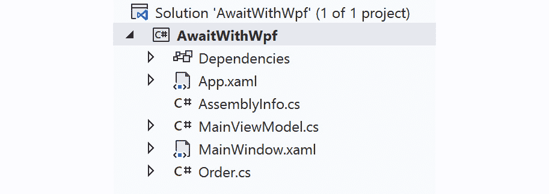
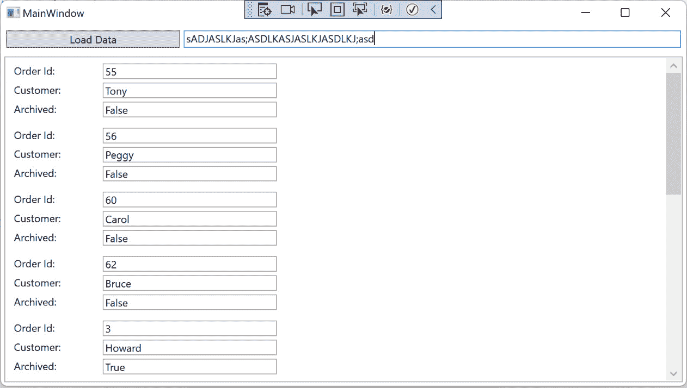
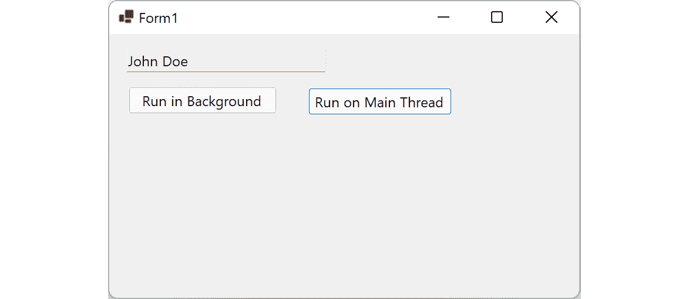

# 第四章：*第四章*：用户界面响应性和线程

将线程概念引入项目的主要原因之一是希望保持应用程序对用户输入的响应性。通过服务、数据库或文件系统访问数据可能会引入延迟，而 **用户界面**（**UI**） 应保持响应。本章中的实际示例将为确保 .NET 客户端应用程序中的 UI 响应性提供有价值的选项。

在本章中，我们将做以下事情：

+   利用后台线程

+   使用线程池

+   无异常更新 UI 线程

到本章结束时，您将了解如何利用并行性和并发性来保持客户端应用程序的响应性和性能。

# 技术要求

为了跟随本章中的示例，以下软件被推荐给 Windows 用户：

+   Visual Studio 2022 版本 17.0 或更高版本

+   .NET 6

虽然这些是推荐的，但如果您已安装 .NET 6，您可以使用您喜欢的编辑器。例如，macOS 10.13 或更高版本的 Visual Studio 2022 for Mac、JetBrains Rider 或 Visual Studio Code 都可以正常工作。

本章的所有代码示例都可以在 GitHub 上找到：[`github.com/PacktPublishing/Parallel-Programming-and-Concurrency-with-C-sharp-10-and-.NET-6/tree/main/chapter04`](https://github.com/PacktPublishing/Parallel-Programming-and-Concurrency-with-C-sharp-10-and-.NET-6/tree/main/chapter04)。

让我们从讨论如何使用后台线程执行非关键任务而不影响 UI 性能开始。

# 利用后台线程

在 *第一章* 中，我们学习了如何创建后台线程，并讨论了它们的一些用途。后台线程的优先级低于进程的主线程和其他线程池线程。此外，活跃的后台线程不会阻止用户或系统终止应用程序。

这意味着后台线程非常适合以下任务：

+   编写日志和数据分析

+   监控网络或文件系统资源

+   将数据读入应用程序

不要将后台线程用于以下关键应用程序操作：

+   保存应用程序状态

+   执行数据库事务

+   应用数据处理

当决定某些工作是否可以由后台线程处理时，一个好的规则是问自己，如果突然中断工作来关闭应用程序，是否会危及系统的数据完整性。那么，您如何知道您正在创建后台线程还是前台线程呢？

## 哪些线程是后台线程？

我们已经了解到，可以通过将 `IsBackground` 属性设置为 `true` 来显式创建一个后台线程。默认情况下，通过调用 `Thread` 构造函数创建的所有其他线程都是前台线程。应用程序的主要（或主）线程是一个前台线程。所有 `ThreadPool` 线程都是后台线程。这包括由 **Task Parallel Library** (**TPL**) 启动的所有异步操作。

因此，如果所有基于任务的操作，如 `async` 方法，都在后台线程上执行，你应该避免使用它们来保存重要的应用程序数据吗？.NET 允许在 `async` / `await` 操作进行中关闭你的应用程序吗？如果有前台线程正在等待一个 `async` 操作，应用程序将不会在操作完成之前终止。如果你不使用 `await`，或者你在线程池上启动操作时使用 `Task.Run`，应用程序在动作完成之前可能正常终止。

使用 `await` 与 `async` 方法一起使用的好处是，你在保持 UI 响应的同时获得了控制执行流程的灵活性。让我们讨论客户端应用程序中的 `async` 和 `await`，并创建一个 **Windows Presentation Foundation** (**WPF**) 应用程序的示例，该程序从多个来源加载数据。

## 使用 async、await、任务和 WhenAll

在你的代码中使用 `async` 和 `await` 是引入一些后台工作使用 `ThreadPool` 的最简单方法。异步方法必须用 `async` 关键字装饰，并将返回 `System.Threading.Tasks.Task` 类型而不是 `void` 返回类型。

注意

`Async` 方法返回 `Task`，因此调用方法可以等待该方法的返回结果。如果你创建一个返回类型为 `void` 的 `async` 方法，它将无法被等待，并且调用代码将在 `async` 方法完成之前继续处理后续代码。需要注意的是，只有事件处理程序应该声明为 `async` 并具有 `void` 返回类型。

如果方法返回 `string`，则 `async` 等效将返回 `Task<string>` 泛型类型。让我们看看每种情况的示例：

```cs
private async Task ProcessDataAsync()
```

```cs
{
```

```cs
    // Process data here
```

```cs
}
```

```cs
private async Task<string> GetStringDataAsync()
```

```cs
{
```

```cs
    string stringData;
```

```cs
    // Build string here
```

```cs
    ...
```

```cs
    return stringData;
```

```cs
}
```

当你调用一个 `async` 方法时，有两种常见的模式需要遵循。

+   首先，你可以等待调用并将返回类型设置为方法内部返回的类型变量：

    ```cs
    await ProcessDataAsync();
    string data = await GetStringDataAsync();
    ```

+   第二种选择是在调用方法时使用 `Task` 变量，稍后等待它们：

    ```cs
    Task dataTask = ProcessDataAsync();
    Task<string> stringDataTask = GetStringDataAsync();
    DoSomeOtherSynchronousWork();
    string data = await stringDataTask;
    await dataTask;
    ```

使用第二种方法，应用程序可以在两个 `async` 方法在后台线程上继续运行的同时执行一些同步工作。一旦同步工作完成，应用程序将等待这两个 `async` 方法。

让我们在一个更实际的示例项目中应用我们的 `async` 知识。在这个例子中，我们将创建一个新的 Windows 客户端应用程序，并使用 `async` 方法。我们将通过使用 `Task.Delay` 注入非阻塞延迟来模拟这些方法中的慢速服务调用以获取数据。每个方法将需要几秒钟才能返回其数据，但 UI 将保持对用户输入的响应：

1.  首先在 Visual Studio 中创建一个新的 WPF 项目。将项目命名为 `AwaitWithWpf`。

1.  向项目中添加两个新类，分别命名为 `Order` 和 `MainViewModel`。你的解决方案现在应该看起来像这样：



图 4.1 – Visual Studio 中的 AwaitWithWpf 解决方案

1.  接下来，打开 `Microsoft.Toolkit.Mvvm` 包中的 `MVVM Toolkit` 并将其添加到你的项目中：


图 4.2 – 将 Microsoft.Toolkit.Mvvm 包添加到项目中

我们将使用 `MainViewModel` 类。

注意

MVVM Toolkit 是一个开源的 MVVM 库，它是微软维护的 **Windows Community Toolkit** 的一部分。如果你不熟悉 MVVM 模式或 MVVM Toolkit，你可以在 Microsoft Docs 上了解更多信息：[`docs.microsoft.com/windows/communitytoolkit/mvvm/introduction`](https://docs.microsoft.com/windows/communitytoolkit/mvvm/introduction)。

1.  现在，打开 `Order` 类并添加以下实现：

    ```cs
    public class Order
    {
        public int OrderId { get; set; }
        public string? CustomerName { get; set; }
        public bool IsArchived { get; set; }
    }
    ```

这将为每个订单提供一些属性，以便在 `MainWindow` 上填充订单列表时显示。

1.  现在，我们将开始构建 `MainViewModel` 的实现。第一步是添加一个要绑定到 UI 的订单列表和一个在我们要加载订单时执行的命令：

    ```cs
    public class MainViewModel : ObservableObject
    {
        private ObservableCollection<Order> _orders = 
            new();
        public MainViewModel()
        {
            LoadOrderDataCommand = new AsyncRelayCommand
                (LoadOrderDataAsync);
        }
        public ICommand LoadOrderDataCommand { get; set; }
        public ObservableCollection<Order> Orders
        {
            get { return _orders; }
            set
            {
                SetProperty(ref _orders, value);
            }
        }
        private async Task LoadOrderDataAsync()
        {
            // TODO – Add code to load orders
        }
    }
    ```

在进行下一步之前，让我们回顾一下 `MainViewModel` 类的一些属性：

+   `MainViewModel` 类继承自 MVVM Toolkit 提供的 `ObservableObject` 类型。

+   这个基类实现了 `INotifyPropertyChanged` 接口，该接口被 WPF 数据绑定用于在数据绑定属性值更改时通知 UI。

+   `Orders` 属性将通过 WPF 数据绑定将订单列表提供给 UI。在 `ObservableObject` 基类上调用 `SetProperty` 会设置 `_orders` 后备变量的值并触发属性更改通知。

+   `LoadOrderDataCommand` 属性将由 `MainWindow` 上的按钮执行。在构造函数中，该属性被初始化为一个新的 `AsyncRelayCommand`，当命令被 UI 调用时，它会调用 `LoadOrderDataAsync`。

1.  不要忘记将必要的 `using` 语句添加到类中：

    ```cs
    using Microsoft.Toolkit.Mvvm.ComponentModel;
    using Microsoft.Toolkit.Mvvm.Input;
    using System.Collections.Generic;
    using System.Collections.ObjectModel;
    using System.Threading.Tasks;
    using System.Windows.Input;
    ```

1.  接下来，让我们创建两个 `async` 方法来加载订单数据。一个将创建当前订单，另一个将创建已存档订单的列表。这些通过 `Order` 类上的 `IsArchived` 属性来区分。每个方法都使用 `Task.Delay` 来模拟在缓慢的互联网或网络连接上的服务调用：

    ```cs
    private async Task<List<Order>> GetCurrentOrders
        Async()
    {
        var orders = new List<Order>();
        await Task.Delay(4000);
        orders.Add(new Order { OrderId = 55, CustomerName 
            = "Tony", IsArchived = false });
        orders.Add(new Order { OrderId = 56, CustomerName 
            = "Peggy", IsArchived = false });
        orders.Add(new Order { OrderId = 60, CustomerName 
            = "Carol", IsArchived = false });
        orders.Add(new Order { OrderId = 62, CustomerName 
            = "Bruce", IsArchived = false });
        return orders;
    }
    private async Task<List<Order>> GetArchivedOrders
        Async()
    {
        var orders = new List<Order>();
        await Task.Delay(5000);
        orders.Add(new Order { OrderId = 3, CustomerName = 
            "Howard", IsArchived = true });
        orders.Add(new Order { OrderId = 18, CustomerName 
            = "Steve", IsArchived = true });
        orders.Add(new Order { OrderId = 19, CustomerName 
            = "Peter", IsArchived = true });
        orders.Add(new Order { OrderId = 21, CustomerName 
            = "Mary", IsArchived = true });
        orders.Add(new Order { OrderId = 25, CustomerName 
            = "Gwen", IsArchived = true });
        orders.Add(new Order { OrderId = 34, CustomerName 
            = "Harry", IsArchived = true });
        orders.Add(new Order { OrderId = 36, CustomerName 
            = "Bob", IsArchived = true });
        orders.Add(new Order { OrderId = 49, CustomerName 
            = "Bob", IsArchived = true });
        return orders;
    }
    ```

1.  现在，我们需要创建一个同步的 `ProcessOrders` 方法，将两个订单列表合并，并使用完整的数据集更新 `Orders` 属性：

    ```cs
    private void ProcessOrders(List<Order> currentOrders, 
        List<Order> archivedOrders)
    {
        List<Order> allOrders = new(currentOrders);
        allOrders.AddRange(archivedOrders);
        Orders = new ObservableCollection<Order>
            (allOrders);
    }
    ```

1.  构建 `MainViewModel` 类的最后一步是最重要的。将以下实现添加到 `LoadOrderDataAsync` 方法中：

    ```cs
    private async Task LoadOrderDataAsync()
    {
        Task<List<Order>> currentOrdersTask = 
            GetCurrentOrdersAsync();
        Task<List<Order>> archivedOrdersTask = 
            GetArchivedOrdersAsync();
        List<Order>[] results = await Task.WhenAll(new 
            Task<List<Order>>[] {
            currentOrdersTask, archivedOrdersTask
        }).ConfigureAwait(false);
        ProcessOrders(results[0], results[1]);
    }
    ```

此方法调用 `GetCurrentOrdersAsync` 和 `GetArchivedOrdersAsync`，并将每个调用捕获在一个 `Task<List<Order>>` 变量中。你可以简单地等待每个调用并将返回的订单存储在 `List<Order>` 变量中。然而，这意味着第二个方法将不会在第一个方法完成之前开始执行。通过等待 `Task.WhenAll`，方法可以在后台线程上并行执行。

如果你的方法都返回相同的数据类型，你可以在返回类型的数组中捕获 `Task.WhenAll` 的结果。在我们的例子中，我们正在接收一个 `List<Order>` 的数组，并将其传递给 `ProcessOrders`。

1.  现在，让我们转到 `MainWindow.xaml.cs` 的代码隐藏文件。在调用 `InitializeComponent` 之后，在构造函数中添加以下代码来设置 `MainWindow` 的 `DataContext`：

    ```cs
    public MainWindow()
    {
        InitializeComponent();
        var vm = new MainViewModel();
        DataContext = vm;
    }
    ```

`DataContext` 是 `MainWindow` 的 XAML 中所有 `Binding` 引用的来源。我们将在下一步创建我们 UI 的 XAML。

1.  最后要更新的文件是 `MainWindow.xaml`。打开 XAML 文件，首先向 `Grid` 添加两行。第一行将包含另一个 `Grid`，其中包含 `Button` 和 `TextBox`。第二行将包含 `ListView` 来显示订单列表。我们将在稍后为订单创建一个模板：

    ```cs
    <Grid>
        <Grid.RowDefinitions>
            <RowDefinition Height="Auto"/>
            <RowDefinition Height="*"/>
        </Grid.RowDefinitions>
        <Grid Grid.Row="0" Margin="4">
            <Grid.ColumnDefinitions>
                <ColumnDefinition Width="Auto"/>
                <ColumnDefinition Width="*"/>
            </Grid.ColumnDefinitions>
            <Button Content="Load Data" Grid.Column="0" 
                Margin="2" Width="200"
            Command="{Binding Path=LoadOrderData
                Command}"/>
            <TextBox Grid.Column="1" Margin="2"/>
        </Grid>
        <ListView Grid.Row="1" ItemsSource="{Binding 
            Path=Orders}" Margin="4">
        </ListView>
    </Grid>
    ```

我在 XAML 标记中突出显示了两个数据绑定实例。`Button` 的 `Command` 绑定到 `LoadOrderDataCommand` 属性，`ListView` 的 `ItemsSource` 绑定到 `Orders` 属性。设置 `ItemsSource` 将使 `Order` 类的属性可用于 `ListView.ItemTemplate` 的成员。

1.  让我们接下来为 `ListView` 添加 `ItemTemplate`。在 `ItemTemplate` 中定义 `DataTemplate` 定义了 `ListView` 中每个项目的结构：

    ```cs
    <ListView Grid.Row="1" ItemsSource="{Binding 
        Path=Orders}" Margin="4">
        <ListView.ItemTemplate>
            <DataTemplate>
                <StackPanel Margin="2">
                    <StackPanel Orientation="Horizontal">
                        <TextBlock Text="Order Id:"
                                   Margin="2,2,0,2"
                                   Width="100"/>
                        <TextBox IsReadOnly="True"
                               Width="200"
                               Text="{Binding 
                               Path=OrderId}" Margin="2"/>
                    </StackPanel>
                    <StackPanel Orientation="Horizontal">
                        <TextBlock Text="Customer:"
                                   Margin="2,2,0,2"
                                   Width="100"/>
                        <TextBox IsReadOnly="True"
                                 Width="200"
                                 Text="{Binding 
                                 Path=CustomerName}" 
                                 Margin="2"/>
                    </StackPanel>
                    <StackPanel Orientation="Horizontal">
                        <TextBlock Text="Archived:"
                                   Margin="2,2,0,2"
                                   Width="100"/>
                        <TextBox IsReadOnly="True"
                                 Width="200"
                                 Text="{Binding 
                                 Path=IsArchived}"
                                  Margin="2"/>
                    </StackPanel>
                </StackPanel>
            </DataTemplate>
        </ListView.ItemTemplate>
    </ListView>
    ```

每个 `Order` 实例将渲染为一个包含三个水平对齐的 `StackPanel` 元素的 `StackPanel`，显示 `OrderId`、`CustomerName` 和 `IsArchived` 数据绑定属性标签和值。

1.  我们已经准备好运行应用程序并查看一切是如何工作的。程序启动后，点击 `ListView`。在你等待的时候，尝试在 `async`/`await` 和 `Task.WhenAll` 方法右侧的框中输入一些文本。一旦数据加载完成，你应该在可滚动的列表中看到十二个订单：



图 4.2 – 在 AsyncWithWpf 应用程序中查看订单列表

在实际的生产应用程序中，两个`async`方法的实现将被替换为从数据库或 Web 服务获取数据的调用。无论返回和填充数据需要多长时间，UI 的其他部分都将保持对用户输入的响应。你想要做的更改之一是向 UI 添加一个指示器，告知用户数据正在加载。你还应该禁用`LoadOrderDataAsync`。

该示例说明了在 Windows 应用程序中使用`async`和`await`的好处。这些`async`调用在 TPL 中使用`ThreadPool`。让我们看看在 Windows 应用程序中利用`ThreadPool`的其他方法。

# 使用线程池

在.NET 应用程序中，还有其他方法可以使用`ThreadPool`线程。让我们讨论一种情况，即你想要实现与上一个示例中`async`和`await`达到相同结果，但获取订单数据的方法并未标记为`async`。一个选择是将方法更新为`async`。如果这段代码不在你的控制范围内进行更改，你还有一些其他选项可用。

`ThreadPool`类有一个名为`QueueUserWorkItem`的方法。此方法接受一个要调用的方法，并将其排队在线程池上执行。我们可以像这样在我们的项目中使用它：

```cs
ThreadPool.QueueUserWorkItem(GetCurrentOrders);
```

使用这种方法有几个问题。主要问题是方法调用没有返回值来获取订单列表。你可以通过一些包装方法来解决这个问题，这些方法更新一个共享的线程安全集合，如`BlockingCollection`。这不是一个好的设计，有一个更好的选择。

在 TPL 引入之前，`QueueUserWorkItem`方法更常被使用。在当今基于任务的世界中，你可以使用`Task.Run`来执行同步方法作为`async`。让我们更新我们的 WPF 项目以使用`Task.Run`：

1.  只需要修改一个文件来使用`Task.Run`，那就是`MainViewModel`。首先，将`GetCurrentOrdersAsync`和`GetArchivedOrdersAsync`更新为不再为`async`方法。它们还应该被重命名为`GetCurrentOrders`和`GetArchivedOrders`，以便消费者知道它们不是`async`方法：

    ```cs
    private List<Order> GetCurrentOrders()
    {
        var orders = new List<Order>();
        Thread.Sleep(4000);
        orders.Add(new Order { OrderId = 55, CustomerName 
            = "Tony", IsArchived = false });
        orders.Add(new Order { OrderId = 56, CustomerName 
            = "Peggy", IsArchived = false });
        orders.Add(new Order { OrderId = 60, CustomerName 
            = "Carol", IsArchived = false });
        orders.Add(new Order { OrderId = 62, CustomerName 
            = "Bruce", IsArchived = false });
        return orders;
    }
    private List<Order> GetArchivedOrders()
    {
        var orders = new List<Order>();
        Thread.Sleep(5000);
        orders.Add(new Order { OrderId = 3, CustomerName = 
            "Howard", IsArchived = true });
        orders.Add(new Order { OrderId = 18, CustomerName 
            = "Steve", IsArchived = true });
        orders.Add(new Order { OrderId = 19, CustomerName 
            = "Peter", IsArchived = true });
        orders.Add(new Order { OrderId = 21, CustomerName 
            = "Mary", IsArchived = true });
        orders.Add(new Order { OrderId = 25, CustomerName 
            = "Gwen", IsArchived = true });
        orders.Add(new Order { OrderId = 34, CustomerName 
            = "Harry", IsArchived = true });
        orders.Add(new Order { OrderId = 36, CustomerName 
            = "Bob", IsArchived = true });
        orders.Add(new Order { OrderId = 49, CustomerName 
            = "Bob", IsArchived = true });
        return orders;
    }
    ```

这些更改很小，我在前面的源代码中已经突出显示了它们。方法声明中已经移除了`async`修饰符，方法已经被重命名，并且它们不再返回任务，每个方法中的`Task.Delay`已经被更新为`Thread.Sleep`。

1.  接下来，我们将更新`LoadOrderDataAsync`方法，使用`Task.Run`调用同步方法：

    ```cs
    private async Task LoadOrderDataAsync()
    {
        Task<List<Order>> currentOrdersTask = 
            Task.Run(GetCurrentOrders);
        Task<List<Order>> archivedOrdersTask = 
            Task.Run(GetArchivedOrders);
        List<Order>[] results = await Task.WhenAll(new 
            Task<List<Order>>[] {
            currentOrdersTask, archivedOrdersTask
        }).ConfigureAwait(false);
        ProcessOrders(results[0], results[1]);
    }
    ```

没有其他必要的更改。`Task.Run`将返回相同的`Task<List<Order>>`类型，这仍然可以与`Task.WhenAll`一起使用以等待它们的完成。

1.  运行程序，它应该和之前完全一样工作。当加载数据时，UI 保持响应。

这是一种将`async`和`await`集成到现有代码中的极好方式，但在向应用程序添加线程时始终要小心。在此应用程序中，被调用的两个方法都没有访问任何共享数据。因此，没有必要考虑线程安全性。如果这些方法正在更新一个私有的订单集合，你需要引入一个锁定机制或使用线程安全的订单集合。

在我们讨论 UI 线程之前，还有一个其他的`Task`方法需要讨论。`Task.Factory.StartNew`方法的使用与`Task.Run`类似。实际上，你可以以相同的方式使用它们。此代码使用`Task.Run`来获取当前订单的`Task`：

```cs
Task<List<Order>> currentOrdersTask = Task.Run
```

```cs
     (GetCurrentOrders);
```

这段代码使用`Task.Factory.StartNew`做同样的事情：

```cs
Task<List<Order>> currentOrdersTask = Task.Factory.StartNew
```

```cs
     (GetCurrentOrders);
```

在这种情况下，你应该使用`Task.Run`。这是一个较新的方法，它只是一个简化最常见用例的快捷方式。`Task.Factory.StartNew`方法有一些额外的重载用于特定用途。此示例使用`StartNew`调用`GetCurrentOrders`并带有一些可选参数：

```cs
Task<List<Order>> currentOrdersTask = 
```

```cs
    Task.Factory.StartNew(GetCurrentOrders, 
```

```cs
    CancellationToken.None, 
```

```cs
    TaskCreationOptions.AttachedToParent, 
```

```cs
    TaskScheduler.Default);
```

我们提供的有趣选项是`TaskCreationOptions.AttachedToParent`。这样做是将调用方法的任务完成与子任务`GetCurrentOrders`相链接。默认行为是它们的完成是未链接的。要查看可用重载及其用途的完整列表，你可以在 Microsoft Docs 上查看：[`docs.microsoft.com/dotnet/api/system.threading.tasks.taskfactory.startnew`](https://docs.microsoft.com/dotnet/api/system.threading.tasks.taskfactory.startnew).

注意

.NET 团队的*Stephen Toub*在他的博客文章中讨论了`Task.Run`与`Task.Factory.StartNew`的区别以及为什么你可能想要选择每个选项。你可以在*.NET Parallel Programming*博客上阅读他的文章：[`devblogs.microsoft.com/pfxteam/task-run-vs-task-factory-startnew/`](https://devblogs.microsoft.com/pfxteam/task-run-vs-task-factory-startnew/).

现在，让我们继续讨论在何时你需要编写代码来显式地从后台线程更新 UI 线程。

# 无异常地更新 UI 线程

当在.NET 应用程序中处理托管线程时，开发者必须学会避免许多陷阱。开发者常见的错误之一是在 Windows 应用程序的非 UI 线程中更新 UI 控件。这种错误不会被编译器检测到。开发者将收到一个运行时错误，表明在主线程上创建的控件不能在其他线程上修改。

那么，如何避免这些运行时错误呢？最好的办法是完全不在后台线程中更新 UI 控件。WPF 通过 MVVM 模式和数据绑定帮助避免了这个问题。绑定更新会自动由 .NET 调度到 UI 线程。您可以从后台线程安全地更新 `ViewModel` 类中的属性，而不会在运行时引发错误。

如果您直接在代码中更新 UI 控件，无论是在 WinForms 应用程序中还是在 WPF 控件的代码后文件中，您可以使用 `Invoke` 调用来 *推送* 执行到主线程。WinForms 和 WPF 之间的实现略有不同。让我们从一个 WPF 示例开始。如果您有一个在后台线程上执行某些工作的方法，并且它需要更新 WPF 窗口上 `TextBox` 的 `Text` 属性，您可以将代码包裹在一个操作中：

```cs
Application.Current.Dispatcher.Invoke(new Action(() => { 
```

```cs
    usernameTextBox.Text = "John Doe";
```

```cs
}));
```

`Dispatcher.Invoke` 将执行推送至主线程。请注意，如果主线程正忙于其他工作，您的后台线程将在这里等待此操作完成。如果您的后台工作器想要触发并忘记此操作，您可以使用 `Dispatcher.BeginInvoke` 代替。

假设我们想要更新 `usernameTextBox`，但这次我们正在处理一个 WinForms 项目。可以通过使用 `Form` 或 `UserControl` 执行代码来实现相同的调用。这个例子是一个包含两个按钮的 WinForms 应用程序。点击一个按钮将调用 `UpdateUsername` 方法。另一个按钮将调用 `Task.Run(UpdateUsername)`，将其放在后台线程上。要确定是否需要 `Invoke` 来访问主线程，您检查只读布尔属性 `InvokeRequired`。如果线程池选择在主线程上运行 `Task`，则可能不需要：

```cs
public partial class Form1 : Form
```

```cs
{
```

```cs
    public Form1()
```

```cs
    {
```

```cs
        InitializeComponent();
```

```cs
    }
```

```cs
    private void btnRunInBackground_Click(object sender, 
```

```cs
        EventArgs e)
```

```cs
    {
```

```cs
        Task.Run(UpdateUsername);
```

```cs
    }
```

```cs
    private void btnRunOnMainThread_Click(object sender, 
```

```cs
        EventArgs e)
```

```cs
    {
```

```cs
        UpdateUsername();
```

```cs
    }
```

```cs
    private void UpdateUsername()
```

```cs
    {
```

```cs
        var updateAction = new Action(() =>
```

```cs
        {
```

```cs
            usernameTextBox.Text = "John Doe";
```

```cs
        });
```

```cs
        if (this.InvokeRequired)
```

```cs
        {
```

```cs
            this.Invoke(updateAction);
```

```cs
        }
```

```cs
        else
```

```cs
        {
```

```cs
            updateAction();
```

```cs
        }
```

```cs
    }
```

```cs
}
```

无论点击哪个按钮，`usernameTextBox` 都将成功显示名称 **John Doe**：



图 4.3 – 更新 WinForms 表单上的控件

与 WPF 类似，WinForms 也提供了一个 `BeginInvoke` 方法，如果后台代码不需要等待主线程更新完成。`BeginInvoke` 还可以接受一个 `EndInvoke` 委托，当主线程调用完成时，该委托将接收回调。

本节为您在 Windows 客户端应用程序中使用 .NET 管理线程提供了一个良好的起点。让我们总结一下本章所学的内容。

# 摘要

在本章中，我们学习了一些提高客户端应用程序性能的有用技术。我们首先从探索 WPF 应用程序中 ViewModel 的 `async` 和 `await` 的不同用法开始。在那个项目中，我们看到了等待 `Task.WhenAll` 不会阻塞主线程，这保持了用户输入对 UI 的响应性。我们讨论了如何使用 `Task.Run` 和 `Task.Factory.StartNew` 从异步代码中调用同步代码，使得将托管线程引入现有应用程序变得更加容易。我们通过学习一些技术来更新 UI 线程，而不会在运行时引发异常来结束本章。

在阅读本章后，你应该在使用 `async`、`await` 和 TPL 的代码中感到更加自在。尝试将这里学到的知识应用到自己的客户端应用程序中。关于 `async` 和 `await` 的更多阅读，你可以查看 Microsoft Docs 上的这篇 C# 文章：[`docs.microsoft.com/dotnet/csharp/async`](https://docs.microsoft.com/dotnet/csharp/async)。

在下一章中，我们将更深入地探讨使用 `async`、`await` 和 TPL。我们将从本章中的一些概念出发，在介绍一些最佳实践的同时进行扩展。

# 问题

1.  每个异步方法应该返回什么类型？

1.  哪个方法可以用来等待多个任务？

1.  哪个启动新任务的方法接受 `TaskDispatcher` 作为参数之一？

1.  在调用异步方法时，哪种类型的线程将执行任务？

1.  在 WPF 应用程序中，从后台线程更新用户控件时应使用哪种方法？

1.  在 WinForms 控件上使用哪个方法可以在主线程上执行操作，但不需要等待方法完成？

1.  在 WinForms 中，如何检查调用 `Invoke` 是否必要？
