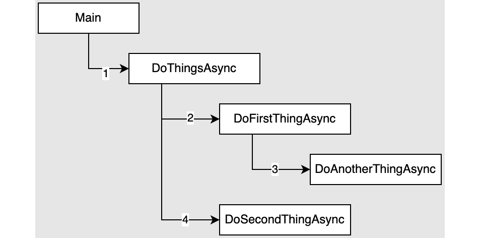
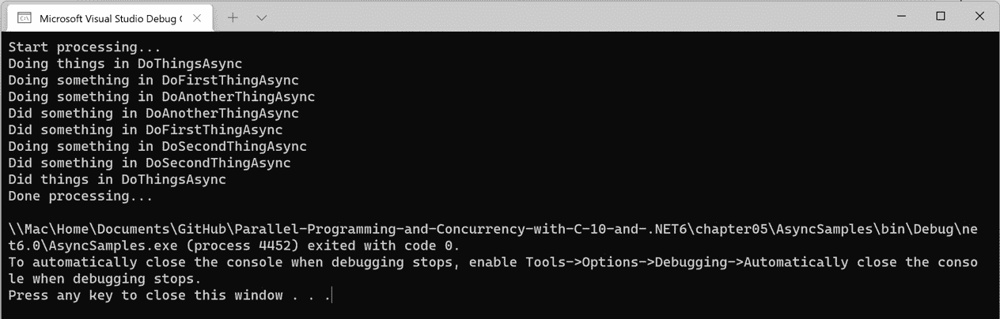
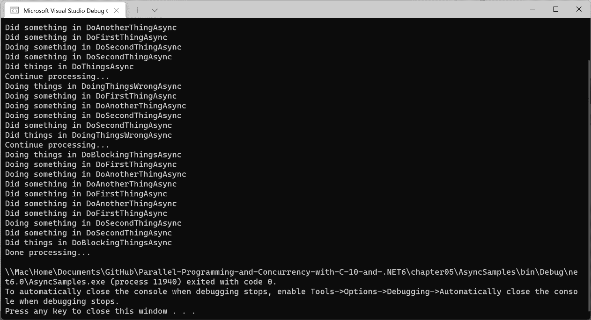
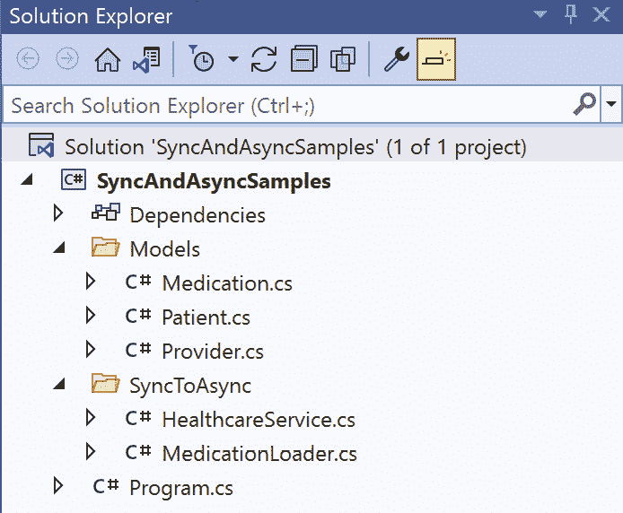

# *第五章*：使用 C# 进行异步编程

.NET 的 `async` 和 `await` 关键字是在 .NET Framework 4.5 中引入的。这些关键字在 C# 5 中与 C# 语言一起发布。现在，十年过去了，TAP 模型已成为大多数 .NET 开发者工具集的一个组成部分。

本章将解释 C# 中的异步编程，探讨如何使用 `Task` 对象，并深入研究使用 `async` 和 `await` 在 .NET 中针对 **I/O 绑定** 和 **CPU 绑定** 场景的最佳实践。

在本章中，你将了解以下内容：

+   更多关于 .NET 异步编程的信息

+   与 Task 对象一起工作

+   与同步代码的互操作

+   与多个后台任务一起工作

+   异步编程最佳实践

到本章结束时，你将对异步编程有更深入的理解，并且应该有足够的信心将高级异步功能添加到团队的项目中。

# 技术要求

在本章中，我们将使用 .NET **命令行界面**（**CLI**）和 Visual Studio Code 来构建和运行示例项目。为了跟随示例，以下软件是推荐的：

+   Visual Studio Code 版本 1.65 或更高版本

+   .NET 6 或更高版本

虽然这些是推荐的，但如果已经安装了 .NET 6，你可以使用你喜欢的编辑器。例如，如果你使用的是 Windows 10 或 11，则可以使用 Visual Studio 2022 版本 17.0 或更高版本，如果你使用的是 macOS 10.13 或更高版本，则可以使用 Visual Studio 2022 for Mac，或者 JetBrains Rider 也可以正常工作。

本章的所有代码示例都可以在 GitHub 上找到，链接为 [`github.com/PacktPublishing/Parallel-Programming-and-Concurrency-with-C-sharp-10-and-.NET-6/tree/main/chapter05`](https://github.com/PacktPublishing/Parallel-Programming-and-Concurrency-with-C-sharp-10-and-.NET-6/tree/main/chapter05)。

让我们从通过一些使用 `async` 和 `await` 的 TAP 模型示例开始吧。

# 更多关于 .NET 异步编程的信息

异步代码通常被引入的两个场景类型：

+   **I/O 绑定操作**：这些涉及从网络或磁盘获取的资源。

+   **CPU 绑定操作**：这些是在内存中进行的、CPU 密集型操作。

在本节中，我们将创建一些使用 `async` 和 `await` 为每种操作类型提供真实世界示例。无论你是等待外部进程完成，还是在你的应用程序中执行 CPU 密集型操作，你都可以利用异步代码来提高应用程序的性能。

让我们先看看一些 I/O 绑定操作的示例。

## I/O 绑定操作

当你处理受文件或网络操作约束的 I/O 绑定代码时，你的代码应该使用 `async` 和 `await` 来等待操作完成。

.NET 用于执行网络和文件 I/O 的方法都是异步的，因此不需要使用 `Task.Run`：

+   `ReadToEndAsync`方法在`Environment.NewLine`字符处分割文本，并将数据作为`List<string>`实例返回。文件中的每一行文本都是列表中的一个项：

    ```cs
    public async Task<List<string>> GetDataAsync
        (string filePath)
    {
        using var file = File.OpenText(filePath);
        var data = await file.ReadToEndAsync();
        return data.Split(new[] { Environment.NewLine },
            StringSplitOptions.RemoveEmptyEntries)
                .ToList();
    }
    ```

+   使用`HttpClient`类下载提供的 URL 上的文件，在分割并返回文本行的列表之前，使用`await`关键字：

    ```cs
    public async Task<List<string>> GetOnlineDataAsync
        (string url)
    {
        var httpClient = new HttpClient();
        var data = await httpClient.GetStringAsync(url);
        return data.Split(new[] { Environment.NewLine },
            StringSplitOptions.RemoveEmptyEntries)
                .ToList();
    }
    ```

这些是一些常见的 I/O 密集型操作，但什么是 CPU 密集型操作，它与 I/O 密集型操作有何不同？

## CPU 密集型操作

在这种情况下，你的应用程序不是在等待外部过程完成。应用程序本身正在执行一个需要时间才能完成的 CPU 密集型操作，并且你希望应用程序在操作完成之前保持响应。

在这个例子中，我们有一个接受`List<string>`实例的方法，其中列表中的每个项都包含这个`JournalEntry`类的 XML 表示：

```cs
[Serializable]
```

```cs
public class JournalEntry
```

```cs
{
```

```cs
    public string Title { get; set; }
```

```cs
    public string Description { get; set; }
```

```cs
    public DateTime EntryDate { get; set; }
```

```cs
    public string EntryText { get; set; }
```

```cs
}
```

假设`EntryText`可以非常大，因为一些在日志应用程序中写作的用户会为单个条目添加数十页的文本。每个条目都以 XML 格式存储在数据库中，加载条目的应用程序有一个`DeserializeEntries`方法，用于反序列化每个 XML 字符串，并将数据作为`List<JournalEntry>`实例返回：

```cs
private List<JournalEntry> DeserializeEntries(List<string> 
```

```cs
    journalData)
```

```cs
{
```

```cs
    var deserializedEntries = new List<JournalEntry>();
```

```cs
    var serializer = new XmlSerializer(typeof
```

```cs
        (JournalEntry));
```

```cs
    foreach (var xmlEntry in journalData)
```

```cs
    {
```

```cs
        if (xmlEntry == null) continue;
```

```cs
        using var reader = new StringReader(xmlEntry);
```

```cs
        var entry = (JournalEntry)serializer.Deserialize
```

```cs
            (reader)!;
```

```cs
        if (entry == null) continue;
```

```cs
        deserializedEntries.Add(entry);
```

```cs
    }
```

```cs
    return deserializedEntries;
```

```cs
}
```

在添加了几个月的日志条目之后，用户抱怨加载现有条目所需的时间。他们希望在数据加载时开始创建新条目。

幸运的是，使用异步.NET 代码可以在等待长时间运行的过程完成时保持应用程序的用户界面响应。线程可以在非阻塞调用完成之前自由执行其他工作。通过添加一个名为`DeserializeJournalDataAsync`的异步方法，该方法使用`await`的`Task.Run`方法调用现有方法，客户端代码可以在用户创建新的日志条目时保持响应：

```cs
public async Task<List<JournalEntry>> 
```

```cs
    DeserializeJournalDataAsync(List<string> journalData)
```

```cs
{
```

```cs
    return await Task.Run(() => DeserializeEntries
```

```cs
        (journalData));
```

```cs
}
```

如果你正在使用 JSON 格式的序列化数据而不是 XML，反序列化的同步和异步方法非常相似。这是因为.NET 在`System.Text.Json.JsonSerializer`类中提供了`Deserialize`和`DeserializeAsync`方法。以下是这两种方法，其中突出了它们之间的差异：

```cs
public List<JournalEntry> DeserialzeJsonEntries
```

```cs
    (List<string> journalData)
```

```cs
{
```

```cs
    var deserializedEntries = new List<JournalEntry>();
```

```cs
    foreach (var jsonEntry in journalData)
```

```cs
    {
```

```cs
        if (string.IsNullOrWhiteSpace(jsonEntry)) continue;
```

```cs
        deserializedEntries.Add(JsonSerializer.Deserialize
```

```cs
            <JournalEntry>(jsonEntry)!);
```

```cs
    }
```

```cs
    return deserializedEntries;
```

```cs
}
```

```cs
public async Task<List<JournalEntry>> Deserialize
```

```cs
     JsonEntriesAsync(List<string> journalData)
```

```cs
{
```

```cs
    var deserializedEntries = new List<JournalEntry>();
```

```cs
    foreach (var jsonEntry in journalData)
```

```cs
    {
```

```cs
        if (string.IsNullOrWhiteSpace(jsonEntry)) continue;
```

```cs
        using var stream = new MemoryStream(Encoding
```

```cs
            .Unicode.GetBytes(jsonEntry));
```

```cs
        deserializedEntries.Add((await JsonSerializer
```

```cs
            .DeserializeAsync<JournalEntry>(stream))!);
```

```cs
    }
```

```cs
    return deserializedEntries;
```

```cs
}
```

`Deserialize`方法接受`string`，但`DeserializeAsync`不接受。相反，我们必须从`jsonEntry`字符串创建一个`MemoryStream`实例，并将其传递给`DeserializeAsync`。除此之外，只有方法的返回类型不同。

让我们通过查看一个处理 JSON 反序列化日志条目列表的另一个方法来结束本节。在这个例子中，仅处理单个 JSON 条目的方法。一个名为`GetJournalEntriesAsync`的父方法使用 LINQ 的`Select`运算符对列表中的每个字符串调用`DeserializeJsonEntryAsync`，并将`IEnumerable<Task<JournalEntry>>`实例存储在`getJournalTasks`变量中：

```cs
public async Task<List<JournalEntry>> 
```

```cs
    GetJournalEntriesAsync(List<string> journalData)
```

```cs
{
```

```cs
    var journalTasks = journalData.Select(entry => 
```

```cs
        DeserializeJsonEntryAsync(entry));
```

```cs
    return (await Task.WhenAll(journalTasks)).ToList();
```

```cs
}
```

```cs
private async Task<JournalEntry> DeserializeJsonEntryAsync
```

```cs
    (string jsonEntry)
```

```cs
{
```

```cs
    if (string.IsNullOrWhiteSpace(jsonEntry)) return new 
```

```cs
        JournalEntry();
```

```cs
    using var stream = new MemoryStream
```

```cs
        (Encoding.Unicode.GetBytes(jsonEntry));
```

```cs
    return (await JsonSerializer.DeserializeAsync
```

```cs
        <JournalEntry>(stream))!;
```

```cs
}
```

突出的代码等待 `journalTasks` 中的所有 `Task` 对象，将每个调用的结果作为 `JournalEntry` 对象的数组返回。你可以声明 `GetJournalEntriesAsync` 的返回类型为 `Task<JournalEntry[]>`，或者像我们在本示例中那样使用 `ToList` 返回 `Task<List<JournalEntry>>`。你可以看到当需要遍历一个项目列表并对每个项目进行异步调用时，LINQ 如何简化你的代码。

你已经看到了在代码中使用异步和 `await` 的不同方法，无论是针对 I/O 密集型操作还是 CPU 密集型操作。

接下来，我们将讨论如何链式调用嵌套异步方法以及如何启动该链的最高层。

## 嵌套异步方法

在使用异步方法时，当您想要保持执行顺序时，使用 `await` 是很重要的。同样重要的是要保留对当前线程入口点的等待调用链。

例如，如果你的应用程序是一个控制台应用程序，主要的入口点是 `Program.cs` 中的 `Main` 方法。如果你不能使这个 `Main` 方法变为 `async`，那么在 `Main` 之下的所有方法调用都不会使用 `await` 关键字。这就是为什么 .NET 现在支持 `async` `Main` 方法的原因。现在，当你使用 .NET 6 创建一个新的控制台应用程序时，它默认有一个 `async` `Main` 方法。

如果执行的入口点是事件处理器，你应该将事件处理器方法标记为 `async`。这是唯一一次你会看到具有 `void` 返回类型的 `async` 方法：

```cs
private async void saveButton_Click(object sender, 
```

```cs
    EventArgs e)
```

```cs
{
```

```cs
    await SaveData();
```

```cs
}
```

让我们看看在控制台应用程序中正确链式调用多个嵌套异步方法的例子：

1.  首先创建一个新的控制台应用程序。在名为 `AsyncSamples` 的文件夹内，运行以下命令：

    ```cs
    dotnet new console –framework net6.0
    ```

1.  当进程完成后，在 Visual Studio Code 或你选择的编辑器中打开新的 `AsyncSamples.csproj` 文件。

1.  向项目中添加一个名为 `TaskSample` 的新类

1.  将以下代码添加到 `TaskSample` 类中：

    ```cs
    public async Task DoThingsAsync()
    {
        Console.WriteLine($"Doing things in 
            {nameof(DoThingsAsync)}");
        await DoFirstThingAsync();
        await DoSecondThingAsync();
        Console.WriteLine($"Did things in 
            {nameof(DoThingsAsync)}");
    }
    private async Task DoFirstThingAsync()
    {
        Console.WriteLine($"Doing something in 
            {nameof(DoFirstThingAsync)}");
        await DoAnotherThingAsync();
        Console.WriteLine($"Did something in 
            {nameof(DoFirstThingAsync)}");
    }
    private async Task DoSecondThingAsync()
    {
        Console.WriteLine($"Doing something in 
            {nameof(DoSecondThingAsync)}");
        await Task.Delay(500);
        Console.WriteLine($"Did something in 
            {nameof(DoSecondThingAsync)}");
    }
    private async Task DoAnotherThingAsync()
    {
        Console.WriteLine($"Doing something in 
            {nameof(DoAnotherThingAsync)}");
        await Task.Delay(1500);
        Console.WriteLine($"Did something in 
            {nameof(DoAnotherThingAsync)}");
    }
    ```

1.  现在打开 `Program.cs` 并添加一些代码来调用 `DoThingsAsync`：

    ```cs
    using AsyncSamples;
    Console.WriteLine("Start processing"…");
    var taskSample = new TaskSample();
    await taskSample.DoThingsAsync();
    Console.WriteLi"e("Done processing"..");
    ```

让我们通过我们的项目调用的方法的顺序和层次结构来举例说明。`Main` 方法调用 `DoThingsAsync`，然后 `DoThingsAsync` 又依次调用 `DoFirstThingAsync` 和 `DoSecondThingAsync`。最后，在 `DoFirstThingAsync` 中，调用了 `DoAnotherThingAsync`。当使用 `await` 操作符调用每个这些 `async` 方法时，操作顺序是可预测的：



图 5.1：等待方法的操作顺序

1.  运行程序并检查控制台输出的顺序。一切都应该按照预期的顺序执行：



图 5.2：检查 AsyncSamples 控制台应用程序的输出

1.  接下来，我们将向 `TaskSample` 类添加两个额外的函数：

    ```cs
    public async Task DoingThingsWrongAsync()
    {
        Console.WriteLine($"Doing things in 
            {nameof(DoingThingsWrongAsync)}");
        DoFirstThingAsync();
        await DoSecondThingAsync();
        Console.WriteLine($"Did things in 
            {nameof(DoingThingsWrongAsync)}");
    }
    public async Task DoBlockingThingsAsync()
    {
        Console.WriteLine($"Doing things in 
            {nameof(DoBlockingThingsAsync)}");
        DoFirstThingAsync().Wait();
        await DoSecondThingAsync();
        Console.WriteLine($"Did things in 
            {nameof(DoBlockingThingsAsync)}");
    }
    ```

`DoingThingsWrongAsync` 方法已经从对 `DoFirstThingAsync` 的调用中移除了 `await`。因此，`DoSecondThingAsync` 的执行将在 `DoFirstThingAsync` 完成之前开始。如果后续代码没有依赖于 `DoFirstThingAsync` 内部发生的处理，这可能没问题。然而，任何未处理的异常都不会自动向上冒泡到 `调用` 方法。对于该调用的 `Task` 实例，其 `Status` 值将为 `Faulted`，`IsFaulted` 属性将为 `true`，而 `Exception` 属性将包含未处理的异常信息。

在前面的例子中，`DoFirstThingAsync` 中的任何未处理的异常都将不会被检测到。如果你有一个没有等待 `Task` 实例的情况，确保在出现异常的情况下监控 `Task` 实例的状态。这也是为什么你不应该有 `async void` 方法的原因之一。它不会返回一个 `Task` 实例来等待。

`DoBlockingThings` 方法将保持操作的正确顺序，但通过调用 `DoFirstThingAsync().Wait()` 而不是等待调用，执行 `DoBlockingThings` 的线程将被阻塞。它将等待 `DoFirstThingAsync` 的调用完成，而不是在长时间运行的异步方法完成之前自由地执行其他工作。使用 `Wait()` 或 `Result` 等阻塞调用可以快速耗尽 `ThreadPool` 中可用的线程。

1.  将 `Program.cs` 更新为调用所有三个公共 `TaskSample` 方法：

    ```cs
    using AsyncSamples;
    Console.WriteLine("Start processing...");
    var taskSample = new TaskSample();
    await taskSample.DoThingsAsync();
    Console.WriteLine("Continue processing...");
    await taskSample.DoingThingsWrongAsync();
    Console.WriteLine("Continue processing...");
    await taskSample.DoBlockingThingsAsync();
    Console.WriteLine("Done processing...");
    ```

1.  现在运行程序并检查控制台输出，以查看省略 `DoingThingsWrongAsync` 内部的 `await` 对其有何影响：



图 5.3：调用所有 TaskSample 方法时的控制台输出

输出可能会因 `ThreadPool` 线程的分配方式而略有不同。在这种情况下，对 `DoFirstThingAsync` 的第二次调用在第三次调用同一方法开始之前保持未完成状态。即使 `Program.cs` 等待其 `DoingThingsWrongAsync` 的调用，在该方法内部的代码在 `DoBlockingThingsAsync` 的下一次调用被触发后仍然在执行。

当异步任务没有被等待时，事情可能会变得非常不可预测。除非你有充分的理由不这样做，否则你应该始终等待任务。接下来，让我们探索 `Task` 类中可用的某些属性和方法。

# 与任务对象一起工作

在将线程引入现有项目时，直接与 `Task` 对象一起工作可能非常有用。正如我们在上一节中看到的，引入 `async` 和 `await` 时更新整个调用栈非常重要。在一个大型代码库中，这些更改可能是广泛的，并且需要进行相当多的回归测试。

你可以使用 `Task` 和 `Task<TResult>` 来包装你想异步运行的方法。这两种 `Task` 类型代表方法或动作正在执行的非阻塞工作。当你想使用返回 void 的方法时，使用 `Task`。对于具有非 void 返回类型的方法，使用 `Task<TResult>`。

下面是两个同步方法签名及其异步等价的例子：

```cs
public interface IAsyncExamples
```

```cs
{
```

```cs
    void ProcessOrders(List<Order> orders);
```

```cs
    Task ProcessOrdersAsync(List<Order> orders);
```

```cs
    List<Order> GetOrders(int customerId);
```

```cs
    Task<List<Order>> GetOrdersAsync(int customerId);
```

```cs
}
```

我们在本章中看到了一些使用 `Task` 对象的例子。现在，是时候探索这两个类型的额外属性、方法和用途了。

## 探索 Task 方法

首先，我们将通过实际例子发现一些常用的 `Task` 方法。考虑接受要处理和提交的订单列表的 `ProcessOrders` 方法。使用的四个 `Task` 方法如下：

+   `Task.Run`: 在线程池上的线程上运行一个方法

+   `Task.Factory.StartNew`: 在线程池上的线程上运行一个方法，并提供 `TaskCreationOptions`

+   `processOrdersTask.ContinueWith`: 当 `processOrdersTask` 完成，它将在同一个线程池线程上执行提供的方法。

+   `Task.WaitAll`: 此方法将阻塞当前线程并等待数组中的所有任务。

这些方法在以下代码中被突出显示：

```cs
public void ProcessOrders(List<Order> orders, int 
```

```cs
    customerId)
```

```cs
{
```

```cs
    Task<List<Order>> processOrdersTask = Task.Run(() => 
```

```cs
        PrepareOrders(orders));
```

```cs
    Task labelTask = Task.Factory.StartNew(() => 
```

```cs
        CreateLabels(orders), TaskCreationOptions
```

```cs
            .LongRunning);
```

```cs
    Task sendTask = processOrdersTask.ContinueWith(task => 
```

```cs
        SendOrders(task.Result));
```

```cs
    Task.WaitAll(new[] { labelTask, sendTask });
```

```cs
    SendConfirmation(customerId);
```

```cs
}
```

这就是前面例子中每一行发生的事情：

1.  `Task.Run` 将创建一个新的后台线程并将其队列在 `ThreadPool` 上

1.  `Task.Factory.StartNew` 也会创建一个新的后台线程，并将其队列在 `ThreadPool` 上。此外，我们为 `StartNew` 提供了 `TaskCreattionOptions.LongRunning` 作为参数，以表明创建额外的线程是合理的，因为此任务可能需要一段时间才能完成。这将防止其他任务在 `ThreadPool` 上排队时的延迟。

1.  `ContinueWith` 将 `SendOrders` 队列在 `ThreadPool` 线程上，但线程不会启动，直到 `processOrdersTask` 完成。

1.  `Task.WaitAll` 是 `async` 方法 `Task.WhenAll` 的同步等价。它将阻塞当前线程，直到 `labelTask` 和 `sendTask` 完成。

1.  最后，调用 `SendConfirmation` 通知客户他们的订单已处理并发送。

以这种方式使用任务可以达到与等待任务以实现并行处理相同的结果的 `async` 方法。主要区别在于，当调用 `WaitAll` 时，当前线程将在 *步骤 4* 处被阻塞。

我们接下来要探索的另一个有用的方法是 `RunSynchronously`。这个方法启动一个任务，但在当前线程上同步执行。异步等价方法是调用任务上的 `Start`。

在这个例子中，`ProcessData` 方法接受一个参数，指示数据是否必须在 UI 线程上处理。可能有些数据处理需要与 UI 交互，向用户展示一些选项或其他反馈：

```cs
public void ProcessData(object data, bool uiRequired)
```

```cs
{
```

```cs
    Task processTask = new(() => DoDataProcessing(data));
```

```cs
    if (uiRequired)
```

```cs
    {
```

```cs
        // Run on current thread (UI thread assumed for 
```

```cs
            example)
```

```cs
        processTask.RunSynchronously();
```

```cs
    }
```

```cs
    else
```

```cs
    {
```

```cs
        // Run on ThreadPool thread in background
```

```cs
        processTask.Start();
```

```cs
    }
```

```cs
}
```

接下来，让我们探索 `Task` 和 `Task<TResult>` 类的一些属性。

## 探索 Task 属性

在本节中，我们将回顾`Task`对象上可用的属性。大多数属性都与任务的状态相关，因此我们将从`Status`属性开始。`Status`属性返回`TaskStatus`，它是一个具有八个可能值的枚举：

+   `Created (0)`: 任务已被创建和初始化，但尚未在`ThreadPool`上安排。

+   `WaitingForActivation (1)`: 任务正在等待.NET 进行安排

+   `WaitingToRun (2)`: 任务已被安排，但尚未开始执行

+   `Running (3)`: 任务目前正在运行。

+   `WaitingForChildrenToComplete (4)`: 任务已完成，但有附加的子任务仍在运行或等待运行

+   `RanToCompletion (5)`: 任务成功运行到完成

+   `Canceled (6)`: 任务被取消并确认了取消

+   `Faulted (7)`: 在执行任务时遇到了未处理的异常

`Task`和`Task<TResult>`的以下属性是检查状态的快捷方式：

+   `IsCanceled`: 如果任务的`Status`是`Canceled`，则返回`true`

+   `IsCompleted`: 如果任务的`Status`是`RanToCompletion`、`Canceled`或`Faulted`，则返回`true`

+   `IsCompletedSuccessfully`: 如果任务的`Status`是`RanToCompletion`，则返回`true`

+   `IsFaulted`: 如果任务的`Status`是`Faulted`，则返回`true`

使用这些属性可以简化代码中的状态检查。`Task`对象的剩余实例属性如下：

+   `AsyncState`: 返回创建任务时提供的状态。如果没有提供状态，则此属性返回`null`

+   `CreationOptions`: 返回创建任务时提供的`CreationOptions`值。如果没有提供选项，则默认为`TaskCreationOptions.None`。

+   `Exception`: 返回一个包含在任务运行期间遇到的未处理异常的`AggregateException`实例。应在处理`AggregateException`类型的`try`/`catch`块中调用`Wait`或`WaitAll`。

+   `Id`: 为任务分配的系统标识符

让我们快速看一下如何正确捕获`AggregateException`实例并检查故障任务的`Exception`属性：

```cs
Task ordersTask = Task.Run(() => ProcessOrders(orders, 
```

```cs
    123));
```

```cs
try
```

```cs
{
```

```cs
    ordersTask.Wait();
```

```cs
    Console.WriteLine($"ordersTask Status: 
```

```cs
        {ordersTask.Status}");
```

```cs
} 
```

```cs
catch (AggregateException)
```

```cs
{
```

```cs
    Console.WriteLine($"Exception in ordersTask! Error 
```

```cs
        message: {ordersTask.Exception.Message}");
```

```cs
}   
```

此代码将在完成后将任务的状态写入控制台。如果遇到未处理的异常，错误消息将在`catch`块中写入控制台。

现在你对`Task`和`Task<TResult>`的成员更加熟悉了，让我们讨论一些从异步代码调用同步代码以及反之亦然的用例。

# 与同步代码的互操作

当与现有项目一起工作并引入异步代码到系统中时，将会有同步和异步代码相交的点。我们已经在本章中看到了一些处理这种互操作性的例子。在本节中，我们将关注双向互操作性：同步调用异步和异步调用同步。

我们将创建一个包含表示旧代码的同步方法的类和包含现代 `async` 方法的另一组类的示例项目。

让我们先讨论如何在旧同步代码中消费 `async` 方法。

## 从同步方法执行异步

在本例中，我们将使用一个 .NET 控制台应用程序来获取患者及其药物列表。应用程序将调用同步的 `GetPatientAndMedications` 方法，该方法反过来调用异步的 `GetPatientInfoAsync` 方法：

1.  首先创建一个新的 .NET 控制台应用程序

1.  将 `Patient`、`Provider` 和 `Medication` 类添加到 `Models` 文件夹，并将 `HealthcareService` 和 `MedicationLoader` 类添加到 `SyncToAsync` 文件夹：



图 5.4：从同步代码调用异步的初始项目结构

1.  为模型类添加必要的属性：

    ```cs
    public class Medication
    {
        public int Id { get; set; }
        public string? Name { get; set; }
    }
    public class Provider
    {
        public int Id { get; set; }
        public string? Name { get; set; }
    }
    public class Patient
    {
        public int Id { get; set; }
        public string? Name { get; set; }
        public List<Medication>? Medications { get; set; }
        public Provider? PrimaryCareProvider { get; set; }
    }
    ```

1.  在 `HealthcareService` 类中创建 `GetPatientInfoAsync` 方法。此方法在注入 2 秒异步延迟后创建一个带有提供者和两种药物的病人：

    ```cs
    public async Task<Patient> GetPatientInfoAsync
        (int patientId)
    {
        await Task.Delay(2000);
        Patient patient = new()
        {
            Id = patientId,
            Name = "Smith, Terry",
            PrimaryCareProvider = new Provider
            {
                Id = 999,
                Name = "Dr. Amy Ng"
            },
            Medications = new List<Medication>
            {
                new Medication { Id = 1, Name = 
                    "acetaminophen" },
                new Medication { Id = 2, Name = 
                    "hydrocortisone cream" }
            }
        };
        return patient;
    }
    ```

1.  为 `MedicationLoader` 服务添加实现：

    ```cs
    public class MedicationLoader
    {
        private HealthcareService _healthcareService;
        public MedicationLoader()
        {
            _healthcareService = new HealthcareService();
        }
        public Patient? GetPatientAndMedications(int 
            patientId)
        {
            Patient? patient = null;
            try
            {
                patient = _healthcareService
                   .GetPatientInfoAsync(patientId).Result;
            }
            catch (AggregateException ae)
            {
                Console.WriteLine($"Error loading patient. 
                    Message: {ae.Flatten().Message}");
            }
            if (patient != null)
            {
                patient = ProcessPatientInfo(patient);
                return patient;
            }
            else
            {
                return null;
            }
        }
        private Patient ProcessPatientInfo(Patient 
            patient)
        {
            // Add additional processing here.
            return patient;
        }
    }
    ```

`GetPatientAndMedications` 方法调用 `GetPatientInfoAsync` 并使用 `Result` 属性同步等待异步方法完成并返回值。使用 `Result` 与在返回无值的异步方法上使用 `Wait()` 方法相同。当前线程在方法完成前被阻塞。

我们将调用封装在一个 `try`/`catch` 块中，该块处理 `AggregateException` 实例。如果调用成功，并且 `patient` 变量不是 `null`，则在返回患者数据给调用者之前调用 `ProcessPatientInfo`。

1.  将此代码添加到 `Program.cs` 中以调用同步方法：

    ```cs
    using SyncAndAsyncSamples.Models;
    using SyncAndAsyncSamples.SyncToAsync;
    Console.WriteLine("Hello, sync to async world!");
    var medLoader = new MedicationLoader();
    Patient? patient = medLoader.GetPatientAndMedications
        (123);
    Console.WriteLine($"Loaded patient: {patient.Name} 
        with {patient.Medications.Count} medications.");
    ```

1.  运行程序。您应该在窗口中看到以下输出：

```cs
Hello, sync to async world!
Loaded patient: Smith, Terry with 2 medications.
```

接下来，让我们尝试使用异步方法调用一些旧同步代码来加载相同的数据。

## 将同步代码作为异步执行

在本例中，我们将模仿上一个示例。将有一个具有异步方法的 `PatientLoader` 实例调用具有同步方法的 `PatientService` 实例：

1.  在您的项目中添加一个新 `AsyncToSync` 文件夹，并添加 `PatientService` 类：

1.  创建一个与上一个示例中的 `GetPatientInfoAsync` 方法具有相似实现的 `GetPatientInfo` 方法：

    ```cs
    public Patient GetPatientInfo(int patientId)
    {
        Thread.Sleep(2000);
        Patient patient = new()
        {
            Id = patientId,
            Name = "Smith, Terry",
            PrimaryCareProvider = new Provider
            {
                Id = 999,
                Name = "Dr. Amy Ng"
            },
            Medications = new List<Medication>
            {
                new Medication { Id = 1, Name = 
                    "acetaminophen" },
                new Medication { Id = 2, Name = 
                    "hydrocortisone cream" }
            }
        };
        return patient;
    }
    ```

这里的不同之处在于方法不是 `async`，它返回 `Patient` 实例而不是 `Task<Patient>` 实例，并且我们使用 `Thread.Sleep` 而不是 `Task.Delay` 注入延迟。

1.  在 `AsyncToSync` 文件夹中创建 `PatientLoader` 类，并开始其实现，通过创建 `PatientService` 的新实例：

    ```cs
    private PatientService _patientService = new 
        PatientService();
    ```

1.  现在从上一个示例创建 `ProcessPatientInfo` 的异步版本：

    ```cs
    private async Task<Patient> ProcessPatientInfoAsync
        (Patient patient)
    {
        await Task.Delay(100);
        // Add additional processing here.
        return patient;
    }
    ```

1.  现在创建 `GetPatientAndMedsAsync` 方法：

    ```cs
    public async Task<Patient?> GetPatientAndMedsAsync
        (int patientId)
    {
        Patient? patient = null;
        try
        {
            patient = await Task.Run(() => 
               _patientService.GetPatientInfo(patientId));
        }
        catch (Exception e)
        {
            Console.WriteLine($"Error loading patient. 
                Message: {e.Message}");
        }
        if (patient != null)
        {
            patient = await ProcessPatientInfoAsync
                (patient);
            return patient;
        }
        else
        {
            return null;
        }
    }
    ```

与上一个示例的主要区别被突出显示。`GetPatientInfo` 的 `synchronous` 类被包裹在一个对 `await Task.Run` 的调用中，这将等待调用而不阻塞当前线程执行其他工作。

我们现在在 `catch` 块中使用 `Exception` 而不是 `AggregateException`。你应该始终与阻塞的 `Wait` 和 `Result` 调用一起使用 `AggregateException`，并使用 `Exception` 与 `async` 和 `await` 一起使用。

最后，如果 `patient` 变量不是 `null`，则等待对 `ProcessPatientInfoAsync` 的异步调用。

1.  接下来更新 `Program.cs` 以调用新的 `PatientLoader` 代码：

    ```cs
    using SyncAndAsyncSamples.AsyncToSync;
    using SyncAndAsyncSamples.Models;
    Console.WriteLine("Hello, async to sync world!");
    var loader = new PatientLoader();
    Patient? patient = await loader.GetPatientAndMedsAsync
        (123);
    Console.WriteLine($"Loaded patient: {patient.Name} 
        with {patient.Medications.Count} medications.");
    ```

1.  运行程序，输出应该类似于上一个示例：

```cs
Hello, async to sync world!
Loaded patient: Smith, Terry with 2 medications.
```

到现在为止，你应该已经对如何在异步和同步代码之间进行交互有了扎实的理解。让我们继续前进，创建一个从多个 `async` 方法并行加载数据的示例。

# 与多个后台任务一起工作

在本节中，我们将看到从多个来源并行加载数据的代码示例，而不是等待方法准备好返回数据给调用者。对于同步和异步代码，技术略有不同，但总体思路是相同的。

首先，回顾这个调用三个异步方法并使用 `Task.WhenAll` 等待返回患者数据的方法：

```cs
public async Task<Patient> LoadPatientAsync(int patientId)
```

```cs
{
```

```cs
    var taskList = new List<Task>
```

```cs
    {
```

```cs
        LoadPatientInfoAsync(patientId),
```

```cs
        LoadProviderAsync(patientId),
```

```cs
        LoadMedicationsAsync(patientId)
```

```cs
    };
```

```cs
    await Task.WhenAll(taskList.ToArray());
```

```cs
    _patient.Medications = _medications;
```

```cs
    _patient.PrimaryCareProvider = _provider;
```

```cs
    return _patient;
```

```cs
}
```

现在，回顾这个方法的同步版本，它使用了 `Task.WaitAll`:

```cs
public Patient LoadPatient(int patientId)
```

```cs
{
```

```cs
    var taskList = new List<Task>
```

```cs
    {
```

```cs
        LoadPatientInfoAsync(patientId),
```

```cs
        LoadProviderAsync(patientId),
```

```cs
        LoadMedicationsAsync(patientId)
```

```cs
    };
```

```cs
    Task.WaitAll(taskList.ToArray());
```

```cs
    _patient.Medications = _medications;
```

```cs
    _patient.PrimaryCareProvider = _provider;
```

```cs
    return _patient;
```

```cs
}
```

即使是这个使用阻塞 `WaitAll` 调用的代码版本，其执行速度也将快于对三个方法分别进行单独的同步调用。

这个 `ParallelPatientLoader` 类的完整实现可以在本章的 GitHub 仓库中找到。让我们通过列出使用 `async`、`await` 和 `Task` 对象的一些最佳实践来结束本章。

# 异步编程最佳实践

当处理异步代码时，有许多最佳实践你应该知道。在本节中，我们将列出你在日常开发中应该记住的最重要的一些最佳实践。**大卫·福勒**（David Fowler），他是微软 ASP.NET 团队的资深成员，也是 .NET 专家，维护了一个包含许多其他最佳实践的开放源代码列表。我建议在处理你自己的项目时将此页面添加到书签，以供以后参考：[`github.com/davidfowl/AspNetCoreDiagnosticScenarios/blob/master/AsyncGuidance.md#asynchronous-programming`](https://github.com/davidfowl/AspNetCoreDiagnosticScenarios/blob/master/AsyncGuidance.md#asynchronous-programming)。

这些是我（不分先后顺序）在处理异步代码时推荐的最高建议：

1.  总是优先选择 `async` 和 `await` 而不是同步方法以及像 `Wait()` 和 `Result` 这样的阻塞调用。如果你正在创建一个新的项目，你应该从一开始就考虑使用异步。

1.  除非你使用 `Task.WhenAll` 来同时等待多个操作，否则你应该直接等待一个方法，而不是创建一个 `Task` 实例然后等待它。

1.  不要使用 `async void`。您的异步方法应始终返回 `Task`、`Task<TResult>`、`ValueTask` 或 `ValueTask<TResult>`。唯一的例外是具有返回 `void` 的现有签名的事件处理器。在 .NET 6 中，`Main` 事件方法可以是异步的。

1.  不要混合阻塞代码和异步代码。通过调用堆栈使用 `async` 调用。

1.  除非您需要向 `StartNew` 重载方法之一传递额外的参数，否则请使用 `Task.Run` 而不是 `Task.Factory.StartNew`。

1.  长运行的 `async` 方法应支持取消。我们将在 *第十一章* 中深入讨论取消。

1.  同步使用共享数据。您的代码应该添加锁以防止跨线程使用对象中的数据被覆盖。

1.  总是使用 `async` 和 `await` 进行 I/O 密集型工作，如网络和文件访问。

1.  当您创建一个 `async` 方法时，请将其名称添加 `Async` 后缀。这有助于一眼区分 `sync` 和 `async` 方法。用于返回用户信息的 `async` 方法应命名为 `GetUserInfoAsync`，而不是 `GetUserInfo`。

1.  不要在异步方法中使用 `Thread.Sleep`。如果您的代码必须等待固定的时间段，请使用 `await Task.Delay`。

这些是我的 10 条启动规则，但还有许多关于使用 .NET 进行异步开发的最佳实践。随着我们继续阅读剩余的章节，我们将发现更多。

让我们总结并回顾一下本章我们学到的关于异步编程的知识。

# 摘要

在本章中，我们介绍了关于使用 C# 和 .NET 进行异步开发的大量信息。我们首先介绍了一些处理应用程序中 I/O 密集型和 CPU 密集型操作的方法。

接下来，我们创建了一些使用 `Task` 和 `Task<TResult>` 类的实用示例，并发现了如何与多个 `Task` 对象一起工作。您得到了一些关于现代异步代码和旧式同步方法之间互操作的实际建议。最后，我们介绍了在处理异步代码和 `Task` 对象时需要记住的一些最重要的规则。

在下一章中，*第六章*，您将学习如何使用 **Task Parallel Library** (**TPL**) 在 .NET 中进行并行编程的细节，并了解如何避免并行编程的常见陷阱。

# 问题

1.  `Task` 的哪个属性使得阻塞调用能够从底层方法返回数据？

1.  应该使用 `Task` 类的哪个 `async` 方法来等待多个任务？

1.  `Task.WhenAll()` 的阻塞等效方法是什么？

1.  一个 `async` 方法应该总是返回什么类型？

1.  `async` 方法更适合 I/O 密集型还是 CPU 密集型操作？

1.  *对或错*：`Async` 方法不应该以 `Async` 作为后缀。

1.  哪种方法可以用来在 `async` 调用中包装同步方法？
