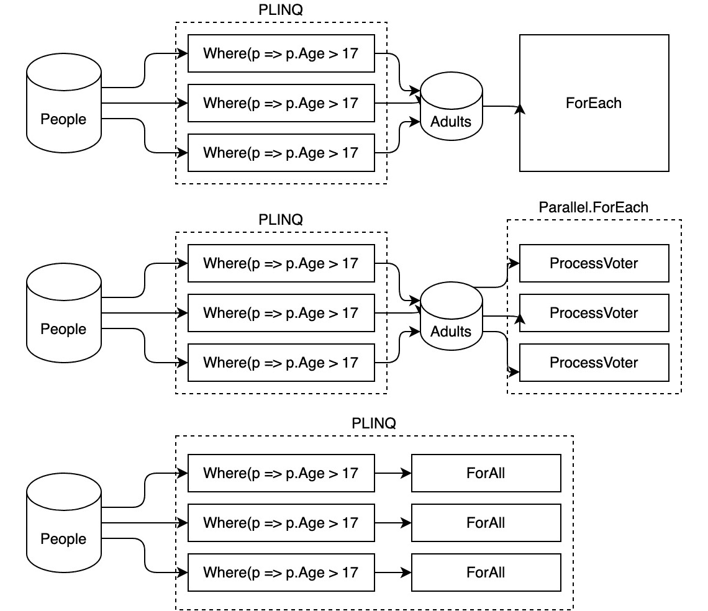
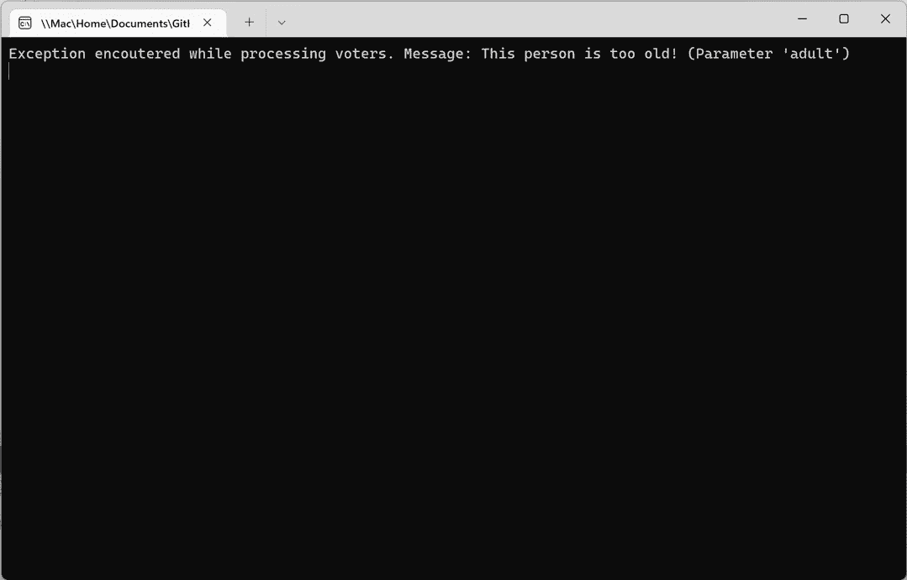
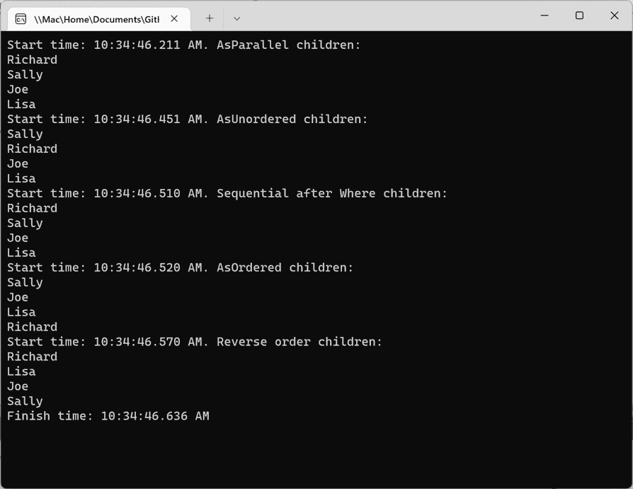
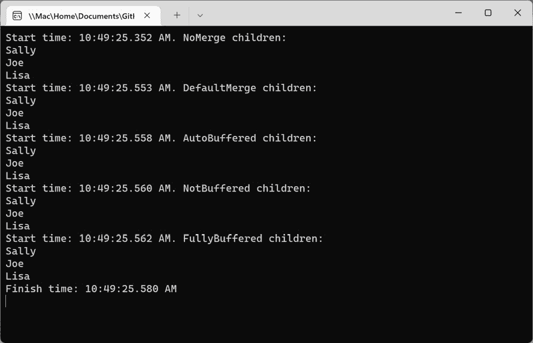

# *第八章*：并行数据结构和并行 LINQ

.NET 为将并行性引入其项目的开发者提供了许多有用的功能和数据结构。本章将探讨这些功能，包括 `SpinLock<T>` **同步原语**和**并行 LINQ**（**PLINQ**）。这些功能可以在保持安全线程实践的同时提高应用程序的性能。

大多数 .NET 开发者熟悉 LINQ 框架，包括 LINQ to Objects、LINQ to SQL 和 LINQ to XML。甚至还有开源的 .NET LINQ 库，例如 LINQ to Twitter ([`github.com/JoeMayo/LinqToTwitter`](https://github.com/JoeMayo/LinqToTwitter))。我们将利用这些 LINQ 技巧，在 PLINQ 的并行编程中发挥其作用。阅读本章后，每个 LINQ 开发者都可以成为 PLINQ 开发者。继续阅读以获取一些使用 C# 操作 PLINQ 的有用示例。

在本章中，您将学习以下内容：

+   介绍 PLINQ

+   将 LINQ 查询转换为 PLINQ

+   使用 PLINQ 保留数据顺序和合并数据

+   .NET 中用于并行编程的数据结构

到本章结束时，您将对 LINQ 在并行编程方面的应用有新的认识。

# 技术要求

为了跟随本章中的示例，以下软件是 Windows 开发者推荐的：

+   Visual Studio 2022 版本 17.0 或更高版本。

+   .NET 6.

+   要完成 WPF 示例，您需要为 Visual Studio 安装 .NET 桌面开发工作负载。

虽然这些是推荐的，但如果您已安装 .NET 6，您可以使用您喜欢的编辑器。例如，macOS 10.13 或更高版本的 Visual Studio 2022 for Mac、JetBrains Rider 或 Visual Studio Code 都可以正常工作。

本章的所有代码示例都可以在 GitHub 上找到：[`github.com/PacktPublishing/Parallel-Programming-and-Concurrency-with-C-sharp-10-and-.NET-6/tree/main/chapter08`](https://github.com/PacktPublishing/Parallel-Programming-and-Concurrency-with-C-sharp-10-and-.NET-6/tree/main/chapter08)。

让我们从讨论 LINQ、PLINQ 以及为什么查询语言可以成为改进 C# 并行编程的绝佳方式开始。

# 介绍 PLINQ

PLINQ 是一组 .NET 扩展，用于 LINQ，它允许部分 LINQ 查询通过利用线程池并行执行。PLINQ 实现提供了所有可用的 LINQ 查询操作并行版本。

与 LINQ 查询类似，PLINQ 查询提供延迟执行。这意味着对象只有在需要枚举时才会被查询。如果您不熟悉 LINQ 的延迟执行，我们将通过一个简单的示例来阐述这个概念。考虑以下两个 LINQ 查询：

```cs
internal void QueryCities(List<string> cities)
```

```cs
{
```

```cs
    // Query is executed with ToList call
```

```cs
    List<string> citiesWithS = cities.Where(s => 
```

```cs
        s.StartsWith('S')).ToList();
```

```cs
    // Query is not executed here
```

```cs
    IEnumerable<string> citiesWithT = cities.Where(s => 
```

```cs
        s.StartsWith('T'));
```

```cs
    // Query is executed here when enumerating
```

```cs
    foreach (string city in citiesWithT)
```

```cs
    {
```

```cs
        // Do something with citiesWithT
```

```cs
    }
```

```cs
}
```

在示例中，由于调用了`ToList()`，填充`citiesWithS`的 LINQ 查询立即执行。而填充`citiesWithT`的第二个查询并没有立即执行。执行被延迟，直到需要`IEnumerable`值。`citiesWithT`的值在我们遍历`foreach`循环时才需要。这个原则同样适用于 PLINQ 查询。

注意

如果你对 LINQ 概念或 LINQ 方法语法不熟悉，由*马克·J·普赖斯*所著的《C# 10 和.NET 6 – 现代跨平台开发 – 第六版》一书有一个章节专门用于解释 LINQ 语法及其几种实现方式。这是一本非常适合.NET 开发者的优秀书籍。你可以在以下链接中了解更多关于这本书的信息：[`subscription.packtpub.com/product/mobile/9781801077361`](https://subscription.packtpub.com/product/mobile/9781801077361)。

PLINQ 在其他方面也与 LINQ 相似。你可以在实现`IEnumerable`或`IEnumerable<T>`的任何集合上创建 PLINQ 查询。你可以使用所有熟悉的 LINQ 操作，如`Where`、`FirstOrDefault`、`Select`等。主要区别在于 PLINQ 试图通过跨多个线程的部分或全部查询来利用并行编程的力量。内部，PLINQ 将内存中的数据分割成多个段，并在每个段上并行执行查询。

使用 PLINQ 获得性能提升受多种因素影响。让我们接下来探讨这些因素。

## PLINQ 与性能

当决定哪些 LINQ 查询适合利用 PLINQ 的力量时，你必须考虑许多因素。主要考虑的因素是执行的工作量的大小或复杂性是否足够大，以抵消线程的开销。你应该在大型数据集上操作，并对集合中的每个项目执行昂贵的操作。检查字符串第一个字母的 LINQ 示例并不是 PLINQ 的良好候选，尤其是如果源集合只包含少量项目。

PLINQ 可能带来的性能提升的另一个因素是查询将在其上运行的系统上可用的核心数量。PLINQ 可以利用的核心越多，潜在的提升就越好。PLINQ 可以将大型数据集分解成更多的工作单元，以便在多个核心上并行执行。

对数据进行排序和分组可能比在传统的 LINQ 查询中产生更大的开销。PLINQ 数据是分段的，但分组和排序必须在整个集合上执行。PLINQ 最适合于数据序列不重要的情况。

我们将在“使用 PLINQ 保留数据顺序和合并数据”部分讨论影响查询性能的其他因素。现在，让我们开始创建我们的第一个 PLINQ 查询。

## 创建 PLINQ 查询

PLINQ 的大多数功能都通过 `System.Linq.ParallelEnumerable` 类的成员公开。这个类包含所有可用于内存对象查询的 LINQ 操作的实现。这个类中还有一些特定于 PLINQ 查询的附加操作。理解最重要的两个操作是 `AsParallel` 和 `AsSequential`。`AsParallel` 操作指示所有后续的 LINQ 操作都应尝试并行执行。相比之下，`AsSequential` 操作指示 PLINQ，随后的 LINQ 操作应以顺序执行。

让我们看看一个使用这两个 PLINQ 操作的示例。我们的查询将在以下定义的 `List<Person>` 上操作：

```cs
internal class Person
```

```cs
{
```

```cs
    public string FirstName { get; set; } = "";
```

```cs
    public string LastName { get; set; } = "";
```

```cs
    public int Age { get; set; }
```

```cs
}
```

让我们假设我们正在处理包含数千甚至数百万人的数据集。我们希望利用 PLINQ 仅从数据中查询年龄为 18 岁或以上的成年人，并按他们的姓氏对他们进行分组。我们只想并行执行查询的 `Where` 子句。`GroupBy` 操作将按顺序执行。这种方法将正好做到这一点：

```cs
internal void QueryAndGroupPeople(List<Person> people)
```

```cs
{
```

```cs
    var results = people.AsParallel().Where(p => p.Age > 17)
```

```cs
        .AsSequential().GroupBy(p => p.LastName);
```

```cs
    foreach (var group in results)
```

```cs
    {
```

```cs
        Console.WriteLine($"Last name {group.Key} has 
```

```cs
            {group.Count()} people.");
```

```cs
    }
```

```cs
    // Sample output:
```

```cs
    // Last name Jones has 4220 people.
```

```cs
    // Last name Xu has 3434 people.
```

```cs
    // Last name Patel has 4798 people.
```

```cs
    // Last name Smith has 3051 people.
```

```cs
    // Last name Sanchez has 3811 people.
```

```cs
    // ...
```

```cs
}
```

`GroupBy` LINQ 方法将返回 `IEnumerable<IGrouping<string, Person>>`，其中每个 `IGrouping<string, Person>` 实例都包含具有相同 `LastName` 的所有人。是否将此 `GroupBy` 操作并行运行或顺序运行更快取决于数据的组成。你应该始终测试你的应用程序，以确定在处理生产数据时引入并行化是否提高了性能。我们将在 *第十章* 中介绍测试代码性能的方法。

接下来，让我们看看如何使用我们迄今为止使用的 **方法语法** 或通过使用 LINQ **查询语法** 来编写 PLINQ 查询。

## 查询语法与方法语法

LINQ 查询可以通过使用方法语法或查询语法进行编码。方法语法是将多个方法串联起来构建查询的地方。这是我们一直在本节中做的事情。查询语法略有不同，类似于 T-SQL 查询语法。让我们检查以两种方式编写的相同的 PLINQ 查询。

这里是一个简单的 PLINQ 查询，使用方法语法从人员列表中返回仅包含成年人的查询：

```cs
var peopleQuery1 = people.AsParallel().Where(p => p.Age > 17);
```

这里是使用查询语法编写的完全相同的 PLINQ 查询：

```cs
var peopleQuery2 = from person in people.AsParallel()
```

```cs
                    where person.Age > 17
```

```cs
                    select person;
```

你应该使用你喜欢的任何一种语法。在本章的其余部分，我们将使用方法语法进行示例。

在下一节中，我们将继续探讨 PLINQ 中可用的操作，并创建一些 LINQ 查询的并行版本。

# 将 LINQ 查询转换为 PLINQ

在本节中，我们将探讨一些额外的 PLINQ 操作符，并展示你如何利用它们将现有的 LINQ 查询转换为 PLINQ 查询。你的现有查询可能需要保留数据顺序。也许你的现有代码根本不使用 LINQ。那里可能有机会将 `foreach` 循环中的某些逻辑转换为 PLINQ 操作。

将 LINQ 查询转换为 PLINQ 查询的方法是在查询中插入一个 `AsParallel()` 语句，就像我们在前一个部分中所做的那样。在 `AsParallel()` 之后的所有内容都将并行运行，直到遇到一个 `AsSequential()` 语句。

如果你的查询需要保留对象的原始顺序，你可以包含一个 `AsOrdered()` 语句：

```cs
var results = people.AsParallel().AsOrdered()
```

```cs
    .Where(p => p.LastName.StartsWith("H"));
```

然而，这不会像不保留数据顺序的查询那样高效。要明确告诉 PLINQ 不保留数据顺序，请使用 `AsUnordered()` 语句：

```cs
var results = people.AsParallel().AsUnordered()
```

```cs
    .Where(p => p.LastName.StartsWith("H"));
```

如果你的数据顺序不重要，无序版本的查询将表现得更好；你永远不应该与 PLINQ 一起使用 `AsOrdered()`。

让我们考虑另一个例子。我们将从一个使用 `foreach` 循环遍历人员列表的方法开始，并为每个 18 岁或以上的人调用名为 `ProcessVoterActions` 的方法。我们假设这个方法计算密集型，并且还需要一些 I/O 操作来将选民信息保存到数据库中。以下是起始代码：

```cs
internal void ProcessAdultsWhoVote(List<Person> people)
```

```cs
{
```

```cs
    foreach (var person in people)
```

```cs
    {
```

```cs
        if (person.Age < 18) continue;
```

```cs
        ProcessVoterActions(person);
```

```cs
    }
```

```cs
}
```

```cs
private void ProcessVoterActions(Person adult)
```

```cs
{
```

```cs
    // Add adult to a voter database and process their 
```

```cs
        data.
```

```cs
}
```

这将根本不会利用并行处理。我们可以通过使用 LINQ 过滤出 18 岁以下的儿童，然后使用 `Parallel.ForEach` 循环调用 `ProcessVoterActions` 来改进这一点：

```cs
internal void ProcessAdultsWhoVoteInParallel(List<Person> 
```

```cs
    people)
```

```cs
{
```

```cs
    var adults = people.Where(p => p.Age > 17);
```

```cs
    Parallel.ForEach(adults, ProcessVoterActions);
```

```cs
}
```

如果 `ProcessVoterActions` 对每个人运行需要一些时间，这将肯定能提高性能。然而，使用 PLINQ，我们甚至可以进一步提高性能：

```cs
internal void ProcessAdultsWhoVoteWithPlinq(List<Person> 
```

```cs
    people)
```

```cs
{
```

```cs
    var adults = people.AsParallel().Where(p => p.Age > 17);
```

```cs
    adults.ForAll(ProcessVoterActions);
```

```cs
}
```

现在，`Where` 查询将在并行中运行。如果我们预计 `people` 集合中有成千上万或数百万个对象，这将肯定有助于性能。`ForAll` 扩展方法是另一个并行运行的 PLINQ 操作。它旨在用于在查询结果的每个对象上并行执行操作。

`ForAll` 的性能也将优于前一个例子中的 `Parallel.ForEach` 操作。一个区别是 PLINQ 的延迟执行。这些对 `ProcessVoterActions` 的调用将不会执行，直到迭代 `IEnumerable` 结果。另一个优势是，在完成对数据的 PLINQ 查询后，与使用 `IEnumerable` 执行标准 `foreach` 循环相比，数据必须从多个线程合并回来才能被 `foreach` 或 `Parallel.ForEach` 枚举。使用 `ForAll` 操作，数据可以由 PLINQ 分段，并在最后合并一次。此图说明了 `Parallel.ForEach` 和 `ForAll` 之间的区别：



图 8.1 – PLINQ 的优势、数据分段和 ForAll

在我们探讨更多关于数据顺序和合并数据细节之前，让我们讨论一下在处理 PLINQ 时如何处理异常。

## 使用 PLINQ 查询处理异常

在你的 .NET 项目中实现良好的异常处理非常重要。这是软件开发的基本实践之一。在一般并行编程中，异常处理可能会更复杂。这对于 PLINQ 也是如此。当 PLINQ 查询内部的并行操作中发生任何未处理的异常时，查询将抛出一个类型为 `AggregateException` 的异常。因此，至少你的所有 PLINQ 查询都应该在一个捕获 `AggregateException` 异常类型的 `try`/`catch` 块中运行。

让我们添加一些异常处理到带有 `ProcessVoterActions` 的 PLINQ `ForAll` 示例中：

1.  我们将在一个 .NET 控制台应用程序中运行这个示例，所以请在 Visual Studio 中创建一个新的项目并添加一个名为 `Person` 的类：

    ```cs
    internal class Person
    {
        public string FirstName { get; set; } = "";
        public string LastName { get; set; } = "";
        public int Age { get; set; }
    }
    ```

1.  接下来，添加一个名为 `PlinqExceptionsExample` 的新类。

1.  现在向 `PlinqExceptionsExample` 添加一个名为 `ProcessVoterActions` 的私有方法。我们将为任何年龄超过 `120:` 的人抛出 `ArgumentException`。

    ```cs
    private void ProcessVoterActions(Person adult)
    {
        if (adult.Age > 120)
        {
            throw new ArgumentException("This person is 
                too old!", nameof(adult));
        }
        // Add adult to a voter database and process their 
    data.
    }
    ```

1.  接下来，添加 `ProcessAdultsWhoVoteWithPlinq` 方法：

    ```cs
    internal void ProcessAdultsWhoVoteWithPlinq
        (List<Person> people)
    {
        try
        {
            var adults = people.AsParallel().Where(p => 
                p.Age > 17);
            adults.ForAll(ProcessVoterActions);
        }
        catch (AggregateException ae)
        {
            foreach (var ex in ae.InnerExceptions)
            {
                Console.WriteLine($"Exception encountered 
                    while processing voters. Message: 
                        {ex.Message}");
            }
        }
    }
    ```

这个方法的逻辑保持不变。它使用 PLINQ 的 `Where` 子句过滤出儿童，并将 `ProcessVoterActions` 作为 `ForAll` 的委托调用。

注意

如果你正在跟随 GitHub 上本章的示例代码（[`github.com/PacktPublishing/Parallel-Programming-and-Concurrency-with-C-sharp-10-and-.NET-6/tree/main/chapter08/LINQandPLINQsnippets`](https://github.com/PacktPublishing/Parallel-Programming-and-Concurrency-with-C-sharp-10-and-.NET-6/tree/main/chapter08/LINQandPLINQsnippets)），你需要取消注释 *步骤 5* 中的代码行。你还应该注释掉 `Main` 方法中那些代码行后面的代码，以防止其他示例执行。

1.  最后，打开 `Program.cs` 并在名为 `GetPeople` 的内联函数中添加一些代码来创建一个 `List<Person>` 实例。它可以包含任意多的人，但至少需要一个人年龄大于 `120`。调用 `ProcessAdultsWhoVoteWithPlinq`，传递 `GetPeople` 的数据：

    ```cs
    using LINQandPLINQsnippets;
    var exceptionExample = new PlinqExceptionsExample();
    exceptionExample.ProcessAdultsWhoVoteWithPlinq
        (GetPeople());
    Console.ReadLine();
    static List<Person> GetPeople()
    {
        return new List<Person>
        {
            new Person { FirstName = "Bob", LastName = 
                "Jones", Age = 23 },
            new Person { FirstName = "Sally", LastName = 
                "Shen", Age = 2 },
            new Person { FirstName = "Joe", LastName = 
                "Smith", Age = 45 },
            new Person { FirstName = "Lisa", LastName = 
                "Samson", Age = 98 },
            new Person { FirstName = "Norman", LastName = 
                "Patterson", Age = 121 },
            new Person { FirstName = "Steve", LastName = 
                "Gates", Age = 40 },
            new Person { FirstName = "Richard", LastName = 
                "Ng", Age = 18 }
        };
    }
    ```

1.  现在，运行程序并观察控制台输出。如果 Visual Studio 在异常处中断，只需点击 **继续**：



图 8.2 – 控制台中接收异常

处理 PLINQ 查询外部异常的问题在于整个查询会被停止。它无法运行到完成。如果你有一个不应该停止整个过程的异常，你应该在查询内部的代码中处理它，并继续处理剩余的项目。

如果你能在 `ProcessVoterActions` 中处理异常，你就有机会优雅地处理它们并继续执行。

接下来，我们将探索一些示例，说明如何保留数据的顺序以及处理合并段的不同选项。

# 保留数据顺序和合并数据使用 PLINQ

当对应用程序中的 PLINQ 查询进行微调时，有一些扩展方法会影响数据的排序，你可以利用这些方法。保留项目的原始顺序可能是一个需要考虑的因素。我们在本章中提到了`AsOrdered`方法，我们将在本节中对其进行实验。当 PLINQ 操作完成后，项目作为最终枚举的一部分返回时，数据将从为多线程操作而创建的段中合并。可以通过设置`ParallelMergeOptions`与`WithMergeOptions`扩展方法来控制合并行为。我们将讨论三个可用合并选项的行为。

让我们从使用`AsOrdered`和`AsUnordered`扩展方法创建一些示例开始。

## PLINQ 数据排序示例

在本节中，我们将创建五种方法，每种方法都接受相同的数据集并对输入数据进行相同的过滤。然而，每个 PLINQ 查询中的排序处理将不同。我们将使用上一节中的相同`Person`类。因此，你可以使用相同的项目，或者创建一个新的.NET 控制台应用程序项目，并添加上一示例中的`People`类。让我们开始吧：

1.  首先，打开`Person`类并添加一个名为`IsImportant`的新`bool`属性。我们将使用这个属性在 PLINQ 查询中添加第二个过滤数据点：

    ```cs
    internal class Person
    {
        public string FirstName { get; set; } = "";
        public string LastName { get; set; } = "";
        public int Age { get; set; }
        public bool IsImportant { get; set; }
    }
    ```

1.  接下来，向项目中添加一个名为`OrderSamples`的新类。

1.  现在是时候开始添加查询了。在这个第一个查询中，我们没有指定`AsOrdered`或`AsUnordered`。默认情况下，PLINQ 不应该尝试保留数据的原始顺序。在这些查询中的每一个，我们都在返回年龄小于 18 岁且`IsImportant`设置为`true`的每个`Person`对象：

    ```cs
    internal IEnumerable<Person> 
        GetImportantChildrenNoOrder(List<Person> people)
    {
        return people.AsParallel()
            .Where(p => p.IsImportant && p.Age < 18);
    }
    ```

1.  在第二个示例中，我们在`AsParallel`之后显式添加了`IsUnordered`到查询中。行为应该与第一个查询相同，PLINQ 不会关心项目的原始顺序：

    ```cs
    internal IEnumerable<Person> 
        GetImportantChildrenUnordered(List<Person> people)
    {
        return people.AsParallel().AsUnordered()
            .Where(p => p.IsImportant && p.Age < 18);
    }
    ```

1.  第三个示例将过滤器拆分为两个单独的`Where`子句；`IsSequential`在第一个`Where`子句之后添加。你认为这会如何影响项目序列？我们将在运行程序时找到答案：

    ```cs
    internal IEnumerable<Person> 
        GetImportantChildrenUnknownOrder(List<Person> 
            people)
    {
        return people.AsParallel().Where(p => 
            p.IsImportant)
            .AsSequential().Where(p => p.Age < 18);
    }
    ```

1.  在第四个示例中，我们使用`AsParallel().AsOrdered()`来通知 PLINQ 我们希望保留项目的原始顺序：

    ```cs
    internal IEnumerable<Person> 
        GetImportantChildrenPreserveOrder(List<Person> 
            people)
    {
        return people.AsParallel().AsOrdered()
            .Where(p => p.IsImportant && p.Age < 18);
    }
    ```

1.  在第五个和最后一个示例中，我们在`AsOrdered`之后添加了一个`Reverse`方法。这应该会以相反的顺序保留项目的原始顺序：

    ```cs
    internal IEnumerable<Person> 
        GetImportantChildrenReverseOrder(List<Person> 
            people)
    {
        return people.AsParallel().AsOrdered().Reverse()
            .Where(p => p.IsImportant && p.Age < 18);
    }
    ```

1.  接下来，打开`Program.cs`并添加两个局部函数。一个将创建一个`Person`对象列表，传递给每个方法。另一个将遍历`List<Person>`并将每个`FirstName`输出到控制台：

    ```cs
    static List<Person> GetYoungPeople()
    {
        return new List<Person>
        {
            new Person { FirstName = "Bob", LastName = 
                "Jones", Age = 23 },
            new Person { FirstName = "Sally", LastName = 
                "Shen", Age = 2, IsImportant = true },
            new Person { FirstName = "Joe", LastName = 
                "Smith", Age = 5, IsImportant = true },
            new Person { FirstName = "Lisa", LastName = 
                "Samson", Age = 9, IsImportant = true },
            new Person { FirstName = "Norman", LastName = 
                "Patterson", Age = 17 },
            new Person { FirstName = "Steve", LastName = 
                "Gates", Age = 20 },
            new Person { FirstName = "Richard", LastName = 
                "Ng", Age = 16, IsImportant = true }
        };
    }
    static void OutputListToConsole(List<Person> list)
    {
        foreach (var item in list)
        {
            Console.WriteLine(item.FirstName);
        }
    }
    ```

1.  最后，我们将添加调用每个方法的代码。在每次方法调用之前和之后，都会将包括毫秒在内的时间戳输出到控制台。您可以多次运行应用程序以检查每个方法调用的性能。尝试在具有更多或更少核心的 PC 上运行它，以及在不同大小的数据集上运行，以查看这对输出有何影响：

    ```cs
    using LINQandPLINQsnippets;
    var timeFmt = "hh:mm:ss.fff tt";
    var orderExample = new OrderSamples();
    Console.WriteLine($"Start time: {DateTime.Now.ToString
        (timeFmt)}. AsParallel children:");
    OutputListToConsole(orderExample.GetImportantChildrenN
        oOrder(GetYoungPeople()).ToList());
    Console.WriteLine($"Start time: {DateTime.Now
        .ToString(timeFmt)}. AsUnordered children:");
    OutputListToConsole(orderExample.GetImportantChildrenU
        nordered(GetYoungPeople()).ToList());
    Console.WriteLine($"Start time: {DateTime.Now
        .ToString(timeFmt)}. Sequential after Where 
            children:");
    OutputListToConsole(orderExample.GetImportantChildren
        UnknownOrder(GetYoungPeople()).ToList());
    Console.WriteLine($"Start time: {DateTime.Now
        .ToString(timeFmt)}. AsOrdered children:");
    OutputListToConsole(orderExample.GetImportantChildrenP
        reserveOrder(GetYoungPeople()).ToList());
    Console.WriteLine($"Start time: {DateTime.Now
        .ToString(timeFmt)}. Reverse order children:");
    OutputListToConsole(orderExample.GetImportantChildrenR
        everseOrder(GetYoungPeople()).ToList());
    Console.WriteLine($"Finish time: {DateTime.Now
        .ToString(timeFmt)}");
    Console.ReadLine();
    ```

1.  现在，运行程序并检查输出：



图 8.3 – 比较五个 PLINQ 查询的项目顺序

您可以从输出中看到，只有在指定了`AsOrdered()`和`AsOrdered().Reverse()`的最后两个示例中，项目的顺序才是可预测的。在如此小的数据集上，不同 PLINQ 操作的影响很难衡量。如果您多次运行此程序，您可能会在时间上看到不同的结果。尝试添加更大的数据集以进行性能实验。

接下来，让我们讨论合并段并测试样本中的不同选项。

## 在 PLINQ 查询中使用 WithMergeOptions

当我们在 PLINQ 中讨论合并数据时，是指每个操作段完成其操作后发生的合并，并将结果合并回调用线程的结果。大多数时候，您不需要指定任何合并选项。在您可能需要这样做的时候，了解每个选项的行为非常重要。让我们回顾一下`ParallelMergeOptions`枚举的每个成员。

### ParallelMergeOptions.NotBuffered

将`NotBuffered`选项视为流式数据。每个项目在完成处理后会立即从查询中返回。有一些 PLINQ 操作不支持此选项，并将忽略它。例如，`OrderBy`和`OrderByDescending`操作必须在合并数据上完成排序后才能返回项目。这些总是`FullyBuffered`。然而，使用`AsOrdered`的查询可以使用此选项。如果您的应用程序需要以流式方式消费项目，请使用此选项。

### ParallelMergeOptions.AutoBuffered

`AutoBuffered`选项以收集到的项目集的形式返回项目。项目集的大小以及它返回以清除缓冲区的时间间隔是不可配置的，也不会被您的代码所知道。如果您想以这种方式使数据可用，此选项可能适合您的需求。再次提醒，`OrderBy`和`OrderByDescending`操作不接受此选项。这是大多数 PLINQ 操作默认的选项，并且在大多数情况下是最快的。`AutoBuffered`选项允许 PLINQ 根据当前系统条件灵活地根据需要缓冲项目。

### ParallelMergeOptions.FullyBuffered

`FullyBuffered`选项不会在所有结果都被查询处理和缓冲之前提供任何结果。该选项将花费最长时间来提供第一个项目，但很多时候，它提供整个数据集的速度最快。

### ParallelMergeOptions.Default

还有`ParallelMergeOptions.Default`值，它将表现得与根本未调用`WithMergeOptions`一样。你应该根据数据需要如何被消费来选择合并选项。如果你没有严格的要求，通常最好不设置合并选项。

### WithMergeOptions 的实际应用

让我们创建使用每个合并选项以及没有任何合并选项设置的`Person`查询的示例：

1.  首先，向之前创建的控制台应用程序项目中添加一个`MergeSamples`类。首先，添加以下三个方法来测试合并的类型：

    ```cs
    internal IEnumerable<Person> 
        GetImportantChildrenNoMergeSpecified(List<Person> 
            people)
    {
        return people.AsParallel()
            .Where(p => p.IsImportant && p.Age < 18)
                .Take(3);
    }
    internal IEnumerable<Person> GetImportantChildren
        DefaultMerge(List<Person> people)
    {
        return people.AsParallel().WithMergeOptions
             (ParallelMergeOptions.Default)
                 .Where(p => p.IsImportant && p.Age < 
                     18).Take(3);
    }
    internal IEnumerable<Person> GetImportant
        ChildrenAutoBuffered(List<Person> people)
    {
        return people.AsParallel().WithMergeOptions
           (ParallelMergeOptions.AutoBuffered).Where(p => 
               p.IsImportant && p.Age < 18).Take(3);
    }
    ```

1.  接下来，向`MergeSamples`类中添加以下两个方法：

    ```cs
    internal IEnumerable<Person> GetImportant
        ChildrenNotBuffered(List<Person> people)
    {
        return people.AsParallel().WithMergeOptions
            (ParallelMergeOptions.NotBuffered)
                .Where(p => p.IsImportant && p.Age < 
                    18).Take(3);
    }
    internal IEnumerable<Person> GetImportantChildren
        FullyBuffered(List<Person> people)
    {
        return people.AsParallel().WithMergeOptions
           (ParallelMergeOptions.FullyBuffered).Where(p => 
               p.IsImportant && p.Age < 18).Take(3);
    }
    ```

最后两个步骤中的每个方法都执行一个 PLINQ 查询，该查询筛选`IsImportant`等于`true`和`Age`小于`18`。然后执行`Take(3)`操作，只返回查询中的前三个项目。

1.  在`Program.cs`中添加代码以调用每个方法，并在每次调用之前输出时间戳，以及在最后输出一个最终时间戳。这与我们在上一节中调用方法以测试排序时使用的过程相同：

    ```cs
    using LINQandPLINQsnippets;
    var timeFmt = "hh:mm:ss.fff tt";
    var mergeExample = new MergeSamples();
    Console.WriteLine($"Start time: {DateTime.Now.ToString
        (timeFmt)}. NoMerge children:");
    OutputListToConsole(mergeExample.GetImportantChildrenN
        oMergeSpecified(GetYoungPeople()).ToList());
    Console.WriteLine($"Start time: 
        {DateTime.Now.ToString(timeFmt)}. DefaultMerge 
            children:");
    OutputListToConsole(mergeExample.GetImportantChildren
        DefaultMerge(GetYoungPeople()).ToList());
    Console.WriteLine($"Start time: {DateTime.Now.ToString
        (timeFmt)}. AutoBuffered children:");
    OutputListToConsole(mergeExample.GetImportantChildren
       AutoBuffered(GetYoungPeople()).ToList());
    Console.WriteLine($"Start time: 
        {DateTime.Now.ToString(timeFmt)}. NotBuffered 
            children:");
    OutputListToConsole(mergeExample.GetImportantChildren
        NotBuffered(GetYoungPeople()).ToList());
    Console.WriteLine($"Start time: 
        {DateTime.Now.ToString(timeFmt)}. FullyBuffered 
            children:");
    OutputListToConsole(mergeExample.GetImportantChildren
        FullyBuffered(GetYoungPeople()).ToList());
    Console.WriteLine($"Finish time: {
            DateTime.Now.ToString(timeFmt)}");
    Console.ReadLine();
    ```

1.  现在，运行程序并检查输出：



图 8.4 – 查看 PLINQ 合并选项方法的输出

没有指定合并选项的第一个选项运行时间最长，但通常，第一次运行 PLINQ 查询会比后续执行慢。其余的查询都非常快。你应该在自己的数据库中的一些大型数据集上测试这些查询，看看不同 PLINQ 运算符和不同合并选项的时间差异。你甚至可以测量每个项目输出之间的时间，看看`NotBuffered`与`FullyBuffered`返回第一个项目有多快。

在我们回顾本章所学内容之前，让我们讨论一些补充并行编程和 PLINQ 查询的.NET 对象和数据结构。

# .NET 中的并行编程数据结构

在.NET 中处理并行编程和 PLINQ 时，你应该利用.NET 提供的数据结构、类型和原语。在本节中，我们将简要介绍并发集合和**同步原语**。

## 并发集合

并行集合在处理并行编程时非常有用。我们将在*第九章*中详细讨论它们，但让我们快速讨论一下如何在处理 PLINQ 查询时利用它们。

如果你只是使用 PLINQ 选择和排序数据，那么没有必要承担`System.Collections.Concurrent`命名空间中集合增加的开销。然而，如果你调用带有`ForAll`的方法来修改源数据中的项，你应该使用这些当前集合之一，例如`BlockingCollection<T>`、`ConcurrentBag<T>`或`ConcurrentDictionary<TKey, TValue>`。它们还可以防止对集合的任何同时`Add`或`Remove`操作。

## 同步原语

如果你无法将并发集合引入现有的代码库，另一种提供并发性和性能的选项是同步原语。我们在第一章中介绍了许多这些类型。这些位于`System.Threading`命名空间中的类型，包括`Barrier`、`CountdownEvent`、`SemaphoreSlim`、`SpinLock`和`SpinWait`，提供了线程安全和性能的正确平衡。其他锁定机制，如`lock`和`Mutex`，可能更昂贵，从而造成更大的性能影响。

如果我们想使用`SpinLock`来保护使用`ForAll`的 PLINQ 查询，我们只需将方法包裹在`try`/`finally`块中，并在`SpinLock`上使用`Enter`和`Exit`调用。让我们以我们检查一个人是否有大于`120`岁的年龄的例子为例。让我们想象代码也修改了年龄：

```cs
private SpinLock _spinLock = new SpinLock();
```

```cs
internal void ProcessAdultsWhoVoteWithPlinq2(List<Person> 
```

```cs
    people)
```

```cs
{
```

```cs
    var adults = people.AsParallel().Where(p => p.Age > 17);
```

```cs
    adults.ForAll(ProcessVoterActions2);
```

```cs
}
```

```cs
private void ProcessVoterActions2(Person adult)
```

```cs
{
```

```cs
    var hasLock = false;
```

```cs
    if (adult.Age > 120)
```

```cs
    {
```

```cs
        try
```

```cs
        {
```

```cs
            _spinLock.Enter(hasLock);
```

```cs
            adult.Age = 120;
```

```cs
        }
```

```cs
        finally
```

```cs
        {
```

```cs
            if (hasLock) _spinLock.Exit();
```

```cs
        }
```

```cs
    }
```

```cs
}
```

要了解更多关于同步原语的信息，请查看 Microsoft Docs 中的这一部分：[`docs.microsoft.com/dotnet/standard/threading/overview-of-synchronization-primitives`](https://docs.microsoft.com/dotnet/standard/threading/overview-of-synchronization-primitives).

现在，让我们通过回顾本章关于并行编程和 PLINQ 的内容来结束本章。

# 摘要

在本章中，我们学习了 PLINQ 的强大功能，它可以将并行处理引入我们的 LINQ 查询。我们首先了解了 PLINQ 与标准 LINQ 查询的不同之处。接下来，我们探讨了如何通过转换一些标准 LINQ 查询将 PLINQ 引入现有代码。了解 PLINQ 如何影响应用程序的性能非常重要，我们在示例应用程序中检查了一些计时。（稍后，在第十章中，我们将讨论一些在本地测试时测试应用程序性能的工具。）我们介绍了你可以通过合并选项和数据排序对查询进行的一些优化。最后，我们简要介绍了其他.NET 数据结构和类型，以帮助为你的应用程序提供类型安全和性能。

在下一章中，我们将深入探讨`System.Collections.Concurrent`命名空间中的每个并发集合。并发集合对于确保在操作共享数据时并行和并发代码保持类型安全至关重要。

# 问题

1.  哪个 PLINQ 方法表示查询应开始并行处理？

1.  哪个 PLINQ 方法表示查询不应再并行处理？

1.  哪个方法告诉 PLINQ 保留源数据的原始顺序？

1.  哪个 PLINQ 方法会在查询中的每个项目上并行执行一个委托？

1.  `AsOrdered()` 对 PLINQ 查询的性能有何影响？

1.  哪些 PLINQ 操作不能与 `ParallelMergeOptions.NotBuffered` 一起使用？

1.  PLINQ 是否总是比等效的 LINQ 查询更快？

1.  如果你想在查询结果可用时流式传输回来，你会选择哪个 PLINQ 合并选项？
