# 第十章：*第十章*：使用 Visual Studio 调试多线程应用程序

Visual Studio 2022 是 Mac 和 Windows 上最新的 Visual Studio 版本。在本章中，我们将学习如何利用 Visual Studio 的强大功能来调试多线程.NET 应用程序。

Visual Studio 为需要调试并行和并发.NET 应用程序的开发人员提供了几个极其有用的工具。本章将通过具体的示例详细探讨这些工具。

在本章中，我们将涵盖以下主题：

+   介绍多线程调试

+   调试线程和进程

+   切换和标记线程

+   调试并行应用程序

到本章结束时，您将拥有调试并行和并发 C#代码中线程问题的工具和知识。

# 技术要求

要跟随本章中的示例，以下软件是推荐给 Windows 开发人员的：

+   Visual Studio 2022 版本 17.2 或更高版本

+   .NET 6

+   要完成任何 WinForms 或 WPF 示例，您需要为 Visual Studio 安装.NET 桌面开发工作负载。这些项目只能在 Windows 上运行。

本章的所有代码示例都可以在 GitHub 上找到：[`github.com/PacktPublishing/Parallel-Programming-and-Concurrency-with-C-sharp-10-and-.NET-6/tree/main/chapter10`](https://github.com/PacktPublishing/Parallel-Programming-and-Concurrency-with-C-sharp-10-and-.NET-6/tree/main/chapter10)。

注意

本章中的概念和工具仅适用于 Windows 上的 Visual Studio。如果您在 Mac 上构建.NET 应用程序，JetBrains 的**Rider** IDE 提供了一些多线程调试工具——一个**线程**面板，一个用于查看选定线程的**帧**视图，以及一个**并行堆栈**面板。Visual Studio for Mac 目前还没有为调试多线程应用程序提供此类支持。您可以在 JetBrains Rider 的文档中了解更多关于多线程调试的信息：https://www.jetbrains.com/help/rider/Debugging_Multithreaded_Applications.xhtml。本章不涉及在 Mac 上的调试。

让我们从学习 Visual Studio 2022 的多线程调试基础知识开始。

# 介绍多线程调试

调试是每个.NET 开发人员技能集的关键组成部分。没有人能写出没有错误的代码，将多线程结构引入项目只会增加引入错误的机会。随着.NET 和 C#增加了对并行编程和并发的更多支持，Visual Studio 也增加了更多调试功能来支持这些结构。

今天，Visual Studio 为现代.NET 开发人员提供了以下多线程调试功能：

+   **线程**：此窗口显示在调试过程中应用程序使用的线程列表。它还指示在代码中的断点处停止时哪个线程是活动的。

+   **并行堆栈**：此窗口允许开发者在一个视图中可视化应用程序中每个线程的调用堆栈。在窗口中选择一个线程将显示所选线程在**调用堆栈**窗口中的调用堆栈信息。

+   **并行监视**：此窗口的工作方式类似于**监视**窗口，不同之处在于您可以看到应用程序中每个活动线程上监视表达式的值。

+   **调试位置**：此工具栏允许你在调试多线程应用程序时缩小关注范围。它有字段用于选择**进程**、**线程**和**堆栈帧**。工具栏上还有按钮，可以用来**标记**和**取消标记**要监视的线程。

+   **任务**：此窗口显示应用程序中每个正在运行的任务，并提供有关运行任务的线程、任务状态及其调用堆栈的信息。您还可以看到每个任务的起始点（传递给要运行的任务的方法或委托）。

+   **附加到进程**：此窗口允许您将 Visual Studio 调试器附加到本地机器或远程机器上的进程。**远程调试**在处理多线程 UI 应用程序时非常有用。它允许开发者在其机器上的处理器核心数量与系统上的不同时调试他们的应用程序。他们还可以附加到在运行其他进程的系统上运行的远程进程，这些进程将在生产环境中存在。

+   **GPU 线程**：此窗口显示在 GPU 上运行的线程信息。这用于 C++应用程序，超出了本书的范围。要了解更多信息，您可以阅读来自 Microsoft 的文档：[`docs.microsoft.com/visualstudio/debugger/how-to-use-the-gpu-threads-window`](https://docs.microsoft.com/visualstudio/debugger/how-to-use-the-gpu-threads-window)。

在接下来的章节中，我们将使用这些调试工具来逐步调试本书前几章项目中的多线程代码。让我们先了解**线程**和**附加到进程**窗口以及**调试位置**工具栏。

# 调试线程和进程

在本节中，我们将调试**BackgroundPingConsoleApp**，见*第一章*。您可以使用您在第一章中完成的工程，见*第一章*，或者从本章的 GitHub 仓库中获取项目：[`github.com/PacktPublishing/Parallel-Programming-and-Concurrency-with-C-sharp-10-and-.NET-6/tree/main/chapter10`](https://github.com/PacktPublishing/Parallel-Programming-and-Concurrency-with-C-sharp-10-and-.NET-6/tree/main/chapter10)。我们将调试应用程序，并在过程中发现**调试位置**工具栏和**线程**窗口的一些功能。

## 调试具有多个线程的项目

我们将要工作的项目是一个简单的项目，它创建一个后台线程来检查网络是否可用。

注意

本章中的示例将在 Visual Studio 的**调试**配置下运行。当你编译并运行一个 .NET 项目时，你可以选择运行**调试**或**发布**构建。在调试时，你将想要选择**调试**模式，以便项目编译时包含符号调试信息。这不会包含在**发布**构建中。有关构建配置的更多信息，请参阅 Microsoft Docs：https://docs.microsoft.com/visualstudio/ide/understanding-build-configurations。

让我们从调试示例开始：

1.  首先，在 C# 编辑器中打开`Program.cs`。

1.  在`while`循环内的`Thread.Sleep(100)`语句上设置断点。

1.  选择**视图** | **工具栏** | **调试位置**以显示**调试位置**工具栏：


图 10.1 – Visual Studio 中的调试位置工具栏

我们将在开始调试时使用此工具栏。在 Visual Studio 中没有活动调试会话时，所有字段都将禁用。

1.  开始调试项目。当 Visual Studio 在你的断点处中断时，注意**调试位置**工具栏的状态：

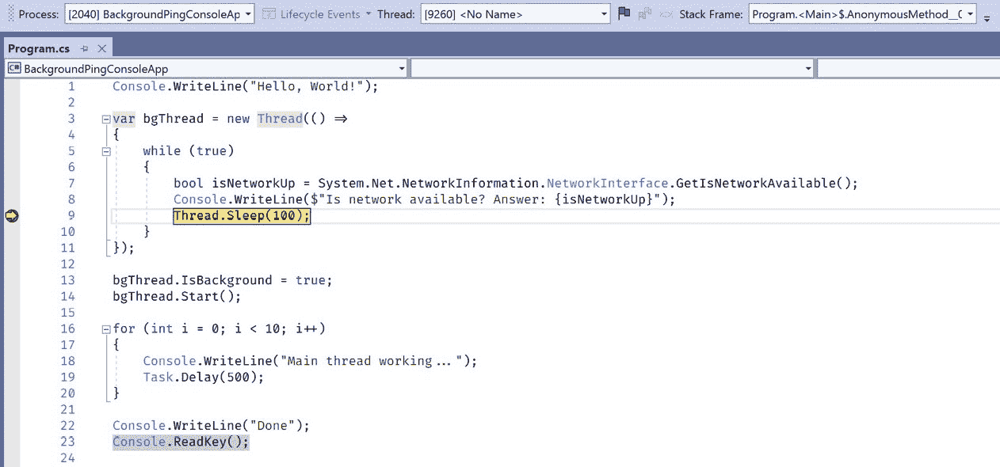

图 10.2 – 使用调试位置工具栏进行调试

工具栏提供了一些下拉控件，用于在作用域内选择**进程**、**线程**和**堆栈帧**属性。除非你使用**附加到进程**窗口显式调试多个进程，否则**进程**下拉菜单中只会包含一个进程。你还可以在 Visual Studio 中设置多个启动项目来实现这一点。

**线程**下拉菜单包含属于所选进程的所有线程。在此控件中选中的线程是我们创建的后台线程，因为断点是在该后台线程执行的代码中添加的。

**堆栈帧**下拉菜单包含当前线程调用堆栈中的帧列表。

在**线程**下拉菜单的右侧有一个**切换当前线程标记状态**按钮。我们将在*切换和标记线程*部分学习标记线程。

1.  接下来，选择**调试** | **窗口** | **线程**以打开**线程**窗口：


图 10.3 – 线程窗口激活时的调试

默认情况下，**线程**窗口将在左下角面板中打开，包含**输出**、**局部变量**和**监视**调试窗口。

1.  最后，展开**线程**窗口，以便我们可以探索和讨论其功能：

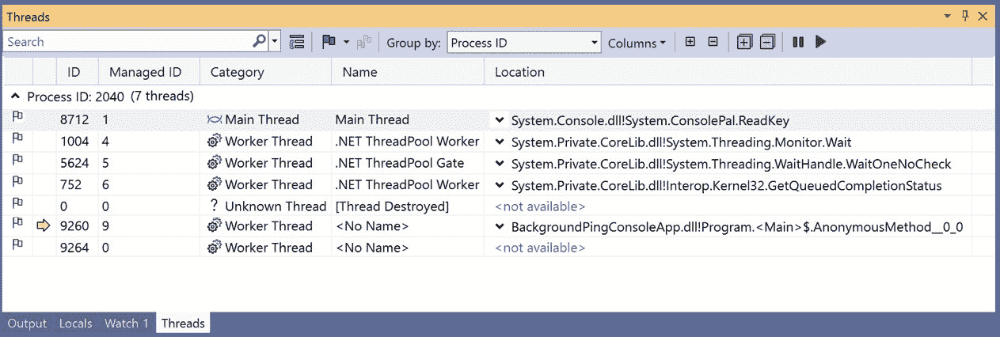

图 10.4 – 仔细查看线程窗口

## 探索线程窗口

**线程**窗口在小型窗口中提供了大量有用的信息。我们将从讨论列表中每个线程显示的数据开始：

+   **进程 ID**：默认情况下，线程列表按**进程 ID**分组。此分组可以通过窗口工具栏中的**按**下拉菜单进行控制。**进程 ID**分组还会显示其组中的线程数量。当处理大量线程时，这可能很有用。

+   **ID**：这是列表中每个线程的 ID

+   `Thread.ManagedThreadId`属性是每个线程的

+   **类别**：这描述了线程的类型（**主线程**、**工作线程**等）

+   `Thread.Name`属性是每个线程的。如果一个线程没有名称，则在此字段中显示**无名称**。

+   **位置**：此字段包含每个线程调用栈中的当前堆栈帧。您可以通过单击此字段中的下拉菜单来显示线程的完整调用栈。

一些额外的字段默认隐藏。您可以通过在**线程**窗口工具栏中选择**列**按钮来隐藏或显示列。以下是要隐藏的列：

+   **优先级**：此操作显示系统分配给线程的优先级

+   **亲和掩码**：亲和掩码确定线程可以在哪些处理器上运行。这是由系统决定的

+   **挂起计数**：此值由系统用于决定线程是否可以运行

+   **进程名称**：这是线程所属进程的名称

+   **进程 ID**：这是线程所属进程的 ID

+   **传输限定符**：这标识了连接到调试器的机器。这对于远程调试很有用

现在，让我们回顾一下**线程**窗口中可用的工具栏项：

+   **搜索**：此功能允许您搜索线程。如果您想使搜索结果包括所有调用栈信息，可以切换**包括调用栈在搜索中**按钮

+   **标记**：使用此下拉按钮，您可以选择**标记我的代码**或**标记自定义模块选择**

+   **按**：此下拉菜单允许您根据不同的字段对线程进行分组。默认情况下，它们按**进程 ID**分组

+   **列**：此操作将打开**列**选择窗口，以便您自定义在**线程**窗口中显示的列

+   **展开/折叠调用栈**：这两个按钮用于展开或折叠**位置**列中的调用栈

+   **展开/折叠组**：这两个按钮用于展开或折叠线程分组

+   **冻结线程**：此操作将窗口中所有选定的线程冻结

+   **解冻线程**：此操作将窗口中所有选定的线程解冻

让我们在**搜索**字段中尝试使用`Anon`来找到包含我们的匿名方法的线程的调用栈：

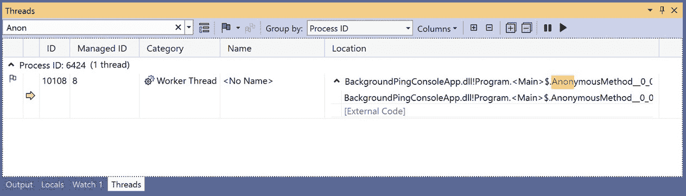

图 10.5 – 在线程窗口中搜索

现在，“线程”窗口应仅包含具有 **Anon** 部分突出显示为黄色 **AnonymousMethod** 的 **Worker Thread** 行。

现在您对“线程”窗口有了些了解，让我们学习如何使用它来切换和标记线程。

# 切换和标记线程

当调试多线程应用程序时，“线程”窗口提供了很多功能。在前一节中，我们提到了一些这些功能。在本节中，我们将学习如何切换线程、标记线程以及冻结或解冻线程。让我们从在 **BackgroundPingConsoleApp** 项目中切换线程开始。

## 切换线程

您可以通过在 `Console.ReadLine()` 语句中的上下文菜单中切换上下文来切换到不同的线程。这是主线程等待用户在控制台中按下任何键的地方：

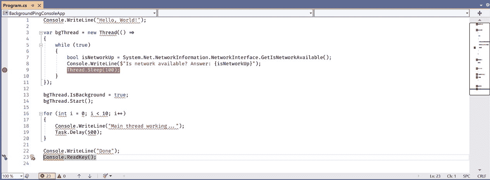

图 10.6 – 在 Visual Studio 调试器中切换线程

您可以看到，当调试具有六个或更多活动线程的并行操作时，这个功能可能非常有用。接下来，我们将学习如何使用“标记线程”功能来监视特定线程。

## 标记线程

在本节中，您将学习如何在“线程”窗口中缩小您的视野。通过仅标记我们关心的线程，我们可以减少窗口中的杂乱。以下是标记线程的方法：

1.  如果您还没有调试 **BackgroundPingConsoleApp** 项目，请现在开始调试它并等待它停止在断点处。

1.  当调试器在应用程序中暂停时，右键单击 **Main Thread** 行并选择“标记”。现在，该行的标记图标应变为橙色。

1.  对包含 **Worker Thread** 和调用堆栈中的 **AnonymousMethod** 的行执行相同的操作

1.  接下来，在窗口的工具栏中点击“仅显示标记的线程”按钮：

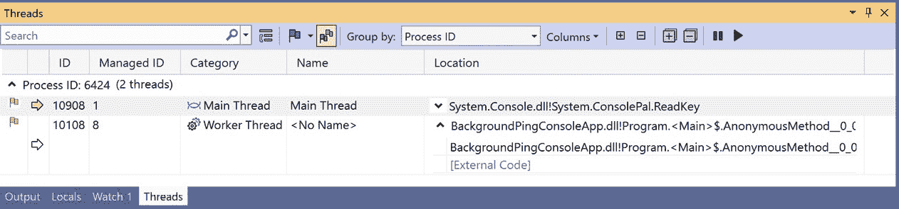

图 10.7 – 仅在“线程”窗口中显示标记的线程

这使得仅跟踪对我们当前调试会话重要的线程变得更加简单。您还可以再次单击按钮来切换按钮关闭，并查看所有线程。您还可以在“并行监视”和“并行堆栈”窗口中标记线程。它们的标记状态将跨所有这些窗口和“调试位置”工具栏保持一致。

在我们的应用程序中，标记这两个线程有一个更简单的方法。这两个线程是应用程序代码的唯一两个部分。因此，我们可以使用工具栏中的“仅标记我的代码”按钮来标记它们。

1.  取消选择“仅显示标记的线程”工具栏按钮

1.  在窗口中右键单击一个标记的行，并选择“取消标记所有”

1.  现在，在工具栏中点击“仅标记我的代码”。相同的两个线程将被再次标记：

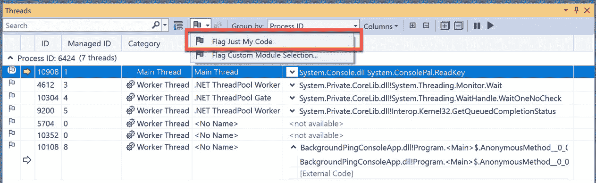

图 10.8 – 仅标记属于我们代码的线程

这比在列表中逐个选择线程要容易得多。可能并不总是那么明显哪些线程是我们代码的一部分。在下一节中，我们将学习如何冻结线程。

## 冻结线程

在 `SuspendThread` 或 `ResumeThread` Windows 函数中冻结或解冻线程。如果冻结的线程尚未执行任何代码，则它将永远不会启动，除非它被解冻。如果线程正在执行，则在 Visual Studio 中调用 **Freeze** 线程时它将暂停。

让我们尝试在我们的 **BackgroundPingConsoleApp** 项目中冻结和解冻工作线程，看看在调试器中会发生什么：

1.  在运行应用程序之前，在 `while` `(true)` 和 `Console.ReadKey()` 语句处添加新的断点。保留现有的 `Thread.Sleep(100)` 断点。

1.  开始调试应用程序

1.  当调试器在 `while (true)` 行上中断时，右键单击包含 **AnonymousMethod** 的工作线程并选择 **Freeze**

1.  继续调试；它应该在 `Console.ReadKey()` 行上中断，而不是在 `Thread.Sleep(100)`。这是因为工作线程当前没有运行：

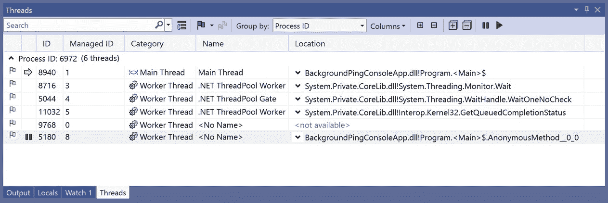

图 10.9 – 在线程窗口中冻结工作线程

1.  再次右键单击工作线程并选择 **Thaw**

1.  现在，再次继续调试。Visual Studio 在匿名方法内的 `Thread.Sleep(100)` 行上中断。

这显示了在调试多线程应用程序时 **Threads** 窗口的函数可能非常有用。

现在我们已经学会了如何通过切换、冻结和标记线程来使用 **Threads** 窗口调试我们的多线程应用程序，让我们学习如何在调试时利用 **Parallel Stacks** 和 **Parallel Watch** 窗口等附加功能。

# 调试并行应用程序

Visual Studio 为并行调试提供了几个窗口。当我们的应用程序中的 `Task` 对象。

我们将首先从 **Parallel Stacks** 窗口开始浏览这些功能。

## 使用 Parallel Stacks 窗口

**Parallel Stacks** 窗口提供了应用程序中线程或任务的视觉表示。这些是窗口中的两种不同视图。您可以通过在 **View** 下拉框中选择 **Threads** 或 **Tasks** 在它们之间切换。以下屏幕截图显示了在调试 **BackgroundPingConsoleApp** 项目时 **Threads** 视图的一个示例：

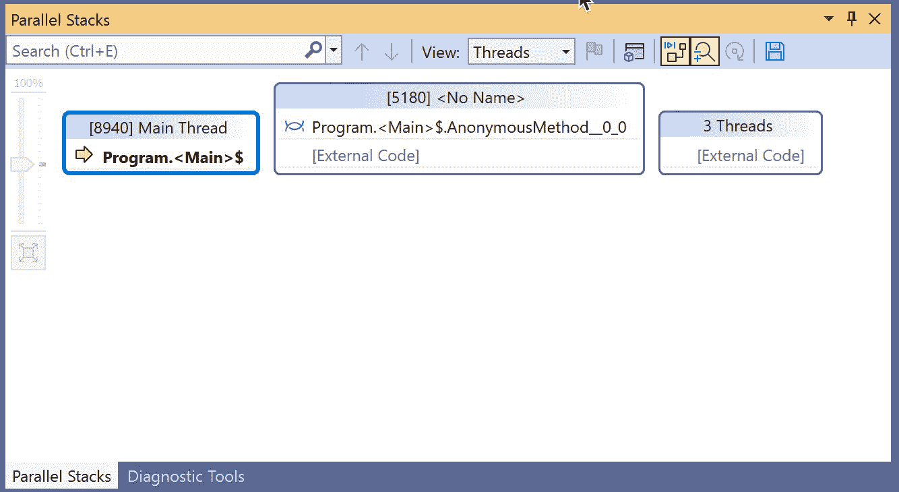

图 10.10 – 在线程视图中查看 Parallel Stacks 窗口

**Parallel Stacks** 窗口包含一个工具栏，从左到右有以下项目。您可以通过检查 Visual Studio 窗口中工具栏项的工具提示来跟随：

+   **搜索**：此选项允许在**线程**窗口中可用的相同类型的搜索功能。它具有位于**搜索**字段右侧的**查找上一个**和**查找下一个**按钮。

+   **视图**：此下拉菜单在**线程**视图和**任务**视图之间切换。

+   **仅显示标记**：此切换将隐藏任何未标记的线程。

+   **切换方法视图**：此选项将切换到当前选定方法及其调用堆栈的视图。

+   **自动滚动到当前堆栈帧**：在通过调试器逐步执行时，此选项将当前堆栈帧滚动到图中。此选项默认开启。

+   **切换缩放控制**：此选项将隐藏或显示图表面上的缩放控制。此选项默认开启。

+   **反向布局**：此选项将当前视图的布局进行镜像。

+   `.png`文件

要检查`Task`对象。让我们通过打开书中前一章的项目来与**任务**视图一起工作：

1.  从*第五章*打开您的**TaskSamples**项目，或者从本章源代码在 GitHub 上的此项目获取副本：[`github.com/PacktPublishing/Parallel-Programming-and-Concurrency-with-C-sharp-10-and-.NET-6/tree/main/chapter10`](https://github.com/PacktPublishing/Parallel-Programming-and-Concurrency-with-C-sharp-10-and-.NET-6/tree/main/chapter10)。

1.  打开`Examples.cs`并在`ProcessOrders`方法的第一行设置断点。

1.  开始调试。当调试器在断点上停止时，选择**调试** | **窗口** | **并行堆栈**。

1.  在**并行堆栈**窗口中切换到**任务**视图：

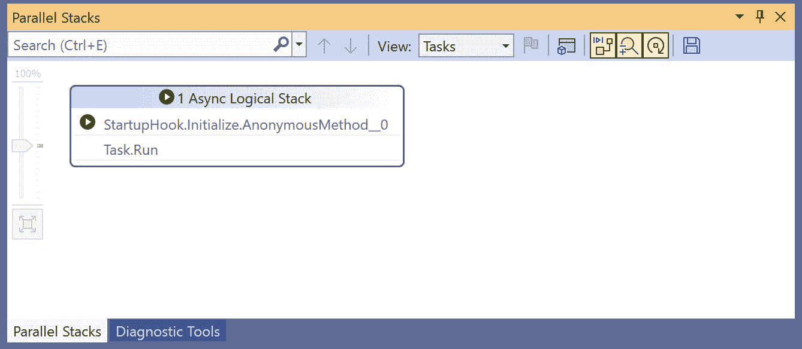

图 10.11 – 任务视图中的并行堆栈窗口

尚未启动任何任务，因此这里没有太多可看的。有一个看起来准备开始分析一些异步工作的单个**异步逻辑堆栈**块。

1.  在`Tasks.WaitAll`语句上设置断点并点击**继续**

注意

您可以通过在 Visual Studio 中右键单击要修改的断点并单击`ThreadId`或`ThreadName`值来配置断点。这将确保当所需的线程（线程）执行该行代码时，调试器仅在当前断点上停止。要了解更多关于断点条件和筛选器的信息，请查看 Microsoft Docs 上的这篇文章：[`docs.microsoft.com/visualstudio/debugger/using-breakpoints#set-a-filter-condition`](https://docs.microsoft.com/visualstudio/debugger/using-breakpoints#set-a-filter-condition)。

1.  现在，再次检查**并行堆栈**窗口：

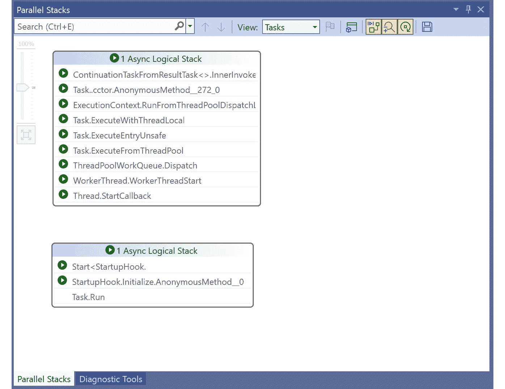

图 10.12 – 任务活动时的并行堆栈窗口

注意

如果是快速运行的方法，在它们仍在执行时捕捉这个窗口中的任务可能会很具挑战性。如果你有一个或多个`Task`对象尚未完成，你可能需要运行应用程序几次才能触碰到这个断点。

在这种情况下，**Parallel Stacks**窗口已捕获了一个正在运行的任务和另一个准备运行的任务的执行。与本章中我们进行的某些线程分析相比，这个**Tasks**视图有一些不同：

+   **Tasks**视图中只显示正在运行的任务

+   **Tasks**视图的堆栈尝试仅显示相关的调用堆栈信息。如果堆栈帧不相关，则可能从顶部和底部进行裁剪。如果你需要查看整个调用堆栈，请切换回**Threads**视图。

+   **Tasks**视图中为每个活动任务显示一个单独的块，即使它们被分配到同一个线程。

你可以悬停在任务调用堆栈中的一行上，以查看有关其线程和堆栈帧的更多信息：


图 12.13 – 查看调用堆栈帧的更多信息

如果你想要将**Tasks**视图旋转到特定的方法，你可以使用**切换方法视图**按钮：

1.  在**TaskSamples**项目中启动一个新的调试会话

1.  在`PrepareOrders`方法中的`return orders`语句上设置一个新的断点

1.  点击`PrepareOrders`方法。

1.  点击`PrepareOrders`方法以获取更多的调用堆栈和线程信息：

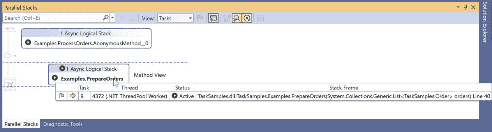

图 10.14 – 利用并行堆栈窗口的方法视图区域

接下来，我们将学习如何通过使用**并行监视**窗口来查看不同线程中变量的状态。

## 使用并行监视窗口

**Parallel Watch**窗口类似于 Visual Studio 中的**监视**窗口，但它显示有关监视表达式的值在具有访问表达式中数据的线程中的额外信息。

在这个例子中，我们将修改**TaskSamples**项目中的`Examples`类以添加一个将可供多个线程使用的状态：

1.  首先，向`Examples`类添加一个私有变量：

    ```cs
    private List<Order> _sharedOrders;
    ```

1.  在`ProcessOrders`中添加一行代码以将订单分配给`_sharedOrders`：

    ```cs
    private List<Order> PrepareOrders(List<Order> orders)
    {
        // TODO: Prepare orders here
        _sharedOrders = orders;
        return orders;
    }
    ```

1.  保持上一个示例中的断点并开始调试。继续直到调试器在`ProcessOrders`内部的`return orders`语句上中断。

1.  选择**调试** | **窗口** | **并行监视 1**以打开**并行监视 1**窗口。你可以打开多达四个**并行监视**窗口来分离你的监视表达式。

1.  在`_sharedOrders`私有变量中：


图 10.15 – 在并行监视 1 窗口中添加监视表达式

窗口指示作用域内的`_sharedOrders`以及变量中订单的数量为`0`。

1.  在**线程**窗口中右键单击**主线程**并选择**切换到线程**。在**并行监视 1**窗口中，任务不再在作用域内，因此标题标签已从**任务**更改为**线程**，并且**主线程**的**ID**属性将显示：

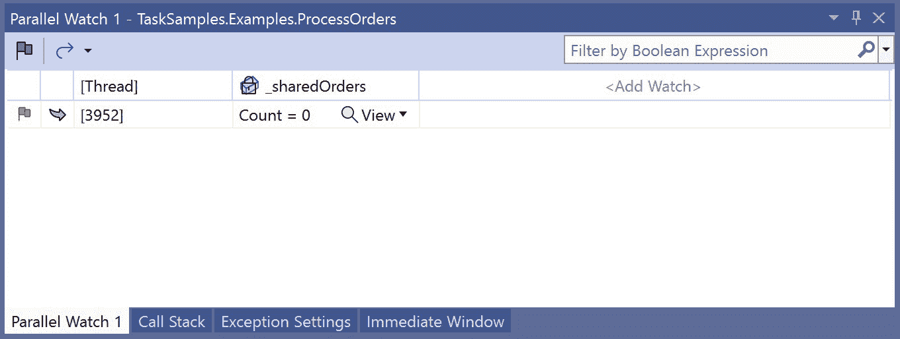

图 10.16 – 在主线程上查看监视的变量

1.  最后，选择**调试** | **窗口** | **任务**以打开**任务**窗口：

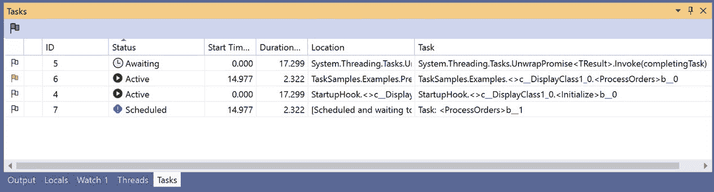

图 10.17 – 在调试时查看任务窗口

**任务**窗口将显示调试会话中作用域内的任务信息。以下列在窗口中显示：

+   **标记**：一个图标表示当前任务是否已被标记。您可以单击此字段来标记或取消标记任务。

+   **ID**：任务的 ID

+   `Task.Status`任务属性

+   **开始时间（秒）**：这表示任务在调试会话中开始的时间

+   **持续时间（秒）**：这表示任务运行了多长时间

+   **位置**：这显示了任务在线程上的调用栈位置

+   **任务**：任务开始的初始方法。在此字段中也会显示已传递的任何参数。

通过在窗口中右键单击并选择**列**，可以显示几个其他隐藏字段：

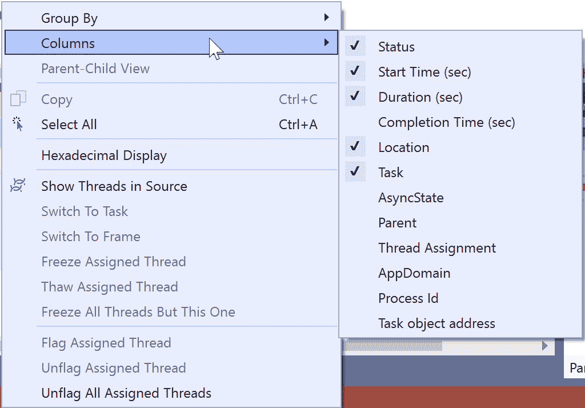

图 10.18 – 在任务窗口中添加或删除列

你可以在**任务**窗口中对任务进行排序和分组，类似于**线程**窗口的工作方式。区别在于**任务**窗口没有工具栏。所有操作都通过右键单击上下文菜单执行。

在调试并行.NET 代码时，你可以使用的另一个工具是**调试位置**工具栏。如果它尚未在 Visual Studio 中显示，你可以通过转到**视图** | **工具栏** | **调试位置**来打开它。在调试过程中，工具栏功能会亮起：

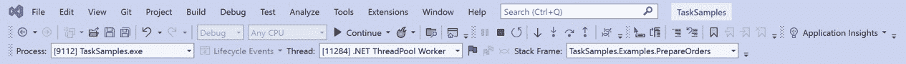

图 10.19 – 在调试时查看调试位置工具栏

从工具栏中，你可以选择活动的**进程**、**线程**和**堆栈帧**。切换当前所选线程的标记状态也很容易。

这完成了我们对.NET 并行程序员可用的调试窗口的游览。让我们通过回顾本章所学内容来结束。

# 摘要

在本章中，我们学习了多线程应用程序开发者可用的 Visual Studio 功能。我们首先通过`Thread`对象处理线程。

接下来，我们学习了如何在调试时切换、标记和冻结我们的线程。最后，我们查看了一些针对使用代码中的`Task`对象或`async`/`await`的开发者的高级调试工具。**并行堆栈**和**并行监视**窗口将任务调试提升到了新的水平。最后，我们快速浏览了**任务**窗口和**调试位置**工具栏。

在下一章，*第十一章*，我们将深入探讨使用.NET 取消并发和并行工作的不同方法。

# 问题

1.  你如何在 Visual Studio 中调试多个进程？

1.  **线程**窗口中线程的默认分组是什么？

1.  你如何向**任务**或**线程**窗口添加更多列？

1.  哪个调试窗口显示当前线程或任务的视觉表示？

1.  你可以从**并行堆栈**窗口导出哪种文件格式？

1.  你可以打开多少个**并行监视**窗口？

1.  哪个 Visual Studio 工具栏提供有关你当前正在调试的进程和线程的信息？

1.  你如何过滤**线程**窗口，只显示为你的代码创建的线程？
