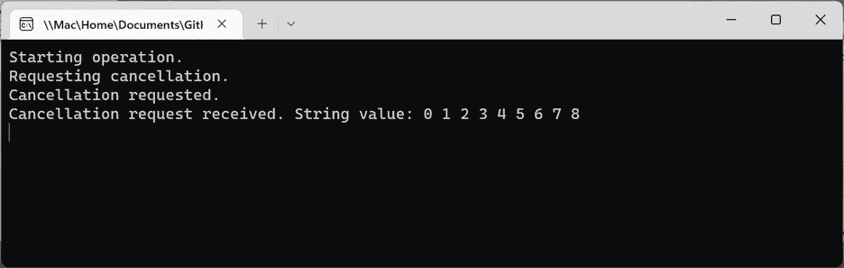
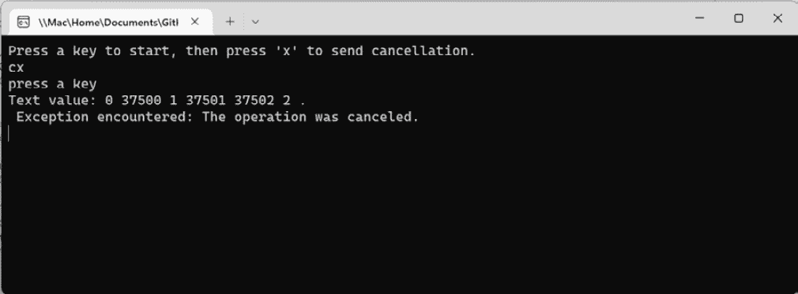
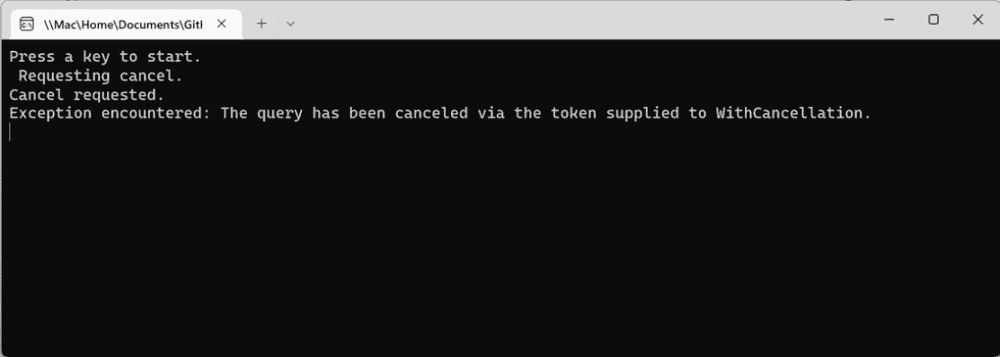
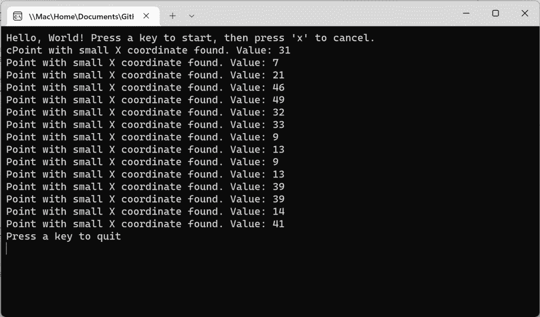
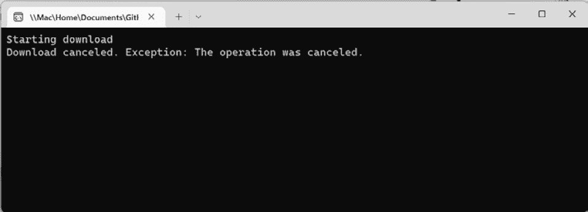

# 第十一章：*第十一章*：取消异步工作

在前面的章节中，我们查看了一些如何取消线程和任务的示例。本章将探讨更多使用 C# 和 .NET 取消并发和并行工作的方法。本章中的方法将提供使用回调、轮询和等待句柄取消后台操作的替代方法。您将通过一些实际场景深入了解如何使用各种方法安全地取消异步工作。

在本章中，您将学习以下主题：

+   取消托管线程

+   取消并行工作

+   发现线程取消的模式

+   处理多个取消源

到本章结束时，您将了解如何取消不同类型的异步和并行任务。

# 技术要求

要跟随本章中的示例，以下软件对 Windows 开发者来说是推荐的：

+   Visual Studio 2022 版本 17.2 或更高版本。

+   .NET 6.

+   要完成任何 WinForms 或 WPF 示例，您需要为 Visual Studio 安装 .NET 桌面开发工作负载。这些项目只能在 Windows 上运行。

本章的所有代码示例都可以在 GitHub 上找到，网址为 [`github.com/PacktPublishing/Parallel-Programming-and-Concurrency-with-C-sharp-10-and-.NET-6/tree/main/chapter11`](https://github.com/PacktPublishing/Parallel-Programming-and-Concurrency-with-C-sharp-10-and-.NET-6/tree/main/chapter11)。

# 取消托管线程

在 .NET 中取消异步工作基于使用 `CancellationTokenSource` 对象来管理这些请求并包含一个令牌。如果您想使用相同的触发器取消多个操作，应将相同的令牌提供给所有要取消的线程。

`CancellationTokenSource` 实例有一个 `Token` 属性，用于访问 `CancellationToken` 属性并将它传递给一个或多个异步操作。取消请求只能从 `CancellationTokenSource` 对象发出。提供给其他操作的 `CancellationToken` 属性接收取消信号但不能启动取消操作。

`CancellationTokenSource` 实现了 `IDisposable` 接口，因此在释放您的托管资源时，请务必调用 `Dispose` 方法。如果对您的流程来说可行，使用 `using` 语句或块来自动处理令牌源会更受欢迎。

理解这一点很重要，取消并不是强制施加在监听代码上。接收取消请求的异步代码必须确定它是否可以当前取消其工作。它可能决定立即取消，在完成一些中间任务后取消，或者完成其工作并忽略请求。可能有合理的理由让一个例程忽略取消请求。可能工作几乎完成，或者当前状态取消会导致某些数据损坏。取消的决定必须在请求者和监听者之间是相互的。

让我们看看如何在 `ThreadPool` 线程上如何协同取消一些正在处理的后台线程工作示例：

1.  在 Visual Studio 中，创建一个名为 `CancelThreadsConsoleApp` 的新 .NET 6 控制台应用程序。

1.  在 Visual Studio 中创建一个名为 `ManagedThreadsExample` 的新类。

1.  在 `ManagedThreadsExample` 类中创建一个名为 `ProcessText` 的方法：

    ```cs
    public static void ProcessText(object? cancelToken)
    {
        var token = cancelToken as CancellationToken?;
        string text = "";
        for (int x = 0; x < 75000; x++)
        {
            if (token != null && token.Value
                .IsCancellationRequested)
            {
                Console.WriteLine($"Cancellation request 
                    received. String value: {text}");
                break;
            }
            text += x + " ";
            Thread.Sleep(500);
        }
    }
    ```

此方法将迭代变量 `x` 的值追加到 `text` 的 `string` 变量中，直到收到取消请求。有一个 `Thread.Sleep(500)` 语句，以便调用方法有足够的时间取消操作。

1.  接下来，在 `Program.cs` 中创建一个名为 `CancelThread` 的方法：

    ```cs
    private static void CancelThread()
    {
        using CancellationTokenSource tokenSource = new();
        Console.WriteLine("Starting operation.");
        ThreadPool.QueueUserWorkItem(new 
            WaitCallback(ManagedThreadsExample
                .ProcessText), tokenSource.Token);
        Thread.Sleep(5000);
        Console.WriteLine("Requesting cancellation.");
        tokenSource.Cancel();
        Console.WriteLine("Cancellation requested.");
    }
    ```

此方法调用 `ThreadPool.QueueUserWorkItem` 将 `ProcessText` 方法排队到 `ThreadPool` 线程。该方法还从 `tokenSource.Token` 接收一个取消令牌。等待五秒后，调用 `tokenSource.Cancel`，`ProcessText` 将收到取消请求。

注意到 `tokenSource` 是在 `using` 语句中创建的。这确保了当它超出作用域时，它将被正确地释放。

1.  在 `Program.cs` 的 `Main` 方法中添加对 `CancelThread` 的调用：

    ```cs
    static void Main(string[] args)
    {
        CancelThread();
        Console.ReadKey();
    }
    ```

1.  最后，运行应用程序并观察控制台输出：



图 11.1 – 运行 CancelThreadsConsoleApp 项目

`for` 循环应该在收到取消请求之前有足够的时间执行 9 或 10 次。你的输出是如何匹配的？

现在我们已经覆盖了一些取消的基础知识，并使用了一个常见的取消令牌使用方法，让我们创建一些取消并行循环和 PLINQ 查询的示例。

# 取消并行工作

在本节中，我们将通过一些取消并行操作的示例来进行操作。有几个操作属于这个范畴。有静态并行操作，它们是 `System.Threading.Tasks.Parallel` 类的一部分，还有 PLINQ 操作。这两种类型都使用了一个 `CancellationToken` 属性，就像我们在上一节中使用的托管线程示例一样。然而，处理取消请求的方式略有不同。让我们通过一个示例来了解这些差异。

## 取消并行循环

在本节中，我们将创建一个示例，说明如何取消 `Parallel.For` 循环。相同的取消方法也用于 `Parallel.ForEach` 方法。执行以下步骤：

1.  打开上一节中的 `CancelThreadsConsoleApp` 项目。

1.  在 `ManagedThreadsExample` 类中，创建一个新的 `ProcessTextParallel` 方法，其实现如下：

    ```cs
    public static void ProcessTextParallel(object? 
        cancelToken)
    {
        var token = cancelToken as CancellationToken?;
        if (token == null) return;
        string text = "";
        ParallelOptions options = new()
        {
            CancellationToken = token.Value,
            MaxDegreeOfParallelism = 
                Environment.ProcessorCount
        };
        try
        {
            Parallel.For(0, 75000, options, (x) =>
            {
                text += x + " ";
                Thread.Sleep(500);
            });
        }
        catch (OperationCanceledException e)
        {
            Console.WriteLine($"Text value: {text}. 
                {Environment.NewLine} Exception 
                    encountered: {e.Message}");
        }
    }
    ```

实际上，前面的代码与我们的上一个示例中的 `ProcessText` 方法做的是同样的事情。它将一个数值追加到 `text` 变量中，直到收到取消请求。让我们看看它们之间的区别：

+   首先，我们将 `token.Value` 设置为 `ParallelOptions` 对象的 `CancellationToken` 属性。这些选项作为 `Parallel.For` 方法的第三个参数传递。

+   第二个主要区别是我们通过捕获 `OperationCanceledException` 类型来处理取消请求。当我们的 `Program.cs` 中的其他代码请求取消时，将抛出此异常类型。

1.  接下来，向 `Program.cs` 中添加一个名为 `CancelParallelFor` 的方法：

    ```cs
    private static void CancelParallelFor()
    {
        using CancellationTokenSource tokenSource = new();
        Console.WriteLine("Press a key to start, then 
            press 'x' to send cancellation.");
        Console.ReadKey();
        Task.Run(() =>
        {
            if (Console.ReadKey().KeyChar == 'x')
                tokenSource.Cancel();
            Console.WriteLine();
            Console.WriteLine("press a key");
        });
        ManagedThreadsExample.ProcessTextParallel
            (tokenSource.Token);
    }
    ```

在这个方法中，用户被指示按下一个键以启动操作，并在他们准备好取消操作时按下 *X* 键。处理从控制台接收 `x` `KeyChar` 并发送 `Cancel` 请求的代码在另一个线程上执行，以便保持当前线程可以调用 `ProcessTextParallel`。

1.  最后，更新 `Main` 方法以调用 `CancelParallelFor` 并注释掉对 `CancelThread` 的调用：

    ```cs
    static void Main(string[] args)
    {
        //CancelThread();
        CancelParallelFor();
        Console.ReadKey();
    }
    ```

1.  现在运行项目。按照提示取消 `Parallel.For` 循环，并检查输出：



图 11.2 – 从控制台取消 Parallel.For 循环

注意数字根本不是按顺序排列的。在这种情况下，看起来 `Parallel.For` 操作使用了两个不同的线程。第一个线程从 `0` 开始，而第二个线程在以 `37500` 开始的整数上操作。这是提供给方法参数的最大值 `75000` 的中点。

在下一节中，我们将简要介绍如何取消 PLINQ 查询。

## 取消 PLINQ 查询

取消 PLINQ 查询也可以通过捕获 `OperationCanceledException` 类型来实现。然而，与用于并行循环的 `ParallelOptions` 对象不同，您可以在查询中调用 `WithCancellation`。

要了解如何取消 PLINQ 查询，让我们通过一个示例来操作：

1.  通过向 `ManagedThreadsExample` 类中添加一个名为 `ProcessNumsPlinq` 的方法来开始这个示例：

    ```cs
    public static void ProcessNumsPlinq(object? 
        cancelToken)
    {
        int[] input = Enumerable.Range(1, 
            25000000).ToArray();
        var token = cancelToken as CancellationToken?;
        if (token == null) return;
        int[]? result = null;
        try
        {
            result =
                (from value in input.AsParallel()
                    .WithCancellation(token.Value)
                    where value % 7 == 0
                    orderby value
                    select value).ToArray();
        }
        catch (OperationCanceledException e)
        {
            Console.WriteLine($"Exception encountered: 
                {e.Message}");
        }
    }
    ```

此方法创建了一个包含 2500 万个整数的数组，并使用 PLINQ 查询来确定其中哪些可以被七整除。`token.Value` 被传递到查询中的 `WithCancellation` 操作。当取消请求抛出异常时，异常详细信息将被写入控制台。

1.  接下来，向 `Program.cs` 中添加一个名为 `CancelPlinq` 的方法：

    ```cs
    private static void CancelPlinq()
    {
        using CancellationTokenSource tokenSource = new();
        Console.WriteLine("Press a key to start.");
        Console.ReadKey();
        Task.Run(() =>
        {
            Thread.Sleep(100);
            Console.WriteLine("Requesting cancel.");
            tokenSource.Cancel();
            Console.WriteLine("Cancel requested.");
        });
        ManagedThreadsExample.ProcessNumsPlinq
            (tokenSource.Token);
    }
    ```

这次，取消将在 100 毫秒后自动触发。

1.  更新 `Main` 方法以调用 `CancelPlinq`，并运行应用程序：



图 11.3 – 在控制台应用程序中取消 PLINQ 操作

与前面的示例不同，没有查询输出可以检查。您无法从 PLINQ 查询中获取部分输出。`result` 变量将为 `null`。

在下一节中，我们将探讨一些不同的取消方法。

# 发现线程取消的模式

有不同的方法来监听来自线程或任务的取消请求。到目前为止，我们已经看到了通过处理 `OperationCanceledException` 类型或检查 `IsCancellationRequested` 的值来管理这些请求的示例。通常在循环内部检查 `IsCancellationRequested` 的模式被称为 `ManualResetEvent` 或 `ManualResetEventSlim`。

让我们先尝试另一个通过轮询处理取消请求的示例。

## 通过轮询取消

在本节中，我们将创建另一个示例，该示例使用轮询来取消后台任务。前面的轮询示例是在 `ThreadPool` 线程上的后台线程中运行的。此示例也将启动一个 `ThreadPool` 线程，但它将利用 `Task.Run` 来启动后台线程。我们将创建和处理一百万个 `System.Drawing.Point` 对象，找到 `Point.X` 值小于 `50` 的对象。用户可以选择通过按 *X* 键来取消处理：

1.  首先创建一个名为 `CancellationPatterns` 的新 .NET 控制台应用程序项目

1.  向项目中添加一个名为 `PollingExample` 的新类

1.  向 `PollingExample` 类中添加一个名为 `GeneratePoints` 的私有静态方法。这将生成我们所需的具有随机 `X` 值的 `Point` 对象数量：

    ```cs
    private static List<Point> GeneratePoints(int count)
    {
        var rand = new Random();
        var points = new List<Point>();
        for (int i = 0; i <= count; i++)
        {
            points.Add(new Point(rand.Next(1, count * 2), 
                100));
        }
        return points;
    }
    ```

1.  不要忘记添加一个 `using` 语句来使用 `Point` 类型：

    ```cs
    using System.Drawing;
    ```

1.  接下来，向 `PollingExample` 类中添加一个名为 `FindSmallXValues` 的私有静态方法。此方法遍历点列表，并输出 `X` 值小于 `50` 的点。每次循环时，它会检查令牌是否被取消，并在发生取消时退出循环：

    ```cs
    private static void FindSmallXValues(List<Point> 
        points, CancellationToken token)
    {
        foreach (Point point in points)
        {
            if (point.X < 50)
            {
                Console.WriteLine($"Point with small X 
                    coordinate found. Value: {point.X}");
            }
            if (token.IsCancellationRequested)
            {
                break;
            }
            Thread.SpinWait(5000);
        }
    }
    ```

在循环的末尾添加了一个 `Thread.SpinWait` 语句，以给用户一些取消操作的时间。

1.  向 `PollingExample` 类中添加一个名为 `CancelWithPolling` 的公共静态方法：

    ```cs
    public static void CancelWithPolling()
    {
        using CancellationTokenSource tokenSource = new();
        Task.Run(() => FindSmallXValues(GeneratePoints
            (1000000), tokenSource.Token), tokenSource
                .Token);
        if (Console.ReadKey(true).KeyChar == 'x')
        {
            tokenSource.Cancel();
            Console.WriteLine("Press a key to quit");
        }
    }
    ```

前面的方法创建了 `CancellationTokenSource` 对象，并将其传递给 `FindSmallXValues` 和 `Task.Run`。如果你想要取消 `Task`，当 `IsCancellationRequested` 变为 `true` 时，不是从循环中跳出，而是调用 `token.ThrowIfCancellationRequested`。这将在 `Task` 中抛出异常。`CancelWithPolling` 方法将需要围绕 `Task.Run` 调用添加 `try`/`catch` 块。无论如何，使用异常处理来处理所有多线程代码都是一个最佳实践。在这种情况下，你将有两个异常处理程序：一个用于处理 `OperationCanceledException`，另一个用于处理 `AggregateException`。

此外，`CancelWithPolling` 方法中还有代码来确定当用户按下 *X* 键取消操作时。

1.  最后，打开 `Program.cs` 并添加一些代码来执行示例：

    ```cs
    using CancellationPatterns;
    Console.WriteLine("Hello, World! Press a key to start, 
        then press 'x' to cancel.");
    Console.ReadKey();
    PollingExample.CancelWithPolling();
    Console.ReadKey();
    ```

1.  现在运行应用程序，并检查输出：



图 11.4 – 运行取消轮询示例

根据你取消等待的时间长度，你可能会找到不同数量的点。

在下一节中，我们将学习如何注册一个回调方法来处理取消请求。

## 使用回调取消

一些 .NET 代码支持注册一个回调方法来取消处理。支持使用回调进行取消的一个类是 `System.Net.WebClient`。在这个例子中，我们将使用 `WebClient` 来开始下载一个文件。下载将在三秒后取消。为了确保文件下载足够大，在三个秒后尚未完成，我们将从 **Internet Archive** (https://archive.org/) 下载一个大型无损有声书文件。我们将下载荷马史诗《奥德赛》的第一部分。此文件大小为 471.1 MB。你可以在 https://archive.org/details/lp_the-odyssey_homer-anthony-quayle 查看这本书的所有免费下载。执行以下步骤：

1.  打开 `CallbackExample`

1.  首先添加一个名为 `GetDownloadFileName` 的方法来构建文件下载的路径。我们将将其下载到我们的程序集执行的同一文件夹中：

    ```cs
    private static string GetDownloadFileName()
    {
        string path = System.Reflection.Assembly
           .GetAssembly(typeof(CallbackExample)).Location;
        string folder = Path.GetDirectoryName(path);
        return Path.Combine(folder, "audio.flac");
    }
    ```

1.  接下来，添加一个名为 `DownloadAudioAsync` 的 `async` 方法。此方法将处理文件下载和取消操作。有几个异常处理程序来捕获 `DownloadFileTaskAsync` 方法可能抛出的任何类型的异常。反过来，它们都会抛出一个 `OperationCanceledException` 类型的异常，由父方法处理：

    ```cs
    private static async Task DownloadAudioAsync
        (CancellationToken token)
    {
        const string url = "https://archive.org/download/
            lp_the-odyssey_homer-anthony-quayle/disc1/
                lp_the-odyssey_homer-anthony-quayle
                    _disc1side1.flac";
        using WebClient webClient = new();
        token.Register(webClient.CancelAsync);
        try
        {
            await webClient.DownloadFileTaskAsync(url, 
                GetDownloadFileName());
        }
        catch (WebException we)
        {
            if (we.Status == WebExceptionStatus
                .RequestCanceled)
                throw new OperationCanceledException();
        }
        catch (AggregateException ae)
        {
            foreach (Exception ex in ae.InnerExceptions)
            {
                if (ex is WebException exWeb &&
                    exWeb.Status == WebExceptionStatus
                        .RequestCanceled)
                    throw new OperationCanceled
                        Exception();
            }
        }
        catch (TaskCanceledException)
        {
            throw new OperationCanceledException();
        }
    }
    ```

1.  为 `WebClient` 类型添加一个 `using` 语句：

    ```cs
    using System.Net;
    ```

1.  现在添加一个名为 `CancelWithCallback` 的公共 `async` 方法。此方法调用 `DownloadAudioAsync`，等待三秒钟，然后在 `CancellationTokenSource` 对象上调用 `Cancel`。在 `try` 块中等待任务意味着我们可以直接处理 `OperationCanceledException` 类型。如果你使用了 `task.Wait`，你将不得不捕获 `AggregateException` 并检查是否有一个 `InnerException` 对象是 `OperationCanceledException` 类型：

    ```cs
    public static async Task CancelWithCallback()
    {
        using CancellationTokenSource tokenSource = new();
        Console.WriteLine("Starting download");
        var task = DownloadAudioAsync(tokenSource.Token);
        tokenSource.Token.WaitHandle.WaitOne
            (TimeSpan.FromSeconds(3));
        tokenSource.Cancel();
        try
        {
            await task;
        }
        catch (OperationCanceledException ex)
        {
            Console.WriteLine($"Download canceled. 
                Exception: {ex.Message}");
        }
    }
    ```

在这一步，可能需要调整 `tokenSource.Token.WaitHandle.WaitOne` 调用中的秒数。时间可能会根据你的计算机的下载速度和处理速度而变化。如果你在控制台输出中没有看到 `Download canceled` 消息，请尝试调整此值。

1.  最后，注释掉 `Program.cs` 中的现有代码，并添加以下代码来调用 `CallbackExample` 类：

    ```cs
    using CancellationPatterns;
    await CallbackExample.CancelWithCallback();
    Console.ReadKey();
    ```

1.  现在运行应用程序，并检查输出：



图 11.5 – 使用 CancellationToken 和回调取消下载

你可以通过查看你的程序集运行所在的文件夹来验证下载已经开始但未完成。你应该会看到一个名为 **audio.flac** 的文件，文件大小为 **0 KB**。你可以安全地删除此文件，因为它如果在尝试再次下载时可能会引发异常。

现在我们已经看到了如何使用回调方法取消后台任务，让我们通过一个使用等待句柄的例子来结束本节。

## 使用等待句柄取消操作

在本节中，我们将使用 `ManualResetEventSlim` 来取消一个原本不会对用户输入做出响应的后台任务。此对象有 `Set` 和 `Reset` 事件来启动/恢复或暂停操作。当操作尚未开始或已暂停时，调用 `ManualResetEventSlim.Wait` 将导致操作在该语句上暂停，直到另一个线程调用 `Set` 以启动或恢复处理。

此示例将遍历 100,000 个整数，并将每个偶数输出到控制台。由于 `ManualResetEventSlim` 对象和 `CancellationToken` 的存在，此过程可以启动、暂停、恢复或取消。让我们在我们的项目中尝试此示例：

1.  首先向 **CancellationPatterns** 项目中添加一个名为 `WaitHandleExample` 的类。

1.  在新类中添加一个名为 `resetEvent` 的私有变量：

    ```cs
    private static ManualResetEventSlim resetEvent = 
        new(false);
    ```

1.  在类中添加一个名为 `ProcessNumbers` 的私有静态方法。此方法遍历数字，并且只有在 `resetEvent.Wait` 允许它继续时才继续处理：

    ```cs
    private static void ProcessNumbers(IEnumerable<int> 
        numbers, CancellationToken token)
    {
        foreach (var number in numbers)
        {
            if (token.IsCancellationRequested)
            {
                Console.WriteLine("Cancel requested");
                token.ThrowIfCancellationRequested();
            }
            try
            {
                resetEvent.Wait(token);
            }
            catch (OperationCanceledException)
            {
                Console.WriteLine("Operation canceled.");
                break;
            }
            if (number % 2 == 0)
                Console.WriteLine($"Found even number: 
                    {number}");
            Thread.Sleep(500);
        }
    }
    ```

1.  接下来，向类中添加一个名为 `CancelWithResetEvent` 的公共静态异步方法。此方法创建要处理的数字列表，在 `Task.Run` 调用中调用 `ProcessNumbers`，并使用 `while` 循环来监听用户输入：

    ```cs
    public static async Task CancelWithResetEvent()
    {
        using CancellationTokenSource tokenSource = new();
        var numbers = Enumerable.Range(0, 100000);
        _ = Task.Run(() => ProcessNumbers(numbers, 
            tokenSource.Token), tokenSource.Token);
        Console.WriteLine("Use x to cancel, p to pause, or 
            s to start or resume,");
        Console.WriteLine("Use any other key to quit the 
            program.");
        bool running = true;
        while (running)
        {
            char key = Console.ReadKey(true).KeyChar;
            switch (key)
            {
                case 'x':
                    tokenSource.Cancel();
                    break;
                case 'p':
                    resetEvent.Reset();
                    break;
                case 's':
                    resetEvent.Set();
                    break;
                default:
                    running = false;
                    break;
            }
            await Task.Delay(100);
        }
    }
    ```

1.  最后，更新 `Program.cs` 以包含以下代码：

    ```cs
    using CancellationPatterns;
    await WaitHandleExample.CancelWithResetEvent();
    Console.ReadKey();
    ```

1.  运行程序进行测试。遵循控制台提示以启动、暂停、恢复和取消过程：


图 11.6 – 在控制台中测试 CancelWithResetEvent 方法

你应该在控制台输出中看到在操作取消之前已经找到了几个事件编号。完成处理的数量可能因你的计算机处理器而异。

在下一节中，我们将通过学习如何处理来自多个来源的取消请求来总结取消。

# 处理多个取消来源

后台任务可以利用 `CancellationTokenSource` 从所需的所有来源接收取消请求。静态 `CancellationTokenSource.CreateLinkedTokenSource` 方法接受一个 `CancellationToken` 对象数组来创建一个新的 `CancellationTokenSource` 对象，如果任何源令牌收到取消请求，它将通知我们。

让我们看看如何在我们的 **CancellationPatterns** 项目中实现这个快速示例：

1.  首先，打开 `PollingExample` 类。我们将创建一个接受 `CancellationTokenSource` 参数的 `CancelWithPolling` 方法的重载。`CancelWithPolling` 的两个重载将看起来像这样：

    ```cs
    public static void CancelWithPolling()
    {
        using CancellationTokenSource tokenSource = new();
        CancelWithPolling(tokenSource);
    }
    public static void CancelWithPolling
        (CancellationTokenSource tokenSource)
    {
        Task.Run(() => FindSmallXValues(GeneratePoints
            (1000000), tokenSource.Token), 
                tokenSource.Token);
        if (Console.ReadKey(true).KeyChar == 'x')
        {
            tokenSource.Cancel();
            Console.WriteLine("Press a key to quit");
        }
    }
    ```

1.  接下来，添加一个名为 `MultipleTokensExample` 的新类。

1.  在 `MultipleTokensExample` 类中创建一个名为 `CancelWithMultipleTokens` 的方法。此方法接受 `parentToken` 作为参数，创建自己的 `tokenSource`，然后将它们组合成一个 `combinedSource` 对象以传递给 `CancelWithPolling` 方法：

    ```cs
    public static void CancelWithMultipleTokens
        (CancellationToken parentToken)
    {
        using CancellationTokenSource tokenSource = new();
        using CancellationTokenSource combinedSource =  
            CancellationTokenSource.CreateLinked
               TokenSource(parentToken, tokenSource
                   .Token);
        PollingExample.CancelWithPolling(combinedSource);
        Thread.Sleep(1000);
        tokenSource.Cancel();
    }
    ```

我们调用 `tokenSource.Cancel`，但如果在三个 `CancellationTokenSource` 对象中的任何一个上调用 `Cancel`，`CancellWithPolling` 中的处理将接收到一个取消请求。

1.  在 `Program.cs` 中添加一些代码来调用 `CancelWithMultipleTokens`：

    ```cs
    using CancellationPatterns;
    CancellationTokenSource tokenSource = new();
    MultipleTokensExample.CancelWithMultipleTokens
        (tokenSource.Token);
    Console.ReadKey();
    ```

1.  运行程序，你应该会看到一个类似于在 *发现线程取消模式* 部分的 *使用轮询取消* 子部分中看到的结果。

尝试更改用于调用 `Cancel` 的 `CancellationTokenSource` 对象。无论取消请求的来源如何，输出都应该保持不变。

如果你在 `Task` 中抛出异常，后台 `Task` 也会结束。这具有结束后台处理的效果，但 `TaskStatus` 将是 `Faulted` 而不是 `Canceled`。

这完成了我们对来自多个来源的取消请求的回顾，以及使用 C# 和 .NET 取消任务和线程的游览。让我们回顾一下本章学到的内容。

# 摘要

在本章中，我们学习了许多取消后台线程和任务的新方法。为用户提供一种取消长时间运行任务或当用户或操作系统关闭或挂起您的应用程序时自动取消它们的方法是很重要的。

在完成本章的示例后，你现在理解了如何使用轮询、回调和等待句柄来协同取消后台任务。此外，你还学习了如何处理来自多个来源的取消请求。

在下一章中，我们将探讨.NET 开发者如何对使用多线程结构的代码进行单元测试。

# 问题

1.  `CancellationToken`对象的哪个属性指示是否已发出取消请求？

1.  哪种数据类型提供了`CancellationToken`对象？

1.  当调用`ThrowIfCancellationRequested`时，会抛出哪种异常类型？

1.  .NET 中的`WebClient`对象使用了哪种取消模式？

1.  哪种.NET 类型可以使用`CancellationToken`对象暂停或恢复操作？

1.  哪个重置事件用于暂停处理？

1.  `CancellationTokenSource`中的哪个静态方法可以将多个`CancellationToken`对象组合成一个单一来源？
