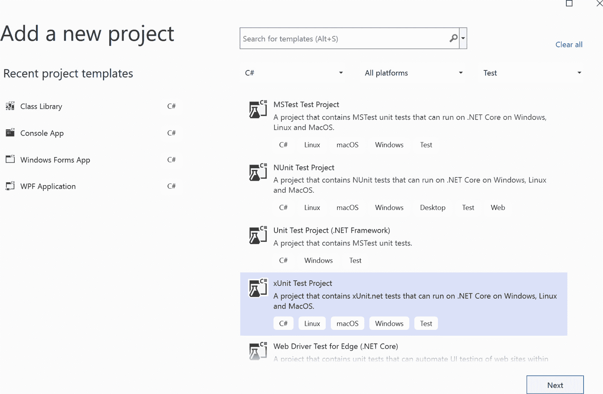
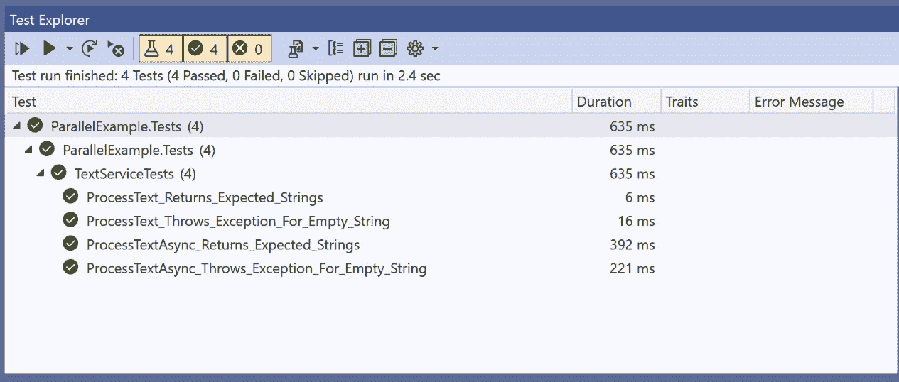
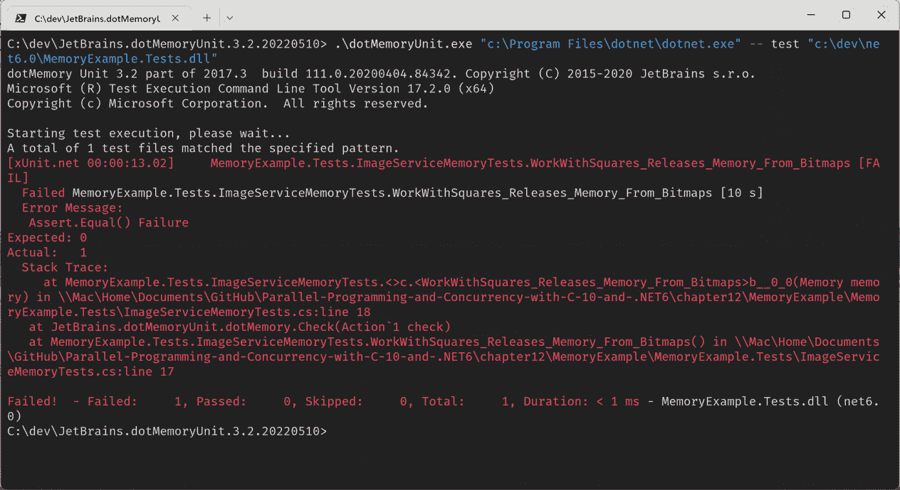

# *第十二章*：单元测试异步、并发和平行代码

对于 .NET 开发者来说，单元测试异步、并发和平行代码可能是一个挑战。幸运的是，您可以采取一些步骤来帮助减轻难度。本章将提供一些具体的建议和有用的示例，说明开发者如何对利用多线程结构的代码进行单元测试。这些示例将说明，即使在执行多线程操作时，单元测试仍然可以保持可靠性。此外，我们还将探讨一个第三方工具，该工具有助于创建自动化的单元测试，以监控您的代码中可能存在的内存泄漏。

为您的 .NET 项目创建单元测试对于维护代码库的健康成长和演变至关重要。当开发人员对具有单元测试覆盖的代码进行更改时，他们可以运行现有测试，以确信没有现有功能因代码更改而被破坏。Visual Studio 使您在整个代码生命周期中创建、运行和维护单元测试项目变得简单。

Visual Studio 中的 **测试资源管理器** 窗口可以检测并运行使用微软的 MSTest 框架创建的单元测试，以及 NUnit 和 xUnit.net 等第三方框架。无论您是开发 Windows 应用程序、移动设备还是云应用程序，您都应该始终计划为您的项目开发一系列单元测试，并定义测试覆盖率的目标。

注意

本章假设您对单元测试和良好的单元测试实践有所了解。如果您想了解使用 xUnit.net 进行单元测试项目的良好入门指南，可以查看微软的文档，网址为 [`docs.microsoft.com/dotnet/core/testing/unit-testing-with-dotnet-test`](https://docs.microsoft.com/dotnet/core/testing/unit-testing-with-dotnet-test) 和 [`docs.microsoft.com/visualstudio/test/getting-started-with-unit-testing`](https://docs.microsoft.com/visualstudio/test/getting-started-with-unit-testing)。

在本章中，我们将涵盖以下内容：

+   单元测试异步代码

+   单元测试并发代码

+   单元测试并行代码

+   使用单元测试检查内存泄漏

到本章结束时，您将拥有工具和建议，帮助您自信地编写具有单元测试覆盖的现代多线程代码。

注意

本章中的单元测试是使用 **xUnit.net** 单元测试框架创建的。您可以使用您选择的任何单元测试框架实现相同的结果，包括 **MSTest** 和 **NUnit**。我们将在本章后面展示的内存单元测试框架使用 xUnit.net，但也支持 MSTest 和 NUnit。

# 技术要求

为了跟随本章中的示例，以下软件被推荐给 Windows 开发者：

+   Visual Studio 2022 版本 17.2 或更高版本

+   .NET 6

+   一个 JetBrains dotMemory Unit 独立控制台运行器

本章的所有代码示例都可以在 GitHub 上找到：[`github.com/PacktPublishing/Parallel-Programming-and-Concurrency-with-C-sharp-10-and-.NET-6/tree/main/chapter12`](https://github.com/PacktPublishing/Parallel-Programming-and-Concurrency-with-C-sharp-10-and-.NET-6/tree/main/chapter12)。

让我们首先看看如何编写覆盖`async` C#方法的单元测试。

# 单元测试异步代码

单元测试异步代码需要与编写良好的异步 C#代码相同的方法。如果你需要关于如何使用`async`方法的复习，你可以查看*第五章*。

当编写一个针对`async`方法的单元测试时，你将使用`await`关键字来等待方法完成。这要求你的单元测试方法是`async`并返回`Task`。就像其他 C#代码一样，不允许创建`async void`方法。让我们看看一个非常简单的测试方法：

```cs
[Fact]
```

```cs
private async Task GetBookAsync_Returns_A_Book()
```

```cs
{
```

```cs
    // Arrange
```

```cs
    BookService bookService = new();
```

```cs
    var bookId = 123;
```

```cs
    // Act
```

```cs
    var book = await bookService.GetBookAsync(bookId);
```

```cs
    // Assert
```

```cs
    Assert.NotNull(book);
```

```cs
    Assert.Equal(bookId, book.Id);
```

```cs
}
```

这可能看起来像你为同步代码编写的多数测试。只有几个不同之处：

+   首先，测试方法是`async`并返回`Task`。

+   其次，调用`GetBookAsync`时使用了`await`关键字来等待结果。否则，这个测试遵循典型的**安排-行动-断言**模式，并像通常那样测试结果。

让我们在 Visual Studio 中创建一个简单的项目来尝试这个，并查看结果：

1.  开始创建一个新的`AsyncUnitTesting`：


图 12.1 – 创建一个新的类库项目

1.  接下来，我们将向`AsyncUnitTesting.Tests`添加一个测试项目：



图 12.2 – 将 xUnit 测试项目添加到解决方案中

1.  在`BookOrderService.cs`中。当 Visual Studio 询问你是否想要重命名所有对`Class1`的使用时，选择**是**。

1.  打开`BookOrderService`类，并添加一个名为`GetCustomerOrdersAsync`的`async`方法：

    ```cs
    public async Task<List<string>> 
        GetCustomerOrdersAsync(int customerId)
    {
        if (customerId < 1)
        {
            throw new ArgumentException("Customer ID must 
                be greater than zero.", nameof
                    (customerId));
        }
        var orders = new List<string>
        {
            customerId + "1",
            customerId + "2",
            customerId + "3",
            customerId + "4",
            customerId + "5",
            customerId + "6"
        };
        // Simulate time to fetch orders
        await Task.Delay(1500);
        return orders;
    }
    ```

此方法接受`customerId`作为参数，并返回包含订单号的`List<string>`。如果提供的`customerId`小于`1`，则抛出`ArgumentException`。否则，创建一个包含六个订单号且以`customerId`为前缀的列表。在注入`Task.Delay`为`1500`毫秒后，将`orders`返回给调用方法。

1.  接下来，右键单击**AsyncUnitTesting.Tests**项目，然后点击**添加** | **项目引用**。在**引用管理器**对话框中，勾选**AsyncUnitTesting**项目的复选框，然后点击**确定**。

1.  现在，将`UnitTest1`类重命名为`BookOrderServiceTests`，并在 Visual Studio 编辑器中打开该文件。

1.  是时候开始添加测试了。让我们先测试一下快乐路径。添加一个名为`GetCustomerOrdersAsync_Returns_Orders_For_Valid_CustomerId`的测试方法：

    ```cs
    [Fact]
    public async Task GetCustomerOrdersAsync_Returns_
        Orders_For_Valid_CustomerId()
    {
        var service = new BookOrderService();
        int customerId = 3;
        var orders = await service.GetCustomerOrdersAsync
            (customerId);
        Assert.NotNull(orders);
        Assert.True(orders.Any());
        Assert.StartsWith(customerId.ToString(), 
            orders[0]);
    }
    ```

在使用`customerId`为`3`调用`GetCustomerOrdersAsync`之后，我们的代码有三个断言：

+   首先，我们检查订单列表不是`null`。

+   第二，我们检查列表中包含一些项目。

+   最后，我们检查第一个订单以`customerId`开头。

1.  点击**测试** | **运行所有测试**以确保这个测试通过。

1.  让我们用一个新的`customerId`编写相同的测试，但不使用`async`和`await`。假设你有一些无法重构的遗留测试代码，你必须测试`GetCustomerOrdersAsync`方法。这段代码看起来是这样的：

    ```cs
    [Fact]
    public void GetCustomerOrdersAsync_Returns_Orders
        _For_Valid_CustomerId_Sync()
    {
        var service = new BookOrderService();
        int customerId = 5;
        List<string> orders = service.GetCustomer
            OrdersAsync(customerId).GetAwaiter()
                .GetResult();
        Assert.NotNull(orders);
        Assert.True(orders.Any());
        Assert.StartsWith(customerId.ToString(), 
            orders[0]);
    }
    ```

测试方法不是`async`并返回`void`。我们不是使用`await`来允许`GetCustomerOrdersAsync`运行到完成，而是调用`GetAwaiter().GetResult()`。代码的设置和断言部分保持不变。

1.  点击**测试** | **运行所有测试**以确保我们的两个测试都是*绿色*（通过）。

1.  最后，我们将测试异常情况。创建另一个测试，但向被测试的方法传递一个负的`customerId`。对`GetCustomerOrdersAsync`的整个调用将包裹在`Assert.ThrowsAsync<ArgumentException>`调用中：

    ```cs
    [Fact]
    public async Task GetCustomerOrdersAsync_
        Throws_Exception_For_Invalid_CustomerId()
    {
        var service = new BookOrderService();
        await Assert.ThrowsAsync<ArgumentException>(async 
            () => await service.GetCustomerOrdersAsync
                (-2));
    }
    ```

1.  最后再执行一次**运行所有测试**并确保它们都通过：


图 12.3 – 在测试资源管理器中查看三个通过测试

现在我们有三个通过单元测试针对`GetCustomerOrdersAsync`方法。前两个基本上在测试同一件事，但它们展示了两种不同的编写测试方式。在大多数情况下，你将使用`async`方法。最后的测试提供了抛出`ArgumentException`的代码的测试覆盖率。如果你使用 Visual Studio Enterprise 版本或像 dotCover 这样的第三方工具，你可以使用它们的可视化工具来查看你的代码哪些部分被单元测试覆盖，哪些没有被覆盖。

现在我们对测试`async`方法有了些熟悉，让我们继续在测试系统中使用并发数据结构。

# 并发代码的单元测试

在本节中，我们将从*第九章*的一个示例中进行适配，以添加单元测试覆盖率。当你的代码使用`async`和`await`时，添加可靠的测试覆盖率非常简单。在示例的末尾，我们将检查使用`SpinLock`结构等待执行断言的替代方法。

让我们为`ConcurrentOrderQueue`项目创建一个 xUnit.net 单元测试项目并添加几个测试：

1.  首先从*第九章*复制**ConcurrentOrderQueue**项目。如果你还没有这个项目的副本，你可以从 GitHub 仓库获取源代码：[`github.com/PacktPublishing/Parallel-Programming-and-Concurrency-with-C-sharp-10-and-.NET-6/tree/main/chapter09/ConcurrentOrderQueue`](https://github.com/PacktPublishing/Parallel-Programming-and-Concurrency-with-C-sharp-10-and-.NET-6/tree/main/chapter09/ConcurrentOrderQueue)。

1.  在 Visual Studio 中打开 **ConcurrentOrderQueue** 解决方案。

1.  在 `ConcurrentOrderQueue.Tests` 中的解决方案文件上右键点击。确保将新项目添加到 **ConcurrentOrderQueue** 文件夹内。

1.  如果你的新测试项目也作为文件夹出现在 **ConcurrentOrderQueue** 项目下，右键点击 **ConcurrentOrderQueue.Tests** 文件夹并选择 **Exclude from Project**。

1.  添加 `UnitTest1` 类到 `OrderServiceTests`。

1.  为了控制用于生成订单列表的 `CustomerId` 值，我们将在 `OrderService` 类中创建一个新的 `EnqueueOrders` 公共方法重载：

    ```cs
    public async Task EnqueueOrders(List<int> customerIds)
    {
        var tasks = new List<Task>();
        foreach (int id in customerIds)
        {
            tasks.Add(EnqueueOrders(id));
        }
        await Task.WhenAll(tasks);
    }
    ```

此方法接受一个 `customerId` 列表，并为每个 `customerId` 调用私有的 `EnqueueOrders` 方法，将每个调用中的 `Task` 添加到 `List<Task>` 中，在退出方法之前等待这些 `Task` 完成。

1.  现在，我们可以通过调用这个新重载来优化无参数版本的 `EnqueueOrders`：

    ```cs
    public async Task EnqueueOrders()
    {
        await EnqueueOrders(new List<int> { 1, 2 });
    }
    ```

1.  在 `OrderServiceTests` 类中创建一个新的单元测试方法来测试 `EnqueueOrders`：

    ```cs
    [Fact]
    public async Task EnqueueOrders_Creates_Orders_For_
        All_Customers()
    {
        var orderService = new OrderService();
        var orderNumbers = new List<int> { 2, 5, 9 };
        await orderService.EnqueueOrders(orderNumbers);
        var orders = orderService.DequeueOrders();
        Assert.NotNull(orders);
        Assert.True(orders.Any());
        Assert.Contains(orders, o => o.CustomerId == 2);
        Assert.Contains(orders, o => o.CustomerId == 5);
        Assert.Contains(orders, o => o.CustomerId == 9);
    }
    ```

测试将使用三个客户 ID 调用 `EnqueueOrders`。在 `EnqueueOrders` 和 `DequeueOrders` 完成后，我们断言 `orders` 集合不是 `null`，包含一些订单，并且包含包含我们所有三个客户 ID 的订单。

1.  运行新的测试并确保它通过。

这涵盖了使用 `ConcurrentQueue` 的系统测试的基本知识。让我们考虑另一个场景，其中我们正在处理代码，但在测试中不能使用 `async` 和 `await`。也许被测试的方法不是 `async`。我们可用的工具之一是 `SpinWait` 结构体。这个结构体包含一些提供非锁定等待机制的方法。我们将使用 `SpinWait.WaitUntil()` 等待直到所有订单都已入队。

以下步骤将演示如何可靠地测试无法显式等待其完成的方法的结果：

1.  首先，向 `OrderService` 类中添加一个新的公共变量，以公开已入队订单的客户数量：

    ```cs
    public int EnqueueCount = 0;
    ```

1.  接下来，在私有方法 `EnqueueOrders` 的末尾增加 `EnqueueCount`：

    ```cs
    private async Task EnqueueOrders(int customerId)
    {
        for (int i = 1; i < 6; i++)
        {
            ...
        }
        EnqueueCount++;
    }
    ```

1.  现在，创建一个 `EnqueueOrdersSync` 公共方法，以便从我们的新测试中调用。它将类似于公共的 `EnqueueOrders` 方法。与前一个示例相比，不同之处在于它不是 `async`，它将 `EnqueueCount` 重置为 `0`，并且不等待任务完成：

    ```cs
    public void EnqueueOrdersSync(List<int> customerIds)
    {
        EnqueueCount = 0;
        var tasks = new List<Task>();
        foreach (int id in customerIds)
        {
            tasks.Add(EnqueueOrders(id));
        }
    }
    ```

1.  接下来，我们将创建一个新的同步测试方法来测试 `EnqueueOrdersSync`：

    ```cs
    [Fact]
    public void EnqueueOrders_Creates_Orders_For_All
        _Customers_SpinWait()
    {
        var orderService = new OrderService();
        var orderNumbers = new List<int> { 2, 5, 9 };
        orderService.EnqueueOrdersSync(orderNumbers);
    SpinWait.SpinUntil(() => orderService.EnqueueCount 
            == orderNumbers.Count);
        var orders = orderService.DequeueOrders();
        Assert.NotNull(orders);
        Assert.True(orders.Any());
        Assert.Contains(orders, o => o.CustomerId == 2);
        Assert.Contains(orders, o => o.CustomerId == 5);
        Assert.Contains(orders, o => o.CustomerId == 9);
    }
    ```

差异在前面的代码片段中突出显示。`SpinWait.SpinUntil` 将在没有锁定的情况下等待，直到 `orderService.EnqueueCount` 的值与 `orderNumbers.Count` 匹配。如果你想确保它不会无限期地旋转，有提供超时周期的重载，可以是 `TimeSpan` 或以毫秒为单位。

1.  再次运行测试，并确保它们都通过。我们现在有了测试单元测试方法，这些方法正在测试`OrderService`类中可用的两个方法来排队订单。在你的项目中，你应该添加更多场景来增加类的测试覆盖率。你应该始终测试事情，例如你的代码如何处理无效输入。

在对多线程代码进行单元测试时，重要的是要记住，如果你没有使用`async`和`await`或某些其他同步方法，你的测试将不可靠。拥有不可靠的测试和没有测试一样糟糕。务必仔细设计和开发你的单元测试。尽可能使用`async`/`await`以获得最大的可靠性。

在下一节中，我们将为使用`Parallel.ForEach`和`Parallel.ForEachAsync`方法的代码构建一些单元测试。

# 单元测试并行代码

为使用`Parallel.Invoke`、`Parallel.For`、`Parallel.ForEach`和`Parallel.ForEachAsync`的代码创建单元测试相对简单。虽然它们在条件合适时可以并行运行进程，但它们相对于调用代码是同步运行的。除非你在`Parallel.ForEach`中包装`Task.Run`语句，否则代码流将不会继续，直到循环的所有迭代都已完成。

在测试使用并行循环的代码时需要考虑的一个注意事项是预期的异常类型。如果在这些构造函数的任何构造函数体中抛出异常，则周围的代码必须捕获`AggregateException`。这个`Exception`规则的例外是`Parallel.ForEachAsync`。因为它使用`async`/`await`调用，所以你必须处理`Exception`而不是`AggregateException`。让我们创建一个示例来阐述这些场景：

1.  创建一个新的`ParallelExample`。

1.  将`Class1`重命名为`TextService`，并在该类中创建一个名为`ProcessText`的方法：

    ```cs
    public List<string> ProcessText(List<string> 
        textValues)
    {
        List<string> result = new();
        Parallel.ForEach(textValues, (txt) => 
        {
            if (string.IsNullOrEmpty(txt))
            {
                throw new Exception("Strings cannot be 
                    empty");
            }
            result.Add(string.Concat(txt, 
                Environment.TickCount));
        });
        return result;
    }
    ```

此方法接受一个字符串列表，并在`Parallel.ForEach`循环中将`Environment.TickCount`追加到每个值中。如果任何字符串为`null`或空，将抛出`Exception`。

1.  接下来，创建`ProcessText`的`async`版本，并将其命名为`ProcessTextAsync`。`async`版本使用`Parallel.ForEachAsync`执行相同的操作：

    ```cs
    public async Task<List<string>> 
        ProcessTextAsync(List<string> textValues)
    {
        List<string> result = new();
        await Parallel.ForEachAsync(textValues, async 
            (txt, _) =>
        {
            if (string.IsNullOrEmpty(txt))
            {
                throw new Exception("Strings cannot 
                    be empty");
            }
            result.Add(string.Concat(txt, 
                Environment.TickCount));
            await Task.Delay(100);
        });
        return result;
    }
    ```

1.  添加一个新的`ParallelExample.Tests`。

1.  将`UnitTest1`类重命名为`TextServiceTests`，并将**项目**引用添加到**ParallelExample**项目中。

1.  接下来，我们将添加两个单元测试来测试`ProcessText`方法：

    ```cs
    [Fact]
    public void ProcessText_Returns_Expected_Strings()
    {
        var service = new TextService();
        var fruits = new List<string> { "apple", "orange", 
            "banana", "peach", "cherry" };
        var results = service.ProcessText(fruits);
        Assert.Equal(fruits.Count, results.Count);
    }
    [Fact]
    public void ProcessText_Throws_Exception_For
        _Empty_String()
    {
        var service = new TextService();
        var fruits = new List<string> { "apple", "orange", 
            "banana", "peach", "" };
        Assert.Throws<AggregateException>(() => 
            service.ProcessText(fruits));
    }
    ```

第一个测试使用包含五个字符串值（水果名称）的列表调用`ProcessText`。断言检查`results.Count`是否与`fruits.Count`匹配。

第二个测试执行相同的调用，但其中一个`fruits`字符串值是空的。这个测试将确保在测试的方法中`Parallel.ForEach`循环抛出`AggregateException`。

1.  再添加两个测试。这两个测试将对 `ProcessTextAsync` 方法运行相同的断言。这里的区别是，`Assert.ThrowsAsync` 必须检查 `Exception` 而不是 `AggregateException`，因为我们使用了 `async`/`await`：

    ```cs
    [Fact]
    public async Task ProcessTextAsync_Returns_Expected
        _Strings()
    {
        var service = new TextService();
        var fruits = new List<string> { "apple", "orange", 
            "banana", "peach", "cherry" };
        var results = await service.ProcessTextAsync
             (fruits);
        Assert.Equal(fruits.Count, results.Count);
    }
    [Fact]
    public async Task ProcessTextAsync_Throws_Exception
        _For_Empty_String()
    {
        var service = new TextService();
        var fruits = new List<string> { "apple", "orange", 
            "banana", "peach", "" };
        await Assert.ThrowsAsync<Exception>(async () => 
            await service.ProcessTextAsync(fruits));
    }
    ```

1.  使用 **Text Explorer** 窗口中的 **Run All Tests in View** 按钮运行所有四个测试。如果该窗口在 Visual Studio 中不可见，您可以从 **View** | **Test Explorer** 打开它。所有测试都应该通过：



图 12.4 – TextServiceTests 类中的四个测试通过

您现在对 `TextService` 类中处理文本的方法有了两个测试。它们成功测试了有效和无效的输入数据。花些时间自己检查测试覆盖率可以如何扩展。可以使用哪些其他类型的输入？

在本章的最后部分，我们将探讨如何将内存泄漏检测集成到您的自动化单元测试套件中。

# 使用单元测试检查内存泄漏

内存泄漏绝非仅限于多线程代码，但它们确实可能发生。在您的应用程序中执行的应用程序代码越多，某些对象泄漏的可能性就越大。制作流行 .NET 工具 **ReSharper** 和 **Rider** 的公司还制作了一个名为 **dotMemory** 的工具，用于分析内存泄漏。虽然这些工具不是免费的，但 JetBrains 提供了其内存单元测试工具，名为 **dotMemory Unit**。

在本节中，我们将创建一个 dotMemory 单元测试来检查我们是否泄漏了其中一个对象。您可以通过下载此处提供的独立测试运行器在命令行上免费运行这些 dotMemory 单元测试：https://www.jetbrains.com/dotmemory/unit/。

注意

更多关于使用免费工具的信息，您可以在此处了解：[`www.jetbrains.com/help/dotmemory-unit/Using_dotMemory_Unit_Standalone_Runner.xhtml`](https://www.jetbrains.com/help/dotmemory-unit/Using_dotMemory_Unit_Standalone_Runner.xhtml)。JetBrains 还在其 ReSharper 和 Rider 工具中集成了 dotMemory Unit。如果您拥有这些工具的许可证，这将大大简化运行这些测试的过程。

让我们创建一个示例，展示如何创建一个单元测试，以确定被测试代码是否在内存中泄漏对象：

1.  首先创建一个新的 `MemoryExample`。

1.  将 `Class1` 重命名为 `WorkService` 并添加另一个名为 `Worker` 的类。将以下代码添加到 `Worker` 类中。这个类中的 `DoWork` 方法将处理 `WorkService` 中的 `TimerElapsed` 事件：

    ```cs
    public class Worker : IDisposable
    {
        public void Dispose()
        {
            // dispose objects here
        }
        public void DoWork(object? sender, 
            System.Timers.ElapsedEventArgs e)
        {
            Parallel.For(0, 5, (x) =>
            {
                Thread.Sleep(100);
            });
        }
    }
    ```

这个类实现了 `IDisposable` 接口，因此我们可以在其他地方使用 `using` 语句。

1.  向 `WorkService` 类添加一个 `WorkWithTimer` 方法：

    ```cs
    public void WorkWithTimer()
    {
        using var worker = new Worker();
        var timer = new System.Timers.Timer(1000);
        timer.Elapsed += worker.DoWork;
        timer.Start();
        Thread.Sleep(5000);
    }
    ```

这段代码存在一些问题，将阻止 `worker` 对象从内存中释放。`timer` 对象既没有被停止也没有被处置，并且 `Elapsed` 事件从未被取消绑定。当我们检查泄漏时，我们应该找到一些。

1.  添加一个新的 `MemoryExample.Tests`。

1.  将项目引用添加到 **MemoryExample**，并将 **NuGet 包引用** 添加到 **JetBrains.dotMemoryUnit**：


图 12.5 – 引用 dotMemoryUnit NuGet 包

1.  将 `WorkServiceMemoryTests` 中的 `UnitTest1` 类重命名，并添加以下代码：

    ```cs
    using JetBrains.dotMemoryUnit;
    [assembly: SuppressXUnitOutputExceptionAttribute]
    namespace MemoryExample.Tests
    {
        public class WorkServiceMemoryTests
        {
            [Fact]
            public void WorkWithSquares_Releases_Memory_
                From_Bitmaps()
            {
                var service = new WorkService();
                service.WorkWithTimer();
                GC.Collect();
                // Make sure there are no Worker 
                    objects in memory
                dotMemory.Check(m => Assert.Equal(0, 
                    m.GetObjects(o =>
                        o.Type.Is<Worker>())
                            .ObjectsCount));
            }
        }
    }
    ```

在前面的代码片段中，有几行被突出显示。必须添加一个 `assembly` 属性来抑制在控制台运行器中使用 xUnit.net 和 dotMemory Unit 时出现的错误。在调用测试中的方法 `WorkWithTimer` 之后，我们调用 `GC.Collect` 尝试从内存中清理所有未使用的托管对象。最后，调用 `dotMemory.Check` 以确定内存中是否还有 `Worker` 类型的对象。

1.  在 `.\` 字符之前运行以下命令：

    ```cs
    .\dotMemoryUnit.exe "c:\Program Files\dotnet\dotnet.exe" – test "c:\dev\net6.0\MemoryExample.Tests.dll"
    ```

.NET 的路径在您的系统上应该是相同的。您需要将 `MemoryExample.Tests.dll` 的路径替换为您自己的输出路径，其中此 DLL 存在。测试应该失败，有一个 `Worker` 对象留在内存中，并且您的输出将类似于以下内容：



图 12.6 – 检查失败的 dotMemoryUnit 测试运行

1.  为了修复问题，请对您的 `WorkService.WorkWithTimer` 方法进行以下更改：

    ```cs
    public void WorkWithTimer()
    {
        using var worker = new Worker();
        using var timer = new System.Timers.Timer(1000);
        timer.Elapsed += worker.DoWork;
        timer.Start();
        Thread.Sleep(5000);
        timer.Stop();
        timer.Elapsed -= worker.DoWork;
    }
    ```

为了确保 `worker` 对象实例被释放，我们在 `using` 语句中初始化 `timer`，在完成时停止 `timer`，并取消绑定 `timer.Elapsed` 事件处理器。

1.  现在，再次执行 `dotMemory` 单元命令。测试应该现在成功：


图 12.7 – dotMemoryUnit 测试运行成功

这就结束了本例和关于内存单元测试的部分。如果您想了解更多关于 dotMemory Unit 的信息，可以在此处找到其文档：[`www.jetbrains.com/help/dotmemory-unit/Introduction.xhtml`](https://www.jetbrains.com/help/dotmemory-unit/Introduction.xhtml)。命令行工具也可以部署到持续集成（**CI**）构建服务器，以作为 CI 构建过程的一部分执行这些测试。

让我们通过回顾本书最后一章所学的内容来结束。

# 摘要

在本章中，我们了解了一些用于单元测试包含不同多线程结构的 .NET 项目的工具和技术。我们首先讨论了测试使用 `async`/`await` 的 C# 代码的最佳方法。这在现代应用程序中很常见，并且拥有覆盖您 `async` 代码的自动化单元测试套件非常重要。

我们还探讨了几个单元测试的例子，这些测试方法利用了并行构造和并发数据结构。在章节的最后部分，我们学习了 JetBrains 的 dotMemory Unit。这个免费的单元测试工具增加了检测测试方法中泄漏的对象的能力。它是一个强大的自动化工具，用于同步和异步 .NET 代码。

这是最后一章。感谢您跟随我们走过这段多线程之旅。希望您在旅途中没有遇到任何死锁或竞态条件。这本书为您在 .NET 和 C# 的现代多线程世界中找到了一条路径。您现在应该已经了解了异步、并发和并行方法和结构，以构建快速可靠的应用程序。如果您想了解更多关于这些主题的信息，我建议阅读 *.NET 并行编程* 博客 ([`devblogs.microsoft.com/pfxteam/`](https://devblogs.microsoft.com/pfxteam/)) 并依赖 .NET 文档 ([`docs.microsoft.com/dotnet/`](https://docs.microsoft.com/dotnet/))。您可以在本书的任何主题上搜索文档以了解更多信息。

# 问题

1.  在 .NET 属性中，用于装饰 `xUnit.net` 测试方法的关键字是什么？

1.  您可以使用什么方法在不使用锁的情况下将 `await` 添加到您的代码中？

1.  当测试的方法包含 `Parallel.ForEach` 循环时，在单元测试断言中你应该期望哪种异常？

1.  当测试的方法包含 `Parallel.ForEachAsync` 循环时，在单元测试断言中你应该期望哪种异常？

1.  你如何在 xUnit.net 断言中检查一个对象是否不是 `null`？

1.  在 Visual Studio 中，可以管理并运行单元测试的窗口叫什么名字？

1.  .NET 中最受欢迎的三个单元测试框架是什么？

1.  哪些 JetBrains 产品提供了运行 dotMemory Unit 测试的工具？
