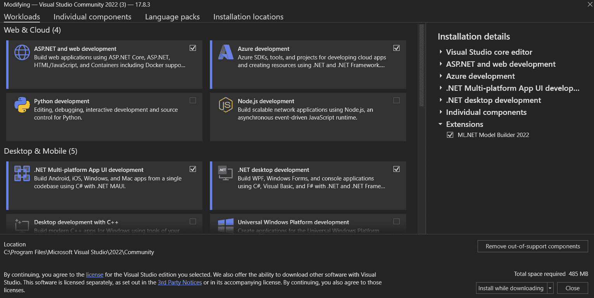

# 第一章：入门

让我们先确保你处于正确的位置。这是一本关于使用.NET 创建**应用程序编程接口**（**APIs**）的书。在这个过程中，我们将查看一个非常简单的后端（数据库）和前端（用户界面），以及我们用来创建和测试 API 的工具。

API 的核心职责是将应用程序（Web、移动等）从后端（数据库、另一个 API 等）解耦。API 位于前端（你的应用程序的用户界面）和后端（在我们的情况下，是一个数据库）之间。

在本章中，我们将涵盖以下主要主题：

+   你将需要的软件

+   如何获取所需的软件

+   安装 Visual Studio

# 技术要求

为了继续阅读本书，你需要一台运行 Windows（10 或 11）的计算机和互联网连接。最好你的计算机至少有 16GB 的内存，当然，你还需要在磁盘上为软件和你要编写的代码腾出空间。

你可以在任何平台上创建 API（例如，Linux）并使用任何开发环境（例如，使用 Visual Studio Code 而不是 Visual Studio）。然而，本书将专注于 Visual Studio 和 Windows，因为它们是最受欢迎的，并且可以说是创建.NET API 最强大和最有效的方式。

本书的相关代码文件可在 GitHub 仓库中找到：[`github.com/PacktPublishing/Programming-APIs-with-C-Sharp-and-.NET`](https://github.com/PacktPublishing/Programming-APIs-with-C-Sharp-and-.NET) 。

# API 适合在哪里？

当你创建一个解耦的应用程序时，你的主要部分包括：

+   前端

+   后端

+   中间件

典型的前端可能是一个 Web 应用、移动应用或其他显示数据的方式。

典型的后端可能是一个数据库或其他服务。

中间件位于前端和后端之间。最重要的中间件是 API。API 的职责是确保前端和后端解耦——也就是说，你可以修改其中一个而不会影响另一个。这仅仅是良好的编程实践，并且如果其中任何一个发生变化（它们会的！），这将为你节省数小时（或数月）的重新编写代码的时间。

# 参与者

通常，后端和前端由不同的团队创建，尽管当然可以由一个开发者完成所有工作。我们还将把后端限制为一个简单的数据库，尽管任何数据源都可以作为后端。最后，我们不会构建一个完整的客户端（那会分散本书的重点），而是将使用工具**Postman**来模拟前端。本书中将有更多关于 Postman 的内容。

# 设置环境

您可以在您喜欢的任何操作系统上创建您的后端、API 和前端。对于本书，我们将使用 Windows 创建所有三个，使用 **Visual Studio 2022**，最新的 Postman，以及 **Dapper** 作为简单的 **对象关系映射器**（**ORM**），以使我们的工作更轻松。我们还将使用一些其他简单的工具，让我们为您设置好。

## 下载您需要的免费软件

要开始，如果您尚未安装 Visual Studio，请访问 [`visualstudio.com`](https://visualstudio.com) 并点击 **下载**（此网站经常更改，但基本步骤保持不变）。您有三个选择下载哪个版本：**社区版**、**专业版**和**企业版**。社区版是免费的，将提供您在本书中所需的所有内容。

当您点击您的选择时，Visual Studio 设置将下载到您的 **下载** 目录。双击它，并在安全提示中点击 **是**。安装程序将更新自身，然后开始安装。这可能需要一点时间，但请不要离开，因为您还有一些选择要做。

注意

如果您已安装 Visual Studio 但出于某种原因还想安装社区版，那没问题，因为它们可以并行运行。

将出现一个类似于 *图 1.1* 的菜单（如果未出现，请点击 **修改**）。

图 1.1 – 设置 Visual Studio：请注意，此截图旨在显示布局，因此文本可读性不是必需的

确保已勾选 **ASP.NET 和 Web 开发**。向下滚动并勾选 **数据存储和处理**（如果您磁盘空间不足，请跳过此选项）。一旦您满意，请点击 **下载时安装**，然后点击 **修改**。

将为您安装 SQL Server，以及 **SQL Server Management Studio**（**SSMS**）。您通常将通过 SSMS 与 SQL Server 交互。我们将随着我们的进展查看如何使用此工具以及所有其他工具。

您的下一个工具是 Dapper。这是一个小型、轻量级的 ORM（通常称为微 ORM），它执行了比 SQL 平台 Entity Framework 大得多的一部分工作，但开销却小得多。具体来说，Dapper 将查询映射到对象。

由于我们的需求将是最小的，Dapper 将绰绰有余。您可以在[`www.learndapper.com/`](https://www.learndapper.com/)了解更多关于 Dapper 的信息。

我们将使用 Postman 模拟我们的用户界面，我们也将使用它进行端到端测试。您可以在 [`postman.com/downloads`](https://postman.com/downloads) 获取 Postman 的最新版本。您也可以通过浏览器访问 Postman，但我们将使用下载的版本。

Postman 非常强大，随着我们的进行，我们将回顾如何使用它。尽管如此，我们只会触及这个工具所能做到的一小部分，所以某个时候，你可能需要阅读其文档。

我们将使用 Swagger 进行文档编写（见 *第四章* ），并使用内置的日志记录功能来记录错误和问题，这些问题不会直接展示给用户，但对于作为程序员的你来说将非常有用。

# 摘要

在本章中，你了解了你需要哪些软件，如何下载和安装它们。本书中我们将使用的所有软件都是免费的。在下一章中，我们将看到我们将构建的示例应用程序，以展示 API 的有意义使用。

# 你可以试试

如果你想要在我们创建 API 的过程中跟随操作，请确保下载并安装本章中描述的所有软件。
