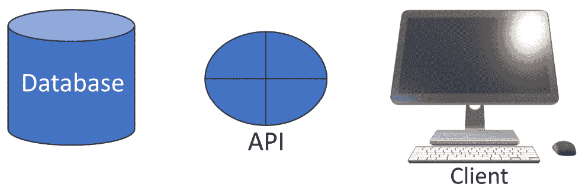
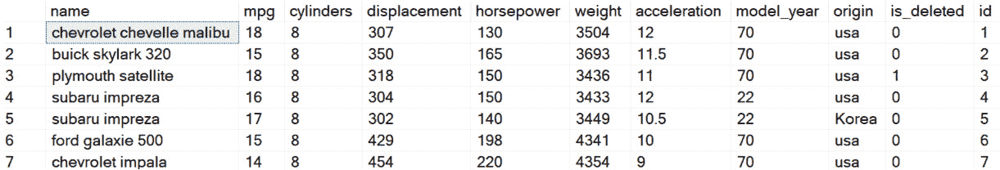
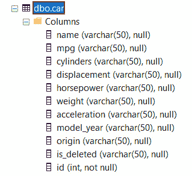

# 我们将构建什么

在本章中，我们将为本书的其余部分提供一个背景。这个背景是一个简单的买卖汽车的示例应用程序。我们不会构建这个应用程序，实际上，我们将在数据库中只有一个对象类型（**Car**）和一个表。这将使我们能够专注于 API，而不是陷入数据库设计的困境。

在本章中，我们将涵盖以下主要主题：

+   API 是什么以及它的用途是什么

+   本书将使用的后端数据库

+   本书将构建的应用程序

+   我们将使用**Car**对象来演示 CRUD 操作

我们将仅使用免费软件，如*技术要求*部分所示，并将利用 Dapper 和 AutoMapper 等开源实用程序，这两者都在*第一章*中介绍。

# 技术要求

对于本章，您需要**Visual Studio**、**SQL Server Management Studio**（**SSMS**）以及**Postman**。请记住，SSMS 是与 Visual Studio 一起安装的。

注意，您还可以使用 Visual Studio 中的 Server Explorer 和 SQL Server Object Explorer 在内部管理您的数据库。

本书的相关代码文件可在本书的 GitHub 仓库中找到：[`github.com/PacktPublishing/Programming-APIs-with-C-Sharp-and-.NET/tree/main/Chapter02`](https://github.com/PacktPublishing/Programming-APIs-with-C-Sharp-and-.NET/tree/main/Chapter02)

# 什么是 API 以及它的用途是什么？

API 的目的是将应用程序的后端（例如，数据库）与前端（例如，Web 应用程序或移动应用程序）解耦，如图*2*.*1*所示。



图 2.1 – 关注点分离

客户端不直接与数据库通信，而是与 API 通信，而 API 反过来又与数据库通信。这种方法的巨大优势在于，您可以修改数据库，而客户端无需更改。或者，您可以在不更改数据库的情况下修改前端（例如，一个网站）。

这些修改发生在大型项目开发过程中，并在交付后继续进行。对于移动应用程序来说，能够在不强制用户更新应用程序的情况下修改后端至关重要。即使对于 Web 应用程序，这也可能是关键的，因为维护数据库的团队可能不是维护客户端的团队。

## 创建数据库

为了说明 API 的所有方面，我们将创建一个非常简单的数据库，并使用 Postman 来代表我们的客户端。Postman 允许您调用 API 并查看客户端会得到什么响应。实际上，它可以做更多的事情，但这是我们主要使用它的方式。

我们将尽可能简化后端和前端，以便我们可以专注于 API。

# 应用程序

我们将要创建的数据库将用于一个简单的（虚构的）买卖汽车应用程序。数据库将保存汽车列表及其发动机、性能等详细信息。此数据的简短示例如图 *图 2*.2 所示。



图 2.2 – 我们将要使用的数据表子集

## 创建汽车表

**Car** 表的数据来自 Kaggle 的免费 *Automobile* 数据集 [`kaggle.com`](https://kaggle.com)。下载数据并将其导入名为 **Cars** 的数据库和名为 **Car** 的表中。列应该会自动处理。

Kaggle 上的数据集经常变化，因此您的汽车列表可能看起来略有不同。所有数据集都作为 **.csv** 文件呈现，因此只需下载一个，然后在 **SSMS** 中打开以进行导入。以下是步骤：

1.  登录到 SSMS 并创建一个数据库。

1.  创建一个名为 **CARS** 的表。

1.  启动 **导入数据向导**。为此，右键单击表，然后从上下文菜单中选择 **导入数据**。

1.  将会弹出 **选择数据源** 对话框。选择 **平面文件源** 并点击 **浏览** 以找到并选择您从 Kaggle 获取的 CSV 文件。

1.  您将被要求输入目的地。选择 **SQL Server** **原生客户端**。

1.  检查您的设置并点击 **保存**。

完成导入后，您需要添加两个列：**is_deleted**（所有行初始化为 **0**）和 **id**，它应该是您的主键，并且应该自动递增。

我们准备好编写一个小应用程序，该程序将支持对我们的闪亮新数据库的基本 CRUD 操作。

如果遇到危机并且无法使其工作，请尝试以下两种选项之一以快速启动：

1.  前往 stackoverflow.com 并查找将 csv 导入平面数据库的方法，或者

1.  从本书存储库的 *第三章* 文件夹中获取代码，该代码已设置好数据库。

第二种替代方案的问题是您将拥有我们尚未解释的代码。但不用担心，如果您遵循上述步骤，一切应该都会顺利。（“*打开舱门* *哈罗，哈尔。*”）

注意

**CRUD** 是 **Create, Read, Update, and Delete** 的缩写。也就是说，创建新记录、读取符合标准的记录、更新记录和标记记录为已删除。

# 数据库结构

我们的数据库仅由一个表组成：**Car**。如图 *图 2*.2 所示，该表必须存储每辆车的各种属性（名称、每加仑英里数、汽缸数等）。*图 2*.3 展示了该表：



图 2.3 – 汽车表列

注意 **is_deleted** 列。我们将使用“软删除”——也就是说，在删除时，我们不会删除行，而是将 **is_deleted** 设置为 true（**1**）。这允许我们只需将此值改回 **0**（false）即可轻松恢复该列。

除了**id**之外，所有列都是字符串，这将使处理它们更容易。

## 车对象

对应于**Car**表，我们的代码有一个**Car**实体（**Cars/Data/Entities/Car.cs**）：

```cs
namespace Cars.Data.Entities;
public class Car
{
    public int Id { get; set; }
    public string name { get; set; } = null!;
    public string mpg { get; set; } = null!;
    public string cylinders { get; set; } = null!;
    public string displacement { get; set; } = null!;
    public string horsepower { get; set; } = null!;
    public string weight { get; set; } = null!;
    public string acceleration { get; set; } = null!;
    public string model_year { get; set; } = null!;
    public string origin { get; set; } = null!;
    public string? is_deleted { get; set;}
}
```

在这个例子中，我们不会使用**数据传输对象**（**DTOs**），只是为了保持简单，尽管我们会在本书的后面使用它们。

# ASP.NET 应用程序

要开始，请使用 ASP.NET Core Web API 模板创建一个新的 ASP.NET 项目。将文件放在您方便的地方，并选择.NET 的最新版本（本书是用.NET 8 编写的）。

我们应用程序的基本结构将如下所示：

+   带端点的控制器

+   **服务**

+   仓库

我们将在继续阅读时回顾端点和所有其他内容。

## Program.cs

您不需要为此应用程序编辑**Program.cs**，但花几分钟时间查看它是值得的：

```cs
using Cars.Data;
using Cars.Data.Interfaces;
using Cars.Data.Repositories;
var builder = WebApplication.CreateBuilder(args);
// Add services to the container.
builder.Services.AddControllers();
// Learn more about configuring Swagger/OpenAPI at https://aka.ms/aspnetcore/swashbuckle
builder.Services.AddEndpointsApiExplorer();
builder.Services.AddSwaggerGen();
// Load DB configuration and register the connection factory for 
//injection
var configuration = builder.Configuration;
builder.Services.Configure<DbSettings>(configuration.GetSection("ConnectionStrings"));
builder.Services.AddTransient<DatabaseConnectionFactory>();
builder.Services.AddTransient<CarRepository>();
builder.Services.RegisterDataAccessDependencies();
var app = builder.Build();
// Configure the HTTP request pipeline.
if (app.Environment.IsDevelopment())
{
    app.UseSwagger();
    app.UseSwaggerUI();
}
app.UseHttpsRedirection();
app.UseAuthorization();
app.MapControllers();
app.Run();
```

立即要注意的是对 Swagger 的引用。我们将使用 Swagger 自动为我们的项目生成文档，正如您在继续阅读时将看到的。

## 连接到数据库

默认项目无法知道如何连接到您的数据库。此信息包含在**appsettings.json**和**appsettings.Development.json**中（要访问后者，请展开前者）。

**appsettings.json**相当简单：

```cs
{
  "Logging": {
    "LogLevel": {
      "Default": "Information",
      "Microsoft.AspNetCore": "Warning"
    }
  },
  "ConnectionStrings": {
    "DefaultConnection": "Data Source=localhost;Initial
     Catalog=Cars;Integrated Security=true"
  },
  "AllowedHosts": "*"
}
```

关键在于**DefaultConnection**字符串，它设置使用 localhost 上的**Cars**数据库。

实际的连接字符串在**appsettings.Development.json**中：

```cs
{
  "Logging": {
    "LogLevel": {
      "Default": "Information",
      "Microsoft.AspNetCore": "Warning"
    }
  },
  "ConnectionStrings": {
      "DefaultConnection": "Server=(localdb)\\
      mssqllocaldb;Database=Cars;Trusted_
      Connection=True;MultipleActiveResultSets=true"
  }
}
```

完成此连接所需的其他两个文件是**DatabaseConnectionFactory**和**DbSettings**。这些文件为您提供了。

以下指的是**DbSettings.cs**中的对象：

```cs
namespace Cars.Data;
public class DbSettings
{
    public string DefaultConnection { get; set; } = null!; // https://
    learn.microsoft.com/en-us/dotnet/csharp/language-reference/
    compiler-messages/nullable-warnings#nonnullable-reference-not-
    initialized
}
```

最后，在**属性**下，您将找到**launchsettings.json**文件：

```cs
{
  "$schema": "https://json.schemastore.org/launchsettings.json",
  "iisSettings": {
    "windowsAuthentication": false,
    "anonymousAuthentication": true,
    "iisExpress": {
      "applicationUrl": "http://localhost:35187",
      "sslPort": 44306
    }
  },
  "profiles": {
    "http": {
      "commandName": "Project",
      "dotnetRunMessages": true,
      "launchBrowser": true,
      "launchUrl": "swagger",
      "applicationUrl": "http://localhost:5283",
      "environmentVariables": {
        "ASPNETCORE_ENVIRONMENT": "Development"
      }
    },
    "https": {
      "commandName": "Project",
      "dotnetRunMessages": true,
      "launchBrowser": true,
      "launchUrl": "swagger",
      "applicationUrl": "https://localhost:7025;http://
      localhost:5283",
      "environmentVariables": {
        "ASPNETCORE_ENVIRONMENT": "Development"
      }
    },
    "IIS Express": {
      "commandName": "IISExpress",
      "launchBrowser": true,
      "launchUrl": "swagger",
      "environmentVariables": {
        "ASPNETCORE_ENVIRONMENT": "Development"
      }
    }
  }
}
```

所有这些都值得一看，但不必担心；几乎所有的内容都为您提供了，所有内容都在我们的仓库中的示例代码中。

# 文件夹

为了组织我们的应用程序，我们将创建以下文件夹：

+   **控制器**

+   **数据**

+   **接口**

+   **仓库**

+   **服务**

让我们简要解释一下这些内容：

+   **客户端**是调用 API 的应用程序（例如，网站或移动应用程序）。**控制器**文件夹将包含作为**端点**的方法（端点是客户端通过 URL 连接到的）。

+   **数据**文件夹将包含我们*实体*的定义——在我们的案例中，是之前显示的**Car**对象。

+   **接口**文件夹正如其名：它将包含我们 C#对象的接口。

+   **仓库**文件夹将包含我们的方法与数据库调用之间的代码。

+   **服务**文件夹将包含支持代码。

流程将如下所示：

1.  客户端调用控制器中的方法。

1.  该方法调用一个服务来处理业务逻辑。

1.  服务调用仓库中的方法，然后反过来调用数据库。

我们将在下一章开始时，逐步检查细节。

# 摘要

在本章中，您了解了 API 是什么以及它是如何用来将前端（例如，一个网站）与后端（例如，一个数据库）分离的。我们还研究了我们将贯穿整本书使用的简单数据库和应用程序。

为了演示 CRUD 操作，我们将构建一个以**汽车**对象为中心的简单应用程序，就像我们正在处理汽车库存一样。我们从[`kaggle.com`](https://kaggle.com)导入它。

这为后续章节以及我们将要构建的简单应用程序奠定了基础。我们的重点将严格放在创建 API 上，因此我们将花费很少的时间在数据库技术甚至前端上。

# 您试试看

现在是创建您的应用程序和数据库的好时机。如果您喜欢冒险，可以创建一个类似但不同的应用程序、数据库和数据实体。这将确保您巩固我们将要使用的元素。
