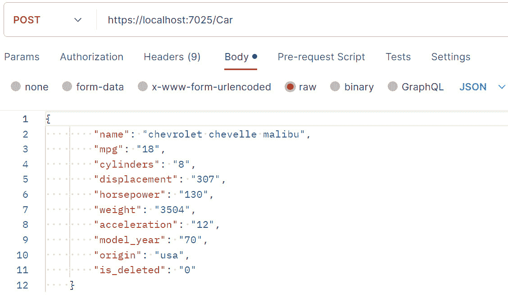
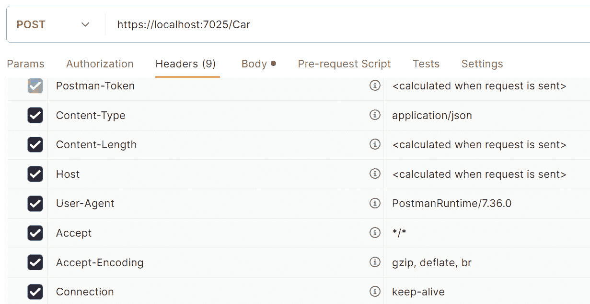
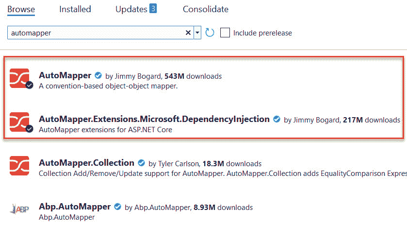
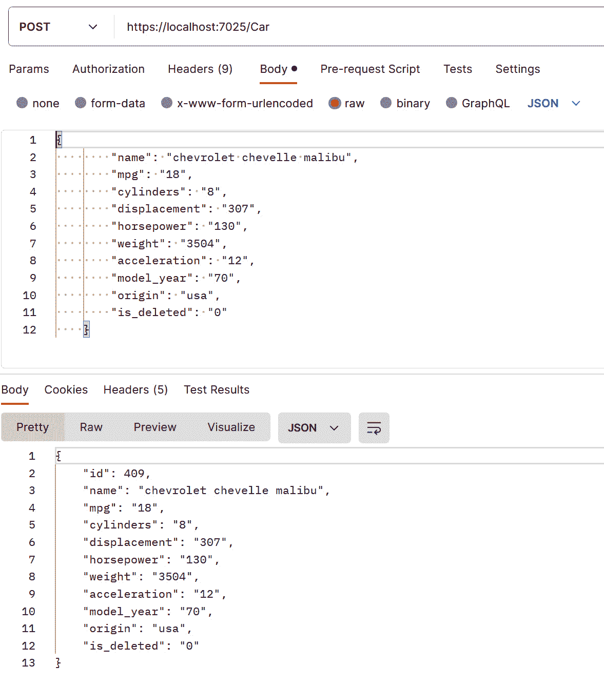
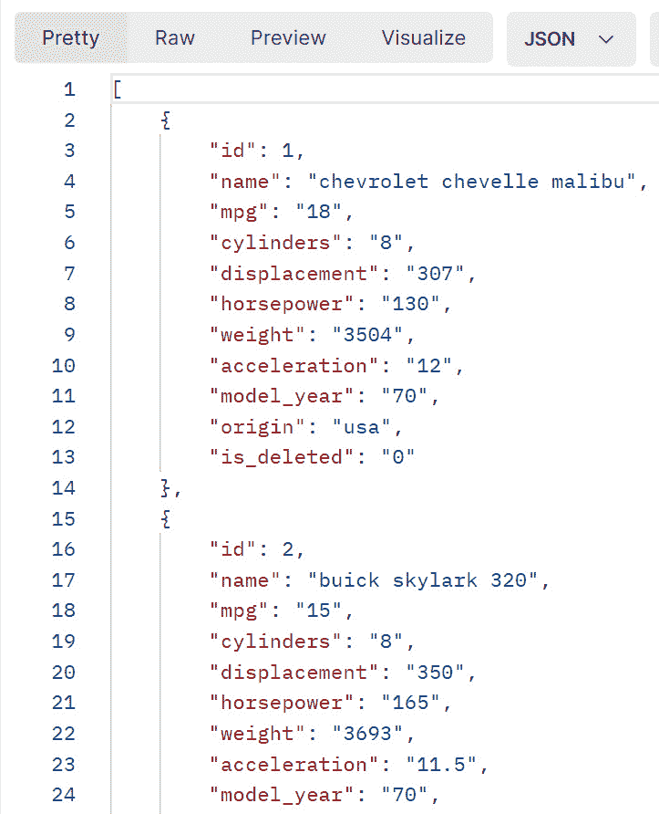

# 使用 REST 实现

在上一章中，我们创建了一个简单的数据库和对象（**Car**）来与之交互。在本章中，我们将探讨**表示状态转移**（**REST**）协议及其在 API 中的应用。REST 是创建 API 最流行的协议。

我们将看到 REST 如何有助于创建客户端/服务器架构，以及与之相关的职责分离。在本章中，我们将涵盖以下主题：

+   理解 REST 是什么

+   查看标准网络协议

+   第一个 REST API 的实现

+   **数据传输对象**（**DTOs**）是什么以及如何使用它们

+   使用 Postman 作为我们的前端

到你完成本章时，你将理解创建简单 API 的基础知识。

# 技术要求

对于本章，你需要**Visual Studio**、**AutoMapper**和**Dapper**。请参阅*第一章*，“入门”，了解如何获取这些工具。本章的代码文件可以在以下 GitHub 仓库中找到：[`github.com/PacktPublishing/Programming-APIs-with-C-Sharp-and-.NET/tree/main/Chapter03`](https://github.com/PacktPublishing/Programming-APIs-with-C-Sharp-and-.NET/tree/main/Chapter03)

# REST

REST 中的一个关键概念是职责分离。这个想法对于 C#程序员来说应该是熟悉的。在这里，我们正在分离服务器和客户端的职责。

API 只能响应来自客户端的调用，不能生成自己的调用。请注意，在 API 实现的逻辑中，可以调用其他 API，但不能反向调用客户端。

服务器在没有任何方式上依赖于客户端的设计或实现。

## 客户端/服务器

REST 应用程序的关键在于 API 可以被任何类型的客户端调用：Web 应用程序、手机应用程序等等。此外，客户端可以位于任何地方，并且对客户端架构没有约束。

后端也是如此，在 API 之后。通常，这将是一个数据库，但它可以是任何类型的数据存储：关系型、对象型、内存型等等。

实现这一点的其中一种方法，是使用标准 Web 协议，如**GET**、**PUT**等等。这种方法对于 REST 至关重要。事实上，对于许多人来说，这是 REST 的虚拟定义。

# 使用 Web 协议

在 REST 中，我们使用与 HTTP 相同的动词：**GET**、**PUT**、**POST**和**DELETE**。此外，API 会向客户端返回标准 Web 值，例如，**404（未找到）**、**200（成功）**、**201（已创建）**等等。

客户端向 API 的每个请求将包括一个 HTTP 头部、正文和元数据。客户端通过调用 URL 来表示想要的 API，并传递所需的数据（例如，请求实体的**id 值**，要么在 URL 中，要么如果传递给 URL 的数据过多，则在请求的正文里。例如，这里是一个向后端数据库添加汽车的 POST 请求。现在不必担心语法；而是看看图 3.1 中的 URL 和请求正文。



图 3.1 – 插入数据

在图的最上方，我们看到 URL（https://localhost:7025/Car）。这是 API 的“地址”。请注意，URL 的最后部分是*Car*。这是控制器的名称。

在 URL 下方有一个菜单，允许您查看正在发送的参数、作为元数据一起发送的授权和任何头部（参见*图 3.2*），我们在*图 3.1*中看到的正文，在发送请求之前要运行的任何脚本，确保我们得到正确数据的测试（参见*第八章* ，*高级主题*），以及我们需要的任何请求设置。

前图中编号为 1-12 的行是此请求的主体。我们正在将一辆车插入数据库，因此所有插入数据都在这里以 JSON 格式提供。请注意，这里没有 ID；这将在后端分配。



图 3.2 – 头部

这些头部向服务器提供了关键信息。由于 REST 本质上是无状态的，因此必须为每次交互发送它们。

## 无状态和缓存

REST API 是无状态的，因此您必须将每个 API 调用视为与其他所有调用独立。

注意，如果您需要在 Azure 上使用状态，您将需要一个持久化函数，这在*第七章*中有所介绍，即*Azure* *持久化函数*。

虽然您不能在调用之间保持状态，但服务器可以缓存数据以实现更快的检索。这可以显著提高性能。有许多平台可以支持 REST API；我们将在这本书中关注的一个平台，也是.NET 的首选平台，是 ASP.NET Core。

REST 的替代方案是 GraphQL。这个设计旨在解决两个问题：过度获取和不足获取。用户希望向服务器发送单个 API 调用。为了做到这一点，他们必须指定所需的数据。如果请求了 Car 实体，他们可能根本不关心汽车的一些特性，但他们作为 API 的一部分收到了整个汽车。这被称为过度获取。另一方面，如果他们指定了一个只获取汽车类型的 API，这可能就是不足获取（他们必须进行第二次调用以获取所需的其他部分）。GraphQL 旨在解决这个问题，允许客户端指定确切请求哪些属性。

话虽如此，GraphQL 的缺点是每个 API 查询都必须手工制作以指定所需的内容。

由于这一点和其他技术限制，尤其是惯性，REST 是编写 API 最受欢迎的方式，我们不会在本书中涵盖 GraphQL。

# 在 ASP.NET Core 中实现 REST

ASP.NET Core 中创建的 API 通常有三个主要组件：

+   控制器

+   服务

+   存储库

备注

除了基于控制器的 API 之外，还有一种称为 Minimal APIs 的替代方案。我们将在本章末尾简要讨论这一点（参见图表 *Minimal APIs*）。由于它们有很多限制，本书的其余部分不会涵盖 Minimal APIs。

当你使用 URL 调用一个 API 时，该地址会被解析为一个控制器。例如，使用我们之前看到的 URL，如果你调用 https://localhost:7025/Car，你将调用该地址处的 **CarController**。请注意，ASP.NET 使用“约定优于配置”，这意味着*按照惯例*，单词 Controller 的一部分被从地址中省略，但隐含在其中。所以在这种情况下，**CarController**，地址只使用 **Car**（省略 Controller）。

控制器的任务是确保用户已经认证（确实是他们）并且授权（他们有权执行所调用的任何操作）。然后控制器组装所需的数据并将其传递给服务。通常，但不一定，这将被称为 **CarService**，并将位于包含其他服务的文件夹中。

服务的任务是处理任何业务逻辑并将数据准备好输入数据库。然后它将数据传递给存储库。

与服务类似，存储库通常被称为 **CarRepository**，并将位于与其他存储库相同的文件夹中。存储库的任务是与底层数据存储（例如，数据库）交互。

通常，你将想要将数据库的属性与通过 API 发送的对象的属性分开。为此，我们使用 DTOs。

## DTOs

使用 DTOs 将数据库结构的表示与支持 **Plain Old C#** **Object** ( **POCO** ) 分离是很常见的。

让我们从一个关系型数据库的例子开始。每一行可能有十二列，但对于特定的 API 请求，只需要七列。DTO 将是一个具有七个属性的类，我们将使用一个工具（**AutoMapper**）将七个列中的值映射到七个属性。

### 安装 AutoMapper

安装 **AutoMapper** 最简单的方法是下载 NuGet 包，如图 *图 3.3* 所示：



图 3.3 – 安装 AutoMapper

对于 **AutoMapper** 来说，有一些配置要做，但只需做一次。在 **Program.cs** 中添加以下内容：

```cs
builder.Services.AddAutoMapper(typeof(Program));
```

下一步是创建 DTO 类本身。

### 创建 DTO 类

我们创建的 POCO 类直接跟踪数据库中的列，如前所述。DTO 类跟踪这些列的一些或全部属性：

```cs
namespace Cars.Data.DTOs
{
    public class CarDto
    {
        public int Id { get; set; }
        public string Name { get; set; }
        public string Mpg { get; set; }
        public string Cylinders { get; set; }
        public string Displacement { get; set; }
        public string Horsepower { get; set; }
        public string Weight { get; set; }
        public string Acceleration { get; set; }
        public string ModelYear { get; set; }
        public string Origin { get; set; }
    }
}
```

一旦你的 DTO 设置好，你需要一种方法将 DTO 中的属性映射到数据库（POCO）类中的属性。我们可以在配置文件中做到这一点。

### 设置配置文件

当我们在这里时，让我们为 **Car** 实体设置配置文件。**AutoMapper** 工具（无意中）提供了一个基类，**Profile**，我们将从中派生。

创建一个名为 **CarProfile.cs** 的文件，并将此代码放入其中：

```cs
Public class CarProfile : Profile
{
   Public CarProfile()
   {
      CreateMap<CarDto, Car>()
        .ForMember(car => car.id, opt=>opt.MapFrom(carDto => carDto.
        Id))
        .ForMember(car => car.name, opt=>opt.MapFrom(carDto => carDto.
        Name))
        .ForMember(car => car.mpg, opt=>opt.MapFrom(carDto => carDto.
        Mpg))
        .ForMember(car => car.cylinders, opt=>opt.MapFrom(carDto => 
        carDto.Cylinders))
        .ForMember(car => car.displacement, opt=>opt.MapFrom(carDto => 
        carDto.Displacement))
        .ForMember(car => car.horsepower, opt=>opt.MapFrom(carDto => 
        carDto.Horsepower))
        .ForMember(car => car.weight, opt=>opt.MapFrom(carDto => 
        carDto.Weight))
        .ForMember(car => car.acceleration, opt=>opt.MapFrom(carDto => 
        carDto.Acceleration))
        .ForMember(car => car.model_year, opt=>opt.MapFrom(carDto => 
        carDto.ModelYear))
        .ForMember(car => car.origin, opt=>opt.MapFrom(carDto => 
        carDto.Origin))
        .ReverseMap();
```

注意，对于每个我们想要在 DTO 和 POCO 类之间共享的成员，都有一个条目。底部是 **ReverseMap**，正如你可能猜到的，它反转了映射（例如，它使映射从 **DTO > Car** 转换为 **Car > DTO**）。

我们已经处理了 DTO；现在我们需要将我们的 POCO 连接到数据库。我们将使用 Dapper 来完成这项工作。

## Dapper

如前所述，我们将使用 Dapper 作为我们的 **对象关系模型** ( **ORM** )。这将极大地简化我们与数据库的交互。Dapper 有自己的语法，但它非常（非常）接近 SQL，起点将很明显。

安装 Dapper

要安装和使用 Dapper，请参阅他们非常直接且全面的说明，见 [`www.learndapper.com/`](https://www.learndapper.com/)

例如，这是通过 ID 获取汽车的 Dapper 代码：

```cs
Public async Task<Car?> GetCarById(int carId)
{
var sql =
    $@"SELECT *
       FROM
            Cars C
       WHERE
            C.id = @{nameof(carId)}
            AND C.is_deleted = 0";
var param = new
{
    carId
};
var car = await QueryFirstOrDefaultAsync<Car>(sql, param);
return car;
}
```

我们可以使用条件逻辑创建更复杂的语句。

注意

Dapper 使用 C# 而不是 SQL 语法（除了查询本身）。这使得 C# 程序员与数据库的交互变得更加容易。

这就是你需要知道的所有内容，以便开始创建你的 API。让我们尝试使用 API 将一辆车插入到数据库中。

## 检查 SQL

上述示例中的 SQL（发音为 See-Quill）几乎可以读作一个英文句子。首先，我们使用关键字 SELECT 来表示我们想要选择并返回数据库中的数据子集。

接下来是星号（ ***** ），它表示我们想要所有列。另一种选择是列出我们想要的列。

**From Cars C** 表示我们希望数据来自 **Cars** 表，并且我们将使用别名 **C** 来引用该表。

**Where** 语句将搜索限制为随后的条件，在这种情况下，汽车的 id（使用别名 C）与我们要查找的 id 匹配。然后我们附加“ **where is_deleted = 0** ”，表示我们只想获取未标记为已删除的条目。

这里是 Dapper 用来通过 ID 获取汽车的代码：

call: **QueryFirstOrDefaultAsync<Car>(sql, param);**

这将调用 dapper 中的 **QueryFirstOrDefault** 方法。我们传入我们正在寻找的对象类型（Car）和两个参数。在我们的情况下，第一个始终是 SQL，第二个始终是我们上面创建的集合的名称（param）。

我们将结果（在这种情况下是一辆车）分配给一个变量，并返回该值。

请注意，此类的构造函数将通过依赖注入传递接口，并将这些参数分配给成员变量（例如，_ **carService**）。如果您不熟悉依赖注入，请参阅存储库中的代码。

# 将所有内容组合起来（插入一辆车）

让我们使用控制器、服务和存储库结合 Dapper 和 AutoMapper 来插入一辆车：

```cs
//Controller
[HttpPost]
 public async Task<ActionResult<Car>> Insert([FromBody] CarDto 
 carAsDto)
 {
     try
     {
         if (carAsDto == null)
         {
             return BadRequest("No car was provided");
         }
         var carToInsert = _mapper.Map<Car>(carAsDto);
         var insertedCar = await _carService.Insert(carToInsert);
         var insertedCarDto = _mapper.Map<CarDto>(insertedCar);
         var location = $"https://localhost:5001/car/{insertedCarDto.
         Id}";
         return Created(location, insertedCarDto);
     }
     catch (Exception e)
     {
         return StatusCode(StatusCodes.Status500InternalServerError);
     }
 }
```

注意，我们已经将 DTO 转换为数据库对象（**Car**），然后将其传递到服务：

```cs
 // car service
  public async Task<Car> Insert(Car)
 {
     var newId = await _carRepository.UpsertAsync(car);
     if (newId > 0)
     {
         car.id = newId;
     }
     else
     {
         throw new Exception("Failed to insert car");
     }
     return car;
 }
```

我们现在准备将这辆车传递到存储库，以便在我们的数据库中存储：

```cs
public async Task<int> UpsertAsync(Car car)
 {
     using var db = databaseConnectionFactory.GetConnection();
     var sql = @"
     DECLARE @InsertedRows AS TABLE (Id int);
     MERGE INTO Car AS target
     USING (SELECT @Id AS Id, @Name AS Name, @MPG as MPG, @
     Cylinders as Cylinders, @Displacement as Displacement, @
     Horsepower as Horsepower, @Weight as Weight, @Acceleration as 
     Acceleration, @Model_Year AS Model_Year, @Origin AS origin, @
     Is_Deleted AS Is_Deleted ) AS source
     ON target.Id = source.Id
     WHEN MATCHED THEN
         UPDATE SET
             Name = source.Name,
             MPG = source.MPG,
             Cylinders = source.Cylinders,
             Displacement = source.Displacement,
             Horsepower = source.Horsepower,
             Weight = source.Weight,
             Acceleration = source.Acceleration,
             Model_Year = source.Model_Year,
             Origin = source.Origin,
             Is_Deleted = source.Is_Deleted
     WHEN NOT MATCHED THEN
         INSERT (Name, Mpg, Cylinders, Displacement, Horsepower, 
         Weight, Acceleration, Model_Year, Origin, Is_deleted)
         VALUES (source.Name, source.MPG, source.Cylinders, source.
         Displacement, source.Horsepower, source.Weight, source.
         Acceleration, source.Model_Year, source.Origin, source.Is_
         Deleted)
         OUTPUT inserted.Id INTO @InsertedRows
     ;
     SELECT Id FROM @InsertedRows;
 ";
     var newId = await db.QuerySingleOrDefaultAsync<int>(sql, car);
     return newId == 0 ? car.id : newId;
 }
```

如果我们得到一个有效的新车，我们将返回**newId 值**，这在服务中进行检查。然而，我们传递给 API 的数据量很大。我们将在下一节中探讨解决这个问题。

关于依赖注入的说明：正如您所知，我们向方法传递接口，以便支持依赖注入。这已在**Program.cs**中设置，而注入本身是自动的。

## 在 Postman 中创建正文

如您所见，我们想要传递给 API 的数据对于查询字符串来说太多，因此我们将将其传递到正文。我们可以在 API 定义中通过编写以下内容来表示这一点：

```cs
public async Task<ActionResult<Car>> Insert([FromBody] CarDto carAsDto)
```

每个 API 调用都将有零个或多个**FromQuery**、**FromUrl**和**FromBody**属性。在这种情况下，我们只是使用**FromBody**。我们的 Postman 调用如图*3.4*所示：



图 3.4 – 插入一辆车

在这里，我们正在将车辆的除 ID 值之外的所有属性（如顶部窗口所示）插入。为此，我们需要调整 SQL 语句以获取所有属性。请注意，API 返回插入车辆的属性，包括其**id**（底部窗口）。返回代码将是**201**（已创建）。

由于我们正在查找请求正文中的数据，因此 URL 只是控制器的地址。

我们已插入一辆车，但我已经预先在数据库中插入了更多。让我们使用 API 来查看它们。

## 获取所有

要获取数据库中所有车的列表，我们从控制器开始：

警告：以下示例仅用于说明目的，直接调用存储库。不久之后，我们将讨论正确的方法。

```cs
public async Task<IEnumerable<Car>> GetAll(bool returnDeletedRecords = false)
{
    return await _carRepository.GetAll(returnDeletedRecords);
}
```

在这里，我们直接调用存储库。这是调用服务的一种替代方法，但通常是一种不好的做法，但我想要展示如何进行。请注意，我们包括一个布尔参数，以确定是否返回已删除的记录。

通常，我们会使用**Service**类来实现关注点的分离。服务类将包含程序逻辑，并位于控制器和存储库之间。

在存储库中，我们构建我们的**SqlBuilder**（如我们在*Dapper*部分中之前所见）并获取记录：

```cs
public async Task<IEnumerable<Car>> GetAll(bool returnDeletedRecords = false)
{
    var builder = new SqlBuilder();
    var sqlTemplate = builder.AddTemplate("SELECT * FROM car " + 
    "/**where**/ ");
    if (!returnDeletedRecords)
    {
        builder.Where("is_deleted=0");
    }
    using var db = databaseConnectionFactory.GetConnection();
    return await db.QueryAsync<Car>(sqlTemplate.RawSql,sqlTemplate.
    Parameters)
}
```

让我们逐行分析。第一行表示我们将返回一个**Car**对象的列表，而是否返回已删除记录的决策默认为**false**。

我们接下来创建一个**SqlBuilder**对象，然后设置**SqlTemplate**对象以选择所有车辆。

注意到**/**where**/**语句。这是一个 Dapper 约定，表示可以在这里放置一个**where**子句。

我们现在将检查是否需要包含已删除的记录，如果不包含，我们将使用我们在第一行创建的构建器添加一个 where 子句。

我们准备好从我们创建的工厂获取数据库，然后查询数据库，传入用于在**SqlTemplate 对象**中使用的**RawSql**代码和参数。在这种情况下，没有参数。

我们得到的是一个**Car**对象的数组，我们将它返回给调用方法。

为了测试这个，我们将 Postman 设置为**Get**，并将 URL 设置为 https://localhost:7025/Car。由于没有提供 ID，我们的代码将获取所有车辆，如图*图 3*.*5*所示：



图 3.5 – 获取数据库中的所有车辆

插入记录后，我们可能想要更改一个或多个。为此，我们将想要使用**Put**动词。

## 更新

更新操作使用 HTTP **Put**动词。让我们追踪一下它是如何完成的。

我们回到控制器，添加一个**HttpPut**属性。然后我们指出内容将位于请求体中（而不是查询中），正如我们在插入时所见：

```cs
[HttpPut]
public async Task<IActionResult> Put([FromBody] Car car)
```

由于我们无法确定我们想要更新的记录是否仍然在数据库中，我们将调用放在 try 块中，如果发生异常，我们调用**BadRequest**。有趣的是，如果我们成功，我们调用**NoContent**，因为我们没有向数据库添加任何内容：

```cs
[HttpPut]
public async Task<IActionResult> Put([FromBody] Car car)
{
    try
    {
        await _carService.Update(car);
    }
    catch (Exception e)
    {
        return BadRequest(e);
    }
    return NoContent();
}
```

如上图所示，从这里我们调用**carService**的**Update**方法，传入我们想要更新的车辆。请注意，一些程序员使用**OK**而不是**NoContent**。

在服务中，我们将确保我们得到了有效的车辆**id 值**，然后调用**UpsertAsync**，传入车辆。如果我们得到除了原始 ID 之外的任何**id**值，我们抛出异常；否则，我们返回**Car**对象：

```cs
public async Task<Car> Update(Car car)
{
    if (car.id == 0)
    {
        throw new Exception("Id must be set");
    }
    var oldId = car.id;
    var newId = await _carRepository.UpsertAsync(car);
    if (newId != oldId)
    {
        throw new Exception("Failed to update car");
    }
    return car;
}
```

在**Upsert**方法中，我们检查这是否是一辆新车辆（插入）或更新：

```cs
public async Task<int> UpsertAsync(Car car)
{
    using var db = databaseConnectionFactory.GetConnection();
    var sql = @"
    DECLARE @InsertedRows AS TABLE (Id int);
    MERGE INTO Car AS target
    USING (SELECT @Id AS Id, @Name AS Name, @MPG as MPG, @Cylinders as 
    Cylinders, @Displacement as Displacement, @Horsepower as 
    Horsepower, @Weight as Weight, @Acceleration as Acceleration, @
    Model_Year AS Model_Year, @Origin AS origin, @Is_Deleted AS Is_
    Deleted ) AS source
    ON target.Id = source.Id
    WHEN MATCHED THEN
        UPDATE SET
            Name = source.Name,
            MPG = source.MPG,
            Cylinders = source.Cylinders,
            Displacement = source.Displacement,
            Horsepower = source.Horsepower,
            Weight = source.Weight,
            Acceleration = source.Acceleration,
            Model_Year = source.Model_Year,
            Origin = source.Origin,
            Is_Deleted = source.Is_Deleted
    WHEN NOT MATCHED THEN
        INSERT (Name, Mpg, Cylinders, Displacement, Horsepower,
        Weight, Acceleration, Model_Year, Origin, Is_deleted)
        VALUES (source.Name, source.MPG, source.Cylinders, source.
        Displacement, source.Horsepower, source.Weight, source.
        Acceleration,source.Model_Year, source.Origin, source.Is_
        Deleted)
        OUTPUT inserted.Id INTO @InsertedRows
    ;
    SELECT Id FROM @InsertedRows;
";
    var newId = await db.QuerySingleOrDefaultAsync<int>(sql, car);
    return newId == 0 ? car.id : newId;
}
```

注意，在最后两行中，我们从查询中获取**newId**值，如果它是**0**，则返回原始车辆 ID。否则，我们返回插入的车辆的**newid**值。

## 软删除

为了完整性，让我们快速了解一下软删除。你会记得，当用户请求删除一条记录时，我们并不是真正地从数据库中移除它，而是将其标记为已删除（在**is_deleted**列中），这样我们就可以根据需要获取这些记录。

我们从控制器开始：

```cs
[HttpDelete("{id}")]
public async Task<IActionResult> Delete(int id)
{
    try
    {
        await _carService.Delete(id);
    }
    catch (Exception e)
    {
        return BadRequest(e);
    }
    return NoContent();
}
```

**删除**操作接受要标记为已删除的汽车的 ID，然后调用服务。服务所做的只是确保 ID 有效，然后调用存储库执行实际删除：

```cs
public async Task Delete(int id)
{
    var car = await _carRepository.Get(id);
    if (car == null)
    {
        throw new Exception("Car not found");
    }
    await _carRepository.DeleteAsync(id);
    return;
}
```

仓库中的代码非常简单。它获取数据库连接并创建查询以将**is_deleted**设置为**1**。然后执行该查询：

```cs
public async Task<int> DeleteAsync(int id)
{
    using var db = databaseConnectionFactory.GetConnection();
    var query = "UPDATE car SET Is_Deleted = 1 WHERE Id = @Id";
    return await db.ExecuteAsync(query, new { Id = id });
}
```

到目前为止，您已经拥有了一个完整的 API，用于**创建、读取、更新、删除**（**CRUD**）操作。

# 摘要

在本章中，您介绍了使用 Dapper 和 AutoMapper，后者用于 DTO 对象。您还深入研究了 CRUD 操作的工作原理，使用了典型的三个类：控制器、服务和存储库。

您可以看到，对于简单操作，您可以绕过服务，但这被认为是不良实践。

在企业应用程序中，您会希望使用 DTOs（数据传输对象）来分离数据库布局与传递对象布局。随着我们深入探讨增强 API 可用性和理解领域，下一章将强调使用 Swagger 记录项目的重要性。

# 您尝试一下

创建一个简单的数据库来跟踪您的音乐收藏。将此放入数据库，并使用 Dapper 和 AutoMapper 实现四个 CRUD 操作。为此练习，创建只提供数据库部分列的 DTOs。

最小化 API

最小化 API 提供了一种创建 API 的替代方法，无需使用控制器。虽然它们仍然允许注入所需的服务，但它们主要用于具有最小依赖项的小型端点。

相比之下，控制器附带了一个更大的端点组件层次结构，需要考虑。这包括版本控制、控制器命名和手动路由属性，这些可能会引入不必要的额外模板代码。最小化 API 通过允许您在单个表达式中声明和处理请求来简化此过程。

为了说明，让我们重新实现获取所有汽车的调用。从*第三章*的代码开始，然后使用 app 变量添加对**MapGet**的调用。路由将是**/car-minimal**，处理程序可以保持与**GetAll**方法相同：调用**ICarRepository.GetAll**。但如果没有构造函数，我们如何访问服务接口？最小化 API 通过使用参数注入来解决此问题。只需将**ICarRepository carRepository**作为参数传递给**MapGet**的委托参数，并使用它来调用**.** **GetAll**方法。

许多不同类型都可以注入到最小化 API 的处理程序中。通过将属性应用于单个参数来区分模型绑定类型。常用的包括**[FromRoute]**、**[FromBody]**和**[FromServices]**。其他特殊类型包括**HttpContext**、**HttpRequest**、**HttpResponse**、**IFormFile**和请求体的**Stream**。完整列表可在官方 Microsoft 文档中找到。
