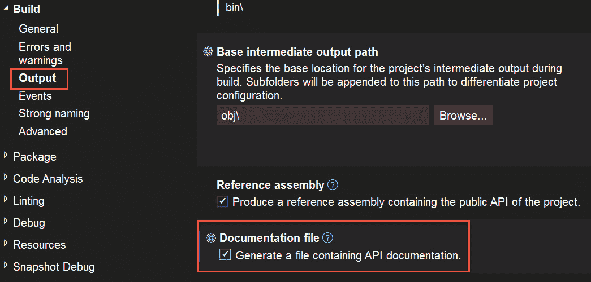

# 4

# 使用 Swagger 的文档

在本章中，我们将探讨使用 Swagger 对你的项目进行文档记录。在 API 中，可读性强的文档至关重要。它允许你的客户快速理解每个端点和可能的响应。

我们将通过使用 XML 并在代码中包含属性来确保我们的 Swagger 文档遵循 OpenAPI（以前称为 Swagger）规范。你可以在[`swagger.io/docs/specification/about/`](https://swagger.io/docs/specification/about/)了解更多关于 OpenAPI 的信息。

Swagger 需要一个 OpenAPI 实现，在.NET 的情况下，Swashbuckle 是指定的选项。

在本章中，我们将涵盖以下主题：

+   Swagger 是什么

+   Swagger 的使用方法

+   如何设置 Swagger

+   如何向 Swagger 传递参数

# 技术要求

对于本章，你只需要 Visual Studio。我们将使用的所有功能都包含在 Visual Studio 中，或者可以通过 NuGet 免费获得。

本书的相关代码文件可在 GitHub 仓库中找到：[`github.com/PacktPublishing/Programming-APIs-with-C-Sharp-and-.NET/tree/main/Chapter04`](https://github.com/PacktPublishing/Programming-APIs-with-C-Sharp-and-.NET/tree/main/Chapter04)

# 设置 Swagger 文档

要安装 Swagger，打开你的解决方案，从菜单中选择**工具** | **NuGet 包管理器** | **管理解决方案的 NuGet 包**。安装**Swashbuckle.AspNetCore**的最新版本。

右键单击你的项目文件，然后点击**属性**。在屏幕的左侧，选择**应用程序**。在右侧，选择**控制台应用程序**，如*图 4.1*所示：


图 4.1 – 安装部分 1

在**生成**下，选择**输出**并滚动到**文档文件**。检查*图 4.2*中显示的**生成包含 API 文档的文件**框：



图 4.2 – 设置 Swagger 输出

注意

在*图 4.2*中，**生成包含 API 文档的文件**被选中。生成的文件可以导入到其他应用程序中，例如 Postman，以获得集成文档和测试体验。

打开**Program.cs**（通常是解决方案资源管理器中的最后一个文件）并将 Swagger 生成器添加到服务集合中：

```cs
builder.Services.AddSwaggerGen(
 x =>
 {
     x.SwaggerDoc(
         "v1",
         new OpenApiInfo
         {
             Title = $"{Assembly.GetExecutingAssembly().GetName().
             Name}",
             Version = "Version 1",
             Description = "Create documentation for Cars",
             Contact = new OpenApiContact
             {
                 Name = "Jesse Liberty",
                 Email = "jesseliberty@gmail.com",
                 Url = new Uri("https://jesseliberty.com")
             }
         });
             var xmlFilename = System.IO.Path.Combine(System.
             AppContext.BaseDirectory, $"{Assembly.
             GetExecutingAssembly().GetName().Name}.xml");
             x.IncludeXmlComments(xmlFilename);
});
```

保存所有内容。就是这样。这只需要做一次。你现在已经设置了 Swagger 文档。实际上，你已经添加了描述、名称和联系信息。结果如*图 4.3*所示。这就是当你启动程序且 Swagger 打开浏览器窗口以显示其界面时你会看到的内容：


图 4.3 – Swagger 文档的顶部

注意，在这个页面上，网站和电子邮件是活链接，而文本**为汽车创建文档**是你之前代码中描述的内容。

# Swagger 控制器

Swagger 文档是通过 XML 注释实现的。XML 注释由三个斜杠标记开头。以下是一个示例：

```cs
/// XML comment
```

XML 注释是成对标签，如下所示：

```cs
/// <summary>
…
/// </summary>
```

让我们从 Cars 应用程序的控制器开始。我们将在控制器中的每个方法上方放置 Swagger 文档。

我们将添加的第一个注释是摘要：

```cs
/// <summary>
/// Get all the cars in the Database
/// </summary>
```

这条注释将出现在**GET**按钮的旁边，如图 *图 4.4* 所示：


图 4.4 – 显示摘要

在我们继续前进之前，让我们看看在不编写任何额外代码的情况下，我们从 Swagger 中获得了什么。

## Swagger 开箱即用

注意 Swagger 将在启动应用程序后自动出现。

要查看自动生成的文档，请点击*图 4.4* 中圆圈所示的右上角的箭头。Swagger 打开 **Get** 命令的详细信息，如图 *图 4.5* 所示：


图 4.5 – Swagger 开箱即用

这有点难以看清，所以让我们放大几个重要部分。在左上角是一个区域，用于发送给 **GetAll** 命令的所有参数。我们发送了 **returnDeletedRecords**，默认值为 **false**。*图 4.6* 显示了 Swagger 如何描述这一点：


图 4.6 – 参数

注意下拉菜单。它允许你尝试两种可能的值（**false** 和 **true**）。

接下来，在左侧是服务器潜在响应的代码和描述。*图 4.7* 显示第一个潜在响应是 **200: 成功**：


图 4.7 – 成功

在第一个响应代码下方是架构，它告诉你有哪些属性以及它们的类型，如图 *图 4.8* 所示：


图 4.8 – 架构

我们已经准备好查看我们注释的效果。让我们看看启动应用程序并启动 Swagger 时会发生什么。

# 在 Swagger 中运行您的 API

最重要的是，在右上角有一个 **尝试一下** 按钮。点击此按钮将 Swagger 切换到交互模式，并允许你尝试你的代码。当点击此按钮时，将出现两个其他按钮：**执行** 和 **清除**。按下 **执行** 将导致代码运行，在我们的情况下返回汽车列表和一些其他元数据。让我们专注于这一点（**清除**将删除结果，以便你可以再次尝试）。

我们看到的第一件事被标记为 **Curl**，如图 *图 4.9* 所示：


图 4.9 – 每个 Swagger 页面都显示端点的 curl

根据维基百科，“ *Curl 结合了文本标记（如 HTML）、脚本（如 JavaScript）和强大的计算（如 Java、C# 或 C++）在一个统一的框架中* ”。在这本书中，我们将忽略 Curl。

在下面，我们看到我们提交给服务器的请求 URL，如图 *图 4.10* 所示：


图 4.10 – Swagger 中显示的请求 URL

注意我们正在使用本地主机上的端口 **7025**（你的可能不同）工作，并且我们像任何 HTML 一样传递我们的参数（**returnDeletedRecords=false**）。

接下来是最重要的服务器响应：响应体，如图 *图 4.11* 所示：


图 4.11 – 服务器响应

最后，响应对象的模式显示出来，如图 *图 4.12* 所示：


图 4.12 – 响应模式

Swagger 对于文档来说很棒，但在测试你的应用程序方面有些局限。正如我们将看到的，Postman 是一个更强大的测试应用程序。

## param 标签

如果你的动词有参数，你可以使用 **param** 关键字在 Swagger 属性中记录它们。例如，在我们的案例中，我们想要记录 **returnDeletedRecords** 参数。我们可以这样做：

```cs
/// <summary>
/// Get all the cars in the Database
/// </summary>
/// <param name="returnDeletedRecords">If true, the method will return all the records, including the ones that have been deleted</param>
```

结果是参数在 Swagger 中得到记录，如图 *图 4.13* 所示：


图 4.13 – 记录参数

## 响应代码

你可以（并且应该）记录所有可能的响应代码及其指示：

```cs
/// <response code="200">Cars returned</response>
/// <response code="404">Specified Car not found</response>
/// <response code="500">An Internal Server Error prevented the request from being executed.</response>
```

结果是返回代码在 Swagger 中得到记录，如图 *图 4.14* 所示：


图 4.14 – 记录返回代码

虽然这需要一些努力，但它变成了常规操作，是最佳实践。这也使你的客户的生活变得更加容易。

# 摘要

在本章中，你学习了如何设置 Swashbuckle 以启用 Swagger。Swagger 提供了您 API 的详细文档，允许（人类）客户端了解每个端点及其用途。此外，您还可以记录每个参数和潜在的错误代码。

在下一章中，你将看到我们如何可以在请求过程中验证端点请求——防止资源浪费并保护你免受针对你系统的各种攻击。

# 你试试看

安装 Swagger 并为 **Car** 控制器中的 **Insert** 端点创建文档。运行 Swagger 以确保所有文档都正确显示。
