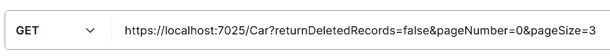

# 数据验证

只要将数据从你的 API 发送到数据库，却发现输入无效，这是不必要的昂贵。更好的做法是在数据进入时对其进行测试，以确保它符合基本标准。这个初步的测试集（称为验证）检查输入数据，以确保它符合最低标准，并且格式正确。

在本章中，你将学习以下内容：

+   如何验证输入数据

+   如何响应无效数据

# 技术要求

对于本章，从现有的**数据传输对象**（**DTO**）分支创建一个新的分支（这样我们就可以从有效数据开始）。你需要以下内容：

+   **Visual Studio**

+   **AutoMapper**

+   **FluentValidation**

**FluentValidation**库是一个强大的工具，我们将在本章中使用它来创建验证器。你可以以各种方式安装它，但最简单的方式是作为一个 NuGet 包。你还需要 ASP.NET 的包，如图 *图 5* *.1* 所示：


图 5.1 – NuGet 安装

你可以在[`docs.fluentvalidation.net/en/latest/index.html#`](https://docs.fluentvalidation.net/en/latest/index.html#)找到**FluentValidation**的完整文档。我将在进行过程中提供详细的步骤。

本章的代码文件可以在以下 GitHub 仓库中找到：[`github.com/PacktPublishing/Programming-APIs-with-C-Sharp-and-.NET/tree/main/Chapter05`](https://github.com/PacktPublishing/Programming-APIs-with-C-Sharp-and-.NET/tree/main/Chapter05)

# 调整你的 API

现在我们已经为我们的程序打下了基础，我们想要验证传入的数据，这样既可以加快速度，也可以防止恶意数据。我们可以通过验证来实现这一点，但首先，我们需要做一些修改，以便我们有一个好的代码来工作。

# 分页

记住，我们正在模拟一个汽车买卖应用程序。我们的数据库中可能有成百上千辆汽车。我们需要在我们的**Get**端点中添加分页，这样当我们获取车辆列表时，它们不会一次性全部下载。这也会给我们一些东西来验证。

为了方便起见，我们需要知道以下内容：

+   页面的大小——也就是说，每页上的汽车数量

+   客户端想要查看的页码索引

我们将通过修改我们的**Get**端点来接受两个额外的参数来实现这一点：

+   **pageOffset**

+   **pageSize**

这两个都是**int**数据类型，如下所示：

```cs
[HttpGet]
public async Task<IEnumerable<Car>> Get([FromRoute] bool showDeleted, int pageNumber, int pageSize )
```

第一个新参数（**pageNumber**）将告诉**Get**它位于哪一页，第二个（**pageSize**）将告诉获取多少行。让我们看看 Postman 中的示例，如图 *图 5* *.2* 所示：



图 5.2 – 分页

在这里，我们将**pageNumber**设置为**0**，表示我们想要从列表的开始处开始，将**pageSize**设置为**3**，表示我们只想获取三条记录。因此，API 将提取前三条记录。如果我们将**pageNumber**设置为**3**，我们将得到记录**10**、**11**和**12**（即从第四页开始获取下三条记录）。

为了减少用户混淆，您可能希望对用户进行的一项改进是从页码中减去 1 以获取偏移量。这将使用户能够输入页码 1 以获得偏移量 0。

# 验证

在执行相关方法之前验证端点上的传入属性是一种最佳实践。这不仅提高了 API 的性能，还能保护您免受某些形式的黑客攻击（例如，注入）。

我们的建议是使用**FluentValidation** NuGet 包，您可以在本章开头的技术要求部分中按如下所示安装。

安装完成后，您有多个选项来捕获错误。让我们看看几个例子。

# 捕获错误

您会记得我们的**Car**对象（在*第三章*中定义）看起来是这样的：

```cs
public class Car
{
    public int id { get; set; }
    public string name { get; set; }
    public string mpg { get; set; }
    public string cylinders { get; set; }
    public string displacement { get; set; }
    public string horsepower { get; set; }
    public string weight { get; set; }
    public string acceleration { get; set; }
    public string model_year { get; set; }
    public string origin { get; set; }
    public string? is_deleted { get; set;}
}
```

让我们再假设汽车不能被删除。您可以非常快速地创建一个验证器。首先，添加一个**Using**语句：

```cs
Using FluentValidation
```

接下来，创建一个从**AbstractValidator**派生的类：

```cs
public class CarDtoValidator : AbstractValidator<Car>
```

最后，将验证规则放入该类的构造函数中。每个规则都是通过使用**RuleFor**关键字和一个 lambda 表达式来创建的，该表达式指示您想要验证哪个属性以及验证规则。我们的简单示例将如下所示：

```cs
using Cars.Data.DTOs;
using FluentValidation;
namespace Cars.Validators
{
    public class CarDtoValidator : AbstractValidator<CarDto>
    {
        public CarDtoValidator()
        {
            RuleFor(x => x.Is_Deleted).Equal("0");
        }
    }
}
```

**Equal**运算符是您可以在**FluentValidation**文档页面上找到的许多运算符之一：[`docs.fluentvalidation.net/en/latest/built-in-validators.html`](https://docs.fluentvalidation.net/en/latest/built-in-validators.html) 。

我们将测试数据，然后根据需要将其与有效数据进行比较，并在适当的情况下返回错误，或者更常见的是，如果数据未通过验证，我们将抛出异常。

### 测试返回值

处理验证错误有多种方法。一种是将错误返回给调用方法。因此，为了验证**Car**对象，从概念上讲，您希望以下内容：

```cs
CarDto car = new CarDto();
CarDtoValidator carDtoValidator = new CarDtoValidator ();
carDtoValidator.Validate(car);
```

在我们的**insert**方法中，我们将检查确保**CarDto**是有效的（在这种情况下，它没有被删除）：

```cs
[HttpPost]
 public async Task<ActionResult<Car>> Insert([FromBody] CarDto 
 carAsDto)
 {
     try
     {
         if (carAsDto == null)
         {
             return BadRequest("No car was provided");
         }
         CarDtoValidator validator = new CarDtoValidator();
         var result = validator.Validate(carAsDto);
         if (!result.IsValid)
         {
             return BadRequest(result.Errors);
         }
         var carToInsert = _mapper.Map<Car>(carAsDto);
         var insertedCar = await _carService.Insert(carToInsert);
         var insertedCarDto = _mapper.Map<CarDto>(insertedCar);
         var location = $"https://localhost:5001/car/
         {insertedCarDto.Id}";
         return Created(location, insertedCarDto);
     }
     catch (Exception e)
     {
         return StatusCode(StatusCodes.Status500InternalServerError);
     }
 }
```

让我们看看如何为未通过验证检查的数据返回错误代码。

### 返回错误

如果我们现在使用 Postman 将**CarDto**发送到端点，但将**Is_Deleted**设置为**1**，我们将得到如图 5.3 所示的错误：


图 5.3 – 验证错误

注意到返回的 HTTP 值是**400 – Bad Request**。这很合理，因为传入的 DTO 无效。

### 添加自定义消息

这个输入很棒，提供了很多信息，但 **Is_Deleted** 字段中的 **1** 值有特殊含义；具体来说，这意味着记录已经被删除。这导致验证检查失败。

我们可以通过自定义消息使错误更清晰。返回到 **CarDtoValidator** 并按如下修改规则：

```cs
RuleFor(x => x.Is_Deleted).Equal("0").WithMessage("Car must not be deleted");
```

你可以在 *图 5.4* 中看到新的错误消息：


图 5.4 – 自定义错误消息

自定义消息为你的客户端提供了关键信息。它们有助于避免混淆，并立即清楚地表明提交的数据有什么问题。

### 链式调用

如果你想验证属性的多方面，你可以使用 **点** 操作符来链式调用测试：

```cs
RuleFor(x=> x.Is_Deleted).NotEmpty().Equal("0").WithMessage("Car must not be deleted");
```

这个测试确保 **Is_Deleted** 字段不为空，并验证其值等于 **0**，如果提交的值无效，则返回错误消息。

默认情况下，即使第一个测试（**NotEmpty**）失败，第二个测试（**Equal("0"**）也会运行。你可以通过使用 **CascadeMode** 来防止这种情况。

如果你不想在第一个测试（**Is_Deleted**）失败时运行第二个测试（**NotEmpty**），请使用 **CascadeMode.Stop**，如下所示：

```cs
RuleFor(x=> x.Is_Deleted).Cascade(CascadeMode.Stop).NotEmpty().Equal("0").WithMessage("Car must not be deleted");
```

这现在在 C# 中像 **&&** 一样工作——也就是说，如果第一个测试失败，第二个测试将不会被执行。**CascadeMode** 的两个值是 **Stop** 和 **Continue**，后者是默认值。

### 抛出异常

作为验证并检查结果的一种替代方法，你可以调用 **ValidateAndThrow**。使用这个更简洁的表达式，每个规则都会被评估，如果其中一个失败，则会抛出异常：

```cs
CarDtoValidator validator = new CarDtoValidator();
//var result = validator.Validate(carAsDto);
//if (!result.IsValid)
//{
//    return BadRequest(result.Errors);
//}
validator.ValidateAndThrow(carAsDto);
```

抛出的异常是 **ValidationException** 类型，因此你可以在你的 **catch** 块中测试它。此外，该异常有一个 **Errors** 属性，其中包含你的失败尝试的错误信息。

在下一个代码片段中，你可以看到如何设置在验证失败时抛出异常。我们创建验证器，然后调用 **ValidateAndThrow**，传入 **Dto** 对象。然后你可以捕获该异常并检查错误：

```cs
try
{
    if (carAsDto == null)
    {
        return BadRequest("No car was provided");
    }
    CarDtoValidator validator = new CarDtoValidator();
    validator.ValidateAndThrow(carAsDto);
   //…
}
catch(ValidationException e)
{
    IEnumerable<ValidationFailure> errors = e.Errors;
    return BadRequest(errors);
}
catch (Exception e)
{
    return StatusCode(StatusCodes.Status500InternalServerError);
}
```

为了节省你创建自定义验证器用于常见场景的时间和精力，**FluentValidation** 提供了多个内置验证器。

# 内置验证器

除了我们之前看到的 **Equal** 和 **NotEmpty** 验证器之外，还有许多内置验证器。我不会提供完整的列表（请参阅文档），但其中一个最有趣的是 **PredicateValidator** 验证器。它将属性的值传递给一个委托，该委托可以使用自定义验证逻辑。这通过使用 **Must** 关键字实现，如下所示：

```cs
RuleFor(car => car.Is_Deleted).Must(isDeleted => isDeleted == "0").WithMessage("Car must have value zero");
```

如果这个验证失败，问题将如 *图 5.5* 所示显示在结果中：


图 5.5 – PredicateValidator 错误

有一个使用 **正则表达式** 验证器，它使用 **Matches** 关键字（而不是 **Must** ），但我最喜欢的是 **EmailValidator**，它确保提交的值是一个有效的电子邮件地址。同样，还有一个 **CreditCard** 验证器：

```cs
RuleFor(cc => cc.CreditCard).CreditCard();
```

还有更多，例如 **NotNull**、**NotEmpty**、**Equal**、**NotEqual** 等等。

要查看内置验证器的完整列表以及如何使用它们，最佳位置是在 **FluentValidation** 文档中：[`docs.fluentvalidation.net/en/latest/index.html#`](https://docs.fluentvalidation.net/en/latest/index.html#) 。

# 摘要

在本章中，你看到了如何在使用 API 的代码执行之前，使用 **FluentValidation** 验证输入属性。

你看到了如何创建规则，如何将它们链接起来，以及如何确保在链中的第一个规则失败时，第二个规则不会被评估。

你学习了两种处理错误的方式——测试返回的错误或抛出异常——以及你看到了如何创建自定义错误消息。

在下一章中，我们将把注意力转向 Azure Functions——.NET 中编程 API 的关键部分。随后，我们将探讨可持久化的 Azure Functions 以及它们为 Azure Functions 增加了什么。

# 你试试看

为 **Car** 类（或你创建的另一个类）创建一组规则，如果违反验证规则则抛出异常。确保处理验证失败的情况。

作为额外奖励，创建一个（**必须**）自定义规则并对其进行测试。
