# Azure Functions

确定您的 API 的执行环境可能会对它们的运行方式、扩展方式、成本以及默认功能产生重大影响。Azure Functions 提供了一种不同的托管选项，它通过关注事件驱动的执行来补充现有的 Azure 服务。虽然 Functions 提供了许多方式来响应系统中的不同事物，但我们将专注于一个特定的事件：HTTP 请求。

在本章中，我们将介绍与托管和计费相关的某些技术方面，并以包括云部署和配置的演练结束。

到本章结束时，您将了解以下方面，从而为继续您的 API 之旅打下良好的基础：

+   影响某些运行时选项和限制的托管考虑因素，这些选项和限制基于您应用程序的需求。

+   您应用程序的某些方面如何影响计费。

+   与特定于 HTTP API 的代码设计相关的结构、一般熟悉度和可能性。

+   从 Visual Studio 部署到 Azure。本书后面将介绍自动构建、持续集成和持续交付。

+   在不重新部署的情况下进行运行时配置更改。

+   如何调整扩展设置以降低公共端点（俗称钱包拒绝攻击）的潜在成本。

# 技术要求

要在 Visual Studio 中构建 Azure Functions，您需要 Visual Studio 安装器中可用的 Azure 开发工作负载。本章的源代码可在 https://github.com/PacktPublishing/Programming-APIs-with-C-Sharp-and-.NET/tree/main/Chapter06 处获取。

# 理解 Functions

Azure Functions 在执行环境中扮演着重要角色，同时专注于基于事件的数据处理。传统上，这些环境在硬件或**虚拟机**（**VMs**）以及样板代码方面有大量的开销。Functions 是 Microsoft 的执行环境，旨在允许轻松的开发、部署和扩展。虽然有一些底层执行环境可供选择，但它默认为消费模式，这带来了一组适用于大量不同数据处理场景的默认设置，并且按事件执行计费。如果您需要更多的 CPU 核心或内存，其他环境可供选择；这些将在本章后面介绍。虽然 Functions 中的所有执行环境在无服务器意义上都被认为是无需管理单个实例的，但其他非消费环境不是按使用付费，而是根据分配给每个实例的 CPU 核心和内存数量计费。C#是使用的主要语言，尽管支持多种语言和绑定。

这些应用程序执行的主要入口点是触发器。存在各种触发器来响应外部事件。从队列轮询到 ServiceBus 推送，响应 blob 或数据库记录更改，许多现成的绑定允许您混合匹配您的解决方案。对于 API，我们最关心的触发器是 HTTP 触发器。

HTTP 触发器正如其名：对正常 API 请求的请求-响应。这些请求可以来自所有常见的来源：浏览器、webhooks、服务间调用等等。它们可以使用内置的路由模板支持路由到单个函数。来自这些路由的传入数据可以自动匹配到指定的数据类型，反序列化，并绑定。

内置的授权要么是无授权，要么是基于 API 密钥的，后者有两种风味：特定于函数的或单个全局应用程序密钥。其他标准授权可以使用 Entra ID、手动在代码中实现，或者两者结合。

还应该考虑主机，因为您的应用程序需要在某处运行——可能是，但不一定是云中。提供了各种主机和打包选项，允许您根据应用程序的需求定制部署。ZIP 文件、Docker、普通文件复制（xcopy）和本地部署都是可用的。Azure 支持 AMD64 Windows 和 Linux，而 ARM64 在其他场景中得到支持。

到目前为止，您应该对 Azure Functions 运行的环境以及您可用的资源有很好的理解。

## 主机

有各种主机选项可供选择，以满足几乎任何需求。每个选项都有其优缺点。"消费"是默认选项，将在本章中使用。"灵活消费"（在撰写本文时处于预览阶段）、"高级"（Premium）、"应用程序服务环境"（**ASE**）和**Kubernetes**是额外的支持服务，本书将不会讨论。

虽然功能强大，但消费模式也带来了一些限制。首先，实例内存限制为 1.5 GB，这可能会对可以直接在此函数选项内部运行的应用程序类型设置硬限制。第二是实例只有一个核心。第三是超时。Azure 只允许 5 到 10 分钟的超时限制。

然而，许多工作负载都很好地适应了这些限制。从标准的**软件即服务**（**SaaS**）、API 和定期更新到 CRUD 和持久函数相关的调用（下一章中解释），大多数这些工作负载都有潜力很好地适应这些限制。

在人工智能工作负载中，需要更多的计算资源可能是常见的，例如。虽然消费模式在概念上容易理解，但高级模式是下一步。你将根据经典虚拟机形式中分配的每个 CPU vCore 和 GB 内存的数量进行计费。这些虚拟机的管理完全委托给 Azure。你可以设置应用程序可以扩展到的实例数量的最大值（和/或最小值），Azure 处理其余部分。当前的限制是每个主机 4 个 vCore 和 14GB 内存。Windows 支持最多 100 个主机，而 Linux 则在 20 到 100 个主机之间。

## 应用程序打包

根据所需的资源大小，还有一些应用程序打包和部署选项可用。在高级和 App Service 上支持 Docker，允许你精确控制运行时环境。所有运行时都支持 ZIP 文件（包含你整个应用程序的发布存档），在消费模式下是必需的。

### 历史

注意，尽管大多数运行时托管模式可能仍然可用，但现在它们被认为是过时的。最初，编译的函数是在与函数宿主运行在同一个物理操作系统进程中加载的。这种“进程内”模型允许宿主和自定义函数之间直接调用函数，但引入了与库依赖和语言更新相关的潜在问题。对特定库版本的硬依赖无法更改，如果新的 C#语言版本与现有运行时不兼容，则无法使用。组件加载的怪癖也很常见，解决方法的效果各不相同。

Azure Functions 最初以基于 Azure 的浏览器编辑器启动，尽管它是无服务器的，但该模型仍有改进的空间。后来，一个新版本允许编译标准.NET 组件，以便函数宿主启动物理操作系统进程时可以加载。这引入了依赖项解析冲突，并需要将函数固定到与宿主相同的运行时版本，突显了需要进一步解决方案的需求。

今天，使用进程外托管，上述大多数问题都消失了。你的函数应用程序在自己的操作系统进程中运行，管理自己的启动、依赖注入、语言和.NET 版本。通信通过宿主应用程序和你的函数应用程序之间的内部通道处理。这是.NET 6 和.NET 8 函数推荐的向前发展方式。

虽然了解历史背景对于完整性很重要，但默认设置会引导你直接进入推荐体验。那么，消费计划是如何衡量你的 API 使用的呢？让我们看看。

## 计费

消耗型计费模型是一个新的度量标准，除非您之前处理过云成本估算，否则您可能不熟悉。**每秒千兆字节**（**GB/s**）是消耗型中用于准确计费应用的度量标准，是计费过程的第一个部分。无论是快速响应还是内存密集型多秒响应，这种度量标准允许将其报告为单个数值。例如，一个响应时间为 1 秒的单个请求，使用 1 GB 的内存，将导致计费为 **1*1s*1GB=1GB/s**。至于相反的情况，四个使用相同 1 GB 内存且响应时间为 250 毫秒的请求也等于 1 GB/s：**4*250ms*1GB=1GB/s**。截至编写本文时，Azure 的免费层每月提供 400,000 GB/s 的免费使用量。如果每个请求平均需要 100ms 并使用 256 MB 的内存，那么这将相当于 1600 万个请求。计费的第二个部分更为直接：请求的数量。Azure 每月免费提供 100 万个请求，之后每百万个请求的费用为 0.20 美元。

# 项目概述

在本节中，我们将开始创建一个新的函数项目，添加一个额外的 HTTP 触发器以及 API 路由，并设置一些几乎所有应用程序都将需要的配置。

## 启动

创建新的函数项目就像创建任何其他项目一样。Visual Studio 的新项目向导中提供了模板，可以帮助您完成此操作。请按照以下步骤操作：

1.  选择**Azure Functions**或使用**functions**关键字搜索，然后点击**下一步**：

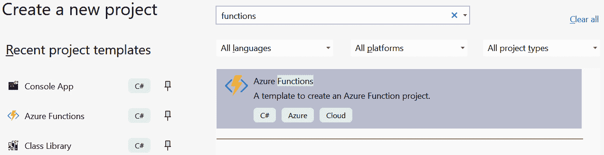

图 6.1 – 新项目向导

1.  为您的项目命名并点击**下一步**：

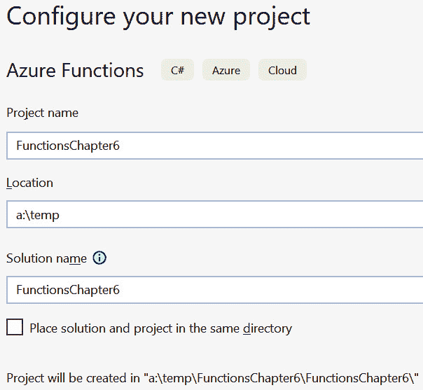

图 6.2 – 项目配置

1.  选择运行时和托管配置选项。通常，最新的**长期支持**选项是一个安全的选择：

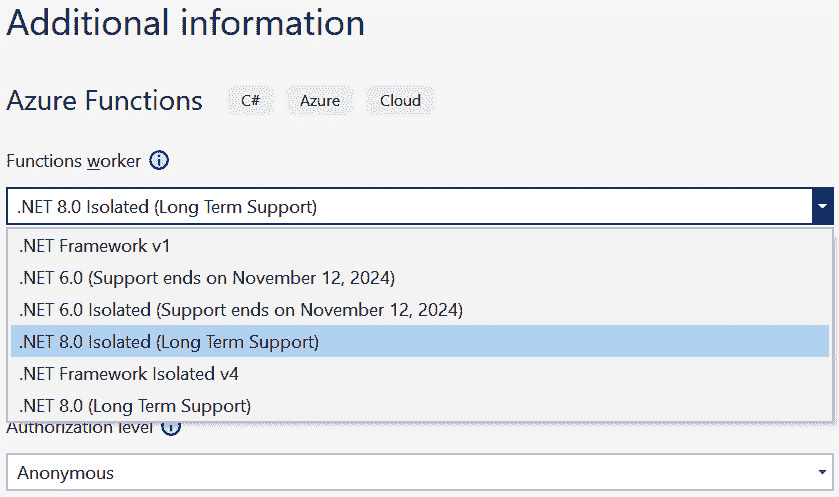

图 6.3 – 函数工作器配置

1.  选择**Http 触发器**选项，在**授权级别**下选择**匿名**，然后点击**创建**。

    我们将在本书的后面部分介绍身份验证和授权。如前所述，Docker 容器受到支持，但暂时不要勾选此选项。确保选择**Azurite**选项。这支持各种后端状态管理，也是 Durable Functions 中的“Durable”，这些内容将在下一章中介绍。其他触发器可以在以后添加：

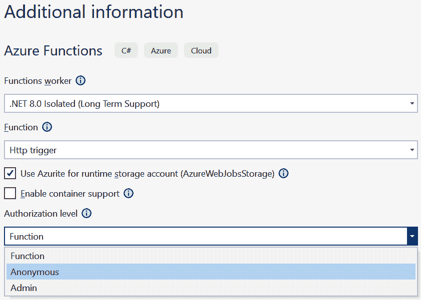

图 6.4 – 额外的函数授权选项

1.  可用的触发器种类繁多，您可以根据需要混合搭配。在**解决方案资源管理器**区域中右键单击项目，然后选择**添加** | **新建** **Azure 函数**：

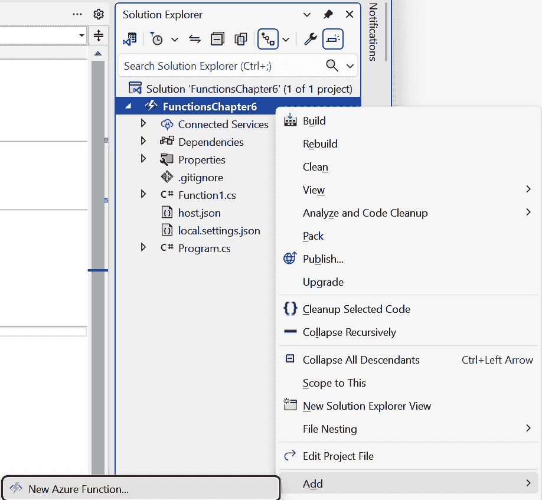

图 6.5 – 添加新的 Azure 函数

1.  您可能需要在列表中搜索 **Function**，然后点击 **Add**：

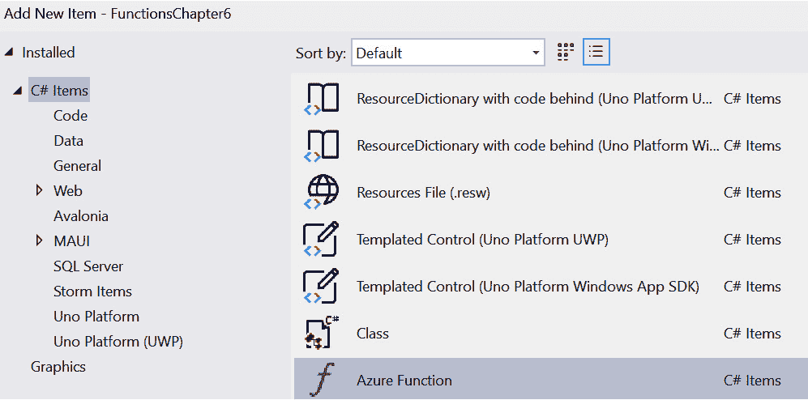

图 6.6 – 新项目对话框

1.  应该会显示一个触发器列表。选择 **Http trigger**，对于 **Authorization level** 选择 **Anonymous**，然后点击 **Add**：

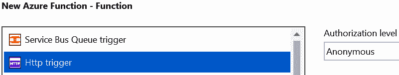

图 6.7 – 新 Azure 函数对话框

注意，模板会随着时间的推移而更新，这个新模板可能与原始函数看起来不同。它还可能添加一些您可能熟悉的新对象，包括 **IActionResult** 和 **OkObjectResult**。这些来自 ASP.NET Core 库。如果默认情况下没有引用，请安装最新的 **Microsoft.Azure.Functions.Worker.Extensions.Http.AspNetCore** NuGet 包。

有了这些，您已经创建了两个应该可以编译的 HTTP 端点。

## 选项

大多数应用程序都需要以某种形式提供选项或配置。.NET 提供了内置支持，在应用程序启动时以多种形式（包括自定义形式）传递选项到您的应用程序。这些不同的实例，如环境变量、JSON（**appsettings.json**）和 XML 文件，以及命令行参数，都是相互叠加的，以便可以根据需要覆盖单个设置。请注意，这与在应用程序运行时更改的设置不同，这些设置在创建 API 时更为高级和具体，因此本书不会涉及。

要添加对这些选项的支持，请按照以下步骤操作：

1.  添加一个名为 **MyOptions** 的新类，将其设置为 **public**，并添加一个名为 **MyReturnValue** 的标准 **string** 属性。我们将使用它来控制函数的返回值。

1.  在 **MyOptions** 类中，将属性值默认设置为任何您喜欢的。我们将在稍后的 **appsettings.json** 文件中覆盖它，并在本章后面的部署期间更改它。

1.  在 **appsettings.json** 文件中添加一个名为 **MyReturnValue** 的新属性，并设置一个与代码中默认值不同的值。

    现在，我们必须配置应用程序，使其能够在启动时使用配置框架。

1.  在 **Program.cs** 中的 **.ConfigureServices** 中修改，向 **context** Lambda 添加一个额外的参数。将调用 **.AddOptions<MyOptions>** 添加到服务变量中，或者将其链接到 **.ConfigureFunctionsApplicationInsights** 的末尾。在 **.AddOptions** 后链接着调用 **.BindConfiguration**，并传入一个空字符串。这将绑定根配置路径中的值到 **MyOptions** 类中匹配的属性名称。

    **Program.cs** 文件应该看起来像这样：

    ```cs
    var host = new HostBuilder()
        .ConfigureFunctionsWebApplication()
        .ConfigureServices((context, services) =>
        {
            services.AddApplicationInsightsTelemetryWorkerService()
                .ConfigureFunctionsApplicationInsights()
                .AddOptions<MyOptions>()
                .BindConfiguration("");
        })
        .Build();
    host.Run();
    ```

    **MyOptions.cs** 文件应该看起来像这样：

    ```cs
    public class MyOptions
    {
        public string? MyReturnProperty { get; set; } = "my value in 
        code";
    }
    ```

1.  修改**Function1.cs**文件，使其构造函数中包含**IOptions<MyOptions>**，然后将其作为类成员保存引用。让**OkObjectResult**返回**_options.Value.MyReturnProperty**，这样我们就能看到值的变化。

**Function1.cs**文件应如下所示：

```cs
public class Function1
{
    private readonly IOptions<MyOptions> _options;
    private readonly ILogger<Function1> _logger;
    public Function1(IOptions<MyOptions> options, ILogger<Function1> 
    logger)
    {
        _options = options;
        _logger = logger;
    }
    [Function("Function1")]
    public IActionResult Run([HttpTrigger(AuthorizationLevel.
    Anonymous, "get", "post")] HttpRequest req)
    {
        _logger.LogInformation("C# HTTP trigger function processed a 
        request.");
        return new OkObjectResult(_options.Value.MyReturnProperty);
    }
}
```

通过运行它来测试。你应该会看到标准输出控制台窗口，其中包含一些包含可见路由的信息性函数消息。在 Windows 上，按住*Ctrl*键并点击（在浏览器中运行），或者使用任何标准的 HTTP 软件。你应该会看到作为输出的硬编码字符串：

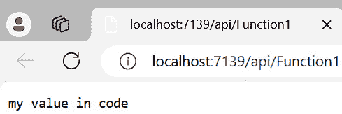

图 6.8 – 浏览器中的预期输出

恭喜！你的函数不仅正在运行，而且已经设置好，可以在部署时更改其值。现在，让我们学习如何将传入的请求路由到不同的代码部分。

## 路由

你几乎肯定需要在你的函数 API 中使用多个路由，包括路由参数、查询参数等。这构成了你 API 的“形状”或公共契约的一部分。路由支持这个概念。如果你熟悉 ASP.NET Core 路由，那么你会感到非常自在，因为它们也得到了支持，包括约束。

不同的请求如何知道进入你的应用程序的入口点？你应该如何描述允许处理的数据类型？让我们从一个经典的店面产品端点开始：

1.  复制**Function1.cs**并将其重命名为**Products.cs**，确保在其中包含所有对**Function1**的引用。

1.  在**Run**方法中添加**string category**和**int id**参数。

1.  在**OkObjectResult**中返回字符串而不是返回匿名对象，该对象包含**category**和**id**，这样我们就能看到从路由传递过来的值。

**Product.cs**文件应如下所示：

```cs
public class Products
{
    private readonly IOptions<MyOptions> _options;
    private readonly ILogger<Products> _logger;
    public Products(IOptions<MyOptions> options, ILogger<Products> 
    logger)
    {
        _options = options;
        _logger = logger;
    }
    [Function(nameof(Products))]
    public IActionResult Run([HttpTrigger(AuthorizationLevel.
    Anonymous, "get", Route = "products/{category:alpha}/{id:int?}")] 
    HttpRequest req,
        string category, int id = 0)
    {
        _logger.LogInformation("C# HTTP trigger function processed a 
        request.");
        return new OkObjectResult(new
        {
            category,
            id
        });
    }
}
```

注意**HttpTrigger**属性中的新**Route**属性，**"products/{category:alpha}/{id:int?}"**。这允许我们自定义、限制并解析出所需端点的参数。由于这些路由设计可能将成为一个更大的第三方消费者使用的 Web API 的一部分，因此你想要在创建它们时格外小心。你知道产品 ID 必须是数字，但你可能想要限制类别，使其只包含字母。当作为路由模板实现时，它将看起来像我们之前提到的：**"products/{category:alpha}/{id:int?}"**。这将只匹配具有指定格式的 URI 段的传入请求。问号（**?**）表示指定的参数是可选的，可以在方法参数中默认设置。

你注意到图 6.8 在没有指定路由时，其 **api** URL 段被添加了吗？这个前缀从哪里来？默认情况下，**api** 是函数的默认前缀。这可以在 **host.json** 文件中的 **extensions** > http > **routePrefix** 设置中更改：

```cs
{
  "version": "2.0",
  "logging": {
    "applicationInsights": {
      "samplingSettings": {
        "isEnabled": true,
        "excludedTypes": "Request"
      },
      "enableLiveMetricsFilters": true
    }
  },
  "extensions": {
    "http": {
      "routePrefix": "myapi"
    }
  }
}
```

关于部署后覆盖设置的更多详细信息，请参阅 *Post-deployment* *reconfiguration* 部分。

现在，让我们创建必要的 Azure 云资源和环境。

# 部署

首先，我们需要创建一些资源，然后我们才能在 Visual Studio 中查看它们。

## Azure 资源创建

让我们部署你的函数到生产环境！为此，创建一个新的 **消费 Linux 函数** 并按照以下步骤操作：

1.  前往 [`portal.azure.com`](https://portal.azure.com) 并创建一个新的资源组，如果你还没有的话：

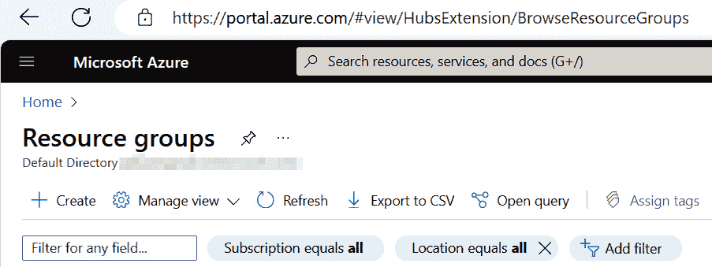

图 6.9 – 创建新的资源组

将其放置在你地理位置附近的一个 Azure 区域。当我们创建其他资源时，我们将使用相同的区域以最小化延迟和潜在带宽。点击 **审查 + 创建** 选项卡，然后点击 **创建**：

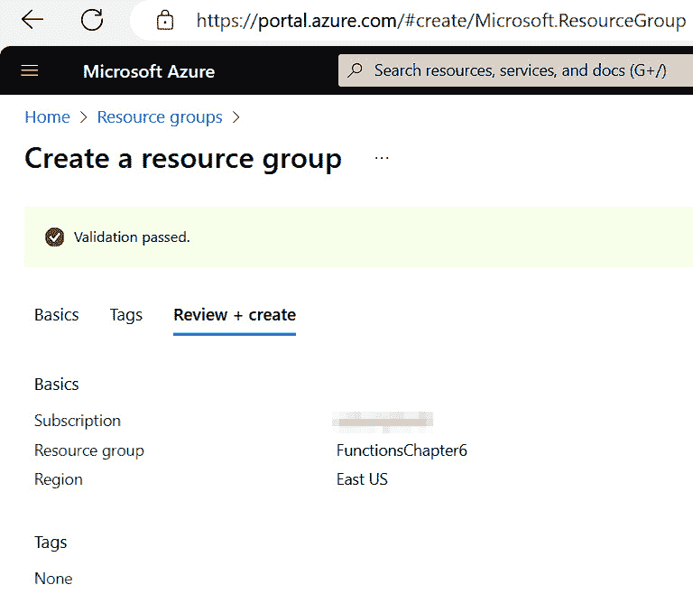

图 6.10 – 成功创建新的资源组

1.  在此资源组内创建一个新的函数应用：

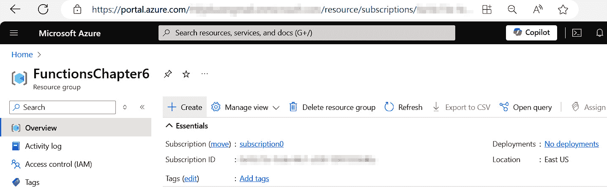

图 6.11 – 在资源组内创建新的资源

1.  如果你没有在默认选择中看到 **函数**，请搜索它。选择 **创建** | **函数应用** 以继续：

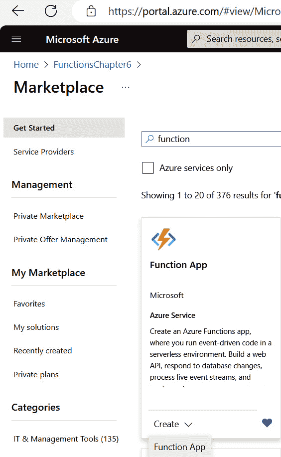

图 6.12 – 选择函数应用作为要创建的资源

1.  接下来，选择 **消费** 作为你的托管选项：

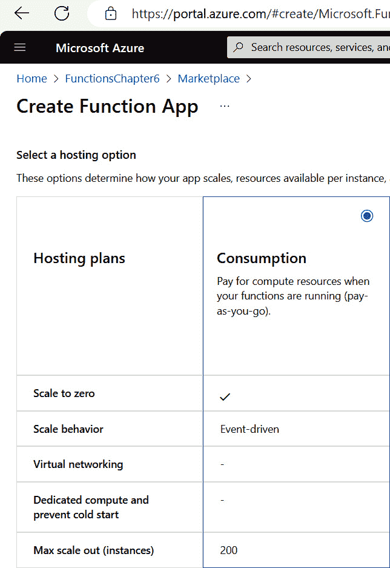

图 6.13 – 函数托管配置

1.  选择 **.NET** 作为 **运行时堆栈**，**8 (LTS)，隔离工作模型** 作为 **版本**，以及 **Linux** 作为 **操作系统**。选择你创建资源组时选择的区域，然后点击 **下一步**：

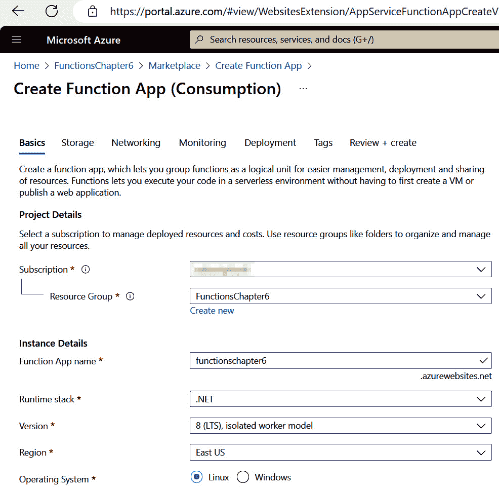

图 6.14 – 函数详细信息

1.  还需要创建一个 **存储账户** 资源来存储函数运行时所需的各种东西，包括日志、你的部署包，以及可选的 Durable 状态，我们将在下一章中讨论。现在，禁用 **Blob 服务诊断设置**：

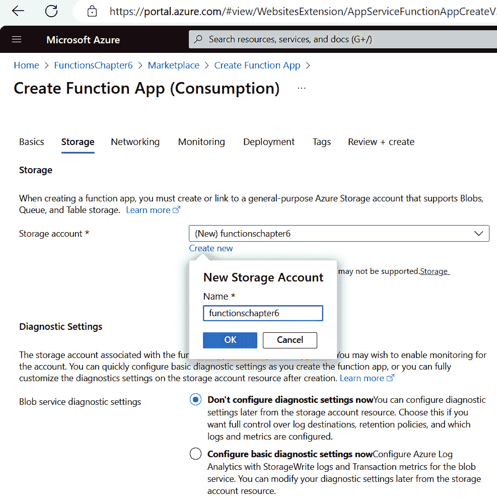

图 6.15 – 存储配置

1.  启用 **公共访问**。然后，选择 **否** 对于 **启用** **应用程序洞察**：

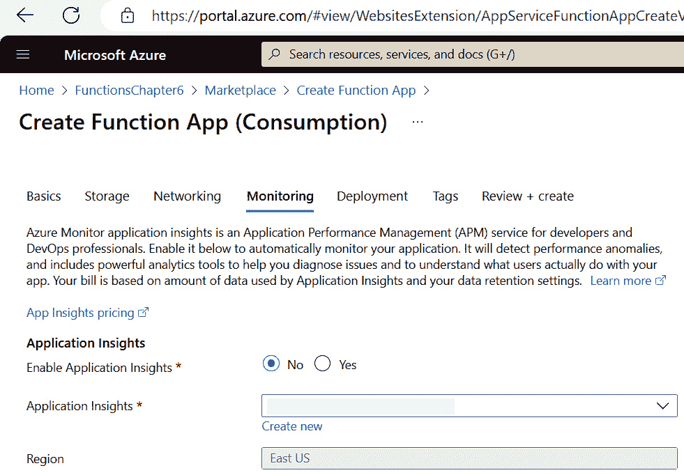

图 6.16 – 创建应用程序洞察

1.  禁用**持续部署**，这也是第*第十章*中将要讨论的内容。我们可以使用**标签**来过滤或分组资源等。如有需要，请添加标签，或者保持此部分为空并点击**审查 + 创建**。审查您的设置；如果一切看起来都很好，请点击**创建**。

1.  在这一点上，部署过程将继续。点击**转到资源**；您将被带到您全新的函数！

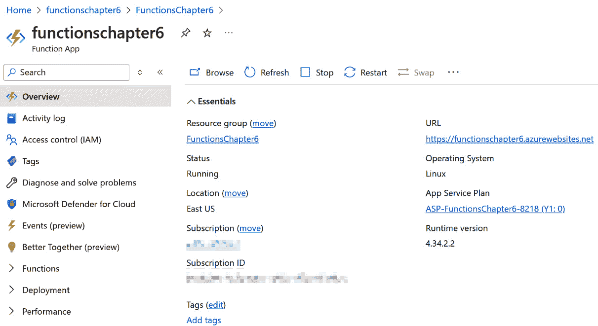

图 6.17 – Azure 函数的门户概览选项卡

1.  点击右侧列出的 URL。您将被带到默认页面，表明您的函数正在运行：

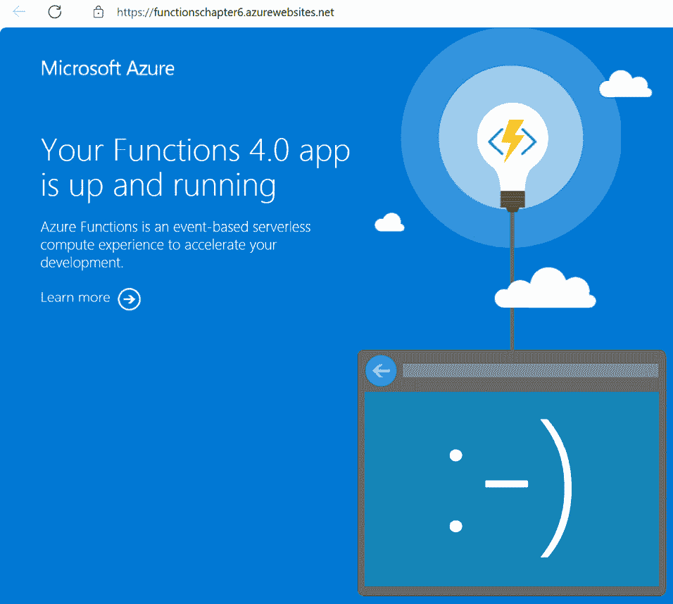

图 6.18 – 默认 Azure 函数登录页面

小贴士

虽然这些步骤和截图在写作时是准确的，但 Azure 经常更改和升级其设计、功能、流程等。建议您查看官方文档以获取最新指南。

现在，函数资源正在使用默认模板运行，让我们从 Visual Studio 进行部署。

## 从 Visual Studio 发布

让我们手动从 Visual Studio 进行部署。自动化部署，也称为持续交付，将在*第十章*中讨论：

1.  在**Visual Studio**中，右键单击**FunctionsChapter6**项目并选择**发布…**：

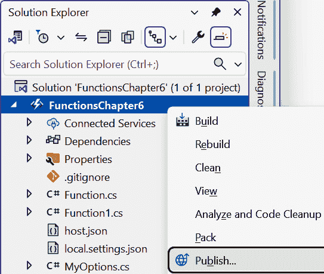

图 6.19 – 发布我们的项目

1.  然后，选择**Azure**并点击**下一步**：

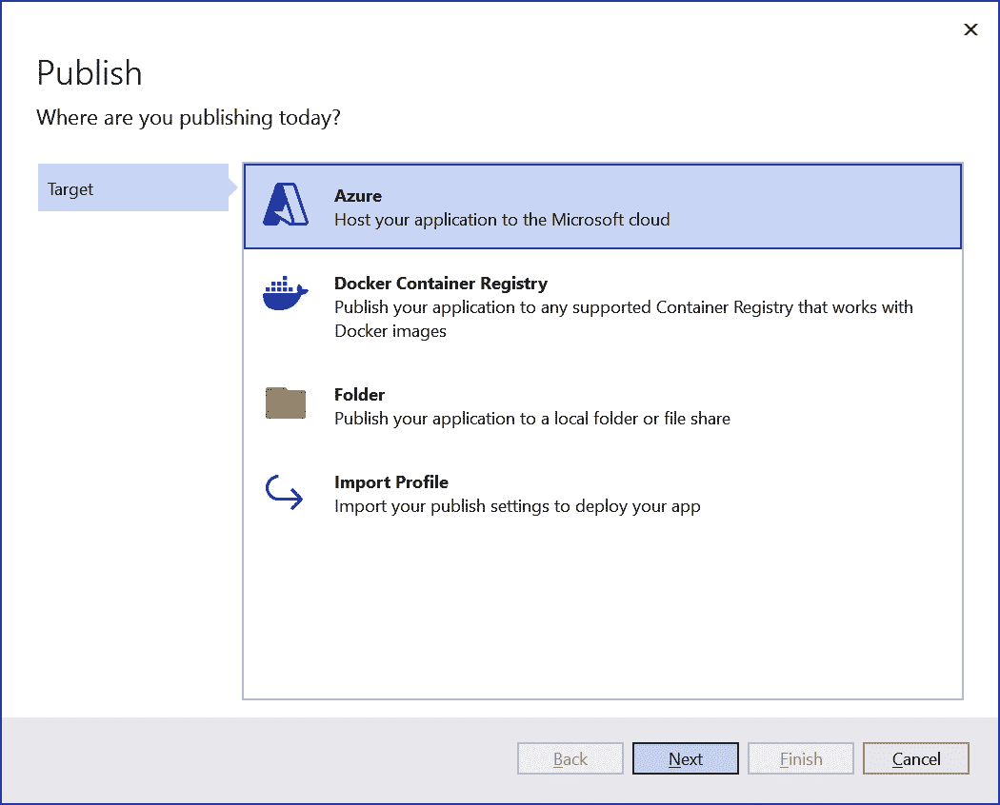

图 6.20 – 发布类型

1.  选择**Azure Function App (Linux**)并点击**下一步**：

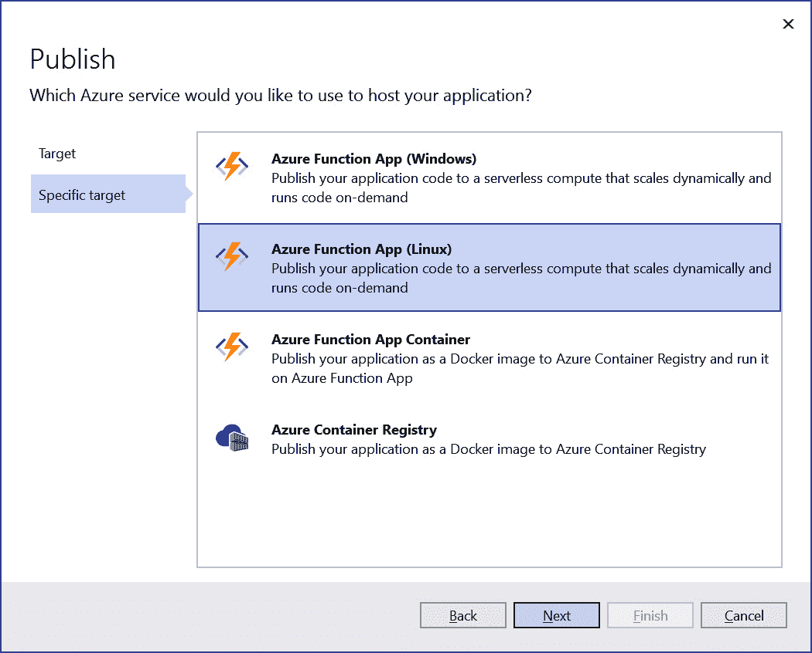

图 6.21 – Azure 发布目标

1.  选择创建函数资源时使用的**Microsoft 帐户**和**订阅**。通过名称搜索或定位您的函数，选择它，然后点击**完成**：

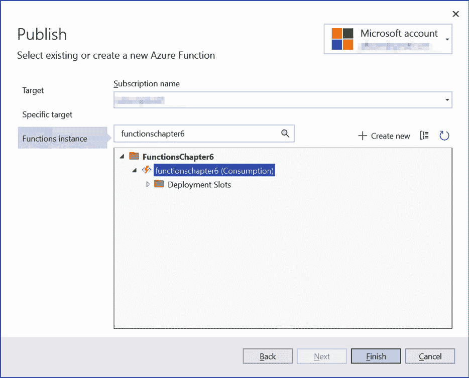

图 6.22 – 选择要发布的帐户、订阅和资源

1.  点击**完成**，完成后点击**关闭**。您的发布配置文件详情将出现，包括其**配置**和**目标运行时**，以及它需要的任何依赖项：

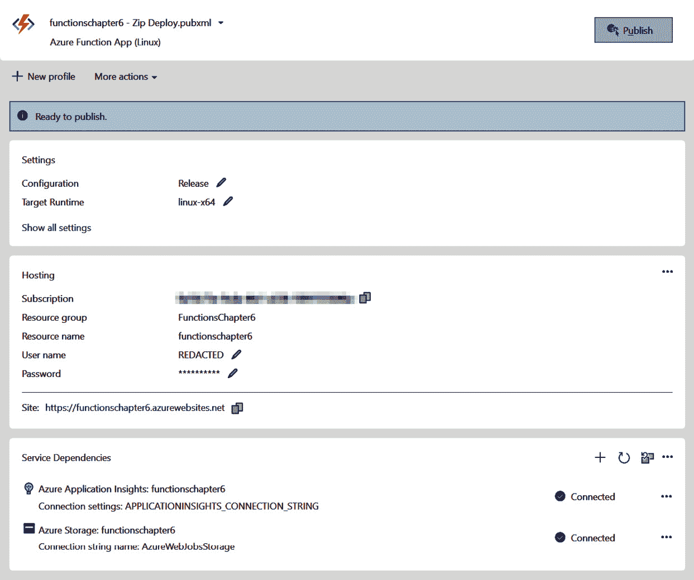

图 6.23 – 函数发布配置文件

当您准备好时，点击**发布**。一旦成功，您可以在 https://<我的资源名称>.azurewebsites.net/api/products/electronics/471337 查看您的新 API 路由。请注意，如果您访问 https://<我的资源名称>.azurewebsites.net/api/Function，您可以看到默认数据。

如本章先前所述，我们现在将探讨在不重新编译函数和不重新部署的情况下更改配置值。

## 部署后重新配置

现在，让我们将配置更改为不同的值：

1.  在 Azure 门户中函数资源的**设置**部分下的**环境变量**标签页中，创建一个新的键来覆盖我们之前硬编码的设置。使用**MyReturnProperty**作为键，因为我们是从根命名空间读取配置变量：

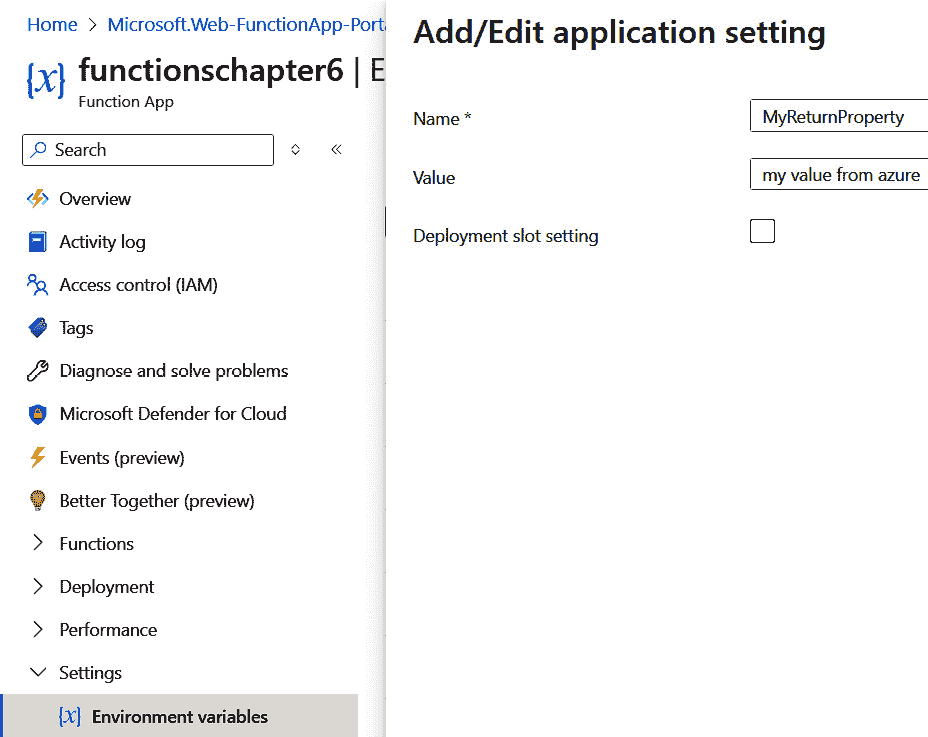

图 6.24 - 添加新的环境变量以覆盖设置

1.  **应用**这个添加，**应用**更改，并**确认**保存；你的函数应用将被重新启动。导航到 https://<我的资源名称>.azurewebsites.net/api/Function1，以便您可以看到新的配置值：

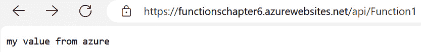

图 6.25 – 覆盖的配置值

这可以任意深度嵌套。例如，如果您的**MyOptions**类的**MyReturnValue**是一个具有自己的**MyOtherReturnValue**属性的复杂类型，Azure 中的键路径将是**MyReturnValue__MyOtherReturnValue**。请注意，属性名之间有两个下划线。

由于这是公开可访问的，如果恶意进程意识到您的新端点，这可能会让您付出金钱。在本书的后面部分将讨论如何使用俗称的**简易认证**来保护这个新网站。

但与此同时，您可以调整一些托管选项来限制潜在成本。

1.  导航到**设置** | **扩展**，并将**最大扩展限制**更改为**1**。然后，点击**保存**：

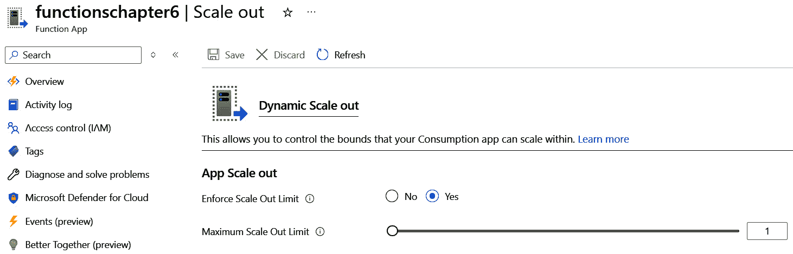

图 6.26 – 限制扩展

1.  然后，导航到**设置** | **配置**，将**每日使用配额**更改为**1**，然后点击**保存**，接着**继续**：

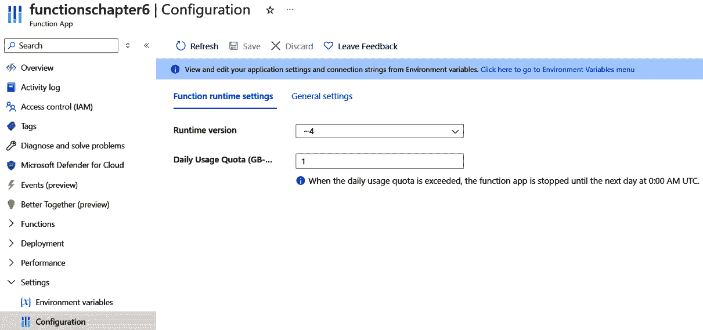

图 6.27 – 添加每日配额

到目前为止，虽然您还没有保护您的网站免受机器人或恶意行为者的攻击，但您至少已经采取了一些措施来减轻任何潜在损害。

# 摘要

在本章中，我们介绍了在单个 Azure 函数内创建多个 HTTP 端点，添加路由模板以帮助在运行时管理不同的 URI 段。然后，我们将配置选项添加到我们的项目中，将其部署到 Azure，并在部署后调整配置选项。为了限制已部署的实时 HTTP 端点的潜在成本，我们调整了两个设置，直到授权就绪。

现在您已经了解了 Azure 函数中 HTTP 触发器的工作原理，在下一章中，我们将探讨我们可以使用的其他类型的触发器，以构建可靠、有状态和可扩展的工作流程。

# 你试试看

使用 Azure Functions 编写 API，在 Azure 中创建一个函数资源，然后使用 Visual Studio 将其部署到该资源。
