# 高级主题

在本章中，我们将探讨一些在本书其他地方没有涵盖的高级主题。这包括使用更复杂的数据结构实现高级 API、存储表以及当时非常激动人心的新（在撰写本文时）Aspire 功能。

在本章中，我们将涵盖以下主题：

+   实现高级 API

+   更新数据库

+   支持实现

+   创建 Azure 存储表

+   Aspire 仪表板

+   将 Aspire 添加到现有项目中

# 技术要求

对于本章，您需要以下内容：

+   Visual Studio。

+   **Azure.Data.Tables** NuGet 包。

+   Azure 账户（您可以在[`azure.microsoft.com/en-us/`](https://azure.microsoft.com/en-us/) 获取免费入门账户）。

    Aspire 随 Visual Studio 2022（版本 17.10 或更高）一起提供，并需要.NET 8。

+   您需要安装 Docker Desktop（它是免费的，可以在[`www.docker.com/Products/docker-desktop/`](https://www.docker.com/Products/docker-desktop/) 获取）。

本章的代码文件可以在 GitHub 存储库中找到：[`github.com/PacktPublishing/Programming-APIs-with-C-Sharp-and-.NET/tree/main/Chapter08`](https://github.com/PacktPublishing/Programming-APIs-with-C-Sharp-and-.NET/tree/main/Chapter08)

# 实现高级 API

到目前为止，我们一直在使用一个非常简单的数据库，并实现相当直接的 API。然而，有时您的客户会要求更复杂或更困难的事情。让我们看看这样一个要求。

客户要求能够看到带有所有选项的汽车。我们将以 JSON 格式提供，以便在网页、手机等设备上轻松显示。JSON 将如下所示：

```cs
{
    "id": 2,
    "name": "buick skylark 320",
    "mpg": null,
    "cylinders": null,
    "displacement": null,
    "horsepower": null,
    "weight": null,
    "acceleration": null,
    "modelYear": null,
    "origin": null,
    "is_Deleted": null,
    "options": [
        {
            "optionId": 1,
            "optionName": "Winter Package",
            "optionPrice": 3700
        },
        {
            "optionId": 2,
            "optionName": "Mats",
            "optionPrice": 250
        },
        {
            "optionId": 3,
            "optionName": "Summer Package",
            "optionPrice": 2250
        }
    ]
}
```

要实现这一点，我们需要在数据库中添加一个表：**选项**。

## 更新数据库

我们需要跟踪用户可能选择的各个功能（选项），例如天窗、冬季套餐等。为此，我们将创建一个新的表，**选项**，它将包含四个列：

+   **car_id**：添加此选项的汽车的 ID

+   **option_id**：选项的 ID

+   **option_name**：功能的名称

+   **option_price**：此功能的 MSRP

这里是**选项**表的示例：

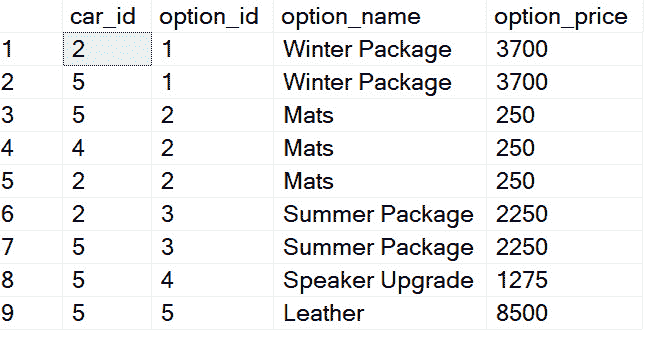

图 8.1 – 选项表的示例行

您至少需要使用任意值创建 10 行。请注意，没有包含选项名称和值的表。这是一个简单的、主要非关系型数据库，尽管您可以自由地添加此类表。

使用这个表，我们可以创建我们的一个关系；即**汽车**表和**选项**表之间的关系。将**car_id**添加到**汽车**表中，并创建我们的**选择**语句，与选项表进行连接：

```cs
select top(10) * from car c join options o on o.car_id = c.id
```

结果看起来像**汽车**表，但每个汽车的选项都附加在末尾，如图*图 8.2*所示：

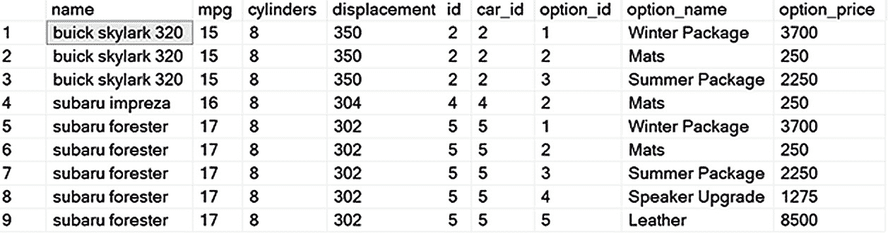

图 8.2 – 连接的表

注意，由于我为了适应页面而剪掉了中间部分，所以你的表格看起来会有些不同。

你可以看到选项值被附加到 **car** 行上。这正是我们所需要的。

对于大多数应用程序来说，这已经足够了，然而，我们的客户要求实现高级 *API* 下的代码中显示的 JSON 结构。

这将有点棘手。

## 创建类

我们需要一个类来表示整个行，包括汽车和选项。每个类的实例将代表表格中的一行，如图 *图 8* *.2* 所示。让我们称这个类为 **carFlat** :

```cs
  public class CarFlat : Car
  {
      public int? car_id { get; set; }
      public int? option_id { get; set; }
      public string? option_name { get; set; }
      public float option_price { get; set; }
  }
```

注意 **CarFlat** 继承自 **Car** ，继承了 **Car** 的所有属性，并添加了 **Options** 的属性（以及 **car_id** ）。

注意

在我的编程中，我通常使用帕斯卡大小写（首字母大写）来表示属性。

现在，我们需要一个类来表示没有选项的行（代表汽车），但每辆汽车都将有一组选项。让我们称这个类为 **carDto**，因为它将是我们的汽车 **数据传输对象** ( **DTO** )。

我们将传递选项，因此让我们创建一个 **OptionsDto** 类。

它们看起来是这样的：

```cs
    public class CarDto
    {
        public int Id { get; set; }
        public string Name { get; set; }
        public string Mpg { get; set; }
        public string Cylinders { get; set; }
        public string Displacement { get; set; }
        public string Horsepower { get; set; }
        public string Weight { get; set; }
        public string Acceleration { get; set; }
        public string ModelYear { get; set; }
        public string Origin { get; set; }
        public string Is_Deleted { get; set; }
        public List<OptionsDto> Options { get; set; }
    }
```

这里需要注意的重要事情是 **CarDto** 有一个属性是所有这些汽车选项的列表；注意最后一个属性是一个 **OptionsDtos** 的列表。现在让我们看看这个类：

这是 **OptionsDto** :

```cs
    public class OptionsDto
    {
        public int OptionId { get; set; }
        public string OptionName { get; set; }
        public float OptionPrice { get; set; }
    }
```

注意 DTO 中的大小写和下划线的缺失。

我们需要一种方法将 DTO 连接到 **Car** 对象。这正是个人资料的作用。

### 个人资料

我们需要一个个人资料来将不同的类映射到彼此。DTO 用于传输对象（因此得名），但它必须映射到原始对象。因此，我们希望将 **Car.Dto** 映射到 **Car** 类。

这是最难的部分，映射是使这一切工作起来的关键。

第一张映射相当直接，将 **Car** 映射到 **CarDto** :

```cs
CreateMap<CarDto, Car>()
    .ForMember(car => car.id, opt => opt.MapFrom(carDto => carDto.Id))
    .ForMember(car => car.name, opt => opt.MapFrom(carDto => carDto.
    Name))
    .ForMember(car => car.mpg, opt => opt.MapFrom(carDto => carDto.
    Mpg))
    .ForMember(car => car.cylinders, opt => opt.MapFrom(carDto => 
    carDto.Cylinders))
    .ForMember(car => car.displacement, opt => opt.MapFrom(carDto => 
    carDto.Displacement))
    .ForMember(car => car.horsepower, opt => opt.MapFrom(carDto => 
    carDto.Horsepower))
    .ForMember(car => car.weight, opt => opt.MapFrom(carDto => carDto.
    Weight))
    .ForMember(car => car.acceleration, opt => opt.MapFrom(carDto => 
    carDto.Acceleration))
    .ForMember(car => car.model_year, opt => opt.MapFrom(carDto => 
    carDto.ModelYear))
    .ForMember(car => car.origin, opt => opt.MapFrom(carDto => carDto.
    Origin))
    .ReverseMap();
```

我们首先在地图中识别类型，然后对每个成员使用 Lambda 表达式进行映射。注意最后一行，**.ReverseMap** – 这避免了我们需要重新编写整个映射过程。

接下来是程序的精髓，将 **CarFlat** 映射到 **CarDto**，并将 **OptionsDto** 映射到 **CarFlat** :

```cs
CreateMap<List<CarFlat>, CarDto>()
     .ForPath(dest => dest.Id, opt => opt.MapFrom(src => src.First().
     id))
     .ForPath(dest => dest.Name, opt => opt.MapFrom(src => src.
     First().name))
     .ForMember(dest => dest.Options, opt => opt.MapFrom(src => src));
CreateMap<OptionsDto, CarFlat>()
     .ForMember(dest => dest.option_id, opt => opt.MapFrom(src => src.
     OptionId))
     .ForMember(dest => dest.option_name, opt => opt.MapFrom(src => 
     src.OptionName))
     .ForMember(dest => dest.option_price, opt => opt.MapFrom(src => 
     src.OptionPrice))
```

这是由 AutoMapper 完成的魔法。如果你还没有安装 AutoMapper，现在是安装的好时机。AutoMapper 将使这项工作变得无限简单。AutoMapper 简化了不同对象模型之间的映射过程，减少了手动转换的需求。我们只需要告诉 AutoMapper 从一个类映射到另一个类，如下所示。

# 支持实现

个人资料编写完成后，我们将回到控制器。在这里，我们将映射 **CarDto** 到汽车。注意这段代码的倒数第二行：

```cs
       [HttpGet("{id}")]
       public async Task<ActionResult<CarDto>> Get(int id)
       {
           var car = await _carService.Get(id);
           if (car == null)
           {
               return NotFound();
           }
           var carDto = _mapper.Map<CarDto>(car);
           return carDto;
       }
```

这里没有什么新或特别的东西，但请注意，在方法底部，我们使用映射器将我们的汽车转换为 DTO，这是我们返回给客户端应用程序的内容。

**CarService**中的唯一逻辑是确保我们有有效的汽车 ID：

```cs
public async Task<List<CarFlat>> Get(int id)
 {
     if (id == 0)
     {
         throw new Exception("Invalid Id");
     }
     return await _carRepository.Get(id);
 }
```

这就带我们来到了存储库：

```cs
public async Task<List<CarFlat?>> Get(int id)
 {
     var query = "select * from car c left join options o on o.car_id 
     = c.id where c.id = @id";
     using var db = databaseConnectionFactory.GetConnection();
     return (await db.QueryAsync<CarFlat>(query, new {id})).ToList();
 }
```

方法出奇地简单。我们设置并执行查询。请注意，我们正在使用**QueryAsync**和**ToList**，就像我们正在获取所有汽车一样。实际上，我们得到的是单个汽车的选项列表，如下一节所示：

```cs
{
    "id": 2,
    "name": "buick skylark 320",
    "mpg": null,
    "cylinders": null,
    "displacement": null,
    "horsepower": null,
    "weight": null,
    "acceleration": null,
    "modelYear": null,
    "origin": null,
    "is_Deleted": null,
    "options": [
        {
            "optionId": 1,
            "optionName": "Winter Package",
            "optionPrice": 3700
        },
        {
            "optionId": 2,
            "optionName": "Mats",
            "optionPrice": 250
        },
        {
            "optionId": 3,
            "optionName": "Summer Package",
            "optionPrice": 2250
        }
    ]
}
```

真棒！这应该看起来很熟悉，因为它就是我们在本章开头指定的。每辆车的选项作为 JSON 中的子集存在。这将使显示带有选项的汽车（例如，在网页上）变得容易得多。把它放在口袋里；你不会经常用到它，但当你需要做这种显示时，这项技术强大但并不明显。

在下一节中，我们将介绍 Azure 存储表，这是一种强大而简单的数据存储方式。

# Azure 存储表

**存储表**是持久化相对简单数据结构的好方法。创建和使用存储表既快又简单。

Azure 提供了多种存储数据的方式。最受欢迎的是 SQL Server、Cosmos 和存储表。存储表通常是最有限的，但就一般而言，它们也是最简单的，并且创建速度最快。它们非常适合跟踪简单信息。例如，你可能使用存储表来记录每次发送消息或每次发生异常的情况。对于这些示例，你将按以下章节所述，为每个事件输入一行。

# 探索基本要素

存储表本身不是关系型的。虽然你可以进行索引，但这并不简单，也不特别强大。这一切背后的原因是为了保持存储表简单。这使得它们非常适合用于存储列表、记录日志、创建进度条目等。

我们将创建一个存储表，用于跟踪程序执行过程中抛出的异常。我们在 Azure 上创建的表将看起来像这样：

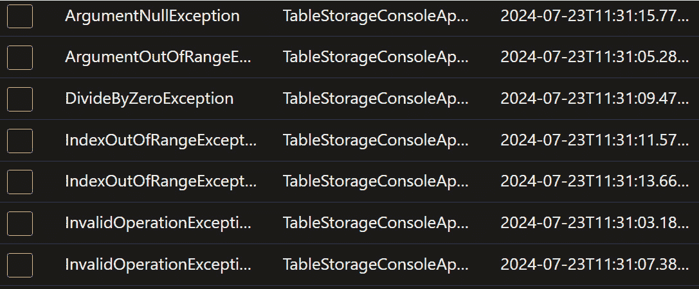

图 8.3 – 存储表的左侧部分

由于空间限制，我这里没有展示整个表。表中包含异常类型、异常时间、消息等列。

为了尽可能保持简单，并专注于 100%的表存储，我们将创建一个控制台应用程序，该程序简单地抛出异常并将它们存储在表中。要开始，请按照以下步骤操作：

1.  创建一个新的项目，并选择**控制台应用程序**，如图*图 8* *.4* 所示。

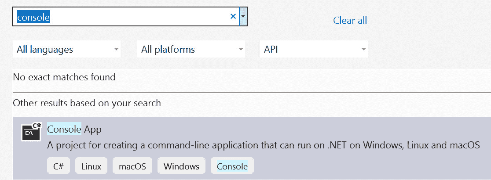

图 8.4 – 选择控制台应用程序

1.  点击**下一步**并填写你的项目名称（我使用了**TableStorageConsoleApp**），它在本地磁盘上的位置以及解决方案的名称（通常是项目名称相同）。点击**下一步**并选择**.NET 8**（或更高版本），最重要的是，检查**不要使用顶级语句**，如图所示：

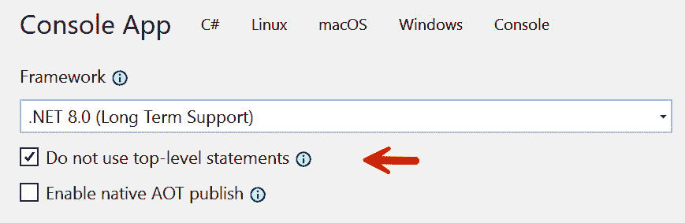

图 8.5 – 其他信息

1.  点击**创建**，你的控制台应用程序将被创建，包括一个主入口点和一行代码，写入标准的“Hello, World”问候语。你可以删除那行代码。

为了保持简单，我们将让**Main**调用**ThrowException**，这是一个我们将编写的每两秒抛出一个随机异常的方法。因此，**Main**非常简单：

```cs
public class Program
 {
     static void Main(string[] args)
     {
         Console.WriteLine("Loading...");
         for(; ; )
         {
             ThrowException();
         }
     }
```

你可以看到**ThrowException**被包含在一个无限循环中，并且会一直持续到你关闭程序为止。用更复杂的方式停止它，正如他们所说，留作读者的练习。

**ThrowException**的工作，正如之前所说，是随机抛出异常。为此，我需要的只是一个**随机**生成器和**switch**语句。我们首先在 try 语句中包含随机生成异常：

```cs
try
{
    Random rand = new Random();
    var random = rand.Next(0, 10);
    switch (random)
    {
        case 0:
            throw new ArgumentException("Argument Exception");
        case 1:
            throw new ArgumentNullException("Argument Null 
            Exception");
        case 2:
            throw new ArgumentOutOfRangeException("Argument Out Of 
            Range Exception");
        case 3:
            throw new DivideByZeroException("Divide By Zero 
            Exception");
        case 4:
            throw new FileNotFoundException("File Not Found 
            Exception");
        case 5:
            throw new FormatException("Format Exception");
        case 6:
            throw new IndexOutOfRangeException("Index Out Of Range 
            Exception");
        case 7:
            throw new InvalidOperationException("Invalid Operation 
            Exception");
        case 8:
            throw new KeyNotFoundException("Key Not Found Exception");
        case 9:
            throw new NotImplementedException("Not Implemented 
            Exception");
        case 10:
            throw new NotSupportedException("Not Supported 
            Exception");
        default:
            throw new Exception("Generic Exception - you should never 
            see this");
    }
}
```

有了这个，我们可以捕获每个异常并将其写入我们的表：

```cs
catch (Exception ex)
{
    Console.WriteLine(ex.Message);
    TableModel entity = new TableModel
    {
        PartitionKey = ex.GetType().Name,
        RowKey = $"TableStorageConsoleApp-{DateTime.UtcNow.
        ToString("yyyy-MM-ddTHH:mm:ss.fffffffZ")}",
        Message = ex.Message,
        Timestamp = DateTimeOffset.UtcNow
    };
    TableServiceClient tableServiceClient = new 
    TableServiceClient("DefaultEndpointsProtocol=
    https;AccountName=<your account name>;AccountKey=
    <your account key>;EndpointSuffix=core.windows.net");
    var storageTableService = new 
    StorageTableService(tableServiceClient);
    storageTableService.UpsertEntityAsync(entity).Wait();
    Thread.Sleep(2000);
}
```

这里有很多东西可以看。我们首先创建**TableModel**。我们将在稍后创建这个数据结构。

在该模型中，我们将有**PartitionKey**和**RowKey**。这些对于**TableStorage**至关重要。它们共同构成了表中每行的唯一标识符。

所有具有相同**PartitionKey**的条目都聚集在一起，在那个集群中包含了所有的**RowKeys**。这使得检索变得无限快。而不是必须扫描所有的**RowKeys**，可以通过跳转到正确的**PartitionKey**并从那里搜索来实现检索。

我们还存储异常的消息和当前时间作为时间戳。

**TableServiceClient**由 NuGet 包提供（参见本章开头的需求）。你将初始化的地址将在本章后面的部分由 Azure 提供。

我们随后调用**UpsertEntityAsync**，传入我们之前创建的实体，然后休眠两秒钟（你休眠的时间完全取决于你）。

请注意，你需要自己的**AccountKey**，最好是自己的**accountName**。

## TableModel

我之前承诺要向你展示**TableModel**。它相当简单，只足够捕获必要的信息：

```cs
public class TableModel : ITableEntity
 {
     required public string PartitionKey { get; set; }
     required public string RowKey { get; set; }
     public DateTimeOffset? Timestamp { get; set; }
     public string? Message { get; set; }
     public ETag ETag { get; set; } = ETag.All;
 }
```

注意，**ETag**必须在每个表模型中。这在更新时用于乐观并发。我们不会进行更新，所以我们不关心这一点，除了它必须存在。

## StorageTableService

应用程序的核心是**StorageTableService**。这里是**UpsertEntityAsync**所在的地方，它负责与我们的表进行交互：

```cs
public async Task<Response> UpsertEntityAsync(TableModel entity)
{
     var response = await _tableCreationTask;
     var table = _tableServiceClient.GetTableClient(response.Value.
     Name);
     return await table.UpsertEntityAsync(entity);
}
```

要开始，我们在类的顶部声明两个成员变量：

```cs
private readonly TableServiceClient _tableServiceClient;
private readonly Task<Response<TableItem>> _tableCreationTask;
```

注意，第二个成员是 **Task<Response<TableItem>>** 类型。**Response** 和 **TableItem** 都由 Azure NuGet 包提供。构造函数接受 **TableServiceClient**（也由同一 NuGet 包提供）。

```cs
public StorageTableService(TableServiceClient tableServiceClient)
{
     _tableServiceClient = tableServiceClient;
     _tableCreationTask = _tableServiceClient.
     CreateTableIfNotExistsAsync("ExceptionsTable");
}
```

如果表不存在，我们在这里创建它，并将其命名为 **ExceptionsTable**（你可以随意命名你的表）。

所有的 **Upsert** 方法需要做的就是调用 **tableCreationTask** 并等待返回 **Response<TableItem>**。有了这个，它就可以在 **TableServiceClient** 上调用 **GetTableClient**，传入表的名称。最后，我们在表上调用 **UpsertEntityAsync**，传入 **TableModel**。

请确保你理解上一段内容，因为它是与 **StorageTables** 一起工作的核心。

## 在 Azure 中填充表

使用我们编写的代码，在 Azure 中填充表是自动的。运行程序；你的输出应该看起来像 *图 8.6*。

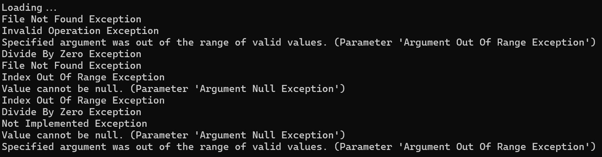

图 8.6 – 生成的异常

注意

你需要为这部分创建一个 Azure 账户。如前所述，你可以在提供的链接中获取一个免费的入门账户。

现在，让我们转到 Azure 看看我们有什么：

1.  登录您的账户，点击 **Home**，然后点击 **存储浏览器**，如图所示：

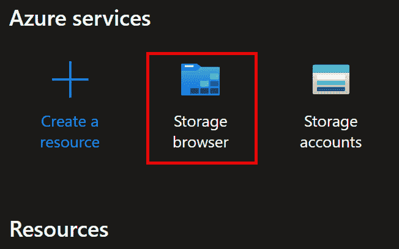

图 8.7 – 存储浏览器

1.  从那里，点击你的 **TableStorage** 账户。这将显示一个仪表板。点击 **Tables**，如图 8.8 所示。

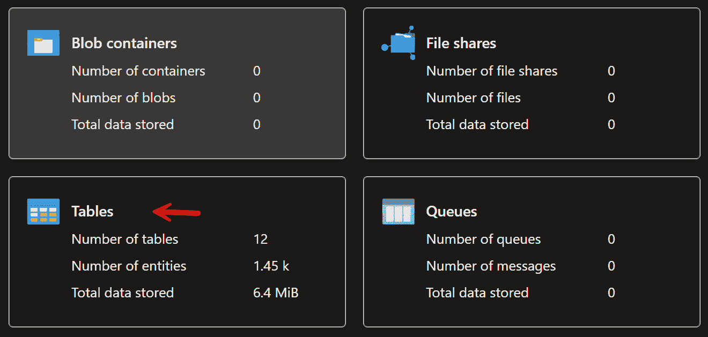

图 8.8 – 选择表格

1.  你应该会被带到一页，你的表应该作为链接列出。点击我们创建的表。与我们看到的应用程序中匹配的条目将弹出，如图 8.9（部分）所示。

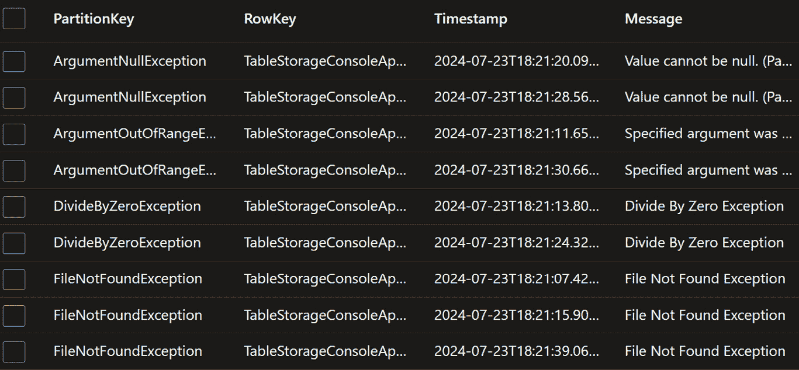

图 8.9 – Azure 上的表

注意，条目不是按照它们创建的顺序排列的。相反，它们是按照前面描述的 **PartitionKey** 进行分组的。

惊讶的是，就是这样。

# 介绍 Microsoft Aspire

微软推出了 Aspire，它将其描述为 *opinionated, cloud ready stack for building observable, Production-ready, distributed applications.* 说的是什么？

在这种情况下，*opinionated* 意味着有一些约定和模板可以使生活更轻松。有了这个和所有其他事情，你可以自定义，但遵循约定越多，编写代码就越容易，也许更重要的是，阅读代码也更容易。

*Cloud-ready stack* 指的是你将在本地工作，但代码可以轻松地移动到云端（即 Azure）。*Production-ready* 指的是你构建的内容将非平凡，并准备好部署，而 *distributed* 意味着你将创建托管在容器中的微服务，在我们的例子中，是 Docker。

Aspire 为您提供了一些您可以自己编写的服务，但不再需要。相反，您将获得自动测试的完整代码，它提供了存储、消息传递和 Web 服务等功能，还可以提供与数据库、缓存等更多功能的互操作性。

注意

您可以使用 Aspire 与 Visual Studio Code 或.NET CLI 一起使用，但我们将坚持使用 Visual Studio。

## 示例程序

Aspire 功能非常强大，但将所有部件放在一起可能会有些棘手。我们*可以*编写自己的示例程序，但那会很愚蠢，因为 Microsoft 提供了一个只需在 Visual Studio 中按几个键就能创建的程序。要开始，请按照以下步骤操作：

1.  创建一个新项目并选择**.NET Aspire Starter Application**。请确保选择 C#版本，如图 8.10 所示：

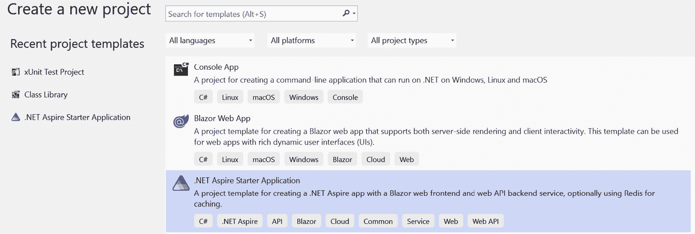

图 8.10 - 选择 Aspire

1.  输入项目名称（我将使用**AspirePackt**）并保留其余值为其默认值。

1.  在下一页上，确保您选择了**.NET 8**和**使用 Redis 进行缓存**，尽管您始终应该创建单元测试，但现在我们将跳过这一步（在“真实”应用程序中，您希望有这些单元测试），如图 8.11 所示：

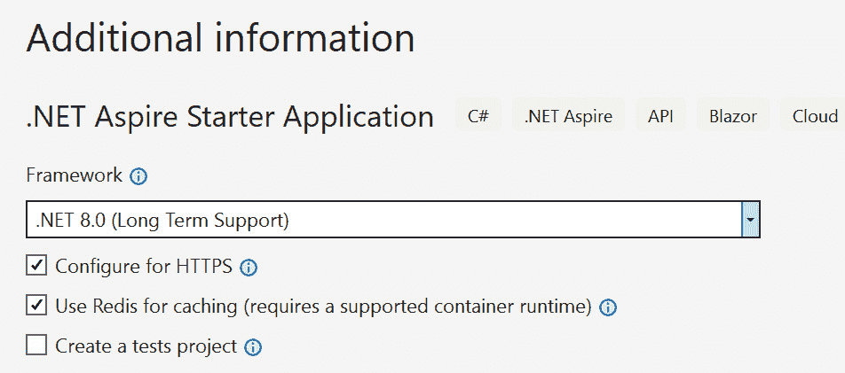

图 8.11 – 选择框架

这是我们将要看到的：一个支持缓存的示例天气应用程序。它将通过 API 获取天气，使用随机演示值。

1.  启动应用程序后，首先发生的事情是.NET Aspire 仪表板将在您的浏览器中打开，部分如图 8.12 所示。

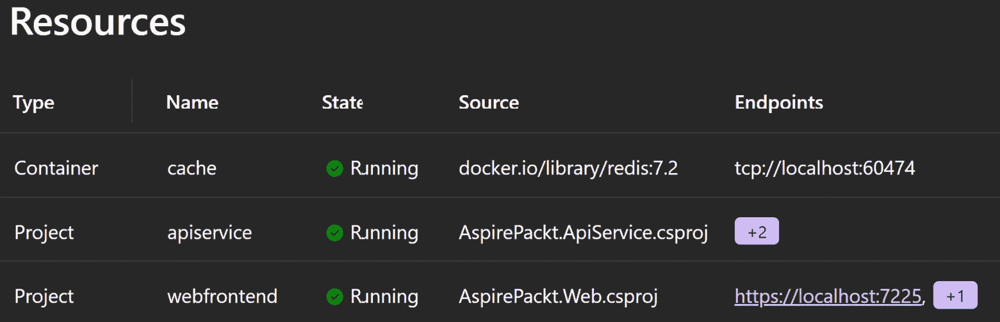

图 8.12 – Aspire 仪表板

这一切都是在示例程序中为您创建的，该程序还创建了一个 Blazor 应用程序，该应用程序将用于显示通过 API 检索到的数据。

注意图 8.13 中的第三行项目是**webfrontend**。点击 URL，您将被带到标志性的**Hello, world!**页面。在左侧有三个按钮，如图下所示：

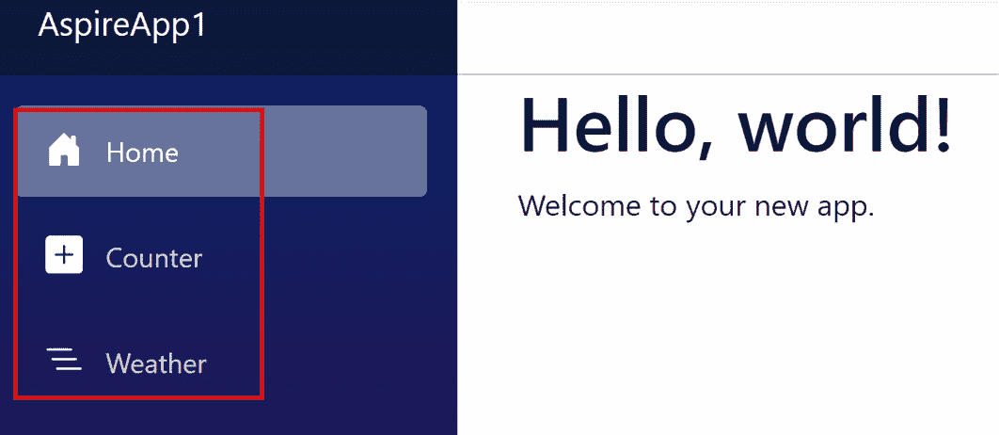

图 8.13 – 运行中的应用程序

现在点击**天气**选项，*voilà*！API 被调用，并显示天气数据，如图 8.14 所示。

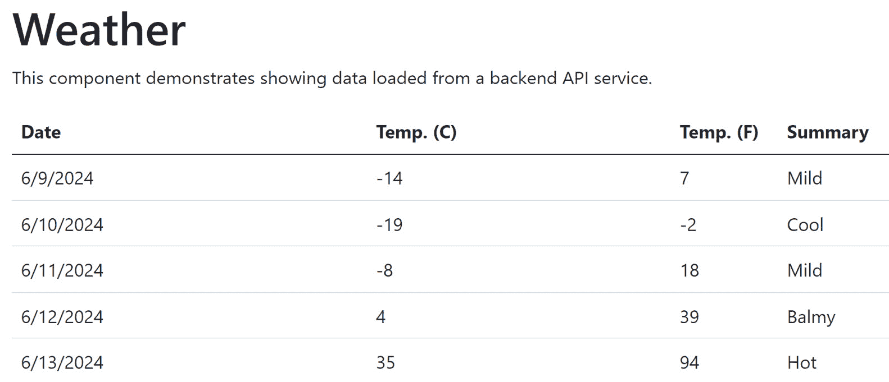

图 8.14 – API 显示的天气

如果您刷新屏幕几次，您会看到它立即响应，因为它正在使用缓存。大约 10 秒后，它将生成新的数据。

## 探索 Aspire 仪表板

返回到图 8.12，我们可以看到许多有用的功能。例如，点击**资源**，可以看到应用程序中所有.NET 项目的信息列表。这些包括应用程序状态、端点和环境变量。

**控制台**显示（惊喜！）每个项目的控制台输出。

**结构化** 选项将日志显示为表格。您可以进行过滤和搜索（无论是自由格式还是过滤）。您可以通过单击最右侧的 **查看** 按钮来展开每个条目的详细信息。

**跟踪** 按钮显示应用程序中的请求路径。定位到 **天气** 的请求并选择 **查看**。仪表板将按阶段显示请求。

单击 **ApiService | 查看**，您将看到击中 API 所需的时间。单击右侧的 **查看**，将详细显示资源。向下滚动以查看更多详细信息。

最后，**指标** 按钮将显示仪表和计量器，因为它们适用于您的应用程序。

# 你学到了什么，多萝西？

如您所见，示例应用程序由多个项目组成。第一个，也许是最重要的，是应用程序宿主，它充当协调器。它将自动将项目文件中的 **IsAspireHost** 设置为 true。

仔细阅读 **Program.cs** 文件，您将看到作为 API 开发人员所期望的内容，包括在 **APIService**（以及为 Blazor 添加的一些内容）中的 Aspire。

注意，第一行使用 Docker 创建了 **DistributedApplication**。

此文件中的一个关键行是 **AspirePackt.ApiService**，它配置了解决方案中项目之间的服务发现和通信。名称（**apiservice**）标识了项目，并被希望与其通信的项目使用。

另一个重要且通用的项目是 **ServiceDefaults**，它是一个共享项目，用于管理配置，以便它们可以在项目之间使用。这使得应用程序能够让所有服务共享服务发现、遥测等。

# 将 Aspire 添加到现有应用程序

我们都喜欢绿地项目，但现实是，我们大多数时候都在处理现有代码。如果 Aspire 只能从头开始工作，那么它将不会很有趣，但幸运的是，您可以将 Aspire 添加到现有应用程序中。

我们可以将 Aspire 添加到我们的汽车应用程序中，但又一次，Microsoft 提供了合理的复杂应用程序供我们使用。要开始，请使用以下命令克隆他们的应用程序：

```cs
git clone https://github.com/MicrosoftDocs/mslearn-dotnet-cloudnative-devops.git eShopLite
```

此示例由三个项目组成：

+   数据实体是一个类库，它定义了 **产品** 类。

+   **产品** 是一个返回商店目录中所有产品列表的 Web API。

+   **商店** 是一个 Blazor Web 应用程序，它在一个网站上显示产品。

注意，我们不会专注于 Blazor。我们只会将其作为本例的一部分使用。

## 熟悉我们的新项目

让我们看看新项目（开箱即用）的样子。为此，请按照以下步骤创建我们的“现有”项目，我们将向其中添加 Aspire：

1.  打开 [eShopLite.sln](http://eShopLite.sln) 。右键单击解决方案并选择 **配置** **启动项目**。

1.  选择多个启动项目，并在**操作**列中，选择**启动**为**产品和存储**，如下面的图所示：

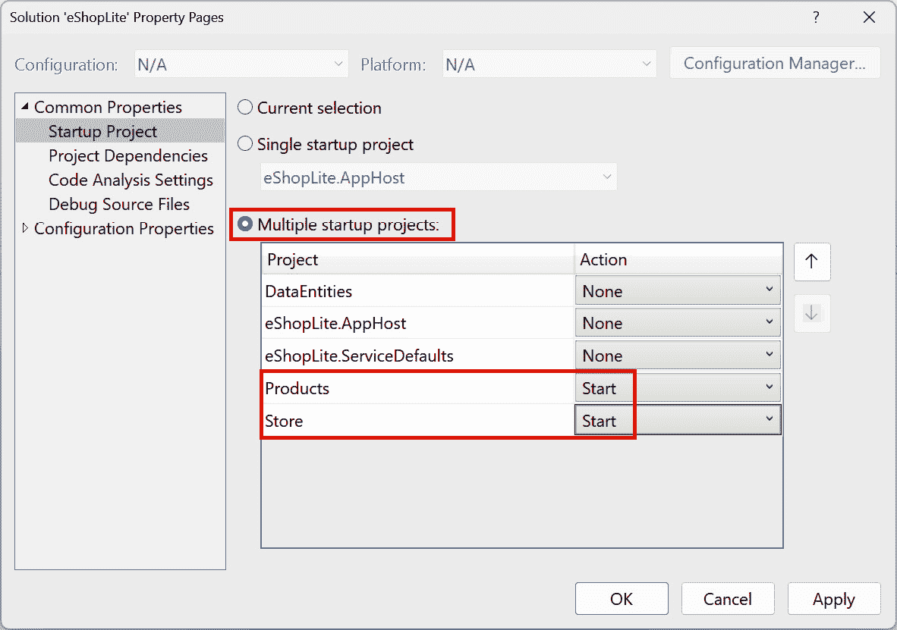

图 8.15 – 设置启动项目

1.  通过按*F5*启动它，并注意两个浏览器页面打开了。一个页面有原始 JSON，第二个页面是一个简单的浏览器应用程序，允许你查看这些数据（点击**产品**），如图 8.15 部分所示。

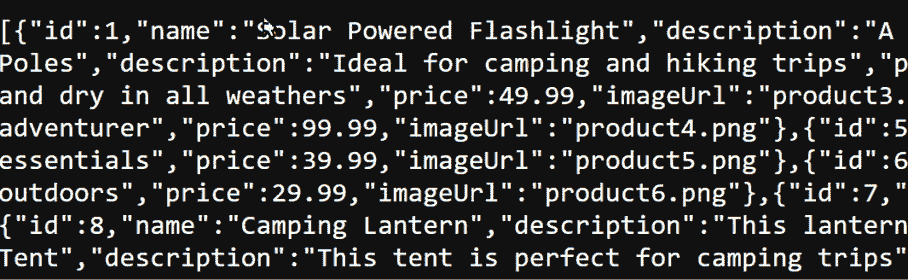

图 8.16 – 原始 JSON

在 JSON 的顶部有一个用于格式化的复选框。这将使原始 JSON 更易于阅读，如下面的图所示：

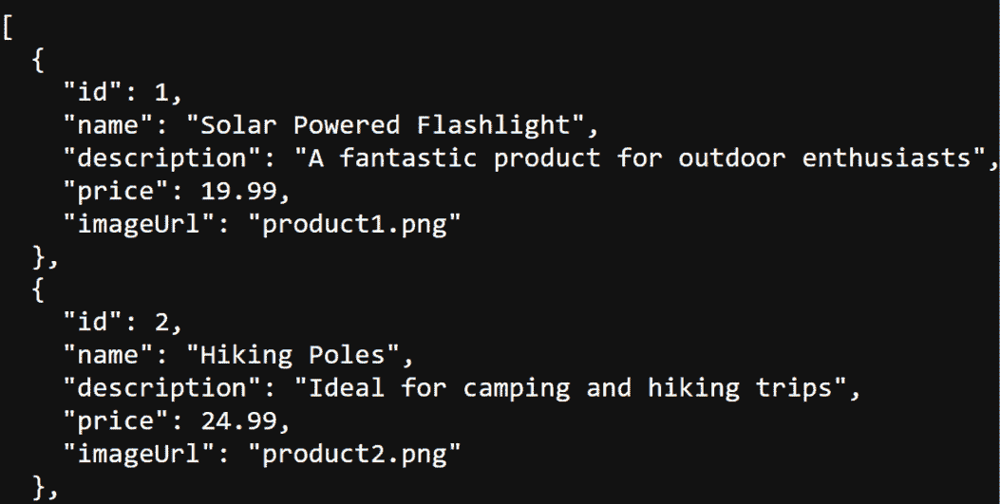

图 8.17 – 格式化输出

Blazor 将为你提供相同数据的基于 Web 的视图，如图 8.18 所示：

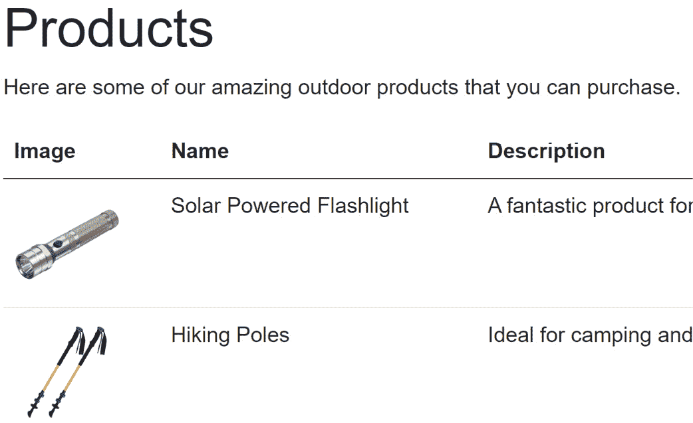

图 8.18 – 产品在浏览器中的显示

现在我们有一个工作的应用程序，让我们重构它以添加 Aspire。我们将在下一节这样做。

## 添加 Aspire

现在我们有一个工作的 API 解决方案，让我们添加 Aspire。为此，请按照以下步骤操作：

1.  右键单击其中一个项目（我将使用**存储**），然后选择**添加** | **.Net Aspire Orchestrator Support**。这将弹出对话框。

1.  点击**确定**，你的解决方案中会添加两个新项目：

    +   **eShopLiteAppHost**

    +   **eShopLite.ServiceDefaults**

花几分钟探索这些项目。第一个，**eShopLiteAppHost**，是一个编排器项目，其任务是连接（并配置）你的应用程序的各种项目和服务。它自动设置为启动项目。**eShopServiceDefaults**包含将在项目间使用的配置，特别是服务发现和遥测（稍后将详细介绍）。

1.  接下来，在**AppHost**中打开**Program.cs**，你将看到以下代码：

    ```cs
    builder.AddProject<Projects.Store>("store");
    ```

    这将在编排器中注册存储项目。我们现在需要注册**产品**项目。

1.  右键单击它，然后选择**添加** | **.NET Aspire Orchestrator Support**。你会得到一个对话框说编排器已经存在；只需点击**确定**。

1.  返回到**AppHost** / **Program.cs**，你可以看到已经添加了另一行，正如你所预期的：

    ```cs
    builder.AddProject<Projects.Products>("Products");
    ```

现在是时候享受乐趣了。**存储**需要能够找到**产品**的后端地址。我们不是手动这样做，而是将这个责任转交给编排器。

### 发现

虽然两个项目都已注册到编排器，但**存储**需要能够发现**产品**的后端地址。为了启用发现，返回到**Program.cs**并添加对**产品**项目的引用。你的**program.cs**文件现在应该看起来像这样：

```cs
var builder = DistributedApplication.CreateBuilder(args);
var Products = builder.AddProject<Projects.Products>("Products");
builder.AddProject<Projects.Store>("store")
       .WithExternalHttpEndpoints()
       .WithReference(Products);
builder.Build().Run();
```

注意

如果你想部署这个应用程序，你需要调用**WithExternalHttpEndpoints**来确保它对外部世界是公开的。

几乎完成了。我们需要更新**Store**项目中的**appsettings.json**文件：

```cs
{
  "DetailedErrors": true,
  "Logging": {
    "LogLevel": {
      "Default": "Information",
      "Microsoft.AspNetCore": "Warning"
    }
  },
  "AllowedHosts": "*",
  "ProductEndpoint": "http://Products",
  "ProductEndpointHttps": "https://Products"
}
```

两个端点的地址现在都使用**产品**名称。请注意，这些名称用于发现**产品**项目的地址。

按*F5*键运行它。你已经将 Aspire 及其所有功能和仪表板添加到了现有的 API 项目中。

# 摘要

在本章中，你学习了三种非常强大、高级的技术。首先，我们研究了创建更复杂的 API，这些 API 返回层次化数据。我们通过为每种车型添加和展示选项来实现这一点。

接下来，我们研究了 Azure 存储表，这是一种在 Azure 上存储数据的轻量级方式，绕过了 Entity Framework 和 Cosmos 的复杂性。

最后，我们转向查看微软的 Aspire 仪表板，这是一个用于处理 API 的非常强大且有用的工具。

在下一章中，我们将探讨认证和授权这一关键问题，没有这些，你无法创建企业级 API。

# 你试试看

创建 Aspire 仪表板开箱即用非常简单，但创建层次化数据则不然。为了接受挑战，创建一个显示几个州及其首府的程序。结果可能看起来像这样：

```cs
{
    "statePostalCode": MA,
    "name": "Massachusetts",
    "capital": Boston,
    "cities": [
        {
            "city" : "Worchester",
            "longitude": "100.01.93",
            "latitude": -907-45-33
        },
        {
            "city": Acton,
            "longitude": "100.01.107",
            "latitude": -10-398-405
        },
    ]
}
```

随意设定经纬度，或者在网上查找。你需要至少两个到三个城市和两个到三个州。一旦你有你的结构，将其保存为平面文件在 Azure 存储表中。
