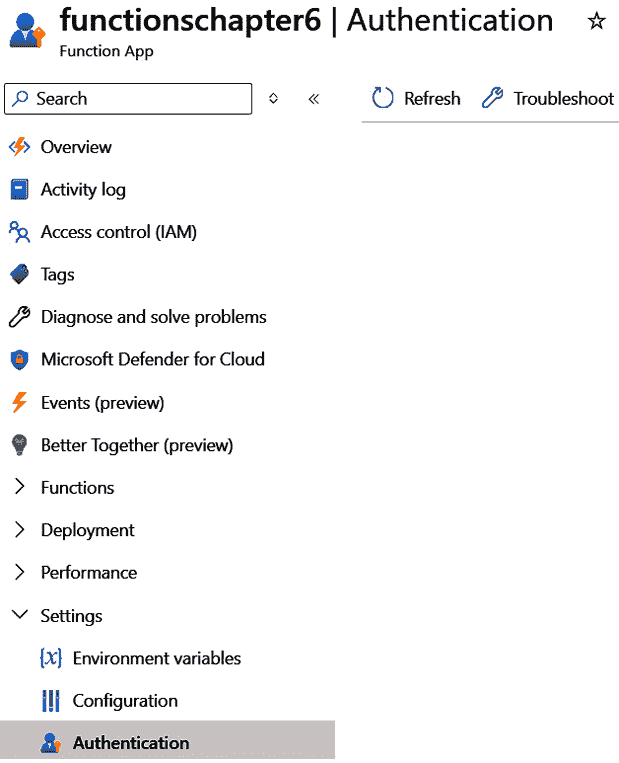
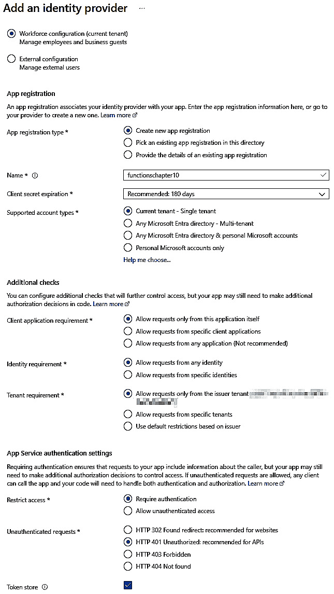
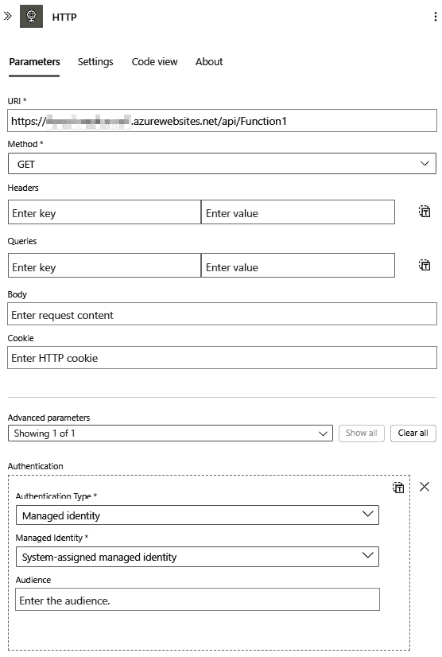
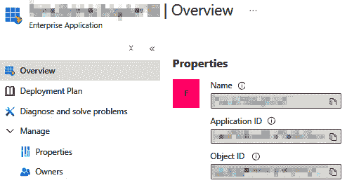
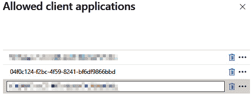
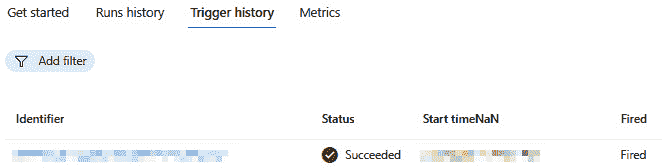

# 第九章：认证和授权

在上一章中，我们回顾了多个高级 API 主题。在本章中，你将学习如何添加认证（这回答了诸如“这个用户是他们所说的那个人吗？”的问题）和授权（“这个用户是否有权执行这个操作？”）。我们将使用*第六章*中的 Azure 功能。

在本章中，我们将涵盖以下主题：

+   认证和授权之间的区别

+   认证和授权的定义

+   认证流程的概述——证明你是谁

+   授权流程的概述——测试你是否可以执行特定操作

# 技术要求

对于本章，你需要以下内容：

1.  Visual Studio

1.  Azure 账户（你可以在[`azure.mcrosoft.com`](https://azure.mcrosoft.com)获取免费入门账户）

注意，本章的大部分内容依赖于*第六章*中的代码和操作。如果您没有代码，可以从仓库下载：[`github.com/PacktPublishing/Programming-APIs-with-C-Sharp-and-.NET/tree/main/Chapter06`](https://github.com/PacktPublishing/Programming-APIs-with-C-Sharp-and-.NET/tree/main/Chapter06)

本章的代码可在[`github.com/PacktPublishing/Programming-APIs-with-C-Sharp-and-.NET/tree/main/Chapter09`](https://github.com/PacktPublishing/Programming-APIs-with-C-Sharp-and-.NET/tree/main/Chapter09)找到

# 认证和授权简介

大多数应用程序都需要某种形式的**认证和授权**（**A&A**）。认证是证明你是谁的过程，而授权是确定你是否有权执行你试图执行的操作的过程。通常，你首先进行认证，可能每次会话一次，然后对每个尝试的操作进行授权检查。

有许多不同的 A&A 类型，但由于我们主要关注 Azure，我们将使用他们俗称的**Easy Auth**内置功能集。

# A&A 概述

虽然有各种各样的认证和授权（A&A），包括许多细微差别，如服务、用户等的认证，但我们将专注于 Azure 租户中的单个用户的 A&A。这通常是在调试期间（也就是你！）的员工。这将允许你扩展这些概念，以便你创建的其他服务可以以相同的方式进行授权。

租户

租户在 Azure 中是一个 Guid，它指定了单个组织所有内容的全部内容。

## 在现有功能上启用认证

让我们从向现有的 Azure 功能添加认证开始。为此，请按照以下步骤操作：

1.  从*第六章*打开你的 Azure 功能资源，并导航到**认证**部分，如图*图 9*.*1*所示。



图 9.1 – 选择认证

1.  单击**添加身份提供者**，然后选择**微软**。使用以下配置选项（它们几乎都是默认的）：

    +   **选择** **一个租户**

        +   **工作力量配置**（默认）

    +   **应用注册**

        +   **应用注册类型**：**创建新的应用注册**（默认）

        +   **名称**：默认情况下可能是您现有的函数应用资源名称；在这种情况下，它是**函数**。

        +   **客户端密钥过期**：**建议：180** **天**（默认）

        +   **支持的账户类型**：**当前租户 – 单一租户**（默认）

    +   **附加** **检查**（默认）

        +   **客户端应用程序要求**：**仅允许来自此应用程序本身的请求**（默认）

        +   **身份要求**：**允许来自任何身份的请求**（默认）

        +   **租户要求**：**仅允许来自发行者租户的请求**（您的租户 GUID 将在这里）

    +   **应用服务身份验证设置**（默认）

        +   **限制访问**：**要求** **身份验证**（默认）

        +   **未认证请求**：**HTTP 401 未授权：建议用于** **API**（默认）

    +   **令牌存储**：**已勾选**

        要将这些内容组合起来，请参阅*图 9* *.2* 。



图 9.2 – 添加身份提供者

1.  我们可以先跳过**权限**，然后单击**添加**。

    您将被返回到您的**身份验证**选项卡，显示您的新微软身份提供者。

1.  点击您的身份提供者名称或导航回主 Azure 门户。点击**Microsoft Entra ID**，选择**应用注册**，然后选择您的应用。

这是您管理应用程序身份验证的各种内容的配置区域。我们将在稍后编辑它，但尝试运行或导航到您现有的函数应用的 HTTP 触发器，就像您在*第六章*中所做的那样。您应该会看到现在显示**401** **错误（未授权）**。

接下来，我们将以两种方式对新身份提供者进行身份验证，以便您了解不同的用例。

## 以编程方式访问您的 API

在 Visual Studio 中打开您的函数*第六章* 。在**解决方案资源管理器**中右键单击解决方案，然后单击**添加新项目... 添加.NET 控制台应用**。添加**Azure.Identity** NuGet 包，然后创建一个**DefaultAzureCredential**实例。

有许多不同的凭证类继承自实现不同用例的**TokenCredential**基类，但**DefaultAzureCredential**尝试了多种不同的凭证，以便它可以在多个不同的场景中轻松使用。使用以下样板代码安全地调用您的函数：

```cs
DefaultAzureCredential cred = new DefaultAzureCredential(new DefaultAzureCredentialOptions
            {
                TenantId = <your tenant ID>
            });
Azure.Core.AccessToken token = await cred.GetTokenAsync(new Azure.Core.TokenRequestContext(new string[]
           {
               <clientId>
           }), CancellationToken.None);
var message = new HttpRequestMessage(HttpMethod.Get,"https://<your functionresource>.azurewebsites.net/api/Function1");
            message.Headers.Authorization = new 
            AuthenticationHeaderValue("Bearer", token.Token);
            HttpResponseMessage resp = await new HttpClient().
            SendAsync(message);//inject the HttpClient in a production 
                              //app
            resp.EnsureSuccessStatusCode();
            string content = await resp.Content.ReadAsStringAsync();
            Console.WriteLine(content);
```

现在尝试运行它，它应该在**resp.EnsureSuccessStatusCode();**处抛出错误。这是因为我们还没有告诉我们的 API，您作为用户（通过 Visual Studio 的辅助身份验证客户端）被允许调用您的 API。

在开发环境中，我们可以将已知的客户端 ID 授权给 API。为此，在 Azure 门户中再次导航到你的函数资源：

1.  在**身份验证**选项卡下，点击**编辑**标题下的铅笔图标。

1.  如果尚未选择，请选择**允许来自特定客户端应用程序的请求**，然后添加**04f0c124-f2bc-4f59-8241-bf6df9866bbd**。点击**确定**然后**保存**。

    我们将在本章的后面再次进行此操作。

1.  返回到 Visual Studio 并再次运行控制台应用程序。

现在调用你的 API 应该成功，并将打印出你在*第六章*中 API 的环境变量选项卡中配置的数据。

接下来，我们将尝试使用**ClientSecretCredential**。为此，请按照以下说明操作：

1.  在应用程序注册中导航到**证书和密钥**选项卡，并点击**新建****客户端密钥**。

1.  输入描述和过期时间，然后点击**添加**。

1.  将值复制到某个地方（例如，记事本），因为你将无法再次访问它。通过添加一个新的**ClientSecretCredential**实例来修改代码，而不是现有的可能已经有的凭证。你需要在**概览**选项卡中提供租户 ID 和客户端 ID：

    ```cs
    ClientSecretCredential cred = new ClientSecretCredential(<tenantId>, <clientId>, <clientSecret>);
    ```

现有的对**GetTokenAsync**的调用应该无需更改即可工作。包括 HTTP 调用本身的其余代码应该按原样成功运行，你应该再次看到你配置的 API 字符串。

备注

所有上述字符串都在代码中的*第六章*中可用。

## 授权额外的 Azure 资源

你几乎肯定需要额外的 Azure 服务来补充你的云解决方案，所以让我们尝试授权一个调用你的 API。为此，请按照以下说明操作：

1.  前往 Azure 门户，然后你的现有资源组。创建一个新的逻辑应用，并选择**消费**作为托管。

1.  给它一个名称，并选择与你的其他资源相同的**区域**。

1.  当部署完成后，选择**身份**选项卡，将**状态**更改为**开启**，然后点击**保存**和**是**。

1.  选择逻辑应用设计器选项卡。添加一个新的 HTTP 触发器，输入你的已部署函数 URI（可能是 https://<my **resource name**>.azurewebsites.net/api/Function1**），以及**GET**方法。

1.  点击**显示所有**以查看**高级参数**，并在**身份验证类型**下选择**托管身份**。它应该类似于*图 9* *.3* 。



图 9.3 – 高级参数

1.  点击**保存**。返回到**概览**选项卡并点击**运行**。

1.  点击**触发历史**选项卡，注意它呈红色，表示失败。

1.  点击失败的触发器，然后点击**输出**链接。它应该显示**403 错误（禁止访问）**，表示服务正确地认证了你，但你没有被授权。

    为了授权此逻辑应用调用您的函数 API，我们需要将其客户端 ID 添加到可以调用您的 API 的授权客户端列表中。

1.  返回到 **Azure 门户主页** 并点击 **Microsoft Entra ID**。在 **搜索您的租户** 文本框中搜索您的逻辑应用名称。它应该在 **企业** **应用程序** 部分下有一个条目。

1.  接下来，点击它，然后复制 **应用程序 ID** 下的 GUID。



图 9.4 – 授权

注意

为了安全起见，*图 9* *.4* 中的某些字段已被遮挡。

1.  返回到你的函数应用。找到 **身份验证** 选项卡，然后点击我们之前所做的铅笔图标。接下来，点击 **允许的客户端应用程序** 旁边的另一个铅笔图标，并添加一个带有你刚刚复制的 GUID 的新条目，如图 *图 9* *.5* 所示。



图 9.5 – 添加允许的客户端应用程序

1.  点击 **确定** 然后点击 **保存**。

1.  返回到逻辑应用，然后点击 **运行** | **运行**。这应该立即启动您的逻辑应用调用您的 API 的另一个运行。

1.  点击 **概述** 选项卡上的 **触发历史记录** 选项卡。你应该看到最新的一个状态为绿色，表示成功，如图 *图 9* *.6* 所示。



图 9.6 – 成功！

如果开始时间与您预期的不符，您可能需要点击选项卡顶部的 **刷新**。点击绿色的成功指示器，然后再次点击 **输出**。现在 **statusCode** 应该是 **200 (OK)**，你应该再次看到在 **函数环境** 变量选项卡中配置的文本。

# 摘要

在本章中，你学习了 A&A 之间的区别。然后你看到了如何使用 Azure 控件为特定的 Azure 资源建立身份验证和授权。在下一章中，我们将学习 Azure 上的 **持续集成和持续部署** ( **CI/CD** )。

# 你试试看

使用从 *第六章* 部署的函数，进行身份验证并授权给自己。通过创建控制台应用程序来确保此操作成功。然后创建一个逻辑应用，并授权其调用您的 API。
