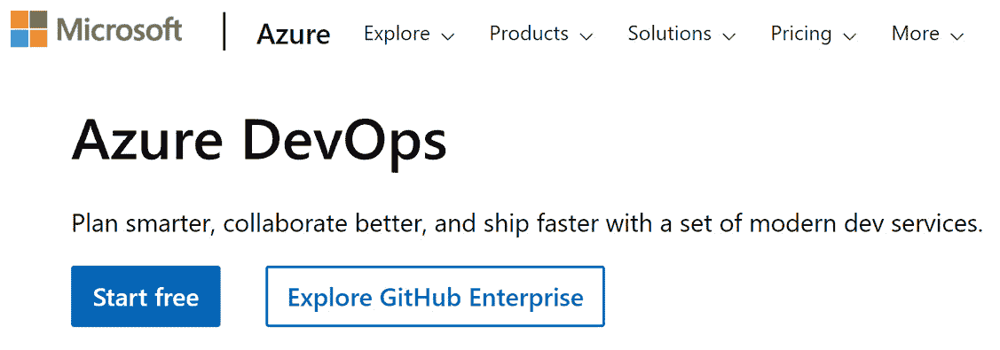
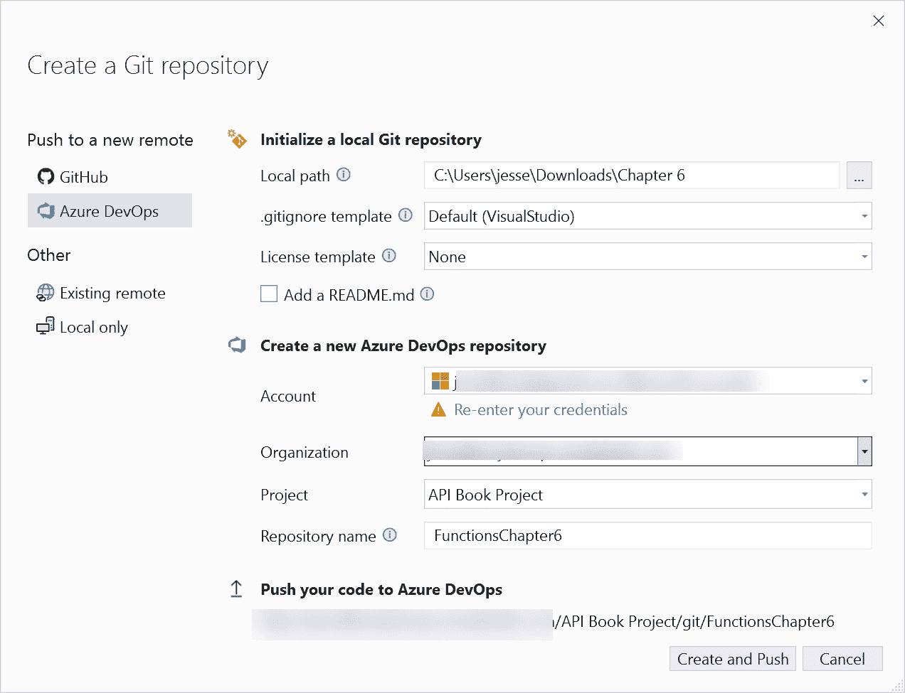
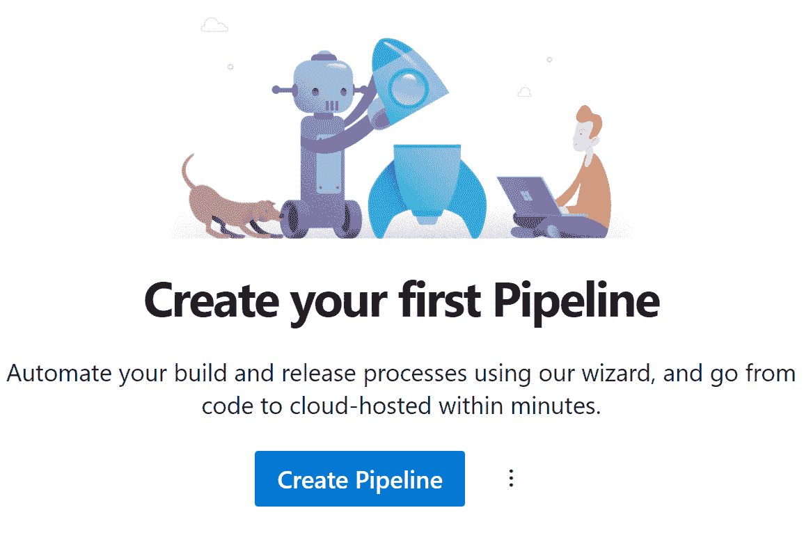
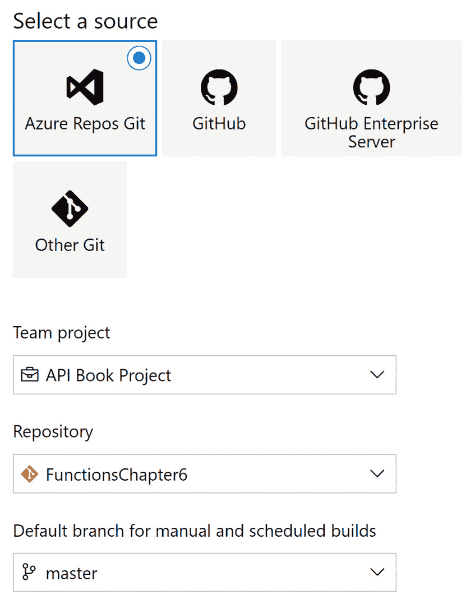
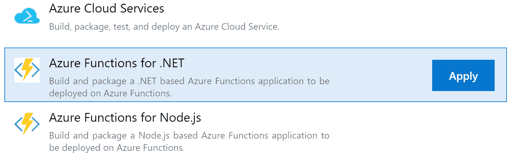
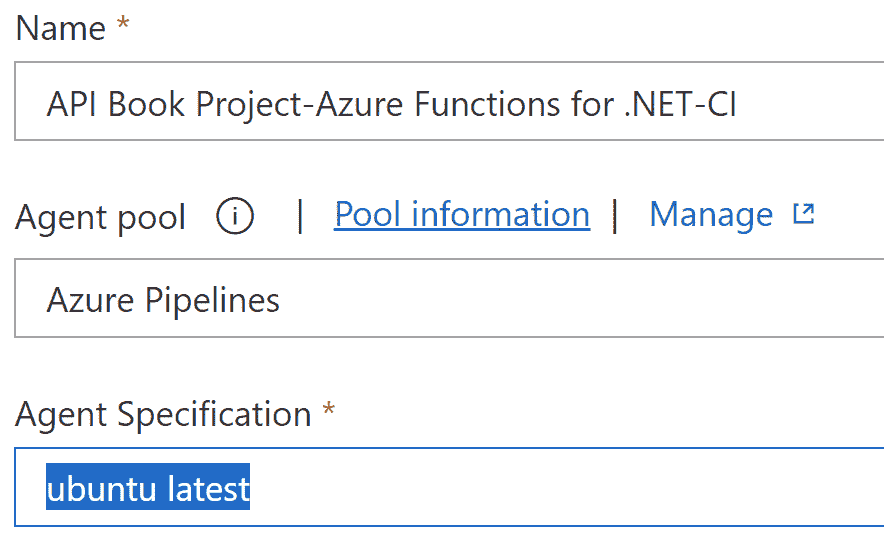
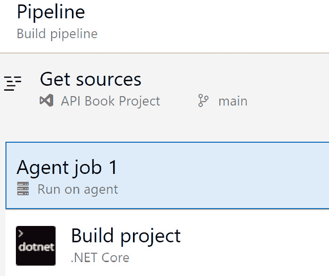
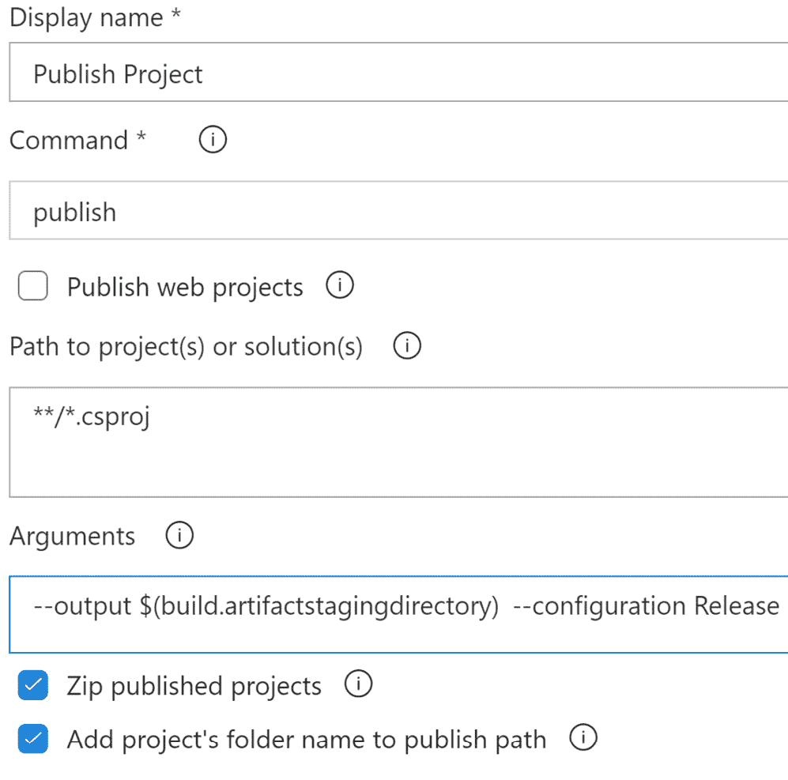
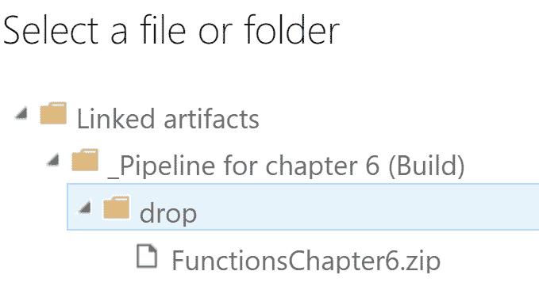

# 10

# 部署到 Azure

在本章中，我们将探讨 Azure 上的**持续集成和持续部署**（**CI/CD**）。这些是企业开发的关键技能，确保在开发过程中尽早发现错误，尤其是在团队协作时。集成问题越早被发现，修复成本就越低。

我们将回顾的技能包括创建 Azure 项目、创建管道以及配置 CI/CD 的管道。

本章将基于你在*第六章*中培养的技能，逐步指导你设置 CI/CD。

我们在本章中将涵盖以下主题：

+   使用测试确保代码质量

+   从 DevOps 部署

+   部署到 Azure

# 技术要求

对于本章，你需要以下内容：

+   Visual Studio

+   **Azure.Data.Tables** NuGet 包

# 入门

在*第六章*的结尾，你看到了如何轻松地从 Visual Studio 直接部署到 Azure。这对于测试场景和一次性实验或概念验证来说是不错的，但在生产场景中，这个项目可能只是更大系统的一部分。

在发布到生产之前设置一系列“关卡”（检查）可能出于许多原因是有利的。请注意，存在许多类型的发布关卡。最常见（且最重要的）是**拉取请求**（**PRs**）、单元测试、集成测试和端到端测试。

## 使用测试确保代码质量

你可能会对你的代码运行许多种测试。其中最重要的包括以下几种：

+   单元测试

+   集成测试

+   自动化测试

单元测试覆盖你的代码的一个部分，执行一个功能。例如，许多单元测试与方法和功能一一对应，但并不总是如此。考虑功能而不是代码。然而，它们必须运行得非常快，以便在每次代码更改后运行。这让你在编码时更有信心，知道如果有什么东西出错了，你就知道出了什么问题，以及问题所在。

集成测试运行得较少，通常在完成一组离散的功能后进行，以确保你创建的内容与现有内容相匹配。最后，端到端测试确保整个场景集按预期工作。通常，这是专业 QA 人员运行测试的地方。作为程序员，我们几乎不可能对我们的代码进行彻底的端到端测试：我们看到我们期望看到的东西，我们运行我们期望用户运行的东西。QA 专业人员可以创建一系列测试来确保程序在良好的数据下运行良好，但也适用于不良或损坏的数据，以及当用户执行我们没有预料到的事情时。

幸运的是，你可以自动化所有这些测试，检查代码的各个层次，以确保没有退步。虽然我们不会查看 Azure DevOps 为我们提供的所有高级场景，但我们将设置一个标准的构建和发布管道，你可以用它来自动化你的部署。简而言之，我们将设置 CI，以自动化我们手动发布到 Azure 时所做的操作。

### 手动与自动实现

深入一点，让我们比较 DevOps（持续交付）和通过 Visual Studio 手动发布。每当向 master 推送新提交时，你都可以有自动构建。除了分支上的自动构建，你还可以有与 PRs 检查的构建。PRs 的好处是，在代码合并之前，有另一名熟练的程序员检查和测试你的代码。事实上，自动测试只能走这么远。PRs 也是确定和测试你的代码需要哪些环境（例如，Windows、Linux 等）的好地方。

## 使用相同的二进制文件

将完全相同的二进制文件部署到你的低级环境，如你的本地计算机，然后将这些相同的二进制文件提升到生产环境是非常有利的。尽管 C# 和 .NET 确实有确定性的构建，但你的部署包或容器中的其他部分可能没有。如果部署后出现问题，DevOps 提供了立即回滚已部署工件的能力。每个环境都保存了这些部署的历史记录。

虽然 DevOps 在很多场景下都更优越，但在调试构建失败时可能会有些困难。构建管道的每一步都会为你记录下来，以便你稍后查看和诊断；然而，这有时说起来容易做起来难。此外，并发管道构建越多，在失败的情况下可能就越难找出出了什么问题。更糟糕的是，团队越大，构建队列可能就越长。

这样一来，我们就准备好将内容部署到 DevOps 了。

小贴士

DevOps 免费版本中并发执行管道的数量和每月执行分钟数是有限的。当然，你可以订阅以增加这些限制。

# 从 DevOps 部署

现在，我们将通过 DevOps 而不是我们的本地 Visual Studio 进行部署。第一步是创建你的 DevOps 项目，如图 *图 10.1* 所示：

图 10.1 – DevOps 开放页面

创建项目时，我们将使用向导。（第一次，向导可能会立即出现，否则点击以打开向导。）以下是步骤：

1.  前往 [dev.Azure.com](http://dev.Azure.com) 。

1.  点击 **开始免费**（即使你已经有一个账户）。

1.  如果它重定向你，请在地址框中输入 **dev.azure.com**。

1.  在右上角点击 **新建项目**。

1.  输入一个名称和描述，并选择 **私有**。

1.  点击**高级**并确保版本控制设置为**Git**。

1.  点击**创建**。

现在我们导入一些代码。

## 导入示例代码

在我们可以部署到 Azure 之前，我们需要有一个包含我们想要部署的代码的存储库。从[`github.com/PacktPublishing/Programming-APIs-with-C-Sharp-and-.NET/tree/main/Chapter06`](https://github.com/PacktPublishing/Programming-APIs-with-C-Sharp-and-.NET/tree/main/Chapter06)克隆*第六章*的代码，并将其复制或移动到另一个文件夹，以便它不再与克隆的存储库相关联。在 Visual Studio 中打开解决方案。现在我们想要使用 Visual Studio 在我们的新 DevOps 项目中创建一个存储库。以下是步骤：

1.  打开**GitChanges**视图。

1.  点击**创建 Git 存储库**。

1.  选择**Azure DevOps**，如图*图 10* *.2* 所示，然后点击**创建**和**推送**。

图 10.2 – 创建 Git 存储库

在此基础上，我们准备创建实际的构建管道。

## 创建构建管道

现在您已经将代码放入 Azure 存储库中，您可以创建构建管道。为此，请执行以下步骤：

1.  点击**创建管道**，如图*图 10* *.3* 所示：

图 10.3 – 创建管道

您应该看到一个向导，它将引导您创建管道。

第一步询问您的代码在哪里。DevOps 支持几个不同的代码存储库，包括 Azure Repos、Bitbucket、GitHub、GitHub Enterprise、其他通用 Git 存储库和 Subversion。

注意

构建管道有两种不同的方式。第一种是通过 YAML 文件，这些文件可以存储在您的代码库中，与代码一起，这有一个额外的优势，就是可以版本控制。第二种支持构建管道的方式是我们将要采用的方式。

1.  点击**使用经典编辑器**，这将为我们提供一个更深入的 UI 来创建管道，而不需要 YAML。

1.  在下一个下拉菜单中选择你的存储库，然后选择默认分支，如图*图 10* *.4* 所示：

图 10.4 – 选择源

1.  点击**继续**，您将看到一个屏幕，要求您为项目选择一个模板。默认情况下显示了一些标准模板，但还有许多其他模板可供选择。由于我们正在构建和部署 Azure 函数，请滚动到显示**Azure Functions for .NET**的地方，如图*图 10* *.5* 所示，然后点击**应用**。

图 10.5 – Azure Functions for .NET

这将带您进入管道编辑器。您应该看到各种选项卡，包括**任务**、**变量**、**触发器**、**选项**和**历史记录**。

1.  在 **任务** 选项卡下，默认应选择管道项。如果没有，请选择它。在任一情况下，点击它并将您的管道重命名为您想要的名称。

    代理池允许您从 Microsoft 托管的构建机器中选择，或者如果您已设置自定义私有代理，您也可以选择那些。我们将在本书中不涉及私有代理。

1.  选择 **Azure Pipelines** 作为代理池，并选择 **ubuntu latest** 作为 **代理规范**，如图 *图 10.6* 所示。

注意

虽然将代理规范保留为 Windows 可能可行，但我们发现当您将代理规范与在 Azure 中创建的资源类型匹配时，它可以防止许多问题。在我们的例子中，我们创建了一个 Linux Azure 函数。

图 10.6 – 管道设置

1.  在 **任务** 选项卡下选择 **获取源**。这应该已经为您填写了一些默认值，包括构建时使用的默认分支。在 **获取源** 项下 **代理作业 1** 的默认值应该是合适的，可以保留不变。点击 **代理作业 1** 下的 **构建项目**，以选择用于构建发布输出的实际任务，如图 *图 10.7* 所示。

图 10.7 – 获取源

默认任务应该是 **构建项目 .NET Core**。您可以构建多种不同类型的程序集，包括控制台、库、ASP.NET Core，以及在我们的例子中，Azure Functions。截至本书编写时，任务版本 2 当前受支持，并且是默认版本。

1.  将显示名称更改为更具描述性的名称，例如 **发布项目**。

1.  从 **命令** 下拉菜单中选择 **发布**。取消勾选 **发布 Web 项目**。尽管我们的 Azure 函数是一个 API，在另一种情况下可能被视为 Web 项目，但我们不需要这个特定的功能。保留参数不变。

1.  确保已勾选 **压缩发布项目** 和 **将项目文件夹名称添加到发布路径**。

1.  在 **参数** 文本框中，将 **publish_output** 更改为 **$(build.artifactstagingdirectory)**，如图 *图 10.8* 所示。

图 10.8 – 发布项目

您可以探索其他 **高级**、**控制选项** 和 **输出变量** 展开程序，但默认值应该是合适的。

1.  右键点击 **存档文件** 并选择 **移除任务**。

现在您已经准备好将此工件发布到 DevOps。

## 发布工件

要发布工件，请按照以下步骤操作：

1.  点击左侧的 **发布工件：Drop**。

    这会将您新压缩的输出文件夹上传到 DevOps 的工件存储库，以便稍后进一步发布。本节中的默认值应该是合适的。

1.  点击 **Triggers** 选项卡。勾选 **Enable continuous integration** 复选框，并确保 **Include** 对应主分支被选中。这是在每次向主分支推送时触发构建的原因。

1.  在 **Save & queue** 下拉菜单下点击 **Save & queue**（位于选项卡右侧）。

1.  当出现 **Run pipeline** 对话框时，填写一个注释，就像您提交代码时一样，然后点击 **Save** 和 **Run**。

1.  点击最左侧的 **Pipelines** 选项卡，这将带您回到管道列表。

    您命名的管道应该显示，屏幕上的图标应该是蓝色，表示它正在执行构建管道。如果它已完成，或者大约一分钟后，它将变为绿色。

1.  点击较大的列表项以转到该管道的构建列表，或直接点击提交消息文本以转到那些构建详情。

在 **Summary** 选项卡上，您应该看到各种信息，包括构建号、分支、提交、发布的工件数量和作业列表。在 **Summary** 选项卡旁边可能有其他选项卡。这些可以通过其他插件添加。点击绿色勾选的作业可以显示代理构建您的工件所使用的单个步骤。所有标准输出（控制台输出）都被捕获并保存以用于调试构建错误。通常，构建错误会突出显示并指导您到错误的位置。

# 将您的工件部署到 Azure

现在您的工件已构建并压缩，我们将将其部署到 Azure：

1.  在左侧点击 **Pipelines** 下的 **Releases** 子选项。点击 **New Release Pipeline**。再次，应该会显示一个熟悉的 **Select a Template** 屏幕。

1.  您可以在列表中向下滚动或搜索 **Functions**，选择一个说 **Deploy a Function App to Azure Functions** 的选项，然后点击 **Apply**。

    您现在应该看到一个名为 **Stage one** 的阶段弹出。根据您的需求，整个部分可以用不同的业务工作流程进行自定义。对于这个练习，我们将只有一个环境。

1.  将阶段名称更改为 **Production**。点击 **Add an Artifact**。选择工件源，在我们的例子中是构建工件——可能已经选中。

1.  选择您的项目，然后选择您的源构建管道。保留最新版本作为默认版本，您的源别名应该已经预先填充。点击 **Add**。

在部署到 Azure 时，最强大的机会之一是 CD。每次您的代码被检查并批准后，都会创建并部署一个版本。

## 持续部署

您的工件名称现在应该在 **Artifact** 部分中。按照以下步骤操作：

1.  在工件上选择闪电图标以显示 CD 触发器。

1.  启用 CD。这是我们自动化构建完成后创建发布的方式。

1.  点击生产阶段上的闪电图标。这也是自动部署配置的一部分。默认情况下应选择**发布后**；然而，如果您不希望发布管道自动启动，则选择**仅手动**。

1.  接下来，点击带有红色图标的**1 Job, 1 Task**标签，或者您可以选择**任务**标签。这应该看起来与我们之前创建的构建管道相似。应该有一些红色高亮的项目，表示它们需要关注。

1.  从下拉列表中选择您的 Azure 订阅。如果有**授权**按钮，请点击它。

1.  选择**Linux 上的函数应用**作为您的应用程序类型，然后在**应用程序服务名称**下拉菜单下，您应该能看到所有可用的 Linux Azure 函数。请注意，如果资源是最近创建的，它可能不会立即显示。

1.  点击**在代理上运行**，并使用我们在构建管道中使用的相同代理设置：代理池为**Azure Pipelines**，代理规范为**ubuntu latest**。其余的默认设置将很好。

1.  最后，点击**部署 Azure 函数应用**。如果您想的话，可以将显示名称更改为更描述性的名称。注意，Azure 订阅应用类型和 Azure 函数应用名称被灰色显示。这些应该与我们选择生产阶段时选择的相匹配。

1.  点击包或文件夹标签下的三个点，然后导航到如图*图 10.9*所示的构建的 ZIP 文件。

图 10.9 – 选择文件或文件夹

1.  对于运行时堆栈，选择**.NET 隔离 8.0**，并保留**启动方式**为**命令**空白。

1.  展开应用程序和配置设置，并点击应用程序设置旁边的三个点。这可能对您来说很熟悉，因为这是我们设置应用程序设置的地方，就像在*第六章*中做的那样。

1.  点击**添加**，并使用我们在 Azure 之前使用的相同名称：**MyReturnProperty**。对于值，保持与之前所见的一致性，您可以使用类似*我的 DevOps 值*的东西。（如果此值中有空格，请确保将其全部放在双引号内。）

1.  点击**确定**。名称-值对应该合并成一个单独的字符串在应用程序设置中。

1.  接下来，点击**保存**，如果您想的话可以填写注释。您可以将文件夹保留为斜杠，或者如果您知道您将来会有很多发布管道，您可以将它们组织到文件夹中。然后，点击**确定**。

我们还没有完成。我们必须测试发布管道以确保一切按预期工作。

## 测试发布管道

现在，让我们测试我们的发布管道：

1.  点击右上角的**创建发布**。你应该会看到**创建新发布**弹出窗口。您可以对每个阶段的手动或自动化设置进行临时一次性调整。您可能想创建发布，但并不一定真正将其推送到生产环境。你应该会看到在构建管道中创建的工件以及适当的版本号。

1.  点击**创建**。由于我们已将阶段设置为自动化，它应该会自动开始发布。点击新创建的发布，你应该会看到一个蓝色进行中图标，或者如果它已经成功，则是绿色。

1.  您可以点击一个阶段来显示**摘要**下的日志信息以及在这个新发布中做出的提交。回到生产阶段，您可以点击日志，这将带您到发布管道的日志视图。

注意

为了演示目的，通过访问您的函数应用程序资源中的身份验证部分并点击**编辑文本**链接（位于**身份验证设置**标题旁边）来禁用身份验证。选择**禁用**。点击**保存**。（确保在测试完成后重新启用此功能。）

一旦发布完成，导航到我们在*第六章*中使用的**Function1** URL，或者如果它仍然在浏览器中打开，请刷新。现在它应该显示我们在发布管道中配置的设置：*来自 DevOps 的我的值* *。

## 端到端测试

让我们测试以确保一切正常工作：

1.  回到 Visual Studio 并做一些小的编辑（例如，添加注释）。

1.  提交，然后将其推送到主分支。回到 DevOps，转到**管道**部分，你应该会看到该管道已经在构建。等待它完成，然后导航到发布管道。你应该会看到在构建成功后立即创建了一个全新的发布，现在它可能正在运行，甚至可能已经完成。

恭喜！您已经设置了一个管道，该管道会在每次向主分支提交时自动部署 Azure 函数 HTTP 触发器！

*易如反掌！*

# 摘要

在本章中，我们专注于使用 CI/CD 部署我们的 Azure 函数。

我们看到了如何设置管道并将其连接到我们的函数。我们还看到了如何启用每次将代码推送到主分支时进行部署。

# 您试试看

创建一个简单的 Azure 函数。接下来，创建一个新的管道，该管道会在每次向主分支提交时自动部署该 Azure 函数。请慢慢来；有很多步骤。

# 恭喜！

您已经完成了创建 API 的过程，并了解了如何将您的作品迁移到 Azure。您已经征服了许多高级主题，并准备好实施企业 API。感谢您一直与我们同行，并请务必告诉我们您喜欢（以及不喜欢！）这本书的地方。最后，如果您有时间，请在 Amazon 上留下评论。你知道他们怎么说：如果你喜欢它，告诉 Amazon；如果不满意，告诉我们！

在下一章和最后一章中，我们简要地向您推荐一些额外的资源。我们希望它们在您继续前进的过程中能有所帮助。
