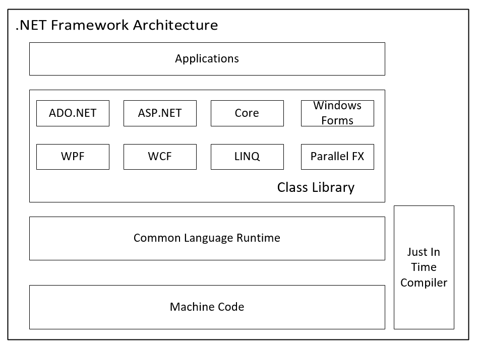
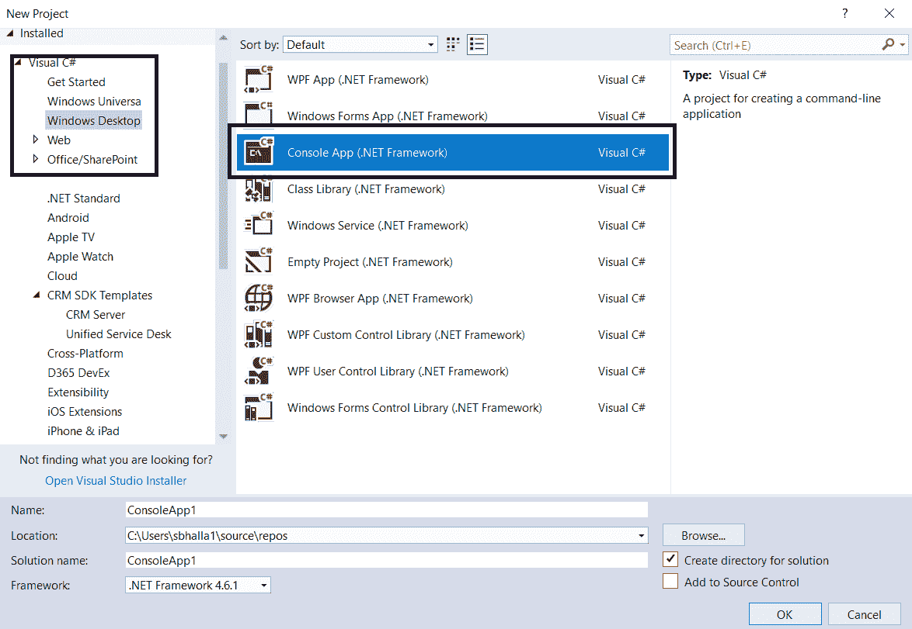
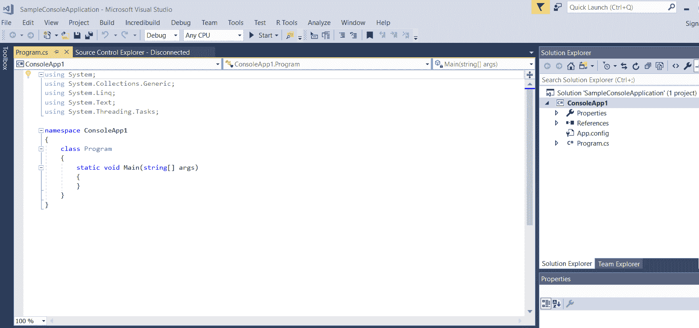
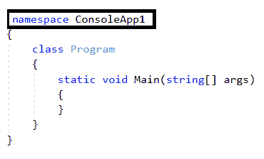
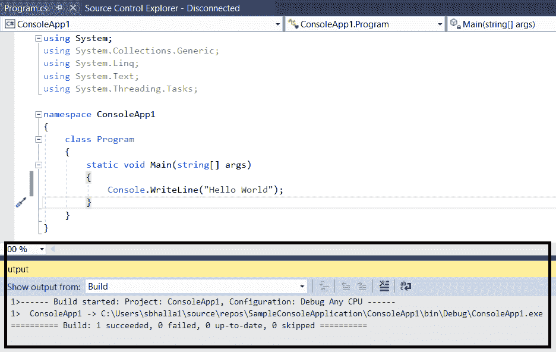
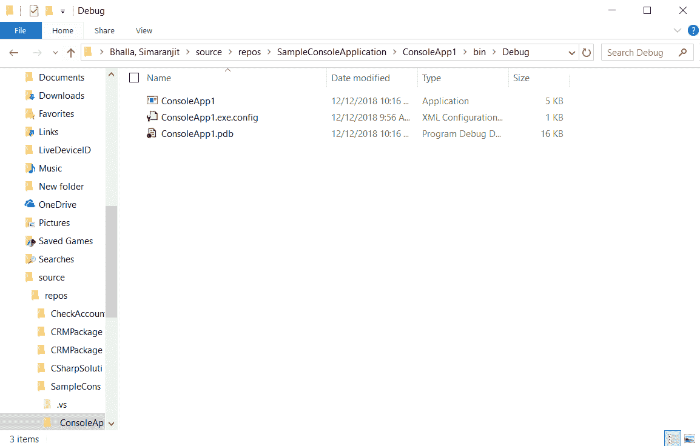

# 学习 C#的基础知识

简而言之，编程是编写一组指令的艺术，这些指令指示计算机执行特定任务。在早期，由于内存和速度的限制，编程能力有限。因此，程序员编写了粗糙且简单的任务，执行基本工作。随着时间的推移和更多的增强，人们开始用过程式语言（如 COBOL）编写程序。

尽管语言完成了工作，但程序仍有一些局限性。在应用程序的不同地方编写可重用组件或设计模式的空间不大。因此，应用程序难以维护，可扩展性也是一个挑战。

因此，人们努力开发高级编程语言，以克服过程式语言面临的所有这些挑战。随着时间的推移，设计了许多不同的编程语言。C 是在 1972 年至 1973 年之间开发的。当时，它是一种低级的过程式语言，依赖于底层平台，如 Linux 或 Windows。C 也没有完全利用面向对象编程的概念（我们将在第三章中介绍，*理解面向对象编程*）。

C++于 1998 年推出，为程序员提供了在保留 C 提供的机器级编程功能的同时，有效使用面向对象编程概念的能力。在本书中，我们将探讨 C#编程的各个方面。C#保留了 C++的 OOP 功能，使我们能够编写与底层硬件实现无关的程序。

在本章中，我们将介绍 C#的基础知识。我们将回顾其底层基础，并深入探讨.NET Framework 架构。我们将学习公共语言运行时如何将应用程序代码转换为机器级代码。我们将了解 C#与其他语言，如 C 和 C++的不同之处和相似之处。然后，我们将学习 C#程序中的不同组件，如类、命名空间和程序集。作为任何新语言的常见传统，我们将查看`Hello World`程序的实现。

本章包括以下主题：

+   比较 C#与 C 和 C++

+   .NET Framework

+   .NET Framework 的发布版本

+   C#的 Visual Studio

+   C#的基本结构

+   在 C#中创建一个基本程序

# 技术要求

为了更好地理解本章，你需要以下知识：

+   对软件开发有基本了解

+   对常见编程语言（C、C++和 C#）有基本了解

在本书的整个过程中，我们将通过 C#的不同代码示例，并使用 Visual Studio 2017 社区版进行代码示例。以下硬件要求对 Visual Studio 是必需的：

+   **操作系统**：

    +   Windows 10 或更高版本

    +   Windows Server 2016：Standard 和 Datacenter

    +   Windows 8.1

    +   Windows Server 2012 R2：Essential、Standard 和 Datacenter

    +   Windows 7 SP1

+   **硬件要求**：

    +   最小 2 GB 的 RAM

    +   1.8 GHz 或更快的处理器

+   **附加要求**:

    +   系统管理员权限

    +   .NET Framework 4.5

+   **Visual Studio**：本书中的所有代码示例都是在 Visual Studio Community Edition 2017 上编译的。它可以在以下网址安装：[`www.visualstudio.com/downloads/`](https://www.visualstudio.com/downloads/)。

本章的示例代码可以在 GitHub 上找到：[`github.com/PacktPublishing/Programming-in-C-sharp-Exam-70-483-MCSD-Guide/tree/master/Chapter01`](https://github.com/PacktPublishing/Programming-in-C-sharp-Exam-70-483-MCSD-Guide/tree/master/Chapter01)。

# 比较 C#与 C 和 C++

在本节中，我们将探讨 C#与其他编程语言（如 C 和 C++）的比较。我们将探讨使 C#与这些语言相似和不同的方面。

# C# 与 C 的比较

如果你之前在 C#和 C 上有所开发，你会意识到它们遵循类似的代码语法，例如使用分号，以及类似的方法声明；这两种语言彼此之间非常不同。就像在 C 中一样，我们可以使用相同的数据类型声明数据变量，例如`Char`和`Integer`。以下特性使 C#与 C 不同：

| **特性** | **C#** | **C** |
| --- | --- | --- |
| 面向对象编程 | 面向对象编程是任何高级编程语言的主要精髓，C#允许我们利用面向对象编程的四个主要支柱：封装、多态、继承和抽象。在第三章，*理解面向对象编程*中，我们将详细探讨这一点。 | 作为编程语言，C 不支持多态、封装和继承。它不提供诸如函数重载、虚函数和继承等功能。 |
| 异常处理 | 异常处理是在应用程序执行过程中发生运行时错误的处理过程。C#为我们提供了异常处理功能，帮助我们更好地处理这些场景。在第七章，*实现异常处理*中，我们将详细探讨这一点。 | C 也没有提供任何异常处理功能。 |
| 类型安全 | 程序中声明的每个变量都有一个类型。在典型的类型安全语言中，在程序编译阶段，编译器将验证分配给变量的值，如果分配了错误的类型，则会引发编译时错误。C# 是一种类型安全的语言。然而，在第八章，*C#中的类型创建和使用*，我们将了解到它还允许你使用关键字 `UnSafe` 来使用指针。 | C 语言实现了类型安全，尽管有一些例外。有一些内置函数，如 `printf`，并不强制只传递字符字符串给它们。 |

让我们现在看看 C# 与另一种语言 C++ 的比较。在探索了 C# 和 C++ 的比较之后，我们还将探讨 .NET 框架如何使 C# 相比 C 和 C++ 成为一种平台无关的语言。

# C# 与 C++

在大多数编程场景中，C++ 可以被归类为 C 的扩展，并且可以执行所有用 C 编写的代码。它提供了面向对象编程的所有功能，同时保留了 C 提供的功能。C# 和 C++ 之间有一些共同的特征。就像在 C# 中一样，我们可以在 C++ 中实现面向对象编程、异常处理和类型安全。然而，也有一些事情使 C# 与 C++ 不同，并且更类似于 Java。

在我们探讨 C# 和 C++ 之间的差异和相似性之前，我们必须了解一些与面向对象编程相关的关键概念。

实现面向对象编程的语言可以分为两类：

+   完全面向对象的编程语言

+   纯面向对象的编程语言

一门语言如果实现了至少四个核心支柱：*抽象*、*封装*、*多态*和*继承*，则被归类为完全面向对象的编程语言。

另一方面，当一门语言除了是面向对象编程之外，只包含类和对象时，它可以被定义为纯面向对象的编程语言。这意味着所有声明的所有方法、属性和属性都必须在类内部，并且也不应该有任何预定义的数据类型，例如 `char` 和 `int`。

在 C# 的情况下，我们可以有预定义的数据类型。在第二章，*理解类、结构和接口*，我们将详细探讨这些预定义的数据类型。这使得 C# 成为一个 *完全面向对象的编程语言*，而不是一个 *纯面向对象的编程语言*。

另一方面，在 C++ 的情况下，我们可以定义不属于任何类的函数。这也使它成为一个 *完全面向对象的编程语言*。

现在，让我们看看 C# 和 C++ 之间的一些相似之处和不同之处：

| **特性** | **C#** | **C++** |
| --- | --- | --- |
| 面向对象编程 | 如前所述，C# 是一种完全面向对象的语言。 | 与 C# 类似，C++ 也是一种完全面向对象的语言。 |
| 内存管理 | C# 有一个内置的垃圾回收器来管理内存的分配和释放。在第九章，*管理对象生命周期*中，我们将详细了解 C# 中的内存管理。 | C++ 没有内置的垃圾回收器。因此，开发者负责处理内存的分配和释放。 |
| 继承 | C# 不支持多重继承。在第二章，*理解类、结构和接口*中，我们将学习这意味着什么；然而，简单来说，这意味着一个类一次只能从一个类继承。 | 与 C# 相比，C++ 允许我们实现多级继承。 |
| 指针的使用 | 虽然 C# 允许我们在代码中使用指针，但我们需要用一段 `UnSafe` 的代码来声明它。我们将在第八章，*在 C# 中创建和使用类型*中详细探讨这一点。 | C++ 允许我们在代码的任何地方使用指针，而不需要任何隐式声明。 |

在前两节中，我们看到了 C# 与 C 和 C++ 的比较。然而，有一个重要的区别我们还没有探讨。这个特性是平台无关性，也是微软推出 C# 的主要原因之一。当我们使用 C 和 C++ 时，我们需要根据底层平台特性（如操作系统）来编译代码。

假设我们用 C 或 C++ 编写一个应用程序并编译它。在编译阶段，编译器将代码转换成与底层平台兼容的本地语言代码。这基本上意味着在 Windows 机器上开发和编译的 C++ 应用程序将仅与 Windows 机器兼容。如果编译后的位被用于不同的系统，例如 Linux，它将无法在那里运行。

这种差异是由于编译器及其与底层操作系统（如 Linux 和 Windows）的兼容性不同而造成的。以下是一些在 Linux 和 Windows 上可用的、用于 C 和 C++ 的常见编译器：

+   **Linux**: GCC, Failsafe C, 和 SubC

+   **Windows**: Microsoft Windows SDK, Turbo C++, 和 SubC

在 C# 开发之前，与 Java 等其他编程语言相比，这个平台依赖性问题是一个主要的缺点。在 Java 中，当应用程序编译时，它不会直接转换成机器码。相反，它会被转换成一种称为 **ByteCode** 的中间语言。ByteCode 是平台无关的，可以在不同的平台上部署。

当微软引入 C# 时，他们在语言中融入了同样的原则。当用 C# 编写的应用程序被编译时，它不会转换为与机器兼容的本机代码，而是首先被翻译成一种中间语言，通常称为 **IL 代码**。

在生成 IL 代码后，**公共语言运行时**（**CLR**）开始发挥作用。CLR 是一个运行时环境，位于底层机器的内存中，并将 IL 代码转换为特定于机器的本机代码。这个过程是**即时编译**（**JIT**）。在下一节中，我们将探讨 .NET Framework 的底层平台，它为 C# 应用程序处理所有这些。

# .NET Framework

.NET Framework 是一个软件开发框架，我们可以用 C#、ASP.NET、C++、Python、Visual Basic 和 F# 等多种语言编写程序。

微软于 2002 年发布了 .NET 1.0 的第一个版本。当前 .NET Framework 的版本是 4.8。本书中编写的代码将基于此版本的 .NET Framework 4.7.2。

.NET Framework 提供了跨不同编程语言的语言互操作性。在 .NET Framework 中编写的应用程序在称为 CLR 的环境或虚拟机组件中执行。

以下图表展示了 .NET Framework 中的不同组件：



在前面的图表中，请注意以下几点：

+   在层次结构的顶部，我们有应用程序或我们用 .NET 编写的程序代码。它可以像我们在本章中将要创建的简单的 `Hello World` 控制台应用程序程序一样简单，也可以像编写多线程应用程序一样复杂。

+   应用程序基于一组类或设计模板，这构成了一个类库。

+   这些应用程序中编写的代码随后由 CLR 处理，CLR 使用 **即时**（**JIT**）编译器将应用程序代码转换为机器代码。

+   机器代码特定于底层平台的属性。因此，对于不同的系统，如 Linux 或 Windows，它将是不同的。

关于 .NET Framework 的更多信息，请参阅微软的官方文档：[`docs.microsoft.com/en-us/dotnet/framework/get-started/overview`](https://docs.microsoft.com/en-us/dotnet/framework/get-started/overview)。

在下一节中，我们将详细学习 .NET Framework 如何相互交互。

# 语言/应用程序

语言表示在 .NET Framework 中可以构建的不同类型的应用程序。如果您是 .NET Framework 的新手，您可能不熟悉这里列出的某些应用程序：

+   **ADO.NET**：在 ADO.NET 应用程序中，我们编写程序以从 SQL Server、OLE DB 和 XML 源等数据源访问数据。

+   **ASP.NET**：在 ASP.NET 应用程序中，我们编写程序以使用 C#、HTML、CSS 等构建网站和服务等网络应用程序。

+   **CORE**：在.NET Core 应用程序中，我们编写支持跨平台功能的程序。这些程序可以是 Web 应用程序、控制台应用程序或库。

+   **Windows Forms**：在 Windows Forms 应用程序中，我们编写提供桌面、平板电脑和移动设备客户端应用程序的程序。

+   **WPF**：在 WPF 或 Windows Presentation Foundation 中，我们编写提供基于 Windows 应用程序用户界面的程序。它仅在 Windows 支持的平台上运行，例如 Windows 10、Windows Server 2019 和 Windows Vista。

+   **WCF**：在 WCF 或 Windows Communication Foundation 中，我们编写提供一组 API，或者用更简单的说法，提供服务的程序，用于在两个不同的系统之间交换数据。

+   **LINQ**：在 LINQ 中，我们编写提供.NET 应用程序数据查询能力的程序。

+   **Parallel FX**：在 Parallel FX 中，我们编写支持并行编程的程序。这涉及到编写利用 CPU 能力的程序，通过并行执行多个线程来完成任务。

# 类库

.NET Framework 中的类库由一组接口、类和值类型组成，应用程序就是基于这些类型构建的。

这些集合组织在不同的容器中，称为**命名空间**。它们是一组标准类库，可以在应用程序的不同目的中使用。以下是一些命名空间：

+   `Microsoft.Sharp`：这个库包含支持 C#源代码编译和代码生成的类型，以及支持动态语言运行时与 C#之间转换的类型。

+   `Microsoft.Jscript`：这个库包含支持使用 JavaScript 进行编译和代码生成的类。

+   `Microsoft.VisualBasic`：这个库包含支持 Visual Basic 编译和代码生成的类。

+   `Microsoft.VisualC`：这个库包含支持 Visual C++编译和代码生成的类。

# 常见语言运行时（CLR）

CLR 是一个运行时环境，它位于底层机器的内存中，将 IL 代码转换为本地代码。本地代码针对代码运行的底层平台是特定的。这为在.NET Framework 上构建的典型应用程序提供了平台独立性功能。CLR 提供的其他一些功能如下：

+   **内存管理**：CLR 为应用程序提供自动分配和释放内存的功能。因此，开发者不需要显式编写代码来管理内存。这消除了可能导致应用程序性能下降的内存泄漏等问题。CLR 通过垃圾回收器管理内存的分配和回收，其内存分配方式如下：

    +   **分配内存**：当应用程序在 CLR 中执行时，它为其执行保留了一块连续的内存空间。保留的空间被称为托管堆。堆维护一个指向内存地址的指针，其中将分配下一个在过程中定义的对象。

    +   **释放内存**：在程序的运行时执行过程中，垃圾收集器在预定的时间运行并检查在堆中分配的内存是否仍然在程序执行的范围内。

    +   它确定程序是否仍然基于根或内存对象集合仍在程序的范围内使用内存。如果根据根中的集合，任何内存分配都不可达，垃圾收集器将确定在该内存空间中分配的内存可以被释放。

    +   我们将在第九章，*管理对象生命周期*中详细探讨内存管理。

+   **异常处理**：当应用程序正在执行时，它可能会导致某些执行路径，这些路径可能会在应用程序中产生一些错误。以下是一些常见的例子：

    +   当应用程序尝试访问一个文件，但该文件不在指定的目录路径中时。

    +   当应用程序尝试在数据库上执行查询，但应用程序与底层数据库之间的连接已断开/未打开时。

    +   当我们进入第七章，*实现异常处理*时，我们将详细探讨异常处理。

在下一节中，我们将查看.NET Framework 的发布历史以及它与不同版本的 CLR 和 C#的兼容性。

# .NET Framework 发布版本

.NET Framework 1.0 的第一个版本于 2002 年发布。就像.NET Framework 一样，CLR 和 C#也有不同的版本。不同版本的.NET Framework 与某些特定的 CLR 和 C#版本兼容。以下表格提供了不同.NET Framework 版本与其兼容的 CLR 版本之间的兼容性映射：

| **.NET Framework** | **CLR 版本** |
| --- | --- |
| 1.0 | 1.0 |
| 1.1 | 1.1 |
| 2.0/3.0/3.5 | 2.0 |
| 4.0/4.5/4.5.1/4.5.2/4.6/4.6.1/4.6.2/4.7/4.7.1/4.7.2/4.8 | 4 |

以下表格将.NET Framework 的不同版本与其兼容的 C#版本相匹配，并列出在该版本的 C#中发布的一些重要编程特性：

| **版本** | **.NET Framework** | **C#中的重要特性** |
| --- | --- | --- |
| C# 1.0/1.1/1.2 | .NET Framework 1.0/1.1 | C#的第一个版本 |
| C# 2.0 | .NET Framework 2.0 | 泛型匿名方法、可空类型和迭代器 |
| C# 3.0 | .NET Framework 2.0/3.0/3.5/4.0 | 查询表达式、Lambda 表达式和扩展方法 |
| C# 4.0 | .NET Framework 2.0/3.0/3.5/4.0 | 动态绑定、命名/可选参数和嵌入式互操作类型 |
| C# 5.0 | .NET Framework 4.5 | 异步成员 |
| C# 6.0 | .NET Framework 4.6/4.6.2/4.7/4.7.1/4.7.2 | 异常过滤器、字符串插值、`nameof`运算符和字典初始化器 |
| C# 7.0/7.1/7.2/7.3 | .NET Framework 4.6/4.6.2/4.7/4.7.1/4.7.2 | 输出变量、模式匹配、引用局部变量和返回值、以及局部函数 |
| C# 8 | .NET Framework 4.8 | 只读成员和默认接口成员 |

在下一节中，我们将探讨微软提供的用于使用.NET Framework 构建应用程序的 IDE 工具——Visual Studio，以及它在开发阶段的一些内置功能，这些功能可以帮助我们。

# Visual Studio for C#

微软 Visual Studio 是一个全球开发者使用的**集成开发环境**（**IDE**）工具，用于开发、编译和执行.NET Framework 应用程序。该工具提供了几个功能，可以帮助开发者不仅提高应用程序的质量，而且大大减少开发时间。

这里提到了 Visual Studio 的一些关键特性：

+   它使用微软的软件开发平台，如 Windows API、表单、WPF 和 Silverlight。

+   在编写代码时，它提供了 IntelliSense 代码补全功能，这有助于开发者高效地编写代码。

+   它还提供了一个表单设计器用于构建 GUI 应用程序，一个类设计器，以及数据库模式设计器。

+   它支持不同的源代码控制系统，如 GitHub 和 TFS。

Visual Studio 的当前版本是 2017。为了开发目的，微软提供了免费的社区版 Visual Studio，可用于非商业活动。

在使用社区版之前，我们必须仔细阅读使用条款和条件：[`visualstudio.microsoft.com/license-terms/mlt553321/`](https://visualstudio.microsoft.com/license-terms/mlt553321/)。

在下一节中，我们将对编写基本 C#应用程序所涉及的基本语法进行概述。

# C#的基本结构

在本节中，我们将介绍 C#应用程序的基本编程语法，即：类、命名空间和程序集。

由于 C#是一种面向对象的语言，在基本层面上，它包含被称为**类**的构建块。这些类相互交互，并在运行时提供功能。一个类由两个组件组成：

+   **数据属性**：数据属性指的是在类对象中定义的不同属性。

+   **方法**：方法表示在类对象中要执行的不同操作。

例如，我们将探讨在 C#中将汽车表示为对象的方式。在非常基础的层面，一辆汽车将具有以下属性：

+   **制造商**：例如 Toyota、Ford 或 Honda。

+   **模型**：例如 Mustang、Focus 或 Beetle。

+   **颜色**：汽车的颜色，例如红色或黑色。

+   **油耗**：每升燃油消耗的距离。

请注意，汽车可以有更多的属性，但因为这个例子只是为了解释，所以我们只包括了这些基本属性。在编写 C#应用程序时，所有这些都将被捕获为`Car`类的属性。

同样，为了确保`Car`类实现所有期望的功能，它需要实现以下操作：

+   `StartEngine`：这个函数表示汽车如何开始移动。

+   `GainSpeed`：这个函数表示汽车如何加速。

+   `ApplyBrake`：这个函数表示汽车如何应用刹车以减速。

+   `StopEngine`：这个函数表示汽车如何停止。

在编写任何 C#应用程序时，起点始终是捕获所有相互交互的演员/对象。一旦我们确定了演员，我们就可以确定每个演员必须具有的数据属性和方法，以便它们可以相互交换所需的信息。

对于正在讨论的`Car`示例，以下将是`Car`类的定义。为了解释方便，我们假设属性将是`String`类型；然而，当我们进入第二章，*理解类、结构和接口*时，我们将介绍一些可以在类中声明的更多数据类型。对于汽车示例，以下语法将是一个 C#应用程序中的代表性程序：

```cs
class Car
{
    string Make;
   string Model;
    string Color;
    float Mileage;
    void StartEngine()
    {
        // Implement Start Engine.
    }

    void GainSpeed()
    {
        // Implement Gain Speed.
    }

    void ApplyBrake()
    {
        // Implement Gain Speed.
    }

    void StopEngine()
    {
        // Implement Gain Speed.
    }
 }
```

在任何应用程序中，都可能有一些相互关联的类。它们可以根据相似的功能来分类，或者它们可能相互依赖。在 C#中，我们通过**命名空间**来处理这种功能分离。例如，我们可以有一个命名空间来处理与文件目录中读取/写入日志相关的所有操作。同样，我们可以有命名空间来处理从输入中捕获用户指定信息的所有操作。

当我们的应用程序继续发展和我们有几个命名空间时，我们可能需要将相关的命名空间组合在一起。这确保了如果任何特定命名空间下的任何类发生变化，它不会影响应用程序中定义的所有类。这种命名空间的构建是通过 C#中的**程序集**来完成的。程序集也被称为 DLL，或动态链接库。根据我们如何组织代码，当应用程序编译时，会产生多个 DLL。

# 创建一个基本的 C#程序

现在我们将看看如何创建一个基本的 C#程序。为了解释方便，我们将使用控制台应用程序项目：

1.  要创建一个新项目，请点击文件 | 新建项目，并选择控制台应用程序 (.NET Framework) 作为项目类型：



在为解决方案指定合适的名称和路径后，点击 OK。检查解决方案是否已创建。在这个时候，你应该能看到解决方案资源管理器。默认情况下，应该将一个 `.cs` 文件 `Program.cs` 添加到解决方案中。默认情况下，还会添加一个名为 `Main` 的方法。这个方法是在应用程序执行时的第一个入口点。

请注意，对于控制台程序，无法更改默认方法，这将是应用程序的第一个入口点。



1.  现在，让我们打开 `Program.cs` 文件。默认情况下，项目将为以下命名空间提供以下 `using` 表达式：

```cs
using System;
using System.Collections.Generic;
using System.Linq;
using System.Text;
using System.Threading.Tasks;
```

`using` 语句基本上表示程序可以使用那些命名空间中定义的类和方法进行任何执行。在接下来的章节中，我们将详细介绍命名空间并学习如何使用它们。

1.  现在，看看程序结构。默认情况下，每个类都需要与一个命名空间相关联。`Program.cs` 类中存在的命名空间表达式表示该类所属的命名空间：



请注意，C# 是一种区分大小写的语言。这基本上意味着，如果我们将方法名称从 `Main` 更改为 `main`，CLR 将无法执行此方法。

C# 中的每个方法都由两部分组成：

+   **输入参数**：这是一组变量，当函数执行时，这些变量将被传递给函数。

+   **返回类型**：这是函数在完成其处理过程后返回给调用者的值。

在之前声明的 `Program` 函数的情况下，输入变量是一组参数。输出变量是 void；换句话说，它不返回任何内容。在接下来的章节中，我们将更详细地介绍函数。

现在，让我们编写一个程序语法来执行著名的 `Hello World` 输出。在控制台应用程序中，我们可以使用 `Console.WriteLine` 来实现：

1.  该程序的代码实现如下：

```cs
using System;
using System.Collections.Generic;
using System.Linq;
using System.Text;
using System.Threading.Tasks;
namespace ConsoleApp1
{
     class Program
     {
         static void Main(string[] args)
         {
              Console.WriteLine("Hello World");
         }
     }
}
```

1.  在这个阶段，我们已经完成了程序并准备好执行它。点击 Build | Build Solution。检查是否有编译时错误：



1.  在这个阶段，内部，Visual Studio 应该为项目创建了一个 `.exe` 应用程序：



1.  打开命令提示符并直接导航到 `.exe` 文件创建的位置。执行 `.exe` 文件并检查 `Hello World` 的预期输出是否出现在命令提示符中。

# 摘要

在我们进入下一章之前，让我们总结一下在本章中学到的内容。我们对 C#的构建块进行了简要回顾。我们了解了.NET Framework 架构，并参观了其中的不同组件。我们还分析了 C#与 C 和 C++等编程语言的不同之处。我们讨论了 CLR 的功能以及它在 C#中如何实现垃圾回收。然后我们编写了第一个程序，*H**ello World*。到现在为止，你应该对 C#是什么以及它包含的功能有了很好的了解。

在下一章中，我们将讨论 C#编程的一些更多基本原理。我们将分析 C#中的不同可能的访问修饰符。访问修饰符确保类中存在的属性和方法只对应用程序中的相关模块公开。我们将学习 C#编程中值类型和引用类型数据变量的行为和实现。我们将讨论继承和接口，以及它们在 C#应用程序中的实现方式。我们将讨论继承和接口之间的区别，以及我们应该在哪些不同场景中使用其中一个或另一个。

# 问题

1.  以下哪个陈述关于 C、C++和 C#是正确的？

    +   C 是一种面向对象的语言。

    +   C++应用程序与底层系统独立。

    +   C#应用程序与底层系统独立。

    +   C 实现了 C++和 C#的所有功能和特性。

1.  一个程序集由相关的命名空间和类组成，它们相互作用以提供一定的功能。

    +   正确

    +   错误

1.  对于控制台项目，我们可以将任何函数设置为应用程序执行的起点。

    +   正确

    +   错误

# 答案

1.  **C 不是一种面向对象的语言**。C 和 C++与底层平台不独立，而 C#通过公共语言运行时（Common language runtime）实现了这一功能。C 是 C#和 C++提供的功能和特性的子集。

1.  **正确**。一个程序集由多个相关的命名空间和类组成，它们被分组在一起。

1.  **错误**。对于控制台应用程序，入口点始终是*main*程序。
